使用 WCF 服务

在本章中，我们将介绍以下食谱：

+   创建 WCF 服务

+   自托管 WCF 服务

+   在 IIS 服务器上托管 WCF 服务

+   在 WPF 应用程序中集成 WCF 服务

# 第十章：简介

在现代世界，企业应用程序是面向消费者的企业的关键。用户通过一个或多个设备连接到外部世界。为了成功做到这一点，业务需要共享服务，这些服务可以被所有这样的设备消费。

**面向服务的架构**（**SOA**）是企业遵循的设计原则，用于定义明确的服务，使用一组通用的合同。这些服务中的每一个都可以独立于其他服务进行修改，并由外部世界消费。

**Windows Communication Foundation**（**WCF**）是一个用于构建面向服务应用程序的框架。使用 WCF，您可以从一个端点异步发送数据/消息到另一个端点。您可以在 IIS 或直接在应用程序中托管服务端点。通过此服务端点传递的消息可以是作为 XML 发送的单一字符或单词，也可以是复杂的二进制数据流。

WCF 已被广泛接受为创建 Web 服务的标准，它支持多种协议和端点。在 WCF 中，有三个重要的事情需要您记住；这些事情通常被称为 WCF 的 **ABC**。WCF 端点的 ABC 定义了以下元素：

+   **A** 代表 **Address**，它指定服务所在的位置。这通常遵循 URL 格式，如 `schema://domain[:port]/path`，例如 `http://www.kunal-chowdhury.com:8080/Services`、`https://www.kunal-chowdhury.com:8050/Services` 或 `http://192.168.0.1/Services`。

+   **B** 代表 **Binding**，这基本上是一组元素，对应于通道堆栈中位于传输和协议通道中的元素，用于定义在服务端和客户端如何处理消息。

+   **C** 代表 **Contract**，这仅仅是客户端和服务器之间关于通过通道传递的结构（数据合同）和内容（消息合同）的协议。

在本章中，我们将学习如何创建 WCF 服务，托管它们，并将它们集成到 WPF 应用程序中，以便对定义的端点进行服务调用。由于本书不是关于 WCF 的，我们只会讨论基本概念，以帮助您入门。

请确保 ASP.NET 和 WCF 已正确安装并注册。为了确认，请打开 **Visual Studio 2017 安装程序**，并确保 ASP.NET 和 Web 开发工作负载以及 Windows Communication Foundation 组件已经安装。

如果它们还没有被选中，请选择它们，并修改安装：

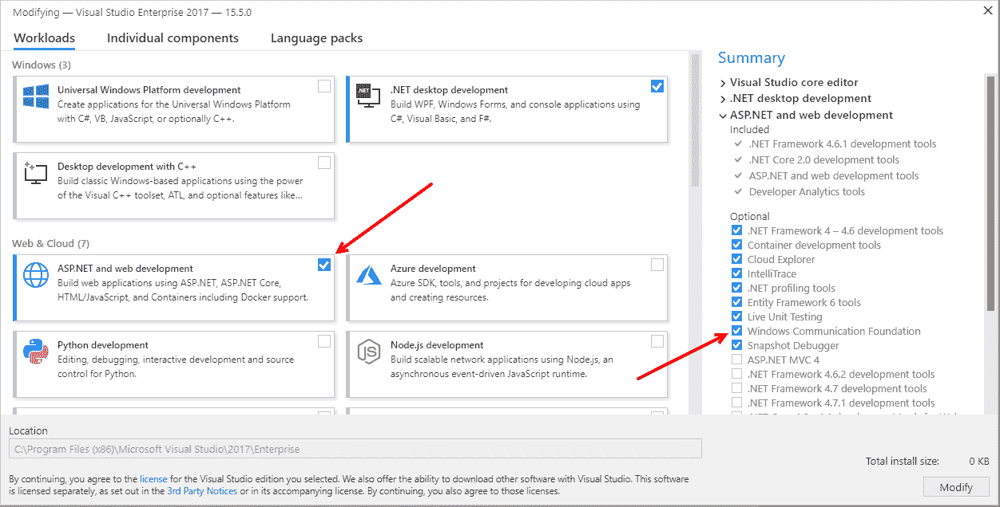

# 创建 WCF 服务

WCF 服务是一个用于处理业务交易的安全服务，它向他人提供当前数据，通过将使用 **Windows Workflow Foundation** 实现的工作流作为 WCF 服务公开。它提供了一个单一的编程模型，以利用功能创建一个针对所有分布式技术的统一解决方案。这意味着您可以编写一次服务，并通过任何格式（默认为 SOAP）在任意传输协议（即 HTTP、TCP、MSMQ、命名管道等）上公开不同的端点以交换消息。

**SOAP**（**简单对象访问协议**）是首选模型之一，其中服务器和客户端之间的通信是通过基于 XML 的数据进行。

在本食谱中，我们将了解 **数据合同**、**数据成员**、**服务合同**、**操作合同**，在创建和连接到 WCF 服务时需要考虑这些内容。当服务引用被引入应用程序项目时，开发者只需配置具有适当端点地址的服务。让我们通过创建一个简单的、基本的 WCF 服务来演示这一点。

## 准备工作

要开始，以管理员权限打开 Visual Studio IDE。在将服务部署到服务器时，这通常很有用。

## 如何操作...

按照以下步骤创建一个简单的 WCF 服务，我们将在本章后面将其集成到 WPF 应用程序中：

1.  首先，创建一个名为 `EmployeeService` 的新项目。在创建项目时使用 WCF 服务应用程序模板。您可以在 WCF 模板类别下找到它，如下面的截图所示：

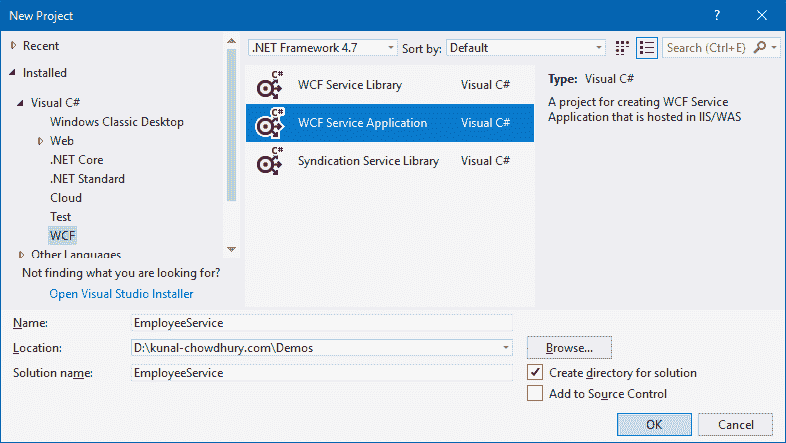

1.  Visual Studio 默认情况下，在项目内部创建了三个服务文件（`IService1.cs`、`Service1.svc` 和 `Service1.svc.cs`）。由于我们将从头开始创建自己的服务，从解决方案资源管理器中，让我们删除这三个文件：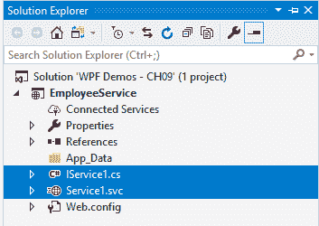

1.  让我们在项目节点内部创建两个文件夹，并将它们命名为 `DataModels` 和 `Services`。这是可选的，但保持代码文件组织良好是一个好主意：

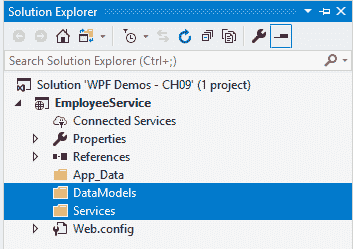

1.  现在，右键单击 DataModels 文件夹，并按照上下文菜单中的“添加 | 类...”选项创建一个名为 `Employee` 的新类文件。

1.  在 `Employee.cs` 文件的类实现中，添加一些类型为 `string` 的公共属性，并分别命名为 `ID`、`FirstName`、`LastName` 和 `Designation`。

1.  将属性 `[DataContract]` 设置在类级别，以指定该类型定义或实现了数据合同，并且可以被序列化器（如 `System.Runtime.Serialization.DataContractSerializer`）序列化。

1.  将属性 `[DataMember]` 设置在您希望成为数据合同一部分的属性上，并通过 `System.Runtime.Serialization.DataContractSerializer` 标记为可序列化。

1.  您需要解析命名空间 `System.Runtime.Serialization`，以便使用 `DataContract` 和 `DataMember` 属性：

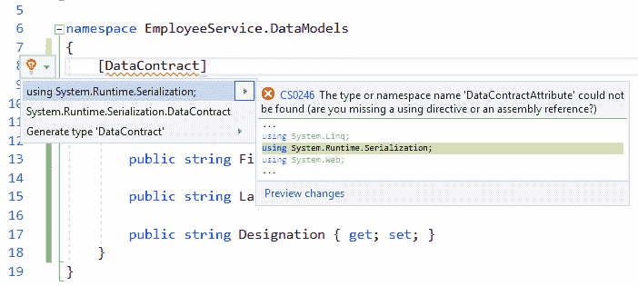

1.  这是完整的代码：

```cs
using System.Runtime.Serialization; 

namespace EmployeeService.DataModels 
{ 
    [DataContract] 
    public class Employee 
    { 
        [DataMember] 
        public string ID { get; set; } 

        [DataMember] 
        public string FirstName { get; set; } 

        [DataMember] 
        public string LastName { get; set; } 

        [DataMember] 
        public string Designation { get; set; } 
    } 
} 
```

1.  现在，右键单击“服务”文件夹，并按照上下文菜单项“添加 | 新项...”创建一个新的服务定义。

1.  从“添加新项”对话框中选择 WCF 服务作为模板。给它一个名称（在我们的例子中是 `EmployeeService`），然后点击添加按钮，如下面的截图所示：

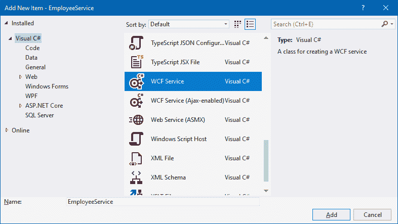

1.  这将在 `Services` 文件夹下创建三个文件：`IEmployeeService.cs`、`EmployeeService.svc` 和 `EmployeeService.svc.cs`：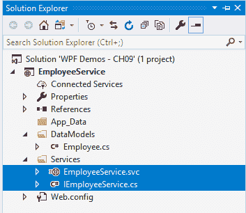

1.  从解决方案资源管理器导航到 `IEmployeeService.cs` 文件，并添加以下 `using` 命名空间声明：

```cs
using EmployeeService.DataModels; 
using System.Collections.Generic; 
using System.ServiceModel; 
```

1.  现在将类定义替换为以下代码片段，它将包含三个操作合约 `GetEmployeeByID`、`GetEmployees` 和 `InsertEmployee`。将接口标记为 `[ServiceContract]`，并将方法标记为 `[OperationContract]`。以下是代码片段供参考：

```cs
[ServiceContract] 
public interface IEmployeeService 
{ 
    [OperationContract] 
    Employee GetEmployeeByID(string empID); 

    [OperationContract] 
    List<Employee> GetEmployees(); 

    [OperationContract] 
    void InsertEmployee(Employee employee); 
} 
```

1.  现在，从解决方案资源管理器导航到 `EmployeeService.svc.cs` 文件，并创建一个类型为 `List<Employee>` 的 `static` 成员变量。让我们称它为 `m_employees`，它将用作我们演示应用程序的静态数据源：

```cs
private static List<Employee> m_employees = new List<Employee>(); 
```

1.  让我们实现接口 `IEmployeeService`，如下所示：

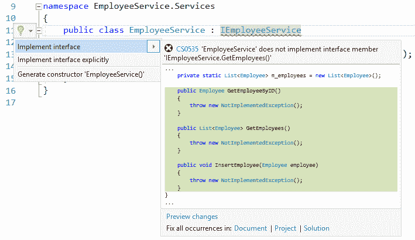

1.  修改方法定义以执行按名称/功能进行的操作。让我们修改它们，它们将看起来像这样：

```cs
public class EmployeeService : IEmployeeService 
{ 
    private static List<Employee> m_employees = new List<Employee>(); 

    public Employee GetEmployeeByID(string empID) 
    { 
        return m_employees.First(emp => emp.ID.Equals(empID)); 
    } 

    public List<Employee> GetEmployees() 
    { 
        return m_employees; 
    } 

    public void InsertEmployee(Employee employee) 
    { 
        m_employees.Add(employee); 
    } 
} 
```

1.  就这样！您的 WCF 服务 `EmployeeService` 现已准备好托管，以便应用程序可以消费它。要检查服务是否可以正常运行，请构建项目，然后在解决方案资源管理器中右键单击 `EmployeeService.svc` 文件，并点击“在浏览器中查看（浏览器名称）”，在我们的例子中是“在浏览器中查看（Firefox）”：

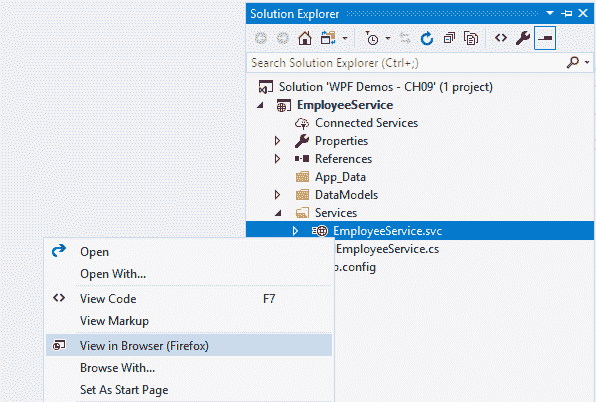

1.  这将启动服务并显示消息“服务已在服务器上托管”。

需要注意的是，如果您从 Visual Studio 运行服务，它将需要管理员权限来打开指定的端口并托管服务。如果您尚未提供管理员权限，请使用“以管理员身份运行”重启 Visual Studio。

1.  一旦服务已在 `localhost` 上托管，这将加载浏览器窗口中的 SVC 文件，它将看起来如下截图所示，这告诉我们服务正在正常运行且没有问题：

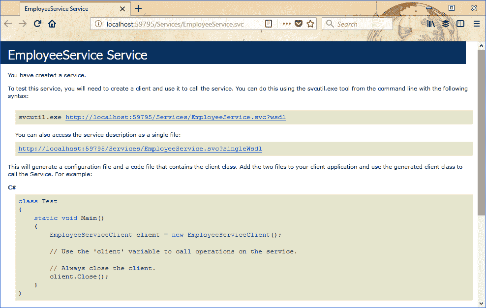

1.  每个服务都提供了一个 **Web 服务描述语言（WSDL**），它定义了包括元数据在内的公共接口，类似于 **接口定义语言（IDA**）。点击链接以生成服务的 WSDL。如果您的浏览器没有在屏幕上显示生成的 WSDL，请复制链接，并在 Internet Explorer 中运行它，这将给出以下 XML 输出：

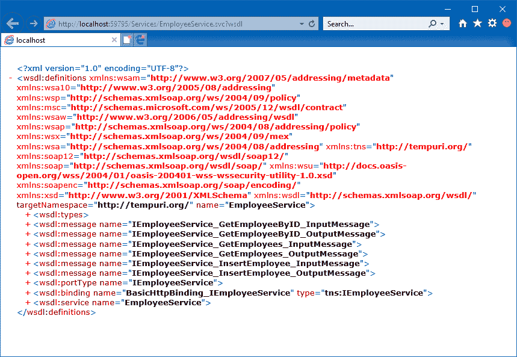

## 它是如何工作的...

在这个简单的 WCF 服务中，我们使用了少量属性。让我们更深入地了解每一个。

### DataContract 属性

数据契约是客户端和服务之间的一种正式协议，抽象地描述了要交换的数据。在 WCF 中，这是序列化对象并将其准备好在客户端和服务之间传递的最常见方式。这是通过使用`[DataContract]`属性标记类来实现的。

值得注意的是，序列化并不局限于与类名和/或类中的属性名完全匹配。您只需简单地使用`DataContract`和`DataMember`属性来定义它们在序列化中的名称。例如，考虑以下代码片段：

`[DataContract (Name = "Employee")]`

`public class EmployeeModel { ... }`

在前面的代码片段中，尽管类名为`EmployeeModel`，但由于使用了属性中的`Name`属性进行名称映射，该类将以`Employee`名称进行序列化。

### DataMember 属性

与此相反，`[DataMember]`属性指定成员是数据契约的一部分，并且可以通过`DataContractSerializer`进行序列化。在定义数据成员属性时，您可以使用以下属性：

+   `Name`：它定义了数据成员的名称

+   `Order`：它设置成员的序列化和反序列化顺序

+   `TypeId`：它为派生类中的此属性设置一个唯一的标识符

+   `IsRequired`：此属性获取或设置一个值，指示在反序列化期间成员必须存在

+   `EmitDefaultValue`：当定义时，此属性值指定是否序列化数据成员的默认值

您应该将`[DataMember]`属性与`[DataContract]`属性一起应用，以标识类型中属于数据契约的成员。

### ServiceContract 属性

`[ServiceContract]`属性用于定义提供服务的接口。一个服务应该至少有一个由`[ServiceContract]`属性装饰的服务契约。以下属性可以与`ServiceContractAttribute`一起使用：

+   `ConfigurationName`：它指定了配置文件中服务元素的名称。

+   `Name`：这指定了 WSDL 元素中契约的名称。

+   `Namespace`：这指定了 WSDL 元素中契约的命名空间。

+   `SessionMode`：这指定了契约是否需要支持会话的绑定。它可以有以下三个值之一：`Allowed`（指定契约支持会话）、`NotAllowed`（指定契约不支持会话）和`Required`（指定契约不需要会话）。

+   `CallbackContract`：此属性指定双工会话中的返回契约。

+   `ProtectionLevel`：这指定了操作在运行时所需的消息级安全。它可以有三种类型：`None`（仅简单身份验证）、`Sign`（签名数据以帮助确保数据完整性）和 `EncryptAndSign`（加密并签名数据以确保传输数据的完整性和机密性）。

+   `HasProtectionLevel`：这表示是否已显式设置 `ProtectionLevel` 属性。

### OperationContract 属性

`[OperationContract]` 属性用于定义服务合同的方法。它放置在您希望包含在服务合同中的方法上。以下属性可以用来控制操作的架构：

+   `Action`：此属性指定了唯一标识操作的动作用户。

+   `ReplyAction`：这指定了操作回复消息的动作。

+   `AsyncPattern`：这表示操作可以异步调用。

+   `ProtectionLevel`：这指定了操作在运行时所需的消息级安全。它可以有三种类型之一——`None`（仅简单身份验证）、`Sign`（签名数据以帮助确保数据完整性）和 `EncryptAndSign`（加密并签名数据以确保传输数据的完整性和机密性）。

+   `HasProtectionLevel`：这表示是否已显式设置 `ProtectionLevel` 属性。

+   `IsOneWay`：此属性指示操作由一个输入消息组成，没有关联的输出消息。

+   `IsInitiating`：这指定了此操作是否可以是会话中的初始操作。

+   `IsTerminating`：这指定了在操作完成后，WCF 是否尝试终止当前会话。

# 自托管 WCF 服务

要使用 WCF 服务，您需要在一个运行时环境中托管它，这样服务宿主就可以监听来自客户端的请求，将请求直接导向服务，并将响应发送回客户端。使用宿主，您可以启动和停止服务。

如果您想自托管一个服务，您必须创建 `System.ServiceModel.ServiceHost` 类的一个实例，并使用端点进行配置。这可以通过代码或配置文件完成。一旦宿主准备就绪，任何客户端都可以通过指定的 URL 访问服务。

自托管可以在任何托管应用程序中完成，例如控制台应用程序、Windows 服务、Windows 窗体应用程序或 **Windows Presentation Foundation**（**WPF**）应用程序。在本菜谱中，我们将学习如何在控制台应用程序中自托管 WCF 服务并执行它。

## 准备工作

要开始，让我们以管理员权限启动 Visual Studio。现在，打开我们之前在上一道菜谱中创建的项目 `CH09.EmployeeService`。确保项目构建成功，并且服务在浏览器中正确启动。记下服务 URL 以供参考，我们将在本菜谱的后续部分使用它。

## 如何操作...

让我们按照以下步骤创建一个自托管的控制台应用程序：

1.  首先，在解决方案内添加一个类型为控制台应用程序的新项目，并将其命名为`CH09.SelfHostingDemo`。

1.  现在，右键单击“引用”节点，并添加服务的项目引用（`CH09.EmployeeService`）：

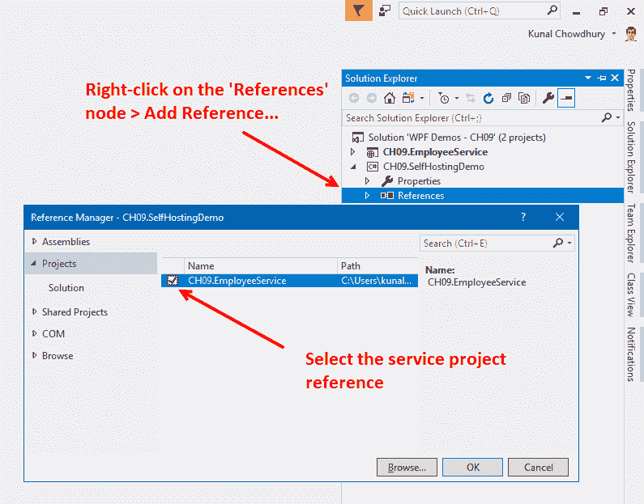

1.  还需将`System.ServiceModel`的程序集引用添加到控制台应用程序项目中。

1.  从“解决方案资源管理器”导航到`Program.cs`文件。

1.  在类文件内添加以下`using`命名空间：

```cs
using CH09.EmployeeService.Services; 
using System; 
using System.ServiceModel; 
using System.ServiceModel.Description; 
```

1.  现在我们需要定义服务 URL，以便我们可以从宿主访问它。在`Program.cs`类文件中创建一个静态成员变量，如下所示：

```cs
private static Uri serviceUrl = new Uri( 
     "http://localhost:59795/Services/EmployeeService"); 
```

1.  `Program`类包含一个静态的`Main`方法。将定义替换为以下代码块：

```cs
static void Main(string[] args) 
{ 
    // create Service Host 
    using (var serviceHost = new ServiceHost( 
       typeof(EmployeeService.Services.EmployeeService),  
       serviceUrl)) 
    { 

        // add the service endpoint 
        serviceHost.AddServiceEndpoint( 
                    typeof(IEmployeeService),  
                    new BasicHttpBinding(), ""); 
        serviceHost.Description.Behaviors.Add( 
                    new ServiceMetadataBehavior  
                    {  
                        HttpGetEnabled = true  
                    }); 

        // start the Service host 
        serviceHost.Open(); 

        Console.WriteLine("Service hosting time: " +  
                          DateTime.Now.ToString()); 
        Console.WriteLine(); 
        Console.WriteLine("Service Host is running..."); 
        Console.WriteLine("Press [Enter] key to stop the host..."); 
        Console.ReadLine(); 

        // close the Service host 
        serviceHost.Close(); 
    } 
} 
```

1.  构建解决方案，并运行控制台应用程序。您将在控制台输出窗口中看到以下输出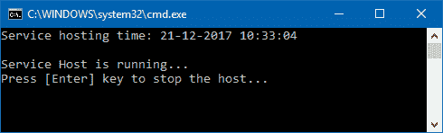

1.  服务现在通过宿主进程进行托管。按*Enter*键停止服务。

## 它是如何工作的...

要托管服务，宿主应用程序使用`System.ServiceModel`命名空间中的`ServiceHost`类。它根据您实现的服务类型进行实例化。在上面的示例中，`ServiceHost`类创建了一个`EmployeeService.Services.EmployeeService`的对象，并在服务完成执行时将其从内存中移除。

如果您在**快速查看窗口**中检查`ServiceHost`对象，您会注意到该对象公开了几个属性。`BaseAddress`属性定义了服务的 URL，它维护一个运行时套接字监听器，监听为创建的服务打开的端口。一旦它收到任何请求，它就会解析传递给它的整个消息并调用服务对象。

这是一张快速查看窗口的截图，显示了`ServiceHost`对象公开的属性数量：

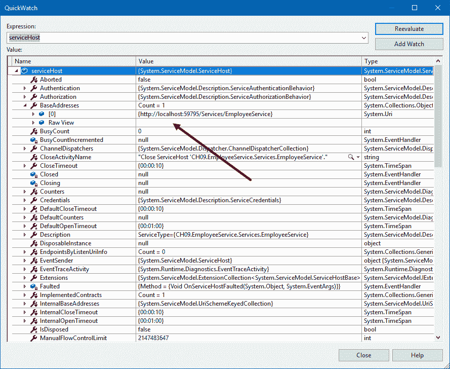

`serviceHost.AddServiceEndpoint`方法向托管服务添加一个具有指定契约、绑定和端点地址的服务端点。您可以根据需求使用任何绑定类型，但在这里我们使用了`BasicHttpBinding`来创建服务端点。

在`BasicHttpBinding`的情况下，传输 SOAP 消息。SOAP 消息包含一个定义良好的封装，其中包含消息的头部和体。当客户端调用服务时，`ServiceHost`类解析消息并通过创建上下文来调用服务。

要查看`ServiceHost`对象使用的端点，请在快速查看窗口中展开`Description`属性，并导航到`Endpoints`。展开服务的第一个端点，并检查其`Address`、`Binding`、`Contract`（"ABC"）属性。它看起来如下所示：

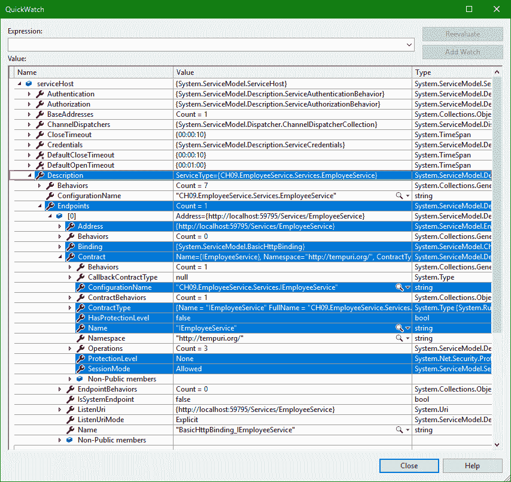

你可以看到，`Address` 指向服务的 `BaseAddress`，`Binding` 表示我们创建的 `BasicHttpBinding`，而 `Contract` 揭示了服务的 `Name`、`ConfigurationName`、`ContractType`、`SessionMode`、`ProtectionLevel`、`HasProtectionLevel` 以及其他属性。

当你准备好时，`serviceHost.Open()` 方法启动服务。它使通信对象从创建状态转换为打开状态。当你完成时，调用 `serviceHost.Close()` 方法停止服务。这将使通信对象从其当前状态转换为关闭状态。

如果你想使服务对象可重用，你可以在服务类中添加一个 `ServiceBehavior` 属性，如下所示：

```cs
[ServiceBehavior(InstanceContextMode =  
                 InstanceContextMode.Single)] 
public class EmployeeService : IEmployeeService 
{ 
    ... 
    ... 
} 
```

当你应用此属性时，它指定了服务合同实现的内部执行行为。指定的 `InstanceContextMode` 可以是三种类型之一：

+   **PerSession**: 每个会话都会创建一个新的 `System.ServiceModel.InstanceContext` 对象。

+   **PerCall**: 在每个调用之前创建一个新的 `System.ServiceModel.InstanceContext` 对象，并在调用之后回收。如果通道没有创建会话，此值的行为类似于 `PerCall`。

+   **Single**: 只使用一个 `System.ServiceModel.InstanceContext` 对象来处理所有传入的调用，并且在调用之后不会回收。如果不存在 `service` 对象，将创建一个新的。

## 还有更多...

如果你没有系统管理员权限，应用程序将因 `System.ServiceModel.AddressAccessDeniedException` 而崩溃，表示 HTTP 无法注册 URL。错误日志将如下所示：

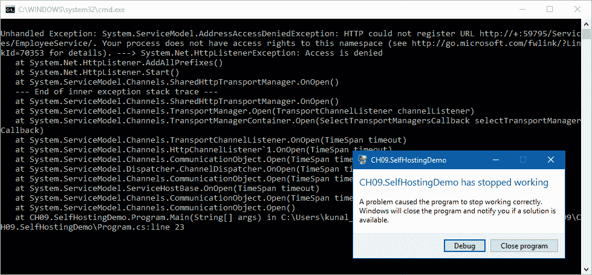

如果你遇到此错误，以管理员权限运行应用程序。如果你直接从 Visual Studio 运行应用程序，请以管理员权限重新启动 Visual Studio。为此，右键单击 Visual Studio 图标并单击“以管理员身份运行”。

# 在 IIS 服务器中托管 WCF 服务

另一种托管 WCF 服务的方式是在 **IIS**（**互联网信息服务**）中。它需要一个具有 `.svc` 扩展名的物理文件来正确托管服务。与之前的配方不同，你不需要编写任何代码来创建 `ServiceHost` 实例。IIS 在托管服务时会自动为你创建它。

在本配方中，我们将学习如何将已创建的服务发布到 Windows 的 IIS 服务器中托管。

## 准备工作

要开始，以管理员权限启动 Visual Studio IDE。为此，右键单击图标并单击“以管理员身份运行”。现在打开我们之前创建的现有项目 `CH09.EmployeeService`。或者，你也可以打开解决方案。

要进一步操作，我们假设你已经熟悉 IIS 并了解如何使用 IIS 管理工具创建和管理 IIS 应用程序。

## 如何操作...

让我们按照以下步骤在 IIS 服务器中托管我们的服务：

1.  首先，您需要检查您打算托管服务的系统上是否已经安装了**IIS**（**互联网信息服务**）。为此，打开控制面板，导航到“启用或关闭 Windows 功能”，如下面的截图所示：

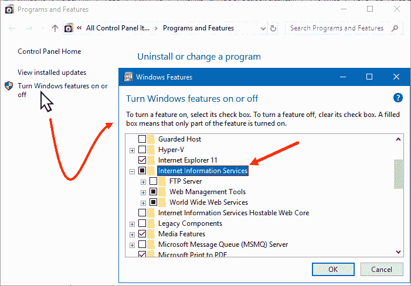

1.  从屏幕上弹出的“Windows 功能”对话框中，确保已选中“互联网信息服务”功能。如果没有，请选中它，然后点击“确定”。这将在该系统上安装 IIS 服务器。

1.  现在，点击**开始**()，输入`inetmgr`，然后点击“互联网信息服务（IIS）管理器”应用程序快捷方式来启动它。请确保默认网站正在运行。在接下来的步骤中，我们将在这个网站上部署我们的服务：

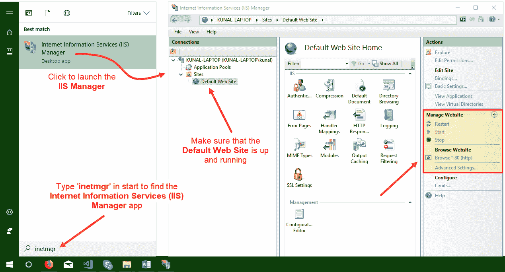

1.  一旦 IIS 安装完成（如果尚未安装）并且 IIS 中的默认网站正在运行，导航回 Visual Studio。

1.  从“解决方案资源管理器”中，右键单击服务项目（`CH09.EmployeeService`）节点，然后点击**发布**：

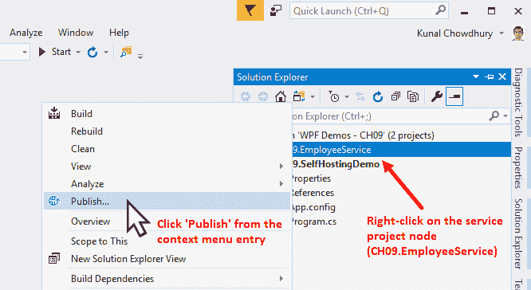

1.  这将在 Visual Studio 内部打开发布向导。导航到“发布”选项卡，选择发布模板为 IIS、FTP 等，然后点击**发布**按钮，如下所示：


1.  这将打开发布对话框。请确保已选中**连接**选项卡：

1. 选择**Web Deploy**作为发布方法类型。

2. 输入服务器的名称。在我们的例子中，因为我们是在同一系统上部署，所以它将是`localhost`。

3. 输入我们打算部署服务的网站名称。在我们的例子中，它是`Default Web Site`。如果我们想在网站内的特定 Web 应用中部署，请在网站名称后输入 Web 应用的名称。例如，要在`Default Web Site`内的`MyApp` Web 应用中部署，这里的网站名称将是`Default Web Site/MyApp`。

4. 输入您将要部署的 Web 服务器的用户名和密码。在我们的例子中，因为它是在`localhost`上，我们不需要输入任何凭据。这两个字段将默认禁用。

5. 点击**验证连接**以确认您输入的发布详情。如果成功，您将在“验证连接”按钮旁边看到一个绿色的勾号。

1.  完成后，点击**下一步**以进入设置页面: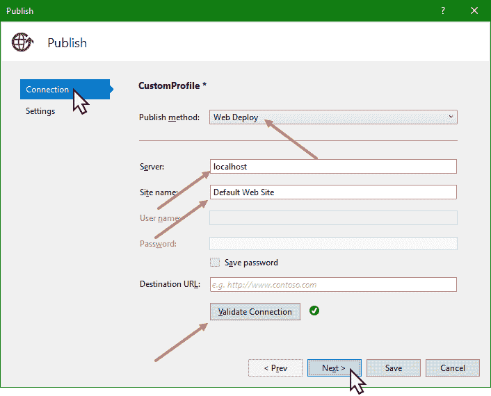

1.  在“设置”页面内，选择“发布”作为配置。根据需要，可选地选择“文件发布选项”。

1.  完成后，点击**保存**以开始发布: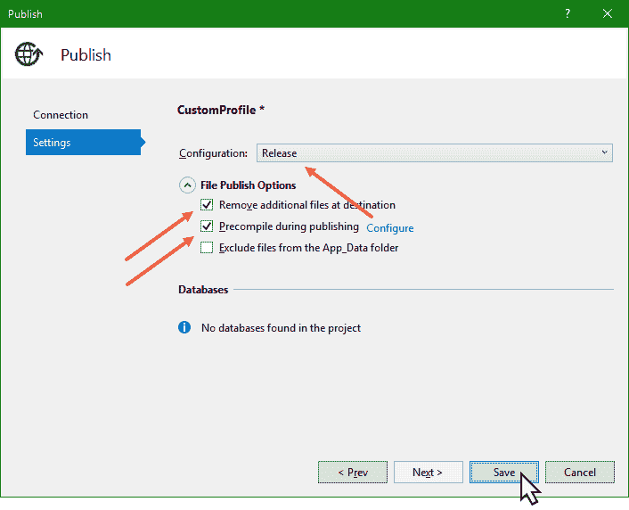

1.  一旦 Visual Studio IDE 构建了解决方案并完成了到所选网站的部署，导航回“互联网信息服务（IIS）管理器”应用程序（`inetmgr`）。

1.  刷新默认网站节点，现在将列出两个文件夹，分别命名为 bin 和 Services。单击 Services 文件夹，切换到内容视图。这将列出 `EmployeeService.svc` 文件，它位于其中。以下是这个截图：

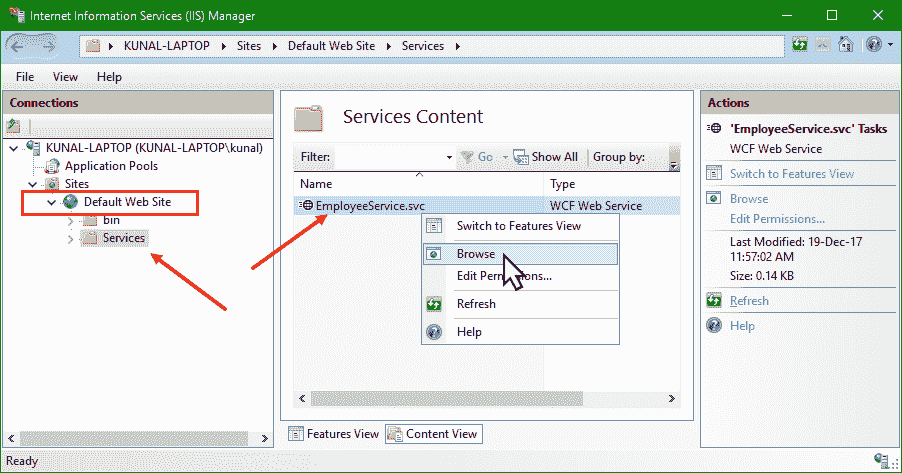

1.  如前一个截图所示，右键单击 `EmployeeService.svc` 文件，然后从上下文菜单中单击浏览。或者，您也可以单击右侧操作窗格中的浏览链接。

1.  这将在浏览器窗口中打开服务 URL，如下所示：

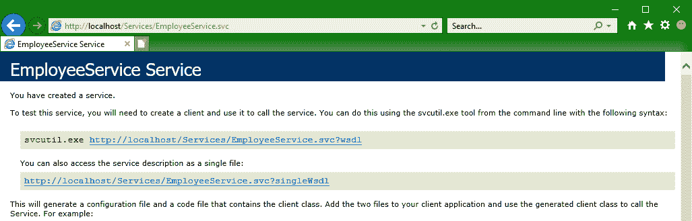

## 它是如何工作的...

IIS 托管与 ASP.NET 集成，并使用进程回收、进程健康监控、基于消息的激活等功能。IIS 还提供集成管理性，使其成为企业级服务器。

要在 IIS 中托管服务，IIS 需要正确配置。对于 IIS 托管，不需要编写额外的代码。在 IIS 中托管的 WCF 服务在 IIS 应用程序中以 `.svc` 文件的形式表示。`.svc` 文件包含一个 WCF 特定的处理指令，即 `@ServiceHost`，它创建服务宿主并允许 WCF 服务的托管结构在接收到传入消息时激活：

```cs
<%@ ServiceHost  
    Language="C#"  
    Debug="true"  
    Service="CH09.EmployeeService.Services.EmployeeService"  
    CodeBehind="EmployeeService.svc.cs"  
%> 
```

`Service` 属性的值是服务实现的完全限定 CLR 类型名（在我们的例子中，它是 `CH09.EmployeeService.Services.EmployeeService`）。`CodeBehind` 属性定义了 `.svc` 文件背后的代码的相对路径，在我们的例子中是 `EmployeeService.svc.cs`。

当部署一个服务时，预编译的 `.dll` 文件被部署在应用程序的 `bin` 目录中，并且只有当类库的最新版本被部署时才会更新。

未编译的源文件被部署在应用程序的 `App_Code` 目录中。当应用程序收到第一个请求时，这些未编译的源文件会动态加载到内存中。对已部署源文件的任何更改都会导致整个应用程序被回收。当应用程序收到新的请求时，会自动进行新鲜的重编译。

# 在 WPF 应用程序中集成 WCF 服务

一旦创建了一个 WCF 服务，您可能希望将其集成到客户端应用程序中。但在那之前，您将不得不创建一个 WCF 客户端代理，这样您就可以通过 WCF 客户端代理与该服务进行通信。

在这个菜谱中，我们将学习如何创建代理客户端，并通过服务与客户端之间传递消息。

## 准备工作

在进入集成服务的步骤之前，我们需要创建一个客户端应用程序。打开您的 Visual Studio IDE，创建一个新的 WPF 项目。将其命名为 `CH09.ClientDemo`。

## 如何做...

按照以下步骤创建服务代理并在客户端应用程序中集成服务调用：

1.  右键单击项目节点（`CH09.ClientDemo`），然后按照上下文菜单路径添加 | 服务引用...，这将打开屏幕上的添加服务引用对话框：

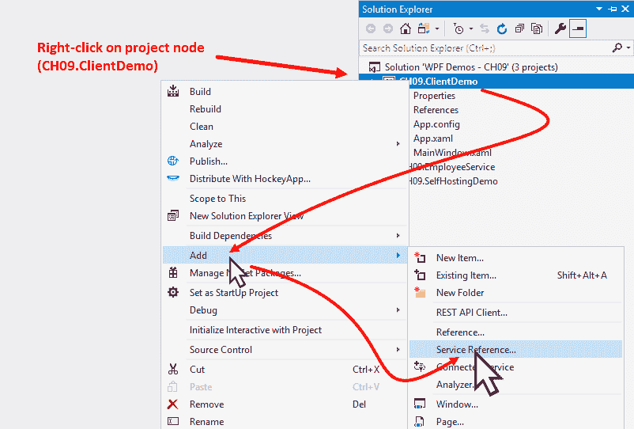

1.  在添加服务引用对话框中，在地址字段中输入服务 URL（`http://localhost:59795/Services/EmployeeService.svc`），然后单击 Go 按钮：

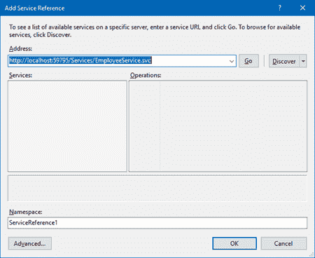

1.  这将解析服务地址并显示其详细信息。

1.  如以下截图所示，将`EmployeeServiceReference`作为服务代理的命名空间输入，然后单击确定：

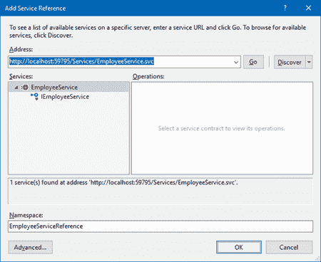

1.  这将在项目下创建服务代理作为已连接的服务：

1.  构建项目以确保没有编译问题。

1.  一旦构建成功，导航到`MainWindow.xaml.cs`文件。

1.  创建一个类型为`ObservableCollection<Employee>`的依赖属性，并将其命名为`Employees`。属性实现如下：

```cs
public ObservableCollection<Employee> Employees 
{ 
    get 
    { 
        return (ObservableCollection<Employee>) 
                    GetValue(EmployeesProperty); 
    } 
    set 
    { 
        SetValue(EmployeesProperty, value); 
    } 
} 

public static readonly DependencyProperty  
       EmployeesProperty =  
            DependencyProperty.Register( 
               "Employees",  
               typeof(ObservableCollection<Employee>),  
               typeof(MainWindow),  
               new PropertyMetadata(null)); 
```

1.  现在，解析`Employee`类的引用，这将添加`CH09.ClientDemo.EmployeeServiceReference`作为`using`命名空间：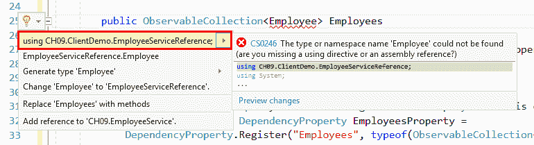

1.  确保在类文件中添加以下`using`命名空间：

```cs
using CH09.ClientDemo.EmployeeServiceReference; 
using System.Collections.ObjectModel; 
using System.Windows; 
```

1.  在类内部，创建以下代理客户端的静态实例，以便我们可以调用服务 API：

```cs
private static EmployeeServiceClient client =  
                       new EmployeeServiceClient(); 
```

1.  现在，在类内部添加以下两个方法，并确保将方法标记为`async`：

```cs
private async void RefreshListAsync() 
{ 
    var result = await client.GetEmployeesAsync(); 
    Employees = new ObservableCollection<Employee>(result); 
} 

private async void AddNewEmployeeAsync() 
{ 
    var employee = new Employee 
    { 
        ID = "EMP00" + (Employees.Count + 1), 
        FirstName = "User", 
        LastName = (Employees.Count + 1).ToString(), 
        Designation = "Software Engineer" 
    }; 

    await client.InsertEmployeeAsync(employee); 
} 
```

1.  从解决方案资源管理器中，导航到`MainWindow.xaml`文件。

1.  通过添加`x:Name="window"`属性为`Window`实例命名。

1.  将默认的`Grid`分为两行，如下所示：

```cs
<Grid.RowDefinitions> 
    <RowDefinition Height="*"/> 
    <RowDefinition Height="Auto"/> 
</Grid.RowDefinitions> 
```

1.  在`Grid`面板的第一行中添加一个`DataGrid`，并在`ItemsSource`属性和`Employees`集合之间创建数据绑定。这将使用`Employees`集合中的值填充`DataGrid`。

1.  设置`AutoGenerateColumns="False"`、`CanUserAddRows="False"`和`CanUserDeleteRows="False"`，如下所示：

```cs
<DataGrid ItemsSource="{Binding Employees,  
                        ElementName=window}" 
          Grid.Row="0"  
          AutoGenerateColumns="False" 
          CanUserAddRows="False" 
          CanUserDeleteRows="False"> 
    <DataGrid.Columns> 

    </DataGrid.Columns> 
</DataGrid> 
```

1.  由于我们已经要求`DataGrid`不要自动生成列，因此我们需要根据需要手动创建它们。在这个演示中，我们将在`DataGrid`中仅显示`ID`、`Name`和`Designation`列。让我们添加以下列，其中，名称列将与`Employee`类的`FirstName`和`LastName`属性进行多绑定，以显示员工的完整姓名。以下是供您参考的代码：

```cs
<DataGrid.Columns> 
    <DataGridTextColumn Header="ID"  
                        Width="80" 
                        Binding="{Binding ID}"/> 
    <DataGridTextColumn Header="Name" 
                        Width="200"> 
        <DataGridTextColumn.Binding> 
            <MultiBinding StringFormat="{}{0} {1}"> 
                <Binding Path="FirstName"/> 
                <Binding Path="LastName"/> 
            </MultiBinding> 
        </DataGridTextColumn.Binding> 
    </DataGridTextColumn> 
    <DataGridTextColumn Header="Designation"  
                        Width="150" 
                        Binding="{Binding Designation}"/> 
</DataGrid.Columns> 
```

1.  在`Grid`面板的第二行中，让我们添加一个包含两个按钮的水平`StackPanel`。将它们标记为刷新和添加。同时，公开两个按钮的`Click`事件：

```cs
<StackPanel Orientation="Horizontal" 
            Grid.Row="1" 
            Margin="8"> 
    <Button Content="Refresh" 
            Margin="4" 
            Height="26" 
            Width="80" 
            Click="OnRefreshClicked"/> 
    <Button Content="Add" 
            Margin="4" 
            Height="26" 
            Width="80" 
            Click="OnAddClicked"/> 
</StackPanel> 
```

1.  在`MainWindow.xaml`文件的代码背后（即`MainWindow.xaml.cs`），为两个按钮编写`Click`事件实现。`OnRefreshClicked`事件将调用`RefreshListAsync()`方法以获取员工列表。`OnAddClicked`事件将调用`AddNewEmployeeAsync()`方法以调用服务插入新的员工记录，然后调用`RefreshListAsync()`方法从服务获取当前的员工列表：

```cs
private void OnRefreshClicked(object sender,  
                              RoutedEventArgs e) 
{ 
    RefreshListAsync(); 
} 

private void OnAddClicked(object sender,  
                          RoutedEventArgs e) 
{ 
    AddNewEmployeeAsync(); 
    RefreshListAsync(); 
} 
```

1.  让我们构建项目并运行应用程序。确保服务已经运行并且可访问。

1.  你将在屏幕上看到以下应用程序 UI：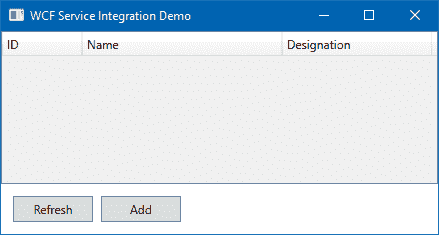

1.  点击添加按钮。这将创建一个新的员工记录并将其传递给服务以存储在数据库中，在我们的案例中是静态的`m_employees`实例。

1.  在插入记录后，它将再次调用服务以获取新插入的详细信息并填充 UI 中的`DataGrid`。点击添加按钮多次将增加记录数量并相应地填充`DataGrid`：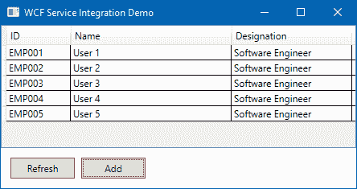

## 它是如何工作的...

WCF 客户端代理可以通过使用`SVCUtil.exe`（**服务模型元数据工具**）手动生成。这是一个用于从服务元数据生成代码的命令行工具。以下命令可以用来生成代理代码：`svcutil.exe <Service URL>`。

如果你想要为我们之前创建的服务创建代理客户端，你可以在控制台窗口中输入以下命令：

```cs
svcutil.exe http://localhost:59795/Services/
EmployeeService.svc?wsdl 
```

或者，你也可以从 Visual Studio 生成客户端代理。如前所述，添加服务引用功能会自动生成代理代码。一旦你点击插入服务地址后的“Go”按钮，对话框将显示指定地址上可用的服务列表。当你点击“OK”按钮时，它开始生成代码。

在我们的案例中，**服务模型元数据工具**和 Visual Studio 的添加服务引用对话框（你可以使用其中的任何一个）为我们生成以下 WCF 客户端类（`EmployeeServiceClient`），它继承自泛型`System.ServiceModel.ClientBase<TChannel>`类并实现了`CH09.ClientDemo.EmployeeServiceReference.IEmployeeService`接口：

```cs
[System.Diagnostics.DebuggerStepThroughAttribute()] 
[System.CodeDom.Compiler.GeneratedCodeAttribute( 
 "System.ServiceModel", "4.0.0.0")] 
public partial class EmployeeServiceClient : System.ServiceModel.ClientBase<CH09.ClientDemo.EmployeeServiceReference.IEmployeeService>, CH09.ClientDemo.EmployeeServiceReference.IEmployeeService 
{         
    public EmployeeServiceClient() { 
    } 

    public EmployeeServiceClient(string  
    endpointConfigurationName)  
             : base(endpointConfigurationName) { 
    } 

    public EmployeeServiceClient(string 
    endpointConfigurationName,  
           string remoteAddress)  
             : base(endpointConfigurationName, remoteAddress) { 
    } 

    public EmployeeServiceClient(string 
    endpointConfigurationName,  
           System.ServiceModel.EndpointAddress remoteAddress)  
             : base(endpointConfigurationName, remoteAddress) { 
    } 

    public EmployeeServiceClient
    (System.ServiceModel.Channels.Binding binding, 
    System.ServiceModel.EndpointAddress remoteAddress)  
             : base(binding, remoteAddress) { 
    } 

    public CH09.ClientDemo.EmployeeServiceReference.Employee  
      GetEmployeeByID(string empID) { 
        return base.Channel.GetEmployeeByID(empID); 
    } 

    public System.Threading.Tasks.Task<CH09.
    ClientDemo.EmployeeServiceReference.Employee>   
    GetEmployeeByIDAsync(string empID) { 
        return base.Channel.GetEmployeeByIDAsync(empID); 
    } 

    public CH09.ClientDemo.EmployeeServiceReference.Employee[] 
    GetEmployees() { 
        return base.Channel.GetEmployees(); 
    } 

    public System.Threading.Tasks.Task<CH09.
    ClientDemo.EmployeeServiceReference.Employee[]> 
    GetEmployeesAsync() { 
        return base.Channel.GetEmployeesAsync(); 
    } 

    public void InsertEmployee(CH09.ClientDemo.
    EmployeeServiceReference.Employee employee) { 
        base.Channel.InsertEmployee(employee); 
    } 

    public System.Threading.Tasks.Task InsertEmployeeAsync
   (CH09.ClientDemo.EmployeeServiceReference.Employee employee) { 
        return base.Channel.InsertEmployeeAsync(employee); 
    } 
} 
```

一旦创建服务代理，你就可以创建服务客户端的实例并调用服务的方法。在我们的例子中，我们创建了以下服务客户端实例并将其标记为`static`：

```cs
private static EmployeeServiceClient client =  
                       new EmployeeServiceClient(); 
```

客户端对于服务公开的每个操作合约都有两种 API 方法类型。其中一个是同步方法，而另一个是异步方法。例如，你可以看到`GetEmployees()`和`GetEmployeesAsync()`方法，如以下截图所示：

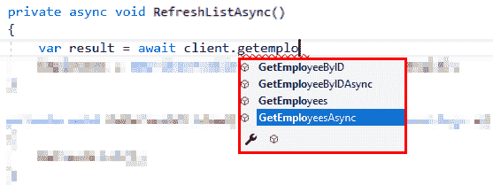

当您想以同步方式调用服务时，请调用`GetEmployees()`方法。如果您想以异步模式操作，请调用`GetEmployeesAsync()`方法。同样，根据同步和异步模式，您可以通过选择`GetEmployeeByID`和`GetEmployeeByIDAsync`来根据 ID 获取员工详细信息。其他服务方法的情况也类似。

## 还有更多...

WCF 服务客户端可能会抛出一个或多个异常，您必须在您的代码中处理这些异常。其中一些最常见的异常包括：

+   `SocketException`：当远程主机强制关闭现有连接时可能会发生此异常

+   `CommunicationException`：当底层连接意外关闭时可能会发生此异常

+   `CommunicationObjectAbortedException`：当由于处理您的消息时出现错误、处理请求时超时或底层网络问题而导致套接字连接被中止时可能会发生此异常
