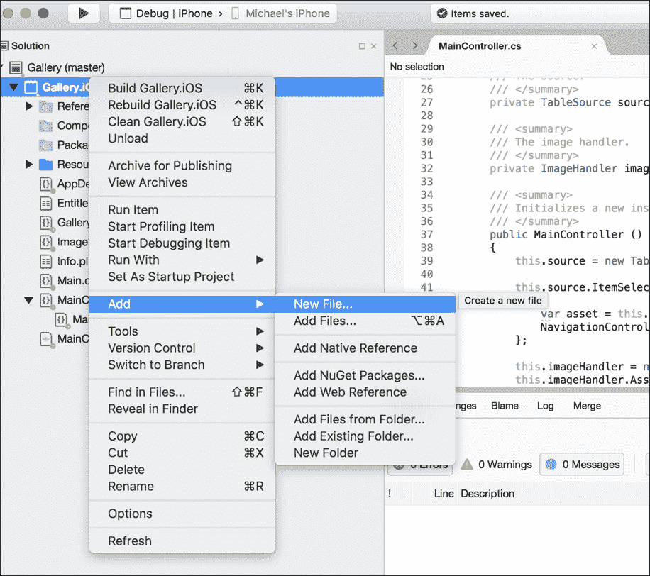
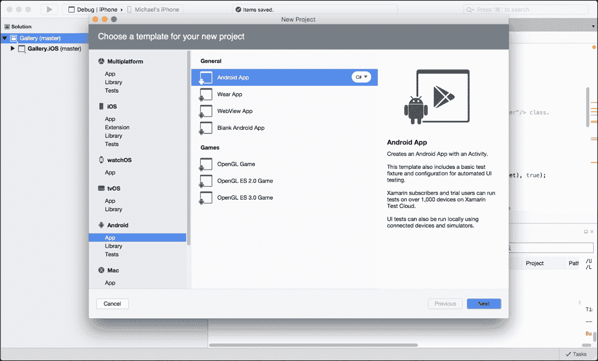
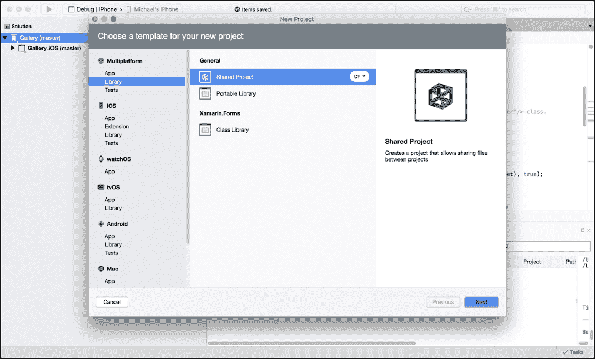
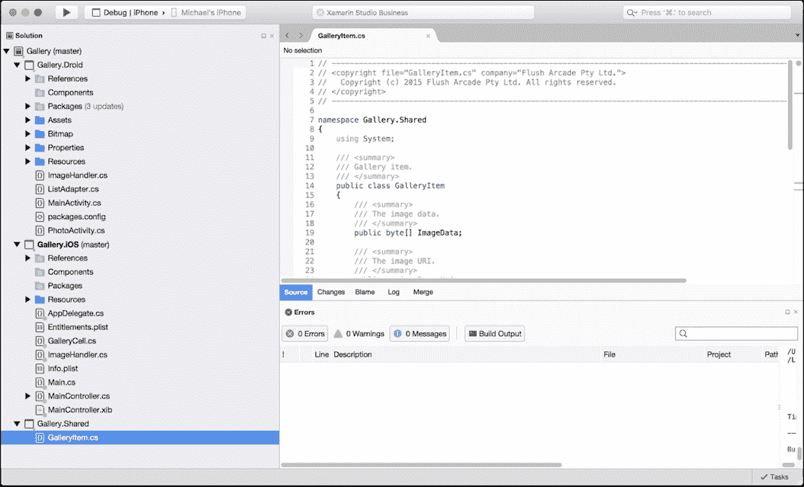
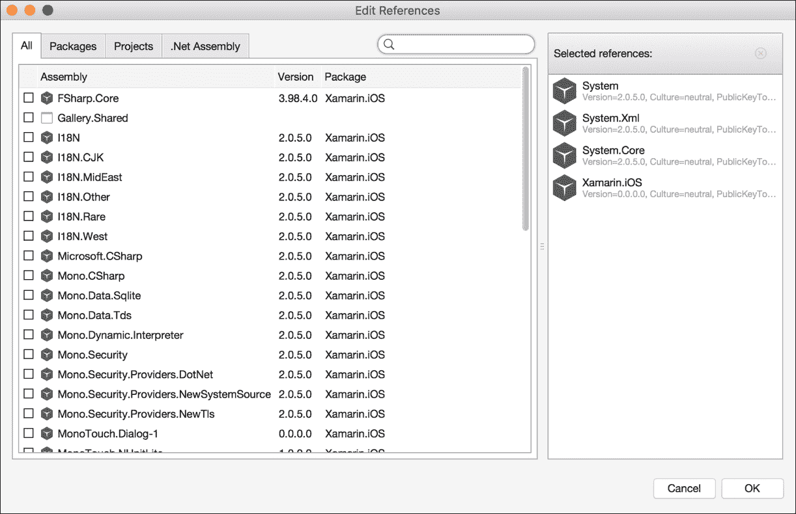

# 第一章. 构建画廊应用程序

本章将通过构建一个 iOS 和 Android 应用程序来演示使用 Xamarin 的原生开发，该应用程序将读取你的本地画廊文件，并在**UITableView**和**ListView**中显示它们。本章将涵盖以下主题：

预期知识：

+   创建 iOS 配置证书

+   iOS 开发

+   Objective-C

+   创建密钥库

+   Android 开发

+   Java

在本章中，你将学习以下内容：

+   创建 iOS 项目

+   创建 UIViewController 和 UITableView

+   自定义单元格外观

+   创建 Android 项目

+   创建 XML 界面和 ListView

+   共享项目

+   自定义行外观

+   位图函数

+   ALAssetLibrary

+   添加 iOS 照片屏幕

+   添加 Android 照片屏幕

# 创建 iOS 项目

让我们开始我们的 Xamarin 之旅；我们将从在 Xamarin Studio 中设置我们的 iOS 项目开始：

1.  首先，打开 Xamarin Studio 并创建一个新的 iOS 项目。为此，我们只需选择**文件** | **新建** | **解决方案**，然后选择**iOS 单视图应用程序**；我们还必须给它一个名称，并添加你想要运行的程序的捆绑 ID。

    ### 注意

    建议为每个项目创建一个新的捆绑 ID，并为每个项目创建一个开发者配置文件。

1.  现在我们已经创建了 iOS 项目，你将被带到以下屏幕：


这看起来是不是很熟悉？是的，这是我们`AppDelegate`文件；注意末尾的`.cs`；因为我们使用 C#，所以所有代码文件都将有这个扩展名（不再有`.h`或`.m`文件）。

### 小贴士

在我们继续之前，花几分钟在 IDE 中移动，展开文件夹，并探索项目结构；它与在 XCode 中创建的 iOS 项目非常相似。

# 创建 UIViewController 和 UITableView

现在我们有了新的 iOS 项目，我们将从创建一个`UIViewController`开始。右键单击项目文件，选择**添加** | **新建文件**，然后在左侧框中从**iOS**菜单选择**ViewController**：



你会注意到生成了三个文件，一个`.xib`文件，一个`.cs`文件和一个`.designer.cs`文件。我们不需要担心第三个文件；这个文件是基于其他两个文件自动生成的。

### 小贴士

右键单击项目项并选择**在 Finder 中显示**，


这将打开 Finder，你将双击`GalleryCell.xib`文件；这将打开 XCode 中的用户界面设计器。你应该在文档中看到自动插入的文本，以帮助你开始。

首先，我们必须相应地设置我们的命名空间，并使用 using 语句导入我们的库。为了使用 iOS 用户界面元素，我们必须导入`UIKit`和`CoreGraphics`库。我们的类将继承`UIViewController`类，并在其中重写`ViewDidLoad`函数：

```cs
namespace Gallery.iOS  
{ 
    using System; 
    using System.Collections.Generic; 

    using CoreGraphics; 
    using UIKit; 

    public partial class MainController : UIViewController 
    { 
        private UITableView _tableView; 

        private TableSource _source; 

        private ImageHandler _imageHandler; 

        public MainController () : base ("MainController", null) 
        { 
            _source = new TableSource (); 

            _imageHandler = new ImageHandler (); 
            _imageHandler.AssetsLoaded += handleAssetsLoaded; 
        } 

        private void handleAssetsLoaded (object sender, EventArgs e) 
        { 
            _source.UpdateGalleryItems (_imageHandler.CreateGalleryItems()); 
            _tableView.ReloadData (); 
        } 

        public override void ViewDidLoad () 
        { 
            base.ViewDidLoad (); 

            var width = View.Bounds.Width; 
            var height = View.Bounds.Height; 

            tableView = new UITableView(new CGRect(0, 0, width, height)); 
            tableView.AutoresizingMask = UIViewAutoresizing.All; 
            tableView.Source = _source; 

            Add (_tableView); 
        } 
    } 
} 

```

我们创建的第一个 UI 元素是`UITableView`。这将用于插入到`UIViewController`的`UIView`中，并且我们也会检索`UIView`的宽度和高度值来拉伸`UITableView`以适应`UIViewController`的整个边界。我们还必须调用`Add`来将`UITableView`插入到`UIView`中。为了填充列表中的数据，我们需要创建一个`UITableSource`来包含要显示在列表中的项目列表。我们还需要一个名为`GalleryModel`的对象；这将是我们要在每个单元格中显示的数据模型。

按照之前的步骤添加两个新的`.cs`文件；一个将用于创建我们的`UITableSource`类，另一个用于`GalleryModel`类。在`TableSource.cs`中，首先我们必须使用 using 语句导入`Foundation`库：

```cs
using Foundation; 

```

现在是其余的类。记住，我们必须为我们的`UITableSource`重写特定函数来描述其行为。它还必须包括一个列表来包含将用于每个单元格中显示的数据的项视图模型：

```cs
public class TableSource : UITableViewSource  
    { 
        protected List<GalleryItem> galleryItems; 
        protected string cellIdentifier = "GalleryCell"; 

        public TableSource (string[] items) 
        { 
            galleryItems = new List<GalleryItem> (); 
        } 
    } 

```

我们必须重写`NumberOfSections`函数；在我们的情况下，它将始终是 1，因为我们没有列表部分：

```cs
        public override nint NumberOfSections (UITableView tableView) 
        { 
            return 1; 
        } 

```

为了确定列表项的数量，我们返回列表的计数：

```cs
        public override nint RowsInSection (UITableView tableview, nint section) 
        { 
            return galleryItems.Count; 
        } 

```

然后我们必须添加`GetCell`函数；这将用于获取用于渲染特定行的`UITableViewCell`。但在我们这样做之前，我们需要创建一个自定义的`UITableViewCell`。

# 自定义单元格的外观

我们现在将设计将出现在`TableSource`类中每个模型上的单元格。为我们的自定义`UITableViewCell`添加一个新的`.cs`文件。

### 注意

我们不会使用`.xib`，而是直接在代码中使用单个`.cs`文件构建用户界面。

现在是实施阶段：

```cs
public class GalleryCell: UITableViewCell   
    { 
        private UIImageView _imageView; 

        private UILabel _titleLabel; 

        private UILabel _dateLabel; 

        public GalleryCell (string cellId) : base (UITableViewCellStyle.Default, cellId) 
        { 
            SelectionStyle = UITableViewCellSelectionStyle.Gray; 

            _imageView = new UIImageView() 
            { 
                TranslatesAutoresizingMaskIntoConstraints = false, 
            }; 

            _titleLabel = new UILabel ()  
            { 
                TranslatesAutoresizingMaskIntoConstraints = false, 
            }; 

            _dateLabel = new UILabel ()  
            { 
                TranslatesAutoresizingMaskIntoConstraints = false, 
            }; 

            ContentView.Add (imageView); 
            ContentView.Add (titleLabel); 
            ContentView.Add (dateLabel); 
        } 
    } 

```

我们的构造函数必须调用基构造函数，因为我们需要用单元格样式和单元格标识符初始化每个单元格。然后我们为每个单元格添加一个`UIImageView`和两个`UILabel`，一个用于文件名，一个用于日期。最后，我们将所有三个元素添加到单元格的主要内容视图中。

当我们有我们的初始化器时，我们添加以下内容：

```cs
public void UpdateCell (GalleryItem gallery) 
        { 
            _imageView.Image = UIImage.LoadFromData (NSData.FromArray (gallery.ImageData)); 
            _titleLabel.Text = gallery.Title; 
            _dateLabel.Text = gallery.Date; 
        } 

        public override void LayoutSubviews () 
        { 
            base.LayoutSubviews (); 

            ContentView.TranslatesAutoresizingMaskIntoConstraints = false; 

            // set layout constraints for main view 
            AddConstraints (NSLayoutConstraint.FromVisualFormat("V:|[imageView(100)]|", NSLayoutFormatOptions.DirectionLeftToRight, null, new NSDictionary("imageView", imageView))); 
            AddConstraints (NSLayoutConstraint.FromVisualFormat("V:|[titleLabel]|", NSLayoutFormatOptions.DirectionLeftToRight, null, new NSDictionary("titleLabel", titleLabel))); 
            AddConstraints (NSLayoutConstraint.FromVisualFormat("H:|-10-[imageView(100)]-10-[titleLabel]-10-|", NSLayoutFormatOptions.AlignAllTop, null, new NSDictionary ("imageView", imageView, "titleLabel", titleLabel))); 
            AddConstraints (NSLayoutConstraint.FromVisualFormat("H:|-10-[imageView(100)]-10-[dateLabel]-10-|", NSLayoutFormatOptions.AlignAllTop, null, new NSDictionary ("imageView", imageView, "dateLabel", dateLabel))); 
        } 

```

我们的第一个函数`UpdateCell`简单地将模型数据添加到视图中，我们的第二个函数重写了`UITableViewCell`类的`LayoutSubViews`方法（相当于`UIViewController`的`ViewDidLoad`函数）。

现在我们有了单元格设计，让我们创建视图模型所需的属性。我们只想在我们的`GalleryItem`模型中存储数据，这意味着我们想将图像存储为字节数组。让我们为项目模型创建一个属性：

```cs
namespace Gallery.iOS 
{ 
    using System; 

    public class GalleryItem 
    { 
        public byte[] ImageData; 

        public string ImageUri; 

        public string Title; 

        public string Date; 

        public GalleryItem () 
        { 
        } 
    } 
} 

```

现在回到我们的`TableSource`类。下一步是实现`GetCell`函数：

```cs
public override UITableViewCell GetCell (UITableView tableView, NSIndexPath indexPath) 
        { 
            var cell = (GalleryCell)tableView.DequeueReusableCell (CellIdentifier); 
            var galleryItem = galleryItems[indexPath.Row]; 

            if (cell == null) 
            {  
                // we create a new cell if this row has not been created yet 
                cell = new GalleryCell (CellIdentifier);  
            } 

            cell.UpdateCell (galleryItem); 

            return cell; 
        } 

```

注意`if`语句中的单元格重用；你应该熟悉这种类型的方法，这是重用单元格视图的常见模式，与 Objective-C 实现相同（这是一个非常基本的单元格重用实现）。我们还调用`UpdateCell`方法来传递所需的`GalleryItem`数据以在单元格中显示。让我们也为所有单元格设置一个固定的高度。将以下内容添加到你的`TableSource`类中：

```cs
public override nfloat GetHeightForRow (UITableView tableView, NSIndexPath indexPath) 
        { 
            return 100; 
        } 

```

那么，接下来是什么？

```cs
public override void ViewDidLoad () 
{ 
.. 
table.Source = new TableSource(); 
.. 
} 

```

让我们停止开发，看看我们到目前为止取得了什么成果。我们已经创建了我们的第一个`UIViewController`、`UITableView`、`UITableViewSource`和`UITableViewCell`，并将它们全部绑定在一起。太棒了！

我们现在需要访问手机的本地存储以提取所需的画廊项目。但在我们这样做之前，我们将创建一个 Android 项目并复制我们在 iOS 中完成的事情。

# 创建一个 Android 项目

我们的第一步是创建一个新的通用 Android 应用程序：



你将首先到达的屏幕是`MainActivity`。这是我们起始活动，它将填充第一个用户界面；请注意配置属性：

```cs
[Activity (Label = "Gallery.Droid", MainLauncher = true, Icon = "@mipmap/icon")] 

```

`MainLauncher`标志指示起始活动；一个活动必须将此标志设置为`true`，以便应用程序知道要首先加载哪个活动。`icon`属性用于设置应用程序图标，而`Label`属性用于设置出现在导航栏左上角的文本：

```cs
namespace Gallery.Droid 
{ 
    using Android.App; 
    using Android.Widget; 
    using Android.OS; 

    [Activity (Label = "Gallery.Droid", MainLauncher = true, Icon = "@mipmap/icon")] 
    public class MainActivity : Activity 
    { 
        int count = 1; 

        protected override void OnCreate (Bundle savedInstanceState) 
        { 
            base.OnCreate (savedInstanceState); 

            // Set our view from the "main" layout resource 
            SetContentView (Resource.Layout.Main); 
        } 
    } 
} 

```

我们活动的公式与 Java 相同；我们必须为每个活动重写`OnCreate`方法，在那里我们将填充第一个 XML 界面`Main.xml`。

# 创建 XML 界面和 ListView

我们的起点是`main.xml`表单；这是我们将在其中创建`ListView`的地方：

```cs
<?xml version="1.0" encoding="utf-8"?> 
<LinearLayout  
    android:orientation="vertical" 
    android:layout_width="fill_parent" 
    android:layout_height="fill_parent"> 
    <ListView 
        android:id="@+id/listView" 
        android:layout_width="fill_parent" 
        android:layout_height="fill_parent" 
        android:layout_marginBottom="10dp" 
        android:layout_marginTop="5dp" 
        android:background="@android:color/transparent" 
        android:cacheColorHint="@android:color/transparent" 
        android:divider="#CCCCCC" 
        android:dividerHeight="1dp" 
        android:paddingLeft="2dp" /> 
</LinearLayout> 

```

### 小贴士

`main.xml`文件应该已经位于`资源` | `布局`目录中，所以只需将之前的代码复制粘贴到这个文件中。

太好了！我们现在有了我们的起始活动和界面，所以现在我们必须为我们的`ListView`创建一个`ListAdapter`。适配器的工作方式非常类似于`UITableSource`，我们必须重写函数来确定单元格数据、行设计和列表中的项目数量。

### 注意

Xamarin Studio 也拥有一个 Android GUI 设计器。

右键点击 Android 项目，为我们的适配器类添加一个新的空类文件。我们的类必须继承`BaseAdapter`类，并且我们将重写以下函数：

```cs
public override long GetItemId(int position); 

public override View GetView(int position, View convertView, ViewGroup parent); 

```

在我们继续之前，我们需要为用于在每一行中展示的数据创建一个模型。在我们的 iOS 项目中，我们创建了一个`GalleryItem`来保存创建每个`UIImage`所使用的字节数据。这里有两种方法：我们可以创建另一个对象来做与`GalleryItem`相同的事情，或者更好的是，为什么不用共享项目来重用这个对象呢？

# 共享项目

我们将深入探讨在不同平台之间共享代码的第一种技术。这正是 Xamarin 希望我们实现并尽可能重用代码。原生开发的最大缺点是两种不同的语言，我们无法重用任何东西。

让我们创建我们的第一个共享项目：



我们共享的项目将用于包含`GalleryItem`模型，因此我们在这个共享项目中包含的任何代码都可以被 iOS 和 Android 项目访问：



在前面的屏幕截图中，看看**解决方案**资源管理器，注意共享项目除了`.cs`代码表之外不包含任何其他内容。共享项目没有任何引用或组件，只是所有平台项目共享的代码。当我们的本地项目引用这些共享项目时，通过`using`语句引用的任何库都来自本地项目。

现在我们必须让 iOS 和 Android 项目引用共享项目；右键单击**引用**文件夹并选择**编辑引用**：



选择您刚刚创建的共享项目，现在我们可以从两个项目中引用`GalleryItem`对象。

# 自定义行外观

让我们回到`ListAdapter`的实现，并设计我们的`ListView`行外观。打开**资源** | **布局**文件夹，为单元格外观创建一个新的`.xml`文件，命名为`CustomCell.xml`，并复制以下 XML 代码：

```cs
<?xml version="1.0" encoding="utf-8"?> 
<LinearLayout  
    android:orientation="horizontal" 
    android:layout_width="match_parent" 
    android:layout_height="match_parent" 
    android:weightSum="4"> 
    <LinearLayout 
        android:orientation="vertical" 
        android:layout_width="match_parent" 
        android:layout_height="match_parent" 
        android:layout_weight="1"> 
        <ImageView 
            android:id="@+id/image" 
            android:layout_width="100dp" 
            android:layout_height="100dp" 
            android:adjustViewBounds="true" /> 
    </LinearLayout> 
    <LinearLayout 
        android:orientation="vertical" 
        android:layout_width="match_parent" 
        android:layout_height="match_parent" 
        android:layout_weight="3" 
        android:weightSum="2"> 
        <TextView 
            android:id="@+id/title" 
            android:layout_width="wrap_content" 
            android:layout_height="wrap_content" 
            android:layout_weight="1" /> 
        <TextView 
            android:id="@+id/date" 
            android:layout_width="wrap_content" 
            android:layout_height="wrap_content" 
            android:layout_weight="1" /> 
    </LinearLayout> 
</LinearLayout> 

```

我们正在创建与为 iOS 制作的自定义单元格相同的布局，但在 Android 中我们将使用`ImageView`和`TextView`对象。现在我们有了自定义单元格，我们可以实现`GetView`函数。`GetView`函数与前面`UITableSource`实现中的`GetCell`函数完全相同。打开`ListAdapter.cs`文件并继续列表适配器实现：

```cs
public class ListAdapter : BaseAdapter 
    { 
        private List<GalleryItem> _items; 
        private Activity _context; 

        public ListAdapter(Activity context) : base() 
        { 
            _context = context; 
            _items = new List<GalleryItem>(); 
        } 

        public override Java.Lang.Object GetItem (int position) 
        { 
            return null; 
        } 

        public override long GetItemId(int position) 
        { 
            return position; 
        } 

        public override int Count 
        { 
            get 
            { 
                return items.Count;  
            } 
        } 
} 

```

我们重写`Count`属性和`GetItemId`和`GetItem`函数，以返回我们列表中画廊项的数量。这些重写函数与 Java 中任何继承自`BaseAdapter`类的重写完全相同。现在来看`GetView`函数：

```cs
public override View GetView(int position, View convertView, ViewGroup parent) 
        { 
            View view = convertView; // re-use an existing view, if one is available 

            if (view == null) 
            { 
                // otherwise create a new one 
                view = context.LayoutInflater.Inflate(Resource.Layout.CustomCell, null); 
            } 

            // set image 
            var imageView = view.FindViewById<ImageView> (Resource.Id.image); 
            BitmapHelpers.CreateBitmap (imageView, _items [position].ImageData); 

            // set labels 
            var titleTextView = view.FindViewById<TextView> (Resource.Id.title); 
            titleTextView.Text = _items[position].Title; 
            var dateTextView = view.FindViewById<TextView> (Resource.Id.date); 
            dateTextView.Text = _items[position].Date; 

            return view; 
        } 

        private async void createBitmap(ImageView imageView, byte[] imageData) 
        { 
            try 
            { 
                if (imageData != null)  
                { 
                    var bm = await BitmapFactory.DecodeByteArrayAsync(imageData, 0, imageData.Length); 
                    if (bm != null)  
                    { 
                        imageView.SetImageBitmap(bm); 
                    } 
                } 
            } 
            catch (Exception e)  
            { 
                Console.WriteLine ("Bitmap creation failed: " + e); 
            } 
        } 

```

注意在`GetView`函数中，我们正在使用`CustomCell`布局为每一行；我们还有一个`private`方法用于从每个模型的字节数组中创建位图。

如果我们查看当前的实现，我们在这里注意到什么？

每次单元格需要再次为视图提供此数据时，我们都在创建位图；这是否高效？不，我们应该尽可能重用位图和内存。

这通常是 Android `ListView`的一个常见问题。

在滚动时，如何在`ListView`中跨数百个项高效地重用位图，同时保持平滑移动？我们如何解决这个问题？让我们看看我们如何解决这个问题。

首先，我们需要实现一个名为 `ImageHandler` 的对象。这将包含从 Android 设备上的所有图库图像中检索字节数组的逻辑。创建一个新文件，命名为 `ImageHandler`，并开始导入这些命名空间：

```cs
namespace Gallery.Droid 
{ 
    using System; 
    using System.Collections.Generic; 

    using Android.Database; 
    using Android.Content; 
    using Android.Provider; 

    using Gallery.Shared; 

    public static class ImageHandler 
    { 
    } 
} 

```

本课程将包含一个名为 `GetFiles` 的函数，该函数将使用 `ContentResolver` 接口从任何设备的图库中提取项目，并基于这些项目创建图库项：

```cs
public static IEnumerable<GalleryItem> GetFiles(Context context) 
        { 
            ContentResolver cr = context.ContentResolver; 

            string[] columns = new string[]  
            { 
                MediaStore.Images.ImageColumns.Id, 
                MediaStore.Images.ImageColumns.Title, 
                MediaStore.Images.ImageColumns.Data, 
                MediaStore.Images.ImageColumns.DateAdded, 
                MediaStore.Images.ImageColumns.MimeType, 
                MediaStore.Images.ImageColumns.Size, 
            }; 

            var cursor = cr.Query(MediaStore.Images.Media.ExternalContentUri, columns, null, null, null); 

            int columnIndex = cursor.GetColumnIndex(columns[2]); 

            int index = 0; 

            // create max 100 items 
            while (cursor.MoveToNext () && index < 100)  
            { 
                index++; 

                var url = cursor.GetString(columnIndex); 

                var imageData = createCompressedImageDataFromBitmap (url); 

                yield return new GalleryItem ()  
                { 
                    Title = cursor.GetString(1), 
                    Date = cursor.GetString(3), 
                    ImageData = imageData, 
                    ImageUri = url, 
                }; 
            } 
        } 

```

使用 `ContentResolver`（用于访问内容模型），我们将 URI 解析为特定的内容提供者。内容提供者提供对内容的查询，在我们的例子中是图像文件。我们只需从主上下文的 `ContentResolver` 实例创建一个访问查询，并为查询提供要检索的列数组（例如，文件标题、文件数据、文件大小等）。第一个参数如下：

```cs
"MediaStore.Images.Media.ExternalContentUri" 

```

这用于检索查询返回的每个内容片段的 URI。最后，我们现在有一个游标可以遍历，就像一个 `Enumerable`，它将循环到末尾，直到没有更多项目，并且对于每个迭代，我们提取数据列和 URI 列，并创建一个新的 `GalleryItem`。您会注意到这里有一个使用 `yield` 关键字的技巧：如果我们调用此函数，它实际上会从开始到结束返回整个 `Enumerable`。调用函数开始 *for each-ing* 对象；函数再次被调用，直到 *yields*。在调用此函数的返回中，我们得到一个 `Enumerable`，其中包含从查询中检索的所有项目，作为具有图像信息和本地 URI 的图库项。

# 位图函数

字节数据怎么办？首先，让我们实现我们的 `BitmapHelpers`；这些将包括两个全局函数，以帮助进行位图处理：

```cs
public static int CalculateInSampleSize(BitmapFactory.Options options, int reqWidth, int reqHeight) 
        { 
            // Raw height and width of image 
            float height = options.OutHeight; 
            float width = options.OutWidth; 
            double inSampleSize = 1D; 

            if (height > reqHeight || width > reqWidth) 
            { 
                int halfHeight = (int)(height / 2); 
                int halfWidth = (int)(width / 2); 

                // Calculate a inSampleSize that is a power of 2 - the decoder will use a value that is a power of two anyway. 
                while ((halfHeight / inSampleSize) > reqHeight && (halfWidth / inSampleSize) > reqWidth) 
                { 
                    inSampleSize *= 2; 
                } 
            } 

            return (int)inSampleSize; 
        } 

        public static async void CreateBitmap(ImageView imageView, byte[] imageData) 
        { 
            try 
            { 
                if (imageData != null)  
                { 
                    var bm = await BitmapFactory.DecodeByteArrayAsync(imageData, 0, imageData.Length); 
                    if (bm != null)  
                    { 
                        imageView.SetImageBitmap(bm); 
                    } 
                } 
            } 
            catch (Exception e)  
            { 
                Console.WriteLine ("Bitmap creation failed: " + e); 
            } 
        } 

```

我们的第一个函数将通过请求的宽度和高度确定最佳采样大小。这是一种非常好的技术，可以减少加载图像到内存所需的资源。我们的下一个函数用于从传入的字节数据创建 `ImageView` 的位图。

下一步是使用 `private` 方法 `createCompressedImageDataFromBitmap` 创建这些图像数据：

```cs
private static byte[] createCompressedImageDataFromBitmap(string url) 
        { 
            BitmapFactory.Options options = new BitmapFactory.Options (); 
            options.InJustDecodeBounds = true; 
            BitmapFactory.DecodeFile (url, options); 
            options.InSampleSize = BitmapHelpers.CalculateInSampleSize (options, 1600, 1200); 
            options.InJustDecodeBounds = false; 

            Bitmap bm = BitmapFactory.DecodeFile (url, options); 

            var stream = new MemoryStream (); 
            bm.Compress (Bitmap.CompressFormat.Jpeg, 80, stream); 
            return stream.ToArray (); 
        } 

```

此方法将获取图像 URI 并解码位图选项，以便为提供的尺寸采样可能的最小大小。

我们必须确保设置 `InJustDecodeBounds` 标志，这样在检索选项信息时，此位图不会被加载到内存中。这种方法对于将图像减小到所需的大小非常有用，从而节省内存。然后我们将图像压缩成 80% 的 JPEG，并将流转换为字节数组，用于我们的 `GalleryItem` 模型。

现在，让我们回到 `adapter` 类，并添加此方法以填充我们的 `ListAdapter` 的项目：

```cs
public ListAdapter(Activity context) : base() 
        { 
            _context = context; 
            _items = new List<GalleryItem>(); 

            foreach (var galleryitem in ImageHandler.GetFiles (_context)) 
            { 
                _items.Add (galleryitem); 
            } 
        } 

```

### 注意

记住我们必须在我们的列表适配器中有一个对主上下文的引用。

现在是拼图的最后一部分，将适配器连接到我们的列表视图。打开 `MainActivity.cs` 文件，并按如下方式更新代码列表：

```cs
public class MainActivity : Activity 
    { 
        private ListAdapter _adapter; 

        protected override void OnCreate (Bundle savedInstanceState) 
        { 
            base.OnCreate (savedInstanceState); 

            SetContentView (Resource.Layout.Main); 

            _adapter = new ListAdapter (this); 

            var listView = FindViewById<ListView> (Resource.Id.listView); 
            listView.Adapter = adapter; 
        } 
    } 

```

哇！尝试运行应用程序，并观察`ListView`如何更新为设备**画廊**文件夹中的图像。恭喜！您刚刚开发出了您的第一个`Xamarin.Android`应用程序。现在我们必须为 iOS 版本复制这种方法。

### 注意

注意在 Android 和 iOS 之间跳转时，切换上下文带来的挑战；这可能会让人困惑。幸运的是，使用 Xamarin，我们只需要一种编程语言，这有助于减少复杂性。

# ALAssetLibrary

回到 iOS，我们将使用`ALAssetsLibrary`类并通过传递组类型`ALAssetsGroupType.SavedPhoto`、枚举结果代理`GroupEnumerator`和异常发生时将执行的错误操作来调用`Enumerate`函数。

首先，为我们的 iOS 图像处理器添加一个新的`.cs`文件：

### 注意

我们不会使用一个静态类来处理这个对象。

```cs
namespace Gallery.iOS 
{ 
    using System; 
    using System.Threading; 

    using UIKit; 
    using AssetsLibrary; 
    using Foundation; 

    /// <summary> 
    /// Image handler. 
    /// </summary> 
    public class ImageHandler 
    { 
        /// <summary> 
        /// The asset library. 
        /// </summary> 
        ALAssetsLibrary _assetLibrary; 

        /// <summary> 
        /// Initializes a new instance of the <see cref="Gallery.iOS.ImageHandler"/> class. 
        /// </summary> 
        public ImageHandler () 
        { 
            _assetLibrary = new ALAssetsLibrary(); 
            _assetLibrary.Enumerate(ALAssetsGroupType.SavedPhotos, GroupEnumerator, Console.WriteLine); 
        }  
    } 
} 

```

在我们的构造函数中，我们创建了新的`ALAssetsLibrary`实例并调用了`Enumerate`函数；现在让我们添加`GroupEnumerator`代理：

```cs
private void GroupEnumerator(ALAssetsGroup assetGroup, ref bool shouldStop) 
        { 
            if (assetGroup == null) 
            { 
                shouldStop = true; 
                NotifyAssetsLoaded (); 

                return; 
            } 

            if (!shouldStop) 
            { 
                assetGroup.Enumerate(AssetEnumerator); 
                shouldStop = false; 
            } 
        } 

        private void AssetEnumerator(ALAsset asset, nint index, ref bool shouldStop) 
        { 
            if (asset == null) 
            { 
                shouldStop = true; 
                return; 
            } 

            if (!shouldStop) 
            { 
                // add asset name to list 
                _assets.Add (asset.ToString()); 
                shouldStop = false; 
            } 
        } 

   private void NotifyAssetsLoaded() 
        { 
            if (AssetsLoaded != null) 
            { 
                AssetsLoaded (this, EventArgs.Empty); 
            } 
        } 

```

注意调用通知我们的事件处理器的过程。这表明我们已经到达了`asset`库的末尾，并且已经检索了我们画廊中的所有`ALAsset`。现在我们可以提取一个文件名列表，因此我们需要添加另一个同步提取`ALAsset`对象的函数：

```cs
public ALAsset SynchronousGetAsset(string filename) 
        { 
            ManualResetEvent waiter = new ManualResetEvent(false); 
            NSError error = null; 
            ALAsset result = null; 
            Exception exception;  

            ThreadPool.QueueUserWorkItem ((object state) => assetLibrary.AssetForUrl (new NSUrl (filename), (ALAsset asset) =>  
                { 
                    result = asset; 
                    waiter.Set (); 
                },  
                e =>  
                { 
                    error = e; 
                    waiter.Set (); 
                })); 

            if(!waiter.WaitOne (TimeSpan.FromSeconds (10))) 
                throw  new Exception("Error Getting Asset : Timeout, Asset=" + filename); 

            if (error != null) 
                throw new Exception (error.Description); 

            return result; 
        } 

```

最后，我们需要一个公共函数，该函数将所有字节数组和`NSURL`拉入一个用于填充`UITableView`的画廊项目`Enumerable`中。

### 提示

由于这只是一个演示，我们只取前 100 个项目。如果您想接受另一个挑战，请删除`Take(100)`，并看看您能否调整代码以更有效地加载更多的图像。

```cs
foreach (var file in _assets.Take(100))  
            { 
                using (var asset = SynchronousGetAsset (file)) 
                { 
                    if (asset != null)  
                    { 
                        var thumbnail = asset.Thumbnail; 
                        var image = UIImage.FromImage (thumbnail); 
                        var jpegData = image.AsJPEG ().ToArray (); 

                        yield return new GalleryItem ()  
                        { 
                            Title = file, 
                            Date = asset.Date.ToString(), 
                            ImageData = jpegData, 
                            ImageUri = asset.AssetUrl.ToString () 
                        }; 
                    } 
                } 
            } 
        } 

```

让我们更仔细地看看这个函数。我们使用`asset`库对象提取我们画廊中的所有文件名，然后对于每个文件名，我们提取`ALAsset`对象，并从每个`ALAsset`创建一个`GalleryItem`对象，它从`ALAsset`中获取图像数据作为字节数组以及资产的`NSURL`。现在让我们在`TableSource`内部创建一个`ImageHandler`实例：

```cs
        private ImageHandler _imageHandler; 

        public TableSource (string[] items) 
        { 
            _galleryItems = new List<GalleryItem> (); 
            _imageHandler = new ImageHandler (); 

            foreach (var galleryItem in imageHandler.GetFiles ())  
            { 
                _galleryItems.Add (galleryItem); 
            } 
        } 

```

太棒了！现在我们的画廊项目已经准备好在表格中显示了。

对于 iOS 项目的最后一部分，让我们回到我们的`AppDelegate.cs`文件。我们仍然需要实现`FinishedLaunching`方法。我们的根控制器将是一个`UINavigationController`，它将以`MainController`作为起始的`UIViewController`：

```cs
public override bool FinishedLaunching (UIApplication application, NSDictionary launchOptions) 
        { 
            _window = new UIWindow (UIScreen.MainScreen.Bounds); 

            MainController mainController = new MainController(); 

            var rootNavigationController = new UINavigationController(); 
            rootNavigationController.PushViewController(mainController, false); 

            _window.RootViewController = rootNavigationController; 
            _window.MakeKeyAndVisible (); 

            return true; 
        } 

```

我们还调整了窗口边界以匹配主屏幕边界，并在`MakeKeyAndVisible`的末尾调用窗口上的函数。

# 添加 iOS 照片屏幕

现在我们有了列表页面，我们想要添加另一个`UIViewController`来显示选定的照片。让我们添加一个新的`UIViewController`并命名为`PhotoController`。在`PhotoController`中，我们将构建一个屏幕，它简单地显示与`PhotoCell`相同的内容，但更大一些。

首先，让我们从`MainController`到`PhotoController`添加导航流程。每当行被选中时，我们将推送一个新的`PhotoController`。打开`TableSource.cs`并添加以下内容；在顶部，我们需要添加一个`EventHandler`：

```cs
public event EventHandler<GalleryItem> 
 ItemSelected; 

```

每当行被选中时，我们希望触发以下事件：

```cs
public override void RowSelected (UITableView tableView, NSIndexPath indexPath) 
        { 
            if (ItemSelected != null) 
            { 
                ItemSelected (this, galleryItems[indexPath.Row]); 
            } 

            tableView.DeselectRow (indexPath, true); 
        } 

```

每当行被选中时，我们希望触发此事件并传递索引路径行的图库项。现在我们需要在`MainController`类中处理此事件，以便在导航堆栈上推送一个新的`PhotoController`，但在这样做之前，我们需要实现`PhotoController`：

```cs
public partial class PhotoController : UIViewController 
    { 
        /// <summary> 
        /// The image view. 
        /// </summary> 
        private UIImageView _imageView; 

        /// <summary> 
        /// The title label. 
        /// </summary> 
        private UILabel _titleLabel; 

        /// <summary> 
        /// The date label. 
        /// </summary> 
        private UILabel _dateLabel; 

        /// <summary> 
        /// Initializes a new instance of the <see cref="Gallery.iOS.PhotoController"/> class. 
        /// </summary> 
        public PhotoController (ALAsset asset) : base ("PhotoController", null) 
        { 
            _imageView = new UIImageView() 
            { 
                TranslatesAutoresizingMaskIntoConstraints = false, 
                ContentMode = UIViewContentMode.ScaleAspectFit 
            }; 

            _titleLabel = new UILabel ()  
            { 
                TranslatesAutoresizingMaskIntoConstraints = false, 
            }; 

            _dateLabel = new UILabel ()  
            { 
                TranslatesAutoresizingMaskIntoConstraints = false, 
            }; 

            _imageView.Image = new UIImage(asset.DefaultRepresentation.GetFullScreenImage ()); 
            _titleLabel.Text = asset.DefaultRepresentation.Filename; 
            _dateLabel.Text = asset.Date.ToString(); 
        } 

```

这与我们的`GalleryCell`展示非常相似，但这个控制器将垂直堆叠元素并强制图像缩放以适应，同时保持图像的正确比例以避免任何扭曲。现在让我们添加`ViewDidLoad`来布局视图：

```cs
public override void ViewDidLoad () 
        { 
            base.ViewDidLoad (); 

            View.Add (_imageView); 
            View.Add (_titleLabel); 
            View.Add (_dateLabel); 

            // set layout constraints for main view 
            View.AddConstraints (NSLayoutConstraint.FromVisualFormat("V:|[imageView]-10-[titleLabel(50)]-10-[dateLabel(50)]|", NSLayoutFormatOptions.DirectionLeftToRight, null, new NSDictionary("imageView", imageView, "titleLabel", titleLabel, "dateLabel", dateLabel))); 

            View.AddConstraints (NSLayoutConstraint.FromVisualFormat("H:|[imageView]|", NSLayoutFormatOptions.AlignAllTop, null, new NSDictionary ("imageView", imageView))); 
            View.AddConstraints (NSLayoutConstraint.FromVisualFormat("H:|[titleLabel]|", NSLayoutFormatOptions.AlignAllTop, null, new NSDictionary ("titleLabel", titleLabel))); 
            View.AddConstraints (NSLayoutConstraint.FromVisualFormat("H:|[dateLabel]|", NSLayoutFormatOptions.AlignAllTop, null, new NSDictionary ("dateLabel", dateLabel))); 
        } 

```

这里没有新的内容；我们只是添加了三个元素，并相应地设置布局约束。我们将所有元素拉伸到视图的整个宽度，并将元素堆叠在页面上，图像视图在顶部，大小根据图像的宽高比动态调整。

最后，最后一步是在行被选中时添加事件处理程序。我们使用`ImageHandler`通过图库项中的标题（文件名）获取`ALAsset`，然后将其传递给新`PhotoController`的构造函数，并更新`MainController`的构造函数：

```cs
        public MainController () : base ("MainController", null) 
        { 
            _source = new TableSource (); 

            _source.ItemSelected += (sender, e) =>  
            { 
                var asset = _imageHandler.SynchronousGetAsset (e.Title); 
                NavigationController.PushViewController (new PhotoController (asset), true); 
            }; 

            _imageHandler = new ImageHandler (); 
            _imageHandler.AssetsLoaded += handleAssetsLoaded; 
        } 

```

太棒了！现在运行应用程序并尝试选择列表中的几个项目；您将被导航到一个新的`PhotoController`，该控制器将显示选中的`ALAsset`图像及其文件名和日期信息。

# 添加 Android 照片屏幕

实现单元格选择的相片视图与之前的方法非常相似，尽管在 Android 中我们将使用意图来创建新的活动，该活动随后将展开新的视图以显示图像和详细信息。让我们首先添加一个新的 XML 文件名为`photo_view.xml`，并粘贴以下代码：

```cs
<?xml version="1.0" encoding="utf-8"?> 
<LinearLayout  
    android:orientation="vertical" 
    android:layout_width="match_parent" 
    android:layout_height="match_parent" 
    android:weightSum="4"> 
    <LinearLayout 
        android:orientation="vertical" 
        android:layout_width="match_parent" 
        android:layout_height="match_parent" 
        android:layout_weight="1"> 
        <ImageView 
            android:id="@+id/image_photo" 
            android:scaleType="centerCrop" 
            android:layout_width="wrap_content" 
            android:layout_height="wrap_content" 
            android:adjustViewBounds="true" /> 
    </LinearLayout> 
    <LinearLayout 
        android:orientation="vertical" 
        android:layout_width="match_parent" 
        android:layout_height="match_parent" 
        android:layout_weight="3" 
        android:weightSum="2"> 
        <TextView 
            android:id="@+id/title_photo" 
            android:layout_width="wrap_content" 
            android:layout_height="wrap_content" 
            android:layout_weight="1" /> 
        <TextView 
            android:id="@+id/date_photo" 
            android:layout_width="wrap_content" 
            android:layout_height="wrap_content" 
            android:layout_weight="1" /> 
    </LinearLayout> 
</LinearLayout> 

```

布局与`custom_cell.xml`表单非常相似，尽管我们将垂直堆叠项目并设置以下两个属性以保持正确的图像宽高比：

```cs
android:adjustViewBounds="true" 
android:scaleType="centerCrop" 

```

### 注意

确保 XML 表单不包含任何其他 XML 表单的相同 ID。

现在我们已经有了`PhotoActivity`的用户界面，让我们添加新的活动：

```cs
[Activity (Label = "Gallery.Droid", Icon = "@mipmap/icon")] 
    public class PhotoActivity : Activity 
    { 
        /// <summary> 
        /// Raises the create event. 
        /// </summary> 
        /// <param name="savedInstanceState">Saved instance state.</param> 
        protected override void OnCreate (Bundle savedInstanceState) 
        { 
            base.OnCreate (savedInstanceState); 

            // Set our view from the "main" layout resource 
            SetContentView (Resource.Layout.Photo); 

            var imageData = Intent.GetByteArrayExtra ("ImageData"); 
            var title = Intent.GetStringExtra ("Title") ?? string.Empty; 
            var date = Intent.GetStringExtra ("Date") ?? string.Empty; 

            // set image 
            var imageView = FindViewById<ImageView> (Resource.Id.image_photo); 
            BitmapHelpers.CreateBitmap (imageView, imageData); 

            // set labels 
            var titleTextView = FindViewById<TextView> (Resource.Id.title_photo); 
            titleTextView.Text = title; 
            var dateTextView = FindViewById<TextView> (Resource.Id.date_photo); 
            dateTextView.Text = date; 
        } 
    } 

```

看看这个新的活动，我们能看到什么？注意顶部的属性：

```cs
[Activity (Label = "Gallery.Droid", Icon = "@mipmap/icon")] 

```

没有找到`MainLauncher`标签，因为这不是我们的起始活动。然后我们添加`intent.GetExtras`以获取显示在`Photo`界面上的图像数据和字符串。

现在我们需要向`ListAdapter`类添加一个功能：

```cs
public GalleryItem GetItemByPosition (int position) 
{ 
     return _items[position]; 
} 

```

当列表中的项目被选中时，我们需要能够访问选中的`GalleryItem`。我们的下一步是向`ListView`添加`ItemClick`委托。打开`MainActivity`类，并在`OnCreate`函数中添加以下内容：

```cs
listView.ItemClick += (object sender, AdapterView.ItemClickEventArgs e) =>  
            { 
                var galleryItem = adapter.GetItemByPosition (e.Position); 
                var photoActivity = new Intent(this, typeof(PhotoActivity)); 
                photoActivity.PutExtra ("ImageData", galleryItem.ImageData); 
                photoActivity.PutExtra ("Title", galleryItem.Title); 
                photoActivity.PutExtra ("Date", galleryItem.Date); 
                StartActivity(photoActivity); 
            }; 

```

在我们设置列表适配器之后放置此内容。当点击一个项目时，我们只需通过从`ItemClickEventArgs`传递的位置从我们的适配器中提取画廊项目。一旦我们有了画廊项目，我们就创建新的`PhotoActivity`意图并传递额外的信息。

就这些；运行应用程序并尝试选择单元格以显示`PhotoActivity`。

# 摘要

在本章中，我们使用 Xamarin 原生开发在 iOS 和 Android 上构建了一个画廊应用程序。我们学习了如何在 Xamarin Studio 中设置项目并使用 C#中的原生框架进行编码。在下一章中，我们将使用`Xamarin.Forms`构建一个文本到语音服务。

尝试改进此代码并使此函数异步；在这个阶段，我们拥有的后台处理越多，越好。这些是我们应该花时间进行的小改进，因为结合所有这些小添加可以真正提高您应用程序的速度。

由于这只是一个演示，我们只将取前 100 项。如果您想接受另一个挑战，请移除`Take(100)`，看看您能否调整代码以更高效地加载数千张图片。
