# 第二章. 构建语音对话应用程序

在本章中，我们介绍使用 `Xamarin.Forms` 进行开发。我们将构建一个跨平台的应用程序，适用于 iOS、Android 和 Windows Phone，该应用程序集成了原生平台的语音服务，可以朗读从文本字段中输入的文本。

预期知识：

+   微软 Visual Studio。

在本章中，你将学习以下内容：

+   使用 `Xamarin.Forms` 进行跨平台开发

+   设置平台项目

+   设置 `SpeechTalk.iOS` 项目

+   设置 `SpeechTalk.Droid` 项目

+   `Xamarin.Forms`、Windows Phone 和 Visual Studio

+   使用 `Xamarin.Forms` 的控制反转（IoC）

+   AutoFac

+   iOS 文本到语音实现

+   绑定

+   Android 文本到语音实现

+   在 Android 中设置 IoC

+   WinPhone 文本到语音实现

+   Windows Phone 的 IoC

+   平台无关样式

# 使用 `Xamarin.Forms` 进行跨平台开发

使用 Xamarin 进行跨平台开发的关键要素是代码共享。共享原生代码很好，但我们仍然面临为每个平台编写单独的用户界面代码的问题。**Windows 表现框架（WPF**）是一个使用基于 XML 的语言**可扩展应用程序标记语言（XAML**）的演示系统。Xamarin.Forms 使用 WPF 和 **模型-视图-视图模型（MVVM**）范式从单个 C# 共享代码库构建原生用户界面，同时保持对每个平台所有原生 API 的访问。


上述图表示的是原生架构。我们将所有可共享的代码放在每个平台项目的 **Shared C# App Logic** 块内（通常是一个共享项目），以便每个平台项目可以访问，即 `GalleryItem` 类将保存在这里，因为它在两个项目中都是共享的。

## 那么，在 Xamarin.Forms 中这会是什么样子呢？

由于我们有能力共享用户界面屏幕，因此我们可以共享所有平台之间的整个视图和视图模型代码：

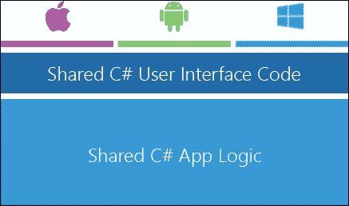

在上述图中，**Shared C# App Logic** 块中的代码包含在一个 **可移植类库（PCL**）中，每个原生项目都会导入。`Xamarin.Forms` 使得共享高达 85% 的代码成为可能。

让我们现在深入开发并设置我们的第一个 `Xamarin.Forms` 项目。

# 设置平台项目

在 Xamarin Studio 中，让我们首先设置平台项目。转到 **文件** | **新建解决方案**，然后从左侧的跨平台菜单中选择一个 **Xamarin.Forms** 应用程序：

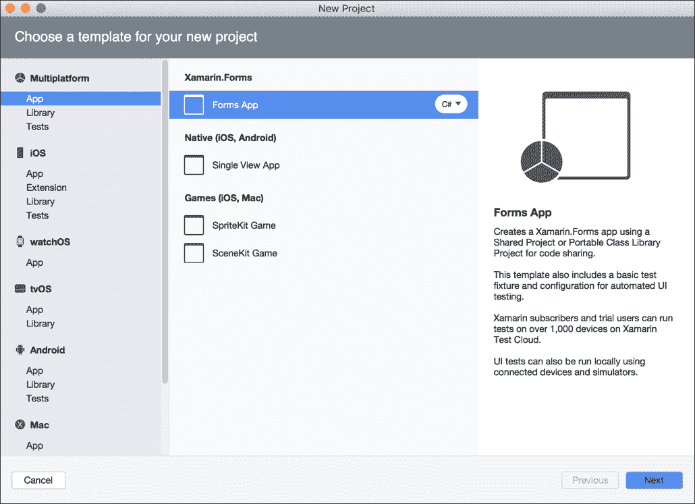

一旦项目创建完成，你将看到同时创建了一个 iOS 项目和一个 Android 项目，以及一个 PCL。

### 注意

不幸的是，我们无法通过 Xamarin Studio 开发我们的 Windows Phone 应用程序；我们将在 iOS 和 Android 项目之后讨论这个问题。

让我们在 XAML 中创建我们的第一个 `ContentPage`，在 PCL 上右键单击，创建一个新的 XAML `ContentPage`，并将其命名为 `MainPage`：

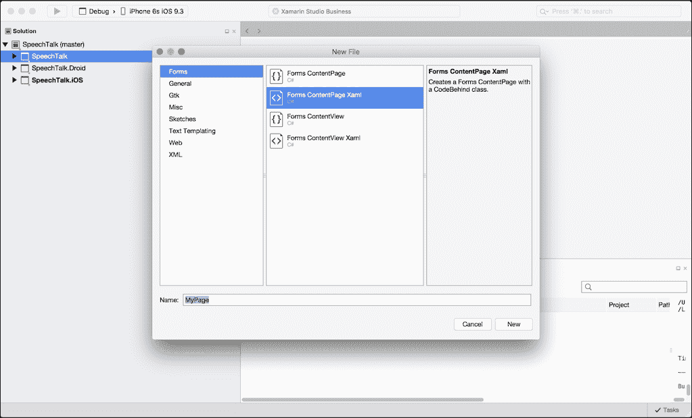

`Xamarin.Forms` 提供了完全使用 C# 构建用户界面的选项，但建议您坚持使用 XAML，因为它是一种非常强大的标记语言。XAML 表格所需的代码比 C# 中的用户界面要小得多。

我们还想要创建一个名为 `Pages` 的新文件夹，并将 `MainPage` 添加到这个文件夹中。

页面上的第一个元素是一个 `网格`。网格根据整个屏幕的大小通过行和列来分隔布局。行从上到下工作，列从左到右工作；将以下内容复制到 `MainPage.xaml` 表格中：

```cs
<?xml version="1.0" encoding="UTF-8"?> 
<ContentPage   

    x:Class="SpeechTalk.Pages.MainPage"> 

    <ContentPage.Content> 

    <Grid x:Name="Grid" RowSpacing="0" Padding="10, 10, 10, 10" > 
        <Grid.RowDefinitions> 
            <RowDefinition Height="Auto"/> 
            <RowDefinition Height="Auto"/> 
            <RowDefinition Height="Auto"/> 
        </Grid.RowDefinitions> 

        <Grid.ColumnDefinitions> 
            <ColumnDefinition Width="*"/> 
        </Grid.ColumnDefinitions> 

    </Grid>  

    </ContentPage.Content> 

</ContentPage> 

```

在顶部，我们有一个与 Android 完全相同的 XML 描述标签，它指定了编码和版本。我们有 `ContentPage` 的声明，带有 XML 命名空间指定属性 `xmlns`。然后我们指定类名，并添加 `ContentPage.Content` 标签，我们将在这里创建页面布局。所有这些 XML 标签都是自动生成的；我们唯一做的更改是类的命名空间：

```cs
x:Class="SpeechTalk.Pages.MainPage" 

```

插入到 `ContentPage.Content` 标签之间的网格有三个行和三个列。每个行定义都分配了 `Auto`，这意味着行的高度基于分配给它的元素。由于我们有三个分配了 `Auto` 的行，网格将只填充包含元素的高度（类似于 android 中的 `wrap_content` 标志）。网格将占据页面的整个宽度，因为它的一个列定义设置为 `"*"`，这意味着它将拉伸一列到页面的整个宽度。我们有了基本的页面布局，所以让我们在这里停下来，然后回到项目结构中。

在 `SpeechTalk.PCL` 中，我们有一个名为 `SpeechTalk.cs` 的文件；我们应该将其重命名为 `App.cs` 以匹配类名。在 `App.cs` 中，这是应用程序的起始点。在应用程序类的构造函数中，您将看到自动设置为这样的 `MainPage` 属性：

```cs
public App () 
        { 
            // The root page of your application 
            MainPage = new ContentPage { 
                Content = new StackLayout { 
                    VerticalOptions = LayoutOptions.Center, 
                    Children = { 
                        new Label { 
                            XAlign = TextAlignment.Center, 
                            Text = "Welcome to Xamarin Forms!" 
                        } 
                    } 
                } 
            }; 
        } 

```

## 那么，这里发生了什么？

当项目创建时，我们会自动接收到一个带有 `MainPage` 属性设置为新的 `ContentPage` 的 `App` 类。前面的代码块是一个完全通过 c-sharp 构建的接口示例。我们想要用我们自己的 `MainPage` 实例来替换它，并将这个新对象设置为 `App` 类的 `MainPage` 属性。以下是更新后的构造函数：

```cs
public App () 
        { 
            MainPage = new MainPage (); 
        } 

```

它更干净，您已经可以看到如果我们用 **C#** 构建复杂用户界面，代码会多么混乱。

# 设置 SpeechTalk.iOS 项目

让我们也看看 iOS 和 Android 的原生项目设置。打开 `AppDelegate.cs` 文件；它应该看起来像这样：

```cs
    [Register ("AppDelegate")] 
    public partial class AppDelegate : global::Xamarin.Forms.Platform.iOS.FormsApplicationDelegate 
    { 
        public override bool FinishedLaunching (UIApplication app, NSDictionary options) 
        { 
            global::Xamarin.Forms.Forms.Init (); 

            LoadApplication (new App ()); 

            return base.FinishedLaunching (app, options); 
        } 
    } 

```

看看超类：

```cs
global::Xamarin.Forms.Platform.iOS.FormsApplicationDelegate 

```

由于 `Xamarin.Forms` 1.3.1 及更新的统一 API，我们所有的应用程序代理都应该继承 `Xamarin.Forms.Platform.iOS.FormsApplicationDelegate`。我们还有一个标准的 `FinishedLaunching` 函数；在这里，我们必须调用 `Forms.Init` 来初始化 `Xamarin.Forms`，然后使用 `App` 类的新实例调用 `LoadApplication`。然后我们返回基类的 `FinishedLaunching` 函数，传递 app 和选项对象。

您可以看到这个 `FinishedLaunching` 函数是标准应用程序代理函数的覆盖。

### 注意

我们必须在函数中的任何其他操作之前初始化 forms。

让我们运行 iOS 应用程序并看看会发生什么：

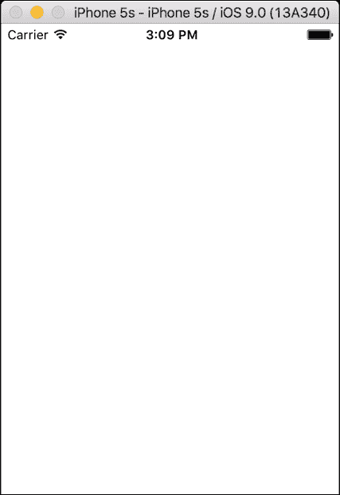

太棒了，一个空白的应用程序。这意味着我们现在已经成功运行了我们的第一个 iOS `Xamarin.Forms` 项目。

# 设置 SpeechTalk.Droid 项目

让我们对 Android 也做同样的事情，并相应地设置 `Xamarin.Forms`。在我们的 Android 项目中，打开 `MainActivity.cs` 类并查看 `OnCreate` 函数：

```cs
[Activity (Label = "SpeechTalk.Droid", Icon = "@drawable/icon", MainLauncher = true, ConfigurationChanges = ConfigChanges.ScreenSize | ConfigChanges.Orientation)] 
    public class MainActivity : global::Xamarin.Forms.Platform.Android.FormsApplicationActivity 
    { 
        protected override void OnCreate (Bundle bundle) 
        { 
            base.OnCreate (bundle); 

            global::Xamarin.Forms.Forms.Init (this, bundle); 

            LoadApplication (new App ()); 
        } 
    } 

```

`MainActivity` 类必须继承 `Xamarin.Forms.Platform.Android.FormsApplicationActivity`；在初始化 `Xamarin.Forms` 并加载我们新的实例化的应用程序类之前，我们必须调用超类 `OnCreate` 方法。就这样，我们现在可以运行 Android 应用程序并看到完全相同的结果，一个空白页面。恭喜您，您刚刚共享了您的第一个 `Xamarin.Forms` 接口。

# Xamarin.Forms、Windows Phone 和 Visual Studio

现在让我们看看如何将我们的 `MainPage` 接口与 Windows Phone 共享。

### 注意

并非每个人都会将应用程序扩展到 Windows Phone，所以如果您不感兴趣创建 Windows Phone 示例，您可以跳过这部分。

我们将使用 Microsoft Visual Studio，所以打开它并打开我们在 Xamarin Studio 中创建的 `SpeechTalk` 解决方案文件（`SpeechTalk.sln`）。这两个 IDE 之间的可移植性非常好；观察解决方案直接导入 Visual Studio 并打开您的 PCL 文件没有任何问题。

### 小贴士

创建一个 `GIT` 仓库以帮助控制 Xamarin Studio 和 Visual Studio 之间的持续变化，我们建议为每个章节创建一个 GIT 仓库。

iOS 和 Android 项目可能不兼容，因为我们是在 Xamarin Studio 中创建这些项目的。

### 小贴士

您可以直接在 Visual Studio 中构建 iOS 和 Android 应用程序，但运行 iOS 应用程序将需要一个 mac 构建宿主。

现在是时候创建一个新的 Windows Phone 项目了：

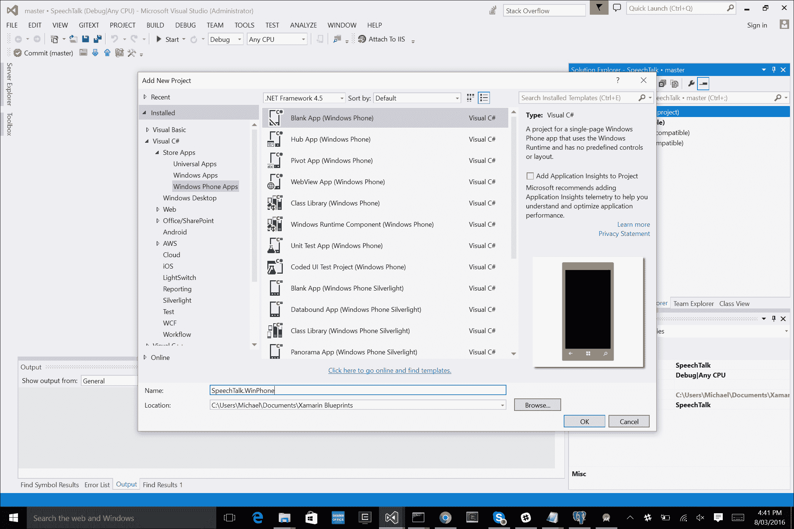

不幸的是，iOS 和 Android 自动设置将不会在 Windows Phone 项目中完成。所有设置都将手动完成，但这对于指导您完成手动设置是有益的。

我们导入 **Xamarin.Forms** nuget 包：

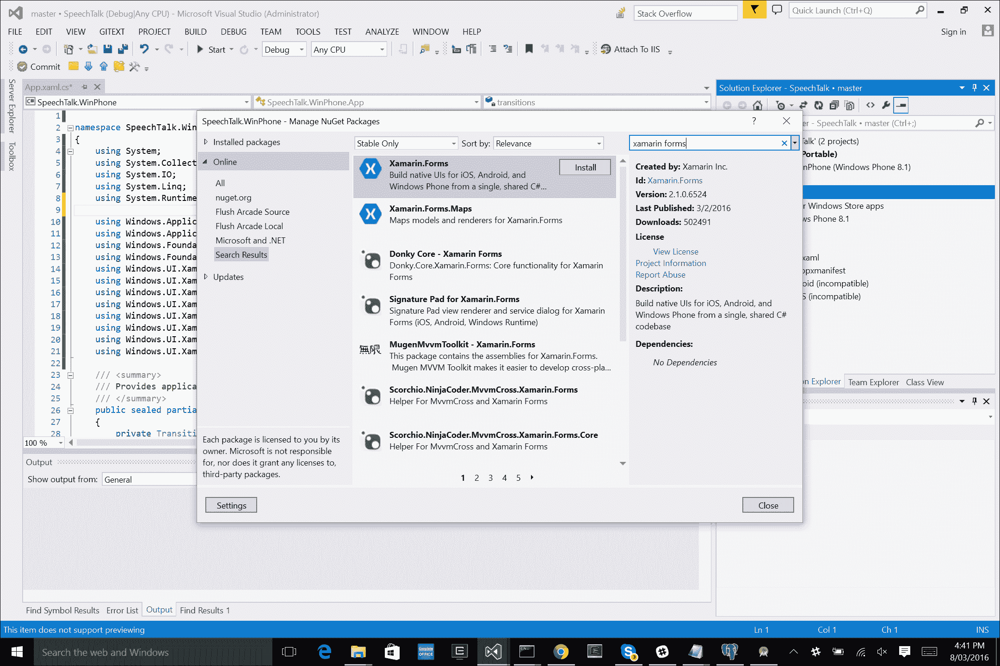

现在是时候查看 **Windows Phone** 项目的 `MainPage.xaml` 和 `MainPage.xaml.cs` 文件了。

等一下，我们不是已经做过这样一个了吗？

现在你正在准备一个 Windows Phone 项目，我们可以看到 Xamarin.Forms 中使用的原始 WPF 结构。

打开`MainPage.xaml`并粘贴以下内容：

```cs
<forms:WindowsPhonePage 
    x:Class="SpeechTalk.WinPhone.MainPage" 

    mc:Ignorable="d" 
    Background="{ThemeResource ApplicationPageBackgroundThemeBrush}"> 

    <Grid> 

    </Grid> 
</forms:WindowsPhonePage> 

```

### 小贴士

如果有任何行被下划线标注，请忽略它们；这是 Visual Studio 中的一个问题。

## 我们在这里能看到什么？

是的，这是 XAML。Windows 应用都是使用 WPF 框架构建的。我们创建`Xamarin.Forms`元素`forms:WindowsPhonePage`。在 Windows Phone 项目中打开`MainPage.xaml.cs`并更新构造函数：

```cs
public sealed partial class MainPage 
{ 
    public MainPage() 
    { 
        InitializeComponent(); 

        NavigationCacheMode = NavigationCacheMode.Required; 
        LoadApplication(new SpeechTalk.App()); 
    } 
} 

```

项目设置相当简单，但我们没有在任何地方调用`Forms.Init`。在**Windows Phone**项目中打开`App.xaml.cs`文件并查找以下代码块：

```cs
if (rootFrame == null) 
{ 
    // Create a Frame to act as the navigation context and navigate to the first page 
    rootFrame = new Frame(); 

    // TODO: change this value to a cache size that is appropriate for your application 
    rootFrame.CacheSize = 1; 

    Xamarin.Forms.Forms.Init(e); 

    if (e.PreviousExecutionState == ApplicationExecutionState.Terminated) 
    { 
        // TODO: Load state from previously suspended application 
    } 

    // Place the frame in the current Window 
    Window.Current.Content = rootFrame; 
}  

```

我们必须手动添加以下这一行：

```cs
Xamarin.Forms.Forms.Init(e); 

```

将缓存大小设置为`1`：

```cs
rootFrame.CacheSize = 1; 

```

最后，我们现在需要引用我们在 Xamarin Studio 中之前创建的**SpeechTalk** PCL 项目：


你可能会遇到将此项目引用到 PCL 默认设置的目标时的问题：

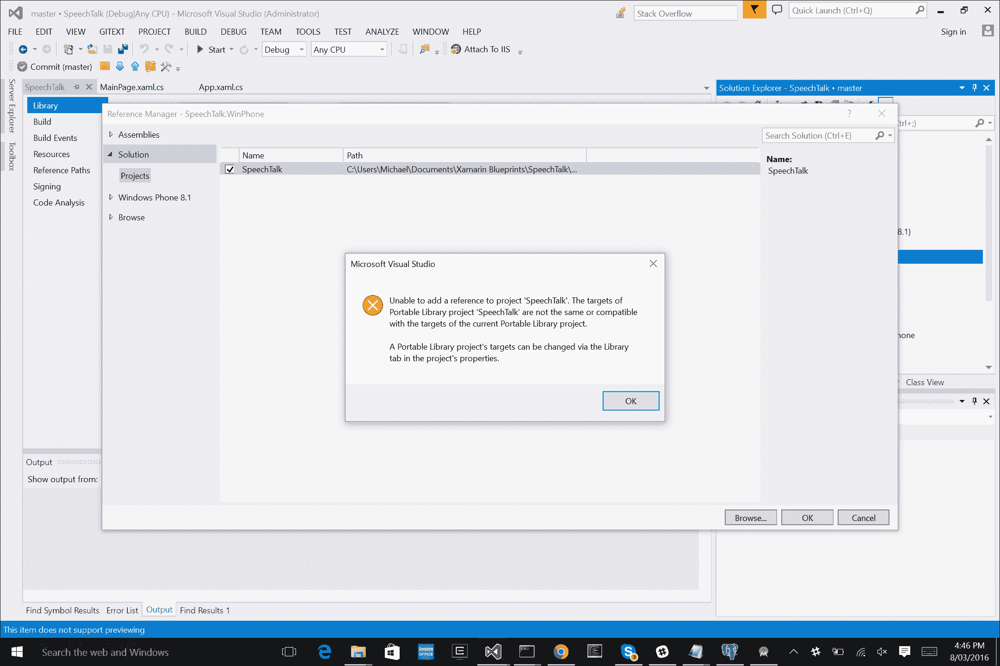

要解决这个问题，打开**SpeechTalk** PCL 项目并在**属性**中更新目标配置：

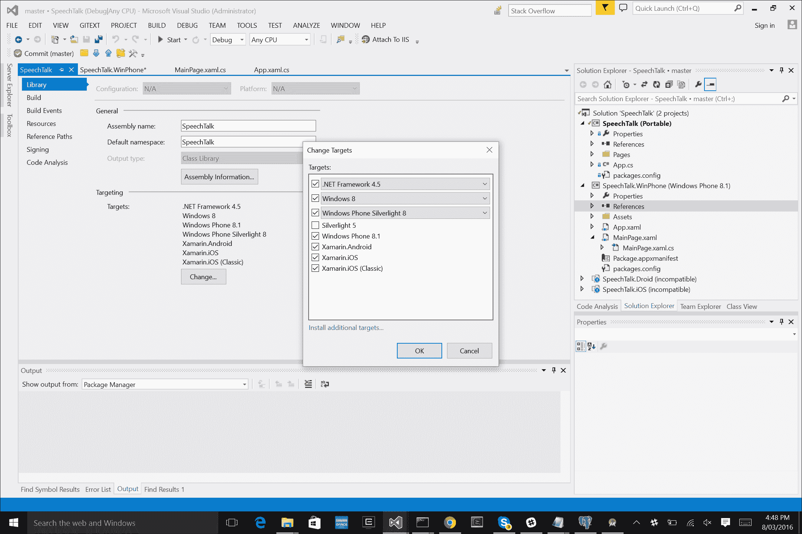

点击**更改**按钮，确保选中**目标**前的复选框。这就完成了；尝试构建并运行应用程序。我们应该看到一个空白页面，就像 Android 和 iOS 项目一样。现在我们已经为所有平台制作了一个跨平台应用程序。

现在，让我们来谈谈 IoC 的乐趣。

# Xamarin.Forms 的依赖注入（IoC）

**控制反转**（**IoC**）原则在编写跨平台应用程序时是一个非常实用的技术。

## 那么为什么我们应该使用它？

分享 100%的代码会很棒，但这并不完全可能；我们仍然需要一些来自特定平台功能的实现（例如不同的平台服务、硬件、摄像头）。解决这个问题的方法是通过**IoC 容器**。使用 IoC 原则，我们在共享代码中使用功能抽象，并将抽象的实现传递到共享代码中。我们的 IoC 容器处理对象的依赖树实例化。我们可以将对象注册到它们继承的接口中，并允许容器将注册的对象作为它们的抽象接口传递到依赖树的底部（一直到底层的 PCL）。

## 那么，我们如何从中受益？

如果我在一个 PCL 项目中需要视图模型调用原生蓝牙服务的方法，该怎么办？

简单来说，我们不能。我们的 PCL 项目对原生侧的蓝牙服务一无所知。我们创建了一个位于 PCL 项目中的接口，创建了一个继承此接口的类，并定义了方法和访问所有所需的原生功能。然后我们通过 IoC 容器将此类注册到继承的接口中，最后在 PCL 项目中解析这个抽象接口。当我们从这个接口在 PCL 中调用函数时，它将调用在原生侧描述的已注册类函数定义：

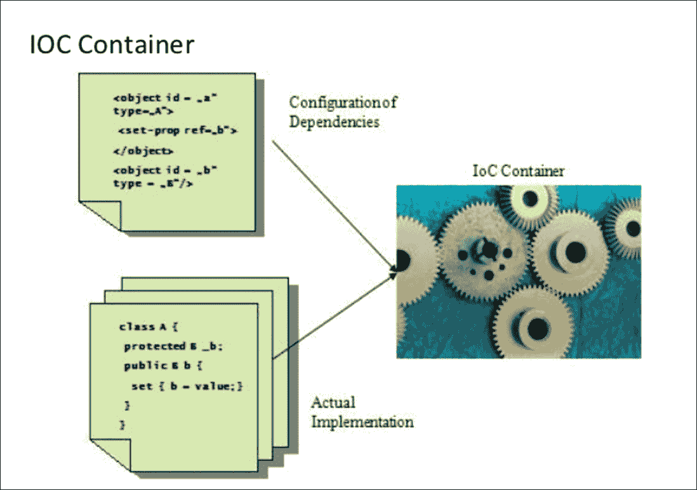

现在回到我们的`SpeechTalk`应用程序。由于 PCL 项目无法从原生侧的文本到语音服务共享代码，我们将不得不使用 IoC 来从我们的 PCL 访问原生侧功能。让我们首先声明一个用于文本到语音服务的接口，创建一个名为`Services`的新文件夹，并添加一个名为`ITextToSpeech.cs`的新文件用于接口：

```cs
public interface ITextToSpeech 
    { 
        void Speak (string msg) 
    } 

```

# Autofac

在我们开始实现此接口的不同原生方面之前，让我们首先添加我们的 IoC 容器来处理抽象。有一些 IoC 容器是免费在线的；对于这个例子，我们将使用**Autofac**。让我们为 PCL、iOS 和 Android 项目添加 NuGet 包：

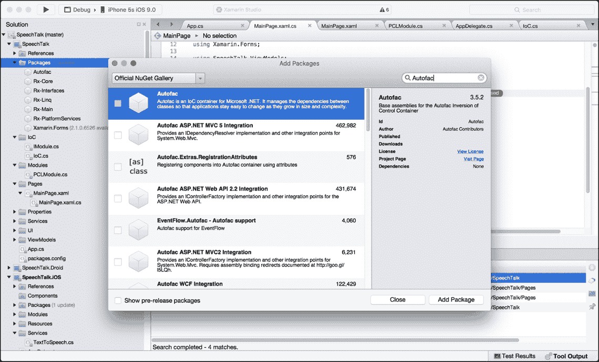

现在我们已经有了我们的 IoC 容器，让我们构建 iOS 实现。对于每个平台，我们想要创建名为**Modules**的对象来注册抽象接口。让我们在 PCL 项目中添加一个名为 IoC 的新文件夹，并添加一个名为`IoC.cs`的新文件：

```cs
public static class IoC 
    { 
        public static IContainer Container { get; private set; } 

        private static ContainerBuilder builder; 

        public static void CreateContainer()  
        { 
            builder = new ContainerBuilder(); 
        } 

        public static void StartContainer() 
        { 
            Container = builder.Build(); 
        } 

        public static void RegisterModule(IModule module) 
        { 
            module.Register (builder); 
        } 

        public static void RegisterModules(IEnumerable<IModule> modules) 
        { 
            foreach (var module in modules)  
            { 
                module.Register (builder); 
            } 
        } 

        public static T Resolve<T>() 
        { 
            return Container.Resolve<T> (); 
        } 
    } 

```

仔细观察，我们使用这个静态类来注册模块、注册类型、解析已注册的类型、创建容器和构建容器。

### 注意

在注册所有类型之后，必须构建`ContainerBuilder`。

在初始化应用程序之前，我们必须注册并启动此容器。打开您的`AppDelegate.cs`文件并更新`FinishedLaunching`函数：

```cs
        public override bool FinishedLaunching (UIApplication app, NSDictionary options) 
        { 
            global::Xamarin.Forms.Forms.Init (); 

            InitIoC (); 

            LoadApplication (new App ()); 

            return base.FinishedLaunching (app, options); 
        } 

        private void InitIoC() 
        { 
            IoC.CreateContainer (); 
            IoC.RegisterModule (new IOSModule()); 
            IoC.RegisterModule (new PCLModule()); 
            IoC.StartContainer (); 
        } 

```

`InitIoC`函数将首先创建容器，注册模块，并构建 IoC 容器。

### 注意

在我们开始注册之前，我们的容器必须被创建，并且我们的容器构建器必须在我们可以开始解析之前被构建。

每个模块都有注册函数，这些函数将使用创建的`ContainerBuilder`来注册类型。

# iOS 文本到语音实现

每个模块将检索在整个应用程序生命周期中使用的当前容器。在注册函数内部，我们将注册文本到语音接口的类实现。这将在我们加载其他任何内容之前的应用程序开始时完成。

让我们先从添加 iOS 模块开始。在 iOS 项目中添加一个名为**Modules**的新文件夹，创建一个名为`iOSModule.cs`的新文件，并粘贴以下内容：

```cs

    public class IOSModule : IModule 
    { 
        public void Register(ContainerBuilder builer) 
        { 
            builer.RegisterType<TextToSpeech> ().As<ITextToSpeech> ().SingleInstance (); 
        } 
    } 

```

下一步是添加 iOS 文本到语音服务。添加一个名为 `Services` 的新文件夹，并添加一个名为 `TextToSpeech.cs` 的新文件。在这个文件中，我们将访问 iOS 的 `AVSpeechSynthesizer`：

```cs
public class TextToSpeech : ITextToSpeech 
    { 
        public void Speak (string msg) 
        { 
            var speechSynthesizer = new AVSpeechSynthesizer (); 

            var speechUtterance = new AVSpeechUtterance (msg)  
            { 
                Rate = AVSpeechUtterance.MaximumSpeechRate / 4, 
                Voice = AVSpeechSynthesisVoice.FromLanguage ("en-US"), 
                Volume = 0.5f, 
                PitchMultiplier = 1.0f 
            }; 

            speechSynthesizer.SpeakUtterance (speechUtterance); 
        } 
    } 

```

仔细观察这个类，我们将使用语音合成器来生成一个 `SpeechUtterance` 对象，它包含要说的文本。我们还设置了语言、音量和语速。

### 注意

**注意我们是如何通过 IoC 容器继承将要注册的接口的吗？**

由于我们在这个类上编写的是原生代码，因此我们可以访问所有原生 iOS 功能，所以当我们回到 PCL 并在接口中调用 `Speak` 函数时，前面的代码将执行。

我们的下一步是实现页面视图模型的原则。创建一个名为 `ViewModels` 的新文件夹，并添加两个新文件，`ViewModelBase.cs` 和 `MainPageViewModel.cs`。`ViewModelBase` 类将是所有视图模型的基础调用，用于处理任何视图模型属性的属性更改事件：

```cs
public abstract class ViewModelBase : INotifyPropertyChanged 
    { 
        #region Public Events 

        public event PropertyChangedEventHandler PropertyChanged; 

        #endregion  

        #region Methods 

        protected virtual void OnPropertyChanged([CallerMemberName] string propertyName = null) 
        { 
            PropertyChangedEventHandler handler = this.PropertyChanged; 

            if (handler != null) 
            { 
                handler(this, new PropertyChangedEventArgs(propertyName)); 
            } 
        } 

        #endregion 
    } 

```

让我们更仔细地看看。首先定义的属性是 `PropertyChanged EventHandler`，它将在任何属性数据更改时触发。注意 `#` 定义语句的使用；这些对于分割代码块和导航代码表很有用。

### 注意

这些在处理大型代码表时特别有用。

这个类继承了 `INotifyPropertyChanged` 接口，这意味着我们必须定义 `OnPropertyChanged` 函数。这个函数用于触发 `PropertyChanged` 事件，以通知类内的某个属性已更改数据。现在让我们实现 `MainPageViewModel`。

我们如何使用 `OnPropertyChanged` 原则与我们的 `MainPageViewModel` 结合使用？

在 `MainPageViewModel` 的每个属性中，我们必须调用 `OnPropertyChanged` 函数来触发 `EventHandler`，从而通知特定属性的数据更改。让我们从创建具有私有属性和构造函数的 `MainPageViewModel` 开始：

```cs
public class MainPageViewModel : ViewModelBase 
    { 
        #region Private Properties 

        private readonly ITextToSpeech _textToSpeech; 

        private string _descriptionMessage = "Enter text and press the 'Speak' button to start speaking"; 

        private string _speakEntryPlaceholder = "Text to speak"; 

        private string _speakText = string.Empty; 

        private string _speakTitle = "Speak"; 

        private ICommand _speakCommand; 

        #endregion 

        #region Constructors 

        public MainPageViewModel (ITextToSpeech textToSpeech)  
        { 
           _textToSpeech = textToSpeech; 

            _speakCommand = new Command ((c) => _textToSpeech.Speak (this.SpeakText)); 
        }  

        #endregion 
    } 

```

这是我们第一次访问 `Systems.Windows.Input` 库。**命令**用于 `ContentPage` 上的 `Button` 对象；我们将在按钮上设置绑定，以便每当发生点击事件时，这个命令就会执行，运行在构造函数中分配的动作。注意我们是如何传递 `TextToSpeech` 接口的；这就是 IoC 容器会变得复杂的地方。

现在我们添加视图模型的公共属性，这些属性调用 `OnPropertyChanged` 函数：

```cs
#region Public Properties 

        public string DescriptionMessage 
        { 
            get 
            { 
                return _descriptionMessage; 
            } 

            set 
            { 
                if (value.Equals(_descriptionMessage)) 
                { 
                    return; 
                } 

                _descriptionMessage = value; 
                OnPropertyChanged("DescriptionMessage"); 
            } 
        } 

        public string SpeakEntryPlaceholder 
        { 
            get 
            { 
                return _speakEntryPlaceholder; 
            } 

            set 
            { 
                if (value.Equals(_speakEntryPlaceholder)) 
                { 
                    return; 
                } 

                _speakEntryPlaceholder = value; 
                OnPropertyChanged("SpeakEntryPlaceholder"); 
            } 
        } 

        public string SpeakText 
        { 
            get 
            { 
                return _speakText; 
            } 

            set 
            { 
                if (value.Equals(_speakText)) 
                { 
                    return; 
                } 

                _speakText = value; 
                OnPropertyChanged("SpeakText"); 
            } 
        } 

        public string SpeakTitle 
        { 
            get 
            { 
                return _speakTitle; 
            } 

            set 
            { 
                if (value.Equals(_speakTitle)) 
                { 
                    return; 
                } 

                _speakTitle = value; 
                OnPropertyChanged("SpeakTitle"); 
            } 
        } 

        public ICommand SpeakCommand 
        { 
            get 
            { 
                return _speakCommand; 
            } 

            set 
            { 
                if (value.Equals(_speakCommand)) 
                { 
                    return; 
                } 

                _speakCommand = value; 
                OnPropertyChanged("SpeakCommand"); 
            } 
        } 

        #endregion 

```

就这样！我们得到了第一个视图模型。注意每个属性的`get`和`set`方法；它们与函数完全相同，只是呈现方式更优雅。每次我们在`public`属性内部检索数据时，它都会拉取`private`属性中的数据，每次我们设置`public`属性时，如果值与当前值不同，我们将设置包含在`private`变量中的值，并调用`OnPropertyChanged`函数来触发基类中的`EventHandler`。当此事件触发时，它将更新绑定到它的任何视图。

# 绑定

在 PCL 项目中，我们将运行将视图模型绑定到视图、显示视图模型数据以及通过`INotifyPropertyChanged`接口传播数据更改的概念。

让我们从`MainPage.cs`开始，并完成此页面的其余用户界面：

```cs
<?xml version="1.0" encoding="UTF-8"?> 
<ContentPage   

    x:Class="SpeechTalk.Pages.MainPage" 
    BackgroundColor="White"> 

    <ContentPage.Content> 

    <Grid x:Name="Grid" RowSpacing="10" Padding="10, 10, 10, 10" VerticalOptions="Center"> 
        <Grid.RowDefinitions> 
            <RowDefinition Height="Auto"/> 
            <RowDefinition Height="Auto"/> 
            <RowDefinition Height="Auto"/> 
        </Grid.RowDefinitions> 

        <Grid.ColumnDefinitions> 
            <ColumnDefinition Width="*"/> 
        </Grid.ColumnDefinitions> 

        <Label x:Name="DesciptionLabel" Font="Arial, 20" Grid.Row="0" Grid.Column="0"/> 

        <Entry x:Name="SpeakEntry" Grid.Row="1" Grid.Column="0"/> 

        <Button x:Name="SpeakButton" Grid.Row="2" Grid.Column="0"/> 
    </Grid> 

    </ContentPage.Content> 

</ContentPage> 

```

我们现在有了一个`Label`、`Entry`和`Button`；每个都分配了`x:Name`、`Grid.Row`和`Grid.Column`属性。

注意我们是如何将行和列与之前的定义部分相关联的？

我们还在边界 Grid 上设置了左、上、右和下的填充值；将垂直选项设置为`Center`；并设置行间距为`10`。`Padding`将在 Grid 和`ContentPage`的整个边界周围放置间隔。

### 小贴士

Padding（填充）在 HTML 中与边距（margins）的工作方式完全相同。

`RowSpacing`属性将设置每行之间的间隔；由于每个元素都放置在新的一行中，它们将以`10`像素的间隔垂直堆叠。由于我们只有 1 列，因此此列宽度将占据整个**Grid**的宽度，因此每个元素都将占据`Grid`的全宽。

最后，将`Grid`的`VerticalOptions`设置为`Center`将使所有元素都定位在 Grid 的中心。现在让我们设置`MainPage`和`MainPageViewModel`之间的绑定。

创建一个新文件，将其添加到模块文件夹中，命名为`PCLModule.cs`，并粘贴以下内容：

```cs
    public class PCLModule : IModule 
    { 
        public void Register(ContainerBuilder builer) 
        { 
            builer.RegisterType<MainPageViewModel> ().SingleInstance(); 
            builer.RegisterType<MainPage> ().SingleInstance(); 
        } 
    } 

```

等一下...为什么我们要在容器中注册我们的页面和视图模型？

我们不需要对这些内容进行抽象。

在容器中注册视图和视图模型允许我们在构造函数中添加我们的相关视图模型；由于在整个应用程序的生命周期中我们只需要一个视图和视图模型的实例，我们可以将`MainPage.xaml.cs`文件设置如下：

```cs
public partial class MainPage : ContentPage 
    { 
        public MainPage () 
        { 
            InitializeComponent (); 
        } 

        public MainPage (MainPageViewModel model) 
        { 
            BindingContext = model; 
            InitializeComponent (); 
        } 
    } 

```

在容器中注册时创建的`MainPageViewModel`的实例将在创建`MainPage`时从构造函数中提取出来。这与我们在构造函数中放置`ITextToSpeech`抽象的实例所使用的相同技术；它将提取在本地端注册的实例，从而我们可以现在使用此对象来调用将运行`native-side`代码的函数。

现在回到`MainPage.xaml`表单，让我们设置属性绑定；更新标签、输入和按钮如下：

```cs
<Label x:Name="DesciptionLabel" Text="{Binding DescriptionMessage}" Font="Arial, 20" Grid.Row="0" Grid.Column="0"/> 

<Entry x:Name="SpeakEntry" Placeholder="{Binding SpeakEntryPlaceholder}" Text="{Binding SpeakText, Mode=TwoWay}" Grid.Row="1" Grid.Column="0"/> 

<Button x:Name="SpeakButton" Text="{Binding SpeakTitle}" Command="{Binding SpeakCommand}" Grid.Row="2" Grid.Column="0"/>  

```

我们已经为标签和输入属性上的文本设置了绑定；注意输入文本属性上设置的双向绑定模式？

这意味着，如果我们从用户界面（因为它是一个文本框，我们将更改 UI 前的数据）或视图模型更改数据，两个端点都会相应地接收到数据更改。我们还设置了按钮上的命令绑定；现在，每次我们在页面上按下此按钮时，它都会运行视图模型中分配给它的操作。

现在所有的编码都完成了，让我们运行应用程序；尝试输入文本并按下 **Speak** 按钮，听听效果：

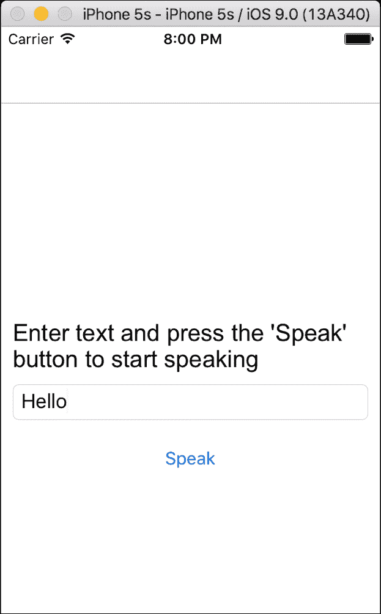

干得好！你刚刚完成了你的第一个 iOS `Xamarin.Forms` 应用程序。

为了进行一些额外的练习，尝试更改 iOS 中 `SpeechUtterance` 对象的音量和语音属性。

# Android 文本到语音实现

现在，让我们为 Android 实现 IoC 容器和文本到语音。首先创建一个文件夹用于 Android 模块和服务，向其中添加两个文件，`TextToSpeechDroid.cs` 和 `DroidModule.cs`。

让我们从文本到语音服务开始；对于 `TextToSpeechDroid.cs`。添加以下内容：

```cs
public class TextToSpeechDroid :  Java.Lang.Object, ITextToSpeech, Android.Speech.Tts.TextToSpeech.IOnInitListener  
    { 
        private Android.Speech.Tts.TextToSpeech _speaker; 

        private string _toSpeak; 

        public void Speak (string msg) 
        { 
            var ctx = Forms.Context; 
            _toSpeak = msg; 

            if (_speaker == null)  
            { 
                _speaker = new Android.Speech.Tts.TextToSpeech (ctx, this); 
            }  
            else  
            { 
                var p = new Dictionary<string,string> (); 
                speaker.Speak (_toSpeak, QueueMode.Flush, p); 
            } 
        } 

        #region TextToSpeech.IOnInitListener implementation 

        public void OnInit (OperationResult status) 
        { 
            if (status.Equals (OperationResult.Success))  
            { 
                var p = new Dictionary<string,string> (); 
                _speaker.Speak (_toSpeak, QueueMode.Flush, p); 
            } 
        } 

        #endregion 
    } 

```

这个 `IOnInitListener` 接口要求实现 `OnInit` 函数。`OnInit` 函数被调用以指示 `TextToSpeech` 引擎初始化完成。然后我们实现接口的 `Speak` 函数来朗读传入的文本。在函数开始时，我们检查是否已初始化一个新的 `TextToSpeech` 对象；如果是，则朗读消息。

# 使用 Android 设置 IoC

现在是 IoC 实现的时候了。它与 iOS 完全一样；让我们添加 Android 模块：

```cs
    public class DroidModule : IModule 
    { 
        public void Register(ContainerBuilder builer) 
        { 
            builer.RegisterType<TextToSpeechDroid> ().As<ITextToSpeech> ().SingleInstance (); 
        } 
    } 

```

很简单，对吧？

现在我们必须在 `MainActivity.cs` 类中设置 IoC 容器；简单地将 `AppDelegate` 文件中名为 `initIoC` 的 iOS 函数复制并粘贴到 `MainActivity` 类中，然后将 `iOSModule` 的实例化替换为你的 `DroidModule`，然后只需在 `Xamarin.Forms` 初始化之后添加函数调用即可：

```cs
protected override void OnCreate (Bundle bundle) 
        { 
            base.OnCreate (bundle); 

            global::Xamarin.Forms.Forms.Init (this, bundle); 

            InitIoC (); 

            LoadApplication (new App ()); 
        } 

        private void InitIoC() 
        { 
            IoC.CreateContainer (); 
            IoC.RegisterModule (new DroidModule()); 
            IoC.RegisterModule (new PCLModule()); 
            IoC.StartContainer (); 
        } 

```

### 注意

你可能会在 Android 上遇到让语音工作的问题。你可能需要首先设置的是在 **设置** | **控制** | **文本到语音** 选项中。如果你还没有安装默认的语音数据，你将在这里安装语音数据。如果你运行了应用程序但没有语音发生，你将需要配置语音数据。

对于 Android 就这些了，现在尝试运行应用程序并听听语音。

# WinPhone 文本到语音实现

现在我们回到 Windows Phone 进行最后的实现。看看当你需要在多个平台之间切换时会有多复杂。想象一下，如果我们不得不更改语言并重新编写 IoC 容器，工作量将会更大。不仅如此，使用 IoC 将毫无意义，因为我们无法共享任何代码。

首先，别忘了导入 **Autofac** 的 nuget 包：

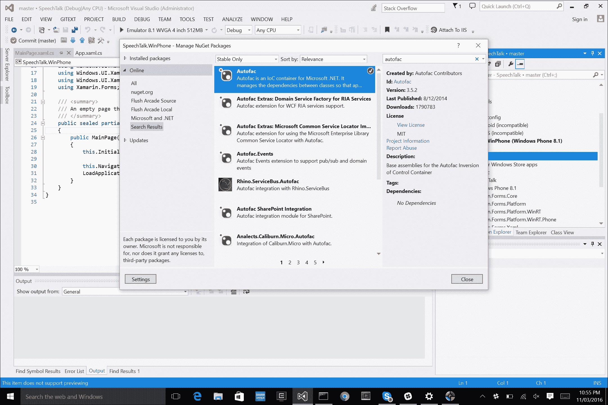

现在我们已经可以访问 **Autofac** 框架了，让我们继续实现文本到语音服务。首先添加一个名为 **Services** 的新文件夹，然后添加 `TextToSpeechWinPhone.cs` 文件并实现它：

```cs
public class TextToSpeechWinPhone : ITextToSpeech 
        { 
            public async void Speak(string text) 
            { 
                MediaElement mediaElement = new MediaElement (); 

                var synth = new Windows.Media.SpeechSynthesis. SpeechSynthesizer (); 

                SpeechSynthesisStream stream = await synth.SynthesizeTextToStreamAsync(text); 

                mediaElement.SetSource(stream, stream.ContentType); 
                mediaElement.Play(); 
            } 
        } 

```

仔细观察，你可以看到 `MediaElement` 的实例化；这是用来播放音频源的。在这个例子中，我们的源是 `SpeechSynthesisStream`；这个流是通过语音合成器构建的。当我们调用 `SynthesizeTextToStreamAsync` 函数时，它将基于插入到该函数中的文本生成一个音频流。然后我们将 `MediaElement` 的源设置为流并调用 `Play` 函数开始说话。在配置 Windows Phone 时，还有一个额外的配置需要检查，那就是在应用清单文件中检查功能。

# Windows Phone 上的 IoC

在 Windows Phone 上实现 IoC 与 iOS 和 Android 非常相似。我们只需在应用程序的起始点添加相同的函数，`InitIoC`；在这种情况下，是 Windows Phone 项目的 `MainPage` 构造函数（尽量别弄混），然后我们在 `LoadApplication` 函数之前调用它：

```cs
public MainPage() 
    { 
        InitializeComponent(); 

        InitIoC(); 

        NavigationCacheMode = NavigationCacheMode.Required; 
        LoadApplication(new SpeechTalk.App()); 
    } 

    private void InitIoC() 
    { 
        IoC.CreateContainer(); 
        IoC.RegisterModule(new WinPhoneModule ()); 
        IoC.RegisterModule(new PCLModule ()); 
        IoC.StartContainer(); 
    } 

```

简单！现在我们可以运行 Windows 应用程序了。

# 平台无关样式

等一下！`MainPage` 发生了什么——没有按钮，没有文本？

发生在这里的情况是我们没有指定这些元素的颜色，所以文本的默认颜色显示为白色。打开 `MainPage.xaml` 并相应地更改文本颜色：

```cs
<Label x:Name="DesciptionLabel" Text="{Binding DescriptionMessage}" TextColor="Black" Font="Arial, 20" Grid.Row="0" Grid.Column="0"/> 

<Button x:Name="SpeakButton" Text="{Binding SpeakTitle}" TextColor="Blue" Command="{Binding SpeakCommand}" Grid.Row="2" Grid.Column="0"/> 

```

可能给 `Entry` 对象的背景也上色是个好主意，这样我们就能看到文本定义：

```cs
<Entry x:Name="SpeakEntry" Placeholder="{Binding SpeakEntryPlaceholder}" BackgroundColor="Silver" Text="{Binding SpeakText, Mode=TwoWay}" Grid.Row="1" Grid.Column="0"/> 

```

再次运行它，看看文本、按钮和输入背景是否显示。

但等等！如果我们不希望这些颜色为 iOS 和 Android 改变，或者我们希望根据平台设置不同的颜色呢？

这里有一个技巧可以尝试：在 `MainPage.xaml` 表格中，我们将根据是否是 iOS、Android 还是 Windows Phone 来更改输入的背景颜色：

```cs
<Entry x:Name="SpeakEntry" Placeholder="{Binding SpeakEntryPlaceholder}" Text="{Binding SpeakText, Mode=TwoWay}" Grid.Row="1" Grid.Column="0"> 
            <Entry.BackgroundColor> 
                <OnPlatform x:TypeArguments="Color" 
                    Android="White" 
                    WinPhone="Silver" 
                    iOS="White"> 
                </OnPlatform> 
            </Entry.BackgroundColor> 
        </Entry> 

```

我们首先指定我们正在更改的属性标记，然后是一个 `OnPlatform` 标记，在其中我们指定了参数类型，即 `Color`。让我们更进一步，更改 `Button` 和 `Label` 的文本颜色：

```cs
<Label x:Name="DesciptionLabel" Text="{Binding DescriptionMessage}" Font="Arial, 20" Grid.Row="0" Grid.Column="0"> 
            <Label.TextColor> 
                <OnPlatform x:TypeArguments="Color" 
                    Android="Black" 
                    WinPhone="Black" 
                    iOS="Black"> 
                </OnPlatform> 
            </Label.TextColor> 
        </Label> 

        <Button x:Name="SpeakButton" Text="{Binding SpeakTitle}" Command="{Binding SpeakCommand}" Grid.Row="2" Grid.Column="0"> 
            <Button.TextColor> 
                <OnPlatform x:TypeArguments="Color" 
                    Android="Navy" 
                    WinPhone="Blue" 
                    iOS="Navy"> 
                </OnPlatform> 
            </Button.TextColor> 
        </Button> 

```

这是在第一页样式之间一个很好的小变化。随着你构建更复杂的 XAML 表格，你可能会发现一些需要改变像素项、改变颜色和执行其他样式以提供额外优势的区域。

让我们到此为止，结束这个项目；现在是时候构建我们的 GPS 定位器了。

# 摘要

在本章中，我们学习了如何使用 `Xamarin.Forms` 创建文本到语音服务。我们了解了每个平台的原生语音服务库。在下一章中，我们将学习如何处理后台位置更新事件，并使用经纬度来计算位置。你还将学习如何通过使用 `Xamarin.Forms` 和 `Xamarin.Forms.Maps` 在每个平台上实现位置服务。
