# 第三章：构建 GPS 定位器应用程序

在本章中，我们将更深入地探讨代码共享。我们将构建一个集成了原生 GPS 定位服务和 Google Maps API 的 `Xamarin.Forms` 应用程序。我们将涵盖更多关于 IoC 容器、`Xamarin.Forms.Maps` 库以及 c-sharp `async` 和后台任务技术的内容。

预期知识：

+   网络服务

+   JSON

+   Google Maps

+   Google 地理编码 API（拥有 Google 开发者账户会有帮助）

在本章中，你将学习以下内容：

+   核心定位和 GPS

+   使用 `Xamarin.Forms` 进行导航

+   Google Maps 集成

+   将 Google Maps 与 `Xamarin.Forms.Maps` 集成

+   反应式扩展

+   使用 iOS 和 `CLLocationManager` 库进行核心定位

+   Android 和 `LocationManager`

+   创建我们的 Windows 项目

+   Windows Phone 的核心定位服务

+   应用程序类

+   网络服务和数据契约

+   与 Google API 集成

+   创建地理编码网络服务控制器

+   `Newtonsoft.Json` 和 Microsoft HTTP 客户端库

+   `ModernHttpClient` 和客户端消息处理器

+   将 JSON 数据喂入 `IObservable` 框架的更多反应式扩展

+   资源（RESX）文件

+   使用地理编码网络服务器控制器

+   `OnNavigatedTo` 和 `OnShow`

+   毕达哥拉斯等角投影

# 核心定位和 GPS

所有移动平台都可以访问核心定位服务。这些服务是在后台运行的背景任务，在特定的时间间隔内无限期地更新纬度和经度值，直到服务停止。99% 的智能手机都内置了 GPS 跟踪器，允许你将这些纬度和经度值集成到你的应用程序中。

## 项目设置

让我们直接进入项目设置并创建一个新的 `Xamarin.Forms` 应用程序。我们将首先使用 **Autofac** 设置一个 IoC 容器，这与之前的工程完全相同，将 **Autofac** 导入所有三个项目（PCL、Android 和 iOS）。我们可以从上一个项目中重用 IoC 容器实现中的大量 PCL 代码。

### 注意

你构建的应用程序越多，解决的问题就越多；为什么总是要反复地重新发明轮子呢？最终，当你构建了多个应用程序后，未来的应用程序将主要是由不同项目的不同部分拼接而成的。

将 `IoC`、`Pages` 和 `ViewModels` 文件夹复制进来，然后开始构建我们的 `MainPage`：

```cs
<?xml version="1.0" encoding="UTF-8"?> 
<ContentPage   

    x:Class="Locator.Pages.MainPage" 
    BackgroundColor="White" 
    Title="Welcome"> 

    <ContentPage.Content> 

    <Grid x:Name="Grid" RowSpacing="10" Padding="10, 10, 10, 10" VerticalOptions="Center"> 
        <Grid.RowDefinitions> 
            <RowDefinition Height="*"/> 
            <RowDefinition Height="Auto"/> 
            <RowDefinition Height="Auto"/> 
            <RowDefinition Height="Auto"/> 
        </Grid.RowDefinitions> 

        <Grid.ColumnDefinitions> 
            <ColumnDefinition Width="*"/> 
        </Grid.ColumnDefinitions> 

        <Image x:Name="Image" Source="map.png" HeightRequest="120" WidthRequest="120"  
                Grid.Row="0" Grid.Column="0"/> 

        <Label x:Name="DesciptionLabel" Text="{Binding DescriptionMessage}" HorizontalOptions="Center" Font="Arial, 20" Grid.Row="1" Grid.Column="0"> 
            <Label.TextColor> 
                <OnPlatform x:TypeArguments="Color" 
                    Android="Black" 
                    WinPhone="Black" 
                    iOS="Black"> 
                </OnPlatform> 
            </Label.TextColor> 
        </Label> 

        <Button x:Name="LocationButton" Text="{Binding LocationTitle}" Command="{Binding LocationCommand}" BackgroundColor="Silver" Grid.Row="2" Grid.Column="0"> 
            <Button.TextColor> 
                <OnPlatform x:TypeArguments="Color" 
                    Android="Navy" 
                    WinPhone="Blue" 
                    iOS="Black"> 
                </OnPlatform> 
            </Button.TextColor> 
        </Button> 

        <Button x:Name="ExitButton" Text="{Binding ExitTitle}" Command="{Binding ExitCommand}" BackgroundColor="Silver" Grid.Row="3" Grid.Column="0"> 
            <Button.TextColor> 
                <OnPlatform x:TypeArguments="Color" 
                    Android="Navy" 
                    WinPhone="Blue" 
                    iOS="Black"> 
                </OnPlatform> 
            </Button.TextColor> 
        </Button>  
    </Grid> 

    </ContentPage.Content> 

</ContentPage> 

```

这与之前的 `MainPage` 非常相似，但这次我们添加了两个 `Buttons`，一个 `Label` 和一个 `Image`。

### 注意

在继续阅读之前，看看绑定到每个元素的属性。看看你是否能构建视图模型的属性。

## 使用 Xamarin.Forms 进行导航

在我们开始构建任何视图模型之前，我们将构建我们的导航系统。`Xamarin.Forms`为所有平台提供了完整的导航控制，所以你不必担心这一点。但因为我们总是喜欢走难路，我们将向你展示一种技术，以使我们的跨平台结构更加分离，以便使事物更加模块化。使用一个 PCL 项目同时包含视图模型和视图是很好的，但如果我们能够将视图和视图模型分开到两个 PCL 项目中呢？

## 我们为什么要这样做？

我们当前 PCL 的一个小问题是它完全依赖于`Xamarin.Forms`。只有我们的 XAML 表单和用户界面依赖于`Xamarin.Forms`；我们的视图模型不依赖于它。那么，让我们将视图模型从`Xamarin.Forms` PCL 移动到一个更低级的 PCL 项目中，该项目只依赖于 c-sharp 库。

这是一个很好的技术，可以使 PCL 项目完全分离。在代码共享方面，构建模块化系统是有利的。例如，我们正在构建一个需要登录屏幕、列表视图屏幕和其他大多数应用程序都包含的类似屏幕的新应用程序。因为我们已经有了处理所有网络服务、JSON 处理和属性绑定的视图模型，我们真的需要改变很多吗？现在我们有一个只包含视图模型的低级项目，让我们只提取我们需要的，为视图模型设计用户界面，并将它们绑定在一起。我们不仅可以将这些视图模型用于其他应用程序，而且如果我们想开发一个完全分离的应用程序（例如，一个 WPF 应用程序），我们只需比较所需的屏幕，取相关的视图模型，创建新的用户界面，并将它们绑定在一起。将一切完全分离可以提供完全的即插即用能力，这将大大减少构建类似应用程序所需的开发时间。

让我们通过创建一个新的 PCL 项目并将视图模型复制进来来实现这个模式；命名为**Locator.Portable**：

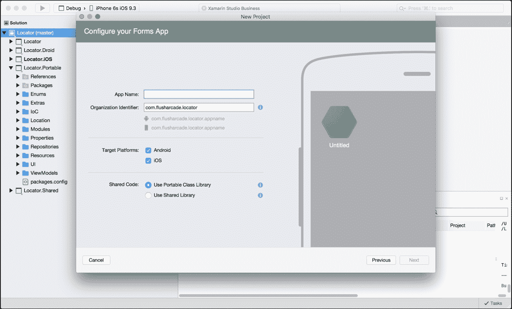

我们还希望复制`IoC`文件夹。

## 构建导航控制

我们的第一步是创建一个名为`enum`的文件夹，添加`PageNames.cs`文件，并复制以下内容：

```cs
public enum PageNames 
{ 
    MainPage, 

    MapPage 
} 

```

现在，让我们添加一个名为`UI`的新文件夹，并创建一个名为`INavigationService.cs`的新文件：

```cs
public interface INavigationService 
{ 
    Task Navigate(PageNames pageName); 
} 

```

然后在`Xamarin.Forms` PCL (定位器)项目中创建一个新的文件夹，命名为`UI`，并创建一个名为`NavigationService.cs`的新文件。`NavigationService`类将继承`INavigationService`接口：

```cs
    public class NavigationService : INavigationService 
    { 
        #region INavigationService implementation 

        public async Task Navigate (PageNames pageName) 
        { 
        } 

        #endregion 
    } 

```

简单，对吧？导航将在我们想要堆栈导航到页面时使用。在创建一个抽象接口时，就像我们为导航所做的那样，这允许我们在更低级的 PCL 中控制导航。现在，填写其余部分：

```cs
        public async Task Navigate (PageNames pageName, IDictionary<string, object> navigationParameters) 
        { 
            var page = GetPage (pageName); 

            if (page != null)  
            { 
                var navigablePage = page as INavigableXamarinFormsPage; 

                if (navigablePage != null)  
                { 
                    await IoC.Resolve<NavigationPage> ().PushAsync (page); 
                    navigablePage.OnNavigatedTo (navigationParameters); 
                } 
            } 
        } 

        private Page GetPage(PageNames page) 
        { 
            switch(page) 
            { 
                case PageNames.MainPage: 
                    return IoC.Resolve<MainPage> (); 
                case PageNames.MapPage: 
                    return IoC.Resolve<MapPage> (); 
                default: 
                    return null; 
            } 
        } 

```

首先，更仔细地看看私有的`GetPage`函数；每次调用`Navigate`函数时，它都会根据传入的`PageName`枚举来检索正确的`ContentPage`对象（该对象已在`IoC`容器中注册），并且如果我们找到了正确的页面，就会将其推入导航堆栈。

最后，让我们构建我们的新`XamFormsModule`以注册页面和导航服务：

```cs
public void Register(ContainerBuilder builer) 
        { 
            builer.RegisterType<MainPage> ().SingleInstance(); 
            builer.RegisterType<MapPage> ().SingleInstance(); 

            builer.Register (x => new NavigationPage(x.Resolve<MainPage>())).AsSelf().SingleInstance(); 

            builer.RegisterType<NavigationService> ().As<INavigationService>().SingleInstance(); 
        } 

```

我们在整个应用程序的生命周期中注册了一个导航页面，并将起始页面设置为之前注册的一个主页面项。

现在打开`App.cs`文件并相应地更新它：

```cs
public App () 
        { 
            MainPage = IoC.Resolve<NavigationPage> (); 
        } 

```

现在明白了吗？

IoC 是跨平台应用的一个非常强大的模式。

## 视图模型导航

现在让我们回到`MainPageViewModel`，并更新和修改之前章节中的`MainPageViewModel`，以包含之前在`MainPage.xaml`中显示的数据绑定所需的属性。首先，让我们实现`private`属性：

```cs
public class MainPageViewModel : ViewModelBase 
    { 
                #region Private Properties 

        private readonly IMethods _methods; 

        private string _descriptionMessage = "Find your location"; 

        private string _locationTitle = "Find Location"; 

        private string _exitTitle = "Exit"; 

        private ICommand _locationCommand; 

        private ICommand _exitCommand; 

        #endregion 

} 

```

现在对于`Public`属性：

```cs
#region Public Properties 

        public string DescriptionMessage 
        { 
            get 
            { 
                return _descriptionMessage; 
            } 

            set 
            { 
                if (value.Equals(_descriptionMessage)) 
                { 
                    return; 
                } 

                _descriptionMessage = value; 
                OnPropertyChanged("DescriptionMessage"); 
            } 
        } 

        public string LocationTitle 
        { 
            get 
            { 
                return _locationTitle; 
            } 

            set 
            { 
                if (value.Equals(_locationTitle)) 
                { 
                    return; 
                } 

                _locationTitle = value; 
                OnPropertyChanged("LocationTitle"); 
            } 
        } 

        public string ExitTitle 
        { 
            get 
            { 
                return _exitTitle; 
            } 

            set 
            { 
                if (value.Equals(_exitTitle)) 
                { 
                    return; 
                } 

                _exitTitle = value; 
                OnPropertyChanged("ExitTitle"); 
            } 
        } 

        public ICommand LocationCommand 
        { 
            get 
            { 
                return _locationCommand; 
            } 

            set 
            { 
                if (value.Equals(_locationCommand)) 
                { 
                    return; 
                } 

                _locationCommand = value; 
                OnPropertyChanged("LocationCommand"); 
            } 
        } 

        public ICommand ExitCommand 
        { 
            get 
            { 
                return _exitCommand; 
            } 

            set 
            { 
                if (value.Equals(_exitCommand)) 
                { 
                    return; 
                } 

                _exitCommand = value; 
                OnPropertyChanged("ExitCommand"); 
            } 
        } 

        #endregion 

```

我们是否开始看到相同的模式了？

现在添加构造函数，它将使用我们之前通过`IoC`容器抽象出的导航服务接口：

```cs
        #region Constructors 

        public MainPageViewModel (INavigationService navigation) : base (navigation) 
        { 

        } 

        #endregion 

```

现在是时候向你展示另一个使用 IoC 容器的技巧了。在我们的构造函数中，我们需要能够从`Xamarin.Forms`库中创建一个新的`Command`对象。在这里我们很幸运，因为`Xamarin.Forms`中的命令从`System.Windows.Input`继承了`ICommand`接口，所以我们能够将这个对象注册到 IoC 容器中。打开`XamFormsModule.cs`文件，并更新`Register`函数以包含以下内容：

```cs
builer.RegisterType<Xamarin.Forms.Command> ().As<ICommand>().InstancePerDependency(); 

```

### 提示

注意，我们将此类型注册为`InstancePerDependency`，因为我们希望在视图模型构造函数中创建命令时每次都得到一个独立的实例。

现在让我们通过`MainPageViewModel`的构造函数创建一个新的命令；更新构造函数如下：

```cs
        #region Constructors 

        public MainPageViewModel (INavigationService navigation, Func<Action, ICommand> commandFactory) : base (navigation) 
        { 
            _locationCommand = commandFactory (() => Navigation.Navigate(PageNames.MapPage)); 
        } 

        #endregion 

```

在构造函数中，我们从`IoC`容器中拉出一个`Func`，它接受一个 Action 并返回一个`ICommand`对象，因为我们已经将这个接口注册到了`Xamarin.FormsCommand`对象，所以我们将得到一个新的`Command`，其动作是构造函数中传入的，如下所示：

```cs
  locationCommand = commandFactory (() => Navigation.Navigate(PageNames.MapPage)); 

```

这与我们使用`Xamarin.Forms`库时做的是完全一样的：

```cs
  locationCommand = new Command (() => Navigation.Navigate(PageNames.MapPage)); 

```

现在我们有一个新的`Command`集合和`Action`，当按钮被按下时，可以将新的`MapPage`推入堆栈：

```cs
    public class PortableModule : IModule 
    { 
        public void Register(ContainerBuilder builer) 
        { 
            builer.RegisterType<MainPageViewModel> ().SingleInstance(); 

        } 
    } 

```

现在将我们的新视图模型注册到`IoC`容器中。为可移植的`IoC`模块创建一个名为`Modules`的新文件夹。创建一个名为`PortableModule.cs`的新文件，并将前面的代码粘贴进去。

## 使用 Xamarin.Forms.Maps 集成 Google Maps

我们下一步是实现 `MapPage`；这个页面将显示一个面板，该面板将显示 Google Maps。在这个面板下方，我们还将显示从我们的本地平台核心位置服务检索到的位置信息（纬度、经度、地址等）。要访问这些本地服务，我们需要导入 `Xamarin.Forms.Maps`：

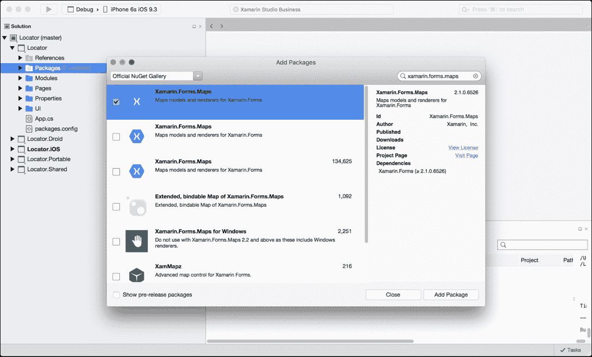

现在我们已经导入了 `Xamarin.Forms.Maps` 库，我们可以访问本地的 Google Maps 服务。现在我们可以通过 `MapPage.xaml` 创建 `Map` 用户界面元素：

```cs
<?xml version="1.0" encoding="UTF-8"?> 
<ContentPage   

    x:Class="Locator.Pages.MapPage" 
    BackgroundColor="White" 
    Title="Map"> 

    <ContentPage.Content> 

        <Grid x:Name="Grid" RowSpacing="10" Padding="10, 10, 10, 10"> 
            <Grid.RowDefinitions> 
                <RowDefinition Height="*"/> 
                <RowDefinition Height="80"/> 
                <RowDefinition Height="60"/> 
                <RowDefinition Height="60"/> 
            </Grid.RowDefinitions> 

            <Grid.ColumnDefinitions> 
                <ColumnDefinition Width="*"/> 
            </Grid.ColumnDefinitions> 

            <maps:Map x:Name="MapView" IsShowingUser="true" Grid.Row="0" Grid.Column="0"/> 

            <Label x:Name="AddressLabel" Text="{Binding Address}" TextColor="Black" Grid.Row="1" Grid.Column="0"/> 

            <Button x:Name="GeolocationButton" Text="{Binding GeolocationButtonTitle}"  
                Command="{Binding GeolocationCommand}" Grid.Row="2" Grid.Column="0"/> 

            <Button x:Name="NearestAddressButton" Text="Find Nearest Address"  
                Command="{Binding NearestAddressCommand}" Grid.Row="3" Grid.Column="0"/> 
        </Grid> 

    </ContentPage.Content> 

</ContentPage> 

```

看看顶部我们是如何导入 `Xamarin.Forms.Maps` 库的？

我们在 `Grid` 中创建了四行，一行用于 `Map`（这将覆盖大部分屏幕），一行用于显示地址的标签，以及两个按钮用于启动/停止位置更新和从地址列表中查找最近的位置。

那么地址是从哪里来的？

我们现在需要实现核心位置服务；这是一个后台服务，它将根据您的位置发送位置信息。返回的信息非常详细；我们可以描绘确切的经纬度值，以及地址。

### 注意

核心位置服务可能会耗尽设备电量，因此在使用核心位置时，我们必须管理使用情况，并在需要时打开和关闭它。由于这是一个后台服务，当应用置于后台时，位置服务仍然会运行。

为了开始我们的核心位置实现，我们将创建一个名为 **IGeolocator** 的抽象地理位置接口，但首先我们需要添加另一个库来处理我们的位置更新。

## Reactive Extensions

如果你之前没有听说过 RX 框架，你即将进入一个关于异步的永无止境的兔子洞。RX 给开发者提供了使用 LINQ 风格的查询操作来处理可观察序列中对象的权限。它允许对应用程序不同元素之间基于事件的操作进行完全控制。

在我们的项目中，我们将使用一个 **Subject** 来处理在本地端接收到的位置事件。在跨平台开发中，因为我们同时在 PCL 和本地级别项目中工作，这涉及到在项目结构中上下传递数据和事件。

我们可以使用标准的 c-sharp 中的 `event` 框架，但我们将使用一个 `Subject` 将事件推送到一个可观察序列中，同时我们在较低级别订阅主题以接收和处理这些事件。

让我们从在我们的本地和 PCL 项目中导入 **Reactive Extensions** 接口开始：

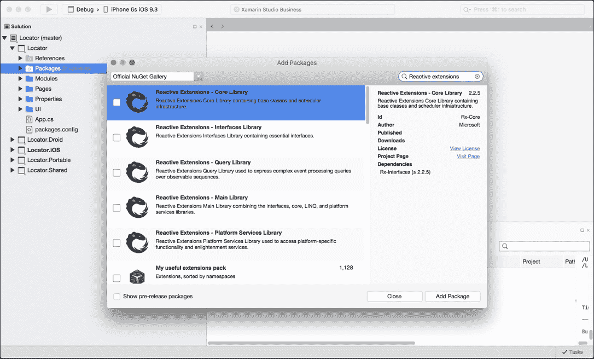

现在让我们创建我们的 `IGeolocator` 类：

```cs
    public interface IGeolocator 
    { 
        Subject<IPosition> Positions { get; set; }  

        void Start(); 

        void Stop(); 
    } 

```

注意到 `IPosition` 接口吗？我们还必须创建一个新的接口，它将存储所有位置信息：

```cs
public interface IPosition 
    { 
        double Latitude {get; set;} 

        double Longitude {get; set;} 
    } 

```

接口设计用于返回这些变量以供`Xamarin.Forms` geolocator 使用，这样我们就可以拉取地址信息。这些信息由`CLLocationManager`在每次位置更新时返回。

为什么我们需要为位置信息创建一个接口？

由于这些信息来自不同的本地服务，我们希望创建自己的对象来包含在底层项目中需要的信息。

## iOS 和 CLLocationManager 库的核心定位

`CLLocationManager`用于位置和航向事件的传递；我们必须在我们的 Geolocator 实现中使用此对象，所以让我们开始：

```cs
    public class GeolocatorIOS : IGeolocator 
    { 
        public Subject<IPosition> Positions { get; set; }  
    } 

```

从我们的接口，我们必须包含`Subject`。现在让我们实例化`CLLocationManager`。首先，我们必须导入`CoreLocation`库：

```cs
    using CoreLocation; 

```

现在我们通过 IoC 容器创建`CLLocationManager`时在构造函数中实例化它。根据 iOS 标准，由于 iOS 9 和 iOS 8 的变化，我们必须实现一些单独的调用，以允许位置管理器开始发送位置事件：

```cs
public GeolocatorIOS() 
        { 
            Positions = new Subject<IPosition> (); 

            locationManager = new CLLocationManager(); 
            locationManager.PausesLocationUpdatesAutomatically = false;  

            // iOS 8 has additional permissions requirements 
            if (UIDevice.CurrentDevice.CheckSystemVersion (8, 0))  
            { 
                locationManager.RequestWhenInUseAuthorization (); 
            } 

            if (UIDevice.CurrentDevice.CheckSystemVersion (9, 0))  
            { 
                locationManager.AllowsBackgroundLocationUpdates = true; 
            } 
        } 

```

这不是什么大问题；在 iOS 8 中，我们必须在使用位置管理器之前请求授权。对于 iOS 9，我们还可以设置一些条件设置。在我们的例子中，我们使用了以下设置：

```cs
AllowsBackgroundLocationUpdates = true 

```

这允许位置管理器在应用处于后台时继续发送事件。我们还可以这样做：

```cs
if (UIDevice.CurrentDevice.CheckSystemVersion (8, 0))  
            { 
                locationManager.RequestWhenInUseAuthorization (); 
            }  

```

这将只允许在应用处于前台时从`CLLocationManager`接收事件。在使用位置服务时，可以在前台和后台控制位置事件之间更改多个设置。我们想知道我们的应用是否将在后台/前台持续运行更新。大多数时候，我们希望在应用处于前台时进行位置更新以减少电池消耗，但也有一些场景下更新应该在后台继续。

现在让我们继续处理类的其余部分；让我们开始处理位置事件：

```cs
        private void handleLocationsUpdated (object sender, CLLocationsUpdatedEventArgs e) 
        { 
            var location = e.Locations.LastOrDefault (); 
            if (location != null) 
            { 
                Console.WriteLine ("Location updated, position: " + location.Coordinate.Latitude + "-" + location.Coordinate.Longitude); 

                // fire our custom Location Updated event 
                Positions.OnNext(new Position() 
                    { 
                        Latitude = location.Coordinate.Latitude, 
                        Longitude = location.Coordinate.Longitude, 
                    }); 
            } 
        } 

```

每次我们从`CLLocationManager`接收到位置更新时，都会调用前面的函数。从事件参数`CLLocationsUpdatedEventArgs`中，我们提取出位置列表；由于`CLLocationManager`有时会一次性接收到多个更新，我们总是希望获取最后一个位置。然后一旦我们创建了一个新的`Position`，分配纬度和经度值，并通过调用`OnNext`函数，我们将一个新的事件推入可观察序列。

我们下一步是向`info.plist`文件添加一些小的修改。

让我们添加以下键：

```cs
  <key>NSLocationAlwaysUsageDescription</key> 
  <string>Can we use your location</string> 
  key>NSLocationWhenInUseUsageDescription</key> 
  <string>We are using your location</string> 

```

### 注意

上述代码来自`info.plist`文件的源代码。

`NSLocationAlwaysUsageDescription`和`NSLocationWhenInUseUsageDescription`键将在请求位置数据访问的警告中显示给用户。我们还必须添加位置的后台模式，我们可以设置 iOS 项目的属性：

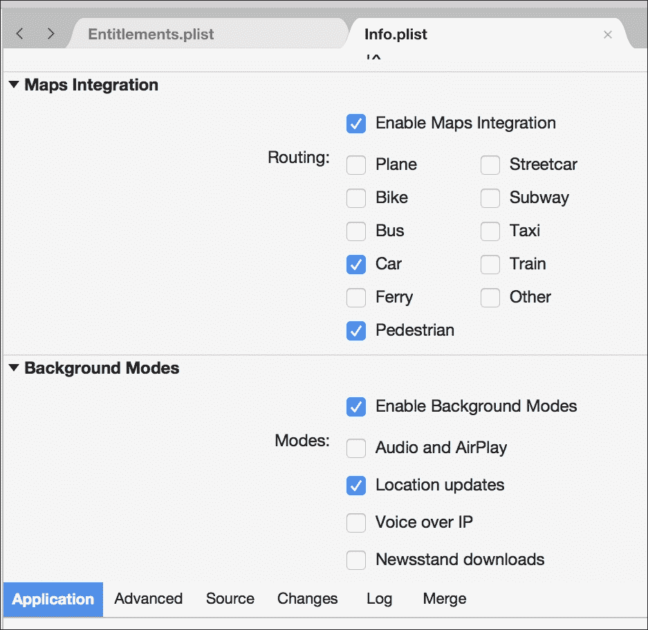

现在我们必须实现`Start`和`Stop`函数：

```cs
        public void Start() 
        { 
            if (CLLocationManager.LocationServicesEnabled)  
            { 
                locationManager.DesiredAccuracy = 1; 
                locationManager.LocationsUpdated += handleLocationsUpdated; 
                locationManager.StartUpdatingLocation(); 
            } 
        } 

        public void Stop() 
        { 
            locationManager.LocationsUpdated -= handleLocationsUpdated; 
            locationManager.StopUpdatingLocation(); 
        } 

```

`Start`函数将检查位置服务是否已启用，分配`LocationsUpdated`事件，并开始位置更新：

```cs
public void Register(ContainerBuilder builer) 
        { 
            builer.RegisterType<GeolocatorIOS>().As<IGeolocator>().SingleInstance(); 
        } 

```

`Stop`函数将不会做更多的事情，只是停止位置更新并移除事件处理器。这就是 iOS 地理定位器的全部内容。接下来，我们必须通过 IoC 容器注册这个接口。

# 处理位置更新

我们下一步是构建`MapPageViewModel`；这个视图模型将包含我们刚刚构建的`IGeolocator`。我们还将监听来自可观察序列的位置更新，并处理纬度和经度值以收集地址详情。

让我们从构造函数开始：

```cs
public MapPageViewModel (INavigationService navigation, IGeolocator geolocator, Func<Action, ICommand> commandFactory,  
            IGeocodingWebServiceController geocodingWebServiceController) : base (navigation) 
        { 
            _geolocator = geolocator; 
            _geocodingWebServiceController = geocodingWebServiceController; 

            _nearestAddressCommand = commandFactory(() => FindNearestSite()); 
            _geolocationCommand = commandFactory(() => 
            { 
                if (_geolocationUpdating) 
                { 
                    geolocator.Stop(); 
                } 
                else 
                { 
                    geolocator.Start(); 
                } 

                GeolocationButtonTitle = _geolocationUpdating ? "Start" : "Stop"; 
                _geolocationUpdating = !_geolocationUpdating; 
            }); 

            _positions = new List<IPosition> (); 

            LocationUpdates = new Subject<IPosition> (); 
            ClosestUpdates = new Subject<IPosition> (); 
        } 

```

我们的构造函数将检索导航服务和地理定位器。注意我们如何分配`geolocator`类：

```cs
_geolocator = geolocator; 

```

构造函数还将负责创建地图页面上两个按钮的命令。通常，需要从 IoC 容器中获取对象的视图模型通常被分配为只读属性，因为它们永远不会改变。我们希望属性名与构造函数参数中的项完全相同：

```cs
private readonly IGeolocator _geolocator; 

```

现在让我们创建我们的私有属性：

```cs
#region Private Properties 

private IDisposable _subscriptions; 

private readonly IGeolocator _geolocator; 

private string _address; 

#endregion 

```

我们有一个新的对象，即`IDisposable`接口，它用于控制非托管资源，这意味着我们可以释放那些无法控制内存释放的对象。在我们的例子中，我们将设置一个通过可观察序列（`Subject`）接收事件的订阅。

让我们更仔细地看看这个技术：

```cs
        public void OnAppear() 
        { 
            _subscriptions = _geolocator.Positions.Subscribe (x =>  
                { 
                    _currentPosition = x; 
                    LocationUpdates.OnNext(x); 
                }); 
        }  

        public void OnDisppear() 
        { 
            geolocator.Stop (); 

            if (subscriptions != null)  
            { 
                subscriptions.Dispose (); 
            } 
        } 

```

我们将使用这些函数在`MapPage`出现和消失时被调用。`OnAppear`函数将创建对`Subject`的订阅，所以每当新的位置被推送到可观察序列时，我们将在我们订阅的另一侧收到一个项目。在这种情况下，我们将对另一个主题调用`OnNext`函数，这意味着我们将可观察序列的项目传递到另一个可观察序列中。

这是一个没有意义的函数。我们很快就会向你展示原因。

我们还将订阅分配给我们的`IDisposable`。订阅是一个非托管资源，这意味着如果没有使用`IDisposable`，我们无法控制订阅的释放。

为什么我们需要担心释放订阅？

有时我们的可观察流可能会将事件传播到主 UI 线程上的用户界面。如果我们更改页面，并且前一个页面的视图模型仍在接收事件以更新前一个页面的界面，这意味着事件将在主 UI 线程之外的另一个线程上更改用户界面，这将破坏应用程序。这只是其中一个例子，但当我们不再使用订阅时清理订阅是一个良好的实践，以控制不受欢迎的应用程序处理。

接下来是`public`属性：

```cs
#region Public Properties 

        public string Address 
        { 
            get 
            { 
                return address; 
            } 

            set 
            { 
                if (value.Equals(address)) 
                { 
                    return; 
                } 

                address = value; 
                OnPropertyChanged("Address"); 
            } 
        } 

        #endregion 

```

我们需要的只是一个字符串，它将被绑定到地图项下的 `MapPageLabel`。它将用于显示当前位置的地址。现在我们必须在 `MapPage` 上创建一个标签：

```cs
<Label x:Name="AddressLabel" Text="{Binding Address}" Grid.Row="1" Grid.Column="0"/>  

```

我们下一步是利用我们从 `CLLocationManager` 收到的纬度和经度值。我们将使用 `Geocoder` 类从我们的位置获取地址信息。`Geocoder` 类用于将位置（纬度和经度）转换为地址信息。我们实际上可以在本地端进行此转换，但这个练习的目的是向您展示 `Xamarin.Forms` 中可用于在不同平台之间共享的内容。

现在让我们回到回答关于在两个可观察序列之间传递事件的问题。

让我们开始构建 `MapPage.xaml.cs` 文件：

```cs
private MapPageViewModel viewModel; 

        private IDisposable locationUpdateSubscriptions; 

        private IDisposable closestSubscriptions; 

        private Geocoder geocoder; 

        public MapPage () 
        { 
            InitializeComponent (); 
        } 

        public MapPage (MapPageViewModel model) 
        { 
            viewModel = model; 
            BindingContext = model; 
            InitializeComponent (); 

            Appearing += handleAppearing; 
            Disappearing += handleDisappearing; 

            geocoder = new Geocoder (); 
        } 

```

在这里，我们创建了另外两个 `IDisposables` 来处理来自视图模型的事件。我们还将订阅和处置页面的出现和消失事件，所以现在添加 `HandleAppearing` 和 `HandleDisappearing` 函数：

```cs
        private void HandleDisappearing (object sender, EventArgs e) 
        { 
            viewModel.OnDisppear (); 

            if (locationUpdateSubscriptions != null)  
            { 
                locationUpdateSubscriptions.Dispose (); 
            } 

            if (closestSubscriptions != null)  
            { 
                closestSubscriptions.Dispose (); 
            } 
        } 

        private void HandleAppearing (object sender, EventArgs e) 
        { 
            viewModel.OnAppear (); 

            locationUpdateSubscriptions = viewModel.LocationUpdates.Subscribe (LocationChanged); 
        } 

```

我们还创建了一个新的 `Geocoder`，所以每次我们从视图模型中的可观察序列接收到事件时，我们都会使用这个位置通过以下函数从 `Geocoder` 中检索地址信息：

```cs
private void LocationChanged (IPosition position) 
        { 
            try  
            { 
                var formsPosition = new Xamarin.Forms.Maps.Position(position.Latitude, position.Longitude); 

                geocoder.GetAddressesForPositionAsync(formsPosition) 
                        .ContinueWith(_ => 
                        { 
                            var mostRecent = _.Result.FirstOrDefault(); 
                            if (mostRecent != null) 
                            { 
                                viewModel.Address = mostRecent; 
                            } 
                        }) 
                        .ConfigureAwait(false); 
            } 
            catch (Exception e)  
            { 
                System.Diagnostics.Debug.WriteLine ("MapPage: Error with moving map region - " + e); 
            } 
        } 

```

这是我们需要用来检索我们的纬度和经度位置以及更新当前地址的所有内容。我们 iOS 版本的最后一步是在地图上更新位置；我们希望地图视图放大到我们的当前位置，并将蓝色标记放置在地图上。接下来，我们在 `LocationChanged` 函数的末尾添加以下内容：

```cs
MapView.MoveToRegion (MapSpan.FromCenterAndRadius (formsPosition, Distance.FromMiles (0.3))); 

```

`MoveToRegion` 函数需要一个 `MapSpan`；`MapSpan` 是从纬度、经度点和从位置点开始的半径创建的。从点绘制一个圆，以给出在地图上显示的视图半径；在我们的情况下，半径是纬度和经度位置周围的 0.3 英里。

`ContinueWith` 函数用于在任务完成时执行一些额外的工作。一旦我们检索到所有可能的地址名称，我们就唤醒列表中的第一个，并将其分配给变量的 `Address` 属性。

我们最后一步是完成项目的其余部分；我们首先必须为地理定位器类创建一个 iOS 模块：

```cs
    public class IOSModule : IModule 
    { 
        public void Register(ContainerBuilder builer) 
        { 
            builer.RegisterType<GeolocatorIOS>().As<IGeolocator>().SingleInstance(); 
        } 
    } 

```

然后最后，我们将额外的代码添加到 `AppDelegate.cs` 文件中（与之前的示例 iOS 项目完全相同）：

```cs
[Register ("AppDelegate")] 
    public partial class AppDelegate : global::Xamarin.Forms.Platform.iOS.FormsApplicationDelegate 
    { 
        public override bool FinishedLaunching (UIApplication app, NSDictionary options) 
        { 
            global::Xamarin.Forms.Forms.Init (this, bundle); 
            global::Xamarin.FormsMaps.Init (this, bundle); 

            initIoC (); 

            LoadApplication (new App ()); 

            return base.FinishedLaunching (app, options); 
        } 

        private void initIoC() 
        { 
            IoC.CreateContainer (); 
            IoC.RegisterModule (new IOSModule()); 
            IoC.RegisterModule (new XamFormsModule()); 
            IoC.RegisterModule (new PortableModule()); 
            IoC.StartContainer (); 
        } 
    } 

```

太棒了！让我们运行项目并点击 **查找位置** 按钮。观察地图如何更新，并显示在前面标签中显示的地址。

让我们继续到 Android 项目并实现相同的功能。

## Android 和 LocationManager

Android `LocationManager` 的工作方式类似于 `CLLocationManager`，但我们将使用可观察序列来处理位置更新。当接收到位置更新时，会实例化一个新的 `Position` 对象，其中包含位置更新的纬度和经度值。然后，得到的 `Position` 被推送到 `Geolocator` 的 Subject。

首先，我们创建 `Geolocator` 实现。它也必须继承 `ILocationListener` 接口：

```cs
public class GeolocatorDroid : IGeolocator, ILocationListener 
    { 
        private string provider = string.Empty; 

        public Subject<IPosition> Positions { get; set; } 

        #region ILocationListener implementation 

        public void OnLocationChanged (Location location) 
        { 
            Positions.OnNext (new Position ()  
                { 
                    Latitude = location.Latitude, 
                    Longitude = location.Longitude 
                }); 
        } 

        public void OnProviderDisabled (string provider) 
        { 
            Console.WriteLine (provider + " disabled by user"); 
        } 

        public void OnProviderEnabled (string provider) 
        { 
            Console.WriteLine (provider + " disabled by user"); 
        } 

        public void OnStatusChanged (string provider, Availability status, Bundle extras) 
        { 
            Console.WriteLine (provider + " disabled by user"); 
        } 

        #endregion 
} 

```

### 提示

你可能已经注意到了 `#define` 关键字。这些关键字对于分隔不同的部分和在代码表中引用位置非常有用，使代码更易于阅读。

我们唯一关心的是 `OnLocationChanged` 函数；每当位置管理器接收到位置更新时，监听器函数将被调用，并带有纬度和经度值，然后我们将使用这些值将它们推入 `Geocoder` 和 `MapSpan` 的可观察序列。

我们还必须实现 `ILocationListener` 接口的额外要求。由于该接口继承了 `IJavaObject` 接口，我们被要求实现 `Dispose` 函数和 `IntPtr` 对象。

为了节省时间，我们可以让类继承 `Java.Lang.Object` 类，如下所示：

```cs
public class GeolocatorDroid : Object, IGeolocator, ILocationListener 

```

接下来，我们添加构造函数：

```cs
private LocationManager locationManager; 

        public GeolocatorDroid() 
        { 
            Positions = new Subject<IPosition> (); 

            locationManager = (LocationManager)Application.Context.GetSystemService(Context.LocationService); 
            provider = LocationManager.NetworkProvider; 
        } 

```

在构造函数中，我们使用 `GetSystemService` 函数获取所需的位置服务系统服务。下面的行简单地检索 `LocationManager` 的 `NetworkProvider`；我们需要使用这个来启动位置更新。我们可以设置进一步的配置来获取正确的提供者（主要是日志记录目的），但在本例中我们不会太在意，因为我们只对检索位置位置感兴趣。

现在，是时候实现 `IGeolocator` 接口的其他所需函数了：

```cs
public void Start() 
        { 
            if (locationManager.IsProviderEnabled(provider)) 
            { 
                locationManager.RequestLocationUpdates (provider, 2000, 1, this); 
            } 
            else 
            { 
                Console.WriteLine(provider + " is not available. Does the device have location services enabled?"); 
            } 
        } 

        public void Stop() 
        { 
            locationManager.RemoveUpdates (this); 
        } 

```

`Start` 函数首先会检查我们是否已启用这些服务，然后通过调用 `RequestLocationUpdates` 函数，我们传入提供者、位置更新的最小时间间隔、更新之间的最小位置距离以及每个位置更新时需要调用的挂起意图；在我们的案例中，这是地理定位器（与启动位置更新的相同类），因为我们实现了 `ILocationListener` 类。

`Stop` 函数简单地从 `Geolocator` 中移除更新，这反过来会停止来自位置管理器的位置更新。我们在实现 Android `Geolocator` 的下一步是创建 Android IoC 模块，并在 IoC 容器中注册此实现：

```cs
        public void Register(ContainerBuilder builer) 
        { 
            builer.RegisterType<GeolocatorDroid>().As<IGeolocator>().SingleInstance(); 
        } 

```

我们最后的步骤是设置 `MainActivity` 类，这与之前的工程完全相同：

```cs
[Activity (Label = "Locator.Droid", Icon = "@drawable/icon", MainLauncher = true, ConfigurationChanges = ConfigChanges.ScreenSize | ConfigChanges.Orientation)] 
    public class MainActivity : global::Xamarin.Forms.Platform.Android.FormsApplicationActivity 
    { 
        protected override void OnCreate (Bundle bundle) 
        { 
            base.OnCreate (bundle); 

            global::Xamarin.Forms.Forms.Init (this, bundle); 
            global::Xamarin.FormsMaps.Init (this, bundle); 

            LoadApplication (new App ()); 
        } 

        private void initIoC() 
        { 
            IoC.CreateContainer (); 
            IoC.RegisterModule (new DroidModule()); 
            IoC.RegisterModule (new XamFormsModule()); 
            IoC.RegisterModule (new PortableModule()); 
            IoC.StartContainer (); 
        } 
    } 

```

### 提示

注意我们开始从以前的项目中重用多少代码。为什么要在可以节省大量时间的情况下重新发明轮子，从其他项目中已经解决的问题中抽取相似的问题呢？

Android 项目的最后一步是为应用使用位置服务申请一些 Android 权限。打开 `Mainfest.xml` 并添加以下内容：

```cs
        <application android:label="Locator"> 
        <meta-data android:name="com.google.android.maps.v2.API_KEY" android:value="YOUR-API-KEY" /> 
        <meta-data android:name="com.google.android.gms.version" android:value="@integer/google_play_services_version" /> 
    </application> 

    <uses-permission android:name="android.permission.WRITE_EXTERNAL_STORAGE" /> 
    <uses-permission android:name="android.permission.ACCESS_FINE_LOCATION" /> 
    <uses-permission android:name="android.permission.ACCESS_COARSE_LOCATION" />  
<uses-permission android:name="android.permission.ACCESS_NETWORK_STATE" /> 

```

在 `<application>` 标签内部，我们必须放置 `API_KEY`，这是从 Google API 平台生成的（我们将在稍后进行此操作）。然后我们必须为 `LocationManager` 工作添加 `ACCESS_FINE_LOCATION`、`ACCESS_COARSE_LOCATION` 和 `ACCESS_NETWORK_STATE` 权限。我们可以通过 **Application** 窗口切换这些权限：

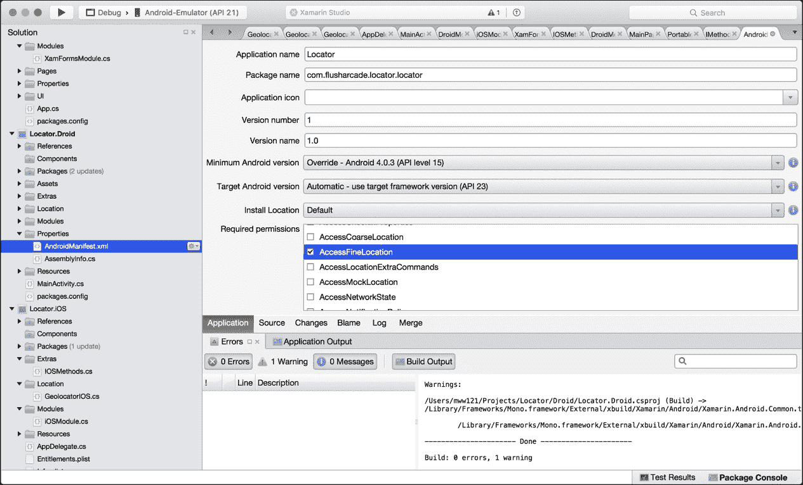

## 创建退出点

您可能已经注意到启动页上添加了额外的退出应用程序的按钮。我们将创建一个抽象的退出应用程序对象。首先创建一个名为 `Extras` 的新文件夹，然后为 `IMethods` 接口创建一个新文件：

```cs
    public interface IMethods 
    { 
        void Exit(); 
    } 

```

### 小贴士

在继续教程之前，尝试自己实现每个项目的本地端。

让我们从 iOS 版本开始：

```cs
    public class IOSMethods 
    { 
        public void Exit() 
        { 
            UIApplication.SharedApplication.PerformSelector(new ObjCRuntime.Selector("terminateWithSuccess"), null, 0f); 
        } 
    } 

```

对于 iOS 版本，我们必须深入到 `SharedApplication` 对象中并执行一个选择器方法 `terminateWithSuccess`。然后我们必须在我们的 iOS 模块中注册这个新对象：

```cs

public void Register(ContainerBuilder builer) 
        { 
            builer.RegisterType<GeolocatorIOS>().As<IGeolocator>().SingleInstance(); 
            builer.RegisterType<IOSMethods>().As<IMethods>().SingleInstance(); 
        } 

```

现在是 Android 实现步骤：

```cs

 public class DroidMethods 
    { 
        public void Exit() 
        { 
            Android.OS.Process.KillProcess(Android.OS.Process.MyPid()); 
        } 
    } 

```

使用 Android 操作系统命名空间，我们使用静态项 `Process` 调用主进程上的 `KillProcess` 函数。同样，我们也在 IoC 容器中注册了这个函数：

```cs
public void Register(ContainerBuilder builer) 
        { 
            builer.RegisterType<GeolocatorDroid>().As<IGeolocator>().SingleInstance(); 
            builer.RegisterType<DroidMethods>().As<IMethods>().SingleInstance(); 
        } 

```

最后，我们在 `MainPageViewModel` 中使用 `IMethods` 接口调用退出函数：

```cs
public MainPageViewModel (INavigationService navigation, Func<Action, ICommand> commandFactory, 
            IMethods methods) : base (navigation) 
        { 
            exitCommand = commandFactory (() => methods.Exit()); 
            locationCommand = commandFactory (() => Navigation.Navigate(PageNames.MapPage)); 
        } 

```

仔细观察，我们使用命令工厂将退出命令初始化为一个新的 `Xamarin.Forms Command`，当这个命令被执行时，它将调用 `IMethods` 接口中的 `Exit` 方法。

我们的最后一步是使用 Google API 为我们的 Android 版本创建一个 API 密钥。

## 为 Android 创建 API 密钥

为了我们能够创建 API 密钥，我们必须访问 Google API 门户。在配置 Google Maps 时，Android 需要执行这个额外的步骤：

### 小贴士

您需要一个 Google 开发者账户来完成本节。

1.  访问以下链接以在 API 门户中创建一个新项目：[`console.developers.google.com/iam-admin/projects`](https://console.developers.google.com/iam-admin/projects).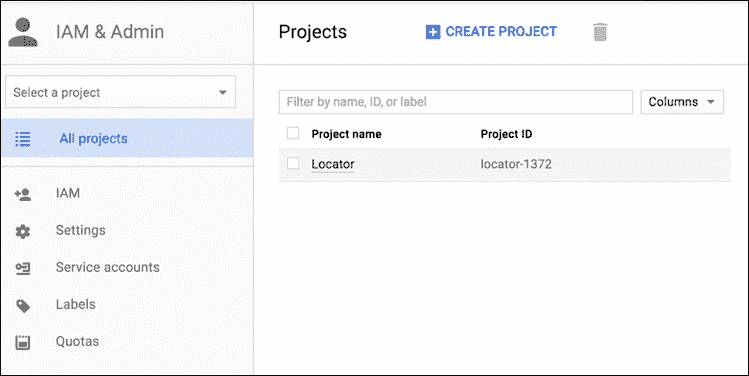

1.  从顶部菜单选择 **创建项目** 并将项目命名为 `Locator`：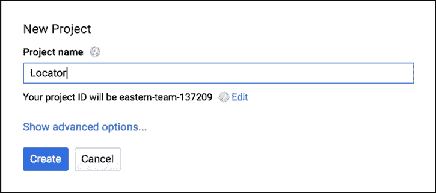

    ### 小贴士

    有关设置 API 密钥的更多信息，请访问此链接：[`developers.google.com/maps/documentation/javascript/get-api-key#get-an-api-key`](https://developers.google.com/maps/documentation/javascript/get-api-key#get-an-api-key).

1.  一旦我们有了新的项目，访问 API 管理器并选择 **Google Maps Android API**：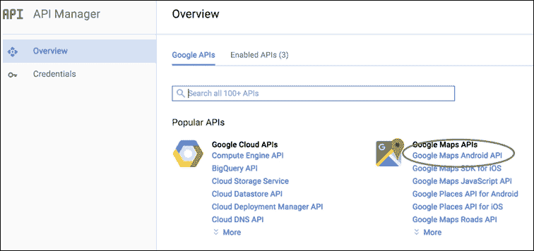

1.  选择 **启用** 按钮，然后点击左侧菜单中的 **凭据**。我们想要从下拉列表中创建一个新的 **API 密钥**：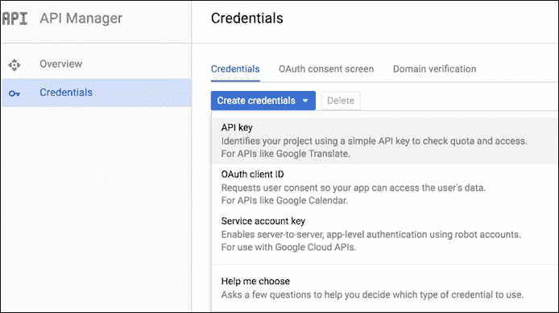

1.  确保我们选择一个 **Android 密钥**：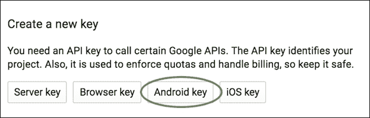

1.  我们将保留名称为 `Android key 1`。现在点击 **创建** 按钮：

1.  最后，让我们选择我们的 Android 密钥并将其放置在 `AndroidManifest.xml` 文件中，该文件中声明了 `YOUR-API-KEY`：

恭喜，我们现在已经将 iOS 和 Android 定位服务与 Google Maps 集成。

现在，让我们继续到 Windows Phone 版本。

## 创建我们的 Windows 项目

再次进入 Visual Studio，我们首先创建一个新的 c-shape 通用的 Windows 项目，并将其命名为 `Locator.WinRT`：


我们可以移除 Windows 商店和共享项目。在移除共享项目之前，将 `app.xaml` 文件移动到 Windows Phone 项目中。

### 提示

`Xamarin.Forms.Maps` 中的 `Map` 对象在 Windows Phone 8.1 中不可用。我们必须使用通用平台。

对于我们的 Windows Phone 版本，我们需要以下内容：

+   用于注册定位器和接口方法的 Windows Phone 模块

+   实现定位器接口

+   实现方法接口

### 注意

想想看...

**这就是我们要做的，以复制 Windows Phone 应用程序吗？** 想想如果我们完全从零开始在 Windows 平台上重建这个应用程序，会有多少额外的工作要做。

接下来，添加三个文件夹，`Modules`、`Location` 和 `Extras`，并为每个文件夹创建一个新的 `.cs` 文件，并相应地命名它们：`WinPhoneModule.cs`、`GeolocatorWinPhone.cs` 和 `WinPhoneMethods.cs`。

首先，我们必须更改 PCL 项目的目标，使其与 Windows Phone 框架兼容。选择两个 PCL 项目的 **Windows Phone 8.1** 目标，然后 Windows 项目可以引用这两个 PCL 项目：

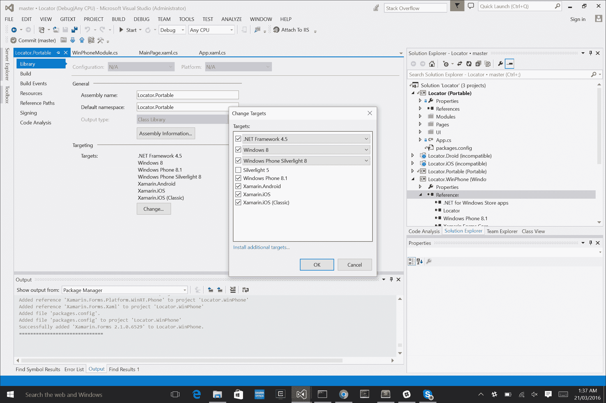

我们还必须导入 `Xamarin.Forms`、`Xamarin.Forms.Maps` 和 `Autofacnuget` 包。

## Windows Phone 的核心定位服务

现在是激动人心的部分。让我们集成核心定位服务。首先，我们必须打开某些权限。打开 `package.appmanifest` 文件，选择 **功能** 选项卡，并选择 **位置** 复选框：


其次，打开 `GeolocatorWinPhone.cs` 文件，让我们开始构建 Windows Phone 定位器类。

让我们先从创建构造函数开始：

```cs
public class GeolocatorWinPhone : IGeolocator 
        { 
            public Subject<IPosition> Positions { get; set; } 

            Geolocator _geolocator; 

            public GeolocatorWinPhone() 
            { 
                Positions = new Subject<IPosition>(); 

                geolocator = new Geolocator(); 
                _geolocator.DesiredAccuracyInMeters = 50; 
            } 
        } 

```

我们正在从`IGeolocator`接口实现一个本地的`Geolocator`，这意味着我们需要为位置创建一个可观察的序列。我们还需要一个`Geolocator`对象来接收位置更新，我们将使用它将事件推送到序列中。对于所有本地的定位器，我们可以为位置点设置精度，这正是我们在以下行中所做的：

```cs
geolocator.DesiredAccuracyInMeters = 50; 

```

我们的下一步是实现`Start`和`Stop`函数：

```cs
public async void Start() 
        { 
            try 
            { 
               var geoposition = await _geolocator.GetGeopositionAsync( 
                    maximumAge: TimeSpan.FromMinutes(5), 
                    timeout: TimeSpan.FromSeconds(10) 
                ); 

                _geolocator.PositionChanged += geolocatorPositionChanged; 

                // push a new position into the sequence 
                Positions.OnNext(new Position() 
                    { 
                        Latitude = geoposition.Coordinate.Latitude, 
                        Longitude = geoposition.Coordinate.Longitude 
                    }); 
            } 
            catch (Exception ex) 
            { 
                Console.WriteLine("Error retrieving geoposition - " + ex); 
            } 

        } 

```

`Start`函数使用`Geolocator`通过异步函数`GetGeopositionAsync`检索位置，该函数将位置的最大年龄作为参数，这意味着一旦时间周期过去，位置将再次更新。当位置更新期间达到超时值时，对这个位置的请求将被取消。我们还在以下函数中监听事件处理程序`PositionChanged`：

```cs
        private void GeolocatorPositionChanged(Geolocator sender, PositionChangedEventArgs args) 
        { 
            // push a new position into the sequence 
            Positions.OnNext(new Position () 
                { 
                    Latitude = args.Position.Coordinate.Latitude, 
                    Longitude = args.Position.geoposition.Coordinate.Longitude 
                }); 
        } 

```

实际上我们有两个地方，它们会将新的地理位置的纬度和经度推送到可观察的序列中。

现在我们添加`Stop`函数：

```cs
        public void Stop() 
        { 
            // remove event handler 
            _geolocator.PositionChanged -= GeolocatorPositionChanged; 
        } 

```

这所做的只是移除了我们在`Start`函数中分配的事件处理函数。

### 注意

你应该在这个项目中注意到发展模式，比如我们如何实现抽象接口、生成模块、注册类型等等。这些流程在所有平台上都是一样的。

这就是`Geolocator`类的全部内容；我们现在可以继续到`WinPhoneModule`：

```cs
    public class WinPhoneModule : IModule 
    { 
        public void Register(ContainerBuilder builer) 
        { 
            builer.RegisterType<GeolocatorWinPhone>().As<IGeolocator>().SingleInstance(); 
            builer.RegisterType<WinPhoneMethods>().As< IMethods>().SingleInstance(); 
        } 
    } 

```

现在让我们来看看`WinPhoneMethods`类。我们只需要实现一个函数，`Exit`。

## 应用程序类

静态类`Application`在 iOS 的`UIApplication`类中扮演着类似的角色。我们只是引用当前的应用程序，并终止：

```cs
 public class WinPhoneMethods : IMethods 
        { 
            public void Exit() 
            { 
                Application.Current.Terminate(); 
            } 
        } 

```

现在我们只需用`MainPage.xaml`页面构建剩余的元素：

```cs
<forms:WindowsPhonePage 
    x:Class="Locator.WinPhone.MainPage" 

    mc:Ignorable="d" 
    Background="{ThemeResource ApplicationPageBackgroundThemeBrush}"> 
</forms:WindowsPhonePage> 

```

我们也在`MainPage.xaml.cs`文件中这样做：

```cs
public MainPage() 
    { 
        InitializeComponent(); 

        InitIoC(); 

        NavigationCacheMode = NavigationCacheMode.Required; 
        LoadApplication(new Locator.App()); 
    } 

    private void InitIoC() 
    { 
        IoC.CreateContainer(); 
            IoC.RegisterModule(new WinPhoneModule()); 
            IoC.RegisterModule(new SharedModule(true)); 
            IoC.RegisterModule(new XamFormsModule()); 
            IoC.RegisterModule(new PortableModule()); 
            IoC.StartContainer(); 

    } 

```

与上一章完全相同，我们正在启动`IoC`容器，添加我们的模块，并加载`Xamarin.Forms.App`对象。唯一的区别是`SharedModule`，因为我们传入 true 所以使用`NativeMessageHandler`。

最后，我们还有一个问题要解决。自从`Xamarin.Forms` 1.5 以来，只有 Windows Phone Silverlight 支持使用 Google Maps。我们必须添加一个额外的库来在 Windows Phone 8.1 中使用地图。

### 注意

感谢*Peter Foot*解决这个问题。

幸运的是，有一个开源库可以解决这个问题。我们必须安装 nuget 包`InTheHand.Forms.Maps`。

### 提示

这个库仅适用于`Xamarin.Forms` 2.1.0.6529，这意味着整个示例必须坚持这个版本的`Xamarin.Forms`。

然后，在`App.xaml.cs`内部，我们需要初始化`Xamarin.Forms`和`Xamarin.Forms.Maps`。`Xamarin.Forms.Maps`框架通过`InTheHand.Forms.Maps`库这样初始化：

```cs
if (rootFrame == null) 
        { 
            rootFrame = new Frame(); 

            rootFrame.CacheSize = 1; 

            if (e.PreviousExecutionState == ApplicationExecutionState.Terminated) 
            { 
            } 

            Xamarin.Forms.Forms.Init(e); 
            InTheHand.FormsMaps.Init("YOUR-API-KEY"); 

            Window.Current.Content = rootFrame; 
        } 

```

就像那样，我们现在已经在 Windows Phone 上有了应用程序。现在我们已经有了运行在 Google Maps 上的核心位置服务，让我们通过 Google API 平台更进一步。

## 网络服务和数据合约

我们现在将探讨创建一个网络服务控制器来访问 Google 提供的网络服务。这些是实现下载 JSON 数据、反序列化它并将这些数据馈送到可观察序列以进行处理的有用实现。有了网络服务控制器，我们可以使用更多的`IObservable`接口。这些序列将用于从网络源接收反序列化的 JSON 对象，并将这些对象馈送到我们的视图模型中。

我们将把我们的网络服务控制器保存在**Locator.Portable**项目中。记住，我们可以跨不同平台共享这项工作，因为所有平台都使用某种形式的 HTTP 客户端来连接到 Web URL。

## 关于数据合约？

您的数据合约是一个 JSON 对象，用于吸收反序列化对象的元素，所以每次我们拉取原始 JSON 数据时，您的合约将是反序列化的对象或对象。

那么，下一个问题是，我们要从我们的应用程序中拉取哪些数据？

我们将使用 Google 的`Geocoder` API 将地址信息转换为纬度和经度位置。我们将拉取一个地址列表，计算它们的纬度和经度位置，计算离我们当前位置最近的地址，并在地图上放置一个标记。

我们的第一步是在`Locator.Portable`中创建一个名为`WebServices`的新文件夹。在这个文件夹内部，我们想要创建一个名为`GeocodingWebServiceController`的新文件夹，并在其中创建一个名为`Contracts`的文件夹。让我们首先实现我们的合约。实现 JSON 对象的一个简单快捷的方法是使用像这样的在线应用程序：[`json2csharp.com/`](http://json2csharp.com/)。

当我们拉取 JSON 数据时，需要花费时间来查找文本中所有必需的属性。这提供了一种很好的方式，即调用网络服务 URL，检索一些示例 JSON 数据，并将这些 JSON 数据粘贴到这里的框中：

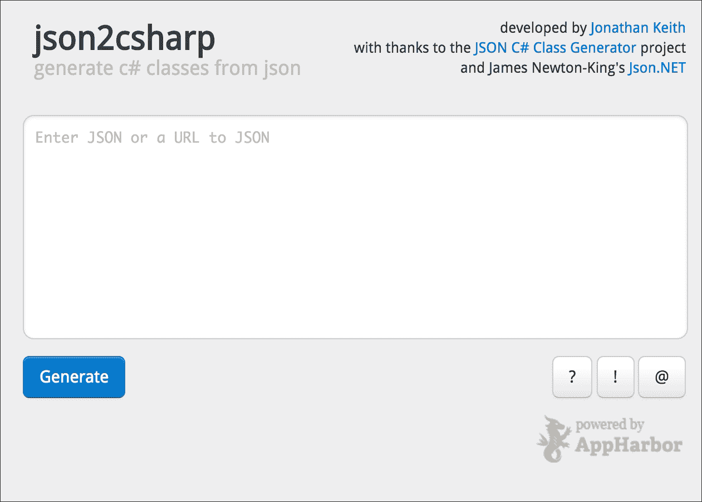

### 注意

感谢**乔纳森·基思**为我们节省了时间。

此应用程序根据您输入的 JSON 数据创建 c-sharp JSON 对象。现在让我们将我们的示例 JSON 数据粘贴到框中，但在我们能够这样做之前，我们必须访问**Google API**。

## 为地理编码创建另一个 API 密钥

重新登录到 Google 开发者控制台，我们的第一步是从 API 管理器中启用地理编码 API：

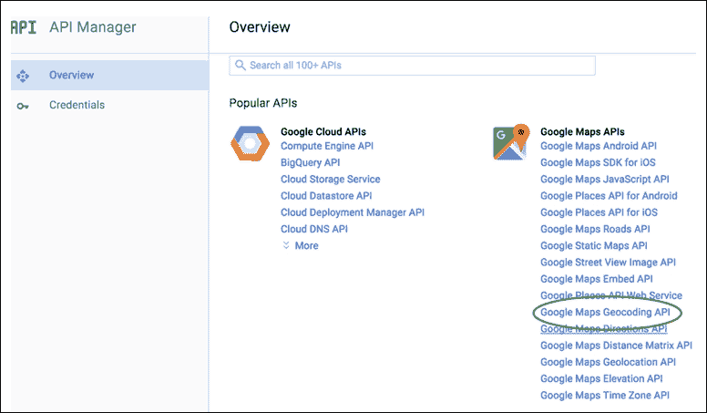

我们然后选择我们之前创建的`Locator`项目，这次我们将创建一个浏览器密钥，通过 HTTP 请求访问地理编码 API：


将密钥命名为“地理编码密钥”并点击**创建**。我们现在将使用这个密钥来处理传递给地理编码 API 的每个 HTTP 请求：

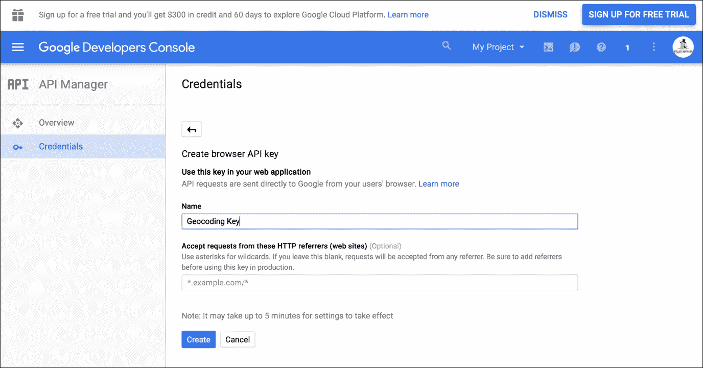

## 创建 GeocodingWebServiceController

创建`GeocodingWebServiceController`的第一步是使用您的 API 密钥访问网络 URL 以拉取一些示例 JSON 数据；这里是一个测试链接：`https://maps.googleapis.com/maps/api/geocode/json?address=1600+Amphitheatre+Parkway,+Mountain+View,+CA&key=YOUR_API_KEY`.

在`YOUR_API_KEY`处，将此文本替换为您的全新创建的 API 密钥，然后将此链接粘贴到浏览器中。你应该会得到如下 JSON 结果：

```cs
{ 
   "results" : [ 
      { 
         "address_components" : [ 
            { 
               "long_name" : "1600", 
               "short_name" : "1600", 
               "types" : [ "street_number" ] 
            }, 
            { 
               "long_name" : "Amphitheatre Parkway", 
               "short_name" : "Amphitheatre Pkwy", 
               "types" : [ "route" ] 
            }, 
            { 
               "long_name" : "Mountain View", 
               "short_name" : "Mountain View", 
               "types" : [ "locality", "political" ] 
            }, 
            { 
               "long_name" : "Santa Clara County", 
               "short_name" : "Santa Clara County", 
               "types" : [ "administrative_area_level_2", "political" ] 
            }, 

```

我们将复制并粘贴整个生成的 JSON 到**Json2Sharp**中，以创建我们的 c-sharp 对象：

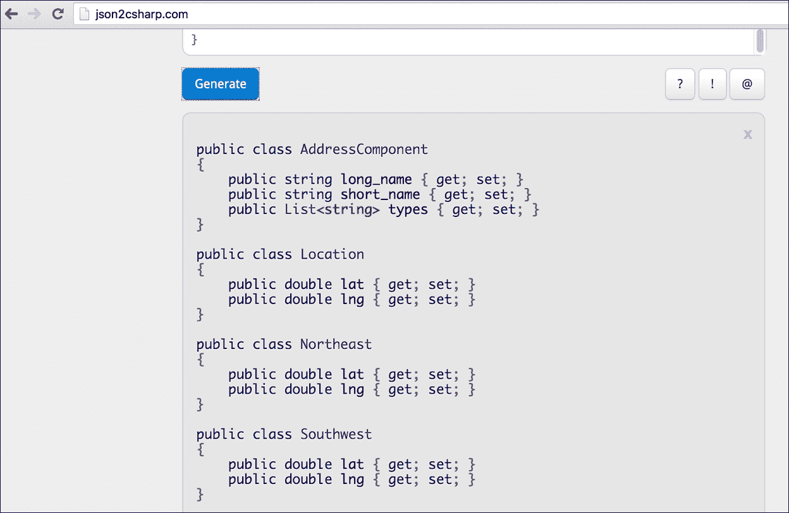

由于有很多 JSON 对象，所以在`Contracts`文件夹中，创建以下文件：

+   AddressComponentContract.cs

+   GeocodingContract.cs

+   GeocodingResultContract.cs

+   GeometryContract.cs

+   LocationContract.cs

+   NortheastContract.cs

+   SouthwestContract.cs

+   ViewportContract.cs

让我们从`AddressComponentContract.cs`开始：

```cs
public sealed class AddressComponentContract 
    { 
        #region Public Properties 

        public string long_name { get; set; } 

        public string short_name { get; set; } 

        public List<string> types { get; set; } 

        #endregion 
    } 

```

确保我们将所有这些合约放在`Locator.Portable.GeocodingWebServiceController.Contracts`命名空间中。

### 备注

命名空间应该按照文件夹层次结构命名。

现在让我们来实现`GeocodingContract`：

```cs
    public sealed class GeocodingContract 
    { 
        #region Public Properties 

        public List<GeocodingResultContract> results { get; set; } 

        public string status { get; set; } 

        #endregion 
    } 

```

其余的文件完全相同；我们只是复制由**Json2Sharp**创建的 c-sharp 对象。现在是我们完成其他任务的时候了：

```cs
    public sealed class GeocodingResultContract 
    { 
        #region Public Properties 

        public List<AddressComponentContract> address_components { get; set; } 

        public string formatted_address { get; set; } 

        public GeometryContract geometry { get; set; } 

        public string place_id { get; set; } 

        public List<string> types { get; set; } 

        #endregion 
    } 

```

确保你双检查属性名称与 JSON 属性完全相同，否则 JSON 字符串中的值将无法正确反序列化。

### 备注

我们不会粘贴每个合约，因为这应该足够指导你构建其他的。

现在我们有了地理编码合约，让我们为`GeocodingWebServiceController`创建接口：

```cs
public interface IGeocodingWebServiceController 
    { 
        #region Methods and Operators 

        IObservable<GeocodingContract> GetGeocodeFromAddressAsync (string address, string city, string state); 

        #endregion 
    } 

```

这是一个非常小的接口；我们只有一个函数，`GetGeocodeFromAddressAsync`。该函数需要三个参数来构建 Web URL 中的参数。

现在让我们来实现这个接口。

### 小贴士

在面向对象和抽象编码中，一个好的做法是在实现与接口相对应的类之前声明接口；这将帮助你更快地构建类。

## Newtonsoft.Json 和 Microsoft HTTP 客户端库

由于我们将要反序列化 JSON，我们需要导入一个 JSON 框架库。Newtonsoft 是最常用的框架之一，所以让我们将这个库导入到我们的**Locator.Portable**项目中：


我们还需要导入 HTTP 客户端库，以便我们的 Web 服务控制器可以访问在线 Web 服务：

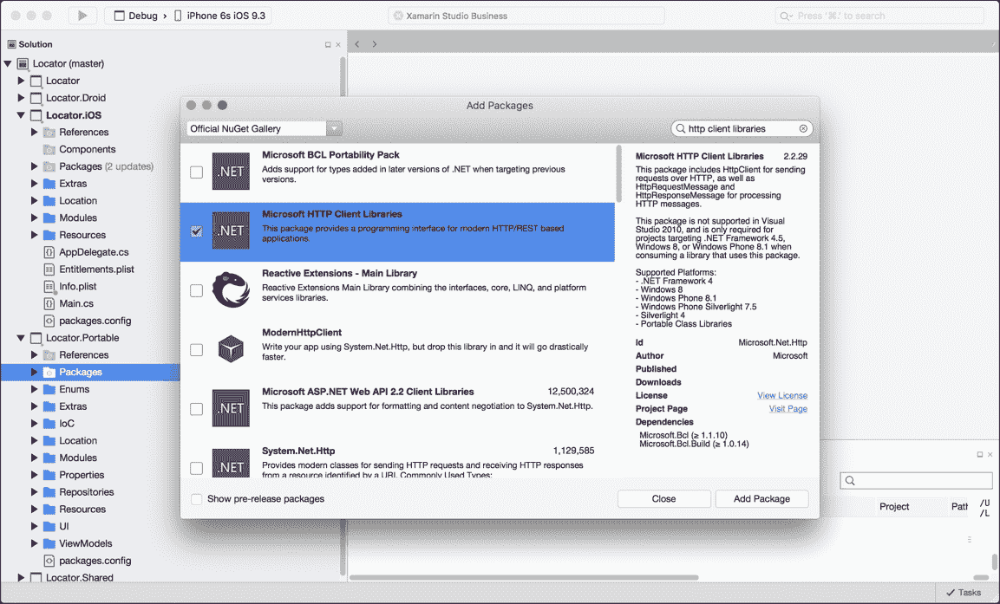

现在我们已经为我们的**Locator.Portable**项目添加了所有额外的库，在我们实现`IGeocodingWebServiceController`之前，我们必须对项目结构做一些补充：

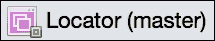

右键单击**Locator**并创建一个名为**Locator.Shared**的新共享项目：

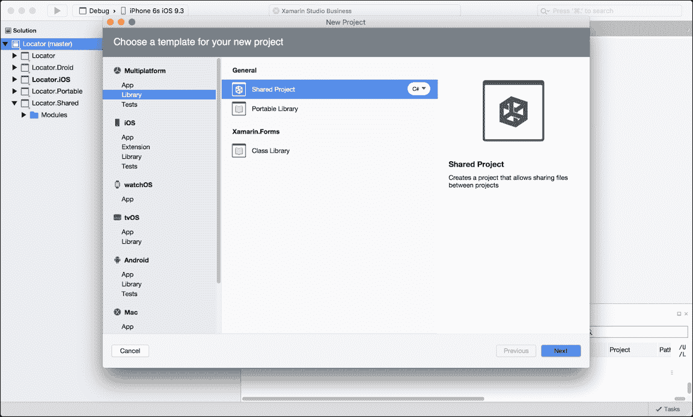

## ModernHttpClient 和客户端信息处理器

在这个项目中，我们将创建一个共享模块来在 IoC 容器中注册 `HttpClientHandler` 类。`HttpClientHandler` 是一个消息处理器类，它接收 HTTP 请求并返回 HTTP 响应。消息处理器在客户端和服务器端都用于处理/委派不同端点之间的请求。

在我们的示例中，我们关注客户端，因为我们正在调用服务器；我们的客户端处理器将用于处理来自 HTTP 客户端的 HTTP 消息。

让我们从添加 `ModernHttpClient` 库到我们的 **Locator**（我们将把这个项目称为 `Xamarin.Forms` 项目）以及所有原生项目开始：

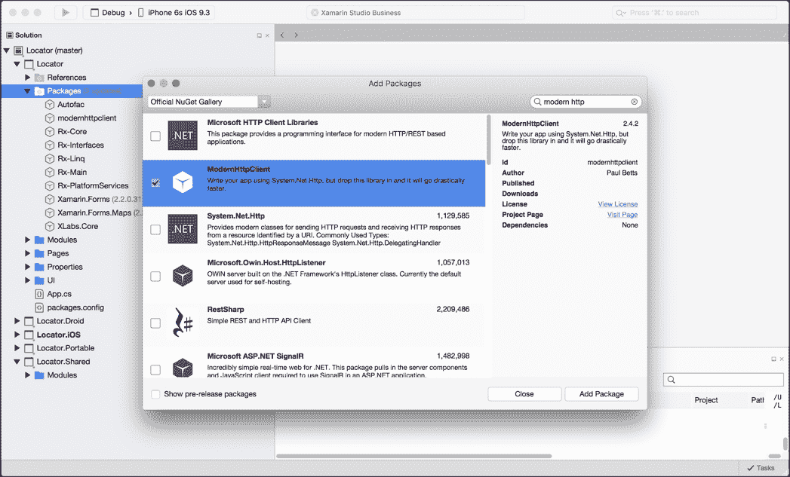

我们还希望将 Microsoft 客户端库包添加到所有原生项目中。

在我们的共享项目中，请记住我们无法导入库；这些项目仅用于共享代码。在这个项目中，我们想要创建一个名为 `Modules` 的文件夹。在 `Modules` 文件夹中，创建一个名为 `SharedModule.cs` 的新文件，并实现以下内容：

```cs
public sealed class SharedModule : IModule 
    { 
        #region Fields 

        private bool isWindows; 

        #endregion 

        #region Constructors and Destructors 

        public SharedModule(bool isWindows) 
        { 
            isWindows = isWindows; 
        } 

        #endregion 

        #region Public Methods and Operators 

        public void Register(ContainerBuilder builder) 
        { 
            HttpClientHandler clientHandler = isWindows ? new HttpClientHandler() : new NativeMessageHandler(); 
            clientHandler.UseCookies = false; 
            clientHandler.AutomaticDecompression = DecompressionMethods.Deflate | DecompressionMethods.GZip; 
            builder.Register(cb => clientHandler).As<HttpClientHandler>().SingleInstance(); 
        } 

        #endregion 
    } 

```

有一个需要注意的小变化，那就是在 iOS 和 Android 项目以及 Windows Phone 项目之间。Windows 必须在 IoC 容器中的 `HttpClientHandler` 上使用 `NativeMessageHandler`。在 iOS 和 Android 中，我们可以使用默认的 `HttpClientHandler`。

我们告诉客户端处理器我们不会使用 cookies，并允许客户端处理器自动解压缩通过客户端处理器拉取的数据（**GZIP** 是一种常见的 JSON 数据压缩形式）。

现在，让我们将注意力集中在构造函数上。我们只需传入一个 `bool` 来确定我们是否正在使用 Windows 来注册适用于当前平台的正确类型的信息处理器。

现在，让我们将此模块添加到 `AppDelegate` 和 `MainActivity` 文件中的注册中；它必须在 `LoadApplication` 函数之前调用：

```cs
private void InitIoC() 
        { 
            IoC.CreateContainer (); 
            IoC.RegisterModule (new IOSModule()); 
            IoC.RegisterModule (new SharedModule(false)); 
            IoC.RegisterModule (new XamFormsModule()); 
            IoC.RegisterModule (new PortableModule()); 
            IoC.StartContainer (); 
        } 

```

太棒了！我们现在可以在 IoC 容器中访问我们的 HTTP 客户端处理器，所以让我们开始构建 `GeocodingWebServiceController` 类：

```cs
public sealed class GeocodingWebServiceController : IGeocodingWebServiceController 
    { 
        #region Fields 

        /// <summary> 
        /// The client handler. 
        /// </summary> 
        private readonly HttpClientHandler clientHandler; 

        #endregion 

#region Constructors and Destructors 

        public GeocodingWebServiceController (HttpClientHandler clientHandler) 
        { 
            clientHandler = clientHandler; 
        } 

        #endregion  

     } 

```

## 将 JSON 数据喂入 IObservable 框架

由于我们将在 IoC 容器中注册此 Web 服务控制器，我们可以从 `SharedModule` 类中提取并注册我们刚刚创建的客户端处理器。现在我们必须实现我们在接口中定义的函数：

```cs
#region Public Methods  

        public IObservable<GeocodingContract> GetGeocodeFromAddressAsync(string address, string city, string state) 
        { 
            var authClient = new HttpClient(_clientHandler); 

            var message = new HttpRequestMessage(HttpMethod.Get, new Uri(string.Format(ApiConfig.GoogleMapsUrl, address, city, state))); 

            return Observable.FromAsync(() => authClient.SendAsync(message, new CancellationToken(false))) 
                .SelectMany(async response => 
                    { 
                        if (response.StatusCode != HttpStatusCode.OK) 
                        { 
                            throw new Exception("Respone error"); 
                        } 

                        return await response.Content.ReadAsStringAsync(); 
                    }) 
                .Select(json => JsonConvert.DeserializeObject<GeocodingContract>(json)); 
        } 

        #endregion 

```

起初可能看起来有些令人畏惧，但让我们将其分解。我们的 Web 服务控制器将下载数据，将数据反序列化到我们的主要 JSON 对象 `GeocodingContract` 中，并在可观察序列中创建合约。

当我们实例化一个新的 `HttpClient` 时，我们必须传递我们注册的客户端处理程序来委派从 HTTP 客户端发送的请求消息。然后我们创建一个新的 `Http.Get` 消息；这将通过 `HttpClient` 发送并通过消息处理程序（`HttpClientHandler`）委派，然后消息处理程序将接收 JSON 响应。

这就是事情变得复杂的地方。看看 `Observable.FromAsync` 函数；这个方法接受一个异步函数，将运行并等待该函数，并将数据作为可观察序列返回。异步函数必须返回 `IObservable`。

我们传递的函数是 `HttpClient` 的 `SendAsync` 函数；然后我们使用 RX 函数 `SelectMany` 来获取所有响应对象。如果每个响应对象都带有 HTTP 状态码 `200` (`OK`)，我们就将响应内容作为字符串返回。注意表达式前面的 `async` 关键字；我们必须使用异步函数来等待 `ReadAsAsync` 函数并返回响应内容作为 JSON 字符串。

最后，我们使用 RX 函数 `Select` 来获取每个响应字符串并返回反序列化的 `GeocodingContract`。此合约将被输入到可观察序列中，并返回给原始调用者 `Observable.FromAsync`，然后它将作为函数返回的数据。

## 更多响应式扩展

在我们继续之前，让我们更多地讨论我们刚刚使用的 RX 函数。`Select` 函数用于迭代任何 `List`、`Enumerable` 或 `IObservable`，并将每个项的值取出来创建一个新的可观察序列。

假设我们有一个具有字符串属性 `Name` 的对象列表，我们执行以下操作：

```cs
var newObservable = list.Select (x => x);  

```

我们只是返回相同的项序列，但然后我们做类似这样的事情：

```cs
var newObservable = list.Select (x => x.Name);  

```

我们的新序列将只包含每个对象的 `Name` 属性。这些函数对于过滤流和列表非常有用。

## 资源 (RESX) 文件

注意在我们的 `GetGeocodeFromAddressAsync` 函数中，我们引用了一个静态类，`ApiConfig`：

```cs
ApiConfig.GoogleMapsUrl 

```

这是一个包含应用程序资源的技术，例如字符串、URL、常量变量、设置属性等。它还用于具有基于语言设置的不同的常量变量值的语言。通常，你会这样让你的应用支持多语言。

让我们在 **Locator.Portable** 项目中创建一个名为 `Resources` 的新文件夹：

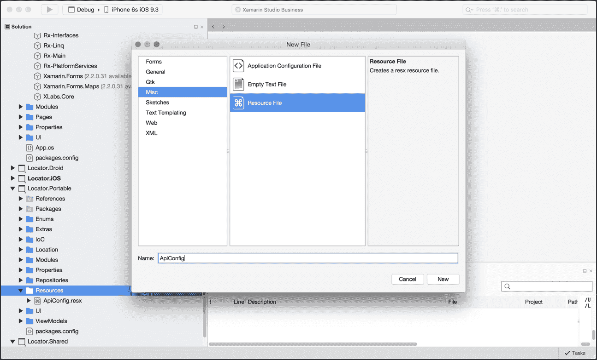

在 `ApiConfig.Designer.cs` 文件中，我们必须根据文件夹层次结构设置命名空间。在这个例子中，它是 **Locator.Portable** | **Resources**。

### 小贴士

**Locator.Portable** 是我们程序集的名称。我们必须知道程序集名称，以便在构建应用程序时知道文件夹将存储在哪里。要查找您的程序集名称，请访问属性页面，如图所示。

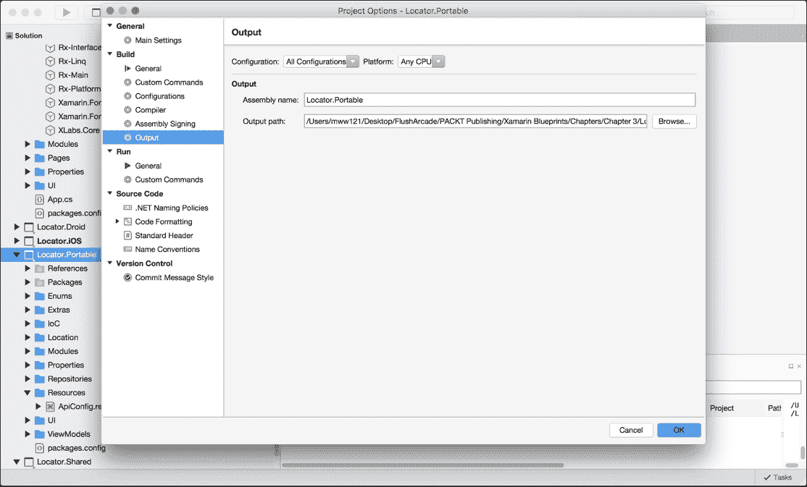

现在我们有了`ApiConfig.resx`文件，让我们为`GoogleMapsUrl`属性添加一个变量；在`ApiConfig.resx`文件中粘贴以下内容：

```cs
  <!-- url --> 
  <data name="GoogleMapsUrl" xml:space="preserve"> 
    <value>https://maps.googleapis.com/maps/api/geocode/json?address={0},+{1},+{2}&amp;key={YOUR-BROSWER-API-KEY}</value> 
  </data> 

```

### 注意

当你保存此文件时，你会注意到`ApiConfig.Designer.resx`文件会自动生成，这意味着命名空间可能改变到错误的文件夹路径。有时我们必须手动更改文件夹路径，每次此文件重新生成时。

## 使用 GeocodingWebServiceController

现在我们已经设置了我们的 Web 服务控制器，让我们将其集成到我们的`MapPageViewModel`中。我们的第一步是在 IoC 容器中注册 Web 服务控制器；打开`PortableModule.cs`并在`Register`函数中添加以下内容：

```cs
builer.RegisterType<GeocodingWebServiceController> ().As<IGeocodingWebServiceController>().SingleInstance();  

```

现在我们更新`MapPageViewModel`中的构造函数，以使用 IoC 容器中的`GeocodingWebServiceController`：

```cs
        #region Constructors 

        public MapPageViewModel (INavigationService navigation, IGeolocator geolocator,  
            IGeocodingWebServiceController geocodingWebServiceController) : base (navigation) 
        { 
            _geolocator = geolocator; 
            _geocodingWebServiceController= geocodingWebServiceController; 

            LocationUpdates = new Subject<IPosition> (); 
        } 

        #endregion 

```

我们的下一步是添加一个静态地址数组作为字典：

```cs
        #region Constants 

        private IDictionary<int, string[]> addresses = new Dictionary<int, string[]>() 
        { 
            {0, new string[] { "120 Rosamond Rd", "Melbourne", "Victoria" }}, 
            {1, new string[] { "367 George Street", "Sydney", "New South Wales" }}, 
            {2, new string[] { "790 Hay St", "Perth", "Western Australi" }}, 
            {3, new string[] { "77-90 Rundle Mall", "Adelaide", "South Australia" }}, 
            {4, new string[] { "233 Queen Street", "Brisbane", "Queensland" }}, 
        }; 

        #endregion  

```

我们将使用地理编码 API 来确定所有这些地址位置的纬度和经度位置，并从你的当前位置确定哪个更近。

## OnNavigatedTo 和 OnShow

在我们进一步使用地理编码 API 之前，我们需要对导航设置做一些补充。让我们首先实现所有内容页的`OnNavigatedTo`函数。创建一个名为`INavigableXamFormsPage.cs`的新文件，并粘贴以下内容：

```cs
    internal interface INavigableXamarinFormsPage 
    { 
        void OnNavigatedTo(IDictionary<string, object> navigationParameters); 
    } 

```

### 注意

注意到`internal`关键字；这是因为这个类永远不会离开`Xamarin.Forms`项目。

现在我们想让每个页面都继承这个接口并创建`OnNavigatedTo`函数：

```cs
public partial class MainPage : ContentPage, INavigableXamarinFormsPage  
    { 
        public void OnNavigatedTo(IDictionary<string, object> navigationParameters) 
        { 
        } 
    } 

public partial class MapPage : ContentPage, INavigableXamarinFormsPage 
    { 
        public void OnNavigatedTo(IDictionary<string, object> navigationParameters) 
        { 
        } 
    } 

```

现在我们想在每次页面导航到时调用`OnNavigatedTo`函数。首先，让我们更新`NavigationService`的接口：

```cs
    public interface INavigationService 
    { 
        Task Navigate (PageNames pageName, IDictionary<string, object> navigationParameters); 
    } 

```

现在打开`NavigationService`类并更新`Navigate`函数：

```cs
        #region INavigationService implementation 

        public async Task Navigate (PageNames pageName, IDictionary<string, object> navigationParameters) 
        { 
            var page = getPage (pageName); 

            if (page != null)  
            { 
                var navigablePage = page as INavigableXamarinFormsPage; 

                if (navigablePage != null)  
                { 
                    await IoC.Resolve<NavigationPage> ().PushAsync (page); 
                    navigablePage.OnNavigatedTo (); 
                } 
            } 
        } 

        #endregion 

```

页面被推入后，我们随后调用`OnNavigatedTo`函数。

现在我们想在页面视图模型中也做类似的事情。在你的`ViewModelBase`类中添加以下内容：

```cs
        public void OnShow(IDictionary<string, object> parameters) 
        { 
            LoadAsync(parameters).ToObservable().Subscribe( 
                result => 
                { 
                    // we can add things to do after we load the view model 
                },  
                ex => 
                { 
                    // we can handle any areas from the load async function 
                }); 
        } 

        protected virtual async Task LoadAsync(IDictionary<string, object> parameters) 
        { 
        } 

```

`OnShow`函数将接收来自对应页面的`OnNavigatedTo`函数的导航参数。

注意处理异步函数的 RX 方法，当`LoadAsync`完成后？

我们有处理`LoadAsync`函数结果和错误的选择。你可能也注意到了使用箭头的简短表达式。这种类型的语法被称为 lambda 表达式，这是一种非常常见的 C#语法，用于简化函数、参数和委托。我们的`LoadAsync`也是虚拟的，这意味着任何实现此接口的页面视图模型都可以重写此函数。

现在我们对`Xamarin.Forms`项目（`Locator`）做一些额外的补充。在`UI`文件夹中创建一个新文件，命名为`XamarinNavigationExtensions.cs`。现在进行实现：

```cs
public static class XamarinNavigationExtensions 
    { 
        #region Public Methods and Operators 

        // for ContentPage 
        public static void Show(this ContentPage page, IDictionary<string, object> parameters) 
        { 
            var target = page.BindingContext as ViewModelBase; 
            if (target != null) 
            { 
                target.OnShow(parameters); 
            } 
        } 

        #endregion 

    } 

```

仔细观察，我们实际上是在为所有`ContentPage`类型创建扩展函数。`ContentPage`的`OnShow`函数将提取绑定上下文作为`ViewModelBase`并调用视图模型的`OnShow`函数，然后视图模型将调用`LoadAsync`。最后，我们对`MapPage.xaml.cs`和`MainPage.xaml.cs`进行更改：

```cs
        public void OnNavigatedTo(IDictionary<string, object> navigationParameters) 
        { 
            this.Show (navigationParameters); 
        } 

```

做得很好！我们刚刚实现的是一个 Windows Phone 原则。我们知道当`OnNavigatedTo`函数被调用时，我们的`XAML`布局已经相应地调整了大小。这个优势在于我们可以在该函数内部从页面中检索 x、y、高度和宽度数值。

## 毕达哥拉斯等角投影

现在回到地理编码 API。我们将实现计算纬度和经度（当前位置）最近地址背后的数学。

对于我们的第一步，我们需要为`MapPageViewModel`添加一些属性：

```cs
#region Private Properties 

private IList<IPosition> _positions; 

private Position _currentPosition; 

private string _closestAddress; 

private int _geocodesComplete = 0; 

#endregion 

```

现在对于额外的`public`属性，它将保存最近位置的字符串地址：

```cs
public string ClosestAddress 
        { 
            get 
            { 
                return _closestAddress; 
            } 

            set 
            { 
                if (value.Equals(_closestAddress)) 
                { 
                    return; 
                } 

                _closestAddress = value; 
                OnPropertyChanged("ClosestAddress"); 
            } 
        } 

```

现在我们必须为位置变化添加另一个`Subject`序列：

```cs
#region Subjects 

public Subject<IPosition> ClosestUpdates { get; set; }  

#endregion 

```

这必须在构造函数中初始化：

```cs
ClosestUpdates = new Subject<IPosition> (); 

```

现在是时候进入有趣的部分了。

## 我们该如何计算最近的位置？

让我们从第一个私有函数开始，它将从地址获取位置：

```cs
        public async Task GetGeocodeFromAddress(string address, string city, string state) 
        { 
            var geoContract = await _geocodingWebServiceController.GetGeocodeFromAddressAsync(address, city, state); 

            if (geoContract != null && geoContract.results != null && geoContract.results.Count > 0) 
            { 
                var result = geoContract.results.FirstOrDefault(); 

                if (result != null && result.geometry != null && result.geometry.location != null) 
                { 
                    _geocodesComplete++; 

                    _positions.Add(new Position() 
                        { 
                            Latitude = result.geometry.location.lat, 
                            Longitude = result.geometry.location.lng, 
                            Address = string.Format("{0}, {1}, {2}", address, city, state) 
                        }); 

                    // once all geocodes are found, find the closest 
                    if ((_geocodesComplete == _positions.Count) && _currentPosition != null) 
                    { 
                        FindNearestSite(); 
                    } 
                } 
            } 
        } 

```

在这个函数中，我们终于可以使用我们的`GeocodingWebServiceController`了。

看看我们是如何传递将构成 Web 服务 URL 的变量的？

对于每个地址，我们必须 ping 这个 API 调用以获取计算最近位置所需的纬度和经度。然后我们对数据合同中的值进行一系列检查，以确保它们不是 null，直到我们得到`GeometryContract`值；然后我们将使用这些值创建一个新的位置并将其添加到列表中。

现在让我们对`Position`类和接口做一些小的修改：

```cs
    public class Position : IPosition 
    { 
        public string Address {get; set;} 
    } 

    public interface IPosition 
    { 
        double Latitude {get; set;} 

        double Longitude {get; set;} 

        public string Address {get; set;} 
    } 

```

添加`Address`属性，以便我们可以记录最近属性的地址字符串。我们需要在位置中记录这个信息，因为我们向 API 发送了如此多的请求，它们不一定按顺序完成，所以我们不能期望使用索引引用来获取列表中的位置索引，以与数组中的地址相对应。

现在让我们添加用于计算距离的数学函数，使用`PythagorasEquirectangular`投影。它使用角投影来计算地图平面上两个坐标之间的距离。我们还需要为`PythagorasEquirectangular`函数提供一个`DegreesToRadians`转换：

```cs
private double DegreesToRadians(double deg)  
        { 
            return deg * Math.PI / 180; 
        } 

        private double PythagorasEquirectangular  
 (double lat1, double lon1, double lat2, double lon2) 
        { 
            lat1 = DegreesToRadians(lat1); 
            lat2 = DegreesToRadians(lat2); 
            lon1 = DegreesToRadians(lon1); 
            lon2 = DegreesToRadians(lon2); 

            // within a 10km radius 
            var radius = 10; 
            var x = (lon2 - lon1) * Math.Cos((lat1 + lat2) / 2); 
            var y = (lat2 - lat1); 
            var distance = Math.Sqrt(x * x + y * y) * radius; 

            return distance; 
        } 

```

如果距离超出了半径值，则不会使用。

### 小贴士

尝试调整这个设置，看看你得到的结果。

现在来看`FindNearestSite`函数：

```cs
private void FindNearestSite() 
        { 
            if (_geolocationUpdating) 
            { 
                _geolocationUpdating = false; 
                _geolocator.Stop(); 
                GeolocationButtonTitle = "Start"; 
            } 

            double mindif = 99999; 
            IPosition closest = null; 
            var closestIndex = 0; 
            var index = 0; 

            if (_currentPosition != null) 
            { 
                foreach (var position in _positions) 
                { 
                    var difference = PythagorasEquirectangular(_currentPosition.Latitude, _currentPosition.Longitude, 
                        position.Latitude, position.Longitude); 

                    if (difference < mindif) 
                    { 
                        closest = position; 
                        closestIndex = index; 
                        mindif = difference; 
                    } 

                    index++; 
                } 

                if (closest != null) 
                { 
                    var array = _addresses[closestIndex]; 
                    Address = string.Format("{0}, {1}, {2}", array[0], array[1], array[2]); 
                    ClosestUpdates.OnNext(closest); 
                } 
            } 
        } 

```

当所有地址的地理编码都已获取并添加到位置列表中时，我们将调用此功能。然后我们遍历所有位置，将每个位置与我们的当前位置进行比较，确定哪个坐标差值最小，并使用这个作为我们的最近位置。然后我们将一个新的位置推送到`ClosestUpdates`可观察序列，我们将在`MapPage`上订阅它。

在`MapPageViewModel`的最后一步是重写`LoadAsync`函数：

```cs
        protected override async Task LoadAsync (IDictionary<string, object> parameters) 
        { 
            var index = 0; 

            for (int i = 0; i < 5; i++) 
            { 
                var array = _addresses [index]; 
                index++; 

                GetGeocodeFromAddress(array[0], array[1], array[2]).ConfigureAwait(false); 
            } 
        }  

```

这就是一切开始的地方；当页面加载时，它将遍历每个地址并下载地理编码，然后当我们计算完整个地址列表的计数后，我们找到最近的位置并将其推送到`ClosestUpdates`序列。我们还希望为每个地址并行运行`GetGeocodeFromAddress`函数；这就是为什么我们将`ConfigureAwait`设置为 false。

现在我们对`MapPage`做一些修改。我们现在将为`MapPage`使用两个`IDisposables`，一个用于视图模型中的每个主题：

```cs
private IDisposable _locationUpdateSubscriptions; 

private IDisposable _closestSubscriptions;  

```

现在我们更新了`OnAppear`和`OnDisappear`函数来处理对`Subjects`的订阅和释放：

```cs
private void HandleDisappearing (object sender, EventArgs e) 
        { 
            _viewModel.OnDisppear (); 

            if (_locationUpdateSubscriptions != null)  
            { 
                _locationUpdateSubscriptions.Dispose (); 
            } 

            if (_closestSubscriptions != null)  
            { 
                _closestSubscriptions.Dispose (); 
            } 
        } 

        private void HandleAppearing (object sender, EventArgs e) 
        { 
            _viewModel.OnAppear (); 

            _locationUpdateSubscriptions = _viewModel.LocationUpdates.Subscribe (LocationChanged); 
            _closestSubscriptions = _viewModel.ClosestUpdates.Subscribe (ClosestChanged); 
        } 

```

我们最后的润色是添加一个每次对`ClosetUpdates`可观察序列进行调用的功能：

```cs
private void ClosestChanged (IPosition position) 
        { 
            try 
            { 
                var pin = new Pin() 
                { 
                    Type = PinType.Place, 
                    Position = new Xamarin.Forms.Maps.Position (position.Latitude, position.Longitude), 
                    Label = "Closest Location", 
                    Address = position.Address 
                }; 

                MapView.Pins.Add(pin); 

                MapView.MoveToRegion(MapSpan.FromCenterAndRadius(new Xamarin.Forms.Maps.Position(position.Latitude, position.Longitude) 
                                                                 , Distance.FromMiles(0.3))); 
            } 
            catch (Exception e)  
            { 
                System.Diagnostics.Debug.WriteLine ("MapPage: Error with moving pin - " + e); 
            } 
        } 

```

我们正在创建一个可以放置在地图上的标记。当我们点击标记时，这个标记也会显示地址信息。然后我们使用`MoveToRegion`函数将地图区域移动到显示这个标记的位置。

这就是全部内容；我们现在已经集成了 Google Maps 和 Geocoding。

# 摘要

在本章中，我们讨论了使用`Xamarin.Forms`和`Xamarin.Forms.Maps`进行开发。我们学习了如何在每个平台上实现位置服务，处理后台位置更新事件以及使用纬度和经度来计算位置。在所有三个平台上尝试运行应用程序，并观察位置更新和最近位置如何更新地图上的区域。在下一章中，我们将回到原生开发，并构建一个可以像音频播放器一样控制音频文件的应用程序。
