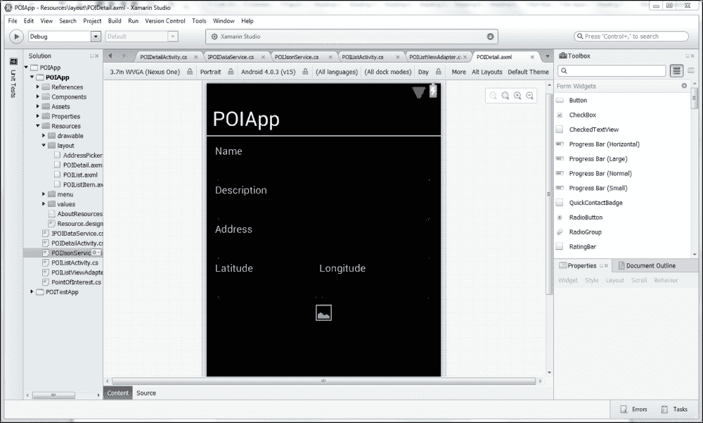
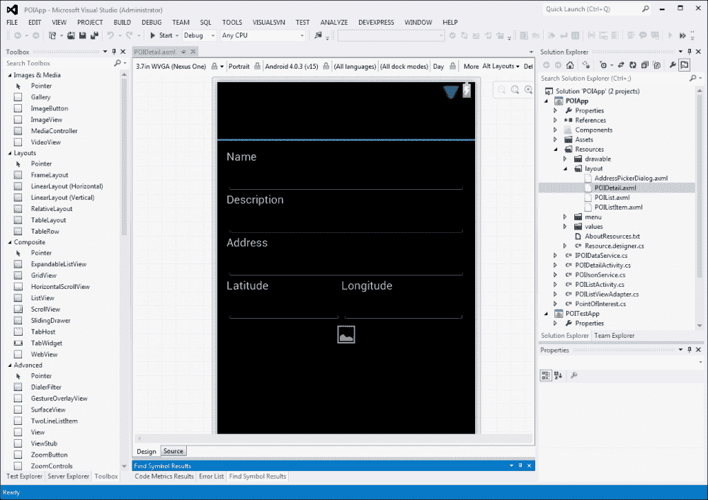

# 第一章. Xamarin 和 Mono – 通向非自然之路

本章概述了 Mono 项目以及 Xamarin 提供的基于 Mono 的商业产品套件。为了开始这段通往未知领域的旅程，本章将涵盖以下主题：

+   理解 Mono

+   为什么你应该使用 Xamarin

+   安装 Xamarin.Android 和 Xamarin.iOS

+   使用 Xamarin Studio 和 Visual Studio 进行开发

+   源代码控制选项

# 理解 Mono

在我们直接进入关于 Xamarin 的对话之前，让我们先讨论一个相关话题：Mono。Mono 是.NET 平台的开源跨平台实现。这包括一个与 Microsoft .NET 二进制兼容的**公共语言运行时**（**CLR**），一组用于 C#等语言的编译器，以及.NET 运行时库的实现。Mono CLR 已被移植到许多平台，包括基于 Linux 和 BSD 的操作系统（不仅限于 Android、iOS 和 OS X），基于 Windows 的系统，甚至一些游戏机，如 Wii、Xbox 360 和 PS4。

Mono 项目是由 Ximian 发起的，而 Ximian 后来被 Novell 收购。现在 Xamarin 领导 Mono 项目。

# Xamarin 产品套件

Xamarin 是一家软件公司，提供一系列基于 Mono 的商业产品，允许开发者使用 C#和.NET 框架为 Android、iOS 和 OS X 创建应用程序。Xamarin 的联合创始人 Miguel de Icaza 自 2001 年 Mono 项目启动以来一直领导该项目。

Xamarin 的主要产品提供包括：

+   Xamarin.Android（以前称为 Mono for Android）

+   Xamarin.iOS（以前称为 MonoTouch）

+   Xamarin.Mac

每个这些产品都通过年度订阅进行授权，以下级别可供选择：

+   **入门级**：这个订阅实际上是免费的，但限制了应用程序的大小。

+   **独立开发者版**：这个订阅提供了构建和部署功能齐全的移动应用程序所需的一切，但只能由员工人数不超过五人的公司购买。这个订阅也不包括在“使用 Visual Studio 环境”部分中讨论的 Visual Studio 插件的使用。

+   **商业版**：这个订阅增加了 Visual Studio 插件的使用以及电子邮件支持。

+   **企业版**：这个订阅增加了对一系列高级组件、热修复和增强支持的访问权限。

    ### 注意

    可以在本文节的末尾找到定价信息的链接。为了快速参考，请访问[`store.xamarin.com`](https://store.xamarin.com)。

Xamarin 还托管了一个组件商店；一个可以用于 Xamarin 应用程序的组件买卖市场。这个商店中的组件可以免费分发或出售，Xamarin 会向组件供应商支付从销售中收集到的收入的一部分。

另一项 Xamarin 提供的服务是测试云。正如其名所示，这是一个基于云的测试服务，允许团队为他们的应用创建自动化测试能力，这些测试可以在大量物理设备上运行。这对于 Android 开发者尤为重要，因为需要考虑的设备数量要多得多。

以下表格提供了有关 Xamarin 套件的附加信息的有用链接：

| 信息类型 | 访问它的 URL |
| --- | --- |
| 产品信息 | [`xamarin.com/tour`](http://xamarin.com/tour) [`xamarin.com/csharp`](http://xamarin.com/csharp) [`xamarin.com/products`](http://xamarin.com/products) [`xamarin.com/faq`](http://xamarin.com/faq) |
| 产品定价 | [`store.xamarin.com`](https://store.xamarin.com) |
| 组件商店 | [`components.xamarin.com`](https://components.xamarin.com) |
| Xamarin 测试云 | [`xamarin.com/test-cloud`](http://xamarin.com/test-cloud) |

# 评估 Xamarin 是否是合适的工具

现在你对 Mono 和 Xamarin 产品套件有了背景知识，你可能想问自己：“Xamarin 是我的项目的合适工具吗？”

使用 Xamarin 的好处如下：

+   **基于您现有的 C#和.NET 使用技能构建**：由于 C#语言和.NET 框架都提供了大量的功能，开发者需要投入大量的时间和精力来掌握它们。尽管你可以争论 Java 和 Objective-C 有相似之处（都是面向对象的语言），但将 C#和.NET 的熟练度转移到 Java 或 Objective-C 上确实存在实际成本。这就是 Xamarin 能帮到你的地方；那些在 C#和.NET 上投入了大量资金的个人和团队，如果他们希望开发 iOS 和 Android 应用，由于这些技能的需求，可能会转向使用 Xamarin。

+   **允许跨平台开发中代码的可重用性**：尽管 Xamarin 套件阻止你创建一个可以部署到 Android、iOS 和 WP8 的应用，但它通过提供跨所有这些平台回收大量代码库的能力来弥补这一点。使这一切变得如此容易的一般过程是，用户界面代码和处理设备功能的代码通常是针对每个平台编写的。有了这个，客户端逻辑（代理和缓存）、客户端验证、数据缓存和客户端数据存储等事物可能被重用，这可以为你节省大量的时间和精力。我亲眼看到 Android 和 iOS 应用共享高达 50%的代码库，有些报告甚至高达 80%。你在这个重用方法上的投资越多，你实现更高百分比的可能性就越大。

然而，在使用 Xamarin 时也有一些缺点：

+   **由于许可要求而产生的成本**：Xamarin 套件或工具都是商业工具，必须获得许可，这意味着有明显的入门成本。您可以在 Xamarin 的网站上查看当前的价格。

+   **等待更新**：您会发现平台（Android/iOS）的新版本与支持它的 Xamarin 产品的新版本之间存在一些滞后时间。Xamarin 在操作系统的新版本发布当天就发布了 Xamarin.iOS，做得非常出色。Xamarin.Android 通常落后于这个步伐，因为谷歌不提供 beta/preview 版本。在某种程度上，这种延迟至少对于手机应用来说不是一个大问题；电信公司通常需要一段时间才会提供最新的 Android 版本供下载。

+   **性能和内存管理**：这可能是 Xamarin.Android 比 Xamarin.iOS 更关心的问题。正如您将在第二章中看到的那样，*揭秘 Xamarin.iOS*，Xamarin.iOS 基本上构建了一个与仅使用 Xcode 和 iOS SDK 产生的二进制可执行文件类似的二进制可执行文件。然而，正如我们将在第三章中看到的那样，*揭秘 Xamarin.Android*，Xamarin.Android 依赖于部署 Mono CLR 和 Mono CLR 与 Dalvik VM 之间的通信。在某些情况下，Xamarin.Android 将分配 Java 和 C#对象来实现 C#或.NET 在 Android 设备上开发的一些“魔法”和“巫术”。因此，Xamarin.Android 将影响内存占用和执行性能。

+   **分发大小**：有许多运行时库必须与 Xamarin 应用一起分发或链接。关于实际大小和最小化分发大小的策略将在最后一章中讨论。

虽然缺点列表可能看起来很庞大，但在大多数情况下，每个缺点的影响都可以最小化。我选择建立 Xamarin 咨询业务，因为我高度重视已识别的益处，并觉得许多在 C#和.NET 上有重大投资的团体也会看到同样的价值。如果您是高度重视 Xamarin 益处的团体或个人，那么您当然应该考虑使用它。

# 学习 C#

本书假设您对 C#和.NET 有实际的知识。由于这可能不是一些读者的情况，我们包括了一些链接，以帮助您快速掌握。Xamarin 提供了一个链接，从 Objective-C 的角度介绍了 C#：[`docs.xamarin.com/guides/ios/advanced_topics/xamarin_for_objc/primer`](http://docs.xamarin.com/guides/ios/advanced_topics/xamarin_for_objc/primer)。

微软提供了一系列学习 C#的教程，可在以下网址找到：[`msdn.microsoft.com/en-us/library/aa288436(v=vs.71).aspx`](http://msdn.microsoft.com/en-us/library/aa288436(v=vs.71).aspx)。

# 安装 Xamarin

在继续之前，我们需要安装 Xamarin。本节将向您展示在 Android 和 iOS 平台上安装 Xamarin 的步骤，特别是 Xamarin.Android 和 Xamarin.iOS，在 OS X 和 Windows 上。

由于 Xamarin.iOS 依赖于最新的 iOS SDK 和最新的 Xcode，因此在开始 OS X 安装之前，这两个都应该安装。

### 小贴士

Xcode 和 iOS SDK 都是免费的，您可以从：[`developer.apple.com/devcenter/ios/index.action#downloads`](https://developer.apple.com/devcenter/ios/index.action#downloads) 下载这些安装程序。

此外，请注意您可以从 OS X 应用商店安装 Xcode。

同样，Xamarin.Android 依赖于最新的 Android SDK；然而，区别在于，Xamarin 安装将自动下载 Android SDK 并将其作为整体安装过程的一部分安装。因此，不需要采取任何单独的步骤。如果您已经安装了 Android SDK，您现在有机会使用它。

## 在 OS X 上安装 Xamarin

要在 OS X 上安装 Xamarin，请访问 [www.Xamarin.com](http://www.Xamarin.com)，下载 OS X 安装程序以启动它，并按照指示操作。请确保选择安装 Xamarin.Android 和 Xamarin.iOS；Xamarin.Mac 是可选的。

Xamarin.iOS Visual Studio 插件使用名为 `mtbserver` 的构建服务器在您的 Mac 上编译 iOS 代码。如果您计划使用 Visual Studio 插件，请确保选择允许网络连接。

## 在 Windows 上安装 Xamarin

现在，我们转到 Windows 安装过程。如果您计划使用 Visual Studio 插件，那么在安装 Xamarin 之前需要安装 Visual Studio。

要在 Windows 上安装 Xamarin，您需要访问 [www.Xamarin.com](http://www.Xamarin.com)，下载 Windows 安装程序，启动它，然后按照指示操作。请确保安装 Xamarin.Android 和 Xamarin.iOS。

# 开发环境

当谈到集成开发环境（IDE）时，开发者有两个选择：Xamarin Studio 或 Visual Studio。本节将向您展示如何通过这两个工作室开发适用于 Android 和 iOS 的应用程序。

## 使用 Xamarin Studio 环境

Xamarin Studio 是 MonoDevelop IDE 的定制版本，这可以用来开发 Android、iOS 和 OS X 的应用程序。Xamarin Studio 可在 OS X 和 Windows 上使用，具有高度先进和实用的功能，例如：

+   代码补全

+   智能语法高亮

+   代码导航

+   代码提示

+   在模拟器或设备上运行的应用程序的集成调试

+   Git 和 Subversion 内置的源代码控制集成

如果您查看以下截图，您将看到 Xamarin Studio 在 Android 用户界面设计器打开时的样子：

## 使用 Xamarin Studio 开发 Android 应用程序

Xamarin Studio 和 Xamarin.Android 插件允许在不使用任何其他 IDE 的情况下进行 Android 应用的完整开发和调试。Android UI 设计器也可以在 Xamarin Studio 内部使用。

## 使用 Xamarin Studio 开发 iOS 应用程序

Xamarin Studio 和 Xamarin.iOS 插件允许在安装了 Xcode 和 iOS SDK 的 Mac 上开发和使用 iOS 应用程序。所有代码都可以在 Xamarin Studio 内部编写、编译和调试。通常，用户界面 XIB 和/或 storyboard 文件必须在 Xcode 内部构建；Xamarin Studio 提供了一个链接到 Xcode，这样当双击 xib 或 storyboard 文件时，Xcode 将被启动。

这里有一个需要注意的地方；Xamarin 为 Xamarin Studio 开发了一个 iOS UI 设计器，但几乎一年时间都处于 alpha 状态。我看到了许多在各种论坛上的帖子，表明它很稳定并且可以使用，但 Xamarin 在澄清为什么它仍然处于 alpha 状态以及何时将转为稳定状态方面进展缓慢。我们将在第四章*使用 Xamarin.iOS 开发您的第一个 iOS 应用*中更详细地讨论 iOS UI 设计器的使用。

## 使用 Visual Studio 环境

Xamarin for Visual Studio 是一个支持开发 Xamarin.Android 和 Xamarin.iOS 应用程序的插件，并且对商业和企业订阅者开放。此插件可以与任何非 Express 版本的 Visual Studio 2010 到版本 2013 一起使用。Android 应用程序可以完全使用 Visual Studio 进行开发。为了开发 iOS 应用程序，你仍然需要一个装有 iOS SDK 和 Xcode 的 Mac 来编译和创建用户界面 xib 和/或 storyboard 文件。

### 小贴士

如果你已经拥有 Visual Studio 许可证并且熟悉该环境，由于它易于使用，此插件将比 Xamarin Studio 更适合你。

以下截图显示了打开 Android 用户界面设计器的 Visual Studio 2012：

Android 用户界面设计师

### 使用 Visual Studio 开发 Android 应用程序

Visual Studio 为 Xamarin.Android 提供的插件允许在不使用任何其他 IDE 的情况下进行 Android 应用的完整开发和调试。此插件提供了在 Visual Studio 内部使用 Android UI 设计器的功能。对于那些拥有适当许可证并且熟悉 Visual Studio 的人来说，这可能是在 Android 开发中最好的选择。

### 使用 Visual Studio 开发 iOS 应用程序

用于 Xamarin.iOS 的 Visual Studio 插件允许你开发并测试 iOS 应用程序，但仅限于与安装了 Xcode 和 iOS SDK 的 Mac 一起使用。iOS 代码必须在 Mac 上使用 Xamarin 的 mtbserver 编译和执行。Mac 上的 Xcode 还必须用于开发 iOS 应用程序的用户界面 xib 和/或 Storyboard 文件。我们将在第四章中更详细地讨论这种配置，*使用 Xamarin.iOS 开发您的第一个 iOS 应用程序*。

### 备注

由 Xamarin Studio 创建和使用的解决方案和项目文件与 Visual Studio 完全兼容。这为团队提供了选择使用哪个 IDE 的灵活性，并且他们可以在项目持续期间轻松地更改。

## 比较 IDE

以下表格显示了采用每个 IDE 的优缺点：

| IDE | 优点 | 缺点 |
| --- | --- | --- |
| Xamarin Studio | 可用于所有 Xamarin 订阅级别，在 Windows 和 OS X 上运行 | 可用的生产力插件数量有限，不支持使用 TFS 进行源代码控制 |
| Visual Studio | 大多数 C#开发者已经熟悉并习惯于 Visual Studio，可以使用流行的生产力插件，如 ReShaper 和 CodeRush，可以使用 TFS 进行源代码控制和问题跟踪 | 需要 Xamarin 的商业或企业订阅，需要 VS 许可证，仅在 Windows 上运行，对于 iOS 开发，需要更复杂的配置，其中 VS 必须与运行 Xcode 的 Mac 通信以执行构建，并且 UI 开发必须使用 Xcode 进行 |

## 版本控制

当你有一套多样化的开发工具时，版本控制可能是一个挑战，Xamarin 无疑为大多数商店增加了多样性。挑战在于使所有不同的 IDE 和客户端应用程序中的代码共享和管理变得容易；很多时候，他们无法访问相同的存储库。由于使用 Xamarin 的好处对现有的.NET 商店非常有吸引力，许多 Xamarin 开发者会发现自己在已经承诺使用 Microsoft **团队基础服务器** (**TFS**)的环境中工作。不幸的是，从非 Microsoft 工具连接到 TFS 并不总是容易。在 Xamarin Studio 的情况下，有一个开源插件，Xamarin 无法直接支持，并且配置起来可能具有挑战性。

其他可以考虑的版本控制系统包括 Git 和 Subversion。Xamarin Studio 内置了对 Git 和 Subversion 的支持，并且这两个工具的插件都适用于 Visual Studio。以下表格包含了一些有用的 URL，可以下载并了解各种插件的详细信息：

| 插件 | 访问它的 URL |
| --- | --- |
| TFS add-in for Xamarin Studio | [`github.com/Indomitable/monodevelop-tfs-addin`](https://github.com/Indomitable/monodevelop-tfs-addin) |
| Git for Visual Studio | (VS2013 内置支持)[`msdn.microsoft.com/en-us/library/hh850437.aspx`](http://msdn.microsoft.com/en-us/library/hh850437.aspx)(VS2012 需要免费插件)[`visualstudiogallery.msdn.microsoft.com/abafc7d6-dcaa-40f4-8a5e-d6724bdb980c`](http://visualstudiogallery.msdn.microsoft.com/abafc7d6-dcaa-40f4-8a5e-d6724bdb980c) |
| Visual Studio 的 Subversion 插件（由 VisualSVN 提供） | [`www.visualsvn.com/visualsvn/?gclid=CMmSnY-opL0CFa07MgodDksA5g`](http://www.visualsvn.com/visualsvn/?gclid=CMmSnY-opL0CFa07MgodDksA5g) |

软件开发的许多方面一样，并没有一个“一刀切”的解决方案。以下表格概述了在选择适用于 Xamarin 项目的源代码控制解决方案时需要考虑的一些优缺点：

| VCS 工具 | 优点 | 缺点 |
| --- | --- | --- |
| TFS | 已被许多企业使用，将考虑为 Xamarin Studio 提供的 Xamarin.Free 插件。 | Xamarin Studio 插件过去一直被认为使用起来有问题。 |
| Git | 在 Xamarin.Free 插件中内置支持，适用于 Visual Studio 2012 和 2013。 | 在一个可能使用 TFS 进行 C# 代码的大组织中，难以与其他团队共享和同步代码。 |
| Subversion | 在 Xamarin Studio 中内置支持。Visual Studio 的商业插件。 | 在一个可能使用 TFS 进行 C# 代码的大组织中，难以与其他团队共享和同步代码。 |

如果你已经在使用 TFS 上投入了大量资源，尝试让这些工作也适用于你的 Xamarin 开发。这可以通过让开发者使用 Visual Studio 或者尝试使用适用于 Xamarin Studio 的 TFS 插件来实现。

# 摘要

在本章中，我们介绍了 Mono 以及 Xamarin 提供的商业产品套件，并考虑了使用 Xamarin 的优缺点。我们还介绍了安装过程，并初步了解了开发者可用的 IDE 选项。

在下一章中，我们将探讨 Xamarin.iOS 产品的架构。
