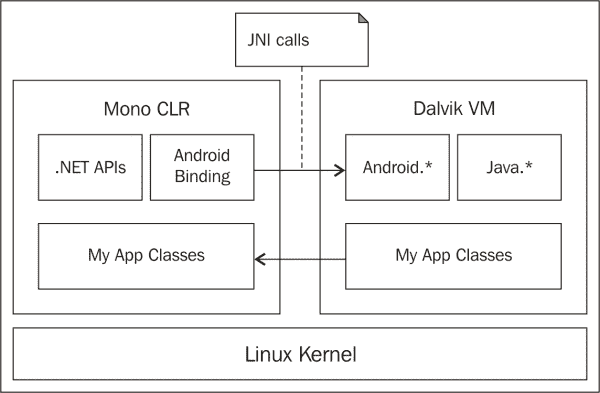
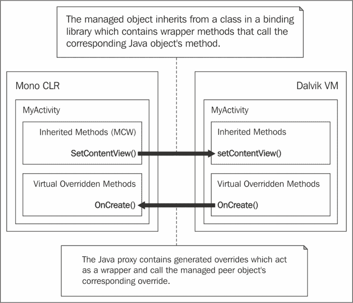
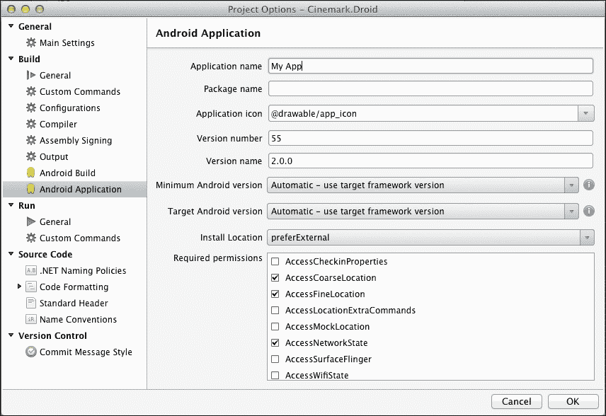
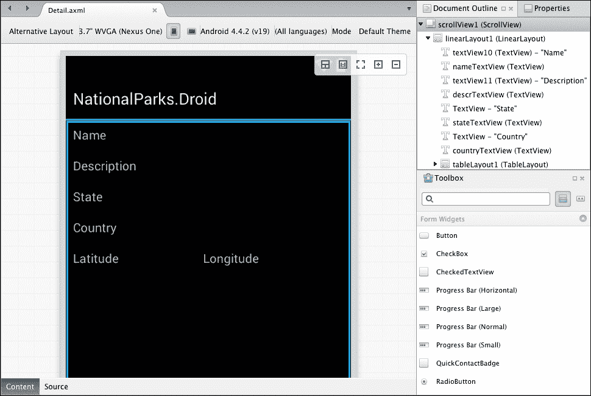

# 第三章。揭秘 Xamarin.Android

现在是时候深入探讨 Xamarin.Android，看看它是如何实现与 Xamarin.iOS 相同的魔法的。在本章中，我们将看到 Xamarin.iOS 和 Xamarin.Android 拥有许多相同的设计目标。然而，Xamarin.Android 不依赖于静态编译。许多目标是通过完全不同的方法实现的。本章涵盖了以下主题：

+   Mono CLR 和 Dalvik VM—并行工作

+   应用程序打包

+   Mono 程序集

+   Xamarin.Android 绑定

+   `ApplicationManifest.xml`文件的属性

+   垃圾回收

# Mono CLR 和 Dalvik VM – 并行工作

Android 应用在**Dalvik 虚拟机**（Dalvik VM）中运行，它与 Java VM 有些相似，但针对资源有限的设备进行了优化。正如我们在第一章中讨论的，*Xamarin 和 Mono – 通向非自然之路*，Xamarin 产品基于 Mono 平台，该平台有自己的虚拟机，称为**公共语言运行时**（CLR）。这里的关键问题是，“Xamarin.Android 应用在哪个环境中运行？”答案是两者都运行。如果您看一下下一张图，您会亲自看到这两个运行时是如何共存的：



这两个环境看起来相当不同，那么一个应用如何在两者中运行呢？Xamarin.Android 的强大功能是通过一个称为同伴对象的概念以及一个名为**Java Native Interface**（JNI）的 Java 框架实现的。

## 介绍 Java Native Interface

让我们从 JNI 开始。这是一个框架，允许非 Java 代码，例如 C++或 C#，调用或被运行在 JVM 内部的 Java 代码调用。正如您可以从之前的图中看到的那样，JNI 是 Xamarin.Android 整体架构中的关键组件。

### 小贴士

您可以在第二章中找到一些关于 JNI 的支持信息，特别是关于同伴对象，在 Packt Publishing 出版的《Xamarin Mobile Application Development for Android》中的*Xamarin.Android 架构*，由*马克·雷诺兹*撰写。

## 同伴对象

同伴对象是一对共同工作以执行 Android 应用功能的对象。其中一个是位于 Mono CLR 中的托管对象，另一个是位于 Dalvik VM 中的 Java 对象。

Xamarin.Android 随附一组称为 Android 绑定库的组件。Android 绑定库中的类对应于 Android 应用程序框架中的 Java 类，绑定类上的方法作为包装器，用于调用 Java 类上的相应方法。这些绑定类通常被称为 **托管可调用包装器**（**MCW**）。因为每当您创建一个从这些绑定类继承的 C# 类时，在构建时都会生成一个相应的 Java 代理类。Java 代理包含对您的 C# 类中每个重写方法的生成重写，并作为包装器来调用 C# 类上的相应方法。

Peer 对象可以通过 Android 应用程序框架在 Dalvik VM 内部创建，或者可以通过您在重写方法中编写的代码在 Mono CLR 内部创建。每个 MCW 实例都保留两个 Peer 对象之间的引用，并且可以通过 `Android.Runtime.IJavaObject.Handle` 属性访问。

您可以亲自看到 Peer 对象如何协作：



# Xamarin.Android 应用程序打包

Android 应用程序以 Android 包格式交付，这是一种具有 `.apk` 扩展名的存档文件。Android 包包含应用程序代码和运行应用程序所需的所有支持文件，包括以下内容：

+   Dalvik 可执行文件（`*.dex` 文件）

+   资源

+   原生库

+   应用程序清单

Xamarin.Android 应用程序遵循以下标准，并增加了以下内容：

+   C# 代码编译成组件并存储在名为 `assemblies` 的顶级文件夹中

+   Mono 运行时库与其他原生库一起存储在 `lib` 文件夹中

# 理解 Mono 组件

与 Xamarin.iOS 一样，Xamarin.Android 随附了 Silverlight 和桌面 .NET 组件的扩展子集。这些库共同为开发者提供 .NET 运行时库支持，包括 `System.IO` 和 `System.Threading` 等命名空间。

Xamarin.Android 与为不同配置编译的组件不兼容，这意味着您的代码必须重新编译以生成组件，具体针对 Xamarin.Android 配置。如果您针对其他配置，如 Silverlight 或 .NET 4.5，本质上也需要这样做。

### 小贴士

要获取随 Xamarin.Android 一起提供的组件的完整列表，您可以参考 [`docs.xamarin.com/guides/android/under_the_hood/assemblies`](http://docs.xamarin.com/guides/android/under_the_hood/assemblies)。

# Xamarin.Android 绑定

Xamarin.Android 还提供了一套绑定库，为 Android 开发提供支持。绑定库构成了 Xamarin.Android 魔法的第二大组成部分，类似于 Mono CLR 和 Dalvik VM 的功能。以下部分深入探讨了这些绑定的细节。

## 设计原则

一系列目标或设计原则指导了绑定库的开发。这些原则对于使 C# 开发者在 Android 开发中变得高效至关重要。以下是对设计原则的总结，您将注意到与 Xamarin.iOS 绑定的一些相似之处：

+   允许开发者以与其他 .NET 类相同的方式子类化 Java 类。

+   使常见的 Java 任务变得简单，困难的 Java 任务变得可行。

+   将 JavaBean 属性公开为 C# 属性。

+   公开一个强类型 API。

+   在适当和适用的情况下，暴露 C# 委托（lambda 表达式、匿名方法以及 `System.Delegate`），而不是单方法接口。

+   提供一种机制来调用任意的 Java 库（`Android.Runtime.JNIEnv`）。

    ### 小贴士

    在这些原则的完整讨论可以在 [`docs.xamarin.com/guides/android/advanced_topics/api_design`](http://docs.xamarin.com/guides/android/advanced_topics/api_design) 找到。

## 属性

在尽可能大的范围内，Android 框架类中的 JavaBean 属性被转换为 C# 属性。以下规则始终在发生这种情况时遵循：

+   首先，为获取器和设置器方法对创建读写属性。

+   对于没有相应设置器的获取器，创建只读属性。

+   在非常罕见的情况下，如果只存在设置器，则不会创建只写属性。

+   最后，当类型将是数组时，不会创建任何属性。

## 事件与监听器

Android API 依照 Java 模式来定义和连接事件监听器。C# 开发者应该更熟悉类似的概念：委托和事件。

以下是一个 Java 事件监听器的示例：

```cs
addTicketButton.setOnClickListener (
new View.OnClickListener() {
    public void onClick (View v) {
_ticketCount++;
updateLineItemCost();
    }
});
```

以下是与 C# 事件等效的代码：

```cs
addTicketButton.Click += (sender, e) => {
    _ticketCount++;
     UpdateLineItemCost();
};
```

Android 绑定在可能的情况下提供事件。以下规则被遵循：

+   当监听器具有如 `setOnClickListener` 之类的设置前缀时。

+   当监听器回调没有返回值时。

+   当监听器只接受单个参数时，接口只有一个方法，并且接口名称以 `Listener` 结尾。

当事件不是由于这里列出的规则之一创建时，将生成一个支持适当签名的特定委托。

## 在集合方面提供特殊帮助。

原生 Android API 广泛使用 `java.util` 中的列表、集合和映射集合。Android 绑定通过 `System.Collections.Generic` 中的接口公开这些集合。此外，Xamarin.Android 提供了一组辅助类，它们实现了每个相应的 .NET 集合，并提供更快的封送处理，因为它们实际上并没有执行复制。以下表格显示了这些类的映射：

| Java 类型 | .NET 接口 | 辅助类 |
| --- | --- | --- |
| `java.util.Set<E>` | `ICollection<T>` | `Android.Runtime.JavaSet<T>` |
| `java.util.List<E>` | `IList<T>` | `Android.Runtime.JavaList<T>` |
| `java.util.Map<K,V>` | `IDictionary<TKey,TValue>` | `Android.Runtime.JavaDictionary<K,V>` |
| `java.util.Collection<E>` | `ICollection<T>` | `Android.Runtime.JavaCollection<T>` |

Xamarin.Android 允许你将任何集合（实现了正确的接口）传递给 Android API 方法。例如，`List`实现了`IList`，可以在需要`IList`实体时使用。然而，出于性能考虑，建议你在需要将这些集合类型传递给 Android API 方法时使用辅助类。

## 接口

Java 和 C#都支持接口；然而，Java 支持额外的功能。此外，两者都支持定义一组方法名称和签名的能力。此外，Java 还支持以下功能：

+   嵌套接口定义

+   字段（仅限`public final static`）

通常，以下项目描述了 Android 绑定如何提供以下 Java 接口：

+   创建一个具有相同名称但以`I`开头并包含方法声明的 C#接口。例如，`android.view.Menu`被创建为`Android.Views.IMenu`。

+   生成一个与 Java 接口同名但包含常量定义的抽象类，例如，`android.view.Menu`中的常量被放置在生成的抽象类`Android.Views.Menu`中。

+   为每个嵌套接口生成一个 C#接口，并使用以`I`开头的前缀，后跟父 Java 接口的名称，然后是嵌套 Java 接口的名称。

+   在 Android 绑定中实现包含常量的 Android 接口的类会生成一个嵌套的`InterfaceConsts`类型，它也包含定义。

## 嵌套类映射

Java 和 C#都支持嵌套类的定义。然而，Java 支持两种类型的嵌套类：静态和非静态。以下要点说明了它是如何做到这一点的：

+   Java 静态嵌套类与 C#嵌套类相同，可以直接翻译

+   非静态嵌套类，也称为内部类，有一些不同；适用额外的规则：

    +   在构造函数中必须提供一个指向包含类型的实例的引用作为参数，用于内部类。

    +   在从内部类继承的情况下，派生类必须嵌套在某个类型中。此类型从包含基本内部类的类继承属性，并且派生类必须提供一个与 C#包含类型相同类型的构造函数。

## Runnable 接口映射

Java 提供了一个包含单个方法`run()`的`java.lang.Runnable`接口，以便实现委托。Android 平台在多个地方使用此接口，例如`Activity.runOnUIThread()`和`View.post()`。

C# 提供了 `System.Action` 委托用于无返回值和无参数的方法；因此，它与 `Runnable` 接口非常匹配。Android 绑定为所有接受 `Runnable` 接口的原生 API 成员提供了接受 `Action` 参数的重载。

`IRunnable` 重载也被保留，以便可以使用从其他 API 调用返回的类型。

## 枚举

在许多地方，Android API 使用 `int` 常量作为参数来指定处理选项。为了提高类型安全性，Android 绑定在可能的情况下创建枚举来替换 `int` 常量。以下示例显示了使用 `ActivityFlags.NewTaskenum` 值而不是原生的 `FLAG_ACTIVITY_NEW_TASK` 常量的用法：

```cs
myIntent.SetFlags (ActivityFlags.NewTask);
```

使用 `enum` 类的另一个巨大优势是，在诸如 Xamarin Studio 和 Visual Studio 这样的 IDE 中，你将获得增强的代码补全支持。

## 资源

Xamarin.Android 在你的项目 `Resources` 文件夹中生成一个名为 `Resource.Designer.cs` 的文件。此文件包含你的应用中引用的所有资源的常量，并服务于与为传统 Android 应用生成的 `R.java` 文件相同的目的。

# `ApplicationManifest.xml` 文件的属性

Android 应用程序有一个清单文件 (`AndroidManifest.xml`)，它告诉 Android 平台运行应用程序所需知道的一切，包括以下功能：

+   应用程序所需的最低 API 级别

+   应用程序使用或所需的硬件/软件功能

+   应用程序所需的权限

+   应用程序启动时初始要执行的活动

+   应用程序所需的库

Xamarin.Android 提供了一组强大的 .NET 属性，可以用来装饰你的 C# 类，这样在编译时就会自动生成 `ApplicationManifest.xml` 中所需的大部分信息。使用这些属性简化了保持清单与代码同步的任务。例如，如果你重命名了一个 `Activity` 类，那么下次编译时，清单中相应的 `<Activity/>` 元素将自动更新。

以下示例演示了使用 `Activity` 属性来指定应用的启动活动：

```cs
[Activity (Label = "My Accounts", MainLauncher = true)]
public class MyAccountsActivity : Activity
{
    ...
}
```

这将在 `ApplicationManifest.xml` 文件中产生以下条目：

```cs
<activity android:label="My Accounts"
android:name="myaoo.MyActivity">
<intent-filter>
<action android:name="android.intent.action.MAIN" />
<category
android:name="android.intent.category.LAUNCHER" />
</intent-filter>
</activity>
```

虽然使用 .NET 属性是保持你的代码和清单文件同步的一种方便方式，但使用这些属性不是必需的。

# `ApplicationManifest.xml` 文件的编辑器

Xamarin Studio 也提供了一个用于 `ApplicationManifest.xml` 的编辑器。这可以用来代替属性或编辑无法通过属性设置的内容，例如所需的硬件/软件功能和权限。以下截图展示了编辑器：



# 垃圾回收

由于 Xamarin.Android 应用程序在两个不同的虚拟机（VM）中运行，垃圾回收过程相对复杂，并带来了一些有趣的挑战。因此，我们投入了大量的时间来讨论这个过程。Xamarin.Android 使用 Mono 的简单代际垃圾回收器，它支持两种类型的收集，称为小集合和主集合：

+   **小集合**：这些集合成本低廉，因此调用频率较高。小集合收集最近分配和死亡的对象，并在分配了几 MB 之后调用。您可以使用以下代码手动调用小集合：

    ```cs
    GC.Collect(0)
    ```

+   **主集合**：这些集合成本高昂，因此调用频率较低。主集合回收所有已死亡的对象，并且仅在当前堆大小耗尽时调用。您可以使用以下代码手动调用主集合：

    ```cs
    GC.Collect() or GC.Collect(GC.MaxGeneration).
    ```

    ### 注意

    您可以在[`www.mono-project.com/Compacting_GC`](http://www.mono-project.com/Compacting_GC)上查看关于 Mono 简单代际垃圾回收器的更详细讨论。

在我们继续讨论之前，如果我们把应用程序中的对象分组到以下类别中，这将对我们有所帮助：

+   **托管对象**：这些是从标准库（如 Mono 运行时库）创建的任何 C#对象。它们像其他任何 C#对象一样进行垃圾回收，并且与 Android 绑定中的任何类没有特殊联系。

+   **Java 对象**：这些是位于 Dalvik VM 中的 Java 对象，作为某些过程的一部分创建，但未通过 JNI 暴露给托管对象。这些对象像任何其他 Java 对象一样进行收集，关于它们我们不需要讨论太多。

+   **同等对象**：如我们之前提到的，同等对象是管理对象和 Java 对象对，通过 JNI 进行通信。它们协同工作以执行 Android 应用程序的功能。

## JNI 全局和弱引用

JNI 引用有几种不同类型，并且对对象何时可以被收集有很大影响。具体来说，我们将讨论两种类型的 JNI 引用，即全局和弱引用：

+   **全局引用**：JNI 全局引用是从“本地”或在我们的情况下是托管代码到由 Dalvik VM 管理的 Java 对象的引用。当对象最初创建时，JNI 全局引用在同等对象之间建立。JNI 全局引用将阻止 Dalvik 垃圾回收器执行所需操作，因为它表示对象仍在使用中。

+   **弱引用**：JNI 弱引用也允许托管对象引用 Java 对象，但不同之处在于弱引用将*不会*阻止 Dalvik VM GC 收集它。

我们将在本章后面看到它们之间的差异。

## Mono 集合

Mono 集合是发生有趣事情的地方。如前所述，简单的托管对象通常进行正常收集，但同等对象通过执行以下步骤进行收集：

1.  所有托管对等对象都符合 Mono 收集的条件，这意味着它们不被任何其他托管对象引用。它们的 JNI 全局引用被替换为 JNI 弱引用。这允许 Dalvik VM 在没有其他 Java 对象在 VM 中引用它们的情况下回收 Java 对等对象。

1.  会调用 Dalvik VM 的 GC，允许具有弱全局引用的 Java 对等对象被回收。

1.  在步骤 1 中创建的具有 JNI 弱引用的托管对等对象将被评估。如果 Java 对等对象已被回收，则托管对等对象也会被回收。如果 Java 对等对象尚未被回收，则它将被替换为 JNI 全局引用，托管对等对象将不会在未来的 GC 中被回收。

最终结果是，托管对等对象的实例将与其被托管代码引用或其对应的 Java 对等对象被 Java 代码引用的时间一样长。为了缩短对等对象的生存期，当它们不再需要时，请销毁对等对象。

### 注意

**最佳实践**

手动调用 `Dispose()` 方法通过释放 JNI 全局引用来切断对等对象之间的连接，从而允许每个 VM 尽快地回收对象。

## 自动收集

从 Xamarin.Android 4.1.0 版本开始，当 `gref` 阈值超过平台已知最大 `gref` 值的 90% 时，会自动执行完整垃圾回收。

当你执行自动收集时，调试日志中会显示类似以下的消息：

```cs
I/monodroid-gc(PID): 46800 outstanding GREFs. Performing a full GC!
```

自动 GC 的调用是非确定性的，可能不会在最佳时机发生。如果你在处理过程中遇到暂停，请查看日志中可能表明自动 GC 发生的消息。当这种情况发生时，你可以考虑何时使用 `Dispose()` 来减少对等对象的生存期。

## 帮助 GC

有多种方式可以帮助 GC 进行回收过程。以下部分提供了一些额外的思考：

+   **销毁对等对象**：当托管对等对象不再需要时，请将其销毁并考虑调用小 GC。如我们之前提到的，Mono GC 对内存状况没有完整的了解。对于 Mono 来说，对等对象似乎只占用 20 字节，因为 MCWs 没有添加实例变量。因此，所有内存都与相应的 Java 对象相关联，并分配给 Dalvik VM。如果你有一个加载了 2 MB 图像的 `Android.Graphics.Bitmap` 实例，Mono GC 只能看到 20 字节，因此销毁对象对 GC 来说将是低优先级的。

+   **减少对等对象中的直接引用**：在 GC 期间扫描托管对等对象时，会扫描整个对象图，这意味着它直接引用的每个对象也会被扫描。具有大量直接引用的对象可能导致 GC 运行时发生暂停。

+   **小型收集**: 小型收集相对便宜。您可以考虑在活动结束时或完成一组重要的服务调用或后台处理之后调用小型收集。

+   **主要收集**: 主要收集成本较高，应很少手动执行。只有在经过一段重要的处理周期后，大量资源已释放且您可以忍受应用响应性暂停时，才考虑手动调用主要收集。

# Xamarin.Android 设计器

Xamarin 为 Xamarin Studio 提供了一个插件，可用于设计 Xamarin.Android 应用的布局文件。该设计器支持**内容**模式进行视觉拖放和**源**模式进行基于 XML 的编辑。以下截图显示了在**内容**模式下打开的设计器：



# 摘要

在本章中，我们回顾了 Xamarin.Android 的架构，讨论了设计目标，并查看了一些实现细节。我们还探讨了 Xamarin.Android 应用中的内存管理是如何工作的。在下一章中，我们将开始开发一个 Xamarin.iOS 应用。
