# 第四章。使用 Xamarin.iOS 开发您的第一个 iOS 应用

在本章中，我们终于可以开始编写一些代码了。我们将开发一个样例应用，展示开发 Xamarin.iOS 应用的基础，并将涵盖以下主题：

+   样例应用的概述

+   创建 Xamarin.iOS 应用

+   使用 Xamarin Studio 运行和调试应用

+   使用 Xamarin iOS 设计器

+   扩展样例应用

+   MonoTouch.Dialog

# 样例国家公园应用

在本章中，我们将创建一个样例应用，我们将在第八章*与 Xamarin.Forms 共享*中继续使用它。该应用将允许您查看、创建、编辑和删除有关国家公园的信息，并将具有与 iOS 7 联系人应用类似的用户界面和流程。以下屏幕截图展示了用户界面将如何组织：

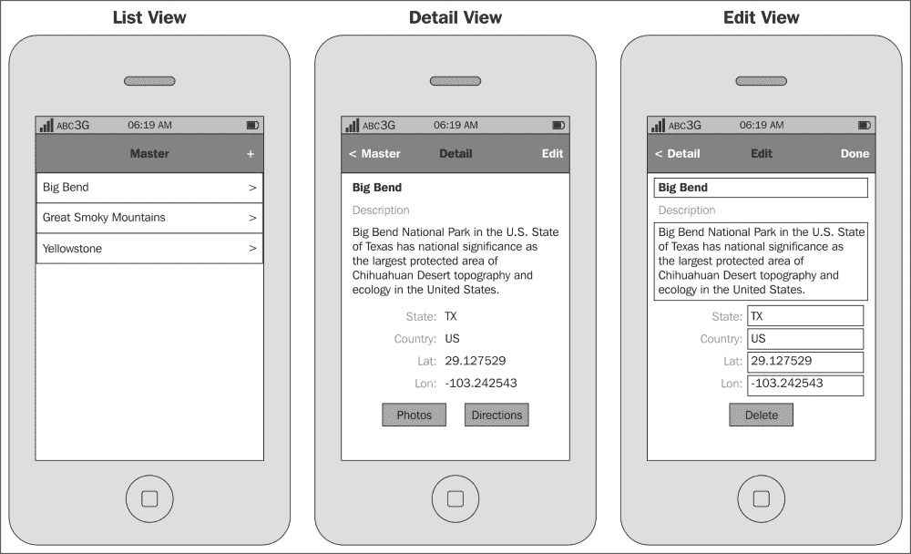

以下是国家公园应用的不同视图：

+   **列表视图**：此视图显示国家公园列表，允许查看公园并创建新的公园

+   **详情视图**：此视图以只读模式显示国家公园的所有属性，并允许导航查看公园的照片或查看前往公园的路线

+   **编辑视图**：此视图允许您编辑新的或现有的公园，以及删除公园

# 创建样例应用

将使用 Xamarin.iOS 模板来创建样例应用，为我们提供大部分已经就位的功能。

在本章中，我们将展示从下载的解决方案中提取的样例代码。请随意以任何方式偏离，以将应用引导到您认为合适的方向。

### 小贴士

**下载示例代码**

您可以从[`www.packtpub.com`](http://www.packtpub.com)下载示例代码文件，以获取您购买的所有 Packt Publishing 书籍。如果您在其他地方购买了此书，您可以访问[`www.packtpub.com/support`](http://www.packtpub.com/support)并注册以将文件直接通过电子邮件发送给您。

要创建国家公园样例应用，请执行以下步骤：

1.  启动 Xamarin Studio。

1.  从**文件**菜单中，导航到**新建** | **解决方案**。将显示**新建解决方案**对话框，如下截图所示：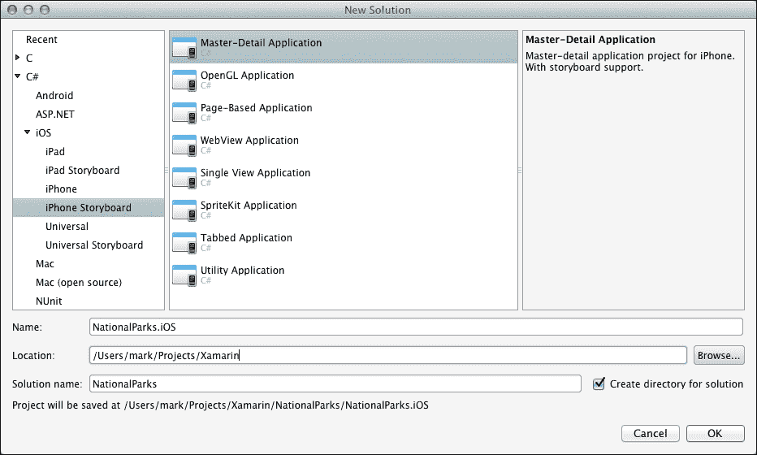

1.  在对话框的左侧导航到**C#** | **iOS** | **iPhone Storyboard**，在中间部分选择**主-详情应用**。

1.  在**名称**字段中输入`NationalParks.iOS`，通过点击**浏览**按钮选择您想要放置代码的位置，将**解决方案名称**更改为`NationalParks`，保留**为解决方案创建目录**复选框，然后点击**确定**。

1.  将项目命名为`NationalParks.iOS`的一个原因是在未来的章节中，我们将向同一个解决方案中添加一个名为`NationalParks.Droid`的新项目。这个项目将清楚地标识每个项目支持的平台。

1.  Xamarin Studio 将创建解决方案和项目文件夹，为解决方案和项目生成一些文件，然后打开新的解决方案和项目。以下截图显示了打开新项目的 Xamarin Studio：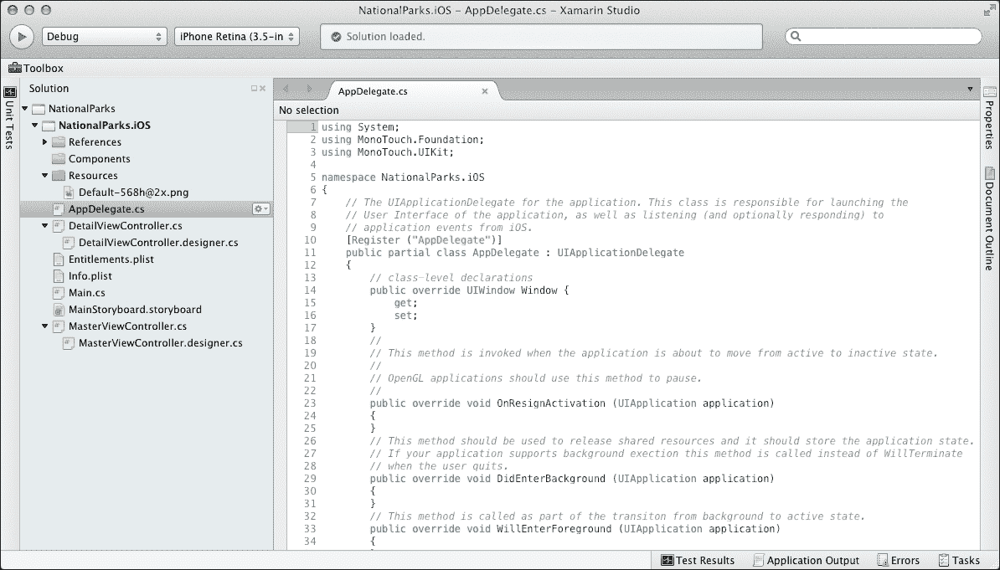

通过选择 Master-Detail 模板，Xamarin Studio 已生成一个具有主视图（列表）和详细视图的功能性应用，以及在这两个视图之间导航所需的一切。

让我们简要看看自动创建的内容：

+   `MainStoryboard.storyboard`：创建了一个包含用户界面定义的故事板文件，并命名为`MainStoryboard.storyboard`。双击此文件以在 Xcode 中打开它。您会注意到故事板包含两个视图控制器：`MasterViewController`和`DetailViewController`，它们之间有一个单一的转场。

+   `MasterViewController`：由于在故事板中定义了`MasterViewController`，创建了`MasterViewController.cs`及其对应的`MasterViewController.designer.cs`文件。`MasterViewController.cs`是我们将添加代码的文件，而在这里我们重写方法和添加逻辑。

+   `DataSource`：`MasterViewController`包含一个名为`DataSource`的内部类，这是一个`UITableViewSource`的特化。`DataSource`类负责向`MasterViewController`上的表格视图提供填充的`UICellViews`。

+   `DetailViewController`：由于在故事板中定义了`DetailViewController`，创建了`DetailViewController.cs`及其对应的`DetailViewController.designer.cs`文件。这用于在`MasterViewController`上的表格视图中显示特定项的属性。

## 项目选项视图

有许多选项可以设置，这些选项会影响 iOS 应用的构建和执行方式。这些选项可以在**项目选项**视图中查看和调整。以下部分对 iOS 应用最为重要：

+   **iOS 应用**：这包括描述应用的设置，包括支持的设备、iOS 目标版本、支持的朝向、图标等

+   **iOS IPA 选项**：这包括与创建用于 ad hoc 分发的 IPA 包相关的设置

+   **iOS 捆绑签名**：这包括在构建过程中控制如何对捆绑进行签名的设置

+   **iOS 构建**：这包括编译和链接过程使用的设置，用于优化生成的可执行文件

在运行应用之前，我们需要为我们的 iOS 目标版本选择一个设置。要调整此设置，请按照以下步骤操作：

1.  在**解决方案**面板下选择示例应用解决方案中的示例应用项目。

1.  右键单击并选择**选项**。

1.  选择**iOS 应用程序**部分，并将**部署目标**选项设置为**7.0**，然后点击**确定**。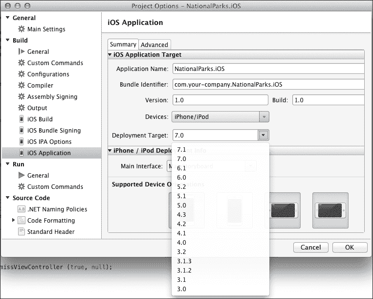

# 在 Xamarin Studio 中运行和调试

现在我们已经对我们所创建的内容有了很好的理解，让我们花几分钟时间看看 Xamarin Studio 提供的运行和调试应用程序的功能。工具支持运行和调试应用程序的方式对开发者的生产力有重大影响。Xamarin Studio 提供了一套强大的调试功能，与最现代的开发环境相当，可以使用 iOS 模拟器或物理设备。与 iOS 开发一样，使用物理设备可以提供最准确的结果。

Xamarin Studio 左上角的两个下拉菜单控制要生成的构建类型（**发布**或**调试**），以及当选择**调试**时，应使用哪个 iOS 模拟器。构建类型包括**Ad-Hoc**、**AppStore**、**调试**和**发布**。除了**调试**之外的所有构建类型将在第九章*准备 Xamarin.iOS 应用程序以分发*中讨论。以下截图显示了**调试**构建类型：

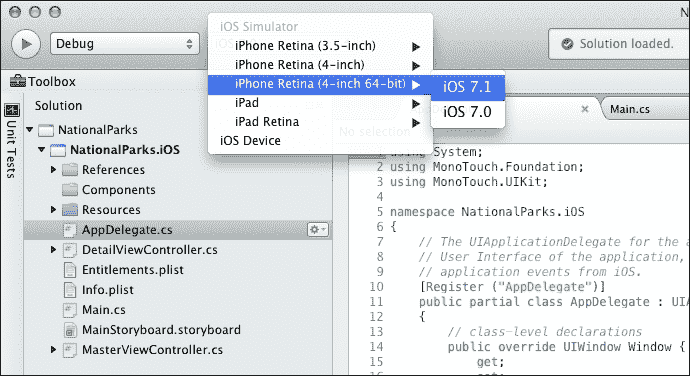

注意，对于构建类型和 iOS 模拟器提供的各种选项，都选择了**调试**。选择**iOS 设备**允许你在连接的设备上调试应用程序。

要调试一个应用程序，请按照以下步骤操作：

1.  将构建类型选择为**调试**，并从**iPhone Retina (4 英寸 64 位)**中选择**iOS 模拟器**选项为**iOS 7.1**。

1.  通过点击左侧任务栏上的**开始**按钮启动调试会话。您也可以通过主菜单栏导航到**运行** | **开始调试**来启动调试会话。

1.  Xamarin Studio 将编译应用程序，启动 iOS 模拟器，在模拟器上安装应用程序，并最终启动应用程序。Xamarin Studio 通过任务栏中间的状态窗口通知您正在发生的事情。以下截图显示了构建过程中的状态窗口：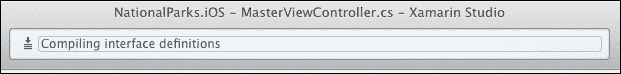

1.  初始时显示一个空列表。点击**+**（添加）按钮几次，你将看到日期/时间字段被添加到列表中。选择一个条目，**详细**视图将显示，如下截图所示：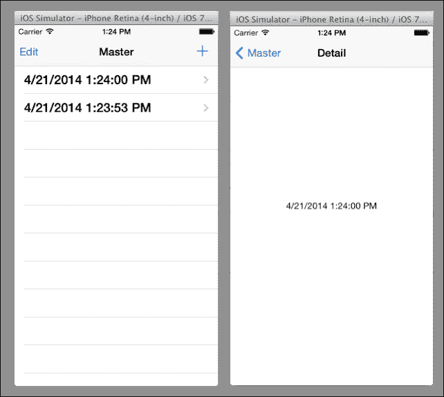

1.  通过双击左侧的**解决方案**垫打开`MasterViewController.cs`。在`AddNewItem()`方法的第一行设置断点。

1.  在应用程序中点击**+**（添加）按钮。你会注意到应用程序在断点处停止，如下所示：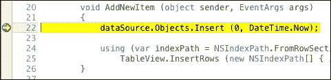

1.  您将在任务栏中找到基本流程控制。这些允许您继续执行、跳过当前行、进入当前函数和退出当前函数。任务栏将出现：

    ### 提示

    完整的流程控制和调试选项可以在 **运行** 主菜单下找到。

1.  从 `AddNewItem()` 的第一行开始，选择 `DateTime.Now`，右键单击，并选择 **表达式评估器**。此对话框允许您快速查看应用程序执行期间对象的状态，如下所示：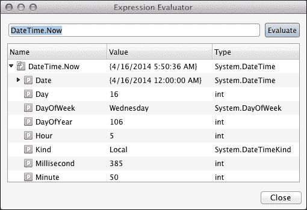

1.  您还会注意到 Xamarin Studio 底部的一组面板，其中包含 **观察**、**局部变量**、**断点**、**线程**、**应用程序输出** 和 **调用堆栈** 选项卡。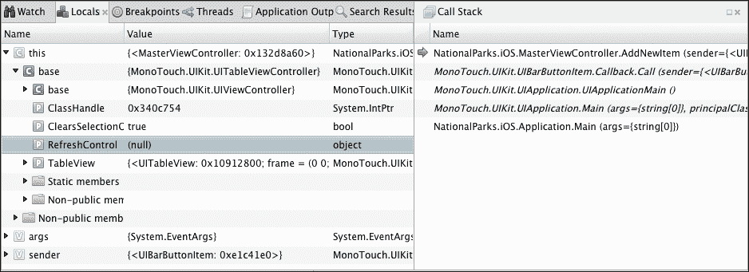

1.  点击继续图标以允许应用继续运行。

如您从之前的练习中看到的，Xamarin Studio 和 iOS 模拟器提供了一套强大的功能来运行和调试应用程序。

# 扩展示例应用

现在，是时候扩展应用了。我们面前有两个主要任务：

+   创建一种方法，以便从文件中加载和保存国家公园

+   增强用户界面以显示所有适当的属性，并允许查看和编辑数据

## 存储和加载国家公园

我们将使用一个简单的 JSON 格式的文本文件来存储信息。.NET 提供了库来完成这项任务，但我最有成功经验的库是 Json.NET。Json.NET 是由 James Newton-King 创建的开源库，这绝对值得考虑。Json.NET 也可在 Xamarin 组件商店中找到，因此我们可以直接从那里将其添加到我们的项目中。

### 添加 Json.NET

要将 Json.NET 添加到示例应用中，请执行以下步骤：

1.  展开 `NationalParks.iOS` 项目，选择 `Components` 文件夹，并选择 **编辑组件**。

1.  在右上角，单击 **获取更多组件** 并在搜索字段中输入 `Json.NET`。

1.  从列表中选择 **Json.NET** 并选择 **添加到应用**。

### 创建一个实体类

我们现在需要一个表示我们主题的实体类：国家公园。这将是一个具有少量属性的简单 .NET 类。

要创建实体类，请执行以下步骤：

1.  右键单击 `NationalParks.iOS` 项目并选择 **新建文件** 选项。

1.  在 **新建文件** 对话框中，选择 **常规** 部分，选择 **空类**，在 **名称** 字段中输入 `NationalPark`，然后单击 **新建**。

以下代码演示了实体类所需的代码：

```cs
public class NationalPark
{
  public NationalPark ()
  {
    Id = Guid.NewGuid ().ToString();
    Name = "New Park";
  }

  public string Id { get; set; }
  public string Name { get; set; }
  public string Description { get; set; }
  public string State { get; set; }
  public string Country { get; set; }
  public double? Latitude { get; set; }
  public double? Longitude { get; set; }

  public override string ToString ()
  {
    return Name;
  }
}
```

## 添加 JSON 格式化文件

现在，我们需要一个包含 JSON 格式化国家公园的文件。您可以在下载的解决方案的 assets 文件夹中找到此类文件。该文件的名称是 `NationalParks.json`。

要将数据文件添加到项目中，请执行以下步骤：

1.  将 `NationalParks.json` 文件复制到 `NationalParks.iOS` 项目文件夹。

1.  右键单击 `NationalParks.iOS` 项目并选择 **添加文件**，选择 `NationalParks.json` 并单击 **打开**。

1.  双击 `NationalParks.json` 文件以打开它并查看内容。

在编译和部署过程中处理文件时，必须设置几个文件属性，以确定如何处理文件。我们希望文件被视为内容，并在部署时放置在与应用相同的文件夹中。以下截图显示了完成此操作所需的设置。调整这些设置的选项卡位于 Xamarin Studio 右侧的 **属性** 选项卡上。

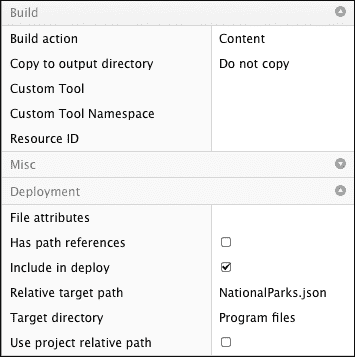

这不是应用程序在生产分发中存储数据的理想位置，但在这个章节中可以达到我们的目的。在第五章，*使用 Xamarin.Android 开发您的第一个 Android 应用*中，当我们讨论在 iOS 和 Android 应用之间共享代码时，我们将构建一个更健壮的存储机制。

### 从 JSON 格式的文件中加载对象

现在，我们需要添加将数据从文件加载到列表中的逻辑。

要从文件加载对象，执行以下步骤：

1.  如您所忆，当我们的应用生成时，放置在 `MasterViewController.cs` 中的 `UITableViewSource` 文件使用 `List<object>` 对象来填充列表。我们需要将其转换为 `List<NationalPark>` 的 `Parks`，如下所示：

    ```cs
    readonly List<NationalPark> parks;
    ```

    注意，我们不需要实例化 `Parks` 列表；Json.NET 将在我们反序列化 JSON 字符串时为我们完成这项工作。

1.  我们还需要将 `DataSource` 上定义的 `Objects` 属性转换为以下内容：

    ```cs
    public IList<NationalPark> Parks {get {return parks;}}
    ```

1.  在添加加载和反序列化步骤之前，添加 `System.IO` 和 `Newtonsoft.Json` 的 `using` 语句。

    ```cs
    using System.IO;
    . . .
    using Newtonsoft.Json;
    ```

1.  JSON 文件将放置在 `app` 文件夹中；`Environment.CurrentDirectory` 属性为我们提供了到这个位置的路径。从该文件加载对象需要两个基本步骤。第一步是使用 `File.ReadAllText()` 将文本读取到字符串中。第二步是使用 `JsonConvert.DeserializeObject<>()` 将对象反序列化到列表中。以下代码示例演示了需要在 `DataSource` 类的构造函数中放置的内容：

    ```cs
    string dataFolder = Environment.CurrentDirectory;
    string serializedParks =
        File.ReadAllText (Path.Combine(dataFolder,
            "NationalParks.json"));
    parks =
        JsonConvert.DeserializeObject<List<NationalPark>>
            (serializedParks);
    ```

### 将对象保存到 JSON 格式的文件

将对象保存到 JSON 格式的文件与加载它们一样简单。只需调用 `JsonConvert.SerializeObject()` 创建对象（s）的 JSON 表示形式并将其写入到文本文件中，使用 `File.WriteAllText()`。以下代码演示了需要的内容：

```cs
string dataFolder = Environment.CurrentDirectory;
string serializedParks =
     JsonConvert.SerializeObject (dataSource.Parks);
File.WriteAllText(Path.Combine(dataFolder,
     "NationalParks.json"), serializedParks);
```

我们将在接下来的章节中，标题为 *实现 Done Clicked 事件处理程序* 中使用这个逻辑。

### 运行应用

我们现在可以查看一些我们的工作了。运行应用并注意以下内容：

+   `MasterViewController` 使用 `NationalParks.json` 中的信息填充

+   选择一个公园将显示填充有公园名称的`DetailViewController`

+   点击`MasterViewController`中的**添加**按钮，可以添加一个名为**新公园**的新公园。

## 增强 UI

我们现在将注意力转向创建一个更健壮的 UI，它将支持列出项目、查看项目详情以及编辑新的和现有项目。这是移动应用中常见的模式，我们已经有大约 75%的需求。我们需要进行以下添加：

1.  添加一个名为`EditViewController`的新视图控制器，它可以用来编辑新的或现有的国家公园。

1.  将`MasterViewController`中的**添加**按钮更改为在`EditViewController`中打开一个新的国家公园条目。

1.  向`DetailViewController`添加字段，用于显示国家公园的所有属性和一个**编辑**按钮，该按钮将导航到`EditViewController`以编辑当前项。

正如我们在第二章中讨论的，*揭秘 Xamarin.iOS*，我们有两种编辑故事板的方法：Xcode 界面构建器和 Xamarin.iOS 设计器。可以根据个人喜好选择使用任何一种工具。在 Xamarin Studio 中，你可以通过选择一个故事板文件，右键单击它并选择**打开方式**来选择要启动的工具。以下截图显示了故事板上下文菜单：

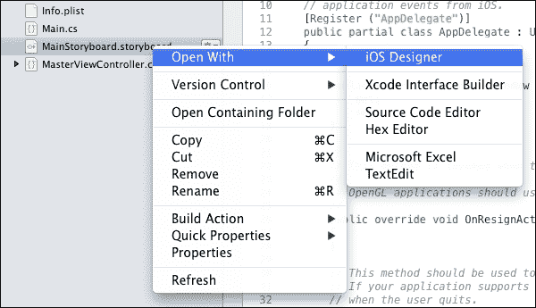

本章的其余部分将基于使用 Xamarin.iOS 设计器。如果你选择使用 Xcode 界面构建器，你需要知道，当 Xamarin Studio 再次激活时，会进行一个同步过程。这个过程将 Xcode 中的更改与 C#设计器类文件同步，并创建适当的输出和动作。以下截图显示了同步期间 Xamarin Studio 的状态栏：

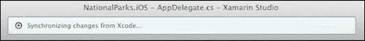

### 注意

如果你需要更多关于 Xamarin.iOS 设计器的指导，或者需要 Xcode 界面构建器的入门或复习课程，以下链接提供了教程：

+   可在[`developer.xamarin.com/guides/ios/user_interface/designer/`](http://developer.xamarin.com/guides/ios/user_interface/designer/)找到的 Xamarin 教程，用于使用 Xamarin.iOS 设计器。

+   可在[`developer.apple.com/library/ios/documentation/ToolsLanguages/Conceptual/Xcode_Overview/chapters/edit_user_interface.html`](https://developer.apple.com/library/ios/documentation/ToolsLanguages/Conceptual/Xcode_Overview/chapters/edit_user_interface.html)找到的 Apple 教程，用于 Xcode 界面构建器。

+   可在[`docs.xamarin.com/guides/ios/user_interface/tables/part_5_-_using_xcode,_interface_builder,_and_storyboards/`](http://docs.xamarin.com/guides/ios/user_interface/tables/part_5_-_using_xcode,_interface_builder,_and_storyboards/)找到的 Xamarin 教程，用于使用 Xcode 界面构建器。

### 探索 Xamarin.iOS 设计器

Xamarin.iOS Designer 提供了一套完整的工具来创建和编辑故事板文件。由于这可能是您第一次使用此工具，我们将花几分钟时间熟悉它。为此，请按照以下步骤操作：

1.  双击 `MainStoryboard.storyboard` 以在 Xamarin.iOS Designer 中打开故事板。您将看到 `NavigationController`、`MasterViewController`、`DetailViewController` 以及连接一切的任务，如下面的截图所示：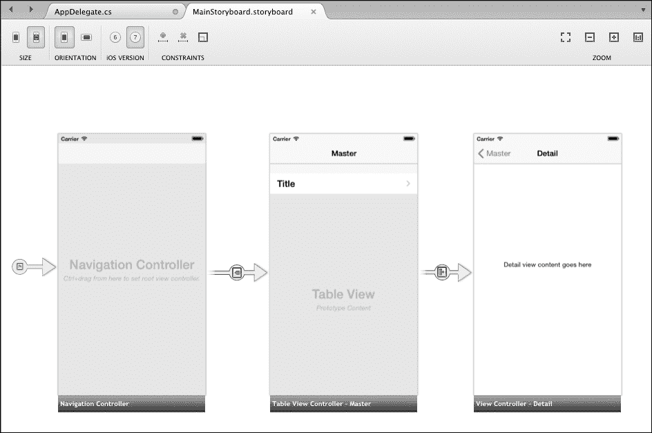

1.  注意位于 Xamarin Studio 右下角的 **工具箱** 选项卡。它包含可以在故事板中使用的所有项目。您可以使用搜索字段搜索项目。**工具箱** 选项卡如下面的截图所示：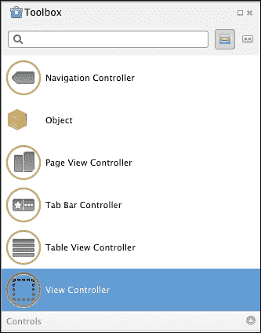

1.  注意位于 Xamarin Studio 右上角的 **文档大纲** 选项卡。此视图以分层形式显示故事板的内容，您可以使用它来查看更详细的级别。**文档大纲** 选项卡对于查看和选择故事板中的特定元素非常有帮助，如下面的截图所示：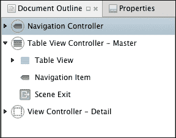

1.  注意位于 Xamarin Studio 右上角的 **属性** 选项卡；您可以通过点击标签为 **属性** 的选项卡来访问它。**属性** 选项卡允许您编辑当前选中项的属性。在 **小部件** 部分输入控件的名称将自动创建一个出口，在 **事件** 部分输入名称将自动创建一个动作。**属性** 选项卡如下面的截图所示：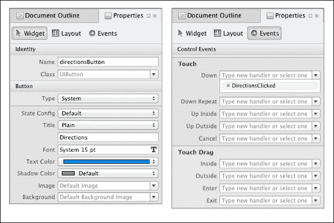

1.  注意设计师顶部的部分，其中包含调整选项的多个控件，例如 iOS 版本、设备大小、设备方向和缩放级别。还有用于建立约束的控件，如下面的截图所示：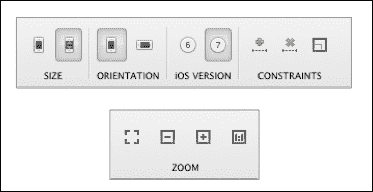

1.  在设计师中选择项目可能有点棘手，尤其是在选择视图控制器时。如果您在视图控制器的中间点击，将选择视图而不是视图控制器。有三种不同的方法来选择视图控制器：

    +   在视图控制器的中间右键单击并导航到 **视图控制器** | **选择**，如下面的截图所示：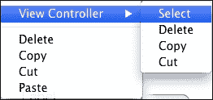

    +   点击视图控制器底部的栏，如下面的截图所示：

    +   在 **文档大纲** 选项卡中选择视图控制器

### 添加 EditViewController 和 segue

在对 Xamarin.iOS Designer 有基本了解之后，我们现在可以添加一个新的视图控制器和 segue。

要添加 `EditViewController` 和 segue，请执行以下步骤：

1.  双击`MainStoryboard.storyboard`以在 Xamarin.iOS 设计器中打开故事板。您将在文件中看到`MasterViewController`和`DetailViewController`，它们之间有一个转换。

1.  通过从**工具箱**垫中选择**视图控制器**项并拖放到设计视图中创建一个新的`UIViewController`。

1.  通过单击底部栏以选择它，切换到**属性**垫，并在**类**字段中输入`EditViewController`来命名新的视图控制器。以下截图显示了**属性**垫：

1.  在`DetailViewController`的导航项右侧添加一个栏按钮项，并将**标识符**按钮在**属性**垫的**小部件**部分设置为**编辑**。

1.  从`DetailViewController`的**编辑**按钮到新控制器`EditViewController`添加一个推送转换。按住*Ctrl*键，点击并按住**编辑**按钮，将其拖到`EditViewController`底部的栏上，释放鼠标，在**属性**垫的**小部件**部分的**标识符**选项中选择**推送**，并输入`editFromDetail`。

1.  在`MasterViewController`的导航项右侧添加一个栏按钮项，并将**标识符**按钮设置为**添加**。

1.  从`MasterViewController`的**添加**按钮到新控制器`EditViewController`添加一个推送转换。按住*Ctrl*键，点击并按住**添加**按钮，将其拖到`EditViewController`底部的栏上，释放鼠标，在**属性**垫的**小部件**部分的**标识符**选项中选择**推送**，并输入`editFromMaster`。

1.  在`EditViewController`的导航项右侧添加一个栏按钮项，并将**标识符**选项设置为**完成**。按钮命名为`DoneButton`。命名按钮将创建一个出口，稍后可以用作分配传统.NET 事件处理器的引用。

1.  在`EditViewController`的中心添加一个标签`UILabel`。这将被临时用来显示项目的名称，在我们测试和调试应用的导航时使用。将此`UILabel`实例命名为`editDescriptionLabel`。

1.  在`EditViewController`中添加一个`UIButton`实例，并将**标题**选项设置为**删除**。在**属性**垫的**事件**部分的**触摸**事件中添加一个名为`DeleteClicked`的操作。创建操作将生成一个部分方法，我们稍后可以用逻辑来完成以实现`DeleteClicked`事件处理器。

1.  保存所有做出的更改。

1.  现在，我们需要编写一些代码来将所有这些内容串联起来。让我们先看看由于我们在 Xamarin.iOS Designer 中的工作而生成的一些代码。你会找到为 `EditViewController` 添加的两个文件，一个名为 `EditViewController.designer.cs` 的设计器文件，嵌套在一个非设计器文件 `EditViewController.cs` 之下。双击设计器类以查看内容，如下面的代码片段所示：

```cs
[Outlet]
MonoTouch.UIKit.UIBarButtonItem DoneButton { get; set; }
[Outlet]

MonoTouch.UIKit.UILabel editContent { get; set; }
[Action ("DeleteClicked:")]
Partial void DeleteClicked (
    MonoTouch.Foundation.NSObject sender);
```

### 注意

注意，`EditViewController` 是一个部分类；这两个输出和动作是基于我们制定的规格生成的。

### 实现 DoneClicked 事件处理器

对于 **完成** 按钮，我们创建了一个输出，这样我们就可以在运行时将 .NET 事件处理器分配给该对象。当点击 **完成** 时，我们需要做一些事情。首先，检查我们是否处理的是新对象并将其添加到 `_parks` 集合中。如果是这样，那么我们需要将 `_parks` 集合保存到 `NationalParks.json`。

要实现 **完成** 按钮，请执行以下步骤：

1.  创建一个保存更改到 `NationalParks.json` 的方法，如下所示：

    ```cs
    private void SaveParks()
    {
       string dataFolder = Environment.CurrentDirectory;
       string serializedParks = JsonConvert.SerializeObject (_parks);
          File.WriteAllText(Path.Combine(dataFolder,
            "NationalParks.json"), serializedParks);
    }
    ```

1.  创建一个名为 `DoneClicked` 的 .NET 事件处理器，并添加逻辑将 `_park` 添加到 `_parks` 集合中。如果是新公园，调用 `SaveParks()` 方法将更新保存到 `NationalParks.json`，并使用以下代码片段返回到上一个视图控制器：

    ```cs
    private void DoneClicked (object sender, EventArgs e)
    {

      if (!_parks.Contains (_park))
          _parks.Add (_park);

      SaveParks ();
      NavigationController.PopViewControllerAnimated (true);
    }

    Assign the DoneClicked event handler to the Clicked event on the DoneButton outlet in ViewDidLoad().

    public override void ViewDidLoad (){
      . . .   DoneButton.Clicked += DoneClicked;}
    ```

### 实现 DeleteClicked 动作

我们为 **删除** 按钮创建了一个动作，这导致在设计师类中创建了一个部分方法。我们现在需要为部分方法创建一个实现。

要实现 **删除** 动作，你只需要为 `DeleteClicked` 添加一个 `partial` 方法实现，从 `parks` 集合中移除 `_park` 并将更改保存到 `NationalParks.json` 文件中，然后返回到 `MasterViewController`。这可以通过以下方式完成：

```cs
partial void DeleteClicked (UIButton sender)
{
    if (_parks.Contains(_park))
       _parks.Remove(_park);

   SaveParks();

    NavigationController.PopToRootViewController(true);
    }
```

展示的两种实现事件处理器的方案基本上完成了相同的事情，没有明显的优势。由于我们没有在 `ViewDidLoad()` 中为动作进行事件处理器分配，所以代码稍微少一些。这实际上取决于你更喜欢哪种方法，并感到最舒适。

### 传递数据

所有 iOS 应用都需要在视图之间导航并传递数据。由于我们使用故事板和转场来处理 UI，与导航相关的大部分工作都由我们完成。然而，我们需要在视图之间传递数据。这需要两个部分来完成：定义一个视图控制器将接受数据的方式，并从发起视图控制器使用此机制。就接受数据而言，这可以通过在视图控制器上使用简单的属性或定义一个接受数据并将其保存到私有变量的方法来完成。我们将采用定义一个接受导航数据的方法，这也是为我们生成的代码所采用的方法。

要完成接受导航数据的逻辑，执行以下步骤：

1.  打开 `DetailViewController` 并定位 `SetDetailItem` 方法。

1.  让我们先从更改名称开始，使其更具意义。在编辑器中选择 `SetDetailItem` 文本，右键单击并导航到 **重构** | **重命名**。输入 `SetNavData` 并点击 **确定**。

1.  让我们也使用相同的方法将 `ConfigureView ()` 重命名为 `ToUI()`。

1.  修改 `SetNavData()` 方法，使其接受一个 `NationalPark` 项目列表以及应该显示的单个公园，并将这些参数保存到一组私有变量中。同时，移除对 `ToUI()` 的调用；我们将在下一步将此移动到更合适的位置，如下面的代码所示：

    ```cs
    IList<NationalPark> _parks;
    NationalPark _park;
    . . .
    public void SetNavData(
        IList<NationalPark> parks, NationalPark park)
    {
        _parks = parks;
        _park = park;
    }
    ```

1.  重写 `ViewWillAppear()` 方法以调用 `ToUI()`，如下所示：

    ```cs
    public override void ViewWillAppear (bool animated)
    {
        ToUI ();
    }
    ```

1.  更新 `ToUI()` 方法，使其使用私有 `_park` 变量填充 `UILabel`，如下所示：

    ```cs
    void ToUI()
    {
        // Update the user interface for the detail item
        if (_park != null)
           detailDescriptionLabel.Text = _park.ToString ();
    }
    ```

1.  现在，将 `SetNavData()` 和 `ToUI()` 方法添加到与 `DetailViewController` 具有相同功能的 `EditViewController` 中。

现在我们已经处理了接收导航数据，我们将注意力转向传递数据。当使用 segue 时，iOS 视图控制器有一个可以重写的 `PrepareForSegue()` 方法，用于准备目标视图控制器以进行显示。我们需要在 `MasterViewController` 和 `DetailViewController` 中重写 `PrepareForSegue()`。

要完成传递导航数据的逻辑，执行以下步骤：

1.  打开 `MasterViewController` 并定位现有的 `PrepareForSegue()` 方法。

1.  `MasterViewController` 实际上有两个 segue：原始的 segue 用于导航到 `DetailViewController`，以及我们添加的用于导航到 `EditViewController` 的新 segue。`PrepareForSegue()` 方法提供了一个具有 `Identifier` 属性的 segue 参数，可以用来确定正在采取哪个导航路径。修改 `PrepareForSegue()` 中的代码，使其根据 segue 标识符在适当的视图控制器上调用 `SetNavData()`，如下所示：

    ```cs
    public override void PrepareForSegue (
        UIStoryboardSegue segue, NSObject sender)
    {
      if (segue.Identifier == "showDetail") {
        var indexPath = TableView.IndexPathForSelectedRow;
        var item = dataSource.Parks [indexPath.Row];
        ((DetailViewController)segue.
            DestinationViewController).SetNavData
               (dataSource.Parks, item);
      }
      else if (segue.Identifier == "editFromMaster") {
        ((EditViewController)segue.
            DestinationViewController).SetNavData
              (dataSource.Parks, new NationalPark());
      }
    }
    ```

1.  现在，打开 `DetailViewController` 并为 `PrepareForSegue()` 创建一个覆盖，以便将导航数据传递给 `EditViewController`，如下所示：

    ```cs
    public override void PrepareForSegue (
        UIStoryboardSegue segue, NSObject sender)
    {
      if (segue.Identifier == "editFromDetail") {
       ((EditViewController)segue.
         DestinationViewController).SetNavData
           (_parks, _park);
      }
    }
    ```

### 运行应用

我们已经做了很多修改，现在可以运行应用来测试基本导航。启动应用并测试导航到各个视图；观察以下内容：

1.  当你在 `MasterViewController` 上点击 **+**（添加）按钮时，在 `EditViewController` 中将显示一个新的国家公园。

1.  当你在 `DetailViewController` 上点击 **编辑** 按钮，应用将导航到显示当前公园的 `EditViewController`。

1.  当你在 `EditViewController` 上点击 **完成** 按钮，它将带你回到之前的视图控制器，无论是 `MasterViewController` 还是 `DetailViewController`。

1.  当你在 `EditViewController` 上点击 **删除** 按钮，它将带你到 `MasterViewController`。

以下截图展示了你应该看到的内容：

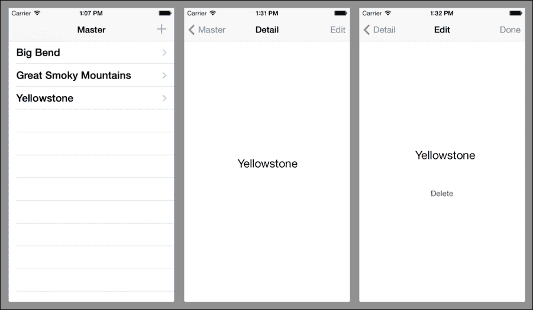

# 完成示例应用

视图控制器和导航现在已就位。我们现在需要添加一些额外的控件来查看和编辑信息，以及一点逻辑。

## 完成 DetailViewController

要完成`DetailViewController`，我们需要一组`UILabel`控件，用于显示公园的属性，并添加可以启动查看照片或接收方向的按钮。

要完成`DetailViewController`，执行以下步骤：

1.  在`DetailViewController`的视图中添加一个`UIScrollView`。

1.  为`NationalPark`上定义的每个属性（除了`Id`属性）添加`UILabel`控件。同时添加可以用于属性标签的`UILabel`控件。使用*示例国家公园应用*部分中的屏幕截图作为布局控件的指南。

1.  为每个将用于显示公园属性的`UILabel`控件输入一个名称，以便创建输出。

1.  更新`ToUI()`方法，以便`UILabel`控件填充来自公园的数据，如下所示：

    ```cs
    void ToUI()
    {
      // Update the user interface for the detail item
      if (IsViewLoaded && _park != null) {
          nameLabel.Text = _park.Name;
          descriptionLabel.Text = _park.Description;
          stateLabel.Text = _park.State;
          countryLabel.Text = _park.Country;
          latitudeLabel.Text = _park.Latitude.ToString ();
          longitudeLabel.Text = _park.Longitude.ToString ();
      }
    }
    ```

1.  在`Touch Down`事件中添加一个标题为“照片”的`UIButton`实例，并命名为`PhotoClicked`。

1.  为`PhotoClicked`操作添加实现，该操作打开一个 URL 以查看在[www.bing.com](http://www.bing.com)上使用公园名称作为搜索参数的照片：

    ```cs
    partial void PhotosClicked (UIButton sender)
    {
        string encodedUriString =
           Uri.EscapeUriString(String.Format(
              "http://www.bing.com/images/search?q={0}", _park.Name));
       NSUrl url = new NSUrl(encodedUriString);
       UIApplication.SharedApplication.OpenUrl (url);
    }
    ```

1.  在`Touch Down`事件中添加一个标题为“方向”的`UIButton`实例，并命名为`DirectionsClicked`。

1.  为`DirectionsClicked`操作添加实现，该操作打开一个 URL 以接收公园的经纬度坐标的路线：

    ```cs
    partial void DirectionsClicked (UIButton sender)
    {
        if ((_park.Latitude.HasValue) && (_park.Longitude.HasValue))
        {
            NSUrl url = new NSUrl (
                   String.Format(
                       "http://maps.apple.com/maps?daddr={0},{1}",
                        _park.Latitude, _park.Longitude));

           UIApplication.SharedApplication.OpenUrl (url);
       }
    }
    ```

1.  为`UIScrollView`和`UILabel`添加适当的约束，以便在横屏和竖屏模式下滚动和布局按预期工作。查看示例以获得更多清晰度。

## 完成 EditViewController

要完成`EditViewController`，我们需要添加标签和编辑控件以编辑公园数据。我们还需要进行一些数据转换并保存更新。

要完成`EditViewController`，执行以下步骤：

1.  在`EditViewController`的视图中添加一个`UIScrollView`实例。

1.  在`EditViewController`类中添加控件以及相应的输出，以便编辑`NationalPark`实体上的每个属性。`UITextField`控件可用于除描述属性之外的所有内容，该属性更适合使用`UITextView`控件。同时添加`UITextLabel`控件来标记公园的属性。您还可以再次使用*示例国家公园应用*部分中的屏幕截图作为指南。

1.  更新`ToUI()`方法以考虑新字段：

    ```cs
    private void ToUI ()
    {
       // Update the user interface for the detail item
       if (IsViewLoaded && _park != null) {
         nameTextField.Text = _park.Name;
         descriptionTextView.Text = _park.Description;
         stateTextField.Text = _park.State;
         countryTextField.Text = _park.State;
         latitudeTextField.Text = _park.Latitude.ToString();
         longitudeTextField.Text =
                 _park.Longitude.ToString(); 
       }
    }
    ```

1.  创建一个新的方法，在保存之前将数据从 UI 控件移动到实体类，如下所示：

    ```cs
    void ToPark()
    {
      _park.Name = nameTextField.Text;
      _park.Description = descriptionTextView.Text;
      _park.State = stateTextField.Text;
      _park.Country = countryTextField.Text;

      if (String.IsNullOrEmpty (latitudeTextField.Text))
        _park.Latitude =
            Double.Parse (latitudeTextField.Text);
      else
            _park.Latitude = null;

      if (String.IsNullOrEmpty (longitudeTextField.Text))
        _park.Longitude =
            Double.Parse (longitudeTextField.Text);
      else
        _park.Longitude = null;
    }
    ```

1.  更新`DoneClicked()`操作，以便在将更改保存到`NationalParks.json`之前调用`ToPark()`，将值移动到公园对象：

    ```cs
    partial void DoneClicked (NSObject sender)
       {
        ToPark ();

        . . .
    }
    ```

1.  为 `UIScrollView` 和 `UITextFields` 添加适当的约束，以便在横屏和竖屏模式下滚动和布局按预期工作。查看参考解决方案以获得更多清晰度。

1.  当键盘显示时，添加逻辑以将活动 `UITextField` 滚动到视图中。有几种实现此功能的方法。请参考示例以获取解决方案。

## 运行应用

好的，我们现在有一个功能相当完善的应用。在模拟器中运行应用并测试每个屏幕和导航路径。以下截图显示了三个视图控制器最终的结果：

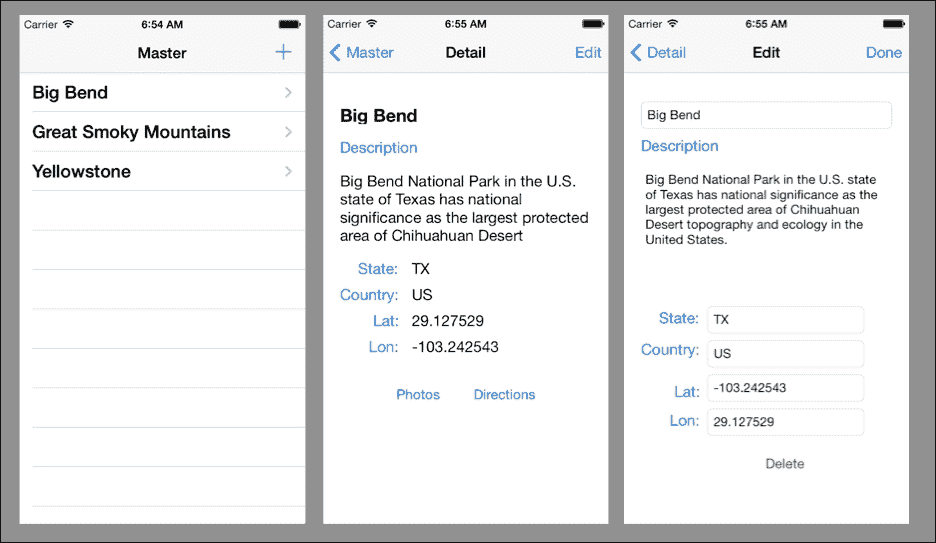

# MonoTouch.Dialog

**MonoTouch.Dialog**（**MT.D**）是用于 Xamarin.iOS 的一个框架，它提供了一种声明式的方法来开发用户界面，并消除了编写大量繁琐代码的需要。MT.D 基于使用 `UITableView` 控件来提供导航并允许用户与数据交互。

更多关于 MT.D 的信息可以在 [`docs.xamarin.com/guides/ios/user_interface/monotouch.dialog/`](http://docs.xamarin.com/guides/ios/user_interface/monotouch.dialog/) 找到。

# 摘要

在本章中，我们创建了一个示例 Xamarin.iOS 应用并展示了在使用 Xamarin.iOS 平台时需要理解的概念。虽然我们没有展示我们可以在 iOS 应用中使用到的所有功能，但现在你应该对如何访问这些功能感到舒适。

在下一章中，我们将为 Android 构建相同的示例应用。
