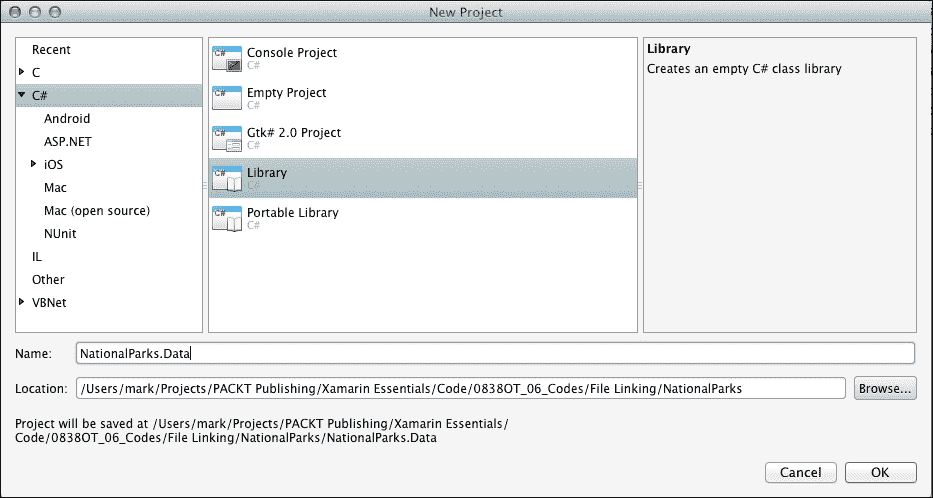
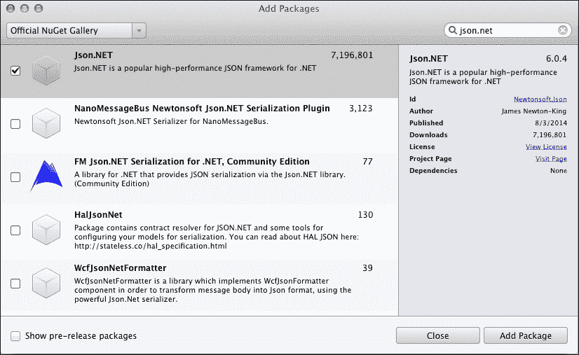
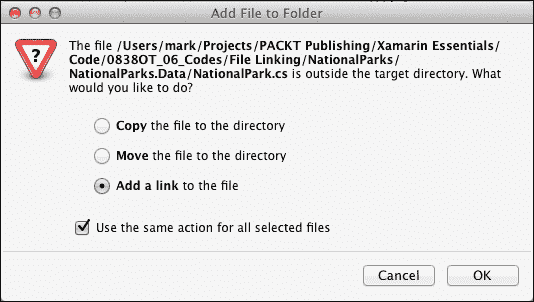

# 第六章. 分享游戏

在本章中，我们将讨论使用 Xamarin 开发中最有趣和最重要的方面之一：跨平台代码共享。我们将涵盖以下主题：

+   文件链接技术

+   可移植类库

+   每种方法的优缺点

# 分享和重用

使用 Xamarin 和 C#的一个优点是能够在移动应用程序以及其他.NET 解决方案之间共享代码。代码的重用可以提供显著的生产力和可靠性优势，同时减少许多与长期运行应用程序相关的长期维护难题。这很好，但任何长期参与软件开发的人都知道，重用不是免费的，也不是简单就能实现的。

代码重用的实际方面；问题在于，“在物理上，我该如何打包我的代码以便重用？”为此，我们可以使用以下三种方法之一：

+   将源代码共享，可以编译成多个项目

+   共享**动态链接库**（**DLL**），可以被多个项目引用

+   将代码作为服务共享，以便多个客户端远程访问

此外，还有一些更战略性的方面；同样的问题再次出现，“我该如何组织我的代码，以便我可以重用更多？”为了解决这个问题，我们有以下选择：

+   创建分层方法，以便将数据访问逻辑和业务验证从用户界面逻辑中分离出来

+   利用接口和框架将特定平台的服务从可重用层抽象出来

在本章中，我们将涉及这两个方面的重用，但主要关注重用的实际方面。具体来说，我们将介绍两种不同的方法来打包代码以供重用。

那么，我们应该尝试重用代码的哪些部分？在我们对`NationalParks`应用程序所做的工作中，一组明显的代码非常适合重用：持久化代码，这是从 JSON 文件加载公园并将其保存回同一文件的逻辑。在第五章《使用 Xamarin.Android 开发您的第一个 Android 应用程序》中，我们通过创建`NationalParkData`单例来朝着可重用解决方案迈进。在本章中，我们将展示两种不同的方法，用于在两个项目以及可能需要它的其他.NET 项目中共享`NationalParkData`单例。

# 传统的源文件链接

文件链接是指一种技术，其中源代码文件通过 Xamarin 项目进行链接或引用，并在对项目运行构建时与项目中的其他源代码一起编译。当使用文件链接时，不会为共享的文件创建单独的 DLL，而是代码被编译成与链接的文件相同的项目生成的 DLL；在我们的例子中，是`NationalParks.iOS.dll`或`NationalParks.Droid.dll`。

## 创建共享库项目

我们将首先创建一个新的`Library`项目来存放可重用代码。要创建`Library`项目，请执行以下步骤：

1.  将名为`NationalParks.Data`的新库项目添加到`NationalParks`解决方案中。您可以在**新建项目**对话框下的**C#** | **库**中找到`Library`项目模板，如下截图所示：

1.  从新项目中移除`MyClass.cs`。在移除文件时，选择**删除**将删除文件的项目引用，并从文件系统中删除底层文件。

1.  在**构建** | **常规**下的**项目选项**对话框中，将**目标框架**选项设置为**Mono/.NET 4.5**。

1.  将`NationalPark.cs`和`NationalParkData.cs`文件从`NationalParks.Droid`移动到`NationalPark.Data`。

1.  打开`NationalPark.cs`和`NationalParkData.cs`，并将命名空间更改为`NationalParks.Data`。

1.  在`NationalParkData`中添加一个公共字符串`DataDir`属性，并在`GetFilename()`方法中使用它，如下所示：

    ```cs
    public string DataDir { get; set; }
    . . .
    protected string GetFilename()
    {
        return Path.Combine (DataDir, "NationalParks.json");
    }
    ```

1.  将加载`parks`数据的逻辑从构造函数移动到名为`Load()`的新方法中，如下代码片段所示：

    ```cs
    public void Load()
    {
      if (File.Exists (GetFilename())) {
        string serializedParks =
            File.ReadAllText (GetFilename());
            _parks = JsonConvert.DeserializeObject
                <List<NationalPark>> (serializedParks);
      }
      else
      _parks = new List<NationalPark> ();
    }
    ```

1.  编译`NationalParks.Data`。由于对 Json.NET 的未解析引用，您将收到编译错误。不幸的是，我们无法简单地添加之前从 Xamarin 组件存储中下载的 Json.NET 组件版本，因为这个版本是为与 Xamarin.iOS 和 Xamarin.Android 配置一起使用而构建的，并且与 Mono/.NET 4.5 库项目不兼容。

1.  使用 NuGet 将 Json.NET 库添加到项目中。选择`NationalParks.Data`，右键单击它，然后导航到**添加** | **添加包**。在搜索字段中输入`Json.NET`，在列表中检查**Json.NET**条目，然后选择**添加包**。以下截图显示了**添加包**对话框：

1.  编译`NationalParks.Data`；这次您应该不会收到编译错误。

## 更新 NationalParks.Droid 以使用共享文件

现在我们已经将`NationalParksData`单例放在一个单独的项目中，我们现在可以重用它了。

为了更新`NationalParks.Droid`以使用共享解决方案，执行以下步骤：

1.  在**解决方案**面板中选择`NationalPark.cs`和`NationalParksData.cs`，右键单击它，选择**移除**，然后选择**删除**。这将从项目中删除所选文件，并从项目文件夹中物理删除它们。

1.  在`NationalParks.Droid`中添加一个名为`NationalParks.Data`的文件夹。这个文件夹将不包含任何文件，但将仅用于项目结构中，以组织对共享文件的链接。

1.  选择`NationalParks.Data`文件夹，右键单击它，然后导航到**添加** | **添加文件**以将现有文件添加到项目中。

1.  在 **添加文件** 对话框中，导航到 `NationalParks.Data` 项目文件夹，选择 `NationalPark.cs` 和 `NationalParkData.cs`，然后点击 **打开**。

1.  在 **添加文件到文件夹** 对话框中，选择 **添加文件链接**，勾选 **为所有选定的文件使用相同的操作** 选项，然后点击 **确定**。展开 **NationalParks.Data** 文件夹，可以看到添加了两个文件链接。以下截图显示了 **添加文件到文件夹** 对话框：

1.  在 `NationalParks.Data` 命名空间中添加 `using` 子句，并在 `MainActivity`、`DetailActivity`、`EditActivity` 和 `NationalParksAdapter` 中移除任何 `Newtonsoft.Json` 的 `using` 指令。

1.  在 `MainActivity.OnCreate()` 中，在创建 `ListView` 适配器之前设置 `NationalParksData.DataDir` 属性并调用 `Load()` 方法：

    ```cs
     NationalParksData.Instance.DataDir =
         System.Environment.GetFolderPath (
            System.Environment.SpecialFolder.MyDocuments);
    NationalParksData.Instance.Load ();
    ```

1.  编译并运行应用程序。你应该看不到明显的行为变化，但我们现在以可共享的方式使用序列化和存储逻辑。

## 更新 NationalParks.iOS 以使用共享文件

现在，让我们继续更新 `NationalParks.iOS`。在这里我们还有更多工作要做，因为如果你还记得，我们之前将文件处理逻辑分散在几个区域。

为了更新 `NationalParks.iOS` 以使用共享解决方案，请执行以下步骤：

1.  从项目中移除 `NationalPark.cs`。

1.  在 `NationalParks.Droid` 项目中添加一个名为 `NationalParks.Data` 的文件夹。

1.  将文件链接添加到 `NationalPark.cs` 和 `NationalParkData.cs`。

1.  打开 `MasterViewController.cs`，添加 `NationalParks.Data` 的 `using` 实例，并移除 `Newtonsoft.Json` 的 `using` 实例。

1.  在 `MasterViewController.ViewDidLoad()` 中，在创建 `UITableView` 的数据源之前设置 `DataDir` 属性：

    ```cs
    NationalParksData.Instance.DataDir =
        Environment.CurrentDirectory;
    NationalParksData.Instance.Load ();
    ```

1.  在 `DataSource` 类中，移除 `Parks` 集合，并在构造函数中移除 `Parks` 集合的加载操作。

1.  更新 `DataSource` 中的方法，以便引用 `NationalParksData` 中的 `Parks` 集合属性。

1.  从 `DataSource` 中移除 `Parks` 属性，并更新 `MasterViewController.PrepareForSegue()` 以使用 `NationalParksData` 中的 `Parks` 属性。

1.  打开 `DetailViewController` 并添加 `NationalParks.Data` 的 `using` 实例。

1.  在 `SetNavData()` 中，移除 `Parks` 集合参数、相应的私有变量，然后更新 `MasterViewController` 中的导航逻辑。

1.  打开 `EditViewController` 并添加 `NationalParks.Data` 的 `using` 指令。

1.  在 `SetNavData()` 中，移除 `Parks` 集合参数、相应的私有变量，然后更新 `MasterViewController` 和 `DetailViewController` 中的导航逻辑，以便不传递任何 `Parks` 集合。

1.  移除 `SaveParks()` 方法。

1.  在 `DoneClicked()` 中，将添加公园到集合并保存集合的逻辑替换为对 `NationalParksData.Instance.Save()` 的调用，如下所示：

    ```cs
    private void DoneClicked (object sender, EventArgs e)
    {
        ToPark ();
        NationalParksData.Instance.Save (_park);
        NavigationController.PopViewControllerAnimated (true);
    }
    ```

1.  在`DeleteClicked()`中，将移除公园集合并保存集合的逻辑替换为对`NationalParks.Instance.Delete()`的调用，如下所示：

    ```cs
    partial void DeleteClicked (UIButton sender)
    {
        NationalParksData.Instance.Delete(_park);
       NavigationController.PopToRootViewController(true);
    }
    ```

1.  编译并运行应用程序。与`NationalParks.Droid`一样，你应该看不到明显的行为变化。

# 可移植类库

**可移植类库**（**PCL**）是符合微软标准的库，可以以二进制格式跨许多不同的平台共享，例如 Windows 7 桌面、Windows 8 桌面、Windows 8 手机、Xbox 360 和 Mono。PCL 的一个大优点是你可以为所有这些平台共享单个二进制文件，避免分发源代码。然而，也有一些重大的挑战。

我们面临的一个直接问题是我们的代码使用了跨所有平台不支持的 API；具体来说，是`File.Exists()`、`File.ReadAllText()`和`File.WriteAllText()`。这看起来有些令人惊讶，但大多数`System.IO`在所有.NET 配置文件中并不通用；因此，在共享代码中处理文件 I/O 逻辑可能会有点困难。在我们的案例中，只有三个方法，我们可以通过创建一个 IO 接口轻松地将这种逻辑从共享代码中抽象出来。使用我们的共享解决方案的每个平台都将负责提供 IO 接口的实现。

## 创建`NationalParks.PortableData`

第一步是创建一个可移植类库来存放我们的共享解决方案。要创建`NationalParks.PortableData`，请执行以下步骤：

1.  将一个新的可移植类库项目添加到`NationalParks`解决方案中。项目模板可以在**C#** | **可移植库**下找到。

1.  从新创建的项目中删除`MyClass.cs`。

1.  将`NationalPark.cs`和`NationalParksData.cs`从`NationalParks.Data`项目复制到`NationalParks.PortableData`。

1.  添加对 Json.NET 可移植类库的引用。

1.  创建`IFileHandler`接口并添加三个方法，这些方法抽象了我们需要的三个 IO 方法。最好使读取和写入方法异步返回`Task<>`，因为许多平台只支持异步 IO。这将简化在这些平台上实现接口的过程。以下代码演示了所需的操作：

    ```cs
    public interface IFileHandler
    {
        bool FileExists (string filename);
        Task<string> ReadAllText (string filename);
        Task WriteAllText (string filename, string content);
    }
    ```

1.  在`NationalParksData`中添加一个公共的`IFileHandler`属性，并将所有逻辑更改为使用此属性而不是使用`System.IO.File`，如下所示：

    ```cs
    public IFileHandler FileHandler { get; set; }
    . . .
    public async Task Load()
    {
      if (FileHandler.FileExists (GetFilename())) {
        string serializedParks =
          await FileHandler.ReadAllText (GetFilename());
      Parks = JsonConvert.DeserializeObject
              <List<NationalPark>> (serializedParks);
      }
      . . .
    }
    . . .
    public Task Save(NationalPark park)
    {
      . . .
      return FileHandler.WriteAllText (
        GetFilename (), serializedParks);
    }
    public Task Delete(NationalPark park)
    {
      . . .
      return FileHandler.WriteAllText (
        GetFilename (), serializedParks);
    }
    ```

## 实现`IFileHandler`

我们现在需要创建一个`IFileHandler`的实现，该实现可以由我们的两个项目使用。我们将通过前几节中介绍的文件链接方法共享文件处理实现。

要实现`IFileHandler`，请执行以下步骤：

1.  在`NationalParks`解决方案中，创建一个名为`NationalParks.IO`的新`Library`项目，并将**目标框架**选项设置为**Mono/.NET 4.5**。这将作为我们的文件处理实现共享项目。

1.  删除默认创建的 `MyClass.cs 文件`，并将对 `NationalParks.PortableData` 的引用添加进来。这将使我们能够访问我们打算实现的 `IFileHandler` 接口。

1.  在 `NationalParks.IO` 中创建一个名为 `FileHandler` 的类。添加对 `NationalParks.PortableData` 命名空间的 `using` 指令，并指定该类实现 `IFileHandler` 接口。

1.  使用 **重构** 下的 **实现** 接口菜单项为接口上的每个方法创建存根实现。

1.  实现每个存根方法。以下代码演示了所需的操作：

    ```cs
    #region IFileHandler implementation
    public bool FileExists (string filename)
    {
        return File.Exists (filename);
    }
    public async Task<string> ReadAllText (string filename)
    {
        using (StreamReader reader =
            File.OpenText(filename)) {
            return await reader.ReadToEndAsync();
        }
    }
    public async Task WriteAllText (string filename,
        string content)
    {
        using (StreamWriter writer =
            File.CreateText (filename)) {
            await writer.WriteAsync (content);
        }
    }
    #endregion
    ```

## 更新 NationalParks.Droid 以使用 PCL

现在，是时候更新 `NationalParks.Droid` 以使用我们新的 PCL。

为了更新 `NationalParks.Droid` 以使用 `NationalParks.PortableData`，执行以下步骤：

1.  在 `NationalParks.Droid` 项目中，删除 `NationalParks.Data` 文件夹，创建一个名为 `NationalParks.IO` 的新文件夹，并将对 `NationalParks.PortableData` 的引用添加到其中。

1.  在 `NationalParks.IO` 文件夹中，将 **链接** 添加到 `FileHandler` 类。

1.  在 `MainActivity.cs` 中，为 `NationalParks.IO` 和 `NationalParks.PortableData` 添加一个 `using` 子句。

1.  在 `MainActivity.OnCreate()` 中，使用 `FileHandler` 的一个实例初始化 `FileHandler` 属性，在调用 `Load()` 的调用上放置一个 `await` 实例，并将 `NationalParksAdapter` 的赋值移动到调用 `Load()` 之前，如下面的代码片段所示：

    ```cs
    _adapter = new NationalParksAdapter (this);
    NationalParksData.Instance.FileHandler =
        new FileHandler ();
    NationalParksData.Instance.DataDir =
      System.Environment.GetFolderPath (
          System.Environment.SpecialFolder.MyDocuments);
    await NationalParksData.Instance.Load ();
    ```

1.  由于我们现在正在异步加载数据，`OnPause()` 方法可能会在 `OnCreate()` 的异步返回之前被调用。因此，我们需要在 `OnPause()` 中的逻辑上添加一个空检查，该逻辑调用 `NotifyDataSetChanged()`，如下所示：

    ```cs
    protected override void OnResume ()
    {
       basse.OnResume ();
       if (_adapter != null)
           _adapter.NotifyDataSetChanged ();
    }
    ```

1.  在 `NationalParksAdapter.cs`、`DetailActivity.cs` 和 `EditActivity.cs` 中，为 `NationalParks.PortableData` 添加一个 `using` 子句，并删除对 `NationalParks.Data` 的 `using` 指令。

1.  编译并运行应用程序。

## 更新 NationalParks.iOS 以使用 PCL

现在，是时候更新 `NationalParks.IOS`。大部分步骤与之前基本相同。

为了更新 `NationalParks.iOS` 以使用 `NationalParks.PortableData`，执行以下步骤：

1.  在 `NationalParks.Droid` 项目中，删除 `NationalParks.Data` 文件夹，创建一个名为 `NationalParks.IO` 的新文件夹，并将对 `NationalParks.PortableData` 的引用添加到其中。

1.  在 `NationalParks.IO` 文件夹中，将 **链接** 添加到 `FileHandler` 类。

1.  在 `MasterViewController.cs` 中，为 `NationalParks.IO` 和 `NationalParks.PortableData` 添加一个 `using` 子句，并删除对 `NationalParks.Data` 的 `using` 指令。

1.  在 `MasterViewController.ViewDidLoad()` 中，使用 `FileHandler` 的一个实例初始化 `FileHandler` 属性，在调用 `Load()` 的调用上放置一个 `await` 实例，并在数据源赋值后调用 `TableView.ReloadData()`，如下面的代码片段所示：

    ```cs
    NationalParksData.Instance.FileHandler =
        new FileHandler ();
    NationalParksData.Instance.DataDir = 
        Environment.CurrentDirectory;
    await NationalParksData.Instance.Load ();
    TableView.Source = dataSource = new DataSource (this);
    TableView.ReloadData ();
    ```

1.  在`DetailViewController.cs`和`EditViewController.cs`中，将`NationalParks.Data`的`using`指令替换为`NationalParks.PortableData`。

1.  编译并运行应用程序。

# 代码共享技术的优缺点

现在我们已经对在 Xamarin.iOS 和 Xamarin.Android 应用之间共享代码的两种实用方法有了些经验，让我们来看看它们的优缺点。以下表格总结了每种方法的优缺点：

|   | 优点 | 缺点 |
| --- | --- | --- |
| 文件链接 |

+   这允许更广泛地使用.NET API，假设这些 API 被所有将使用共享代码的平台支持。如果你只针对 Xamarin.iOS 和 Xamarin.Android，这效果相当不错。

|

+   这需要共享源代码。

+   这些 API 依赖性问题可能直到为每个目标平台编译共享代码时才会被发现。

|

| 可移植类库 |
| --- |

+   这确保了平台 API 的兼容性。

+   这允许分发二进制代码。

|

+   这限制了可用于代码中的命名空间和 API。

|

# 概述

在本章中，我们回顾了在 Xamarin 项目以及其他.NET 解决方案之间共享代码的两种实用方法。在下一章中，我们将探讨 MvvmCross，这是一个简化实现 Model-View-ViewModel 设计模式的框架，增加了跨平台共享代码的数量。
