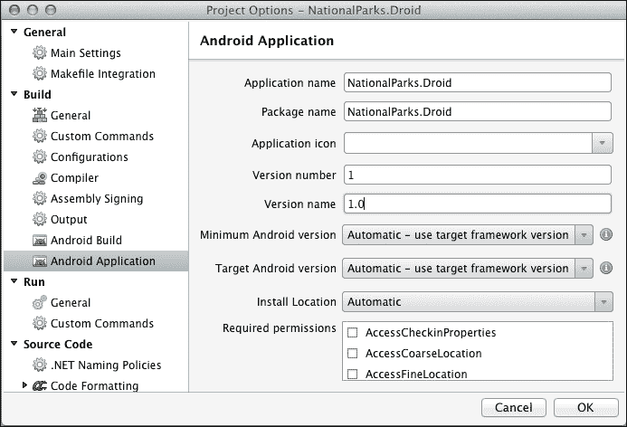
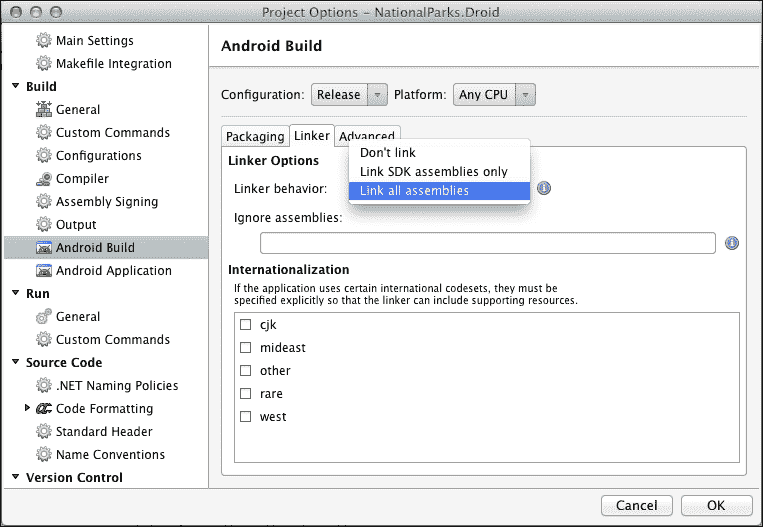
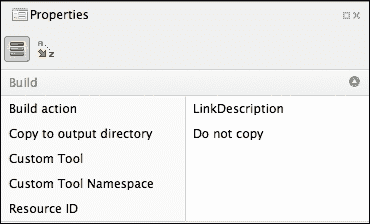
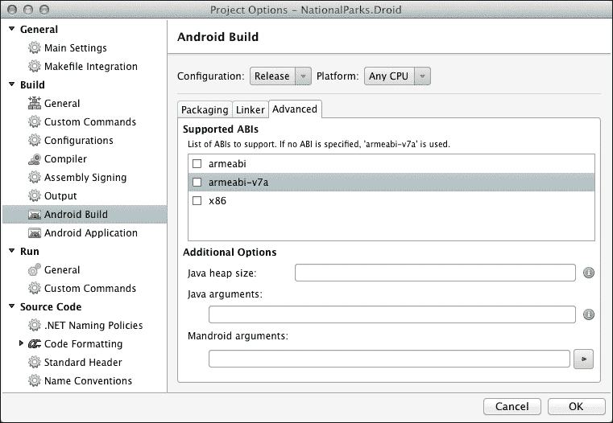
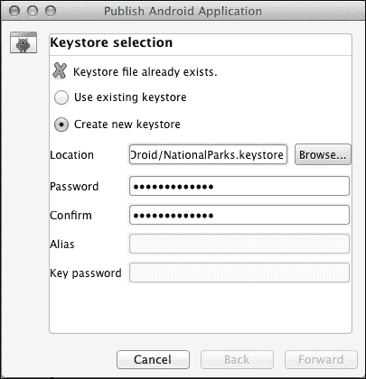
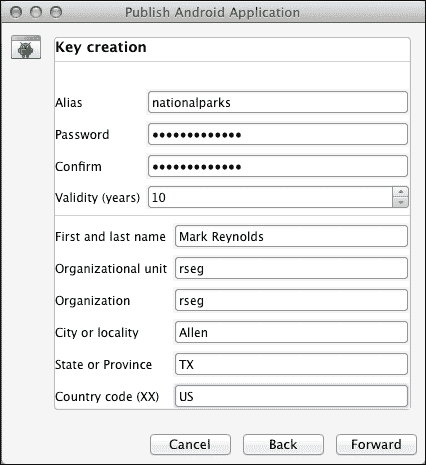
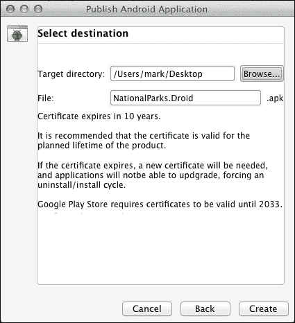
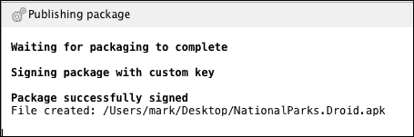

# 第十章：准备分发 Xamarin.Android 应用程序

在本章中，我们将讨论与准备分发 Xamarin.Android 应用程序相关的活动，并查看分发应用程序的各种选项。我们将讨论的许多活动是任何 Android 应用程序部署的组成部分。然而，在本章中，我们将尝试缩小覆盖范围，仅关注使用 Xamarin.Android 开发时独特的方面。我们将涵盖以下主题：

+   应用程序性能分析

+   分发应用程序的 Android 构建设置

+   应用程序分发选项

# 准备发布 APK

在发布签名的 APK 文件之前，需要完成一系列活动。以下章节讨论了在生成发布 APK 之前应考虑的主题。

## 性能分析 Xamarin.Android 应用程序

Xamarin.Android 商业许可证为性能分析 Android 应用程序提供有限支持。性能分析可以是非常有效的识别内存泄漏和进程瓶颈的方法。

### 小贴士

本书将不会涵盖性能分析，但以下链接提供了使用 Xamarin.Android 性能分析功能的概述：[`docs.xamarin.com/guides/android/deployment,_testing,_and_metrics/profiling`](http://docs.xamarin.com/guides/android/deployment,_testing,_and_metrics/profiling)。

除了使用 Xamarin.Android 提供的工具外，还可以使用传统的 Android 性能分析工具，如 Traceview 和 `dmtracedump`。更多信息请参阅 [`developer.android.com/tools/debugging/debugging-tracing.html`](http://developer.android.com/tools/debugging/debugging-tracing.html)。

## 禁用调试

在开发 Xamarin.Android 应用程序时，Xamarin Studio 支持使用 **Java 调试 Wire Protocol**（**JDWP**）进行调试。这个功能需要在发布构建中禁用，因为它存在安全风险。你有两种不同的方法来完成这个任务：

+   修改 `AndroidManifest.xml` 中的设置

+   修改 `AssemblyInfo.cs` 中的设置

### 修改 AndroidManifest.xml 中的设置

第一种方法可以通过以下列表来完成，该列表展示了如何从 `AndroidManifest.xml` 文件中关闭 JDWP 调试：

```cs
    <application .. .
        android:debuggable="false" .. .
    </application>
```

### 修改 AssemblyInfo.cs 中的设置

替代方法是通过在 `AssemblyInfo.cs` 中禁用 JDWP 来实现的。这种方法的优势在于它基于当前选定的配置。以下列表展示了如何使用条件指令来关闭 JDWP 调试：

```cs
    #if RELEASE
    [assembly: Application(Debuggable=false)]
    #else
    [assembly: Application(Debuggable=true)]
    #endif
```

## Android 应用程序（AndroidManifest.xml）设置

当你开始考虑部署你的应用程序时，你已经在 `AndroidManifest.xml` 中建立了大多数需要的设置。然而，你需要更新版本信息。请注意，版本号在安装过程中由 Android 平台使用，以确定 APK 是否是现有应用程序的更新。版本名称是自由形式的文本，可以用来以任何希望的方式跟踪应用程序版本。这可以通过打开 **项目选项** 对话框并导航到 **构建** | **Android 应用程序**，或者通过双击 `NationalParks/Properties/AndroidManifest.xml` 来完成。以下截图显示了 **Android 应用程序** 设置对话框：



## 链接器选项

在构建过程中，Xamarin.Android 对构成应用程序的组件进行静态分析，并尝试消除不需要的类型和成员实例。控制此过程的设置可以在 **项目选项** 对话框中查看和设置，该对话框位于 **Android 构建** 部分下，如下截图所示：



Xamarin.Android 支持与 Xamarin.iOS 相同的链接器选项。在查看和调整 **链接器选项** 设置时，请确保首先从 **配置** 下拉菜单中选择 **发布**。以下链接选项可用：

+   **不链接**：此选项禁用链接器，并确保所有引用的组件都包含在内，而不进行修改。这是针对 iOS 模拟器构建的默认设置。这消除了链接的耗时过程，并将大文件部署到模拟器相对较快。

+   **仅链接 SDK 组件**：此选项告诉链接器仅对 SDK 组件进行操作；那些与 Xamarin.iOS 一起发货的组件。这是针对设备构建的默认设置。

+   **链接所有组件**：此选项告诉链接器对整个应用程序以及所有引用的组件进行操作。这允许链接器使用更大的优化集，并产生可能的最小应用程序。然而，当链接器以这种方式运行时，由于静态分析过程中做出的错误假设，它可能会破坏你的代码的一部分。特别是，反射和序列化的使用可能会使静态分析失败。

以下表格显示了 APK 文件大小根据链接器设置的变化：

|   | 文件链接版本 | PCL 版本 |
| --- | --- | --- |
| **不链接** | 26.4 MB | 27.5 MB |
| **仅链接 SDK 组件** | 4.3 MB | 4.3 MB |
| **链接所有组件** | 4.1 MB | 4.2 MB |

### 覆盖链接器

在某些情况下，链接选项可能会有负面影响，例如意外删除重要的类型和/或成员。对于已经编译和链接为发布模式的程序，在分发之前进行彻底测试以识别此类问题非常重要。在某些情况下，你应该进行超出初始开发者测试的测试，并且这应该使用发布模式生成的 APK 文件进行。

如果遇到与缺失类型或定位特定方法相关的任何运行时异常，你可以使用以下方法之一来向链接器提供明确的指令。

#### 使用属性保留代码

如果你通过测试确定链接过程移除了你的应用所需的类或方法，你可以通过在类和/或方法上使用`Preserve`属性来明确告诉链接器始终包含它们。

要保留整个类型，请使用以下命令：

```cs
[Preserve (AllMembers = true)]
```

要保留单个成员，请使用以下命令：

```cs
[Preserve (Conditional=true)]
```

#### 使用自定义链接器文件保留代码

有时候，你可能无法访问源代码，但仍然需要保留特定的类型和/或成员。这可以通过自定义链接器文件实现。以下示例指示链接器始终包含特定类型的特定成员：

```cs
<?xml version="1.0" encoding="UTF-8" ?>
<linker>
  <assembly fullname="Mono.Android">
    <type fullname="Android.Widget.AdapterView">
      <method name="GetGetAdapterHandler"/>
      <method name="GetSetAdapter_Landroid_widget_Adapter_Handler"/>
    </type>
  </assembly>
</linker>
```

你可以通过添加一个简单的 XML 文件并将其填充与上一个示例类似的内容来向项目中添加自定义链接文件；实际上，它在项目结构中的位置并不重要。在将文件添加到项目后，选择该文件，打开**属性**面板，然后为**构建操作**选择**LinkDescription**，如图所示：



#### 跳过程序集

你也可以指示链接器跳过整个程序集，这样所有的类型和成员都将被保留。这可以通过以下两种方式实现：

+   使用命令行选项`linkskip`，例如，`--linkskip=someassembly`

+   使用`AndroidLinkSkip` MSBuild 属性，如下所示：

    ```cs
    <PropertyGroup>
        <AndroidLinkSkip>Assembly1;Assembly2</AndroidLinkSkip>
    </PropertyGroup>
    ```

## 支持的 ABIs

Android 支持多种不同的 CPU 架构。Android 平台定义了一组**应用程序二进制接口**（**ABI**），对应不同的 CPU 架构。默认情况下，Xamarin.Android 假定 armeabi-v7a 适用于大多数情况。要支持额外的架构，请在**Android 构建**部分下的**项目选项**对话框中检查每个适用的选项。



# 发布发布版 APK

现在你已经调整了生成发布构建所需的所有设置，你就可以发布实际的 APK 了。当我们说发布时，我们只是意味着生成一个可以上传到 Google Play Store 的 APK。以下章节将讨论在 Xamarin Studio 内部生成签名 APK 的步骤。

## 密钥库

密钥库是由 Java SDK 中的 keytool 程序创建和管理的安全证书数据库。您可以使用 keytool 命令在 Xamarin Studio 外部创建密钥库，或者从 Xamarin Studio 内部创建，它提供了一个与 keytool 命令交互的 UI。下一节将指导您在 Xamarin Studio 内部发布 APK 和创建新密钥库的步骤。

## 从 Xamarin.Android 发布

以下步骤指导您在创建签名 APK 的过程中创建新密钥库：

1.  在**配置**下拉框中，选择**发布**。

1.  从主菜单导航到**项目** | **发布 Android 应用程序**；注意**发布 Android 应用程序**向导的**密钥库选择**页面，如下截图所示：

1.  选择**创建新密钥库**，选择一个包含密钥库名称的位置，并输入密码并确认。示例密钥库位于项目文件夹中，名为`NationalParks.keystore`，密码为`nationalparks`。

1.  选择**前进**；您将看到**密钥创建**页面，如下截图所示：

1.  输入所有相关信息。本例使用`nationalparks`作为**别名**字段和**密码**。

1.  选择**前进**；您将看到**发布 Android 应用程序**向导的**选择目标**页面，如下截图所示：

1.  选择所需的**目标目录**选项，然后点击**创建**。Xamarin Studio 将为发布编译应用程序并生成签名 APK 文件。您应该在**发布包**面板中看到以下内容：

生成的 APK 已准备好进行最终测试和潜在的分发。请确保安全并备份您的密钥库，因为它对于分发未来版本至关重要。

## 从 Xamarin.Android 重新发布

应用程序后续发布应始终使用原始密钥库。为此，只需在**发布 Android 应用程序**向导的**密钥库选择**页面选择**使用现有密钥库**。

## 从 Visual Studio 发布

在 Visual Studio 内部发布签名 APK 基本上遵循相同的流程。要这样做，只需从主菜单导航到**工具** | **发布 Android 应用程序**。

# 应用程序分发选项

分发 Xamarin.Android 应用程序与任何其他 Android 应用程序没有区别。它们可以通过所有正常渠道分发，包括应用商店、电子邮件附件、网站链接、U 盘等。

# 摘要

在本章中，我们回顾了与准备应用程序分发相关的内容以及实际生成签名发布 APK 文件的流程。

本章完成了我们关于 Xamarin Essentials 的书籍。我们试图为经验丰富的移动开发者提供一个高效的方法，以便他们能够快速掌握使用 Xamarin 平台开发应用程序。我们回顾了 Xamarin 架构，为 iOS 和 Android 开发了功能性的应用程序，并探讨了如何通过使用多种不同的方法和框架，在移动平台间共享代码来最大化 Xamarin 的价值。现在，你已经准备好将 Xamarin 投入使用了。

我希望你们觉得这本书是一本有用的资源，并且它激发了你使用 Xamarin 开发优秀移动应用程序的热情。
