# 第二章：构建我们的第一个 Xamarin.Forms 应用程序

在本章中，我们将创建一个待办事项列表应用程序，并在此过程中探讨构建应用程序的各个方面。我们将研究创建页面，向这些页面添加内容，导航之间切换，并创建一个令人惊叹的布局。嗯，*令人惊叹*可能有点牵强，但我们一定会设计应用程序，以便在完成后您可以根据自己的需求进行调整！

本章将涵盖以下主题：

+   设置项目

+   在设备上本地持久化数据

+   使用存储库模式

+   MVVM 是什么以及为什么它非常适合 Xamarin.Forms

+   使用 Xamarin.Forms 页面（作为视图）并在它们之间导航

+   在 XAML 中使用 Xamarin.Forms 控件

+   使用数据绑定

+   在 Xamarin.Forms 中使用样式

# 技术要求

为了能够完成这个项目，我们需要安装 Visual Studio for Mac 或 PC，以及 Xamarin 组件。有关如何设置您的环境的更多详细信息，请参阅 Xamarin 简介。

# 项目概述

每个人都需要一种跟踪事物的方式。为了启动我们的 Xamarin.Forms 开发学习曲线，我们决定一个待办事项列表应用程序是最好的开始方式，也可以帮助您跟踪事物。一个简单的，经典的，双赢的场景。

我们将首先创建项目，并定义一个存储库，用于存储待办事项列表的项目。我们将以列表形式呈现这些项目，并允许用户使用详细的用户界面对其进行编辑。我们还将看看如何通过**SQLite-net**在设备上本地存储待办事项，以便在退出应用程序时不会丢失。

此项目的构建时间约为两个小时。

# 开始项目

是时候开始编码了！然而，在继续之前，请确保您已按照 Xamarin 简介中描述的设置好开发环境。

本章将是一个经典的文件|新建项目章节，将逐步指导您创建您的第一个待办事项列表应用程序的过程。完全不需要下载。

# 设置项目

Xamarin 应用程序基本上可以使用两种代码共享策略之一来创建：

+   作为共享项目

+   作为.NET 标准库

第一个选择，**共享项目**，将创建一个项目类型，实质上是其中每个文件的链接副本。文件存在于一个共同的位置，并在构建时链接。这意味着我们在编写代码时无法确定运行时，并且只能访问每个目标平台上可用的 API。它确实允许我们使用条件编译，在某些情况下可能有用，但对于以后阅读代码的人来说可能也会令人困惑。选择共享项目选项也可能是一个不好的选择，因为它将我们的代码锁定到特定的平台。

我们将使用第二个选择，**.NET 标准库**。当然，这是一个选择的问题，两种方式仍然有效。稍加想象力，即使选择了共享项目，您仍然可以遵循本章的内容。

让我们开始吧！

# 创建新项目

第一步是创建一个新的 Xamarin.Forms 项目。打开 Visual Studio 2017，然后单击文件|新建|项目：

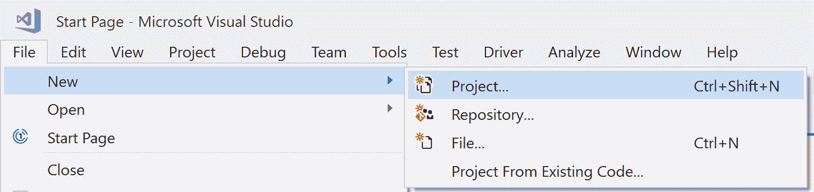

这将打开新项目对话框。展开 Visual C#节点，然后单击跨平台。在列表中选择移动应用程序（Xamarin.Forms）项目。通过命名项目并单击确定来完成表单。确保命名项目为`DoToo`以避免命名空间问题：

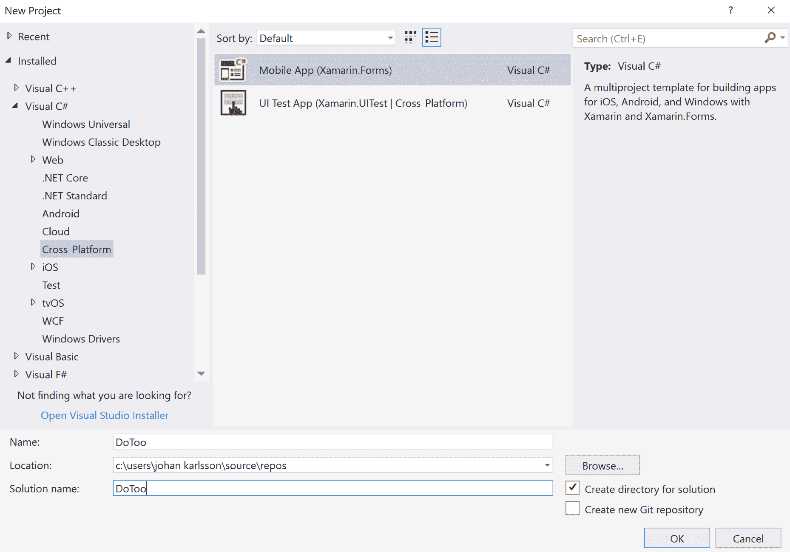

下一步是选择一个项目模板和代码共享策略。选择空白应用程序以创建一个裸的 Xamarin.Forms 应用程序，并将代码共享策略更改为.NET 标准。点击确定完成设置，并等待 Visual Studio 创建必要的项目：

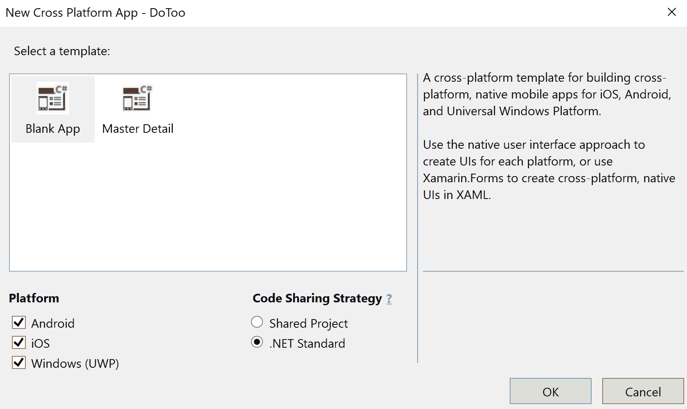

恭喜，我们刚刚创建了我们的第一个 Xamarin.Forms 应用程序！

# 检查文件

所选模板现在已创建了四个项目：

+   DoToo:这是一个.NET 标准库，目标是.NET 标准 2.0。它可以被支持这个版本的.NET 标准的任何运行时导入。

+   DoToo.Android:这是一个用于在 Android 上引导 Xamarin.Forms 的 Android 应用程序。

+   DoToo.iOS:这是一个用于在 iOS 上引导 Xamarin.Forms 的 iOS 应用程序。

+   DoToo.UWP:这是一个用于在 UWP 上引导 Xamarin.Forms 的**Universal Windows Platform**（**UWP**）应用程序。

这三个特定平台的库引用了.NET 标准库。我们的大部分代码将在.NET 标准库中编写，只有一小部分特定平台的代码将被添加到每个目标平台。

项目现在应该如下所示：

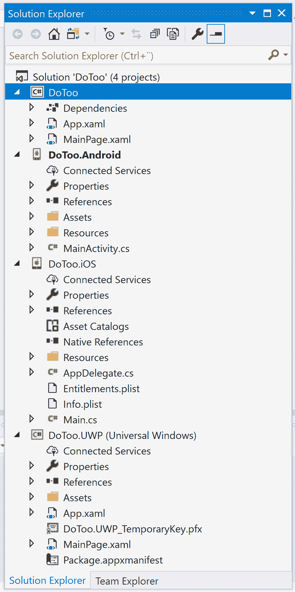

我们将重点介绍每个项目中的一些重要文件，以便我们对它们有一个基本的了解。我们将逐个项目进行介绍。

# DoToo

这是.NET 标准库，所有特定平台的项目都引用它，大部分我们的代码将被添加到这里。以下截图显示了.NET 标准库的结构：

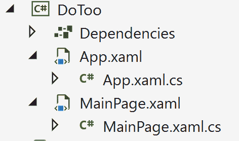

在依赖项下，我们将找到对外部依赖项（如 Xamarin.Forms）的引用。我们将在*更新 Xamarin.Forms 包*部分中更新 Xamarin.Forms 包的版本。随着我们在本章中的进展，我们将添加更多依赖项。

`App.xaml`文件是一个代表应用程序的 XAML 文件。这是放置应用程序范围资源的好地方，我们稍后会这样做。我们还可以看到`App.xaml.cs`文件，其中包含启动代码和一些生命周期事件，我们可以在其中添加自定义代码，例如`OnStart`或`OnSleep`。

如果我们打开`App.xaml.cs`，我们可以看到我们的 Xamarin.Forms 应用程序的起点：

```cs
public partial class App : Application
{
    public App()
    {
        InitializeComponent();
        MainPage = new DoToo.MainPage();
    }

    protected override void OnStart()
    {
        // Handle when your app starts
    }

    // code omitted for brevity
}
```

将页面分配给`MainPage`属性特别重要，因为这决定了用户首先将显示哪个页面。在模板中，这是`DoToo.MainPage()`类。

最后两个文件是`MainPage.xaml`文件，其中包含应用程序的第一个页面，以及称为`MainPage.xaml.cs`的代码后台文件。为了符合**Model-View-ViewModel**（**MVVM**）命名标准，这些文件将被删除。

# DoToo.Android

这是 Android 应用程序。它只有一个文件：

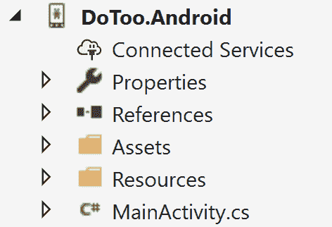

这里的重要文件是`MainActivity.cs`。如果我们在 Android 设备上运行应用程序，这个文件包含应用程序的入口点方法。Android 应用程序的入口点方法是`OnCreate(...)`。

如果您打开`MainActivity.cs`并检查`OnCreate(...)`方法，它应该看起来像这样：

```cs
protected override void OnCreate(Bundle bundle)
{
    TabLayoutResource = Resource.Layout.Tabbar;
    ToolbarResource = Resource.Layout.Toolbar;
    base.OnCreate(bundle);
    global::Xamarin.Forms.Forms.Init(this, bundle);
    LoadApplication(new App());
}
```

前两行为`Tabbar`和`Toolbar`分配资源。然后我们调用基本方法，接着是 Xamarin.Forms 的强制初始化。最后，我们调用加载我们在.NET 标准库中定义的 Xamarin.Forms 应用程序。

我们不需要详细了解这些文件，只需记住它们对于我们应用程序的初始化很重要。

# DoToo.iOS

这是 iOS 应用程序。它包含的文件比其 Android 对应文件多一些：

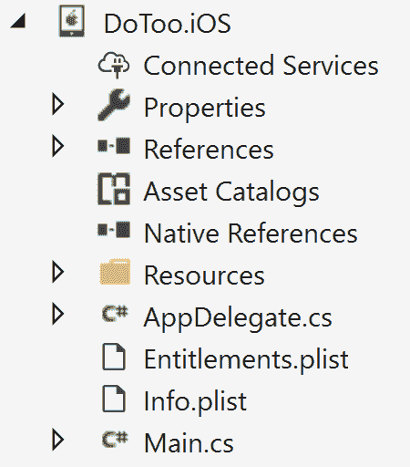

`AppDelegate.cs`文件是 iOS 应用程序的入口点。这个文件包含一个叫做`FinishedLaunching(...)`的方法，这是我们开始编写代码的地方：

```cs
public override bool FinishedLaunching(UIApplication app, NSDictionary options)
{
    global::Xamarin.Forms.Forms.Init();
    LoadApplication(new App());
    return base.FinishedLaunching(app, options);
}
```

代码从初始化 Xamarin.Forms 开始，然后从.NET 标准库加载应用程序。之后，它将控制返回到 iOS。必须在 17 秒内完成此操作，否则应用程序将被操作系统终止。

`info.plist`文件是一个 iOS 特定的文件，包含有关应用程序的信息，例如捆绑 ID 及其配置文件。它有一个图形编辑器，但也可以在任何文本编辑器中编辑，因为它是一个标准的 XML 文件。

`Entitlements.plist`文件也是一个 iOS 特定的文件，用于配置我们希望应用程序利用的权限，例如**应用内购买**或**推送通知**。

与 Android 应用程序的启动代码一样，我们不需要详细了解这里发生了什么，只需知道这对于我们应用程序的初始化非常重要。

# DoToo.UWP

要检查的最后一个项目是 UWP 应用程序。项目的文件结构如下截图所示：

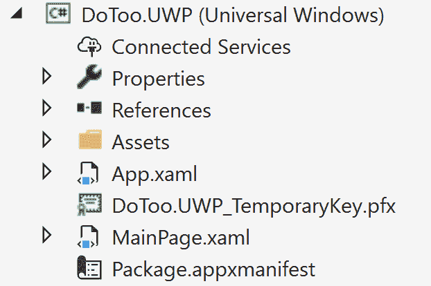

它有一个`App.xaml`文件，类似于.NET 标准库中的文件，但特定于 UWP 应用程序。它还有一个名为`App.xaml.cs`的相关文件。其中包含一个名为`OnLaunched(...)`的方法，是 UWP 应用程序的入口点。这个文件非常大，所以我们不会在这里打印出来，但是打开它，看看我们是否可以在其中找到 Xamarin.Forms 初始化代码。

# 更新 Xamarin.Forms 软件包

创建项目后，我们应该始终将 Xamarin.Forms 软件包更新到最新版本。要执行此操作，请按照以下步骤进行：

1.  在解决方案资源管理器中右键单击我们的解决方案。

1.  单击“管理解决方案的 NuGet 软件包...”：


1.  这将在 Visual Studio 中打开 NuGet 软件包管理器：

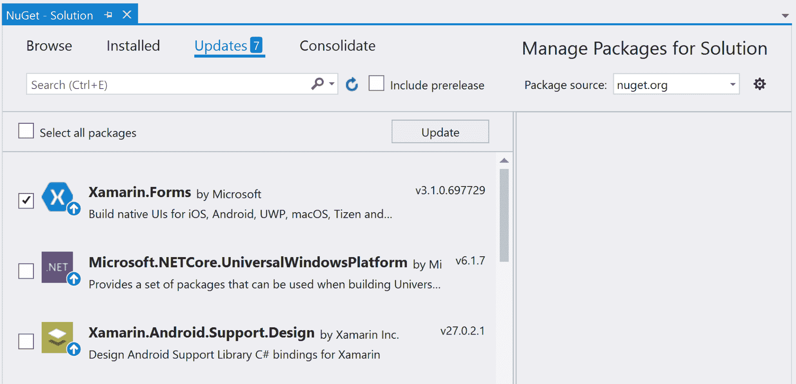

要将 Xamarin.Forms 更新到最新版本，请执行以下操作：

1.  单击“更新”选项卡

1.  检查 Xamarin.Forms 并单击更新

1.  接受任何许可协议

密切关注输出窗格，并等待所有软件包更新。但是，请确保不要手动更新任何 Android 软件包，因为这可能会破坏您的应用程序。

# 删除 MainPage 文件

在 Xamarin.Forms 中，我们有页面的概念。然而，对于 MVVM 架构模式来说并非如此，它使用视图的概念。视图与页面是相同的，但它们没有后缀-Page，因此我们将删除模板生成的`MainPage`。我们将很快详细介绍 MVVM，但目前，我们将从解决方案中删除`MainPage.cs`类。可以按照以下步骤完成：

1.  在`DoToo`项目（.NET 标准库）中右键单击`MainPage.xaml`文件

1.  单击删除并确认删除操作

# 创建存储库和 TodoItem 模型

任何良好的架构都涉及抽象。在这个应用程序中，我们需要存储和检索待办事项列表中的项目。这些将稍后存储在 SQLite 数据库中，但是直接从负责 GUI 的代码中添加对数据库的引用通常是一个坏主意。

相反，我们需要的是将数据库从 GUI 中抽象出来。对于这个应用程序，我们选择使用简单的存储库模式。这个存储库只是一个简单的类，位于 SQLite 数据库和我们即将到来的`ViewModels`之间。这是处理与视图的交互的类，而视图又处理 GUI。

存储库将公开用于获取项目、添加项目和更新项目的方法，以及允许应用程序其他部分对存储库中更改做出反应的事件。它将隐藏在接口后面，以便我们稍后可以替换整个实现，而不必修改应用程序初始化中的代码行以外的任何内容。这是由**Autofac**实现的。

# 定义待办事项列表项目

我们将首先创建一个`TodoItem`类，它将表示列表中的单个项目。这将是一个简单的**Plain Old CLR Object**（**POCO**）类，其中**CLR**代表**Common Language Runtime**。换句话说，这将是一个没有依赖于第三方程序集的.NET 类。要创建该类，请按照以下步骤：

1.  在.NET Standard 库项目中，创建一个名为`Models`的文件夹。

1.  在该文件夹中创建一个名为`TodoItem.cs`的类，并输入以下代码：

```cs
public class TodoItem
{
    public int Id { get; set; }
    public string Title { get; set; }
    public bool Completed { get; set; }
    public DateTime Due { get; set; }
}
```

代码非常简单易懂；这是一个简单的**Plain Old CLR Object**（**POCO**）类，只包含属性而没有逻辑。我们有一个`Title`描述我们想要完成的任务，一个标志（`Completed`）确定待办事项是否已完成，一个`Due`日期我们期望完成它，以及一个我们以后需要用到的唯一`id`。

# 创建存储库及其接口

现在我们有了`TodoItem`类，让我们定义一个描述存储待办事项的存储库的接口：

1.  在.NET Standard 库项目中，创建一个名为`Repositories`的文件夹。

1.  在`Repositories`文件夹中创建一个名为`ITodoItemRepository.cs`的接口，并编写以下代码：

```cs
using System;
using System.Collections.Generic;
using System.Threading.Tasks;
using DoToo.Models; 

namespace DoToo.Repositories
{
    public interface ITodoItemRepository
    { 
        event EventHandler<TodoItem> OnItemAdded;
        event EventHandler<TodoItem> OnItemUpdated;

        Task<List<TodoItem>> GetItems();
        Task AddItem(TodoItem item);
        Task UpdateItem(TodoItem item);
        Task AddOrUpdate(TodoItem item);
    }
}
```

敏锐的读者可能会注意到，我们在这个接口中没有定义`Delete`方法。这绝对是真实世界应用程序中应该有的内容。虽然我们在本章中创建的应用程序不支持删除项目，但我们相当确定，如果您愿意，您可以自行添加这个功能！

这个接口定义了我们应用程序所需的一切。它用于在存储库的实现和存储库的用户之间创建逻辑隔离。如果应用程序的其他部分需要`TodoItemRepository`的实例，我们可以传递任何实现`ITodoItemRepository`的对象，而不管它是如何实现的。

说到这一点，让我们实现`ITodoItemRepository`：

1.  创建一个名为`TodoItemRepository.cs`的类。

1.  输入以下代码：

```cs
using DoToo.Models;
using System.Collections.Generic;
using System.IO;
using System.Threading.Tasks;

namespace DoToo.Repositories
{
    public class TodoItemRepository : ITodoItemRepository
    {
        public event EventHandler<TodoItem> OnItemAdded;
        public event EventHandler<TodoItem> OnItemUpdated;

        public async Task<List<TodoItem>> GetItems()
        {
        }

        public async Task AddItem(TodoItem item)
        {
        }

        public async Task UpdateItem(TodoItem item)
        {
        }

        public async Task AddOrUpdate(TodoItem item)
        {
            if (item.Id == 0)
            {
                await AddItem(item);
            }
            else
            {
                await UpdateItem(item);
            }
        }
    }
}
```

这段代码是接口的最基本实现，除了`AddOrUpdate(...)`方法。这处理了一个小段逻辑，即如果项目的 ID 为`0`，则它是一个新项目。任何 ID 大于`0`的项目都存储在数据库中。这是因为当我们在表中创建行时，数据库会分配一个大于零的值。

在上述代码中还定义了两个事件。这将用于通知任何订阅者项目已更新或已添加。

# 连接 SQLite 以持久化数据

我们现在有一个接口和一个实现该接口的骨架。完成本节的最后一件事是在存储库的实现中连接 SQLite。

# 添加 SQLite NuGet 包

要在此项目中访问 SQLite，我们需要向.NET Standard 库项目添加一个名为 sqlite-net-pcl 的 NuGet 包。要做到这一点，请右键单击解决方案的 DoToo 项目节点下的依赖项，然后单击管理 NuGet 包：

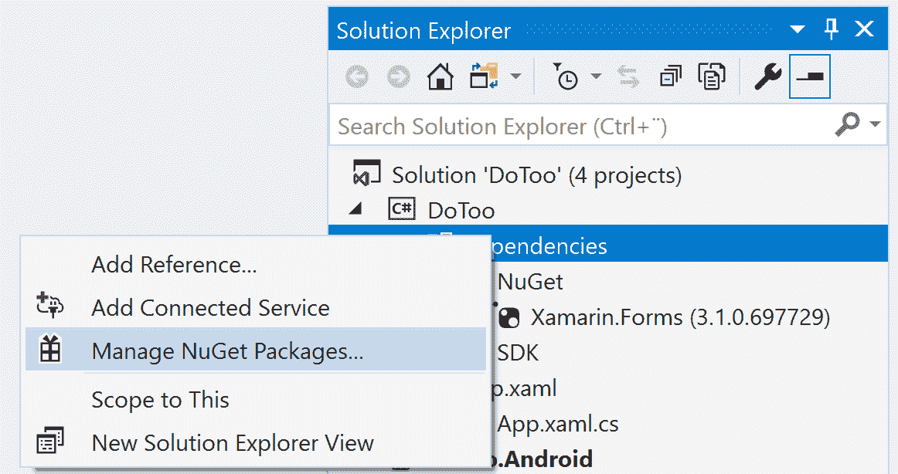

您可能会注意到 NuGet 包的后缀为-pcl。这是命名约定出错时发生的情况。这个包实际上支持.NET Standard 1.0，尽管名称中说的是**Portable Class Library**（**PCL**），这是.NET Standard 的前身。

这会弹出 NuGet 包管理器：

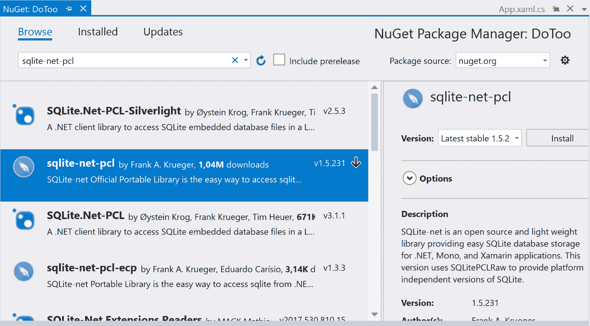

1.  点击浏览并在搜索框中输入 sqlite-net-pcl

1.  选择 Frank A. Krueger 的包，然后单击安装

等待安装完成。然后我们将向`TodoItem`类和存储库添加一些代码。

# 更新 TodoItem 类

由于 SQLite 是一个关系型数据库，它需要知道一些关于如何创建将存储我们对象的表的基本信息。这是使用属性完成的，这些属性在 SQLite 命名空间中定义：

1.  打开`Models/TodoItem`。

1.  在文件的开头下面的现有`using`语句之后添加一个`using SQLite`语句，如下面的代码所示：

```cs
using System;
using SQLite;
```

1.  在 ID 属性之前添加`PrimaryKey`和`AutoIncrement`属性，如下面的代码所示：

```cs
[PrimaryKey, AutoIncrement]
public int Id { get; set; }
```

`PrimaryKey`属性指示 SQLite`Id`属性是表的主键。`AutoIncrement`属性将确保`Id`的值对于添加到表中的每个新的`TodoItem`类都会增加一。

# 创建与 SQLite 数据库的连接

现在，我们将添加所有与数据库通信所需的代码。我们首先需要定义一个连接字段，用于保存与数据库的连接：

1.  打开`Repositories/TodoItemRepository`文件。

1.  在文件的开头下面的现有`using`语句之后添加一个**`using SQLite`**语句，如下面的代码所示：

```cs
using DoToo.Models;
using System.Collections.Generic;
using System.IO;
using System.Threading.Tasks;
using SQLite
```

1.  在类声明的下面添加以下字段：

```cs
private SQLiteAsyncConnection connection;
```

连接需要初始化。一旦初始化，它就可以在存储库的整个生命周期内重复使用。由于该方法是异步的，不能从构造函数中调用它而不引入锁定策略。为了保持简单，我们将简单地从每个由接口定义的方法中调用它：

1.  将以下代码添加到`TodoItemRepository`类中。

1.  在文件的开头添加一个`using System.IO`语句，以便我们可以使用`Path.Combine(...)`：

```cs
private async Task CreateConnection()
{
    if (connection != null)
    {
        return;
    }

    var documentPath = Environment.GetFolderPath(
                       Environment.SpecialFolder.MyDocuments);
    var databasePath = Path.Combine(documentPath, "TodoItems.db"); 

    connection = new SQLiteAsyncConnection(databasePath);
    await connection.CreateTableAsync<TodoItem>();

    if (await connection.Table<TodoItem>().CountAsync() == 0)
    {
        await connection.InsertAsync(new TodoItem() { Title = 
        "Welcome to DoToo" });
    }
} 
```

该方法首先检查我们是否已经有连接。如果有，我们可以简单地返回。如果我们没有设置连接，我们定义一个磁盘上的路径来指示我们希望数据库文件位于何处。在这种情况下，我们将选择`MyDocuments`文件夹。Xamarin 将在我们针对的每个平台上找到与此最接近的匹配项。

然后，我们创建连接并将该连接的引用存储在`connection`字段中。我们需要确保 SQLite 已创建一个与`TodoItem`表的模式相匹配的表。为了使应用程序的开发更加简单，如果`TodoItem`表为空，我们将添加一个默认的待办事项。

# 实现获取、添加和更新方法

在存储库中剩下的唯一事情是实现获取、添加和更新项目的方法：

1.  在`TodoItemRepository`类中找到`GetItems()`方法。

1.  使用以下代码更新`GetItems()`方法：

```cs
public async Task<List<TodoItem>> GetItems()
{
    await CreateConnection();
    return await connection.Table<TodoItem>().ToListAsync();
}

```

为了确保与数据库的连接有效，我们调用了在上一节中创建的`CreateConnection()`方法。当此方法返回时，我们可以确保它已初始化并且`TodoItem`表已创建。

然后，我们使用连接访问`TodoItem`表，并返回一个包含数据库中所有待办事项的`List<TodoItem>`。

SQLite 支持使用**语言集成查询**（**LINQ**）查询数据。在项目完成后，您可以尝试使用它来更好地了解如何在应用程序内部使用数据库。

添加项目的代码甚至更简单：

1.  在`TodoItemRepository`类中找到`AddItem()`方法。

1.  使用以下代码更新`AddItem()`方法：

```cs
public async Task AddItem(TodoItem item)
{
    await CreateConnection();
    await connection.InsertAsync(item);
    OnItemAdded?.Invoke(this, item);
}
```

对`CreateConnection()`的调用确保我们以与`GetItems()`方法相同的方式建立连接。之后，我们使用连接对象上的`InsertAsync(...)`方法在数据库中执行实际的插入操作。在项目被插入到表中后，我们调用`OnItemAdded`事件通知任何订阅者。

更新项目的代码基本上与`AddItem()`方法相同，但还包括对`UpdateAsync`和`OnItemUpdated`的调用。让我们通过使用以下代码更新`UpdateItem()`方法来完成：

1.  在`TodoItemRepository`类中找到`UpdateItem()`方法。

1.  使用以下代码更新`UpdateItem()`方法：

```cs
public async Task UpdateItem(TodoItem item)
{
    await CreateConnection();
    await connection.UpdateAsync(item);
    OnItemUpdated?.Invoke(this, item);
}
```

在下一节中，我们将开始使用 MVVM。来杯咖啡，让我们开始吧。

# 使用 MVVM - 创建视图和视图模型

MVVM 的关键在于关注点的分离。每个部分都有特定的含义：

+   **模型**：这与表示数据并可以由`ViewModel`引用的任何东西有关

+   **视图**：这是可视化组件。在 Xamarin.Forms 中，这由一个页面表示

+   **ViewModel**：这是在模型和视图之间充当中介的类

在我们的应用程序中，我们可以说模型是存储库和它返回的待办事项列表项。`ViewModel`引用这个存储库并公开属性，供视图绑定。基本规则是任何逻辑都应该驻留在 ViewModel 中，视图中不应该有任何逻辑。视图应该知道如何呈现数据，比如将布尔值转换为“是”或“否”。

MVVM 可以以许多方式实现，有很多框架可以使用。在本章中，我们选择保持简单，以纯净的方式实现 MVVM，而不使用任何框架。

# 定义一个 ViewModel 基类

`ViewModel`是视图和模型之间的中介。通过为所有`ViewModels`创建一个通用的基类，我们可以获得很大的好处。要做到这一点，请按照以下步骤操作：

1.  在 DoToo .NET Standard 项目中创建一个名为`ViewModels`的文件夹。

1.  在 ViewModels 文件夹中创建一个名为`ViewModel`的类。

1.  解决对`System.ComponentModel`和 Xamarin.Forms 的引用，并添加以下代码：

```cs
public abstract class ViewModel : INotifyPropertyChanged
{
    public event PropertyChangedEventHandler PropertyChanged;

    public void RaisePropertyChanged(params string[] propertyNames)
    {
        foreach (var propertyName in propertyNames)
        {
            PropertyChanged?.Invoke(this, new 
            PropertyChangedEventArgs(propertyName));
        }
    }

    public INavigation Navigation { get; set; }
} 
```

`ViewModel`类是所有`ViewModels`的基类。这不是要单独实例化的，所以我们将其标记为抽象。它实现了`INotifyPropertyChanged`，这是在.NET 基类库中的`System.ComponentModel`中定义的一个接口。这个接口只定义了一件事：`PropertyChanged`事件。我们的`ViewModel`必须在我们希望 GUI 意识到属性的任何更改时引发此事件。这可以通过手动添加代码到属性的 setter 中来完成，也可以使用**中间语言**（**IL**）编织器，比如`PropertyChanged.Fody`。我们将在下一节详细讨论这个问题。

我们还在这里采取了一个小捷径，通过在`ViewModel`中添加一个`INavigation`属性。这将在以后帮助我们进行导航。这也是可以（也应该）抽象的，因为我们不希望`ViewModel`依赖于 Xamarin.Forms，以便能够在任何平台上重用`ViewModels`。

# 介绍 PropertyChanged.Fody

实现`ViewModel`的传统方式是从基类（比如我们之前定义的`ViewModel`）继承，然后添加以下代码：

```cs
public class MyTestViewModel : ViewModel
{
    private string name;
    public string Name 
    {
       get { return name; }
       set { name = value; RaisePropertyChanged(nameof(Name)); }
    }
}
```

我们想要添加到`ViewModel`的每个属性都会产生六行代码。你可能会认为这并不太糟糕。然而，考虑到一个`ViewModel`可能潜在地包含 10 到 20 个属性，这很快就会变成大量的代码。我们可以做得更好。

只需几个简单的步骤，我们就可以使用一个名为`PropertyChanged.Fody`的工具，在构建过程中自动注入几乎所有的代码：

1.  在.NET Standard 库中，安装`PropertyChanged.Fody` NuGet 包。

1.  创建一个名为`FodyWeavers.xml`的文件，并添加以下 XML 代码：

```cs
<?xml version="1.0" encoding="utf-8" ?>
<Weavers>
    <PropertyChanged />
</Weavers>
```

`PropertyChanged.Fody`将扫描程序集，查找实现`INotifyPropertyChanged`接口的任何类，并添加所需的代码来引发`PropertyChanged`事件。它还会处理属性之间的依赖关系，这意味着如果您有一个属性根据其他两个属性返回值，那么如果这两个值中的任何一个发生变化，它都会被引发。

结果是我们之前的测试类每个属性的代码都被简化为一行。这使得代码更易读，因为一切都是在幕后发生的：

```cs
public class MyTestViewModel : ViewModel
{
    public string Name { get; set; }
}
```

值得注意的是，有许多不同的插件可以用来使 Fody 自动化任务，例如日志记录或方法装饰。查看[`github.com/Fody/Fody`](https://github.com/Fody/Fody)获取更多信息。

# 创建 MainViewModel

到目前为止，我们主要是在准备编写构成应用程序本身的代码。`MainViewModel`是将显示给用户的第一个视图的`ViewModel`。它将负责为待办事项列表提供数据和逻辑。随着我们在本章中的进展，我们将创建基本的`ViewModels`并向其中添加代码：

1.  在`ViewModels`文件夹中创建一个名为`MainViewModel`的类。

1.  添加以下模板代码并解决引用：

```cs
public class MainViewModel : ViewModel
{
    private readonly TodoItemRepository repository;

    public MainViewModel(TodoItemRepository repository)
    {
        this.repository = repository;
        Task.Run(async () => await LoadData());
    }

    private async Task LoadData()
    {
    }
}
```

这个类中的结构是我们将来会重用的所有`ViewModels`。

让我们总结一下我们希望`ViewModel`具有的重要功能：

+   我们从`ViewModel`继承以获得共享逻辑，例如`INotifyPropertyChanged`接口和常见导航代码。

+   所有对其他类的依赖项，例如存储库和服务，都通过`ViewModel`的构造函数传递。这将由**依赖注入**模式处理，更具体地说，由我们使用的依赖注入实现 Autofac 处理。

+   我们使用异步调用`LoadData()`作为初始化`ViewModel`的入口点。不同的 MVVM 库可能以不同的方式执行此操作，但基本功能是相同的。

# 创建 TodoItemViewModel

`TodoItemViewModel`是在`MainView`上表示待办事项列表中每个项目的`ViewModel`。它不会有自己的整个视图（尽管可能会有），而是将由`ListView`中的模板呈现。当我们为`MainView`创建控件时，我们将回到这一点。

这里重要的是，这个`ViewModel`将代表一个单个项目，无论我们选择在哪里呈现它。

让我们创建`TodoItemViewModel`：

1.  在`ViewModels`文件夹中创建一个名为`TodoItemViewModel`的类。

1.  添加以下模板代码并解决引用：

```cs
public class TodoItemViewModel : ViewModel
{
    public TodoItemViewModel(TodoItem item) => Item = item;

    public event EventHandler ItemStatusChanged;
    public TodoItem Item { get; private set; }
    public string StatusText => Item.Completed ? "Reactivate" : 
    "Completed";
}
```

与任何其他`ViewModel`一样，我们从`ViewModel`继承`TodoItemViewModel`。我们遵循在构造函数中注入所有依赖项的模式。在这种情况下，我们在构造函数中传递`TodoItem`类的实例，`ViewModel`将使用它来向视图公开。

`ItemStatusChanged`事件处理程序将在以后用于向视图发出信号，表明`TodoItem`的状态已更改。`Item`属性允许我们访问传入的项目。

`StatusText`属性用于使待办事项的状态在视图中可读。

# 创建 ItemViewModel

`ItemViewModel`表示待办事项列表中的项目，可用于创建新项目和编辑现有项目的视图：

1.  在`ViewModels`文件夹中，创建一个名为`ItemViewModel`的类。

1.  按照以下代码添加代码：

```cs
using DoToo.Models;
using DoToo.Repositories;
using System;
using System.Windows.Input;
using Xamarin.Forms;

namespace DoToo.ViewModels
{
    public class ItemViewModel : ViewModel
    {
        private TodoItemRepository repository;

        public ItemViewModel(TodoItemRepository repository)
        {
            this.repository = repository;
        } 
    }
}
```

模式与前两个`ViewModels`相同：

+   我们使用依赖注入将`TodoItemRepository`传递给`ViewModel`

+   我们使用从`ViewModel`基类继承来添加基类定义的公共功能

# 创建 MainView

现在我们已经完成了`ViewModels`，让我们创建视图所需的骨架代码和 XAML。我们要创建的第一个视图是`MainView`，这是将首先加载的视图：

1.  在.NET Standard 库中创建一个名为`Views`的文件夹。

1.  右键单击`Views`文件夹，选择添加，然后单击新建项....

1.  在左侧的 Visual C# Items 节点下选择 Xamarin.Forms。

1.  选择 Content Page 并将其命名为`MainView`。

1.  单击添加以创建页面：

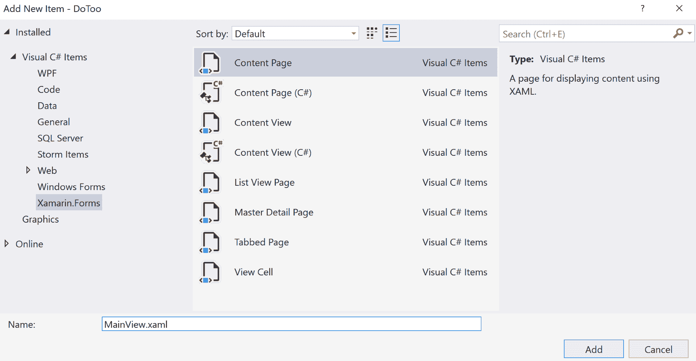

让我们向新创建的视图添加一些内容：

1.  打开`MainView.xaml`。

1.  删除`ContentPage`根节点下面的所有模板代码，并在以下代码中添加标记为粗体的 XAML 代码：

```cs
<?xml version="1.0" encoding="utf-8"?>
<ContentPage xmlns="http://xamarin.com/schemas/2014/forms" 
             xmlns:x="http://schemas.microsoft.com/winfx/2009/xaml" 
             xmlns:local="clr-namespace:DoToo"
             x:Class="DoToo.Views.MainView" 
             Title="Do Too!">

 <ContentPage.ToolbarItems>
 <ToolbarItem Text="Add" />
 </ContentPage.ToolbarItems>

 <Grid>
 <Grid.RowDefinitions>
 <RowDefinition Height="auto" />
 <RowDefinition Height="*" />
 </Grid.RowDefinitions>

 <Button Text="Toggle filter" />

 <ListView Grid.Row="1">
 </ListView>
 </Grid>
</ContentPage> 
```

为了能够访问自定义转换器，我们需要添加对本地命名空间的引用。行`为我们定义了这个命名空间。在这种情况下，我们不会直接使用它，但定义本地命名空间是一个好主意。如果我们创建自定义控件，我们可以通过编写类似`<local:MyControl />`的方式来访问它们。

`ContentPage`上的`Title`属性为页面提供标题。根据我们运行的平台不同，标题的显示方式也不同。例如，如果我们使用标准导航栏，它将在 iOS 和 Android 的顶部显示。页面应该始终有一个标题。

`ContentPage.Toolbar`节点定义了一个工具栏项，用于添加新的待办事项。它也会根据平台的不同而呈现不同的样式，但它始终遵循特定于平台的 UI 指南。

Xamarin.Forms 页面（以及一般的 XML 文档）只能有一个根节点。Xamarin.Forms 页面中的根节点将填充页面本身的`Content`属性。由于我们希望我们的`MainView`包含一个项目列表和页面顶部的按钮来切换过滤器（在所有项目和仅活动项目之间切换），我们需要添加一个`Layout`控件来定位它们在页面上的位置。`Grid`是一个控件，允许您根据行和列来划分可用空间。

对于我们的`MainView`，我们想要添加两行。第一行是由按钮的高度计算出的空间（`Height="auto"`），第二行占用所有剩余的可用空间用于`Listview`（`Height="*"`）。像`ListView`这样的元素是使用`Grid.Row`和`Grid.Column`属性在网格中定位的。如果未指定这些属性，这两个属性都默认为`0`，就像`Button`一样。

如果您对`Grid`的工作原理感兴趣，您应该在互联网上搜索有关 Xamarin.Forms `Grid`的更多信息，或者学习官方文档[`docs.microsoft.com/en-us/xamarin/xamarin-forms/user-interface/layouts/grid`](https://docs.microsoft.com/en-us/xamarin/xamarin-forms/user-interface/layouts/grid)。

我们还需要将`ViewModel`与视图连接起来。这可以通过在视图的构造函数中传递`ViewModel`来完成：

1.  通过展开解决方案资源管理器中的`MainView.xaml`文件，打开`MainView`的代码后文件。

1.  在以下文件的顶部添加`using DoToo.ViewModels`语句，以及现有的`using`语句。

1.  通过添加下面代码中标记为粗体的代码，修改类的构造函数如下：

```cs
public MainView(MainViewModel viewModel)
{ 
    InitializeComponent();
    viewModel.Navigation = Navigation;
 BindingContext = viewModel;
}
```

我们通过与`ViewModels`相同的模式，通过构造函数传递任何依赖项来实现。视图始终依赖于`ViewModel`。为了简化项目，我们还将页面的`Navigation`属性直接分配给`ViewModel`基类中定义的`Navigation`属性。在较大的项目中，我们可能还希望将此属性抽象化，以确保我们将`ViewModels`与 Xamarin.Forms 完全分离。但是，对于这个应用程序来说，直接引用它是可以的。

最后，我们将`ViewModel`分配给页面的`BindingContext`。这告诉 Xamarin.Forms 绑定引擎使用我们的`ViewModel`来创建后续的绑定。

# 创建 ItemView

接下来是第二个视图。我们将用它来添加和编辑待办事项列表项：

1.  创建一个新的 Content Page（与我们创建`MainView`的方式相同），并将其命名为`ItemView`。

1.  编辑 XAML，并使其看起来像以下代码：

```cs
 <?xml version="1.0" encoding="UTF-8"?>
 <ContentPage xmlns="http://xamarin.com/schemas/2014/forms" 
              xmlns:x="http://schemas.microsoft.com/winfx/2009/xaml" 
              x:Class="DoToo.Views.ItemView"
              Title="New todo item">

 <ContentPage.ToolbarItems>
 <ToolbarItem Text="Save" />
 </ContentPage.ToolbarItems>

 <StackLayout Padding="14">
 <Label Text="Title" />
 <Entry />
 <Label Text="Due" />
 <DatePicker />
 <StackLayout Orientation="Horizontal">
 <Switch />
 <Label Text="Completed" />
 </StackLayout>
 </StackLayout>
 </ContentPage> 
```

与`MainView`一样，我们需要一个标题。我们现在将为其提供一个默认标题`"New todo item"`，但以后当我们重用此视图进行编辑时，我们将将其更改为`"Edit todo item"`。用户必须能够保存新的或编辑后的项目，因此我们添加了一个工具栏保存按钮。页面的内容使用`StackLayout`来组织控件。`StackLayout`根据它计算出的元素占用的空间，垂直（默认选项）或水平地添加元素。这是一个 CPU 密集型的过程，因此我们应该只在布局的小部分上使用它。在`StackLayout`中，我们添加一个`Label`，它将是`Entry`控件下面的一行文本。`Entry`控件是一个文本输入控件，将包含待办事项列表项的名称。然后我们有一个`DatePicker`的部分，用户可以在其中选择待办事项的截止日期。最后一个控件是一个`Switch`控件，它呈现一个切换按钮来控制项目何时完成，并在其旁边有一个标题。由于我们希望这些控件在水平方向上显示在一起，因此我们使用水平`StackLayout`来实现这一点。

视图的最后一步是将`ItemViewModel`连接到`ItemView`：

1.  通过展开解决方案资源管理器中的`ItemView.xaml`文件来打开`ItemView`的代码文件。

1.  修改类的构造函数，使其看起来像以下代码。添加粗体标记的代码。

1.  在现有的`using`语句下面的文件顶部添加`DoToo.ViewModels`语句：

```cs
public ItemView (ItemViewModel viewmodel)
{
    InitializeComponent ();
 viewmodel.Navigation = Navigation;
 BindingContext = viewmodel;
}
```

这段代码与我们为`MainView`添加的代码相同，只是`ViewModel`的类型不同。

# 通过 Autofac 进行依赖注入的连接

早些时候，我们讨论了依赖注入模式，该模式规定所有依赖项（例如存储库和视图模型）必须通过类的构造函数传递。这有几个好处：

+   它增加了代码的可读性，因为我们可以快速确定所有外部依赖关系

+   它使依赖注入成为可能

+   它通过模拟类使单元测试成为可能

+   我们可以通过指定对象是单例还是每次解析都是一个新实例来控制对象的生命周期

依赖注入是一种模式，它让我们能够在运行时确定在创建对象时应将对象的哪个实例传递给构造函数。我们通过定义一个容器来注册所有类的类型来实现这一点。我们让我们正在使用的框架解析它们之间的任何依赖关系。假设我们要求容器提供`MainView`。容器负责解析`MainViewModel`和类之间的任何依赖关系。

为了设置这一点，我们需要引用一个名为 Autofac 的库。还有其他选择，所以请随意切换到更适合您需求的选项。我们还需要一个入口点来将类型解析为实例。为此，我们将定义一个基本的`Resolver`类。为了将所有内容包装起来，我们需要一个引导程序，我们将调用它来初始化依赖注入配置。

# 向 Autofac 添加引用

我们需要引用 Autofac 才能开始。我们将使用 NuGet 来安装所需的软件包：

1.  通过右键单击解决方案节点并单击“管理解决方案的 NuGet 软件包”来打开 NuGet 管理器。

1.  单击浏览，然后在搜索框中键入`autofac`。

1.  在项目下的所有复选框中打勾，然后向下滚动，单击安装：

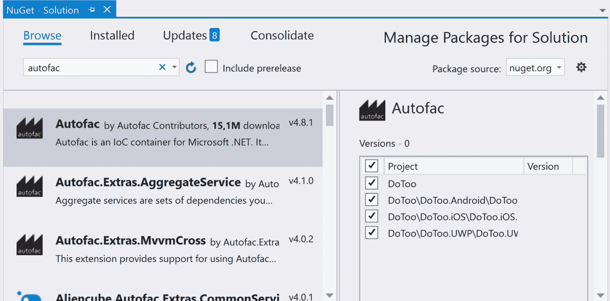

# 创建解析器

解析器将负责根据我们请求的类型为我们创建对象。让我们创建解析器：

1.  在.NET Standard 库项目的根目录中，创建一个名为`Resolver.cs`的新文件。

1.  将以下代码添加到文件中：

```cs
using Autofac;

namespace DoToo
{
    public static class Resolver
    {
        private static IContainer container;

        public static void Initialize(IContainer container)
        {
            Resolver.container = container;
        }

        public static T Resolve<T>()
        {
            return container.Resolve<T>();
        }
    }
}
```

`IContainer`类型的`container`属性在`Autofac`中定义，并表示一个保存如何解析类型的配置的容器。`Initialize`方法接受实现`IContainer`接口的对象的实例，并将其分配给`container`属性。`Resolve`方法使用`container`将类型解析为对象的实例。虽然一开始可能会觉得奇怪使用这个，但随着经验的增加，它会变得更容易。

# 创建 bootstrapper

bootstrapper 的责任是初始化 Autofac。它将在应用程序启动时被调用。我们可以按以下方式创建它：

1.  在.NET Standard 库的根目录中，创建一个名为`Bootstrapper.cs`的新文件。

1.  输入以下代码：

```cs
using Autofac;
using System.Linq;
using Xamarin.Forms;
using DoToo.Views;
using DoToo.Repositories;
using DoToo.ViewModels;

namespace DoToo
{
    public abstract class Bootstrapper
    {
        protected ContainerBuilder ContainerBuilder { get; private 
        set; }

        public Bootstrapper()
        {
            Initialize();
            FinishInitialization();
        }

        protected virtual void Initialize()
        {
            var currentAssembly = Assembly.GetExecutingAssembly();
            ContainerBuilder = new ContainerBuilder();

            foreach (var type in currentAssembly.DefinedTypes
                      .Where(e => 
                             e.IsSubclassOf(typeof(Page)) ||
                             e.IsSubclassOf(typeof(ViewModel)))) 
            {
                ContainerBuilder.RegisterType(type.AsType());
            }

            ContainerBuilder.RegisterType<TodoItemRepository>().SingleInstance();
        }

        private void FinishInitialization()
        {
            var container = ContainerBuilder.Build();
            Resolver.Initialize(container);
        }
    }
}
```

`Bootstrapper`将被每个平台继承，因为这是应用程序执行的起点。这也给了我们添加特定于平台的配置的选项。为了确保我们从该类继承，我们将其定义为抽象的。

`ContainerBuilder`是在`Autofac`中定义的一个类，它在我们完成配置后负责为我们创建`container`。`container`的构建发生在最后定义的`FinishInitialization`方法中，并且在构造函数调用虚拟的`Initialize`方法后立即调用。我们可以重写`Initialize`方法在每个平台上添加自定义注册。

`Initialize`方法扫描程序集中从`Page`或`ViewModel`继承的任何类型，并将它们添加到`container`中。它还将`TodoItemRepository`作为单例添加到`container`中。这意味着每次我们请求`TodoItemRepository`时，我们将获得相同的实例。Autofac 的默认行为（这可能在不同的库之间有所不同）是每次解析时获得一个新实例。

# 在 iOS 上添加 bootstrapper

iOS 的`Bootstrapper`是.NET Standard 库中通用 bootstrapper 的简单包装器，但增加了一个`Init`方法，在启动时将被调用：

1.  在 iOS 项目的根目录中，创建一个名为`Bootstrapper.cs`的新类。

1.  向其中添加以下代码：

```cs
public class Bootstrapper : DoToo.Bootstrapper 
{
    public static void Init()
    {
        var instance = new Bootstrapper();
    }
} 
```

`Init`方法可能看起来很奇怪，因为我们没有保留对我们创建的实例的引用。但请记住，我们确实在`Resolver`类内部保留对`Resolver`实例的引用，而`Resolver`本身是一个单例。

iOS 的最后一步是在正确的位置调用`Init`方法：

1.  打开`AppDelegate.cs`。

1.  找到`FinishedLaunching`方法并添加粗体代码：

```cs
public override bool FinishedLaunching(UIApplication app, NSDictionary options)
{
    global::Xamarin.Forms.Forms.Init();
    Bootstrapper.Init();
    LoadApplication(new App());

    return base.FinishedLaunching(app, options);
}
```

# 在 Android 中添加 bootstrapper

与 iOS 一样，Android 的`Bootstrapper`是.NET Standard 库中通用 bootstrapper 的简单包装器，但增加了一个在启动时将被调用的`Init`方法：

1.  在 Android 项目的根目录中，创建一个名为`Bootstrapper.cs`的新类。

1.  向其中添加以下代码：

```cs
public class Bootstrapper : DoToo.Bootstrapper
{
    public static void Init()
    {
        var instance = new Bootstrapper();
    }
}
```

然后我们需要调用这个`Init`方法。在`OnCreate`中调用`LoadApplication`之前做这件事是一个好地方：

1.  打开`MainActivity.cs`。

1.  找到`OnCreate`方法并添加粗体代码：

```cs
protected override void OnCreate(Bundle bundle)
{
    TabLayoutResource = Resource.Layout.Tabbar;
    ToolbarResource = Resource.Layout.Toolbar;

    base.OnCreate(bundle);

    global::Xamarin.Forms.Forms.Init(this, bundle);
    Bootstrapper.Init();
    LoadApplication(new App());
}
```

# 在 UWP 中添加 bootstrapper

UWP 的 bootstrapper 与其他平台相同：

1.  在 UWP 项目的根目录中，创建一个名为`Bootstrapper.cs`的新类。

1.  向其中添加以下代码：

```cs
public class Bootstrapper : DoToo.Bootstrapper
{
    public static void Init()
    {
        var instance = new Bootstrapper();
    }
}
```

与其他平台一样，我们需要在适当的位置调用`Init`方法：

1.  在 UWP 项目中，打开`App.xaml.cs`文件。

1.  找到对`Xamarin.Forms.Forms.Init()`方法的调用，并添加粗体代码：

```cs
Xamarin.Forms.Forms.Init(e);
Bootstrapper.Init();
```

# 使应用程序运行

我们可以按以下方式首次启动应用程序：

1.  通过展开.NET Standard 库中的`App.xaml`节点，打开`App.xaml.cs`。

1.  找到构造函数。

1.  添加`using`语句以使用`DoToo.Views`，并添加以下粗体代码行：

```cs
public App ()
{
    InitializeComponent();
    MainPage = new NavigationPage(Resolver.Resolve<MainView>());
}
```

添加的行解决了`MainView`（以及所有依赖项，包括`MainViewModel`和`TodoItemRepository`）并将其包装成`NavigationPage`。`NavigationPage`是 Xamarin.Forms 中定义的一个页面，它添加了导航栏并允许用户导航到其他视图。

就是这样！此时，您的项目应该启动。根据您使用的平台不同，它可能看起来像下面的截图：

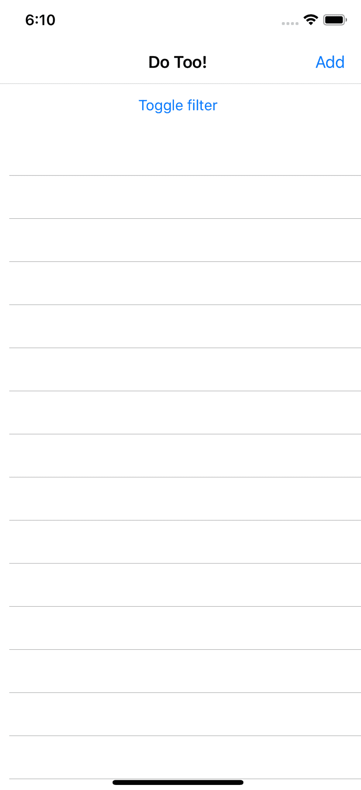

# 添加数据绑定

数据绑定是 MVVM 的核心。这是`Views`和`ViewModel`相互通信的方式。在 Xamarin.Forms 中，我们需要两样东西来实现数据绑定：

1.  我们需要一个对象来实现`INotifyPropertyChanged`。

1.  我们需要将页面的`BindingContext`设置为该对象。我们已经在`ItemView`和`MainView`上都这样做了。

数据绑定的一个非常有用的特性是它允许我们进行双向通信。例如，当将文本绑定到`Entry`控件时，数据绑定对象上的属性将直接更新。考虑以下 XAML：

```cs
<Entry Text="{Binding Title} />
```

为了使其工作，我们需要在对象上有一个名为`Title`的字符串属性。我们必须查看文档，定义一个对象，并让**Intellisense**为我们提供提示，以找出我们的属性应该是什么类型。

执行某种操作的控件，比如`Button`，通常会公开一个名为`Command`的属性。这个属性是`ICommand`类型的，我们可以返回一个`Xamarin.Forms.Command`或我们自己的实现。`Command`属性将在下一节中解释，我们将使用它来导航到`ItemView`。

# 从`MainView`导航到`ItemView`以添加新项目

在`MainView`中有一个`Addtoolbar`按钮。当用户点击此按钮时，我们希望导航到`ItemView`。这样做的 MVVM 方式是定义一个命令，然后将该命令绑定到按钮。让我们添加代码：

1.  打开`ViewModels/MainViewModel.cs`。

1.  为`System.Windows.Input`，`DoToo.Views`和`Xamarin.Forms`添加`using`语句。

1.  将以下属性添加到类中：

```cs
public ICommand AddItem => new Command(async () =>
{
    var itemView = Resolver.Resolve<ItemView>();
    await Navigation.PushAsync(itemView);
}); 
```

所有命令都应公开为通用的`ICommand`。这样可以抽象出实际的命令实现，这是一个很好的一般实践。命令必须是一个属性；在我们的情况下，我们正在创建一个新的`Command`对象，然后将其分配给这个属性。该属性是只读的，对于`Command`来说通常是可以的。命令的操作（当执行命令时要运行的代码）被传递给`Command`对象的构造函数。

命令的操作通过`Resolver`创建一个新的`ItemView`，并且 Autofac 构建必要的依赖项。一旦创建了新的`ItemView`，我们只需告诉`Navigation`服务为我们将其推送到堆栈上。

之后，我们只需将`ViewModel`中的`AddItem`命令与视图中的添加按钮连接起来：

1.  打开`Views/MainView.xaml`。

1.  为`ToolbarItem`添加`Command`属性：

```cs
<ContentPage.ToolbarItems>
    <ToolbarItem Text="Add" Command="{Binding AddItem}" />
</ContentPage.ToolbarItems>
```

运行应用程序并点击“添加”按钮以导航到新项目视图。请注意，返回按钮会自动出现。

# 向列表中添加新项目

现在我们已经完成了导航到新项目的添加。现在让我们添加所需的代码来创建一个新项目并将其保存到数据库中：

1.  打开`ViewModels/ItemViewModel.cs`。

1.  在粗体中添加以下代码。

1.  解决对`System.Windows.Input`的引用：

```cs
public class ItemViewModel : ViewModel
{
    private TodoItemRepository repository;

    public TodoItem Item { get; set; }

    public ItemViewModel(TodoItemRepository repository)
    {
        this.repository = repository;
        Item = new TodoItem() { Due = DateTime.Now.AddDays(1) };
    }

 public ICommand Save => new Command(async () => 
 {
 await repository.AddOrUpdate(Item);
 await Navigation.PopAsync();
 });
}
```

`Item`属性保存对我们要添加或编辑的当前项目的引用。在构造函数中创建一个新项目，当我们想要编辑一个项目时，我们可以简单地将我们自己的项目分配给这个属性。除非我们执行最后定义的`Save`命令，否则新项目不会添加到数据库中。项目添加或更新后，我们将视图从导航堆栈中移除，并再次返回到`MainView`。

由于导航将页面保留在堆栈中，框架声明了反映可以在堆栈上执行的操作的方法。从堆栈中移除顶部项目的操作称为**弹出堆栈**，因此我们有`PopAsync()`而不是`RemoveAsync()`。要将页面添加到导航堆栈中，我们将其推送，因此该方法称为`PushAsync()`。

现在我们已经用必要的命令和属性扩展了`ItemViewModel`，是时候在 XAML 中对它们进行数据绑定了：

1.  打开`ViewModels/ItemView.xaml`。

1.  添加粗体标记的代码：

```cs
<?xml version="1.0" encoding="UTF-8"?>
<ContentPage  

             x:Class="DoToo.Views.ItemView">
    <ContentPage.ToolbarItems>
        <ToolbarItem Text="Save" Command="{Binding Save}" />
    </ContentPage.ToolbarItems>

    <StackLayout Padding="14">
        <Label Text="Title" />
        <Entry Text="{Binding Item.Title}" />
        <Label Text="Due" />
        <DatePicker Date="{Binding Item.Due}" />
        <StackLayout Orientation="Horizontal">
            <Switch IsToggled="{Binding Item.Completed}" />
            <Label Text="Completed" />
        </StackLayout>
    </StackLayout>

</ContentPage> 
```

对`ToolbarItems`命令属性的绑定会在用户点击`Save`链接时触发`ItemViewModel`公开的`Save`命令。值得再次注意的是，任何名为`Command`的属性都表示将发生某种操作，我们必须将其绑定到实现`ICommand`接口的对象的实例。

代表标题的`Entry`控件被数据绑定到`ItemViewModel`的`Item.Title`属性，`Datepicker`和`Switch`控件以类似的方式绑定到它们各自的属性。

我们本可以直接在`ItemViewModel`上公开`Title`、`Due`和`Complete`作为属性，但选择重用已经存在的`TodoItem`作为引用。只要`TodoItem`对象的属性实现了`INotifyPropertyChange`接口，这是可以的。

# 在 MainView 中绑定 ListView

没有项目列表的待办事项列表没有多大用处。让我们用项目列表扩展`MainViewModel`：

1.  打开`ViewModels/MainViewModel.cs`。

1.  添加`System.Collections.ObjectModel`和`System.Linq`的`using`语句。

1.  为待办事项列表项添加一个属性：

```cs
public ObservableCollection<TodoItemViewModel> Items { get; set; }
```

`ObservableCollection`就像普通集合，但它有一个有用的超能力。它可以通知监听器列表中的更改，例如添加或删除`items`。`Listview`将侦听列表中的更改，并根据这些更改自动更新自身。

现在我们需要一些数据：

1.  打开`ViewModels/MainViewModel.cs`。

1.  替换（或完成）`LoadData`方法，并创建`CreateTodoItemViewModel`和`ItemStatusChanged`方法。

1.  通过添加`using`语句解析对`DoToo.Models`的引用：

```cs
private async Task LoadData()
{
    var items = await repository.GetItems();
    var itemViewModels = items.Select(i =>  
    CreateTodoItemViewModel(i));
    Items = new ObservableCollection<TodoItemViewModel>  
    (itemViewModels); 
}

private TodoItemViewModel CreateTodoItemViewModel(TodoItem item)
{
    var itemViewModel = new TodoItemViewModel(item);
    itemViewModel.ItemStatusChanged += ItemStatusChanged;
    return itemViewModel;
}

private void ItemStatusChanged(object sender, EventArgs e)
{
}
```

`LoadData`方法调用存储库以获取所有项目。然后我们将每个待办事项包装在`TodoItemViewModel`中。这将包含特定于视图的更多信息，我们不希望将其添加到`TodoItem`类中。将普通对象包装在`ViewModel`中是一个很好的做法；这样可以更简单地向其添加操作或额外的属性。`ItemStatusChanged`是一个存根，当我们将待办事项的状态从*活动*更改为*已完成*或反之时将调用它。

我们还需要连接一些来自存储库的事件，以了解数据何时发生变化：

1.  打开`ViewModels/MainViewModel.cs`。

1.  添加以下粗体代码：

```cs
public MainViewModel(TodoItemRepository repository)
{
   repository.OnItemAdded += (sender, item) => 
 Items.Add(CreateTodoItemViewModel(item));
 repository.OnItemUpdated += (sender, item) => 
 Task.Run(async () => await LoadData());

    this.repository = repository;

    Task.Run(async () => await LoadData());
}   
```

当项目添加到存储库时，无论是谁添加的，`MainView`都会将其添加到项目列表中。由于项目集合是可观察集合，列表将会更新。如果项目得到更新，我们只需重新加载列表。

让我们将我们的项目数据绑定到`ListView`：

1.  打开`MainView.xaml`并找到`ListView`元素。

1.  修改以反映以下代码：

```cs
<ListView Grid.Row="1"
 RowHeight="70"
          ItemsSource="{Binding Items}">
    <ListView.ItemTemplate>    
        <DataTemplate>
            <ViewCell>
                <Grid Padding="15,10">
                    <Grid.ColumnDefinitions>
                        <ColumnDefinition Width="10" />
                        <ColumnDefinition Width="*" />
                    </Grid.ColumnDefinitions>

                    <BoxView Grid.RowSpan="2" />
                    <Label Grid.Column="1"
                           Text="{Binding Item.Title}"
                           FontSize="Large" />
                    <Label Grid.Column="1"
                           Grid.Row="1"
                           Text="{Binding Item.Due}"
                           FontSize="Micro" />
                    <Label Grid.Column="1" 
 Grid.Row="1" 
 HorizontalTextAlignment="End" 
 Text="Completed" 
                           IsVisible="{Binding Item.Completed}"
                           FontSize="Micro" />
                </Grid>
            </ViewCell>
        </DataTemplate>
    </ListView.ItemTemplate>
</ListView>
```

`ItemsSource`绑定告诉`ListView`在哪里找到要迭代的集合，并且是本地的`ViewModel`。然而，在`ViewCell`节点内部的任何绑定都是针对我们在列表中迭代的每个项目的本地绑定。在这种情况下，我们绑定到`TodoItemViewModel`，其中包含名为`Item`的属性。这又有诸如`Title`、`Due`和`Completed`之类的属性。在定义绑定时，我们可以毫无问题地导航到对象的层次结构。

`DataTemplate`定义了每一行的外观。我们使用网格来分割空间，就像我们之前做的那样。

# 为项目状态创建一个 ValueConverter

有时，我们希望绑定到原始值的表示对象。这可能是基于布尔值的文本片段。例如，我们可能希望写*Yes*和*No*，或者返回一个颜色，而不是*true*和*false*。这就是`ValueConverter`派上用场的地方。它可以用于将一个值转换为另一个值。我们将编写一个`ValueConverter`，将待办事项的状态转换为颜色：

1.  在.NET Standard 库项目的根目录下，创建一个名为`Converters`的文件夹。

1.  创建一个名为`StatusColorConverter.cs`的类，并添加以下代码：

```cs
using System;
using System.Globalization;
using Xamarin.Forms;

namespace DoToo.Converters
{
    public class StatusColorConverter : IValueConverter
    {
        public object Convert(object value, Type targetType,
                              object parameter, CultureInfo  
                              culture)
        {
          return (bool)value ?   
          (Color)Application.Current.Resources["CompletedColor"]: 

          (Color)Application.Current.Resources["ActiveColor"];
        }

        public object ConvertBack(object value, Type targetType, 
                                  object parameter, CultureInfo 
                                  culture)
        {
            return null;
        }
    }
}
```

`ValueConverter`是实现`IValueConverter`的类。这只有两个方法被定义。当视图从`ViewModel`读取数据时，将调用`Convert`方法，而当`ViewModel`从视图获取数据时，将使用`ConvertBack`方法。`ConvertBack`方法仅用于从纯文本返回数据的控件，例如`Entry`控件。

如果我们查看`Convert`方法的实现，我们会注意到传递给该方法的任何值都是对象类型。这是因为我们不知道用户将什么类型绑定到我们正在添加`ValueConverter`的属性。我们还可能注意到，我们从资源文件中获取颜色。我们本可以在代码中定义颜色，但这是不推荐的，所以我们走了额外的路程，并将它们添加为`App.xaml`文件中的全局资源。资源是在完成本章后再次查看的好东西：

1.  在.NET Standard 库项目中打开`App.xaml`。

1.  添加以下`ResourceDictionary`：

```cs
 <Application ...>
     <Application.Resources>
 <ResourceDictionary>
 <Color x:Key="CompletedColor">#1C8859</Color>
 <Color x:Key="ActiveColor">#D3D3D3</Color>
 </ResourceDictionary>
     </Application.Resources>
 </Application> 
```

`ResourceDictionary`可以定义各种不同的对象。我们只需要两种颜色，这两种颜色可以从`ValueConverter`中访问。请注意，这些可以通过给定的键访问，并且还可以使用静态资源绑定从任何其他 XAML 文件中访问。`ValueConverter`本身将被引用为静态资源，但来自本地范围。

# 使用 ValueConverter

我们想要在`MainView`中使用我们全新的`StatusColorConverter`。不幸的是，我们必须经过一些步骤才能实现这一点。我们需要做三件事：

+   在 XAML 中定义命名空间

+   定义一个表示转换器实例的本地资源

+   在绑定中声明我们要使用该转换器

让我们从命名空间开始：

1.  打开`Views/MainView.xaml`。

1.  在页面中添加以下命名空间：

```cs
<ContentPage xmlns="http://xamarin.com/schemas/2014/forms"
             xmlns:x="http://schemas.microsoft.com/winfx/2009/xaml"
             xmlns:converters="clr-namespace:DoToo.Converters"
             x:Class="DoToo.Views.MainView"
             Title="Do Too!>
```

在`MainView.xaml`文件中添加`Resource`节点：

1.  打开 Views/MainView.Xaml。

1.  在 XAML 文件的根元素下添加以下`ResourceDictionary`，显示为粗体：

```cs
<ContentPage ...>
    <ContentPage.Resources>
 <ResourceDictionary>
 <converters:StatusColorConverter  
             x:Key="statusColorConverter" />
 </ResourceDictionary>
 </ContentPage.Resources>    <ContentPage.ToolBarItems>
        <ToolbarItem Text="Add" Command="{Binding AddItem}" />
    </ContentPage.ToolbarItems>
    <Grid ...>
    </Grid>
</ContentPage>
```

这与全局资源字典具有相同的形式，但由于这个资源字典是在`MainView`中定义的，因此只能从那里访问。我们本可以在全局资源字典中定义这个，但通常最好将只在一个地方使用的对象定义在尽可能接近该位置的地方。

最后一步是添加转换器：

1.  在 XAML 中找到`BoxView`节点。

1.  添加粗体标记的`BackgroundColor` XAML：

```cs
<BoxView Grid.RowSpan="2" 
   BackgroundColor="{Binding Item.Completed, 
                     Converter={StaticResource  
                     statusColorConverter}}" />
```

我们在这里所做的是将一个布尔值绑定到一个接受`Color`对象的属性。然而，在数据绑定发生之前，`ValueConverter`将布尔值转换为颜色。这只是`ValueConverter`派上用场的许多情况之一。在定义 GUI 时请记住这一点。

# 使用命令导航到项目

我们希望能够查看所选待办事项的详细信息。当我们点击一行时，我们应该导航到该行中的项目。

为此，我们需要添加以下代码：

1.  打开`ViewModels/MainViewModel.cs`。

1.  在类中添加`SelectedItem`属性和`NavigateToItem`方法：

```cs
public TodoItemViewModel SelectedItem
{
    get { return null; }
    set 
    {
        Device.BeginInvokeOnMainThread(async () => await 
        NavigateToItem(value));
        RaisePropertyChanged(nameof(SelectedItem));
    }
}

private async Task NavigateToItem(TodoItemViewModel item)
{
    if (item == null)
    {
        return;
    }

    var itemView = Resolver.Resolve<ItemView>();
    var vm = itemView.BindingContext as ItemViewModel;
    vm.Item = item.Item;

    await Navigation.PushAsync(itemView);
}
```

`SelectedItem`属性是我们将数据绑定到`ListView`的属性。当我们在`ListView`中选择一行时，此属性将设置为表示该行的`TodoItemViewModel`。由于我们实际上不能在这里使用 Fody 来执行其`PropertyChanged`魔法，因为需要在 setter 中进行方法调用，所以我们需要老式地手动添加一个 getter 和一个 setter。

然后调用`NavigateToItem`，它使用`Resolver`创建一个新的`ItemView`。我们从新创建的`ItemView`中提取`ViewModel`并分配`TodoItemViewModel`包含的当前`TodoItem`。困惑吗？请记住，`TodoItemViewModel`实际上包装了一个`TodoItem`，我们要传递的就是这个项目到`ItemView`。

我们还没有完成。现在我们需要将新的`SelectedItem`属性数据绑定到视图中的正确位置：

1.  打开`Views/MainView.xaml`。

1.  找到`ListView`并添加以下属性：

```cs
<ListView x:Name="ItemsListView"
          Grid.Row="1"
          RowHeight="70"
          ItemsSource="{Binding Items}"
          SelectedItem="{Binding SelectedItem}">
```

`SelectedItem`属性将`ListView`的`SelectedItem`属性绑定到`ViewModel`属性。当`ListView`中的项目选择发生变化时，`ViewModels`的`SelectedItem`属性将被调用，我们将导航到新的和令人兴奋的视图。

`x:Name`属性用于命名`ListView`，因为我们确实需要进行一个小的丑陋的黑客来使其工作。导航完成后，`ListView`实际上将保持选定状态。当我们导航回来时，除非我们选择另一行，否则无法再次选择它。为了减轻这种情况，我们需要连接到`ListView`的`ItemSelected`事件，并直接重置`ListView`上的选定项目。这并不推荐，因为我们实际上不应该在我们的`Views`中有任何逻辑，但有时我们别无选择：

1.  打开`Views/MainView.xaml.cs`。

1.  在粗体中添加以下代码：

```cs
public MainView(MainViewModel viewmodel)
{
    InitializeComponent();
    viewmodel.Navigation = Navigation;
    BindingContext = viewmodel;

    ItemsListView.ItemSelected += (s, e) => 
    ItemsListView.SelectedItem = null;
}
```

现在我们应该能够导航到列表中的项目。

# 使用命令将项目标记为完成

我们需要添加一个功能，允许我们在*完成*和*活动*之间切换项目。可以导航到待办事项列表项的详细视图，但这对用户来说太麻烦了。相反，我们将在`ListView`中添加一个`ContextAction`。例如，在 iOS 中，可以通过向左滑动一行来访问它：

1.  打开`ViewModel/TodoItemViewModel.cs`。

1.  添加`using`语句以使用`System.Windows.Input`和`Xamarin.Forms`。

1.  添加一个命令来切换项目的状态和描述状态的一小段文本：

```cs
public ICommand ToggleCompleted => new Command((arg) =>
{
    Item.Completed = !Item.Completed;
    ItemStatusChanged?.Invoke(this, new EventArgs());
});
```

在这里，我们已经添加了一个命令来切换项目的状态。当执行时，它会反转当前的状态并触发`ItemStatusChanged`事件，以便通知订阅者。为了根据状态更改上下文操作按钮的文本，我们添加了一个`StatusText`属性。这不是一个推荐的做法，因为我们正在添加仅因特定 UI 情况而存在的代码到`ViewModel`中。理想情况下，这应该由视图处理，也许可以使用`ValueConverter`。然而，为了节省实现这些步骤的时间，我们将其留作一个字符串属性：

1.  打开`Views/MainView.xaml`。

1.  找到`ListView.ItemTemplate`节点并添加以下`ViewCell.ContextActions`节点：

```cs
<ListView.ItemTemplate>
    <DataTemplate>
        <ViewCell>
 <ViewCell.ContextActions>
 <MenuItem Text="{Binding StatusText}" 
 Command="{Binding ToggleCompleted}" />
 </ViewCell.ContextActions>
        <Grid Padding="15,10">
        ...
        </Grid>
    </DataTemplate>
</ListView.ItemTemplate>
```

# 使用命令创建过滤器切换功能

我们希望能够在查看仅活动项目和所有项目之间切换。我们将创建一个简单的机制来实现这一点。

在`MainViewModel`中进行更改：

1.  打开`ViewModels/MainViewModel.cs`并找到`ItemStatusChangeMethod`。

1.  添加`ItemStatusChanged`方法的实现和一个名为`ShowAll`的属性来控制过滤：

```cs
private void ItemStatusChanged(object sender, EventArgs e)
{
 if (sender is TodoItemViewModel item)
 {
 if (!ShowAll && item.Item.Completed)
 {
 Items.Remove(item);
 }

 Task.Run(async () => await 
        repository.UpdateItem(item.Item));
 }
} 

public bool ShowAll { get; set; }
```

当我们使用上一部分的上下文操作时，`ItemStatusChanged`事件处理程序会被触发。由于发送者始终是一个对象，我们尝试将其转换为`TodoItemViewModel`。如果成功，我们检查是否可以从列表中删除它，如果`ShowAll`不为真的话。这是一个小优化；我们本可以调用`LoadData`并重新加载整个列表，但由于 Items 列表是一个`ObservableCollection`，它会通知`ListView`列表中已删除了一个项目。我们还调用存储库来更新项目以保持状态的更改。

`ShowAll`属性控制着我们的筛选器处于哪种状态。我们需要调整`LoadData`方法以反映这一点：

1.  在`MainViewModel`中找到`Load`方法。

1.  添加标记为粗体的代码行：

```cs
private async Task LoadData()
{
    var items = await repository.GetItems();

    if (!ShowAll)
    {
 items = items.Where(x => x.Completed == false).ToList();
    }

    var itemViewModels = items.Select(i => 
    CreateTodoItemViewModel(i));
    Items = new ObservableCollection<TodoItemViewModel>  
    (itemViewModels);
}
```

如果`ShowAll`为假，则我们将列表的内容限制为尚未完成的项目。我们可以通过两种方法来实现这一点，即`GetAllItems()`和`GetActiveItems()`，或者使用可以传递给`GetItems()`的筛选参数。花一分钟时间思考一下我们将如何实现这一点。

让我们添加代码来切换筛选器：

1.  打开`ViewModels/MainViewModel.cs`。

1.  添加`FilterText`和`ToggleFilter`属性：

```cs
public string FilterText => ShowAll ? "All" : "Active";

public ICommand ToggleFilter => new Command(async () =>
{
    ShowAll = !ShowAll;
    await LoadData();
});
```

`FilterText`属性是一个只读属性，用于以人类可读的形式显示状态的字符串。我们本可以使用`ValueConverter`来实现这一点，但为了节省时间，我们简单地将其公开为一个属性。`ToggleFilter`命令的逻辑是状态的简单反转，然后调用`LoadData`。这反过来会导致列表的重新加载。

在我们可以筛选项目之前，我们需要连接筛选按钮：

1.  打开`Views/MainView.xaml`。

1.  找到控制筛选的`Button`（文件中唯一的按钮）。

1.  调整代码以反映以下代码：

```cs
<Button Text="{Binding FilterText, StringFormat='Filter: {0}'}"
        Command="{Binding ToggleFilter}" />
```

就这个功能而言，应用现在已经完成了！但它并不是很吸引人；我们将在接下来的部分处理这个问题。

# 布置内容

最后一部分是让应用看起来更加漂亮。我们只是浅尝辄止，但这应该能给你一些关于样式工作原理的想法。

# 设置应用程序范围的背景颜色

样式是将样式应用于元素的一种很好的方法。它们可以应用于类型的所有元素，也可以应用于由键引用的元素，如果您添加了`x:Key`属性：

1.  打开.NET Standard 项目中的`App.xaml`。

1.  将以下 XAML 添加到文件中，该部分为粗体：

```cs
<ResourceDictionary>
    <Style TargetType="NavigationPage">
 <Setter Property="BarBackgroundColor" Value="#A25EBB" />
 <Setter Property="BarTextColor" Value="#FFFFFF" />
 </Style>  <Style x:Key="FilterButton" TargetType="Button">
 <Setter Property="Margin" Value="15" />
 <Setter Property="BorderWidth" Value="1" />
 <Setter Property="BorderRadius" Value="6" /> 
 <Setter Property="BorderColor" Value="Silver" />
 <Setter Property="TextColor" Value="Black" />
 </Style>

    <Color x:Key="CompletedColor">#1C8859</Color>
    <Color x:Key="ActiveColor">#D3D3D3</Color>        
</ResourceDictionary>
```

我们要应用的第一个样式是导航栏中的新背景颜色和文本颜色。第二个样式将应用于筛选按钮。我们可以通过设置`TargetType`来定义样式，指示 Xamarin.Forms 可以将此样式应用于哪种类型的对象。然后，我们可以添加一个或多个要设置的属性。结果与我们直接在 XAML 代码中添加这些属性的效果相同。

没有`x:Key`属性的样式将应用于`TargetType`中定义的类型的所有实例。具有键的样式必须在用户界面的 XAML 中显式分配。当我们在下一部分定义筛选按钮时，我们将看到这种情况的例子。

# 布置 MainView 和 ListView 项目

在本节中，我们将改进`MainView`和`ListView`的外观。打开`Views/MainView.xaml`，并在 XAML 代码中的每个部分后面应用粗体中的更改。

# 筛选按钮

筛选按钮允许我们切换列表的状态，只显示活动的待办事项和所有待办事项。让我们对其进行样式设置，使其在布局中更加突出：

1.  找到筛选按钮。

1.  进行以下更改：

```cs
<Button Style="{StaticResource FilterButton}"
        Text="{Binding FilterText, StringFormat='Filter: {0}'}" 
        BackgroundColor="{Binding ShowAll, Converter={StaticResource 
        statusColorConverter}}"
        TextColor="Black"
        Command="{Binding ToggleFilter}">

<Button.Triggers>
 <DataTrigger TargetType="Button" Binding="{Binding ShowAll}"  
      Value="True">
 <Setter Property="TextColor" Value="White" />
 </DataTrigger>
 </Button.Triggers>
</Button>
```

使用`StaticResource`应用样式。在资源字典中定义的任何内容，无论是在`App.xaml`文件中还是在本地 XAML 文件中，都可以通过它访问。然后我们根据`MainViewModel`的`ShowAll`属性设置`BackgroundColor`，并将`TextColor`设置为`Black`。

`Button.Triggers`节点是一个有用的功能。我们可以定义多种类型的触发器，当满足某些条件时触发。在这种情况下，我们使用数据触发器来检查`ShowAll`的值是否更改为 true。如果是，我们将`TextColor`设置为白色。最酷的部分是，当`ShowAll`再次变为 false 时，它会切换回之前的颜色。

# 触摸 ListView

`ListView`可能需要进行一些微小的更改。第一个更改是将到期日期字符串格式化为更加人性化、可读的格式，第二个更改是将已完成标签的颜色更改为漂亮的绿色色调：

1.  打开`Views/MainView.xaml`。

1.  找到在`ListView`中绑定`Item.Due`和`Item.Completed`的标签：

```cs
<Label Grid.Column="1"
       Grid.Row="1" 
       Text="{Binding Item.Due, StringFormat='{0:MMMM d, yyyy}'}" 
       FontSize="Micro" />

<Label Grid.Column="1" 
       Grid.Row="1" 
       HorizontalTextAlignment="End" 
       Text="Completed" 
       IsVisible="{Binding Item.Completed}"
       FontSize="Micro" 
       TextColor="{StaticResource CompletedColor}" /> 
```

我们在绑定中添加了字符串格式化，以使用特定格式格式化日期。在这种情况下，`0:MMMM d, yyyy`格式将日期显示为字符串，格式为 2019 年 5 月 5 日。

我们还为`Completed`标签添加了一个文本颜色，只有在项目完成时才可见。我们通过在`App.xaml`中引用我们的字典来实现这一点。

# 摘要

现在，我们应该对从头开始创建 Xamarin.Forms 应用程序的所有步骤有了很好的掌握。我们已经了解了项目结构和新创建项目中的重要文件。我们谈到了依赖注入，使用 Autofac，并通过创建所需的所有`Views`和`ViewModels`来学习了 MVVM 的基础知识。我们还涵盖了在 SQLite 中进行数据存储，以便以快速和安全的方式在设备上持久保存数据。利用本章所学的知识，现在您应该能够创建任何您喜欢的应用程序的骨架。

下一章将重点介绍创建一个更丰富的用户体验，创建一个可以在屏幕上移动的图像匹配应用程序。我们将更仔细地研究 XAML 以及如何创建自定义控件。
