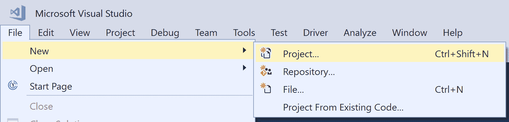
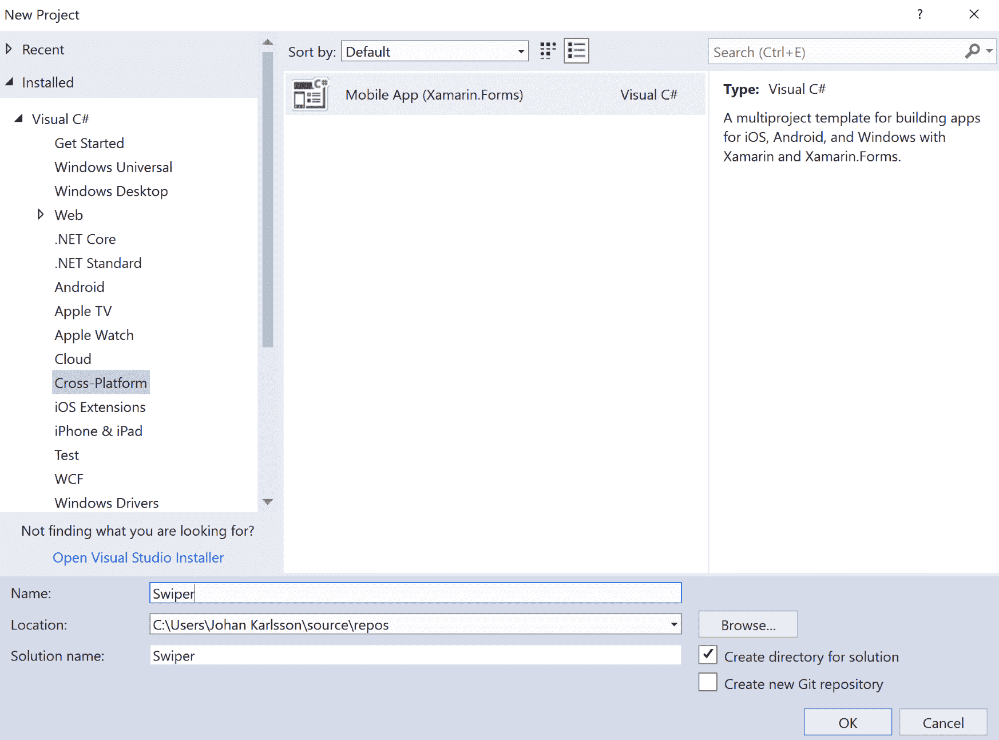
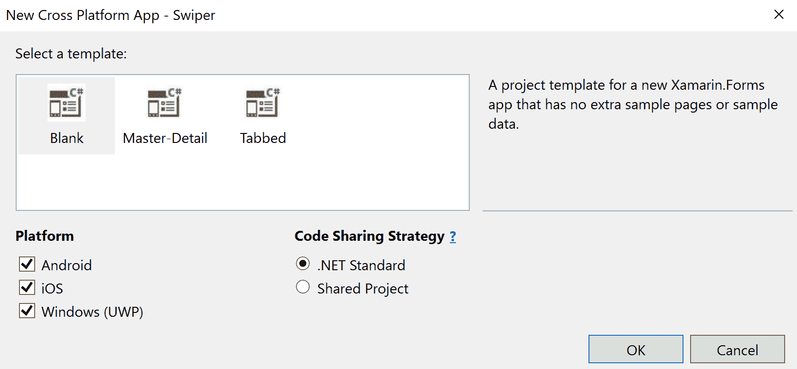
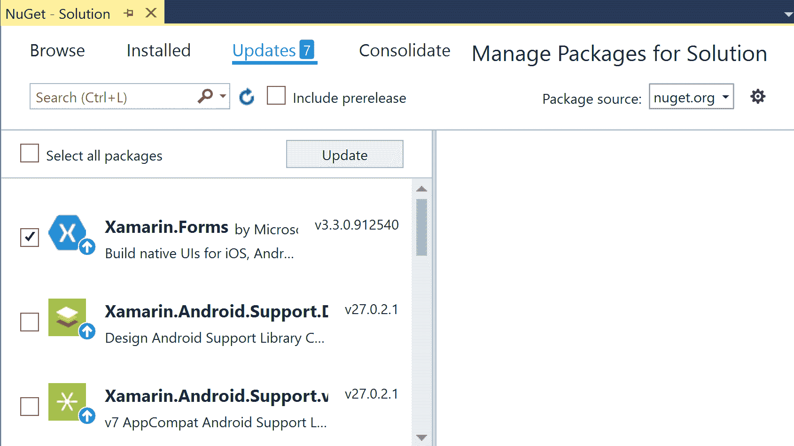
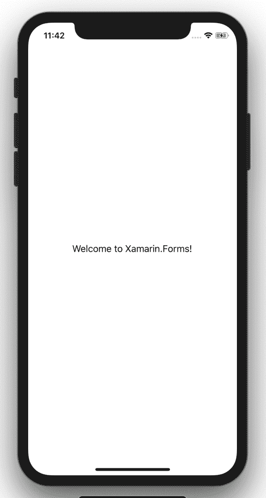
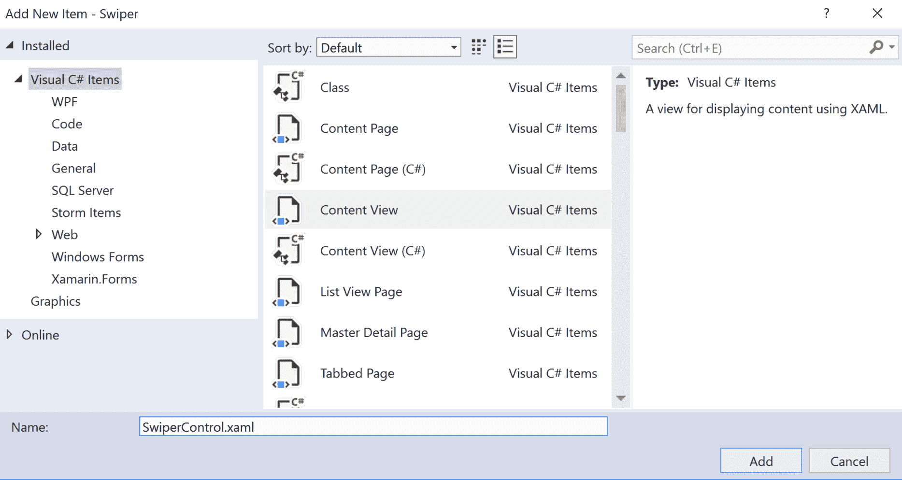
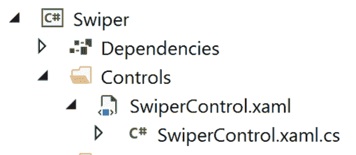

# 第三章：使用动画创建具有丰富 UX 的匹配应用程序

在本章中，我们将为匹配应用程序创建基本功能。但由于隐私问题，我们不会对人们进行评分。相反，我们将从互联网上的随机来源下载图像。这个项目适用于任何想要了解如何编写可重用控件的人。我们还将研究如何使用动画使我们的应用程序更加愉快。这个应用程序不会是一个 MVVM 应用程序，因为我们想要将控件的创建和使用与 MVVM 的轻微开销隔离开来。

本章将涵盖以下主题：

+   创建自定义控件

+   如何将应用程序样式设置为带有描述性文本的照片

+   使用 Xamarin.Forms 进行动画

+   订阅自定义事件

+   反复使用自定义控件

+   处理平移手势

# 技术要求

要完成此项目，您需要安装 Visual Studio for Mac 或 Windows 以及必要的 Xamarin 组件。有关如何设置您的环境的更多详细信息，请参阅第一章*Xamarin 简介*。

# 项目概述

我们中的许多人都曾面临过左右滑动的困境。突然间，您可能会想知道：这是如何工作的？滑动魔术是如何发生的？在这个项目中，我们将学习所有这些。我们将首先定义一个`MainPage`文件，其中我们应用程序的图像将驻留。之后，我们将创建图像控件，并逐渐向其添加 GUI 和功能，直到我们完美地掌握了完美的滑动体验。

此项目的构建时间约为 90 分钟。

# 创建匹配应用程序

在这个项目中，我们将学习如何创建可添加到 XAML 页面的可重用控件。为了保持简单，我们不会使用 MVVM，而是使用裸露的 Xamarin.Forms，没有任何数据绑定。我们的目标是创建一个允许用户向左或向右滑动图像的应用程序，就像大多数流行的匹配应用程序一样。

好了，让我们开始创建项目吧！

# 创建项目

就像第二章中的待办事项应用程序*构建我们的第一个 Xamarin.Forms 应用*一样，本章将从干净的文件|新建项目方法开始。在本章中，我们将选择.NET 标准方法，而不是共享代码方法；如果您不确定为什么要这样做，请参考第二章*构建我们的第一个 Xamarin.Forms 应用*以更深入地了解它们之间的区别。

让我们开始吧！

# 创建新项目

打开 Visual Studio 并单击文件|新建|项目：



这将打开新项目对话框。展开 Visual C#节点，然后单击跨平台。从列表中选择移动应用程序（Xamarin.Forms）项目。通过为项目命名来完成表单。在这种情况下，我们将称我们的应用程序为`Swiper`。单击确定继续下一个对话框：



下一步是选择项目模板和代码共享策略。选择空白以创建最少的 Xamarin.Forms 应用程序，并确保代码共享策略设置为.NET 标准。通过单击确定完成设置向导，让 Visual Studio 为您搭建项目。这可能需要几分钟。



就这样，应用程序就创建好了。让我们继续更新 Xamarin.Forms 到最新版本。

# 更新 Xamarin.Forms NuGet 包

目前，您的项目将使用的 Xamarin.Forms 版本很可能有点旧。为了纠正这一点，我们需要更新 NuGet 包。请注意，您应该只更新 Xamarin.Forms 包，而不是 Android 包；做后者可能会导致您的包与彼此不同步，导致应用程序根本无法构建。要更新 NuGet 包，请执行以下步骤：

1.  右键单击解决方案资源管理器中的我们的解决方案。

1.  点击“管理解决方案的 NuGet 包...”：


这将在 Visual Studio 中打开 NuGet 包管理器。



要将 Xamarin.Forms 更新到最新版本，请执行以下步骤：

1.  点击“更新”选项卡。

1.  检查 Xamarin.Forms 并点击“更新”。

1.  接受任何许可协议。

更新最多需要几分钟。检查输出窗格以找到有关更新的信息。此时，我们可以运行应用程序以确保它正常工作。我们应该在屏幕中央看到“欢迎使用 Xamarin.Forms！”的文字：



# 设计 MainPage 文件

创建了一个全新的空白 Xamarin.Forms 应用程序，名为`Swiper`，其中包含一个名为`MainPage.xaml`的页面。这位于由所有特定于平台的项目引用的.NET 标准项目中。我们需要用一个新的布局替换 XAML 模板，该布局将包含我们的`Swiper`控件。

让我们通过用我们需要的内容替换默认内容来编辑已经存在的`MainPage.xaml`文件：

1.  打开`MainPage.xaml`文件。

1.  用以下加粗标记的 XAML 代码替换页面的内容：

```cs
<?xml version="1.0" encoding="utf-8"?>
<ContentPage  

             x:Class="Swiper.MainPage">

 <Grid Padding="0,40" x:Name="MainGrid">
 <Grid.RowDefinitions>
 <RowDefinition Height="400" />
 <RowDefinition Height="*" />
 </Grid.RowDefinitions>
<Grid Grid.Row="1" Padding="30"> <!-- Placeholder for later --> </Grid>
 </Grid>
</ContentPage>
```

`ContentPage`节点内的 XAML 定义了应用程序中的两个网格。网格只是其他控件的容器。它根据行和列来定位这些控件。外部网格在这种情况下定义了两行，将覆盖整个屏幕的可用区域。第一行高度为 400 个单位，第二行的`height="*"`使用了剩余的可用空间。

内部网格，它在第一个网格内定义，并且使用属性`Grid.Row="1"`分配给第二行。行和列索引是从零开始的，所以`"1"`实际上指的是第二行。我们将在本章后面向这个网格添加一些内容，但现在我们将其保留为空白。

两个网格都定义了它们的填充。您可以输入一个数字，表示所有边都有相同的填充，或者像这种情况一样输入两个数字。我们输入了`0,40`，这意味着左右两侧应该有零单位的填充，顶部和底部应该有 40 个单位的填充。还有第三个选项，使用四个数字，按照特定顺序设置*左*侧、*顶部*、*右*侧和*底部*的填充。

最后要注意的一件事是，我们给外部网格一个名称，`x:Name="MainGrid"`。这将使它可以直接从`MainPage.xaml.cs`文件中定义的代码后台访问。由于在这个示例中我们没有使用 MVVM，我们需要一种方法来访问网格而不使用数据绑定。

# 创建 Swiper 控件

这个项目的主要部分涉及创建`Swiper`控件。控件是一个自包含的 UI，带有相应的代码后台。它可以作为元素添加到任何 XAML 页面中，也可以在代码后台文件中的代码中添加。在这个项目中，我们将从代码中添加控件。

# 创建控件

创建`Swiper`控件是一个简单的过程。我们只需要确保选择正确的项模板，即内容视图：

1.  在.NET 标准库项目中，创建一个名为`Controls`的文件夹。

1.  右键单击“控件”文件夹，选择“添加”，然后点击“新建项...”。

1.  在“添加新项”对话框框的左窗格中选择 Visual C#项目，然后选择 Xamarin.Forms。

1.  选择内容视图（C#）项目。确保不选择 C#版本；这只会创建一个`C#`文件，而不是一个`XAML`文件。

1.  将控件命名为`SwiperControl.xaml`。

1.  点击添加：



这将为 UI 添加一个 XAML 文件和一个 C#代码后台文件。它应该看起来像下面的截图：



# 定义主网格

让我们设置`Swiper`控件的基本结构：

1.  打开`SwiperControl.xaml`文件。

1.  用粗体标记的代码替换内容：

```cs
<?xml version="1.0" encoding="UTF-8"?>
<ContentView  

             x:Class="Swiper.Controls.SwiperControl">
    <ContentView.Content>
 <Grid>
 <Grid.ColumnDefinitions>
 <ColumnDefinition Width="100" />
 <ColumnDefinition Width="*" />
 <ColumnDefinition Width="100" />
 </Grid.ColumnDefinitions> 
 <!-- ContentView for photo here -->

            <!-- StackLayout for like here -->

            <!-- StackLayout for deny here -->
        </Grid> 
    </ContentView.Content>
</ContentView>
```

这定义了一个具有三列的网格。最左边和最右边的列将占据`100`个单位的空间，中间将占据其余的可用空间。两侧的空间将是我们将添加标签以突出用户所做选择的区域。我们还添加了三个注释，作为即将到来的 XAML 的占位符。

# 为照片添加内容视图

现在我们将通过添加定义我们希望照片看起来的 XAML 来扩展`SwiperControl.xaml`文件。我们的最终结果将看起来像下面的照片。由于我们将从互联网上获取图像，我们将显示一个加载文本，以确保用户了解正在发生什么。为了使其看起来像即时打印的照片，我们在照片下面添加了一些手写文本：


上面的照片是我们希望照片看起来的样子。为了使其成为现实，我们需要向`SwiperControl`添加一些 XAML：

1.  打开`SwiperControl.xaml`。

1.  将粗体的 XAML 添加到以下注释中：`<!-- ContentView for photo here -->`。确保不要替换页面的整个`ContentView`；只需在注释下面添加如下。页面的其余部分应保持不变：

```cs
<!-- ContentView for photo here -->
<ContentView x:Name="photo" Padding="40" Grid.ColumnSpan="3" >
    <Grid x:Name="photoGrid" BackgroundColor="Black" Padding="1" >
        <Grid.RowDefinitions>
            <RowDefinition Height="*" />
            <RowDefinition Height="40" />
         </Grid.RowDefinitions>

        <BoxView BackgroundColor="White" Grid.RowSpan="2" />

        <Image x:Name="image" Margin="10"
               BackgroundColor="#AAAAAA"
               Aspect="AspectFill" />

        <Label x:Name="loadingLabel"
                Text="Loading..."
                TextColor="White"
                FontSize="Large"
                FontAttributes="Bold"
                HorizontalOptions="Center"
                VerticalOptions="Center" />

        <Label x:Name="descriptionLabel" 
               Margin="10,0" 
               Text="A picture of grandpa" 
               Grid.Row="1"
               FontFamily="Bradley Hand" />
    </Grid>
</ContentView>
```

`ContentView`控件定义了一个新的区域，我们可以在其中添加其他控件。`ContentView`的一个非常重要的特性是它只接受一个子控件。大多数情况下，我们会添加其中一个可用的布局控件。在这种情况下，我们将使用`Grid`控件来布局控件，如前面的代码所示。

网格定义了两行：

+   一个用于照片本身的行，在分配了其他行的空间后占据所有可用空间

+   一个用于评论的行，其高度恰好为`40`个单位

`Grid`本身设置为使用黑色背景和`1`的填充。这与`BoxView`结合使用，`BoxView`具有白色背景，创建了我们在控件周围看到的框架。`BoxView`还设置为跨越网格的两行（`Grid.RowSpan="2"`），占据网格的整个区域，减去填充。

接下来是`Image`控件。它的背景颜色设置为漂亮的灰色（`#AAAAAA`），边距为`40`，这将使其与周围的框架分离一点。它还有一个硬编码的名称（`x:Name="image"`），这将允许我们从代码后台与其交互。最后一个属性叫做`Aspect`，确定如果图像控件与源图像的比例不同，我们应该怎么做。在这种情况下，我们希望填充整个图像区域，但不显示任何空白区域。这实际上会裁剪图像的高度或宽度。

最后，我们通过添加两个标签来结束，这些标签也有硬编码的名称以供以后参考。

# 创建 DescriptionGenerator

在图像的底部，我们看到了一个描述。由于我们没有来自即将到来的图像源的图像的一般描述，我们需要创建一个生成器来制作描述。下面是我们将如何做：

1.  在.NET Standard 项目中创建一个名为`Utils`的文件夹。

1.  在该文件夹中创建一个名为`DescriptionGenerator`的新类。

1.  为`System.Linq`添加一个`using`语句（`using System.Linq;`）。

1.  将以下代码添加到类中：

```cs
public class DescriptionGenerator
{
    private string[] _adjectives = { "nice", "horrible", "great", 
    "terribly old", "brand new" };                           
    private string[] _other = { "picture of grandpa", "car", "photo 
    of a forest", "duck" };
    private static Random random = new Random();

    public string Generate()
    {
        var a = _adjectives[random.Next(_adjectives.Count())];
        var b = _other[random.Next(_other.Count())];
        return $"A {a} {b}";
    }
} 
```

这个类只有一个目的。它从`_adjectives`数组中取一个随机单词，并将其与`_other`数组中的一个随机单词结合起来。通过调用`Generate()`方法，我们得到一个全新的组合。请随意在数组中输入自己的单词。请注意，`Random`实例是一个静态字段。这是因为如果我们在时间上创建了太接近的`Random`类的新实例，它们将以相同的值进行种子化，并返回相同的随机数序列。

# 创建一个图片类

为了抽象出我们想要显示的图像的所有信息，我们将创建一个封装了这些信息的类。我们的`Picture`类中没有太多信息，但这是一个很好的编码实践：

1.  在`Utils`文件夹中创建一个名为`Picture`的新类。

1.  将以下代码添加到类中：

```cs
public class Picture
{
 public Uri Uri { get; set; }
  public string Description { get; set; }

 public Picture()
 {
 Uri = new Uri($"https://picsum.photos/400/400/?random&ts= 
 {DateTime.Now.Ticks}");

 var generator = new DescriptionGenerator();
 Description = generator.Generate();
 }
}
```

`Picture`类有两个公共属性：

+   图像的`URI`，指向其在互联网上的位置

+   该图像的描述

在构造函数中，我们创建一个新的**统一资源标识符**（**URI**），它指向一个我们可以使用的测试照片的公共来源。宽度和高度在 URI 的查询字符串部分中指定。我们还附加了一个随机时间戳，以避免 Xamarin.Forms 缓存图像。这样每次请求图像时都会生成一个唯一的 URI。

然后，我们使用我们创建的`DescriptionGenerator`类来为图像生成一个随机描述。

# 将图片绑定到控件

让我们开始连接`Swiper`控件，以便开始显示图像。我们需要设置图像的源，然后根据图像的状态控制加载标签的可见性。由于我们使用的是从互联网获取的图像，可能需要几秒钟才能下载。这必须向用户传达，以避免对正在发生的事情产生困惑。

# 设置源

我们首先设置图像的源。`image`控件（在代码中称为`image`）有一个`source`属性。这个属性是抽象类型`ImageSource`。有几种不同类型的图像源可以使用。我们感兴趣的是`UriImageSource`，它接受一个 URI，下载图像，并允许图像控件显示它。

让我们扩展`Swiper`控件以设置源和描述：

1.  打开`Controls/Swiper.Xaml.cs`文件（`Swiper`控件的代码后端）。

1.  为`Swiper.Utils`添加一个使用语句（`using Swiper.Utils;`）。

1.  将加粗标记的代码添加到构造函数中：

```cs
public SwiperControl()
{
    InitializeComponent();

   var picture = new Picture();
 descriptionLabel.Text = picture.Description;
 image.Source = new UriImageSource() { Uri = picture.Uri };
} 
```

我们创建了一个`Picture`类的新实例，并通过设置该控件的文本属性将描述分配给 GUI 中的`descriptionLabel`。然后，我们将图像的源设置为`UriImageSource`类的新实例，并将 URI 从图片实例分配给它。这将开始从互联网下载图像，并在下载完成后立即显示它。

# 控制加载标签

在图像下载时，我们希望在图像上方显示一个居中的加载文本。这已经在我们之前创建的 XAML 文件中，所以我们真正需要做的是在图像下载完成后隐藏它。我们将通过控制`loadingLabel`的`IsVisibleProperty`来实现这一点，通过将其绑定到图像的`IsLoading`属性。每当图像上的`IsLoading`属性发生变化时，绑定就会改变标签上的`IsVisible`属性。这是一个很好的一劳永逸的方法。

让我们添加控制加载标签所需的代码：

1.  打开`Swiper.xaml.cs`代码后端文件。

1.  将加粗标记的代码添加到构造函数中：

```cs
public SwiperControl()
{
    InitializeComponent();

    var picture = new Picture();
    descriptionLabel.Text = picture.Description;
    image.Source = new  UriImageSource() { Uri = picture.Uri };
 loadingLabel.SetBinding(IsVisibleProperty, "IsLoading");
    loadingLabel.BindingContext = image; 
} 
```

在上述代码中，`loadingLabel`设置了一个绑定到`IsVisibleProperty`，实际上属于所有控件继承的`VisualElement`类。它告诉`loadingLabel`监听绑定上下文中分配的对象的`IsLoading`属性的变化。在这种情况下，这是`image`控件。

# 处理平移手势

该应用程序的核心功能之一是平移手势。平移手势是指用户按住控件并在屏幕上移动它。当我们添加多个图像时，我们还将为`Swiper`控件添加随机旋转，使其看起来像是堆叠的照片。

我们首先向`SwiperControl`添加一些字段：

1.  打开`SwiperControl.xaml.cs`文件。

1.  在类中添加以下字段：

```cs
private readonly double _initialRotation;
private static readonly Random _random = new Random();
```

第一个字段`_initialRotation`存储图像的初始旋转。我们将在构造函数中设置这个值。第二个字段是一个包含`Random`对象的`static`字段。您可能还记得，最好创建一个静态随机对象，以确保不会使用相同的种子创建多个随机对象。种子是基于时间的，因此如果我们在时间上创建对象太接近，它们会生成相同的随机序列，因此实际上并不会那么随机。

接下来我们要做的是为`PanUpdated`事件创建一个事件处理程序，我们将在本节末尾绑定到它：

1.  打开`SwiperControl.xaml.cs`代码后台文件。

1.  将`OnPanUpdated`方法添加到类中：

```cs
private void OnPanUpdated(object sender, PanUpdatedEventArgs e)
{
    switch (e.StatusType)
    {
        case GestureStatus.Started:
             PanStarted();
             break;

        case GestureStatus.Running:
             PanRunning(e);
             break;

        case GestureStatus.Completed:
             PanCompleted();
             break;
     }
} 
```

代码非常简单。我们处理一个事件，该事件将`PanUpdatedEventArgs`对象作为第二个参数。这是处理事件的标准方法。然后我们有一个`switch`子句，检查事件所指的状态。

平移手势可以有三种状态：

+   `GestureStatus.Started`: 当开始拖动时，此状态会被触发一次

+   `GestureStatus.Running`: 然后会多次触发此事件，每次您移动手指时都会触发一次

+   `GestureStatus.Completed`: 当您松开时，事件会最后一次被触发

对于这些状态中的每一个，我们调用处理不同状态的特定方法。现在我们将继续添加这些方法：

1.  打开`SwiperControl.xaml.cs`代码后台文件。

1.  将这三个方法添加到类中：

```cs
private void PanStarted()
{
    photo.ScaleTo(1.1, 100);
}

private void PanRunning(PanUpdatedEventArgs e)
{
    photo.TranslationX = e.TotalX;
    photo.TranslationY = e.TotalY;
    photo.Rotation = _initialRotation + (photo.TranslationX / 25);
}

private void PanCompleted()
{
    photo.TranslateTo(0, 0, 250, Easing.SpringOut);
    photo.RotateTo(_initialRotation, 250, Easing.SpringOut);
    photo.ScaleTo(1, 250);
}

```

让我们从`PanStarted()`开始。当用户开始拖动图像时，我们希望添加它在表面上稍微抬起的效果。这是通过将图像缩放 10%来实现的。Xamarin.Forms 有一组出色的函数来实现这一点。在这种情况下，我们在图像控件（名为`Photo`）上调用`ScaleTo()`方法，并告诉它缩放到`1.1`，这对应于其原始大小的 10%。我们还告诉它在`100`毫秒内执行此操作。这个调用也是可等待的，这意味着我们可以在控件完成动画之前等待执行下一个调用。在这种情况下，我们将使用一种忘记并继续的方法。

接下来是`PanRunning()`，在平移操作期间会多次调用。这个方法接受一个参数，即来自`PanRunning()`事件处理程序的`PanUpdatedEventArgs`。我们也可以只传入`X`和`Y`值作为参数，以减少代码的耦合。这是您可以尝试的一些东西。该方法从事件的`TotalX`/`TotalY`属性中提取`X`和`Y`分量，并将它们分配给图像控件的`TranslationX`/`TranslationY`属性。我们还根据图像移动的距离微调旋转。

最后要做的是在释放图像时将所有内容恢复到初始状态。这可以在`PanCompleted()`中完成。首先，我们将图像平移（或移动）回其原始本地坐标（`0,0`）在`250`毫秒内。我们还添加了一个缓动函数，使其略微超出目标，然后再次动画。我们可以尝试使用不同的预定义缓动函数；这些对于创建漂亮的动画非常有用。最后，我们将图像缩放回其原始大小在`250`毫秒内。

现在是时候在构造函数中添加代码，以连接平移手势并设置一些初始旋转值：

1.  打开`SwiperControl.xaml.cs`代码后台文件。

1.  在构造函数中添加粗体文本。请注意，构造函数中还有更多代码，所以不要复制和粘贴整个方法，只需添加粗体文本：

```cs
public SwiperControl()
{
    InitializeComponent();

    var panGesture = new PanGestureRecognizer();
 panGesture.PanUpdated += OnPanUpdated;
 this.GestureRecognizers.Add(panGesture); _initialRotation = _random.Next(-10, 10);
    photo.RotateTo(_initialRotation, 100, Easing.SinOut); 

    <!-- other code omitted for brevity -->
}
```

所有 Xamarin.Forms 控件都有一个名为`GestureRecognizers`的属性。有不同类型的手势识别器，例如`TapGestureRecognizer`或`SwipeGestureRecognizer`。在我们的情况下，我们对`PanGestureRecognizer`感兴趣。我们创建一个新的`PanGestureRecognizer`，并通过将其连接到我们之前创建的`OnPanUpdated()`方法来订阅`PanUpdated`事件。然后将其添加到`Swiper`控件的`GestureRecognizers`集合中。

然后我们设置图像的初始旋转，并确保我们存储它，以便我们可以修改旋转，然后将其旋转回原始状态。

# 测试控件

我们现在已经编写了所有代码来测试控件：

1.  打开`MainPage.xaml.cs`。

1.  添加`using`语句用于`Swiper.Controls`（`using Swiper.Controls;`）。

1.  在构造函数中添加粗体标记的代码：

```cs
public MainPage()
{
    InitializeComponent();
    MainGrid.Children.Add(new SwiperControl());
} 
```

如果构建顺利，我们应该得到如下图所示的图像：


我们还可以拖动图像（平移）。注意当您开始拖动时的轻微抬起效果以及基于平移量的图像旋转，即总移动量。如果您放开图像，它会动画回到原位。

# 创建决策区域

没有每一侧屏幕上的特殊放置区域，交友应用程序就不完整。我们在这里想做一些事情：

+   当用户将图像拖动到任一侧时，应该出现文本，显示*LIKE*或*DENY*（决策区域）

+   当用户将图像放在决策区域时，应用程序应该从页面中删除图像

我们将通过向`SwiperControl.xaml`文件添加一些 XAML 代码来创建这些区域，然后继续添加必要的代码来实现这一点。值得注意的是，这些区域实际上并不是放置图像的热点区域，而是用于在控件表面上显示标签。实际的放置区域是根据您拖动图像的距离来计算和确定的。

# 扩展网格

`Swiper`控件有三列定义。如果图像被拖到页面的任一侧，我们希望为用户添加某种视觉反馈。我们将通过在每一侧添加一个带有`Label`的`StackLayout`来实现这一点。

# 添加用于喜欢照片的 StackLayout

首先要做的是在控件的右侧添加用于喜欢照片的`StackLayout`：

1.  打开`Controls/SwiperControl.xaml`。

1.  在注释`<!-- StackLayout for like here -->`下添加以下代码：

```cs
<StackLayout x:Name="likeStackLayout" Grid.Column="2"
             Opacity="0" Padding="0, 100">
    <Label Text="LIKE" 
           TextColor="Lime" 
           FontSize="30" 
           Rotation="30" 
           FontAttributes="Bold" />
</StackLayout>
```

`StackLayout`是我们要显示的内容的容器。它有一个名称，并且被分配在第三列中（由于从零开始索引，代码中写着`Grid.Column="2"`）。`Opacity`设置为`0`，使其完全不可见，并且`Padding`调整为使其从顶部向下移动一点。

在`StackLayout`内，我们将添加一个`Label`。

# 添加用于拒绝照片的 StackLayout

下一步是在控件的左侧添加用于拒绝照片的`StackLayout`：

1.  打开`Controls/SwiperControl.xaml`。

1.  在注释`<!-- StackLayout for deny here -->`下添加以下代码：

```cs
<StackLayout x:Name="denyStackLayout" Opacity="0" 
             Padding="0, 100" HorizontalOptions="End">
    <Label Text="DENY" 
           TextColor="Red"
           FontSize="30"
           Rotation="-20" 
           FontAttributes="Bold" />
</StackLayout> 
```

左侧`StackLayout`的设置与之相同，只是应该在第一列中，这是默认设置，因此不需要添加`Grid.Column`属性。我们还指定了`HorizontalOptions="End"`，这意味着内容应右对齐。

# 确定屏幕大小

为了能够计算用户拖动图像的百分比，我们需要知道控件的大小。这在 Xamarin.Forms 布局控件之后才确定。

我们将重写`OnSizeAllocated()`方法，并在类中添加一个名为`_screenWidth`的字段，以便通过以下几个步骤跟踪窗口的当前宽度：

1.  打开`SwiperControl.xaml.cs`。

1.  将以下代码添加到文件中。将字段放在类的开头，将`OnSizeAllocated()`方法放在构造函数下面：

```cs
private double _screenWidth = -1;

protected override void OnSizeAllocated(double width, double height)
{
    base.OnSizeAllocated(width, height);

    if (Application.Current.MainPage == null)
    {
        return;
    }

    _screenWidth = Application.Current.MainPage.Width;
} 
```

`_screenWidth`字段用于在解析后立即存储宽度。我们通过重写`OnSizeAllocated()`方法来实现这一点，该方法在 Xamarin.Forms 分配控件的大小时调用。这被调用多次。第一次调用实际上是在设置宽度和高度之前以及设置当前应用程序的`MainPage`之前。此时，宽度和高度设置为`-1`，并且`Application.Current.MainPage`为 null。我们通过对`Application.Current.MainPage`进行空检查并在其为 null 时返回来寻找这种状态。我们也可以检查宽度上的`-1`值。任一方法都可以工作。但是，如果它有一个值，我们希望将其存储在我们的`_screenWidth`字段中以供以后使用。

Xamarin.Forms 会在应用程序框架发生变化时调用`OnSizeAllocated()`方法。这对于 UWP 应用程序来说最为重要，因为它们在用户可以轻松更改的窗口中。Android 和 iOS 应用程序不太可能再次调用此方法，因为应用程序将占据整个屏幕的房地产。

# 添加夹取函数

为了能够计算状态，我们需要稍后夹取一个值。在撰写本文时，这个函数已经在 Xamarin.Forms 中，但它被标记为内部函数，这意味着我们不应该真的使用它。据传言，它将很快在 Xamarin.Forms 的后续版本中公开，但目前，我们需要重新定义它：

1.  打开`SwiperControl.xaml.cs`。

1.  在类中添加以下`static`方法：

```cs
private static double Clamp(double value, double min, double max)
{
     return (value < min) ? min : (value > max) ? max : value;
} 
```

该方法接受一个要夹取的值，一个最小边界和一个最大边界。如果值大于或小于设置的边界，则返回值本身或边界值。

# 添加计算状态的代码

为了计算图像的状态，我们需要定义我们的区域，然后创建一个函数，该函数接受当前移动量并根据我们平移图像的距离更新 GUI 决策区域的不透明度。

# 定义一个用于计算状态的方法

让我们添加`CalculatePanState()`方法来计算我们已经平移图像的距离，以及它是否应该开始影响 GUI，按照以下几个步骤进行：

1.  打开`Controls/SwiperControl.xaml.cs`。

1.  将属性添加到顶部，将`CalculatePanState()`方法添加到类中的任何位置，如下面的代码所示：

```cs
private const double DeadZone = 0.4d;
private const double DecisionThreshold = 0.4d;

private void CalculatePanState(double panX)
{
    var halfScreenWidth = _screenWidth / 2;
    var deadZoneEnd = DeadZone * halfScreenWidth;

    if (Math.Abs(panX) < deadZoneEnd)
    {
        return;
    }

    var passedDeadzone = panX < 0 ? panX + deadZoneEnd : panX - 
    deadZoneEnd;
    var decisionZoneEnd = DecisionThreshold * halfScreenWidth;
    var opacity = passedDeadzone / decisionZoneEnd;

    opacity = Clamp(opacity, -1, 1);

    likeStackLayout.Opacity = opacity;
    denyStackLayout.Opacity = -opacity;
} 
```

我们将两个值定义为常量：

+   `DeadZone`定义了当平移图像时，中心点两侧可用空间的 40%（`0.4`）是死区。如果我们在这个区域释放图像，它将简单地返回到屏幕中心而不采取任何行动。

+   下一个常量是`DecisionThreshold`，它定义了另外 40%（`0.4`）的可用空间。这用于插值`StackLayout`在布局两侧的不透明度。

然后，我们使用这些值来检查平移操作的状态。如果`X`（`panX`）的绝对平移值小于死区，我们将返回而不采取任何行动。如果不是，则我们计算我们已经超过死区的距离以及我们进入决策区的距离。我们根据这个插值计算不透明度值，并将值夹取在`-1`和`1`之间。

最后，我们为`likeStackLayout`和`denyStackLayout`设置透明度为这个值。

# 连接平移状态检查

在图像被平移时，我们希望更新状态：

1.  打开`Controls/SwiperControl.xaml.cs`。

1.  将以下代码添加到`PanRunning()`方法中：

```cs
private void PanRunning(PanUpdatedEventArgs e)
{
    photo.TranslationX = e.TotalX;
    photo.TranslationY = e.TotalY;
    photo.Rotation = _initialRotation + (photo.TranslationX / 25);

    CalculatePanState(e.TotalX);
} 
```

`PanRunning()`方法的这个添加将在*x*轴上的总移动量传递给`CalculatePanState()`方法，以确定我们是否需要调整控件左侧或右侧的`StackLayout`的透明度。

# 添加退出逻辑

到目前为止，一切都很好，除了一个问题，即如果我们将图像拖到边缘然后放开，文本会保留。我们需要确定用户何时停止拖动图像，以及图像是否处于决策区。

# 检查图像是否应退出

我们希望有一个简单的函数来确定一张图片是否已经移动足够远，以便算作该图片的退出：

1.  打开`Controls/SwiperControl.xaml.cs`。

1.  在类中添加`CheckForExitCritera()`方法，如下所示：

```cs
private bool CheckForExitCriteria()
{
    var halfScreenWidth = _screenWidth / 2;
    var decisionBreakpoint = DeadZone * halfScreenWidth;
    return (Math.Abs(photo.TranslationX) > decisionBreakpoint); 
} 
```

此函数计算我们是否已经越过死区并进入决策区。我们需要使用`Math.Abs()`方法获取总绝对值进行比较。我们也可以使用`<`和`>`运算符，但我们使用这种方法是因为它更可读。这是代码风格和品味的问题，随意按照自己的方式进行。

# 删除图像

如果我们确定图像已经移动足够远，使其退出，我们希望将其从屏幕上动画移出，然后从页面中删除图像：

1.  打开`Controls/SwiperControl.xaml.cs`。

1.  在类中添加`Exit()`方法，如下所示：

```cs
private void Exit()
{
    Device.BeginInvokeOnMainThread(async () =>
    {
        var direction = photo.TranslationX < 0 ? -1 : 1;

        await photo.TranslateTo(photo.TranslationX + 
        (_screenWidth * direction),
        photo.TranslationY, 200, Easing.CubicIn);
        var parent = Parent as Layout<View>;
        parent?.Children.Remove(this);
    });
}      
```

`Exit()`方法执行以下操作：

1.  我们首先确保此调用在 UI 线程上完成，这也被称为`MainThread`。这是因为只有 UI 线程才能执行动画。

1.  我们还需要异步运行此线程，以便一举两得。由于这个方法是关于将图像动画到屏幕的一侧，我们需要确定在哪个方向进行动画。

1.  我们通过确定图像的总平移是正数还是负数来执行此操作。

1.  然后我们使用这个值通过`photo.TranslateTo()`调用来等待翻译。

1.  我们等待此调用，因为我们不希望代码执行继续，直到完成。完成后，我们将控件从父级的子级集合中移除，导致它永远消失。

# 更新 PanCompleted

决定图像是否应消失或仅返回到其原始状态是在`PanCompleted()`方法中触发的。在这里，我们连接了前两节中创建的两种方法：

1.  打开`Controls/SwiperControl.xaml.cs`。

1.  在`PanCompleted()`方法中添加粗体代码：

```cs
private void PanCompleted()
{
 if (CheckForExitCriteria())
 {
 Exit();
 }

 likeStackLayout.Opacity = 0;
 denyStackLayout.Opacity = 0;

    photo.TranslateTo(0, 0, 250, Easing.SpringOut);
    photo.RotateTo(_initialRotation, 250, Easing.SpringOut);
    photo.ScaleTo(1, 250);
} 
```

本节中的最后一步是使用`CheckForExitCriteria()`方法和`Exit()`方法，如果满足退出条件，则执行这些条件。如果不满足退出条件，我们需要重置`StackLayout`的状态和不透明度，使一切恢复正常。

# 向控件添加事件

在控件本身中我们还剩下最后一件事要做，那就是添加一些事件，指示图像是否已被*喜欢*或*拒绝*。我们将使用一个干净的接口，允许控件的简单使用，同时隐藏所有实现细节。

# 声明两个事件

为了使控件更容易从应用程序本身进行交互，我们需要为`Like`和`Deny`添加事件：

1.  打开`Controls/SwiperControl.xaml.cs`。

1.  在类的开头添加两个事件声明，如下所示：

```cs
public event EventHandler OnLike;
public event EventHandler OnDeny; 
```

这是两个带有开箱即用的事件处理程序的标准事件声明。

# 触发事件

我们需要在`Exit()`方法中添加代码来触发我们之前创建的事件：

1.  打开`Controls/SwiperControl.xaml.cs`。

1.  在`Exit()`方法中添加粗体代码：

```cs
private void Exit()
{
    Device.BeginInvokeOnMainThread(async () =>
    {
        var direction = photo.TranslationX < 0 ? -1 : 1;

 if (direction > 0)
 {
 OnLike?.Invoke(this, new EventArgs());
 }

 if (direction < 0)
 {
 OnDeny?.Invoke(this, new EventArgs());
 }

        await photo.TranslateTo(photo.TranslationX + (_screenWidth 
        * direction),
        photo.TranslationY, 200, Easing.CubicIn);
        var parent = Parent as Layout<View>;
        parent?.Children.Remove(this);
    });
}
```

在这里，我们注入代码来检查我们是喜欢还是不喜欢一张图片。然后根据这些信息触发正确的事件。

# 连接 Swiper 控件

我们现在已经到达本章的最后部分。在本节中，我们将连接图像并使我们的应用成为一个可以永远使用的闭环应用程序。我们将添加 10 张图像，这些图像将在应用程序启动时从互联网上下载。每次删除一张图像时，我们将简单地添加另一张图像。

# 添加图像

让我们首先创建一些代码，将图像添加到 MainView 中。我们将首先添加初始图像，然后创建逻辑，以便在每次喜欢或不喜欢图像时向堆栈底部添加新图像。

# 添加初始照片

为了使照片看起来像是堆叠在一起，我们至少需要 10 张照片：

1.  打开`MainPage.xaml.cs`。

1.  将“AddInitalPhotos（）”方法和“InsertPhotoMethod（）”添加到类中：

```cs
private void AddInitialPhotos()
{
    for (int i = 0; i < 10; i++)
    {
        InsertPhoto();
    }
}

private void InsertPhoto()
{
    var photo = new SwiperControl();
    this.MainGrid.Children.Insert(0, photo);
} 
```

首先，我们创建一个名为“AddInitialPhotos（）”的方法，该方法将在启动时调用。该方法简单地调用“InsertPhoto（）”方法 10 次，并每次向`MainGrid`添加一个新的`SwiperControl`。它将控件插入到堆栈的第一个位置，从而有效地将其放在堆栈底部，因为控件集合是从开始到结束渲染的。

# 从构造函数中进行调用

我们需要调用此方法才能使魔术发生：

1.  打开`MainPage.xaml.cs`。

1.  将粗体中的代码添加到构造函数中，并确保它看起来像下面这样：

```cs
public MainPage()
{
    InitializeComponent();
    AddInitialPhotos();
} 
```

这里没有什么可说的。在初始化`MainPage`之后，我们调用该方法添加 10 张我们将从互联网上下载的随机照片。

# 添加计数标签

我们还希望为应用程序添加一些价值观。我们可以通过在`Swiper`控件集合下方添加两个标签来实现这一点。每当用户对图像进行评分时，我们将递增两个计数器中的一个，并显示结果。

因此，让我们添加 XAML 以显示标签所需的内容：

1.  打开`MainPage.xaml`。

1.  用粗体标记的代码替换注释`<!-- Placeholder for later -->`：

```cs
<Grid Grid.Row="1" Padding="30">
    <Grid.RowDefinitions>
 <RowDefinition Height="auto" />
 <RowDefinition Height="auto" />
 <RowDefinition Height="auto" />
 <RowDefinition Height="auto" />
 </Grid.RowDefinitions>

 <Label Text="LIKES" />
 <Label x:Name="likeLabel" 
 Grid.Row="1"
 Text="0" 
 FontSize="Large" 
 FontAttributes="Bold" />

 <Label Grid.Row="2" 
 Text="DENIED" />
 <Label x:Name="denyLabel"
 Grid.Row="3" 
 Text="0" 
 FontSize="Large" 
 FontAttributes="Bold" />
</Grid> 
```

此代码添加了一个具有四个自动高度行的新`Grid`。这意味着我们计算每行内容的高度，并将其用于布局。这基本上与`StackLayout`相同，但我们想展示一种更好的方法。

在每行中添加一个`Label`，并将其中两个命名为`likeLabel`和`denyLabel`。这两个命名的标签将保存已喜欢的图像数量以及已拒绝的图像数量。

# 订阅事件

最后一步是连接`OnLike`和`OnDeny`事件，并向用户显示总计数。

# 添加方法以更新 GUI 并响应事件

我们需要一些代码来更新 GUI 并跟踪计数：

1.  打开`MainPage.xaml.cs`。

1.  将以下代码添加到类中，如下所示：

```cs
private int _likeCount;
private int _denyCount;

private void UpdateGui()
{
    likeLabel.Text = _likeCount.ToString();
    denyLabel.Text = _denyCount.ToString();
}

private void Handle_OnLike(object sender, EventArgs e)
{
    _likeCount++;
    InsertPhoto();
    UpdateGui();
}

private void Handle_OnDeny(object sender, EventArgs e)
{
    _denyCount++;
    InsertPhoto();
    UpdateGui();
} 
```

顶部的两个字段跟踪喜欢和拒绝的数量。由于它们是值类型变量，它们默认为零。

为了使这些标签的更改传播到 UI，我们创建了一个名为“UpdateGui（）”的方法。这将获取两个前述字段的值，并将其分配给两个标签的`Text`属性。

接下来的两个方法是将处理`OnLike`和`OnDeny`事件的事件处理程序。它们增加适当的字段，添加新照片，然后更新 GUI 以反映更改。

# 连接事件

每次创建新的`SwiperControl`时，我们需要连接事件：

1.  打开“MainPage.xaml.cs”。

1.  将粗体中的代码添加到“InsertPhoto（）”方法中：

```cs
private void InsertPhoto()
{
    var photo = new SwiperControl();
 photo.OnDeny += Handle_OnDeny;
 photo.OnLike += Handle_OnLike;

    this.MainGrid.Children.Insert(0, photo);
} 
```

添加的代码连接了我们之前定义的事件处理程序。这些事件确实使与我们的新控件交互变得容易。自己尝试一下，并玩一下您创建的应用程序。

# 摘要

干得好！在本章中，我们学习了如何创建一个可重用的外观良好的控件，可用于任何 Xamarin.Forms 应用程序。为了增强应用程序的用户体验（UX），我们使用了一些动画，为用户提供了更多的视觉反馈。我们还在 XAML 的使用上有所创意，定义了一个看起来像是带有手写描述的照片的控件的 GUI。

之后，我们使用事件将控件的行为暴露给`MainPage`，以限制应用程序与控件之间的接触表面。最重要的是，我们涉及了`GestureRecognizers`的主题，这可以在处理常见手势时使我们的生活变得更加轻松。

在下一章中，我们将看看如何在 iOS 和 Android 设备上后台跟踪用户的位置。为了可视化我们正在跟踪的内容，我们将使用 Xamarin.Forms 中的地图组件。
