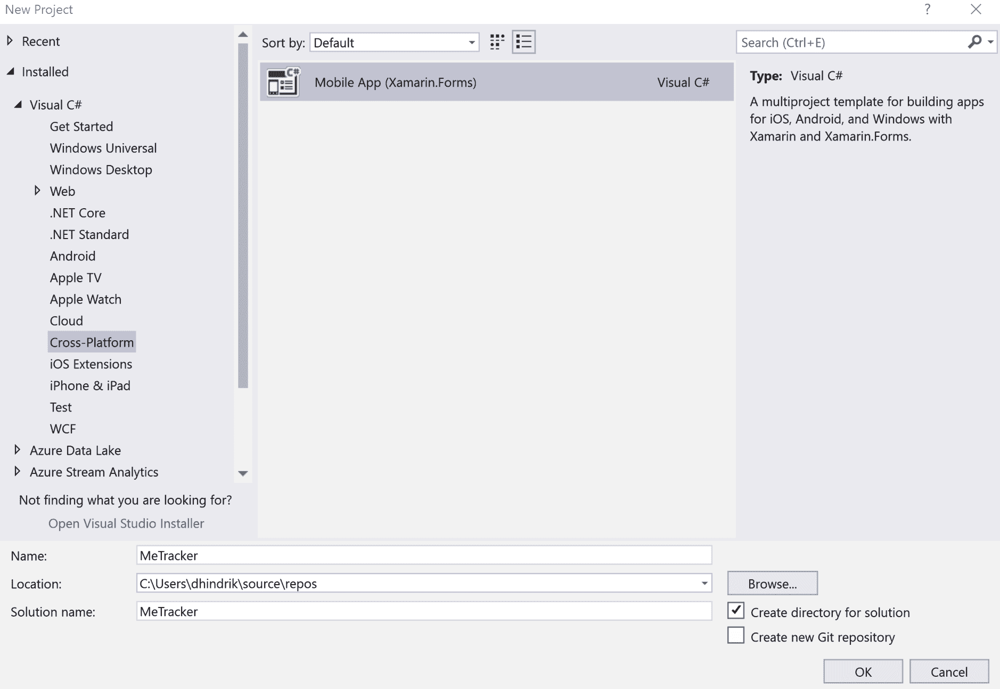
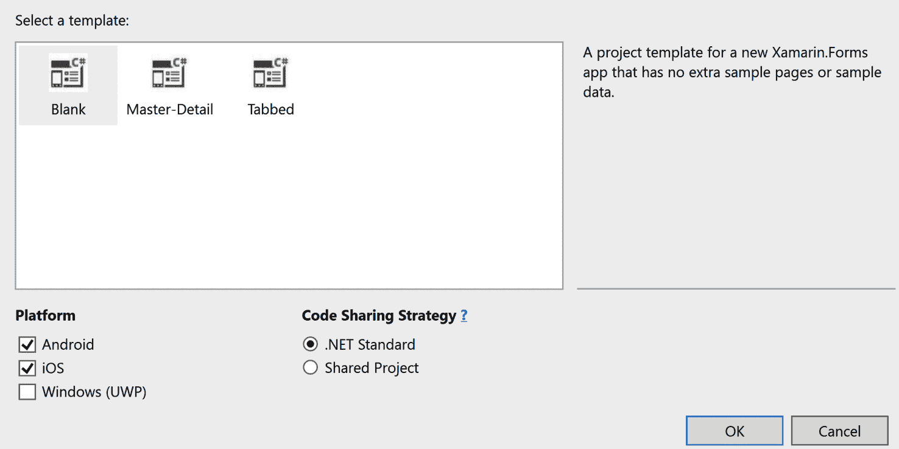
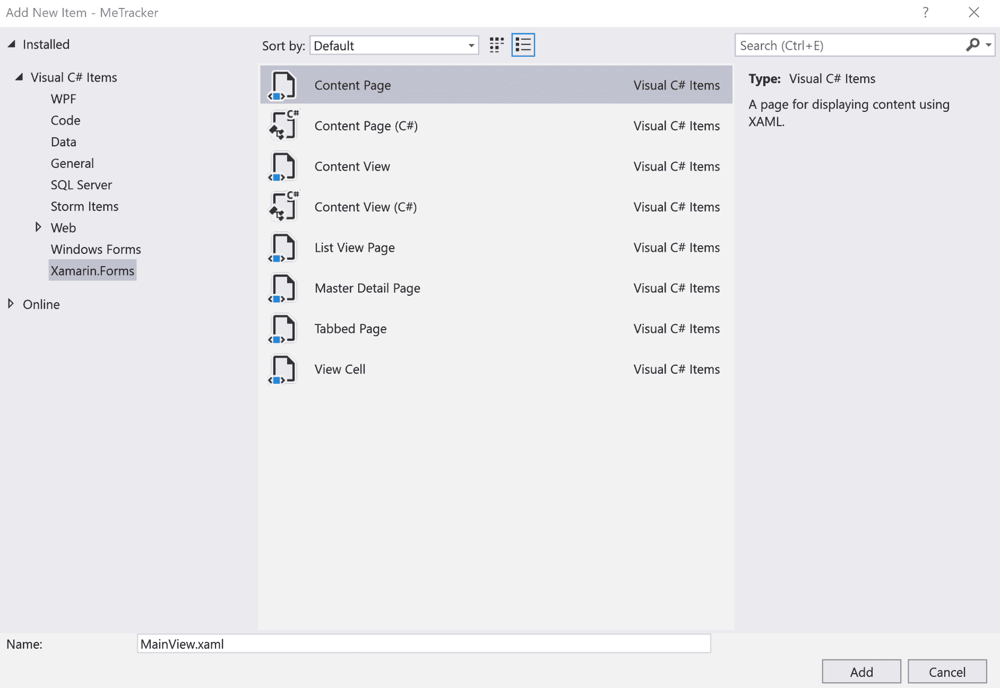
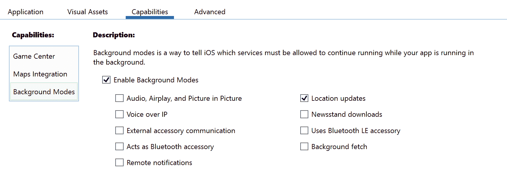
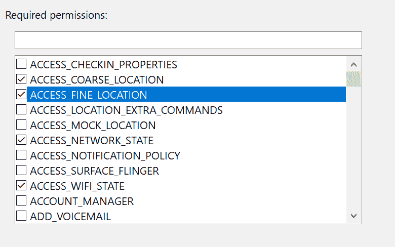

# 第四章：使用 GPS 和地图构建位置跟踪应用程序

在本章中，我们将创建一个位置跟踪应用程序，将用户的位置保存并显示为热力图。我们将看看如何在 iOS 和 Android 设备上后台运行任务，以及如何使用自定义渲染器来扩展 Xamarin.Forms 地图的功能。

本章将涵盖以下主题：

+   在 iOS 设备上后台跟踪用户位置

+   在 Android 设备上后台跟踪用户位置

+   如何在 Xamarin.Forms 应用程序中显示地图

+   如何使用自定义渲染器扩展 Xamarin.Forms 地图的功能

# 技术要求

为了能够完成项目，您需要安装 Visual Studio for Mac 或 PC，以及 Xamarin 组件。有关如何设置您的环境的更多详细信息，请参阅第一章，“Xamarin 简介”。

# 项目概述

许多应用程序可以通过添加地图和位置服务而变得更加丰富。在这个项目中，我们将构建一个名为**MeTracker**的位置跟踪应用程序。该应用程序将跟踪用户的位置并将其保存到 SQLite 数据库中，以便我们可以将结果可视化为热力图。为了构建这个应用程序，我们将学习如何在 iOS 和 Android 上设置后台进程，因为我们无法在 iOS 和 Android 之间共享代码。对于地图，我们将使用`Xamarin.Forms.Maps`组件并扩展其功能以构建热力图。为此，我们将使用 iOS 的自定义渲染器和 Android 的自定义渲染器，以便我们可以使用平台 API。

# 入门

我们可以使用 PC 上的 Visual Studio 2017 或 Mac 上的 Visual Studio 来完成此项目。要使用 Visual Studio 在 PC 上构建 iOS 应用程序，您必须连接 Mac。如果您根本没有访问 Mac，您可以只完成此项目的 Android 部分。

# 构建 MeTracker 应用程序

现在是时候开始构建应用程序了。创建一个**移动应用程序（Xamarin.Forms）**。我们将在新项目对话框的**跨平台**选项卡下找到该模板。我们将项目命名为`MeTracker`。



使用.NET Standard 作为代码共享策略，并选择 iOS 和 Android 作为平台。



确保使用 Android 版本 Oreo（API 级别 26）或更高版本进行编译。我们可以在项目属性的“应用程序”选项卡下设置这一点。

更新模板添加的 NuGet 包，以确保我们使用最新版本。

# 创建存储用户位置的存储库

我们要做的第一件事是创建一个存储库，我们可以用来保存用户的位置。

# 为位置数据创建模型

在创建存储库之前，我们将通过以下步骤创建一个代表用户位置的模型类：

1.  创建一个新的文件夹，我们可以用于此和其他模型，名为`Models`。

1.  在`Models`文件夹中创建一个名为`Location`的类，并为`Id`、`Latitude`和`Longitude`添加属性。

1.  创建两个构造函数，一个为空的构造函数，另一个以`latitude`和`longitude`作为参数的构造函数，使用以下代码：

```cs
using System;

namespace MeTracker.Models
{
    public class Location
    {
        public Location() {}

        public Location(double latitude, double longitude)
        {
            Latitude = latitude;
            Longitude = longitude;
        }

        public int Id { get; set; }
        public double Latitude { get; set; }
        public double Longitude { get; set; }
    }
}
```

# 创建存储库

现在我们已经创建了一个模型，我们可以继续创建存储库。首先，我们将通过以下步骤为存储库创建一个接口：

1.  在`MeTracker`项目中，创建一个名为`Repositories`的新文件夹。

1.  在我们的新文件夹中，我们将创建一个名为`ILocationRepository`的接口。

1.  在我们为`interface`创建的新文件中编写以下代码：

```cs
using MeTracker.Models;
using System;
using System.Threading.Tasks;

namespace MeTracker.Repositories
{
    public interface ILocationRepository
    {
        Task Save(Location location);
    }
}
```

1.  为`MeTracker.Models`和`System.Threading.Tasks`添加`using`指令，以解析`Location`和`Task`的引用。

一旦我们有了一个`interface`，我们需要通过以下步骤创建其实现：

1.  在`MeTracker`项目中，创建一个名为`LocationRepository`的新类。

1.  实现`ILocationRepository`接口，并在`Save`方法中添加`async`关键字，使用以下代码：

```cs
using System;
using System.Threading.Tasks;
using MeTracker.Models;

namespace MeTracker.Repositories
{
    public class LocationRepository : ILocationRepository 
    {
        public async Task Save(Location location)
        {
        }
    }
}
```

为了存储数据，我们将使用 SQLite 数据库和对象关系映射器（ORM）SQLite-net，以便我们可以针对领域模型编写代码，而不是使用 SQL 对数据库进行操作。这是由 Frank A. Krueger 创建的开源库。让我们通过以下步骤来设置这个：

1.  在`MeTracker`项目中安装 NuGet 包`sqlite-net-pcl`。

1.  转到`Location`模型类，并为`Id`属性添加`PrimaryKeyAttribute`和`AutoIncrementAttribute`。当我们添加这些属性时，`Id`属性将成为数据库中的主键，并将自动创建一个值。

1.  在`LocationRepository`类中编写以下代码，以创建与 SQLite 数据库的连接。`if`语句用于检查我们是否已经创建了连接。如果是这样，我们将不会创建新的连接；相反，我们将使用已经创建的连接：

```cs
private SQLiteAsyncConnection connection;

private async Task CreateConnection()
{
    if (connection != null)
    {
        return;
    }

   var databasePath = 
   Path.Combine(Environment.GetFolderPath
   (Environment.SpecialFolder .MyDocuments), "Locations.db");

 connection = new SQLiteAsyncConnection(databasePath);
 await connection.CreateTableAsync<Location>();
} 
```

现在，是时候实现`Save`方法了，该方法将以位置对象作为参数，并将其存储在数据库中。

现在，我们将在`Save`方法中使用`CreateConnection`方法，以确保在尝试将数据保存到数据库时创建连接。当我们知道有一个活动连接时，我们可以使用`InsertAsync`方法，并将`Save`方法的`location`参数作为参数传递。

编辑`LocationRepository`类中的`Save`方法，使其看起来像以下代码：

```cs
public async Task Save(Location location)
{
    await CreateConnection();
    await connection.InsertAsync(location);
}
```

# Xamarin.Essentials

**Xamarin.Essentials**是由 Microsoft 和 Xamarin 创建的库，使开发人员能够从共享代码中使用特定于平台的 API。Xamarin.Essentials 目标是 Xamarin.iOS、Xamarin.Android 和 UWP。在这个项目中，我们将使用 Xamarin.Essentials 来执行各种任务，包括获取位置和在主线程上执行代码。

# 安装 NuGet 包

在撰写本文时，Xamarin.Essentials 处于预览状态。要找到预览中的 NuGet 包，我们需要勾选包括预览版本的复选框。

# 在 Android 上配置 Xamarin.Essentials

我们需要通过调用初始化方法在 Android 上初始化 Xamarin.Essentials。我们通过以下步骤来实现这一点：

1.  在 Android 项目中，打开`MainActivity.cs`文件。

1.  在`global::Xamarin.Forms.Forms.Init`方法下添加粗体代码：

```cs
protected override void OnCreate(Bundle savedInstanceState)
{
    TabLayoutResource = Resource.Layout.Tabbar;
    ToolbarResource = Resource.Layout.Toolbar;

    base.OnCreate(savedInstanceState);

    global::Xamarin.Forms.Forms.Init(this, savedInstanceState);
    Xamarin.Essentials.Platform.Init(this, savedInstanceState);

    LoadApplication(new App());
}
```

就是这样。我们已经准备就绪。

# 为位置跟踪创建一个服务

要跟踪用户的位置，我们需要根据平台编写代码。Xamarin.Essentials 具有用于在共享代码中获取用户位置的方法，但不能在后台使用。为了能够使用我们将为每个平台编写的代码，我们需要创建一个接口。对于`ILocationRepository`接口，将只有一个在两个平台上使用的实现，而对于位置跟踪服务，我们将在 iOS 平台和 Android 平台分别有一个实现。

通过以下步骤创建`ILocationRepository`接口：

1.  在`MeTracker`项目中，创建一个新的文件夹，并命名为`Services`。

1.  在`Services`文件夹中创建一个名为`ILocationTrackingService`的新接口。

1.  在接口中，添加一个名为`StartTracking`的方法，如下所示：

```cs
 public interface ILocationTrackingService
 {
      void StartTracking();
 } 
```

目前，我们将在 iOS 和 Android 项目中只创建一个空的接口实现，稍后在本章中我们将回到每个实现：

1.  在 iOS 和 Android 项目中创建一个名为`Services`的文件夹。

1.  在 iOS 和 Android 项目的新`Service`文件夹中，按照以下代码中所示创建一个名为`LocationTrackingService`的类的空实现：

```cs
public class LocationTrackingService : ILocationTrackingService
{
     public void StartTracking()
     {
     }
}
```

# 设置应用逻辑

我们现在已经创建了我们需要跟踪用户位置并在设备上保存位置的接口。现在是时候编写代码来开始跟踪用户了。我们仍然没有任何实际跟踪用户位置的代码，但如果我们已经编写了开始跟踪的代码，那么编写这部分代码将会更容易。

# 创建一个带有地图的视图

首先，我们将创建一个带有简单地图的视图，该地图以用户位置为中心。让我们通过以下步骤来设置这一点：

1.  在`MeTracker`项目中，创建一个名为`Views`的新文件夹。

1.  在`Views`文件夹中，创建一个基于 XAML 的`ContentPage`，并将其命名为`MainView`。



Xamarin.Forms 包中没有地图控件，但是微软和 Xamarin 提供了一个官方包，可以在 Xamarin.Forms 应用中显示地图。这个包叫做`Xamarin.Forms.Maps`，我们可以通过以下步骤从 NuGet 安装它：

1.  在`MeTracker`，`MeTracker.Android`和`MeTracker.iOS`项目中安装`Xamarin.Forms.Maps`。

1.  使用以下代码为`MainView`添加`Xamarin.Forms.Maps`的命名空间：

```cs
 <ContentPage xmlns="http://xamarin.com/schemas/2014/forms" 
              xmlns:x="http://schemas.microsoft.com/winfx/2009/xaml" 
              xmlns:map="clr- 
              namespace:Xamarin.Forms.Maps;assembly
              =Xamarin.Forms.Maps"
              x:Class="MeTracker.Views.MainView"> 
```

现在我们可以在我们的视图中使用地图了。因为我们希望`Map`覆盖整个页面，所以我们可以将它添加到`ContentPage`的根部。让我们通过以下步骤来设置这一点：

1.  将`map`添加到`ContentPage`。

1.  给地图命名，以便我们可以从代码后台访问它。将其命名为`Map`，如下所示：

```cs
 <ContentPage  

              x:Class="MeTracker.Views.MainView"> 
 <map:Map x:Name="Map" /> 
</ContentPage>
```

为了使用`map`控件，我们需要在每个平台上运行代码来初始化它，通过以下步骤：

1.  在 iOS 项目中，转到`AppDelegate.cs`。

1.  在`FinishedLaunching`方法中，在`Xamarin.Forms`的`Init`之后，添加`global::Xamarin.FormsMaps.Init()`来初始化 iOS 应用中的`map`控件，使用以下代码：

```cs
public override bool FinishedLaunching(UIApplication app, NSDictionary options)
{
     global::Xamarin.Forms.Forms.Init();
     global::Xamarin.FormsMaps.Init();

     LoadApplication(new App());

     return base.FinishedLaunching(app, options);
} 
```

继续为 Android 初始化：

1.  在 Android 项目中，转到`MainActivity.cs`。

1.  在`OnCreate`方法中，在`Xamarin.Forms`的`Init`之后，添加`global::Xamarin.FormsMaps.Init(this, savedInstanceState)`来初始化 iOS 上的`map`控件。

1.  通过以下代码初始化 Xamarin.Essentials：`Xamarin.Essentials.Platform.Init(this, savedInstanceState)`。

```cs
protected override void OnCreate(Bundle savedInstanceState)
{
    TabLayoutResource = Resource.Layout.Tabbar;
    ToolbarResource = Resource.Layout.Toolbar;

     base.OnCreate(savedInstanceState);
     global::Xamarin.Forms.Forms.Init(this, savedInstanceState);
     global::Xamarin.FormsMaps.Init(this, savedInstanceState);

     Xamarin.Essentials.Platform.Init(this, savedInstanceState); 

     LoadApplication(new App());
} 
```

对于 Android，我们还需要决定用户回答权限对话框后发生什么，并将结果发送给 Xamarin.Essentials。我们将通过将以下代码添加到`MainActivity.cs`来实现这一点：

```cs
public override void OnRequestPermissionsResult(int requestCode,                     
                 string[] permissions, 
                 [GeneratedEnum] Android.Content.PM.Permission[]          
                 grantResults)
{     Xamarin.Essentials.Platform.OnRequestPermissionsResult(requestCode,   
                 permissions, grantResults);
                 base.OnRequestPermissionsResult(requestCode,   
                 permissions, grantResults);
}
```

对于 Android，我们需要一个**API 密钥**来获取 Google Maps 的地图。有关如何获取 API 密钥的 Microsoft 文档可以在[`docs.microsoft.com/en-us/xamarin/android/platform/maps-and-location/maps/obtaining-a-google-maps-api-key`](https://docs.microsoft.com/en-us/xamarin/android/platform/maps-and-location/maps/obtaining-a-google-maps-api-key)找到。以下是获取 API 密钥的步骤：

1.  打开`AndroidMainfest.xml`，它位于 Android 项目的`Properties`文件夹中。

1.  将元数据元素插入到应用程序元素中，如下所示：

```cs
 <application android:label="MeTracker.Android">
      <meta-data android:name="com.google.android.maps.v2.API_KEY" 
      android:value="{YourKeyHere}" />
</application> 
```

我们还希望地图以用户的位置为中心。我们将在`MainView.xaml.cs`的构造函数中实现这一点。因为我们希望异步运行获取用户位置的操作，并且它需要在主线程上执行，所以我们将使用`MainThread.BeginInvokeOnMainThread`来包装它。我们将使用 Xamarin.Essentials 来获取用户的当前位置。当我们有了位置信息后，我们可以使用`Map`的`MoveToRegion`方法。我们可以通过以下步骤来设置这一点：

1.  在`MeTracker`项目中，打开`MainView.xaml.cs`。

1.  将粗体字中的代码添加到`MainView.xaml.cs`类的构造函数中：

```cs
public MainView ()
{
    InitializeComponent ();

MainThread.BeginInvokeOnMainThread(async() =>
 {
 var location = await Geolocation.GetLocationAsync();
 Map.MoveToRegion(MapSpan.FromCenterAndRadius(
 new Position(location.Latitude, location.Longitude), 
 Distance.FromKilometers(5)));
 });
}
```

# 创建一个 ViewModel

在创建实际的视图模型之前，我们将创建一个所有视图模型都可以继承的抽象基础视图模型。这个基础视图模型的想法是我们可以在其中编写通用代码。在这种情况下，我们将通过以下步骤实现`INotifyPropertyChanged`接口：

1.  在`MeTracker`项目中创建一个名为`ViewModels`的文件夹。

1.  编写以下代码并解析所有引用：

```cs
public abstract class ViewModel : INotifyPropertyChanged
{
    public event PropertyChangedEventHandler PropertyChanged;

    public void RaisePropertyChanged(params string[] propertyNames)
    {
        foreach(var propertyName in propertyNames)
        {
            PropertyChanged?.Invoke(this, new  
            PropertyChangedEventArgs(propertyName));
        }
    }
} 
```

下一步是创建实际的视图模型，它将使用`ViewModel`作为基类。通过以下步骤来设置：

1.  在`MeTracker`项目中，在`ViewModels`文件夹中创建一个名为`MainViewModel`的新类。

1.  使`MainViewModel`继承`ViewModel`。

1.  添加一个`ILocationTrackingService`类型的只读字段，并命名为`locationTrackingService`。

1.  添加一个`ILocationRepository`类型的只读字段，并命名为`locationRepository`。

1.  创建一个构造函数，参数为`ILocationTrackingService`和`ILocationRepository`。

1.  使用参数的值设置我们在*步骤*3 和*步骤*4 中创建的字段的值，如下面的代码所示：

```cs
public class MainViewModel : ViewModel
{
         private readonly ILocationRepository locationRepository;
         private readonly ILocationTrackingService 
         locationTrackingService;

         public MainViewModel(ILocationTrackingService 
         locationTrackingService,
         ILocationRepository locationRepository)
         {
             this.locationTrackingService = 
             locationTrackingTrackingService;
             this.locationRepository = locationRepository;
         } 
}
```

为了使 iOS 应用程序开始跟踪用户的位置，我们需要通过以下步骤在主线程上运行启动跟踪的代码：

1.  在新创建的`MainViewModel`的构造函数中，使用 Xamarin.Essentials 的`MainThread.BeginInvokeOnMainThread`调用主线程。Xamarin.Forms 有一个用于在主线程上调用代码的辅助方法，但如果我们使用 Xamarin.Essentials 的方法，我们可以在 ViewModel 中没有任何对 Xamarin.Forms 的依赖。如果在 ViewModels 中没有任何对 Xamarin.Forms 的依赖，我们可以在将来添加其他平台的应用程序中重用它们。

1.  在传递给`BeginInvokeOnMainThread`方法的操作中调用`locationService.StartTracking`，如下面的代码所示：

```cs
public MainViewModel(ILocationTrackingService 
                     locationTrackingService, 
                     ILocationRepository locationRepository)
{
    this.locationTrackingService = locationTrackingTrackingService;
    this.locationRepository = locationRepository;

 MainThread.BeginInvokeOnMainThread(async() =>
 {
 locationTrackingService.StartTracking();
 });
}

```

最后，我们需要将`MainViewModel`注入到`MainView`的构造函数中，并将`MainViewModel`实例分配给视图的绑定上下文，通过以下步骤进行。这将允许数据绑定被处理，并且`MainViewModel`的属性将绑定到用户界面中的控件：

1.  在`MeTracker`项目中，转到`Views/MainView.xaml.cs`文件的构造函数。

1.  将`MainViewModel`作为构造函数的参数，并将其命名为`viewModel`。

1.  将`BindingContext`设置为`MainViewModel`的实例，如下面的代码所示：

```cs
public MainView(MainViewModel viewModel)
{
    InitializeComponent();

 BindingContext = viewModel; 

    MainThread.BeginInvokeOnMainThread(async () =>
    {
        var location = await 
        Geolocation.GetLastKnownLocationAsync();
        Map.MoveToRegion(MapSpan.FromCenterAndRadius(
        new Position(location.Latitude, location.Longitude), 
        Distance.FromKilometers(5)));
    });
}
```

# 创建一个解析器

在这个项目中，我们将使用依赖注入，我们将使用一个名为 Autofac 的库。Autofac 是一个开源的**控制反转**（**IoC**）容器。我们将创建一个`Resolver`类，以便在本章后面将要添加到容器中的类型可以轻松地解析。为此，我们将通过以下步骤进行：

1.  在`MeTracker`，`MeTracker.Android`和`MeTracker.iOS`项目中从 NuGet 安装 Autofac。

1.  在`MeTracker`项目中，在项目的根目录创建一个名为`Resolver`的新类。

1.  创建一个名为`container`的`private static IContainer`字段。

1.  创建一个名为`Initialized`的`static`方法，它具有一个`IContainer`参数，并设置`container`字段的值，如下面的代码所示：

```cs
using Autofac;
using System;
using System.Collections.Generic;
using System.Text;

namespace MeTracker
{
    public class Resolver
    {
        private static IContainer container;

        public static void Initialize(IContainer container)
        {
            Resolver.container = container;
        }
    }
}
```

`Initialize`方法将在 Autofac 配置完成后调用，我们将在创建引导程序时进行配置。这个方法简单地获取作为参数的`container`并将其存储在`static`容器字段中。

现在，我们需要一个方法来访问它。创建一个名为`Resolve`的静态方法。这个方法将是通用的，当我们使用它时，我们将指定它的类型作为将要解析的类型。使用`container`字段来解析类型，如下面的代码所示：

```cs
public static T Resolve<T>()
{
     return container.Resolve<T>();
} 
```

`Resolve<T>`方法接受一个类型作为参数，并在容器中查找有关如何构造此类型的任何信息。如果有，我们就返回它。

所以，现在我们有了我们将用来解析对象类型实例的`Resolver`，我们需要对其进行配置。这是引导程序的工作。

# 创建引导程序

要配置依赖注入并初始化`Resolver`，我们将创建一个引导程序。我们将有一个共享的引导程序，以及其他针对每个平台的引导程序，以满足其特定的配置。我们需要它们是特定于平台的原因是，我们将在 iOS 和 Android 上有不同的`ILocationTrackingService`实现。要创建引导程序，我们需要按照以下步骤进行：

1.  在`MeTracker`项目中创建一个新类，并命名为`Bootstrapper`。

1.  在新类中编写以下代码：

```cs
using Autofac;
using MeTracker.Repositories;
using MeTracker.ViewModels;
using System;
using System.Collections.Generic;
using System.Linq;
using System.Reflection;
using System.Text;
using Xamarin.Forms;

namespace MeTracker
{
    public class Bootstrapper
    {
        protected ContainerBuilder ContainerBuilder { get; private 
        set; }

        public Bootstrapper()
        {
            Initialize();
            FinishInitialization();
        }

        protected virtual void Initialize()
        {
            ContainerBuilder = new ContainerBuilder();

            var currentAssembly = Assembly.GetExecutingAssembly();

            foreach (var type in currentAssembly.DefinedTypes.
                     Where(e => e.IsSubclassOf(typeof(Page))))
            {
                ContainerBuilder.RegisterType(type.AsType());
            }

            foreach (var type in currentAssembly.DefinedTypes.
                     Where(e => e.IsSubclassOf(typeof(ViewModel))))
            {
                ContainerBuilder.RegisterType(type.AsType());
            }

            ContainerBuilder.RegisterType<LocationRepository>
            ().As<ILocationRepository>();
        }

        private void FinishInitialization()
        {
            var container = ContainerBuilder.Build();
            Resolver.Initialize(container);
        }
    }
}
```

# 创建 iOS 引导程序

在 iOS 引导程序中，我们将有特定于 iOS 应用程序的配置。要创建 iOS 应用程序，我们需要按照以下步骤进行：

1.  在 iOS 项目中，创建一个新类，并命名为`Bootstrapper`。

1.  使新类继承自`MeTracker.Bootstrapper`。

1.  编写以下代码：

```cs
using Autofac;
using MeTracker.iOS.Services;
using MeTracker.Services;

namespace MeTracker.iOS
{
    public class Bootstrapper : MeTracker.Bootstrapper
    {
        public static void Execute()
        {
            var instance = new Bootstrapper();
        }

        protected override void Initialize()
        {
            base.Initialize();

            ContainerBuilder.RegisterType<LocationTrackingService>()
            .As<ILocationTrackingService>().SingleInstance();
        }
    }
}
```

1.  转到 iOS 项目中的`AppDelegate.cs`。

1.  在`FinishedLaunching`方法中的`LoadApplication`调用之前，调用平台特定引导程序的`Init`方法，如下面的代码所示：

```cs
public override bool FinishedLaunching(UIApplication app, NSDictionary options)
{
      global::Xamarin.Forms.Forms.Init();
      global::Xamarin.FormsMaps.Init();
      Bootstrapper.Init();

      LoadApplication(new App());

      return base.FinishedLaunching(app, options);
} 
```

# 创建 Android 引导程序

在 Android 引导程序中，我们将有特定于 Android 应用程序的配置。要在 Android 中创建引导程序，我们需要按照以下步骤进行：

1.  在 Android 项目中，创建一个新类，并命名为`Bootstrapper`。

1.  使新类继承自`MeTracker.Bootstrapper`。

1.  编写以下代码：

```cs
using Autofac;
using MeTracker.Droid.Services;
using MeTracker.Services;

namespace MeTracker.Droid
{ 
    public class Bootstrapper : MeTracker.Bootstrapper
    {
         public static void Init()
         {
             var instance = new Bootstrapper();
         }

         protected override void Initialize()
         {
             base.Initialize();

             ContainerBuilder.RegisterType<LocationTrackingService()
             .As<ILocationTrackingService>().SingleInstance();
         }
    }
} 
```

1.  进入 Android 项目中的`MainActivity.cs`文件。

1.  在`OnCreate`方法中的`LoadApplication`调用之前，调用平台特定引导程序的`Init`方法，如下面的代码所示：

```cs
protected override void OnCreate(Bundle savedInstanceState)
{
     TabLayoutResource = Resource.Layout.Tabbar;
     ToolbarResource = Resource.Layout.Toolbar;

     base.OnCreate(savedInstanceState);
     Xamarin.Essentials.Platform.Init(this, savedInstanceState);

     global::Xamarin.Forms.Forms.Init(this, savedInstanceState);
     global::Xamarin.FormsMaps.Init(this, savedInstanceState);

 Bootstrapper.Init();

     LoadApplication(new App());
} 
```

# 设置 MainPage

在我们首次启动应用程序之前的最后一步是通过以下步骤在`App.xaml.cs`文件中设置`MainPage`属性。但首先，我们可以删除我们启动项目时创建的`MainPage.xaml`文件和`MainPage.xaml.cs`文件，因为我们这里不使用它们：

1.  删除`MeTracker`项目中的`MainPage.xaml`和`MainPage.xaml.cs`，因为我们将把`MainView`设置为用户首次看到的第一个视图。

1.  使用`Resolver`来创建`MainView`的实例。

1.  在构造函数中将`MainPage`设置为`MainView`的实例，如下面的代码所示：

```cs
public App()
{
     InitializeComponent();
     MainPage = Resolver.Resolve<MainView>();
} 
```

解析器使用 Autofac 来找出我们创建`MainView`实例所需的所有依赖项。它查看`MainView`的构造函数，并决定它需要一个`MainViewModel`。如果`MainViewModel`有进一步的依赖项，那么该过程将遍历所有这些依赖项并构建我们需要的所有实例。

现在我们将能够运行该应用程序。它将显示一个以用户当前位置为中心的地图。我们现在将添加代码来使用后台位置跟踪来跟踪位置。

# iOS 上的后台位置跟踪

位置跟踪的代码是我们需要为每个平台编写的。对于 iOS，我们将使用`CoreLocation`命名空间中的`CLLocationManager`。

# 在后台启用位置更新

当我们想在 iOS 应用程序中后台执行任务时，我们需要在`info.plist`文件中声明我们想要做什么。以下步骤显示了我们如何做到这一点：

1.  在`MeTracker.iOS`项目中，打开`info.plist`。

1.  转到 Capabilities 选项卡。

1.  选择启用后台模式和位置更新，如下面的屏幕截图所示：



如果我们用 XML 编辑器直接在`info.plist`文件中打开它，我们也可以直接启用后台模式。在这种情况下，我们将添加以下 XML：

```cs
<key>UIBackgroundModes</key>
<array>
     <string>location</string>
</array>
```

# 获取使用用户位置的权限

在我们可以请求使用用户位置的权限之前，我们需要添加一个描述，说明我们将使用位置。自从 iOS 11 推出以来，我们不再允许只请求始终跟踪用户位置的权限；用户必须能够只在使用应用时允许我们跟踪他们的位置。我们将通过以下步骤向`info.plist`文件中添加描述：

1.  用 XML（文本）编辑器打开`MeTracker.iOS`项目中的`info.plist`。

1.  添加键`NSLocationWhenInUseUsageDescription`，并附上描述。

1.  添加键`NSLocationAlwaysAndWhenInUsageDescription`，并附上描述，如下面的代码所示：

```cs
<key>NSLocationWhenInUseUsageDescription</key>
<string>We will use your location to track you</string>
<key>NSLocationAlwaysAndWhenInUseUsageDescription</key>
<string>We will use your location to track you</string>
```

# 订阅位置更新

现在我们已经为位置跟踪准备好了`info.plist`文件，是时候编写实际的代码来跟踪用户的位置了。如果我们不将`CLLocationManager`设置为不暂停位置更新，当位置数据不太可能改变时，iOS 可能会自动暂停位置更新。在这个应用程序中，我们不希望发生这种情况，因为我们希望多次保存位置，以便我们可以确定用户是否经常访问特定位置。让我们通过以下步骤来设置这个：

1.  在`MeTracker.iOS`项目中打开`LocationTrackingService`。

1.  为`CLLocationManager`添加一个私有字段。

1.  在`StartTracking`方法中创建`CLLocationMananger`的实例。

1.  将`PausesLocationUpdatesAutomatically`设置为`false`。

1.  将`AllowBackgroundLocationUpdates`设置为`true`（如下所示的代码），以便即使应用在后台运行时，位置更新也会继续进行：

```cs
public void StartTracking()
{
    locationManager = new CLLocationManager
 {
 PausesLocationUpdatesAutomatically = false,
 AllowsBackgroundLocationUpdates = true }; // Add code here
}

```

下一步是请求用户允许跟踪他们的位置。我们将请求始终跟踪他们的位置的权限，但用户可以选择只在使用应用时允许我们跟踪他们的位置。因为用户也可以选择拒绝我们跟踪他们的位置的权限，所以在开始之前我们需要进行检查。让我们通过以下步骤来设置这个：

1.  通过在`locationManager`上连接`AuthorizationChanged`事件来添加授权更改的事件监听器。

1.  在事件监听器中，创建一个`if`语句来检查用户是否允许我们跟踪他们的位置。

1.  调用我们最近在`CLLocationManager`中创建的实例的`RequestAlwaysAuthorization`方法。

1.  代码应该放在`// Add code here`注释下，如下面的粗体所示：

```cs
public void StartTracking()
{
    locationManager = new CLLocationManager
    {
        PausesLocationUpdatesAutomatically = false,
        AllowsBackgroundLocationUpdates = true
    };

    // Add code here
 locationManager.AuthorizationChanged += (s, args) =>
 { 
 if (args.Status == CLAuthorizationStatus.Authorized)
 {
            // Next section of code goes here
 }
 };

    locationManager.RequestAlwaysAuthorization();
}
```

在开始跟踪用户位置之前，我们将设置我们希望从`CLLocationManager`接收的数据的准确性。我们还将添加一个事件处理程序来处理位置更新。让我们通过以下步骤来设置这个：

1.  将`DesiredAccuracy`设置为`CLLocation.AccurracyBestForNavigation`。在后台运行应用程序时的一个限制是，`DesiredAccuracy`需要设置为`AccurracyBest`或`AccurracyBestForNavigation`。

1.  为`LocationsUpdated`添加一个事件处理程序，然后调用`StartUpdatingLocation`方法。

1.  代码应该放在`// Next section goes here`注释下，并且应该看起来像下面片段中的粗体代码：

```cs
   locationManager.AuthorizationChanged += (s, args) =>
    {
        if (args.Status == CLAuthorizationStatus.Authorized)
        {
            // Next section of code goes here
 locationManager.DesiredAccuracy = 
            CLLocation.AccurracyBestForNavigation;
            locationManager.LocationsUpdated += 
            async (object sender, CLLocationsUpdatedEventArgs e) =>
                {
                    // Final block of code goes here
                };

            locationManager.StartUpdatingLocation();
        }
    };

```

我们设置的精度越高，电池消耗就越高。如果我们只想跟踪用户去过哪里而不是一个地方有多受欢迎，我们还可以设置`AllowDeferredLocationUpdatesUntil`。这样，我们可以指定用户在更新位置之前必须移动特定距离。我们还可以使用`timeout`参数指定我们希望多久更新一次位置。跟踪用户在某个地方停留的最节能解决方案是使用`CLLocationManager`的`StartMonitoringVisits`方法。

现在，是时候处理`LocationsUpdated`事件了。让我们按照以下步骤进行：

1.  添加一个名为`locationRepository`的私有字段，类型为`ILocationRepository`。

1.  添加一个构造函数，该构造函数以`ILocationRepository`作为参数。将参数的值设置为`locationRepository`字段。

1.  在`CLLocationsUpdatedEventArgs`的`Locations`属性上读取最新位置。

1.  创建`MeTracker.Models.Location`的实例，并将最新位置的纬度和经度传递给它。

1.  使用`ILocationRepository`的`Save`方法保存位置。

1.  代码应放置在`//最终的代码块放在这里`的注释处，并且应该看起来像以下片段中的粗体代码：

```cs
locationManager.LocationsUpdated += 
    async (object sender, CLLocationsUpdatedEventArgs e) =>
    {
 var lastLocation = e.Locations.Last();
 var newLocation = new 
        Models.Location(lastLocation.Coordinate.Latitude,

        lastLocation.Coordinate.Longitude);

 await locationRepository.Save(newLocation);
    };

```

我们已经完成了 iOS 应用的跟踪部分。现在我们将为 Android 实现后台跟踪。之后，我们将可视化数据。

# 使用 Android 进行后台位置跟踪

在 Android 中进行后台更新的方式与我们在 iOS 中实现的方式非常不同。使用 Android，我们需要创建一个`JobService`并对其进行调度。

# 添加所需的权限以使用用户的位置

要在后台跟踪用户的位置，我们需要请求五个权限，如下表所示：

| `ACCESS_COARSE_LOCATION` | 获取用户的大致位置 |
| --- | --- |
| `ACCESS_FINE_LOCATION` | 获取用户的精确位置 |
| `ACCESS_NETWORK_STATE` | 因为 Android 中的位置服务使用来自网络的信息来确定用户的位置 |
| `ACCESS_WIFI_STATE` | 因为 Android 中的位置服务使用来自 Wi-Fi 网络的信息来确定用户的位置 |
| `RECEIVE_BOOT_COMPLETED` | 以便在设备重新启动后可以重新启动后台作业 |

权限可以从`MeTracker.Android`项目的属性中的 Android 清单选项卡或`Properties`文件夹中的`AndroidManifest.xml`文件中设置。当从 Android 清单选项卡进行更改时，更改也将写入`AndroidMainfest.xml`文件，因此无论您喜欢哪种方法都无所谓。

以下是在`MeTracker.Android`项目的属性中的 Android 清单选项卡中设置权限的屏幕截图：



`uses-permission`元素应添加到`AndroidManifest.xml`文件中的`manifest`元素中，如下面的代码所示：

```cs
<uses-permission android:name="android.permission.ACCESS_FINE_LOCATION" />
<uses-permission android:name="android.permission.ACCESS_COARSE_LOCATION" />
<uses-permission android:name="android.permission.RECEIVE_BOOT_COMPLETED" />
<uses-permission android:name="android.permission.ACCESS_NETWORK_STATE" />
<uses-permission android:name="android.permission.ACCESS_WIFI_STATE" /> 
```

# 创建后台作业

要在后台跟踪用户的位置，我们需要通过以下步骤创建一个后台作业：

1.  在 Android 项目中，在`Services`文件夹中创建一个名为`LocationJobService`的新类。

1.  将类设置为`public`，并将`Android.App.Job.JobService`添加为基类。

1.  实现`OnStartJob`和`OnStopJob`的抽象方法，如下面的代码所示：

```cs
public class LocationJobService : JobService
{ 
     public override bool OnStopJob(JobParameters @params)
     {
         return true;
     }

     public override bool OnStartJob(JobParameters @params)
     {
         return true;
     } 
}
```

Android 应用中的所有服务都需要添加到`AndroidManifest.xml`文件中。我们不必手动执行此操作；相反，我们可以向类添加属性，然后该属性将在`AndroidManifest.xml`文件中生成。我们将使用`Name`和`Permission`属性来设置所需的信息，如下面的代码所示：

```cs
 [Service(Name = "MeTracker.Droid.Services.LocationJobService",
 Permission = "android.permission.BIND_JOB_SERVICE")]
          public class LocationJobService : JobService

```

# 调度后台作业

当我们创建了一个作业，我们可以安排它。我们将从`MeTracker.Android`项目中的`LocationTrackingService`中执行此操作。要配置作业，我们将使用`JobInfo.Builder`类。

我们将使用`SetPersisted`方法来确保作业在重新启动后重新启动。这就是为什么我们之前添加了`RECEIVE_BOOT_COMPLETED`权限。

要安排作业，至少需要一个约束。在这种情况下，我们将使用`SetOverrideDeadline`。这将指定作业需要在指定的时间（以毫秒为单位）之前运行。

`SetRequiresDeviceIdle`代码短语可用于确保作业仅在设备未被用户使用时运行。如果我们希望确保在用户使用设备时不减慢设备速度，可以将`true`传递给该方法。

`SetRequiresBatteryNotLow`代码短语可用于指定作业在电池电量低时不运行。如果没有充分的理由在电池电量低时运行作业，我们建议始终将其设置为`true`。这是因为我们不希望我们的应用程序耗尽用户的电池。

因此，让我们通过以下步骤实现在`Services`文件夹中的 Android 项目中找到的`LocationTrackingService`：

1.  根据我们指定的 ID（这里我们将使用`1`）和组件名称（我们从应用程序上下文和 Java 类创建）创建`JobInfo.Builder`。组件名称用于指定哪些代码将在作业期间运行。

1.  使用`SetOverrideDeadline`方法，并将`1000`传递给它，以使作业在创建作业后不到一秒钟就运行。

1.  使用`SetPersisted`方法并传递`true`，以确保作业在设备重新启动后仍然持续存在。

1.  使用`SetRequiresDeviceIdle`方法并传递`false`，以便即使用户正在使用设备，作业也会运行。

1.  使用`SetRequiresBatteryLow`方法并传递`true`，以确保我们不会耗尽用户的电池。此方法是在 Android API 级别 26 中添加的。

1.  `LocationTrackingService`的代码现在应该如下所示：

```cs
using Android.App;
using Android.App.Job;
using Android.Content;
using MeTracker.Services;

namespace MeTracker.Droid.Services
{
    public class LocationTrackingService : ILocationTrackingService
    { 
        var javaClass = 
        Java.Lang.Class.FromType(typeof(LocationJobService));
        var componentName = new ComponentName(Application.Context, 
        javaClass);
        var jobBuilder = new JobInfo.Builder(1, componentName);

        jobBuilder.SetOverrideDeadline(1000);
        jobBuilder.SetPersisted(true);
        jobBuilder.SetRequiresDeviceIdle(false);
        jobBuilder.SetRequiresBatteryNotLow(true);

        var jobInfo = jobBuilder.Build();
    }
}
```

`JobScheduler`服务是一个系统服务。要获取系统服务的实例，我们将通过以下步骤使用应用程序上下文：

1.  使用`Application.Context`上的`GetSystemService`方法来获取`JobScheduler`。

1.  将结果转换为`JobScheduler`。

1.  在`JobScheduler`类上使用`Schedule`方法，并传递`JobInfo`对象来安排作业，如下面的代码所示：

```cs
var jobScheduler =    
  (JobScheduler)Application.Context.GetSystemService
  (Context.JobSchedulerService);
  jobScheduler.Schedule(jobInfo); 
```

# 订阅位置更新

一旦我们安排了作业，我们可以编写代码来指定作业应该做什么，即跟踪用户的位置。为此，我们将使用`LocationManager`，这是一个`SystemService`。使用`LocationManager`，我们可以请求单个位置更新，或者我们可以订阅位置更新。在这种情况下，我们希望订阅位置更新。

我们将首先创建`ILocationRepository`接口的实例，用于将位置保存到 SQlite 数据库中。让我们通过以下步骤来设置这个：

1.  为`LocationJobService`创建一个构造函数。

1.  为`ILocationRepository`接口创建一个私有的只读字段，名称为`locationRepository`。

1.  在构造函数中使用`Resolver`来创建`ILocationRepository`的实例，如下面的代码所示：

```cs
private ILocationRepository locationRepository;
public LocationJobService()
{
     locationRepository = Resolver.Resolve<ILocationRepository>();
}
```

在订阅位置更新之前，我们将添加一个监听器。为此，我们将通过以下步骤使用`Android.Locations.ILocationListener`接口：

1.  将`Android.Locations.ILocationListener`添加到`LocationJobService`。

1.  实现接口。

1.  删除所有`throw new NotImplementedException();`的实例，该实例是在让 Visual Studio 生成接口的实现时添加的。

1.  在`OnLocationChanged`方法中，将`Android.Locations.Location`对象映射到`Model.Location`对象。

1.  使用`LocationRepository`类上的`Save`方法，如下所示：

```cs
public void OnLocationChanged(Android.Locations.Location location)
{
    var newLocation = new Models.Location(location.Latitude, 
    location.Longitude);
 locationRepository.Save(newLocation);
} 
```

创建监听器后，我们可以通过以下步骤订阅位置更新：

1.  转到`LocationJobService`中的`StartJob`方法。

1.  创建`LocationManager`类型的静态字段。

1.  使用`GetSystemService`获取`LocationManager`在`ApplicationContext`上。

1.  要订阅位置更新，请使用`RequestLocationUpdates`方法，如下所示：

```cs
public override bool OnStartJob(JobParameters @params)
{      
     locationManager =  
     (LocationManager)ApplicationContext.GetSystemService
     (Context.LocationService);
 locationManager.RequestLocationUpdates
     (LocationManager.GpsProvider, 1000L, 0.1f, this);

     return true;
}
```

我们传递给`RequestLocationUpdates`方法的第一个参数确保我们从 GPS 获取位置。第二个确保位置更新之间至少间隔`1000`毫秒。第三个参数确保用户必须移动至少`0.1`米才能获得位置更新。最后一个指定我们应该使用哪个监听器。因为当前类实现了`Android.Locations.ILocationListener`接口，我们将传递`this`。

# 创建热力图

为了可视化我们收集到的数据，我们将创建一个热力图。我们将在地图上添加许多点，并根据用户在特定位置停留的时间来设置它们的不同颜色。最受欢迎的地方将有温暖的颜色，而最不受欢迎的地方将有冷色。

# 向`LocationRepository`添加一个`GetAll`方法

为了可视化数据，我们需要编写代码，以便从数据库中读取数据。让我们通过以下步骤来设置这个：

1.  在`MeTracker`项目中，打开`ILocationRepository.cs`文件。

1.  添加一个`GetAll`方法，使用以下代码返回`Location`对象的列表：

```cs
 Task<List<Location>> GetAll() ;
```

1.  在`MeTracker`项目中，打开实现`ILocationRepository`的`LocationRepository.cs`文件。

1.  实现新的`GetAll`方法，并返回数据库中所有保存的位置，如下所示：

```cs
public async Task<List<Location>> GetAll()
{
      await CreateConnection();

      var locations = await connection.Table<Location>
      ().ToListAsync();

      return locations;
}
```

# 为可视化数据准备数据

在我们可以在地图上可视化数据之前，我们需要准备数据。我们将首先创建一个新的模型，用于准备好的数据。让我们通过以下步骤设置这个：

1.  在`MeTracker`项目的`Models`文件夹中，创建一个新的类并命名为`Point`。

1.  添加`Location`，`Count`和`Heat`的属性，如下所示：

```cs
namespace MeTracker.Models
{ 
    public class Point
    {
         public Location Location { get; set; }
         public int Count { get; set; } = 1;
         public Xamarin.Forms.Color Heat { get; set; }
    }
} 
```

`MainViewModel`将存储我们以后会找到的位置。让我们通过以下步骤添加一个用于存储`Points`的属性：

1.  在`MeTracker`项目中，打开`MainViewModel`类。

1.  添加一个名为`points`的`private`字段，它具有`List<Point>`类型。

1.  创建一个名为`Points`的属性，它具有`List<Point>`类型。

1.  在`get`方法中，返回`points`字段的值。

1.  在`set`方法中，将`points`字段设置为新值，并调用`RaisePropertyChanged`并将属性的名称作为参数。

1.  在`LoadData`方法的末尾，将`pointList`变量分配给`Points`属性，如下所示：

```cs
private List<Models.Point> points;
public List<Models.Point> Points
{
      get => points;
      set
      {
           points = value;
           RaisePropertyChanged(nameof(Points));
      }
}
```

现在我们有了存储点的位置，我们必须添加代码来添加位置。我们将通过实现`MainViewModel`类的`LoadData`方法来实现这一点，并确保在位置跟踪开始后立即在主线程上调用它。

我们将首先对保存的位置进行分组，以便所有在 200 米范围内的位置将被视为一个点。我们将跟踪我们在该点内记录位置的次数，以便稍后决定地图上该点的颜色。让我们通过以下步骤设置这个：

1.  添加一个名为 LoadData 的`async`方法，它返回`MainViewModel`的`Task`。

1.  在`ILocationTrackingService`的`StartTracking`方法调用后，从构造函数中调用`LoadData`方法，如下所示：

```cs
public MainViewModel(ILocationTrackingService 
                     locationTrackingService, 
                     ILocationRepository locationRepository)
{
    this.locationTrackingService = locationTrackingService;
    this.locationRepository = locationRepository;

    MainThread.BeginInvokeOnMainThread(async() => 
    {
         locationTrackingService.StartTracking();
 await LoadData();
    });
}
```

`LoadData`方法的第一步是从 SQLite 数据库中读取所有跟踪位置。当我们有了所有的位置后，我们将循环遍历它们并创建点。为了计算位置和点之间的距离，我们将使用`Xamarin.Essentials.Location`中的`CalculateDistance`方法，如下面的代码所示：

```cs
private async Task LoadData()
{ 
    var locations = await locationRepository.GetAll();
 var pointList = new List<Models.Point>();

 foreach (var location in locations)
 {
 //If no points exist, create a new one an continue to the next  
        location in the list
 if (!pointList.Any())
 {
 pointList.Add(new Models.Point() { Location = location });
 continue;
 }

 var pointFound = false;

 //try to find a point for the current location
 foreach (var point in pointList)
 {
 var distance =   
            Xamarin.Essentials.Location.CalculateDistance(
 new Xamarin.Essentials.Location(
            point.Location.Latitude, point.Location.Longitude),
 new Xamarin.Essentials.Location(location.Latitude,                             
            location.Longitude), DistanceUnits.Kilometers);

 if (distance < 0.2)
 {
 pointFound = true;
 point.Count++;
 break;
 }
 }

 //if no point is found, add a new Point to the list of points
 if (!pointFound)
 {
 pointList.Add(new Models.Point() { Location = location });
 }

        // Next section of code goes here
    }
} 
```

当我们有了点的列表，我们可以计算每个点的热度颜色。我们将使用颜色的**色调、饱和度和亮度**（HSL）表示，如下面的列表所述：

+   **色调**：色调是色轮上从 0 到 360 的度数，0 是红色，240 是蓝色。因为我们希望我们最受欢迎的地方是红色（热的），我们最不受欢迎的地方是蓝色（冷的），我们将根据用户到达该点的次数计算每个点的值在 0 到 240 之间。这意味着我们只会使用比例的三分之二。

+   **饱和度**：饱和度是一个百分比值：0%是灰色，而 100%是全彩。在我们的应用程序中，我们将始终使用 100%（在代码中表示为`1`）。

+   **亮度**：亮度是光的百分比值：0%是黑色，100%是白色。我们希望它是中性的，所以我们将使用 50%（在代码中表示为`0.5`）。

我们需要做的第一件事是找出用户在最受欢迎和最不受欢迎的地方分别去过多少次。我们通过以下步骤找出这一点：

1.  首先，检查点的列表是否为空。

1.  获取点列表中`Count`属性的`Min`和`Max`值。

1.  计算最小值和最大值之间的差异。

1.  代码应添加到`LoadData`方法底部的`// 下一段代码放在这里`注释处，如下面的代码所示：

```cs
private async Task LoadData()
{ 
    // The rest of the method has been commented out for brevity

    // Next section of code goes here
 if (pointList == null || !pointList.Any())
 {
 return;
 } 
 var pointMax = pointList.Select(x => x.Count).Max();
 var pointMin = pointList.Select(x => x.Count).Min();
 var diff = (float)(pointMax - pointMin);

    // Last section of code goes here
}
```

现在我们将能够通过以下步骤计算每个点的热度：

1.  循环遍历所有点。

1.  使用以下计算来计算每个点的热度。

1.  代码应添加到`LoadData()`方法底部的`// 最后一段代码放在这里`注释处，如下面的粗体所示：

```cs
private async Task LoadData()
{ 
    // The rest of the method has been commented out for brevity

    // Next section of code goes here
  if (pointList == null || !pointList.Any())
    {
        return;
    }

    var pointMax = pointList.Select(x => x.Count).Max();
    var pointMin = pointList.Select(x => x.Count).Min();
    var diff = (float)(pointMax - pointMin);

 // Last section of code goes here
 foreach (var point in pointList)
 {
 var heat = (2f / 3f) - ((float)point.Count / diff);
 point.Heat = Color.FromHsla(heat, 1, 0.5);
 }

    Points = pointList;
}
```

这就是在`MeTracker`项目中设置位置跟踪的全部内容。现在让我们把注意力转向可视化我们得到的数据。

# 创建自定义渲染器

**自定义渲染器**是扩展 Xamarin.Forms 的强大方式。正如在第一章中提到的，*Xamarin 简介*，Xamarin.Forms 是使用渲染器构建的，因此对于每个 Xamarin.Forms 控件，都有一个渲染器来创建本机控件。通过覆盖现有的渲染器或创建新的渲染器，我们可以扩展和自定义 Xamarin.Forms 控件的呈现方式。我们还可以使用渲染器从头开始创建新的 Xamarin.Forms 控件。

渲染器是特定于平台的，因此当我们创建自定义渲染器时，我们必须为要更改或使用来扩展控件行为的每个平台创建一个渲染器。为了使我们的渲染器对 Xamarin.Forms 可见，我们将使用`ExportRenderer`程序集属性。这包含有关渲染器所用的控件以及将使用哪个渲染器的信息。

# 为地图创建自定义控件

为了在地图上显示热力图，我们将创建一个新的控件，我们将使用自定义渲染器。我们通过以下步骤设置这一点：

1.  在`MeTracker`项目中，创建一个名为`Controls`的新文件夹。

1.  创建一个名为`CustomMap`的新类。

1.  将`Xamarin.Forms.Maps.Map`添加为新类的基类，如下面的代码所示：

```cs
using System.Collections.Generic;
using Xamarin.Forms;
using Xamarin.Forms.Maps;

namespace MeTracker.Controls
{
    public class CustomMap : Map
    {
    }
} 
```

如果我们想要绑定数据的属性，我们需要创建一个`BindableProperty`。这应该是类中的一个`public static`字段。我们还需要创建一个*常规*属性。属性的命名非常重要。`BindableProperty`的名称需要是`{NameOfTheProperty}Property`；例如，我们将在以下步骤中创建的`BindableProperty`的名称将是`PointsProperty`，因为属性的名称是`Points`。使用`BindableProperty`类上的静态`Create`方法创建`BindableProperty`。这需要至少四个参数，如下列表所示：

+   `propertyName`：这是属性的名称作为字符串。

+   返回类型：这是从属性返回的类型。

+   `declaringType`：这是声明`BindableProperty`的类的类型。

+   `defaultValue`：如果未设置值，将返回的默认值。这是一个可选参数。如果未设置，Xamarin.Forms 将使用`null`作为默认值。

属性的`set`和`get`方法将调用基类中的方法，从`BindableProperty`中`set`或`get`值：

1.  在`MeTracker`项目中，创建一个名为`PointsProperty`的`BindableProperty`，如下所示。

1.  创建一个`List<Models.Point>`类型的名为`Points`的属性。记得将`GetValue`的结果转换为与属性相同的类型，因为`GetValue`将以类型对象返回值：

```cs
public static BindableProperty PointsProperty =   
  BindableProperty.Create(nameof(Points), 
  typeof(List<Models.Point>), typeof(CustomMap), new   
  List<Models.Point>());

public List<Models.Point> Points
{
      get => GetValue(PointsProperty) as List<Models.Point>;
      set => SetValue(PointsProperty, value);
} 
```

当我们创建了自定义地图控件后，我们将通过以下步骤使用它来替换`MainView`中的`Map`控件：

1.  在`MainView.xaml`文件中，声明自定义控件的命名空间。

1.  用我们创建的新控件替换`Map`控件。

1.  在`MainViewModel`的`Points`属性中添加绑定，如下所示：

```cs
<ContentPage  

              x:Class="MeTracker.Views.MainView">
         <ContentPage.Content>
         **<map:CustomMap x:Name="Map" Points="{Binding Points}" />**
         </ContentPage.Content>
</ContentPage> 
```

# 创建自定义渲染器以扩展 iOS 应用中的地图

首先，我们将通过以下步骤为 iOS 创建自定义渲染器。因为我们想要扩展功能，所以我们将使用`MapRenderer`作为基类：

1.  在`MeTracker.iOS`项目中创建一个名为`Renderers`的文件夹。

1.  在此文件夹中创建一个新类，并命名为`CustomMapRenderer`。

1.  将`MapRenderer`添加为基类。

1.  添加`ExportRenderer`属性，如下所示：

```cs
 using System.ComponentModel;
 using System.Linq;
 using MapKit;
 using MeTracker.Controls;
 using MeTracker.iOS.Renderers;
 using Xamarin.Forms;
 using Xamarin.Forms.Maps.iOS;
 using Xamarin.Forms.Platform.iOS; 

  [assembly:ExportRenderer(typeof(CustomMap),
  typeof(CustomMapRenderer))]
  namespace MeTracker.iOS.Renderers
{
     public class CustomMapRenderer : MapRenderer
     { 
     }
}
```

当我们为自定义渲染器编写控件的属性更改时，将调用`OnElementPropertyChanged`方法。该方法是一个虚方法，这意味着我们可以重写它。我们希望监听`CustomMap`控件中`Points`属性的任何更改。

为此，请按以下步骤操作：

1.  覆盖`OnElementPropertyChanged`方法。每当元素（Xamarin.Forms 控件）中的属性值更改时，此方法将运行。

1.  添加一个`if`语句来检查更改的是否是`Points`属性，如下所示：

```cs
protected override void OnElementPropertyChanged(object sender, 
     PropertyChangedEventArgs e)
{
     base.OnElementPropertyChanged(sender, e);

     if (e.PropertyName == CustomMap.PointsProperty.PropertyName)
     { 
          //Add code here
     }
}
```

为了创建热力图，我们将向地图添加圆圈作为覆盖物，每个点一个圆圈。但在此之前，我们需要添加一些代码来指定如何渲染覆盖物。让我们通过以下步骤设置这个：

1.  创建一个`mapView`变量。将`Control`属性转换为`MKMapView`并将其赋值给变量。

1.  创建一个`customMap`变量。将`Element`属性转换为`CustomMap`并将其赋值给变量。

1.  使用带有`MKMapView`和`IMKOverlay`参数的表达式创建一个操作，并将其分配给`map`视图上的`OverlayRenderer`属性。

1.  将`overlay`参数转换为`MKCircle`并将其分配给一个名为`circle`的新变量。

1.  验证圆圈变量不为`null`。

1.  使用坐标从`CustomMap`对象的点列表中找到点对象。

1.  创建一个新的`MKCircleRenderer`对象，并将圆圈变量传递给构造函数。

1.  将`FillColor`属性设置为点的热色。使用扩展方法`ToUIColor`将其转换为`UIColor`。

1.  将`Alpha`属性设置为`1.0f`，以确保圆不会是透明的。

1.  返回`circleRenderer`变量。

1.  如果圆变量为`null`，则返回`null`。

1.  现在，代码应该看起来像以下片段中的粗体代码：

```cs
protected override void OnElementPropertyChanged(object sender,    
    PropertyChangedEventArgs e)
{
    base.OnElementPropertyChanged(sender, e);

    if (e.PropertyName == CustomMap.PointsProperty.PropertyName)
    { 
        var mapView = (MKMapView)Control; 
 var customMap = (CustomMap)Element;

 mapView.OverlayRenderer = (map, overlay) =>
 {
 var circle = overlay as MKCircle;

 if (circle != null)
 { 
 var point = customMap.Points.Single
 (x => x.Location.Latitude == 
                circle.Coordinate.Latitude &&
 x.Location.Longitude == 
                circle.Coordinate.Longitude);

 var circleRenderer = new MKCircleRenderer(circle)
 {
 FillColor = point.Heat.ToUIColor(),
 Alpha = 1.0f
 };

 return circleRenderer;
 }

 return null;
 };

        // Next section of code goes here
    }
}
```

我们已经实现了如何渲染地图的每个覆盖物。现在我们需要做的是遍历到目前为止收集到的所有点，并为每个点创建一个`Overlay`。让我们通过以下步骤来设置这一点：

1.  循环遍历所有点。

1.  使用`MKCircle`类上的`static`方法`Circle`创建一个圆覆盖物，如下面的代码所示。第一个参数是`Circle`的位置，第二个参数是`Circle`的半径。

1.  使用`AddOverlay`方法将覆盖添加到地图上。

1.  现在，代码应该看起来像以下片段中的粗体代码：

```cs
// Next section of code goes hereforeach (var point in customMap.Points)
{
        var overlay = MKCircle.Circle(
        new CoreLocation.CLLocationCoordinate2D
        (point.Location.Latitude, point.Location.Longitude), 100);

    mapView.AddOverlay(overlay);
}
```

这结束了如何扩展 iOS 上的`Maps`控件的部分。让我们为 Android 做同样的事情。

# 在 Android 应用程序中扩展地图创建一个自定义渲染器

现在，我们将为 Android 创建一个自定义渲染器。结构与我们用于 iOS 的相同。我们将以与 iOS 相同的方式使用`ExportRenderer`属性，并且还将`MapRenderer`类添加为基类。但这是特定于 Android 的`MapRenderer`。

我们首先要为我们的`CustomMap`控件创建一个自定义渲染器。渲染器将继承自`MapRenderer`基类，以便我们可以扩展任何现有的功能。为此，请按照以下步骤进行：

1.  在`MeTracker.Android`项目中创建一个名为`Renderers`的文件夹。

1.  在此文件夹中创建一个新类，并将其命名为`CustomMapRenderer`。

1.  添加`MapRenderer`作为基类。

1.  添加`ExportRenderer`属性。

1.  添加一个以`Context`为参数的构造函数。将参数传递给基类的构造函数。

1.  解决所有引用，如下面的代码所示：

```cs
using System.ComponentModel;
using Android.Content;
using Android.Gms.Maps;
using Android.Gms.Maps.Model;
using MeTracker.Controls;
using MeTracker.Droid.Renderers;
using Xamarin.Forms;
using Xamarin.Forms.Maps;
using Xamarin.Forms.Maps.Android;
using Xamarin.Forms.Platform.Android; 

[assembly: ExportRenderer(typeof(CustomMap), typeof(CustomMapRenderer))]
namespace MeTracker.Droid.Renderers
{
     public class CustomMapRenderer : MapRenderer
     {
         public CustomMapRenderer(Context context) : base(context)
         {
         } 
     }
}
```

要获得一个可操作的地图对象，我们需要请求它。我们通过重写所有自定义渲染器都具有的`OnElementChanged`方法来实现这一点。每当元素发生更改时，例如在首次解析 XAML 时设置元素或在代码中替换元素时，都会调用此方法。让我们通过以下步骤来设置这一点：

1.  重写`OnElementChanged`方法。

1.  如果`ElementChangedEventArgs`的`NewElement`属性不为`null`，则使用`Control`属性上的`GetMapAsync`方法请求地图对象，如下面的代码所示：

```cs
protected override void OnElementChanged
                        (ElementChangedEventArgs<Map> e)
{
     base.OnElementChanged(e);

     if (e.NewElement != null)
     {
          Control.GetMapAsync(this);
     }
} 
```

当我们有一个地图可以操作时，虚拟的`OnMapReady`方法将被调用。为了添加我们自己的代码来处理这一点，我们通过以下步骤重写这个方法：

1.  创建一个`GoogleMap`类型的私有字段，并将其命名为`map`。

1.  重写`OnMapReady`方法。

1.  使用方法体中的参数为新字段赋值，如下面的代码所示：

```cs
protected override void OnMapReady(GoogleMap map)
{
     this.map = map;

     base.OnMapReady(map);
}
```

就像我们在 iOS 渲染器中所做的一样，我们需要处理自定义地图的`Points`属性的更改。为此，我们重写`OnElementPropertyChanged`方法，每当我们正在编写渲染器的控件上的属性发生更改时，都会调用此方法。让我们通过以下步骤来做到这一点：

1.  重写`OnElementPropertyChanged`方法。每当`Element`（Xamarin.Forms 控件）的属性值发生更改时，此方法都会运行。

1.  添加一个`if`语句来检查是否已更改了`Points`属性，如下面的代码所示：

```cs
protected override void OnElementPropertyChanged(object sender,    
     PropertyChangedEventArgs e)
{
     base.OnElementPropertyChanged(sender, e);

     if(e.PropertyName == CustomMap.PointsProperty.PropertyName)
     { 

     }
}
```

现在，我们可以添加代码来处理`Points`属性被设置的特定事件，通过在地图上绘制位置。为此，请按照以下步骤进行：

1.  对于每个点，创建一个`CircleOptions`类的实例。

1.  使用`InvokeStrokeWidth`方法将圆的描边宽度设置为`0`。

1.  使用`InvokeFillColor`方法设置圆的颜色。使用`ToAndroid`扩展方法将颜色转换为`Android.Graphics.Color`。

1.  使用`InvokeRadius`方法将圆的大小设置为`200`。

1.  使用`InvokeCenter`方法设置圆在地图上的位置。

1.  使用`map`对象上的`AddCircle`方法将圆添加到地图中。

1.  代码应该与以下片段中的粗体代码相同：

```cs
protected override void OnElementPropertyChanged(object sender, 
     PropertyChangedEventArgs e)
{
     base.OnElementPropertyChanged(sender, e);

     if(e.PropertyName == CustomMap.PointsProperty.PropertyName)
     { 
    var element = (CustomMap)Element;

        foreach (var point in element.Points)
 {
 var options = new CircleOptions();
 options.InvokeStrokeWidth(0);
 options.InvokeFillColor(point.Heat.ToAndroid());
 options.InvokeRadius(200);
 options.InvokeCenter(new 
            LatLng(point.Location.Latitude, 
            point.Location.Longitude));
            map.AddCircle(options);
 }
    }
}
```

# 在恢复应用程序时刷新地图

我们要做的最后一件事是确保在应用程序恢复时地图与最新的点保持同步。这样做的最简单方法是在`App.xaml.cs`文件中将`MainPage`属性设置为`MainView`的新实例，方式与构造函数中一样，如下面的代码所示：

```cs
protected override void OnResume()
{
     MainPage = Resolver.Resolve<MainView>();
} 
```

# 总结

在本章中，我们为 iOS 和 Android 构建了一个跟踪用户位置的应用程序。当我们构建应用程序时，我们学习了如何在 Xamarin.Forms 中使用地图以及如何在后台运行位置跟踪。我们还学会了如何使用自定义控件和自定义渲染器扩展 Xamarin.Forms。有了这些知识，我们可以创建在后台执行其他任务的应用程序。我们还学会了如何扩展 Xamarin.Forms 中的大多数控件。

下一个项目将是一个实时聊天应用程序。在下一章中，我们将建立一个基于 Microsoft Azure 服务的无服务器后端。一旦我们构建了应用程序，我们将在以后的章节中使用该后端。**
