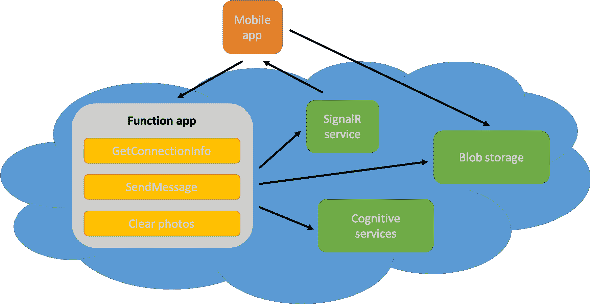
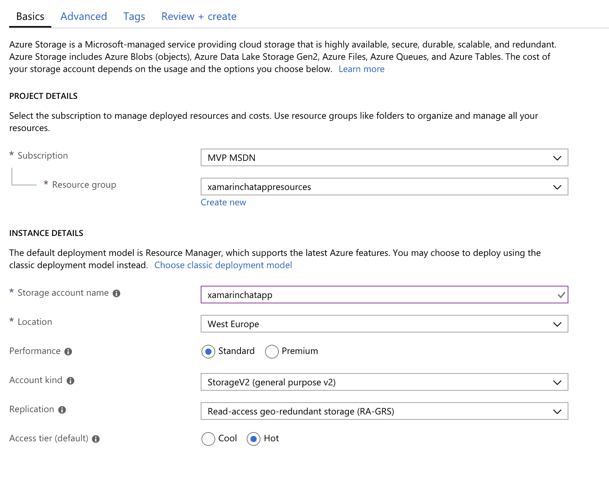
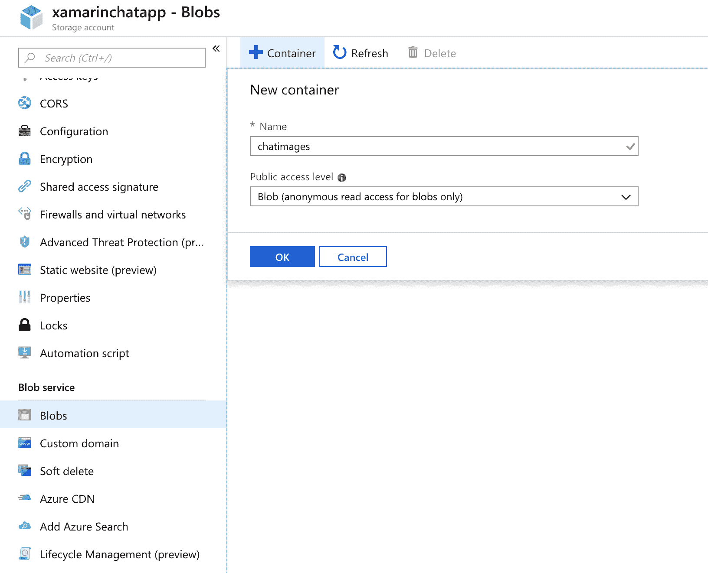
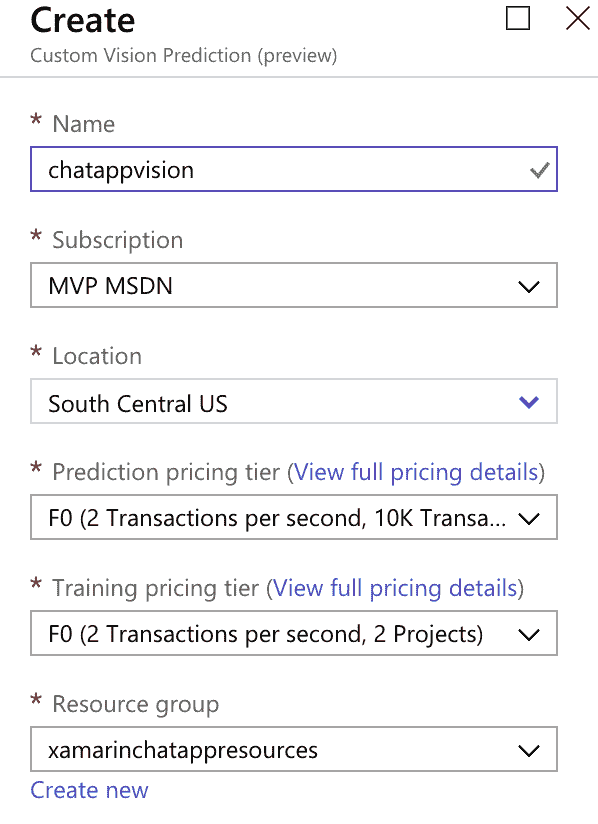
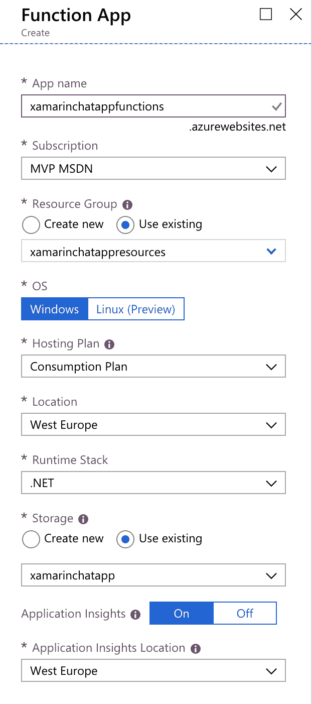
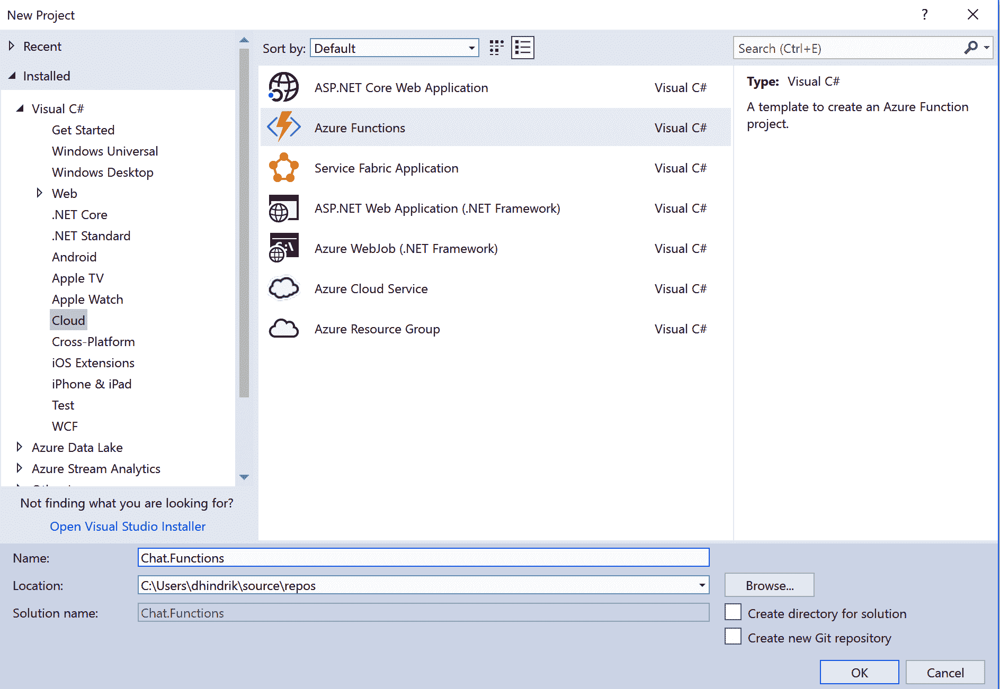
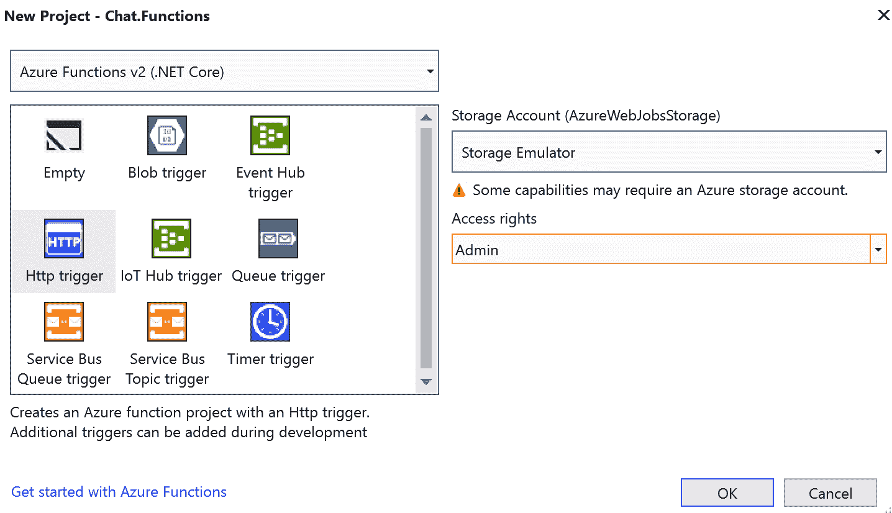
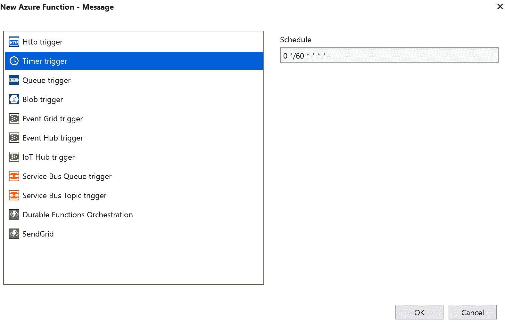
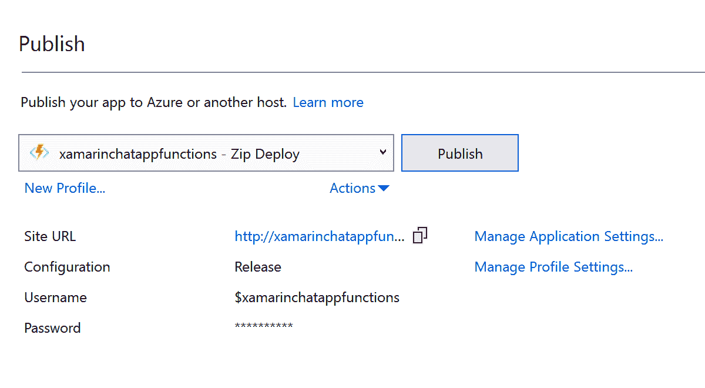

# 第六章：使用 Azure 服务为聊天应用程序设置后端

在本章中，我们将构建一个具有实时通信的聊天应用程序。为此，我们需要一个后端。我们将创建一个后端，可以扩展以处理大量用户，但当用户数量减少时也可以缩小。为了构建该后端，我们将使用基于 Microsoft Azure 服务的无服务器架构。

本章将涵盖以下主题：

+   在 Microsoft Azure 中创建 SignalR 服务

+   使用 Azure 函数作为 API

+   使用 Azure 函数调度作业

+   使用 blob 存储来存储照片

+   使用 Azure 认知服务扫描照片以查找成人内容

# 技术要求

为了能够完成这个项目，您需要安装 Mac 或 PC 上的 Visual Studio。有关如何设置您的环境的更多详细信息，请参阅第一章，*Xamarin 简介*。您还需要一个 Azure 帐户。如果您有 Visual Studio 订阅，每个月都包含特定数量的 Azure 积分。要激活您的 Azure 福利，请转到以下链接：[`my.visualstudio.com`](https://my.visualstudio.com)。

您还可以创建一个免费帐户，在 12 个月内免费使用选定的服务。您将获得价值 200 美元的信用额度，以在 30 天内探索任何 Azure 服务，并且您还可以随时使用免费服务。在以下链接阅读更多信息：[`azure.microsoft.com/en-us/free/`](https://azure.microsoft.com/en-us/free/)。

# Azure 无服务器服务

在我们开始构建具有无服务器架构的后端之前，我们需要定义无服务器实际意味着什么。在无服务器架构中，当然代码将在服务器上运行，但我们不需要担心这一点；我们唯一需要关注的是构建我们的软件。我们让其他人处理与服务器有关的一切。我们不需要考虑服务器需要多少内存或 CPU，甚至我们需要多少服务器。当我们在 Azure 中使用服务时，微软会为我们处理这一切。

# Azure SignalR 服务

**Azure SignalR 服务**是**Microsoft Azure**中用于服务器和客户端之间的实时通信的服务。该服务将向客户端推送内容，而无需他们轮询服务器以获取内容更新。SignalR 可用于多种类型的应用程序，包括移动应用程序、Web 应用程序和桌面应用程序。

如果可用，SignalR 将使用 WebSockets。如果不可用，SignalR 将使用其他通信技术，如**服务器发送事件**（**SSE**）或**长轮询**。SignalR 将检测可用的传输技术并使用它，而开发人员根本不需要考虑这一点。

SignalR 可以在以下示例中使用：

+   **聊天应用程序**：当新消息可用时，应用程序需要立即从服务器获取更新

+   **协作应用程序**：例如，会议应用程序或多个设备上的用户正在使用相同文档时

+   **多人游戏**：所有用户都需要实时更新其他用户的地方

+   **仪表板应用程序**：用户需要实时更新的地方

# Azure 函数

Azure 函数是微软 Azure 的一项服务，允许我们以无服务器的方式运行代码。我们将部署称为**函数**的小代码片段。函数部署在称为**函数应用**的组中。创建函数应用时，我们需要选择是否要在消耗计划或应用服务计划上运行。如果我们希望应用程序完全无服务器化，我们选择消耗计划，而对于应用服务计划，我们必须指定服务器的要求。使用消耗计划，我们支付执行时间和函数使用的内存量。应用服务计划的一个好处是可以配置为始终运行，并且只要不需要扩展到更多实例，就不会有任何冷启动。消耗计划的一个重要好处是它将根据需要的资源进行自动扩展。

函数可以通过多种方式触发运行。两个例子是`HttpTrigger`和`TimeTrigger`。`HttpTrigger`将在调用函数的 HTTP 请求时触发函数运行。使用`TimeTrigger`，函数将按照我们指定的间隔运行。还有其他 Azure 服务的触发器。例如，我们可以配置函数在文件上传到 blob 存储时运行，当新消息发布到事件中心或服务总线时运行，或者在 Azure CosmosDB 中的数据发生变化时运行。

# Azure blob 存储

Azure blob 存储用于存储非结构化数据对象，如图像、视频、音频和文档。对象或 blob 可以组织成容器。Azure 的 Blob 存储可以在多个数据中心进行冗余。这是为了保护数据免受从瞬时硬件故障到网络或电源中断，甚至大规模自然灾害的不可预测事件的影响。Azure 的 Blob 存储可以有不同的层级，取决于我们希望使用存储的对象的频率。这包括存档和冷层，以及热层和高级层，用于需要更频繁访问数据的应用程序。除了 Blob 存储，我们还可以添加**内容交付网络**（**CDN**）以使我们存储的内容更接近我们的用户。如果我们的用户遍布全球，这一点很重要。如果我们可以从更接近用户的地方提供我们的内容，我们可以减少内容的加载时间，并为用户提供更好的体验。

# Azure 认知服务

描述**Azure 认知服务**最简单的方法是它是**机器学习**作为一项服务。只需简单的 API 调用，我们就可以在我们的应用程序中使用机器学习，而无需使用复杂的数据科学技术。当我们使用 API 时，我们正在针对 Microsoft 为我们训练的模型进行预测。

Azure 认知服务的服务已经组织成五个类别：

+   **视觉**：视觉服务涉及图像处理。这包括面部识别、成人内容检测、图像分类和**光学字符识别**（**OCR**）的 API。

+   **知识**：知识服务的一个示例是**问答**（**QnA**）制作者，它允许我们用知识库训练模型。当我们训练了模型，我们可以用它来获取问题的答案。

+   **语言**：语言服务涉及文本理解，如文本分析、语言理解和翻译。

+   **语音**：语音 API 的示例包括说话者识别、语音转文本功能和语音翻译。

+   **搜索**：搜索服务是利用网络搜索引擎的力量来找到问题的答案。这包括从图像中获取知识、搜索查询的自动完成以及相似人员的识别。

# 项目概述

这个项目将是为聊天应用程序设置后端。项目的最大部分将是我们将在 Azure 门户中进行的配置。我们还将为处理 SignalR 连接的 Azure Functions 编写一些代码。将有一个函数返回有关 SignalR 连接的信息，还有一个函数将消息发布到 SignalR 服务。发布消息的函数还将确定消息是否包含图像。如果包含图像，它将被发送到 Azure 认知服务中的 Vision API，以分析是否包含成人内容。如果包含成人内容，它将不会发布到 SignalR 服务，其他用户也不会收到。由于 SignalR 服务有关于消息大小的限制，我们需要将图像存储在 blob 存储中，只需将图像的 URL 发布给用户。因为我们在这个应用程序中不保存任何聊天记录，我们还希望在特定间隔清除 blob 存储。为此，我们将创建一个使用`TimeTrigger`的函数。

以下图显示了此应用程序架构的概述：



完成此项目的估计时间约为两个小时。

# 构建无服务器后端

让我们开始根据前面部分描述的服务来设置后端。

# 创建 SignalR 服务

我们将设置的第一个服务是 SignalR：

1.  转到 Azure 门户：[`portal.azure.com`](https://portal.azure.com)。

1.  创建一个新资源。**SignalR 服务**位于 Web 类别中。

1.  填写表单中的资源名称。

1.  选择要用于此项目的订阅。

1.  我们建议您创建一个新的资源组，并将其用于为此项目创建的所有资源。我们希望使用一个资源组的原因是更容易跟踪与此项目相关的资源，并且更容易一起删除所有资源。

1.  选择一个靠近您的用户的位置。

1.  选择一个定价层。对于这个项目，我们可以使用免费层。我们可以始终在开发中使用免费层，然后扩展到可以处理更多连接的层。参考以下截图：


这就是我们设置 SignalR 服务所需做的一切。我们将在 Azure 门户中返回以获取连接字符串。

# 创建存储帐户

下一步是设置一个存储帐户，我们可以在其中存储用户上传的图像：

1.  创建一个新的存储帐户资源。存储帐户位于存储类别下。

1.  选择订阅和资源组。我们建议您使用与 SignalR 服务相同的订阅和资源组。

1.  给存储帐户命名。

1.  选择一个靠近您的用户的位置。

1.  选择性能选项。如果我们使用高级存储，数据将存储在 SSD 磁盘上。为此项目选择标准存储。

1.  使用 StorageV2 作为帐户类型。

1.  在复制中，我们可以选择我们希望数据在数据中心之间如何复制。

1.  对于访问层，我们将使用热层，因为在这个应用程序中我们需要频繁访问数据。

1.  单击创建+审阅以在创建存储帐户之前审查设置。

1.  单击创建以创建存储帐户：



blob 存储配置的最后一步是转到资源并为聊天图像创建一个容器：

1.  转到资源并选择 Blobs。

1.  创建一个名为`chatimages`的新容器。

1.  将公共访问级别设置为 Blob（仅对 Blob 的匿名读取访问）。这意味着它将具有公共读取访问权限，但您必须获得授权才能上传内容。参考以下截图：



# 创建认知服务

为了能够使用**认知服务**来扫描成人内容的图像，我们需要在 Azure 门户中创建一个资源。这将为我们提供一个在调用 API 时可以使用的密钥：

1.  创建一个新的自定义视觉资源。

1.  给资源命名并选择订阅。

1.  选择一个靠近用户的位置。

1.  为预测和训练选择一个定价层。此应用程序将仅使用预测，因为我们将使用已经训练好的模型。

1.  选择与您为其他资源选择的相同的资源组。

1.  点击“确定”创建新资源。参考以下截图：



我们现在已经完成了创建认知服务。稍后我们将回来获取一个密钥，我们将用它来调用 API。

# 创建函数

我们将在后端编写的所有代码都将是函数。我们将使用 Azure Functions 的第 2 版，它将在.NET Core 之上运行。第 1 版是在完整的.NET 框架之上运行的。

# 创建用于函数的 Azure 服务

在开始编写任何代码之前，我们将创建 Function App。这将在 Azure 门户中包含函数：

1.  创建一个新的 Function App 资源。Function App 在计算类别下找到。

1.  给 Function App 命名。该名称也将成为函数 URL 的起始部分。

1.  为 Function App 选择一个订阅。

1.  为 Function App 选择一个资源组，应该与本章中创建的其他资源相同。

1.  因为我们将使用.NET Core 作为函数的运行时，所以可以在 Windows 和 Linux 上运行它们。但在这种情况下，我们将在 Windows 上运行它们。

1.  我们将使用**消耗计划**作为我们的托管计划，因此我们只支付我们使用的费用。Function App 将根据我们的要求进行上下缩放，而无需我们考虑任何事情，如果我们选择消耗计划。

1.  选择一个靠近用户的位置。

1.  选择.NET 作为运行时堆栈。

1.  对于存储，我们可以创建一个新的存储帐户，或者使用我们在此项目中早期创建的存储帐户。

1.  将应用程序洞察设置为打开，以便我们可以监视我们的函数。

1.  点击“创建”以创建新资源：



# 创建一个函数来返回 SignalR 服务的连接信息

如果愿意，可以在 Azure 门户中创建函数。但我更喜欢使用 Visual Studio，因为代码编辑体验更好，而且可以对源代码进行版本跟踪：

1.  在 Visual Studio 中创建一个 Azure Functions 类型的新项目。这可以在新项目对话框的云选项卡下找到。

1.  将项目命名为`Chat.Functions`。

1.  点击“确定”继续：



下一步是创建我们的第一个函数：

1.  在对话框顶部选择 Azure Functions v2 (.NET Core)。

1.  选择 Http 触发器作为我们第一个函数的触发器。

1.  将**访问权限**从管理员更改为匿名。

1.  点击“确定”继续，我们的函数项目将被创建：



我们的第一个函数将返回 SignalR 服务的连接信息。为此，我们需要通过向 SignalR 服务添加连接字符串来连接函数：

1.  转到 Azure 门户中的 SignalR 服务资源。

1.  转到 Keys 选项卡并复制连接字符串。

1.  转到 Function App 资源并在应用程序设置下添加连接字符串。使用`AzureSignalRConnectionString`作为设置的名称。

1.  将连接字符串添加到 Visual Studio 项目中的`local.settings.json`文件的`Values`数组中，以便能够在开发机器上本地运行函数：

```cs
 {
    "IsEncrypted": false,
    "Values": {
    "AzureWebJobsStorage": "",
    "AzureWebJobsDashboard": ""
    "AzureSignalRConnectionString": "{EnterTheConnectingStringHere}"
   }
 } 
```

现在，我们可以编写将返回连接信息的函数的代码。转到 Visual Studio 并按照以下说明操作：

1.  在函数项目中安装`Microsoft.Azure.WebJobs.Extensions.SignalRService` NuGet 包。该包包含了我们与 SignalR 服务通信所需的类。这是一个预发布包，因此我们必须勾选包含预发布复选框。如果在此过程中出现错误，无法安装该包，请确保您的项目中所有其他包的版本都是最新的，然后重试。

1.  将在创建函数项目时创建的函数重命名为`GetSignalRInfo`。

1.  还要将类重命名为`GetSignalRInfo`。

1.  为了实现与 SignalR 服务的绑定，我们将在函数的方法中添加一个`SignalRConnectionInfo`类型的参数。该参数还将具有`SignalRConnectionInfo`属性，指定`HubName`，如下代码所示。

1.  返回连接信息参数：

```cs
using Microsoft.AspNetCore.Http;
using Microsoft.Azure.WebJobs;
using Microsoft.Azure.WebJobs.Extensions.Http;
using Microsoft.Azure.WebJobs.Extensions.SignalRService;

    [FunctionName("GetSignalRInfo")]
    public static SignalRConnectionInfo GetSignalRInfo(
    [HttpTrigger(AuthorizationLevel.Anonymous)] HttpRequest req,
    [SignalRConnectionInfo(HubName = "chat")] SignalRConnectionInfo   
    connectionInfo)
{
    return connectionInfo;
}
```

# 创建一个消息库

我们现在将定义一些消息类，我们将用它们来发送聊天消息。我们将创建一个基本消息类，其中包含所有类型消息共享的信息。我们还将创建一个消息的独立项目，它将是一个.NET 标准库。我们之所以将它创建为一个独立的.NET 标准库，是因为我们可以在下一章中构建的应用程序中重用它。

1.  创建一个新的.NET 标准 2.0 项目，命名为`Chat.Messages`。

1.  在`Chat.Functions`项目中添加对`Chat.Messages`的引用。

1.  在`Chat.Messages`项目中创建一个新类，命名为`Message`。

1.  向`Message`类添加一个`TypeInfo`属性。我们在第七章中需要这个属性，*构建实时聊天应用程序*，当我们进行消息序列化时。

1.  添加一个名为`Id`的字符串类型的属性。

1.  添加一个`DateTime`类型的`Timestamp`属性。

1.  添加一个`string`类型的`Username`属性。

1.  添加一个空的构造函数。

1.  添加一个以用户名为参数的构造函数。

1.  将所有属性的值设置如下代码所示：

```cs
public class Message
{
    public Type TypeInfo { get; set; }
    public string Id {get;set;}
    public string Username { get; set; }
    public DateTime Timestamp { get; set; }

    public Message(){}
    public Message(string username)
    {
        Id = Guid.NewGuid().ToString();
        TypeInfo = GetType();
        Username = username;
        Timestamp = DateTime.Now;
    }
}
```

当新客户端连接时，将向其他用户发送一条消息，指示他们已连接：

1.  创建一个名为`UserConnectedMessage`的新类。

1.  将`Message`作为基类。

1.  添加一个空的构造函数。

1.  添加一个以用户名为参数的构造函数，并将其发送到基类的构造函数，如下代码所示：

```cs
public class UserConnectedMessage : Message
{
    public UserConnectedMessage() { }
    public UserConnectedMessage(string username) : base(username) { }
} 
```

当客户端发送带有文本的消息时，它将发送一个`SimpleTextMessage`：

1.  创建一个名为`SimpleTextMessage`的新类。

1.  将`Message`作为基类。

1.  添加一个空的构造函数。

1.  添加一个以用户名为参数的构造函数，并将其发送到基类的构造函数。

1.  添加一个名为`Text`的字符串属性。参考以下代码：

```cs
public class SimpleTextMessage : Message
{
    public SimpleTextMessage(){}
    public SimpleTextMessage(string username) : base(username){} 
    public string Text { get; set; }
} 
```

如果用户上传了一张图片，它将作为`base64`字符串发送到函数：

1.  创建一个名为`PhotoMessage`的新类。

1.  将`Message`作为基类。

1.  添加一个空的构造函数。

1.  添加一个以用户名为参数的构造函数，并将其发送到基类的构造函数。

1.  添加一个名为`Base64Photo`的字符串属性。

1.  添加一个名为`FileEnding`的字符串属性，如下代码片段所示：

```cs
public class PhotoMessage : Message
{
    public PhotoMessage() { }
    public PhotoMessage(string username) : base(username) { }

    public string Base64Photo { get; set; }
    public string FileEnding { get; set; }
} 
```

我们将创建的最后一个消息用于向用户发送有关照片的信息：

1.  创建一个名为`PhotoUrlMessage`的新类。

1.  将`Message`作为基类。

1.  添加一个空的构造函数。

1.  添加一个以用户名为参数的构造函数，并将其发送到基类的构造函数。

1.  添加一个名为`Url`的字符串属性。参考以下代码：

```cs
public class PhotoUrlMessage : Message
{
    public PhotoUrlMessage() {}
    public PhotoUrlMessage(string username) : base(username){}

    public string Url { get; set; }
} 
```

# 创建存储助手

我们将创建一个辅助程序，以便在我们将为 Azure Blob Storage 编写的一些代码之间共享发送消息函数和我们将创建的清除照片函数。在 Azure 门户中创建 Function App 时，会创建一个用于连接字符串的设置，因此我们只需将其添加到`local.settings.json`文件中，以便能够在本地运行它。连接字符串的名称将是`StorageConnection`：

```cs
 {
     "IsEncrypted": false,
     "Values": {
     "AzureWebJobsStorage": "",
     "AzureWebJobsDashboard": "",
     "AzureSignalRConnectionString": "{EnterTheConnectingStringHere}"
     "StorageConnection": "{EnterTheConnectingStringHere}"
   }
 } 
```

对于辅助程序，我们将创建一个新的静态类，如下所示：

1.  在`Chat.Functions`项目中安装`WindowsAzure.Storage NuGet`包。这是为了获得我们需要与存储一起使用的类。

1.  在`Chat.Functions`项目中创建一个名为`StorageHelper`的新类。

1.  将类`static`。

1.  创建一个名为`GetContainer`的新静态方法。

1.  使用`Environment`类上的静态`GetEnviromentVariable`方法读取存储的连接字符串。

1.  使用静态`Parse`方法在`CloudStorageAccount`上创建一个`CloudStorageAccount`对象。

1.  使用`CloudStorageAccount`类上的`CreateCloudBlobClient`方法创建一个新的`CloudBlobClient`。

1.  使用`CloudBlobClient`类上的`GetContainerReference`方法获取容器引用，并将我们在本章中早期创建的容器的名称作为参数传递：

```cs
using Microsoft.WindowsAzure.Storage;
using Microsoft.WindowsAzure.Storage.Blob;
using System;
using System.IO;
using System.Threading.Tasks;

public static class StorageHelper
{

    private static CloudBlobContainer GetContainer()
    {    
        string storageConnectionString =  
        Environment.GetEnvironmentVariable("StorageConnection");
        var storageAccount =   
        CloudStorageAccount.Parse(storageConnectionString);
        var blobClient = storageAccount.CreateCloudBlobClient();

        var container = 
        blobClient.GetContainerReference("chatimages");

        return container;
    } 
}
```

为了将文件上传到 blob 存储，我们将创建一个具有照片的字节和照片类型的方法。照片类型将由其文件结束定义：

1.  创建一个新的`async static`方法，返回`Task<string>`。

1.  向方法添加一个`byte[]`和一个`string`参数。将参数命名为`bytes`和`fileEnding`。

1.  调用`GetContainer`方法获取对容器的引用。

1.  为新的 blob 定义一个文件名，并将其作为参数传递给`CloudBlobContainer`类中的`GetBlockBlobReference`。使用`GUID`作为文件名，以确保其唯一性。

1.  使用字节创建一个`MemoryStream`。

1.  使用`BlockBlobReference`类上的`UploadFromStreamAsync`方法将照片上传到云端。

1.  返回 blob 的`AbsoluteUri`：

```cs
public static async Task<string> Upload(byte[] bytes, string fileEnding)
{
  var container = GetContainer();
  var blob = container.GetBlockBlobReference($"  
  {Guid.NewGuid().ToString()}.{fileEnding}");

  var stream = new MemoryStream(bytes);
  await blob.UploadFromStreamAsync(stream);

  return blob.Uri.AbsoluteUri;
} 
```

我们将添加到辅助程序的第二个公共方法是一个方法，用于删除所有早于一小时的照片：

1.  创建一个名为`Clear`的新的`async static`方法，返回`Task`。

1.  使用`GetContainer`方法获取对容器的引用。

1.  通过调用`ListBlobsSegmentedAsync`方法并使用以下代码中显示的参数获取容器中的所有 blob。

1.  循环遍历所有`CloudBlob`类型的 blob。

1.  添加一个`if`语句来检查照片是否是一个小时前创建的。如果是，则应删除 blob：

```cs
public static async Task Clear()
{
    var container = GetContainer();
    var blobList = await 
    container.ListBlobsSegmentedAsync(string.Empty, false, 
    BlobListingDetails.None, int.MaxValue, null, null, null);

    foreach(var blob in blobList.Results.OfType<CloudBlob>())
    {
        if(blob.Properties.Created.Value.AddHours(1) < DateTime.Now)
        {
            await blob.DeleteAsync();
        }
    }
} 
```

# 创建一个发送消息的函数

为了处理用户发送的消息，我们将创建一个新函数：

1.  创建一个带有`HttpTrigger`和匿名访问权限的函数。

1.  将函数命名为`Messages`。

1.  添加一个`SignalRMessage`集合，如下所示。

1.  使用`SignalR`属性指定 hub 名称：

```cs
[FunctionName("Messages")]
  public async static Task SendMessages(
    [HttpTrigger(AuthorizationLevel.Anonymous, "post")] object 
     message,
    [SignalR(HubName = "chat")] IAsyncCollector<SignalRMessage>    
     signalRMessages)
  { 
```

消息参数将是用户发送的消息。它将是`JObject`类型（来自`Newtonsoft.Json`）。我们需要将其转换为我们之前创建的`Message`类型。为此，我们需要添加对`Chat.Messages`项目的引用。但是，因为参数是对象类型，我们首先需要将其转换为`JObject`。一旦我们做到这一点，我们就可以使用`ToObject`方法获得`Message`：

```cs
var jsonObject = (JObject)message;
var msg = jsonObject.ToObject<Message>();
```

如果消息是`PhotoMessage`，我们将把照片上传到 blob 存储。所有其他消息将直接使用`signalRmessages`参数上的`AddAsync`方法发送到 SignalR 服务：

```cs
if (msg.TypeInfo.Name == nameof(PhotoMessage))
{
    //ToDo: Upload the photo to blob storage.
}

await signalRMessages.AddAsync(new SignalRMessage
  {
    Target = "newMessage",
    Arguments = new[] { message }
 }); 
```

在使用我们创建的辅助程序将照片上传到 blob 存储之前，我们需要将`base64`字符串转换为`byte[]`：

1.  使用`Converter`类上的静态`FromBase64String`方法将`base64`字符串转换为`byte[]`。

1.  使用`StorageHelper`上的静态`Upload`方法将照片上传到 blob 存储。

1.  创建一个新的`PhotoUrlMessage`，将用户名传递给构造函数，并将其设置为`msg`变量的值。

1.  将`Timestamp`属性设置为原始消息的值，因为我们对用户创建消息的时间感兴趣。

1.  将`Id`属性设置为原始消息的值，以便在客户端上将其处理为相同的消息。

1.  将`Url`属性设置为`StorageHelper`上传照片时返回的 URL。

1.  在`signalRMessages`变量上使用`AddAsync`方法向 SignalR 服务发送消息。

1.  添加一个空的返回语句：

```cs
if (msg.TypeInfo.Name == nameof(PhotoMessage))
{
    var photoMessage = jsonObject.ToObject<PhotoMessage>(); 
    var bytes = Convert.FromBase64String(photoMessage.Base64Photo);
    var url = await StorageHelper.Upload(bytes, 
    photoMessage.FileEnding);
 msg = new PhotoUrlMessage(photoMessage.Username)
 {
        Id = photoMessage.Id,
 Timestamp = photoMessage.Timestamp,
 Url = url
 }; await signalRMessages.AddAsync(new SignalRMessage
                                   {
                                    Target = "newMessage",
                                    Arguments = new[] { message }
                                    }); 
    return;
}
```

# 使用计算机视觉 API 扫描成人内容

为了最大程度地减少在我们的聊天中显示冒犯性照片的风险，我们将使用机器学习来尝试查找问题材料并防止其发布到聊天中。为此，我们将在 Azure 中使用**计算机视觉 API**，这是**Azure 认知服务**的一部分。要使用 API，我们需要一个密钥。我们将把它添加到功能应用程序的应用程序设置中：

1.  转到 Azure 门户。

1.  转到我们为 Custom Vision API 创建的资源。

1.  密钥可以在“密钥”选项卡下找到。您可以使用 Key 1 或 Key 2。

1.  转到“功能应用程序”的资源。

1.  将密钥作为名为`ComputerVisionKey`的应用程序设置添加。还要将密钥添加到`local.settings.json`中。

1.  还要将 Endpoint 添加为应用程序设置。使用名称`ComputerVisionEndpoint`。可以在功能应用程序资源的“概述”选项卡下找到 Endpoint。还要将 Endpoint 添加到`local.settings.json`中。

1.  在 Visual Studio 的`Chat.Functions`项目中安装`Microsoft.Azure.CognitiveServices.Vision.ComputerVision` NuGet 包。这是为了获取使用计算机视觉 API 所需的类。

1.  调用计算机视觉 API 的代码将被添加到`Message`函数中。之后，我们将把`base 64`字符串转换为`byte[]`。

1.  基于字节数组创建一个`MemoryStream`。

1.  按照以下代码中所示创建`ComputerVisonClient`并将凭据传递给构造函数。

1.  创建我们在分析照片时将使用的功能列表。在这种情况下，我们将使用`VisualFeatureTypes.Adult`功能。

1.  在`ComputerVisionClient`上使用`AnalyzeImageInStreamAsync`方法，并将流和功能列表传递给构造函数以分析照片。

1.  如果结果是`IsAdultContent`，则使用空的返回语句停止函数的执行：

```cs
var stream = new MemoryStream(bytes); 
  var subscriptionKey =   
  Environment.GetEnvironmentVariable("ComputerVisionKey");
  var computerVision = new ComputerVisionClient(new   
  ApiKeyServiceClientCredentials(subscriptionKey), new 
  DelegatingHandler[] { });

  computerVision.Endpoint =   
  Environment.GetEnvironmentVariable("ComputerVisionEndpoint");

  var features = new List<VisualFeatureTypes>() { 
  VisualFeatureTypes.Adult };

  var result = await   
  computerVision.AnalyzeImageInStreamAsync(stream, features);

if (result.Adult.IsAdultContent)
{
    return;
} 
```

# 创建一个定期清除存储中照片的计划作业

我们要做的最后一件事是定期清理 blob 存储并删除超过一小时的照片。我们将通过创建一个由`TimeTrigger`触发的函数来实现这一点：

1.  要创建新函数，请右键单击`Chat.Functions`项目，然后单击“新的 Azure 函数”，该选项将在“添加”菜单下找到。

1.  将函数命名为`ClearPhotos`。

1.  选择函数将使用时间触发器，因为我们希望它按时间间隔运行。

1.  使用时间表达式将 Schedule 设置为`0 */60 * * * *`，使其每 60 分钟运行一次：



在`ClearPhotos`函数中，我们唯一要做的是调用本章前面创建的`StorageHelper`的`Clear`方法：

```cs
[FunctionName("ClearPhotos")]
  public static async Task Run(
    [TimerTrigger("0 */60 * * * *")]TimerInfo myTimer, ILogger log)
{
    await StorageHelper.Clear();
} 
```

# 将函数部署到 Azure

本章的最后一步是将函数部署到 Azure。您可以将其作为 CI/CD 流水线的一部分来完成，例如使用 Azure DevOps。但在这种情况下，将函数直接从 Visual Studio 部署是最简单的方法。按照以下步骤部署函数：

1.  右键单击`Chat.Functions`项目，然后选择发布。

1.  选择“选择现有选项”。还要勾选“从包文件运行”选项。

1.  单击“创建配置文件”按钮。

1.  登录到与我们在创建功能应用程序时在 Azure 门户中使用的相同的 Microsoft 帐户。

1.  选择包含函数应用程序的订阅。我们在订阅中拥有的所有函数应用程序现在将被加载。

1.  选择函数应用程序，然后点击“确定”。

1.  创建配置文件后，点击“发布”按钮。

以下截图显示了最后一步。之后，发布配置文件被创建：



# 总结

在本章中，我们已经学习了如何为实时通信设置无服务器后端，使用 Azure Functions 和 Azure SignalR 服务。我们还学习了如何使用 blob 存储和 Azure 认知服务中的机器学习来扫描照片中的成人内容。

在下一章中，我们将构建一个聊天应用程序，该应用程序将使用我们在本项目中构建的后端。
