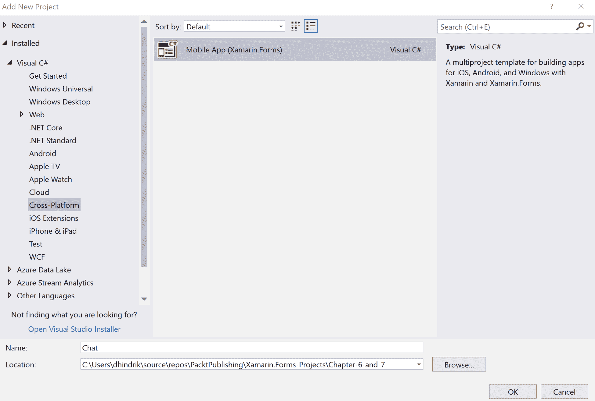
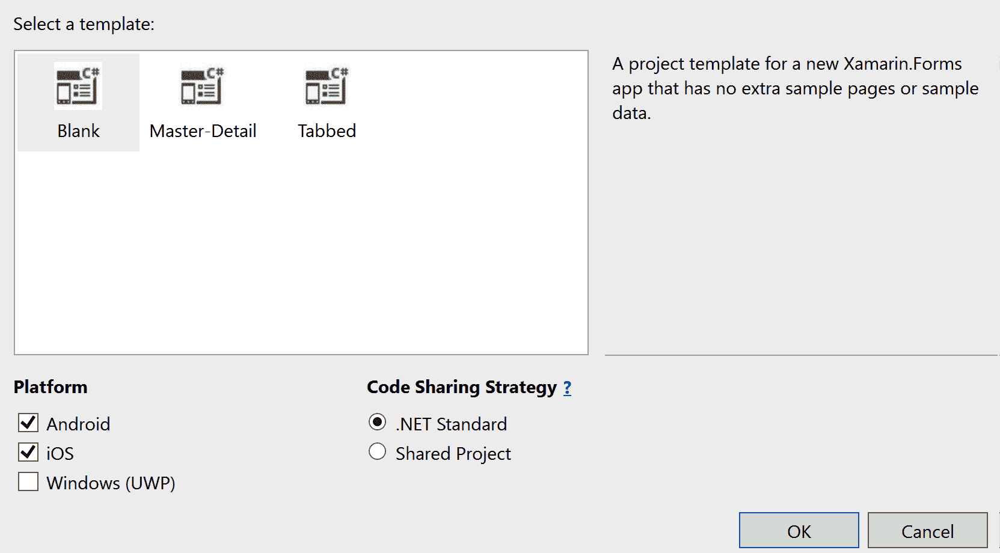

# 第七章：构建实时聊天应用程序

在本章中，我们将构建一个具有实时通信的聊天应用程序。在该应用程序中，您将能够向其他用户发送和接收消息和照片，而无需刷新页面即可看到消息。我们将看看如何使用 SignalR 实现与服务器的实时连接。

本章将涵盖以下主题：

+   如何在 Xamarin.Forms 应用程序中使用 SignalR

+   如何为 ListView 使用模板选择器

+   如何在 Xamarin.Forms 应用程序中使用 CSS 样式

# 技术要求

在构建此项目的应用程序之前，您需要构建我们在第六章*，使用 Azure 服务为聊天应用程序设置后端*中详细说明的后端。您还需要安装 Visual Studio for Mac 或 PC，以及 Xamarin 组件。有关如何设置环境的更多详细信息，请参阅第一章，*Xamarin 简介*。本章的源代码可在 GitHub 存储库中找到，网址为[`github.com/PacktPublishing/Xamarin.Forms-Projects/tree/master/Chapter-6-and-7`](https://github.com/PacktPublishing/Xamarin.Forms-Projects/tree/master/Chapter-6-and-7)。

# 项目概述

在构建聊天应用程序时，实时通信非常重要，因为用户期望消息能够几乎立即到达。为了实现这一点，我们将使用 SignalR，这是一个用于实时通信的库。SignalR 将使用 WebSockets（如果可用），如果不可用，它将有几种备用选项可以使用。在该应用程序中，用户将能够从设备的照片库发送文本和照片。

该项目的构建时间约为 180 分钟。

# 入门

我们可以使用 PC 上的 Visual Studio 2017 或 Mac 上的 Visual Studio 来完成此项目。要使用 Visual Studio 在 PC 上构建 iOS 应用程序，您必须连接 Mac。如果根本没有 Mac，您可以选择仅构建应用程序的 Android 部分。

# 构建聊天应用程序

现在是时候开始构建应用程序了。我们建议您使用与第六章相同的方法，*使用 Azure 服务为聊天应用程序设置后端*，因为这将使代码共享更容易。在该解决方案中，创建一个名为`Chat`的移动应用程序（Xamarin.Forms）：



选择空白模板，并将.NET Standard 作为代码共享策略。选择 iOS 和 Android 作为平台。创建项目后，我们将更新所有 NuGet 包到最新版本，因为项目模板的更新频率不如模板内部使用的包频繁：



# 创建聊天服务

我们将首先创建一个聊天服务，该服务将被 iOS 和 Android 应用程序共同使用。为了使代码更易于测试，并且在将来想要使用其他提供程序替换聊天服务更容易，我们将按照以下步骤进行：

1.  在`Chat`项目中，添加对`Chat.Messages`项目的引用。

1.  在`Chat`项目中创建一个名为`Services`的新文件夹。

1.  在`Services`文件夹中创建一个名为`IChatService`的新接口。

1.  创建一个名为`IsConnected`的`bool`属性。

1.  创建一个名为`SendMessage`的方法，该方法以`Message`作为参数并返回`Task`。

1.  创建一个名为`CreateConnection`的方法，返回`Task`。该方法将创建并启动与 SignalR 服务的连接。

1.  创建一个名为`Dispose`的方法，返回`Task`。当应用程序进入休眠状态时，将使用该方法来确保与 SignalR 服务的连接被正确关闭：

```cs
using Chat.Events;
using Chat.Messages;
using System;
using System.Threading.Tasks;

namespace Chat.Services
{
    public interface IChatService
    {        
        bool IsConnected { get; }

        Task CreateConnection();
        Task SendMessage(Message message);
        Task Dispose();
    }     
}
```

该接口还将包含一个事件，但在将事件添加到接口之前，我们将创建一个`EventArgs`类，该事件将使用。我们将按照以下步骤进行：

1.  在`Chat`项目中，创建一个名为`Events`的新文件夹。

1.  在`Events`文件夹中创建一个名为`NewMessageEventArgs`的新类。

1.  将`EventArgs`添加为基类。

1.  创建一个名为`Message`的`Message`类型的属性，具有公共 getter 和私有 setter。

1.  创建一个空的构造函数。

1.  创建一个带有`Message`参数的构造函数。

1.  将构造函数的参数设置为`Message`属性。

以下代码是这些步骤的结果：

```cs
using Chat.Messages;
using System;
namespace Chat.Events
{
    public class NewMessageEventArgs : EventArgs
    {
        public Message Message { get; private set; }

        public NewMessageEventArgs(Message message)
        {
            Message = message;
        }
    } 
}
```

现在我们已经创建了一个新的`EventArgs`类，我们可以使用它并在接口中添加一个事件。我们将事件命名为`NewMessage`：

```cs
public interface IChatService
{
 event EventHandler<NewMessageEventArgs> NewMessage;

    bool IsConnected { get; }

    Task CreateConnection();
    Task SendMessage(Message message);
    Task Dispose();
} 
```

在服务中，我们将首先调用`GetSignalRInfo`服务，该服务是我们在第六章中创建的，*使用 Azure 服务为聊天应用程序设置后端*，以获取有关如何连接到 SignalR 服务的信息。为了序列化该信息，我们将创建一个新类：

1.  在`Chat`项目中，创建一个名为`Models`的新文件夹。

1.  创建一个名为`ConnectionInfo`的新类。

1.  为`string`添加一个名为`Url`的字符串属性。

1.  为`string`添加一个名为`AccessToken`的字符串属性：

```cs
public class ConnectionInfo
{
   public string Url { get; set; }
   public string AccessToken { get; set; }
} 
```

现在我们有了接口和一个用于获取连接信息的模型，是时候创建`IChatService`接口的实现了。要使用 SignalR，我们需要添加一个 NuGet 包，它将为我们提供必要的类。请按照以下步骤操作：

1.  在`Chat`项目中，安装 NuGet 包`Microsoft.AspNetCore.SignalR.Client`。

1.  在`Services`文件夹中，创建一个名为`ChatService`的新类。

1.  将`IChatService`接口添加并实现到`ChatService`中。

1.  为`HttpClient`添加一个名为`httpClient`的私有字段。

1.  为`HubConnection`添加一个名为`hub`的私有字段。

1.  为`SemaphoreSlim`添加一个名为`semaphoreSlim`的私有字段，并在构造函数中使用初始计数和最大计数为 1 创建一个新实例：

```cs
using Chat.Events;
using Chat.Messages;
using Microsoft.AspNetCore.SignalR.Client;
using Newtonsoft.Json;
using System;
using System.Net.Http;
using System.Text;
using System.Threading;
using System.Threading.Tasks;

public class ChatService : IChatService
{
    private HttpClient httpClient;
    private HubConnection hub;
    private SemaphoreSlim semaphoreSlim = new SemaphoreSlim(1, 1);     

    public event EventHandler<NewMessageEventArgs> NewMessage;
    public bool IsConnected { get; set; }

    public async Task CreateConnection() 
    {
    }

    public async Task SendMessage(Message message) 
    {
    }

    public async Task Dispose()
    {
    } 
}
```

我们将从`CreateConnection`开始，它将调用`GetSignalRInfo`函数。然后我们将使用这些信息连接到 SignalR 服务并开始监听消息。为此，请执行以下步骤：

1.  调用`SemaphoreSlim`的`WaitAsync`方法，以确保一次只有一个线程可以使用该方法。

1.  检查`httpClient`是否为`null`。如果是，创建一个新实例。我们将重用`httpClient`的实例，因为从性能的角度来看这样做更好。

1.  调用`GetSignalRInfo`并将结果序列化为`ConnectionInfo`对象：

```cs
public async Task CreateConnection()
{
    await semaphoreSlim.WaitAsync();

 if(httpClient == null)
 { 
 httpClient = new HttpClient();
 }

 var result = await     httpClient.GetStringAsync("https://{theNameOfTheFunctionApp}.azurewebsites.net/api/GetSignalRInfo");

 var info = JsonConvert.DeserializeObject<Models.ConnectionInfo>
    (result); 
}
```

当我们有关于如何连接到 SignalR 服务的信息时，我们可以使用`HubConnectionBuilder`来创建一个连接。然后我们可以开始监听消息：

1.  创建一个新的`HubConnectionBuilder`。

1.  使用`WithUrl`方法指定 SignalR 服务的 URL 作为第一个参数。第二个参数是`HttpConnectionObject`类型的`Action`。这意味着您将获得一个`HttpConnectionObject`类型的对象作为参数。

1.  在操作中，将`AccessTokenProvider`设置为一个返回`ConnectionInfo`对象上`AccessToken`属性值的`Func`。

1.  使用`HubConnectionBuilder`的`Build`方法创建一个连接对象。

1.  使用`HubConnection`对象上的`On<object>`方法添加一个在新消息到达时运行的`Action`。将该操作指定为第二个参数。对于第一个参数，我们将指定目标的名称（在第六章中指定了目标，*使用 Azure 服务为聊天应用程序设置后端*，当我们发送消息时），即`newMessage`。

1.  在`Action`中，使用`ToString`方法将传入的消息转换为字符串，并将其反序列化为`Message`对象，以便读取其`TypeInfo`属性。为此，使用`JsonConvert`类和`DeserializeObject<Message>`方法。

我们必须两次反序列化对象的原因是，第一次我们只能得到`Message`类中属性的值。当我们知道我们收到的`Message`的哪个子类时，我们可以使用这个来为该类反序列化信息。我们将其转换为`Message`，以便将其传递给`NewMessageEventArgs`对象。在这种情况下，我们不会丢失子类的属性。要访问属性，我们只需将类转换回子类。

1.  当我们知道消息的类型时，我们可以使用这个来将对象反序列化为实际类型。使用`JsonConvert`的`DeserializeObject`方法，并将 JSON 字符串和`TypeInfo`传递给它，然后将其转换为`Message`。

1.  调用`NewMessage`事件，并将`ChatService`的当前实例和一个新的`NewMessageEventArgs`对象传递给它。将`Message`对象传递给`NewMessageEventArgs`的构造函数。

1.  一旦我们有了连接对象，并且配置了消息到达时会发生什么，我们将开始使用`HubConnection`的`StartAsync`方法来监听消息。

1.  将`IsConnected`属性设置为`true`。

1.  使用`SemaphoreSlim`的`Release`方法让其他线程进入`CreateConnection`方法：

```cs
var connectionBuilder = new HubConnectionBuilder();
connectionBuilder.WithUrl(info.Url, (Microsoft.AspNetCore.Http.Connections.Client.HttpConnectionOptions obj) =>
    {
        obj.AccessTokenProvider = () => Task.Run(() => 
        info.AccessToken);
    });

hub = connectionBuilder.Build();
hub.On<object>("newMessage", (message) =>
{
     var json = message.ToString();
     var obj = JsonConvert.DeserializeObject<Message>(json);
     var msg = (Message)JsonConvert.DeserializeObject(json, 
     obj.TypeInfo);
     NewMessage?.Invoke(this, new NewMessageEventArgs(msg));
});

await hub.StartAsync();

IsConnected = true;
semaphoreSlim.Release();
```

实现的下一个方法是`SendMessage`方法。这将向 Azure 函数发送消息，该函数将将消息添加到 SignalR 服务：

1.  使用`JsonConvert`类的`Serialize`方法将`Message`对象序列化为 JSON。

1.  创建一个`StringContent`对象，并将 JSON 字符串作为第一个参数，`Encoding.UTF8`作为第二个参数，内容类型`application/json`作为最后一个参数传递给构造函数。

1.  使用`HttpClient`对象的`PostAsync`方法，将 URL 作为第一个参数，`StringContent`对象作为第二个参数，将消息发布到函数：

```cs
public async Task SendMessage(Message message)
{
    var json = JsonConvert.SerializeObject(message);

    var content = new StringContent(json, Encoding.UTF8, 
    "application/json");

    await 
    httpClient.PostAsync
("https://{TheNameOfTheFunctionApp}.azurewebsites.net/api/messages"
content);
} 
```

实现的最后一个方法是`Dispose`方法。这将在应用程序进入后台状态时关闭连接，例如当用户按下主页按钮或切换应用程序时：

1.  使用`WaitAsync`方法确保在运行该方法时没有线程尝试创建连接或释放连接。

1.  添加一个`if`语句，以确保`hub`字段不为`null`。

1.  如果不为空，调用`HubConnection`的`StopAsync`方法和`DisposeAsync`方法。

1.  将`httpClient`字段设置为`null`。

1.  将`IsConnected`设置为`false`。

1.  使用`Release`方法释放`SemaphoreSlim`：

```cs
public async Task Dispose()
{
    await semaphoreSlim.WaitAsync();

    if(hub != null)
    {
        await hub.StopAsync();
        await hub.DisposeAsync();
    }

    httpClient = null;

    IsConnected = false;

    semaphoreSlim.Release();
} 
```

# 初始化应用程序

现在我们准备为应用程序编写初始化代码。我们将设置**控制反转**（**IoC**）并进行必要的配置。

# 创建一个解析器

我们将创建一个辅助类，以便通过 Autofac 轻松解析对象图的过程。这将帮助我们基于配置的 IoC 容器创建类型。在这个项目中，我们将使用`Autofac`作为 IoC 库：

1.  在`Chat`项目中安装`NuGet`包`Autofac`。

1.  在`Chat`项目中创建一个名为`Resolver`的新类。

1.  添加一个名为`container`的`IContainer`类型（来自`Autofac`）的`private static`字段。

1.  添加一个名为`Initialize`的公共静态方法，带有`IContainer`作为参数。将参数的值设置为容器字段。

1.  添加一个名为`Resolve`的通用静态公共方法，它将返回一个基于参数类型的实例，使用`IContainer`的`Resolve`方法：

```cs
using Autofac;

public class Resolver
{
     private static IContainer container;

     public static void Initialize(IContainer container)
{
          Resolver.container = container;
     }

     public static T Resolve<T>()
     {
          return container.Resolve<T>();
     }
} 
```

# 创建一个 Bootstrapper

在这里，我们将创建一个`Bootstrapper`类，用于在应用程序启动阶段设置我们需要的常见配置。通常，Bootstrapper 的每个目标平台都有一个部分，所有平台都有一个共享部分。在这个项目中，我们只需要共享部分：

1.  在`Chat`项目中创建一个名为`Bootstrapper`的新类。

1.  添加一个名为`Init`的新的公共静态方法。

1.  创建一个新的`ContainerBuilder`并将类型注册到`container`。

1.  使用`ContainerBuilder`的`Build`方法创建一个`Container`。创建一个名为`container`的变量，它应该包含`Container`的实例。

1.  在`Resolver`上使用`Initialize`方法，并将`container`变量作为参数传递，如下所示：

```cs
using Autofac;
using Chat.Chat;
using System;
using System.Reflection;

public class Bootstrapper
{
     public static void Init()
     {
            var builder = new ContainerBuilder();

             builder.RegisterType<ChatService>().As<IChatService>
             ().SingleInstance();

             var currentAssembly = Assembly.GetExecutingAssembly();

             builder.RegisterAssemblyTypes(currentAssembly)
                      .Where(x => x.Name.EndsWith("View", 
                      StringComparison.Ordinal));

             builder.RegisterAssemblyTypes(currentAssembly)
                     .Where(x => x.Name.EndsWith("ViewModel", 
                     StringComparison.Ordinal));

             var container = builder.Build();

             Resolver.Initialize(container); 
     }
} 
```

在`App.xaml.cs`文件中，在调用`InitializeComponents`之后，在构造函数中调用`Bootstrapper`的`Init`方法：

```cs
public App()
{
    InitializeComponent();
    Bootstrapper.Init();
    MainPage = new MainPage();
} 
```

# 创建基本 ViewModel

我们现在有一个负责处理与后端通信的服务。是时候创建一个视图模型了。但首先，我们将创建一个基本视图模型，其中可以放置在应用程序的所有视图模型之间共享的代码：

1.  创建一个名为`ViewModels`的新文件夹。

1.  创建一个名为`ViewModel`的新类。

1.  将新类设置为 public 和 abstract。

1.  添加一个名为`Navigation`的`INavigation`类型的静态字段。这将用于存储 Xamarin.Forms 提供的导航服务的引用。

1.  添加一个名为`User`的`string`类型的静态字段。该字段将在连接到聊天服务时使用，以便您发送的消息将显示您的名称。

1.  添加并实现`INotifiedPropertyChanged`接口。这是必要的，因为我们想要使用数据绑定。

1.  添加一个`Set`方法，这样我们就可以更容易地从`INotifiedPropertyChanged`接口中触发`PropertyChanged`事件。该方法将检查值是否已更改。如果已更改，它将触发事件：

```cs
using System.Collections.Generic;
using System.ComponentModel;
using System.Runtime.CompilerServices;
using Xamarin.Forms;

public abstract class ViewModel : INotifyPropertyChanged
{
     public static INavigation Navigation { get; set; }
     public static string User { get; set; } 

     public event PropertyChangedEventHandler PropertyChanged; 
     protected void Set<T>(ref T field, T newValue, 
                           [CallerMemberName] string propertyName = 
                           null)
     {
          if (!EqualityComparer<T>.Default.Equals(field, newValue))
          {
               field = newValue;
               PropertyChanged?.Invoke(this, new 
               PropertyChangedEventArgs(propertyName));
          }
     }
} 
```

# 创建 MainView

现在我们已经设置好了`ViewModel`基类，并且已经编写了接收和发送消息的所有代码，是时候创建两个视图了。这些将充当应用程序的用户界面。

我们将从创建主视图开始。这是用户启动应用程序时将显示的视图。我们将添加一个输入控件（输入文本框），以便用户可以输入用户名，并添加一个命令以导航到聊天视图。

主视图将由以下内容组成：

+   一个名为`MainViewModel.cs`的 ViewModel 文件

+   一个名为`MainView.xaml`的 XAML 文件，其中包含布局

+   一个名为`MainView.xaml.cs`的代码后台文件，将执行数据绑定

让我们从为`MainView`创建`ViewModel`开始。

# 创建 MainViewModel

我们即将创建的`MainViewModel`将保存用户将在 UI 中输入的用户名。它还将包含一个名为`Start`的`Command`属性，该属性将绑定到用户在输入用户名后单击的`Button`：

1.  在`ViewModel`文件夹中，创建一个名为`MainViewModel.cs`的类。

1.  从`ViewModel`继承该类。

1.  将类设置为`public`。

1.  添加一个名为`Username`的`string`类型的属性。

1.  添加一个名为`Start`的`ICommand`类型的属性，并按照以下方式实现它。`Start`命令将从`Username`属性中分配`Username`并将其分配给基本`ViewModel`中的静态`User`属性。然后，它使用`Resolver`创建`ChatView`的新实例，并将其推送到导航堆栈上。

`MainViewModel`现在应该如下所示：

```cs
 using System.Windows.Input;
 using Chat.Views;
 using Xamarin.Forms;

 namespace Chat.ViewModels
 {
     public class MainViewModel : ViewModel
     {
         public string Username { get; set; }

         public ICommand Start => new Command(() =>
         {
             User = Username;

             var chatView = Resolver.Resolve<ChatView>();
             Navigation.PushAsync(chatView);
         });
     }
 }

```

现在我们有了`MainViewModel`，我们需要一个与之配套的视图。是时候创建`MainView`了。

# 创建 MainView

`MainView`将显示一个用户界面，允许用户在开始聊天之前输入名称。本节将介绍创建`MainView`的 XAML 文件和该视图的代码。

我们将首先删除模板生成的`MainPage`，并将其替换为 MVVM 友好的`MainView`。

# 替换 MainPage

当我们创建应用程序时，模板生成了一个名为`MainPage`的页面。由于我们使用 MVVM 作为模式，我们需要删除此页面，并将其替换为一个名为`MainView`的视图：

1.  在`Chat`项目的根目录中，删除名为`MainPage`的页面。

1.  创建一个名为`Views`的新文件夹。

1.  在 Views 文件夹中添加一个名为`MainView`的新 XAML 页面。

# 编辑 XAML

现在是时候向新创建的 `MainView.xaml` 文件添加一些内容了。下面提到的图标可以在与其应该添加到的同一文件夹中找到，如果你去 GitHub 上的项目，就可以找到。GitHub 的 URL 可以在本章的开头找到。这里有很多内容，所以确保检查你写的代码：

1.  将 `chat.png` 图标添加到 Android 项目中 `Resources` 文件夹内的 `Drawable` 文件夹中。

1.  将 `chat@2x.png` 图标添加到 iOS 项目中的 `Resources` 文件夹中。

1.  打开 `MainView.xaml` 文件。

1.  在 `ContentPage` 节点中添加一个 `Title` 属性。这将是应用程序导航栏中显示的标题。

1.  添加一个 `Grid`，并在其中定义两行。第一行的高度应为 `"*"`，第二行的高度应为 `"2*"`。这将把空间分成两行，第一行将占据空间的 `1/3`，第二行将占据空间的 `2/3`。

1.  添加一个 `Image`，将 `Source` 设置为 `"chat.png"`，并将其 `VerticalOptions` 和 `HorizontalOptions` 设置为 `"Center"`。

1.  添加一个 `StackLayout`，将 `Grid.Row` 设置为 `"1"`，将 `Padding` 设置为 `"10"`，将 `Spacing` 设置为 `"20"`。`Grid.Row` 属性将 `StackLayout` 定位在第二行。`Padding` 在 `StackLayout` 周围添加了 10 个单位的空间，`Spacing` 定义了在 `StackLayout` 中添加的每个元素之间的空间量。

1.  在 `StackLayout` 中，添加一个 `Entry` 节点，将其 `Text` 属性设置为 `"{Binding UserName}"`，并将 `Placeholder` 属性设置为 `"输入用户名"`。文本节点的绑定将确保当用户在 `Entry` 控件中输入值时，它会在 `ViewModel` 中更新。

1.  在 `StackLayout` 中，添加一个 `Button` 控件，将其 `Text` 属性设置为 `"Start"`，并将其 `Command` 属性设置为 `"{Binding Start}"`。当用户点击按钮时，`Command` 属性绑定将被执行。它将运行我们在 `MainViewModel` 类中定义的代码。

完成后，代码应如下所示：

```cs
 <?xml version="1.0" encoding="UTF-8"?>
 <ContentPage  

              x:Class="Chat.Views.MainView" Title="Welcome">
     <Grid>
 <Grid.RowDefinitions>
 <RowDefinition Height="*" />
 <RowDefinition Height="2*" />
 </Grid.RowDefinitions>
 <Image Source="chat.png" VerticalOptions="Center" 
                                  HorizontalOptions="Center" />
 <StackLayout Grid.Row="1" Padding="10" Spacing="20">
 <Entry Text="{Binding Username}" 
             Placeholder="Enter a username" />
 <Button Text="Start" Command="{Binding Start}" />
 </StackLayout>
 </Grid>
 </ContentPage> 
```

布局已完成，现在我们需要将焦点转向这个视图的代码，以解决一些问题。

# 修复视图的代码

与所有视图一样，在使用 MVVM 时，我们需要向视图传递一个 `ViewModel`。由于在这个项目中使用了依赖注入，我们将通过构造函数传递它，然后将其分配给视图本身的 `BindingContext`。我们还将确保启用安全区域，以避免控件部分隐藏在 iPhone X 顶部的刘海区域后面：

1.  打开 `MainView.xaml.cs` 文件。

1.  在 `MainView` 类的构造函数中添加一个名为 `viewModel` 的 `MainViewModel` 类型的参数。这个参数的参数将在运行时由 `Autofac` 注入。

1.  添加一个指令，指示应用程序在 iOS 上使用安全区域。安全区域确保应用程序不会使用屏幕顶部 iPhone X 的刘海区域旁边的空间。

1.  将 `viewModel` 参数分配给视图的 `BindingContext` 属性。

所做的更改在代码中用粗体标记如下：

```cs
using Chat.ViewModels;
using Xamarin.Forms;
using Xamarin.Forms.PlatformConfiguration.iOSSpecific;
using Xamarin.Forms.Xaml;

public partial class MainView : ContentPage
{
         public MainView(MainViewModel viewModel)
         {
             InitializeComponent();

             On<Xamarin.Forms.PlatformConfiguration.iOS>
             ().SetUseSafeArea(true);

             BindingContext = viewModel;
         }
     } 
```

我们的 `MainView` 完成了，但我们仍然需要告诉应用程序使用它作为入口视图。

# 设置主视图

入口视图，也称为应用程序的 `MainPage`，在初始化 Xamarin.Forms 应用程序时设置。通常，在 App 类的构造函数中设置。我们将通过之前创建的解析器创建 `MainView`，并将其包装在 `NavigationPage` 中，以在应用程序运行的设备上启用特定于平台的导航：

1.  打开 `App.xaml.cs` 文件。

1.  通过使用解析器将一个 `MainView` 类的实例解析为一个名为 `mainView` 的变量。

1.  通过将 `mainView` 变量作为构造函数参数传递并将其赋值给一个名为 `navigationPage` 的变量，创建一个新的 `NavigationPage` 实例。

1.  将`navigationPage.Navigation`属性分配给`ViewModel`类型上的静态`Navigation`属性。稍后在页面之间导航时将使用此属性。

1.  将`navigationPage`变量分配给`App`类的`MainPage`属性。这将设置我们应用程序的起始视图：

```cs
public App()
{
    InitializeComponent();
    Boostrapper.Init();

 var mainView = Resolver.Resolve<MainView>();
 var navigationPage = new NavigationPage(mainView);
 ViewModel.Navigation = navigationPage.Navigation;
 MainPage = navigationPage;
} 
```

这就是`MainView`；简单而容易。现在让我们转向更有趣的东西：`ChatView`，它将用于发送和接收消息。

# 创建 ChatView

`ChatView`是一个标准的聊天客户端。它将有一个用于显示传入和传出消息的区域，底部有一个文本字段，用户可以在其中输入消息。它还将有一个用于拍照的按钮和一个用于发送消息的按钮，如果用户没有在屏幕键盘上按回车键。

我们将首先创建`ChatViewModel`，它包含所有逻辑，充当视图和模型之间的粘合剂。在这种情况下，我们的模型由`ChatService`表示。

之后，我们将创建`ChatView`，它处理**图形用户界面**（**GUI**）的渲染。

# 创建 ChatViewModel

如前所述，`ChatViewModel`是视觉表示（`View`）和模型（基本上是我们的`ChatService`）之间的粘合剂。`ChatViewModel`将处理消息的存储和与`ChatService`的通信，通过将发送和接收消息的功能连接起来。

# 创建类

`ChatViewModel`是一个简单的类，它继承自我们之前创建的`ViewModel`基类。在第一个代码练习中，我们将创建这个类，添加相关的`using`语句，并添加一个名为 Messages 的属性，用于存储我们收到的消息。视图将使用消息集合来在`ListView`中显示消息。

由于这是一个大块的代码，我们建议您先编写它，然后按照编号列表来了解已添加到类中的内容：

1.  在`Chat`项目的`ViewModels`文件夹中创建一个名为`ChatViewModel`的新类。

1.  将类设置为`public`，并从`ViewModel`基类继承，以从基类获得共同的基本功能。

1.  添加一个名为`chatService`的`readonly`属性，类型为`IChatService`。这将存储一个实现`IChatService`的对象的引用，并使`ChatService`的具体实现可替换。将任何服务公开为接口是一个良好的实践。

1.  添加一个名为`Messages`的公共属性，类型为`public ObservableCollection<Message>`，带有私有的 setter。这个集合将保存所有消息。私有的 setter 使得该属性无法从类外部访问。这通过确保消息只能在类内部插入来维护集合的完整性。

1.  添加一个名为`chatService`的构造函数参数，类型为`IChatService`。当我们使用依赖注入时，这是`Autofac`将注入实现`IChatService`的对象的地方。

1.  在构造函数中，将`chatService`参数分配给`chatService`属性。这将存储对`ChatService`的引用，以便我们在`ChatViewModel`的生命周期内使用它。

1.  在构造函数中，将`Messages`属性实例化为一个新的`ObservableCollection<Message>`。

1.  在构造函数中，创建一个`Task.Run`语句，如果`chatService.IsConnected`属性为`false`，则调用`chatService.CreateConnection()`方法。通过发送一个新的`UserConnected`消息来结束`Task.Run`语句：

```cs
 using System;
 using System.Collections.ObjectModel;
 using System.IO;
 using System.Linq;
 using System.Threading.Tasks;
 using System.Windows.Input;
 using Acr.UserDialogs;
 using Chat.Messages;
 using Chat.Services;
 using Plugin.Media;
 using Plugin.Media.Abstractions;
 using Xamarin.Forms;

 namespace Chat.ViewModels
 {
     public class ChatViewModel : ViewModel
     {
         private readonly IChatService chatService;
         public ObservableCollection<Message> Messages { get; 
         private set; }

         public ChatViewModel(IChatService chatService)
         {
             this.chatService = chatService;

             Messages = new ObservableCollection<Message>();

             Task.Run(async() =>
             {
                 if(!chatService.IsConnected)
                 {
                     await chatService.CreateConnection();
                 }

                 await chatService.SendMessage(new 
                 UserConnectedMessage(User));
             });
         }
    }
}
```

现在我们已经实例化了`ChatViewModel`，是时候添加一个属性，用于保存用户当前输入的内容。

# 添加文本属性

在 GUI 的底部，将有一个文本字段（输入控件），允许用户输入消息。这个输入将与`ChatViewModel`中的一个我们称为`Text`的属性进行数据绑定。每当用户更改文本时，将设置此属性。这是经典的数据绑定：

1.  添加一个名为`text`的新私有字段，类型为`string`。

1.  添加一个名为`Text`的公共属性，在 getter 中返回私有文本字段，并在 setter 中调用基类的`Set()`方法。`Set`方法在`ViewModel`基类中定义，并且如果`ChatViewModel`中的属性发生变化，它将向视图引发事件，有效地保持它们的同步：

```cs
private string text;
public string Text
{
    get => text;
    set => Set(ref text, value);
} 
```

现在我们已经准备好进行数据绑定。让我们看一些从`ChatService`接收消息的代码。

# 接收消息

当从服务器通过 SignalR 发送消息时，`ChatService`将解析此消息并将其转换为一个 Message 对象。然后它将引发一个名为`NewMessage`的事件，该事件在 ChatService 中定义。

在本节中，我们将实现一个事件处理程序来处理这些事件，并将它们添加到 Messages 集合中，除非集合中已经存在具有相同 ID 的消息。

同样，按照以下步骤并查看代码：

1.  在`ChatViewModel`中，创建一个名为`ChatService_NewMessage`的方法，它将是一个标准的事件处理程序。它有两个参数：`sender`，类型为`object`，和`e`，类型为`Events.NewMessageEventArgs`。

1.  在这个方法中加入`Device.BeginInvokeOnMainThread()`，因为我们将要向消息集合中添加消息。添加到此集合的项目将修改视图，任何修改视图的代码都必须在 UI 线程上运行。

1.  在`Device.BeginInvokeOnMainThread`中，如果集合中不存在具有特定`Message.Id`的消息，则将来自`e.Message`的传入消息添加到`Messages`集合中。这是为了避免消息重复。

该方法应如下所示：

```cs
private void ChatService_NewMessage(object sender, Events.NewMessageEventArgs e)
{
    Device.BeginInvokeOnMainThread(() =>
    {
        if (!Messages.Any(x => x.Id == e.Message.Id))
        {
            Messages.Add(e.Message);
        }
    });
} 
```

当定义事件处理程序时，我们需要在构造函数中将其挂钩：

1.  找到`ChatViewModel`类的构造函数。

1.  将`chatService.NewMessage`事件与我们刚刚创建的`ChatService_NewMessage`处理程序连接起来。这样做的一个好地方是在实例化`Messages`集合下面。

加粗标记的代码是我们应该添加到`ChatViewModel`类中的：

```cs
public ChatViewModel(IChatService chatService)
{
    this.chatService = chatService;

    Messages = new ObservableCollection<Message>();

    chatService.NewMessage += ChatService_NewMessage;

    Task.Run(async() =>
    {
        if(!chatService.IsConnected)
        {
            await chatService.CreateConnection();
        }

        await chatService.SendMessage(new UserConnectedMessage(User));
    });
} 
```

应用现在将能够接收消息。那么如何发送消息呢？敬请关注！

# 创建 LocalSimpleTextMessage 类

为了更容易识别消息是来自服务器还是由执行代码的设备上的用户发送的，我们将创建一个`LocalSimpleTextMessage`：

1.  在`Chat.Messages`项目中创建一个名为`LocalSimpleTextMessage`的新类。

1.  将`SimpleTextMessage`添加为基类。

1.  创建一个以`SimpleTextMessage`为参数的构造函数。

1.  将值设置为参数中的所有基本属性的值，如下面的代码所示：

```cs
public class LocalSimpleTextMessage : SimpleTextMessage
{
    public LocalSimpleTextMessage(SimpleTextMessage message)
    {
        Id = message.Id;
        Text = message.Text;
        Timestamp = message.Timestamp;
        Username = message.Username;
        TypeInfo = message.TypeInfo;
    }
}
```

# 发送文本消息

发送文本消息也非常简单。我们需要创建一个可以为 GUI 进行数据绑定的命令。当用户按下回车键或点击发送按钮时，命令将被执行。当用户执行这两个操作之一时，命令将创建一个新的`SimpleTextMessage`并传入当前用户以标识消息给其他用户。我们将从`ChatViewModel`的`text`属性中复制文本，而这个属性又与`Entry`控件同步。

然后，我们将把消息添加到消息集合中，触发将处理消息的`ListView`更新的操作。之后，我们将把消息传递给`ChatService`并清除`ChatViewModel`的文本属性。通过这样做，我们通知 GUI 它已经改变，并让数据绑定魔法清除字段。

参考以下步骤并查看代码：

1.  创建一个名为`Send`的`ICommand`类型的新属性。

1.  分配一个新的`Command`实例，并按照以下步骤实现它。

1.  通过将基类的 User 属性作为参数传递来创建`SimpleTextMessage`类的新实例。将该实例分配给名为`message`的变量。

1.  将消息变量的`Text`属性设置为`ChatViewModel`类的`Text`属性。这将复制稍后由 GUI 定义的聊天输入中的当前文本。

1.  创建一个`LocalSimpleTextMessage`对象，并将消息变量作为构造函数参数传入。`LocalSimpleTextMessage`是`SimpleTextMessage`，使视图能够识别它作为应用用户发送的消息，并在聊天区域的右侧有效地呈现它。将`LocalSimpleTextMessage`实例添加到 Messages 集合中。这将在视图中显示消息。

1.  调用`chatService.SendMessage()`方法并将消息变量作为参数传递。

1.  清空`ChatViewModel`的`Text`属性以清除 GUI 中的输入控件：

```cs
public ICommand Send => new Command(async()=> 
{
    var message = new SimpleTextMessage(User)
    {
        Text = this.Text
    };

    Messages.Add(new LocalSimpleTextMessage(message));

    await chatService.SendMessage(message);

    Text = string.Empty;
}); 
```

如果不能发送照片，聊天应用有何用？让我们在下一节中实现这一点。

# 安装 Acr.UserDialogs 插件

`Acr.UserDialogs`是一个插件，可以在代码中使用几个标准用户对话框，这些对话框在各个平台之间共享。要安装和配置它，我们需要遵循一些步骤：

1.  将`Acr.UserDialogs` NuGet 包安装到`Chat-`，`Chat.iOS`和`Chat.Android`项目中。

1.  在`MainActivity.cs`文件中，在`OnCreate`方法中添加`UserDialogs.Init(this)`：

```cs
protected override void OnCreate(Bundle savedInstanceState)
{
    TabLayoutResource = Resource.Layout.Tabbar;
    ToolbarResource = Resource.Layout.Toolbar;

    base.OnCreate(savedInstanceState);

    UserDialogs.Init(this);

    global::Xamarin.Forms.Forms.Init(this, savedInstanceState);
    LoadApplication(new App());
}
```

# 安装媒体插件

我们将使用`Xam.Plugin.Media` NuGet 包来访问设备的照片库。我们需要在解决方案的`Chat-`，`Chat.iOS`和`Chat.Android`项目中安装该包。但是，在使用该包之前，我们需要为每个平台进行一些配置。我们将从 Android 开始：

1.  该插件需要`WRITE_EXTERNAL_STORAGE`和`READ_EXTERNAL_STORAGE`权限。插件将为我们添加这些权限，但我们需要在`MainActivity.cs`中覆盖`OnRequestPermissionResult`。

1.  调用`OnRequestPermissionsResult`方法。

1.  在`MainActivity.cs`文件的`OnCreate`方法中，在 Xamarin.Forms 初始化后添加`CrossCurrentActivity.Current.Init(this, savedInstanceState)`，如下面的代码所示：

```cs
public override void OnRequestPermissionsResult(int requestCode, string[] permissions, Android.Content.PM.Permission[] grantResults)
{
   Plugin.Permissions.PermissionsImplementation.Current.OnRequestPermissionsResult(requestCode, permissions, grantResults);
} 
```

我们还需要为用户可以选择照片的文件路径添加一些配置：

1.  在 Android 项目的`Resources`文件夹中添加一个名为`xml`的文件夹。

1.  在新文件夹中创建一个名为`file_paths.xml`的新 XML 文件。

1.  将以下代码添加到`file_paths.xml`：

```cs
<?xml version="1.0" encoding="utf-8"?>
<paths xmlns:android="http://schemas.android.com/apk/res/android">
    <external-files-path name="my_images" path="Pictures" />
    <external-files-path name="my_movies" path="Movies" />
</paths>
```

设置插件的最后一件事是在 Android 项目的`AndroidManifest.xml`字段中的应用程序元素中添加以下代码：

```cs
<manifest  android:versionCode="1" android:versionName="1.0" package="xfb.Chat">
<uses-sdk android:minSdkVersion="21" android:targetSdkVersion="27" />
     <application android:label="Chat.Android">
      <provider 
      android:name="android.support.v4.content.FileProvider"   
      android:authorities="${applicationId}.fileprovider" 
      android:exported="false" android:grantUriPermissions="true">
 <meta-data android:name="android.support.FILE_PROVIDER_PATHS" 
      android:resource="@xml/file_paths"></meta-data>
 </provider>
     </application>
 </manifest> 
```

对于 iOS 项目，我们唯一需要做的就是在`info.plist`中添加以下四个用途描述：

```cs
<key>NSPhotoLibraryUsageDescription</key>
<string>This app needs access to photos.</string>
<key>NSPhotoLibraryAddUsageDescription</key>
<string>This app needs access to the photo gallery.</string>
```

# 发送照片

为了能够发送照片，我们将不得不使用照片的来源。在我们的情况下，我们将使用相机作为来源。相机将在拍摄后将照片作为流返回。我们需要将该流转换为字节数组，然后最终将其 Base64 编码为一个易于通过 SignalR 发送的字符串。

我们即将创建的名为`ReadFully()`的方法接受一个流并将其转换为字节数组，这是实现 Base64 编码字符串的一步。这是一个标准的代码片段，它创建一个缓冲区，当我们读取`Stream`参数并将其以块的形式写入`MemoryStream`直到读取完整的流时，将使用该缓冲区，因此方法的名称。

跟着检查代码：

1.  创建一个名为`ReadFully`的方法，该方法接受名为`input`的`stream`作为参数并返回一个`byte`数组。

1.  声明一个`byte[]`类型的`buffer`变量，并将其初始化为 16KB 大小的字节数组（`16 * 1024`）。

1.  在使用语句内，创建一个名为`ms`的新`MemoryStream`。

1.  将`Stream`的输入读取到`ms`变量中：

```cs
private byte[] ReadFully(Stream input)
{
    byte[] buffer = new byte[16 * 1024];
    using (MemoryStream ms = new MemoryStream())
    {
        int read;
        while ((read = input.Read(buffer, 0, buffer.Length)) > 0)
        {
            ms.Write(buffer, 0, read);
        }
        return ms.ToArray();
    }
} 
```

接下来，我们有一大块代码。该代码公开了一个命令，当用户在应用程序中点击照片按钮时将执行该命令。它首先配置了`CrossMedia`（一个媒体插件），指示照片的质量，然后启动了照片选择器。当照片选择器从`async`调用`PickPhotoAsync()`返回时，我们开始上传照片。为了通知用户，我们使用`UserDialogs.Instance.ShowLoading`创建一个带有消息的加载覆盖，以指示我们正在上传照片。

然后我们将获取照片的流，使用`ReadFully()`方法将其转换为字节数组，并将其 Base64 编码为字符串。该字符串将被包装在一个`PhotoMessage`实例中，添加到`ChatViewModel`的本地`Message`集合中，然后发送到服务器。

按照以下步骤并学习代码：

1.  创建一个名为`Photo`的`ICommand`类型的新属性。为其分配一个新的`Command`实例。

1.  创建一个匿名的`async`方法（lambda 表达式），并将即将定义的代码添加到其中。您可以在随后的代码部分中看到该方法的完整代码。

1.  创建`PickMediaOptions`类的一个新实例，并将`CompressionQuality`属性设置为`50`。

1.  使用`async`方法调用`CrossMedia.Current.PickPhotoAsync`，并将结果保存到名为`photo`的本地变量中。

1.  安装 NuGet 包。

1.  通过调用`UserDialogs.Instance.ShowLoading()`显示一个消息对话框，文本为“正在上传照片”。

1.  通过调用`photo`变量的`GetStream()`方法获取照片流，并将其保存到名为`stream`的变量中。

1.  通过调用`ReadFully()`方法将流转换为字节数组。

1.  使用`Convert.ToBase64String()`方法将字节数组转换为 Base64 编码的字符串。将字符串保存到名为`base64photo`的变量中。

1.  创建一个新的`PhotoMessage`实例，并将`User`作为构造函数参数传递。将`Base64Photo`属性设置为`base64photo`变量，将`FileEnding`属性设置为`photo.Path`字符串的文件结束，使用字符串对象的`Split`函数。将新的`PhotoMessage`实例存储在名为`message`的变量中。

1.  将消息对象添加到`Messages`集合中。

1.  通过调用异步的`chatService.SendMessage()`方法将消息发送到服务器。

1.  通过调用`UserDialogs.Instance.HideLoading()`隐藏加载对话框。

以下代码显示了如何实现这一点：

```cs
public ICommand Photo => new Command(async() =>
{
    var options = new PickMediaOptions();
    options.CompressionQuality = 50;

    var photo = await CrossMedia.Current.PickPhotoAsync();

    UserDialogs.Instance.ShowLoading("Uploading photo");

    var stream = photo.GetStream();
    var bytes = ReadFully(stream);

    var base64photo = Convert.ToBase64String(bytes);

    var message = new PhotoMessage(User)
    {
        Base64Photo = base64photo,
        FileEnding = photo.Path.Split('.').Last()
    };

    Messages.Add(message);
    await chatService.SendMessage(message);

    UserDialogs.Instance.HideLoading();
}); 
```

`ChatViewModel`已经完成。现在是时候可视化我们的 GUI 了。

# 创建 ChatView

ChatView 负责创建用户将与之交互的用户界面。它将显示本地和远程消息，包括文本和照片，并在远程用户加入聊天时通知用户。我们将首先创建一个转换器，将以 Base64 编码的字符串表示的照片转换为可用作 XAML 中图像控件源的`ImageSource`。

# 创建 Base64ToImageConverter

当我们使用手机相机拍照时，它将作为字节数组交给我们。为了将其发送到服务器，我们将其转换为 Base64 编码的字符串。为了在本地显示该消息，我们需要将其转换回字节数组，然后将该字节数组传递给`ImageSource`类的辅助方法，以创建`ImageSource`对象的实例。该对象将对`Image`控件有意义，并显示图像。

由于这里有很多代码，我们建议您按照步骤进行，并在跟随时仔细查看每行代码：

1.  在`Chat`项目中创建一个名为`Converters`的文件夹。

1.  在`Converters`文件夹中创建一个名为`Base64ImageConverter`的新类；让该类实现`IValueConverter`接口。

1.  在类的`Convert()`方法中，将名为 value 的对象参数转换为名为`base64String`的字符串。

1.  使用`System.Convert.FromBase64String()`方法将`base64String`转换为字节数组。将结果保存到名为`bytes`的变量中。

1.  通过将字节数组传递到其构造函数来创建一个新的`MemoryStream`。将流保存到名为`stream`的变量中。

1.  调用`ImageSource.FromStream()`方法，并将流作为返回流变量的 lambda 表达式传递。返回创建的`ImageSource`对象。

1.  不需要实现`ConvertBack()`方法，因为我们永远不会通过数据绑定将图像转换回 Base64 编码的字符串。我们只需让它抛出`NotImplementedException`：

```cs
using System;
using System.Globalization;
using Xamarin.Forms;
using System.IO;

namespace Chat.Converters
{
    public class Base64ToImageConverter : IValueConverter
    {
        public object Convert(object value, Type targetType, 
                              object parameter, CultureInfo culture)
        {
            var base64string = (string)value;
            var bytes = 
            System.Convert.FromBase64String(base64string);
            var stream = new MemoryStream(bytes);
            return ImageSource.FromStream(() => stream);
        }

        public object ConvertBack(object value, Type targetType,
                                  object parameter, CultureInfo 
                                  culture)
        {
            throw new NotImplementedException();
        }
    }
} 
```

现在是时候开始向视图添加一些实际的 XAML 代码了。我们将首先创建主要的布局骨架，然后逐渐构建，直到完成视图。

# 创建骨架 ChatView

这个 XAML 文件将包含我们发送和接收的消息列表的视图。创建这个文件相当大，所以在这一部分，我建议你复制 XAML 并仔细研究每一步：

1.  在`Views`文件夹中创建一个名为`ChatView`的新`XAML Content Page`。

1.  为`Chat.Selectors`和`Chat.Converters`添加 XML 命名空间，并将它们命名为`selectors`和`converters`。

1.  添加一个`ContentPage.Resources`节点，稍后将包含此视图的资源。

1.  将`ScrollView`添加为页面内容。

1.  将`Grid`作为`ScrollView`的唯一子元素，并通过将`x:Name`属性设置为`MainGrid`来命名它。

1.  创建一个包含三行的`RowDefinitions`元素。第一行的高度应为`*`，第二行的高度为`1`，第三行的高度根据平台使用`OnPlatform`元素进行设置。

1.  为稍后插入的`ListView`保存一些空间。

1.  通过将`HeightRequest`属性设置为`1`，`BackgroundColor`属性设置为`#33000000`，将`Grid.Row`属性设置为`1`，添加一个`BoxView`，它将充当视觉分隔符。这将在网格的一单位高的行中定位`BoxView`，有效地在屏幕上绘制一条单行。

1.  添加另一个`Grid`，通过将`Grid.Row`属性设置为`2`来使用第三行的空间。还可以通过将`Padding`属性设置为`10`来添加一些填充。在网格中定义三行，高度分别为`30`、`*`和`30`：

```cs
<?xml version="1.0" encoding="UTF-8"?>
<ContentPage  

             x:Class="Chat.Views.ChatView">
    <ContentPage.Resources>
        <!-- TODO Add resources -->
    </ContentPage.Resources>
    <ScrollView>
        <Grid x:Name="MainGrid">
            <Grid.RowDefinitions>
                <RowDefinition Height="*" />
                <RowDefinition Height="1" />
                <RowDefinition>
                    <RowDefinition.Height>
                        <OnPlatform x:TypeArguments="GridLength">
                            <On Platform="iOS" Value="50" />
                            <On Platform="Android" Value="100" />
                        </OnPlatform>
                    </RowDefinition.Height>
                </RowDefinition>
            </Grid.RowDefinitions>

            <!-- TODO Add ListView -->

            <BoxView Grid.Row="1" HeightRequest="1" 
            BackgroundColor="#33000000" />
            <Grid Grid.Row="2" Padding="10">
                <Grid.ColumnDefinitions>
                    <ColumnDefinition Width="30" />
                    <ColumnDefinition Width="*" />
                    <ColumnDefinition Width="30" />
                </Grid.ColumnDefinitions>
                <!-- TODO Add buttons and entry controls -->

             </Grid>
         </Grid>
     </ScrollView>
 </ContentPage> 
```

现在我们已经完成了页面的主要骨架，我们需要开始添加一些具体的内容。首先，我们将添加`ResourceDictionary`来创建一个`DataTemplate`选择器，用于为不同的聊天消息选择正确的布局。然后，我们需要使用`Base64ToImageConverter`，为此，我们需要在视图中定义它。

# 添加 ResourceDictionary

现在是时候向视图添加一些资源了。在这种情况下，我们将添加一个模板选择器，稍后我们将创建它，以及我们之前创建的`Base64ToImageConverter`。模板选择器将查看我们将绑定到`ListView`的每一行，该行将呈现消息并选择最适合该消息的布局模板。为了能够从 XAML 中使用这些代码片段，我们需要定义 XAML 解析器找到它们的方法：

1.  在`ContentPage.Resources`元素内部找到`<!-- TODO Add resources -->`注释。

1.  在*步骤 1*中的注释下面，按照示例中的 XAML 添加 XAML：

```cs
        <ResourceDictionary>
            <selectors:ChatMessageSelector 
            x:Key="SelectMessageTemplate" />
            <converters:Base64ToImageConverter x:Key="ToImage" />
        </ResourceDictionary>
```

这将创建我们定义的每个资源的一个实例，并使其可以访问到视图的其余部分。

# 添加 ListView

我们将使用`ListView`来显示聊天应用中的消息。再次，按照步骤并查看代码，确保你理解每一步：

1.  在`ChatView.xaml`文件中找到`<!-- TODO Add ListView -->`注释。

1.  添加一个`ListView`，并将`x:Name`属性设置为`MessageList`。

1.  通过将`ItemsSource`属性设置为`{Binding Messages}`来对`ListView`进行数据绑定。这将使`ListView`意识到`ObservableCollection<Message>`中的更改，该集合通过`Messages`属性公开。每当添加或删除消息时，`ListView`都会更新以反映这一变化。

1.  将我们在上一节中定义的`SelectMessageTemplate`资源添加到`ItemTemplate`属性。这将在每次添加项目时运行一些代码，以确保我们以编程方式选择特定消息的正确视觉模板。别担心，我们很快就会写那段代码。

1.  通过将`HasUnevenRows`属性设置为`true`，确保`ListView`能够创建不均匀高度的行。

1.  我们需要设置的最后一个属性是`SeparatorVisibility`，我们将其设置为`None`，以避免在每一行之间添加一行。

1.  我们定义了一个占位符，我们将在其中添加资源。我们将添加的资源是我们将用于呈现不同类型消息的不同`DataTemplate`。

XAML 应该如下所示：

```cs
<ListView x:Name="MessageList" ItemsSource="{Binding Messages}" 
 ItemTemplate="{StaticResource SelectMessageTemplate}" 
 HasUnevenRows="true" SeparatorVisibility="None">
   <ListView.Resources>
     <ResourceDictionary>
       <!-- Resources go here later on --> 
     </ResourceDictionary>
   </ListView.Resources>
</ListView>
```

# 添加模板

我们现在将添加五个不同的模板，每个模板对应应用程序发送或接收的特定消息类型。每个这些模板都放在前一节代码片段中的`<!--稍后放置资源-->`注释下。

我们不会逐步解释每个模板，因为它们包含的 XAML 应该在这一点上开始感到熟悉。

每个模板都以相同的方式开始：根元素是具有设置名称的`DataTemplate`。名称很重要，因为我们很快将在代码中引用它。`DataTemplate`的第一个子元素始终是`ViewCell`，并将`IsEnabled`属性设置为`false`，以避免用户能够与内容交互。我们只是想显示它。此元素之后的内容是构建行的实际内容。

`ViewCell`内部的绑定也将针对`ListView`呈现的每个项目或行进行本地化。在这种情况下，这将是`Message`类的一个实例，因为我们正在将`ListView`的数据绑定到`Message`对象的集合。您将在代码中看到一些`StyleClass`属性。在最终使用**层叠样式表**（**CSS**）对应用程序进行最终样式设置时，将使用这些属性。

我们的任务是在`<!--稍后放置资源-->`注释下编写每个模板。

`SimpleText`是当消息是远程消息时选择的`DataTemplate`。它将在列表视图的左侧呈现，就像您可能期望的那样。它显示了`username`和`text`消息：

```cs
<DataTemplate x:Key="SimpleText">
    <ViewCell IsEnabled="false">
        <Grid Padding="10">
            <Grid.ColumnDefinitions>
                <ColumnDefinition Width="*" />
                <ColumnDefinition Width="*" />
            </Grid.ColumnDefinitions>
            <Frame StyleClass="remoteMessage" HasShadow="false">
                <StackLayout>
                 <Label Text="{Binding Username}" 
                  StyleClass="chatHeader" />
                 <Label Text="{Binding Text}" StyleClass="chatText" />
                </StackLayout>
            </Frame>
        </Grid>
    </ViewCell>
</DataTemplate>
```

`LocalSimpleText`模板与`SimpleText`数据模板相同，只是通过将`Grid.Column`属性设置为`1`，有效地使用右列，它在`ListView`的右侧呈现：

```cs
<DataTemplate x:Key="LocalSimpleText">
    <ViewCell IsEnabled="false">
        <Grid Padding="10">
            <Grid.ColumnDefinitions>
                <ColumnDefinition Width="*" />
                <ColumnDefinition Width="*" />
            </Grid.ColumnDefinitions>
            <Frame Grid.Column="1" StyleClass="localMessage" 
            HasShadow="false">
                <StackLayout>
                  <Label Text="{Binding Username}" 
                  StyleClass="chatHeader" />
                  <Label Text="{Binding Text}" StyleClass="chatText" />
                </StackLayout>
            </Frame>
        </Grid>
    </ViewCell>
</DataTemplate> 
```

当用户连接到聊天时使用此`DataTemplate`：

```cs
<DataTemplate x:Key="UserConnected">
    <ViewCell IsEnabled="false">
        <StackLayout Padding="10" BackgroundColor="#33000000" 
        Orientation="Horizontal">
            <Label Text="{Binding Username}" StyleClass="chatHeader" 
            VerticalOptions="Center" />
            <Label Text="connected" StyleClass="chatText" 
            VerticalOptions="Center" />
        </StackLayout>
    </ViewCell>
</DataTemplate>
```

通过 URL 访问服务器上上传的照片。此`DataTemplate`基于 URL 显示图像，并用于远程图像：

```cs
<DataTemplate x:Key="Photo">
    <ViewCell IsEnabled="false">
        <Grid Padding="10">
            <Grid.ColumnDefinitions>
                <ColumnDefinition Width="*" />
                <ColumnDefinition Width="*" />
            </Grid.ColumnDefinitions>
            <StackLayout>
                <Label Text="{Binding Username}" 
                 StyleClass="chatHeader" />
                <Image Source="{Binding Url}" Aspect="AspectFill" 
                HeightRequest="150" HorizontalOptions="Fill" />
            </StackLayout>
        </Grid>
    </ViewCell>
</DataTemplate>
```

包含用户发送并直接基于我们从相机生成的 Base64 编码图像进行渲染的照片的消息。由于我们不想等待图像上传，我们使用这个`DataTemplate`，它利用我们之前编写的`Base64ImageConverter`将字符串转换为可以由 Image 控件显示的`ImageSource`：

```cs
<DataTemplate x:Key="LocalPhoto">
    <ViewCell IsEnabled="false">
        <Grid Padding="10">
            <Grid.ColumnDefinitions>
                <ColumnDefinition Width="*" />
                <ColumnDefinition Width="*" />
            </Grid.ColumnDefinitions>
            <StackLayout Grid.Column="1">
                <Label Text="{Binding Username}" 
                StyleClass="chatHeader" />
                <Image Source="{Binding Base64Photo, Converter=
                {StaticResource ToImage}}" 
                Aspect="AspectFill" HeightRequest="150" 
                HorizontalOptions="Fill" />
            </StackLayout>
        </Grid>
    </ViewCell>
</DataTemplate>
```

这些就是我们需要的所有模板。现在是时候添加一些代码，以确保我们选择正确的模板来显示消息。

# 创建模板选择器

使用模板选择器是一种根据正在进行数据绑定的项目注入不同布局的强大方式。在这种情况下，我们将查看要显示的每条消息，并为它们选择最佳的`DataTemplate`。代码有些重复，所以我们将使用与 XAML 相同的方法——简单地添加代码，让您自己学习它：

1.  在`Chat`项目中创建一个名为`Selectors`的文件夹。

1.  在`Selectors`文件夹中创建一个名为`ChatMessagesSelector`的新类，并从`DataTemplateSelector`继承它。

1.  添加以下代码，它将查看每个数据绑定的对象，并从我们刚刚添加的资源中提取正确的`DataTemplate`：

```cs
using Chat.Messages;
using Xamarin.Forms;

namespace Chat.Selectors
{
    public class ChatMessagesSelector : DataTemplateSelector
    {
        protected override DataTemplate OnSelectTemplate(object 
        item, BindableObject container)
        {
            var list = (ListView)container;

            if(item is LocalSimpleTextMessage)
            {
                return   
            (DataTemplate)list.Resources["LocalSimpleText"];
            }
            else if(item is SimpleTextMessage)
            {
                return (DataTemplate)list.Resources["SimpleText"];
            }
            else if(item is UserConnectedMessage)
            {
                return 
            (DataTemplate)list.Resources["UserConnected"];
            }
            else if(item is PhotoUrlMessage)
            {
                return (DataTemplate)list.Resources["Photo"];
            }
            else if (item is PhotoMessage)
            {
                return (DataTemplate)list.Resources["LocalPhoto"];
            }

            return null;
        }
    }
}
```

# 添加按钮和输入控件

现在我们将添加用户用于编写聊天消息的按钮和输入。我们使用的图标可以在本章的 GitHub 存储库中找到。对于 Android，图标将放在`Resource`文件夹内的`Drawable`文件夹中，而对于 iOS，它们将放在`Resource`文件夹中。GitHub 上的同一文件夹中有这些图标：

1.  在`ChatView.xaml`文件中找到`<!-- TODO Add buttons and entry controls -->`的注释。

1.  添加一个`ImageButton`。`Source`应设置为`photo.png`，`Command`设置为`{Binding Photo}`，`VerticalOptions`和`HorizontalOptions`设置为`Center`。`Source`用于显示图像；当用户点击图像时，`Command`将被执行，`HorizontalOptions`和`VerticalOptions`将用于将图像居中在控件的中间。

1.  添加一个`Entry`控件，允许用户输入要发送的消息。`Text`属性应设置为`{Binding Text}`。将`Grid.Column`属性设置为`1`，将`ReturnCommand`设置为`{Binding Send}`，以在用户按下*Enter*时执行`ChatViewModel`中的发送命令。

1.  一个`ImageButton`，`Grid.Column`属性设置为`2`，`Source`设置为`send.png`，`Command`设置为`{Binding Send}`（与返回命令相同）。水平和垂直居中：

```cs
<ImageButton Source="photo.png" Command="{Binding Photo}"
             VerticalOptions="Center" HorizontalOptions="Center" />
             <Entry Text="{Binding Text}" Grid.Column="1" 
             ReturnCommand="{Binding Send}" />
<ImageButton Grid.Column="2" Source="send.png" 
             Command="{Binding Send}" 
             VerticalOptions="Center" HorizontalOptions="Center" />
```

# 修复代码后面

现在 XAML 已经完成，我们需要在代码后面做一些工作。我们将首先修改类为部分类，然后添加一些`using 语句`：

1.  打开`ChatView.xaml.cs`文件。

1.  将类标记为`partial`。

1.  添加一个名为`viewModel`的`ChatViewModel`类型的`private`字段，它将保存对`ChatViewModel`的本地引用。

1.  为`Chat.ViewModels`，`Xamarin.Forms`和`Xamarin.Forms.PlatformConfiguration.iOSSpecific`添加`using 语句`。

现在该类应该如下所示。粗体代码表示应该已经更改的内容：

```cs
using System.Linq;
using Chat.ViewModels;
using Xamarin.Forms;
using Xamarin.Forms.PlatformConfiguration.iOSSpecific;

namespace Chat.Views
{
    public partial class ChatView : ContentPage
    {
        private ChatViewModel viewModel;

        public ChatView()
        {
            InitializeComponent();
        }
    }
}
```

当有新消息到达时，将其添加到`ChatViewModel`中的 Messages 集合中。为了确保`MessageList`和`ListView`适当滚动以使新消息可见，我们需要编写一些额外的代码：

1.  创建一个名为`Messages_CollectionChanged`的新方法，它以对象作为第一个参数，以`NotifyCollectionChangedEventArgs`作为第二个参数。

1.  调用`MessageList.ScrollTo()`方法，并通过调用`viewModel.Messages.Last()`将`viewModel.Messages`集合中的最后一条消息传递给它。第二个参数应设置为`ScrollPosition.End`，表示我们要使整个消息`ListView`行可见。第三个参数应设置为`true`以启用动画。

该方法现在应该如下所示：

```cs
private void Messages_CollectionChanged(object sender, 
            System.Collections.Specialized.NotifyCollectionChangedEventArgs e)
{
    MessageList.ScrollTo(viewModel.Messages.Last(), 
    ScrollToPosition.End, true);
}
```

现在是时候扩展构造函数，使其以`ChatViewModel`作为参数，并以我们习惯的方式设置`BindingContext`。构造函数还将确保在渲染控件时使用安全区域，并确保我们连接到处理`ChatViewModel`的`Messages`集合中的更改所必需的事件：

1.  在`ChatView`类中修改构造函数，使其以`ChatViewModel`作为唯一参数，并将参数命名为`viewModel`。

1.  将构造函数中的`viewModel`参数分配给类中的本地`viewModel`字段。

1.  在`InitializeComponent()`方法的调用中，添加一个特定于平台的调用`SetUseSafeArea(true)`方法，以确保应用程序在 iPhone X 上可视上是安全的，不会部分隐藏在顶部的刘海后面：

```cs
 public ChatView(ChatViewModel viewModel)
 {
     this.viewModel = viewModel;

     InitializeComponent();
     On<Xamarin.Forms.PlatformConfiguration.iOS>
     ().SetUseSafeArea(true);

 viewModel.Messages.CollectionChanged += 
     Messages_CollectionChanged;
 BindingContext = viewModel;
 }
```

每次视图出现时，都会调用`OnAppearing()`方法。这个方法是虚拟的，我们可以重写它。我们将使用这个特性来确保`MainGrid`的高度是正确的。这是因为我们必须将所有内容包装在`ScrollView`中，因为视图在键盘出现时必须能够滚动。如果我们不计算`MainGrid`的宽度，它可能会比屏幕大，因为`ScrollView`允许它扩展。

1.  覆盖`OnAppearing()`方法。

1.  通过调用特定于平台的方法`On<Xamarin.Forms.PlatformConfiguration.iOS>().SafeAreaInsets()`来计算要使用的安全区域。这将返回一个`Xamarin.Forms.Thickness`对象，其中包含我们需要的插入信息，以便计算`MainGrid`的高度。将`Thickness`对象分配给名为`safeArea`的变量。

1.  将`MainGrid.HeightRequest`属性设置为视图的高度（`this.Height`），然后减去`safeArea`的`Top`和`Bottom`属性：

```cs
protected override void OnAppearing()
{
    base.OnAppearing();
    var safeArea = On<Xamarin.Forms.PlatformConfiguration.iOS>
    ().SafeAreaInsets();
    MainGrid.HeightRequest = this.Height - safeArea.Top - 
    safeArea.Bottom;
} 
```

# 样式

样式是应用程序的重要组成部分。就像 HTML 一样，您可以通过直接设置每个控件的属性或在应用程序的资源字典中设置`Style`元素来进行样式设置。然而，最近，Xamarin.Forms 出现了一种新的样式设置方式，即使用层叠样式表，通常称为 CSS。

由于 CSS 并不能覆盖所有情况，我们还将回退到标准的应用程序资源字典样式。

# 使用 CSS 进行样式设置

Xamarin.Forms 支持通过 CSS 文件进行样式设置。它具有您从普通 CSS 中期望的功能的子集，但是每个版本的支持都在不断改进。我们将使用两种不同的选择器来应用样式。

首先，让我们创建样式表，然后再讨论其内容：

1.  在`Chat`项目中创建一个名为`Css`的文件夹。

1.  在`Css`文件夹中创建一个新的文本文件，并将其命名为`Styles.css`。

1.  将以下样式表复制到该文件中：

```cs
button {
 background-color: #A4243B;
 color: white;
}

.chatHeader {
 color: white;
 font-style: bold;
 font-size: small;
}

.chatText {
 color: white;
 font-size: small;
}

.remoteMessage {
 background-color: #F04D6A;
 padding: 10;
}

.localMessage {
 background-color: #24A43B;
 padding: 10;
}

```

第一个选择器 button 适用于整个应用程序中的每个按钮控件。它将背景颜色设置为`#A4243B`，前景颜色设置为`白色`。您几乎可以为 Xamarin.Forms 中的每种类型的控件执行此操作。

我们使用的第二个选择器是类选择器，以句点开头，例如`.chatHeader`。这些选择器在 XAML 中与`StyleClass`属性一起使用。回顾一下我们之前创建的`ChatView.xaml`文件，您将在模板资源中找到这些内容。

CSS 中的每个属性都映射到控件本身的属性。还有一些特定于 Xamarin.Forms 的属性可以使用，但这些超出了本书的范围。如果您在互联网上搜索 Xamarin.Forms 和 CSS，您将找到深入了解此内容所需的所有信息。

# 应用样式表

样式表本身是不够的。我们需要将其应用到我们的应用程序中。我们还需要在 NavigationPage 上设置一些样式，因为我们无法直接从 CSS 中访问它。

我们将添加一些资源和对样式表的引用。复制代码并参考步骤来学习每行代码的作用：

1.  在`Chat`项目中的`App.xaml`文件中打开。

1.  在`Application.Resources`节点中，添加一个`<StyleSheet Source="/Css/Styles.css" />`节点来引用样式表。

1.  以下是`StyleSheet`节点。添加一个`TargetType`设置为`"NavigationPage"`的`Style`节点，并为`BarBackgroundColor`属性创建一个值为`"#273E47"`的 setter，为`BarTextColor`属性创建一个值为`"White"`的 setter。

`App.xaml`文件现在应如下所示：

```cs
<?xml version="1.0" encoding="utf-8"?>
<Application  

             x:Class="Chat.App">
    <Application.Resources>
        <StyleSheet Source="/Css/Styles.css" />
        <ResourceDictionary>
 <Style TargetType="NavigationPage">
 <Setter Property="BarBackgroundColor" Value="#273E47" />
 <Setter Property="BarTextColor" Value="White" />
 </Style>
 </ResourceDictionary>
    </Application.Resources>
</Application> 
```

# 处理生命周期事件

最后，我们需要添加一些生命周期事件，以便在应用程序进入睡眠状态或再次唤醒时处理我们的 SignalR 连接：

1.  打开`App.Xaml.cs`文件。

1.  在类中的某个地方添加以下代码：

```cs
protected override void OnSleep()
{
    var chatService = Resolver.Resolve<IChatService>();
    chatService.Dispose();
}

protected override void OnResume()
{
    Task.Run(async() =>
    {
        var chatService = Resolver.Resolve<IChatService>();

        if (!chatService.IsConnected)
        {
            await chatService.CreateConnection();
        }
    });

    Page view = null;

    if(ViewModel.User != null)
    {
        view = Resolver.Resolve<ChatView>();
    }
    else
    {
        view = Resolver.Resolve<MainView>();
    }

    var navigationPage = new NavigationPage(view);
    MainPage = navigationPage;
} 
```

当用户最小化应用程序时，将调用`OnSleep()`方法，并通过关闭活动连接来处理任何正在运行的`chatService`。`OnResume()`方法有更多的内容。如果没有活动连接，它将重新创建连接，并根据用户是否已设置，解析到正确的视图。如果用户不存在，它将显示`MainView`；否则它将显示`ChatView`。最后，它将选定的视图包装在导航页面中。

# 总结

到此为止 - 干得好！我们现在已经创建了一个连接到后端的聊天应用程序。我们已经学会了如何使用 SignalR，如何用 CSS 样式化应用程序，如何在`ListView`中使用模板选择器，以及如何使用值转换器将`byte[]`转换为 Xamarin.Forms 的`ImageSource`。

在下一章中，我们将深入探讨增强现实世界！我们将使用 UrhoSharp 和 ARKit（iOS）以及 ARCore（Android）共同为 iOS 和 Android 创建一个 AR 游戏。
