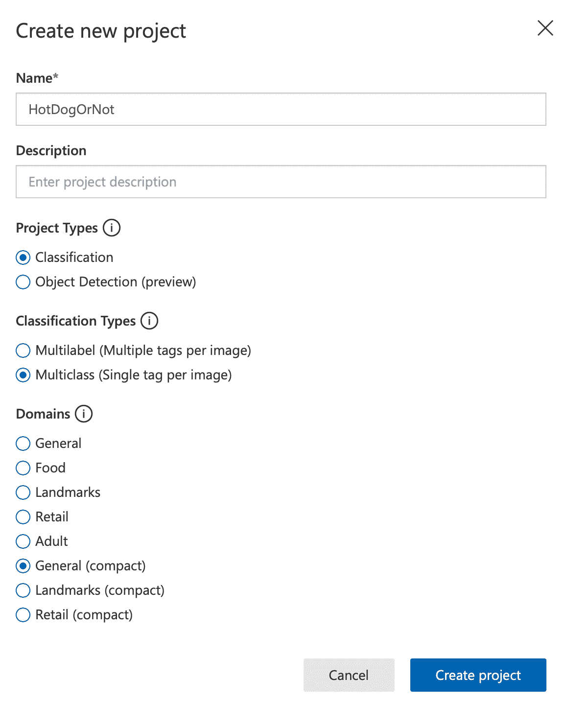
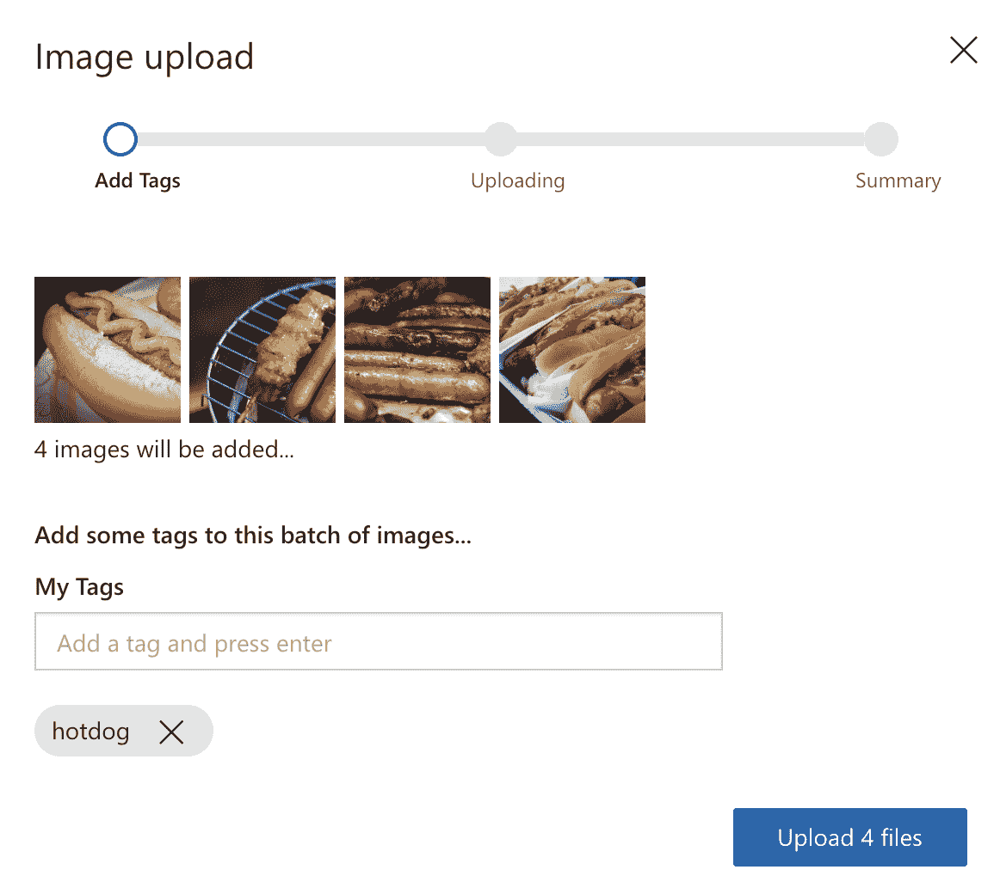
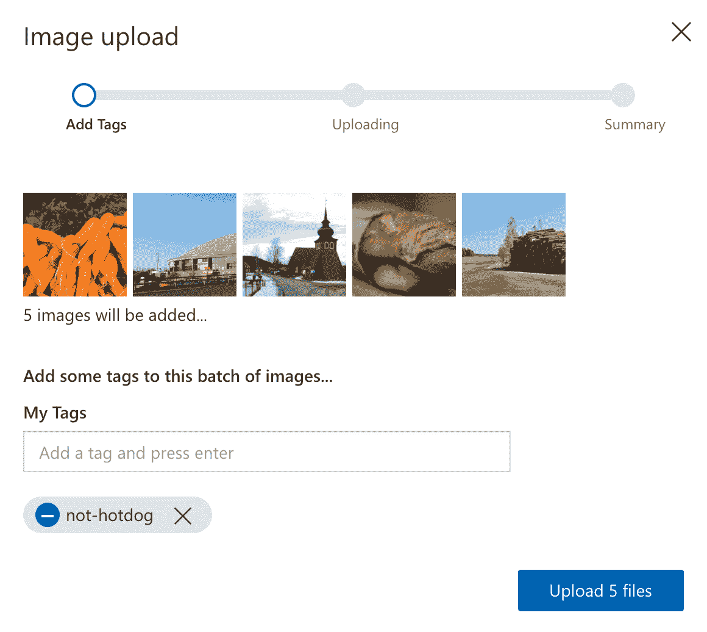
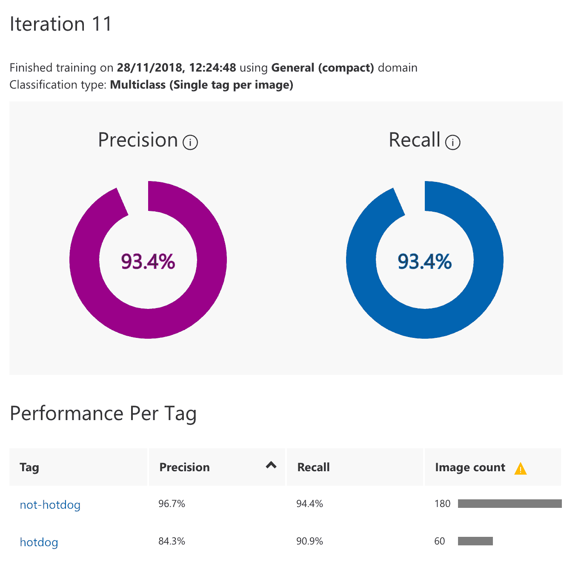
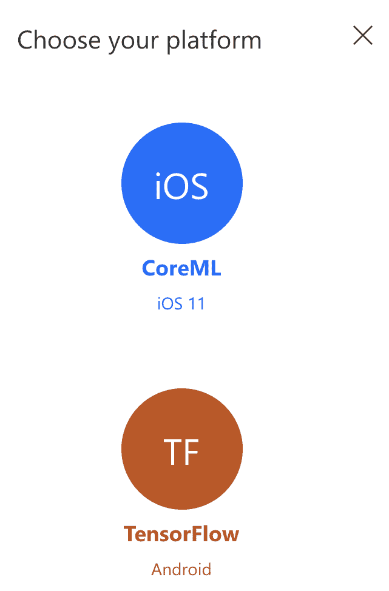
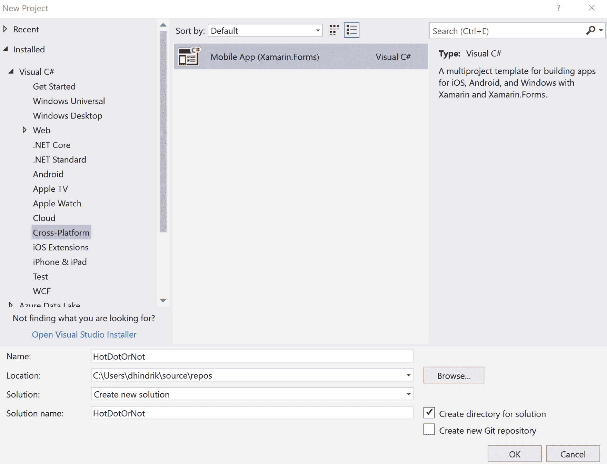
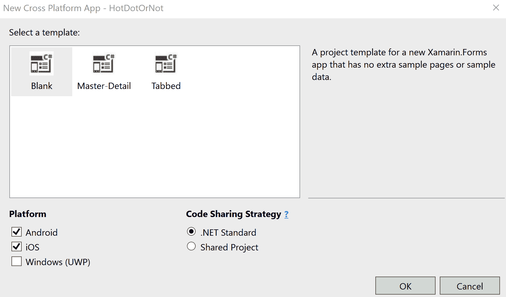
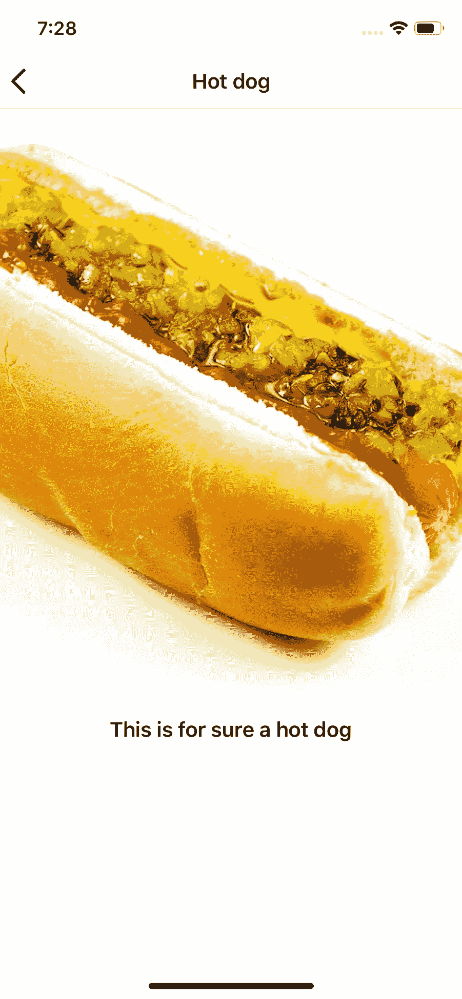

# 第九章：使用机器学习的热狗或不是热狗

在本章中，我们将学习如何使用机器学习创建一个用于图像分类的模型。我们将导出该模型为 TensorFlow 模型，可以在 Android 设备上使用，以及 CoreML 模型，可以在 iOS 设备上使用。为了训练和导出模型，我们将使用 Azure 认知服务和 Custom Vision 服务。

一旦我们导出了模型，我们将学习如何在 Android 和 iOS 应用程序中使用它们。

本章将涵盖以下主题：

+   使用 Azure 认知服务 Custom Vision 训练模型

+   如何在 Android 设备上使用 TensorFlow 模型进行图像分类

+   如何在 iOS 设备上使用 CoreML 模型进行图像分类

# 技术要求

要完成这个项目，您需要安装 Visual Studio for Mac 或 PC，以及 Xamarin 组件。有关如何设置您的环境的更多详细信息，请参见《Xamarin 简介》的第一章。要使用 Azure 认知服务，您需要一个 Microsoft 帐户。本章的源代码可在 GitHub 存储库中找到。

# 机器学习

机器学习这个术语是由美国人工智能先驱阿瑟·塞缪尔于 1959 年创造的。美国计算机科学家汤姆·M·米切尔后来提供了对机器学习的更正式定义。

计算机程序据说可以从经验 E 中学习某类任务 T 和性能度量 P，如果它在 T 中的任务表现，根据 P 来衡量，随着经验 E 的增加而提高。

简而言之，这句话描述了一个计算机程序，它具有无需明确编程即可学习的能力。在机器学习中，算法用于构建样本数据或训练数据的数学模型。这些模型用于计算机程序进行预测和决策，而无需为所涉及的任务明确编程。

# Azure 认知服务——Custom Vision

Custom Vision 是一个用于训练图像分类模型和检测图像中对象的工具或服务。在 Custom Vision 中，我们可以上传自己的图像并对其进行标记，以便对图像分类进行训练。如果我们为对象检测训练模型，我们还可以标记图像的特定区域。由于模型已经预先训练用于基本图像识别，我们不需要大量数据就可以获得很好的结果。建议每个标签至少有 30 张图像。

当我们训练了一个模型后，我们可以使用 Custom Vision 服务中的 API。然而，我们也可以将模型导出为 CoreML（iOS）、TensorFlow（Android）、ONNX（Windows）和 Dockerfile（Azure IoT Edge，Azure Functions 和 AzureML）。这些模型可以用于进行分类或对象检测，而无需连接到 Custom Vision 服务。

# CoreML

CoreML 是在 iOS 11 中引入的一个框架。CoreML 使得将机器学习模型集成到 iOS 应用程序中成为可能。在 CoreML 之上，我们有三个高级 API——Vision API 用于图像分析，自然语言 API 用于自然语言处理，以及 Gameplay Kit 用于评估学习决策树。有关 CoreML 的更多信息可以在苹果的官方文档中找到。

# TensorFlow

TensorFlow 是一个开源的机器学习框架，可以在[`www.tensorflow.org/`](https://www.tensorflow.org/)找到。TensorFlow 不仅可以用于在移动设备上运行模型，还可以用于训练模型。为了在移动设备上运行它，我们有 TensorFlow Mobile 和 TensorFlow Lite。从 Azure 认知服务导出的模型是为 TensorFlow Mobile 设计的。还有 Xamarin 绑定可用作 NuGet 软件包，用于 TensorFlow Mobile 和 TensorFlow Lite。然而，请记住，计划在 2019 年停用 TensorFlow Mobile。这并不意味着停用后我们就不能使用它，但意味着在停用后它不太可能再得到更新，只要 Custom Vision 仍然为 TensorFlow Mobile 导出模型，我们将继续使用它。即使 API 看起来有些不同，概念仍将是相同的。

# 项目概述

如果你看过电视剧《硅谷》，你可能听说过《不是热狗》应用程序。在本章中，我们将学习如何构建该应用程序。本章的第一部分将涉及收集我们用于创建可以检测照片中是否有热狗的机器学习模型的数据。

在本章的第二部分，我们将为 iOS 和 Android 构建一个应用程序，用户可以从照片库中选择照片，以便分析照片是否有热狗。完成此项目的预计时间为 120 分钟。

# 入门

我们可以使用 PC 上的 Visual Studio 2017 或 Mac 上的 Visual Studio 来完成此项目。要使用 PC 上的 Visual Studio 构建 iOS 应用程序，必须连接 Mac。如果根本没有 Mac，可以选择只完成此项目的 Android 部分。同样，如果只有 Mac，可以选择只完成此项目的 iOS 或 Android 部分。

# 使用机器学习构建热狗或不是热狗应用程序

让我们开始吧！我们将首先训练一个图像分类模型，以便在本章后面决定照片是否有热狗。

# 训练模型

要为图像分类训练模型，我们需要收集热狗照片和不含热狗的照片。因为世界上大多数物品都不是热狗，所以我们需要更多不含热狗的照片。最好是热狗照片涵盖许多不同的热狗场景——有面包、有番茄酱或芥末等。这样模型就能够识别不同情况下的热狗。当我们收集不含热狗的照片时，我们还需要有各种各样的照片，既与热狗相似又完全不同的物品的照片。

GitHub 上的解决方案中的模型是用 240 张照片训练的，其中 60 张是热狗，180 张不是。

收集了所有照片后，我们将准备通过以下步骤开始训练模型：

1.  转到[`customvision.ai`](https://customvision.ai)。

1.  登录并创建一个新项目。

1.  为项目命名——在我们的案例中是`HotDogOrNot`。

1.  项目类型应为分类。

1.  选择通用（紧凑）作为域。如果我们想要在移动设备上导出模型并运行它们，我们就使用紧凑域。

1.  点击创建项目继续，如下截图所示：



# 给图像打标签

创建项目后，我们可以开始上传图像并对其进行标记。我们将通过以下步骤开始添加热狗照片：

1.  点击添加图像。

1.  选择应上传的热狗照片。

1.  使用如下截图所示的 hotdog 标记照片：



一旦我们上传了所有的热狗照片，就该上传不是热狗的照片了。为了获得最佳结果，我们还应该包括看起来类似热狗但实际不是的物体的照片：

1.  点击“添加图片”。

1.  选择不是热狗的照片。

1.  使用`not-hotdog`标记照片，如下截图所示。将此标记设置为负标记。负标记用于不包含我们为其他标记创建的任何对象的照片。在这种情况下，我们上传的照片中都不包含热狗：



# 训练模型

一旦我们上传了照片，就该训练模型了。我们上传的照片并不都用于训练；有些将用于验证，以便给出模型的好坏得分。如果我们分批上传照片并在每批后训练模型，就能看到我们的得分在提高。点击页面顶部的绿色“训练”按钮来训练模型。

以下截图显示了一次训练迭代的结果，模型的精度为 93.4%：



# 导出模型

一旦我们训练好了模型，就可以导出它以便在设备上使用。如果需要的话，我们可以使用 API，但为了快速分类并且能够离线进行，我们将把模型添加到应用程序包中。导出并下载 CoreML 模型和 TensorFlow 模型，如下截图所示：



# 构建应用

一旦我们有了一个 CoreML 模型和一个 TensorFlow 模型，就该构建应用了。我们的应用将使用训练好的模型来对照片进行分类，判断它们是否是热狗照片。从 Custom Vision 服务中导出的 CoreML 模型将用于 iOS，而 TensorFlow 模型将用于 Android。

使用 Xamarin.Forms 模板创建一个新项目。该模板可以在跨平台选项卡下找到。将项目命名为`HotDotOrNot`，如下截图所示：



在下一步中，我们将选择应该使用哪个 Xamarin.Forms 模板。对于我们的项目，选择空白。对于这个项目，我们将以 Android 和 iOS 为平台，并使用.NET Standard 作为代码共享策略，如下截图所示：



在做任何其他事情之前，我们将更新 Xamarin.Forms NuGet 包，以确保我们拥有最新版本。

# 使用机器学习对图像进行分类

我们将用于图像分类的代码无法在 iOS 和 Android 项目之间共享。但是，为了能够从共享代码（`HotDogOrNot`项目）进行分类，我们将创建一个接口。不过，首先我们将通过以下步骤为接口创建一个`EventArgs`类：

1.  在`HotDogOrNot`项目中，创建一个名为`ClassificationEventArgs`的新类。

1.  将`EventArgs`作为基类添加，如下代码所示：

```cs
using System;
using System.Collections.Generic; 

public class ClassificationEventArgs : EventArgs
{
    public Dictionary<string, float> Classifications { get; private  
    set; }

    public ClassificationEventArgs(Dictionary<string, float> 
    classifications)
    {
        Classifications = classifications;
    }
} 
```

现在我们已经创建了`ClassificationEventArgs`，我们可以通过以下步骤创建接口：

1.  在`HotdogOrNot`项目中，在`HotdogOrNot`项目中创建一个名为`IClassifier`的新接口。

1.  添加一个名为`Classify`的方法，它不返回任何内容，但接受一个字节数组作为参数。

1.  添加一个使用`ClassificationEventArgs`的事件，并将其命名为`ClassificationCompleted`，如下代码所示：

```cs
using System;
using System.Collections.Generic; 

public interface IClassifier
{
    void Classify(byte[] bytes);
    event EventHandler<ClassificationEventArgs> 
    ClassificationCompleted;
}
```

# 使用 CoreML 进行图像分类

首先，我们要做的是通过以下步骤将 CoreML 模型添加到`HotDogOrNot.iOS`项目中：

1.  解压从 Custom Vision 服务获得的 ZIP 文件。

1.  找到`.mlmodel`文件并将其重命名为`hotdog-or-not.mlmodel`。

1.  将其添加到 iOS 项目的`Resources`文件夹中。

1.  确保构建操作是`BundleResource`。如果您在 Mac 上使用 Visual Studio，则会创建一个`.cs`文件。删除此文件，因为在没有代码的情况下使用模型会更容易。

当我们将文件添加到 iOS 项目后，我们将准备通过以下步骤创建`IClassifier`接口的 iOS 实现：

1.  在`HotDogOrNotDog.iOS`项目中创建一个名为`CoreMLClassifier`的新类。

1.  添加`IClassifier`接口。

1.  实现`ClassificationCompleted`事件和接口中的`Classify`方法，如下所示：

```cs
using System;
using System.Linq;
using CoreML;
using Foundation;
using ImageIO;
using Vision;
using System.Collections.Generic; 

namespace HotDogOrNot.iOS
{
    public class CoreMLClassifier : IClassifier
    {
        public event EventHandler<ClassificationEventArgs> 
        ClassificationCompleted;

        public void Classify(byte[] bytes)
        {
            //Code will be added here
        }
    } 
}
```

在`Classify`方法中，我们将首先编译 CoreML 模型，具体步骤如下：

1.  使用`NSBundle.MainBundle.GetUrlForResource`方法获取模型的路径。

1.  使用`MLModel.CompileModel`方法编译模型。传递模型的 URL 和一个错误对象，该对象将指示在编译模型过程中是否发生了一个或多个错误。

1.  使用`CompileModel`方法的 URL 并将其传递给`MLModel.Create`以创建一个我们可以使用的模型对象，如下所示：

```cs
var modelUrl = NSBundle.MainBundle.GetUrlForResource("hotdog-or-not", "mlmodel");
var compiledUrl = MLModel.CompileModel(modelUrl, out var error);
var compiledModel = MLModel.Create(compiledUrl, out error);
```

因为我们将使用 CoreML 模型的照片，所以我们可以使用建立在 CoreML 之上的 Vision API。为此，我们将使用`VNCoreMLRequest`。然而，在创建请求之前，我们将创建一个回调，该回调将处理请求完成时的情况，具体步骤如下：

1.  打开`CoreMLClassifier.cs`。

1.  创建一个名为`HandleVNRequest`的新私有方法，该方法有两个参数，一个是`VNRequst`类型，一个是`NSError`类型。

1.  如果错误是`null`，则使用`ClassificationEventArgs`调用`ClassificationCompleted`事件，其中包含一个空的`Dictionary`。

1.  如果错误不是 null，则使用`VNRequest`对象上的`GetResults`方法获取结果。

1.  按`Confidence`对分类进行排序，以便具有最高置信度的分类排在第一位。

1.  使用`ToDictionary`方法将结果转换为`Dictionary`。

1.  使用`ClassificationEventArgs`调用`ClassificationCompleted`事件，其中包含排序后的字典。如下所示：

```cs
private void HandleVNRequest(VNRequest request, NSError error)
{
    if (error != null) 
    {
    ClassificationCompleted?.Invoke(this, new 
    ClassificationEventArgs(new Dictionary<string, float>())); 
    }

    var result = request.GetResults<VNClassificationObservation>();
    var classifications = result.OrderByDescending(x => 
    x.Confidence).ToDictionary(x => x.Identifier, x => 
    x.Confidence);

    ClassificationCompleted?.Invoke(this, new 
    ClassificationEventArgs(classifications));  
}
```

创建回调后，我们将返回到`Classify`方法，并通过以下步骤执行分类：

1.  将模型转换为`VNCoreMLModel`，因为我们需要使用 Vision API。使用`VNCoreMLModel.FromMLModel`方法转换模型。

1.  创建一个新的`VNCoreMLRequest`对象，并将`VNCoreMLModel`和我们创建的回调作为参数传递给构造函数。

1.  使用`NSData.FromArray`方法将输入数据转换为`NSData`对象。

1.  创建一个新的`VNImageRequestHandler`对象，并将数据对象、`CGImagePropertyOrientation.Up`和一个新的`VNImageOptions`对象传递给构造函数。

1.  在`VNImageRequestHandler`上使用`Perform`方法，并将`VNCoreMLRequest`作为参数传递给该方法，如下所示：

```cs
public void Classify(byte[] bytes)
{
    var modelUrl = NSBundle.MainBundle.GetUrlForResource("hotdog-or-
    not", "mlmodel");
    var compiledUrl = MLModel.CompileModel(modelUrl, out var error);
    var compiledModel = MLModel.Create(compiledUrl, out error); 

    var vnCoreModel = VNCoreMLModel.FromMLModel(compiledModel, out 
    error);

 var classificationRequest = new VNCoreMLRequest(vnCoreModel,    
    HandleVNRequest); 

 var data = NSData.FromArray(bytes);
 var handler = new VNImageRequestHandler(data,  
    CGImagePropertyOrientation.Up, new VNImageOptions()); 
 handler.Perform(new[] { classificationRequest }, out error);
}
```

# 使用 TensorFlow 进行图像分类。

现在我们已经在 iOS 中编写了识别热狗的代码，现在是时候为 Android 编写代码了。首先要做的是将我们从 Custom Vision 导出的文件添加到 Android 项目中。对于 TensorFlow，实际模型和标签（标签）分为两个文件。通过以下步骤设置：

1.  提取我们从 Custom Vision 服务中获得的 ZIP 文件。

1.  找到`model.pb`文件并将其重命名为`hotdog-or-not-model.pb`。

1.  找到`labels.txt`文件并将其重命名为`hotdog-or-not-labels.txt`。

1.  将文件导入到 Android 项目的`Assets`文件夹中。确保构建操作是 Android Asset。

将文件导入到 Android 项目后，我们可以开始编写代码。为了获取 TensorFlow 所需的库，我们还需要通过以下步骤安装 NuGet 包：

1.  在`HotDogOrNotDog.Android`项目中，安装`Xam.Android.Tensorflow` NuGet 包。

1.  然后，在`HotDogOrNotDog.Android`项目中创建一个名为`TensorflowClassifier`的新类。

1.  将`IClassifier`接口添加到`TensorflowClassifier`类中。

1.  实现`ClassificationCompleted`事件和接口中的`Classify`方法，如下所示的代码：

```cs
using System;
using System.Collections.Generic;
using System.IO;
using System.Linq;
using Android.App;
using Android.Graphics;
using Org.Tensorflow.Contrib.Android; 

public class TensorflowClassifier : IClassifier
{
         public event EventHandler<ClassificationEventArgs> 
         ClassificationCompleted;

         public void Classify(byte[] bytes)
         {
            //Code will be added here
         }
}
```

在`Classify`方法中，我们将首先从`Assets`文件夹中读取模型和标签文件，通过以下步骤进行：

1.  使用`TensorFlowInferenceInterface`类导入模型。然后，使用资产文件夹的路径和模型文件的名称作为构造函数的参数。

1.  使用`StreamReader`来读取标签。

1.  读取整个文本文件，按行分割（`'/n'`），并修剪每一行的文本以去除空格。我们还将过滤掉空或 null 的项目，并将结果转换为字符串列表，如下所示的代码：

```cs
public void Classify(byte[] bytes)
{
    varassets = Application.Context.Assets;

 var inferenceInterface = new 
    TensorFlowInferenceInterface(assets, "hotdog-or-not-model.pb");
 var sr = new StreamReader(assets.Open("hotdog-or-not-
    labels.txt"));
 var labels = sr.ReadToEnd().Split('\n').Select(s => s.Trim())
 .Where(s => !string.IsNullOrEmpty(s)).ToList();
}
```

`TensorFlow`模型无法理解图像，因此我们需要将它们转换为二进制数据。图像需要转换为点值的浮点数组，每个像素的红色、绿色和蓝色值各一个。还需要对颜色值进行一些调整。此外，我们需要调整图像的大小，使其为`227 x 227`像素。为此，编写以下代码：

```cs
var bitmap = BitmapFactory.DecodeByteArray(bytes, 0, bytes.Length); 
var resizedBitmap = Bitmap.CreateScaledBitmap(bitmap, 227, 227, false)
                               .Copy(Bitmap.Config.Argb8888, false);

var floatValues = new float[227 * 227 * 3];
var intValues = new int[227 * 227];

resizedBitmap.GetPixels(intValues, 0, 227, 0, 0, 227, 227);

for (int i = 0; i < intValues.Length; ++i)
{
    var val = intValues[i];
    floatValues[i * 3 + 0] = ((val & 0xFF) - 104);
    floatValues[i * 3 + 1] = (((val >> 8) & 0xFF) - 117);
    floatValues[i * 3 + 2] = (((val >> 16) & 0xFF) - 123);
} 
```

现在我们准备通过以下步骤运行模型：

1.  创建一个与标签列表大小相同的浮点数数组。模型的输出将被获取到这个数组中。数组中的一个项目将表示标签的置信度。标签列表中的匹配标签将与浮点数组中的置信度结果在相同的位置。

1.  运行`TensorFlowInferenceInterface`的`Feed`方法，并将"Placeholder"作为第一个参数，二进制数据作为第二个参数，图像的尺寸作为第三个参数。

1.  运行`TensorFlowInferenceInterface`的`Run`方法，并传递一个包含值为"loss"的字符串的数组。

1.  运行`TensorFlowInferenceInterface`的`Fetch`方法。将"loss"作为第一个参数，将输出的浮点数组作为第二个参数。

1.  创建一个`Dictionary <string, float>`并用标签和每个标签的置信度填充它。

1.  使用`ClassificationCompleted`事件和包含字典的`ClassificationEventArgs`调用事件，如下所示的代码：

```cs
var outputs = new float[labels.Count];
inferenceInterface.Feed("Placeholder", floatValues, 1, 227, 227, 3);
inferenceInterface.Run(new[] { "loss" });
inferenceInterface.Fetch("loss", outputs);

var result = new Dictionary<string, float>();

for (var i = 0; i < labels.Count; i++)
{
    var label = labels[i];
    result.Add(label, outputs[i]);
}

ClassificationCompleted?.Invoke(this, new ClassificationEventArgs(result)); 
```

# 创建一个基本的 ViewModel

在初始化应用程序之前，我们将创建一个基本的 ViewModel，以便在注册其他 ViewModel 时可以使用它。在其中，我们将放置可以在应用程序的所有 ViewModel 之间共享的代码。通过以下步骤来设置这一点：

1.  在`HotDogOrNot`项目中，创建一个名为`ViewModels`的新文件夹。

1.  在我们创建的`ViewModels`文件夹中创建一个名为`ViewModel`的新类。

1.  将新的类设置为公共和抽象。

1.  添加并实现`INotifiedPropertyChanged`接口。这是必要的，因为我们想要使用数据绑定。

1.  添加一个`Set`方法，这将使我们更容易从`INotifiedPropertyChanged`接口中引发`PropertyChanged`事件。该方法将检查值是否已更改。如果是，它将引发事件。

1.  添加一个名为`Navigation`的`INavigation`类型的静态属性，如下所示的代码：

```cs
using System;
using System.Collections.Generic;
using System.ComponentModel;
using System.Runtime.CompilerServices;
using Xamarin.Forms; 

namespace HotDogOrNot
{
    public abstract class ViewModel : INotifyPropertyChanged
    {
         public event PropertyChangedEventHandler PropertyChanged; 
         protected void Set<T>(ref T field, T newValue, 
         [CallerMemberName] string propertyName = null)
         {
              if (!EqualityComparer<T>.Default.Equals(field, 
                 newValue))
              {
                   field = newValue;
                   PropertyChanged?.Invoke(this, new 
                   PropertyChangedEventArgs(propertyName));
              }    
         }    

         public static INavigation Navigation { get; set; } 
    } 
}
```

# 初始化应用程序

现在我们准备为应用程序编写初始化代码。我们将设置**控制反转**（**IoC**）并进行必要的配置。

# 创建一个解析器

现在，我们将创建一个辅助类，它将简化通过`Autofac`解析对象图的过程。这将帮助我们根据配置的 IoC 容器创建类型。在这个项目中，我们将通过以下步骤使用`Autofac`作为 IoC 库：

1.  在`HotDogOrNot`项目中，安装`NuGet`包`Autofac`到`HotDogOrNot`项目。

1.  在根目录中创建一个名为`Resolver`的新类。

1.  添加一个名为`container`的`IContainer`类型的私有静态字段（来自`Autofac`）。

1.  添加一个名为`Initialize`的公共静态方法，带有`IContainer`作为参数。将参数的值设置为容器字段。

1.  添加一个名为`Resolve`的通用`static public`方法，该方法将返回一个基于`IContainer`的`Resolve`方法的类型参数的实例，如下面的代码所示：

```cs
using System;
using Autofac; 

namespace HotDogOrNot
{    
    public class Resolver
    {
         private static IContainer container;

         public static void Initialize(IContainer container)
         {
              Resolver.container = container;
         }

         public static T Resolve<T>()
         {
              return container.Resolve<T>();
         }
    } 
}
```

# 创建引导程序

为了配置依赖注入并初始化`Resolver`，我们将创建一个引导程序。我们将有一个共享的引导程序和一个用于匹配特定配置的每个平台的引导程序。在 iOS 和 Android 中，我们将有不同的`IClassifier`实现。要创建引导程序，请按照以下步骤进行：

1.  在`HotDogOrNot`项目中创建一个名为`Bootstrapper`的新类。

1.  在新类中编写以下代码，如下面的代码所示：

```cs
using System.Linq;
using System.Reflection;
using Autofac;
using HotdogOrNot.ViewModels;
using Xamarin.Forms;

namespace HotDogOrNot
{
    public class Bootstrapper
    {
         protected ContainerBuilder ContainerBuilder { get; private 
         set; }

         public Bootstrapper()
         {
             Initialize();
             FinishInitialization();
         }

         protected virtual void Initialize()
         {
             ContainerBuilder = new ContainerBuilder();

             var currentAssembly = Assembly.GetExecutingAssembly();

             foreach (var type in 
             currentAssembly.DefinedTypes.Where(e => 
             e.IsSubclassOf(typeof(Page))))
             {
                 ContainerBuilder.RegisterType(type.AsType());
             }

             foreach (var type in 
             currentAssembly.DefinedTypes.Where(e => 
             e.IsSubclassOf(typeof(ViewModel))))
             {
                 ContainerBuilder.RegisterType(type.AsType());
             }
         }

         private void FinishInitialization()
         {
             var container = ContainerBuilder.Build();

             Resolver.Initialize(container);
         }
    } 
}
```

# 创建 iOS 引导程序

在 iOS 引导程序中，我们将有特定于 iOS 应用程序的配置。要创建 iOS 应用程序，我们需要按照以下步骤进行：

1.  在`HotDogOrNot.iOS`项目中，创建一个名为`Bootstrapper`的新类。

1.  使新类继承自`HotDogOrNot.Bootstrapper`。

1.  编写以下代码并解析所有引用：

```cs
using System;
using Autofac; 

public class Bootstrapper : HotdogOrNot.Bootstrapper
{
    public static void Init()
    {
        var instance = new Bootstrapper();
    }

    protected override void Initialize()
    {
        base.Initialize();

        ContainerBuilder.RegisterType<CoreMLClassifier>
        ().As<IClassifier>();
    }
}
```

1.  转到 iOS 项目中的`AppDelegate.cs`。

1.  在`FinishedLaunching`方法中的`LoadApplication`调用之前，调用平台特定引导程序的`Init`方法，如下面的代码所示：

```cs
public override bool FinishedLaunching(UIApplication app, NSDictionary options)
{
      global::Xamarin.Forms.Forms.Init();
      Bootstrapper.Init();

      LoadApplication(new App());

      return base.FinishedLaunching(app, options);
}
```

# 创建 Android 引导程序

在 Android 引导程序中，我们将有特定于 Android 应用程序的配置。要在 Android 中创建引导程序，我们需要按照以下步骤进行：

1.  在 Android 项目中，创建一个名为`Bootstrapper`的新类。

1.  使新类继承自`HotDogOrNot.Bootstrapper`。

1.  编写以下代码并解析所有引用：

```cs
using System;
using Autofac; 

public class Bootstrapper : HotDogOrNot.Bootstrapper
{
         public static void Init()
         {
             var instance = new Bootstrapper();
         }

         protected override void Initialize()
         {
             base.Initialize();

             ContainerBuilder.RegisterType<TensorflowClassifier>
             ().As<IClassifier>().SingleInstance();
         }
}
```

1.  转到 Android 项目中的`MainActivity.cs`文件。

1.  在`OnCreate`方法中的`LoadApplication`调用之前，调用平台特定引导程序的`Execute`方法，如下面的代码所示：

```cs
protected override void OnCreate(Bundle savedInstanceState)
{
     TabLayoutResource = Resource.Layout.Tabbar;
     ToolbarResource = Resource.Layout.Toolbar;

     base.OnCreate(savedInstanceState);
     global::Xamarin.Forms.Forms.Init(this, savedInstanceState);

 Bootstrapper.Init();

     LoadApplication(new App());
}
```

# 构建第一个视图

该应用程序中的第一个视图将是一个简单的视图，其中有两个按钮。一个按钮用于启动相机，以便用户可以拍摄某物的照片，以确定它是否是热狗。另一个按钮用于从设备的照片库中选择照片。

# 构建 ViewModel

我们将首先创建`ViewModel`，它将处理用户点击按钮时会发生什么。让我们通过以下步骤设置这个：

1.  在`ViewModels`文件夹中创建一个名为`MainViewModel`的新类。

1.  将`ViewModel`作为`MainViewModel`的基类添加。

1.  创建一个`IClassifier`类型的私有字段，并将其命名为`classifier`。

1.  创建一个具有`IClassifier`作为参数的构造函数。

1.  将分类器字段的值设置为构造函数中的参数值，如下面的代码所示：

```cs
using System.IO;
using System.Linq;
using System.Windows.Input;
using HotdogOrNot.Models;
using HotdogOrNot.Views;
using Xamarin.Forms; 

public class MainViewModel : ViewModel
{
    private IClassifier classifier;

    public MainViewModel(IClassifier classifier)
    {
        this.classifier = classifier;
    } 
}
```

我们将使用`Xam.Plugin.Media` NuGet 包来拍摄照片和访问设备的照片库。我们需要通过 NuGet 包管理器为解决方案中的所有项目安装该包。但是，在我们可以使用该包之前，我们需要为每个平台进行一些配置。我们将从 Android 开始。让我们通过以下步骤设置这个：

1.  该插件需要`WRITE_EXTERNAL_STORAGE`和`READ_EXTERNAL_STORAGE`权限。插件将为我们添加这些权限，但我们需要在`MainActivity.cs`中重写`OnRequestPermissionResult`。

1.  调用`OnRequestPermissionsResult`方法，如下面的代码所示。

1.  在`MainActivity.cs`文件的`OnCreate`方法中初始化 Xamarin.Forms 后，添加`CrossCurrentActivity.Current.Init(this, savedInstanceState)`，如下面的代码所示：

```cs
public override void OnRequestPermissionsResult(int requestCode, string[] permissions, Android.Content.PM.Permission[] grantResults)
{
   Plugin.Permissions.PermissionsImplementation.Current.OnRequestPermissionsResult(requestCode, permissions, grantResults);
} 
```

我们还需要添加一些关于用户可以选择照片的文件路径的配置。让我们通过以下步骤来设置这一点：

1.  在`HotDogOrNot.Android`项目中，在`Resources`文件夹中添加一个名为`xml`的文件夹。

1.  在新文件夹中创建一个名为`file_paths.xml`的新 XML 文件。

1.  在`file_paths.xml`中添加以下代码：

```cs
<?xml version="1.0" encoding="utf-8"?>
<paths xmlns:android="http://schemas.android.com/apk/res/android">
    <external-files-path name="my_images" path="Pictures" />
    <external-files-path name="my_movies" path="Movies" />
</paths>
```

为 Android 项目设置插件的最后一件事是在`AndroidManifest.xml`中添加以下代码（可以在 Android 项目的`Properties`文件夹中找到），在应用程序元素内部：

```cs
 <manifest xmlns:android="http://schemas.android.com/apk/res/android"   
  android:versionCode="1" android:versionName="1.0"   
  package="xfb.HotdogOrNot">
     <uses-sdk android:minSdkVersion="21" android:targetSdkVersion="27"  
      />
     <application android:label="HotdogOrNot.Android">
     <provider android:name="android.support.v4.content.FileProvider" 
     android:authorities="${applicationId}.fileprovider" 
     android:exported="false" android:grantUriPermissions="true">
 <meta-data android:name="android.support.FILE_PROVIDER_PATHS" 
     android:resource="@xml/file_paths"></meta-data>
 </provider>
     </application>
 </manifest> 
```

对于 iOS 项目，我们唯一需要做的就是在`info.plist`中添加以下四个用途描述：

```cs
<key>NSCameraUsageDescription</key>
<string>This app needs access to the camera to take photos.</string>
<key>NSPhotoLibraryUsageDescription</key>
<string>This app needs access to photos.</string>
<key>NSMicrophoneUsageDescription</key>
<string>This app needs access to microphone.</string>
<key>NSPhotoLibraryAddUsageDescription</key>
<string>This app needs access to the photo gallery.</string>
```

一旦我们完成了插件的配置，我们就可以开始使用它。我们将首先创建一个方法，该方法将处理我们在用户拍照时和选择照片时都会得到的媒体文件。

让我们通过以下步骤来设置这一点：

1.  打开`MainViewModel.cs`文件。

1.  创建一个名为`HandlePhoto`的私有方法，该方法具有`MediaFile`类型的参数。

1.  添加一个`if`语句来检查`MediaFile`参数是否为`null`。如果是，执行空返回。

1.  使用`MediaFile`类的`GetStream`方法获取照片的流。

1.  添加一个名为`bytes`的`byte []`类型的私有字段。

1.  使用我们将在下一步中创建的`ReadFully`方法将流转换为字节数组。

1.  为分类器的`ClassificationCompleted`事件添加一个事件处理程序。我们将在本章后面创建事件处理程序。

1.  最后，调用分类器的`Classify`方法，并将字节数组作为参数，如下所示：

```cs
private void HandlePhoto(MediaFile photo)
{
    if(photo == null)
    {
        return;
    }

    var stream = photo.GetStream();
    bytes = ReadFully(stream);

    classifier.ClassificationCompleted += 
    Classifier_ClassificationCompleted;
    classifier.Classify(bytes);
} 
```

我们现在将创建`ReadFully`方法，该方法在前面的代码中调用。我们将使用它来将完整的流读入一个字节数组。代码如下所示：

```cs
private byte[] ReadFully(Stream input)
{
    byte[] buffer = new byte[16 * 1024];
    using (MemoryStream memoryStream = new MemoryStream())
    {
        int read;
        while ((read = input.Read(buffer, 0, buffer.Length)) > 0)
        {
            memoryStream.Write(buffer, 0, read);
        }

        return memoryStream.ToArray();
    }

} 
```

在创建事件处理程序之前，我们将通过以下步骤创建一个我们将在事件处理程序中使用的模型：

1.  在`HotDogOrNot`项目中，在`HotDogOrNot`项目中创建一个名为`Models`的新文件夹。

1.  在`Models`文件夹中创建一个名为`Result`的新类。

1.  添加一个名为`IsHotdog`的`bool`类型的属性。

1.  添加一个名为`Confidence`的`float`类型的属性。

1.  添加一个名为`PhotoBytes`的`byte[]`类型的属性，如下所示：

```cs
public class Result
{
    public bool IsHotdog { get; set; }
    public float Confidence { get; set; }
    public byte[] PhotoBytes { get; set; }
} 
```

现在我们可以通过以下步骤为 ViewModel 添加一个事件处理程序：

1.  创建一个名为`Classifier_ClassificationCompleted`的方法，该方法具有一个`object`和一个`ClassificationEventArgs`参数。

1.  从分类器中删除事件处理程序，以便我们不会分配不必要的内存。

1.  检查分类字典是否包含任何项。如果有，对字典进行排序，使具有最高置信度（值）的分类首先出现。

1.  创建一个新的`Result`对象，并按以下代码中所示设置属性：

```cs
void Classifier_ClassificationCompleted(object sender, ClassificationEventArgs e)
{
    classifier.ClassificationCompleted -= 
    Classifier_ClassificationCompleted;

     Result result = null;

     if (e.Classifications.Any())
     {
         var classificationResult = 
         e.Classifications.OrderByDescending(x => x.Value).First();

         result = new Result()
         {
             IsHotdog = classificationResult.Key == "hotdog",
             Confidence = classificationResult.Value,
             PhotoBytes = bytes
         };
    }
    else
    {
        result = new Result()
        {
            IsHotDog = false,
            Confidence = 1.0f,
            PhotoBytes = bytes
        };
    } 
} 
```

创建结果视图后，我们将返回事件处理程序，以添加导航到结果视图。在这个`ViewModel`中，我们要做的最后一件事是为视图中的按钮创建一个`Command`属性。让我们从设置拍照按钮开始，通过以下步骤：

1.  在`MainViewModel.cs`文件中创建一个名为`TakePhoto`的`ICommand`类型的新属性。

1.  使用表达式返回一个新的`Command`。

1.  将一个`Action`作为表达式传递给`Command`的构造函数。

1.  在`Action`中，使用`CrossMedia.Current.TakePhotoAsync`方法，并将`StoreCameraMediaOptions`对象传递给它。

1.  在`StoreCameraMediaOptions`中，使用`DefaultCamera`属性将默认相机设置为后置相机。

1.  将对`TakePhotoAsync`方法的调用结果传递给`HandlePhoto`方法，如下所示：

```cs
public ICommand TakePhoto => new Command(async() =>
{
     var photo = await CrossMedia.Current.TakePhotoAsync(new 
     StoreCameraMediaOptions()
     {
       DefaultCamera = CameraDevice.Rear
     });

   HandlePhoto(photo);
});

```

现在我们将在`MainViewModel`中处理从库中选择照片按钮被点击时发生的情况。让我们按照以下步骤设置这个方法：

1.  创建一个名为`PickPhoto`的`ICommand`类型的新属性。

1.  使用表达式返回一个新的`Command`。

1.  将一个`Action`作为表达式传递给`Command`的构造函数。

1.  在`Action`中，使用`CrossMedia.Current.PickPhotoAsync`来打开操作系统的默认照片选择器。

1.  将`TakePhotoAsync`方法的调用结果传递给`HandlePhoto`方法，如下所示：

```cs
 public ICommand PickPhoto => new Command(async () =>
 {
     var photo = await CrossMedia.Current.PickPhotoAsync();

     HandlePhoto(photo);
 });
```

# 构建视图

现在，一旦我们创建了`ViewModel`，就是时候为 GUI 创建代码了。按照以下步骤创建`MainView`的 GUI：

1.  在`HotDogOrNot`项目中创建一个名为`Views`的新文件夹。

1.  创建一个名为`MainView`的新的`XAML ContentPage`。

1.  将`ContentPage`的`Title`属性设置为`Hotdog or Not hotdog`。

1.  在页面上添加一个`StackLayout`并将其`VerticalOptions`属性设置为`Center`。

1.  在`StackLayout`中添加一个名为`Take Photo`的`Button`。对于`Command`属性，添加到`ViewModel`中的`TakePhoto`属性的绑定。

1.  在`StackLayout`中添加一个名为`Pick Photo`的`Button`。对于`Command`属性，添加到`ViewModel`中的`Pick Photo`属性的绑定，如下所示：

```cs
<ContentPage  

              x:Class="HotDogOrNot.Views.MainView"
              Title="Hot dog or Not hot dog">
     <ContentPage.Content>
         <StackLayout VerticalOptions="Center">
             <Button Text="Take Photo" Command="{Binding TakePhoto}" />
             <Button Text="Pick Photo" Command="{Binding PickPhoto}" />
         </StackLayout>
     </ContentPage.Content>
</ContentPage>
```

在`MainView`的代码后台，按照以下步骤设置视图的绑定上下文：

1.  将`MainViewModel`作为构造函数的参数。

1.  在`InitialComponent`方法调用之后，将视图的`BindingContext`属性设置为`MainViewModel`参数。

1.  在`NavigationPage`类上使用静态方法`SetBackButtonTitle`，以便在结果视图的导航栏中显示返回到此视图的箭头，如下所示：

```cs
public MainView(MainViewModel viewModel)
{
    InitializeComponent();

    BindingContext = viewModel;
    NavigationPage.SetBackButtonTitle(this, string.Empty);
}
```

现在我们可以转到`App.xaml.cs`，并按照以下步骤将`MainPage`设置为`MainView`：

1.  在`HotDogOrNot`项目中，转到`App.xaml.cs`。

1.  使用`Resolver`上的`Resolve`方法创建`MainView`的实例。

1.  创建一个`NavigationPage`并将`MainView`传递给构造函数。

1.  将`ViewModel`上的静态`Navigation`属性设置为`NavigationPage`上的`Navigation`属性的值。

1.  将`MainPage`属性设置为我们在步骤 3 中创建的`NavigationPage`的实例。

1.  删除`MainPage.xaml`，因为我们不再需要它。你应该剩下以下代码：

```cs
public App()
{
    InitializeComponent();

    var mainView = Resolver.Resolve<MainView>();
 var navigationPage = new NavigationPage(mainView);

 ViewModel.Navigation = navigationPage.Navigation;

 MainPage = navigationPage;
}
```

# 构建结果视图

在这个项目中，我们需要做的最后一件事是创建结果视图。这个视图将显示输入的照片，以及它是否是一个热狗。

# 构建 ViewModel

在创建视图之前，我们将创建一个`ViewModel`来处理视图的所有逻辑，按照以下步骤进行：

1.  在`HotdogOrNot`项目的`ViewModels`文件夹中创建一个名为`ResultViewModel`的类。

1.  将`ViewModel`作为`ResultViewModel`的基类添加。

1.  创建一个名为`Title`的`string`类型的属性。为该属性添加一个私有字段。

1.  创建一个名为`Description`的`string`类型的属性。为该属性添加一个私有字段。

1.  创建一个名为`PhotoBytes`的`byte[]`类型的属性。为该属性添加一个私有字段，如下所示：

```cs
using HotdogOrNot.Models;

namespace HotDogOrNot.ViewModels
{
    public class ResultViewModel : ViewModel
    { 
        private string title;
        public string Title
        {
            get => title;
            set => Set(ref title, value);
        }

        private string description;
        public string Description
        {
            get => description;
            set => Set(ref description, value);
        }

        private byte[] photoBytes;
        public byte[] PhotoBytes
        {
            get => photoBytes;
            set => Set(ref photoBytes, value);
        } 
    }
}
```

在`ViewModel`中创建一个带有结果作为参数的`Initialize`方法。让我们按照以下步骤设置这个方法：

1.  在`Initialize`方法中，将`PhotoBytes`属性设置为`result`参数的`PhotoBytes`属性的值。

1.  添加一个`if`语句，检查`result`参数的`IsHotDog`属性是否为`true`，以及`Confidence`是否高于 90%。如果是这样，将`Title`设置为`"Hot dog"`，并将`Description`设置为`"This is for sure a hotdog"`。

1.  添加一个`else if`语句，检查`result`参数的`IsHotdog`属性是否为`true`。如果是这样，将`Title`设置为`"Maybe"`，将`Description`设置为`"This is maybe a hotdog"`。

1.  添加一个`else`语句，将`Title`设置为`"Not a hot dog"`，将`Description`设置为`"This is not a hot dog"`，如下面的代码所示：

```cs
public void Initialize(Result result)
{
    PhotoBytes = result.PhotoBytes;

    if (result.IsHotdog && result.Confidence > 0.9)
    {
        Title = "Hot dog";
        Description = "This is for sure a hot dog";
    }
    else if (result.IsHotdog)
    {
        Title = "Maybe";
        Description = "This is maybe a hot dog";
    }
    else
    {
        Title = "Not a hot dog";
        Description = "This is not a hot dog";
    }
} 
```

# 构建视图

因为我们想要在输入视图中显示输入照片，所以我们需要将其从`byte[]`转换为`Xamarin.Forms.ImageSource`。我们将通过以下步骤在值转换器中执行此操作，然后可以与 XAML 中的绑定一起使用：

1.  在`HotDogOrNot`项目中创建一个名为`Converters`的新文件夹。

1.  创建一个名为`BytesToImageConverter`的新类。

1.  添加并实现`IValueConverter`接口，如下面的代码所示：

```cs
using System;
using System.Globalization;
using System.IO;
using Xamarin.Forms;

public class BytesToImageConverter : IValueConverter
{ 
    public object Convert(object value, Type targetType, object 
    parameter, CultureInfo culture)
    {
        throw new NotImplementedException();
    }

   public object ConvertBack(object value, Type targetType, object 
   parameter, CultureInfo culture)
    {
        throw new NotImplementedException();
    }
}

```

当`ViewModel`更新视图时，将使用`Convert`方法。当`View`更新`ViewModel`时，将使用`ConvertBack`方法。在这种情况下，我们只需要编写`Convert`方法的代码，如下面的步骤所示：

1.  首先检查`value`参数是否为`null`。如果是，我们应该返回`null`。

1.  如果值不为`null`，则将其强制转换为`byte[]`。

1.  从字节数组创建一个`MemoryStream`。

1.  返回`ImageSource.FromStream`方法的结果，我们将向其中传递流，如下面的代码所示：

```cs
public object Convert(object value, Type targetType, object parameter, CultureInfo culture)
{
    if(value == null)
    {
        return null;
    }

    var bytes = (byte[])value;
    var stream = new MemoryStream(bytes);

    return ImageSource.FromStream(() => stream);
} 
```

视图将包含照片，占据屏幕的三分之二。在照片下面，我们将添加结果的描述。让我们通过以下步骤设置这一点：

1.  在`Views`文件夹中，创建一个名为`ResultView`的新`XAML ContentPage`。

1.  导入转换器的命名空间。

1.  将`BytesToImageConverter`添加到页面的`Resources`中，并为其指定键`"ToImage"`。

1.  将`ContentPage`的`Title`属性绑定到`ViewModel`的`Title`属性。

1.  在页面上添加一个具有两行的`Grid`。第一行的`RowDefinition`的`Height`值应为`2*`。第二行的高度应为`*`。这些是相对值，意味着第一行将占`Grid`的三分之二，而第二行将占`Grid`的三分之一。

1.  向`Grid`添加一个`Image`，并将`Source`属性绑定到`ViewModel`中的`PhotoBytes`属性。使用转换器将字节转换为`Source`属性的`ImageSource`。

1.  添加一个`Label`，并将`Text`属性绑定到`ViewModel`的`Description`属性，如下面的代码所示：

```cs
<ContentPage xmlns="http://xamarin.com/schemas/2014/forms" 
             xmlns:x="http://schemas.microsoft.com/winfx/2009/xaml" 
             xmlns:converters="clr-namespace:HotdogOrNot.Converters"
             x:Class="HotdogOrNot.Views.ResultView"
             Title="{Binding Title}">
<ContentPage.Resources>
         <converters:BytesToImageConverter x:Key="ToImage" />
</ContentPage.Resources>
    <Grid>
        <Grid.RowDefinitions>
            <RowDefinition Height="2*" />
            <RowDefinition Height="*" />
        </Grid.RowDefinitions>

        <Image Source="{Binding PhotoBytes, Converter=
        {StaticResource ToImage}}" Aspect="AspectFill" />
        <Label Grid.Row="1" HorizontalOptions="Center" 
        FontAttributes="Bold" Margin="10" Text="{Binding 
        Description}" />
    </Grid>
</ContentPage> 
```

我们还需要设置视图的`BindingContext`。我们将在与`MainView`相同的方式中进行，即在代码后台文件（`ResultView.xaml.cs`）中，如下面的代码所示：

```cs
public ResultView (ResultViewModel viewModel)
{
    InitializeComponent ();

    BindingContext = viewModel;
}
```

我们需要做的最后一件事是从`MainView`导航到`ResultView`。我们将在`MainViewModel`的`Classifier_ClassificationCompleted`方法的末尾添加以下代码来实现这一点：

```cs
var view = Resolver.Resolve<ResultView>();
((ResultViewModel)view.BindingContext).Initialize(result);

Navigation.PushAsync(view);
```

下面您可以看到，如果我们上传一张热狗的照片，应用程序将是什么样子：



# 总结

在本章中，我们构建了一个可以识别照片是否有热狗的应用程序。我们通过使用 Azure 认知服务和自定义视觉服务训练图像分类的机器学习模型来实现这一点。

我们为 CoreML 和 TensorFlow 导出了模型，并学习了如何在 iOS 和 Android 应用中使用它们。在这些应用中，用户可以拍照或从照片库中选择照片。这张照片将被发送到模型进行分类，我们将得到一个结果，告诉我们这张照片是否是热狗。
