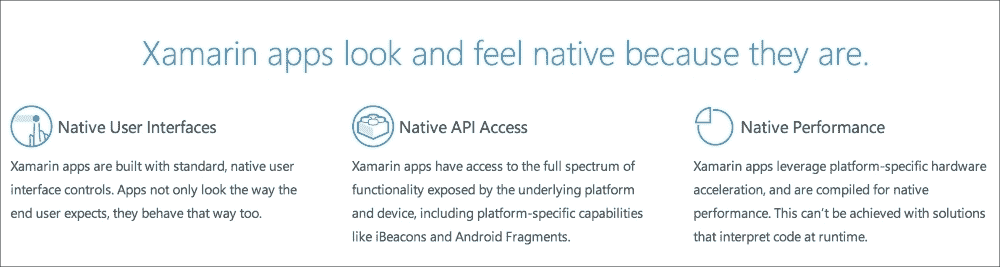
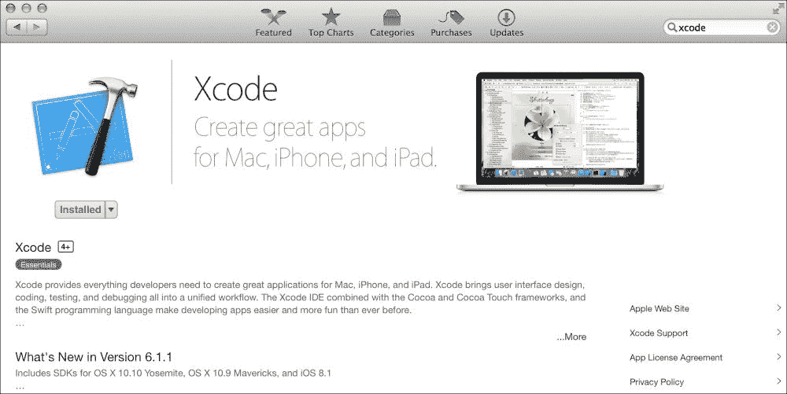
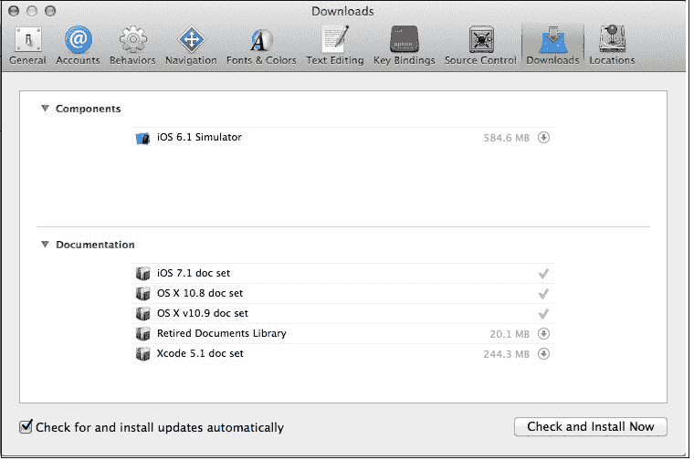
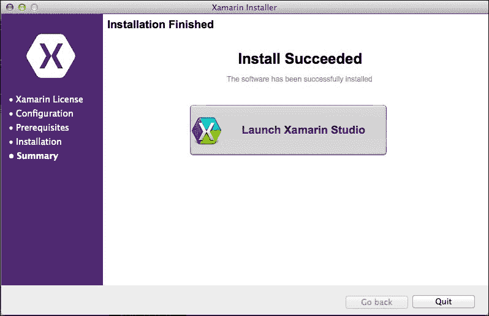
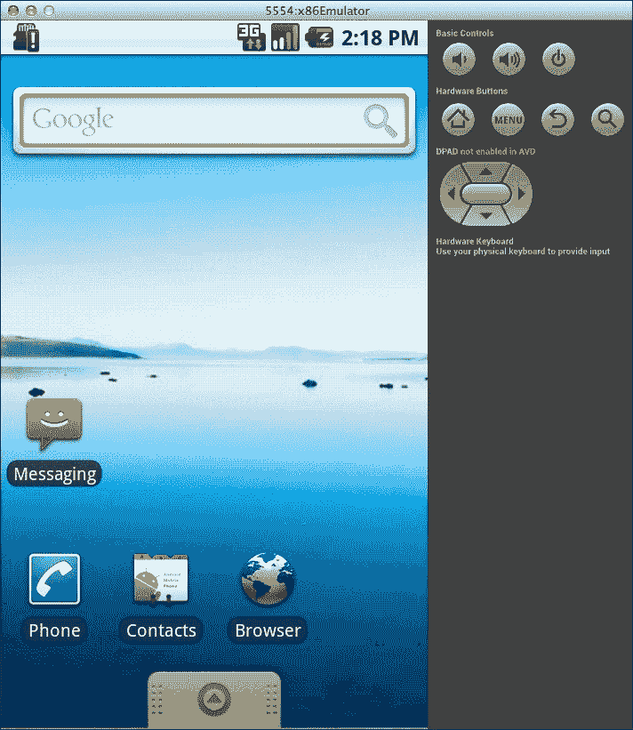
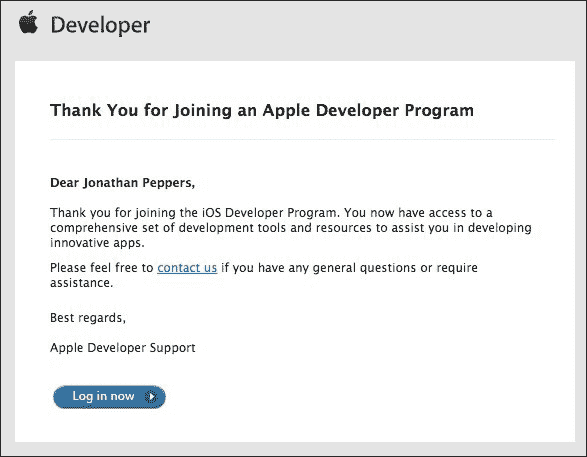
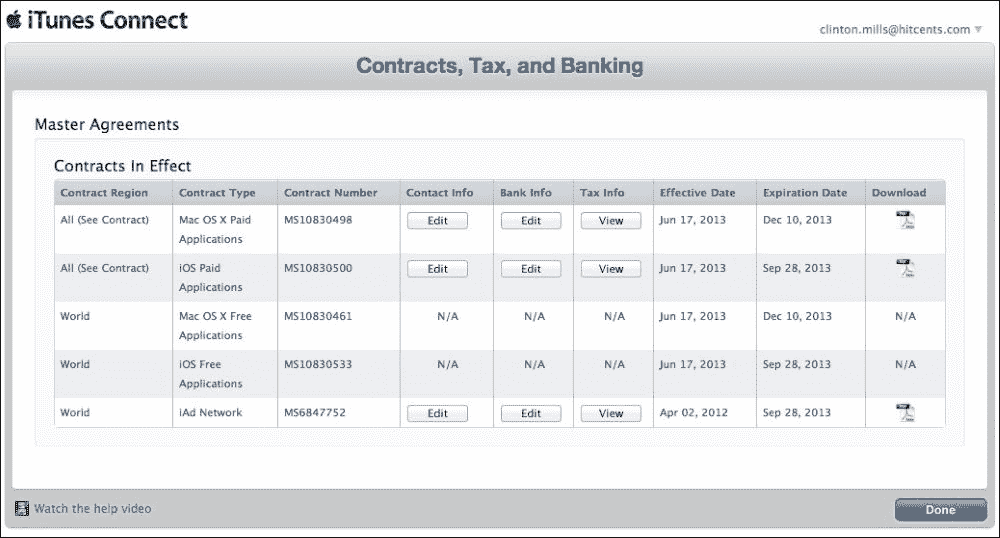
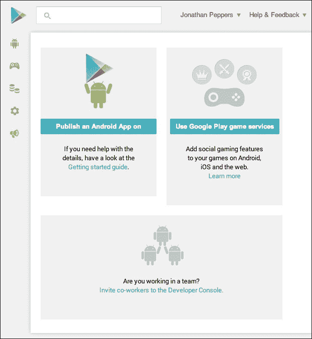

# 第一章. 设置 Xamarin

Xamarin 的开发工具使我们能够使用 C#开发原生 iOS、Android 和 Mac 应用程序，C#是最受欢迎的编程语言之一。选择 Xamarin 而不是 Java 和 Objective-C 来开发移动应用程序有许多优点。您可以在两个平台之间共享代码，并通过利用 C#的高级语言特性和.NET 基类库来提高生产率。否则，您将不得不为 Android 和 iOS 分别编写两次应用程序，并且在使用 Objective-C 时失去垃圾回收的好处。

与使用 JavaScript 和 HTML 开发跨平台应用程序的其他技术相比，Xamarin 也有一些独特的优势。C#通常比 JavaScript 性能更好，Xamarin 为开发者提供了直接访问每个平台原生 API 的能力。这使得 Xamarin 应用程序具有原生外观，并且性能与 Java 或 Objective-C 的对应物相似。

Xamarin 的工具通过将您的 C#编译成原生**ARM**可执行文件来工作，这些文件可以打包成 iOS 或 Android 应用程序。它将 Mono 运行时的精简版与您的应用程序捆绑在一起，只包含您的应用程序使用的基类库的功能。

在本章中，我们将设置您开始使用 Xamarin 开发所需的一切。到本章结束时，我们将安装所有必要的 SDK 和工具，以及提交应用程序商店所需的全部开发者账户。

在本章中，我们将介绍：

+   Xamarin 工具和技术简介

+   安装 Xcode，苹果的 IDE

+   设置所有 Xamarin 工具和软件

+   设置 Android 模拟器

+   加入 iOS 开发者计划

+   注册 Google Play

# Xamarin 工具

Xamarin 为开发跨平台应用程序开发了三个核心产品：**Xamarin Studio**（以前称为 MonoDevelop）、**Xamarin.iOS**（以前称为 MonoTouch）和**Xamarin.Android**（以前称为 Mono for Android）。这些工具允许开发者利用 iOS 和 Android 上的原生库，并且建立在 Mono 运行时之上。

**Mono**，C#和.NET 框架的开源实现，最初由 Novell 开发，用于 Linux 操作系统。由于 iOS 和 Android 在类似程度上基于 Linux，Novell 能够开发 MonoTouch 和 Mono for Android 作为针对新移动平台的产品。在它们发布后不久，另一家公司收购了 Novell，Mono 团队离开了 Novell，成立了一家新公司。不久之后，Xamarin 被创立，专注于完全使用 C#在 iOS 和 Android 上开发这些工具。

准备一台开发机器以用于跨平台应用程序开发可能需要一些时间。更糟糕的是，苹果和谷歌都对它们各自平台上的开发有自己的要求。让我们来看看您的机器上需要安装的内容。

要开始使用 iOS，我们需要安装以下软件：

+   **Xcode**：这是开发 iOS 和 Mac 应用程序的核心 IDE，使用 Objective-C 语言。

+   **Xcode 命令行工具**：这些工具安装在 Xcode 中，为开发者提供了常用的命令行工具和脚本语言，如 Subversion、Git、Perl 和 Ruby。

+   **Mac 的 Mono 运行时**：这是在 OS X 上编译和运行 C#程序所必需的。

+   **Xamarin.iOS**：这是 Xamarin 针对 iOS 开发的核心产品。

Android 开始使用也需要安装以下软件：

+   **Java**：这是在 OS X 上运行 Java 应用程序的核心运行时环境。

+   **Android SDK**：它包含 Google 的标准 SDK、设备驱动程序和用于原生 Android 开发的模拟器。

+   **Mac 的 Mono 运行时**：这是在 OS X 上编译和运行 C#程序所必需的。

+   **Xamarin.Android**：这是 Xamarin 针对 Android 开发的核心产品。

每个安装过程都需要一些时间。如果你可以访问快速的网络连接，这将有助于加快安装和设置过程。一切准备就绪后，让我们一步一步地进行，希望我们可以跳过一些你可能遇到的死胡同。

### 小贴士

需要注意的是，尽管本书没有涉及，Xamarin 也可以在 Windows 和 Visual Studio 上使用。iOS 开发需要 Mac，因此 Windows 开发者必须将 Visual Studio 连接到 Mac 以编译 iOS 应用程序。幸运的是，本书中我们学到的很多东西可以直接应用于在 Windows 上使用 Xamarin。

# 安装 Xcode

为了使事情进展得更顺利，让我们首先安装 Mac 的 Xcode。除了 Apple 的 IDE，它还会安装 Mac 上最常用的开发者工具。确保你有至少 OS X 10.8（Mountain Lion）的版本，并在 App Store 中找到 Xcode，如图所示：

下载和安装这个过程可能会花费相当长的时间。我建议你花点时间享受一杯美妙的咖啡或着手另一个项目来打发时间。

解决完这些问题后，首次启动 Xcode，并逐步完成初始启动对话框。接下来，导航到**Xcode** | **首选项…**以打开 Xcode 的主设置对话框。

在**下载**选项卡中，你会注意到可以在 Xcode 中安装的几个附加包。在这里，你可以下载官方 iOS 文档，Xamarin 安装程序将使用这些文档。可选地，你可以安装较旧的 iOS 模拟器，但我们可以使用本书内容的默认模拟器。完成安装后，你的 Xcode 的**组件**部分应该看起来类似于以下截图：

安装 Xcode 将安装 iOS SDK，这是 iOS 开发的一般要求。由于苹果的限制，iOS SDK 只能在 Mac 上运行。Xamarin 已经尽一切可能确保他们遵循苹果的 iOS 指南，例如限制动态代码生成。Xamarin 的工具也尽可能利用 Xcode 的功能，以避免重新发明轮子。

# 安装 Xamarin

在安装 Xcode 之后，还需要安装几个其他依赖项，以便在 Xamarin 的工具中进行开发。幸运的是，Xamarin 通过创建一个整洁的一站式安装程序来改善了体验。

通过以下步骤安装免费的 Xamarin 入门版：

1.  访问[`Xamarin.com`](http://Xamarin.com)，然后点击大型的**立即下载**按钮。

1.  填写一些关于你自己的基本信息。

1.  下载`XamarinInstaller.dmg`文件并将磁盘镜像挂载。

1.  启动`Install Xamarin.app`并接受任何出现的 OS X 安全警告。

1.  通过安装程序进行操作；默认选项将正常工作。你可以选择安装**Xamarin.Mac**，但这个主题在本书中没有涉及。

Xamarin 安装程序将下载并安装必要的先决条件，例如 Mono 运行时、Java、Android SDK（包括 Android 模拟器和工具），以及你需要启动和运行所需的一切。

你最终会得到以下截图所示的内容，然后我们可以继续征服跨平台开发中的更大主题：

# 选择 Xamarin 许可证

Xamarin 的工具对于普通观察者来说可能有点贵，但我倾向于认为这是使用像 C#这样的更高效的语言所能节省的时间。此外，他们的产品通过允许你开发跨平台应用程序而不是在 Java 和 Objective-C 中分别编写两次，可以为你节省相当一部分的开发时间。

Xamarin 有几个版本，因此了解这些版本之间的差异，以便确定你可能需要购买哪种许可证是很好的。版本如下：

+   **入门版**：仅对个人提供，并且编译用户代码的限制为 64 KB。某些功能不可用，例如 Xamarin.Forms 框架和调用第三方原生库。

+   **独立版**：仅对个人提供，并且不包括 Visual Studio 支持。

+   **商业版**：这是为公司提供的；它为 Visual Studio 添加了功能，并包括更好的 Xamarin 产品支持。

+   **企业版**：这包括 Xamarin 组件存储库中的主要组件免费使用，以及许多其他 Xamarin 支持选项，例如热修复和小于 24 小时的问题响应时间。

# 设置 Android 模拟器

与在物理设备上开发相比，Android 模拟器在历史上一直以运行缓慢而闻名。为了帮助解决这个问题，Google 开发了一个新的 x86 模拟器，该模拟器在桌面计算机上支持硬件加速。它默认不在 **Android 虚拟设备**（**AVD**）管理器中安装，所以让我们设置一下。

通过以下步骤安装 x86 Android 模拟器：

1.  打开 Xamarin Studio。

1.  导航至 **工具** | **打开 Android SDK 管理器…**。

1.  滚动到 **附加组件**；安装 **Intel x86 模拟器加速器 (HAXM**)。这将下载一个安装程序，我们需要运行它。

1.  打开 Finder 并按 *Command* + *Shift* + *G* 打开导航弹出窗口。

1.  导航至 `~/Library/Developer/Xamarin/android-sdk-macosx/extras/intel` 并安装适当的软件包（根据您的 Mac OS X 版本）。

1.  滚动到 **Android 4.4.2 (API 19)**；安装 **Intel x86 Atom 系统镜像**。

1.  可选地，安装您感兴趣的任何其他软件包。作为一个快捷方式，Android SDK 管理器会自动为您选择默认安装的某些软件包。

1.  关闭 Android SDK 管理器并切换回 Xamarin Studio。

1.  导航至 **工具** | **打开 Android 模拟器管理器…**。

1.  点击 **创建…**。

1.  输入您选择的 AVD 名称，例如 `x86 模拟器`。

1.  选择一个适合您显示器的通用设备，例如具有 **4" WVGA** 显示屏的设备。

1.  在 **目标** 中，确保您选择了 **Intel x86 Atom 系统镜像**。

1.  创建设备后，继续点击 **开始…** 以确保模拟器正常运行。

模拟器启动需要一些时间，因此在执行 Android 开发时保持模拟器运行是个好主意。Xamarin 在这里使用标准的 Android 工具，所以您在使用 Java 进行开发时也会遇到同样的问题。如果一切正常启动，您将看到 Android 启动屏幕，然后是一个虚拟的 Android 设备，准备从 Xamarin Studio 部署应用程序，如下面的截图所示：

# 注册 iOS 开发者计划

要部署到 iOS 设备，Apple 要求您加入其 iOS 开发者计划。会员费为每年 99 美元，并允许您部署 200 台设备进行开发。您还可以访问测试服务器，以实现更高级的 iOS 功能，如应用内购买、推送通知和 iOS 游戏中心。在物理设备上测试您的 Xamarin.iOS 应用程序非常重要，因此我建议在开始 iOS 开发之前获取一个账户。在桌面上的模拟器运行与真实移动设备上的性能有很大不同。还有一些仅在真实设备上运行时才会发生的 Xamarin 特定优化。我们将在后面的章节中全面介绍在设备上测试您的应用程序的原因。

通过以下步骤注册 iOS 开发者计划：

1.  前往 [`developer.apple.com/programs/ios`](https://developer.apple.com/programs/ios)。

1.  点击**立即注册**。

1.  使用现有的 iTunes 账户登录或创建一个新的账户。这之后无法更改，因此请选择一个适合您公司的账户。

1.  您可以选择作为个人或公司注册。两者价格均为 99 美元；但是，作为公司注册将需要通过您公司的会计将文件传真给苹果公司。

1.  审查开发者协议。

1.  填写苹果公司的开发者调查问卷。

1.  购买 99 美元的开发者注册费。

1.  等待确认电子邮件。

您应该在两个工作日内收到一封看起来类似于以下截图的电子邮件：

从这里，我们可以继续设置您的账户：

1.  您可以点击收到的电子邮件中的**立即登录**，或者前往 [`itunesconnect.apple.com`](https://itunesconnect.apple.com)。

1.  使用您之前的 iTunes 账户登录。

1.  同意仪表板主页上出现的任何附加协议。

1.  从 iTunes Connect 仪表板导航到**协议、税务和银行**。

1.  在本节中，您将看到三列，分别是**联系信息**、**银行信息**和**税务信息**。

1.  在所有这些部分中填写您账户的相关信息。对于公司账户，可能需要会计的帮助。

一切完成后，您的**合同、税务和银行**部分应该看起来类似于以下截图：

在您的 iOS 开发者账户成功注册后，您现在将能够部署到 iOS 设备并将您的应用程序发布到苹果应用商店。

# 注册为 Google Play 开发者

与 iOS 不同，将您的应用程序部署到 Android 设备是免费的，只需在您的设备设置中进行一些更改。Google Play 开发者账户只需一次性费用 25 美元，并且不需要每年续费。然而，就像 iOS 一样，您将需要一个 Google Play 账户来开发应用内购买、推送通知或 Google Play 游戏服务。如果您不可避免地计划将应用程序提交到 Google Play 或需要实现这些功能之一，我建议您提前设置一个账户。

要注册为 Google Play 的开发者，请执行以下步骤：

1.  前往 [`play.google.com/apps/publish`](https://play.google.com/apps/publish)。

1.  使用现有的 Google 账户登录或创建一个新的账户。这之后无法更改，因此如果需要，请选择一个适合您公司的账户。

1.  接受协议并输入您的信用卡信息。

1.  选择一个开发者名称并输入您账户的其他重要信息。再次强调，请选择适合您公司的名称，以便用户在应用商店中看到。

如果一切填写正确，您最终将得到以下 Google Play 开发者控制台：

如果您计划销售付费应用或应用内购买，在此阶段，我建议您设置您的**Google 商户账户**。这将使 Google 能够通过应用适当的税法在您的国家支付您的应用销售收入。如果您是为公司设置此账户，我建议您寻求您公司会计或簿记员的帮助。

以下是为设置 Google 商户账户的步骤：

1.  点击**设置商户账户**按钮。

1.  使用您的 Google 账户再次登录。

1.  填写销售应用的适当信息：地址、电话号码、税务信息以及将在客户信用卡账单上显示的显示名称。

完成后，您会看到设置商户账户的帮助提示现在已从开发者控制台中消失，如下面的截图所示：

到此为止，人们可能会认为我们的账户已经完全设置好了，但在能够销售应用之前，还有一个至关重要的步骤：我们必须输入银行信息。

设置您的 Google 商户账户的银行信息可以通过以下步骤完成：

1.  返回[`play.google.com/apps/publish`](https://play.google.com/apps/publish)的 Google Play**开发者控制台**。

1.  点击**财务报告**部分。

1.  点击标题为**访问您的商户账户以获取详细信息**的小链接。

1.  您应该会看到一个警告，表明您尚未设置银行账户。点击**指定银行账户**链接开始操作。

1.  输入您的银行信息。再次提醒，可能需要公司会计的帮助。

1.  几天后，查看您的账户中来自 Google 的小额存款。

1.  通过访问[`checkout.google.com/sell`](http://checkout.google.com/sell)来确认金额。

1.  点击**设置**标签，然后点击**财务**。

1.  接下来，点击**验证账户**。

1.  输入您银行账户上显示的金额，然后点击**验证存款**。

您的 Google 商户账户也是您取消或退款客户订单的地方。Google Play 与 iOS 应用商店不同，所有客户问题都直接指向开发者。

# 摘要

在本章中，我们讨论了使用 C#开发 Android 和 iOS 应用程序的 Xamarin 核心产品：Xamarin Studio、Xamarin.iOS 和 Xamarin.Android。我们安装了 Xcode，然后运行了 Xamarin 一站式安装程序，该程序安装了 Java、Android SDK、Xamarin Studio、Xamarin.iOS 和 Xamarin.Android。我们设置了 x86 Android 模拟器，以便在调试应用程序时获得更快速、更流畅的体验。最后，我们为分发我们的应用程序设置了 iOS 和 Google Play 开发者账户。

在本章中，你应该已经掌握了开始使用 Xamarin 构建跨平台应用程序所需的一切。你的开发计算机应该已经准备就绪，并且你应该已经安装了所有原生 SDK，并准备好创建下一个震撼世界的伟大应用。

本章中的概念将为我们准备更高级的主题，这些主题需要安装适当的软件以及拥有苹果和谷歌的开发者账户。我们将部署应用程序到真实设备，并实现更多高级功能，例如推送通知。在下一章中，我们将创建我们的第一个 iOS 和 Android 应用程序，并涵盖每个平台的基础知识。
