# 第二章。你好，平台！

如果您熟悉在 Windows 上使用 Visual Studio 开发应用程序，那么使用 Xamarin Studio 应该非常简单。Xamarin 使用与 Visual Studio 相同的**解决方案**概念，其中包含一个或多个**项目**，并为 iOS 和 Android 应用程序创建了几个新的项目类型。还有几个项目模板可以帮助您快速开始开发常见应用程序。

Xamarin Studio 支持多种开箱即用的项目类型，包括标准的.NET 类库和控制台应用程序。您无法在 Mac 上使用 Xamarin Studio 原生开发 Windows 应用程序，但您当然可以在 Xamarin Studio 中开发应用程序的共享代码部分。我们将在后面的章节中关注代码共享，但请记住，Xamarin 使您能够在支持 C#的大多数平台上共享通用的 C#后端。

在本章中，我们将介绍：

+   为 iOS 创建“Hello World”应用程序

+   苹果的 MVC 模式

+   Xcode 和故事板

+   为 Android 创建“Hello World”应用程序

+   Android 活动

+   Xamarin 的 Android 设计器

# 构建您的第一个 iOS 应用程序

启动 Xamarin Studio 并开始一个新的解决方案。就像在 Visual Studio 中一样，可以从**新建解决方案**对话框创建许多项目类型。Xamarin Studio（以前称为 MonoDevelop）支持开发许多不同类型的项目，例如针对 Mono 运行时的 C#控制台应用程序、NUnit 测试项目，甚至除了 C#之外的其他语言，如 VB 或 C++。

Xamarin Studio 支持以下 iOS 项目类型：

+   **iPhone 或 iPad 项目**：这些项目类别使用故事板来布局 UI，并且仅针对 iPad 或 iPhone。

+   **通用项目**：此类别支持同一 iOS 应用程序中的 iPhone 和 iPad。如果您需要针对这两种类型的设备，则这是首选的项目类型。

+   **单视图应用程序**：这是基本的项目类型，它设置了一个 iOS 故事板、一个视图和一个控制器。

+   **标签应用程序**：这是一个自动设置**UITabViewController**的项目类型，用于具有标签布局的应用程序。

+   **WebView 应用程序**：此项目类型用于创建部分 HTML 和部分本地的*混合*应用程序。应用程序已配置为利用 Xamarin Studio 的 Razor 模板功能。

+   **iOS 绑定项目**：这是一个 iOS 项目，可以为目标 C#库创建 Objective-C 绑定。

+   **iOS 单元测试项目**：这是一个特殊的 iOS 应用程序项目，可以运行 NUnit 测试。

+   **iOS 库项目**：这是一个用于其他 iOS 应用程序项目的类库。

要开始，请导航到**iOS** | **iPhone**，并在您选择的目录中创建**单视图应用程序**，如图所示：

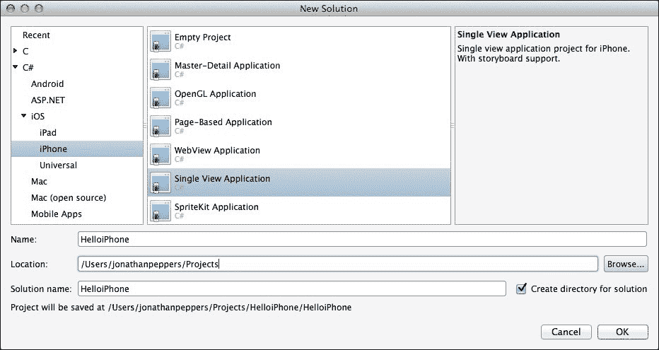

你会注意到，从项目模板中自动创建了几个文件和文件夹。这些文件如下：

+   `组件`：这个文件夹将包含从 Xamarin 组件商店添加的任何组件。有关 Xamarin 组件商店的更多信息，请参阅第九章，*第三方库*。

+   `资源`：这个目录将包含你想要直接复制到应用程序包中的任何图像或纯文本文件。请注意，默认情况下，它将包含一个黑色启动画面图像。这确保了你的 iOS 应用程序在 iPhone 5 上全屏运行。

+   `AppDelegate.cs`：这是苹果处理应用程序级事件的主要类。

+   `Entitlements.plist`：这是一个苹果用来声明某些 iOS 功能（如推送通知和 iCloud）权限的设置文件。你通常只需要为高级 iOS 功能使用它。

+   `*ViewController.cs`：这是代表你应用程序第一个屏幕的控制器。它将具有与你的项目相同的名称。

+   `Info.plist`：这是苹果的`manifest`文件版本，可以声明你的应用程序的各种设置，如应用程序标题、图标、启动画面和其他常见设置。

+   `Main.cs`：这个文件包含 C#程序的常规入口点：`static void Main()`。你很可能不需要修改这个文件。

+   `MainStoryboard.storyboard`：这是你应用程序的故事板定义文件。它将包含你应用程序中视图的布局、控制器列表以及用于在应用程序中导航的过渡。

现在，让我们运行应用程序，看看从项目模板中默认得到什么。点击 Xamarin Studio 左上角的大号播放按钮。你会看到运行你第一个 iOS 应用程序的模拟器，如下面的截图所示：

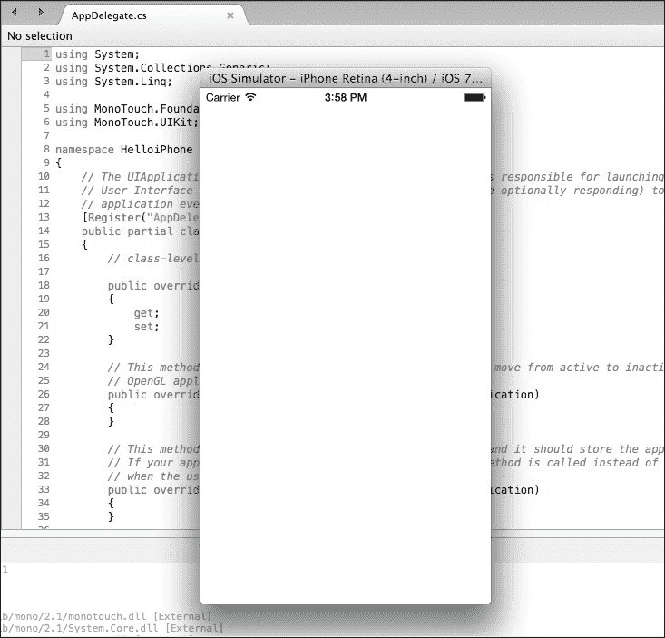

到目前为止，你的应用程序只是一个普通的白色屏幕，既不令人兴奋也不实用。在继续前进之前，让我们先对 iOS 开发有一个更深入的了解。

根据你的应用程序的最低 iOS 目标，你还可以在不同的 iOS 模拟器版本上运行应用程序。苹果还提供了 iPad 和市场上所有不同 iOS 设备的模拟器。重要的是要知道，这些是模拟器而不是仿真器。仿真器将运行移动操作系统的封装版本（就像 Android 一样）。仿真器通常表现出较慢的性能，但提供了更接近真实操作系统的复制品。苹果的模拟器在原生 Mac 应用程序中运行，并不是真正的操作系统。好处是，与 Android 仿真器相比，它们运行得非常快。

# 理解苹果的 MVC 模式

在深入 iOS 开发之前，了解苹果的设计模式以在 iOS 上开发是非常重要的一步。你可能已经使用过**模型-视图-控制器**（**MVC**）模式与其他技术如**ASP.NET**一起使用，但苹果以略不同的方式实现了这个范式。

MVC 设计模式包括以下内容：

+   **模型**：这是驱动应用程序的后端业务逻辑。这可以是任何代码，例如，向服务器发送网络请求或将数据保存到本地的**SQLite**数据库。

+   **视图**：这是屏幕上实际的用户界面。在 iOS 术语中，这是任何从`UIView`派生的类。例如，工具栏、按钮以及用户会在屏幕上看到并与之交互的任何内容。

+   **控制器**：这是 MVC 模式中的工作马。控制器与模型层交互，并使用结果更新视图层。与视图层类似，任何控制器类都将从`UIViewController`派生。这是 iOS 应用程序中大部分代码所在的地方。

下图展示了 MVC 设计模式：

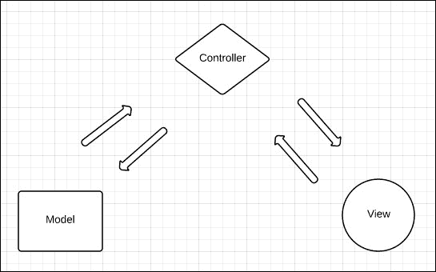

为了更好地理解这个模式，让我们通过以下常见场景的例子来引导你：

1.  我们有一个 iOS 应用程序，其中包含一个搜索框，需要查询网站以获取工作列表。

1.  用户将在`UITextField`文本框中输入一些文本，并点击`UIButton`按钮以开始搜索。这是视图层。

1.  一些代码将通过与视图交互来响应按钮，显示一个`UIActivityIndicatorView`加载指示器，并调用另一个类中的方法来执行搜索。这是控制器层。

1.  在被调用的类中将会发起一个网络请求，并异步返回工作列表。这是模型层。

1.  控制器将随后更新视图以显示工作列表并隐藏加载指示器。

### 注意

关于苹果的 MVC 模式更多信息，请参阅[`developer.apple.com/library/mac/documentation/general/conceptual/devpedia-cocoacore/MVC.html`](https://developer.apple.com/library/mac/documentation/general/conceptual/devpedia-cocoacore/MVC.html)的文档网站。

需要注意的一点是，在应用程序的模型层，你可以自由地做任何你想做的事情。这就是我们可以使用可以在其他平台如 Android 上重用的纯 C#类的地方。这包括使用 C# **基础类库**（**BCL**）的任何功能，例如处理 Web 服务或数据库。本书后面我们将更深入地探讨跨平台架构和代码共享的概念。

# 使用 iOS 设计器

由于我们的纯白色应用程序相当无聊，让我们通过添加一些控件来修改应用程序的 View 层。为此，我们将修改 Xamarin Studio 中项目中的`MainStoryboard.storyboard`文件。可选地，你可以在 Xcode 中打开故事板文件，这是在 Xamarin Studio 中提供设计器之前编辑故事板文件的方法。使用 Xcode 仍然可能很有用，如果 iOS 故事板中有一些功能在 Xamarin 设计器中尚未提供，或者你需要编辑较旧的 iOS 格式，如`XIB`文件。然而，Xcode 的体验并不那么好，因为 Xcode 中的自定义控件渲染为纯白色方块。Xamarin 的设计器实际上在自定义控件中运行你的绘图代码，这样你就可以准确地看到应用程序在运行时的外观。

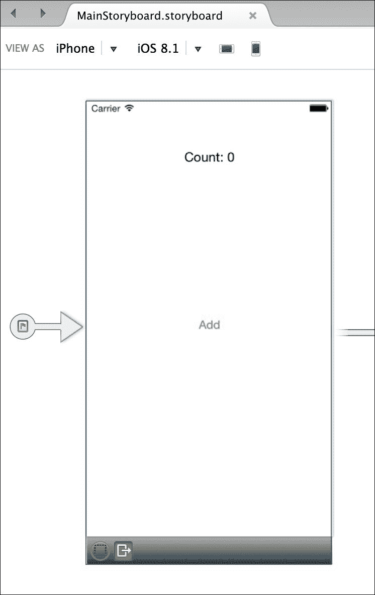

让我们通过以下步骤向我们的应用程序添加一些控件：

1.  打开本章中创建的项目，在 Xamarin Studio 中打开。

1.  双击`MainStoryboard.storyboard`文件。

1.  iOS 设计器将打开，你将看到应用程序中单个控制器的布局。

1.  在右侧的**文档大纲**选项卡中，你会看到你的控制器在其布局层次结构中包含一个视图。

1.  在左上角，你会注意到一个工具箱，其中包含你可以拖放到控制器视图上的几种类型的对象。

1.  在搜索框中，搜索`UILabel`并将标签拖放到你选择的视图位置。

1.  双击标签以编辑标签的文本为任何你想要的。你也可以从底部右角的**属性**选项卡中填写这个值。

1.  同样，搜索`UIButton`并将按钮拖放到视图中的某个位置，位于标签上方或下方。你可以使用**属性**选项卡编辑按钮上的文本。双击按钮将添加一个点击事件处理程序，就像你在为其他平台开发时在 Visual Studio 中熟悉的那样。

1.  运行应用程序。

你的应用程序应该看起来更像一个真正的应用程序，如下面的截图所示：

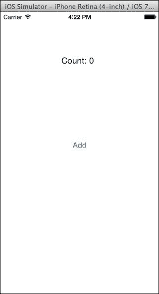

现在，你可能想知道在这个时候如何向应用添加用户交互选项。在 Xcode 的 iOS 设计器中，你可以创建一个**outlet**，这将使每个视图从 C#中可见。outlet 是 Storyboard 或`XIB`文件中视图的引用，在运行时会用视图的实例填充。你可以将这个概念与其他技术（如 ASP.NET MVC、WebForms 或**Windows Presentation Foundation**（**WPF**）中的控件命名进行比较。幸运的是，Xamarin 的 iOS 设计器在设置 outlet 方面比 Xcode 简单得多。你只需在**属性**选项卡中填写**名称**字段，Xamarin Studio 就会在**部分类**中生成一个属性，这让你可以从控制器访问标签和按钮。此外，你还可以从 Storyboard 文件中连接一个**动作**，这是一个在事件发生时会被调用的方法。Xamarin Studio 将 iOS 动作作为部分方法暴露出来，以便在类中实现。

让我们按照以下方式向应用添加一些交互：

1.  切换回 Xamarin Studio。

1.  再次双击`MainStoryboard.storyboard`文件。

1.  选择你之前创建的标签，转到**属性**面板并确保已选择**小部件**选项卡。

1.  在**名称**字段中输入名称`label`。

1.  对按钮重复此过程，并在其**名称**字段中输入名称`button`。

与 Xcode 中过去的使用体验相比，Xamarin 大大改善了这一体验。对于习惯了 Visual Studio 的用户来说，Xcode 的界面很奇怪。创建 outlet 的方法涉及从控件拖动到 Objective-C 头文件。仅填写**名称**字段对有 C#背景的开发者来说要简单得多，也更直观。

现在我们已经定义了两个 outlet，从你的控制器中将有两个新的属性可用。展开解决方案中的`*ViewController.cs`文件并打开`*ViewController.designer.cs`文件。你会看到你的属性如下定义：

```cs
[Outlet]
[GeneratedCode ("iOS Designer", "1.0")]
MonoTouch.UIKit.UILabel label { get; set; }

[Outlet]
[GeneratedCode ("iOS Designer", "1.0")]
MonoTouch.UIKit.UIButton button { get; set; }
```

由于 Xamarin Studio 可以在设计器或 Xcode 中进行进一步更改时重新构建它，因此修改此文件不是一个好主意。尽管如此，了解幕后实际工作原理是一个好的实践。

打开你的`*ViewController.cs`文件，并在控制器中的`ViewDidLoad`方法中输入以下代码：

```cs
public override void ViewDidLoad() 
{
  base.ViewDidLoad();

  int count = 0;
  button.TouchUpInside += (sender, e) => 
    label.Text = string.Format("Count: {0}", ++count);
}
```

当`ViewDidLoad`方法被调用时，你的控制器视图将首次加载。这发生在控制器生命周期的某个时刻。我们订阅了`TouchUpInside`事件，当按钮被点击时，这个事件会被触发；iOS 没有点击事件，这可能是在 Windows 平台上你习惯的。我们还使用了 C#方便的 lambda 表达式语法来在事件触发时更新标签。lambda 表达式是匿名方法的简写，这是自.NET 4.0 以来 C#的一部分特性。

运行你的应用程序，你将能够与按钮交互并增加标签上显示的值，如下面的截图所示：

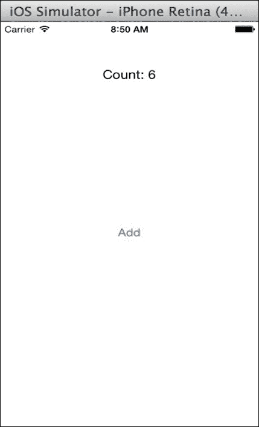

接下来，我们需要从一个控制器转换到另一个控制器。为此，iOS 有一个称为**segue**的概念，它基本上是一种从当前控制器切换到下一个控制器的动画。有几种类型的 segue，但最常见的 segue 是从屏幕的右侧或底部滑动到新的控制器。

现在，让我们按照以下步骤向应用程序添加第二个控制器：

1.  返回你的项目在 Xamarin Studio 中。

1.  双击`MainStoryboard.storyboard`文件。

1.  从对象库中拖动一个新的控制器，通常位于第一个控制器的左下角。

1.  点击控制器以选择它。

1.  选择**属性**面板并确保你处于**小部件**选项卡。

1.  在**类**字段中为控制器输入一个名称，例如`SecondController`。

1.  现在，让我们为从第一个控制器到这个控制器的转换添加一个 segue。在点击原始控制器上的按钮到你的新控制器时按住*Ctrl*键。会出现一条蓝色线条，随后是一个小的弹出菜单。

1.  从弹出菜单中选择**模态**。

1.  从 Xamarin Studio 运行应用程序。

由于我们从第一个控制器的按钮设置了一个模态转换，点击第二个控制器时它将出现。然而，目前还没有退出新控制器的方法。如果你返回 Xamarin Studio，你会注意到已经为你自动创建了一个`SecondController.cs`文件和一个`SecondController.designer.cs`文件。

让我们在`SecondController`中添加一个按钮，如下所示：

1.  返回 Xamarin Studio。

1.  双击`MainStoryboard.storyboard`文件。

1.  从对象库中将一个按钮拖动到第二个控制器上。

1.  导航到**属性**面板和**小部件**选项卡。

1.  将按钮的**名称**设置为`close`。

1.  将按钮的**标题**设置为`Close`。

打开`SecondController.cs`文件并添加以下方法：

```cs
public override void ViewDidLoad()
{
    base.ViewDidLoad();
    close.TouchUpInside += (sender, e) =>       
      DismissViewController(true, null);
}
```

如果你编译并运行你的应用程序，点击按钮将增加标签上的值并显示模态第二个控制器。然后你可以通过点击**Close**按钮来关闭第二个控制器。注意整洁的滑动动画；iOS 自动应用这些类型的转换效果，并且非常容易在 iOS 上自定义：

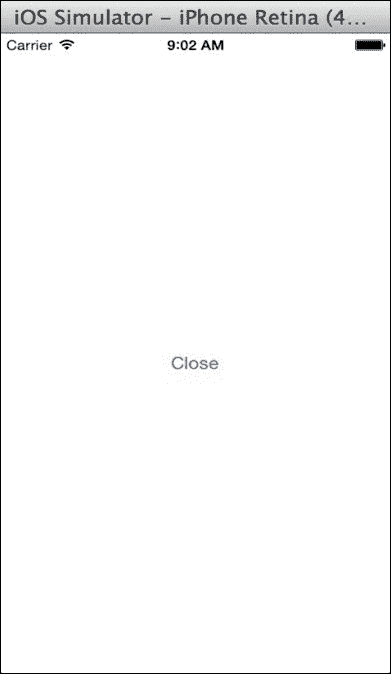

由于我们已经介绍了在 Xamarin 的 iOS 设计器中布局控件的基本知识以及与 C#中的输出交互，让我们回顾一下 iOS 应用程序的标准生命周期。处理应用程序级事件的主要位置在`AppDelegate`类中。

如果你打开你的`AppDelegate.cs`文件，你可以重写以下方法：

+   `FinishedLaunching`：这是应用程序的第一个入口点，它应该返回`true`。

+   `DidEnterBackground`：这意味着用户点击了他们的设备上的主页按钮，或者另一个应用程序，如电话呼叫，进入了前台。你应该执行任何必要的操作来保存用户的进度或 UI 的状态，因为 iOS 可能会关闭你的应用程序以节省内存，一旦被推送到后台。当你的应用程序在后台时，用户可能正在浏览主屏幕或打开其他应用程序。你的应用程序在内存中实际上是被暂停，直到用户恢复。

+   `WillEnterForeground`：这意味着用户已从后台重新打开你的应用程序。你可能需要在这里执行其他操作，例如刷新屏幕上的数据等。

+   `OnResignActivation`：如果操作系统在你的应用程序上方显示系统弹出窗口，就会发生这种情况。例如，这包括日历提醒或用户可以从屏幕顶部向下滑动的菜单。

+   `OnActivated`：在用户返回你的应用程序后，`OnResignActivation` 方法执行后立即发生。

+   `ReceiveMemoryWarning`：这是操作系统发出的警告，提示释放应用程序中的内存。由于 C# 的垃圾回收器，Xamarin 中通常不需要这个方法，但如果你的应用程序中存在像图像这样的重对象，这是一个很好的地方来销毁它们。如果无法释放足够的内存，操作系统可以终止你的应用程序。

+   `HandleOpenUrl`：如果你实现了 **URL scheme**，这将是 iOS 在桌面平台上的文件扩展名关联的等价物。如果你注册你的应用程序以打开不同类型的文件或 URL，此方法将被调用。

同样，在你的 `*ViewController.cs` 文件中，你可以覆盖控制器上的以下方法：

+   `ViewDidLoad`：当与控制器关联的视图被加载时发生。在运行 iOS 6 或更高版本的设备上，它只会发生一次。

+   `ViewWillAppear`：在视图出现在屏幕上之前发生。如果你在应用程序中导航时需要刷新任何视图，这通常是做这件事的最佳位置。

+   `ViewDidAppear`：在完成任何过渡动画并显示视图在屏幕上后发生。在某些不常见的情况下，你可能需要在这里执行操作，而不是在 `ViewWillAppear` 中。

+   `ViewWillDisappear`：在视图被隐藏之前调用此方法。你可能需要在这里执行一些清理操作。

+   `ViewDidDisappear`：在完成显示屏幕上不同控制器的任何过渡动画后发生。就像出现的方法一样，这发生在 `ViewWillDisappear` 之后。

有更多方法可供覆盖，但许多在 iOS 的最新版本中已被弃用。熟悉 Apple 的文档网站[`developer.apple.com/library/ios`](http://developer.apple.com/library/ios)很有帮助。在尝试理解 Apple 的 API 如何工作时，阅读每个类和方法的文档非常有用。学习如何阅读（不一定是代码）Objective-C 也是一个有用的技能，这样你就可以在开发 iOS 应用程序时将 Objective-C 示例转换为 C#。

# 构建你的第一个 Android 应用程序

在 Xamarin Studio 中设置 Android 应用程序与 iOS 一样简单，并且与 Visual Studio 中的体验非常相似。Xamarin Studio 包括几个特定于 Android 的项目模板，以帮助你快速开始开发。

Xamarin Studio 包括以下项目模板：

+   **Android 应用程序**：一个针对您机器上安装的最新 Android SDK 的标准 Android 应用程序。

+   **Android Honeycomb 应用程序**：一个针对 Android Honeycomb（**API**（应用程序编程接口）级别 12 及以上）的项目。

+   **Android 冰淇淋三明治应用程序**：一个针对 Android 冰淇淋三明治（API 级别 15 及以上）的项目。

+   **Android 库项目**：一个只能由 Android 应用程序项目引用的类库。

+   **Android Java 绑定库**：一个用于设置从 C#中调用的 Java 库的项目。

+   **Android OpenGL 应用程序**：一个用于使用低级 OpenGL 进行 3D 或 2D 渲染的项目模板。

+   **Android WebView 应用程序**：一个用于使用 HTML 进行某些部分的混合应用程序的项目模板。支持 Razor 模板。

+   **Android 单元测试项目**：一个用于在 Android 上运行 NUnit 测试的项目。

启动 Xamarin Studio 并开始一个新的解决方案。从**新建解决方案**对话框中，在**Android**部分下创建一个新的**Android 应用程序**。

你最终会得到一个类似于以下截图所示的项目解决方案：

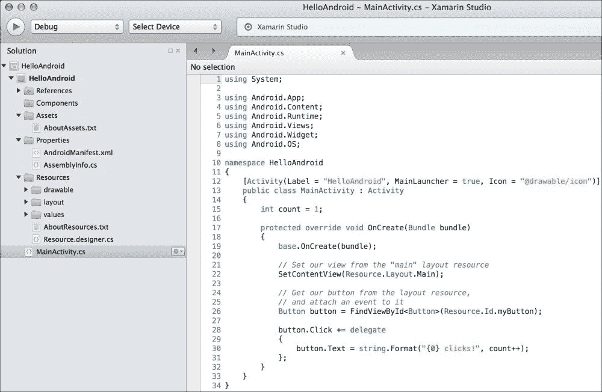

你会看到为你创建了以下特定于 Android 的文件和文件夹：

+   `Components`文件夹：这与 iOS 项目相同；添加 Xamarin Component Store 组件的地方。

+   `Assets`文件夹：此目录将包含具有`AndroidAsset`构建操作的文件。此文件夹将包含与 Android 应用程序捆绑的原始文件。

+   `Properties/AndroidManifest.xml`文件：此文件包含有关您的 Android 应用程序的标准声明，例如应用程序名称、ID 和权限。

+   `Resources`文件夹：资源包括图像、布局、字符串等，可以通过 Android 的资源系统加载。每个文件都会在`Resources.designer.cs`中生成一个 ID，你可以使用它来加载资源。

+   `Resources/drawable` 文件夹：你的应用程序使用的任何图像通常都放在这里。

+   `Resources/layout` 文件夹：这个文件夹包含 Android 使用来声明 UI 的任何 `*.axml`（Android XML）文件。布局可以用于整个 **activity**、**fragment**、**dialog** 或 **child control** 在屏幕上显示。

+   `Resources/values` 文件夹：这个文件夹包含 XML 文件，用于在应用程序中声明字符串（和其他类型）的关键值对。这是在 Android 上设置多语言本地化的常规方法。

+   `MainActivity.cs` 文件：这是 `MainLauncher` 动作和你的 Android 应用程序的第一个活动。在 Android 应用程序中没有 `static void Main` 函数；执行从设置为 `true` 的 `MainLauncher` 活动开始。

现在，让我们执行以下步骤来运行应用程序：

1.  点击播放按钮来编译和运行应用程序。

1.  将会出现一个 **选择设备** 对话框。

1.  选择你想要的模拟器并点击 **启动模拟器**。如果你在 第一章 中设置了 x86 模拟器，*设置 Xamarin*，我建议你使用它。

1.  等待几秒钟，让模拟器启动。一旦启动，如果你正在处理 Android 项目，让它一直运行是个好主意。这将节省你大量等待的时间。

1.  你现在应该能在设备列表中看到启用的模拟器；选择它，然后点击 **确定**。

1.  在第一次将应用程序部署到模拟器或设备时，Xamarin Studio 将必须安装一些东西，例如 Mono 共享运行时和 Android 平台工具。

1.  切换到 Android 模拟器，你的应用程序将显示出来。

当一切完成后，你已经部署了你的第一个 Android 应用程序，包含一个单按钮。你的应用将看起来像以下截图所示：

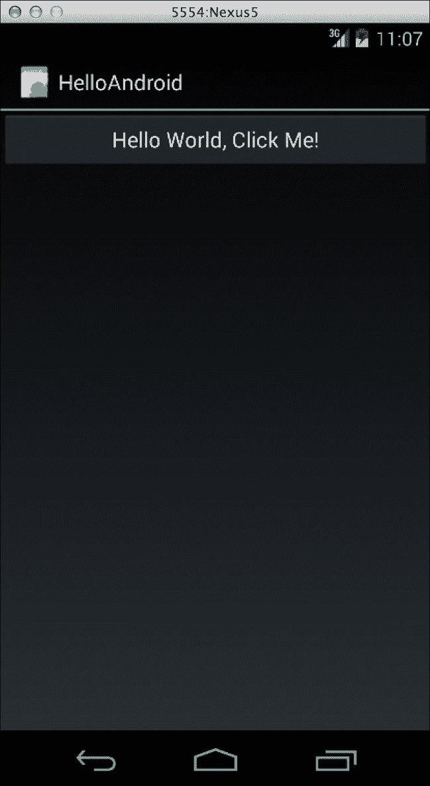

# Android 活动

Android 操作系统非常关注活动这个概念。活动是用户可以在其屏幕上执行的任务或工作单元。例如，用户会执行一个电话 **activity** 来拨号，并执行第二个涉及与他们的地址簿交互以定位号码的活动。每个 Android 应用程序都是由一个或多个活动组成的集合，用户可以启动它们，并在设备上按下硬件的返回键来退出或取消。用户的历史记录保存在 Android **back stack** 中，你可以在特殊情况下从代码中操作它。当一个新的活动开始时，前一个活动会被暂停并保存在内存中，以供以后使用，除非操作系统内存不足。

活动之间是松散耦合的；在某种程度上，你可以将它们视为在内存中具有完全独立的状态。静态值将持久化应用程序的生命周期，就像.NET 应用程序一样，但常见的做法是通过 Android **bundle**传递状态。Android bundle 是一组键值对，用于在 Android 对象之间传递数据。这对于传递列表中显示的项目的标识符以在新活动中编辑该项目非常有用。

活动有以下生命周期回调方法，你可以重写它们：

+   `OnCreate`: 这是创建活动时首先调用的方法。在这里设置你的视图并执行其他加载逻辑。最重要的是，你将在这里调用`SetContentView`来设置活动的视图。

+   `OnResume`: 当你的活动视图在屏幕上可见时会被调用。如果活动首次显示，或者用户从另一个活动返回时，都会调用此方法。

+   `OnPause`: 当用户离开你的活动时会被调用。它可能发生在导航到应用中的新活动之前、锁定屏幕或按 home 按钮时。假设用户可能不会返回，因此你需要在这里保存用户所做的任何更改。

+   `OnStart`: 这发生在`OnResume`之前，当活动的视图即将在屏幕上显示时。它发生在活动启动时，以及用户从另一个活动返回时。

+   `OnStop`: 这发生在`OnPause`之后，当活动的视图不再显示在屏幕上时。

+   `OnRestart`: 当用户从先前活动返回到你的活动时，此方法发生。

+   `OnActivityResult`: 此方法用于与 Android 上其他应用程序中的其他活动进行通信。它与`StartActvityForResult`一起使用；例如，你将使用此方法与 Facebook 应用程序交互以登录用户。

+   `OnDestroy`: 当你的活动即将从内存中释放时会被调用。在这里执行任何可能帮助操作系统的额外清理工作，例如处理活动使用过的任何其他重量级对象。

Android 生命周期的流程图如下：

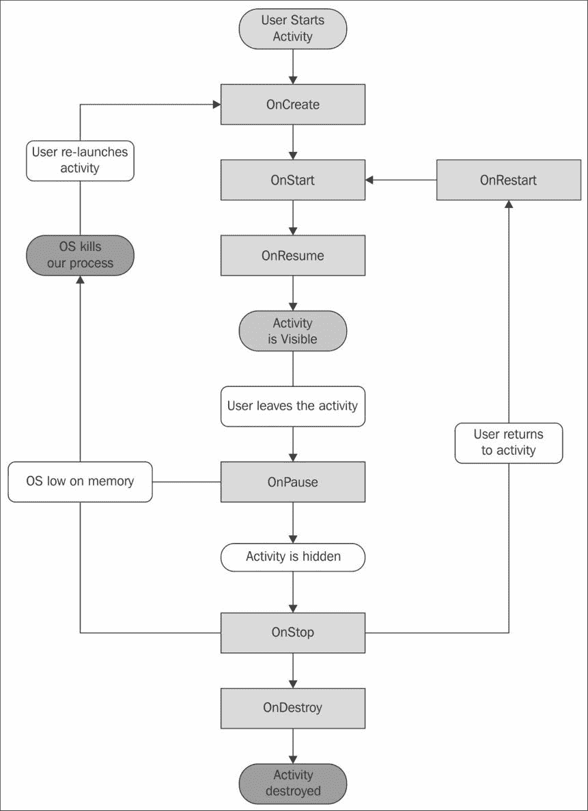

与 iOS 不同，Android 不会对其开发者强制执行任何设计模式。然而，在一定程度上理解 Android 活动生命周期是不可避免的。许多与活动相关的概念与 iOS 中的控制器平行；例如，`OnStart`相当于`ViewWillAppear`，而`OnResume`相当于`ViewDidAppear`。

其他处理活动的方法如下：

+   `StartActivity(Type type)`: 此方法在应用内启动一个新的活动，并传递没有额外信息给活动。

+   `StartActivity(Intent intent)`：这是一个重载方法，用于使用`Intent`启动新的活动。这让你能够向新活动传递额外的信息，你也可以在其他应用程序中启动活动。

+   `StartActivityForResult`：此方法在活动操作完成后预期接收`OnActivityResult`。

+   `Finish`：这将关闭当前活动，并在活动完全关闭且不再显示在屏幕上时调用`OnDestroy`。根据当前后台栈中的内容，用户将返回到先前的活动或主屏幕。

+   `SetContentView`：此方法设置要显示的活动的主视图。它应该在活动显示在屏幕上之前，在`OnCreate`方法中调用。

+   `FindViewById`：这是一个用于定位活动显示的视图的方法。它有一个泛型版本，可以返回适当类型的视图。

你可以将`intent`视为一个描述从活动到活动过渡的对象。你还可以通过 intent 传递额外的数据以及修改活动的显示和用户的导航历史。

除了活动之外，Android 还有片段的概念。你可以将片段视为在父活动内部显示的微型活动。片段对于在应用程序中重用 UI 的不同部分非常有用，还可以帮助你实现平板电脑上的分屏导航。

# Xamarin 的 Android 设计器

Android 项目的默认模板比 iOS 有更多的内置功能。Android 用户界面布局定义在人类可读和可编辑的 XML 文件中。然而，Xamarin Studio 提供了一个优秀的设计工具，允许你拖放控件来定义你的 Android 布局。让我们给你的应用程序添加更多功能并开始使用 Android 设计器。

返回 Xamarin Studio 并执行以下步骤以添加应用程序功能：

1.  在 Xamarin Studio 中打开本章中创建的 Android 项目。

1.  导航到项目中的**资源** | **布局**，并打开`Main.axml`。

1.  你将看到 Android 设计器在 Xamarin Studio 中打开。

1.  从右侧的**工具箱**部分拖动**TextView**到按钮**Hello World, Click Me!**上方的布局中。

1.  在标签中输入一些默认文本，例如`计数：0`。

1.  在右侧的**属性**面板中，你会看到**id**值设置为`@+id/textView1`。让我们将其更改为`@+id/myText`，以便与按钮保持一致。

1.  当我们在这里时，请将按钮上的文本更改为更合适的内容，例如`添加`。

1.  点击播放按钮来编译并运行应用程序。如果你仍然有安卓模拟器，你可以直接切换到它。否则，你将需要重新启动它。

您的 Android 应用程序现在将看起来与您在设计师中做出的更改完全相同，如下所示：

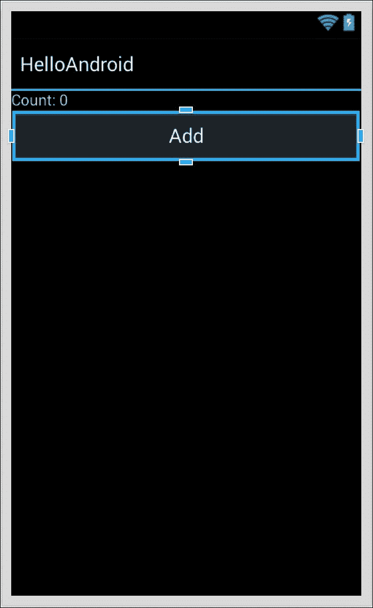

现在，让我们从代码中与新的标签进行交互。切换回 Xamarin Studio 并打开`MainActivity.cs`。让我们修改活动以与**TextView**字段而不是按钮进行交互。我们使用`FindViewById`方法通过在布局文件中设置的 ID 检索视图。Xamarin Studio 还自动生成一个名为`Resource`的静态类来引用您的标识符。

因此，让我们通过在`OnCreate`中放置以下代码来检索**TextView**字段的实例：

```cs
TextView text = FindViewById<TextView>(Resource.Id.myText);
```

`Resource`类是一个 Xamarin 设计师将为您填充的静态类。为了将来参考，您可能需要构建您的 Android 项目以显示新 ID 和其他资源在 Xamarin Studio 中的 C#文件中。

接下来，让我们更新按钮上的`Click`事件：

```cs
button.Click += delegate
{
    text.Text = string.Format("Count: {0}", ++count);
};
```

这将重新连接按钮以更新**TextView**中的文本而不是按钮本身。现在如果我们运行应用程序，我们将得到一个与上一章中 iOS 应用程序功能相同的 Android 应用程序。Android 应用程序的外观如下截图所示：

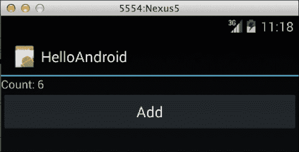

由于我们在布局中添加了一些自己的视图，让我们添加一个第二个活动来加深我们对 Android 中活动理解的认识。

返回 Xamarin Studio 并执行以下步骤：

1.  如果需要，请在 Xamarin Studio 中打开本章中创建的早期 Android 项目。

1.  在**Android**部分的项目中创建一个新的 Android 活动。命名为`SecondActivity.cs`。

1.  导航到**资源** | **布局**，并创建一个名为`Second.axml`的新 Android 布局。

1.  打开`SecondActivity.cs`并在`OnCreate`中添加以下代码：

    ```cs
    SetContentView(Resource.Layout.Second);
    ```

1.  打开`MainActivity.cs`并在按钮的`Click`事件中添加以下代码行：

    ```cs
    StartActivity(typeof(SecondActivity));
    ```

1.  打开`Second.axml`并将一个按钮拖入视图。将其文本设置为`Finish`，例如，并将其 ID 设置为`@+id/finish`。

1.  最后，打开`SecondActivity.cs`并在其`OnCreate`方法中添加以下行：

    ```cs
    var finish = FindViewById<Button>(Resource.Id.finish);
    finish.Click += (sender, e) => Finish();
    ```

1.  构建并运行您的应用程序。

您的应用程序按钮现在除了在标签上增加计数外，还会启动一个新的活动。一旦`SecondActivity`可见，您就可以点击其按钮来结束活动并返回第一个活动。将来，如果您需要从一个活动传递信息到另一个活动，您将需要创建一个`Intent`对象并将其传递给`StartActivity`。您的应用程序的第二个活动如下截图所示：

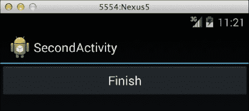

# 摘要

在本章中，我们在 Xamarin Studio 中创建了我们的第一个 iOS 应用程序。我们介绍了苹果的 MVC 设计模式，以便更好地理解`UIViewController`和`UIView`之间的关系，并介绍了如何在 Xamarin Studio 中使用 iOS 设计器来编辑 storyboard 文件。接下来，我们在 Xamarin Studio 中创建了我们的第一个 Android 应用程序，并学习了 Android 的活动生命周期。我们还使用了 Xamarin 的 Android 设计器来修改 Android XML 布局。

从本章涵盖的主题来看，你应该对使用 Xamarin 的工具开发 iOS 和 Android 的简单应用程序有足够的信心。你应该对原生 SDKs 和设计模式有基本的了解，以便在 iOS 和 Android 上完成任务。

在下一章中，我们将介绍使用 Xamarin Studio 在平台间共享代码的各种技术。我们将探讨不同的跨平台应用程序架构方式，以及如何设置 Xamarin Studio 项目和解决方案。
