# 第十二章. App Store 提交

现在你已经完成了跨平台应用的开发，下一步显然是将你的应用分发到应用商店。Xamarin 应用与 Java 或 Objective-C 应用以完全相同的方式进行分发；然而，为了成功地将你的应用提交到商店，仍然有很多障碍需要克服。iOS 有一个官方的审批流程，这使得应用商店提交的过程比 Android 长得多。开发者必须等待一周、一个月或更长时间，具体取决于应用被拒绝的次数。与调试你的应用相比，Android 在提交应用到 Google Play 时需要一些额外的步骤，但你仍然可以在几小时内提交你的应用。

在本章中，我们将介绍：

+   App Store 审查指南

+   将 iOS 应用提交到 App Store

+   设置 Android 签名密钥

+   将 Android 应用提交到 Google Play

+   在应用商店取得成功的技巧

# 遵循 iOS App Store 审查指南

你的应用名称、应用图标、截图和其他方面都在苹果网站上称为 iTunes Connect 的地方声明。销售报告、应用商店拒绝、合同和银行信息以及应用更新都通过 [`itunesconnect.apple.com`](http://itunesconnect.apple.com) 网站进行管理。

苹果的指导方针的主要目的是保持 iOS App Store 安全，无恶意软件。在 iOS App Store 中确实很少发现恶意软件。一般来说，iOS 应用可能对你做的最糟糕的事情就是向你投放广告。在某种程度上，这些指导方针也加强了苹果在应用内支付中的收入分成。遗憾的是，苹果的一些指导方针有争议地消除他们在 iOS 中的一个关键领域的竞争对手。一个例子就是销售电子书的 app，因为它将是 iTunes 和 iBooks 的直接竞争对手。

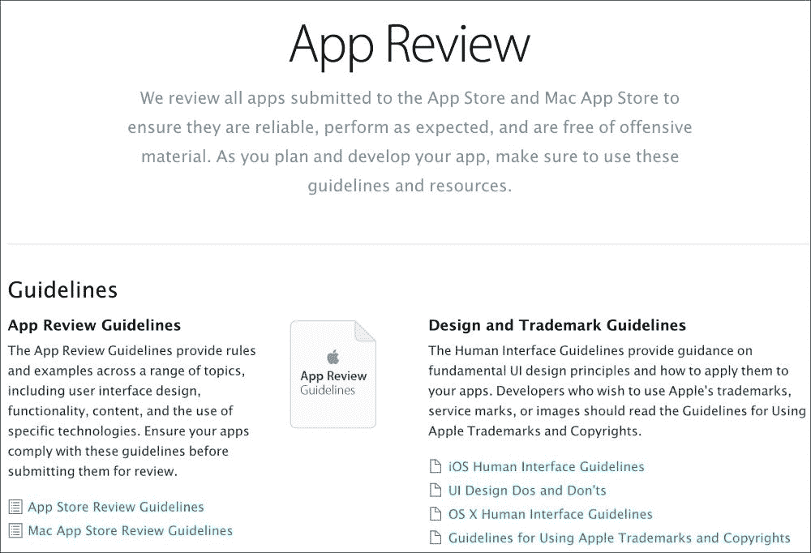

然而，这里的关键点是让你的应用通过商店审批流程，而不会遇到 App Store 的拒绝。只要你不是故意试图违反规则，大多数应用在获得苹果的批准时不会遇到太多困难。最常见的拒绝与开发者的错误有关，这是一个好事，因为你不想向公众发布一个存在关键问题的应用。

App Store 审查指南相当长，所以让我们将其分解为你可能遇到的最常见的情况。完整的指南列表可以在 [`developer.apple.com/appstore/resources/approval/guidelines.html`](https://developer.apple.com/appstore/resources/approval/guidelines.html) 找到。请注意，查看此网站需要有效的 iOS 开发者账户。

## 一般规则

需要遵循的一些一般规则如下：

+   崩溃、有错误或严重失败的应用将被拒绝

+   不按广告宣传执行或包含隐藏功能的应用程序将被拒绝

+   使用非公开的苹果 API 或从文件系统中的禁止位置读取/写入文件的应用程序将被拒绝

+   提供很少价值或过度开发的应用（如手电筒、打嗝或放屁应用）将被拒绝

+   应用程序不能在没有商标持有人许可的情况下使用商标词作为应用程序名称或关键词

+   应用程序不能非法分发受版权保护的材料

+   可以通过移动友好型网站简单实现的应用程序，如包含大量 HTML 内容但无原生功能的应用程序，可能会被拒绝

这些规则有助于保持 iOS App Store 的整体质量和安全性高于其他情况。由于这些规则中的某些规则，将具有非常少功能的简单应用程序放入商店可能会很困难，所以请确保您的应用程序足够有用和吸引人，以便 App Store 审查团队能够允许它在商店中可用。

## 不正确和不完整的信息

一些与开发者犯的错误或 iTunes Connect 中的错误标签相关的规则如下：

+   提及其他移动平台（例如 Android）的应用程序或元数据将被拒绝

+   标记有错误或不适当的类别/类型、截图或图标的程序将被拒绝

+   开发者必须为应用程序提供适当的年龄评级和关键词

+   支持服务、隐私政策和营销 URL 必须在应用程序审查时可用

+   开发者不应声明未使用的 iOS 功能；例如，如果你的应用程序实际上没有使用这些功能，请不要声明使用游戏中心或 iCloud

+   在未经用户同意的情况下使用如位置或推送通知等功能的程序将被拒绝

这些错误有时可能是开发者的一时疏忽。只需确保在提交到 iOS App Store 之前，仔细检查您应用程序的所有信息即可。

## 应用程序中存在的内容

此外，苹果对应用程序中可以包含的内容有以下规定：

+   包含令人反感的内容或可能被视为粗鲁的内容的应用程序将被拒绝

+   设计用来激怒或令用户反感的应用程序将被拒绝

+   包含过多暴力画面的应用程序将被拒绝

+   针对特定政府、种族、文化或公司作为敌人的应用程序将被拒绝

+   图标或截图不符合四岁以上年龄评级的应用程序可能会被拒绝

应用商店向儿童和成人 alike 交付应用程序。苹果还支持对应用程序的**17 岁以上**年龄限制；然而，这将严重限制您应用程序的潜在用户数量。最好保持应用程序干净且适合尽可能多的年龄段。

## 苹果的 70/30 收入分成

列出的下一类规则与苹果从 App Store 获得的 70/30 收入分成相关，如下所示：

+   链接到在网站上销售的产品或软件的应用程序可能会被拒绝。

+   使用除 iOS **内购**（IAPs）之外的支付机制的应用程序将被拒绝。

+   使用 IAPs 购买实体商品的应用程序将被拒绝。

+   应用程序可以显示在应用程序外部购买的数字内容，只要你无法在应用程序内链接到或购买。所有在应用程序内购买的数字内容都必须使用 IAPs。

只要你不试图规避苹果在 App Store 中的收入分成，这些规则就很容易遵循。始终使用 IAPs 来解锁你应用程序内的数字内容。

## 一般性建议

最后但同样重要的是，这里有一些与 App Store 拒绝相关的一般性建议：

+   如果你的应用程序需要用户名和密码，确保你在**演示账户信息**部分包含凭证，以便应用程序审查团队使用。

+   如果你的应用程序包含 IAPs 或其他应用程序审查团队必须明确测试的功能，确保你在**审阅笔记**中包含说明，以便到达你应用程序中的适当屏幕。

+   提前安排！不要让你的产品应用程序被拒绝破坏了截止日期；至少在你的计划中为应用程序商店的批准预留一个月的时间。

+   当有疑问时，在 iTunes Connect 的**审阅笔记**部分尽可能详细地描述。

如果你的应用程序被拒绝，大多数情况下都有一个简单的解决方案。如果违反了规则，苹果的审查团队将明确引用指南，并包括相关的崩溃日志和截图。如果你可以在不提交新版本的情况下纠正问题，你可以通过 iTunes Connect 网站上的**解决方案中心**选项回应应用程序审查团队。如果你上传了新版本，这将使你的应用程序排在队列的末尾等待审查。

iOS 中某些功能的确切和具体规则可能更多，所以如果你在考虑使用 iOS 功能进行创新或跳出常规，请确保查看完整的指南。始终如一，如果你对某个具体指南不确定，最好是就此事寻求专业的法律建议。拨打苹果的支持电话不会对这个主题有任何帮助，因为其支持人员不允许就 App Store 审查指南提供建议。

# 提交应用程序到 iOS App Store

在我们开始提交我们的应用程序到商店之前，我们需要审查一个简短的清单，以确保你准备好这样做。在过程中达到某个点后意识到你遗漏了某些东西或没有做得很正确是非常痛苦的。此外，还有一些要求需要设计师或营销团队满足，这些不应该完全留给开发者。

在开始提交之前，确保你已经做了以下事情：

+   您应用程序的`Info.plist`文件已完全填写。这包括启动画面图像、应用程序图标、应用程序名称和其他需要填写以启用高级功能的设置。请注意，这里的应用程序名称是显示在应用程序图标下的名称。它可以与 App Store 名称不同，并且与 App Store 名称不同，它不需要与商店中的其他所有应用程序都不同。

+   您在 App Store 上至少为您的应用程序选择了三个名称。即使该名称目前在 App Store 上未被占用，它也可能因开发者之前为已从商店中删除的应用程序而不可用。

+   您有一个大型的 1024 x 1024 应用程序图标图像。除非您通过 iTunes（桌面应用程序）分发企业或临时构建，否则不需要将此文件包含在应用程序中。

+   您为您的应用程序针对的每个设备至少有一个截图。这包括针对通用 iOS 应用程序的 iPhone 4 视网膜、iPhone 5、iPhone 6、iPhone 6 Plus 和 iPad 视网膜尺寸的截图。然而，我强烈建议您填写所有五个截图槽。

+   您为 App Store 编写并编辑了良好的描述。

+   您已经选择了一组关键词以改善您应用程序的搜索。

## 创建分发配置文件

一旦您已经复查了前面的清单，我们就可以开始提交过程。我们的第一步将是为 App Store 分发创建一个配置文件。

让我们从执行以下步骤来创建一个新的配置文件开始：

1.  导航到[`developer.apple.com/ios`](http://developer.apple.com/ios)。

1.  点击右侧导航栏中的**证书、标识符和配置文件**。

1.  点击**配置文件**。

1.  点击窗口右上角的加号按钮。

1.  在**分发**下选择**App Store**并点击**继续**。

1.  选择您的应用程序 ID。您应该已经在第七章 *部署和测试在设备上*中创建了一个；点击**继续**。

1.  选择配置文件的证书。通常这里只有一个选项。点击**继续**。

1.  给配置文件一个合适的名称，例如`MyAppAppStore`。点击**生成**。

1.  完成后，您可以手动下载和安装配置文件，或者在 Xcode 的**首选项** | **帐户**下同步您的配置文件，就像我们在书中之前所做的那样。

成功后，您将到达以下屏幕：

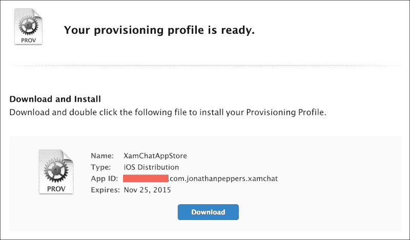

## 将您的应用程序添加到 iTunes Connect

在接下来的步骤中，我们将开始填写您应用程序的详细信息，以便在 Apple App Store 上显示。

我们可以通过以下步骤开始设置您的应用程序在 iTunes Connect 中的配置：

1.  导航到 [`itunesconnect.apple.com`](http://itunesconnect.apple.com) 并登录。

1.  点击**我的应用**。

1.  点击窗口左上角的加号按钮，然后选择**新 iOS 应用**。

1.  输入将在 App Store 上显示的**应用名称**。

1.  输入将在 App Store 上显示的**版本号**。

1.  为你的应用选择一个**主要语言**。

1.  在**SKU**字段中输入一个值。这用于在报告中识别你的应用。

1.  选择你的**包标识符**。你应该已经在第七章 *部署和测试在设备上* 中创建了一个；点击**继续**。

1.  这里需要填写大量的信息。如果你遗漏了任何信息，iTunes Connect 在显示警告方面非常有帮助。由于该网站旨在由市场营销专业人士以及开发者使用，因此应该相当用户友好。

1.  在进行更改后点击**保存**。

还有许多可选字段。确保填写**审查说明**或**演示账户信息**。如果有任何其他信息，应用审查团队将需要审查你的应用程序。完成时，你将看到你的应用程序状态为**准备提交**，如下截图所示：

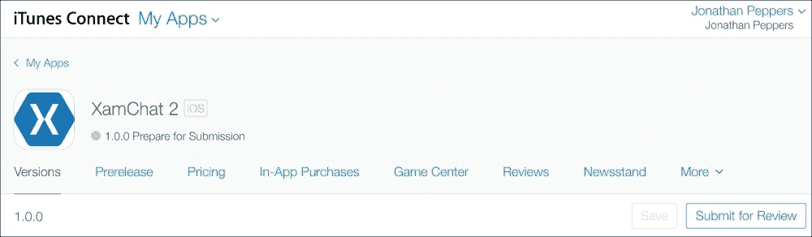

现在我们需要实际将我们的应用上传到 iTunes Connect。你必须上传一个来自 Xcode 或 Application Loader 的构建。两种方法都会产生相同的结果，但有些人如果非开发者提交应用，更喜欢使用 Application Loader。

## 为 App Store 制作 iOS 二进制文件

我们提交 App Store 的最后一步是提供包含我们应用程序的二进制文件给商店。我们需要创建应用程序的**发布**版本，使用本章早期创建的发行版配置文件签名。

Xamarin Studio 使这一过程非常简单。我们可以按照以下方式配置构建：

1.  在 Xamarin Studio 左上角点击解决方案配置下拉菜单并选择**AppStore**。

1.  默认情况下，Xamarin Studio 将设置你需要提交此构建配置的所有配置选项。

1.  接下来，选择你的 iOS 应用程序项目并导航到**构建** | **存档**。

几分钟后，Xamarin Studio 将打开存档构建菜单，如下截图所示：

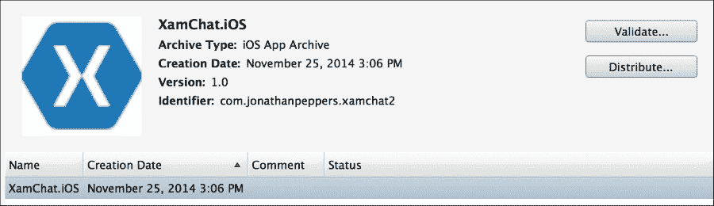

此过程创建一个存储在`~/Library/Developer/Xcode/Archives`的`xarchive`文件。**验证…**按钮将检查您的存档在上传过程中可能出现的任何潜在错误，而**分发…**实际上会将应用程序提交到商店。遗憾的是，在撰写本书时，**分发…**按钮仅启动**应用程序加载器**应用程序，该应用程序无法上传`xarchive`文件。在 Xamarin 解决这个问题之前，您可以通过在**存档**标签的**窗口** | **组织者**中导航到这些选项来访问 Xcode 中的存档选项。

继续在 Xcode 中定位存档；如果它没有出现，您可能需要重新启动 Xcode，并执行以下步骤：

1.  点击**分发…**。不用担心，它将在上传之前验证存档。

1.  选择**提交到 iOS App Store**并点击**下一步**。

1.  使用您的 iTunes Connect 凭据登录并点击**下一步**。

1.  选择适用于应用程序的适当配置文件，然后点击**提交**。

几分钟后，根据您应用程序的大小，您将获得一个确认屏幕，并且您应用程序的状态将变为**上传已接收**。以下截图显示了确认屏幕的外观：

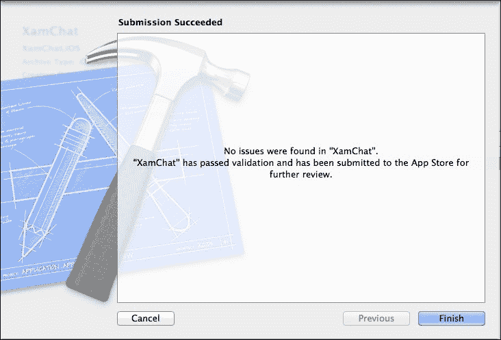

如果您返回到 iTunes Connect，并导航到**预发布**标签，您将看到您刚刚上传的构建，状态为**处理中**：

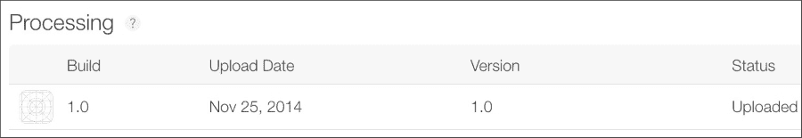

几分钟后，构建过程将得到处理，并可以添加到 App Store 的发布中。下一步是选择**版本**标签下的构建，该标签位于**构建**部分，如下面的截图所示：

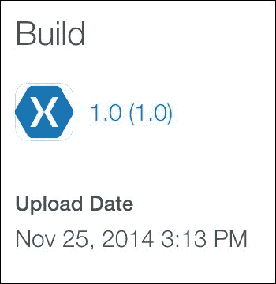

点击**保存**后，您应该能够点击**提交审核**而不会出现任何剩余警告。接下来，回答关于出口法律、广告标识等问题，并点击**提交**作为提交您的应用的最后一步。

在此阶段，当您的应用程序等待苹果员工审核时，您无法控制其状态。这可能需要一到两周，具体取决于待审核应用程序的工作量以及年份。更新也将通过相同的过程，但等待时间通常比新应用程序提交短一些。

幸运的是，有一些情况可以加快此过程。如果您导航到[`developer.apple.com/appstore/contact/?topic=expedite`](https://developer.apple.com/appstore/contact/?topic=expedite)，您可以请求加快应用程序审核。您的问题必须是关键错误修复或与您的应用程序相关的紧急事件。苹果不保证接受加快请求，但在需要时它可能是一个救命稻草。

此外，如果您提交的构建过程中出现问题，您可以通过转到应用详情页面的顶部并选择 **从审查中移除此版本** 来取消提交。在提交后发现错误的情况下，这允许您上传一个新的构建来替换它。

# 为您的 Android 应用程序签名

所有 Android 包（`apk` 文件）都由证书或 `keystore` 文件签名，以便在设备上安装。当您在调试/开发应用程序时，您的包将自动由 Android SDK 生成的开发证书签名。对于开发或甚至测试版，使用此证书是可以的；然而，它不能用于分发到 Google Play 的应用程序。

要创建生产证书，我们可以使用 Android SDK 中包含的命令行工具 `keytool`。要创建自己的 `keystore` 文件，请在终端窗口中运行以下行：

```cs
keytool -genkey -v -keystore <filename>.keystore -alias <key-name> -keyalg RSA -keysize 2048 -validity 10000

```

将 `<filename>` 和 `<key-name>` 替换为您应用程序的适当术语。然后，`keytool` 命令行工具将提示您几个问题，以识别签名的应用程序的当事人。如果您以前曾经使用过 SSL 证书，这个过程非常相似。您还将被提示输入密钥库密码和密钥密码；您可以让它们相同，或者根据您希望密钥有多安全来更改它们。

您的控制台输出将类似于以下截图所示：

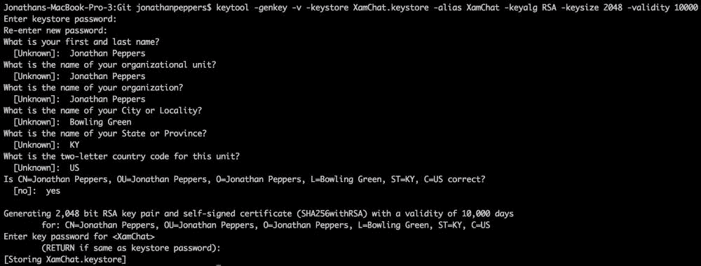

完成后，您应将您的 `keystore` 文件和密码存储在一个非常安全的地方。一旦您使用此 `keystore` 文件签名为应用程序签名并将其提交到 Google Play，您将无法不使用相同的密钥提交应用程序的更新。没有机制可以恢复丢失的 `keystore` 文件。如果您真的丢失了它，您唯一的选择是从商店中删除现有的应用程序，并提交一个包含您更新更改的新应用程序。这可能会使您失去很多用户。

要为 Android 包签名，您可以使用 Android SDK 中包含的另一个命令行工具 `jarsigner`。然而，Xamarin Studio 通过提供一个用户界面来运行您的包，简化了此过程。

在 Xamarin Studio 中打开您的 Android 项目，并按照以下步骤进行操作，以指导您完成签名为 `apk` 文件的流程：

1.  将您的构建配置更改为 **发布**。

1.  选择适当的项目，并导航到 **项目** | **发布 Android 应用程序**。

1.  选择您刚刚创建的 `keystore` 文件。

1.  输入您在创建密钥时使用的 **密码**、**别名** 和 **密钥密码** 字段中的值。单击 **前进**。

1.  选择一个目录来部署 `apk` 文件，然后单击 **创建**。

当操作成功时，Xamarin Studio 将出现一个垫，显示进度。出现的垫看起来就像以下截图所示：

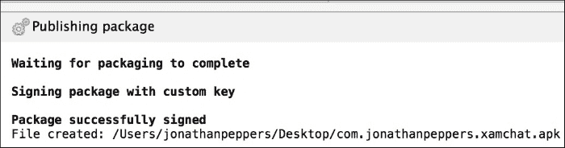

重要的是要注意，Xamarin.Android 在签名 APK 后会自动运行一个名为 `zipalign` 的第二个工具。此工具将 APK 内的字节对齐，以提高您应用的启动时间。如果您计划从命令行本身运行 `jarsigner`，则必须运行 `zipalign`。否则，应用将在启动时崩溃，Google Play 也不会接受该 APK。

# 提交应用至 Google Play

一旦您签名的 Android 包，将您的应用程序提交到 Google Play 相比 iOS 来说相对简单。所有操作都可以通过浏览器中的 **开发者控制台** 选项卡完成，无需上传带有 OS X 应用的包。

在开始提交之前，请确保您已经完成了以下清单上的任务：

+   您已声明了一个包含您的应用程序名称、包名称和图标的 `AndroidManifest.xml` 文件。

+   您有一个使用生产密钥签名的 `apk` 文件。

+   您已为 Google Play 选择了一个应用程序名称。这在商店中不是唯一的。

+   您有一个 512 x 512 的高分辨率图标图像用于 Google Play。

+   您有一个为商店编写的经过编辑的描述。

+   您至少有两个截图。然而，我建议您使用包括手机和 7 英寸及 10 英寸平板电脑尺寸在内的所有八个插槽。

在通过清单后，您应该已经完全准备好将您的应用程序提交到 Google Play。添加新应用的选项卡看起来如下截图所示：

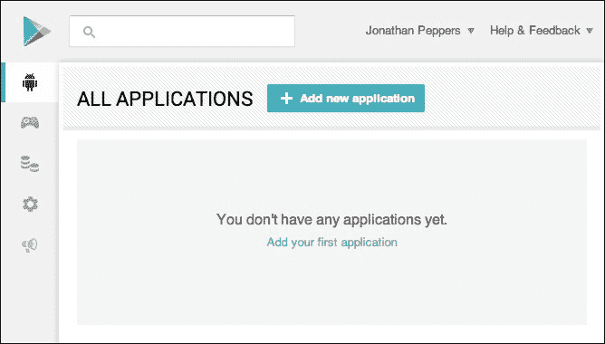

首先，导航到 [`play.google.com/apps/publish`](https://play.google.com/apps/publish) 并登录您的账户，然后执行以下步骤：

1.  选择 **所有应用** 选项卡，然后点击 **添加新应用**。

1.  在 Google Play 上输入要显示的应用名称，然后点击 **上传 APK**。

1.  点击 **上传您的第一个生产 APK**。

1.  浏览到您的已签名 `apk` 文件并点击 **确定**。您将看到 **APK** 选项卡的勾选标记变为绿色。

1.  选择 **商店列表** 选项卡。

1.  填写所有必填字段，包括 **描述**、**高分辨率图标**、**分类** 和 **隐私政策**（或选择表示您不提交政策的复选框），并至少提供两个截图。

1.  点击 **保存**。您将看到 **商店列表** 选项卡上的勾选标记变为绿色。

1.  选择 **定价和分发** 选项卡。

1.  选择价格和您希望分发的国家。

1.  接受 **内容指南** 和 **美国出口法** 的协议。

1.  点击 **保存**。您将看到 **定价和分发** 选项卡上的勾选标记变为绿色。

1.  在右上角选择 **准备发布** 下拉菜单，如图所示，然后选择 **发布此应用**：

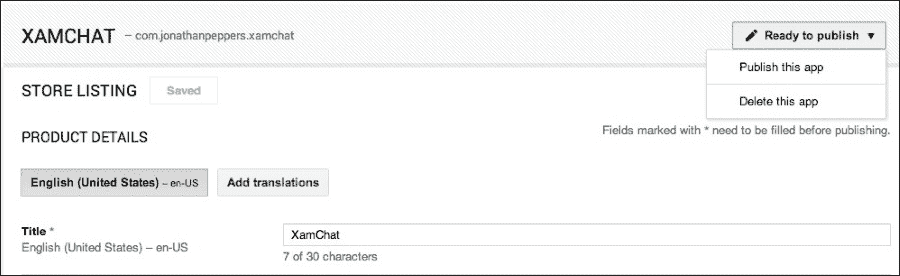

几个小时后，你的应用程序将在 Google Play 上可用。不需要审批流程，并且对应用程序的更新同样痛苦。

## Google Play 开发者计划政策

为了提供一个安全的商店环境，Google 会追溯删除违反其政策的应用程序，并且通常会删除整个开发者账户——而不仅仅是应用程序。Google 的政策旨在提高 Google Play 上应用程序的质量，并且与 iOS 上的规则集相比并不那么冗长。尽管如此，以下是对 Google 政策的简要概述：

+   应用程序不能包含色情内容、过度暴力和仇恨言论。

+   应用程序不能侵犯版权材料。

+   应用程序不能具有恶意性质，也不能在用户不知情的情况下捕获用户的私人信息。

+   应用程序在未经用户同意的情况下不能修改用户设备的基本功能（如修改主屏幕）。如果应用程序包含此功能，则必须让用户能够轻松关闭此功能。

+   你应用程序内的所有数字内容都必须使用 Google Play 的应用内计费（或应用内购买）。物理商品不能使用 IAP 购买。

+   应用程序不得滥用可能使用户产生高额账单的蜂窝网络使用。

与 iOS 一样，如果你对某项政策有疑问，最好是获取有关该政策的专业法律建议。要查看政策的完整列表，请访问[`play.google.com/about/developer-content-policy.html`](https://play.google.com/about/developer-content-policy.html)。

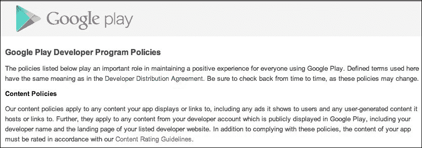

# 制作成功移动应用程序的技巧

从我的个人经验来看，我已经将使用 Xamarin 构建的应用程序提交到 iOS 应用商店和 Google Play 一段时间了。在交付了超过 50 个总下载量达到数百万的应用程序之后，有很多关于什么使一个移动应用程序成功或失败的经验教训要学习。Xamarin 应用程序对于最终用户来说与 Java 或 Objective-C 应用程序无法区分，因此你可以通过遵循与标准 iOS 或 Android 应用程序相同的模式来使你的应用程序成功。

你可以采取很多措施来使你的应用程序更加成功。以下是一些遵循的提示：

+   **定价得当**：如果你的应用程序几乎对任何人都有吸引力，考虑采用从广告位或应用内购买中获利的**免费增值**模式。然而，如果你的应用程序相当细分，将应用程序定价为 1.99 美元或更高将更有利。然而，高级应用程序必须保持更高的质量标准。

+   **了解你的竞争对手**：如果你的应用程序与同一空间中的其他应用程序竞争，请确保你的应用程序比竞争对手更好或提供更广泛的功能集。如果已经有几个与你的应用程序具有相同功能的应用程序，避免这个空间可能也是一个好主意。

+   **提示忠实用户进行评论**：在用户多次打开您的应用程序后请求评论是一个好主意。这给了真正喜欢您的应用程序的用户一个机会来写好评。

+   **支持您的用户**：提供一个有效的支持电子邮件地址或 Facebook 页面，以便您能够轻松与用户互动。回应错误报告和负面评论——Google Play 甚至有选项向在您的应用上写评论的用户发送电子邮件。在应用中直接添加反馈按钮也是一个很好的选择。

+   **保持您的应用程序小巧**：在 iOS 上保持在 100 MB 以下或在 Google Play 上保持在 50 MB 以下将允许用户在他们的蜂窝数据计划下下载您的应用程序。这样做消除了安装应用程序时的摩擦，因为用户会将漫长的下载与运行缓慢的应用程序联系起来。

+   **将您的应用提交到审查网站**：尽可能在网络上获取尽可能多的评论。苹果提供了发送优惠券码的功能，但对于您应用的安卓版本，您可以发送实际的安卓包。将您的应用发送到审查网站或流行的 YouTube 频道可以是一种很好的免费广告方式。

+   **使用应用分析或跟踪服务**：报告您应用的用法和崩溃报告对于理解您的用户非常有帮助。修复野外的崩溃和修改用户界面以改善消费行为非常重要。这些例子包括将 Google Analytics 或 Flurry Analytics 添加到您的应用中。

成功的移动应用程序没有银弹。如果您的应用程序引人入胜，满足需求，并且运行快速且正确，您可能会手握下一个热门产品。能够使用 Xamarin 提供一致的跨平台体验也将使您在竞争对手中占据优势。

# 摘要

在本章中，我们涵盖了您需要了解的一切，以便将您的应用程序提交到 iOS App Store 和 Google Play。我们涵盖了 App Store 审查指南，并将其简化为在审批过程中可能遇到的最常见情况。我们介绍了为您的应用元数据设置流程以及将二进制文件上传到 iTunes Connect 的过程。对于安卓，我们介绍了如何创建生产签名密钥并签名您的安卓包（`apk`）文件。我们还介绍了如何提交应用程序到 Google Play，并在本章结束时提供了关于如何成功并可能盈利地将应用程序提交到应用商店的技巧。

我希望这本书能让您体验到一个端到端、实用的开发真实世界、跨平台应用程序的流程，使用 Xamarin。与替代品相比，C# 是一种如此出色的语言，您应该非常高效。此外，您将通过共享代码来节省时间，而不会以任何方式限制用户的原生体验。
