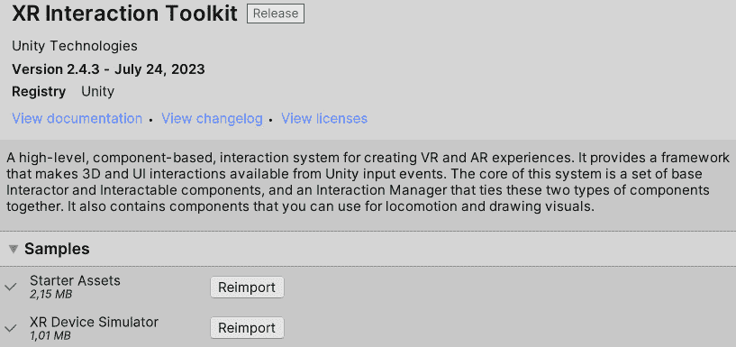
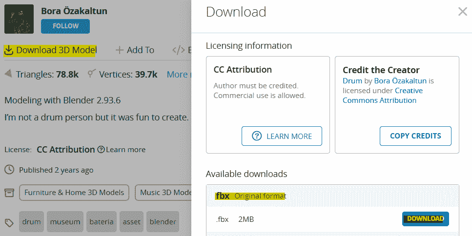
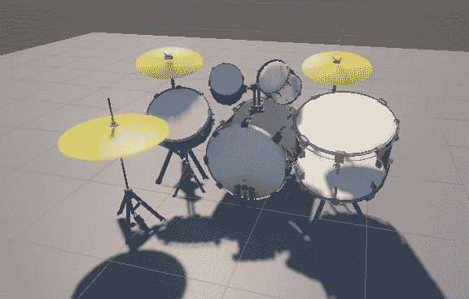
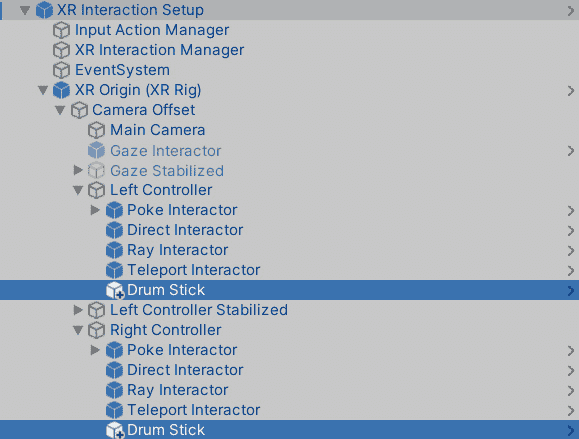
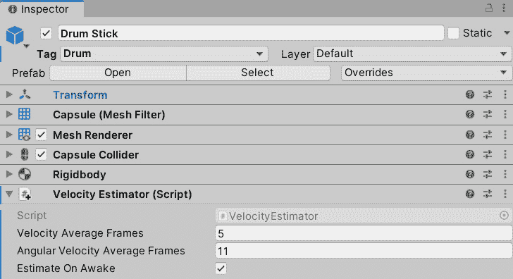
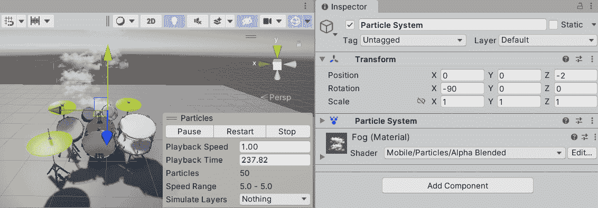
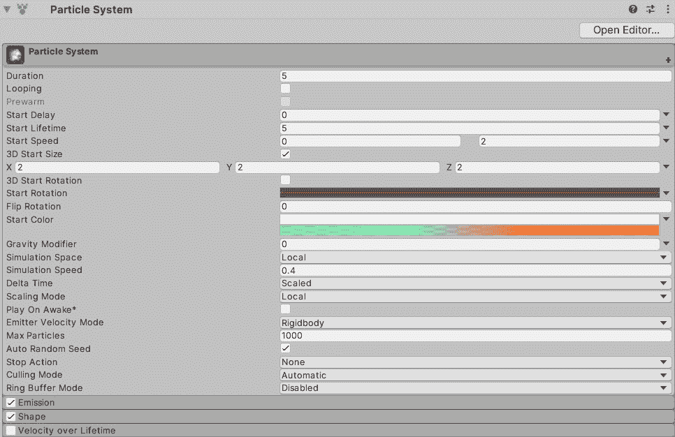
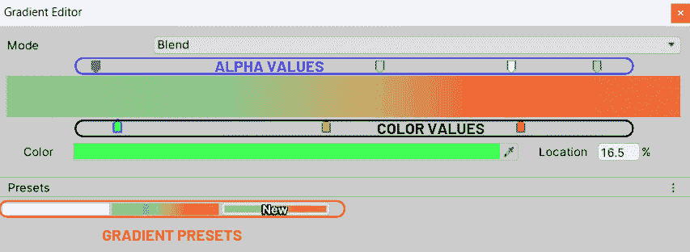
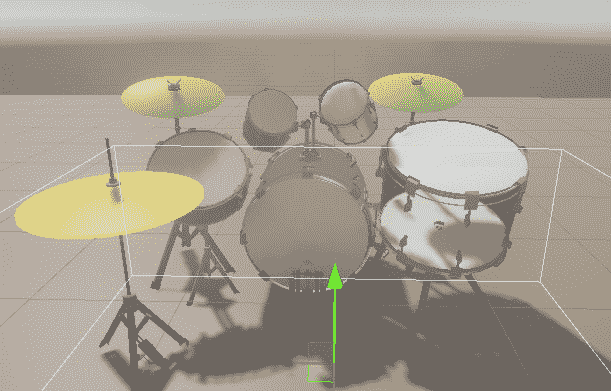
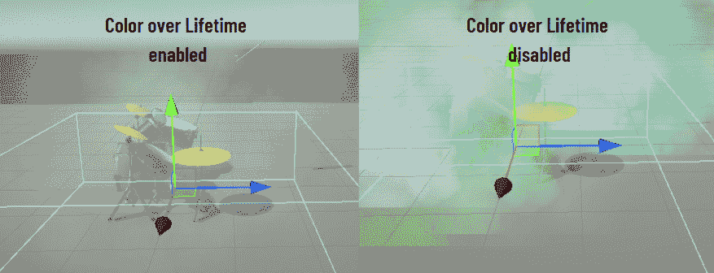

# 第七章：添加声音和视觉效果

创建沉浸式 XR 体验不仅需要导入 3D 资产和编写交互脚本。为了实现真正自然和吸引人的体验，我们需要整合声音和视觉效果。想象一下一个 AR 怪物狩猎游戏。您已经构建了逻辑，但没有声音和视觉效果，现实世界与虚拟现实的感觉就会失调。添加微妙的怪物声音可以提供方向和距离线索。整合如灰色雾气这样的粒子效果可以增强神秘、恐怖的氛围。通过刺激多种感官并调整这些元素以适应用户的动作，我们可以显著增强 AR 怪物狩猎游戏的整体沉浸感和用户体验。

本章旨在提高您的 XR 设计技能，针对更多用户感官以实现自然、沉浸式的体验。我们将深入研究声音理论和粒子行为的基础知识，使这些物理概念对所有用户都易于理解。我们将深入研究 Unity 的音频和粒子系统，了解它们如何帮助我们重现现实世界现象。按照我们的动手实践方法，您将在 Unity 中应用这些概念，创建您迄今为止最沉浸式的 VR 体验。

让我们深入探索创建逼真 XR 体验的激动人心之旅！本章将引导您通过以下四个部分：

+   理解声音理论和 Unity 的音频系统

+   准备 VR 鼓场景并添加音效

+   理解粒子行为和 Unity 的粒子系统

+   在具有不同属性的 VR 场景中添加粒子

# 技术要求

为了充分参与并从本章概述的 VR 应用开发过程中受益，您的硬件必须满足某些技术规格。如果您遵循了*第三章*中的教程，并且您的 Unity 设置保持不变，您可以跳过本节。

要跟随本书的内容和示例，请确保您的计算机系统可以容纳*Unity 2021.3 LTS*或更高版本，以及*Android*或*Windows/Mac/Linux 构建支持*，具体取决于您的 VR 头盔和 PC 的性质。

# 理解声音理论和 Unity 的音频系统

在接下来的章节中，我们将深入研究声波的迷人物理特性，并探讨 Unity 强大的音频系统如何通过其多样化的音频组件来操纵这些属性。我们的旅程从声音的基本原理开始，声音的本质及其定义特征——频率和振幅。

## 频率和振幅是什么？

从本质上讲，声音是一种机械能，它以波的形式通过介质传播——最常见的是空气。简单来说，机械能是与物体运动相关的能量。当一个物体振动时，它会移动周围的空气粒子，引发一系列粒子位移的连锁反应，这些反应以声波的形式向外传播。

描述声音波的两个主要参数是频率和振幅。

**频率**是每秒完成的波周期数，以**赫兹**（**Hz**）为单位测量。它决定了声音的音调——频率越高，音调越高；频率越低，音调越低。在游戏开发中，理解频率至关重要。例如，像小鸟这样小而轻的动物会有高音调（高频）的啁啾，而像大象这样大的动物会有低音调（低频）的吼叫。

**振幅**指的是声波推动粒子的最大位移。简单来说，就是当波通过时粒子被推得有多远。它对应于声音的响度——振幅越大，声音越响；振幅越小，声音越轻。在游戏和 XR 应用中，振幅可以用来创造距离感。远离玩家的声音源会有较小的振幅，因此听起来较轻，而靠近玩家的声音源听起来较响。

## 理解声音的其他特性

虽然频率和振幅是基本的，但还有其他几个特性可以增加 XR 中声音体验的深度。这些包括音色（发音为*tamber*）、包络、空间音频、混响和回声。让我们一步一步地了解它们：

+   **音色**：这描述了声音的颜色或质量，使我们能够区分具有相同音调和响度的不同声音源。在这里，“颜色”指的是声音的独特特征和音调细微差别，使其与其他声音区分开来。这就是我们能够区分小提琴和长笛，即使它们在相同的音量和音调下演奏同一音符的原因。在游戏开发中，音色可以用来给不同的角色或环境赋予它们独特的声音特征。

+   **包络**：声音的包络指的是它随时间的变化。传统上，它被分为四个部分——**攻击、衰减、持续和释放**（**ADSR**）。ADSR 描述了声音的初始峰值（攻击），随后降至稳定水平（衰减），在该水平上维持一段时间（持续），以及声音最终逐渐消失（释放）。在 XR 中，修改 ADSR 包络可以使声音听起来更真实，或者可以创造性地使用，给声音带来一种风格化的感觉。

+   **空间音频**：这指的是对声音源方向和距离的感知。我们的大脑使用几个线索来确定声音源的位置，例如声音到达我们两只耳朵之间的时间差（双耳线索）、耳朵形状引起的频率变化（频谱线索），以及我们移动头部时声音的变化（动态线索）。游戏和 XR 开发者可以模拟这些效果来创建沉浸式的 3D 声音景观，玩家可以在游戏环境中定位声音源。例如，在 VR 恐怖游戏中，你可以使用空间音频让玩家听起来像是从玩家肩膀上方传来的诡异低语，或者像怪物逼近的脚步声越来越近。这些技术可以显著增强沉浸感和游戏体验，因为玩家可以利用声音来导航环境或检测威胁。

+   **混响**或**回声**：这是在原始声音移除后，特定空间中声音的持续存在。它是由声音波在环境中的表面（如墙壁和地板）反射造成的，产生了众多逐渐消失的回声。这可以让玩家感受到他们所在空间的大小和材质——一个大型、石墙的大教堂会有长而明亮的混响，而一个小型、地毯覆盖的房间则会有短而暗淡的混响。

+   **回声**：这是可以清楚识别为原始声音重复的明显延迟声音反射。它发生在声音波从远处障碍物反弹回来，并在明显的时间间隔后到达听者时。反射返回所需的时间可以让听者对反射表面的距离有印象——山脉会产生长延迟的回声，而较近的建筑可能会产生更快、更直接的回声。不同的表面也会影响回声的音调质量，硬表面如混凝土产生的回声比软表面如茂密的植被更清晰。

理解和操作这些声音方面的特性，可以使你在 XR 应用程序中创建丰富、沉浸和交互式的声音景观。通过精心设计，声音不仅可以作为视觉体验的伴奏，还可以成为游戏玩法和沉浸感的关键元素。以下部分将向您介绍 Unity 的音频系统，我们将在本章中多次使用它，为我们的 XR 体验注入更多生命力和沉浸感。

## 探索 Unity 的音频系统

声音设计是创建沉浸式 XR 体验的重要组成部分。使用 Unity 的音频系统，你可以创建动态、空间化的音频，它会对玩家的动作和移动做出反应，增强沉浸感甚至引导游戏玩法。

例如，在 VR 恐怖游戏中，您可以使用空间化声音来创造一种不祥的氛围并建立紧张感。远处的诡异声音可能暗示着看不见的危险，而突然的近距离声音可能提供跳跃惊吓。随着玩家在环境中导航，声音根据他们的位置和方向变化，使虚拟世界感觉生动且反应灵敏。

理解并有效地使用 Unity 的音频系统是任何 XR 开发者必备的关键技能。声音不仅仅是视觉的附属品；它也是叙事、玩家指导和世界构建的强大工具。

现在让我们更详细地看看 Unity 音频系统的三个核心组件——AudioClips、AudioSources 和 AudioListeners。

+   `AudioClip` 代表一个可以在您的应用程序中播放的声音文件。它包含声音数据，但单独的 `AudioClip` 文件实际上不能产生声音。将 `AudioClip` 文件想象成一张 CD——它包含音乐，但您需要一个 CD 播放器才能真正听到音乐。`AudioClip` 文件非常灵活——您可以用它们来制作短声音效果，如角色的脚步声，或者用于较长的音频片段，如背景音乐或对话。Unity 支持多种音频文件格式，包括 `.wav`、`.mp3` 和 `.ogg`。在设计 XR 的声音时，请记住，音质对于沉浸感非常重要。高质量的 `AudioClip` 文件可以使虚拟环境感觉更加真实。

+   `AudioSource` 就像是您的 `AudioClip` 文件的 CD 播放器。它是一个可以附加到 GameObject 上的组件，用于播放声音。您可以将其视为您 3D 空间中声音起源的点。在 Unity 应用程序中听到的每一个声音都源自 `AudioSource` 组件。`AudioSource` 组件在场景中播放 `AudioClip` 文件，并控制声音的播放方式。`AudioSource` 组件提供了一些您可以操作的属性：

    +   将要播放的 `AudioClip` 文件。

    +   `AudioSource` 组件将在场景开始时立即播放其 `AudioClip` 文件。

    +   `AudioSource` 组件将循环其 `AudioClip` 文件，一旦结束就重新开始播放。

    +   `AudioSource` 组件，并且可以用来淡入或淡出声音。

    +   `AudioSource`。值越高，音调越高；值越低，音调越低。这可以用来创建 **多普勒效应**，即观察者相对于其源移动时波频率或波长的变化——例如，行驶的汽车的声音从高音调变为低音调。

    +   **3D 声音设置**：这些设置控制声音如何受到距离的影响。您可以设置声音随着距离变远而变弱，改变音调，等等。这对于 XR 应用程序至关重要，因为它有助于创造空间感和现实感。

+   场景中的`AudioSource`组件被处理以创建玩家最终听到的混合声音。在大多数游戏和 XR 应用中，`AudioListener`连接到主相机或玩家的化身。当玩家在环境中移动时，根据它们与`AudioListener`的距离和方向，不同的声音会变得更大或更小，从而创建一个动态的声音景观。

重要提示

重要的是要注意，您通常只应在场景中有一个`AudioListener`。拥有多个可能会导致声音重复，这可能导致失真和其他音频伪影。

以下部分将指导您如何通过一个新的、动手的 VR 项目将这些组件集成到您的 Unity 场景中。

# 准备 VR 鼓场景并添加音效

在探索声音波动的物理特性和 Unity 的音频系统之后，您最终将把理论知识应用于构建自己的 VR 鼓场景。

一旦您创建了一个包含各种鼓的 VR 场景，玩家可以用双手的 VR 鼓槌击打这些鼓，您将发现如何通过为每个被击打的鼓分配不同的声音文件来增强您的设置。此外，您还将学习如何根据 VR 鼓槌施加的打击强度调整声音音量，增加额外的真实感。这个经过优化的 VR 鼓击环境将使用户沉浸在令人印象深刻且引人入胜的鼓击体验中。现在让我们设置并准备我们的 VR 鼓场景。

## 设置和准备您的 VR 鼓场景

以下步骤将指导您如何创建项目、在 Unity 编辑器中设置所需的 VR 设置，并添加一个带有地面层的玩家。

1.  使用 URP 创建一个新项目，选择`Drum Scene`。

1.  场景加载完成后，导航到**编辑** | **项目设置** | **XR 插件管理**并点击**安装**按钮。安装完成后，启用**OpenXR**复选框。如果您被提示重新启动编辑器，请按照指示操作。

1.  在**编辑** | **项目设置** | **XR 插件管理**下，进入**OpenXR**子菜单。在**Windows/Linux/Mac**选项卡下，选择与您的头戴设备相匹配的交互配置文件。

1.  要将所需的预制件添加到我们的 VR 玩家场景中，我们需要安装 XR 交互工具包。为此，请转到`com.unity.xr.interaction.toolkit`和`2.5.1`，然后点击**添加**按钮。这将自动将 XR 交互工具包安装到您的场景中。安装过程完成后，在**包管理器**窗口中选择**XR 交互工具包**，并点击**Starter Assets**和**XR 设备模拟器**旁边的**导入**按钮，如图*图 7.1*所示。



图 7.1 – XR 交互工具包成功安装在包管理器窗口中，与导入的起始资源和 XR 设备模拟器一起

1.  在层级中删除现有的主摄像机，因为我们将要添加的 VR 玩家自带一个视角摄像机。现在，导航到`floor`下的`Assets`文件夹，并将其放置在原点（`0`, `0`, `0`）。

哈喽！你已经在 Unity 中为 VR 鼓场景搭建了框架！接下来的部分将指导你如何将鼓和鼓槌添加到你的场景中。

## 为你的 VR 鼓场景创建和导入 3D 模型

虽然 Unity Asset Store 提供了大量的不同 3D 模型，但它不提供适合我们项目的免费鼓模型。因此，我们将利用在*Sketchfab*上可用的 3D 模型，这是一个丰富的平台，允许你从广泛的创作者那里下载免费和付费的 3D 模型。

本章所选的鼓模型可在[`skfb.ly/o8QvS`](https://skfb.ly/o8QvS)找到，由 Bora Özakaltun 创建。打开链接，并按*图 7.2*所示下载免费的`.fbx`格式模型。



图 7.2 – 下载鼓模型为.fbx 文件所需的鼠标点击（以黄色突出显示）

重要提示

如果在阅读时模型不可用，你可以从本书的 GitHub 仓库克隆整个项目，并从那里提取资产。

下载完文件夹后，解压缩所有子文件夹。然后，将解压缩的鼓文件夹拖入你的**项目**窗口，完成模型导入。现在，是时候将鼓整合到你的虚拟环境中了。按照以下步骤将鼓放置在你的场景中：

1.  在`Assets`文件夹中，然后到`drum` | “源目录”。在这里，你可以找到你之前导入的鼓模型。

1.  选择**鼓**文件并将其拖入你的场景。这样做后，你可能观察到鼓在环境中显得不成比例地大。

1.  为了纠正尺寸问题，在层级中选择鼓并将其缩小到尺寸（`0.02`、`0.02`、`0.02`）。将鼓放置在原点坐标（`0`、`0`、`0`），使其在虚拟空间中完美对齐。

完成这些调整后，你的场景应该类似于*图 7.3*中的描述。



图 7.3 – 你的鼓场景在 Unity 编辑器的游戏视图中当前应该看起来是什么样子

现在，我们需要鼓槌来与鼓进行交互。通过以下步骤，我们将在 Unity 中创建自己的鼓槌：

1.  在场景层级中右键单击，导航到`0.01`、`0.2`、`0.01`）。将此 GameObject 重命名为`Drum Stick`。

1.  如您在**Inspector**窗口中所见，鼓棒自动包含一个**Capsule Collider**组件。**Capsule Collider**是 Unity 中用于模拟胶囊或药丸形状的 3D 形状，用于检测物体之间的碰撞。此外，向鼓棒添加一个**Rigidbody**组件也是必不可少的。这允许物体在 Unity 环境中受到力和物理的影响，实现如沉浸式鼓击体验所需的动态交互。选择鼓棒后，转到其**Inspector**窗口并选择**Add Component**按钮。现在，通过搜索并选择它来添加一个**Rigidbody**组件。此组件允许 Unity 的物理引擎将鼓棒视为物理对象，模拟对力的交互和反应，这对于在打击鼓时真实地模拟鼓棒的行为至关重要。

1.  将**Rigidbody**组件的**Collision Detection**设置为**Continuous Speculative**。此模式可以更准确、更高效地处理鼓棒与其他物体之间的碰撞，尤其是在处理鼓击时典型的快速动作。

1.  在`Assets`文件夹中创建一个新的材质，命名为`Drum Stick Material`。从[`commons.wikimedia.org/wiki/File:Balsa_Wood_Texture.jpg`](https://commons.wikimedia.org/wiki/File:Balsa_Wood_Texture.jpg)下载`Balsa_Wood_Texture.jpg`并将其导入到项目中。选择`Drum Stick Material`，在**Base Map**字段中选择`Balsa_Wood_Texture.jpg`。将此材质应用到鼓棒上。

1.  选择`Drum Stick`，点击`Drum`，并保存标签。我们稍后将需要此标签来引用场景中的鼓棒。

1.  在`Prefabs`中，将鼓棒拖入其中。这将创建一个预制体，允许轻松复制和修改。

1.  最后，根据*图 7.4*的详细说明，将预制体作为子对象附加到左侧控制器和右侧控制器上。



图 7.4 – 在场景层次结构窗口中，每个鼓棒成功附加到 XR Origin 的相应控制器上

您已成功完成设置和准备 VR 鼓场景的所有步骤。在下一节中，您将学习如何利用 Unity 的音频系统为场景添加音效。

## 为您的 VR 鼓场景添加音效

本节将指导您通过添加音效到您的 VR 鼓场景的过程。第一步涉及在击打乐器时触发音频，为场景增添真实感和参与感。

### 在 VR 鼓场景中为碰撞触发声音播放的脚本编写

为了在鼓棒与鼓碰撞时触发声音播放，我们必须使用 C#脚本。按照以下步骤正确准备您的鼓：

1.  在 Unity 编辑器中，按键盘上的 *Ctrl* / *Cmd*，然后 *左键点击* 以选择场景层次结构中的所有鼓。

1.  选择鼓后，通过**检查器**窗口点击**添加组件**按钮，搜索并选择**盒子碰撞体**组件来添加一个**盒子碰撞体**组件。

1.  然后，我们必须确保碰撞体作为触发器工作，允许它启动动作而不是物理交互。为此，在**检查器**窗口中，为每个鼓的**盒子碰撞体**组件选择**是触发器**复选框。此选项将碰撞体转换为一个非物理边界，可以检测物体通过时的情况，使其在碰撞时触发声音变得至关重要。

1.  选择场景层次结构中的所有鼓，点击 `PlaySoundOnCollision`，然后点击**新建脚本**。此操作自动将脚本与所有选定的鼓关联起来。

1.  在**检查器**窗口中，双击 `PlaySoundOnCollision` 脚本来打开它。

一旦脚本在您首选的 IDE 中打开，定义以下三个变量：

```cs
public AudioClip soundClip;
private AudioSource _soundSource;
public string tag;
```

我们将使用公共的 `AudioClip` 变量来播放音频，使用私有的 `AudioSource` 变量来播放剪辑，并将公共的 `tag` 变量分配给鼓槌，以便只有这些 GameObject 可以触发声音。

重要提示

```cs
tag variable to trigger sound.
```

在 `PlaySoundOnCollision` 脚本的 `Start()` 函数中，添加以下代码行以在体验开始时访问 `AudioSource`：

```cs
_soundSource = GetComponent<AudioSource>();
```

由于我们不是持续检查变化，因此在这个脚本中不需要 `Update()` 函数。相反，我们将实现一个 `OnTriggerEnter()` 方法，该方法在某个物体与触发器碰撞时被调用：

```cs
private void OnTriggerEnter(Collider other) {
    if (other.CompareTag(tag))
    {
        _soundSource.PlayOneShot(soundClip);
    }
}
```

`OnTriggerEnter()` 是一个 Unity 引擎在发生触发器碰撞时自动调用的特殊 Unity 方法。这也是为什么我们不需要在我们的脚本中调用此函数，以及为什么我们在之前的设置中选择了**是触发器**复选框的原因。

在 `OnTriggerEnter()` 方法中，我们调用 `CompareTag()`，这是一个来自 `GameObject` 类的内置 Unity 函数。通过在 `if` 语句中调用它，我们将碰撞对象的标签与一个字符串进行比较。使用标签有助于确保只有在鼓槌与鼓碰撞时才播放声音，而不是其他物体可能与之碰撞时。通过为鼓槌分配一个唯一的标签，类似于我们使用的 `Drum` 标签，我们可以在 `OnTriggerEnter()` 方法中轻松高效地识别它们，并且只在它们与鼓的碰撞时播放声音。

重要提示

到目前为止，您可能想知道为什么我们使用`CompareTag()`而不是直接使用相等运算符（`==`）来比较标签。这样做的原因是使用`CompareTag()`在计算上更高效。在 Unity 中，标签存储在一个内部哈希格式中，`CompareTag()`比较这些哈希值，而相等运算符会首先将哈希值转换为字符串，这使得比较速度变慢。

如果标签比较返回`true`，则执行下一行。`_soundSource`变量指的是我们稍后将要附加到鼓上的`AudioSource`组件。`PlayOneShot()`方法是`AudioSource`组件的另一个 Unity 函数。这种功能对于我们鼓场景的真实性至关重要。我们不是单独听到每个鼓的敲击声，而是希望创造一个连续的声音流。能够叠加单个敲击声使得体验更加沉浸和真实，反映了鼓快速连续敲击时自然发生的重叠。使用`PlayOneShot()`方法确保声音和谐融合，捕捉到现场鼓演奏的精髓。

通过结合这些元素，`OnTriggerEnter()`方法确保当鼓槌接触到鼓时，播放指定的声音，在虚拟环境中产生即时的真实反应。这是一种强大的方式，可以增加沉浸感和交互性到您的 VR 体验中。在完成`PlaySoundOnCollision`脚本后，现在终于可以给每个鼓添加声音文件了。

### 为您的 VR 鼓场景添加声音文件

在本节中，您将学习如何导入声音文件并为每个鼓分配`AudioSource`组件。让我们一步一步地完成这个过程：

1.  下载 Unity 场景中每个鼓的适当声音文件。您可以在[`www.freesoundslibrary.com/`](https://www.freesoundslibrary.com/)或[`pixabay.com/sound-effects/`](https://pixabay.com/sound-effects/)等网站上找到免费的`.mp3`声音文件。或者，您可以选择使用与本章链接的 Unity 项目中提供的声音文件。这些文件可以在本书的 GitHub 仓库中找到。

1.  一旦您在本地系统上有了必要的声音文件，请转到 Unity 编辑器的`Assets` | `Import New Assets`。导航到您的声音文件位置，并选择您想要导入的文件。点击**Import**按钮，现在这些声音文件将可用在您的 Unity 项目中。

1.  在**Hierarchy**窗口中选择所有鼓（*Ctrl* / *Cmd* + *左键点击*）。在**Inspector**窗口中，点击**Add Component**按钮，搜索**Audio Source**组件，并选择它。

1.  现在，在场景层次结构中选择每个鼓，并在**检查器**窗口中导航到它们的`PlaySoundOnCollision`脚本。点击我们之前定义的**声音剪辑**字段旁边的小圆圈，并为每个鼓选择一个合适的音频文件。

在测试后，你会发现鼓场景已经相当沉浸。然而，一些调整可以进一步提高其真实感。以下部分将指导你如何微调你的鼓场景。

### 微调 VR 鼓场景以增强其真实感

当前设置在鼓敲击的力度无论轻重时都播放恒定音量的声音。为了增强真实感，我们需要根据碰撞速度调整音量。为此，我们可以利用 Valve 公司的一个现有脚本，名为*VelocityEstimator*。如果您不熟悉，Valve 是 Steam 游戏平台背后的主要视频游戏开发商和发行商，他们为 Unity 提供了 SteamVR 插件，并在 GitHub 上提供了有趣的 VR 脚本。`VelocityEstimator`脚本可在 SteamVR Unity 插件的 GitHub 仓库中找到，链接如下：[`github.com/ValveSoftware/steamvr_unity_plugin/blob/9442d7d7d447e07aa21c64746633dcb5977bdd1e/Assets/SteamVR/InteractionSystem/Core/Scripts/VelocityEstimator.cs#L13`](https://github.com/ValveSoftware/steamvr_unity_plugin/blob/9442d7d7d447e07aa21c64746633dcb5977bdd1e/Assets/SteamVR/InteractionSystem/Core/Scripts/VelocityEstimator.cs#L13)。

小贴士

当处理复杂的物理计算（如音量和碰撞之间的关系）时，在互联网上搜索现有解决方案或脚本可以节省时间和精力。在 XR 开发中，理解物理的每一个方面并不总是必要的，但知道如何准确实现物理计算是至关重要的。

Valve 的`VelocityEstimator`脚本的目的在于计算和估算我们附加到其上的 GameObject 的速度和方向 – 在这种情况下，是鼓棒。当应用于我们的 VR 鼓场景时，此脚本将根据鼓棒的敲击速度调整音量，从而模仿鼓击力度与产生的音量之间的自然相关性。要将`VelocityEstimator`脚本添加到我们的鼓棒上，请按照以下步骤操作：

1.  从 GitHub 下载`VelocityEstimator`脚本（通过选择*Cmd* / *Ctrl* + *Shift* + *S*）。

1.  在`Scripts`文件夹中，将您从本地文件管理器下载的文件拖放到其中。

1.  现在，通过点击**检查器**窗口中的`VelocityEstimator`脚本组件，将其作为组件添加到两个鼓棒上。



图 7.5 – 鼓棒的完全配置好的 VelocityEstimator 脚本组件在检查器窗口中的样子

为了利用我们现有的`PlaySoundOnCollision`脚本中的鼓槌速度，我们必须对其进行一些修改。在 IDE 中，例如 Visual Studio，再次打开脚本，并将以下三行代码添加到脚本中：

```cs
public bool enableVelocity = true;
public float minimumVelocity = 0;
public float maximumVelocity = 3;
```

第一个变量允许我们决定是否在播放声音时考虑速度。通过将其设置为`true`，我们启用此功能。`minimumVelocity`变量定义了速度的下限阈值，允许我们指定将影响音量的最小速度。任何低于此值的速度都不会导致音量降低。相反，`maximumVelocity`参数设置了将影响音量的速度上限。高于此阈值的速度不会导致音量进一步增加。

这些新参数使我们能够控制鼓槌速度如何影响产生的声音的音量。通过调整最小和最大速度值，我们可以微调鼓声音响的响应性，以创建细腻且逼真的击鼓模拟。

现在，我们必须修改`OnTriggerEnter()`方法，以便在`enableVelocity`变量设置为`true`时使用`VelocityEstimator`脚本组件，如下所示：

```cs
    private void OnTriggerEnter(Collider other) {
        if (other.CompareTag(tag))
        {
            VelocityEstimator velEstimator = other.GetComponent<VelocityEstimator>();
            if (velEstimator && enableVelocity)
            {
                float v = velEstimator.GetVelocityEstimate().magnitude;
                float soundVolume = Mathf.InverseLerp(minimumVelocity, maximumVelocity, v);
                _soundSource.PlayOneShot(soundClip, soundVolume);
            }
            else
                _soundSource.PlayOneShot(soundClip);
        }
    }
```

让我们通过`OnTriggerEnter()`方法的新增部分进行说明。通过调用`other.GetComponent<VelocityEstimator>()`，我们尝试从带有`Drum`标签的对象中获取`VelocityEstimator`类型的组件。如果找到`VelocityEstimator`组件并且`enableVelocity`变量设置为`true`，则`if`语句内的代码将被执行。在这种情况下，代码首先从`VelocityEstimator`组件调用`GetVelocityEstimate`方法以获取速度估计值，然后取该向量的模以获得速度作为一个单独的浮点值。然后，根据速度计算音量并将其存储在`soundVolume`变量中。`InverseLerp()`方法返回一个介于`0`和`1`之间的值，表示`v`的值在`minimumVelocity`和`maximumVelocity`之间的位置。在下一行调用`_soundSource.PlayOneShot(soundClip, soundVolume)`时，将以计算出的音量播放一次性声音。

在`OnTriggerEnter()`函数末尾的`else`语句会在之前的`if`语句未满足条件时执行。如果找不到`VelocityEstimator`脚本组件，或者`enableVelocity`变量设置为`false`，则`if`语句将不会满足。由于没有考虑物体的速度，因此这个代码块内的代码将以默认音量播放声音。

如果我们现在运行场景，当我们用鼓槌敲击鼓面时，我们将完全听不到任何声音。这是因为，在 Valve 的原始`VelocityEstimator`脚本中，速度估计例程原本打算通过调用`BeginEstimatingVelocity()`来启动。然而，在我们的`PlaySoundOnCollision`脚本中，这个函数根本没有被调用；因此，没有进行速度估计。这就是为什么我们在测试场景时始终得到零速度，并且听不到任何声音。

为了解决这个问题，我们需要确保在脚本启动时调用`BeginEstimatingVelocity()`。这可以通过将以下代码行添加到我们的`VelocityEstimator`脚本的`Start()`方法中来实现：

```cs
private VelocityEstimator velocityEstimator;
{
    private void Start()
    {
        velocityEstimator = GetComponent<VelocityEstimator>();
        if (velocityEstimator != null)
        {
            velocityEstimator.BeginEstimatingVelocity();
        }
    }
}
```

通过将`BeginEstimatingVelocity()`的调用放在`Start()`方法中，我们确保了速度估计在鼓槌对象准备好后立即开始，这正是我们想要的。

我们已经成功执行了所有必要的步骤，为每个鼓添加了反映每次敲击强度的声音。现在，是时候戴上你的 VR 头盔，对最终场景进行测试了。请密切关注每个鼓声音的音量变化，这取决于鼓槌与鼓的碰撞速度。同时，仔细观察当你同时敲击两个鼓或连续快速敲击几个鼓时的声音动态。你会对我们的 VR 鼓场景变得多么逼真而感到惊讶。

下一节将教你另一个非常有价值的技能，让你的场景更加自然和沉浸——添加粒子！

# 理解粒子行为和 Unity 的粒子系统

在设计沉浸式 XR 体验时，理解粒子行为的物理学起着重要作用。通过利用 Unity 的粒子系统和粒子物理的基本原理，你可以创建丰富、动态和逼真的效果，从而增强虚拟环境的沉浸感。在本节中，你将了解关于现实世界粒子行为所需了解的一切。

## 理解现实世界中粒子的行为

物理世界中粒子的行为指的是物质的小片段或数量如何根据力、环境条件和内在属性移动和相互作用的方式。自然环境中的粒子遵循某些定律和原则。关键因素包括重力、空气阻力、寿命和碰撞行为。以下是所有这些术语的含义概述：

+   **重力**：粒子受到重力的影响，被拉向质量中心。然而，需要注意的是，并非所有粒子都以相同的方式受到重力的影响。考虑两种常见的粒子系统——从天空落下的雨和从火中升起的火花。在雨的情况下，重力将雨滴拉向地面。相反，火花的上升是因为热量减少了它们的有效重力，热空气上升。

+   **空气阻力**：空气阻力，也称为**阻力**，是粒子在通过空气等介质移动时遇到的阻力。它影响粒子的速度和方向，通常导致运动轨迹不那么线性，看起来更自然。例如，火焰或烟囱冒出的烟雾就是一个很好的例子。虽然热量和上升气流最初可能将烟雾推向空中，但空气阻力和风力可以使其膨胀、弯曲和摇摆。同样，考虑一个表示风中飘落的树叶的粒子系统。空气阻力使树叶飘动和旋转，而不是直接随风移动。

+   **生命周期**：每个粒子都有一个生命周期，即存在一段时间后消失或改变状态。这个生命周期以及在此期间发生的变化，有助于提高粒子效果的真实感。考虑萤火虫效果，其中每个萤火虫都是一个粒子，它会出现，亮光几秒钟（在其生命周期中达到峰值亮度），然后逐渐消失。雪花粒子系统也是一个例子。当雪花（在 Unity 场景中以粒子表示）向地面落下时，它们可能会逐渐消失或缩小，以产生雪花在接触较暖的地面时融化的错觉。

+   **碰撞行为**：当粒子接触到表面或另一个粒子时，它们会以依赖于其性质和碰撞表面的方式反应。这被称为碰撞行为。例如，雨滴在击中硬表面时会溅起并消失，形成更小的水滴粒子。相反，当纸屑击中表面时，它们会弹跳和散开，而不是溅起。

将粒子物理学的这些原理融入你的 Unity 粒子系统中，将显著增强你的 XR 体验的真实感和沉浸感。你将在下一节中学习 Unity 的粒子系统。

## 探索 Unity 的粒子系统

Unity 的粒子系统是 XR 开发者的一项强大工具，它为用户体验增添了另一个层次的真实感。它用于创建各种特殊效果，如火焰、烟雾、火花和魔法咒语，以及更抽象的视觉元素。理解和有效利用 Unity 的粒子系统可以显著增强应用程序的视觉吸引力，并加深虚拟环境中的存在感。

以下是对 Unity 粒子系统核心组件的详细探讨——特别是粒子系统组件和粒子系统渲染器组件。这两个组件在我们向鼓场景添加粒子系统时将至关重要：

+   **粒子系统组件**是 Unity 中粒子系统的主引擎。粒子系统组件本身附加到一个 GameObject 上，并控制粒子在其生命周期内的生成和行为。它提供了多种模块，每个模块控制粒子行为的不同方面：

    +   **发射模块**：此模块控制新粒子的生成速率。无论你需要粒子的持续细流还是突然爆发，此模块都能满足你的需求。

    +   **形状模块**：此模块定义了粒子诞生的区域和形状。这可能是一个简单的点，一个复杂的网格，或者两者之间的任何东西，为你的粒子生命旅程提供了一个灵活的起点。

    +   **重力修改器**：这是粒子系统组件中的一个设置，模拟重力对粒子的影响。你可以调整此设置以使粒子下落得更快或更慢，从而创建如漂浮灰尘或快速降雨的效果。

    +   **生命周期内速度模块**：此模块规定粒子在其生命周期内速度和方向的变化。结合重力修改器，这可以创建出粒子被风吹或湍流捕获的逼真效果。

    +   **阻力**：位于**生命周期内力**模块下，在 Unity 的粒子系统中允许用户在其生命周期内对粒子应用不同的力，这个属性让你可以模拟空气或流体阻力的效果。通过修改阻力属性，你可以使粒子移动得像在更重的介质中一样，为粒子提供重量和深度的感觉。

    +   **生命周期内颜色模块**：此模块指定粒子在其生命周期内颜色的演变。此模块与大小生命周期模块结合使用，允许你创建自然的淡入淡出效果，增强粒子的真实感。

    +   **生命周期内大小模块**：此模块确定粒子在其生命周期内的缩放变化。通过使粒子随时间缩小或增大，环境看起来会演变并变得对观察者来说是动态的。

    +   **碰撞模块**：此模块控制粒子在碰撞时如何与场景中的其他 GameObject 交互。你可以控制诸如反弹（恢复力）、阻尼（速度损失）和碰撞时寿命损失等属性。这可以为粒子对其环境的反应提供高度的真实感，例如火花从表面弹跳或水滴溅起。

    为了说明这些原理的应用，考虑一个简单的篝火示例。在这种情况下，从火中升起的火星可以创建为一个粒子效果，其中粒子向上移动，受到略微随机的速度影响，以模拟热量和空气阻力的效果。由于热量，重力的影响在这里将是负的（向上拉粒子），粒子在出生时可能呈现红色，随着冷却而变暗，模拟真实火星的生命周期。然而，烟雾可以通过粒子向上移动并具有更高的随机速度来创建，模拟火焰的翻滚效果。这些粒子受重力影响较小，寿命较长。它们还可以使用颜色渐变，从靠近火焰的深灰色变为上升和冷却时的浅色。最后，火焰本身可以通过高频率的小而明亮的粒子来模拟，这些粒子寿命短，随机速度高。效果将是一个生动、动态的闪烁火焰。

+   **粒子系统渲染器组件**负责在屏幕上渲染粒子。此组件可以根据您应用程序的具体视觉需求进行自定义。其一些属性包括以下内容：

    +   **材质**：这定义了粒子的外观，可以包括纹理、颜色和着色器

    +   **渲染模式**：这决定了粒子的渲染方式，可以是广告牌（始终面向相机）、网格或其他类似实体

    +   **排序模式**：这决定了粒子渲染的顺序，当粒子重叠时尤为重要

记住，粒子不仅仅是视觉装饰。它们可以在你的叙事、玩家指导和世界构建工作中发挥关键作用。例如，一串神秘的火花可能引导玩家找到隐藏的宝藏，或者一缕烟雾可能暗示附近最近熄灭的篝火。

现在我们已经探讨了 Unity 粒子系统的关键组件，接下来让我们深入了解以下部分，该部分解释了如何将粒子系统集成到我们的鼓场景中。目标是每次我们敲击鼓时，都会释放出与敲击力度成比例的雾气。

# 向 VR 场景添加具有不同属性的粒子

你还记得上一次你参加现场音乐会的时候吗？在传奇歌曲的高潮部分，舞台被一层白色的雾气笼罩，而你和朋友沉浸在音乐中？从现实世界音乐会中常用的舞台烟雾中汲取灵感，我们将应用我们最近学到的 Unity 粒子系统知识来创建类似的效果。我们的目标是把粒子系统整合到我们的鼓场景中，每次敲击鼓时释放雾气，雾气的强度与敲击速度相对应。鼓敲击得越频繁，雾气应该越饱和我们的场景，反之亦然，从而完全复制在真正音乐会上的愉悦感觉。

为了实现这个目标，我们首先需要在场景中初始化一个粒子系统。

## 在您的 VR 鼓场景中初始化粒子系统

按照以下步骤在您的 VR 鼓场景中建立粒子系统：

1.  在您的 Unity 场景中，在 **Hierarchy** 窗口中 *右键单击*，导航到 **Effects**，然后选择 **Particle System**。这将在一个新的粒子系统实例化到您的场景中。

1.  现有的粒子系统使用的是 Unity 的标准粒子材质，这并不理想于创建雾效。然而，我们可以轻松地为粒子系统自定义材质。转到 `Fog`。

1.  下载一张云或雾的透明图片。我们可以使用一张云的图片，该图片可在以下链接下载：[`pixlok.com/images/clouds-png-image-free-download/`](https://pixlok.com/images/clouds-png-image-free-download/)。您也可以通过本章的 GitHub 文件夹访问它。将此图片拖放到您刚刚创建的 `Fog` 文件夹中。

1.  在 `Fog` 文件夹中，通过 *右键单击* 并选择 `Fog` 来创建一个新的材质。现在，将之前下载的图片从您的本地文件系统中拖放到材质的基础图中。接下来，在 **Inspector** 窗口中将材质的 **Shader** 字段修改为 **Mobile/Particles/Alpha Blended**。此设置允许粒子相互重叠并无缝融合，从而创建更逼真的雾效。

1.  选择粒子系统，并将 `Fog` 材质拖动到其 **Inspector** 窗口中。这将自动更新材质。因此，您的场景现在应该类似于 *图 7.6* 中所示的场景。



图 7.6 – 当前 Unity 场景和粒子系统检查器的 Inspector 窗口应如何看起来，以及新添加的雾效果

在成功将粒子系统添加到我们的 VR 鼓场景后，让我们稍微修改其属性，以实现更动态的雾行为，这取决于下一节中鼓和鼓棒的碰撞速度。

## 修改 VR 鼓场景中粒子系统的属性

让我们通过展开**检查器**窗口中的粒子系统来探索其属性。有一些关键属性你需要修改，以使你的 VR 鼓场景中的雾效表现得更加自然。修改后的属性可以在**图 7.7**中观察到。



**图 7.7** – 在检查器窗口中修改后的扩展粒子系统

这些属性将在以下列表中详细解释：

+   `5`秒来使场景更加动态。

+   `PlaySoundOnCollision`脚本。

+   `0`。

+   `5`秒的生命周期应该足够了。

+   `0`和`2`。这将在这些限制内随机化每个粒子的速度，从而创建一个更加自然主义的雾效。**曲线**和**在两个曲线之间随机**是两种你也可以选择的替代选项。它们提供了对速度变化的更细致的控制，允许你定义值随时间以及特定范围内如何变化。

+   使用`(2,2,2)`来在所有维度上加倍大小。

+   **起始颜色**：这决定了每个粒子的初始颜色。为了增强视觉效果并使我们的雾效更加动态，我们将引入一些颜色变化。点击**起始颜色**旁边的箭头符号，并选择**在两个渐变之间随机**选项。此选项允许我们定义两个颜色渐变，每个单独的粒子的颜色将随机分配到这两个渐变之间的某个值。在将选项切换到**在两个渐变之间随机**后，会出现两个颜色渐变预览字段。要自定义颜色渐变，你可以点击这些字段以打开**渐变编辑器**窗口。在**渐变编辑器**窗口中，你可以添加、删除或重新排列颜色标记，以达到你想要的颜色渐变。**图 7.8**提供了一个如何修改颜色渐变的视觉指南。



**图 7.8** – 如何修改起始颜色的渐变编辑器

初始时，你可以将**模式**设置为**混合**或**固定**。**固定**模式呈现一种纯色，而**混合**模式则允许颜色之间的平滑过渡。然后，你可以通过简单地**左键单击**颜色空间上方或下方来添加多个关键帧。上方的关键帧建立 alpha 值，决定透明度，而下方的关键帧则确定颜色本身。

在窗口底部，你会看到两个现有的渐变预设，还有一个标记为**新**的第三个预设，它对应于我们当前正在编辑的渐变。根据你的偏好创建两个渐变预设，并将它们分配给起始颜色。在我们的例子中，我们将选择使用我们已有的两个预设（白色和彩虹渐变）。在运行时，这种配置将在我们的雾效中产生引人入胜的鲜艳和动态的色彩光谱，如图**7.9**所示。



图 7.9 – 选择两个预置起始颜色时的雾的视觉外观

+   `0`。

+   `0.4`。如果模拟速度调整到低于`0.4`的值，雾的运动将变得更慢，创造出更悠闲的外观，而高于`0.4`的值将使雾移动更快，赋予它更活泼的运动。

+   展开`13`。`13`被选为达到所需粒子密度和外观的理想速率。通过保持`0`，我们确保粒子是根据时间单独发射的，而不是根据运动，这样我们可以精确控制发射的粒子数量。

+   在下面，将`(3,3,1)`展开以创建更大的雾效果。由于粒子系统在 X 轴上的-90 度旋转，Z 轴现在指向 Y 方向，因此不需要缩放。

+   启用`30`。这将逐渐使粒子褪色，增加逼真的雾效果。*图 7.10*提供了启用或未启用**颜色随时间变化**模块以及低**Alpha**设置时雾的外观比较。



图 7.10 – 比较启用或未启用“随时间变化颜色”模块时雾的视觉外观

尽管粒子系统提供了大量的参数可以调整，但我们讨论的这些参数对于创建逼真的雾效果最为关键。如果您想深入了解粒子系统，Unity 提供了一门短小、免费的课程，我们强烈推荐：[`learn.unity.com/tutorial/introduction-to-particle-systems#`](https://learn.unity.com/tutorial/introduction-to-particle-systems#)。

## 在 VR 鼓场景中通过脚本在碰撞时设置雾的外观

在设置好粒子系统后，我们需要回到`PlaySoundOnCollision`脚本并做一些调整。

首先，我们需要创建一个`public`变量，以便引用我们想要粒子从其发射的粒子系统。这个代码相对简单：

```cs
public ParticleSystem fogParticleSystem;
```

然后，每当鼓被击打时，我们应该调用一个方法来启用粒子系统发射粒子。我们根据鼓棒的冲击速度来确定发射粒子的数量。由于我们已经有根据鼓棒速度调整音量的`OnTriggerEnter()`方法，我们可以简单地将相同的逻辑应用于粒子系统。为此，我们在`OnTriggerEnter()`方法中的`if`语句中添加了三行代码：

```cs
if (velEstimator && enableVelocity)
{
    float velocityMagnitude = velEstimator.GetVelocityEstimate().magnitude;
    float soundVolume = Mathf.InverseLerp(minimumVelocity, maximumVelocity, velocityMagnitude);
    _soundSource.PlayOneShot(soundClip, soundVolume);
    // Convert the velocity to an integer representing the number of particles
    int numParticles = Mathf.RoundToInt(velocityMagnitude * 10f);
    // Create an EmitParams instance
    ParticleSystem.EmitParams emitParams = new ParticleSystem.EmitParams();
    // Emit the particles
    fogParticleSystem.Emit(emitParams, numParticles);
}
else
{
    _soundSource.PlayOneShot(soundClip);
}
```

`fogParticleSystem`是对我们之前设置的粒子系统 GameObject 的引用，它将通过`int numParticles = Mathf.RoundToInt(velocityMagnitude * 10f);`这一行将速度的大小转换为相应的粒子数量，乘以`10`——这是一个可以调整以适应你特定需求的任意因子。这个数字被四舍五入到最接近的整数，因为粒子发射方法需要一个整数输入。

`ParticleSystem.EmitParams emitParams = new ParticleSystem.EmitParams();`这一行初始化了一个`EmitParams`实例。这个结构可以用来在通过脚本发射粒子时改变粒子系统的特定参数。在我们的案例中，我们将使用创建的粒子系统的默认设置。

最后，`fogParticleSystem.Emit(emitParams, numParticles);`调用`Emit()`方法来立即发射定义数量的粒子。它使用之前创建的`EmitParams`实例和从对象的速率中计算出的粒子数量。

通过这些调整，所需的函数功能被添加。回到 Unity 编辑器中，只需通过**检查器**窗口将粒子系统拖放到你的鼓的`PlaySoundOnCollision`脚本组件中的`fogParticleSystem`字段即可。完成后，运行你的场景，并戴上 VR 头盔测试实现效果。注意，鼓被敲击的频率越高，雾气越能饱和场景，反之亦然。

恭喜！你现在知道如何完全复制出现在一场真实鼓手演奏的音乐会现场时的兴奋感觉！

# 摘要

在本章中，我们开始了一段穿越声音和粒子世界的迷人之旅，理解它们的物理属性，并深入探讨了在 Unity 场景中实现这些现实世界现象的方法，以增强 XR 体验的沉浸感。

到达本章的结尾，你现在应该不仅能够构建具有复杂交互或动画的端到端 XR 应用，而且能够舒适地通过有效地使用 Unity 的音频和粒子系统来增强这些创作，为你的 XR 场景引入额外的真实感。

本书迄今为止所涵盖的 XR 开发概念主要针对初学者到中级水平的人。然而，随着我们继续前进，我们为你准备了一些真正独特且丰富的内容。接下来的章节将进一步通过介绍这个领域的一些最显著和高级技术来提升你的 XR 开发技能，例如手势追踪、眼动和头部追踪以及多玩家功能。这些关键知识将完善你的技能集，使你成为一个更全能的 XR 开发者，并能够创建更广泛的复杂 XR 应用。

# 第三部分 - 高级 XR 技术：手势追踪、注视追踪和多玩家功能

恭喜您完成了从 XR 开发和 Unity 初学者到熟练掌握创建各种高级 XR 技术并具有复杂逻辑的进阶者的旅程！在我们这本书的最后一部分，我们旨在进一步提升您的技能，使您成为一名中级 XR 开发者。我们将向您介绍那些不仅在 XR 应用领域处于前沿，而且还能提升您的 XR 场景到新的直观性和娱乐水平的先进 XR 技术。

本节还将向您介绍 XR 开发生命周期的不同阶段和方面。它将为您提供基于研究的、精确的当前 XR 开发技术状态和未来趋势的概述。通过深入研究本书早期未涵盖的额外 XR 工具包和插件，我们将为您提供在完成本书后深入您所偏好的 XR 开发领域的所需知识。

本部分包含以下章节：

+   *第八章*, *构建高级 XR 技术*

+   *第九章*, *XR 开发中的最佳实践和未来趋势*
