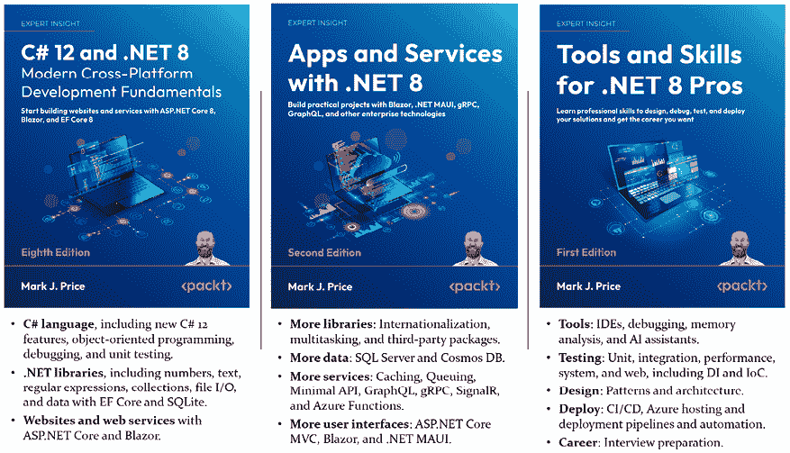
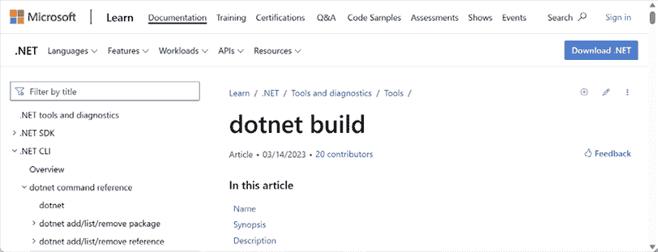
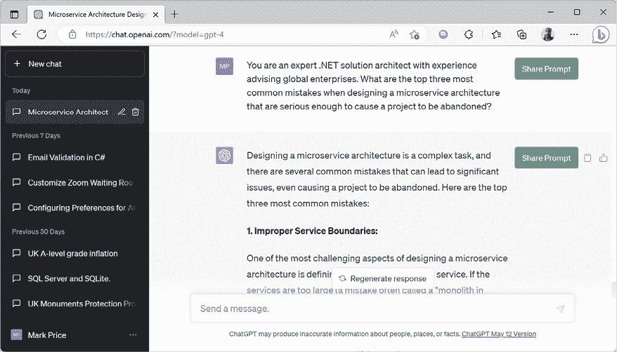

# 第一章：使用.NET 介绍应用和服务

在本章的第一部分，目标是设置使用 Visual Studio 2022 和 Visual Studio Code 的开发环境，了解构建应用程序和服务的选项；我们将回顾寻找帮助的好地方。

本书 GitHub 仓库中的解决方案使用了完整的应用程序项目来处理所有代码任务：

[`github.com/markjprice/apps-services-net8/`](https://github.com/markjprice/apps-services-net8/)

前往 GitHub 仓库后，只需在键盘上按下.*（点）*键或将`.com`更改为`.dev`，即可将仓库转换为基于 Visual Studio Code 的实时代码编辑器，使用 GitHub Codespaces。

在网页浏览器中使用 Visual Studio Code 与您选择的代码编辑器一起运行，非常适合在完成本书的编码任务时使用。您可以将自己的代码与解决方案代码进行比较，并在需要时轻松复制和粘贴部分代码。

在整本书中，我使用术语**现代.NET**来指代.NET 8 及其前身，如.NET 6，它们来自.NET Core。我使用术语**传统.NET**来指代.NET Framework、Mono、Xamarin 和.NET Standard。现代.NET 是这些传统平台和标准的统一体。

本章涵盖了以下主题：

+   介绍本书及其内容

+   应用和服务技术

+   设置您的开发环境

+   探索顶级程序、函数和命名空间

+   充分利用本书的 GitHub 仓库

+   哪里可以获得帮助

# 介绍本书及其内容

本书面向两个受众：

+   完成了我的入门书籍《C# 12 和.NET 8 – 现代跨平台开发基础知识》，并希望进一步学习的读者。

+   已经具备 C#和.NET 基本技能和知识的读者，希望学习实际技能和知识来构建真实世界的应用程序和服务。

## 继续学习旅程的配套书籍

本书是三部曲中的第二部，继续通过.NET 8 进行学习之旅：

1.  第一本书涵盖了 C#语言的基础知识、.NET 库以及用于 Web 开发的 ASP.NET Core。它设计为线性阅读，因为早期章节中的技能和知识会逐步积累，并需要理解后续章节。

1.  第二本书涵盖了更多专业化的主题，如国际化以及流行的第三方包，包括 Serilog 和 NodaTime。您将学习如何使用 ASP.NET Core Minimal APIs 构建原生 AOT 编译的服务，以及如何通过缓存、队列和后台服务来提高性能、可扩展性和可靠性。您将使用 GraphQL、gRPC、SignalR 和 Azure Functions 实现更多服务。最后，您将学习如何使用 Blazor 和.NET MAUI 为网站、桌面和移动应用程序构建图形用户界面。

1.  第三本书涵盖了专业 .NET 开发人员应该具备的重要工具和技能。这些包括设计模式和解构架构、调试、内存分析、所有重要的测试类型，无论是单元测试、性能测试还是 Web 和移动测试，以及 Docker 和 Azure Pipelines 等托管和部署主题。最后，我们探讨如何准备面试以获得你想要的 .NET 开发人员职业生涯。

.NET 8 三部曲及其最重要的主题的总结如图 1.1 所示：



图 1.1：学习 C# 12 和 .NET 8 的配套书籍

*《.NET 8 高级开发者工具和技能》计划于 2024 年上半年出版。请在您最喜欢的书店留意它，并完成您的 .NET 8 三部曲。

我们为你提供了一个包含本书中使用的截图和图表彩色图像的 PDF 文件。你可以从 [`packt.link/gbp/9781837637133`](https://packt.link/gbp/9781837637133) 下载此文件。

## 你将在本书中学到的内容

在这一章之后，本书可以分为四个部分：

1.  **数据管理**：如何使用 SQL Server 和 Azure Cosmos DB 在本地和云端存储和管理数据。后续章节将使用你在 *第三章*，*使用 EF Core 为 SQL Server 构建实体模型* 的结尾处创建的 SQL Server 数据库和实体模型。关于 Cosmos DB 的章节使用 SQL API，还有一个关于 Gremlin 的在线章节，Gremlin 是一个图 API。

1.  **专用库**：日期、时间和国际化；使用线程和任务提高性能；以及用于图像处理、数据验证规则等的第三方库。这些章节可以像食谱集一样处理。如果你对任何主题不感兴趣，你可以跳过它，并且可以按任何顺序阅读它们。

1.  **服务技术**：如何使用 ASP.NET Core Web API Minimal APIs、GraphQL、gRPC、SignalR 和 Azure Functions 构建和保障服务。为了提高服务的可扩展性和可靠性，我们涵盖了队列、缓存和事件调度。还有一个关于 OData 服务的在线章节。

1.  **用户界面技术**：如何使用 ASP.NET Core、Blazor 和 .NET MAUI 构建用户界面。

## 我的 学习哲学

大多数人通过模仿和重复而不是阅读理论的详细解释来最好地学习复杂主题；因此，我不会在本书的每个步骤中提供详细的解释。目的是让你编写一些代码并看到它运行。

你不需要立即了解所有细节。这些将在你构建自己的应用程序并超越任何书籍所能教授的内容的过程中随着时间的推移而逐渐了解。

## 纠正我的错误

用 1755 年编写英语词典的 Samuel Johnson 的话说，我已犯下“*一些荒谬的错误和可笑的荒谬，任何如此多的作品都无法避免*”。我对此承担全部责任，并希望你能欣赏我尝试通过撰写关于快速发展的技术（如 C#和.NET）以及你可以用它们构建的应用和服务这本书的挑战。

如果你在这本书的某个地方遇到问题，请在在亚马逊上发表负面评论之前联系我。作者无法回应亚马逊的评论，所以我无法联系你解决问题。我希望帮助你从我的书中获得最佳体验，我希望听取你的反馈并在下一版中做得更好。请通过电子邮件联系我（我的电子邮件地址可以在本书的 GitHub 仓库中找到），在本书的 Discord 频道中与我聊天（[`packt.link/apps_and_services_dotnet8`](https://packt.link/apps_and_services_dotnet8)），或在以下链接处提出问题：[`github.com/markjprice/apps-services-net8/issues`](https://github.com/markjprice/apps-services-net8/issues).

## 在 GitHub 上找到解决方案代码

本书 GitHub 仓库中的所有代码编辑器的解决方案代码可通过以下链接获取：[`github.com/markjprice/apps-services-net8/tree/main/code`](https://github.com/markjprice/apps-services-net8/tree/main/code).

## 项目命名和端口编号约定

如果你完成了本书中的所有编码任务，那么你最终将拥有数十个项目。其中许多将是需要端口号在`localhost`域上托管网站和服务。 

对于大型、复杂的项目，导航整个代码可能很困难。因此，良好的项目结构可以让你更容易找到组件。给你的解决方案起一个反映应用程序或解决方案的总体名称是很好的。

在 20 世纪 90 年代，微软将**Northwind**注册为一个虚构公司名称，用于数据库和代码示例。它最初用作他们 Access 产品的示例数据库，后来也用于 SQL Server。我们将为这个虚构公司构建多个项目，因此我们将使用名称`Northwind`作为所有项目名称的前缀。

**良好实践**：有多种方式来组织和命名项目和解决方案，例如使用文件夹层次结构和命名约定。如果你在一个团队中工作，确保你知道你的团队是如何做的。

在解决方案中为你的项目制定命名约定是很好的，这样任何开发者都可以立即知道每个项目的作用。一个常见的做法是使用项目类型，例如，类库、控制台应用程序、网站等，如*表 1.1*所示：

| **名称** | **描述** |
| --- | --- |
| `Northwind.Common` | 用于跨多个项目中的常见类型，如接口、枚举、类、记录和结构体的类库项目。 |
| `Northwind.Common.EntityModels` | 一个用于常见 EF Core 实体模型的类库项目。实体模型通常在服务器和客户端上都会使用，因此最好将特定数据库提供程序的依赖项分离。 |
| `Northwind.Common.DataContext` | 一个用于 EF Core 数据库上下文的类库项目，依赖于特定的数据库提供程序。 |
| `Northwind.Mvc` | 一个使用 MVC 模式且易于单元测试的复杂网站 ASP.NET Core 项目。 |
| `Northwind.WebApi.Service` | 一个用于 HTTP API 服务的 ASP.NET Core 项目。由于它可以使用任何 JavaScript 库或 Blazor 与服务交互，因此是一个很好的与网站集成的选择。 |
| `Northwind.WebApi.Client.Console` | 一个 Web 服务的客户端。名称的最后部分表示它是一个控制台应用程序。 |
| `Northwind.gRPC.Service` | 一个 ASP.NET Core gRPC 服务的项目。 |
| `Northwind.gRPC.Client.Mvc` | 一个 gRPC 服务的客户端。名称的最后部分表示它是一个 ASP.NET Core MVC 网站项目。 |
| `Northwind.BlazorWasm.Client` | 一个 ASP.NET Core Blazor WebAssembly 客户端项目。 |
| `Northwind.BlazorWasm.Server` | 一个 ASP.NET Core Blazor WebAssembly 服务器端项目。 |
| `Northwind.BlazorWasm.Shared` | 在客户端和服务器端 Blazor 项目之间共享的类库。 |

表 1.1：常见项目类型的命名约定示例

为了确保您能够同时运行这些项目中的任何一个，我们必须确保我们不配置重复的端口号。我已经使用了以下约定：

`https://localhost:5[chapternumber]1/`

`http://localhost:5[chapternumber]2/`

例如，对于在 *第十四章* 中构建的网站加密连接，即 *使用 ASP.NET Core 构建网络用户界面*，我使用了端口 `5141`，如下面的链接所示：

`https://localhost:5141/`

## 将警告视为错误

默认情况下，在首次构建项目时，如果代码中存在潜在问题，编译器可能会显示警告，但它们不会阻止编译，并且在重新构建时会被隐藏。警告给出是有原因的，因此忽略警告会鼓励不良的开发实践。

一些开发者可能更喜欢强制修复警告，因此 .NET 提供了一个项目设置来实现这一点，如下面的标记所示：

```cs
<Project Sdk="Microsoft.NET.Sdk">
  <PropertyGroup>
    <OutputType>Exe</OutputType>
    <TargetFramework>net8.0</TargetFramework>
    <ImplicitUsings>enable</ImplicitUsings>
    <Nullable>enable</Nullable>
 **<TreatWarningsAsErrors>****true****</TreatWarningsAsErrors>**
  </PropertyGroup> 
```

我已经启用了将警告视为错误的选项（几乎）在 GitHub 仓库中的所有解决方案中。

例外情况是 gRPC 项目。这是由于多种因素的综合作用。在 .NET 7 或更高版本中，如果编译的源文件中类型的名称只包含小写字母，编译器将会发出警告。例如，如果你定义一个 `person` 类，如下面的代码所示：

```cs
public class person
{
} 
```

引入此编译器警告是为了确保未来的 C# 版本在安全地添加新关键字时不会与您已使用的类型名称冲突，因为只有 C# 关键字应该只包含小写字母。

不幸的是，Google 用于从`.proto`文件生成 C#源文件的工具为仅包含小写字母的类名生成别名，如下面的代码所示：

```cs
#region Designer generated code
using pb = global::Google.Protobuf; 
```

如果你将警告视为错误，那么编译器会抱怨并拒绝编译源代码，如下面的输出所示：

```cs
Error CS8981 The type name 'pb' only contains lower-cased ascii characters. Such names may become reserved for the language. Northwind.Grpc.Service C:\apps-services-net8\Chapter14\Northwind.Grpc.Service\obj\Debug\net8.0\Protos\Greet.cs 
```

**良好实践**：在您的.NET 项目中始终将警告视为错误（除非是 gRPC 项目，直到 Google 更新其代码生成工具）。

如果你发现启用此功能后错误太多，你可以通过使用带有逗号分隔的警告代码列表的`<WarningsNotAsErrors>`元素来禁用特定的警告，如下面的标记所示：

```cs
<WarningsNotAsErrors>0219,CS8981</WarningsNotAsErrors> 
```

**更多信息**：您可以在以下链接中了解更多关于如何将警告视为错误的信息：[`learn.microsoft.com/en-us/dotnet/csharp/language-reference/compiler-options/errors-warnings#warningsaserrors-and-warningsnotaserrors`](https://learn.microsoft.com/en-us/dotnet/csharp/language-reference/compiler-options/errors-warnings#warningsaserrors-and-warningsnotaserrors)。

# 应用和服务技术

微软将用于构建应用程序和服务的平台称为**应用模型**或**工作负载**。

## 理解.NET

.NET、.NET Core、.NET Framework 和 Xamarin 是开发人员用于构建应用程序和服务的相关且重叠的平台。如果您不熟悉.NET 的历史，那么我将指向以下链接中的每个.NET 概念，该链接来自《C# 12 和.NET 8 – 现代跨平台开发基础》一书：

[`github.com/markjprice/cs12dotnet8/blob/main/docs/ch01-dotnet-history.md`](https://github.com/markjprice/cs12dotnet8/blob/main/docs/ch01-dotnet-history.md)

## 使用 ASP.NET Core 构建网站和应用程序

网站由多个网页组成，这些网页可以从文件系统静态加载或由服务器端技术（如 ASP.NET Core）动态生成。网络浏览器使用**唯一资源定位符**（**URLs**）进行`GET`请求，这些 URL 标识每个页面，并可以使用`POST`、`PUT`和`DELETE`请求来操作服务器上存储的数据。

对于许多网站，网络浏览器被视为一个表示层，几乎所有处理都在服务器端进行。客户端可能会使用一些 JavaScript 来实现一些表示功能，例如轮播图，或者使用`POST`、`PUT`和`DELETE`请求来执行数据验证。

ASP.NET Core 提供了多种技术来构建网站：

+   **ASP.NET Core Razor Pages**可以动态生成简单网站的 HTML。

+   **ASP.NET Core MVC**是**模型-视图-控制器**（**MVC**）设计模式的实现，它对于开发复杂网站非常流行。您将在第十四章“使用 ASP.NET Core 构建 Web 用户界面”中了解如何使用它来构建用户界面。

+   **Razor 类库**为 ASP.NET Core 项目提供了一种打包可重用功能的方法，包括用户界面组件。

+   **Blazor** 允许您使用 C# 和 .NET 构建用户界面组件，然后在 Web 浏览器或嵌入式 Web 组件中运行，而不是像 Angular、React 和 Vue 这样的基于 JavaScript 的 UI 框架。您将在第十五章“使用 Blazor 构建 Web 组件”和仅在线部分“利用开源 Blazor 组件库”中详细了解 Blazor。

Blazor 不仅用于构建网站；当与 .NET MAUI 结合使用时，它还可以用于创建混合移动和桌面应用程序。

本书假设你已经熟悉 ASP.NET Core 开发的 fundamentals，因此尽管本书回顾了基础知识，但它很快就会转向中级主题。

## 构建 Web 和其他服务

尽管没有正式的定义，但服务有时会根据它们的复杂性来描述：

+   **服务**: 客户端应用在一个单体服务中需要的所有功能。

+   **微服务**: 每个都专注于较小功能集的多个服务。微服务功能边界的指导原则是每个微服务应拥有自己的数据。只有那个微服务应该读取/写入该数据。如果你有一个多个服务访问的数据存储，那么它们就不是微服务。

+   **纳米服务**: 作为服务提供的一个单一功能。与 24/7/365 运行的服务和微服务不同，纳米服务通常在需要时才活跃，以减少资源和成本。因此，它们也被称为无服务器服务。

尽管过去十年左右，微服务和无服务器服务的理论使它们成为一种时尚的选择，但最近，随着开发者发现微服务的现实并不总是与理论相符，单体服务在流行度上有所回升。

您将学习如何构建使用 HTTP 作为底层通信技术并遵循 Roy Field 的 REST 架构设计原则的 ASP.NET Core Web API 和 Minimal API Web 服务。您还将学习如何使用 Web 和其他技术构建服务，这些服务扩展了基本 Web API，包括：

+   **gRPC**: 用于构建高度高效和性能的微服务，支持几乎任何平台。

+   **SignalR**: 用于实现组件之间的实时通信。

+   **GraphQL**: 允许客户端控制从多个数据源检索的数据。尽管 GraphQL 可以使用 HTTP，但它不必这样做，并且它不遵循 Roy Field 在其关于 REST API 的论文中定义的 Web 设计原则。

+   **Azure Functions**: 用于在云中托管无服务器纳米服务。

+   **OData**: 用于轻松将 EF Core 和其他数据模型包装成 Web 服务。这是一个仅在线的部分。

## Windows Communication Foundation

2006 年，Microsoft 发布了.NET Framework 3.0，其中包含一些主要的新框架，其中之一是**Windows Communication Foundation** (**WCF**)。它将服务的业务逻辑实现从通信技术基础设施中抽象出来，这样你就可以轻松地在未来切换到替代方案，甚至拥有多个与服务通信的机制。

WCF 大量使用 XML 配置来声明性地定义端点，包括它们的地址、绑定和合约。这被称为 WCF 端点的 ABC。一旦你了解了如何做这件事，WCF 就是一个强大而灵活的技术。

Microsoft 决定不正式将 WCF 移植到现代.NET，但有一个由.NET 基金会管理的社区拥有的开源项目名为**CoreWCF**。如果您需要将现有的服务从.NET Framework 迁移到现代.NET 或构建 WCF 服务的客户端，则可以使用 CoreWCF。请注意，它永远不能是一个完整的移植，因为 WCF 的部分是 Windows 特定的。

类似于 WCF 的技术允许构建分布式应用程序。客户端应用程序可以向服务器应用程序进行**远程过程调用** (**RPC**)。而不是使用 WCF 的端口来做这件事，我们应该使用像 gRPC 这样的替代 RPC 技术，这在本书中有介绍。

**更多信息**：您可以在以下链接的 GitHub 仓库中了解更多关于 CoreWCF 的信息：[`github.com/CoreWCF/CoreWCF`](https://github.com/CoreWCF/CoreWCF)。您可以在以下链接中阅读有关使用 System.ServiceModel 6.0 调用 WCF 或 CoreWCF 客户端支持的公告：[`devblogs.microsoft.com/dotnet/wcf-client-60-has-been-released/`](https://devblogs.microsoft.com/dotnet/wcf-client-60-has-been-released/)。

## 常见服务原则

最重要的服务架构原则之一是使方法调用变得厚重而不是琐碎。换句话说，尽量将操作所需的所有数据捆绑在一个调用中，而不是需要多个调用来传输所有这些信息。这是因为远程调用的开销是服务最大的负面影响之一。这也是为什么越来越小的服务会极大地负面影响解决方案架构。

## 服务选择总结

每种服务技术都有其优缺点，这取决于其功能支持，如*表 1.2*所示：

| **特性** | **Web API** | **OData** | **GraphQL** | **gRPC** | **SignalR** |
| --- | --- | --- | --- | --- | --- |
| 客户端可以请求所需的数据 | 否 | 是 | 是 | 否 | 否 |
| 最小 HTTP 版本 | 1.1 | 1.1 | 1.1 | 2.0 | 1.1 |
| 浏览器支持 | 是 | 是 | 是 | 否 | 是 |
| 数据格式 | XML, JSON | XML, JSON | GraphQL (JSONish) | 二进制 | 多样 |
| 服务文档 | Swagger | Swagger | 无 | 无 | 无 |
| 代码生成 | 第三方 | 第三方 | 第三方 | Google | Microsoft |
| 缓存 | 简单 | 简单 | 困难 | 困难 | 困难 |

表 1.2：常见服务技术的优缺点

使用这些针对各种场景的建议作为指导，如下所示 *表 1.3*：

| **场景** | **建议** |
| --- | --- |
| 公共服务 | 基于 HTTP/1.1 的服务最适合需要公开访问的服务，特别是如果它们需要从浏览器或移动设备调用。 |
| 公共数据服务 | OData 和 GraphQL 都是暴露来自不同数据存储的复杂层次数据集的好选择。OData 由微软通过官方.NET 包设计和支持。GraphQL 由 Facebook 设计并由第三方包支持。 |
| 服务到服务 | gRPC 是为低延迟和高吞吐量通信设计的。gRPC 非常适合轻量级内部微服务，其中效率至关重要。 |
| 点对点实时通信 | gRPC 对双向流提供了出色的支持。gRPC 服务可以实时推送消息而不需要轮询。SignalR 是为多种实时通信设计的，因此它通常比 gRPC 更容易实现，尽管效率较低。 |
| 广播实时通信 | SignalR 对向多个客户端广播实时通信提供了很好的支持。 |
| 多语言环境 | gRPC 工具支持所有流行的开发语言，使 gRPC 成为多语言和平台环境的好选择。 |
| 网络带宽受限环境 | gRPC 消息使用轻量级消息格式 Protobuf 进行序列化。gRPC 消息始终小于等效的 JSON 消息。 |
| 无服务器纳米服务 | Azure Functions 不需要 24/7 托管，因此它们是适合通常不需要持续运行的小型服务的良好选择。**亚马逊网络服务**（**AWS**）Lambdas 是一个替代方案。 |

表 1.3：服务场景和推荐实现技术

## 构建仅适用于 Windows 的应用程序

构建仅适用于 Windows 的应用程序的技术，主要用于桌面，包括：

+   **Windows 窗体**，2002

+   **Windows 表现层基础**（**WPF**），2006

+   **Windows 商店**，2012

+   **通用 Windows 平台**（**UWP**），2015

+   **Windows 应用 SDK**（以前称为**WinUI 3**和**Project Reunion**），2021

### 理解遗留的 Windows 应用程序平台

1985 年，随着 Microsoft Windows 1.0 的发布，创建 Windows 应用程序的唯一方式是使用 C 语言并调用名为`KERNEL`、`USER`和`GDI`的三个核心 DLL 中的函数。一旦 Windows 在 Windows 95 中成为 32 位，DLLs 被添加了 32 后缀，并被称为**Win32 API**。

1991 年，微软推出了 Visual Basic，它为开发者提供了一种视觉化的、从控件工具箱中拖放的方式来构建 Windows 应用程序的用户界面。它非常受欢迎，并且 Visual Basic 运行时至今仍然是 Windows 11 的一部分。

在 2002 年首次发布 C# 和 .NET Framework 时，微软提供了名为 **Windows 表单** 的技术来构建 Windows 桌面应用程序。当时用于 Web 开发的技术被称为 **Web 表单**，因此名称互补。代码可以用 Visual Basic 或 C# 语言编写。Windows 表单有一个类似的拖放可视化设计器，尽管它生成 C# 或 Visual Basic 代码来定义用户界面，这对于人类来说可能难以理解和直接编辑。

2006 年，微软发布了一种用于构建 Windows 桌面应用程序的更强大技术，名为 **Windows 表现基金会** (**WPF**)，作为 .NET Framework 3.0 的关键组件之一，与 **WCF** 和 Windows **工作流** (**WF**) 并列。

尽管可以通过仅编写 C# 语句来创建 WPF 应用程序，但它也可以使用 **可扩展应用程序标记语言** (**XAML**) 来指定其用户界面，这对于人类和代码来说都很容易理解。Visual Studio 2022 部分是基于 WPF 构建的。

2012 年，微软发布了 Windows 8，并附带其 Windows Store 应用程序，这些应用程序在受保护的沙盒中运行。

2015 年，微软发布了 Windows 10，并更新了名为 **通用 Windows 平台** (**UWP**) 的 Windows Store 应用程序概念。UWP 应用程序可以使用 C++ 和 DirectX UI、JavaScript 和 HTML 或 C#（使用非跨平台的现代 .NET 的自定义分支）来构建。UWP 应用程序可以访问底层 WinRT API。

UWP 应用程序只能在 Windows 10 或 Windows 11 平台上运行，不能在 Windows 的早期版本上运行，但 UWP 应用程序可以在配备运动控制器的 Xbox 和 Windows 混合现实头戴式设备上运行。

许多 Windows 开发者拒绝了 Windows Store 和 UWP 应用程序，因为他们对底层系统的访问有限。微软最近创建了 **Project Reunion** 和 **WinUI 3**，这两个项目协同工作，允许 Windows 开发者将现代 Windows 开发的部分好处带到他们的现有 WPF 应用程序中，并使他们能够享有与 UWP 应用程序相同的利益和系统集成。这一举措现在被称为 **Windows App SDK**。

**更多信息**：本书不涵盖 Windows App SDK，因为它不是跨平台的。如果您想了解更多信息，可以从以下链接开始：[`learn.microsoft.com/en-us/windows/apps/windows-app-sdk/`](https://learn.microsoft.com/en-us/windows/apps/windows-app-sdk/)。

### 理解现代 .NET 对遗留 Windows 平台的支持

.NET SDK 对于 Linux 和 macOS 的磁盘大小约为 330 MB。.NET SDK 对于 Windows 的磁盘大小约为 440 MB。这是因为它包括 **.NET 桌面运行时**，它允许遗留 Windows 应用程序平台 Windows Forms 和 WPF 在现代 .NET 上运行。

使用 Windows Forms 和 WPF 构建的许多企业应用程序需要维护或增强新功能，但直到最近，它们都卡在 .NET Framework 上，这是一个现在的遗留平台。随着现代 .NET 和其 .NET Desktop Runtime，这些应用程序现在可以使用 .NET 的全部现代功能。Windows 桌面应用程序开发者还可以选择安装 Windows 兼容包。您可以在以下链接中了解更多信息：[`learn.microsoft.com/en-us/dotnet/core/porting/windows-compat-pack`](https://learn.microsoft.com/en-us/dotnet/core/porting/windows-compat-pack)。

## 构建跨平台移动和桌面应用程序

有两个主要的移动平台，苹果的 iOS 和谷歌的 Android，每个都有自己的编程语言和平台 API。还有两个主要的桌面平台，苹果的 macOS 和微软的 Windows，每个都有自己的编程语言和平台 API，如下所示：

+   **iOS**：Objective-C 或 Swift 和 UIkit

+   **Android**：Java 或 Kotlin 和 Android API

+   **macOS**：Objective-C 或 Swift 和 AppKit 或 Catalyst

+   **Windows**：C、C++ 或许多其他语言和 Win32 API 或 Windows App SDK

可以一次性为 **.NET Multi-platform App UI** (**MAUI**) 平台构建跨平台移动和桌面应用程序，然后可以在许多移动和桌面平台上运行。

.NET MAUI 通过共享用户界面组件以及业务逻辑，使开发这些应用程序变得容易；它们可以针对与控制台应用程序、网站和 Web 服务相同的 .NET API。

应用程序可以独立存在，但它们通常调用服务以提供跨越所有计算设备（从服务器和笔记本电脑到手机和游戏系统）的体验。

.NET MAUI 支持现有的 MVVM 和 XAML 模式。团队还计划在未来添加对 C# 的 **Model-View-Update** (**MVU**) 的支持，类似于苹果的 SwiftUI。使用 Comet 的 MVU 仍然只是一个概念验证。它不如 SwiftUI 成熟或得到良好的支持。我不会在本书中介绍它。您可以在以下链接中了解更多信息：[`github.com/dotnet/Comet`](https://github.com/dotnet/Comet)。

## .NET MAUI 替代方案

在微软创建 .NET MAUI 之前，第三方创建了开源项目，以使 .NET 开发者能够使用 XAML 构建跨平台应用程序，名为 **Uno** 和 **Avalonia**。

### 理解 Uno 平台

Uno 被称为“*第一个真正的单源、跨平台应用程序的 C# & XAML、免费和开源平台*”，正如其官方网站上所述，以下链接：[`platform.uno/`](https://platform.uno/)。

开发者可以在原生移动、Web 和桌面之间重用 99% 的业务逻辑和 UI 层。

Uno 平台使用的是 Xamarin 本地平台，而不是 Xamarin.Forms。对于 WebAssembly，Uno 使用与 Blazor WebAssembly 相同的 mono-wasm 运行时。对于 Linux，Uno 使用 Skia 在画布上绘制用户界面。

可以在以下链接找到一本关于 Uno 平台的书：[`www.packtpub.com/product/creating-cross-platform-c-applications-with-uno-platform/9781801078498`](https://www.packtpub.com/product/creating-cross-platform-c-applications-with-uno-platform/9781801078498)。

### 理解 Avalonia

Avalonia “*是一个跨平台的 UI 框架，适用于 .NET。它创建像素级的、原生应用程序*”并且“*支持所有主要平台*。”Avalonia “*是复杂应用程序的受信任 UI 框架*”，正如其官方网站首页所述，以下链接：[`avaloniaui.net/`](https://avaloniaui.net/)。

你可以将 Avalonia 视为 WPF 的精神继承者。WPF、Silverlight 和 UWP 开发者可以继续从他们多年的现有知识和技能中受益。

它被 JetBrains 用于现代化他们的基于 WPF 的旧工具并将它们移植到跨平台。这意味着他们的 C# 代码编辑器可以在 Windows、macOS 和 Linux 上运行。

Avalonia 扩展程序适用于 Visual Studio 2022，并与 JetBrains Rider 深度集成，这使得开发更加容易和高效。

现在我们已经回顾了可用于 .NET 8 的应用程序和服务技术理论，让我们来实际操作，看看如何设置你的开发环境。

# 设置你的开发环境

在开始编程之前，你需要一个用于 C# 的代码编辑器。微软有一系列代码编辑器和**集成开发环境**（**IDEs**），其中包括：

+   Windows 系统的 Visual Studio 2022

+   Visual Studio Code 适用于 Windows、Mac 或 Linux

+   网页或 GitHub Codespaces 的 Visual Studio Code

第三方创建了他们自己的 C# 代码编辑器，例如 JetBrains Rider，它适用于 Windows、Mac 或 Linux，但确实需要付费许可。JetBrains Rider 在经验更丰富的 .NET 开发者中很受欢迎。

**警告！**虽然 JetBrains 是一家出色的公司，拥有优秀的产品，但 Rider 和 Visual Studio 的 ReSharper 扩展都是软件，所有软件都有错误和古怪的行为。例如，它们可能会在你的 Razor 页面、Razor 视图和 Blazor 组件中显示“无法解析符号”等错误。然而，你可以构建和运行这些文件，因为没有真正的问题。如果你安装了 Unity 支持插件，那么它将抱怨装箱操作，这对于 Unity 游戏开发者来说是一个真正的问题。但在这本书中，我们不会创建任何 Unity 项目，因此装箱警告不适用。

在第 *1* 章到 *15* 章，您可以使用 Visual Studio 2022 或跨平台的 Visual Studio Code 和 JetBrains Rider 来构建所有应用程序和服务。在第 *16* 章，*使用 .NET MAUI 构建移动和桌面应用程序*；以及其 *在线部分*，*实现 .NET MAUI 的模型-视图-视图模型*和*将 .NET MAUI 应用程序与 Blazor 和原生平台集成*，尽管您可以使用 Visual Studio Code 来构建移动和桌面应用程序，但这并不容易。目前，Visual Studio 2022 对 .NET MAUI 的支持比 Visual Studio Code 更好。

## 选择合适的工具和应用程序类型进行学习

使用 C# 和 .NET 构建应用程序和服务时，最好的工具和应用程序类型是什么？

我希望您能够自由选择任何 C# 代码编辑器或 IDE 来完成这本书中的编码任务，包括 Visual Studio Code、Visual Studio 2022，甚至是 JetBrains Rider。

在这本书中，我提供了适用于所有工具的通用说明，这样您就可以使用您偏好的任何工具。

### 使用 Visual Studio 2022 进行通用开发

Visual Studio 2022 可以创建大多数类型的应用程序，包括控制台应用程序、网站、网络服务、桌面和移动应用程序。

虽然您可以使用 Visual Studio 2022 和 .NET MAUI 项目来编写跨平台移动应用程序，但您仍然需要 macOS 和 Xcode 来编译它。

Visual Studio 2022 仅在 Windows 10 版本 1909 或更高版本、Windows Server 2016 或更高版本以及 64 位版本上运行。17.4 版本是第一个支持原生 Arm64 的版本。

**警告！** Visual Studio 2022 for Mac 并未官方支持 .NET 8，并且它将在 2024 年 8 月达到生命周期的终点。如果您一直在使用 Visual Studio 2022 for Mac，那么您应该切换到 Visual Studio Code for Mac、JetBrains Rider for Mac，或者在使用虚拟机的情况下在本地计算机上使用 Visual Studio 2022 for Windows，或者在云中使用类似 Microsoft Dev Box 的技术。退休公告可以在此处阅读：[`devblogs.microsoft.com/visualstudio/visual-studio-for-mac-retirement-announcement/`](https://devblogs.microsoft.com/visualstudio/visual-studio-for-mac-retirement-announcement/)。

### 使用 Visual Studio Code 进行跨平台开发

可供选择的最现代和轻量级的代码编辑器，并且是微软唯一一个跨平台的编辑器是 Visual Studio Code。它可以在所有常见的操作系统上运行，包括 Windows、macOS 以及许多 Linux 变体，包括 **红帽企业 Linux**（**RHEL**）和 Ubuntu。

Visual Studio Code 是现代跨平台开发的良好选择，因为它拥有广泛且不断增长的扩展集，支持许多超出 C# 的语言。

由于其跨平台和轻量级特性，它可以在您的应用程序将部署到的所有平台上安装，以便快速修复错误等。选择 Visual Studio Code 意味着开发者可以使用跨平台代码编辑器来开发跨平台应用程序。

Visual Studio Code 对 Web 开发有很强的支持，尽管它目前对移动和桌面开发的支持较弱。

Visual Studio Code 支持 ARM 处理器，因此您可以在苹果硅电脑和树莓派上开发。

Visual Studio Code 是迄今为止最受欢迎的集成开发环境，根据 Stack Overflow 2023 调查，超过 73% 的专业开发者选择了它，您可以在以下链接中阅读调查结果：[`survey.stackoverflow.co/2023/`](https://survey.stackoverflow.co/2023/).

### 在云端使用 GitHub Codespaces 进行开发

GitHub Codespaces 是一个基于 Visual Studio Code 的完全配置的开发环境，可以在云中托管的环境中启动，并通过任何网络浏览器访问。它支持 Git 仓库、扩展和内置的命令行界面，因此您可以从任何设备进行编辑、运行和测试。

**更多信息**: 您可以在以下链接中了解更多关于 GitHub Codespaces 的信息：[`github.com/features/codespaces`](https://github.com/features/codespaces).

### 我所使用的

为了编写和测试本书的代码，我使用了以下硬件和软件：

+   Windows 上的 Visual Studio 2022：

    +   惠普 Spectre (Intel) 笔记本电脑上的 Windows 11

+   Visual Studio Code 在：

    +   苹果硅 Mac mini (M1) 上的 macOS

    +   惠普 Spectre (Intel) 笔记本电脑上的 Windows 11

+   JetBrains Rider 在：

    +   惠普 Spectre (Intel) 笔记本电脑上的 Windows 11

    +   苹果硅 Mac mini (M1) 桌面上的 macOS

我希望您也能访问各种硬件和软件，因为看到不同平台上的差异可以加深您对开发挑战的理解，尽管上述任何一种组合都足以学习如何构建实用的应用程序和网站。

**入门指南**: 《C# 12 和 .NET 8 – 现代跨平台开发基础》一书的*第一章*包含在线部分，展示了如何使用各种代码编辑器（如 Visual Studio 2022、Visual Studio Code 或 JetBrains Rider）开始多个项目的操作。您可以在以下链接中阅读这些部分：[`github.com/markjprice/cs12dotnet8/blob/main/docs/code-editors/README.md`](https://github.com/markjprice/cs12dotnet8/blob/main/docs/code-editors/README.md).

### JetBrains Rider 及其关于装箱的警告

如果您使用 JetBrains Rider 并且已安装 Unity 支持插件，那么它会对装箱问题抱怨很多。装箱发生的一个常见场景是将像`int`和`DateTime`这样的值类型作为位置参数传递给`string`格式。这对于 Unity 项目来说是一个问题，因为它们使用与正常.NET 运行时不同的内存垃圾回收器。对于非 Unity 项目，如本书中的所有项目，您可以忽略这些装箱警告，因为它们与您无关。您可以在以下链接中了解更多关于此 Unity 特定问题的信息：[`docs.unity3d.com/Manual/performance-garbage-collection-best-practices.html#boxing`](https://docs.unity3d.com/Manual/performance-garbage-collection-best-practices.html#boxing)。

## 部署跨平台

您选择的代码编辑器和操作系统不会限制您的代码部署的位置。

.NET 8 支持以下平台进行部署：

+   **Windows**: Windows 10 版本 1607 或更高版本。Windows 11 版本 22000 或更高版本。Windows Server 2012 R2 SP1 或更高版本。Nano Server 版本 1809 或更高版本。

+   **Mac**: macOS Catalina 版本 10.15 或更高版本，并在 Rosetta 2 x64 模拟器中。Mac Catalyst 11.0 或更高版本。

+   **Linux**: Alpine Linux 3.17 或更高版本。Debian 11 或更高版本。Fedora 37 或更高版本。openSUSE 15 或更高版本。Oracle Linux 8 或更高版本。**红帽企业 Linux**（**RHEL**）8 或更高版本。SUSE Enterprise Linux 12 SP2 或更高版本。Ubuntu 20.04 或更高版本。

+   **Android**: API 21 或更高版本。

+   **iOS**和**tvOS**: 11.0 或更高版本。

**警告！** .NET 对 Windows 7 和 8.1 的支持已于 2023 年 1 月结束：[`github.com/dotnet/core/issues/7556`](https://github.com/dotnet/core/issues/7556)。

.NET 5 及更高版本对 Windows ARM64 的支持意味着您可以在 Windows Arm 设备上开发并部署，例如微软的 Windows Dev Kit 2023（之前称为 Project Volterra）和 Surface Pro X。

您可以在以下链接中查看最新的支持操作系统和版本：[`github.com/dotnet/core/blob/main/release-notes/8.0/supported-os.md`](https://github.com/dotnet/core/blob/main/release-notes/8.0/supported-os.md)。

## 下载并安装 Visual Studio 2022

许多专业的微软开发者在日常开发工作中使用 Visual Studio 2022。即使您选择使用 Visual Studio Code 来完成本书中的编码任务，您也可能想熟悉一下 Visual Studio 2022。

如果您没有 Windows 电脑，则可以跳过本节，继续到下一节，在那里您将在 macOS 或 Linux 上下载并安装 Visual Studio Code。

自 2014 年 10 月以来，微软已向学生、开源贡献者和个人免费提供 Visual Studio 2022 的专业质量版。它被称为社区版。任何版本都适合本书。如果您尚未安装它，我们现在就安装它：

1.  从以下链接下载 Visual Studio 2022 版本 17.8 或更高版本：[`visualstudio.microsoft.com/downloads/`](https://visualstudio.microsoft.com/downloads/).

1.  启动安装程序。

1.  在**工作负载**选项卡中，选择以下内容：

    +   **ASP.NET 和 Web 开发**

    +   **Azure 开发**

    +   **.NET 多平台应用程序用户界面开发**

    +   **.NET 桌面开发**（因为这将包括控制台应用程序）

    +   **使用 C++ 进行桌面开发**（因为这将启用发布启动更快且内存占用更小的控制台应用程序和 Web 服务）

1.  在**单个组件**选项卡中，在**代码工具**部分，选择以下内容：

    +   **Windows 版 Git**

1.  点击**安装**并等待安装程序获取所选软件并安装。

1.  安装完成后，点击**启动**。

1.  第一次运行 Visual Studio 时，你将需要登录。如果你有微软账户，你可以使用该账户。如果没有，请从以下链接注册一个新账户：[`signup.live.com/`](https://signup.live.com/).

1.  第一次运行 Visual Studio 时，你将需要配置你的环境。对于**开发设置**，选择**Visual C#**。对于颜色主题，我选择了**蓝色**，但你也可以选择任何你喜欢的。

1.  如果你想要自定义你的键盘快捷键，请导航到**工具** | **选项…**，然后选择**环境** | **键盘**选项。

### Visual Studio 2022 键盘快捷键

在这本书中，我将避免展示键盘快捷键，因为它们通常都是自定义的。当它们在代码编辑器和常用工具中保持一致时，我会尽量展示它们。

如果你想要识别和自定义你的键盘快捷键，那么你可以，如下链接所示：[`learn.microsoft.com/en-us/visualstudio/ide/identifying-and-customizing-keyboard-shortcuts-in-visual-studio`](https://learn.microsoft.com/en-us/visualstudio/ide/identifying-and-customizing-keyboard-shortcuts-in-visual-studio).

## 下载和安装 Visual Studio Code

Visual Studio Code 在过去几年中迅速改进，并因其受欢迎程度而让微软感到惊喜。如果你敢于尝试并喜欢走在前沿，那么还有**内部版本**，这是下一个版本的每日构建。

即使你计划只使用 Visual Studio 2022 进行开发，我也建议你下载并安装 Visual Studio Code，并使用它来完成本章的编码任务，然后决定你是否想在本书的剩余部分只使用 Visual Studio 2022。

现在我们来下载和安装 Visual Studio Code、.NET SDK 和 C# 开发工具包扩展：

1.  从以下链接下载并安装 Visual Studio Code 的稳定版或内部版本：[`code.visualstudio.com/`](https://code.visualstudio.com/).

    **更多信息**：如果你需要更多帮助在任意操作系统上安装 Visual Studio Code，你可以阅读以下链接中的官方设置指南：[`code.visualstudio.com/docs/setup/setup-overview`](https://code.visualstudio.com/docs/setup/setup-overview)。

1.  从以下链接下载并安装 8.0 版本的 .NET SDK：[`www.microsoft.com/net/download`](https://www.microsoft.com/net/download)。

1.  要使用用户界面安装 **C# Dev Kit** 扩展，你必须首先启动 Visual Studio Code 应用程序。

1.  在 Visual Studio Code 中，点击 **扩展** 图标或导航到 **视图** | **扩展**。

1.  **C# Dev Kit** 是最受欢迎的扩展之一，所以你应该在列表顶部看到它，或者你可以在搜索框中输入 `C# Dev Kit`。

    **C# Dev Kit** 依赖于 **C#** 扩展版本 2.0 或更高版本，因此你不需要单独安装 **C#** 扩展。请注意，**C#** 扩展版本 2.0 或更高版本不再使用 OmniSharp，因为它有一个新的 **语言服务协议 (LSP)** 主机。**C# Dev Kit** 还依赖于 **.NET 扩展作者安装工具** 和 **IntelliCode for C# Dev Kit** 扩展，因此它们也将被安装。

1.  点击 **安装** 并等待支持包下载和安装。

    **良好实践**：务必阅读 **C# Dev Kit** 的许可协议。它的许可比 **C#** 扩展更为严格：[`aka.ms/vs/csdevkit/license`](https://aka.ms/vs/csdevkit/license)。

### 安装其他扩展

在本书的后续章节中，你将使用更多 Visual Studio Code 扩展。如果你现在想安装它们，我们将使用的所有扩展都显示在 *表 1.4* 中：

| **扩展名称和标识符** | **描述** |
| --- | --- |
| **C# Dev Kit**`ms-dotnettools.csdevkit` | 来自 Microsoft 的官方 C# 扩展。使用解决方案资源管理器管理你的代码，并通过集成的单元测试发现和执行测试你的代码。包括 **C#** 和 **IntelliCode for C# Dev Kit** 扩展。 |
| **C#**`ms-dotnettools.csharp` | 提供包括语法高亮、IntelliSense、转到定义、查找所有引用、.NET 调试支持以及 Windows、macOS 和 Linux 上的 `csproj` 项目支持的 C# 编辑支持。 |
| **IntelliCode for C# Dev Kit**`ms-dotnettools.vscodeintellicode-csharp` | 为 Python、TypeScript/JavaScript、C# 和 Java 开发者提供人工智能辅助开发功能。 |
| **MSBuild 项目工具**`tintoy.msbuild-project-tools` | 为 MSBuild 项目文件提供 IntelliSense，包括 `<PackageReference>` 元素的自动完成。 |
| **SQL Server (mssql) for Visual Studio Code**`ms-mssql.mssql` | 提供丰富的功能，用于在所有地方开发 SQL Server、Azure SQL 数据库和 SQL 数据仓库。 |
| **REST 客户端**`humao.rest-client` | 在 Visual Studio Code 中发送 HTTP 请求并直接查看响应。 |
| **ilspy-vscode**`icsharpcode.ilspy-vscode` | 反编译 MSIL 程序集 – 支持 .NET、.NET Framework、.NET Core 和 .NET Standard。 |
| **vscode-proto3**`zxh404.vscode-proto3` | 语法高亮、语法验证、代码片段、代码补全、代码格式化、括号匹配和行与块注释。 |
| **Azure Functions for Visual Studio Code**`ms-azuretools.vscode-azurefunctions` | 直接从 VS Code 创建、调试、管理和部署无服务器应用程序。它依赖于 Azure 账户（`ms-vscode.azure-account`）和 Azure 资源（`ms-azuretools.vscode-azureresourcegroups`）扩展。 |

表 1.4：本书中使用的 Visual Studio Code 扩展

### 在命令提示符下管理 Visual Studio Code 扩展

你可以在命令提示符或终端中安装 Visual Studio Code 扩展，如 *表 1.5* 所示：

| **命令** | **描述** |
| --- | --- |
| `code --list-extensions` | 列出已安装的扩展。 |
| `code --install-extension <extension-id>` | 安装指定的扩展。 |
| `code --uninstall-extension <extension-id>` | 卸载指定的扩展。 |

表 1.5：在命令提示符下使用扩展

例如，要安装 **C# 开发工具包** 扩展，请在命令提示符下输入以下内容：

```cs
code --install-extension ms-dotnettools.csdevkit 
```

我已经创建了 PowerShell 脚本来安装和卸载前面表格中的 Visual Studio Code 扩展。你可以在以下链接中找到它们：[`github.com/markjprice/apps-services-net8/tree/main/scripts/extension-scripts`](https://github.com/markjprice/apps-services-net8/tree/main/scripts/extension-scripts)。

### 了解 Microsoft Visual Studio Code 版本

微软几乎每个月都会发布一个新的 Visual Studio Code 功能版本，并且更频繁地发布错误修复版本。例如：

+   版本 1.78.0，2023 年 4 月的功能发布

+   版本 1.78.1，2023 年 4 月的错误修复发布

本书使用的版本是 1.83.0，2023 年 9 月的功能发布版，但 Microsoft Visual Studio Code 的版本不如你安装的 C# 扩展版本重要。

虽然 C# 扩展不是必需的，但它提供在键入时自动完成、代码导航和调试功能，因此安装并保持其更新以支持最新的 C# 语言特性是非常方便的。

### Visual Studio Code 快捷键

在本书中，我将避免展示用于创建新文件等任务的键盘快捷键，因为它们在不同的操作系统上通常不同。我将展示键盘快捷键的情况是当你需要重复按键时，例如在调试时。这些情况在不同操作系统之间也更有可能保持一致。

如果你想要自定义 Visual Studio Code 的键盘快捷键，那么你可以，如下链接所示：[`code.visualstudio.com/docs/getstarted/keybindings`](https://code.visualstudio.com/docs/getstarted/keybindings)。

我建议您从以下列表中下载适用于您操作系统的键盘快捷方式 PDF：

+   Windows: [`code.visualstudio.com/shortcuts/keyboard-shortcuts-windows.pdf`](https://code.visualstudio.com/shortcuts/keyboard-shortcuts-windows.pdf)

+   macOS: [`code.visualstudio.com/shortcuts/keyboard-shortcuts-macos.pdf`](https://code.visualstudio.com/shortcuts/keyboard-shortcuts-macos.pdf)

+   Linux: [`code.visualstudio.com/shortcuts/keyboard-shortcuts-linux.pdf`](https://code.visualstudio.com/shortcuts/keyboard-shortcuts-linux.pdf)

## 消耗 Azure 资源

本书的一些章节将要求您注册 Azure 账户并创建 Azure 资源。通常，这些服务有免费层或本地开发版本，但有时您可能需要创建一个在存在期间会产生费用的资源。

Packt 书籍使用技术审稿人，他们完成所有编码练习，就像读者一样。以下是这本书**第二版**（**2E**）的一位技术审稿人关于他们的 Azure 成本的评论：“我收到了我的 Azure 账单。在“付费”账户上运行 2E 的成本是 3.01 美元。”

微软目前表示，“*符合条件的全新用户在第一个 30 天内将获得相当于您账单货币的 200 美元的 Azure 信用额度，以及 12 个月的限量免费服务，这些服务与您的 Azure 免费账户相关。*”您可以在以下链接中了解更多信息：

[`learn.microsoft.com/en-us/azure/cost-management-billing/manage/avoid-charges-free-account`](https://learn.microsoft.com/en-us/azure/cost-management-billing/manage/avoid-charges-free-account)

**良好实践**：一旦您不再需要 Azure 资源，请立即删除以保持您的成本较低。

*表 1.6*展示了哪些章节需要 Azure 资源以及是否有本地开发替代方案：

| **章节** | **Azure 资源** | **免费层** | **本地开发替代方案** |
| --- | --- | --- | --- |
| 2 到 16 | SQL 数据库 | 作为免费第一年的部分。 | Windows 上的 SQL Server Developer Edition 或 Windows、Linux 和 macOS 上的 Docker 容器中的 SQL Edge。 |
| 4 | Cosmos DB 数据库 | 1,000 RU/s 和 25 GB 的存储空间。 | Windows 上的 Azure Cosmos DB 模拟器或 Linux 上的预览版本。 |
| 11 | Azure 函数 | 每月 1000 万个请求和 400,000 GB 的资源消耗。 | 用于测试 Azure Blob、队列存储和表存储应用程序（如 Azure 函数）的 Azurite 开源模拟器。 |
| 12 | Azure SignalR 服务 | 每月 20 万个并发连接和每天 20,000 条消息，99.9%的 SLA。 | 将 SignalR 添加到任何 ASP.NET Core 项目进行本地开发。 |

表 1.6：使用 Azure 资源和本地开发替代方案的章节

您可以在以下链接中找到如何检查您对免费 Azure 资源的使用的相关信息：[`learn.microsoft.com/en-us/azure/cost-management-billing/manage/check-free-service-usage`](https://learn.microsoft.com/en-us/azure/cost-management-billing/manage/check-free-service-usage).

## 使用其他项目模板

当您安装.NET SDK 时，包含了许多项目模板。让我们回顾一下它们：

1.  在命令提示符或终端中，输入以下命令：

    ```cs
    dotnet new list 
    ```

    .NET 7 及以后的 SDK 支持`dotnet new --list`或`dotnet new list`。.NET 6 及以前的 SDK 仅支持`dotnet new --list`。

1.  如果您在 Windows 上运行，您将看到当前安装的模板列表，包括 Windows 桌面开发的模板，其中最常见的是在*表 1.7*中展示的：

| **模板名称** | **简称** | **语言** |
| --- | --- | --- |
| .NET MAUI 应用程序 | `maui` | C# |
| .NET MAUI Blazor 应用程序 | `maui-blazor` | C# |
| ASP.NET Core 空项目 | `web` | C#，F# |
| ASP.NET Core gRPC 服务 | `grpc` | C# |
| ASP.NET Core Web API | `webapi` | C#，F# |
| ASP.NET Core Web API（原生 AOT） | `webapiaot` | C# |
| ASP.NET Core Web 应用程序（模型-视图-控制器） | `mvc` | C#，F# |
| Blazor Web 应用程序 | `blazor` | C# |
| 类库 | `classlib` | C#，F#，VB |
| 控制台应用程序 | `console` | C#，F#，VB |
| `EditorConfig` 文件 | `editorconfig` |  |
| `global.json` 文件 | `globaljson` |  |
| 解决方案文件 | `sln` |  |
| xUnit 测试项目 | `xunit` |  |

表 1.7：项目模板的全名和简称

.NET MAUI 项目不支持 Linux。团队表示，他们已经将这项工作留给了开源社区。如果您需要创建一个真正跨平台的图形应用程序，那么请查看以下链接中的 Avalonia：[`avaloniaui.net/`](https://avaloniaui.net/)。

# 安装额外的模板包

开发者可以安装许多额外的模板包：

1.  启动浏览器并导航到[`www.nuget.org/packages`](https://www.nuget.org/packages)。

1.  在**搜索包…**文本框中输入`vue`，并注意大约返回 210 个包。

1.  点击**筛选器**，选择**包类型**为**模板**，点击**应用**，并注意大约 25 个可用的模板列表，包括由 Microsoft 发布的一个。

1.  点击**Vue.Simple.Template**，然后点击**项目网站**，并注意安装和使用此模板的说明，如下所示：

    ```cs
    dotnet new --install "Vue.Simple.Template"
    dotnet new simplevue 
    ```

1.  关闭浏览器。

# 探索顶层程序、函数和命名空间

自.NET 6 以来，控制台应用程序的默认项目模板使用了.NET 5 引入的顶层程序功能。了解它与自动生成的`Program`类及其`<Main>$`方法的工作方式非常重要。

让我们探索当您定义函数时，顶层程序功能是如何工作的：

1.  使用您首选的编码工具创建一个新项目，如下列所示：

    +   项目模板：**控制台应用程序** / `console`

    +   项目文件和文件夹：`TopLevelFunctions`

    +   解决方案文件和文件夹：`Chapter01`

    +   **不要使用顶层语句**：已清除

    +   **启用原生 AOT 发布**：已清除

1.  在`Program.cs`中，删除现有的语句，在文件底部定义一个局部函数，并调用它，如下所示：

    ```cs
    using static System.Console;
    WriteLine("Top-level functions example");
    WhatsMyNamespace(); // Call the function.
    void WhatsMyNamespace() // Define a local function.
    {
      WriteLine("Namespace of Program class: {0}", 
        arg0: typeof(Program).Namespace ?? "null");
    } 
    ```

1.  运行控制台应用程序，并注意 `Program` 类的命名空间为 `null`，如下所示，输出中已高亮显示：

    ```cs
    Top-level functions example
    Namespace of Program class: null 
    ```

## 自动为局部函数生成了什么？

编译器会自动生成一个带有 `<Main>$` 函数的 `Program` 类，然后将你的语句和函数移动到 `<Main>$` 方法中，并重命名局部函数，如下所示，代码中已高亮显示：

```cs
using static System.Console;
**partial****class****Program**
**{**
**static****void** **<Main>$(String[] args)**
 **{**
    WriteLine("Top-level functions example");
 **<<Main>$>g__WhatsMyNamespace|****0****_0();** **// Call the function.**
**void** **<<Main>$>g__WhatsMyNamespace|****0****_0()** **// Define a local function.**
    {
      WriteLine("Namespace of Program class: {0}", 
        arg0: typeof(Program).Namespace ?? "null");
    }
 **}**
**}** 
```

为了让编译器知道哪些语句需要放在哪里，你必须遵循一些规则：

+   导入语句 (`using`) 必须放在 `Program.cs` 文件的顶部。

+   将要放入 `<Main>$` 函数中的语句必须放在 `Program.cs` 文件的中间。任何函数都将成为 `<Main>$` 方法中的 **局部函数**。

最后一点很重要，因为局部函数有一些限制，例如，它们不能有 XML 注释来文档化。

## 在单独的 Program 类文件中编写静态函数

更好的方法是，将任何函数写入单独的类文件，并将它们定义为 `Program` 类的 `static` 成员：

1.  添加一个名为 `Program.Functions.cs` 的新类文件。名称没有影响，但这是一个好习惯，这样可以使文件与 `Program.cs` 类文件相关联。

1.  在 `Program.Functions.cs` 文件中，定义一个 `partial Program` 类，然后将 `WhatsMyNamespace` 函数剪切并粘贴到 `Program.Functions.cs` 中，从 `Program.cs` 移动到 `Program.Functions.cs`，并最终添加 `static` 关键字，如下所示，代码中已高亮显示：

    ```cs
    **using****static** **System.Console;**
    **// Do not define a namespace so this class goes in the default empty namespace**
    **// just like the auto-generated partial Program class.**
    **partial****class****Program**
    **{**
      **static** void WhatsMyNamespace() // Define a **static** function.
      {
        WriteLine("Namespace of Program class: {0}",
          arg0: typeof(Program).Namespace ?? "null");
      }
    **}** 
    ```

1.  在 `Program.cs` 中，确认其全部内容现在只是三条语句，如下所示，代码中已高亮显示：

    ```cs
    using static System.Console;
    WriteLine("Top-level functions example");
    WhatsMyNamespace(); // Call the function. 
    ```

1.  运行控制台应用程序，并注意它具有与之前相同的行为。

## 自动为静态函数生成了什么？

当你使用单独的文件来定义带有 `static` 函数的 `partial Program` 类时，编译器定义一个带有 `<Main>$` 函数的 `Program` 类，并将你的顶层语句移动到 `<Main>$` 方法中，然后将你的函数作为 `Program` 类的成员合并，如下所示，代码中已高亮显示：

```cs
using static System.Console;
partial class Program
{
  static void <Main>$(String[] args)
  {
    WriteLine("Top-level functions example");
    WhatsMyNamespace(); // Call the function.
  }
  static void WhatsMyNamespace() // Define a static function.
  {
    WriteLine("Namespace of Program class: {0}",
      arg0: typeof(Program).Namespace ?? "null");
  }
} 
```

这样更干净，你可以使用 XML 注释来文档化你的函数，这也会在调用函数时在你的代码编辑器中提供工具提示。

**良好实践**：在 `Program.cs` 中调用任何函数时，在单独的文件中创建这些函数，并在 `partial Program` 类中手动定义它们。这将使它们与自动生成的 `Program` 类在 `<Main>$` 方法的同一级别合并，而不是作为 `<Main>$` 方法内部的局部函数。

重要的是要注意缺少命名空间声明。自动生成的 `Program` 类和显式定义的 `Program` 类都在默认的 `null` 命名空间中。如果你在命名空间中定义你的 `partial Program` 类，那么它将位于不同的命名空间中，因此不会与自动生成的 `partial Program` 类合并。

**良好实践**：不要为任何您创建的`partial Program`类定义命名空间，这样它们将定义在默认的`null`命名空间中。

可选地，`Program`类中的所有`static`方法都可以显式声明为`private`，但这已经是默认设置。由于所有函数都将在本`Program`类内部调用，因此访问修饰符并不重要。

# 充分利用这本书的 GitHub 仓库

**Git**是一个常用的源代码管理系统。**GitHub**是一家公司、一个网站和桌面应用程序，它使得管理 Git 变得更加容易。微软在 2018 年收购了 GitHub，因此它将继续与微软工具紧密集成。

我为这本书创建了一个 GitHub 仓库，并用于以下目的：

+   存储这本书的解决方案代码，这些代码将在印刷出版日期后得到维护。

+   提供额外的材料，以扩展书籍，如勘误表修正、小改进、有用的链接列表以及无法放入印刷书的更长文章。

+   为读者提供一个地方，如果他们对书籍有问题可以与我联系。

## 对书籍提出问题

如果您在遵循这本书中的任何说明时遇到困难，或者如果您在解决方案中的文本或代码中发现了错误，请在 GitHub 仓库中提出问题：

1.  使用您喜欢的浏览器导航到以下链接：[`github.com/markjprice/apps-services-net8/issues`](https://github.com/markjprice/apps-services-net8/issues)。

1.  点击**新建问题**。

1.  请尽可能提供详细信息，以便我能够诊断问题。例如：

    +   具体的章节标题、页码和步骤编号。

    +   您的代码编辑器，例如，Visual Studio 2022、Visual Studio Code 或其他，包括版本号。

    +   您认为相关且必要的代码和配置尽可能多。

    +   对预期行为和实际行为的描述。

    +   截图（您可以将图像文件拖放到问题框中）。

以下内容不太相关，但可能有用：

+   您的操作系统，例如，Windows 11 64 位，或 macOS Big Sur 版本 11.2.3。

+   您的硬件，例如，英特尔、苹果硅或 ARM CPU。

我希望所有读者都能通过我的书取得成功，所以如果我可以不费太多力气帮助您（和其他人），我将非常乐意这样做。

## 给我反馈

如果您想就这本书给我更一般的反馈，您可以给我发电子邮件到`markjprice@gmail.com`。我的出版商 Packt 为读者设置了 Discord 频道，以便他们与作者和其他读者互动。您可以通过以下链接加入我们：[`packt.link/apps_and_services_dotnet8`](https://packt.link/apps_and_services_dotnet8)。

我很高兴听到读者对我书籍的看法，以及改进建议以及他们如何使用 C#和.NET，所以请不要害羞。请与我联系！

提前感谢您深思熟虑且建设性的反馈。

## 从 GitHub 存储库下载解决方案代码

我使用 GitHub 存储了章节中所有动手、分步编码示例以及每章末尾的特色实践练习的解决方案。您可以在以下链接中找到存储库：[`github.com/markjprice/apps-services-net8`](https://github.com/markjprice/apps-services-net8)。

如果您只想下载所有解决方案文件而不使用 Git，请点击绿色的 **Code** 按钮，然后选择 **Download ZIP**。

我建议您将前面的链接添加到您的收藏夹或书签中。

**良好实践**：最好将代码解决方案克隆或下载到短路径文件夹中，例如 `C:\cs12dotnet8\` 或 `C:\book\`，以避免构建生成的文件超过最大路径长度。您还应避免使用特殊字符，例如 `#`。例如，不要使用文件夹名称 `C:\C# projects\`。这个文件夹名称可能适用于简单的控制台应用程序项目，但一旦您开始添加会自动生成代码的功能，您很可能会遇到奇怪的问题。请保持文件夹名称简短且简单。

# 去哪里寻求帮助

本节主要介绍如何在网络上找到关于编程的高质量信息。

## 在 Microsoft Learn 上阅读文档

获取 Microsoft 开发者工具和平台帮助的终极资源是在 Microsoft Learn 的技术文档中，您可以在以下链接中找到它：[`learn.microsoft.com/en-us/docs`](https://learn.microsoft.com/en-us/docs)。

## 获取 dotnet 工具的帮助

在命令提示符中，您可以请求 `dotnet` 工具帮助其命令。语法如下：

```cs
dotnet help <command> 
```

这将导致您的网页浏览器打开有关指定命令的文档页面。常见的 `dotnet` 命令包括 `new`、`build` 和 `run`。

**警告！** `dotnet help new` 命令在 .NET Core 3.1 到 .NET 6 中工作正常，但使用 .NET 7 或更高版本时会返回错误：“指定的命令 'new' 不是一个有效的 SDK 命令。请指定一个有效的 SDK 命令。有关更多信息，请运行 dotnet help.` 希望.NET 团队会尽快修复这个错误！

另一种帮助类型是命令行文档。它遵循以下语法：

```cs
dotnet <command> -?|-h|--help 
```

例如，`dotnet new -?` 或 `dotnet new -h` 或 `dotnet new --help` 会在命令提示符中输出有关 `new` 命令的文档。

正如您现在所期望的，`dotnet help help` 命令会在网页浏览器中打开 `help` 命令，而 `dotnet help -h` 则在命令提示符中输出 `help` 命令的文档！

让我们尝试一些示例：

1.  要在网页浏览器窗口中打开 `dotnet build` 命令的官方文档，请在命令提示符或 Visual Studio Code 终端中输入以下内容，并注意在您的网页浏览器中打开的页面，如图 *图 1.2* 所示：

    ```cs
    dotnet help build 
    ```



图 1.2：dotnet 构建命令的网页文档

1.  要在命令提示符下获取帮助输出，请使用`-?`、`-h`或`--help`标志，如下面的命令所示：

    ```cs
    dotnet build -? 
    ```

1.  你将看到以下部分输出：

    ```cs
    Description:
      .NET Builder
    Usage:
      dotnet build [<PROJECT | SOLUTION>...] [options]
    Arguments:
      <PROJECT | SOLUTION>  The project or solution file to operate on. If a file is not specified, the command will search the current directory for one.
    Options:
      --ucr, --use-current-runtime         Use current runtime as the target runtime.
      -f, --framework <FRAMEWORK>          The target framework to build for. The target framework must also be specified in the project file.
    ...
      -?, -h, --help                       Show command-line help. 
    ```

1.  对以下命令重复两种帮助请求：`add`、`help`、`list`、`new`和`run`。

## 人工智能工具如 ChatGPT 和 GitHub Copilot

过去一年中，编码和开发领域最大的变化之一是生成式**人工智能**（**AI**）工具的出现，这些工具可以帮助完成编码任务，如完成代码语句、实现整个函数、编写单元测试以及为现有代码提出调试修复建议。

### ChatGPT

ChatGPT 目前有两个模型：3.5（免费）和 4.0（每月 20 美元）。

假设你需要了解更多关于如何设计微服务的知识。你可能输入以下提示：

```cs
You are an expert .NET solution architect with experience advising global enterprises. What are the top three most common mistakes when designing a microservice architecture that are serious enough to cause a project to be abandoned? 
```

它会响应一个总结，详细说明了这三个主要错误，如*图 1.3*和以下列表所示：



图 1.3：ChatGPT 关于微服务架构设计的建议

“设计微服务架构是一项复杂的任务，存在一些常见的错误可能会导致重大问题，甚至导致项目被放弃。以下是三个最常见的错误：

+   **不恰当的服务边界：** 设计微服务架构最具挑战性的方面之一是定义每个服务的边界。如果服务太大（通常被称为“伪装的巨石”），由于不同关注点之间的紧密耦合，你将失去许多微服务的优势。另一方面，如果服务太小（有时被称为“纳米服务”），你可能必须处理过多的服务间通信，从而导致高延迟和复杂性。

+   缺乏适当的边界也可能导致数据一致性问题的出现。如果多个服务正在与相同的数据库表进行交互，那么维护数据一致性可能会变得困难。

+   为了避免这个错误，重要的是要彻底理解业务领域，并围绕业务能力设计服务。例如，**领域驱动设计**（**DDD**）等技术可以帮助更有效地识别服务边界。

+   **对数据管理考虑不足：** 每个微服务应拥有自己的数据以确保松散耦合。在服务之间共享数据库会导致紧密耦合，并使得在不影响其他服务的情况下更改模式变得困难。

+   然而，跨服务管理数据会引入数据一致性和事务管理方面的挑战。开发者往往低估了这些挑战。他们可能会尝试实现分布式事务，这些事务复杂且可能损害性能，而不是使用最终一致性补偿事务（即 Saga 模式）。

+   **忽略操作复杂性**：微服务架构增加了操作复杂性。你将从管理单个单体应用程序转变为管理多个服务，每个服务可能使用不同的语言编写，使用不同的数据存储技术，并在不同的环境中运行。

+   这需要成熟的 DevOps 能力，包括自动化部署、监控和良好的日志记录实践。你需要计划如何监控服务，如何聚合和分析日志，以及如何处理部署和回滚。

+   忽略微服务的操作挑战可能导致后续出现重大问题。例如，如果没有良好的跟踪和日志记录，调试跨越多个服务的问题可能会变得非常困难。没有自动化部署和良好的测试实践，部署更改可能会变成一场噩梦。

总之，设计微服务架构不是一项简单任务。它需要深入理解业务领域，周密的规划和成熟的 DevOps 能力。然而，如果做得正确，微服务可以提供显著的好处，包括更好的可扩展性、灵活性和可维护性。”

### GitHub Copilot

微软有一个专门为程序员提供的服务，名为 GitHub Copilot，可以帮助你在代码编辑器中直接自动完成代码。它正在通过使用 GPT-4 来增强其智能。它为包括 Visual Studio 2022、Visual Studio Code 和基于 JetBrains IntelliJ 的 IDEs 在内的代码编辑器提供了插件。

GitHub Copilot 对学生、教师和一些开源项目维护者是免费的。对于其他人，它提供 30 天的免费试用，然后每月收费 10 美元或每年收费 100 美元。一旦你有了账户，你就可以注册更高级的实验性 GitHub Copilot X 功能。

你应该在线查看各种代码编辑器中可用的 Copilot 功能。正如你可以想象的那样，这是一个快速变化的世界，我今天在书中可能写的大部分内容在你阅读时可能已经过时了：[`github.com/features/copilot`](https://github.com/features/copilot)。

JetBrains 有自己的类似产品，名为 AI Assistant，你可以在以下链接了解更多信息：[`blog.jetbrains.com/idea/2023/06/ai-assistant-in-jetbrains-ides/`](https://blog.jetbrains.com/idea/2023/06/ai-assistant-in-jetbrains-ides/)。

你可以在以下链接注册 GitHub Copilot：

[`github.com/github-copilot/signup/`](https://github.com/github-copilot/signup/)

## 订阅官方 .NET 博客和公告

要保持对 .NET 的了解，一个值得订阅的博客是官方 .NET 博客，由 .NET 工程团队撰写，你可以在以下链接找到它：[`devblogs.microsoft.com/dotnet/`](https://devblogs.microsoft.com/dotnet/)。

我还建议你订阅以下链接的官方 .NET 公告仓库：[`github.com/dotnet/announcements`](https://github.com/dotnet/announcements)。

# 练习和探索

通过回答一些问题、进行一些动手实践，以及通过更深入的研究探索本章的主题，来测试你的知识和理解。

## 练习 1.1 – 测试你的知识

使用网络回答以下问题：

1.  为什么将以下设置添加到你的项目文件中是一种良好的实践？以及在什么情况下不应该设置它？

    ```cs
    <TreatWarningsAsErrors>true</TreatWarningsAsErrors> 
    ```

1.  哪种服务技术需要最低的 HTTP 版本为 2？

1.  在 2010 年，你的组织使用 .NET Framework 和 WCF 创建了一个服务。将其迁移到哪种最佳技术，以及为什么？

1.  你应该安装哪个代码编辑器或 IDE 用于 .NET 开发？

1.  在创建 Azure 资源时，你应该注意什么？

## 练习 1.2 – 复习仅在线部分

为了在印刷版书籍中保留空间，GitHub 仓库中有一些可选的仅在线部分。它们对于本书的其余部分不是必需的，但你将发现它们对于一般知识很有用：

+   **现代 C# 和 .NET 的新特性**：在本节中，目标是回顾自 2016 年发布的 C# 6 和 .NET Core 1.0 以来有哪些新内容。本节不是简单地列出每个 .NET 版本引入的新特性，而是采用主题方法，以便更容易理解在多个版本中引入的小型个别改进是如何协同工作的。本节还将在整个 .NET 8 生命周期内更新，从 2023 年 11 月到 2026 年 11 月。这包括在 .NET 9 和 .NET 10 中引入的新语言和库功能（[`github.com/markjprice/apps-services-net8/blob/main/docs/ch01-whats-new.md`](https://github.com/markjprice/apps-services-net8/blob/main/docs/ch01-whats-new.md)）。

+   **性能基准测试和测试**：在本节中，你将学习如何使用 `System.Diagnostics` 命名空间中的类型和 Benchmark.NET 库来监控你的代码以衡量性能和效率（[`github.com/markjprice/apps-services-net8/blob/main/docs/ch01-benchmarking.md`](https://github.com/markjprice/apps-services-net8/blob/main/docs/ch01-benchmarking.md)）。

+   **动态观察和修改代码执行**：这是关于一些包含在 .NET 中用于执行代码反射、应用和读取属性、处理表达式树以及创建源生成器的常见类型（[`github.com/markjprice/apps-services-net8/blob/main/docs/ch01-dynamic-code.md`](https://github.com/markjprice/apps-services-net8/blob/main/docs/ch01-dynamic-code.md)）。

## 练习 1.3 – 探索主题

使用以下页面上的链接了解更多关于本章涵盖的主题：

[`github.com/markjprice/apps-services-net8/blob/main/docs/book-links.md#chapter-1---introducing-apps-and-services-with-net`](https://github.com/markjprice/apps-services-net8/blob/main/docs/book-links.md#chapter-1---introducing-apps-and-services-with-net)

# 摘要

在本章中，你：

+   我们介绍了你将在本书中学到的应用程序和服务技术。

+   设置你的开发环境。

+   学到了在哪里寻找帮助。

在下一章中，你将学习如何使用 SQL Server 存储和管理关系型数据。

# 在 Discord 上了解更多

要加入本书的 Discord 社区——在那里你可以分享反馈、向作者提问以及了解新版本——请扫描下面的二维码：

[`packt.link/apps_and_services_dotnet8`](https://packt.link/apps_and_services_dotnet8)


