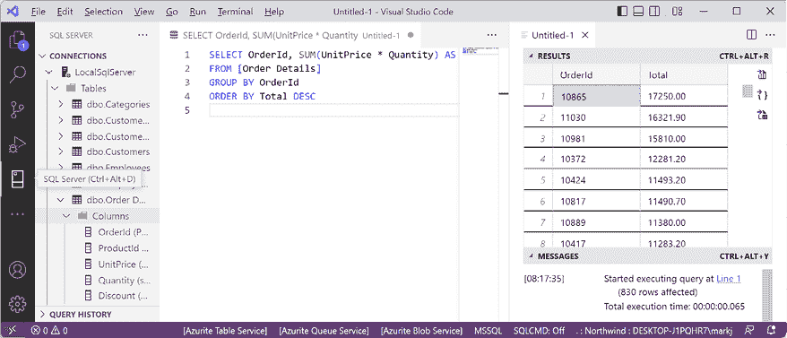

# 2

# 使用 SQL Server 管理关系数据

本章是关于管理存储在 SQL Server、Azure SQL Database 或 Azure SQL Edge 中的关系数据。首先，您将学习如何使用原生 Transact-SQL 语句管理数据。接下来，您将学习如何使用 ADO.NET 库（`Microsoft.Data.SqlClient`）以低级别管理数据。最后，您将使用 Dapper 来简化与实体模型的工作。

本章将涵盖以下主题：

+   理解现代数据库

+   使用 Transact-SQL 管理数据

+   使用低级 API 管理 SQL Server 数据

+   使用 Dapper 管理 SQL Server 数据

+   清理数据资源

# 理解现代数据库

存储数据最常见的两个地方是在**关系数据库管理系统**（**RDBMS**）中，如**SQL Server**、**PostgreSQL**、**MySQL**和**SQLite**，或者是在**NoSQL**数据库中，如**Azure Cosmos DB**、**MongoDB**、**Redis**和**Apache Cassandra**。

在本章中，我们将重点关注 Windows 上最受欢迎的 RDBMS，即 SQL Server。此产品也有适用于 Linux 的版本。对于跨平台开发，您可以使用 Azure SQL Database，它将数据存储在云中，或者使用 Azure SQL Edge，它可以在 Windows、macOS 或 Linux 上的 Docker 容器中运行，无论是在 Intel 还是 ARM 架构的 CPU 上。

## 使用示例关系数据库

要学习如何使用.NET 管理 RDBMS，拥有一个示例数据库会很有用，这样您就可以在一个具有中等复杂性和相当数量的示例记录的数据库上练习。

微软提供了几个示例数据库，其中大多数对我们来说过于复杂，因此，我们将使用一个在 20 世纪 90 年代初首次创建的数据库，称为**Northwind**。

让我们花一分钟时间看看 Northwind 数据库及其八个最重要的表的图表。您可以使用图 2.1 在本书编写代码和查询时进行参考：


图 2.1：Northwind 数据库表和关系

注意：

+   每个类别都有一个唯一的标识符、名称、描述和图片。图片以 JPEG 格式存储为字节数组。

+   每个产品都有一个唯一的标识符、名称、单价、库存数量和其他列。

+   每个产品都与一个类别相关联，通过存储该类别的唯一标识符。

+   `Categories`和`Products`之间的关系是一对多，这意味着每个类别可以有零个、一个或多个产品。

+   每个产品由一个供应商公司提供，通过存储供应商的唯一标识符来表示。

+   每个订单的每个细节都存储了产品的数量和单价。

+   每个订单都是由客户下单、由员工接收并由物流公司发货的。

+   每位员工都有一个姓名、地址、联系详情、出生日期和雇佣日期，以及一个指向其经理的引用（除了老板，其`ReportsTo`字段为`null`），并且照片以 JPEG 格式存储为字节数组。由于一个员工可以管理许多其他员工，因此该表与其自身具有一对一的关系。

## 连接到 SQL Server 数据库

要连接到 SQL Server 数据库，我们需要知道以下列表中的多个信息：

+   服务器（如果它具有默认值以上的名称）的名称。如果通过网络连接，这可能包括协议、IP 地址和端口号。

+   数据库的名称。

+   安全信息，例如用户名和密码，或者是否应自动使用 Windows 身份验证传递当前登录用户的凭据。

我们在**连接字符串**中指定此信息。

为了向后兼容，我们可以在 SQL Server 连接字符串中使用多个可能的关键字来表示各种参数，如下所示列表所示：

+   `Data Source`、`server`或`addr`: 这些关键字是服务器（以及可选的实例）的名称。您可以使用点（`.`）表示本地服务器。

+   `Initial Catalog`或`database`: 这些关键字是初始将处于活动状态的数据库的名称。可以使用以下命令更改 SQL 语句：`USE <databasename>`。

+   `Integrated Security`或`trusted_connection`: 这些关键字设置为`true`或`SSPI`，以使用 Windows 身份验证传递线程的当前用户凭据。

+   `User Id`和`Password`: 这些关键字用于使用 SQL Server 的任何版本进行身份验证。这对于 Azure SQL Database 或 Azure SQL Edge 非常重要，因为它们不支持 Windows 身份验证。Windows 上的 SQL Server 完整版支持用户名和密码以及 Windows 身份验证。

+   `Authentication`: 这个关键字用于使用 Azure AD 身份进行身份验证，可以启用无密码身份验证。值可以是`Active Directory Integrated`、`Active Directory Password`和`Sql Password`。

+   `Persist Security Info`: 如果设置为`false`，此关键字告诉连接在身份验证后从连接字符串中删除`Password`。

+   `Encrypt`: 如果设置为`true`，此关键字告诉连接使用 SSL 加密客户端和服务器之间的传输。

+   `TrustServerCertificate`: 如果本地托管并且您收到错误“与服务器成功建立了连接，但在登录过程中发生错误。（提供程序：SSL 提供程序，错误：0 - 由不受信任的权威机构签发的证书链。）”，则将其设置为`true`。

+   `Connection Timeout`: 此关键字默认为 30 秒。

+   `MultipleActiveResultSets`: 将此关键字设置为`true`以启用单个连接同时用于处理多个表以提高效率。它用于从相关表懒加载行。

如上列表所述，当您编写代码连接到 SQL Server 数据库时，您需要知道其服务器名称。服务器名称取决于您将要连接的 SQL Server 版本和版本，如 *表 2.1* 所示：

| **SQL Server 版本** | **服务器名称 \ 实例名称** |
| --- | --- |
| LocalDB 2012 | `(localdb)\v11.0` |
| LocalDB 2016 或更高版本 | `(localdb)\mssqllocaldb` |
| Express | `.\sqlexpress` |
| 全功能/开发者版（默认实例） | `.` |
| 全功能/开发者版（命名实例） | `.\apps-services-book` |
| Azure SQL Edge（本地 Docker） | `tcp:127.0.0.1,1433` |
| Azure SQL 数据库 | `tcp:[自定义服务器名称].database.windows.net,1433` |

表 2.1：SQL Server 各版本的示例服务器名称

**良好实践**：使用点（.）作为本地计算机名称（localhost）的缩写。请记住，SQL Server 的服务器名称可以由两部分组成：计算机名称和 SQL Server 实例名称。您在自定义安装期间提供实例名称。

## 本地安装和设置 SQL Server

微软为 Windows、Linux 和 Docker 容器提供了其流行的、功能强大的 SQL Server 产品的各种版本。如果您有 Windows，则可以使用免费的单机运行版本，称为 SQL Server 开发者版。您还可以使用 Express 版本或与 Visual Studio 2022 for Windows 一起安装的免费 SQL Server LocalDB 版本。

如果您没有 Windows 计算机，或者您想使用跨平台的数据库系统，则可以跳到主题 *设置 Azure SQL 数据库*，或者在线部分 *在 Docker 中安装 Azure SQL Edge*，该部分可在以下链接中找到：

[`github.com/markjprice/apps-services-net8/blob/main/docs/ch02-sql-edge.md`](https://github.com/markjprice/apps-services-net8/blob/main/docs/ch02-sql-edge.md)

如果您想在 Linux 上本地安装 SQL Server，您可以在以下链接中找到说明：[`learn.microsoft.com/en-us/sql/linux/sql-server-linux-setup`](https://learn.microsoft.com/en-us/sql/linux/sql-server-linux-setup)。

### 安装 Windows 的 SQL Server 开发者版

在 Windows 上，如果您想使用 SQL Server 的完整版而不是简化的 LocalDB 或 Express 版本，您可以在以下链接中找到所有 SQL Server 版本：[`www.microsoft.com/en-us/sql-server/sql-server-downloads`](https://www.microsoft.com/en-us/sql-server/sql-server-downloads)。

执行以下步骤：

1.  下载 **开发者** 版本。

1.  运行安装程序。

1.  选择 **自定义** 安装类型。

1.  选择安装文件的文件夹，然后点击 **安装**。

1.  等待 1.5 GB 的安装文件下载。

1.  在 **SQL Server 安装中心**，点击 **安装**，然后点击 **新建 SQL Server 独立安装或向现有安装添加功能**，如图 *图 2.2* 所示：


图 2.2：安装新的 SQL Server 实例

1.  选择**开发者**版作为免费版，然后点击**下一步**。

1.  接受许可条款，然后点击**下一步**。

1.  检查**Microsoft 更新**选项，然后点击**下一步**。

1.  检查安装规则，修复任何问题，尽管你可能想忽略任何防火墙警告，因为你可能根本不想暴露这些端口，然后点击**下一步**。

1.  在**功能选择**中，选择**数据库引擎服务**，然后点击**下一步**。

1.  在**Azure SQL Server 扩展**中，你可以将其关闭。

1.  在**实例配置**中，选择**默认实例**，然后点击**下一步**。如果您已经配置了默认实例，则可以创建一个命名实例，例如 `apps-services-book`。

1.  在**服务器配置**中，注意**SQL Server 数据库引擎**已配置为自动启动。如果默认情况下尚未设置，则将**SQL Server 浏览器**设置为自动启动，然后点击**下一步**。

1.  在**数据库引擎配置**中，在**服务器配置**选项卡上，将**身份验证模式**设置为**混合**，将**sa**账户密码设置为强密码，点击**添加当前用户**，然后点击**下一步**。

1.  在**准备安装**中，检查将要执行的操作，然后点击**安装**。

1.  在**完成**中，注意已执行的操作，然后点击**关闭**。

1.  在**SQL Server 安装中心**中，在**安装**部分，点击**安装 SQL Server 管理工具**。

1.  在浏览器窗口中，点击下载 SSMS 的最新版本，如图 2.3 所示：

    图 2.3：下载 SQL Server 管理工具 (SSMS)

    下载 SSMS 的直接链接如下：[`learn.microsoft.com/en-us/sql/ssms/download-sql-server-management-studio-ssms`](https://learn.microsoft.com/en-us/sql/ssms/download-sql-server-management-studio-ssms)。

1.  运行 SSMS 安装程序并点击**安装**。

1.  当安装程序完成时，如果需要，请点击**重启**，或者点击**关闭**。

**Azure 数据工作室**（**ADS**）会自动与 SSMS 一起安装。ADS 是跨平台和开源的，因此您可以使用它在任何桌面操作系统上与 SQL Server 数据库一起工作。

### Visual Studio Code 扩展用于与 SQL Server 一起工作

有许多工具可以轻松地与 SQL Server 一起工作。如果您正在使用 Visual Studio Code，则可以安装 **SQL Server (mssql)** `ms-mssql.mssql` 扩展。如果您安装了扩展，它会在主侧栏中添加一个新的视图，标题为**SQL Server**，如图 2.4 所示：


图 2.4：SQL Server (mssql) 对 Visual Studio Code 的扩展

### 在本地创建 Northwind 示例数据库

现在我们可以运行数据库脚本，在 Windows 上使用 **SQL Server 管理工具**（**SSMS**）本地创建 Northwind 示例数据库：

1.  如果你之前没有下载或克隆此书的 GitHub 仓库，那么现在使用以下链接进行操作：[`github.com/markjprice/apps-services-net8/`](https://github.com/markjprice/apps-services-net8/)。

1.  在你的 `apps-services-net8` 文件夹中，创建一个名为 `Chapter02` 的文件夹。

1.  将从你本地 Git 仓库以下路径创建 Northwind 数据库的脚本复制到 `Chapter02` 文件夹中：`/scripts/sql-scripts/Northwind4SQLServer.sql`。

1.  启动 **SQL Server Management Studio**。

1.  在 **连接到服务器** 对话框中，对于 **服务器名称**，输入 `.`（一个点），表示本地计算机名称，然后点击 **连接**。

    **警告！** 如果你必须创建一个命名实例，如 `apps-services-book`，则输入 `.\apps-services-book`。如果你看到有关服务器证书的错误，则点击 **选项 >>** 按钮，并选择 **信任服务器证书** 复选框。

1.  导航到 **文件** | **打开** | **文件...**。

1.  浏览并选择 `Northwind4SQLServer.sql` 文件，然后点击 **打开**。

1.  在工具栏中，点击 **执行**，并注意 **命令(s) 已成功完成** 消息。

1.  在 **对象资源管理器** 中，展开 **Northwind** 数据库，然后展开 **表**。

1.  右键点击 **产品**，点击 **选择前 1000 行**，并注意返回的结果，如图 *图 2.5* 所示：


图 2.5：SQL Server Management Studio 中的产品表

1.  在 **对象资源管理器** 工具栏中，点击 **断开连接** 按钮。

1.  退出 **SQL Server Management Studio**。

我们不必使用 **SQL Server Management Studio** 来执行数据库脚本。我们也可以使用 Visual Studio 2022 中的工具，包括 **SQL Server 对象资源管理器** 和 **服务器资源管理器**，或者跨平台的 SQL Server Visual Studio Code 扩展，或者 **Azure Data Studio**，你可以从以下链接单独下载和安装：[`aka.ms/getazuredatastudio`](https://aka.ms/getazuredatastudio)。

## 设置 Azure SQL 数据库

如果你没有 Windows 计算机，则可以创建一个云托管的 SQL Server 实例。你需要一个 Azure 账户。你可以在以下链接注册：[`signup.azure.com`](https://signup.azure.com)。接下来，你需要执行以下步骤：

1.  登录到你的 Azure 账户：[`portal.azure.com/`](https://portal.azure.com/)

1.  导航到 [`portal.azure.com/#create/hub`](https://portal.azure.com/#create/hub)。

1.  搜索 **资源组** 并然后点击 **创建** 按钮。

1.  输入资源组名称为 `apps-services-book` 并选择一个靠近你的合适区域，然后点击 **审查 + 创建** 按钮，如图 *图 2.6* 所示：


图 2.6：在 Azure 门户中创建资源组

1.  审查你的选择，然后点击 **创建** 按钮。

1.  创建另一个资源，搜索**SQL 数据库**，然后点击**创建**。

1.  在**创建 SQL 数据库**页面，在**基本**选项卡中，对于**数据库名称**，输入`Northwind`，并选择你之前创建的资源组。

1.  在**服务器**部分，点击**创建新服务器**。

1.  按照如图 *图 2.7* 所示输入以下 SQL 数据库服务器的详细信息：

    +   **服务器名称**：`apps-services-book-[你的首字母]`或完全不同的名称。服务器名称必须是全局唯一的，因为它将成为公共 URL 的一部分。

    +   **位置**：靠近你的地区。我选择了**（欧洲）英国南部**。并非所有地区都支持所有类型的资源。如果你选择的地区不支持 SQL 数据库服务器资源，将会看到错误。

    +   **身份验证方法**：使用 SQL 身份验证。

    +   **服务器管理员登录**：[你的电子邮件或另一个用户名]，例如，我输入了`markjprice`。

    +   **密码**/**确认密码**：[输入一个强密码]。


图 2.7：输入 SQL 数据库实例的服务器详细信息

1.  点击**确定**。

1.  将**是否使用 SQL 弹性池**设置为**否**。

1.  对于**工作负载环境**，选择**开发**（而不是**生产**）。

1.  在**创建 SQL 数据库**页面，在**计算 + 存储**部分，点击**配置数据库**。

1.  对于**服务层**，选择**基本（适用于不太繁重的负载）**。请注意，最大数据库大小为 2 GB，预计每月费用约为 5 美元（或每小时不到 1 美分）。你可以在完成本章后立即删除资源以进一步降低成本。

1.  点击**应用**。

1.  在**创建 SQL 数据库**页面，将**备份存储冗余**设置为**本地冗余备份存储**。

1.  点击**下一步：网络**按钮。

1.  在**网络连接**部分，选择**公共端点**。

1.  在**防火墙规则**部分，将**添加当前客户端 IP 地址**设置为**是**。

1.  点击**下一步：安全**按钮。

1.  审查选项，但保留默认设置。

1.  点击**下一步：其他设置**按钮。

1.  审查选项，但保留默认设置。

1.  点击**审查 + 创建**按钮。

1.  点击**创建**按钮。

1.  等待部署完成，如图 *图 2.8* 所示：


图 2.8：SQL 数据库部署进度

1.  部署完成后，点击**转到资源**。

1.  点击**概览**并注意数据库详细信息，如图 *图 2.9* 所示：


图 2.9：SQL 数据库详细信息

1.  点击**查看连接字符串**（或点击左侧导航中的**连接字符串**）。

1.  将**ADO.NET (SQL 身份验证**)连接字符串复制到剪贴板。

1.  启动 **记事本** 或你喜欢的纯文本编辑器，粘贴连接字符串，并在每个分号后添加换行符以分隔每个部分，以便更容易处理，如图下文所示：

    ```cs
    Server=tcp:apps-services-book.database.windows.net,1433;
    Initial Catalog=Northwind;
    Persist Security Info=False;
    User ID=markjprice;
    Password={your_password};
    MultipleActiveResultSets=False;
    Encrypt=True;
    TrustServerCertificate=False;
    Connection Timeout=30; 
    ```

    你的`Server`值将不同，因为自定义服务器名称部分，例如，`apps-services-book`是公开的，并且必须是全局唯一的。

1.  可选地，保存记事本文件以供将来参考。

### JetBrains Rider 用于处理 SQL Server 的工具窗口

如果你使用任何操作系统的 JetBrains Rider，那么你可以使用以下步骤连接到 SQL Server 数据库：

1.  在 JetBrains Rider 中，选择**视图** | **工具窗口** | **数据库**。

1.  在**数据库**工具窗口中，点击**连接到数据库...**。

1.  选择**使用连接字符串**选项按钮。

1.  将**数据库类型**设置为**Microsoft SQL Server**。

1.  在**字符串**框中，输入数据库连接字符串。

1.  将`{your_password}`更改为你选择的密码。

1.  可选地，点击**测试连接**并在必要时纠正任何错误。如果你得到一个**不一致的语言**错误，那么你可以忽略它，因为我们正在使用 SQL Server 作为方言。

1.  点击**连接到数据库**。

### 在云中创建 Northwind 示例数据库

现在我们可以运行一个数据库脚本，在 Azure SQL 数据库中创建 Northwind 示例数据库：

1.  使用你首选的数据库工具连接到 Azure 中的 SQL 服务器：

    +   在 Visual Studio 2022 中，查看**服务器资源管理器**。

    +   在 Windows 上，启动**SQL Server Management Studio**。

    +   在 Visual Studio Code 中，查看**SQL Server**工具。

    +   在 JetBrains Rider 中，导航到**视图** | **工具窗口** | **数据库**，然后点击**连接到数据库…**。

1.  添加数据连接，并在对话框中填写所有必需的连接字符串信息，如图*图 2.10*所示：

    图 2.10：从 Visual Studio 连接到你的 Azure SQL 数据库

    你可能还会被提示**选择****数据源**。选择**Microsoft SQL Server**。你可以选择一个复选框来始终使用此选择。

1.  右键单击数据连接，选择**新建查询**。

    如果你使用 JetBrains Rider，那么右键单击 SQL Server，在弹出菜单中选择**SQL 脚本** | **运行 SQL 脚本…**，然后选择`Northwind4AzureSQLdatabase.sql`文件。

1.  将`Northwind4AzureSQLdatabase.sql`文件的全部内容复制并粘贴到查询窗口中，并执行它。

    `Northwind4SQLServer.sql`脚本和`Northwind4AzureSQLdatabase.sql`脚本之间的主要区别是，本地 SQL Server 脚本将删除并重新创建 Northwind 数据库。Azure SQL 数据库脚本不会这样做，因为数据库需要作为 Azure 资源创建。你可以从以下链接下载 SQL 脚本文件：[`github.com/markjprice/apps-services-net8/tree/main/scripts/sql-scripts`](https://github.com/markjprice/apps-services-net8/tree/main/scripts/sql-scripts)。

1.  等待看到**命令已成功完成**的消息。这可能需要几分钟。

1.  在 **服务器资源管理器** 中，右键单击 **表** 并选择 **刷新**，注意已创建了 13 个表，例如 **类别**、**客户** 和 **产品**。还要注意，还创建了数十个视图和存储过程。

你现在在云中有一个正在运行的 Azure SQL 数据库，你可以从 .NET 项目连接到它。

# 使用 Transact-SQL 管理数据

**Transact-SQL** (**T-SQL**) 是 SQL Server 的 **结构化查询语言** (**SQL**) 方言。有些人读作 *tee-sequel*，有些人读作 *tee-es-queue-el*。

与 C# 不同，T-SQL 不区分大小写；例如，你可以使用 `int` 或 `INT` 来指定 32 位整数数据类型，你也可以使用 `SELECT` 或 `select` 来开始一个查询表达式。存储在 SQL Server 表中的文本数据可以被视为区分大小写或不区分大小写，这取决于配置。

T-SQL 的完整参考可以在以下链接找到：[`learn.microsoft.com/en-us/sql/t-sql/language-reference`](https://learn.microsoft.com/en-us/sql/t-sql/language-reference)。从该文档起始页面，使用左侧导航查看 **数据类型**、**查询** 和 **语句** 等主题。

## T-SQL 数据类型

T-SQL 有用于列、变量、参数等的数据类型，如 *表 2.2* 所示：

| **类别** | **示例** |
| --- | --- |
| 数字 | `bigint`, `bit`, `decimal`, `float`, `int`, `money`, `numeric`, `real`, `smallint`, `smallmoney`, `tinyint` |
| 日期和时间 | `date`, `datetime2`, `datetime`, `datetimeoffset`, `smalldatetime`, `time` |
| 文本 | `char`, `nchar`, `ntext`, `nvarchar`, `text`, `varchar` |
| 二进制 | `binary`, `image`, `varbinary` |
| 其他 | `cursor`, `hierarchyid`, `sql_variant`, `table`, `rowversion`, `uniqueidentifier`, `xml` |

表 2.2：SQL Server 数据类型类别

存在 `xml` 数据类型但没有 JSON 数据类型。使用 `nvarchar` 存储 JSON 值。T-SQL 还支持空间 `geometry` 和 `geography` 类型。

## 使用注释进行文档记录

要注释掉整行剩余部分，使用 `--`，它等同于 `//`。

要注释掉一个代码块，使用起始的 `/*` 和结束的 `*/`，就像在 C# 中一样。

## 声明变量

本地变量名以 `@` 为前缀，并使用 `SET`, `SELECT`, 或 `DECLARE` 定义，如下面的代码所示：

```cs
DECLARE @WholeNumber INT; -- Declare a variable and specify its type.
SET @WholeNumber = 3; -- Set the variable to a literal value.
SET @WholeNumber = @WholeNumber + 1; -- Increment the variable.
SELECT @WholeNumber = COUNT(*) FROM Employees; -- Set to the number of employees.
SELECT @WholeNumber = EmployeeId FROM Employees WHERE FirstName = 'Janet'; 
```

全局变量以 `@@` 为前缀。例如，`@@ROWCOUNT` 是一个上下文相关的值，它返回在当前作用域内执行语句影响的行数，例如，更新的或删除的行数。

## 指定数据类型

大多数类型都有固定的大小。例如，`int` 使用四个字节，`smallint` 使用两个字节，`tinyint` 使用一个字节。

对于文本和二进制类型，您可以指定一个以 `var` 或 `nvar`（表示可变大小）前缀的类型，这将根据其当前值自动更改其大小，但不超过最大值，如下例所示：`varchar(40)`；或者您可以指定一个固定数量的字符，这将始终分配，如下例所示：`char(40)`。

对于文本类型，`n` 前缀表示 Unicode，意味着每个字符将使用两个字节。未使用 `n` 前缀的文本类型每个字符使用一个字节。

## 控制流程

T-SQL 有与 C# 类似的流程控制关键字，例如 `BREAK`、`CONTINUE`、`GOTO`、`IF...ELSE`、`CASE`、`THROW`、`TRY...CATCH`、`WHILE` 和 `RETURN`。主要区别是使用 `BEGIN` 和 `END` 来指示块的开始和结束，这与 C# 中的花括号等效。

## 运算符

T-SQL 有与 C# 类似的运算符，例如 `=`（赋值）、`+`、`-`、`*`、`/`、`%`、`<`、`>`、`<=`、`==`、`!=`、`&`、`|`、`^` 等。它还有逻辑运算符如 `AND`、`OR`、`NOT`，以及类似 LINQ 的运算符如 `ANY`、`ALL`、`SOME`、`EXISTS`、`BETWEEN` 和 `IN`。

`LIKE` 用于文本模式匹配。模式可以使用 `%` 表示任意数量的字符。模式可以使用 `_` 表示单个字符。模式可以使用 `[]` 来指定一个范围和允许的字符集，例如 `[0-9A-Z.-,]`，它看起来像简化的正则表达式语法，但请注意，它*不是*正则表达式语法。

如果表名或列名包含空格，则必须用方括号括起来，例如 `[Order Details]`。创建 Northwind 数据库的 SQL 脚本包括命令 `set quoted_identifier on`，因此您也可以使用双引号，例如 `"Order Details"`。单引号用于文本字面量，例如 `'USA'`。

## 数据操纵语言 (DML)

DML 用于查询和更改数据。

DML 中最常用的语句是 `SELECT`，它用于从一个或多个表中检索数据。`SELECT` 非常复杂，因为它功能强大。本书不是关于学习 T-SQL 的，所以了解 `SELECT` 的最快方式是查看一些示例，如 *表 2.3* 所示：

| **示例** | **描述** |
| --- | --- |
| `SELECT *` FROM Employees | 获取所有员工的全部列。 |
| `SELECT FirstName, LastName` FROM Employees | 获取所有员工的姓名列。 |
| `SELECT emp.FirstName, emp.LastName` FROM Employees AS emp | 为表名提供一个别名。当只有一个表时，不需要表名前缀，但在有多个具有相同名称的列的表时变得有用，例如 `Customers.CustomerId` 和 `Orders.CustomerId`。 |
| `SELECT emp.FirstName, emp.LastName` FROM Employees emp | 无需使用 `AS` 关键字为表名提供别名。 |
| `SELECT FirstName, LastName AS Surname` FROM Employees | 为列名提供一个别名。 |
| `SELECT FirstName, LastName` FROM Employees WHERE Country = 'USA' | 过滤结果，仅包括美国的员工。 |
| `SELECT DISTINCT Country` FROM Employees | 获取 `Employees` 表中 `Country` 列作为值的国家的列表，不包含重复项。 |
| `SELECT UnitPrice * Quantity AS Subtotal` FROM [Order Details] | 计算每个订单明细行的子总金额。 |
| `SELECT OrderId, SUM(UnitPrice * Quantity) AS Total` FROM [Order Details] GROUP BY OrderId ORDER BY Total DESC | 计算每个订单的总金额，并按总金额降序排序。 |
| `SELECT CompanyName` FROM Customers UNION SELECT CompanyName FROM Suppliers | 返回所有客户和供应商的公司名称。 |
| `SELECT CategoryName, ProductName` FROM Categories, Products | 使用笛卡尔连接匹配每个类别与每个产品，并输出它们的名称（这不是你通常想要的！）616 行（8 个类别 x 77 个产品）。 |
| `SELECT CategoryName, ProductName` FROM Categories c, Products p WHERE c.CategoryId = p.CategoryId | 使用每个表中的 `CategoryId` 列的 `WHERE` 子句匹配每个产品与其类别，并输出类别名称和产品名称。77 行。 |
| `SELECT CategoryName, ProductName` FROM Categories c INNER JOIN Products p ON c.CategoryId = p.CategoryId | 使用每个表中的 `CategoryId` 列的 `INNER JOIN...ON` 子句匹配每个产品与其类别，并输出类别名称和产品名称。这是使用 `WHERE` 的现代替代语法，并允许外连接，这也会包括不匹配项。77 行。 |

表 2.3：示例 SELECT 语句及其描述

**更多信息**：您可以在以下链接中阅读关于 `SELECT` 的完整文档：[`learn.microsoft.com/en-us/sql/t-sql/queries/select-transact-sql`](https://learn.microsoft.com/en-us/sql/t-sql/queries/select-transact-sql).

使用您喜欢的数据库查询工具，例如 Visual Studio 的 **服务器资源管理器** 或 Visual Studio Code 的 `mssql` 扩展，连接到您的 Northwind 数据库并尝试上述查询，如图 2.11 和图 2:12 所示：


图 2.11：使用 Visual Studio 的服务器资源管理器执行 T-SQL 查询



图 2.12：使用 Visual Studio Code 的 mssql 扩展执行 T-SQL 查询

## DML 用于添加、更新和删除数据

DML 语句用于添加、更新和删除数据，包括 *表 2.4* 中所示的内容：

| **示例** | **描述** |
| --- | --- |
| `INSERT Employees(FirstName, LastName)` VALUES('Mark', 'Price') | 向 `Employees` 表添加新行。`EmployeeId` 主键值将自动分配。使用 `@@IDENTITY` 获取此值。 |
| `UPDATE Employees` SET Country = 'UK' WHERE FirstName = 'Mark' AND LastName = 'Price' | 更新我的员工行，将我的 `Country` 设置为 `UK`。 |
| `DELETE Employees``WHERE FirstName = 'Mark'``AND LastName = 'Price'` | 删除我的员工记录。 |
| `DELETE Employees` | 删除 `Employees` 表中的所有行，并在事务日志中记录这些删除操作。 |
| `TRUNCATE TABLE Employees` | 更高效地删除 `Employees` 表中的所有行，因为它不记录单个行删除。 |

表 2.4：带有描述的示例 DML 语句

上述示例使用 `Northwind` 数据库中的 `Employees` 表。该表具有引用完整性约束，这意味着例如，删除表中的所有行是不可能的，因为每个员工在其他表（如 `Orders`）中都有相关数据。

## 数据定义语言 (DDL)

DDL 语句更改数据库的结构，包括创建新对象，如表、函数和存储过程。以下表格展示了某些 DDL 语句的示例，以供您参考，但这些示例简单，无法在 *表 2.5* 中所示的 Northwind 数据库中执行：

| **示例** | **描述** |
| --- | --- |
| `CREATE TABLE dbo.Shippers (``ShipperId INT PRIMARY KEY CLUSTERED,``CompanyName NVARCHAR(40)``);` | 创建一个表来存储承运商信息。 |
| `ALTER TABLE Shippers``ADD Country NVARCHAR(40)` | 向表中添加一个列。 |
| `CREATE NONCLUSTERED INDEX IX_Country``ON Shippers(Country)` | 为表中的列添加一个非聚集索引。 |
| `CREATE INDEX IX_FullName``ON Employees(LastName, FirstName DESC)``WITH (DROP_EXISTING = ON)` | 更改具有多个列的聚合索引并控制排序顺序。 |
| `DROP TABLE Employees` | 删除 `Employees` 表。如果它不存在，则抛出错误。 |
| `DROP TABLE IF EXISTS Employees` | 如果 `Employees` 表已存在，则删除该表。这避免了使用上一行语句可能产生的潜在错误。 |
| `IF OBJECT_ID(N'Employees', N'U')``IS NOT NULL` | 检查是否存在一个表。在文本字面量前方的 `N` 前缀表示 Unicode。`'U'` 表示用户表，而不是系统表。 |

表 2.5：带有描述的示例 DDL 语句

# 使用低级 API 管理数据

`Microsoft.Data.SqlClient` 包为 .NET 应用程序提供对 SQL Server 的数据库连接。它也被称为 **SQL Server 和 Azure SQL 数据库的 ADO.NET 驱动程序**。

**更多信息**：您可以在以下链接找到 ADO.NET 的 GitHub 仓库：[`github.com/dotnet/SqlClient`](https://github.com/dotnet/SqlClient)。

`Microsoft.Data.SqlClient` 包支持以下 .NET 平台：

+   .NET Framework 4.6.2 及更高版本。

+   .NET Core 3.1 及更高版本。

+   .NET Standard 2.0 及更高版本。

## 理解 ADO.NET 中的类型

ADO.NET 定义了代表用于处理数据的最小对象的抽象类型，如 `DbConnection`、`DbCommand` 和 `DbDataReader`。数据库软件制造商可以继承并为其提供特定的实现，这些实现针对其数据库进行了优化，并公开了额外的功能。Microsoft 为 SQL Server 做了这件事。以下是最重要的类型及其最常用的成员，显示在 *表 2.6* 中：

| **类型** | **属性** | **方法** | **描述** |
| --- | --- | --- | --- |
| `SqlConnection` | `ConnectionString,` `State,` `ServerVersion` | `Open,` `Close,` `CreateCommand,` `RetrieveStatistics` | 管理与数据库的连接。 |
| `SqlConnectionStringBuilder` | `InitialCatalog,` `DataSource,` `Encrypt,` `UserID,` `Password,` `ConnectTimeout` 等 | `Clear,` `ContainsKey,` `Remove` | 为 SQL Server 数据库构建一个有效的连接字符串。在设置所有相关单个属性后，获取 `ConnectionString` 属性。 |
| `SqlCommand` | `Connection,` `CommandType,` `CommandText,` `Parameters,` `Transaction` | `ExecuteReader,` `ExecuteNonQuery,` `ExecuteXmlReader,` `CreateParameter` | 配置命令以执行。 |
| `SqlParameter` | `ParameterName,` `Value,` `DbType,` `SqlValue,` `SqlDbType,` `Direction,` `IsNullable` |  | 为命令配置一个参数。 |
| `SqlDataReader` | `FieldCount,` `HasRows,` `IsClosed,` `RecordsAffected` | `Read,` `Close,` `GetOrdinal,` `GetInt32,` `GetString,` `GetDecimal,` `GetFieldValue<T>` | 处理查询执行的结果集。 |

表 2.6：ADO.NET SqlClient 中的重要类型

`SqlConnection` 有两个有用的事件：`StateChange` 和 `InfoMessage`。

`SqlCommand` 的所有 `ExecuteXxx` 方法都将执行任何命令。您使用哪个取决于您期望得到什么：

+   如果命令包含至少一个返回结果集的 `SELECT` 语句，那么请调用 `ExecuteReader` 来执行命令。此方法返回一个派生自 `DbDataReader` 的对象，用于通过结果集逐行读取。

+   如果命令不包含至少一个 `SELECT` 语句，那么调用 `ExecuteNonQuery` 更有效率。此方法返回受影响的行数。

+   如果命令包含至少一个 `SELECT` 语句，该语句返回 XML，因为它使用了 `AS XML` 命令，那么请调用 `ExecuteXmlReader` 来执行命令。

## 创建用于处理 ADO.NET 的控制台应用程序

首先，我们将创建一个用于处理 ADO.NET 的控制台应用程序项目：

1.  使用您首选的代码编辑器创建控制台应用程序项目，如下列定义：

    +   项目模板：**控制台应用程序** / `console`。

    +   解决方案文件和文件夹：`Chapter02`。

    +   项目文件和文件夹：`Northwind.Console.SqlClient`。

    +   **不要使用顶级语句**：已清除。

    +   **启用原生 AOT 发布**：已清除。

    **良好实践**：对于您为这本书创建的所有项目，请保持您的根路径短，并避免在文件夹和文件名中使用 `#`，否则您可能会看到像 `RSG002: TargetPath not specified for additional file` 这样的编译器错误。例如，请不要使用 `C:\My C# projects\` 作为您的根路径！

1.  在项目文件中，将警告视为错误，添加对最新版本的 `Microsoft.Data.SqlClient` 的包引用，并静态和全局导入 `System.Console`，如下面的标记所示：

    ```cs
    <Project Sdk="Microsoft.NET.Sdk">
      <PropertyGroup>
        <OutputType>Exe</OutputType>
        <TargetFramework>net8.0</TargetFramework>
        <ImplicitUsings>enable</ImplicitUsings>
        <Nullable>enable</Nullable>
     **<TreatWarningsAsErrors>****true****</TreatWarningsAsErrors>**
      </PropertyGroup>
     **<ItemGroup>**
     **<PackageReference Include=****"Microsoft.Data.SqlClient"** **Version=****"5.1.2"** **/>**
     **</ItemGroup>**
     **<ItemGroup>**
     **<Using Include=****"System.Console"** **Static=****"true"** **/>**
     **</ItemGroup>**
    </Project> 
    ```

    您可以在以下链接中检查该包的最新版本：[`www.nuget.org/packages/Microsoft.Data.SqlClient#versions-body-tab`](https://www.nuget.org/packages/Microsoft.Data.SqlClient#versions-body-tab)。

1.  构建项目以恢复引用的包。

1.  添加一个名为 `Program.Helpers.cs` 的新类文件，并修改其内容以定义一个方法来配置控制台以启用特殊字符，如欧元货币符号，并设置当前区域设置，以及一个方法，该方法将以指定的颜色将一些文本输出到控制台，默认颜色为黑色，如下面的代码所示：

    ```cs
    using System.Globalization; // To use CultureInfo.
    partial class Program
    {
      private static void ConfigureConsole(string culture = "en-US",
        bool useComputerCulture = false)
      {
        // To enable Unicode characters like Euro symbol in the console.
        OutputEncoding = System.Text.Encoding.UTF8;
        if (!useComputerCulture)
        {
          CultureInfo.CurrentCulture = CultureInfo.GetCultureInfo(culture);
        }
        WriteLine($"CurrentCulture: {CultureInfo.CurrentCulture.DisplayName}");
      }
      private static void WriteLineInColor(string value, 
        ConsoleColor color = ConsoleColor.White)
      {
        ConsoleColor previousColor = ForegroundColor;
        ForegroundColor = color;
        WriteLine(value);
        ForegroundColor = previousColor;
      }
    } 
    ```

    在前面的代码中，默认的前景色为白色，因为我假设大多数读者的默认背景色为黑色。在我的计算机上，我将控制台的默认背景色设置为白色，以便为这本书截图。请根据您的计算机设置最适合的默认颜色。

1.  添加一个名为 `Program.EventHandlers.cs` 的新类文件，并修改其内容以定义方法，这些方法将作为数据库连接状态变化的事件处理器，通过显示原始和当前状态，以及当数据库发送 `InfoMessage` 时执行，如下面的代码所示：

    ```cs
    using Microsoft.Data.SqlClient; // To use SqlInfoMessageEventArgs.
    using System.Data; // To use StateChangeEventArgs.
    partial class Program
    {
      private static void Connection_StateChange(
        object sender, StateChangeEventArgs e)
      {
        WriteLineInColor(
          $"State change from {e.OriginalState} to {e.CurrentState}.",
          ConsoleColor.DarkYellow);
      }
      private static void Connection_InfoMessage(
        object sender, SqlInfoMessageEventArgs e)
      {
        WriteLineInColor($"Info: {e.Message}.", ConsoleColor.DarkBlue);
      }
    } 
    ```

1.  在 `Program.cs` 中，删除现有的语句。添加语句以连接到本地 SQL Server、Azure SQL 数据库或 SQL Edge，使用 SQL 身份验证（带有用户 ID 和密码）或 Windows 认证（不带用户 ID 和密码），如下面的代码所示：

    ```cs
    using Microsoft.Data.SqlClient; // To use SqlConnection and so on.
    ConfigureConsole();
    #region Set up the connection string builder
    SqlConnectionStringBuilder builder = new()
    {
      InitialCatalog = "Northwind",
      MultipleActiveResultSets = true,
      Encrypt = true,
      TrustServerCertificate = true,
      ConnectTimeout = 10 // Default is 30 seconds.
    };
    WriteLine("Connect to:");
    WriteLine("  1 - SQL Server on local machine");
    WriteLine("  2 - Azure SQL Database");
    WriteLine("  3 – Azure SQL Edge");
    WriteLine();
    Write("Press a key: ");
    ConsoleKey key = ReadKey().Key;
    WriteLine(); WriteLine();
    switch (key)
    {
      case ConsoleKey.D1 or ConsoleKey.NumPad1:
        builder.DataSource = ".";
        break;
      case ConsoleKey.D2 or ConsoleKey.NumPad2:
        builder.DataSource = 
          // Use your Azure SQL Database server name.
          "tcp:apps-services-book.database.windows.net,1433";
        break;
      case ConsoleKey.D3 or ConsoleKey.NumPad3:
        builder.DataSource = "tcp:127.0.0.1,1433";
        break;
      default:
        WriteLine("No data source selected.");
        return;
    }
    WriteLine("Authenticate using:");
    WriteLine("  1 – Windows Integrated Security");
    WriteLine("  2 – SQL Login, for example, sa");
    WriteLine();
    Write("Press a key: ");
    key = ReadKey().Key;
    WriteLine(); WriteLine();
    if (key is ConsoleKey.D1 or ConsoleKey.NumPad1)
    {
      builder.IntegratedSecurity = true;
    }
    else if (key is ConsoleKey.D2 or ConsoleKey.NumPad2)
    {
      Write("Enter your SQL Server user ID: ");
      string? userId = ReadLine();
      if (string.IsNullOrWhiteSpace(userId))
      {
        WriteLine("User ID cannot be empty or null.");
        return;
      }
      builder.UserID = userId;
      Write("Enter your SQL Server password: ");
      string? password = ReadLine();
      if (string.IsNullOrWhiteSpace(password))
      {
        WriteLine("Password cannot be empty or null.");
        return;
      }
      builder.Password = password;
      builder.PersistSecurityInfo = false;
    }
    else
    {
      WriteLine("No authentication selected.");
      return;
    }
    #endregion
    #region Create and open the connection
    SqlConnection connection = new(builder.ConnectionString);
    WriteLine(connection.ConnectionString);
    WriteLine();
    connection.StateChange += Connection_StateChange;
    connection.InfoMessage += Connection_InfoMessage;
    try
    {
      WriteLine("Opening connection. Please wait up to {0} seconds...", 
        builder.ConnectTimeout);
      WriteLine();
      connection.Open();
      WriteLine($"SQL Server version: {connection.ServerVersion}");
    }
    catch (SqlException ex)
    {
      WriteLineInColor($"SQL exception: {ex.Message}", 
        ConsoleColor.Red);
      return;
    }
    #endregion
    connection.Close(); 
    ```

    **良好实践**：在这个编码任务中，我们提示用户输入连接到数据库的密码。在实际应用中，您更有可能将密码存储在环境变量或像 Azure Key Vault 这样的安全存储中。您绝对不应该在源代码中存储密码！

1.  运行控制台应用程序，选择与您的 SQL Server 设置兼容的选项，并注意结果，包括以深黄色写入的状态变化事件输出，以便更容易看到，如下面的输出所示：

    ```cs
    Connect to:
      1 - SQL Server on local machine
      2 - Azure SQL Database
      3 - Azure SQL Edge
    Press a key: 1
    Authenticate using:
      1 - Windows Integrated Security
      2 - SQL Login, for example, sa
    Press a key: 1
    Data Source=.;Initial Catalog=Northwind;Integrated Security=True;Multiple Active Result Sets=True;Connect Timeout=10;Encrypt=True;Trust Server Certificate=True
    Opening connection. Please wait up to 10 seconds...
    State change from Closed to Open.
    SQL Server version: 15.00.2101
    State change from Open to Closed. 
    ```

    以下步骤展示了连接到 Azure SQL 数据库或 Azure SQL Edge 的经验，这些操作需要用户名和密码。如果您使用 Windows 集成安全连接到本地 SQL Server，则不需要输入密码。

1.  运行控制台应用程序，选择需要用户 ID 和密码的选项，例如使用 Azure SQL 数据库，并注意结果，如下所示的部分输出：

    ```cs
    Enter your SQL Server user ID: markjprice
    Enter your SQL Server password: [censored]
    Data Source=tcp:apps-services-book.database.windows.net,1433;Initial Catalog=Northwind;Persist Security Info=False;User ID=markjprice;Password=[censored];Multiple Active Result Sets=True;Connect Timeout=10;Encrypt=True;Trust Server Certificate=True
    Opening connection. Please wait up to 10 seconds...
    State change from Closed to Open.
    SQL Server version: 12.00.5168
    State change from Open to Closed. 
    ```

1.  运行控制台应用程序，选择需要用户 ID 和密码的选项，输入错误的密码，并注意结果，如下所示的部分输出：

    ```cs
    Enter your SQL Server user ID: markjprice
    Enter your SQL Server password: 123456
    Data Source=tcp:apps-services-book.database.windows.net,1433;Initial Catalog=Northwind;Persist Security Info=False;User ID=markjprice;Password=123456;Multiple Active Result Sets=True;Connect Timeout=10;Encrypt=True;Trust Server Certificate=True
    Opening connection. Please wait up to 10 seconds...
    SQL exception: Login failed for user 'markjprice'. 
    ```

1.  在`Program.cs`中，将服务器名称（`DataSource`属性）更改为错误的内容。

1.  运行控制台应用程序并注意结果（根据您的数据库托管位置，异常消息可能略有不同），如下所示：

    ```cs
    SQL exception: A network-related or instance-specific error occurred while establishing a connection to SQL Server. The server was not found or was not accessible. Verify that the instance name is correct and that SQL Server is configured to allow remote connections. (provider: TCP Provider, error: 0 - No such host is known.) 
    ```

当打开 SQL Server 连接时，对于服务器连接问题，默认超时时间为 30 秒，所以请耐心等待！我们将超时时间更改为 10 秒，以避免等待时间过长。

## 使用 ADO.NET 执行查询和处理数据读取器

现在我们已经成功连接到 SQL Server 数据库，我们可以运行检索表中的行并使用数据读取器处理结果的命令：

1.  在`Program.cs`中，导入用于处理 ADO.NET 命令类型的命名空间，如下所示：

    ```cs
    using System.Data; // To use CommandType. 
    ```

    **良好实践**：为了节省本书的空间，我将使用`cmd`和`r`来表示 SQL 命令和 SQL 数据读取器。在您的代码中，给变量赋予合适的单词名称，如`command`和`reader`。

1.  在关闭连接的语句之前，添加定义选择`Products`表中的 ID、名称和价格的命令的语句，执行它，并使用数据读取器输出产品 ID、名称和价格，如下所示：

    ```cs
    SqlCommand cmd = connection.CreateCommand();
    cmd.CommandType = CommandType.Text;
    cmd.CommandText = "SELECT ProductId, ProductName, UnitPrice FROM Products";
    SqlDataReader r = cmd.ExecuteReader();
    string horizontalLine = new string('-', 60);
    WriteLine(horizontalLine);
    WriteLine("| {0,5} | {1,-35} | {2,10} |", 
      arg0: "Id", arg1: "Name", arg2: "Price");
    WriteLine(horizontalLine);
    while (r.Read())
    {
      WriteLine("| {0,5} | {1,-35} | {2,10:C} |",
        r.GetInt32("ProductId"), 
        r.GetString("ProductName"),
        r.GetDecimal("UnitPrice"));
    }
    WriteLine(horizontalLine);
    r.Close(); 
    ```

    我们使用`C`格式来格式化单价，该格式使用当前文化来格式化货币值。调用`ConfigureConsole`将当前文化设置为美国英语，因此所有读者的输出都使用`$`。要测试像使用欧元货币符号的法国这样的替代文化，请修改`Program.cs`文件顶部的调用，如下所示：`ConfigureConsole("fr-FR");`。

1.  运行控制台应用程序并注意结果，如下所示的部分输出：

    ```cs
    ----------------------------------------------------------
    |    Id | Name                                |    Price |
    ----------------------------------------------------------
    |     1 | Chai                                |   $18.00 |
    |     2 | Chang                               |   $19.00 |
    ...
    |    76 | Lakkalikööri                        |   $18.00 |
    |    77 | Original Frankfurter grüne Soße     |   $13.00 |
    ---------------------------------------------------------- 
    ```

1.  在`Program.cs`中，修改 SQL 语句以定义一个用于单价的参数，并使用它来过滤结果，以显示单价高于该值的商品，如下所示的高亮代码：

    ```cs
    **Write(****"Enter a unit price: "****);**
    **string****? priceText = ReadLine();**
    **if****(!****decimal****.TryParse(priceText,** **out****decimal** **price))**
    **{**
     **WriteLine(****"You must enter a valid unit price."****);**
    **return****;**
    **}**
    SqlCommand cmd = connection.CreateCommand();
    cmd.CommandType = CommandType.Text;
    cmd.CommandText = "SELECT ProductId, ProductName, UnitPrice FROM Products" 
     **+** **" WHERE UnitPrice >= @minimumPrice**";
    **cmd.Parameters.AddWithValue(****"minimumPrice"****, price);** 
    ```

1.  运行控制台应用程序，输入一个单价如`50`，并注意结果，如下所示的部分输出：

    ```cs
    Enter a unit price: 50
    ----------------------------------------------------------
    |    Id | Name                                |    Price |
    ----------------------------------------------------------
    |     9 | Mishi Kobe Niku                     |   $97.00 |
    |    18 | Carnarvon Tigers                    |   $62.50 |
    |    20 | Sir Rodney's Marmalade              |   $81.00 |
    |    29 | Thüringer Rostbratwurst             |  $123.79 |
    |    38 | Côte de Blaye                       |  $263.50 |
    |    51 | Manjimup Dried Apples               |   $53.00 |
    |    59 | Raclette Courdavault                |   $55.00 |
    ---------------------------------------------------------- 
    ```

## 输出统计数据

ADO.NET 连接在其生命周期内可以跟踪有用的统计数据，包括*表 2.7*中列出的那些：

| **键** | **描述** |
| --- | --- |
| `BuffersReceived`, `BuffersSent`, `BytesReceived`, `BytesSent` | 数据作为存储在缓冲区中的字节进行传输。 |
| `CursorOpens` | 游标是一个昂贵的操作，因为它需要在服务器上保持状态，并且在可能的情况下应避免使用。 |
| `Prepares`, `PreparedExecs`, `UnpreparedExecs` | 准备（编译）次数、已准备命令的执行次数和未准备命令的执行次数。 |
| `SelectCount`, `SelectRows` | `SELECT` 语句的数量和由 `SELECT` 语句返回的行数。 |
| `ServerRoundtrips`, `SumResultSets`, `Transactions` | 服务器往返次数、结果集和事务数。 |
| `ConnectionTime`, `ExecutionTime`, `NetworkServerTime` | 连接、执行命令或由于网络花费的毫秒数。 |

表 2.7：可以跟踪的连接统计信息

让我们启用它并输出一些这些统计信息：

1.  在 `Program.Helpers.cs` 中，导入用于处理 ADO.NET 和常见集合的命名空间，如下所示，代码中高亮显示：

    ```cs
    using Microsoft.Data.SqlClient; // To use SqlConnection.
    using System.Collections; // To use IDictionary. 
    ```

1.  在 `Program.Helpers.cs` 中，在部分 `Program` 类中，添加一个方法来输出有关当前连接的统计信息，使用字符串值数组来控制我们想要输出哪些统计信息，如下所示，代码中高亮显示：

    ```cs
    private static void OutputStatistics(SqlConnection connection)
    {
      // Remove all the string values to see all the statistics.
      string[] includeKeys = { 
        "BytesSent", "BytesReceived", "ConnectionTime", "SelectRows" 
      };
      IDictionary statistics = connection.RetrieveStatistics();
      foreach (object? key in statistics.Keys)
      {
        if (!includeKeys.Any() || includeKeys.Contains(key))
        {
          if (int.TryParse(statistics[key]?.ToString(), out int value))
          {
            WriteLineInColor($"{key}: {value:N0}", ConsoleColor.Cyan);
          }
        }
      }
    } 
    ```

1.  在 `Program.cs` 中，在将 SQL Server 版本写入控制台之后，添加一个语句来启用连接的统计信息，如下所示，代码中高亮显示：

    ```cs
    WriteLine($"SQL Server version: {connection.ServerVersion}");
    **connection.StatisticsEnabled =** **true****;** 
    ```

1.  在 `Program.cs` 中，在关闭连接之前，添加一个语句来输出连接的统计信息，如下所示，代码中高亮显示：

    ```cs
    **OutputStatistics(connection);**
    connection.Close(); 
    ```

1.  运行控制台应用程序并注意统计信息，如下所示的部分输出：

    ```cs
    BytesReceived: 3,888
    BytesSent: 336
    SelectRows: 77
    ExecutionTime: 25 
    ```

## 异步处理 ADO.NET

您可以通过使其异步来提高数据访问代码的响应性。您将在 *第五章*，*多任务和并发* 中看到异步操作如何工作的更多细节。现在，只需按照指示输入代码即可。

让我们看看如何将语句改为异步工作：

1.  在 `Program.cs` 中，更改打开连接的语句以使其异步，如下所示，代码中高亮显示：

    ```cs
    **await** connection.Open**Async**(); 
    ```

1.  在 `Program.cs` 中，更改执行命令的语句以使其异步，如下所示，代码中高亮显示：

    ```cs
    SqlDataReader r = **await** cmd.ExecuteReader**Async**(); 
    ```

1.  在 `Program.cs` 中，更改读取下一行和获取字段值的语句以使其异步，如下所示，代码中高亮显示：

    ```cs
    while (**await** r.Read**Async**())
    {
      WriteLine("| {0,5} | {1,-35} | {2,8:C} |",
        **await** r.Get**FieldValueAsync<****int****>**("ProductId"),
        **await** r.Get**FieldValueAsync<****string****>**("ProductName"),
        **await** r.Get**FieldValueAsync<****decimal****>**("UnitPrice"));
    } 
    ```

1.  在 `Program.cs` 中，更改语句以关闭数据读取器和连接，使其异步，如下所示，代码中高亮显示：

    ```cs
    **await** r.Close**Async**();
    **await** connection.Close**Async**(); 
    ```

1.  运行控制台应用程序并确认它具有与之前相同的结果，但它在多线程系统中运行得更好，例如，在 GUI 应用程序中不会阻塞用户界面，在网站中不会阻塞 I/O 线程。

## 使用 ADO.NET 执行存储过程

如果您需要多次执行相同的查询或其他 SQL 语句，最好创建一个 **存储过程**，通常带有参数，以便它可以预先编译和优化。存储过程参数有一个方向来指示它们是输入、输出还是返回值。

让我们看看一个使用所有三种参数方向的示例。首先，我们将在数据库中创建存储过程：

1.  在您首选的数据库工具中，连接到 `Northwind` 数据库。

1.  在您首选的数据库工具中，添加一个新的存储过程：

    +   如果你正在使用 **SQL Server Management Studio**，则在 **Object Explorer** 中导航到 **Databases** | **Northwind** | **Programmability**，右键单击 **Stored Procedures** 并选择 **New** | **Stored Procedure**。

    +   如果你正在使用 Visual Studio 2022，则在 **Server Explorer** 中右键单击 **Stored Procedures** 并选择 **Add New Stored Procedure**。

    +   如果你正在使用 Visual Studio Code，则在 **SQL Server** 中右键单击你的连接配置文件并选择 **New Query**。

    +   如果你正在使用 JetBrains Rider，则在 **Database** 工具栏中单击 **Jump to Query Console…** 按钮，然后删除任何现有语句。以及以下 SQL 语句，以设置活动数据库为 Northwind 的命令开始：`USE Northwind GO`。这应该可以防止 JetBrains Rider 在 `master` 数据库中创建存储过程！

1.  修改 SQL 语句以定义一个名为 `GetExpensiveProducts` 的存储过程，该存储过程有两个参数：一个用于最小单位价格的输入参数和一个用于匹配产品行数的输出参数，如下面的代码所示：

    ```cs
    CREATE PROCEDURE [dbo].[GetExpensiveProducts]
      @price money,
      @count int OUT
    AS
      PRINT 'Getting expensive products: ' + 
        TRIM(CAST(@price AS NVARCHAR(10)))
      SELECT @count = COUNT(*)
      FROM Products
    	WHERE UnitPrice >= @price
      SELECT * 
      FROM Products
      WHERE UnitPrice >= @price
    RETURN 0 
    ```

    存储过程使用两个 `SELECT` 语句。第一个将 `@count` 输出参数设置为匹配产品行的计数。第二个返回匹配的产品行。它还调用了 `PRINT` 命令，这将引发 `InfoMessage` 事件。

1.  在 SQL 语句中右键单击并选择 **Execute** 或 **Execute Query**。

1.  右键单击 **Stored Procedures** 并选择 **Refresh**。在 JetBrains Rider 中，它被称为 **routines**。

1.  展开 **GetExpensiveProducts** 并注意 `@price money` 输入、`@count int` 输入/输出和返回值参数，如图 *2.13* 中的 **SQL Server Management Studio** 所示：


图 2.13：GetExpensiveProducts 存储过程的参数

1.  关闭 SQL 查询而不保存更改。

1.  在 `Program.cs` 中添加语句以允许用户在运行文本命令和存储过程之间进行选择。添加定义存储过程及其参数的语句，然后执行命令，如下面的代码所示（高亮显示）：

    ```cs
    SqlCommand cmd = connection.CreateCommand();
    **WriteLine(****"Execute command using:"****);**
    **WriteLine(****"  1 - Text"****);**
    **WriteLine(****"  2 - Stored Procedure"****);**
    **WriteLine();**
    **Write(****"Press a key: "****);**
    **key = ReadKey().Key;**
    **WriteLine(); WriteLine();**
    **SqlParameter p1, p2 =** **new****(), p3 =** **new****();**
    **if** **(key** **is** **ConsoleKey.D1** **or** **ConsoleKey.NumPad1)**
    **{**
      cmd.CommandType = CommandType.Text;
      cmd.CommandText = "SELECT ProductId, ProductName, UnitPrice FROM Products"
        + " WHERE UnitPrice >= @minimumPrice";
      cmd.Parameters.AddWithValue("minimumPrice", price);
    **}**
    **else****if** **(key** **is** **ConsoleKey.D2** **or** **ConsoleKey.NumPad2)**
    **{**
     **cmd.CommandType = CommandType.StoredProcedure;**
     **cmd.CommandText =** **"GetExpensiveProducts"****;**
     **p1 =** **new****()**
     **{**
     **ParameterName =** **"price"****,**
     **SqlDbType = SqlDbType.Money,**
     **SqlValue = price**
     **};**
     **p2 =** **new****()**
     **{**
     **Direction = ParameterDirection.Output,**
     **ParameterName =** **"count"****,**
     **SqlDbType = SqlDbType.Int**
     **};**
     **p3 =** **new****()**
     **{**
     **Direction= ParameterDirection.ReturnValue,**
     **ParameterName =** **"rv"****,**
     **SqlDbType = SqlDbType.Int**
     **};**
     **cmd.Parameters.AddRange(****new****[] { p1, p2, p3 });**
    **}**
    SqlDataReader r = await cmd.ExecuteReaderAsync(); 
    ```

1.  在关闭数据读取器的语句之后，添加输出输出参数和返回值的语句，如下面的代码所示（高亮显示）：

    ```cs
    await r.CloseAsync();
    **if** **(key** **is** **ConsoleKey.D2** **or** **ConsoleKey.NumPad2)**
    **{**
     **WriteLine(****$"Output count:** **{p2.Value}****"****);**
     **WriteLine(****$"Return value:** **{p3.Value}****"****);**
    **}**
    await connection.CloseAsync(); 
    ```

    如果存储过程返回结果集以及参数，则必须在读取参数之前关闭结果集的数据读取器。

1.  运行控制台应用程序，并注意如果输入的价格是 `60`，则结果，并注意 `InfoMessage` 事件处理器以深蓝色写入消息，如下面的输出所示：

    ```cs
    Enter a unit price: 60
    Execute command using:
      1 - Text
      2 - Stored Procedure
    Press a key: 2
    Info: Getting expensive products: 60.00.
    ----------------------------------------------------------
    |    Id | Name                                |    Price |
    ----------------------------------------------------------
    |     9 | Mishi Kobe Niku                     |   $97.00 |
    |    18 | Carnarvon Tigers                    |   $62.50 |
    |    20 | Sir Rodney's Marmalade              |   $81.00 |
    |    29 | Thüringer Rostbratwurst             |  $123.79 |
    |    38 | Côte de Blaye                       |  $263.50 |
    ----------------------------------------------------------
    Output count: 5
    Return value: 0
    State change from Open to Closed. 
    ```

## 使用数据读取器输出流

在实际的应用程序或服务中，我们可能不会输出到控制台。更有可能的是，当我们使用数据读取器读取每一行时，我们可能会输出到写入网页内 HTML 标签的流，或者返回服务数据的 XML 和 JSON 等文本格式。

让我们添加生成 JSON 文件的功能：

1.  在`Program.cs`中，导入用于高效处理 JSON 的命名空间，并静态导入`Environment`和`Path`类，如下所示代码：

    ```cs
    using System.Text.Json; // To use Utf8JsonWriter, JsonSerializer.
    using static System.Environment;
    using static System.IO.Path; 
    ```

1.  在`Program.cs`中，在处理数据读取器的`while`语句之前，添加语句以定义 JSON 文件的文件路径，创建文件流，并开始一个 JSON 数组，然后在`while`块中，写入表示每个产品行的 JSON 对象，最后结束数组并关闭流，如下所示高亮显示的代码：

    ```cs
    **// Define a file path to write to.**
    **string** **jsonPath = Combine(CurrentDirectory,** **"products.json"****);**
    **await****using** **(FileStream jsonStream = File.Create(jsonPath))**
    **{**
     **Utf8JsonWriter jsonWriter =** **new****(jsonStream);**
     **jsonWriter.WriteStartArray();**
      while (await r.ReadAsync())
      {
        WriteLine("| {0,5} | {1,-35} | {2,10:C} |",
          await r.GetFieldValueAsync<int>("ProductId"),
          await r.GetFieldValueAsync<string>("ProductName"),
          await r.GetFieldValueAsync<decimal>("UnitPrice"));
     **jsonWriter.WriteStartObject();**
     **jsonWriter.WriteNumber(****"productId"****,** 
    **await** **r.GetFieldValueAsync<****int****>(****"ProductId"****));**
     **jsonWriter.WriteString(****"productName"****,** 
    **await** **r.GetFieldValueAsync<****string****>(****"ProductName"****));**
     **jsonWriter.WriteNumber(****"unitPrice"****,** 
    **await** **r.GetFieldValueAsync<****decimal****>(****"UnitPrice"****));**
     **jsonWriter.WriteEndObject();**
      }
     **jsonWriter.WriteEndArray();**
     **jsonWriter.Flush();**
     **jsonStream.Close();**
    **}**
    **WriteLineInColor(****$"Written to:** **{jsonPath}****"****, ConsoleColor.DarkGreen);** 
    ```

1.  运行控制台应用程序，输入价格`60`，并注意 JSON 文件的路径，如下所示输出：

    ```cs
    Written to: C:\apps-services-net8\Chapter02\Northwind.Console.SqlClient\bin\Debug\net8.0\products.json 
    ```

1.  打开`products.json`文件并注意，JSON 没有空格，所以它全部显示在一行上，如下所示文件：

    ```cs
    [{"productId":9,"productName":"Mishi Kobe Niku","unitPrice":97.0000},{"productId":18,"productName":"Carnarvon Tigers","unitPrice":62.5000},{"productId":20,"productName":"Sir Rodney\u0027s Marmalade","unitPrice":81.0000},{"productId":29,"productName":"Th\u00FCringer Rostbratwurst","unitPrice":123.7900},{"productId":38,"productName":"C\u00F4te de Blaye","unitPrice":263.5000}] 
    ```

1.  如果你正在使用 Visual Studio 2022，那么你可以右键单击并选择**格式化文档**，并注意现在它更容易阅读，如图*图 2.14*所示：

![img/B19587_02_14.png]

图 2.14：从数据读取器生成的`products.json`文件

## 使用数据读取器生成对象

为了获得最大的灵活性，我们可能希望将数据读取器中的行转换为存储在数组或集合中的对象实例。之后，我们可以按需序列化对象图。ADO.NET 没有内置将数据读取器行映射到对象的能力，因此我们必须手动完成。

让我们看看一个例子：

1.  添加一个名为`Product.cs`的新类文件，并修改其内容以定义一个类，仅表示从`Products`表中的每一行中我们想要的三列，如下所示代码：

    ```cs
    namespace Northwind.Models;
    public class Product
    {
      public int ProductId { get; set; }
      public string? ProductName { get; set; }
      public decimal? UnitPrice { get; set; }
    } 
    ```

    **良好实践**：在这个任务中，我们将仅使用此类型来表示只读实例，因此我们可以使用不可变的`record`。但稍后我们需要在对象创建后更改属性值，因此我们必须定义一个`class`。

1.  在`Program.cs`的顶部，导入`Northwind.Models`命名空间，以便我们可以使用`Product`。

1.  在`Program.cs`中，在创建文件流之前，实例化一个产品列表，初始存储 77 个项目（但这不是限制），因为当 Northwind 数据库首次创建时，有 77 个产品，如下所示高亮显示的代码：

    ```cs
    **List<Product> products =** **new****(capacity:** **77****);**
    await using (FileStream jsonStream = File.Create(jsonPath)) 
    ```

1.  在`while`块中，添加语句以针对数据读取器中的每一行实例化`Product`类型并将其添加到列表中，如下所示高亮显示的代码：

    ```cs
    while (await r.ReadAsync())
    {
     **Product product =** **new****()**
     **{**
     **ProductId =** **await** **r.GetFieldValueAsync<****int****>(****"ProductId"****),**
     **ProductName =** **await** **r.GetFieldValueAsync<****string****>(****"ProductName"****),**
     **UnitPrice =** **await** **r.GetFieldValueAsync<****decimal****>(****"UnitPrice"****)**
     **};**
     **products.Add(product);**
      ...
    } 
    ```

1.  在关闭数据读取器之前，添加一个语句以使用`JsonSerializer`类的静态`Serialize`方法将产品列表写入控制台，如下所示高亮显示的代码：

    ```cs
    **WriteLineInColor(JsonSerializer.Serialize(products),**
     **ConsoleColor.Magenta);**
    await r.CloseAsync(); 
    ```

1.  运行控制台应用程序，输入价格`60`，并注意从产品列表生成的 JSON，如下所示输出：

    ```cs
    Written to: C:\apps-services-net8\Chapter02\Northwind.Console.SqlClient\bin\Debug\net8.0\products.json
    [{"ProductId":9,"ProductName":"Mishi Kobe Niku","UnitPrice":97.0000},{"ProductId":18,"ProductName":"Carnarvon Tigers","UnitPrice":62.5000},{"ProductId":20,"ProductName":"Sir Rodney\u0027s Marmalade","UnitPrice":81.0000},{"ProductId":29,"ProductName":"Th\u00FCringer Rostbratwurst","UnitPrice":123.7900},{"ProductId":38,"ProductName":"C\u00F4te de Blaye","UnitPrice":263.5000}] 
    ```

为了进一步简化，我们不需要手动实例化对象，可以使用简单的**对象关系映射器**（**ORM**）如 Dapper。

# 使用 Dapper 管理数据

当与 SQL Server 一起工作时，Dapper 在底层使用 ADO.NET。因为它是一种高级技术，所以它不如直接使用 ADO.NET 效率高，但它可能更容易使用。Dapper 是 EF Core 的替代 ORM。它更高效，因为它通过扩展低级的 ADO.NET `IDbConnection` 接口，提供了非常基本的功能，而没有试图成为所有人的所有东西。

## Dapper 连接扩展方法

Dapper 向实现 `IDbConnection`（如 `SqlConnection`）的任何类添加了三个扩展方法。它们是 `Query<T>`、`Query` 和 `Execute`。Dapper 将根据需要自动打开和关闭相关的连接。

`Query<T>` 扩展方法是最常用的，因为它执行任何指定的 SQL 命令，然后以 `IEnumerable<T>`（对象序列）的形式返回结果。它旨在运行像 `SELECT` 这样的数据检索命令。它有几个参数，如 *表 2.8* 所示：

| **参数** | **描述** |
| --- | --- |
| `string sql` | 这是唯一的必需参数。它可以是 SQL 命令的文本或存储过程的名称。 |
| `object param = null` | 用于传递查询中使用的参数的复杂对象。这可以是一个匿名类型。 |
| `IDbTransaction transaction = null` | 用于管理分布式事务。 |
| `bool buffered = true` | 默认情况下，它将在返回时缓冲整个读取器。对于大型数据集，您可以通过将 `buffered` 设置为 `false` 来最小化内存，并且只按需加载对象。 |
| `int? commandTimeout = null` | 用于更改默认的命令超时时间。 |
| `CommandType? commandType = null)` | 用于切换到存储过程而不是默认的文本。 |

表 2.8：Dapper 的 Query<T> 扩展方法参数

`Query` 扩展方法是一个松散类型等效，因此使用频率较低。

`Execute` 扩展方法执行任何指定的 SQL 命令，然后以 `int` 的形式返回受影响的行数。它旨在运行像 `INSERT`、`UPDATE` 和 `DELETE` 这样的命令。它具有与 `Query<T>` 扩展方法相同的参数。

## 使用 Dapper 查询

让我们看看一个简单的示例，该示例查询 `Suppliers` 表而不是 `Products` 表：

1.  在 `Northwind.Console.SqlClient` 项目中，添加对 `Dapper` 的包引用，如下面的标记所示：

    ```cs
    <ItemGroup>
      <PackageReference Include="Microsoft.Data.SqlClient" Version="5.1.2" />
     **<PackageReference Include=****"Dapper"** **Version=****"2.1.21"** **/>**
    </ItemGroup> 
    ```

    在撰写本文时，Dapper 的最新版本是 2.1.21，发布于 2023 年 11 月 11 日。您可以通过以下链接检查自那时以来是否已更新：[`www.nuget.org/packages/Dapper`](https://www.nuget.org/packages/Dapper)。

1.  构建项目以还原包。

1.  添加一个名为 `Supplier.cs` 的新类文件，并修改其内容以定义一个类来表示 `Suppliers` 表中每一行的四个列，如下面的代码所示：

    ```cs
    namespace Northwind.Models;
    public class Supplier
    {
      public int SupplierId { get; set; }
      public string? CompanyName { get; set; }
      public string? City { get; set; }
      public string? Country { get; set; }
    } 
    ```

1.  在 `Program.cs` 的底部添加语句以检索 `Germany` 中的 `Supplier` 实体，枚举输出每个产品的基本信息，然后将集合序列化为 JSON 输出到控制台，如下面的代码所示：

    ```cs
    WriteLineInColor("Using Dapper", ConsoleColor.DarkGreen);
    connection.ResetStatistics(); // So we can compare using Dapper.
    IEnumerable<Supplier> suppliers = connection.Query<Supplier>(
      sql: "SELECT * FROM Suppliers WHERE Country=@Country",
      param: new { Country = "Germany" });
    foreach (Supplier s in suppliers)
    {
      WriteLine("{0}: {1}, {2}, {3}",
        s.SupplierId, s.CompanyName, s.City, s.Country);
    }
    WriteLineInColor(JsonSerializer.Serialize(suppliers),
      ConsoleColor.Green);
    OutputStatistics(connection); 
    ```

1.  运行控制台应用程序，在我们在其中使用 Dapper 的部分，注意使用了相同的连接，因此在 Dapper 查询执行时触发了其事件，然后是来自供应商列表的枚举集合输出，以及随后生成的 JSON，如下面的输出所示：

    ```cs
    Using Dapper
    11: Heli Süßwaren GmbH & Co. KG, Berlin, Germany
    12: Plutzer Lebensmittelgroßmärkte AG, Frankfurt, Germany
    13: Nord-Ost-Fisch Handelsgesellschaft mbH, Cuxhaven, Germany
    [{"SupplierId":11,  "CompanyName":"Heli S\u00FC\u00DFwaren GmbH \u0026 Co. KG",
      "City":"Berlin","Country":"Germany"},
     {"SupplierId":12,
      "CompanyName":"Plutzer Lebensmittelgro\u00DFm\u00E4rkte AG",
      "City":"Frankfurt","Country":"Germany"},
     {"SupplierId":13,
      "CompanyName":"Nord-Ost-Fisch Handelsgesellschaft mbH",
      "City":"Cuxhaven","Country":"Germany"}]
    BytesReceived: 1,430
    BytesSent: 240
    SelectRows: 3
    ExecutionTime: 5 
    ```

1.  在 `Program.cs` 的底部添加语句以运行 `GetExpensiveProducts` 存储过程，传递一个 `price` 参数值为 `100`，枚举输出每个产品的基本信息，然后将集合序列化为 JSON 输出到控制台，如下面的代码所示：

    ```cs
    IEnumerable<Product> productsFromDapper = 
      connection.Query<Product>(sql: "GetExpensiveProducts",
      param: new { price = 100M, count = 0 }, 
      commandType: CommandType.StoredProcedure);
    foreach (Product p in productsFromDapper)
    {
      WriteLine("{0}: {1}, {2}",
        p.ProductId, p.ProductName, p.UnitPrice);
    }
    WriteLineInColor(JsonSerializer.Serialize(productsFromDapper),
      ConsoleColor.Green); 
    ```

**警告！** 使用 Dapper 时，你必须传递一个包含所有参数的 `param` 对象，即使它们仅用作输出参数。例如，我们必须定义 `count`，否则将抛出异常。你还必须记住显式设置命令类型为存储过程！

运行控制台应用程序，在我们在其中使用 Dapper 运行存储过程以获取价格超过 100 的产品的部分，注意使用了相同的连接，因此在 Dapper 查询执行时触发了其事件，然后是来自产品列表的枚举集合输出，以及随后生成的 JSON，如下面的输出所示：

```cs
Info: Getting expensive products: 100.00.
29: Thüringer Rostbratwurst, 123.7900
38: Côte de Blaye, 263.5000
[{"ProductId":29,"ProductName":"Th\u00FCringer Rostbratwurst","UnitPrice":123.7900},{"ProductId":38,"ProductName":"C\u00F4te de Blaye","UnitPrice":263.5000}] 
```

**更多信息**：你可以在以下链接中了解更多关于 Dapper 的信息：[`github.com/DapperLib/Dapper/blob/main/Readme.md`](https://github.com/DapperLib/Dapper/blob/main/Readme.md)。

# 清理数据资源

当你完成 SQL Server 数据库的使用后，你可以清理使用的资源。

Northwind 数据库被本书的大部分章节使用，所以如果你计划在阅读完这一章后立即继续阅读更多章节，请不要删除 Northwind！如果你在本地计算机上创建了数据库，那么你可以永远保留它。

## 移除 Azure 资源

为了移除 SQL 数据库使用的资源以节省成本：

**警告！** 如果你没有删除 Azure SQL 数据库使用的资源，那么你将产生费用。

1.  在 Azure 门户中，找到名为 `apps-services-book` 的资源组。

1.  点击 **删除**。

1.  输入资源组的名称。

1.  点击 **删除**。

# 练习和探索

通过回答一些问题，进行一些动手实践，并深入研究本章的主题来测试你的知识和理解。

## 练习 2.1 – 测试你的知识

回答以下问题：

1.  在 .NET 项目中，你应该引用哪个 NuGet 包以在处理 SQL Server 中的数据时获得最佳性能？

1.  定义数据库连接字符串最安全的方法是什么？

1.  T-SQL 参数和变量必须以什么前缀开头？

1.  在读取输出参数之前，你必须做什么？

1.  Dapper 将其扩展方法添加到哪种类型中？

1.  Dapper 提供的最常用的两个扩展方法是什么？

## 练习 2.2 – 探索主题

使用以下页面上的链接了解本章涵盖主题的更多详细信息：

[`github.com/markjprice/apps-services-net8/blob/main/docs/book-links.md#chapter-2---managing-relational-data-using-sql-server`](https://github.com/markjprice/apps-services-net8/blob/main/docs/book-links.md#chapter-2---managing-relational-data-using-sql-server)

## 练习 2.3 – 存储秘密的替代方案

像密码和其他在数据库连接字符串中使用的值，或用于访问服务的密钥等秘密，通常存储在环境变量中。这些值的其他存储位置包括应用程序秘密。您可以在以下链接中了解更多关于它们的信息：*在 ASP.NET Core 中开发中安全存储应用程序秘密*：

[`learn.microsoft.com/en-us/aspnet/core/security/app-secrets`](https://learn.microsoft.com/en-us/aspnet/core/security/app-secrets)

关于处理连接字符串的相关指导，您可以阅读以下链接：

[`learn.microsoft.com/en-us/ef/core/miscellaneous/connection-strings`](https://learn.microsoft.com/en-us/ef/core/miscellaneous/connection-strings)

# 摘要

在本章中，您学习了：

+   如何连接到现有的 SQL Server 数据库。

+   如何使用快速且低级的 ADO.NET 执行简单查询并处理结果。

+   如何使用 Dapper 执行简单查询并处理结果。

在下一章中，您将学习如何使用微软提供的更强大和复杂的 ORM，即 EF Core。
