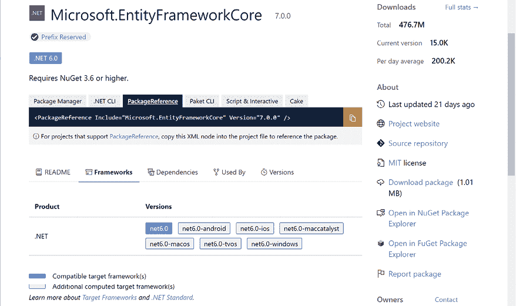
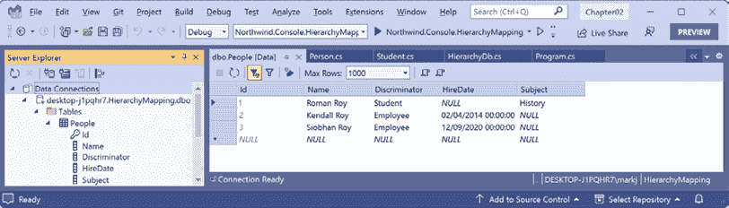
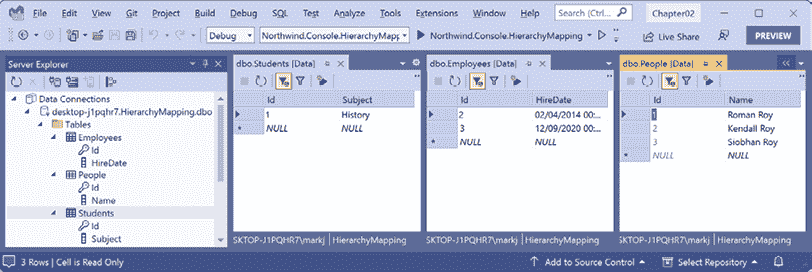
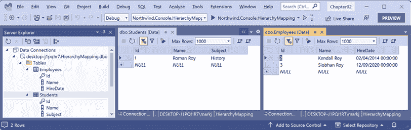
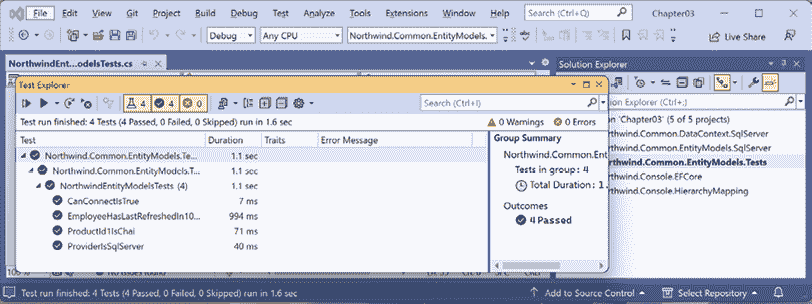

# 3

# 使用 EF Core 为 SQL Server 构建实体模型

本章将介绍如何使用名为**Entity Framework Core**（**EF Core**）的高级对象到数据存储映射技术来管理存储在 SQL Server、Azure SQL Database 或 Azure SQL Edge 中的关系型数据。然后，你将学习如何使用三种不同的映射策略存储使用继承层次结构的实体模型。最后，你将构建用于本书其余部分代码示例的 SQL Server 数据库的类库。

本章将涵盖以下主题：

+   使用 EF Core 管理 SQL Server 数据

+   使用 EF Core 映射继承层次结构

+   构建可重用的实体数据模型

# 使用 EF Core 管理数据

EF Core 是一个**对象关系映射器**（**ORM**），当与 SQL Server 一起工作时，它使用 ADO.NET。因为它是一个高级技术，所以它不如直接使用 ADO.NET 效率高，但它可以使开发人员更容易工作，因为他们可以将数据视为对象而不是多个表中的行。这对于面向对象的开发者来说应该感觉更自然。

EF Core 8 仅针对 .NET 8。EF Core 7 针对的是 .NET 6，因此它可以与 .NET 6 的**长期支持**（**LTS**）版本和 .NET 7 的**标准支持**（**STS**）版本一起使用，如图 3.1 所示：



图 3.1：EF Core 7 针对.NET 6 或更高版本

当 EF Core 9 在 2024 年 11 月发布时，我们可以期待它将针对 .NET 8 或更高版本，因此你可以在仍然获得 .NET 8 平台长期支持的同时升级 EF Core。EF Core 团队负责确保你将能够在他们的包版本号中将 8 替换为 9，并且你的代码仍然可以工作。他们通常在这方面做得很好，并且会在 EF Core 9 的官方发布说明中记录任何必要的代码更改。

## 理解 Entity Framework Core

除了传统的 RDBMS，如 SQL Server 之外，EF Core 还支持现代基于云的、非关系型、无模式的数据库存储，如 Azure Cosmos DB 和 MongoDB，有时需要第三方提供程序。

与 EF Core 一起工作的有两种方法：

+   **数据库优先**：已存在数据库，因此你构建一个与其结构和功能相匹配的模型。

+   **代码优先**：不存在数据库，因此你构建一个模型，然后使用 EF Core 创建一个与其结构和功能相匹配的数据库。

我们将使用 EF Core 与现有数据库一起使用，因为这是最常见的场景。你将在本章后面看到代码优先的示例，该示例将在运行时创建其数据库。 

## 使用现有数据库生成模型框架

框架生成是通过使用工具创建代表现有数据库模型的类的过程，该过程使用逆向工程。一个好的框架生成工具允许你扩展自动生成的类，然后在不丢失扩展类的情况下重新生成这些类。

如果您知道您永远不会使用此工具重新生成类，那么您可以随意更改自动生成的类的代码。工具生成的代码只是最佳近似。

**良好实践**：如果您知道更好的方法，不要害怕推翻工具。例如，当使用 SQLite 为 Northwind 数据库时，日期/时间列映射到 `string` 属性，而 `money` 列映射到 `double` 属性。在 Northwind 数据库中，这些列最好分别映射到 `DateTime` 和 `decimal`，但在另一个数据库中，可能需要更多的灵活性。另一个例子是在 Northwind 数据库中，`CustomerId` 应始终是五个大写字母。工具无法自动推断这一点，因此您可以添加正则表达式来验证它。请记住，工具行为是 .NET 中更易变的部分之一，因此这些示例在您阅读此书时可能不再有效。

## 设置 dotnet-ef 工具

.NET 有一个名为 `dotnet` 的命令行工具。它可以扩展用于与 EF Core 一起使用的功能。它可以执行设计时任务，例如从旧模型创建并应用迁移到新模型，以及从现有数据库生成模型的代码。

`dotnet` `ef` 命令行工具不是自动安装的。您必须将此包安装为 **全局** 或 **本地** 工具。如果您已经安装了此工具的旧版本，那么您应该卸载任何现有版本。

让我们确保您已安装了工具的最新版本：

1.  在命令提示符或终端中，检查您是否已将 `dotnet-ef` 作为全局工具安装，如下所示：

    ```cs
    dotnet tool list --global 
    ```

1.  在列表中检查是否已安装工具的旧版本，如 .NET 7 的版本，如下所示：

    ```cs
    Package Id                            Version      Commands
    -----------------------------------------------------------------
    dotnet-ef                             7.0.0        dotnet-ef
    microsoft.web.librarymanager.cli      2.1.175      libman
    redth.net.maui.check                  0.5.6        maui-check 
    ```

1.  如果已经安装了旧版本，那么请按照以下命令卸载工具：

    ```cs
    dotnet tool uninstall --global dotnet-ef 
    ```

1.  按照以下命令安装最新版本：

    ```cs
    dotnet tool install --global dotnet-ef 
    ```

1.  如果需要，按照任何特定于操作系统的说明将 `dotnet tools` 目录添加到您的 `PATH` 环境变量中，如安装 `dotnet-ef` 工具的输出中所述。

    如果您想安装预览版本，您可以指定版本通配符，例如，对于 EF Core 9 预览版，如下所示：

    `dotnet tool install --global dotnet-ef --version 9-*`

1.  您可以使用以下命令进行更新，而不是卸载然后安装：

    ```cs
    dotnet tool update --global dotnet-ef 
    ```

## 定义 EF Core 模型

EF Core 使用 **约定**、**注解属性** 和 **Fluent API** 语句的组合在运行时构建 **实体模型**，以便对类执行的任何操作都可以稍后自动转换为对实际数据库执行的操作。**实体类**代表表的结构，类的实例代表该表中的一行。

首先，我们将回顾定义模型的三种方法，并附带代码示例，然后我们将创建一些实现这些技术的类。

## 使用 EF Core 约定来定义模型

我们将要编写的代码将使用以下约定：

+   假设表的名称与 `DbContext` 类中 `DbSet<T>` 属性的名称相匹配，例如 `Products`。

+   假设列的名称与实体模型类中的属性名称相匹配，例如 `ProductId`。

+   数据库中 `string` 类型被假定为 `nvarchar` 类型。

+   `.NET` 类型 `int` 被假定为数据库中的 `int` 类型。

+   假设主键是一个名为 `Id` 或 `ID` 的属性。或者，当实体模型类名为 `Product` 时，属性可以命名为 `ProductId` 或 `ProductID`。如果此属性是整数类型或 `Guid` 类型，则它也被假定为 `IDENTITY` 列（一种在插入时自动分配值的列类型）。

**良好实践**：还有许多其他约定你应该了解，你甚至可以定义自己的约定，但这超出了本书的范围。你可以在以下链接中了解它们：[`learn.microsoft.com/en-us/ef/core/modeling/`](https://learn.microsoft.com/en-us/ef/core/modeling/)。

## 使用 EF Core 注解属性来定义模型

约定通常不足以完全将类映射到数据库对象。例如，一些数据库如 SQLite 使用动态列类型，因此工具必须根据该列当前的数据值来猜测其列应映射到的属性类型。

要为您的模型添加更多智能的一种简单方法是通过应用注解属性，如下表 3.1 所示：

| **属性** | **描述** |
| --- | --- |
| `[Required]` | 确保值不为空。 |
| `[StringLength(50)]` | 确保值的长度不超过 50 个字符。 |
| `[RegularExpression(expression)]` | 确保值匹配指定的正则表达式。 |
| `[Column(TypeName = "money", Name = "UnitPrice")]` | 指定在表中使用的列类型和列名。 |

表 3.1：常见的 EF Core 注解属性

例如，在数据库中，产品名称的最大长度为 40，且值不能为空，如下面部分 DDL 代码所示，该代码定义了如何创建名为 `Products` 的表，其中高亮显示的部分如下：

```cs
CREATE TABLE Products (
    ProductId       INTEGER       PRIMARY KEY,
    **ProductName     NVARCHAR (****40****)** **NOT****NULL****,**
    SupplierId      "INT",
    ...
); 
```

在 `Product` 类中，我们可以应用属性来指定这一点，如下面的代码所示：

```cs
[Required] 
[StringLength(40)]
public string ProductName { get; set; } 
```

**良好实践**：如果您启用了可空性检查，那么您不需要像上面那样用 `[Required]` 属性装饰非可空引用类型。这是因为 C# 的可空性会传播到 EF Core 模型。一个 `string` 属性将是必需的；一个 `string?` 属性将是可选的，换句话说，是可空的。您可以在以下链接中了解更多信息：[`learn.microsoft.com/en-us/ef/core/modeling/entity-properties?tabs=data-annotations%2Cwith-nrt#required-and-optional-properties`](https://learn.microsoft.com/en-us/ef/core/modeling/entity-properties?tabs=data-annotations%2Cwith-nrt#required-and-optional-properties)。

当 .NET 类型与数据库类型之间没有明显的映射时，可以使用属性。

例如，在数据库中，`Products` 表的 `UnitPrice` 列的数据类型是 `money`。.NET 没有名为 `money` 的数据类型，因此应该使用 `decimal` 代替，如下面的代码所示：

```cs
[Column(TypeName = "money")]
public decimal? UnitPrice { get; set; } 
```

另一个例子是针对 `Categories` 表，如下面的 DDL 代码所示：

```cs
CREATE TABLE Categories (
    CategoryId   INTEGER       PRIMARY KEY,
    CategoryName NVARCHAR (15) NOT NULL,
    **Description  "NTEXT",**
    Picture      "IMAGE"
); 
```

`Description` 列的长度可以超过可以存储在 `nvarchar` 变量中的最大 8,000 个字符，因此它需要映射到 `ntext`，如下面的代码所示：

```cs
[Column(TypeName = "ntext")]
public string? Description { get; set; } 
```

## 使用 EF Core Fluent API 定义模型

模型定义的最后一種方式是使用 Fluent API。此 API 可以替代属性，也可以与它们一起使用。您可能需要这样做的一个原因是在 .NET Standard 2.0 类库中定义实体模型，以便它们可以在旧平台上使用。在这种情况下，类库不应包含对数据注释库的引用。另一个原因是，您的团队可能有政策将原始数据模型与验证规则分开。

例如，要定义 `ProductName` 属性，而不是用两个属性装饰该属性，可以在数据库上下文类的 `OnModelCreating` 方法中编写一个等效的 Fluent API 语句，如下面的代码所示：

```cs
modelBuilder.Entity<Product>()
  .Property(product => product.ProductName)
  .IsRequired() // only needed if you have disabled nullability checks
  .HasMaxLength(40); 
```

这使得实体模型类更加简单。您将在下面的编码任务中看到一个例子。

## 理解 Fluent API 的数据初始化

Fluent API 的另一个好处是提供初始数据以填充数据库。EF Core 会自动计算出需要执行哪些插入、更新或删除操作。

例如，如果我们想确保新数据库中至少有一行在 `Product` 表中，那么我们会调用 `HasData` 方法，如下面的代码所示：

```cs
modelBuilder.Entity<Product>()
  .HasData(new Product
  {
    ProductId = 1,
    ProductName = "Chai",
    UnitPrice = 8.99M
  }); 
```

对 `HasData` 的调用在执行 `dotnet ef database update` 命令的数据迁移期间生效，或者当您调用 `Database.EnsureCreated` 方法时。

我们的模型将映射到一个已经填充了数据的现有数据库，因此我们不需要在我们的代码中使用这种技术。

## 定义 Northwind 数据库模型

将使用 `Northwind` 类来表示数据库。为了使用 EF Core，该类必须从 `DbContext` 继承。这个类了解如何与数据库通信并动态生成 SQL 语句来查询和操作数据。

你的 `DbContext` 派生类应该有一个名为 `OnConfiguring` 的重写方法，它将设置数据库连接字符串。

在你的由 `DbContext` 派生的类中，你必须定义至少一个 `DbSet<T>` 类型的属性。这些属性代表表。为了告诉 EF Core 每个表有哪些列，`DbSet<T>` 属性使用泛型来指定一个代表表中行的类。这个实体模型类具有代表其列的属性。

`DbContext` 派生的类可以可选地有一个名为 `OnModelCreating` 的重写方法。这是你可以编写 Fluent API 语句的地方，作为用属性装饰你的实体类的替代方案。这可以增强模型配置的清晰性和可维护性，因为所有这些都可以在一个地方而不是散布在你的代码库中。你还可以混合使用这两种技术，但那样就会失去这个主要好处。

如果你没有创建 Northwind 数据库，或者如果你已经删除了它，那么你现在需要创建它。具体说明在 *第二章，使用 SQL Server 管理关系数据*。

让我们在控制台应用程序中为 Northwind 数据库构建模型：

1.  使用你喜欢的代码编辑器创建一个控制台应用程序项目，如下列定义：

    +   项目模板：**控制台应用程序** / `console`。

    +   解决方案文件和文件夹：`Chapter03`。

    +   项目文件和文件夹：`Northwind.Console.EFCore`。

    +   **不要使用顶级语句**：已清除。

    +   **启用原生 AOT 发布**：已清除。

1.  在 `Northwind.Console.EFCore` 项目中，添加对 SQL Server 的 EF Core 数据提供程序的包引用，并全局和静态导入 `System.Console` 类，如下所示的高亮标记：

    ```cs
    <ItemGroup>
      <PackageReference
        Include="Microsoft.EntityFrameworkCore.Design" 
        Version="8.0.0" />
      <PackageReference
        Include="Microsoft.EntityFrameworkCore.SqlServer" 
        Version="8.0.0" />
    </ItemGroup>
    <ItemGroup>
      <Using Include="System.Console" Static="true" />
    </ItemGroup> 
    ```

1.  构建项目以恢复包。

    下一步假设有一个用于本地 SQL Server 的数据库连接字符串，该 SQL Server 使用 Windows 集成安全性进行身份验证。如果需要，修改它以用于 Azure SQL 数据库或 Azure SQL Edge，并使用用户 ID 和密码。

1.  在 `Northwind.Console.EFCore` 文件夹中的命令提示符或终端，在名为 `Models` 的新文件夹中为所有表生成一个模型，如下所示命令：

    ```cs
    dotnet ef dbcontext scaffold "Data Source=.;Initial Catalog=Northwind;Integrated Security=true;TrustServerCertificate=true;" Microsoft.EntityFrameworkCore.SqlServer --output-dir Models --namespace Northwind.Models --data-annotations --context NorthwindDb 
    ```

    命令行工具需要将命令全部输入一行中。`dotnet-ef`工具经常需要输入较长的命令。我建议您从打印书籍中输入或从电子书复制并粘贴此类长命令到纯文本编辑器（如记事本）中。然后确保在复制并粘贴到命令行之前，整个命令格式正确，且间距正确。直接从电子书复制粘贴可能会包含换行符、缺失空格等问题，从而破坏命令。本书中必须输入的所有命令行都可以在以下链接处复制为单行：[`github.com/markjprice/apps-services-net8/blob/main/docs/command-lines.md`](https://github.com/markjprice/apps-services-net8/blob/main/docs/command-lines.md)。

    注意以下：

    +   命令操作：`dbcontext scaffold`。

    +   连接字符串：这取决于您是连接到本地 SQL Server（带或不带实例名称）还是 Azure SQL 数据库。

    +   数据库提供程序：`Microsoft.EntityFrameworkCore.SqlServer`。

    +   输出文件夹：`--output-dir Models`。

    +   命名空间：`--namespace Northwind.Models`。

    +   使用数据注解以及流畅式 API：`--data-annotations`。

    +   将上下文从 `[database_name]Context` 重命名：`--context NorthwindDb`。

1.  注意以下输出中的构建消息和警告：

    ```cs
    Build started…
    Build succeeded.
    To protect potentially sensitive information in your connection string, you should move it out of source code. You can avoid scaffolding the connection string by using the Name= syntax to read it from configuration - see https://go.microsoft.com/fwlink/?linkid=2131148\. For more guidance on storing connection strings, see http://go.microsoft.com/fwlink/?LinkId=723263. 
    ```

    **良好实践**：在修复此警告之前，不要将项目提交到 Git。如果您使用用户名和密码连接到 SQL Server 数据库，那么这些信息现在已包含在您的源代码中！我们将通过用动态生成的连接字符串替换固定的连接字符串，并从环境变量中读取敏感值来解决这个问题。

1.  打开 `Models` 文件夹，并注意自动生成的 28 个类文件。

1.  打开 `Category.cs` 并注意它代表 `Categories` 表中的一行，如下面的代码所示：

    ```cs
    using System;
    using System.Collections.Generic;
    using System.ComponentModel.DataAnnotations;
    using System.ComponentModel.DataAnnotations.Schema;
    using Microsoft.EntityFrameworkCore;
    namespace Northwind.Models;
    [Index("CategoryName", Name = "CategoryName")]
    public partial class Category
    {
      [Key]
      public int CategoryId { get; set; }
      [StringLength(15)]
      public string CategoryName { get; set; } = null!;
      [Column(TypeName = "ntext")]
      public string? Description { get; set; }
      [Column(TypeName = "image")]
      public byte[]? Picture { get; set; }
      [InverseProperty("Category")]
      public virtual ICollection<Product> Products { get; set; } 
        = new List<Product>();
    } 
    ```

    注意以下：

    +   它使用 EF Core 5 中引入的 `[Index]` 属性装饰实体类。这表示应在表中为该列创建索引的属性。在早期版本中，仅支持使用流畅式 API 定义索引。由于我们正在处理现有数据库，此属性不是必需的。但如果我们想从我们的代码中重新创建一个新的空 Northwind 数据库，那么这些信息将用于在 `Categories` 表中创建索引。

    +   数据库中的表名为 `Categories`，但 `dotnet-ef` 工具使用了 **Humanizer** 第三方库自动将类名单数化到 `Category`，这在创建单个实体时是一个更自然的名称。

    +   实体类使用 `partial` 关键字声明，这样您就可以创建一个匹配的 `partial` 类来添加额外的代码。这允许您重新运行工具并重新生成实体类，而不会丢失在您的 `partial` 类中编写的额外代码。

    +   `CategoryId` 属性被装饰了 `[Key]` 属性，以明确表示它是该实体的主键，尽管其名称也遵循主键约定。

    +   `Products` 属性使用 `[InverseProperty]` 属性来定义与 `Product` 实体类上的 `Category` 属性的外键关系。

1.  打开 `ProductsAboveAveragePrice.cs` 并注意它代表的是数据库视图返回的行，而不是表，因此它被装饰了 `[Keyless]` 属性。

1.  打开 `NorthwindDb.cs` 并查看该类，如下面的编辑过的代码所示：

    ```cs
    using System;
    using System.Collections.Generic;
    using Microsoft.EntityFrameworkCore;
    namespace Northwind.Models;
    public partial class NorthwindDb : DbContext
    {
      public NorthwindDb()
      {
      }
      public NorthwindDb(DbContextOptions<NorthwindDb> options)
        : base(options)
      {
      }
      public virtual DbSet<AlphabeticalListOfProduct> 
        AlphabeticalListOfProducts { get; set; }
      public virtual DbSet<Category> Categories { get; set; }
    ...
      public virtual DbSet<Territory> Territories { get; set; }
      protected override void OnConfiguring(
        DbContextOptionsBuilder optionsBuilder)
    #warning To protect potentially sensitive information in your connection string, you should move it out of source code. You can avoid scaffolding the connection string by using the Name= syntax to read it from configuration - see https://go.microsoft.com/fwlink/?linkid=2131148\. For more guidance on storing connection strings, see http://go.microsoft.com/fwlink/?LinkId=723263.
            => optionsBuilder.UseSqlServer("Data Source=.;Initial Catalog=Northwind;Integrated Security=true;TrustServerCertificate=true;");
      protected override void OnModelCreating(ModelBuilder modelBuilder)
      {
        modelBuilder.Entity<AlphabeticalListOfProduct>(entity =>
        {
          entity.ToView("Alphabetical list of products");
        });
    ...
        OnModelCreatingPartial(modelBuilder);
      }
      partial void OnModelCreatingPartial(ModelBuilder modelBuilder);
    } 
    ```

    注意以下内容：

    +   `NorthwindDb` 数据上下文类是 `partial` 的，以便您可以扩展它并在将来重新生成它。我们使用 `NorthwindDb` 这个名字是因为 `Northwind` 被用于一个命名空间。

    +   `NorthwindDb` 有两个构造函数：一个默认的无参数构造函数和一个允许传递选项的构造函数。这在需要运行时指定连接字符串的应用程序中很有用。

    +   代表如 `Categories` 这样的表的 `DbSet<T>` 属性。

    +   在 `OnConfiguring` 方法中，如果构造函数中没有指定选项，则默认使用在生成框架时使用的连接字符串。它有一个编译器警告来提醒您不要在这个连接字符串中硬编码安全信息。

    +   在 `OnModelCreating` 方法中，使用 Fluent API 来配置实体类，然后调用一个名为 `OnModelCreatingPartial` 的部分方法。这允许您在自己的部分 `Northwind` 类中实现该部分方法，添加您自己的 Fluent API 配置，这样在重新生成模型类时也不会丢失。

1.  在 `NorthwindDb.cs` 文件顶部，导入用于处理 ADO.NET 类型的命名空间，如下面的代码所示：

    ```cs
    using Microsoft.Data.SqlClient; // To use SqlConnectionStringBuilder. 
    ```

1.  修改 `OnConfiguring` 方法以动态设置连接字符串，并使用环境变量设置任何敏感参数，如下面的代码所示：

    ```cs
    protected override void OnConfiguring(
      DbContextOptionsBuilder optionsBuilder)
    {
      if (!optionsBuilder.IsConfigured)
      {
        SqlConnectionStringBuilder builder = new();
        builder.DataSource = "."; // "ServerName\InstanceName" e.g. @".\sqlexpress"
        builder.InitialCatalog = "Northwind";
        builder.TrustServerCertificate = true;
        builder.MultipleActiveResultSets = true;
        // Because we want to fail faster. Default is 15 seconds.
        builder.ConnectTimeout = 3;
        // If using Windows Integrated authentication.
        builder.IntegratedSecurity = true;
        // If using SQL Server authentication.
        // builder.UserID = Environment.GetEnvironmentVariable("MY_SQL_USR");
        // builder.Password = Environment.GetEnvironmentVariable("MY_SQL_PWD");
        optionsBuilder.UseSqlServer(builder.ConnectionString);
      }
    } 
    ```

1.  关闭自动生成的类文件。

**更多信息**：如果您之前没有使用过环境变量，那么您可以从以下链接提供的在线部分了解它们：[`github.com/markjprice/cs12dotnet8/blob/main/docs/ch09-environment-variables.md`](https://github.com/markjprice/cs12dotnet8/blob/main/docs/ch09-environment-variables.md)。

## 查询 Northwind 模型

现在我们可以查询模型：

1.  在 `Program.cs` 中，删除现有的语句。添加语句以创建 `NorthwindDb` 数据上下文类的实例，并使用它来查询产品表，以获取那些价格高于给定价格的产品，如下面的代码所示：

    ```cs
    using Microsoft.Data.SqlClient; // To use SqlConnectionStringBuilder.
    using Microsoft.EntityFrameworkCore; // ToQueryString, GetConnectionString
    using Northwind.Models; // To use NorthwindDb.
    SqlConnectionStringBuilder builder = new();
    builder.InitialCatalog = "Northwind";
    builder.MultipleActiveResultSets = true;
    builder.Encrypt = true;
    builder.TrustServerCertificate = true;
    builder.ConnectTimeout = 10;
    WriteLine("Connect to:");
    WriteLine("  1 - SQL Server on local machine");
    WriteLine("  2 - Azure SQL Database");
    WriteLine("  3 - Azure SQL Edge");
    WriteLine();
    Write("Press a key: ");
    ConsoleKey key = ReadKey().Key;
    WriteLine(); WriteLine();
    if (key is ConsoleKey.D1 or ConsoleKey.NumPad1)
    {
      builder.DataSource = "."; // Local SQL Server
      // @".\apps-services-book"; // Local SQL Server with an instance name
    }
    else if (key is ConsoleKey.D2 or ConsoleKey.NumPad2)
    {
      builder.DataSource = // Azure SQL Database
        "tcp:apps-services-book.database.windows.net,1433";
    }
    else if (key is ConsoleKey.D3 or ConsoleKey.NumPad3)
    {
      builder.DataSource = "tcp:127.0.0.1,1433"; // Azure SQL Edge
    }
    else
    {
      WriteLine("No data source selected.");
      return;
    }
    WriteLine("Authenticate using:");
    WriteLine("  1 - Windows Integrated Security");
    WriteLine("  2 - SQL Login, for example, sa");
    WriteLine();
    Write("Press a key: ");
    key = ReadKey().Key;
    WriteLine(); WriteLine();
    if (key is ConsoleKey.D1 or ConsoleKey.NumPad1)
    {
      builder.IntegratedSecurity = true;
    }
    else if (key is ConsoleKey.D2 or ConsoleKey.NumPad2)
    {
      Write("Enter your SQL Server user ID: ");
      string? userId = ReadLine();
      if (string.IsNullOrWhiteSpace(userId))
      {
        WriteLine("User ID cannot be empty or null.");
        return;
      }
      builder.UserID = userId;
      Write("Enter your SQL Server password: ");
      string? password = ReadLine();
      if (string.IsNullOrWhiteSpace(password))
      {
        WriteLine("Password cannot be empty or null.");
        return;
      }
      builder.Password = password;
      builder.PersistSecurityInfo = false;
    }
    else
    {
      WriteLine("No authentication selected.");
      return;
    }
    DbContextOptionsBuilder<NorthwindDb> options = new();
    options.UseSqlServer(builder.ConnectionString);
    using (NorthwindDb db = new(options.Options))
    {
      Write("Enter a unit price: ");
      string? priceText = ReadLine();
      if (!decimal.TryParse(priceText, out decimal price))
      {
        WriteLine("You must enter a valid unit price.");
        return;
      }
      // We have to use var because we are projecting into an anonymous type.
      var products = db.Products
        .Where(p => p.UnitPrice > price)
        .Select(p => new { p.ProductId, p.ProductName, p.UnitPrice });
      WriteLine("----------------------------------------------------------");
      WriteLine("| {0,5} | {1,-35} | {2,8} |", "Id", "Name", "Price");
      WriteLine("----------------------------------------------------------");
      foreach (var p in products)
      {
        WriteLine("| {0,5} | {1,-35} | {2,8:C} |",
          p.ProductId, p.ProductName, p.UnitPrice);
      }
      WriteLine("----------------------------------------------------------");
      WriteLine(products.ToQueryString());
      WriteLine();
      WriteLine($"Provider:   {db.Database.ProviderName}");
      WriteLine($"Connection: {db.Database.GetConnectionString()}");
    } 
    ```

1.  运行控制台应用程序并注意结果，如下面的部分输出所示：

    ```cs
    Enter a unit price: --
    |    Id | Name                                |    Price--
    |     9 | Mishi Kobe Niku                     |   £97.00 |
    |    18 | Carnarvon Tigers                    |   £62.50 |
    |    20 | Sir Rodney's Marmalade              |   £81.00 |
    |    29 | Thüringer Rostbratwurst             |  £123.79 |
    |    38 | Côte de Blaye                       |  £263.50--
    DECLARE @__price_0 decimal(2) = 60.0;
    SELECT [p].[ProductId], [p].[ProductName], [p].[UnitPrice]
    FROM [Products] AS [p]
    WHERE [p].[UnitPrice] > @__price_0
    Provider:   Microsoft.EntityFrameworkCore.SqlServer
    Connection: Data Source=tcp:apps-services-book.database.windows.net,1433;Initial Catalog=Northwind;Persist Security Info=False;User ID=<censored>;Password=<censored>;Multiple Active Result Sets=False;Encrypt=True;Trust Server Certificate=False;Connection Timeout=10; 
    ```

你的连接字符串的输出将不同。

## 控制实体的跟踪

我们需要从实体**身份解析**的定义开始。EF Core 通过读取其唯一的键值来解析每个实体实例。这确保了关于实体身份或它们之间关系的任何歧义都不会存在。

EF Core 只能跟踪具有键的实体，因为它使用键在数据库中唯一标识实体。无键实体，如视图返回的实体，永远不会被跟踪。

默认情况下，EF Core 假设你想要在本地内存中跟踪实体，以便如果你进行更改，例如添加新实体、修改现有实体或删除现有实体，那么你可以调用`SaveChanges`，所有这些更改都将应用于底层数据存储。

如果你在一个数据上下文中执行查询，比如获取德国的所有客户，然后在该数据上下文中执行另一个查询，比如获取所有名字以 A 开头的客户，如果其中一个客户实体已经存在于上下文中，它将被识别而不会被替换或加载两次。然而，如果在两次查询执行之间该客户的电话号码在数据库中被更新，那么在数据上下文中被跟踪的实体不会用新的电话号码刷新。

如果你不需要跟踪这些更改，或者你希望在每次查询执行时加载实体的最新数据值的新实例，即使实体已经加载，那么你可以禁用跟踪。

要禁用单个查询的跟踪，在查询中调用`AsNoTracking`方法，如下面的代码所示：

```cs
var products = db.Products
  .AsNoTracking()
  .Where(p => p.UnitPrice > price)
  .Select(p => new { p.ProductId, p.ProductName, p.UnitPrice }); 
```

要默认禁用数据上下文的跟踪，将更改跟踪器的查询跟踪行为设置为`NoTracking`，如下面的代码所示：

```cs
db.ChangeTracker.QueryTrackingBehavior = QueryTrackingBehavior.NoTracking; 
```

要禁用单个查询的跟踪但保留身份解析，在查询中调用`AsNoTrackingWithIdentityResolution`方法，如下面的代码所示：

```cs
var products = db.Products
  .AsNoTrackingWithIdentityResolution()
  .Where(p => p.UnitPrice > price)
  .Select(p => new { p.ProductId, p.ProductName, p.UnitPrice }); 
```

要禁用跟踪但默认执行身份解析的数据上下文，将更改跟踪器的查询跟踪行为设置为`NoTrackingWithIdentityResolution`，如下面的代码所示：

```cs
db.ChangeTracker.QueryTrackingBehavior = 
  QueryTrackingBehavior.NoTrackingWithIdentityResolution; 
```

要为数据上下文的所有新实例设置默认值，在`OnConfiguring`方法中调用`UseQueryTrackingBehavior`方法，如下面的代码所示：

```cs
protected override void OnConfiguring(DbContextOptionsBuilder optionsBuilder)
{
  optionsBuilder.UseSqlServer(connectionString)
    .UseQueryTrackingBehavior(QueryTrackingBehavior.NoTracking);
} 
```

### 使用默认跟踪的场景

默认是**更改跟踪**与身份解析。一旦实体被加载到数据上下文中，底层更改不会反映出来，并且只有一个副本存在。实体具有本地更改跟踪，并且调用`SaveChanges`会更新数据库，如*表 3.2*所示：

| **操作** | **数据上下文中的实体** | **数据库中的行** |
| --- | --- | --- |
| 德国客户的查询 | Alfred’s Futterkiste, 123-4567 | Alfred’s Futterkiste, 123-4567 |
| 更改数据库中的电话 | Alfred’s Futterkiste, 123-4567 | Alfred’s Futterkiste, 123-9876 |
| 查询以 A 开头的客户 | Alfred’s Futterkiste, 123-4567 | Alfred’s Futterkiste, 123-9876 |
| 查询德国的客户 | Alfred’s Futterkiste, 123-4567 | Alfred’s Futterkiste, 123-9876 |
| 更改实体中的电话 | Alfred’s Futterkiste, 123-1928 | Alfred’s Futterkiste, 123-9876 |
| 保存更改 | Alfred’s Futterkiste, 123-1928 | Alfred’s Futterkiste, 123-1928 |

表 3.2：默认跟踪场景

### 使用无跟踪的相同场景

**无跟踪**和**无身份解析**。每个查询都会将数据库行的一个新实例加载到数据上下文中，包括底层更改，允许重复和混合过时和更新的数据。没有跟踪本地实体更改，因此`SaveChanges`不起作用，如*表 3.3*所示：

| **操作** | **数据上下文中的实体** | **数据库中的行** |
| --- | --- | --- |
| 查询德国的客户 | Alfred’s Futterkiste, 123-4567 | Alfred’s Futterkiste, 123-4567 |
| 更改数据库中的电话 | Alfred’s Futterkiste, 123-4567 | Alfred’s Futterkiste, 123-9876 |
| 查询以 A 开头的客户 | Alfred’s Futterkiste, 123-4567Alfred’s Futterkiste, 123-9876 | Alfred’s Futterkiste, 123-9876 |
| 查询德国的客户 | Alfred’s Futterkiste, 123-4567Alfred’s Futterkiste, 123-9876Alfred’s Futterkiste, 123-9876 | Alfred’s Futterkiste, 123-9876 |
| 更改实体中的电话 | Alfred’s Futterkiste, 123-4567Alfred’s Futterkiste, 123-9876Alfred’s Futterkiste, 123-1928 | Alfred’s Futterkiste, 123-9876 |
| 保存更改 | Alfred’s Futterkiste, 123-4567Alfred’s Futterkiste, 123-9876Alfred’s Futterkiste, 123-1928 | Alfred’s Futterkiste, 123-9876 |

表 3.3：无跟踪场景

### 使用无跟踪和身份解析的相同场景

无跟踪且具有身份解析。一旦实体被加载到数据上下文中，底层更改不会反映出来，并且只有一个副本存在。没有跟踪本地实体更改，因此`SaveChanges`不起作用，如*表 3.4*所示：

| **操作** | **数据上下文中的实体** | **数据库中的行** |
| --- | --- | --- |
| 查询德国的客户 | Alfred’s Futterkiste, 123-4567 | Alfred’s Futterkiste, 123-4567 |
| 更改数据库中的电话 | Alfred’s Futterkiste, 123-4567 | Alfred’s Futterkiste, 123-9876 |
| 查询以 A 开头的客户 | Alfred’s Futterkiste, 123-4567 | Alfred’s Futterkiste, 123-9876 |
| 查询德国的客户 | Alfred’s Futterkiste, 123-4567 | Alfred’s Futterkiste, 123-9876 |
| 更改实体中的电话 | Alfred’s Futterkiste, 123-1928 | Alfred’s Futterkiste, 123-9876 |
| 保存更改 | Alfred’s Futterkiste, 123-1928 | Alfred’s Futterkiste, 123-9876 |

表 3.4：身份解析场景

### 跟踪总结

应该选择哪一个？当然，这取决于您的具体场景。

你有时会读到一些博客，兴奋地告诉你，通过调用`AsNoTracking`可以显著提高你的 EF Core 查询。但如果运行一个返回数千个实体的查询，然后在同一数据上下文中再次运行相同的查询，你现在就有数千个重复项！这浪费了内存并影响了性能。

理解三种跟踪选择的工作方式，并选择最适合你的数据上下文或单个查询的最佳选择。在下一个主题中，你将学习如何映射继承层次结构。

# 使用 EF Core 映射继承层次结构

假设你有一些 C#类，用于存储有关学生和员工的信息，这些类都是人的类型。所有的人都有一个名字和一个 ID 来唯一标识他们，学生有一个他们正在学习的科目，员工有一个雇佣日期，如下面的代码所示：

```cs
public abstract class Person
{
  public int Id { get; set; }
  public string? Name { get; set; }
}
public class Student : Person
{
  public string? Subject { get; set; }
}
public class Employee : Person
{
  public DateTime HireDate { get; set; }
} 
```

默认情况下，EF Core 将使用**表-每层次结构**（**TPH**）映射策略将这些映射到单个表中。EF Core 5 引入了对**表-每类型**（**TPT**）映射策略的支持。EF Core 7 引入了对**表-每具体类型**（**TPC**）映射策略的支持。让我们来探讨这些映射策略之间的区别。

## 表-每层次结构（TPH）映射策略

对于`Person`-`Student`-`Employee`层次结构，TPH 将使用一个带有区分列的单表结构，该列用于指示行是哪种类型的人，学生还是员工，以及一些可空列用于存储仅适用于某些类型的额外值，如下面的代码所示，高亮显示的部分：

```cs
CREATE TABLE [People] (
  [Id] int NOT NULL IDENTITY,
  [Name] nvarchar(max) NOT NULL,
 **[Discriminator] nvarchar(max)** **NOT****NULL****,**
 **[Subject] nvarchar(max)** **NULL****,**
 **[HireDate] nvarchar(max)** **NULL****,**
  CONSTRAINT [PK_People] PRIMARY KEY ([Id])
); 
```

表中的某些数据可能看起来如下所示：

| **Id** | **Name** | **Discriminator** | **Subject** | **HireDate** |
| --- | --- | --- | --- | --- |
| 1 | Roman Roy | Student | History | NULL |
| 2 | Kendall Roy | Employee | NULL | 02/04/2014 |
| 3 | Siobhan Roy | Employee | NULL | 12/09/2020 |

表 3.5：People 表中的示例数据

TPH 需要`Discriminator`列存储每行的类型类名。TPH 需要派生类型属性的列是可空的，如`Subject`和`HireDate`。如果这些属性在类级别上是必需的（非空），这将导致问题。EF Core 默认不处理这种情况。

TPH 映射策略的主要优点是简单性和性能，这就是为什么它被默认使用的原因。

**良好实践**：如果区分列有许多不同的值，那么通过在区分列上定义索引，你可以进一步提高性能。但如果只有少数不同的值，索引可能会使整体性能更差，因为它会影响更新时间。在这种情况下，只有两个潜在值，`Student`和`Employee`，所以在有 100,000 行记录的表中，索引几乎不会产生影响。

## 表-每类型（TPT）映射策略

对于`Person`-`Student`-`Employee`层次结构，TPT 将为每种类型使用一个表，如下面的代码所示：

```cs
CREATE TABLE [People] (
  [Id] int NOT NULL IDENTITY,
  [Name] nvarchar(max) NOT NULL,
  CONSTRAINT [PK_People] PRIMARY KEY ([Id])
);
CREATE TABLE [Students] (
  [Id] int NOT NULL,
  [Subject] nvarchar(max) NULL,
  CONSTRAINT [PK_Students] PRIMARY KEY ([Id])
  CONSTRAINT [FK_Students_People] FOREIGN KEY ([Id]) REFERENCES [People] ([Id])
);
CREATE TABLE [Employees] (
  [Id] int NOT NULL,
  [HireDate] nvarchar(max) NULL,
  CONSTRAINT [PK_Employees] PRIMARY KEY ([Id])
  CONSTRAINT [FK_Employees_People] FOREIGN KEY ([Id]) REFERENCES [People] ([Id])
); 
```

表中的某些数据可能看起来如下所示：

| **Id** | **Name** |
| --- | --- |
| 1 | Roman Roy |
| 2 | Kendall Roy |
| 3 | Siobhan Roy |

表 3.6：人员表

| **Id** | **Subject** |
| --- | --- |
| 1 | 历史 |

表 3.7：学生表

| **Id** | **HireDate** |
| --- | --- |
| 2 | 02/04/2014 |
| 3 | 12/09/2020 |

表 3.8：员工表

TPT 映射策略的主要优点是由于数据的完全规范化而减少的存储空间。主要缺点是单个实体分散在多个表中，重建它需要更多的努力，因此降低了整体性能。TPT 通常不是一个好的选择，所以只有在表结构已经规范化且无法重新结构化时才使用它。

## 表按具体类型映射（TPC）策略

对于 `Person`-`Student`-`Employee` 层次，TPC 将为每个非抽象类型使用一个表，如下面的代码所示：

```cs
CREATE TABLE [Students] (
  [Id] int NOT NULL DEFAULT (NEXT VALUE FOR [PersonIds]),
  [Name] nvarchar(max) NOT NULL,
  [Subject] nvarchar(max) NULL,
  CONSTRAINT [PK_Students] PRIMARY KEY ([Id])
  CONSTRAINT [FK_Students_People] FOREIGN KEY ([Id]) REFERENCES [People] ([Id])
);
CREATE TABLE [Employees] (
  [Id] int NOT NULL DEFAULT (NEXT VALUE FOR [PersonIds]),
  [Name] nvarchar(max) NOT NULL,
  [HireDate] nvarchar(max) NULL,
  CONSTRAINT [PK_Employees] PRIMARY KEY ([Id])
  CONSTRAINT [FK_Employees_People] FOREIGN KEY ([Id]) REFERENCES [People] ([Id])
); 
```

由于没有单个带有 `IDENTITY` 列的表来分配 `Id` 值，我们可以使用 `(NEXT VALUE FOR [PersonIds])` 命令定义两个表之间共享的序列，这样它们就不会分配相同的 `Id` 值。

表格中的某些数据可能如下所示：

| **Id** | **Name** | **Subject** |
| --- | --- | --- |
| 1 | Roman Roy | 历史 |

表 3.9：学生表

| **Id** | **Name** | **HireDate** |
| --- | --- | --- |
| 2 | Kendall Roy | 02/04/2014 |
| 3 | Siobhan Roy | 12/09/2020 |

表 3.10：员工表

TPC 映射策略的主要优点是性能，因为当查询单个具体类型时，只需要一个表，因此我们避免了昂贵的连接。它最适合具有许多具体类型的大继承层次结构，每个类型都有许多特定类型的属性。

## 配置继承层次映射策略

首先，所有类型都必须包含在模型中，如下面的代码所示：

```cs
public DbSet<Person> People { get; set; }
public DbSet<Student> Students { get; set; }
public DbSet<Employee> Employees { get; set; } 
```

对于 TPH，你现在已经完成了，因为它是默认的！如果您想使其明确，那么在数据上下文类的 `OnModelCreating` 方法中，在层次结构的基类上调用适当的“使用映射策略”方法。`Person` 是基类，所以您会在该实体类型上调用 `UseTphMappingStrategy`，如下面的代码所示：

```cs
modelBuilder.Entity<Person>().UseTphMappingStrategy(); 
```

要使用其他两种映射策略之一，请调用适当的方法，如下面的代码所示：

```cs
modelBuilder.Entity<Person>().UseTptMappingStrategy();
modelBuilder.Entity<Person>().UseTpcMappingStrategy(); 
```

接下来，你可以选择性地指定每个实体类要使用的表名，如下面的代码所示：

```cs
modelBuilder.Entity<Student>().ToTable("Students");
modelBuilder.Entity<Employee>().ToTable("Employees"); 
```

TPC 策略应该有一个共享的序列，因此我们也应该配置它，如下面的代码所示：

```cs
modelBuilder.HasSequence<int>("PersonIds");
modelBuilder.Entity<Person>().UseTpcMappingStrategy()
  .Property(e => e.Id).HasDefaultValueSql("NEXT VALUE FOR [PersonIds]"); 
```

## 示例：层次映射策略

现在，让我们使用一个名为 `HierarchyMapping` 的新数据库和项目来实际看看这个操作：

1.  使用您首选的代码编辑器添加一个控制台应用程序项目，如下面的列表所示：

    +   项目模板：**控制台应用程序** / `console`。

    +   解决方案文件和文件夹：`Chapter03`。

    +   项目文件和文件夹：`Northwind.Console.HierarchyMapping`。

    +   **不要使用顶级语句**：已清除。

    +   **启用原生 AOT 发布**：已清除。

1.  配置启动项目以运行 `Northwind.Console.HierarchyMapping`。

1.  在 `Northwind.Console.HierarchyMapping` 项目中，添加对 SQL Server EF Core 数据提供程序的包引用，并全局和静态导入 `System.Console` 类，如下所示：

    ```cs
    <ItemGroup>
      <PackageReference
        Include="Microsoft.EntityFrameworkCore.Design" 
        Version="8.0.0" />
      <PackageReference
        Include="Microsoft.EntityFrameworkCore.SqlServer" 
        Version="8.0.0" />
    </ItemGroup>
    <ItemGroup>
      <Using Include="System.Console" Static="true" />
    </ItemGroup> 
    ```

1.  构建项目以恢复包。

1.  在 `Northwind.Console.HierarchyMapping` 项目中，添加一个名为 `Models` 的新文件夹。

1.  在 `Models` 目录下，添加一个名为 `Person.cs` 的新类文件，并修改其内容，如下所示：

    ```cs
    using System.ComponentModel.DataAnnotations; // To use [Required].
    namespace Northwind.Models;
    public abstract class Person
    {
      public int Id { get; set; }
      [Required]
      [StringLength(40)]
      public string? Name { get; set; }
    } 
    ```

1.  在 `Models` 目录下，添加一个名为 `Student.cs` 的新类文件，并修改其内容，如下所示：

    ```cs
    namespace Northwind.Models;
    public class Student : Person
    {
      public string? Subject { get; set; }
    } 
    ```

1.  在 `Models` 目录下，添加一个名为 `Employee.cs` 的新类文件，并修改其内容，如下所示：

    ```cs
    namespace Northwind.Models;
    public class Employee : Person
    {
      public DateTime HireDate { get; set; }
    } 
    ```

1.  在 `Models` 目录下，添加一个名为 `HierarchyDb.cs` 的新类文件，并修改其内容，如下所示：

    ```cs
    using Microsoft.EntityFrameworkCore; // To use DbSet<T>.
    namespace Northwind.Models;
    public class HierarchyDb : DbContext
    {
      public DbSet<Person>? People { get; set; }
      public DbSet<Student>? Students { get; set; }
      public DbSet<Employee>? Employees { get; set; }
      public HierarchyDb(DbContextOptions<HierarchyDb> options)
          : base(options)
      {
      }
      protected override void OnModelCreating(ModelBuilder modelBuilder)
      {
        modelBuilder.Entity<Person>()
          .UseTphMappingStrategy();
        // Populate database with sample data.
        Student p1 = new() { Id = 1, Name = "Roman Roy", 
          Subject = "History" };
        Employee p2 = new() { Id = 2, Name = "Kendall Roy", 
          HireDate = new(year: 2014, month: 4, day: 2) };
        Employee p3 = new() { Id = 3, Name = "Siobhan Roy", 
          HireDate = new(year: 2020, month: 9, day: 12) };
        modelBuilder.Entity<Student>().HasData(p1);
        modelBuilder.Entity<Employee>().HasData(p2, p3);
      }
    } 
    ```

1.  在 `Program.cs` 中，删除现有的语句。添加语句以配置 `HierarchyDb` 数据上下文的连接字符串，然后使用它来删除并创建一个名为 `HierarchyMapping`（不是 `Northwind`！）的数据库，显示自动生成的 SQL 脚本，然后输出学生、员工和人员，如下所示：

    ```cs
    using Microsoft.Data.SqlClient; // To use SqlConnectionStringBuilder.
    using Microsoft.Extensions.Options;
    using Microsoft.EntityFrameworkCore; // GenerateCreateScript()
    using Northwind.Models; // HierarchyDb, Person, Student, Employee
    DbContextOptionsBuilder<HierarchyDb> options = new();
    SqlConnectionStringBuilder builder = new();
    builder.DataSource = "."; // "ServerName\InstanceName" e.g. @".\sqlexpress"
    builder.InitialCatalog = "HierarchyMapping";
    builder.TrustServerCertificate = true;
    builder.MultipleActiveResultSets = true;
    // Because we want to fail faster. Default is 15 seconds.
    builder.ConnectTimeout = 3;
    // If using Windows Integrated authentication.
    builder.IntegratedSecurity = true;
    // If using SQL Server authentication.
    // builder.UserID = Environment.GetEnvironmentVariable("MY_SQL_USR");
    // builder.Password = Environment.GetEnvironmentVariable("MY_SQL_PWD");
    options.UseSqlServer(builder.ConnectionString);
    using (HierarchyDb db = new(options.Options))
    {
      bool deleted = await db.Database.EnsureDeletedAsync();
      WriteLine($"Database deleted: {deleted}");

      bool created = await db.Database.EnsureCreatedAsync();
      WriteLine($"Database created: {created}");
      WriteLine("SQL script used to create the database:");
      WriteLine(db.Database.GenerateCreateScript());
      if (db.Students is null || !db.Students.Any())
      {
        WriteLine("There are no students.");
      }
      else
      {
        foreach (Student student in db.Students)
        {
          WriteLine("{0} studies {1}",
            student.Name, student.Subject);
        }
      }
      if (db.Employees is null || !db.Employees.Any())
      {
        WriteLine("There are no employees.");
      }
      else
      {
        foreach (Employee employee in db.Employees)
        {
          WriteLine("{0} was hired on {1}",
            employee.Name, employee.HireDate);
        }
      }
      if (db.People is null || !db.People.Any())
      {
        WriteLine("There are no people.");
      }
      else
      {
        foreach (Person person in db.People)
        {
          WriteLine("{0} has ID of {1}",
            person.Name, person.Id);
        }
      }
    } 
    ```

1.  启动控制台应用程序，并注意结果，包括创建的单个名为 `People` 的表，如下所示：

    ```cs
    Database deleted: False
    Database created: True
    SQL script used to create the database:
    CREATE TABLE [People] (
        [Id] int NOT NULL IDENTITY,
        [Name] nvarchar(40) NOT NULL,
        [Discriminator] nvarchar(8) NOT NULL,
        [HireDate] datetime2 NULL,
        [Subject] nvarchar(max) NULL,
        CONSTRAINT [PK_People] PRIMARY KEY ([Id])
    );
    GO
    IF EXISTS (SELECT * FROM [sys].[identity_columns] WHERE [name] IN (N'Id', N'Discriminator', N'Name', N'Subject') AND [object_id] = OBJECT_ID(N'[People]'))
        SET IDENTITY_INSERT [People] ON;
    INSERT INTO [People] ([Id], [Discriminator], [Name], [Subject])
    VALUES (1, N'Student', N'Roman Roy', N'History');
    IF EXISTS (SELECT * FROM [sys].[identity_columns] WHERE [name] IN (N'Id', N'Discriminator', N'Name', N'Subject') AND [object_id] = OBJECT_ID(N'[People]'))
        SET IDENTITY_INSERT [People] OFF;
    GO
    IF EXISTS (SELECT * FROM [sys].[identity_columns] WHERE [name] IN (N'Id', N'Discriminator', N'HireDate', N'Name') AND [object_id] = OBJECT_ID(N'[People]'))
        SET IDENTITY_INSERT [People] ON;
    INSERT INTO [People] ([Id], [Discriminator], [HireDate], [Name])
    VALUES (2, N'Employee', '2014-04-02T00:00:00.0000000', N'Kendall Roy'),
    (3, N'Employee', '2020-09-12T00:00:00.0000000', N'Siobhan Roy');
    IF EXISTS (SELECT * FROM [sys].[identity_columns] WHERE [name] IN (N'Id', N'Discriminator', N'HireDate', N'Name') AND [object_id] = OBJECT_ID(N'[People]'))
        SET IDENTITY_INSERT [People] OFF;
    GO
    Roman Roy studies History
    Kendall Roy was hired on 02/04/2014 00:00:00
    Siobhan Roy was hired on 12/09/2020 00:00:00
    Roman Roy has ID of 1
    Kendall Roy has ID of 2
    Siobhan Roy has ID of 3 
    ```

1.  在您首选的数据库工具中查看 `People` 表的内容，如图 3.2 所示：



图 3.2：使用 TPH 映射策略时的人员表

1.  关闭对 `HierarchyMapping` 数据库的连接。

1.  在 `HierarchyDb.cs` 中，注释掉配置 TPH 的方法调用，并添加一个调用配置 TPT 的方法的调用，如下所示的高亮代码：

    ```cs
    protected override void OnModelCreating(ModelBuilder modelBuilder)
    {
      modelBuilder.Entity<Person>()
    **// .UseTphMappingStrategy();**
     **.UseTptMappingStrategy();** 
    ```

1.  启动控制台应用程序，并注意结果，包括创建的三个名为 `People`、`Students` 和 `Employees` 的表，如下所示的部分输出：

    ```cs
    Database deleted: True
    Database created: True
    SQL script used to create the database:
    CREATE TABLE [People] (
        [Id] int NOT NULL IDENTITY,
        [Name] nvarchar(40) NOT NULL,
        CONSTRAINT [PK_People] PRIMARY KEY ([Id])
    );
    GO
    CREATE TABLE [Employees] (
        [Id] int NOT NULL,
        [HireDate] datetime2 NOT NULL,
        CONSTRAINT [PK_Employees] PRIMARY KEY ([Id]),
        CONSTRAINT [FK_Employees_People_Id] FOREIGN KEY ([Id]) REFERENCES [People] ([Id])
    );
    GO
    CREATE TABLE [Students] (
        [Id] int NOT NULL,
        [Subject] nvarchar(max) NULL,
        CONSTRAINT [PK_Students] PRIMARY KEY ([Id]),
        CONSTRAINT [FK_Students_People_Id] FOREIGN KEY ([Id]) REFERENCES [People] ([Id])
    );
    GO 
    ```

1.  在您首选的数据库工具中查看表的内容，如图 3.3 所示：



图 3.3：使用 TPT 映射策略时的表

1.  关闭对 `HierarchyMapping` 数据库的连接。

1.  在 `HierarchyDb.cs` 中，注释掉配置 TPT 的方法调用，并添加一个调用配置 TPC 的方法的调用，因为我们需要始终添加三个示例行，如下所示的高亮代码：

    ```cs
    protected override void OnModelCreating(ModelBuilder modelBuilder)
    {
      modelBuilder.Entity<Person>()
    **// .UseTphMappingStrategy();**
    **// .UseTptMappingStrategy();**
     **.UseTpcMappingStrategy()**
     **.Property(person => person.Id)**
     **.HasDefaultValueSql(****"****NEXT VALUE FOR [PersonIds]"****);**
     **modelBuilder.HasSequence<****int****>(****"PersonIds"****, builder =>**
     **{**
     **builder.StartsAt(****4****);**
     **});** 
    ```

1.  启动控制台应用程序，并注意结果，包括创建的两个名为 `Students` 和 `Employees` 的表以及从 4 开始的共享序列，如下所示的部分输出：

    ```cs
    CREATE SEQUENCE [PersonIds] AS int START WITH 4 INCREMENT BY 1 NO MINVALUE NO MAXVALUE NO CYCLE;
    GO
    CREATE TABLE [Employees] (
        [Id] int NOT NULL DEFAULT (NEXT VALUE FOR [PersonIds]),
        [Name] nvarchar(40) NOT NULL,
        [HireDate] datetime2 NOT NULL,
        CONSTRAINT [PK_Employees] PRIMARY KEY ([Id])
    );
    GO
    CREATE TABLE [Students] (
        [Id] int NOT NULL DEFAULT (NEXT VALUE FOR [PersonIds]),
        [Name] nvarchar(40) NOT NULL,
        [Subject] nvarchar(max) NULL,
        CONSTRAINT [PK_Students] PRIMARY KEY ([Id])
    );
    GO 
    ```

1.  在您首选的数据库工具中查看表的内容，如图 3.4 所示：



图 3.4：使用 TPC 映射策略时的表

1.  关闭对 `HierarchyMapping` 数据库的连接。

1.  在`Program.cs`中，在将`database create`脚本写入控制台后的语句之后，添加一些语句来使用当前数据库上下文添加两个新的人，如下所示的高亮代码：

    ```cs
    WriteLine(db.Database.GenerateCreateScript());
    **if** **((db.Employees** **is****not****null****) && (db.Students** **is****not****null****))**
    **{**
     **db.Students.Add(****new** **Student { Name =** **"Connor Roy"****,** 
     **Subject =** **"Politics"** **});**
     **db.Employees.Add(****new** **Employee { Name =** **"Kerry Castellabate"****,** 
     **HireDate = DateTime.UtcNow });**
    **int** **result = db.SaveChanges();**
     **WriteLine(****$"****{result}** **people added."****);**
    **}** 
    ```

1.  启动控制台应用程序，并注意结果，包括使用数据库上下文添加的两个新的人，其 ID 从 4 开始，如下面的部分输出所示：

    ```cs
    2 people added.
    Roman Roy studies History
    Connor Roy studies Politics
    Kendall Roy was hired on 02/04/2014 00:00:00
    Siobhan Roy was hired on 12/09/2020 00:00:00
    Kerry Castellabate was hired on 19/05/2023 10:13:53
    Kendall Roy has ID of 2
    Siobhan Roy has ID of 3
    Kerry Castellabate has ID of 4
    Roman Roy has ID of 1
    Connor Roy has ID of 5 
    ```

你现在已经看到了对象关系映射器如 EF Core 如何定义一个对象继承层次结构，并以三种不同的方式将其映射到基础数据库结构中的一个或多个相关表中。你还看到了 Code First 如何与这很好地工作，因为每次项目启动时都很容易删除和重新创建数据库。

# 构建可重用的实体数据模型

实际应用通常需要与关系型数据库或其他数据存储中的数据进行交互。在本章早期，我们定义了 EF Core 模型，这些模型在同一个控制台应用程序项目中使用。

现在，我们将为 Northwind 数据库定义一个实体数据模型，作为一对可重用的类库。这对中的一部分将定义实体，如`Product`和`Customer`。这对的另一部分将定义数据库中的表以及如何连接到数据库的默认配置，并使用 Fluent API 来配置模型的附加选项。这对类库将在后续章节中创建的许多应用程序和服务中使用。

**良好实践**：你应该为你的实体数据模型创建一个单独的类库项目。这允许后端 Web 服务器和前端桌面、移动和 Blazor 客户端之间更容易共享。

## 使用 SQL Server 创建实体模型类库

你现在将使用`dotnet-ef`工具创建实体模型：

1.  添加一个新项目，如下列所示：

    +   项目模板：**类库** / `classlib`。

    +   项目文件和文件夹：`Northwind.Common.EntityModels.SqlServer`。

    +   解决方案文件和文件夹：`Chapter03`。

1.  在`Northwind.Common.EntityModels.SqlServer`项目中，将警告视为错误，并为 SQL Server 数据库提供者和 EF Core 设计时支持添加包引用，如下所示的高亮标记：

    ```cs
    <Project Sdk="Microsoft.NET.Sdk">
      <PropertyGroup>
        <TargetFramework>net8.0</TargetFramework>
        <ImplicitUsings>enable</ImplicitUsings>
        <Nullable>enable</Nullable>
     **<TreatWarningsAsErrors>****true****</TreatWarningsAsErrors>**
      </PropertyGroup>
     **<ItemGroup>**
     **<PackageReference**
     **Include="Microsoft.EntityFrameworkCore.SqlServer" Version="****8.0.0****" />**
     **<PackageReference** 
     **Include="Microsoft.EntityFrameworkCore.Design" Version="****8.0.0****">**
     **<PrivateAssets>all</PrivateAssets>**
     **<IncludeAssets>runtime; build; native; contentfiles; analyzers; buildtransitive</IncludeAssets>**
     **</PackageReference>** 
     **</ItemGroup>**
    </Project> 
    ```

    **更多信息**：如果你不熟悉如何像`Microsoft.EntityFrameworkCore.Design`这样的包管理它们的资产，你可以在以下链接了解更多信息：[`learn.microsoft.com/en-us/nuget/consume-packages/package-references-in-project-files#controlling-dependency-assets`](https://learn.microsoft.com/en-us/nuget/consume-packages/package-references-in-project-files#controlling-dependency-assets)。

1.  删除`Class1.cs`文件。

1.  构建项目`Northwind.Common.EntityModels.SqlServer`。

1.  打开`Northwind.Common.EntityModels.SqlServer`文件夹的命令提示符或终端。

    下一个步骤假设有一个用于本地 SQL Server 的 Windows 集成安全认证的数据库连接字符串。如果需要，请将其修改为 Azure SQL 数据库或 Azure SQL Edge，使用用户 ID 和密码。

1.  在命令行中，为所有表生成实体类模型，如下面的命令所示：

    ```cs
    dotnet ef dbcontext scaffold "Data Source=.;Initial Catalog=Northwind;Integrated Security=true;TrustServerCertificate=True;" Microsoft.EntityFrameworkCore.SqlServer --namespace Northwind.EntityModels --data-annotations 
    ```

    注意以下内容：

    +   执行的命令：`dbcontext scaffold`。

    +   连接字符串：`"``Data Source=.;Initial Catalog=Northwind;Integrated Security=true;TrustServerCertificate=True;"`。

    +   数据库提供程序：`Microsoft.EntityFrameworkCore.SqlServer`。

    +   生成类的命名空间：`--namespace Northwind.EntityModels`。

    +   要使用数据注释以及 Fluent API：`--data-annotations`。

1.  注意，生成了 28 个类，从`AlphabeticalListOfProduct.cs`到`Territory.cs`。

1.  在`NorthwindContext.cs`中，删除包括警告和连接字符串的`OnConfiguring`方法。

1.  在`Customer.cs`中，`dotnet-ef`工具正确识别出`CustomerId`列是主键，并且其长度限制为最多五个字符，但我们还希望这些值始终为大写。因此，添加一个正则表达式来验证其主键值，只允许大写西文字符，如下面的代码所示（高亮显示）：

    ```cs
    [Key]
    [StringLength(5)]
    **[****RegularExpression(****"[A-Z]{5}"****)****]** 
    public string CustomerId { get; set; } = null!; 
    ```

## 使用 SQL Server 创建数据上下文类库

接下来，您将数据库表示的上下文模型移动到单独的类库中：

1.  添加一个新项目，如下面的列表所示：

    +   项目模板：**类库** / `classlib`。

    +   项目文件和文件夹：`Northwind.Common.DataContext.SqlServer`。

    +   解决方案文件和文件夹：`Chapter03`。

    +   在`DataContext`项目中，将`EntityModels`项目添加为项目引用，并将 EF Core 数据提供程序添加为 SQL Server 的包引用，如下面的标记所示：

    ```cs
    <ItemGroup>
      <PackageReference 
        Include="Microsoft.EntityFrameworkCore.SqlServer" Version="8.0.0" />
    </ItemGroup>
    <ItemGroup>
      <ProjectReference Include="..\Northwind.Common.EntityModels
    .SqlServer\Northwind.Common.EntityModels.SqlServer.csproj" />
    </ItemGroup> 
    ```

    **警告**！项目引用的路径在项目文件中不应有换行符。

1.  在`Northwind.Common.DataContext.SqlServer`项目中，删除`Class1.cs`文件。

1.  构建`Northwind.Common.DataContext.SqlServer`项目。

1.  将`NorthwindContext.cs`文件从`Northwind.Common.EntityModels.SqlServer`项目/文件夹移动到`Northwind.Common.DataContext.SqlServer`项目/文件夹。

1.  在`Northwind.Common.DataContext.SqlServer`项目中，添加一个名为`NorthwindContextExtensions.cs`的类，并修改其内容以定义一个扩展方法，该方法将 Northwind 数据库上下文添加到依赖服务集合中，如下面的代码所示：

    ```cs
    using Microsoft.Data.SqlClient; // SqlConnectionStringBuilder
    using Microsoft.EntityFrameworkCore; // UseSqlServer
    using Microsoft.Extensions.DependencyInjection; // IServiceCollection
    namespace Northwind.EntityModels;
    public static class NorthwindContextExtensions
    {
      /// <summary>
      /// Adds NorthwindContext to the specified IServiceCollection. Uses the SqlServer database provider.
      /// </summary>
      /// <param name="services">The service collection.</param>
      /// <param name="connectionString">Set to override the default.</param>
      /// <returns>An IServiceCollection that can be used to add more services.</returns>
      public static IServiceCollection AddNorthwindContext(
        this IServiceCollection services,
        string? connectionString = null)
      {
        if (connectionString == null)
        {
          SqlConnectionStringBuilder builder = new();
          builder.DataSource = ".";
          builder.InitialCatalog = "Northwind";
          builder.TrustServerCertificate = true;
          builder.MultipleActiveResultSets = true;
          // If using Azure SQL Edge.
          // builder.DataSource = "tcp:127.0.0.1,1433";
          // Because we want to fail fast. Default is 15 seconds.
          builder.ConnectTimeout = 3;
          // If using Windows Integrated authentication.
          builder.IntegratedSecurity = true;
          // If using SQL Server authentication.
          // builder.UserID = Environment.GetEnvironmentVariable("MY_SQL_USR");
          // builder.Password = Environment.GetEnvironmentVariable("MY_SQL_PWD");
          connectionString = builder.ConnectionString;
        }
        services.AddDbContext<NorthwindContext>(options =>
        {
          options.UseSqlServer(connectionString);
          // Log to console when executing EF Core commands.
          options.LogTo(Console.WriteLine,
            new[] { Microsoft.EntityFrameworkCore
              .Diagnostics.RelationalEventId.CommandExecuting });
        },
        // Register with a transient lifetime to avoid concurrency 
        // issues with Blazor Server projects.
        contextLifetime: ServiceLifetime.Transient, 
        optionsLifetime: ServiceLifetime.Transient);
        return services;
      }
    } 
    ```

1.  构建两个类库，并修复任何编译器错误。

**良好实践**：我们为`AddNorthwindContext`方法提供了一个可选参数，以便我们可以覆盖 SQL Server 数据库连接字符串。这将使我们更加灵活，例如，可以从配置文件中加载这些值。

## 实体创建时的计算属性

EF Core 7 添加了一个 `IMaterializationInterceptor` 接口，允许在创建实体之前和之后以及属性初始化时进行拦截。这对于计算值很有用。

例如，当服务或客户端应用程序请求向用户显示的实体时，它可能想要缓存一段时间内的实体副本。为此，它需要知道实体上次刷新的时间。如果在加载实体时自动生成并存储此信息，将非常有用。

要实现这个目标，我们必须完成四个步骤：

1.  首先，定义一个具有额外属性的接口。

1.  接下来，至少必须有一个实体模型类实现该接口。

1.  然后，定义一个实现拦截器接口的类，该接口有一个名为 `InitializedInstance` 的方法，它将在任何实体上执行，如果该实体实现了具有额外属性的定制接口，则将设置其值。

1.  最后，我们必须创建拦截器的实例并将其注册到数据上下文类中。

现在让我们为 Northwind `Employee` 实体实现这个功能：

1.  在 `Northwind.Common.EntityModels.SqlServer` 项目中，添加一个名为 `IHasLastRefreshed.cs` 的新文件，并修改其内容以定义接口，如下所示：

    ```cs
    namespace Northwind.EntityModels;
    public interface IHasLastRefreshed
    {
      DateTimeOffset LastRefreshed { get; set; }
    } 
    ```

1.  在 `Northwind.Common.EntityModels.SqlServer` 项目中，添加一个名为 `EmployeePartial.cs` 的新文件，并修改其内容以实现接口，如下所示（高亮部分）：

    ```cs
    using System.ComponentModel.DataAnnotations.Schema; // [NotMapped]
    namespace Northwind.EntityModels;
    public partial class Employee **:** **IHasLastRefreshed**
    {
     **[****NotMapped****]**
    **public** **DateTimeOffset LastRefreshed {** **get****;** **set****; }**
    } 
    ```

    **良好实践**：将此类扩展代码添加到单独的部分实体类文件中，这样您就可以稍后使用 `dotnet-ef` 工具重新生成 `Employee.cs` 文件，而不会覆盖您的附加代码。

1.  在 `Northwind.Common.DataContext.SqlServer` 项目中，添加一个名为 `SetLastRefreshedInterceptor.cs` 的新文件，并修改其内容以定义拦截器，如下所示：

    ```cs
    // IMaterializationInterceptor, MaterializationInterceptionData
    using Microsoft.EntityFrameworkCore.Diagnostics;
    namespace Northwind.EntityModels;
    public class SetLastRefreshedInterceptor : IMaterializationInterceptor
    {
      public object InitializedInstance(
        MaterializationInterceptionData materializationData,
        object entity)
      {
        if (entity is IHasLastRefreshed entityWithLastRefreshed)
        {
          entityWithLastRefreshed.LastRefreshed = DateTimeOffset.UtcNow;
        }
        return entity;
      }
    } 
    ```

1.  在 `Northwind.Common.DataContext.SqlServer` 项目中，在 `NorthwindContext.cs` 中删除现有的 `OnConfiguring` 方法。

1.  在 `Northwind.Common.DataContext.SqlServer` 项目中，添加一个名为 `NorthwindContextPartial.cs` 的新文件，然后在 `OnConfiguring` 方法中声明和注册拦截器，如下所示：

    ```cs
    using Microsoft.Data.SqlClient; // SqlConnectionStringBuilder
    using Microsoft.EntityFrameworkCore; // DbContext
    namespace Northwind.EntityModels;
    public partial class NorthwindContext : DbContext
    {
      private static readonly SetLastRefreshedInterceptor
        setLastRefreshedInterceptor = new();
      protected override void OnConfiguring(DbContextOptionsBuilder optionsBuilder)
      {
        if (!optionsBuilder.IsConfigured)
        {
          SqlConnectionStringBuilder builder = new();
          builder.DataSource = ".";
          builder.InitialCatalog = "Northwind";
          builder.TrustServerCertificate = true;
          builder.MultipleActiveResultSets = true;
          // Because we want to fail fast. Default is 15 seconds.
          builder.ConnectTimeout = 3;
          // If using Windows Integrated authentication.
          builder.IntegratedSecurity = true;
          // If using SQL Server authentication.
          // builder.UserID = Environment.GetEnvironmentVariable("MY_SQL_USR");
          // builder.Password = Environment.GetEnvironmentVariable("MY_SQL_PWD");
          optionsBuilder.UseSqlServer(builder.ConnectionString);
        }
        optionsBuilder.AddInterceptors(setLastRefreshedInterceptor);
      }
    } 
    ```

1.  保存更改。

## 创建测试项目以检查类库的集成

由于我们将在本章中不创建使用 EF Core 模型的客户端项目，因此我们应该创建一个测试项目以确保数据库上下文和实体模型正确集成：

1.  使用您首选的编码工具向 `Chapter03` 解决方案添加一个名为 `Northwind.Common.EntityModels.Tests` 的新 **xUnit 测试项目 [C#]** / `xunit` 项目。

1.  在 `Northwind.Common.EntityModels.Tests.csproj` 中，修改配置以将警告视为错误，并添加一个包含对 `Northwind.Common.DataContext.SqlServer` 项目的项目引用的项组，如下所示：

    ```cs
    <ItemGroup>
      <ProjectReference Include="..\Northwind.Common.DataContext
    .SqlServer\Northwind.Common.DataContext.SqlServer.csproj" />
    </ItemGroup> 
    ```

    **警告！** 在你的项目文件中，项目参考路径不应该包含换行符。

1.  构建并还原 `Northwind.Common.EntityModels.Tests` 项目的依赖项。

## 为实体模型编写单元测试

一个编写良好的单元测试将包含三个部分：

+   **安排**：这部分将声明和实例化输入和输出的变量。

+   **行动**：这部分将执行你正在测试的单元。在我们的例子中，这意味着调用我们想要测试的方法。

+   **断言**：这部分将对输出进行一个或多个断言。断言是一种信念，如果它不成立，则表明测试失败。例如，当添加 2 和 2 时，我们期望结果是 4。

现在，我们将为 `NorthwindContext` 和实体模型类编写一些单元测试：

1.  将文件 `UnitTest1.cs` 重命名为 `NorthwindEntityModelsTests.cs`，然后打开它。

1.  在 Visual Studio Code 中，将类重命名为 `NorthwindEntityModelsTests`。（当你重命名文件时，Visual Studio 会提示你重命名类。）

1.  修改 `NorthwindEntityModelsTests` 类以导入 `Northwind.EntityModels` 命名空间，并添加一些测试方法以确保上下文类可以连接，确保提供者是 SQL Server，并确保第一个产品命名为 `Chai`，如下代码所示：

    ```cs
    using Northwind.EntityModels;
    namespace Northwind.Common.EntityModels.Tests
    {
      public class NorthwindEntityModelsTests
      {
        [Fact]
        public void CanConnectIsTrue()
        {
          using (NorthwindContext db = new()) // arrange
          {
            bool canConnect = db.Database.CanConnect(); // act
            Assert.True(canConnect); // assert
          }
        }
        [Fact]
        public void ProviderIsSqlServer()
        {
          using (NorthwindContext db = new())
          {
            string? provider = db.Database.ProviderName;
            Assert.Equal("Microsoft.EntityFrameworkCore.SqlServer", provider);
          }
        }
        [Fact]
        public void ProductId1IsChai()
        {
          using (NorthwindContext db = new())
          {
            Product product1 = db.Products.Single(p => p.ProductId == 1);
            Assert.Equal("Chai", product1.ProductName);
          }
        }
        [Fact]
        public void EmployeeHasLastRefreshedIn10sWindow()
        {
          using (NorthwindContext db = new())
          {
            Employee employee1 = db.Employees.Single(p => p.EmployeeId == 1);
            DateTimeOffset now = DateTimeOffset.UtcNow;
            Assert.InRange(actual: employee1.LastRefreshed,
              low: now.Subtract(TimeSpan.FromSeconds(5)),
              high: now.AddSeconds(5));
          }
        }
      }
    } 
    ```

## 使用 Visual Studio 2022 运行单元测试

现在我们准备运行单元测试并查看结果：

1.  在 Visual Studio 2022 中，导航到 **测试** | **运行所有测试**。

1.  在 **测试资源管理器** 中，注意结果表明运行了四个测试，并且全部通过，如 *图 3.5* 所示：



图 3.5：所有单元测试通过

## 使用 Visual Studio Code 运行单元测试

现在我们准备运行单元测试并查看结果：

1.  在 Visual Studio Code 中，在 `Northwind.Common.EntityModels.Tests` 项目的 **终端** 窗口中运行测试，如下命令所示：

    ```cs
    dotnet test 
    ```

    如果你使用 **C# 开发工具包**，那么你也可以从 **主侧栏** 的 **测试** 部分构建测试项目并运行测试。

1.  在输出中，注意结果表明运行了四个测试，并且全部通过。

    作为一项可选任务，你能想到其他可以编写的测试来确保数据库上下文和实体模型是正确的吗？

# 练习和探索

通过回答一些问题、进行一些动手实践，以及通过深入研究本章主题来测试你的知识和理解。

## 练习 3.1 – 测试你的知识

回答以下问题：

1.  `dotnet-ef` 工具可以用作什么？

1.  用于表示表的属性的类型是什么，例如数据上下文的 `Products` 属性？

1.  用于表示一对一关系的属性的类型是什么，例如 `Category` 实体的 `Products` 属性？

1.  EF Core 的主键约定是什么？

1.  为什么你可能会选择 Fluent API 而不是属性注解？

1.  为什么你可能会在实体类型中实现 `IMaterializationInterceptor` 接口？

## 练习 3.2 – 练习将 ADO.NET 与 EF Core 进行基准测试

在 `Chapter03` 解决方案中，创建一个名为 `Ch03Ex02_ADONETvsEFCore` 的控制台应用程序，使用 Benchmark.NET 比较使用 ADO.NET (`SqlClient`) 和使用 EF Core 从 Northwind 数据库检索所有产品。

您可以通过阅读以下链接中的在线部分 *Benchmarking Performance and Testing* 来了解如何使用 Benchmark.NET：[`github.com/markjprice/apps-services-net8/blob/main/docs/ch01-benchmarking.md`](https://github.com/markjprice/apps-services-net8/blob/main/docs/ch01-benchmarking.md).

## 练习 3.3 – 审查性能选择

数据层可以对应用程序或服务的整体性能产生不成比例的影响。

文档：[`learn.microsoft.com/en-us/ef/core/performance/`](https://learn.microsoft.com/en-us/ef/core/performance/)

## 练习 3.4 – 探索主题

使用以下页面上的链接了解本章涵盖主题的更多详细信息：

[`github.com/markjprice/apps-services-net8/blob/main/docs/book-links.md#chapter-3---building-entity-models-for-sql-server-using-ef-core`](https://github.com/markjprice/apps-services-net8/blob/main/docs/book-links.md#chapter-3---building-entity-models-for-sql-server-using-ef-core)

# 摘要

在本章中，你学习了：

+   如何使用较慢但更面向对象的 EF Core 执行简单查询并处理结果。

+   如何配置和决定在类型层次结构中使用三种映射策略。

+   如何在实体创建时实现计算属性。

在下一章中，你将学习如何使用 Azure Cosmos DB 进行云原生数据存储。

# 在 Discord 上了解更多

要加入本书的 Discord 社区——在那里您可以分享反馈、向作者提问，并了解新版本——请扫描以下二维码：

[`packt.link/apps_and_services_dotnet8`](https://packt.link/apps_and_services_dotnet8)


