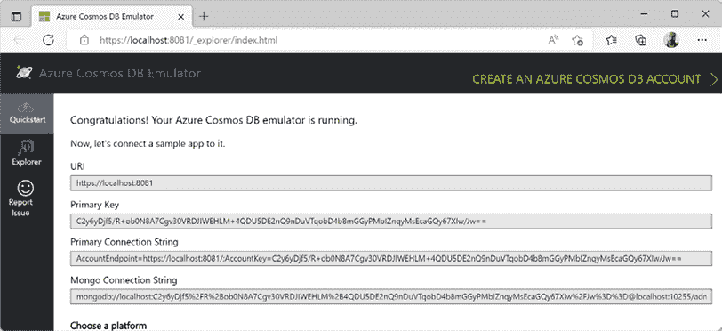
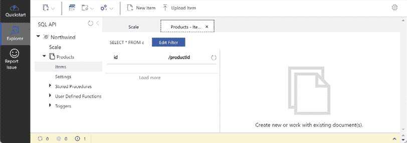
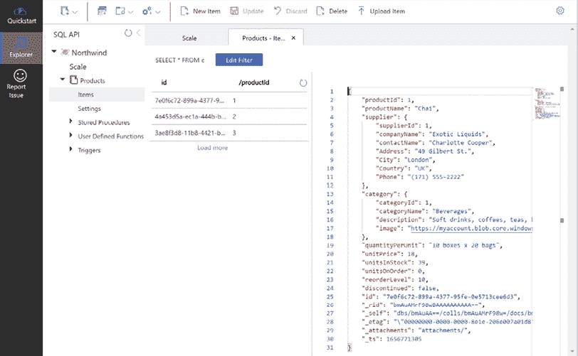
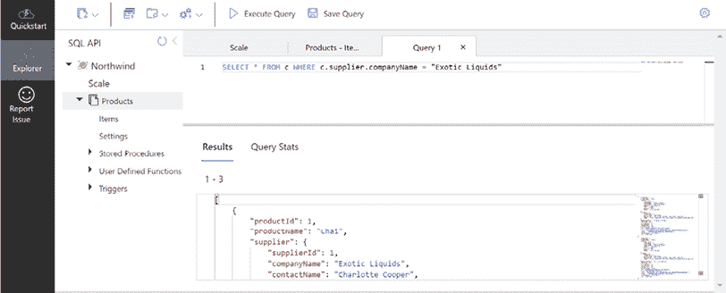
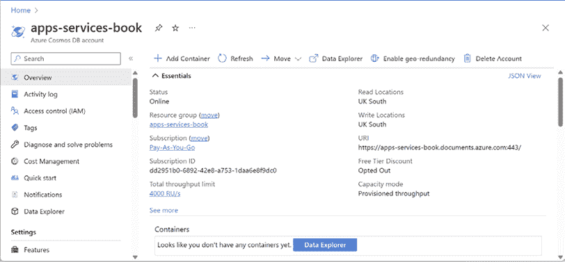
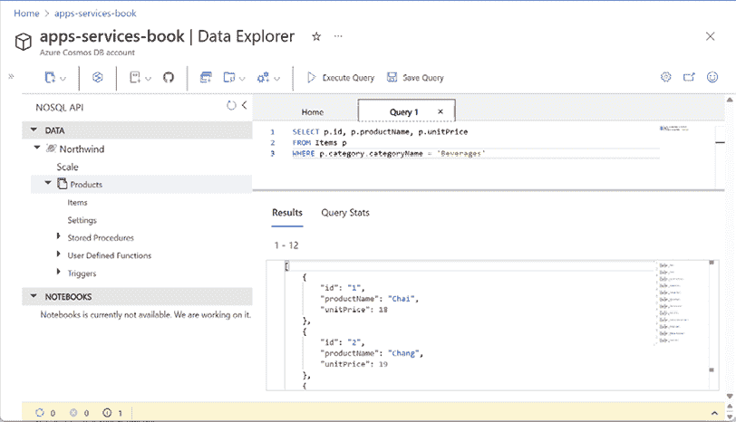
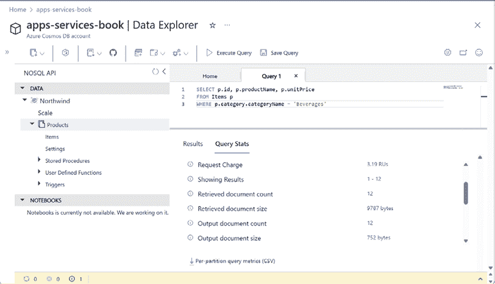

# 第四章：使用 Azure Cosmos DB 管理 NoSQL 数据

本章将介绍如何使用 Azure Cosmos DB 管理 NoSQL 数据。您将了解 Cosmos DB 的一些关键概念，如其 API、数据建模方式以及吞吐量配置，这些都会影响成本。您将使用本地模拟器和 Azure 云创建一些 Cosmos DB 资源。然后您将学习如何使用 Core（SQL）API 处理更传统的数据。

在一个可选的在线部分，您可以学习如何使用 Gremlin API 处理图数据。

本章将涵盖以下主题：

+   理解 NoSQL 数据库

+   创建 Cosmos DB 资源

+   使用 Core（SQL）API 操作数据

+   探索服务器端编程

+   清理 Azure 资源

# 理解 NoSQL 数据库

存储数据的两个最常见地方是在关系数据库管理系统（RDBMS）中，如 SQL Server、PostgreSQL、MySQL 和 SQLite，或者是在 NoSQL 数据库中，如 Azure Cosmos DB、Redis、MongoDB 和 Apache Cassandra。

关系数据库是在 20 世纪 70 年代发明的。它们使用**结构化查询语言**（SQL）进行查询。当时，数据存储成本很高，因此它们通过称为*规范化*的过程尽可能减少数据冗余。数据存储在具有行和列的表格结构中，一旦在生产中重构就变得复杂。它们可能难以扩展且成本高昂。

NoSQL 数据库不仅仅意味着“非 SQL”，它们也可以意味着“不仅 SQL”。它们是在 2000 年代发明的，在互联网和万维网变得流行并采纳了那个时代软件的许多学习成果之后。

它们被设计用于大规模可扩展性和高性能，通过提供最大灵活性和允许随时进行模式更改（因为它们不强制执行结构）来简化编程。

## Cosmos DB 及其 API

Azure Cosmos DB 是一个支持多个 API 的 NoSQL 数据存储。其原生 API 基于 SQL。它还支持 MongoDB、Cassandra 和 Gremlin 等替代 API。

Azure Cosmos DB 以**原子记录序列**（ARS）格式存储数据。您可以通过在创建数据库时选择的 API 与这些数据交互：

+   **MongoDB API**支持最新的 MongoDB 线协议版本，允许现有客户端像与实际的 MongoDB 数据库交互一样处理数据。可以使用`mongodump`和`mongorestore`等工具将任何现有数据移动到 Azure Cosmos DB。您可以在以下链接中查看最新的 MongoDB 支持：[`learn.microsoft.com/en-us/azure/cosmos-db/mongodb/mongodb-introduction#how-the-api-works`](https://learn.microsoft.com/en-us/azure/cosmos-db/mongodb/mongodb-introduction#how-the-api-works)。

+   **Cassandra API**支持 Cassandra 查询语言（CQL）线协议版本 4，允许现有客户端像与实际的 Cassandra 数据库交互一样处理数据。

+   对于一个新项目，有时被称为“绿地”项目，Microsoft 建议使用**Core（SQL）API**。

+   对于使用替代 API 的现有项目，您可以选择使用适当的 API，这样您的客户端和工具就不需要更新，同时获得存储在 Azure Cosmos DB 中的数据的好处。这降低了迁移成本。

+   如果数据项之间的关系具有需要分析的元数据，那么使用**Cosmos DB 的 Gremlin API**将 Cosmos DB 作为图数据存储来处理是一个不错的选择。

**良好实践**：如果您不确定要选择哪个 API，请选择默认的 Core（SQL）。

在这本书中，我们将首先使用 Cosmos DB 的本地 Core（SQL）API。这允许开发人员使用像 SQL 这样的语言查询 JSON 文档。Core（SQL）API 使用 JSON 的类型系统和 JavaScript 的函数系统。

## 文档建模

一个典型的 JSON 文档，代表来自 Northwind 数据库的产品，这是我们用于*第二章*，*使用 SQL Server 管理关系数据*的示例数据库，当存储在 Azure Cosmos DB 中时可能看起来如下：

```cs
{
  "id": "1",
  "productId": "1",
  "productName": "Chai",
  "supplier": {
    "supplierId": 1,
    "companyName": "Exotic Liquids",
    "contactName": "Charlotte Cooper",
    "Address": "49 Gilbert St.",
    "City": "London",
    "Country": "UK",
    "Phone": "(171) 555-2222"
  },
  "category": {
    "categoryId": 1,
    "categoryName": "Beverages",
    "description": "Soft drinks, coffees, teas, beers, and ales",
    "image": "https://myaccount.blob.core.windows.net/categories/beverages.png"
  },
  "quantityPerUnit": "10 boxes x 20 bags",
  "unitPrice": 18.0000,
  "unitsInStock": 39,
  "unitsOnOrder": 0,
  "reorderLevel": 10,
  "discontinued": false
} 
```

与关系数据库模型不同，嵌入相关数据是常见的，这涉及到在多个产品中重复数据，如类别和供应商信息。如果相关数据是有限的，这是一种良好的实践。

例如，对于一个产品，将只有一个供应商和一个类别，所以这些关系被限制为只有一个，这意味着每个都是有限的。如果我们正在模拟一个类别并决定嵌入其相关产品，那么这可能是不良实践，因为将所有产品细节作为一个数组存储将是无界的。相反，我们可能选择只为每个产品存储一个唯一的标识符，并引用存储在其他地方的产品详情。

您还应该考虑相关数据更新的频率。需要更新的频率越高，您就越应该避免嵌入。如果相关数据是无界的但更新频率较低，那么嵌入可能仍然是一个不错的选择。

故意但谨慎地**非规范化**数据模型的部分意味着您将需要执行更少的查询和更新以进行常见操作，从而在金钱和性能方面降低成本。

在以下情况下使用嵌入（非规范化数据）：

+   关系是包含的，就像人拥有的财产，或者父母的子女。

+   关系是一对一或一对少数，即相关数据是有限的。

+   相关数据需要不频繁的更新。

+   相关数据通常或总是需要包含在查询结果中。

**良好实践**：非规范化数据模型提供了更好的读取性能，但写入性能较差。

想象一下，你想要在流行的新闻网站上对一篇文章及其评论进行建模。评论数量是不受限制的，对于一篇引人入胜的文章，评论通常会频繁添加，尤其是在发布后的数小时或数天内，尤其是当它是时事新闻时。或者想象一个进行股票交易的投资者。该股票的当前价格会频繁更新。

在这些场景中，你可能希望完全或部分地**标准化**相关数据。例如，你可以选择将最被喜欢的评论直接嵌入到文章顶部显示，其他评论可以单独存储并使用它们的主键进行引用。你可以选择嵌入长期投资（如持有多年的投资）的股票信息，如购买时的价格和自那时起每月第一天的价格（但不包括实时当前价格），但对于短期投资（如日内交易）则引用股票信息。

在以下情况下使用引用（标准化数据）：

+   关系是一对多或多对多，且数量不受限制。

+   相关数据需要频繁更新。

**良好实践**：标准化数据模型需要更多的查询，这会降低读取性能但提供更好的写入性能。

你可以在以下链接中了解更多关于在 Azure Cosmos DB 中建模文档的信息：[`learn.microsoft.com/en-us/azure/cosmos-db/sql/modeling-data`](https://learn.microsoft.com/en-us/azure/cosmos-db/sql/modeling-data)。

## 一致性级别

Azure Cosmos DB 是全球分布且可弹性扩展的。它依赖于复制来提供全球范围内的低延迟和高可用性。为了实现这一点，你必须接受并选择权衡。

为了让程序员的编程生活更轻松，你希望数据具有完全的一致性。如果数据在世界上的任何地方被修改，那么任何后续的读取操作都应该看到这个变化。最佳的一致性被称为**线性化**。线性化增加了写入操作的延迟并减少了读取操作的可用性，因为它必须等待全局复制完成。

更宽松的一致性级别可以提高延迟和可用性，但可能会增加程序员的复杂性，因为数据可能不一致。

大多数 NoSQL 数据库只提供两种一致性级别：强一致性和最终一致性。Azure Cosmos DB 提供五种，以提供适合你项目的确切一致性级别。

你选择数据的一致性级别，这将由以下**服务级别协议**（**SLA**）保证，按从最强到最弱排序：

+   **强**一致性保证了全球所有区域内的线性化。所有其他一致性级别统称为“宽松”。您可能会问：“为什么不在所有场景中都设置强一致性？”如果您熟悉关系数据库，那么您应该熟悉事务隔离级别。这些在概念上类似于 NoSQL 一致性级别。事务隔离级别的最强级别是`SERIALIZABLE`。较弱的级别包括`READUNCOMMITTED`和`REPEATABLE READ`。您不会想在所有场景中都使用`SERIALIZABLE`，原因与您不会想在所有场景中都使用强一致性的原因相同。它们都会减慢操作，有时甚至达到无法接受的程度。您的用户会抱怨性能不足，甚至无法执行任务。因此，您需要仔细查看您尝试执行的任务，并确定该任务所需的最小级别。一些开发者更喜欢默认为最强级别，并在“太慢”的场景中降低级别。其他开发者更喜欢默认为最弱级别，并在引入太多不一致性的场景中加强级别。随着您对 NoSQL 开发的熟悉程度提高，您将能够更快地判断不同场景的最佳级别。

+   **有界不新鲜**一致性保证了在写入区域中读取自己的写入、区域内的单调读取（意味着值不会增加或减少，就像单调的声音一样，并保持一致顺序），以及一致前缀，并且读取数据的不新鲜度被限制在特定数量的版本上，这些版本在指定的时间间隔内落后于写入。例如，时间间隔可能是十分钟，版本数可能是三个。这意味着在任何十分钟内最多可以进行三次写入，然后读取操作必须反映这些更改。

+   **会话**一致性保证了在写入区域中读取自己的写入、单调读取和一致前缀的能力。

+   **一致前缀**一致性仅保证写入可以被读取的顺序。

+   **最终**一致性不保证写入的顺序将与读取的顺序匹配。当写入暂停时，随着副本同步，读取最终会赶上。客户端可能读取到比之前读取的值更旧的值。**概率有界不新鲜**（**PBS**）是一个衡量当前一致性最终性的度量。您可以在 Azure 门户中监控它。

    您可以在以下链接中了解更多有关一致性级别的详细信息：[`learn.microsoft.com/en-us/azure/cosmos-db/consistency-levels`](https://learn.microsoft.com/en-us/azure/cosmos-db/consistency-levels).

## 组件层次结构

Azure Cosmos DB 的组件层次结构如下：

+   **账户**：您可以通过 Azure 门户创建最多 50 个账户。

+   **数据库**：每个账户可以有无限数量的数据库。我们将创建一个名为`Northwind`的数据库。

+   **容器**：每个数据库可以有无限数量的容器。我们将创建一个名为`Products`的容器。

+   **分区**：这些是在容器内自动创建和管理的，并且您可以有无限多个。分区可以是逻辑的或物理的。一个**逻辑分区**包含具有相同分区键的项目，并定义了事务的作用域。多个逻辑分区映射到一个**物理分区**。小型容器可能只需要一个物理分区。您不需要担心物理分区，因为您无法控制它们。关注决定您的分区键应该是什么，因为这定义了存储在逻辑分区中的项目。

+   **Item**：这是容器中存储的实体。我们将添加代表每个产品的项目，例如奶茶。

“Item”是一个故意通用的术语，由 Core（SQL）API 用来指代 JSON 文档，但也可以用于其他 API。其他 API 也有它们自己的更具体的术语：

+   Cassandra 使用**行**。

+   MongoDB 使用**文档**。

+   类似于 Gremlin 的图数据库使用**顶点**和**边**。

## 带宽配置

带宽以**每秒请求单位**（**RU/s**）来衡量。单个**请求单位**（**RU**）大约是使用其唯一标识符对 1KB 文档执行`GET`请求的成本。创建、更新和删除的成本更高 RU；例如，一个查询可能成本 46.54 RU，或者一个删除操作可能成本 14.23 RU。

带宽必须在事先进行配置，尽管您可以在任何时间以 100 RU/s 的增量或减量进行上下调整。您将按小时计费。

您可以通过获取`RequestCharge`属性来发现一个请求在 RU（请求单位）中的成本。您可以在以下链接中了解更多信息：[`learn.microsoft.com/en-us/azure/cosmos-db/sql/find-request-unit-charge`](https://learn.microsoft.com/en-us/azure/cosmos-db/sql/find-request-unit-charge)。在本章中运行的示例代码中，我们将输出此属性。

您必须配置带宽以运行 CRUD 操作（创建、读取、更新和删除）。您必须通过计算您需要支持的年度操作数量来估计带宽。例如，一个电子商务网站可能需要在美国的感恩节或中国的光棍节预期更大的带宽。

大多数带宽设置都是在容器级别应用的，或者您也可以在数据库级别进行，并将设置共享到所有容器中。带宽在分区之间平均分配。

一旦配置的带宽耗尽，Cosmos DB 将开始对访问请求进行速率限制，并且您的代码将不得不等待并稍后重试。幸运的是，我们将使用 Cosmos DB 的.NET SDK，它将自动读取`retry-after`响应头并在该时间限制之后重试。

使用 Azure 门户，您可以在 400 RU/s 和 250,000 RU/s 之间进行配置。在撰写本文时，400 RU/s 的最低费用约为每月 35 美元。然后您还需要根据您想要存储的 GB 数添加存储费用，例如，存储少量 GB 的费用为 5 美元。

Cosmos DB 的免费层允许最高 1,000 RU/s 和 25 GB 的存储。您可以在以下链接中使用计算器：[`cosmos.azure.com/capacitycalculator/`](https://cosmos.azure.com/capacitycalculator/)。

影响 RU 的因素：

+   **项目大小**：2KB 的文档比 1KB 的文档成本高两倍。

+   **索引属性**：索引所有项目属性比索引属性子集的成本更高。

+   **一致性**：严格的致性比宽松的致性多花费两倍的 RU。

+   **查询复杂度**：谓词（过滤器）的数量、结果的数量、自定义函数的数量、投影、数据集的大小等，都会增加 RU 的成本。

## 分区策略

一个好的分区策略允许 Cosmos DB 数据库高效地增长并运行查询和事务。一个好的分区策略是选择一个合适的**分区键**。它为容器设置后不能更改。

分区键应选择以均匀分布在数据库中的操作，以避免热点分区，即处理更多请求、比其他分区更繁忙的分区。

对于一个项目将唯一且经常用于查找项目的属性，可能是一个不错的选择。例如，对于美国公民，一个人的社会保障号码。然而，分区键不必是唯一的。分区键值将与项目 ID 结合，以唯一标识一个项目。

当需要时，Cosmos DB 会自动创建分区。自动创建和删除分区对您的应用程序和服务没有负面影响。每个分区可以增长到最大 20 GB。当需要时，Cosmos DB 会自动拆分分区。

容器应具有以下属性的分区键：

+   高基数，以便项目在分区之间均匀分布。

+   在分区之间均匀分布请求。

+   在分区之间均匀分布存储。

## 数据存储设计

在关系数据库中，模式是刚性和不灵活的。Northwind 数据库的产品都是与食品相关的，因此模式可能不会改变很多。但如果你正在为一家从服装到电子产品到书籍都销售的公司构建商业系统，那么以下半结构化数据存储会更好：

+   服装：尺寸如 S、M、L、XL；品牌；颜色。

+   鞋子：尺寸如 7、8、9；品牌；颜色。

+   电视：尺寸如 40 英寸、52 英寸；屏幕技术如 OLED、LCD；品牌。

+   书籍：页数；作者；出版社。

由于 Azure Cosmos DB 是无模式的，它可以简单地通过向容器添加具有该结构的新产品来添加不同结构和属性的新产品类型。你将在本章稍后编写的代码中看到这个示例。

## 将数据迁移到 Cosmos DB

开源的 **Azure Cosmos DB 数据迁移工具**可以从许多不同的来源将数据导入 Azure Cosmos DB，包括 Azure 表存储、SQL 数据库、MongoDB、JSON 和 CSV 格式的文本文件、HBase 等。

本书不会使用此迁移工具，所以如果你认为它对你有用，你可以在以下链接学习如何使用它：[`github.com/Azure/azure-documentdb-datamigrationtool`](https://github.com/Azure/azure-documentdb-datamigrationtool)。

理论已经足够多了。现在，让我们看看一些更实际的内容，如何创建 Cosmos DB 资源，以便我们可以在代码中与之交互。

# 创建 Cosmos DB 资源

要查看 Azure Cosmos DB 的实际应用，首先，我们必须创建 Cosmos DB 资源。我们可以通过 Azure 门户手动在云中创建它们，或者使用 Azure Cosmos DB .NET SDK 以编程方式创建它们。在云中创建的 Azure Cosmos DB 资源除非你使用试用或免费账户，否则会产生费用。

你也可以使用模拟器在本地创建 Azure Cosmos DB 资源，这不会花费你任何费用。截至写作时，Azure Cosmos DB 模拟器仅支持 Windows。如果你想使用 Linux 或 macOS，那么你可以尝试使用目前处于预览阶段的 Linux 模拟器，或者你可以在 Windows 虚拟机上托管模拟器。

## 使用 Windows 上的模拟器创建 Azure Cosmos DB 资源

如果你没有 Windows 计算机，那么只需阅读本节内容，无需亲自完成步骤，然后在下一节中，你将使用 Azure 门户创建 Azure Cosmos DB 资源。

让我们使用 Windows 上的 Azure Cosmos DB 模拟器创建类似数据库和容器的 Azure Cosmos DB 资源：

1.  从以下链接下载并安装最新版本的 Azure Cosmos DB 模拟器到你的本地 Windows 计算机（直接到 MSI 安装程序文件）：[`aka.ms/cosmosdb-emulator`](https://aka.ms/cosmosdb-emulator)。

    写作时的最新模拟器版本是 2.14.12，发布于 2023 年 3 月 20 日。早期版本的模拟器不受开发团队支持。如果你安装了旧版本，请将其删除并安装最新版本。

1.  确保 Azure Cosmos DB 模拟器正在运行。

1.  **Azure Cosmos DB 模拟器**的用户界面应该会自动启动，但如果未启动，请打开你喜欢的浏览器并导航到 `https://localhost:8081/_explorer/index.html`。

1.  注意，Azure Cosmos DB 模拟器正在运行，托管在 `localhost` 的 `8081` 端口上，使用你将需要安全连接到服务的**主键**，如图 *4.1* 所示：

    图 4.1：Windows 上的 Azure Cosmos DB 模拟器用户界面

    模拟器的默认主键对每个人都是相同的值。您可以通过在命令行中使用`/key`开关启动模拟器来指定自己的键值。您可以在以下链接中了解如何在命令行中启动模拟器：[`learn.microsoft.com/en-us/azure/cosmos-db/emulator-command-line-parameters`](https://learn.microsoft.com/en-us/azure/cosmos-db/emulator-command-line-parameters)。

1.  在左侧的导航栏中，点击**资源管理器**，然后点击**新建容器**。

1.  完成以下信息：

    +   对于**数据库 ID**，选择**创建新**并输入`Northwind`。

    +   选择**跨容器共享吞吐量**复选框。

    +   对于**数据库吞吐量**，选择**自动缩放**。

    +   将**数据库最大 RU/s**设置为`4000`。这将使用至少 400 RU/s，并在需要时自动扩展到 4,000 RU/s。

    +   对于**容器 ID**，输入`Products`。

    +   对于**分区键**，输入`/productId`。

1.  点击**确定**。

1.  在左侧的树中，展开**Northwind**数据库，展开**Products**容器，并选择**Items**，如图*4.2*所示：



图 4.2：Northwind 数据库中 Products 容器中的空条目

1.  在工具栏中点击**新建条目**。

1.  将编辑器窗口的内容替换为表示名为`Chai`的产品的 JSON 文档，如下所示 JSON：

    ```cs
    {
      "productId": 1,
      "productName": "Chai",
      "supplier": {
        "supplierId": 1,
        "companyName": "Exotic Liquids",
        "contactName": "Charlotte Cooper",
        "Address": "49 Gilbert St.",
        "City": "London",
        "Country": "UK",
        "Phone": "(171) 555-2222"
      },
      "category": {
        "categoryId": 1,
        "categoryName": "Beverages",
        "description": "Soft drinks, coffees, teas, beers, and ales"
      },
      "quantityPerUnit": "10 boxes x 20 bags",
      "unitPrice": 18,
      "unitsInStock": 39,
      "unitsOnOrder": 0,
      "reorderLevel": 10,
      "discontinued": false
    } 
    ```

1.  在工具栏中点击**保存**，并注意自动添加到任何项目中的额外属性，包括`id`、`_etag`和`_ts`，如图所示高亮显示的以下 JSON：

    ```cs
    {
        "productId": 1,
        "productName": "Chai",
        "supplier": {
            "supplierId": 1,
            ...
        "reorderLevel": 10,
        "discontinued": false,
    **"id"****:****"2ad4c71d-d0e4-4ebd-a146-bcf052f8d7d6"****,**
    **"_rid"****:****"bmAuAJ9o6I8BAAAAAAAAAA=="****,**
    **"_self"****:****"dbs/bmAuAA==/colls/bmAuAJ9o6I8=/docs/bmAuAJ9o6I8BAAAAAAAAAA==/"****,**
    **"_etag"****:****"\"00000000-0000-0000-8fc2-ec4d49ea01d8\""****,**
    **"_attachments"****:****"attachments/"****,**
    **"_ts"****:****1656952035**
    } 
    ```

1.  点击**新建条目**。

1.  将编辑器窗口的内容替换为表示名为`Chang`的产品的 JSON 文档，如下所示 JSON：

    ```cs
    {
      "productId": 2,
      "productName": "Chang",
      "supplier": {
        "supplierId": 1,
        "companyName": "Exotic Liquids",
        "contactName": "Charlotte Cooper",
        "Address": "49 Gilbert St.",
        "City": "London",
        "Country": "UK",
        "Phone": "(171) 555-2222"
      },
      "category": {
        "categoryId": 1,
        "categoryName": "Beverages",
        "description": "Soft drinks, coffees, teas, beers, and ales"
      },
      "quantityPerUnit": "24 - 12 oz bottles",
      "unitPrice": 19,
      "unitsInStock": 17,
      "unitsOnOrder": 40,
      "reorderLevel": 25,
      "discontinued": false
    } 
    ```

1.  点击**保存**。

1.  点击**新建条目**。

1.  将编辑器窗口的内容替换为表示名为`Aniseed Syrup`的产品的 JSON 文档，如下所示 JSON：

    ```cs
    {
      "productId": 3,
      "productName": "Aniseed Syrup",
      "supplier": {
        "supplierId": 1,
        "companyName": "Exotic Liquids",
        "contactName": "Charlotte Cooper",
        "Address": "49 Gilbert St.",
        "City": "London",
        "Country": "UK",
        "Phone": "(171) 555-2222"
      },
      "category": {
        "categoryId": 2,
        "categoryName": "Condiments",
        "description": "Sweet and savory sauces, relishes, spreads, and seasonings"
      },
      "quantityPerUnit": "12 - 550 ml bottles",
      "unitPrice": 10,
      "unitsInStock": 13,
      "unitsOnOrder": 70,
      "reorderLevel": 25,
      "discontinued": false
    } 
    ```

1.  点击**保存**。

1.  点击列表中的第一个条目，并注意所有条目都已自动分配了 GUID 值作为其`id`属性，如图*4.3*所示：



图 4.3：Azure Cosmos DB 模拟器中保存的 JSON 文档项

1.  在工具栏中点击**新建 SQL 查询**，并注意默认查询文本是`SELECT * FROM c`。

1.  修改查询文本以返回由`Exotic Liquids`供应的所有产品；在工具栏中点击**执行查询**，并注意所有三个产品都包含在结果数组中，如图*4.4*所示，以及以下查询：

    ```cs
    SELECT * FROM c WHERE c.supplier.companyName = "Exotic Liquids" 
    ```

    

    图 4.4：查询以返回由 Exotic Liquids 供应的所有产品

    关键字不区分大小写，因此`WHERE`与`Where`或`where`相同。属性名称区分大小写，因此`CompanyName`与`companyName`不同，将返回零结果。

1.  修改查询文本以返回类别 2 中的所有产品，如下所示查询：

    ```cs
    SELECT * FROM c WHERE c.category.categoryId = 2 
    ```

1.  执行查询并注意结果数组中包含一个产品。

## 使用 Azure 门户创建 Azure Cosmos DB 资源

如果您只想使用 Azure Cosmos DB 模拟器以避免任何费用，则可以跳过此部分，或者只是阅读它而不亲自完成步骤。

现在，让我们使用 Azure 门户在云中创建 Azure Cosmos DB 资源，如账户、数据库和容器：

1.  如果您没有 Azure 账户，则可以在以下链接免费注册一个：[`azure.microsoft.com/free/`](https://azure.microsoft.com/free/)。

1.  导航到 Azure 门户并登录：[`portal.azure.com/`](https://portal.azure.com/)。

1.  在 Azure 门户菜单中，点击**+ 创建资源**。

1.  在**创建资源**页面上，搜索或点击**Azure Cosmos DB**，然后在**Azure Cosmos DB**页面上点击**创建**。

1.  在**哪个 API 最适合您的工作负载**页面上，在**Azure Cosmos DB for NoSQL**框中，注意描述，**Azure Cosmos DB 的核心或本地 API，用于处理文档。支持使用熟悉的 SQL 查询语言和 .NET、JavaScript、Python 和 Java 客户端库进行快速、灵活的开发**，然后点击**创建**按钮。

1.  在**基本**选项卡上：

    +   选择您的**订阅**。我的订阅名为 `Pay-As-You-Go`。

    +   选择一个**资源组**或创建一个新的。我使用了名称 `apps-services-book`。

    +   输入 Azure Cosmos DB **账户名称**。我使用了 `apps-services-book`。

    +   选择一个**位置**。我选择了**（欧洲）英国南部**，因为它离我最近。

    +   将**容量模式**设置为**预配吞吐量**。

    +   将**应用免费层折扣**设置为**不应用**。

        **良好实践**：如果您希望此账户成为您订阅中**唯一**一个处于免费层的账户，请现在仅应用免费层折扣。您可能最好将此折扣保留给另一个您可能用于实际项目的账户，而不是在阅读此书时用作临时学习账户。使用 Azure Cosmos DB 免费层，您将获得免费的前 1,000 RU/s 和 25 GB 存储空间。您只能在每个订阅的账户上启用一个免费层。微软估计这价值每月 64 美元。

    +   选择**限制总账户吞吐量**复选框。

1.  点击**下一步：全局分发**按钮并查看选项，但保留默认设置。

1.  点击**下一步：网络**按钮并查看选项，但保留默认设置。

1.  点击**下一步：备份策略**按钮并查看选项，但保留默认设置。

1.  点击**下一步：加密**按钮并查看选项，但保留默认设置。

1.  点击**审查 + 创建**按钮。

1.  注意**验证成功**消息，查看摘要，然后点击**创建**按钮。

1.  等待部署完成。这可能需要几分钟。

1.  点击**转到资源**按钮。请注意，你可能被引导到**快速入门**页面，其中包含创建容器等步骤，具体取决于这是你第一次创建 Azure Cosmos DB 账户。

1.  在左侧导航中，点击**概览**，并注意你的 Azure Cosmos DB 账户信息，如图 4.5 所示：



图 4.5：Azure Cosmos DB 账户概览页面

1.  在左侧导航中，在**设置**部分，点击**密钥**，并注意用于以编程方式使用此 Azure Cosmos DB 账户所需的**URI**和**主键**，如图 4.6 所示：

    图 4.6：用于以编程方式与 Azure Cosmos DB 账户工作的密钥

    **良好实践**：与所有 Cosmos DB 模拟器开发者共享的主键不同，你的 Azure Cosmos DB 主键是唯一的，并且必须保密。我删除了用于编写本章的 Cosmos DB 账户，因此上面的截图中的密钥已失效。

1.  在左侧导航中，点击**数据资源管理器**，如果弹出视频，请关闭它。

1.  在工具栏中，点击**新建容器**。

1.  从模拟器部分列出的步骤开始，*在 Windows 上使用模拟器创建 Azure Cosmos DB 资源*，从*步骤 6*开始填写新容器信息，直到该部分的结尾。

## 使用 .NET 应用创建 Azure Cosmos DB 资源

接下来，我们将创建一个控制台应用程序项目，用于在本地模拟器或云端创建相同的 Azure Cosmos DB 资源，具体取决于你选择的 URI 和主键：

1.  使用你偏好的代码编辑器创建一个新项目，如下列所示：

    +   项目模板：**控制台应用程序** / `console`

    +   解决方案文件和文件夹：`Chapter04`

    +   项目文件和文件夹：`Northwind.CosmosDb.SqlApi`

1.  在项目文件中，将警告视为错误，为 Azure Cosmos 添加一个包引用，将项目引用添加到你在*第三章*中创建的 Northwind 数据上下文项目，*使用 EF Core 为 SQL Server 构建实体模型*，并静态和全局地导入`Console`类，如下所示的高亮标记：

    ```cs
    <Project Sdk="Microsoft.NET.Sdk">
      <PropertyGroup>
        <OutputType>Exe</OutputType>
        <TargetFramework>net8.0</TargetFramework>
        <ImplicitUsings>enable</ImplicitUsings>
        <Nullable>enable</Nullable>
     **<TreatWarningsAsErrors>****true****</TreatWarningsAsErrors>**
      </PropertyGroup>
     **<ItemGroup>**
     **<PackageReference Include=****"Microsoft.Azure.Cosmos"** **Version=****"3.37.0"** **/>**
     **</ItemGroup>**
     **<ItemGroup>**
     **<ProjectReference Include=****"..\..\Chapter03\Northwind.Common.DataContext**
    **.SqlServer\Northwind.Common.DataContext.SqlServer.csproj"** **/>**
     **</ItemGroup>**
     **<ItemGroup>**
     **<Using Include=****"System.Console"** **Static=****"true"** **/>**
     **</ItemGroup>**
    </Project> 
    ```

1.  在命令提示符或终端中使用以下命令构建`Northwind.CosmosDb.SqlApi`项目：`dotnet build`。

    **警告！**如果你正在使用 Visual Studio 2022 并且引用了当前解决方案之外的项目，那么使用**构建**菜单会得到以下错误：

    `NU1105 无法找到项目信息 'C:\apps-services-net8\Chapter03\Northwind.Common.DataContext.SqlServer\Northwind.Common.DataContext.SqlServer.csproj'。如果你正在使用 Visual Studio，这可能是由于项目未加载或不是当前解决方案的一部分。`

    你必须在命令提示符或终端中输入`dotnet build`命令。在**解决方案资源管理器**中，你可以右键单击项目并选择**在终端中打开**。

1.  添加一个名为 `Program.Helpers.cs` 的类文件，删除任何现有语句，然后添加语句以定义一个部分 `Program` 类，其中包含一个将部分标题输出到控制台的方法，如下面的代码所示：

    ```cs
    // This is defined in the default empty namespace, so it merges with
    // the SDK-generated partial Program class.
    partial class Program
    {
      static void SectionTitle(string title)
      {
        ConsoleColor previousColor = ForegroundColor;
        ForegroundColor = ConsoleColor.DarkYellow;
        WriteLine("*");
        WriteLine($"* {title}");
        WriteLine("*");
        ForegroundColor = previousColor;
      }
    } 
    ```

1.  添加一个名为 `Program.Methods.cs` 的类文件。

1.  在 `Program.Methods.cs` 中，添加语句以导入用于与 Azure Cosmos 一起工作的命名空间。然后，为 `Program` 类定义一个方法，创建一个 Cosmos 客户端并使用它来创建一个名为 `Northwind` 的数据库和一个名为 `Products` 的容器，无论是在本地模拟器还是云端，如下面的代码所示：

    ```cs
    using Microsoft.Azure.Cosmos; // To use CosmosClient and so on.
    using System.Net; // To use HttpStatusCode.
    // This is defined in the default empty namespace, so it merges with
    // the SDK-generated partial Program class.
    partial class Program
    {
      // To use Azure Cosmos DB in the local emulator.
      private static string endpointUri = "https://localhost:8081/";
      private static string primaryKey = "C2y6yDjf5/R+ob0N8A7Cgv30VRDJIWEHL M+4QDU5DE2nQ9nDuVTqobD4b8mGGyPMbIZnqyMsEcaGQy67XIw/Jw==";
      /* 
      // To use Azure Cosmos DB in the cloud.
      private static string account = "apps-services-book"; // use your account
      private static string endpointUri = 
        $"https://{account}.documents.azure.com:443/";
      private static string primaryKey = "LGrx7H...gZw=="; // use your key
      */
      static async Task CreateCosmosResources()
      {
        SectionTitle("Creating Cosmos resources");
        try
        {
          using (CosmosClient client = new(
            accountEndpoint: endpointUri,
            authKeyOrResourceToken: primaryKey))
          {
            DatabaseResponse dbResponse = await client
              .CreateDatabaseIfNotExistsAsync(
                "Northwind", throughput: 400 /* RU/s */);
            string status = dbResponse.StatusCode switch
            {
              HttpStatusCode.OK => "exists",
              HttpStatusCode.Created => "created",
              _ => "unknown"
            };
            WriteLine("Database Id: {0}, Status: {1}.",
              arg0: dbResponse.Database.Id, arg1: status);
            IndexingPolicy indexingPolicy = new()
            {
              IndexingMode = IndexingMode.Consistent,
              Automatic = true, // Items are indexed unless explicitly excluded.
              IncludedPaths = { new IncludedPath { Path = "/*" } }
            };
            ContainerProperties containerProperties = new("Products",
              partitionKeyPath: "/productId")
            {
              IndexingPolicy = indexingPolicy
            };
            ContainerResponse containerResponse = await dbResponse.Database
              .CreateContainerIfNotExistsAsync(
                containerProperties, throughput: 1000 /* RU/s */);
            status = dbResponse.StatusCode switch
            {
              HttpStatusCode.OK => "exists",
              HttpStatusCode.Created => "created",
              _ => "unknown",
            };
            WriteLine("Container Id: {0}, Status: {1}.",
              arg0: containerResponse.Container.Id, arg1: status);
            Container container = containerResponse.Container;
            ContainerProperties properties = await container.ReadContainerAsync();
            WriteLine($"  PartitionKeyPath: {properties.PartitionKeyPath}");
            WriteLine($"  LastModified: {properties.LastModified}");
            WriteLine("  IndexingPolicy.IndexingMode: {0}",
              arg0: properties.IndexingPolicy.IndexingMode);
            WriteLine("  IndexingPolicy.IncludedPaths: {0}",
              arg0: string.Join(",", properties.IndexingPolicy
                .IncludedPaths.Select(path => path.Path)));
            WriteLine($"  IndexingPolicy: {properties.IndexingPolicy}");
          }
        }
        catch (HttpRequestException ex)
        {
          WriteLine($"Error: {ex.Message}");
          WriteLine("Hint: If you are using the Azure Cosmos Emulator then please make sure that it is running.");
        }
        catch (Exception ex)
        {
          WriteLine("Error: {0} says {1}",
            arg0: ex.GetType(),
            arg1: ex.Message);
        }
      }
    } 
    ```

    注意以下代码中的内容：

    +   当使用模拟器时，`endpointUri` 和 `primaryKey` 对每个人都是相同的。

    +   `CosmosClient` 构造函数需要 `endpointUri` 和 `primaryKey`。永远不要将您的 primary key 存储在源代码中，然后将其检查到公共 Git 仓库中！您应该从环境变量或其他安全位置，如 Azure Key Vault 中获取它。

    +   创建数据库时，您必须指定一个名称以及每秒的 RUs 吞吐量。

    +   创建容器时，您必须指定一个名称和分区键路径，并且您可以可选地设置索引策略并覆盖吞吐量，默认为数据库吞吐量。

    +   创建 Azure Cosmos DB 资源请求的响应包括类似于 `200` `OK` 的 HTTP 状态码，如果资源已存在，或者 `201` `Created`，如果资源不存在但现在已成功创建。响应还包括有关资源的信息，如其 `Id`。

1.  在 `Program.cs` 中，删除现有语句，然后添加一个调用创建 Azure Cosmos 资源方法的语句，如下面的代码所示：

    ```cs
    await CreateCosmosResources(); 
    ```

1.  运行控制台应用程序并注意结果，如下面的输出所示：

    ```cs
    *
    * Creating Cosmos resources
    *
    Database Id: Northwind, Status: exists.
    Container Id: Products, Status: exists.
      PartitionKeyPath: /productId
      LastModified: 04/07/2022 11:11:31
      IndexingPolicy.IndexingMode: Consistent
      IndexingPolicy.IncludedPaths: /* 
    ```

1.  在 Azure Cosmos DB 模拟器或 Azure 门户中，使用 **数据资源管理器** 删除 `Northwind` 数据库。（您必须将鼠标光标悬停在数据库上，然后单击 **…** 省略号按钮。）您将被提示输入其名称以确认删除，因为此操作无法撤销。

    在此阶段删除 `Northwind` 数据库非常重要。在本章的后面部分，您将程序化地将 SQL Server `Northwind` 数据库中的 77 个产品添加到 Cosmos DB `Northwind` 数据库中。如果您仍然在其 `Products` 容器中有三个示例产品，那么您将遇到问题。

1.  运行控制台应用程序并注意，因为我们刚刚删除了数据库，所以我们执行的代码已经（重新）创建了数据库，如下面的输出所示：

    ```cs
    *
    * Creating Cosmos resources
    *
    Database Id: Northwind, Status: created.
    Container Id: Products, Status: created.
      PartitionKeyPath: /productId
      LastModified: 04/07/2022 11:11:31
      IndexingPolicy.IndexingMode: Consistent
      IndexingPolicy.IncludedPaths: /* 
    ```

您不需要再次删除数据库，因为它将没有任何产品。

现在，我们有一个可用于本地模拟器或 Azure 云的 Cosmos DB 数据库资源。现在，让我们学习如何使用 SQL API 在其上执行 CRUD 操作。

# 使用 Core (SQL) API 操作数据

在 Azure Cosmos DB 中处理数据的最常见 API 是 Core (SQL)。

Core (SQL) API 的完整文档可以在以下链接中找到：[`learn.microsoft.com/en-us/azure/cosmos-db/sql/`](https://learn.microsoft.com/en-us/azure/cosmos-db/sql/).

## 使用 Cosmos SQL API 执行 CRUD 操作

您可以通过调用 `Microsoft.Azure.Cosmos.Container` 类实例上的以下最常见方法重载在 Cosmos 中使用 SQL API 对 JSON 文档执行 CRUD 操作：

+   `ReadItemAsync<T>(id, partitionKey)`：其中 `T` 是要获取的项目类型，`id` 是其唯一标识符，`partitionKey` 是其分区键值。

+   `ReadManyItemsAsync<T>(idsAndPartitionKeys)`：其中 `T` 是要获取的项目类型，`idsAndPartitionKeys` 是要检索的只读项目列表的唯一标识符和分区键值。

+   `CreateItemAsync(object)`：其中 `object` 是要插入的项目类型的实例。

+   `DeleteItemAsync<T>(id, partitionKey)`：其中 `T` 是要删除的项目类型，`id` 是其唯一标识符，`partitionKey` 是其分区键值。

+   `PatchItemAsync<T>(id, partitionKey, patchOperations)`：其中 `T` 是要更新的项目类型，`id` 是其唯一标识符，`partitionKey` 是其分区键值，`patchOperations` 是属性更改的只读列表。

+   `ReplaceItemAsync<T>(object, id)`：其中 `T` 是要替换的项目类型，`id` 是其唯一标识符，`object` 是要替换的项目类型的实例。

+   `UpsertItemAsync<T>(object, id)`：其中 `T` 是要插入或替换的项目类型，`id` 是其唯一标识符，`object` 是要插入或替换现有项目的项目类型实例。

**最佳实践**：Cosmos DB 使用 HTTP 作为其底层通信协议，因此“补丁”和“替换”操作使用 `PATCH` 和 `PUT` 实现。就像那些 HTTP 方法一样，`PATCH` 更高效，因为只有需要更改的属性才在请求中发送。

每个方法都返回一个包含以下常见属性的响应：

+   `Resource`：创建/检索/更新/删除的项目。

+   `RequestCharge`：表示以 RUs 为单位的请求费用的 `double` 值。

+   `StatusCode`：HTTP 状态码值；例如，当 `ReadItemAsync<T>` 请求无法找到项目时，为 `404`。

+   `Headers`：HTTP 响应头字典。

+   `Diagnostics`：用于诊断的有用信息。

+   `ActivityId`：一个用于通过多级服务跟踪此活动的 GUID 值。

让我们将 SQL Server 中的 Northwind 数据库中的所有产品复制到 Cosmos。

由于 EF Core for SQL Server 类库中的实体类是为 Northwind SQL 数据库中的规范化数据结构设计的，因此我们将创建新类来表示 Cosmos 中的项目，这些项目包含嵌入式相关数据。它们将使用 JSON 命名约定，因为它们表示 JSON 文档：

1.  在 `Northwind.CosmosDb.SqlApi` 项目中，添加一个名为 `Models` 的新文件夹。

1.  在 `Models` 文件夹中添加一个名为 `CategoryCosmos.cs` 的类文件。

1.  修改其内容以定义一个 `CategoryCosmos` 类，如下面的代码所示：

    ```cs
    namespace Northwind.CosmosDb.Items;
    public class CategoryCosmos
    {
      public int categoryId { get; set; }
      public string categoryName { get; set; } = null!;
      public string? description { get; set; }
    } 
    ```

    我们必须故意不遵循常规 .NET 命名约定，因为我们不能动态操作序列化，并且生成的 JSON 必须使用驼峰式命名。

1.  在 `Models` 文件夹中，添加一个名为 `SupplierCosmos.cs` 的类文件，并修改其内容以定义一个 `SupplierCosmos` 类，如下面的代码所示：

    ```cs
    namespace Northwind.CosmosDb.Items;
    public class SupplierCosmos
    {
      public int supplierId { get; set; }
      public string companyName { get; set; } = null!;
      public string? contactName { get; set; }
      public string? contactTitle { get; set; }
      public string? address { get; set; }
      public string? city { get; set; }
      public string? region { get; set; }
      public string? postalCode { get; set; }
      public string? country { get; set; }
      public string? phone { get; set; }
      public string? fax { get; set; }
      public string? homePage { get; set; }
    } 
    ```

1.  在 `Models` 文件夹中，添加一个名为 `ProductCosmos.cs` 的类文件，并修改其内容以定义一个 `ProductCosmos` 类，如下面的代码所示：

    ```cs
    namespace Northwind.CosmosDb.Items;
    public class ProductCosmos
    {
      public string id { get; set; } = null!;
      public string productId { get; set; } = null!;
      public string productName { get; set; } = null!;
      public string? quantityPerUnit { get; set; }
      public decimal? unitPrice { get; set; }
      public short? unitsInStock { get; set; }
      public short? unitsOnOrder { get; set; }
      public short? reorderLevel { get; set; }
      public bool discontinued { get; set; }
      public CategoryCosmos? category { get; set; }
      public SupplierCosmos? supplier { get; set; }
    } 
    ```

    **良好实践**：Cosmos 中的所有 JSON 文档项都必须有一个 `id` 属性。为了控制其值，在模型中显式定义该属性是一个好习惯。否则，系统将分配一个 GUID 值，正如您在本章前面使用 **数据资源管理器** 手动添加新项时所见。

1.  在 `Program.Methods.cs` 文件中，添加语句以导入 Northwind 数据上下文和实体类型、Northwind Cosmos 类型以及 EF Core 扩展的命名空间，如下面的代码所示：

    ```cs
    using Northwind.EntityModels; // To use NorthwindContext and so on.
    using Northwind.CosmosDb.Items; // To use ProductCosmos and so on.
    using Microsoft.EntityFrameworkCore; // To use Include extension method. 
    ```

1.  在 `Program.Methods.cs` 文件中，添加语句以定义一个方法，从 Northwind SQL 数据库获取所有产品，包括其相关类别和供应商，然后将它们作为新项插入到 Cosmos 的 `Products` 容器中，如下面的代码所示：

    ```cs
    static async Task CreateProductItems()
    {
      SectionTitle("Creating product items");
      double totalCharge = 0.0;
      try
      {
        using (CosmosClient client = new(
          accountEndpoint: endpointUri,
          authKeyOrResourceToken: primaryKey))
        {
          Container container = client.GetContainer(
            databaseId: "Northwind", containerId: "Products");
          using (NorthwindContext db = new())
          {
            if (!db.Database.CanConnect())
            {
              WriteLine("Cannot connect to the SQL Server database to " +
                " read products using database connection string: " +
                db.Database.GetConnectionString());
              return;
            }
            ProductCosmos[] products = db.Products
              // Get the related data for embedding.
              .Include(p => p.Category)
              .Include(p => p.Supplier)
              // Filter any products with null category or supplier
              // to avoid null warnings.
              .Where(p => (p.Category != null) && (p.Supplier != null))
              // Project the EF Core entities into Cosmos JSON types.
              .Select(p => new ProductCosmos
              {
                id = p.ProductId.ToString(),
                productId = p.ProductId.ToString(),
                productName = p.ProductName,
                quantityPerUnit = p.QuantityPerUnit,
                // If the related category is null, store null,
                // // else store the category mapped to Cosmos model.
                category = p.Category == null ? null : 
                  new CategoryCosmos
                {
                  categoryId = p.Category.CategoryId,
                  categoryName = p.Category.CategoryName,
                  description = p.Category.Description
                },
                supplier = p.Supplier == null ? null :
                  new SupplierCosmos
                {
                  supplierId = p.Supplier.SupplierId,
                  companyName = p.Supplier.CompanyName,
                  contactName = p.Supplier.ContactName,
                  contactTitle = p.Supplier.ContactTitle,
                  address = p.Supplier.Address,
                  city = p.Supplier.City,
                  country = p.Supplier.Country,
                  postalCode = p.Supplier.PostalCode,
                  region = p.Supplier.Region,
                  phone = p.Supplier.Phone,
                  fax = p.Supplier.Fax,
                  homePage = p.Supplier.HomePage
                },
                unitPrice = p.UnitPrice,
                unitsInStock = p.UnitsInStock,
                reorderLevel = p.ReorderLevel,
                unitsOnOrder = p.UnitsOnOrder,
                discontinued = p.Discontinued,
              })
              .ToArray();
            foreach (ProductCosmos product in products)
            {
              try
              {
                // Try to read the item to see if it exists.
                ItemResponse<ProductCosmos> productResponse =
                  await container.ReadItemAsync<ProductCosmos>(
                  id: product.id, new PartitionKey(product.productId));
                WriteLine("Item with id: {0} exists. Query consumed {1} RUs.",
                  productResponse.Resource.id, productResponse.RequestCharge);
                totalCharge += productResponse.RequestCharge;
              }
              catch (CosmosException ex) 
                when (ex.StatusCode == HttpStatusCode.NotFound)
              {
                // Create the item if it does not exist.
                ItemResponse<ProductCosmos> productResponse =
                  await container.CreateItemAsync(product);
                WriteLine("Created item with id: {0}. Insert consumed {1} RUs.",
                  productResponse.Resource.id, productResponse.RequestCharge);
                totalCharge += productResponse.RequestCharge;
              }
              catch (Exception ex)
              {
                WriteLine("Error: {0} says {1}",
                  arg0: ex.GetType(),
                  arg1: ex.Message);
              }
            }
          }
        }
      }
      catch (HttpRequestException ex)
      {
        WriteLine($"Error: {ex.Message}");
        WriteLine("Hint: If you are using the Azure Cosmos Emulator then please make sure it is running.");
      }
      catch (Exception ex)
      {
        WriteLine("Error: {0} says {1}",
          arg0: ex.GetType(),
          arg1: ex.Message);
      }
      WriteLine("Total requests charge: {0:N2} RUs", totalCharge);
    } 
    ```

1.  在 `Program.cs` 文件中，注释掉创建 Azure Cosmos 资源的调用，然后添加一个调用插入所有产品的语句，如下面的代码所示：

    ```cs
    await CreateProductItems(); 
    ```

1.  运行控制台应用程序并注意结果，应该显示已插入 77 个产品项，如下面的部分输出所示：

    ```cs
    *
    * Creating product items
    *
    Created item with id: 1\. Insert consumed 14.29 RUs.
    Created item with id: 2\. Insert consumed 14.29 RUs.
    Created item with id: 3\. Insert consumed 14.29 RUs.
    ...
    Created item with id: 76\. Insert consumed 14.29 RUs.
    Created item with id: 77\. Insert consumed 14.48 RUs.
    Total requests charge: 1,114.58 RUs 
    ```

1.  再次运行控制台应用程序并注意结果，应该显示产品项已存在，如下面的部分输出所示：

    ```cs
    *
    * Creating product items
    *
    Item with id: 1 exists. Query consumed 1 RUs.
    Item with id: 2 exists. Query consumed 1 RUs.
    Item with id: 3 exists. Query consumed 1 RUs.
    ...
    Item with id: 76 exists. Query consumed 1 RUs.
    Item with id: 77 exists. Query consumed 1 RUs.
    Total requests charge: 77.00 RUs 
    ```

1.  在 Azure Cosmos DB 模拟器或 Azure 门户 **数据资源管理器** 中，确认 `Products` 容器中有 77 个产品项。

1.  在 `Program.Methods.cs` 文件中，添加语句以定义一个方法来列出 `Products` 容器中的所有项，如下面的代码所示：

    ```cs
    static async Task ListProductItems(string sqlText = "SELECT * FROM c")
    {
      SectionTitle("Listing product items");
      try
      {
        using (CosmosClient client = new(
          accountEndpoint: endpointUri,
          authKeyOrResourceToken: primaryKey))
        {
          Container container = client.GetContainer(
            databaseId: "Northwind", containerId: "Products");
          WriteLine("Running query: {0}", sqlText);
          QueryDefinition query = new(sqlText);
          using FeedIterator<ProductCosmos> resultsIterator =
            container.GetItemQueryIterator<ProductCosmos>(query);
          if (!resultsIterator.HasMoreResults)
          {
            WriteLine("No results found.");
          }
          while (resultsIterator.HasMoreResults)
          {
            FeedResponse<ProductCosmos> products =
              await resultsIterator.ReadNextAsync();
            WriteLine("Status code: {0}, Request charge: {1} RUs.",
              products.StatusCode, products.RequestCharge);
            WriteLine($"{products.Count} products found.");
            foreach (ProductCosmos product in products)
            {
              WriteLine("id: {0}, productName: {1}, unitPrice: {2}",
                arg0: product.id, arg1: product.productName, 
                arg2: product.unitPrice.ToString());
            }
          }
        }
      }
      catch (HttpRequestException ex)
      {
        WriteLine($"Error: {ex.Message}");
        WriteLine("Hint: If you are using the Azure Cosmos Emulator then please make sure it is running.");
      }
      catch (Exception ex)
      {
        WriteLine("Error: {0} says {1}",
          arg0: ex.GetType(),
          arg1: ex.Message);
      }
    } 
    ```

1.  在 `Program.cs` 文件中，添加语句以导入用于处理文化和编码的命名空间，模拟法语文化，注释掉创建产品项的调用，然后添加一个调用列出产品项的语句，如下面的代码所示：

    ```cs
    using System.Globalization; // To use CultureInfo.
    using System.Text; // To use Encoding.
    OutputEncoding = Encoding.UTF8; // To enable Euro symbol output.
    // Simulate French culture to test Euro currency symbol output.
    Thread.CurrentThread.CurrentCulture = CultureInfo.GetCultureInfo("fr-FR");
    //await CreateCosmosResources();
    //await CreateProductItems();
    await ListProductItems(); 
    ```

1.  运行控制台应用程序并注意结果，应该显示 77 个产品项，如下面的部分输出所示：

    ```cs
    *
    * Listing product items
    *
    Running query: SELECT * FROM c
    Status code: OK, Request charge: 3.93 RUs.
    77 products found.
    id: 1, productName: Chai, unitPrice: 18,00 €
    id: 2, productName: Chang, unitPrice: 19,00 €
    id: 3, productName: Aniseed Syrup, unitPrice: 10,00 €
    ...
    id: 76, productName: Lakkalikööri, unitPrice: 18,00 €
    id: 77, productName: Original Frankfurter grüne Soße, unitPrice: 13,00 € 
    ```

1.  在 `Program.Methods.cs` 文件中，添加语句以定义一个方法来删除 `Products` 容器中的所有项，如下面的代码所示：

    ```cs
    static async Task DeleteProductItems()
    {
      SectionTitle("Deleting product items");
      double totalCharge = 0.0;
      try
      {
        using (CosmosClient client = new(
          accountEndpoint: endpointUri,
          authKeyOrResourceToken: primaryKey))
        {
          Container container = client.GetContainer(
            databaseId: "Northwind", containerId: "Products");
          string sqlText = "SELECT * FROM c";
          WriteLine("Running query: {0}", sqlText);
          QueryDefinition query = new(sqlText);
          using FeedIterator<ProductCosmos> resultsIterator =
            container.GetItemQueryIterator<ProductCosmos>(query);
          while (resultsIterator.HasMoreResults)
          {
            FeedResponse<ProductCosmos> products =
              await resultsIterator.ReadNextAsync();
            foreach (ProductCosmos product in products)
            {
              WriteLine("Delete id: {0}, productName: {1}",
                arg0: product.id, arg1: product.productName);
              ItemResponse<ProductCosmos> response =
                await container.DeleteItemAsync<ProductCosmos>(
                id: product.id, partitionKey: new(product.id));
              WriteLine("Status code: {0}, Request charge: {1} RUs.",
                response.StatusCode, response.RequestCharge);
              totalCharge += response.RequestCharge;
            }
          }
        }
      }
      catch (HttpRequestException ex)
      {
        WriteLine($"Error: {ex.Message}");
        WriteLine("Hint: If you are using the Azure Cosmos Emulator then please make sure it is running.");
      }
      catch (Exception ex)
      {
        WriteLine("Error: {0} says {1}",
          arg0: ex.GetType(),
          arg1: ex.Message);
      }
      WriteLine("Total requests charge: {0:N2} RUs", totalCharge);
    } 
    ```

1.  在 `Program.cs` 文件中，注释掉列出产品项的调用，然后添加一个调用删除产品项的语句，如下面的代码所示：

    ```cs
    await DeleteProductItems(); 
    ```

1.  运行控制台应用程序并注意结果，应该显示已删除 77 个产品项，如下面的部分输出所示：

    ```cs
    *
    * Deleting product items
    *
    Running query: SELECT * FROM c
    Delete id: 1, productName: Chai
    Status code: NoContent, Request charge: 14.29 RUs.
    ...
    Delete id: 77, productName: Original Frankfurter grüne Soße
    Status code: NoContent, Request charge: 14.48 RUs.
    Total requests charge: 1,128.87 RUs 
    ```

1.  在 Azure Cosmos DB 模拟器或 Azure 门户 **数据探索器** 中，确认 `Products` 容器为空。

## 理解 SQL 查询

在为 Azure Cosmos DB 编写 SQL 查询时，以下关键字和更多内容可用：

+   使用 `SELECT` 从项目属性中选择。支持 `*` 用于所有和 `TOP` 用于限制结果为前特定数量的项目。

+   使用 `AS` 来定义别名。

+   使用 `FROM` 来定义要选择的项目。一些之前的查询使用了 `FROM c`，其中 `c` 是容器中项目的隐含别名。由于 SQL 查询是在类似于 `Products` 的容器上下文中执行的，因此您可以使用任何您喜欢的别名，所以 `FROM Items c` 或 `FROM p` 都会同样有效。

+   使用 `WHERE` 来定义过滤器。

+   使用 `LIKE` 进行模式匹配。`%` 表示零个、一个或多个字符。`_` 表示单个字符。`[a-f]` 或 `[aeiou]` 表示定义范围内或集合中的单个字符。`[^aeiou]` 表示不在范围内或集合中。

+   `IN`、`BETWEEN` 是范围和集合过滤器。

+   `AND`、`OR`、`NOT` 用于布尔逻辑。

+   使用 `ORDER BY` 对结果进行排序。

+   使用 `DISTINCT` 来删除重复项。

+   `COUNT`、`AVG`、`SUM` 和其他聚合函数。

要使用 Core（SQL）API 查询 `Products` 容器，您可能编写以下代码：

```cs
SELECT p.id, p.productName, p.unitPrice FROM Items p 
```

让我们尝试执行一个针对我们的产品项的 SQL 查询：

1.  在 `Program.cs` 中，取消注释调用（重新）创建产品项的调用，并将 `ListProductItems` 的调用修改为传递一个 SQL 查询，该查询过滤产品以仅显示饮料类别的产品及其 ID、名称和单价，如下面的代码所示：

    ```cs
    //await CreateCosmosResources();
    await CreateProductItems();
    await ListProductItems("SELECT p.id, p.productName, p.unitPrice FROM Items p WHERE p.category.categoryName = 'Beverages'");
    //await DeleteProductItems(); 
    ```

1.  运行控制台应用程序并注意结果，应该是饮料类别的 12 个产品项，如下面的输出所示：

    ```cs
    *
    * Listing product items
    *
    Running query: SELECT p.id, p.productName, p.unitPrice FROM Items p WHERE p.category.categoryName = 'Beverages'
    Status code: OK, Request charge: 3.19 RUs.
    12 products found.
    id: 1, productName: Chai, unitPrice: 18
    id: 2, productName: Chang, unitPrice: 19
    id: 24, productName: Guaraná Fantástica, unitPrice: 4.5
    id: 34, productName: Sasquatch Ale, unitPrice: 14
    id: 35, productName: Steeleye Stout, unitPrice: 18
    id: 38, productName: Côte de Blaye, unitPrice: 263.5
    id: 39, productName: Chartreuse verte, unitPrice: 18
    id: 43, productName: Ipoh Coffee, unitPrice: 46
    id: 67, productName: Laughing Lumberjack Lager, unitPrice: 14
    id: 70, productName: Outback Lager, unitPrice: 15
    id: 75, productName: Rhönbräu Klosterbier, unitPrice: 7.75
    id: 76, productName: Lakkalikööri, unitPrice: 18 
    ```

1.  在 Azure Cosmos DB 模拟器或 Azure 门户 **数据探索器** 中，创建一个新的 SQL 查询，使用相同的 SQL 文本，并执行它，如图 *4.7* 所示：



图 4.7：在数据探索器中执行 SQL 查询

1.  点击 **查询统计**，并注意请求费用（3.19 RUs）、记录数（12）和输出文档大小（752 字节），如图 *4.8* 所示：



图 4.8：数据探索器中的查询统计信息

其他有用的查询统计包括：

+   索引命中文档计数。

+   索引查找时间。

+   文档加载时间。

+   查询引擎执行时间。

+   文档写入时间。

## 探索使用 Cosmos DB 的其他 SQL 查询

尝试执行以下查询：

```cs
SELECT p.id, p.productName, p.unitPrice FROM Items p 
WHERE p.unitPrice > 50
SELECT DISTINCT p.category FROM Items p
SELECT DISTINCT p.category.categoryName FROM Items p
WHERE p.discontinued = true
SELECT p.productName, p.supplier.city FROM Items p
WHERE p.supplier.country = 'Germany'
SELECT COUNT(p.id) AS HowManyProductsComeFromGermany FROM Items p
WHERE p.supplier.country = 'Germany'
SELECT AVG(p.unitPrice) AS AverageUnitPrice FROM Items p 
```

虽然使用字符串定义的查询是处理 Cosmos DB 最常见的方式，但您也可以使用服务器端编程创建永久存储的对象。

# 探索服务器端编程

Azure Cosmos DB 服务器端编程包括用 JavaScript 编写的 **存储过程**、**触发器** 和 **用户定义函数**（**UDFs**）。

## 实现用户定义函数

UDF 只能在查询内部调用，并实现自定义业务逻辑，如计算税。

让我们定义一个 UDF 来计算产品的销售税：

1.  在 Azure Cosmos DB 模拟器或 Azure 门户 **数据探索器** 中创建一个新的 UDF，如图 4.9 所示：

![img/B19587_04_09.png]

图 4.9：创建新的 UDF

1.  对于**用户定义函数 ID**，输入 `salesTax`。

1.  对于**用户定义函数体**，输入 JavaScript 来定义 `salesTax` 函数，如下面的代码所示：

    ```cs
    function salesTax(unitPrice){
        return unitPrice * 0.2;
    } 
    ```

1.  在工具栏中，点击**保存**。

1.  创建一个新的 SQL 查询，并输入 SQL 文本来返回成本超过 100 的产品的单价和销售税，如下面的查询所示：

    ```cs
    SELECT p.unitPrice cost, udf.salesTax(p.unitPrice) AS tax 
    FROM Items p WHERE p.unitPrice > 100 
    ```

    注意，使用 `AS` 来别名一个表达式是可选的。我更喜欢指定 `AS` 以提高可读性。

1.  点击**保存查询**按钮。

    如果您使用的是云资源而不是模拟器，那么出于合规性原因，Microsoft 将查询保存在您的 Azure Cosmos 账户中的单独数据库中，该数据库称为**___Cosmos**。预计每日额外费用为 0.77 美元。

1.  执行查询并注意结果，如下面的输出所示：

    ```cs
    [
        {
            "cost": 123.79,
            "tax": 24.758000000000003
        },
        {
            "cost": 263.5,
            "tax": 52.7
        }
    ] 
    ```

## 实现存储过程

存储过程是确保**ACID**（**原子性、一致性、隔离性、持久性**）事务的唯一方式，这些事务将多个离散活动组合成一个单一的操作，该操作可以提交或回滚。您不能使用客户端代码来实现事务。服务器端编程也提供了改进的性能，因为代码在数据存储的地方执行。

我们刚刚看到，您可以使用数据探索器定义一个用户定义函数（UDF）。我们可以以类似的方式定义存储过程，但让我们看看如何使用代码来实现：

1.  在 `Program.Methods.cs` 中，导入用于处理服务器端编程对象的命名空间，如下面的代码所示：

    ```cs
    // To use StoredProcedureResponse and so on.
    using Microsoft.Azure.Cosmos.Scripts; 
    ```

1.  在 `Program.Methods.cs` 中，添加语句来定义一个方法，创建一个存储过程，可以通过链式回调函数插入多个产品，直到数组中的所有项目都插入，如下面的代码所示：

    ```cs
    static async Task CreateInsertProductStoredProcedure()
    {
      SectionTitle("Creating the insertProduct stored procedure");
      try
      {
        using (CosmosClient client = new(
          accountEndpoint: endpointUri,
          authKeyOrResourceToken: primaryKey))
        {
          Container container = client.GetContainer(
            databaseId: "Northwind", containerId: "Products");
          StoredProcedureResponse response = await container
            .Scripts.CreateStoredProcedureAsync(new StoredProcedureProperties
            {
              Id = "insertProduct",
              // __ means getContext().getCollection().
              Body = """
    function insertProduct(product) {
      if (!product) throw new Error(
        "product is undefined or null.");
      tryInsert(product, callbackInsert);
      function tryInsert(product, callbackFunction) {
        var options = { disableAutomaticIdGeneration: false };
        // __ is an alias for getContext().getCollection()
        var isAccepted = __.createDocument(
          __.getSelfLink(), product, options, callbackFunction);
        if (!isAccepted) 
          getContext().getResponse().setBody(0);
      }
      function callbackInsert(err, item, options) {
        if (err) throw err;
        getContext().getResponse().setBody(1);
      }
    }
    """
            });
          WriteLine("Status code: {0}, Request charge: {1} RUs.",
            response.StatusCode, response.RequestCharge);
        }
      }
      catch (HttpRequestException ex)
      {
        WriteLine($"Error: {ex.Message}");
        WriteLine("Hint: If you are using the Azure Cosmos Emulator then please make sure it is running.");
      }
      catch (Exception ex)
      {
        WriteLine("Error: {0} says {1}",
          arg0: ex.GetType(),
          arg1: ex.Message);
      }
    } 
    ```

1.  在 `Program.cs` 中，注释掉所有现有的语句，并添加一个运行新方法的语句，如下面的代码所示：

    ```cs
    await CreateInsertProductStoredProcedure(); 
    ```

1.  运行控制台应用程序并注意结果，结果应该是存储过程的成功创建，如下面的输出所示：

    ```cs
    *
    * Creating the insertProduct stored procedure
    *
    Status code: Created, Request charge: 6.29 RUs. 
    ```

1.  在 `Program.Methods.cs` 中，添加语句来定义一个执行存储过程的方法，如下面的代码所示：

    ```cs
    static async Task ExecuteInsertProductStoredProcedure()
    {
      SectionTitle("Executing the insertProduct stored procedure");
      try
      {
        using (CosmosClient client = new(
          accountEndpoint: endpointUri,
          authKeyOrResourceToken: primaryKey))
        {
          Container container = client.GetContainer(
            databaseId: "Northwind", containerId: "Products");
          string pid = "78";
          ProductCosmos product = new()
          {
            id = pid, productId = pid,
            productName = "Barista's Chilli Jam",
            unitPrice = 12M, unitsInStock = 10
          };
          StoredProcedureExecuteResponse<string> response = await container.Scripts
            .ExecuteStoredProcedureAsync<string>("insertProduct",
            new PartitionKey(pid), new[] { product });
          WriteLine("Status code: {0}, Request charge: {1} RUs.",
            response.StatusCode, response.RequestCharge);
        }
      }
      catch (HttpRequestException ex)
      {
        WriteLine($"Error: {ex.Message}");
        WriteLine("Hint: If you are using the Azure Cosmos Emulator then please make sure it is running.");
      }
      catch (Exception ex)
      {
        WriteLine("Error: {0} says {1}",
          arg0: ex.GetType(),
          arg1: ex.Message);
      }
    } 
    ```

1.  在 `Program.cs` 中，注释掉创建存储过程的语句，添加一个执行存储过程的语句，然后列出具有 `productId` 为 `78` 的产品，如下面的代码所示：

    ```cs
    //await CreateInsertProductStoredProcedure();
    await ExecuteInsertProductStoredProcedure();
    await ListProductItems("SELECT p.id, p.productName, p.unitPrice FROM Items p WHERE p.productId = '78'"); 
    ```

1.  运行控制台应用程序并注意结果，结果应该是存储过程的成功执行，如下面的输出所示：

    ```cs
    *
    * Executing the insertProduct stored procedure
    *
    Status code: OK, Request charge: 10.23 RUs.
    *
    * Listing product items
    *
    Running query: SELECT p.id, p.productName, p.unitPrice FROM Items p WHERE p.productId = '78'
    Status code: OK, Request charge: 2.83 RUs.
    1 products found.
    id: 78, productName: Barista's Chilli Jam, unitPrice: €12.00 
    ```

# 清理 Azure 资源

当你完成一个 Azure Cosmos DB 账户后，你必须清理使用的资源，否则你将承担这些资源存在的费用。你可以单独删除资源或删除资源组以删除整个资源集。如果你删除了 Azure Cosmos DB 账户，那么它内部的所有数据库和容器也将被删除：

1.  在 Azure 门户中，导航到**所有资源**。

1.  在你的`apps-services-book`资源组中，点击你的 Azure Cosmos DB 账户。

1.  点击**概述**，然后在工具栏中点击**删除账户**。

1.  在**确认账户名称**框中，输入你的账户名称。

1.  点击**删除**按钮。

# 练习和探索

通过回答一些问题、进行一些实际操作练习，并深入研究本章的主题来测试你的知识和理解。

## 练习 4.1 – 测试你的知识

回答以下问题：

1.  Azure Cosmos DB 支持哪五个 API？

1.  你在哪个级别选择 API：账户、数据库、容器还是分区？

1.  在 Cosmos DB 数据建模方面，*嵌入*意味着什么？

1.  Cosmos DB 的吞吐量测量单位是什么？1 个单位代表什么？

1.  应该引用哪个包来以编程方式与 Cosmos DB 资源一起工作？

1.  你使用什么语言编写 Cosmos DB Core (SQL) API 的用户定义函数和存储过程？

## 练习 4.2 – 练习数据建模和分区

Microsoft 文档中有一个广泛的示例，用于建模和分区 Azure Cosmos DB：

[`learn.microsoft.com/en-us/azure/cosmos-db/sql/how-to-model-partition-example`](https://learn.microsoft.com/en-us/azure/cosmos-db/sql/how-to-model-partition-example)

## 练习 4.3 – 探索主题

使用以下页面上的链接了解本章涵盖主题的更多详细信息：

[`github.com/markjprice/apps-services-net8/blob/main/docs/book-links.md#chapter-4---managing-nosql-data-using-azure-cosmos-db`](https://github.com/markjprice/apps-services-net8/blob/main/docs/book-links.md#chapter-4---managing-nosql-data-using-azure-cosmos-db)

## 练习 4.4 – 下载速查表

下载 Azure Cosmos DB API 的查询速查表并查看它们：

[`learn.microsoft.com/en-us/azure/cosmos-db/sql/query-cheat-sheet`](https://learn.microsoft.com/en-us/azure/cosmos-db/sql/query-cheat-sheet)

## 练习 4.5 – 探索 Cosmos DB 的 Gremlin API

如果你对这个感兴趣，那么我写了一个可选的仅在网络上提供的部分，你可以在这里探索使用 Gremlin API 的 Azure Cosmos DB 图 API，具体链接如下：

[`github.com/markjprice/apps-services-net8/blob/main/docs/ch04-gremlin.md`](https://github.com/markjprice/apps-services-net8/blob/main/docs/ch04-gremlin.md)

为了获得更多关于 Gremlin 图 API 的经验，你可以阅读以下在线书籍：

[`kelvinlawrence.net/book/Gremlin-Graph-Guide.html`](https://kelvinlawrence.net/book/Gremlin-Graph-Guide.html)

## 练习 4.6 – 探索 NoSQL 数据库

本章重点介绍了 Azure Cosmos DB。如果你希望了解更多关于 NoSQL 数据库（如 MongoDB）以及如何与 EF Core 一起使用它们的信息，那么我推荐以下链接：

+   **将 NoSQL 数据库用作持久化基础设施**：[`learn.microsoft.com/en-us/dotnet/standard/microservices-architecture/microservice-ddd-cqrs-patterns/nosql-database-persistence-infrastructure`](https://learn.microsoft.com/en-us/dotnet/standard/microservices-architecture/microservice-ddd-cqrs-patterns/nosql-database-persistence-infrastructure)

+   **Entity Framework Core 的文档数据库提供程序**：[`github.com/BlueshiftSoftware/EntityFrameworkCore`](https://github.com/BlueshiftSoftware/EntityFrameworkCore)

# 摘要

在本章中，你学习了：

+   如何在 Azure Cosmos DB 中灵活存储结构化数据。

+   如何在模拟器和 Azure 云中创建 Cosmos DB 资源。

+   如何使用 Cosmos SQL API 操作数据。

+   如何使用 JavaScript 在 Cosmos DB 中实现服务器端编程。

在下一章中，你将使用 `Task` 类型来提高应用程序的性能。
