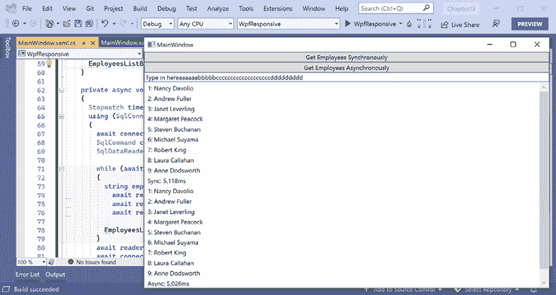

# 多任务处理和并发

本章主要介绍允许多个操作同时发生，以提高您构建的应用程序的性能、可扩展性和用户生产力。

本章我们将涵盖以下主题：

+   理解进程、线程和任务

+   异步运行任务

+   同步访问共享资源

+   理解`async`和`await`

# 理解进程、线程和任务

**进程**，例如我们创建的每个控制台应用程序，都分配了如内存和线程等资源。

**线程**通过逐条执行代码语句来执行您的代码。默认情况下，每个进程只有一个线程，当我们需要同时执行多个任务时，这可能会导致问题。线程还负责跟踪诸如当前认证用户以及应遵循的任何针对当前语言和区域的国际化规则等事项。

Windows 和大多数其他现代操作系统使用**抢占式多任务处理**，它模拟任务的并行执行。它将处理器时间分配给线程，依次为每个线程分配一个**时间片**。当前线程的时间片结束时，它将被挂起。然后处理器允许另一个线程运行一个时间片。

当 Windows 从一个线程切换到另一个线程时，它会保存当前线程的上下文，并重新加载线程队列中下一个线程之前保存的上下文。这需要时间和资源来完成。

作为开发者，如果您有一小部分复杂的工作，并且希望完全控制它们，那么您可以创建和管理单个`Thread`实例。如果您有一个主线程和多个可以在后台执行的小块工作，那么您可以使用`ThreadPool`类将指向作为方法实现的工作块的委托实例添加到队列中，它们将被自动分配到线程池中的线程。

在本章中，我们将使用`Task`类型在更高的抽象级别上管理线程。

线程可能需要竞争并等待访问共享资源，例如变量、文件和数据库对象。您将在本章后面看到用于管理这些资源的类型。

根据任务的不同，将执行任务的线程（工作者）数量加倍并不会将完成任务所需的时间减半。实际上，由于资源竞争，这可能会增加任务的持续时间，如图 5.1 所示：


图 5.1：关于现实世界中任务的推文

**良好实践**：永远不要假设更多的线程会提高性能！在没有多个线程的基线代码实现上运行性能测试，然后再次在具有多个线程的代码实现上运行。您还应在尽可能接近生产环境的预发布环境中进行性能测试。

# 异步运行任务

要了解如何**同时**（同时）运行多个任务，我们将创建一个需要执行三个方法的控制台应用程序。

将需要执行三个方法：第一个方法需要 3 秒，第二个方法需要 2 秒，第三个方法需要 1 秒。为了模拟这项工作，我们可以使用 `Thread` 类来告诉当前线程暂停指定的毫秒数。

## 同步运行多个操作

在我们使任务同时运行之前，我们将以**同步**的方式运行它们，也就是说，一个接一个地：

1.  使用您首选的代码编辑器添加一个控制台应用程序项目，如下列所示：

    +   项目模板：**控制台应用程序** / `console`

    +   解决方案文件和文件夹：`Chapter05`

    +   项目文件和文件夹：`WorkingWithTasks`

    +   **不要使用顶级语句**：已清除。

    +   **启用原生 AOT 发布**：已清除。

1.  在 `WorkingWithTasks` 项目中，全局和静态导入 `System.Console` 类，并将警告视为错误。

1.  在 `WorkingWithTasks` 项目中，添加一个名为 `Program.Helpers.cs` 的新类文件。

1.  在 `Program.Helpers.cs` 中，删除任何现有的语句，然后定义一个部分 `Program` 类，其中包含输出章节标题和任务标题的方法，以及输出关于当前线程的信息，每个方法使用不同的颜色以便在输出中更容易识别，如下面的代码所示：

    ```cs
    partial class Program
    {
      private static void SectionTitle(string title)
      {
        ConsoleColor previousColor = ForegroundColor;
        ForegroundColor = ConsoleColor.DarkYellow;
        WriteLine($"*** {title}");
        ForegroundColor = previousColor;
      }
      private static void TaskTitle(string title)
      {
        ConsoleColor previousColor = ForegroundColor;
        ForegroundColor = ConsoleColor.Green;
        WriteLine($"{title}");
        ForegroundColor = previousColor;
      }
      private static void OutputThreadInfo()
      {
        Thread t = Thread.CurrentThread;
        ConsoleColor previousColor = ForegroundColor;
        ForegroundColor = ConsoleColor.DarkCyan;
        WriteLine(
          "Thread Id: {0}, Priority: {1}, Background: {2}, Name: {3}",
          t.ManagedThreadId, t.Priority, t.IsBackground, t.Name ?? "null");
        ForegroundColor = previousColor;
      }
    } 
    ```

1.  在 `WorkingWithTasks` 项目中，添加一个名为 `Program.Methods.cs` 的新类文件。

1.  在 `Program.Methods.cs` 中，删除任何现有的语句，然后添加三个模拟工作的方法，如下面的代码所示：

    ```cs
    partial class Program
    {
      private static void MethodA()
      {
        TaskTitle("Starting Method A...");
        OutputThreadInfo();
        Thread.Sleep(3000); // Simulate three seconds of work.
        TaskTitle("Finished Method A.");
      }
      private static void MethodB()
      {
        TaskTitle("Starting Method B...");
        OutputThreadInfo();
        Thread.Sleep(2000); // Simulate two seconds of work.
        TaskTitle("Finished Method B.");
      }
      private static void MethodC()
      {
        TaskTitle("Starting Method C...");
        OutputThreadInfo();
        Thread.Sleep(1000); // Simulate one second of work.
        TaskTitle("Finished Method C.");
      }
    } 
    ```

1.  在 `Program.cs` 中，删除现有的语句，然后添加调用辅助方法以输出线程信息、定义并启动计时器、调用三个模拟工作方法以及输出经过的毫秒数的语句，如下面的代码所示：

    ```cs
    using System.Diagnostics; // To use Stopwatch.
    OutputThreadInfo();
    Stopwatch timer = Stopwatch.StartNew();
    SectionTitle("Running methods synchronously on one thread."); 
    MethodA();
    MethodB();
    MethodC();
    WriteLine($"{timer.ElapsedMilliseconds:#,##0}ms elapsed."); 
    ```

1.  运行代码，等待所有三个方法完成执行，然后查看结果，注意当只有一个未命名的前台线程执行工作时，所需的总时间略超过 6 秒，如下面的输出所示：

    ```cs
    Thread Id: 1, Priority: Normal, Background: False, Name: null
    *** Running methods synchronously on one thread.
    Starting Method A...
    Thread Id: 1, Priority: Normal, Background: False, Name: null
    Finished Method A.
    Starting Method B...
    Thread Id: 1, Priority: Normal, Background: False, Name: null
    Finished Method B.
    Starting Method C...
    Thread Id: 1, Priority: Normal, Background: False, Name: null
    Finished Method C.
    6,028ms elapsed. 
    ```

## 使用任务异步运行多个操作

`Thread` 类自 2002 年.NET 的第一个版本以来一直可用，可以用来创建新线程并管理它们，但直接与之交互可能会很棘手。

.NET Framework 4.0 在 2010 年引入了 `Task` 类，它表示一个异步操作。任务是对执行操作的操作系统线程的高级抽象，`Task` 类使得创建和管理任何底层线程变得更加容易。管理被任务包装的多个线程将允许我们的代码同时执行，即 **异步**。

每个 `Task` 都有一个 `Status` 属性和一个 `CreationOptions` 属性。`Task` 有一个 `ContinueWith` 方法，可以使用 `TaskContinuationOptions` 枚举进行自定义，并且可以使用 `TaskFactory` 类进行管理。

## 启动任务

我们将探讨三种使用 `Task` 实例启动方法的方式。GitHub 仓库中有链接到讨论优缺点的文章。它们的语法略有不同，但它们都定义了一个 `Task` 并启动了它：

1.  在 `Program.cs` 文件中，注释掉调用方法 A 到 C 的前一条语句，然后添加语句创建并启动三个任务，每个方法一个任务，如下面高亮显示的代码所示：

    ```cs
    Stopwatch timer = Stopwatch.StartNew();
    **/***
    SectionTitle("Running methods synchronously on one thread.");
    MethodA();
    MethodB();
    MethodC();
    ***/**
    **SectionTitle(****"Running methods asynchronously on multiple threads."****);** 
    **Task taskA =** **new****(MethodA);**
    **taskA.Start();**
    **Task taskB = Task.Factory.StartNew(MethodB);** 
    **Task taskC = Task.Run(MethodC);**
    WriteLine($"{timer.ElapsedMilliseconds:#,##0}ms elapsed."); 
    ```

    而不是注释掉前面的语句，你可以让它们运行，但确保在输出新的部分标题后调用 `timer.Restart()` 方法来重置每个部分的计时。

1.  运行代码，查看结果，并注意经过的毫秒数几乎立即出现。这是因为现在每个三个方法都由从 **线程池 (TP)** 分配的三个新的后台工作线程执行，如下面的输出所示：

    ```cs
    *** Running methods asynchronously on multiple threads.
    Starting Method A...
    Thread Id: 4, Priority: Normal, Background: True, Name: .NET TP Worker
    Starting Method C...
    Thread Id: 7, Priority: Normal, Background: True, Name: .NET TP Worker
    Starting Method B...
    Thread Id: 6, Priority: Normal, Background: True, Name: .NET TP Worker
    6ms elapsed. 
    ```

甚至可能控制台应用程序会在一个或所有任务有机会开始并写入控制台之前结束！

## 等待任务

有时，在继续之前需要等待一个任务完成。为此，可以在 `Task` 实例上使用 `Wait` 方法，或者在任务数组上使用 `WaitAll` 或 `WaitAny` 静态方法，如 *表 5.1* 中所述：

| **方法** | **描述** |
| --- | --- |
| `t.Wait()` | 这将等待名为 `t` 的任务实例完成执行。 |
| `Task.WaitAny(Task[])` | 这将等待数组中任何任务的执行完成。 |
| `Task.WaitAll(Task[])` | 这将等待数组中所有任务的执行完成。 |

表 5.1：Task 类的 Wait 方法

## 使用任务等待方法

让我们看看如何使用这些等待方法来解决我们的控制台应用程序的问题：

1.  在 `Program.cs` 文件中，在创建三个任务并在输出经过的时间之前，添加语句将三个任务的引用组合成一个数组，并将它们传递给 `WaitAll` 方法，如下面的代码所示：

    ```cs
    Task[] tasks = { taskA, taskB, taskC };
    Task.WaitAll(tasks); 
    ```

1.  运行代码并查看结果，并注意原始线程会在 `WaitAll` 调用上暂停，等待所有三个任务完成，然后输出经过的时间，大约是 3 秒多，如下面的输出所示：

    ```cs
    Starting Method A...
    Starting Method B...
    Thread Id: 4, Priority: Normal, Background: True, Name: .NET TP Worker
    Thread Id: 6, Priority: Normal, Background: True, Name: .NET TP Worker
    Starting Method C...
    Thread Id: 7, Priority: Normal, Background: True, Name: .NET TP Worker
    Finished Method C.
    Finished Method B.
    Finished Method A.
    3,013ms elapsed. 
    ```

三个新线程同时执行它们的代码，并且它们可以以任何顺序开始。`MethodC`应该首先完成，因为它只需要 1 秒，然后是`MethodB`，它需要 2 秒，最后是`MethodA`，因为它需要 3 秒。

然而，实际使用的 CPU 对结果有很大影响。是 CPU 为每个进程分配时间片，以便它们可以执行它们的线程。您无法控制方法何时运行。

## 继续另一个任务

如果所有三个任务可以同时执行，那么等待所有任务完成就是我们需要做的。然而，通常，一个任务依赖于另一个任务的输出。为了处理这种情况，我们需要定义**后续任务**。

我们将创建一些方法来模拟调用返回货币金额的 Web 服务，然后需要使用该金额从数据库中检索出多少产品的价格高于该金额。第一个方法返回的结果需要输入到第二个方法的输入中。这次，我们不会等待固定的时间，而是将使用`Random`类等待每个方法调用之间的 2 到 4 秒的随机间隔来模拟工作：

1.  在`Program.Methods.cs`中，添加两个方法来模拟调用 Web 服务和数据库存储过程，如下面的代码所示：

    ```cs
    private static decimal CallWebService()
    {
      TaskTitle("Starting call to web service...");
      OutputThreadInfo();
      Thread.Sleep(Random.Shared.Next(2000, 4000));
      TaskTitle("Finished call to web service.");
      return 89.99M;
    }
    private static string CallStoredProcedure(decimal amount)
    {
      TaskTitle("Starting call to stored procedure...");
      OutputThreadInfo();
      Thread.Sleep((Random.Shared.Next(2000, 4000));
      TaskTitle("Finished call to stored procedure.");
      return $"12 products cost more than {amount:C}.";
    } 
    ```

1.  在`Program.cs`中，注释掉前三个任务的语句，然后添加语句以启动一个任务来调用网络服务，然后将返回值传递给启动数据库存储过程的任务，如下面的代码所示：

    ```cs
    **SectionTitle(****"Passing the result of one task as an input into another."****);** 
    **Task<****string****> taskServiceThenSProc = Task.Factory**
     **.StartNew(CallWebService)** **// returns Task<decimal>**
     **.ContinueWith(previousTask =>** **// returns Task<string>**
     **CallStoredProcedure(previousTask.Result));**
    **WriteLine(****$"Result:** **{taskServiceThenSProc.Result}****"****);**
    WriteLine($"{timer.ElapsedMilliseconds:#,##0}ms elapsed."); 
    ```

1.  运行代码并查看结果，如下面的输出所示：

    ```cs
    Starting call to web service...
    Thread Id: 4, Priority: Normal, Background: True, Name: .NET TP Worker
    Finished call to web service.
    Starting call to stored procedure...
    Thread Id: 6, Priority: Normal, Background: True, Name: .NET TP Worker
    Finished call to stored procedure.
    Result: 12 products cost more than £89.99.
    5,463ms elapsed. 
    ```

货币符号是文化特定的，所以在我的电脑上它使用£。在您的电脑上它将使用您的文化。您将在*第七章*，*处理日期、时间和国际化*中学习如何控制文化。

您可能会看到两个不同的线程在运行上面的网络服务和存储过程调用（例如，线程 4 和 6），或者相同的线程可能会被重用，因为它不再忙碌。

## 嵌套和子任务

除了定义任务之间的依赖关系外，您还可以定义嵌套和子任务。**嵌套任务**是在另一个任务内部创建的任务。**子任务**是必须在其父任务允许完成之前完成的嵌套任务。

让我们探索这些类型任务的工作方式：

1.  在`Program.Methods.cs`中，添加两个方法，其中一个启动一个任务来运行另一个，如下面的代码所示：

    ```cs
    private static void OuterMethod()
    {
      TaskTitle("Outer method starting...");
      Task innerTask = Task.Factory.StartNew(InnerMethod);
      TaskTitle("Outer method finished.");
    }
    private static void InnerMethod()
    {
      TaskTitle("Inner method starting...");
      Thread.Sleep(2000);
      TaskTitle("Inner method finished.");
    } 
    ```

1.  在`Program.cs`中，添加语句以启动一个任务来运行外部方法，并在它完成之前等待，如下面的代码所示：

    ```cs
    SectionTitle("Nested and child tasks");
    Task outerTask = Task.Factory.StartNew(OuterMethod);
    outerTask.Wait();
    WriteLine("Console app is stopping."); 
    ```

1.  运行代码并查看结果，如下面的输出所示：

    ```cs
    Outer method starting...
    Inner method starting...
    Outer method finished.
    Console app is stopping. 
    ```

    虽然我们等待外部任务完成，但其内部任务不必也完成。事实上，外部任务可能已经完成，控制台应用程序可能在内部任务甚至开始之前就结束了，如下面的输出所示：

    ```cs
    Outer method starting...
    Outer method finished.
    Console app is stopping. 
    ```

1.  要将这些嵌套任务作为父任务和子任务链接起来，我们必须使用一个特殊选项。在`Program.Methods.cs`中，修改现有的代码以添加一个`TaskCreationOption`值为`AttachedToParent`，如下面高亮显示的代码所示：

    ```cs
    private static void OuterMethod()
    {
      TaskTitle("Outer method starting...");
      Task innerTask = Task.Factory.StartNew(InnerMethod**,**
     **TaskCreationOptions.AttachedToParent**);
      TaskTitle("Outer method finished.");
    } 
    ```

1.  运行代码，查看结果，并注意内部任务必须在外部任务之前完成，如下面的输出所示：

    ```cs
    Outer method starting...
    Inner method starting...
    Outer method finished.
    Inner method finished.
    Console app is stopping. 
    ```

1.  或者，外部方法可以在内部方法开始之前完成，如下面的输出所示：

    ```cs
    Outer method starting...
    Outer method finished.
    Inner method starting...
    Inner method finished.
    Console app is stopping. 
    ```

`OuterMethod`可以在`InnerMethod`之前完成其工作，如它写入控制台所示，但它的任务必须等待，如控制台在内外任务都完成之前不会停止所示。

## 将任务包装在其他对象周围

有时你可能有一个想要异步执行的方法，但返回的结果本身不是任务。你可以将返回值包装在一个成功完成的任务中，返回一个异常，或者使用`Task`的静态方法之一来指示任务已取消，如*表 5.2*所示：

| **方法** | **描述** |
| --- | --- |
| `FromResult<TResult>(TResult)` | 创建一个`Task<TResult>`对象，其`Result`属性是非任务结果，其`Status`属性是`RanToCompletion`。 |
| `FromException<TResult>(Exception)` | 创建一个由于指定异常而完成的`Task<TResult>`。 |
| `FromCanceled<TResult>(CancellationToken)` | 创建一个由于指定取消令牌而完成的`Task<TResult>`。 |

表 5.2：在各种场景下创建 Task 的方法

当你需要以下情况时，这些方法很有用：

+   实现一个具有异步方法但实现是同步的接口。这在网站和服务中很常见。

+   在单元测试期间模拟异步实现。

假设你需要创建一个用于验证 XML 输入的方法，并且该方法必须符合一个要求返回`Task<T>`的接口，如下面的代码所示：

```cs
public interface IValidation
{
  Task<bool> IsValidXmlTagAsync(this string input);
} 
```

这部分代码仅用于说明。你不需要将其输入到你的项目中。

我们可以使用这些有用的`FromX`方法来返回包装在任务中的结果，如下面的代码所示：

```cs
using System.Text.RegularExpressions;
namespace Packt.Shared;
public static class StringExtensions : IValidation
{
  public static Task<bool> IsValidXmlTagAsync(this string input)
  {
    if (input == null)
    {
      return Task.FromException<bool>(
        new ArgumentNullException($"Missing {nameof(input)} parameter"));
    }
    if (input.Length == 0)
    {
      return Task.FromException<bool>(
        new ArgumentException($"{nameof(input)} parameter is empty."));
    }
    return Task.FromResult(Regex.IsMatch(input,
      @"^<([a-z]+)([^<]+)*(?:>(.*)<\/\1>|\s+\/>)$"));
  }
} 
```

如果你需要实现的方法返回一个`Task`（在同步方法中相当于`void`），那么你可以返回一个预定义的已完成`Task`对象，如下面的代码所示：

```cs
public Task DeleteCustomerAsync()
{
  // ...
  return Task.CompletedTask;
} 
```

当并行运行任务时，代码通常会需要访问资源，而这些资源有时在任务和线程之间是共享的。因此，我们需要学习如何安全地访问这些共享资源。

# 同步访问共享资源

当有多个线程同时执行时，存在两个或更多线程可能同时访问相同变量或资源的可能性，这可能导致问题。因此，您应该仔细考虑如何使您的代码**线程安全**。

实现线程安全的最简单机制是使用对象变量作为标志或交通灯，以指示共享资源是否已应用了独占锁。

在威廉·戈尔丁的 *《蝇王》* 中，皮格和拉尔夫找到一个海螺壳，并用它来召集会议。男孩们对自己实施了一个“海螺规则”，即除非他们拿着海螺，否则没有人可以发言。

我喜欢将用于实现线程安全代码的对象变量命名为“海螺”。当一个线程拥有海螺时，其他任何线程都不应该访问由该海螺表示的共享资源。请注意，我说的是“应该”。只有尊重海螺的代码才能实现同步访问。海螺**不是**一个锁。

我们将探讨一些可以用来同步访问共享资源的类型：

+   `Monitor`：一个可以被多个线程用来检查它们是否应该访问同一进程中的共享资源。

+   `Interlocked`：一个用于在 CPU 级别操作简单数值类型的对象。

## 从多个线程访问资源

让我们创建一个控制台应用程序来探索多个线程之间的资源共享：

1.  使用您首选的代码编辑器将一个新的**控制台应用程序**/ `console` 项目添加到名为 `SynchronizingResourceAccess` 的 `Chapter05` 解决方案中。

1.  全局和静态导入 `System.Console` 类，并将警告视为错误。

1.  添加一个名为 `SharedObjects.cs` 的新类文件。

1.  在 `SharedObjects.cs` 中，删除任何现有的语句，然后定义一个静态类，其中包含一个字段用于存储共享资源的消息，如下所示代码：

    ```cs
    public static class SharedObjects
    {
      public static string? Message; // a shared resource
    } 
    ```

1.  添加一个名为 `Program.Methods.cs` 的新类文件。

1.  在 `Program.Methods.cs` 中，删除任何现有的语句，然后定义两个方法，这两个方法都循环五次，等待最多两秒的随机间隔，并将 `A` 或 `B` 追加到共享消息资源中，如下所示代码：

    ```cs
    partial class Program
    {
      private static void MethodA()
      {
        for (int i = 0; i < 5; i++)
        {
          // Simulate two seconds of work on the current thread.
          Thread.Sleep(Random.Shared.Next(2000));
          // Concatenate the letter "A" to the shared message.
          SharedObjects.Message += "A";
          // Show some activity in the console output.
          Write(".");
        }
      }
      private static void MethodB()
      {
        for (int i = 0; i < 5; i++)
        {
          Thread.Sleep(Random.Shared.Next(2000));
          SharedObjects.Message += "B";
          Write(".");
        }
      }
    } 
    ```

1.  在 `Program.cs` 中，删除现有的语句。添加导入诊断类型（如 `Stopwatch`）的命名空间语句，以及使用一对任务执行两个方法并在输出经过的毫秒数之前等待它们完成的语句，如下所示代码：

    ```cs
    using System.Diagnostics; // To use Stopwatch.
    WriteLine("Please wait for the tasks to complete.");
    Stopwatch watch = Stopwatch.StartNew();
    Task a = Task.Factory.StartNew(MethodA);
    Task b = Task.Factory.StartNew(MethodB);

    Task.WaitAll(new Task[] { a, b });
    WriteLine();
    WriteLine($"Results: {SharedObjects.Message}.");
    WriteLine($"{watch.ElapsedMilliseconds:N0} elapsed milliseconds."); 
    ```

1.  运行代码并查看结果，如下所示输出：

    ```cs
    Please wait for the tasks to complete.
    ..........
    Results: BABABAABBA.
    5,753 elapsed milliseconds. 
    ```

这表明两个线程都在并发地修改消息。在实际应用中，这可能会成为一个问题。但我们可以通过将互斥锁应用于海螺对象，以及向两个方法中添加代码以在修改共享资源之前自愿检查海螺，来防止并发访问，我们将在下一节中这样做。

## 将互斥锁应用于 conch

现在，让我们使用 conch 来确保一次只有一个线程访问共享资源：

1.  在 `SharedObjects.cs` 中，声明并实例化一个 `object` 变量来作为 conch，如下面的代码所示：

    ```cs
    public static object Conch = new(); // A shared object to lock. 
    ```

1.  在 `Program.Methods.cs` 中，在 `MethodA` 和 `MethodB` 中，在 `for` 语句周围添加一个 `lock` 语句，如下面 `MethodB` 的代码所示，高亮显示：

    ```cs
    **lock** **(SharedObjects.Conch)**
    **{**
      for (int i = 0; i < 5; i++)
      {
        Thread.Sleep(Random.Shared.Next(2000));
        SharedObjects.Message += "B";
        Write(".");
      }
    **}** 
    ```

    **良好实践**：请注意，由于检查 conch 是自愿的，如果您只在两个方法中的一个中使用 `lock` 语句，共享资源将继续被两个方法访问。确保所有访问共享资源的方法在尝试使用任何共享资源之前都通过在它上面调用 `lock` 来尊重 conch。

1.  运行代码并查看结果，如下面的输出所示：

    ```cs
    Please wait for the tasks to complete.
    ..........
    Results: BBBBBAAAAA.
    10,345 elapsed milliseconds. 
    ```

虽然经过的时间更长，但一次只能有一个方法访问共享资源。`MethodA` 或 `MethodB` 可以先开始。一旦一个方法完成了对共享资源的操作，conch 就会被释放，其他方法就有机会进行其工作。

## 理解 `lock` 语句

您可能会想知道 `lock` 语句在“锁定”对象变量时做了什么（提示：它并没有锁定对象！），如下面的代码所示：

```cs
lock (SharedObjects.Conch)
{
  // Work with a shared resource.
} 
```

C# 编译器将 `lock` 语句转换为使用 `Monitor` 类来 *进入* 和 *退出* conch 对象（我喜欢将其视为 *拿起* 和 *放下* conch 对象）的 `try`-`finally` 语句，如下面的代码所示：

```cs
try
{
  Monitor.Enter(SharedObjects.Conch);
  // Work with a shared resource.
}
finally
{
  Monitor.Exit(SharedObjects.Conch);
} 
```

当一个线程对一个引用类型调用 `Monitor.Enter` 时，它会检查是否有其他线程已经拿起了 conch。如果有，线程会等待。如果没有，线程会拿起 conch 并开始对其共享资源进行工作。一旦线程完成了其工作，它会调用 `Monitor.Exit`，释放 conch。

如果另一个线程正在等待，它现在可以拿起 conch 并进行其工作。这要求所有线程都通过适当地调用 `Monitor.Enter` 和 `Monitor.Exit` 来尊重 conch。

**良好实践**：您不能使用值类型（`struct` 类型）作为 conch。`Monitor.Enter` 需要引用类型，因为它锁定内存地址。该对象的任何内部数据结构 *不会* 被锁定。

## 避免死锁

了解编译器如何将 `lock` 语句转换为对 `Monitor` 类的方法调用也很重要，因为使用 `lock` 语句可能会导致死锁。

当存在两个或更多共享资源（每个资源都有一个 conch 来监控哪个线程正在对每个共享资源进行工作）时，可能会发生死锁，以下事件序列会发生：

+   线程 X “锁定” conch A 并开始对共享资源 A 进行工作。

+   线程 Y “锁定” conch B 并开始对共享资源 B 进行工作。

+   当线程 X 仍在处理资源 A 时，它还需要与资源 B 一起工作，因此它尝试“锁定”conch B，但由于线程 Y 已经拿起了 conch B，所以它被阻塞了。

+   当线程 Y 仍在处理资源 B 时，它还需要与资源 A 一起工作，因此它尝试“锁定”海螺 A，但由于线程 X 已经拥有海螺 A，所以它被阻塞了。

防止死锁的一种方法是在尝试获取锁时指定超时。为此，你必须手动使用`Monitor`类而不是使用`lock`语句。让我们看看如何：

1.  在`Program.Methods.cs`中，修改你的代码，将`lock`语句替换为尝试带超时进入海螺的代码，输出错误，然后退出监视器，允许其他线程进入监视器，如下面的代码中突出显示的`MethodB`所示：

    ```cs
    **try**
    **{**
    **if** **(Monitor.TryEnter(SharedObjects.Conch, TimeSpan.FromSeconds(****15****)))**
     **{**
        for (int i = 0; i < 5; i++)
        {
          Thread.Sleep(Random.Shared.Next(2000));
          SharedObjects.Message += "B";
          Write(".");
        }
     **}**
    **else**
     **{**
     **WriteLine(****"Method B timed out when entering a monitor on conch."****);**
     **}**
    **}**
    **finally**
    **{**
     **Monitor.Exit(SharedObjects.Conch);**
    **}** 
    ```

1.  运行代码并查看结果，结果应该与之前相同（尽管 A 或 B 可能先拿到海螺）但代码更好，因为它将防止潜在的死锁。

**良好实践**：只有在你能够编写避免潜在死锁的代码时才使用`lock`关键字。如果你无法避免潜在的死锁，那么始终使用`Monitor.TryEnter`方法而不是`lock`，并结合`try`-`finally`语句，这样你就可以提供一个超时，如果发生死锁，其中一个线程将退出。你可以在以下链接中了解更多关于良好线程实践的信息：[`learn.microsoft.com/en-us/dotnet/standard/threading/managed-threading-best-practices`](https://learn.microsoft.com/en-us/dotnet/standard/threading/managed-threading-best-practices)。

## 同步事件

.NET 事件不是线程安全的，所以在多线程场景中你应该避免使用它们。

在了解到.NET 事件不是线程安全之后，一些开发者在添加和删除事件处理器或引发事件时尝试使用独占锁，如下面的代码所示：

```cs
// event delegate field
public event EventHandler? Shout;
// conch
private object eventConch = new();
// method
public void Poke()
{
  lock (eventConch) // bad idea
  {
    // If something is listening...
    if (Shout != null)
    {
      // ...then call the delegate to raise the event.
      Shout(this, EventArgs.Empty);
    }
  }
} 
```

**良好实践**：一些开发者在事件处理中使用锁是好事还是坏事？嗯，这很复杂。它取决于复杂的因素，所以我不能给出价值判断。你可以在以下链接中了解更多关于事件和线程安全的信息：[`learn.microsoft.com/en-us/archive/blogs/cburrows/field-like-events-considered-harmful`](https://learn.microsoft.com/en-us/archive/blogs/cburrows/field-like-events-considered-harmful)。但正如 Stephen Cleary 在以下博客文章中解释的那样，这很复杂：[`blog.stephencleary.com/2009/06/threadsafe-events.html`](https://blog.stephencleary.com/2009/06/threadsafe-events.html)。

## 使 CPU 操作原子化

"Atomic"这个词来自希腊语**atomos**，意思是*不可分割的*。理解在多线程中哪些操作是原子的非常重要，因为如果不是原子的，它们在操作过程中可能会被另一个线程中断。下面的代码中 C#的增量操作符是原子的吗？

```cs
int x = 3;
x++; // is this an atomic CPU operation? 
```

*这不是原子的!* 增加一个整数的值需要以下三个 CPU 操作：

1.  将实例变量中的值加载到寄存器中。

1.  增加值。

1.  将值存储在实例变量中。

一个线程在执行前两个步骤后可能会被中断。然后第二个线程可以执行所有三个步骤。当第一个线程恢复执行时，它将覆盖变量中的值，第二个线程执行的递增或递减的效果将丢失！

有一个名为`Interlocked`的类型，可以对以下列表中的整数类型执行原子操作，如`Add`、`Increment`、`Decrement`、`Exchange`、`CompareExchange`、`And`、`Or`和`Read`：

+   `System.Int32` (`int`), `System.UInt32` (`uint`)

+   `System.Int64` (`long`), `System.UInt64` (`ulong`)

`Interlocked`不适用于像`byte`、`sbyte`、`short`、`ushort`和`decimal`这样的数值类型。

`Interlocked`可以在以下类型上执行原子操作，如`Exchange`和`CompareExchange`，这些操作在内存中交换值：

+   `System.Single` (`float`), `System.Double` (`double`)

+   `nint`, `nuint`

+   `System.Object` (`object`)

让我们看看实际效果：

1.  在`SharedObjects`类中声明另一个字段，该字段将计算发生的操作数量，如下面的代码所示：

    ```cs
    public static int Counter; // Another shared resource. 
    ```

1.  在`Program.Methods.cs`中，在方法 A 和 B 中，在`for`语句内修改`string`值之后，添加一个语句来安全地增加计数器，如下面的代码所示：

    ```cs
    Interlocked.Increment(ref SharedObjects.Counter); 
    ```

1.  在`Program.cs`中，在输出经过的时间之前，将计数器的当前值写入控制台，如下面的代码所示：

    ```cs
    WriteLine($"{SharedObjects.Counter} string modifications."); 
    ```

1.  运行代码并查看结果，如下所示的高亮输出：

    ```cs
    Please wait for the tasks to complete.
    ..........
    Results: BBBBBAAAAA.
    10 string modifications.
    13,531 elapsed milliseconds. 
    ```

注意力敏锐的读者会意识到现有的 conch 对象保护了在由 conch 锁定的代码块中访问的所有共享资源，因此在这个特定示例中不需要使用`Interlocked`。但如果我们还没有保护像`Message`这样的另一个共享资源，那么使用`Interlocked`将是必要的。

## 应用其他类型的同步

`Monitor`和`Interlocked`是互斥锁，简单且有效，但有时你需要更高级的选项来同步对共享资源的访问，如下表 5.3 所示：

| **类型** | **描述** |
| --- | --- |
| `ReaderWriterLock`, `ReaderWriterLockSlim` | 这些允许多个线程处于**读取模式**，一个线程处于**写入模式**并拥有写入锁的独占所有权，还有一个线程具有读取访问权限，可以处于**可升级读取模式**，从该模式中线程可以升级到写入模式，而无需放弃对资源的读取访问。 |
| `Mutex` | 与`Monitor`类似，它提供对共享资源的独占访问，但它用于进程间同步。 |
| `Semaphore`, `SemaphoreSlim` | 这些通过定义槽位来限制可以并发访问资源或资源池的线程数量。这被称为**资源节流**而不是**资源锁定**。 |
| `AutoResetEvent`, `ManualResetEvent` | 事件等待句柄允许线程通过相互信号和等待对方的信号来同步活动。 |

表 5.3：同步类型

既然我们已经探讨了在多线程应用程序中同步访问共享资源的重要性，那么现在是时候深入了解 C# 5 中引入的一些新关键字如何使编写异步代码变得更加容易。

# 理解异步和 await

在使用`Task`类型时，C# 5 引入了两个 C#关键字。它们在以下方面特别有用：

+   实现图形用户界面（**GUI**）的多任务处理

+   提高 Web 应用程序和 Web 服务的可伸缩性

在第十六章*使用.NET MAUI 构建移动和桌面应用程序*中，我们将看到`async`和`await`关键字如何实现 GUI 的多任务处理。

但现在，让我们先学习为什么引入这两个 C#关键字的理论，然后稍后你将看到它们在实际中的应用。

## 提高控制台应用程序的响应性

控制台应用程序的一个限制是，你只能在标记为`async`的方法中使用`await`关键字，但 C# 7 及之前版本不允许将`Main`方法标记为`async`！幸运的是，C# 7.1 引入了一个新功能，支持在`Main`中使用`async`：

1.  使用你喜欢的代码编辑器，将一个新的**控制台应用程序**/`console`项目添加到名为`Chapter05`的解决方案中，命名为`AsyncConsole`。

1.  在`Program.cs`中，删除现有的语句，静态导入`Console`，然后添加语句创建一个`HttpClient`实例，对苹果的主页发起请求，并输出其字节大小，如下所示代码：

    ```cs
    using static System.Console;
    HttpClient client = new();
    HttpResponseMessage response =
      await client.GetAsync("http://www.apple.com/");
    WriteLine("Apple's home page has {0:N0} bytes.",
      response.Content.Headers.ContentLength); 
    ```

1.  构建项目并注意它构建成功。在.NET 5 及之前版本中，项目模板创建了一个具有非异步`Main`方法的显式`Program`类，因此你会看到如下所示的错误消息：

    ```cs
    Program.cs(14,9): error CS4033: The 'await' operator can only be used within an async method. Consider marking this method with the 'async' modifier and changing its return type to 'Task'. [/Users/markjprice/apps-services-net7/Chapter04/AsyncConsole/AsyncConsole.csproj] 
    ```

1.  你必须将`async`关键字添加到`Main`方法中，并将其返回类型更改为`Task`。在.NET 6 及以后版本中，控制台应用程序项目模板使用顶级程序功能自动为你定义具有异步`<Main>$`方法的`Program`类。

1.  运行代码并查看结果，由于苹果公司经常更改其主页，因此字节数量可能不同，如下所示输出：

    ```cs
    Apple's home page has 40,252 bytes. 
    ```

## 使用异步流

在.NET Core 3 中，微软引入了流的异步处理。

你可以在以下链接中完成关于异步流的教程：[`learn.microsoft.com/en-us/dotnet/csharp/tutorials/generate-consume-asynchronous-stream`](https://learn.microsoft.com/en-us/dotnet/csharp/tutorials/generate-consume-asynchronous-stream)。

在 C# 8 和.NET Core 3 之前，`await`关键字仅适用于返回标量值的任务。.NET Standard 2.1 中的异步流支持允许异步方法依次返回一个值。

让我们看看一个模拟的例子，它返回一个异步流，包含三个随机整数：

1.  使用您首选的代码编辑器向`Chapter05`解决方案中添加一个名为`AsyncEnumerable`的新**控制台应用程序**/ `console`项目。

1.  全局和静态导入`System.Console`类，并将警告视为错误。

1.  添加一个名为`Program.Methods.cs`的新文件。

1.  在`Program.Methods.cs`中，删除任何现有的语句，然后定义一个使用`yield`关键字异步返回三个随机数字序列的方法，如下面的代码所示：

    ```cs
    partial class Program
    {
      private static async IAsyncEnumerable<int> GetNumbersAsync()
      {
        Random r = Random.Shared;
        // Simulate some work that takes 1.5 to 3 seconds.
        await Task.Delay(r.Next(1500, 3000));
        // Return a random number between 1 and 1000.
        yield return r.Next(1, 1001);
        await Task.Delay(r.Next(1500, 3000));
        yield return r.Next(1, 1001);
        await Task.Delay(r.Next(1500, 3000));
        yield return r.Next(1, 1001);
      }
    } 
    ```

1.  在`Program.cs`中，删除现有的语句，然后添加语句来枚举数字序列，如下面的代码所示：

    ```cs
    // Use async streams to iterate over a collection asynchronously.
    await foreach (int number in GetNumbersAsync())
    {
      WriteLine($"Number: {number}");
    } 
    ```

1.  运行代码并查看结果，如下面的输出所示：

    ```cs
    Number: 509
    Number: 813
    Number: 307 
    ```

## 提高 GUI 应用程序的响应性

到目前为止，在这本书中，我们只构建了控制台应用程序。当构建 Web 应用程序、Web 服务和具有 GUI（如 Windows 桌面和移动应用程序）的应用程序时，程序员的生涯会变得更加复杂。

原因之一是对于 GUI 应用程序，有一个特殊的线程：**用户界面**（**UI**）线程。

在 GUI 中工作有两个规则：

+   不要在 UI 线程上执行长时间运行的任务。

+   除了 UI 线程之外，不要在任何线程上访问 UI 元素。

为了处理这些规则，程序员过去不得不编写复杂的代码来确保长时间运行的任务由非 UI 线程执行，但一旦完成，任务的结果就会被安全地传递到 UI 线程以展示给用户。这可能会很快变得混乱！

幸运的是，从 C# 5 及以后版本开始，您可以使用`async`和`await`。它们允许您继续以同步方式编写代码，这使代码保持整洁且易于理解，但底层，C#编译器创建了一个复杂的状态机并跟踪运行中的线程。这有点神奇！这两个关键字的组合使得异步方法在工作者线程上运行，并在完成时将结果返回到 UI 线程。

让我们看看一个例子。我们将使用**Windows Presentation Foundation**（**WPF**）构建一个 Windows 桌面应用程序，该应用程序使用低级类型如`SqlConnection`、`SqlCommand`和`SqlDataReader`从 SQL Server 数据库中的 Northwind 数据库获取员工信息。

Northwind 数据库具有中等复杂性和相当数量的样本记录。您在*第二章*，*使用 SQL Server 管理关系数据*中广泛使用了它，其中介绍了并设置了该数据库。

**警告！** 只有在您拥有 Microsoft Windows 和存储在 Microsoft SQL Server 中的 Northwind 数据库的情况下，您才能完成此任务。这是本书中唯一一个不是跨平台和现代（WPF 已经 17 岁了！）的部分。您可以使用 Visual Studio 2022 或 Visual Studio Code。

到目前为止，我们专注于使 GUI 应用程序响应。你将在第十六章“使用 .NET MAUI 构建移动和桌面应用程序”中了解 XAML 和构建跨平台 GUI 应用程序。由于本书没有在其他地方涵盖 WPF，我认为这是一个很好的机会，至少可以看到一个使用 WPF 构建的应用程序示例，即使我们不详细查看它。让我们开始吧！

1.  如果你使用的是 Visual Studio 2022，请在 `Chapter05` 解决方案中添加一个名为 `WpfResponsive` 的新 **WPF 应用程序 [C#]** 项目。如果你使用的是 Visual Studio Code，请使用以下命令：`dotnet new wpf`。如果你使用的是 JetBrains Rider，请选择 **桌面应用程序**，然后选择 **类型** 为 **WPF 应用程序**。

1.  向项目中添加 `Microsoft.Data.SqlClient` 的包引用。

1.  在项目文件中，请注意输出类型是 Windows EXE，目标框架是 .NET for Windows（它将在其他平台，如 macOS 和 Linux 上运行），并且项目使用 WPF，如下面的标记所示：

    ```cs
    <Project Sdk="Microsoft.NET.Sdk">
      <PropertyGroup>
        <OutputType>WinExe</OutputType>
        <TargetFramework>net8.0-windows</TargetFramework>
        <Nullable>enable</Nullable>
        <UseWPF>true</UseWPF>
      </PropertyGroup>
      <ItemGroup>
        <PackageReference Include="Microsoft.Data.SqlClient" Version="5.2.0" />
      </ItemGroup>
    </Project> 
    ```

1.  构建 `WpfResponsive` 项目以恢复包。

1.  在 `MainWindow.xaml` 中，在 `<Grid>` 元素中，添加元素以定义两个按钮、一个文本框和一个列表框，它们在堆叠面板中垂直排列，如下面的标记所示：

    ```cs
    <StackPanel>
      <Button Name="GetEmployeesSyncButton" 
              Click="GetEmployeesSyncButton_Click">
        Get Employees Synchronously</Button>
      <Button Name="GetEmployeesAsyncButton" 
              Click="GetEmployeesAsyncButton_Click">
        Get Employees Asynchronously</Button>
      <TextBox HorizontalAlignment="Stretch" Text="Type in here" />
      <ListBox Name="EmployeesListBox" Height="400" />
    </StackPanel> 
    ```

    Visual Studio 2022 对构建 WPF 应用程序有良好的支持，并在你编辑代码和 XAML 标记时提供 IntelliSense。Visual Studio Code 不提供。

1.  在 `MainWindow.xaml.cs` 中，导入命名空间以使用 ADO.NET 和计时器，如下面的代码所示：

    ```cs
    using Microsoft.Data.SqlClient; // To use SqlConnection and so on.
    using System.Diagnostics; // To use Stopwatch. 
    ```

1.  在 `MainWindow` 类的构造函数中，定义两个 `string` 字段用于数据库连接字符串和 SQL 语句，如下面的代码所示：

    ```cs
    private string connectionString;
    private string sql = "WAITFOR DELAY '00:00:05';" +
      "SELECT EmployeeId, FirstName, LastName FROM Employees"; 
    ```

    SQL 有两个语句。第一个等待五秒钟以模拟长时间运行的查询。

1.  在 `MainWindow` 类的构造函数中，在调用 `InitializeComponent` 之后，使用 `SqlConnectionStringBuilder` 设置数据库连接字符串，如下面的代码所示：

    ```cs
    public MainWindow()
    {
      InitializeComponent();
      // Change as needed to work with your Northwind database.
      SqlConnectionStringBuilder builder = new();
      builder.DataSource = ".";
      builder.InitialCatalog = "Northwind";
      builder.Encrypt = false;
      builder.MultipleActiveResultSets = true;
      builder.ConnectTimeout = 5;
      // To use Windows Integrated authentication.
      builder.IntegratedSecurity = true;
      // To use SQL Server authentication.
      // builder.UserID = Environment.GetEnvironmentVariable("MY_SQL_USR");
      // builder.Password = Environment.GetEnvironmentVariable("MY_SQL_PWD");
      connectionString = builder.ConnectionString;
    } 
    ```

1.  创建两个按钮点击的事件处理程序。它们必须使用 `string` 常量来打开与 Northwind 数据库的连接，然后使用所有员工的 ID 和名称填充列表框，如下面的代码所示：

    ```cs
    private void GetEmployeesSyncButton_Click(object sender, RoutedEventArgs e)
    {
      Stopwatch timer = Stopwatch.StartNew();
      using (SqlConnection connection = new(connectionString))
      {
        try
        {
          connection.Open();
          SqlCommand command = new(sql, connection);
          SqlDataReader reader = command.ExecuteReader();
          while (reader.Read())
          {
            string employee = string.Format("{0}: {1} {2}",
              reader.GetInt32(0), reader.GetString(1),
              reader.GetString(2));
            EmployeesListBox.Items.Add(employee);
          }
          reader.Close();
          connection.Close();
        }
        catch (Exception ex)
        {
          MessageBox.Show(ex.Message);
        }
      }
      EmployeesListBox.Items.Add(
        $"Sync: {timer.ElapsedMilliseconds:N0}ms");
    }
    private async void GetEmployeesAsyncButton_Click(
      object sender, RoutedEventArgs e)
    {
      Stopwatch timer = Stopwatch.StartNew();
      using (SqlConnection connection = new(connectionString))
      {
        try
        {
          await connection.OpenAsync();
          SqlCommand command = new(sql, connection);
          SqlDataReader reader = await command.ExecuteReaderAsync();
          while (await reader.ReadAsync())
          {
            string employee = string.Format("{0}: {1} {2}",
              await reader.GetFieldValueAsync<int>(0), 
              await reader.GetFieldValueAsync<string>(1), 
              await reader.GetFieldValueAsync<string>(2));
            EmployeesListBox.Items.Add(employee);
          }
          await reader.CloseAsync();
          await connection.CloseAsync();
        }
        catch (Exception ex)
        {
          MessageBox.Show(ex.Message);
        }
      }
      EmployeesListBox.Items.Add(
        $"Async: {timer.ElapsedMilliseconds:N0}ms");
    } 
    ```

    注意以下事项：

    +   定义一个 `async void` 方法通常是不良实践，因为它“发射并遗忘”。当你完成时，你将不会收到通知，并且无法取消它，因为它不返回一个 `Task` 或 `Task<T>`，这可以用来控制它。

    +   SQL 语句使用 SQL Server 的 `WAITFOR DELAY` 命令来模拟需要五秒钟的处理。然后它从 `Employees` 表中选择三个列。

    +   `GetEmployeesSyncButton_Click` 事件处理程序使用同步方法打开连接并获取员工行。

    +   `GetEmployeesAsyncButton_Click` 事件处理程序被标记为 `async`，并使用带有 `await` 关键字的异步方法打开连接并获取员工行。

    +   两个事件处理器都使用计时器来记录操作所需的毫秒数，并将其添加到列表框中。

1.  不带调试启动 WPF 应用程序。

1.  在文本框中点击，输入一些文本，并注意 GUI 仍然响应。

1.  点击 **同步获取员工** 按钮。

1.  尝试在文本框中点击，并注意 GUI 不再响应。

1.  等待至少五秒钟，直到列表框中填充了员工信息。

1.  在文本框中点击，输入一些文本，并注意 GUI 再次变得响应。

1.  点击 **异步获取员工** 按钮。

1.  在文本框中点击，输入一些文本，并注意在执行操作时 GUI 仍然响应。继续输入，直到列表框中填充了员工信息，如图 5.2 所示：



图 5.2：同步和异步将员工加载到 WPF 应用程序中

1.  注意两个操作的时间差异。在同步获取数据时，UI 被阻塞，而在异步获取数据时，UI 保持响应。

1.  关闭 WPF 应用程序。

## 提高网络应用程序和网络服务的可扩展性

在构建网站、应用程序和服务时，`async` 和 `await` 关键字也可以应用于服务器端。从客户端应用程序的角度来看，没有任何变化（或者他们甚至可能注意到请求返回所需时间的小幅增加）。因此，从单个客户端的角度来看，使用 `async` 和 `await` 在服务器端实现多任务处理会使他们的体验变得更差！

在服务器端，创建额外的、成本更低的工作线程来等待长时间运行的任务完成，以便昂贵的 I/O 线程可以处理其他客户端请求而不是被阻塞。这提高了网络应用程序或服务的整体可扩展性。可以同时支持更多的客户端。

## 支持多任务处理的常见类型

有许多常见的类型具有可以等待的异步方法，如图 5.4 表所示：

| **类型** | **方法** |
| --- | --- |
| `DbContext<T>` | `AddAsync`、`AddRangeAsync`、`FindAsync` 和 `SaveChangesAsync` |
| `DbSet<T>` | `AddAsync`、`AddRangeAsync`、`ForEachAsync`、`SumAsync`、`ToListAsync`、`ToDictionaryAsync`、`AverageAsync` 和 `CountAsync` |
| `HttpClient` | `GetAsync`、`PostAsync`、`PutAsync`、`DeleteAsync` 和 `SendAsync` |
| `StreamReader` | `ReadAsync`、`ReadLineAsync` 和 `ReadToEndAsync` |
| `StreamWriter` | `WriteAsync`、`WriteLineAsync` 和 `FlushAsync` |

表 5.4：具有异步方法的常见类型

**良好实践**：每次看到以 `Async` 后缀结尾的方法时，检查它是否返回 `Task` 或 `Task<T>`。如果它确实返回 `Task` 或 `Task<T>`，则可以使用它代替同步的非 `Async` 后缀方法。记得使用 `await` 调用它，并使用 `async` 装饰你的方法。

## 在 catch 块中使用 await

当`async`和`await`首次在 C# 5 中引入时，只能在`try`块中使用`await`关键字，但不能在`catch`块中使用。在 C# 6 及以后版本中，现在可以在`try`和`catch`块中同时使用`await`。

# 练习和探索

通过回答一些问题、进行一些实际操作和深入探索本章的主题来测试你的知识和理解。

## 练习 5.1 – 测试你的知识

回答以下问题：

1.  你可以了解到关于一个进程的哪些信息？

1.  `Stopwatch`类的准确性如何？

1.  按照惯例，应该给返回`Task`或`Task<T>`的方法添加什么后缀？

1.  要在方法内部使用`await`关键字，方法声明必须应用什么关键字？

1.  你如何创建一个子任务？

1.  为什么你应该避免使用`lock`关键字？

1.  你应该在什么时候使用`Interlocked`类？

1.  你应该在什么时候使用`Mutex`类而不是`Monitor`类？

1.  在网站或 Web 服务中使用`async`和`await`的好处是什么？

1.  你可以取消一个任务吗？如果是的话，应该如何操作？

## 练习 5.2 – 探索主题

使用以下网页上的链接了解更多关于本章涵盖的主题：

[`github.com/markjprice/apps-services-net8/blob/main/docs/book-links.md#chapter-5---multitasking-and-concurrency`](https://github.com/markjprice/apps-services-net8/blob/main/docs/book-links.md#chapter-5---multitasking-and-concurrency)

## 练习 5.3 – 了解更多关于并行编程

Packt 有一本书深入探讨了本章的主题，*《使用 C# 10 和.NET 6 进行并行编程和并发：一种现代方法，用于构建更快、更响应和异步的.NET 应用程序》*，作者 Alvin Ashcroft：

[`www.packtpub.com/product/parallel-programming-and-concurrency-with-c-10-and-net-6/9781803243672`](https://www.packtpub.com/product/parallel-programming-and-concurrency-with-c-10-and-net-6/9781803243672)

# 概述

在本章中，你学习了：

+   如何定义和启动一个任务。

+   如何等待一个或多个任务完成。

+   如何控制任务完成顺序。

+   如何同步访问共享资源。

+   `async`和`await`背后的魔法。

在下一章中，你将学习如何使用一些流行的第三方库。
