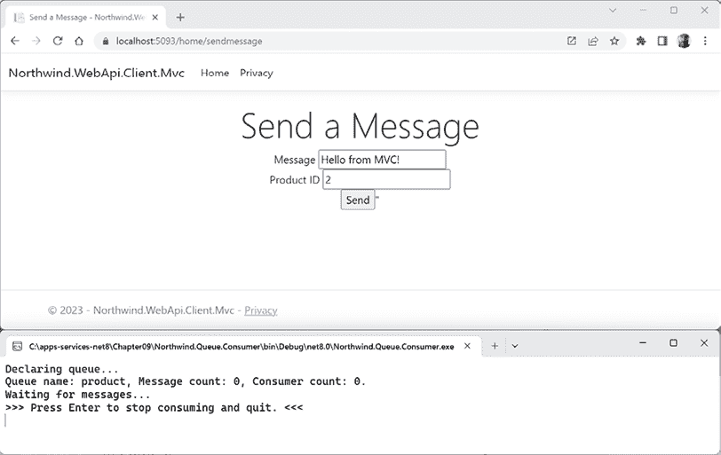

# 第九章：缓存、队列和弹性后台服务

在本章中，你将了解多种技术和技巧，这些技术和技巧将提高你服务的可扩展性和可靠性，无论你选择哪种服务技术来实现。

本章将涵盖以下主题：

+   理解服务架构

+   使用 ASP.NET Core 进行缓存

+   使用 Polly 实现容错

+   使用 RabbitMQ 进行队列

+   实现长时间运行的后台服务

# 理解服务架构

在 *第八章*，*使用最小 API 构建和保障 Web 服务* 中，你学习了如何使用 ASP.NET Core 最小 API 构建一个 Web 服务。在查看构建服务的替代技术之前，值得退一步回顾服务架构以及是什么原因导致服务性能和可扩展性的瓶颈。

## 系统中最慢的部分是什么？

传统上，系统中最慢的部分是：

+   网络（最慢）

+   磁盘

+   内存

+   CPU 缓存内存（最快）

每一步可能比下一步慢 5 到 10 倍。

然而，网络比以前快得多，系统通常在远程数据中心运行。想象一下，如果你的服务需要一些数据，是直接从本地服务器磁盘读取更快，还是调用另一个服务器更快？

+   同一数据中心内的服务器到服务器调用：500,000 纳秒（ns）

+   磁盘寻道：10,000,000 ns

## 每个开发者都应该知道的数字

谷歌公司高级工程师杰夫·迪恩在他的演讲中引用了各种技术访问或读取数据的实际纳秒（ns）时间。它们显示在 *表 9.1* 中，并且我添加了一列来将数字换算成更易于人类理解的单位：

| **技术** | **实际** | **人性化** |
| --- | --- | --- |
| CPU 周期 | 0.1 ns | 1 秒 |
| L1 缓存引用 | ½ ns | 5 秒 |
| L2 缓存引用 | 5 ns | 1 分钟 |
| 锁定/解锁互斥锁 | 25 ns | 4 分钟 |
| 主内存引用 | 100 ns | ¼ 小时 |
| 在 1 Gbps 网络上发送 1K 字节 | 10,000 ns | 28 小时 |
| 从内存中顺序读取 1 MB | 250,000 ns | 29 天 |
| 同一数据中心内的往返 | 500,000 ns | 2 个月 |
| 从 SSD 顺序读取 1 MB | 1,000,000 ns | 4 个月 |
| 磁盘寻道 | 10,000,000 ns | 3¼ 年 |
| 从磁盘顺序读取 1 MB | 20,000,000 ns | 6¼ 年 |
| 从加拿大到荷兰的 CA 发送数据包 | 150,000,000 ns | 47½ 年 |

表 9.1：各种技术访问或读取数据的纳秒时间

**更多信息**：杰夫·迪恩所著的 *构建大型分布式系统的设计、经验和建议*，[`www.cs.cornell.edu/projects/ladis2009/talks/dean-keynote-ladis2009.pdf`](http://www.cs.cornell.edu/projects/ladis2009/talks/dean-keynote-ladis2009.pdf)。

重点是不要争论从驱动器或 SSD 读取是否比网络调用更快，更重要的是要意识到获取近处数据和远处数据的差异。数量级上的差异是相当巨大的。

例如，如果一个 CPU 需要处理一些数据，并且它已经在 L1 缓存中，那么它只需要相当于 1 秒的时间。如果它需要从内存中读取数据，那么它需要相当于四分之一小时的时间。如果它需要从同一数据中心的服务器中获取数据，那么它需要相当于 2 个月的时间。如果它在加利福尼亚，而数据在荷兰，那么它需要相当于 47½ 年的时间！

这就是为什么缓存如此重要的原因。缓存是将数据临时存储在尽可能接近需要的地方。

# 使用 ASP.NET Core 进行缓存

缓存可以使我们的系统从远程数据中心复制一些数据到本地数据中心，或者从服务器或磁盘到内存。缓存以键值对的形式存储数据。

然而，缓存中最困难的部分之一是找到存储足够数据和保持数据新鲜之间的平衡。我们复制的越多，我们使用的资源就越多。我们需要考虑如何保持副本与原始数据的一致性。

## 通用缓存指南

缓存最适合成本高昂且不经常更改的数据。

在缓存时遵循以下指南：

+   你的代码永远不应该依赖于缓存数据。当数据在缓存中找不到时，它应该始终能够从原始源获取数据。

+   无论你在哪里缓存数据（内存或数据库），它都是有限的资源，因此应通过实现过期和大小限制来故意限制缓存的数据量和缓存时间。你应该监控缓存命中（当数据在缓存中成功找到时）以获得特定场景的正确平衡。

在本节中的编码任务中，你将实现所有这些指南。

让我们先回顾一下 ASP.NET Core 内置的缓存技术。

## 构建基于控制器的 Web API 服务

为了探索各种缓存技术，让我们构建一个基本的 Web 服务：

1.  使用你喜欢的代码编辑器创建一个新的基于控制器的 Web API 项目，如下所示：

    +   项目模板：**ASP.NET Core Web API** / `webapi --use-controllers`

    +   解决方案文件和文件夹：`Chapter09`

    +   项目文件和文件夹：`Northwind.WebApi.Service`

    +   **身份验证类型**：**无**

    +   **配置 HTTPS**：已选择

    +   **启用 Docker**：已清除

    +   **使用控制器**：已选择

    +   **启用 OpenAPI 支持**：已选择

    +   **不使用顶层语句**：已清除

    确保选择 **使用控制器** 复选框或指定 `--use-controllers` 或 `-controllers` 开关。我们不会使用最小 API，这是使用 .NET 8 项目模板实现 Web API 的默认方式。如果你使用 JetBrains Rider，你可能想使用 `dotnet new` 命令，直到 Rider 支持一个 **使用控制器** 选项。

1.  将项目引用添加到你在 *第三章*，*使用 EF Core 为 SQL Server 构建实体模型* 中创建的 Northwind 数据库上下文项目，如下所示：

    ```cs
    <ItemGroup>
      <ProjectReference Include="..\..\Chapter03\Northwind.Common.DataContext
    .SqlServer\Northwind.Common.DataContext.SqlServer.csproj" />
    </ItemGroup> 
    ```

    路径不能有换行符。如果你没有完成 *第三章* 中创建类库的任务，那么请从 GitHub 仓库下载解决方案项目。

1.  在项目文件中，将不变全球化更改为 `false`，并将警告视为错误，如下标记所示：

    ```cs
    <Project Sdk="Microsoft.NET.Sdk.Web">
      <PropertyGroup>
        <TargetFramework>net8.0</TargetFramework>
        <Nullable>enable</Nullable>
        <ImplicitUsings>enable</ImplicitUsings>
        <InvariantGlobalization>**false**</InvariantGlobalization>
     **<TreatWarningsAsErrors>****true****</TreatWarningsAsErrors>**
      </PropertyGroup> 
    ```

    显式地将不变全球化设置为 `true` 是 .NET 8 的 ASP.NET Core Web API 项目模板中的新功能。它旨在使 web 服务不受文化限制，以便可以在世界任何地方部署并具有相同的行为。通过将此属性设置为 `false`，web 服务将默认为当前托管计算机的文化。你可以在以下链接中了解更多关于不变全球化模式的信息：[`github.com/dotnet/runtime/blob/main/docs/design/features/globalization-invariant-mode.md`](https://github.com/dotnet/runtime/blob/main/docs/design/features/globalization-invariant-mode.md)。

1.  在命令提示符或终端中，构建 `Northwind.WebApi.Service` 项目以确保当前解决方案之外的实体模型类库项目被正确编译，如下命令所示：

    ```cs
    dotnet build 
    ```

1.  在 `Properties` 文件夹中，在 `launchSettings.json` 中，将名为 `https` 的配置文件的 `applicationUrl` 修改为使用端口 `5091` 用于 `https` 和端口 `5092` 用于 `http`，如下配置所示：

    ```cs
    "profiles": {
      ...
    **"****https"****:****{**
        "commandName": "Project",
        "dotnetRunMessages": true,
        "launchBrowser": true,
        "launchUrl": "swagger",
    **"applicationUrl"****:****"https://localhost:5091;http://localhost:5092"****,**
        "environmentVariables": {
          "ASPNETCORE_ENVIRONMENT": "Development"
        } 
    ```

    Visual Studio 2022 和 JetBrains Rider 将读取此设置文件，如果 `launchBrowser` 为 `true`，则自动运行一个浏览器，并导航到 `applicationUrl` 和 `launchUrl`。Visual Studio Code 和 `dotnet run` 不会这样做，因此你需要手动运行一个浏览器并手动导航到 [`localhost:5091/swagger`](https://localhost:5091/swagger)。

1.  删除名为 `WeatherForecast.cs` 的文件。

1.  在 `Controllers` 文件夹中，删除名为 `WeatherForecastController.cs` 的文件。

1.  在 `Program.cs` 中，导入命名空间以将 `NorthwindContext` 添加到配置的服务中，如下代码所示：

    ```cs
    **using** **Northwind.EntityModels;** **// To use the AddNorthwindContext method.**
    var builder = WebApplication.CreateBuilder(args);
    // Add services to the container.
    **builder.Services.AddNorthwindContext();**
    builder.Services.AddControllers(); 
    ```

1.  在 `Controllers` 文件夹中，添加一个名为 `ProductsController.cs` 的新类文件。

1.  在 `ProductsController.cs` 中，修改其内容以定义一个基于控制器的 Web API，用于与 Northwind 数据库中的产品一起工作，就像我们对最小 API 所做的那样，如下代码所示：

    ```cs
    using Microsoft.AspNetCore.Mvc; // To use [HttpGet] and so on.
    using Northwind.EntityModels; // To use NorthwindContext, Product.
    namespace Northwind.WebApi.Service.Controllers;
    [Route("api/products")]
    [ApiController]
    public class ProductsController : ControllerBase
    {
      private int pageSize = 10;
      private readonly ILogger<ProductsController> _logger;
      private readonly NorthwindContext _db;
      public ProductsController(ILogger<ProductsController> logger, 
        NorthwindContext context)
      {
        _logger = logger;
        _db = context;
      }
      // GET: api/products
      [HttpGet]
      [Produces(typeof(Product[]))]
      public IEnumerable<Product> Get(int? page)
      {
        return _db.Products
          .Where(p => p.UnitsInStock > 0 && !p.Discontinued)
          .OrderBy(product => product.ProductId)
          .Skip(((page ?? 1) - 1) * pageSize)
          .Take(pageSize);
      }
      // GET: api/products/outofstock
      [HttpGet]
      [Route("outofstock")]
      [Produces(typeof(Product[]))]
      public IEnumerable<Product> GetOutOfStockProducts()
      {
        return _db.Products
          .Where(p => p.UnitsInStock == 0 && !p.Discontinued);
      }
      // GET: api/products/discontinued
      [HttpGet]
      [Route("discontinued")]
      [Produces(typeof(Product[]))]
      public IEnumerable<Product> GetDiscontinuedProducts()
      {
        return _db.Products
          .Where(product => product.Discontinued);
      }
      // GET api/products/5
      [HttpGet("{id:int}")]
      public async ValueTask<Product?> Get(int id)
      {
        return await _db.Products.FindAsync(id);
      }
      // GET api/products/cha
      [HttpGet("{name}")]
      public IEnumerable<Product> Get(string name)
      {
        return _db.Products.Where(p => p.ProductName.Contains(name));
      }
      // POST api/products
      [HttpPost]
      public async Task<IActionResult> Post([FromBody] Product product)
      {
        _db.Products.Add(product);
        await _db.SaveChangesAsync();
        return Created($"api/products/{product.ProductId}", product);
      }
      // PUT api/products/5
      [HttpPut("{id}")]
      public async Task<IActionResult> Put(int id, [FromBody] Product product)
      {
        Product? foundProduct = await _db.Products.FindAsync(id);
        if (foundProduct is null) return NotFound();
        foundProduct.ProductName = product.ProductName;
        foundProduct.CategoryId = product.CategoryId;
        foundProduct.SupplierId = product.SupplierId;
        foundProduct.QuantityPerUnit = product.QuantityPerUnit;
        foundProduct.UnitsInStock = product.UnitsInStock;
        foundProduct.UnitsOnOrder = product.UnitsOnOrder;
        foundProduct.ReorderLevel = product.ReorderLevel;
        foundProduct.UnitPrice = product.UnitPrice;
        foundProduct.Discontinued = product.Discontinued;
        await _db.SaveChangesAsync();
        return NoContent();
      }
      // DELETE api/products/5
      [HttpDelete("{id}")]
      public async Task<IActionResult> Delete(int id)
      {
        if (await _db.Products.FindAsync(id) is Product product)
        {
          _db.Products.Remove(product);
          await _db.SaveChangesAsync();
          return NoContent();
        }
        return NotFound();
      }
    } 
    ```

1.  如果你的数据库服务器没有运行，例如，因为你正在 Docker、虚拟机或云中托管它，那么请确保启动它。

1.  使用 `https` 配置文件不调试启动 web 服务项目。

    +   如果你正在使用 Visual Studio 2022，则在下拉列表中选择 **https** 配置文件，然后导航到 **调试** | **不调试启动** 或按 *Ctrl* + *F5*。浏览器应自动导航到 Swagger 文档网页。

    +   如果你正在使用 Visual Studio Code，那么输入命令 `dotnet run --launch-profile https`，手动启动一个网页浏览器，并导航到 Swagger 文档网页：[`localhost:5091/swagger`](https://localhost:5091/swagger)。

    在 Windows 上，如果需要，你必须将 Windows Defender 防火墙设置为允许访问你的本地 Web 服务。

1.  使用 Swagger 测试各种端点，并注意你这样做时记录到输出的 SQL 语句，例如：

    +   获取 10 个产品中的第一页。

    +   获取 10 个产品中的第 6 页。

    +   获取 ID 为 77 的产品。

    +   获取单个缺货产品。

    +   获取 7 个已停售的产品。

    +   获取名称以 `cha` 开头的产品。

    +   创建（`POST`）、更新（`PUT`）和删除一个产品。有关如何执行这些测试的提示，请阅读以下链接：[`github.com/markjprice/apps-services-net8/blob/main/docs/ch09-swagger-tests.md`](https://github.com/markjprice/apps-services-net8/blob/main/docs/ch09-swagger-tests.md)。

如果你完成了 *第八章*，*使用 Minimal APIs 构建和保障 Web 服务*，那么你就可以使用我们创建的 `.http` 文件来测试最小 API Web 服务，而无需手动使用 Swagger。只需将端口从 `5081` 更改为 `5091`。

现在我们已经有一个基本的 Web 服务，我们可以在其中开始启用缓存。

## 使用内存缓存缓存对象

`IMemoryCache` 接口表示一个使用本地服务器内存的缓存。如果你有多个服务器托管你的服务或网站，那么你必须启用“粘性会话”。这意味着来自客户端或访客的传入请求将被定向到与该客户端或访客之前请求相同的服务器，从而使请求能够在该服务器的内存中找到正确的缓存数据。

`Microsoft.Extensions.Caching.Memory` 包实现了 `IMemoryCache` 的现代版本。避免使用较旧的 `System.Runtime.Caching`。

大小使用自定义单位定义。如果你存储简单的 `string` 值，那么你可以使用字符串的长度。如果你不知道大小，你可以为每个条目使用 1 个单位来简单地限制条目数量。

当你将对象添加到缓存中时，你应该设置一个过期时间。有两种类型，绝对和滑动，你可以设置一个或两个，或者都不设置：

+   **绝对过期**：这是一个固定的日期/时间，例如，2023 年 12 月 24 日凌晨 1 点。当日期/时间到达时，对象将被移除。要使用此功能，请将缓存条目的 `AbsoluteExpiration` 属性设置为 `DateTime` 值。如果你需要保证缓存中的数据在某个时间点被刷新，请选择此选项。

+   **滑动过期**：这是一个时间跨度，例如，20 秒。当时间跨度过期时，对象会被移除。然而，每当从缓存中读取对象时，其过期时间会被重置为另一个 20 秒。这就是为什么它被称为 *滑动*。对于 **内容管理系统**（**CMS**），其中像网页这样的内容是从数据库加载的，常见的持续时间是 12 小时。被访客频繁查看的内容，如主页，因此很可能保留在内存中。要使用此功能，请将缓存条目的 `SlidingExpiration` 属性设置为 `TimeSpan` 值。如果你可以接受数据可能永远不会刷新，请选择此选项。一个好的 CMS 将具有一个额外的机制，在发布新内容时可靠地强制刷新，但此功能不是内置在 .NET 缓存中的。

+   **两种过期方式**：如果你只设置了滑动过期，一个对象可能会永远留在缓存中，因此你可能还想将 `AbsoluteExpirationRelativeToNow` 属性设置为未来的一个 `TimeSpan`，在此之后对象应该肯定会被移除。如果你想要两者兼得，请选择此选项。

+   **永不**：你可以设置缓存条目具有 `CacheItemPriority.NeverRemove` 的优先级。

你还可以配置一个方法，当对象从缓存中移除时调用。这允许你执行一些业务逻辑来决定是否要将对象重新添加到缓存中，可能是在从原始数据源刷新之后。你可以通过调用 `RegisterPostEvictionCallback` 方法来完成此操作。

让我们探索内存缓存：

1.  在 `Northwind.WebApi.Service` 项目中，在 `Program.cs` 文件中，导入命名空间以使用内存缓存，如下面的代码所示：

    ```cs
    using Microsoft.Extensions.Caching.Memory; // To use IMemoryCache and so on. 
    ```

1.  在 `Program.cs` 文件中，在调用 `CreateBuilder` 之后，在配置服务的部分中，注册内存缓存的实现，配置为存储最多 50 个产品，如下面的代码所示：

    ```cs
    builder.Services.AddSingleton<IMemoryCache>(new MemoryCache(
      new MemoryCacheOptions
      {
        TrackStatistics = true,
        SizeLimit = 50 // Products.
      })); 
    ```

1.  在 `ProductsController.cs` 文件中，导入命名空间以使用内存缓存，如下面的代码所示：

    ```cs
    using Microsoft.Extensions.Caching.Memory; // To use IMemoryCache. 
    ```

1.  在 `ProductsController.cs` 文件中，声明一些字段来存储内存缓存和缺货产品的键，如下面的代码所示：

    ```cs
    **private****readonly** **IMemoryCache _memoryCache;**
    **private****const****string** **OutOfStockProductsKey =** **"OOSP"****;**
    public ProductsController(ILogger<ProductsController> logger, 
      NorthwindContext context**,**
     **IMemoryCache memoryCache**)
    {
      _logger = logger;
      _db = context;
     **_memoryCache = memoryCache;**
    } 
    ```

1.  在 `ProductsController.cs` 文件中，在 `GetOutOfStockProducts` 动作方法中，添加语句尝试获取缓存的缺货产品，如果它们未被缓存，则从数据库中获取并将它们设置在缓存中，使用五秒的滑动过期，如下面的代码所示：

    ```cs
    // GET: api/products/outofstock
    [HttpGet]
    [Route("outofstock")]
    [Produces(typeof(Product[]))]
    public IEnumerable<Product> GetOutOfStockProducts()
    {
    **// Try to get the cached value.**
    **if** **(!_memoryCache.TryGetValue(OutOfStockProductsKey,**
    **out** **Product[]? cachedValue))**
     **{**
    **// If the cached value is not found, get the value from the database.**
     **cachedValue = _db.Products**
     **.Where(p => p.UnitsInStock ==** **0** **&& !p.Discontinued)**
     **.ToArray();**
     **MemoryCacheEntryOptions cacheEntryOptions =** **new****()**
     **{**
     **SlidingExpiration = TimeSpan.FromSeconds(****5****),**
     **Size = cachedValue?.Length**
     **};**
     **_memoryCache.Set(OutOfStockProductsKey, cachedValue, cacheEntryOptions);**
     **}**
     **MemoryCacheStatistics? stats = _memoryCache.GetCurrentStatistics();**
     **_logger.LogInformation(****"Memory cache. Total hits: {stats?**
     **.TotalHits}. Estimated size: {stats?.CurrentEstimatedSize}."****);**
    **return** **cachedValue ?? Enumerable.Empty<Product>();**
    } 
    ```

1.  使用 `https` 配置文件启动 Web 服务项目，不进行调试。

1.  将窗口排列好，以便你可以在同时看到命令提示符或终端的同时看到网页。

1.  在 Swagger 网页上，点击 **GET /api/product/outofstock** 来展开该部分。

1.  点击 **Try it out** 按钮。

1.  点击**执行**按钮，注意在输出中看到 EF Core 执行一个 SQL 语句来获取产品，总命中计数器为零，现在有一个产品已被缓存，如下所示：

    ```cs
    info: Northwind.WebApi.Service.Controllers.ProductsController[0]
          Memory cache. Total hits: 0\. Estimated size: 1. 
    ```

1.  在五秒内点击**执行**，然后继续点击几次：

    +   注意 EF Core 不需要重新执行 SQL 语句，因为产品被缓存了，如果有人在五秒滑动过期内读取它们，它们将永远保留在内存中。

    +   注意缓存的总命中计数器每次在缓存中找到缺货产品时都会增加，如下所示：

        ```cs
        info: Northwind.WebApi.Service.Controllers.ProductsController[0]
              Memory cache. Total hits: 1\. Estimated size: 1.
        info: Northwind.WebApi.Service.Controllers.ProductsController[0]
              Memory cache. Total hits: 2\. Estimated size: 1.
        info: Northwind.WebApi.Service.Controllers.ProductsController[0]
              Memory cache. Total hits: 3\. Estimated size: 1. 
        ```

1.  至少等待五秒。

1.  点击**执行**，注意在输出中看到 EF Core 执行一个 SQL 语句来获取产品，因为它们在五秒滑动过期窗口内没有被读取。

1.  关闭浏览器并关闭 web 服务器。

## 使用分布式缓存缓存对象

分布式缓存比内存缓存有优势。缓存的对象：

+   在对多个服务器的请求中保持一致性。

+   生存服务器重启和服务部署。

+   不会浪费本地服务器内存。

+   存储在共享区域，所以在具有多个服务器的服务器农场场景中，你不需要启用粘性会话。

**警告！**分布式缓存的一个缺点是，内存缓存可以存储任何对象，但分布式缓存只能存储 `byte` 数组。你的对象需要被序列化并通过网络发送到远程缓存。

微软提供了 `IDistributedCache` 接口，并预定义了方法来操作任何分布式缓存实现中的项。这些方法包括：

+   `Set` 或 `SetAsync`：将对象存储在缓存中。

+   `Get` 或 `GetAsync`：从缓存中检索对象。

+   `Remove` 或 `RemoveAsync`：从缓存中删除对象。

+   `Refresh` 或 `RefreshAsync`：重置缓存中对象的滑动过期。

有许多分布式缓存的实现可供选择，包括以下：

+   SQL Server: [`learn.microsoft.com/en-us/aspnet/core/performance/caching/distributed#distributed-sql-server-cache`](https://learn.microsoft.com/en-us/aspnet/core/performance/caching/distributed#distributed-sql-server-cache)

+   Redis: [`learn.microsoft.com/en-us/aspnet/core/performance/caching/distributed#distributed-redis-cache`](https://learn.microsoft.com/en-us/aspnet/core/performance/caching/distributed#distributed-redis-cache)

+   NCache: [`www.alachisoft.com/ncache/aspnet-core-idistributedcache-ncache.html`](http://www.alachisoft.com/ncache/aspnet-core-idistributedcache-ncache.html)

我们将使用**分布式内存缓存**，这是微软内置的 `IDistributedCache` 实现，它将项目存储在运行服务的服务器上的内存中。

这不是一个实际的分布式缓存，但它对于像单元测试这样的场景很有用，你希望移除对另一个外部服务的依赖，或者在学习时使用，就像我们在本书中所做的那样。

之后，你只需要更改配置的分布式缓存，而不是使用它的服务实现代码，因为所有交互都通过注册的 `IDistributedCache` 实现进行。

让我们开始吧！

1.  在 `Northwind.WebApi.Service` 项目中，在 `Program.cs` 文件中，在调用 `CreateBuilder` 之后，在配置服务的部分中，注册分布式内存缓存的实现，如下面的代码所示：

    ```cs
    builder.Services.AddDistributedMemoryCache(); 
    ```

1.  在 `ProductsController.cs` 文件中，导入用于处理分布式缓存实现和序列化 JSON 的命名空间，如下面的代码所示：

    ```cs
    using Microsoft.Extensions.Caching.Distributed; // To use IDistributedCache.
    using System.Text.Json; // To use JsonSerializer. 
    ```

1.  在 `ProductsController.cs` 文件中，声明一些字段来存储分布式缓存实现和停售产品的项目键，如下面的代码所示：

    ```cs
    private readonly IMemoryCache _memoryCache;
    private const string OutOfStockProductsKey = "OOSP";
    **private****readonly** **IDistributedCache _distributedCache;**
    **private****const****string** **DiscontinuedProductsKey =** **"DISCP"****;**
    public ProductsController(ILogger<ProductsController> logger,
      NorthwindContext context,
      IMemoryCache memoryCache**,**
     **IDistributedCache distributedCache****)**
    {
      _logger = logger;
      _db = context;
      _memoryCache = memoryCache;
     **_distributedCache = distributedCache;**
    } 
    ```

1.  在 `ProductsController.cs` 文件中，定义一个 `private` 方法来从数据库获取停售产品，并将它们设置在分布式缓存中，使用 5 秒的滑动过期和 20 秒的绝对过期，如下面的代码所示：

    ```cs
    private Product[]? GetDiscontinuedProductsFromDatabase()
    {
      Product[]? cachedValue = _db.Products
        .Where(product => product.Discontinued)
        .ToArray();
      DistributedCacheEntryOptions cacheEntryOptions = new()
      {
        // Allow readers to reset the cache entry's lifetime.
        SlidingExpiration = TimeSpan.FromSeconds(5),
        // Set an absolute expiration time for the cache entry.
        AbsoluteExpirationRelativeToNow = TimeSpan.FromSeconds(20),
      };
      byte[]? cachedValueBytes = 
        JsonSerializer.SerializeToUtf8Bytes(cachedValue);
      _distributedCache.Set(DiscontinuedProductsKey,
        cachedValueBytes, cacheEntryOptions);
      return cachedValue;
    } 
    ```

1.  在 `ProductsController.cs` 文件中，在 `GetDiscontinuedProducts` 动作方法中，添加语句尝试获取缓存的停售产品，如果没有缓存，则从数据库中获取。如果在缓存中找到一个 `byte` 数组，尝试将其反序列化为产品，但如果这也失败了，则从数据库中获取产品，如下面的代码所示：

    ```cs
    // GET: api/products/discontinued
    [HttpGet]
    [Route("discontinued")]
    [Produces(typeof(Product[]))]
    public IEnumerable<Product> GetDiscontinuedProducts()
    {
    **// Try to get the cached value.**
    **byte****[]? cachedValueBytes = _distributedCache.Get(DiscontinuedProductsKey);**
     **Product[]? cachedValue =** **null****;**
    **if** **(cachedValueBytes** **is****null****)**
     **{**
     **cachedValue = GetDiscontinuedProductsFromDatabase();**
     **}**
    **else**
     **{**
     **cachedValue = JsonSerializer**
     **.Deserialize<Product[]?>(cachedValueBytes);**
    **if** **(cachedValue** **is****null****)**
     **{**
     **cachedValue = GetDiscontinuedProductsFromDatabase();**
     **}**
     **}**
    **return** **cachedValue ?? Enumerable.Empty<Product>();**
    } 
    ```

    与可以存储任何活动对象的内存缓存不同，存储在分布式缓存实现中的对象必须序列化为 `byte` 数组，因为它们需要能够在网络上传输。

1.  使用不带调试的 `https` 配置启动 web 服务项目。

1.  调整窗口，以便同时看到命令提示符或终端和网页。

1.  在 Swagger 网页上，点击 **GET /api/product/discontinued** 来展开该部分。

1.  点击 **尝试一下** 按钮。

1.  点击 **执行** 按钮，并在输出中注意 EF Core 执行了一个 SQL 语句来获取产品。

1.  在五秒内点击 **执行**，然后继续点击几次，并注意 EF Core 不需要重新执行 SQL 语句，因为产品已经被缓存。如果在五秒的滑动过期时间内有东西读取它们，它们将永远保留在内存中。

1.  至少等待五秒。

1.  点击 **执行**，并在输出中注意 EF Core 执行了一个 SQL 语句来获取产品，因为它们在五秒的滑动过期时间内没有被读取。

1.  持续点击 **执行**，并注意在 20 秒后，EF Core 必须执行一个 SQL 语句来刷新产品。

1.  关闭浏览器并关闭 web 服务器。

## 分布式缓存的新的抽象

ASP.NET Core 团队正在努力添加一个新的分布式缓存抽象，使其更容易使用。它预计不会在 .NET 8 中准备好。它可能包含在点版本中，如 8.1，但更有可能内置在 .NET 9 中。

一些 `GetAsync` 扩展方法和支持方法是由 Marc Gravell 编写的。他维护着最受欢迎的将 .NET 与 Redis 集成的包，因此他在分布式缓存方面拥有丰富的经验。

在等待官方实现的同时，您可以在以下链接中阅读或下载他的扩展的源代码：[`github.com/mgravell/DistributedCacheDemo/blob/main/DistributedCacheExtensions.cs`](https://github.com/mgravell/DistributedCacheDemo/blob/main/DistributedCacheExtensions.cs)。该文件只有 137 行，因此很容易立即添加到您自己的项目中。

新扩展方法的主要区别在于，您不再需要调用 `Set` 或 `SetAsync` 方法，因为它们被抽象在新的 `GetAsync` 方法中，如下面的代码所示：

```cs
// IDistributedCache methods.
objectFromDatabase = GetFromDatabase(...);
cache.Set(key: "ITEM_KEY", value: objectFromDatabase, options: ...);
dataFromCache = cache.Get(key: "ITEM_KEY");
// New extension methods.
dataFromCache = await cache.GetAsync(key: "ITEM_KEY",
  getMethod: GetFromDatabase(...), options: ..., cancellation: ...); 
```

此外，请注意，新的扩展方法都是异步和泛型的，具有类型 `T`，默认情况下将序列化为 JSON，但可以覆盖以使用二进制格式 protobuf 等替代方案。

**更多信息**：您可以在以下链接中了解更多关于这些新扩展方法的计划：[`devblogs.microsoft.com/dotnet/caching-abstraction-improvements-in-aspnetcore/`](https://devblogs.microsoft.com/dotnet/caching-abstraction-improvements-in-aspnetcore/)。

## 使用 HTTP 缓存来缓存网页响应

内存和分布式缓存可以与任何类型的应用程序或服务一起工作，使用任何传输技术，因为所有的魔法都在服务器上发生。

响应，即 HTTP 缓存，与 HTTP GET 请求和响应相关联，因为它基于 HTTP 头部。因此，它仅适用于使用 HTTP 作为其传输技术的应用程序和服务，例如使用 Web API、最小 API 和 OData 构建的 Web 服务。

**更多信息**：您可以在以下链接中阅读 HTTP 缓存的官方标准：[`www.rfc-editor.org/rfc/rfc9111`](https://www.rfc-editor.org/rfc/rfc9111)。

HTTP 缓存（即响应缓存）的要求包括以下内容：

+   请求必须是 `GET` 或 `HEAD` 类型。`POST`、`PUT` 和 `DELETE` 请求等永远不会被 HTTP 缓存。

+   响应必须有一个 `200 OK` 状态码。

+   如果请求有一个 `Authorization` 头部，则响应不会被缓存。

+   如果请求有一个 `Vary` 头部，则当值无效或为 `*` 时，响应不会被缓存。

服务器设置响应缓存头部，然后中间代理和客户端应尊重这些头部以告知它们如何缓存响应。

**良好实践**：响应缓存（即 HTTP 缓存）通常对 Web 用户界面没有太大用处，因为 Web 浏览器通常会设置请求头部以防止 HTTP 缓存。对于 Web 用户界面，输出缓存更适合，我们将在第十四章，*使用 ASP.NET Core 构建 Web 用户界面*中介绍。

请求和响应的 `Cache-Control` HTTP 头部有一些常见的指令，如下表 9.2 所示：

| **指令** | **描述** |
| --- | --- |
| `public` | 客户端和中间代理可以缓存此响应。 |
| `private` | 只有客户端应缓存此响应。 |
| `max-age` | 客户端不接受超过指定秒数的旧响应。 |
| `no-cache` | 客户端请求的是非缓存的响应。服务器告诉客户端和中间代理不要缓存响应。 |
| `no-store` | 缓存不得存储请求或响应。 |

表 9.2：常见的 Cache-Control HTTP 头部指令

除了 `Cache-Control` 之外，还有其他可能影响缓存的头部，如下表 9.3 所示：

| **头部** | **描述** |
| --- | --- |
| `Age` | 响应估计的秒数。 |
| `Expires` | 响应应在绝对日期/时间之后被视为已过期。 |
| `Vary` | 所有字段必须匹配才能发送缓存的响应。否则，将发送新的响应。例如，查询字符串为 `color`。 |

表 9.3：常见的 HTTP 缓存头部

例如，客户端可以请求一个停产的产品的最新列表，服务不应使用任何缓存版本，如下面的 HTTP 响应所示：

```cs
GET api/products/discontinued
Cache-Control: no-cache 
```

服务可以返回一些产品作为 JSON 数组，并在头部说明中间代理不应缓存响应，但客户端可以，如下面的 HTTP 响应所示：

```cs
content-type: application/json; charset=utf-8 
date: Fri,09 Jun 2023 06:05:13 GMT 
server: Kestrel 
cache-control: private
[
  {
    "productId": 5,
    "productName": "Chef Anton's Gumbo Mix",
    ... 
```

使用 `[ResponseCache]` 属性装饰控制器或方法以控制来自服务器的缓存响应（控制缓存请求的代码必须放在客户端代码中）。此属性有常用参数，如下表 9.4 所示：

| **属性** | **描述** |
| --- | --- |
| `Duration` | 缓存时间（以秒为单位）。 |
| `Location` | 响应可以缓存的地点。`Any` (`cache-control:` `public`), `Client` (`cache-control:` `private`), `None` (`cache-control:` `no-cache`)。 |
| `NoStore` | 设置 `cache-control:` `no-store`。 |
| `VaryByHeader` | 设置 `Vary` 头部。 |
| `VaryByQueryKeys` | 要变化的查询键。 |

表 9.4：[ResponseCache] 属性的常见参数

让我们将响应缓存应用到 Web 服务中：

1.  在 `Northwind.WebApi.Service` 项目中的 `Program.cs` 文件中，在调用添加分布式内存缓存之后，添加一个语句来添加响应缓存中间件作为依赖服务，如下面的代码所示：

    ```cs
    builder.Services.AddResponseCaching(); 
    ```

1.  在 `Program.cs` 中，在调用使用 HTTPS 重定向之后，添加一个语句来使用响应缓存中间件，如下面的代码所示：

    ```cs
    app.UseResponseCaching(); 
    ```

    **良好实践**：如果使用 CORS 中间件，则必须在 `UseResponseCaching` 之前调用 `UseCors`。

1.  在`ProductsController.cs`中，使用`[ResponseCache]`属性装饰带有`int id`参数的`Get`方法，如下面的代码所示：

    ```cs
    // GET api/products/5
    [HttpGet("{id:int}")]
    **[****ResponseCache(Duration = 5, // Cache-Control: max-age=5**
     **Location = ResponseCacheLocation.Any, // Cache-Control: public**
     **VaryByHeader =** **"User-Agent"** **// Vary: User-Agent**
     **)****]**
    public async ValueTask<Product?> Get(int id)
    {
      return await _db.Products.FindAsync(id);
    } 
    ```

    `[ResponseCache]`属性可以应用于 Razor 页面、MVC 控制器类以及 MVC 动作方法，无论是用于 Web 服务还是网站。

1.  使用`https`配置文件启动 Web 服务项目，不进行调试。

1.  在`HttpRequests`文件夹中，打开`webapi-get-products.http`文件。

1.  将基本地址修改为使用端口`5091`，然后发送请求以获取特定产品，例如`77`，如下面的代码所示：

    ```cs
    GET {{base_address}}77 
    ```

1.  注意，响应包括用于控制缓存的头信息，如下面的输出所示：

    ```cs
    Response time: 89 ms
    Status code: OK (200)
    Alt-Svc: h3=":5091"; ma=86400
    Transfer-Encoding: chunked
    **Vary: User-Agent**
    **Cache-Control: public, max-age=5**
    Date: Fri, 09 Jun 2023 06:26:45 GMT
    Server: Kestrel
    Content-Type: application/json; charset=utf-8
    Content-Length: 270
    ------------------------------------------------
    Content:
    {
      "productId": 77,
      "productName": "Original Frankfurter grüne Soße",
      "supplierId": 12,
      "categoryId": 2,
      "quantityPerUnit": "12 boxes",
      "unitPrice": 85.0,
      "unitsInStock": 32,
      "unitsOnOrder": 0,
      "reorderLevel": 15,
      "discontinued": false,
      "category": null,
      "orderDetails": [],
      "supplier": null
    } 
    ```

1.  关闭浏览器并关闭 Web 服务器。

**良好实践**：仅应启用匿名请求的响应缓存。认证请求和响应不应被缓存。

缓存是提高您服务性能和可扩展性的最佳方法之一。接下来，我们将学习如何在不可避免地发生故障时提高服务的弹性。

# 使用 Polly 实现容错

如官方 Polly GitHub 仓库所述，Polly 是*“一个.NET 弹性及瞬态故障处理库，允许开发者以流畅且线程安全的方式表达重试、断路器、超时、舱壁隔离和回退等策略，”*该仓库的链接如下：[`github.com/App-vNext/Polly`](https://github.com/App-vNext/Polly)。

瞬态故障是由暂时条件引起的错误，例如暂时性服务不可用或网络连接问题。在分布式系统中处理瞬态故障至关重要，否则它们可能会变得几乎无法使用。

## 理解重试和断路器模式

**重试**模式使客户端能够自动重试失败的操作，预期在短暂延迟后故障将成功。请注意，如果您天真地实现重试模式，那么它可能会使问题变得更糟！

例如，如果您设置固定的重试时间间隔，那么所有收到故障的客户端将同时尝试重试，从而超载服务。为了避免这个问题，重试通常设置成指数级增加的重试时间间隔，或者它们可能使用抖动（也称为随机化器）算法。

**断路器**模式在达到错误阈值时阻止调用。实际上，这是一种服务检测错误是否**不是**瞬时的，或者不足以持续重试的方法。

**更多信息**：Polly 的 GitHub 仓库中有一个关于弹性策略的很好的总结表格：[`github.com/App-vNext/Polly#resilience-policies`](https://github.com/App-vNext/Polly#resilience-policies)。

## 定义和执行策略

在任何调用不可靠代码的.NET 项目中，你可以引用 Polly 包，然后使用`Policy`类定义一个策略。Polly 不用于不可靠的代码或服务本身。它被任何调用代码或服务的客户端使用。

例如，你可能需要调用两个可能会抛出算术或自定义异常的方法，并且你希望自动重试最多三次，因此你定义一个策略来处理这种情况，如下面的代码所示：

```cs
RetryPolicy policy = Policy
  .Handle<CustomException>().Or<ArithmeticException>()
  .Retry(3); 
```

然后，你可以使用该策略来执行方法，如下面的代码所示：

```cs
policy.Execute(() => GetProducts());
policy.Execute(() => GetCustomers()); 
```

每次调用`Execute`都会为其自己的重试计数器，所以如果`GetProducts`调用需要两次重试，那么`GetCustomers`调用仍然有它自己的完整三次重试。

对于无限重试，你可以调用`RetryForever`方法，但这个方法不建议使用。

对于异步方法，存在对应的异步方法；例如，而不是使用`Retry`，使用`RetryAsync`。

要在重试发生时执行某些语句，例如记录信息，`Retry`方法可以有一个回调，如下面的代码所示：

```cs
RetryPolicy policy = Policy
  .Handle<CustomException>().Or<ArithmeticException>()
  .Retry(3, onRetry: (exception, retryCount) =>
  {
      // Log the current retry count and exception information.
  }); 
```

## 定义重试之间的等待间隔

与在故障后立即重试相比，在重试之前等待一段时间是一个好的实践。

例如，等待并重试，如下面的代码所示：

```cs
RetryPolicy policy = Policy
  .Handle<CustomException>().Or<ArithmeticException>()
  .WaitAndRetry(new[]
  {
    TimeSpan.FromSeconds(1), // 1 second between 1st and 2nd try.
    TimeSpan.FromSeconds(2), // 2 seconds between 2nd and 3rd try.
    TimeSpan.FromSeconds(5) // 5 seconds between 3rd and 4th try.
  }); 
```

你也可以定义一个函数来生成它们，而不是使用硬编码的延迟值，如下面的代码所示：

```cs
RetryPolicy policy = Policy
  .Handle<CustomException>().Or<ArithmeticException>()
  .WaitAndRetry(3, retryAttempt => 
    TimeSpan.FromSeconds(Math.Pow(2, retryAttempt)));
//  2 ^ 1 = 2 seconds then
//  2 ^ 2 = 4 seconds then
//  2 ^ 3 = 8 seconds then 
```

然而，如果我们传递一个固定延迟的数组，即使它们是计算出来的，想象一下当繁忙的网络服务发生故障时会发生什么。所有客户端都会收到一个异常，他们都会等待第一秒，然后他们都会在第二秒后尝试重新调用网络服务。这可能导致洪水，从而使情况变得更糟！

Jittering 是一种在时间延迟中添加少量随机化的想法。你可以在网上找到许多实现，最好的是内置在额外的 Polly 包中。我们将在示例项目中使用它来生成时间延迟。

## 将策略应用于 HTTP 客户端

当调用网络服务时，定义一个 HTTP 客户端工厂并将其注册到依赖服务集合中是一个好的实践。

在这个场景中，你不会自己调用可能会抛出异常的方法。相反，你必须定义一个策略，并将其附加到一个已注册的 HTTP 客户端上，这样它就会自动遵循该策略。

要这样做，我们将使用名为`HttpPolicyExtensions`的扩展类来创建专门针对常见 HTTP 请求和失败的策略，如下面的代码所示：

```cs
AsyncRetryPolicy<HttpResponseMessage> retryPolicy = HttpPolicyExtensions
  // Handle network failures, 408 and 5xx status codes.
  .HandleTransientHttpError()
  // Define the policy using all the same options as before.
  .RetryAsync(3); 
```

在定义工厂之后，调用`AddPolicyHandler`扩展方法将策略附加到 HTTP 客户端上。你将在本节稍后看到如何在实践中这样做。

## 向网络服务添加随机故障

首先，让我们向网络服务添加随机故障：

1.  在 `Northwind.WebApi.Service` 项目中，在 `ProductsController.cs` 文件中，在具有 `name` 参数的 `Get` 动作方法中，添加语句以随机抛出三分之二时间的异常，如下所示：

    ```cs
    // GET api/products/cha
    [HttpGet("{name}")]
    public IEnumerable<Product> Get(string name)
    {
    **// Works correctly 1 out of 3 times.**
    **if** **(Random.Shared.Next(****1****,** **4****) ==** **1****)**
     **{**
        return _db.Products.Where(p => p.ProductName.Contains(name));
     **}**
    **// Throws an exception at all other times.**
    **throw****new** **Exception(****"Randomized fault."****);**
    } 
    ```

1.  构建项目。

## 构建一个 MVC 项目以调用有缺陷的 Web 服务

接下来，让我们创建一个 ASP.NET Core MVC 客户端，该客户端调用随机有缺陷的 Web 服务端点。最初，它将仅接收 Web 服务抛出的异常。稍后，我们将添加使用 Polly 的瞬态故障处理：

1.  使用您首选的代码编辑器添加一个新项目，如下所示列表定义：

    +   项目模板：**ASP.NET Core Web App (Model-View-Controller)** / `mvc`

    +   解决方案文件和文件夹：`Chapter09`

    +   项目文件和文件夹：`Northwind.WebApi.Client.Mvc`

    +   其他 Visual Studio 2022 选项：

        +   **认证类型**: **无**.

        +   **配置 HTTPS**: 已选择。

        +   **启用 Docker**: 已清除。

        +   **不要使用顶级语句**: 已清除。

1.  在 `Northwind.WebApi.Client.Mvc` 项目中，在 `Properties` 文件夹中，在 `launchSettings.json` 文件中，将 `https` 配置的 `applicationUrl` 修改为使用端口 `5093` 用于 `https` 和 `5094` 用于 `http`，如下所示：

    ```cs
    "applicationUrl": "https://localhost:5093;http://localhost:5094", 
    ```

1.  在 `Northwind.WebApi.Client.Mvc` 项目文件中，将警告视为错误，并添加对实体模型项目的引用，以便我们可以使用 `Product` 类，如下所示：

    ```cs
    <ItemGroup>
      <ProjectReference Include="..\..\Chapter03\Northwind.Common.EntityModels .SqlServer\Northwind.Common.EntityModels.SqlServer.csproj" />
    </ItemGroup> 
    ```

1.  在命令提示符或终端中通过输入以下命令构建 `Northwind.WebApi.Client.Mvc` 项目：`dotnet build`。

1.  在 `Northwind.WebApi.Client.Mvc` 项目中，在 `Program.cs` 文件中，导入用于处理 HTTP 标头的命名空间，如下所示：

    ```cs
    using System.Net.Http.Headers; // To use MediaTypeWithQualityHeaderValue. 
    ```

1.  在 `Program.cs` 文件中，在调用 `builder.Build()` 之前，添加语句以配置一个 HTTP 客户端工厂以调用 Web 服务，如下所示：

    ```cs
    builder.Services.AddHttpClient(name: "Northwind.WebApi.Service",
      configureClient: options =>
      {
        options.BaseAddress = new("https://localhost:5091/");
        options.DefaultRequestHeaders.Accept.Add(
          new MediaTypeWithQualityHeaderValue(
            "application/json", 1.0));
      }); 
    ```

1.  在 `Models` 文件夹中，添加一个名为 `HomeProductsViewModel.cs` 的新类文件。

1.  在 `HomeProductsViewModel.cs` 文件中，定义一个类以存储视图所需的信息，例如访客想要搜索的部分产品名称、产品序列和错误消息，如下所示：

    ```cs
    using Northwind.EntityModels; // To use Product.
    namespace Northwind.WebApi.Client.Mvc.Models;
    public class HomeProductsViewModel
    {
      public string? NameContains { get; set; }
      public Uri? BaseAddress { get; set; }
      public IEnumerable<Product>? Products { get; set; }
      public string? ErrorMessage { get; set; }
    } 
    ```

1.  在 `Controllers` 文件夹中，在 `HomeController.cs` 文件中，导入实体模型的命名空间，如下所示：

    ```cs
    using Northwind.EntityModels; // To use Product. 
    ```

1.  在 `HomeController.cs` 文件中，添加语句以将注册的 HTTP 客户端工厂存储在私有的 `readonly` 字段中，如下所示：

    ```cs
    private readonly ILogger<HomeController> _logger;
    **private****readonly** **IHttpClientFactory _httpClientFactory;**
    public HomeController(ILogger<HomeController> logger,
      **IHttpClientFactory httpClientFactory**)
    {
      _logger = logger;
     **_httpClientFactory = httpClientFactory;**
    } 
    ```

1.  在 `HomeController.cs` 文件中，添加一个名为 `Products` 的异步动作方法，该方法将使用 HTTP 工厂请求包含作为可选 `name` 参数输入的值的名称的产品，在自定义 MVC 路由中，如下所示：

    ```cs
    [Route("home/products/{name?}")]
    public async Task<IActionResult> Products(string? name = "cha")
    {
      HomeProductsViewModel model = new();
      HttpClient client = _httpClientFactory.CreateClient(
        name: "Northwind.WebApi.Service");
      model.NameContains = name;
      model.BaseAddress = client.BaseAddress;
      HttpRequestMessage request = new(
        method: HttpMethod.Get, 
        requestUri: $"api/products/{name}");
      HttpResponseMessage response = await client.SendAsync(request);
      if (response.IsSuccessStatusCode)
      {
        model.Products = await response.Content
          .ReadFromJsonAsync<IEnumerable<Product>>();
      }
      else
      {
        model.Products = Enumerable.Empty<Product>();
        string content = await response.Content.ReadAsStringAsync();
        // Use the range operator .. to start from zero and 
        // go to the first carriage return.
        string exceptionMessage = content[..content.IndexOf("\r")];
        model.ErrorMessage = string.Format("{0}: {1}:",
          response.ReasonPhrase, exceptionMessage);
      }
      return View(model);
    } 
    ```

1.  在 `Views/Home` 文件夹中，添加一个名为 `Products.cshtml` 的新文件。（Visual Studio 2022 项目项模板命名为 **Razor View - Empty**。JetBrains Rider 项目项模板命名为 **Razor MVC View**。）

1.  在 `Products.cshtml` 文件中，修改其内容以输出一个表格，显示与在文本框中输入的产品名称部分匹配的产品，如下面的标记所示：

    ```cs
    @using Northwind.EntityModels
    @model HomeProductsViewModel
    @{
      ViewData["Title"] = "Products using Polly";
    }
    <div class="text-center">
      <h1 class="display-4">@ViewData["Title"]</h1>
      <div class="alert alert-info">
        <p>
          This page calls a web service endpoint that will randomly fail two out of three times. It will use Polly to retry the call automatically.
        </p>
      </div>
      @if (Model is not null)
      {
        if (!string.IsNullOrWhiteSpace(Model.ErrorMessage))
        {
          <div class="alert alert-danger">
            @Model.ErrorMessage
          </div>
        }
        <form action="/home/products">
          <input name="name" placeholder="Enter part of a product name" 
            value="@Model.NameContains" />
          <input type="submit" value="Get Products" />
          @if (!string.IsNullOrWhiteSpace(Model.NameContains))
          {
          <p>
            Searched for product names that start with:
            <span class="badge bg-primary rounded-pill">
              @Model.NameContains</span>
          </p>
          }
        </form>
        <div>
          @if (Model.Products is not null)
          {
            <table class="table">
              <thead>
                <tr>
                  <th scope="col">Product Name</th>
                </tr>
              </thead>
              <tbody>
                @if (Model.Products.Any())
                {
                  @foreach (Product p in Model.Products)
                  {
                    <tr>
                      <td>
                        <a href=
    "@(Model.BaseAddress)api/products/@p.ProductId">
    @p.ProductName</a>
                      </td>
                    </tr>
                  }
                }
                else
                {
                  <tr><td>0 products found.</td></tr>
                }
              </tbody>
            </table>
          }
        </div>
      }
    </div> 
    ```

1.  在 `Views/Home` 目录中的 `Index.cshtml` 文件中，添加代码以定义到产品页面的链接，如下面的标记所示：

    ```cs
    <p><a href="home/products">Search for products by name</a></p> 
    ```

1.  使用不带调试的 `https` 配置启动 `Northwind.WebApi.Service` 项目。

1.  使用不带调试的 `https` 配置启动 `Northwind.WebApi.Client.Mvc` 项目。

    如果你正在使用 Visual Studio Code，那么网页浏览器将不会自动启动。启动 Chrome，然后导航到 `https://localhost:5093`。

1.  在主页上，点击 **按名称搜索产品**。

1.  如果搜索成功，你将看到 *图 9.1* 中显示的成功结果：


*图 9.1*：对故障随机 Web 服务的成功调用

1.  如果失败，你将看到 *图 9.2* 中显示的错误消息：


*图 9.2*：对故障随机 Web 服务的成功调用

1.  在命令提示符或终端中，当发生故障时，你将看到异常，如下面的部分输出所示：

    ```cs
    fail: Microsoft.AspNetCore.Diagnostics.DeveloperExceptionPageMiddleware[1]
          An unhandled exception has occurred while executing the request.
          System.Exception: Randomized fault. 
    ```

1.  输入不同的部分名称并点击 **获取产品**，直到你看到成功搜索和失败搜索。

1.  关闭浏览器并关闭 Web 服务器。

## 实现短暂故障处理的重试模式

现在我们有一个带有随机故障的 Web 服务和 MVC 客户端，让我们使用重试模式来添加短暂故障处理：

1.  在 `Northwind.WebApi.Client.Mvc` 项目文件中，全局和静态导入 `System.Console` 类，并添加对 Microsoft 包的包引用以将 Polly 集成到 ASP.NET Core（它依赖于 `Polly` 包），以及添加抖动到重试时延的库，如下面的标记所示：

    ```cs
    <ItemGroup>
      <PackageReference Include="Microsoft.Extensions.Http.Polly" 
                        Version="8.0.0" />
      <PackageReference Include="Polly.Contrib.WaitAndRetry" 
                        Version="1.1.1" />
    </ItemGroup> 
    ```

1.  构建项目 `Northwind.WebApi.Client.Mvc` 以恢复包。

1.  在 `Program.cs` 文件中，导入常见的 Polly 命名空间以与 ASP.NET Core 一起工作，如下面的代码所示：

    ```cs
    using Polly; // To use AddTransientHttpErrorPolicy method.
    using Polly.Contrib.WaitAndRetry; // To use Backoff.
    using Polly.Extensions.Http; // To use HttpPolicyExtensions.
    using Polly.Retry; // To use AsyncRetryPolicy<T> 
    ```

1.  在 `Program.cs` 文件中，在添加 HTTP 客户端到服务语句之前，添加生成五个抖动和指数增长的时延值语句，将它们输出到控制台，使用它们来定义异步等待和重试策略，然后将重试策略添加到 HTTP 客户端工厂中，如下面的代码所示：

    ```cs
    **// Create five jittered delays, starting with about 1 second.**
    **IEnumerable<TimeSpan> delays = Backoff.DecorrelatedJitterBackoffV2(**
     **medianFirstRetryDelay: TimeSpan.FromSeconds(****1****), retryCount:** **5****);**
    **WriteLine(****"Jittered delays for Polly retries:"****);**
    **foreach** **(TimeSpan item** **in** **delays)**
    **{**
     **WriteLine(****$"** **{item.TotalSeconds:N2}** **seconds."****);**
    **}**
    **AsyncRetryPolicy<HttpResponseMessage> retryPolicy = HttpPolicyExtensions**
    **// Handle network failures, 408 and 5xx status codes.**
     **.HandleTransientHttpError().WaitAndRetryAsync(delays);**
    builder.Services.AddHttpClient(name: "Northwind.WebApi.Service",
      configureClient: options =>
      {
        options.BaseAddress = new("https://localhost:5091/");
        options.DefaultRequestHeaders.Accept.Add(
          new MediaTypeWithQualityHeaderValue(
            "application/json", 1.0));
      })
      **.AddPolicyHandler(retryPolicy)**; 
    ```

1.  如果你的数据库服务器没有运行（例如，因为你正在 Docker、虚拟机或云中托管它），那么请确保启动它。

1.  使用不带调试的 `https` 配置启动 `Northwind.WebApi.Service` 项目。

1.  使用不带调试的 `https` 配置启动 `Northwind.WebApi.Client.Mvc` 项目。

1.  在 MVC 项目的命令提示符或终端中，注意抖动时延，如下面的输出所示：

    ```cs
    Jittered delays for Polly retries:
      1.38 seconds.
      0.15 seconds.
      2.65 seconds.
      3.06 seconds.
      6.46 seconds. 
    ```

    你的五个延迟将不同，但它们应该从大约 1 秒开始并增加。

1.  安排好 Web 服务命令提示符或终端和 MVC 网站浏览器，以便你可以并排看到它们。

1.  在主页上，点击**按名称搜索产品**。

1.  注意，MVC 网站可能需要在显示页面之前发出多个请求，这可能会花费大约 15 秒的时间。例如，当我运行我的项目时，MVC 网站在前五次尝试成功之前失败了四次。你将在 Web 服务输出中看到记录的异常。

1.  输入部分产品名称，点击**获取产品**，并注意网页可能会成功再次出现，即使在此之前必须发出一个或多个请求。

1.  有可能你可能会超过五个请求的最大限制，在这种情况下，你将看到之前出现的错误信息。

微软创建了他们自己的包装，将 Polly 包装起来，使其更容易使用。它们是`Microsoft.Extensions.Http.Resilience`和`Microsoft.Extensions.Resilience`包。你可以在以下链接中了解更多信息：[`devblogs.microsoft.com/dotnet/building-resilient-cloud-services-with-dotnet-8/`](https://devblogs.microsoft.com/dotnet/building-resilient-cloud-services-with-dotnet-8/)

现在你已经看到了两种提高服务的技术，缓存和处理短暂故障，让我们看看第三种强大的技术，队列。

# 使用 RabbitMQ 进行队列

队列可以提高你服务的可伸缩性，就像在物理世界中一样。当太多客户端同时需要调用一个服务时，我们可以使用队列来平滑负载。

对于所有主要开发平台，都有许多可用的队列系统。其中最受欢迎的是 RabbitMQ。它实现了**高级消息队列协议**（**AMQP**）。

使用 AMQP，消息被发布到交换机，然后根据名为绑定的规则将消息副本分发到队列。然后代理可以将消息传递给订阅了队列（有时称为主题）的消费者，或者消费者可以在需要时从队列中读取。

由于网络和系统经常出现故障，AMQP 使用消息确认来告诉代理消费者何时成功处理了消息，然后代理才会从队列中删除消息。

RabbitMQ 支持四种类型的交换机：

+   **直接**：直接交换机根据消息路由键交付消息。多个队列可以绑定到交换机，但只有当消息具有匹配的路由键时，才会将消息传递到队列。它们主要用于单播消息。默认（空名称）交换机是一个直接交换机。它与队列相同的名称的路由键预先绑定。这是我们在这本书中将使用的那种类型。

+   **扇出**：扇出交换机将消息发送到所有绑定到它的队列，并且忽略路由键。这些非常适合广播消息。

+   **主题**：主题交换基于交换和队列之间的绑定中定义的路由键和标准来传递消息。它们用于发布/订阅模式，其中存在许多消费者，但他们希望根据地理位置、注册兴趣等因素接收不同的消息。

+   **头部信息**：头部交换基于消息头中的多个属性而不是路由键来传递消息。

RabbitMQ API 使用以下类型：

+   `IConnection`：这代表一个 AMQP 连接。

+   `ConnectionFactory`：它创建`IConnection`实例。它为常见属性提供默认值，旨在与 Docker 镜像一起使用。例如，`UserName`是`guest`，`Password`是`guest`，`VirtualHost`是`/`，`HostName`是`localhost`，`Port`是`5672`。

+   `IModel`：这代表 AMQP 通道，并具有执行常见任务的方法，如使用`QueueDeclare`声明队列或使用`BasicPublish`发送消息。

+   `IBasicConsumer`：这代表一个消息消费者。

+   `EventBasicConsumer`：这是一个与.NET 事件系统集成的消息消费者实现，使得客户端应用程序能够一旦发送和接收消息就立即处理它。

**良好实践**：队列系统可能会很快变得复杂。在这本书中，我们将介绍基础知识，但如果您决定在生产中实现任何队列系统，那么您将需要学习更多关于如何深入实现它们的知识。

您可以在您的计算机上本地安装 RabbitMQ，但我建议使用 Docker 镜像以获得最大便利性。

要在您的计算机上安装 RabbitMQ，请阅读以下链接中针对您操作系统的说明：[`www.rabbitmq.com/download.html`](https://www.rabbitmq.com/download.html).

## 使用 Docker 设置 RabbitMQ

我们将使用的 Docker 镜像具有 RabbitMQ 版本 3.12.0，并设计为用作一次性容器，您只需启动容器，项目就可以使用默认配置开始使用它。

**更多信息**：您可以在以下链接中了解更多关于 Docker 镜像的信息：[`registry.hub.docker.com/_/rabbitmq/`](https://registry.hub.docker.com/_/rabbitmq/).

让我们在 Docker 容器中开始使用 RabbitMQ：

1.  从以下链接安装**Docker**：[`docs.docker.com/engine/install/`](https://docs.docker.com/engine/install/).

1.  启动**Docker**。

1.  在命令提示符或终端中，从 Docker 拉取最新的 RabbitMQ 容器镜像并运行它，将端口`5672`和`15672`打开到容器，这些端口是 AMQP 默认使用的，如下所示：

    ```cs
    docker run -it --rm --name rabbitmq -p 5672:5672 -p 15672:15672 rabbitmq:3.12-management 
    ```

1.  注意，第一次运行此命令时，您的本地计算机上找不到 RabbitMQ 镜像，如下所示：

    ```cs
    Unable to find image 'rabbitmq:3.12-management' locally 
    ```

1.  注意，然后镜像将自动下载，如下所示：

    ```cs
    3.12-management: Pulling from library/rabbitmq
    99803d4b97f3: Pull complete
    8fb904ec525a: Pull complete
    ba4d114a87c0: Pull complete
    c869b027f1e1: Pull complete
    729c8b3166a8: Pull complete
    7de098b90abf: Pull complete
    4f206ad5199f: Pull complete
    1f40437d763f: Pull complete
    f4cbf27a2d68: Pull complete
    5a4db5ea38b2: Pull complete
    99886074092c: Pull complete
    Digest: sha256:da98d468cf2236171da94e34953619ddd01b5db155ee326b653675d1e5017f0f
    Status: Downloaded newer image for rabbitmq:3.12-management 
    ```

1.  注意 RabbitMQ 在 Erlang 上运行，并且当容器启动时显示其版权和许可信息，如下所示：

    ```cs
    2023-06-11 14:03:22.785019+00:00 [info] <0.230.0>  Starting RabbitMQ 3.12.0 on Erlang 25.3.2.2 [jit]
    2023-06-11 14:03:22.785019+00:00 [info] <0.230.0>  Copyright (c) 2007-2023 VMware, Inc. or its affiliates.
    2023-06-11 14:03:22.785019+00:00 [info] <0.230.0>  Licensed under the MPL 2.0\. Website: https://rabbitmq.com
      ##  ##      RabbitMQ 3.12.0
      ##  ##
      ##########  Copyright (c) 2007-2023 VMware, Inc. or its affiliates.
      ######  ##
      ##########  Licensed under the MPL 2.0\. Website: https://rabbitmq.com 
    ```

1.  注意 RabbitMQ 服务正在端口 `5672` 上监听并已启动四个插件，如下所示：

    ```cs
    2023-06-11 14:03:27.574844+00:00 [info] <0.744.0> started TCP listener on [::]:5672
     completed with 4 plugins.
    2023-06-11 14:03:27.659139+00:00 [info] <0.599.0> Server startup complete; 4 plugins started.
    2023-06-11 14:03:27.659139+00:00 [info] <0.599.0>  * rabbitmq_prometheus
    2023-06-11 14:03:27.659139+00:00 [info] <0.599.0>  * rabbitmq_management
    2023-06-11 14:03:27.659139+00:00 [info] <0.599.0>  * rabbitmq_web_dispatch
    2023-06-11 14:03:27.659139+00:00 [info] <0.599.0>  * rabbitmq_management_agent 
    ```

1.  保持命令提示符或终端运行。

1.  可选地，在 **Docker Desktop** 中，请注意 RabbitMQ 的容器正在运行并监听端口 `5672`（实际的队列服务）和 `15672`（其管理服务），如图 *9.3* 所示：


图 9.3：RabbitMQ 在 Docker 容器中运行

## 使用 MVC 网站向队列发送消息

现在我们已经运行了 RabbitMQ 系统，我们可以将 RabbitMQ 客户端包添加到 MVC 网站项目中，以便它可以向队列发送消息。

但首先，让我们创建一个类库来定义我们将与队列一起使用的模型：

1.  使用您首选的代码编辑器创建一个新的类库项目，如下所示：

    +   项目模板：**类库** / `classlib`

    +   解决方案文件和文件夹：`Chapter09`

    +   项目文件和文件夹：`Northwind.Queue.Models`

1.  将 Northwind 实体模型项目添加为项目引用，该项目是在 *第三章* 中创建的，即使用 EF Core 为 SQL Server 构建实体模型，如下所示：

    ```cs
    <ItemGroup>
      <ProjectReference Include="..\..\Chapter03\Northwind.Common.EntityModels
    .SqlServer\Northwind.Common.EntityModels.SqlServer.csproj" />
    </ItemGroup> 
    ```

1.  在命令提示符或终端中，构建项目以确保当前解决方案之外的实体模型类库项目已正确编译，如下所示：

    ```cs
    dotnet build 
    ```

1.  删除名为 `Class1.cs` 的文件。

1.  添加一个名为 `ProductQueueMessage.cs` 的新文件。

1.  在 `ProductQueueMessage.cs` 文件中，定义一个类，该类将代表队列中的消息，具有一个简单的纯文本属性和一个复杂的 `Product` 实体模型类型作为第二个属性，如下所示：

    ```cs
    using Northwind.EntityModels; // To use Product.
    namespace Northwind.Queue.Models;
    public class ProductQueueMessage
    {
      public string? Text { get; set; }
      public Product Product { get; set; } = null!;
    } 
    ```

1.  在 `Northwind.WebApi.Client.Mvc` 项目文件中，添加对队列模型项目的引用，以便我们可以使用 `ProductQueueMessage` 类，如下所示：

    ```cs
    <ItemGroup>
      <ProjectReference Include=
      "..\Northwind.Queue.Models\Northwind.Queue.Models.csproj" />
    </ItemGroup> 
    ```

1.  在 `Northwind.WebApi.Client.Mvc` 项目文件中，添加 RabbitMQ 客户端的包引用，如下所示：

    ```cs
    <PackageReference Include="RabbitMQ.Client" Version="6.7.0" /> 
    ```

    您可以在以下链接中检查最新包版本：[`www.nuget.org/packages/RabbitMQ.Client/`](https://www.nuget.org/packages/RabbitMQ.Client/)

1.  构建 `Northwind.WebApi.Client.Mvc` 项目。

1.  在 `Models` 文件夹中，添加一个名为 `HomeSendMessageViewModel.cs` 的新类文件。

1.  定义一个类来表示需要在视图中显示的发送消息的信息，包括一些属性，用于在消息成功发送和发生错误时向访客显示消息，如下所示：

    ```cs
    using Northwind.Queue.Models; // To use ProductQueueMessage.
    namespace Northwind.WebApi.Client.Mvc.Models;
    public class HomeSendMessageViewModel
    {
      public string? Info { get; set; }
      public string? Error { get; set; }
      public ProductQueueMessage? Message { get; set; }
    } 
    ```

1.  在 `Views\Home` 目录下的 `Index.cshtml` 文件中，添加一个链接到允许访客向队列发送消息的页面，如下所示：

    ```cs
    <p><a href="home/sendmessage">Send a message</a></p> 
    ```

1.  在 `HomeControllers.cs` 文件中，导入命名空间以使用 RabbitMQ 和序列化 JSON，如下所示：

    ```cs
    using RabbitMQ.Client; // To use ConnectionFactory and so on.
    using System.Text.Json; // To use JsonSerializer. 
    ```

1.  在 `HomeControllers.cs` 中，添加语句以定义一个响应 `GET` 请求的动作方法，通过显示发送消息的网页表单，如下所示代码：

    ```cs
    public IActionResult SendMessage()
    {
      return View();
    } 
    ```

1.  在 `HomeControllers.cs` 中，添加语句以定义一个响应 `POST` 请求的动作方法，通过发送表单中的信息发送消息，如下所示代码：

    ```cs
    // POST: home/sendmessage
    // Body: message=Hello&productId=1
    [HttpPost]
    public async Task<IActionResult> SendMessage(
      string? message, int? productId)
    {
      HomeSendMessageViewModel model = new();
      model.Message = new();
      if (message is null || productId is null)
      {
        model.Error = "Please enter a message and a product ID.";
        return View(model);
      }
      model.Message.Text = message;
      model.Message.Product = new() { ProductId = productId.Value };
      HttpClient client = _httpClientFactory.CreateClient(
        name: "Northwind.WebApi.Service");
      HttpRequestMessage request = new(
        method: HttpMethod.Get,
        requestUri: $"api/products/{productId}");
      HttpResponseMessage response = await client.SendAsync(request);
      if (response.IsSuccessStatusCode)
      {
        Product? product = await response.Content.ReadFromJsonAsync<Product>();
        if (product is not null)
        {
          model.Message.Product = product;
        }
      }
      // Create a RabbitMQ factory.
      ConnectionFactory factory = new() { HostName = "localhost" };
      using IConnection connection = factory.CreateConnection();
      using IModel channel = connection.CreateModel();
      string queueNameAndRoutingKey = "product";
      // If the queue does not exist, it will be created.
      // If the Docker container is restarted, the queue will be lost.
      // The queue can be shared with multiple consumers.
      // The queue will not be deleted when the last message is consumer.
      channel.QueueDeclare(queue: queueNameAndRoutingKey, durable: false, 
        exclusive: false, autoDelete: false, arguments: null);
      byte[] body = JsonSerializer.SerializeToUtf8Bytes(model.Message);
      // The exchange is empty because we are using the default exchange.
      channel.BasicPublish(exchange: string.Empty, 
        routingKey: queueNameAndRoutingKey, 
        basicProperties: null, body: body);
      model.Info = "Message sent to queue successfully.";
      return View(model);
    } 
    ```

1.  在 `Views\Home` 中，添加一个名为 `SendMessage.cshtml` 的新空 Razor 视图。

1.  定义一个带有表单的网页来发送消息，如下所示标记：

    ```cs
    @model HomeSendMessageViewModel
    @{
      ViewData["Title"] = "Send a Message";
    }
    <div class="text-center">
      <h1 class="display-4">@ViewData["Title"]</h1>
      @if (Model is not null)
      {
        if (Model.Error is not null)
        {
          <div class="alert alert-danger">
            <h2>Error</h2>
            <p>@Model.Error</p>
          </div>
        }
        if (Model.Info is not null)
        {
          <div class="alert alert-info">
            <h2>Information</h2>
            <p>@Model.Info</p>
          </div>
        }
      }
      <form asp-controller="Home" asp-action="SendMessage" method="post">
        <div>
          <label for="message">Message</label>
          <input id="message" name="message" />
        </div>
        <div>
          <label for="productId">Product ID</label>
          <input id="productId" name="productId" />
        </div>
        <input type="submit" value="Send" />"
      </form>
    </div> 
    ```

## 使用控制台应用程序从队列中消费消息

最后，我们可以创建一个将处理队列消息的控制台应用程序：

1.  使用您首选的代码编辑器创建一个新的控制台应用程序项目，如下所示列表：

    +   项目模板：**控制台应用程序** / `console`

    +   解决方案文件和文件夹：`Chapter09`

    +   项目文件和文件夹：`Northwind.Queue.Consumer`

1.  将警告视为错误，添加 RabbitMQ 的包引用，将 Northwind 实体模型项目和队列消息模型项目添加到项目引用中，并静态和全局导入 `System.Console` 类，如下所示标记：

    ```cs
    <Project Sdk="Microsoft.NET.Sdk">
      <PropertyGroup>
        <OutputType>Exe</OutputType>
        <TargetFramework>net8.0</TargetFramework>
        <ImplicitUsings>enable</ImplicitUsings>
        <Nullable>enable</Nullable>
     **<TreatWarningsAsErrors>****true****</TreatWarningsAsErrors>**
      </PropertyGroup>
     **<ItemGroup>**
     **<PackageReference Include=****"RabbitMQ.Client"** **Version=****"6.7.0"** **/>**
     **</ItemGroup>**
     **<ItemGroup>**
     **<ProjectReference Include=**
    **"..\..\Chapter03\Northwind.Common.EntityModels.SqlServer\**
     **Northwind.Common.EntityModels.SqlServer.csproj"** **/>**
     **<ProjectReference Include=**
    **"..\Northwind.Queue.Models\Northwind.Queue.Models.csproj"** **/>**
     **</ItemGroup>**
     **<ItemGroup>**
     **<Using Include=****"System.Console"** **Static=****"true"** **/>**
     **</ItemGroup>**
    </Project> 
    ```

1.  在命令提示符或终端中，构建项目，如下所示命令：

    ```cs
    dotnet build 
    ```

1.  在 `Program.cs` 中，删除任何现有语句，然后添加从 `product` 队列读取消息的语句，如下所示代码：

    ```cs
    using Northwind.Queue.Models; // To use ProductQueueMessage.
    using RabbitMQ.Client; // To use ConnectionFactory.
    using RabbitMQ.Client.Events; // To use EventingBasicConsumer.
    using System.Text.Json; // To use JsonSerializer.
    string queueName = "product";
    ConnectionFactory factory = new () { HostName = "localhost" };
    using IConnection connection = factory.CreateConnection();
    using IModel channel = connection.CreateModel();
    WriteLine("Declaring queue...");
    QueueDeclareOk response = channel.QueueDeclare(
      queue: queueName,
      durable: false,
      exclusive: false,
      autoDelete: false,
      arguments: null);
    WriteLine("Queue name: {response.QueueName}, Message count: {
      response.MessageCount}, Consumer count: {response.ConsumerCount}.");
    WriteLine("Waiting for messages...");
    EventingBasicConsumer consumer = new(channel);
    consumer.Received += (model, args) =>
    {
      byte[] body = args.Body.ToArray();
      ProductQueueMessage? message = JsonSerializer
        .Deserialize<ProductQueueMessage>(body);
      if (message is not null)
      {
        WriteLine("Received product. Id: {message.Product.ProductId
          }, Name: { message.Product.ProductName}, Message: {
          message.Text}");
      }
      else
      {
        WriteLine($"Received unknown: {args.Body.ToArray()}.");
      }
    };
    // Start consuming as messages arrive in the queue.
    channel.BasicConsume(queue: queueName,
      autoAck: true,
      consumer: consumer);
    WriteLine(">>> Press Enter to stop consuming and quit. <<<");
    ReadLine(); 
    ```

1.  如果您的数据库服务器没有运行（例如，因为您在 Docker、虚拟机或云中托管它），那么请确保启动它。

1.  启动 `Northwind.WebApi.Service` 项目，使用 `https` 配置文件且不进行调试。

1.  启动 `Northwind.WebApi.Client.Mvc` 项目，使用 `https` 配置文件且不进行调试。

1.  启动 `Northwind.Queue.Consumer` 控制台应用程序项目，带或不带调试：

    +   可选地，您可以配置解决方案以同时启动所有三个项目，如图 *9.4* 所示（针对 Visual Studio 2022）：

    图 9.4：配置三个启动项目以测试消息队列

1.  安排控制台应用程序和 MVC 网页，以便您可以同时看到它们，然后单击 **发送消息**，并输入一个简单的文本消息和有效的产品 ID（1 到 77），如图 *9.5* 所示：



图 9.5：向队列发送消息的 ASP.NET Core MVC 网站

1.  点击 **发送**，并注意控制台应用程序中出现的消息，如图 *9.6* 所示：


图 9.6：从队列中消费消息的控制台应用程序

1.  在 Docker 的命令提示符或终端中，按 *Ctrl* + *C* 关闭容器，并注意结果，如下所示输出：

    ```cs
    2023-06-11 17:42:31.006172+00:00 [info] <0.744.0> stopped TCP listener on [::]:5672
    2023-06-11 17:42:31.008574+00:00 [info] <0.1552.0> Closing all connections in vhost '/' on node 'rabbit@e9014dbbe5f5' because the vhost is stopping
    2023-06-11 17:42:31.017407+00:00 [info] <0.557.0> Stopping message store for directory '/var/lib/rabbitmq/mnesia/rabbit@e9014dbbe5f5/msg_stores/vhosts/628WB79CIFDYO9LJI6DKMI09L/msg_store_persistent'
    2023-06-11 17:42:31.024661+00:00 [info] <0.557.0> Message store for directory '/var/lib/rabbitmq/mnesia/rabbit@e9014dbbe5f5/msg_stores/vhosts/628WB79CIFDYO9LJI6DKMI09L/msg_store_persistent' is stopped
    2023-06-11 17:42:31.024937+00:00 [info] <0.553.0> Stopping message store for directory '/var/lib/rabbitmq/mnesia/rabbit@e9014dbbe5f5/msg_stores/vhosts/628WB79CIFDYO9LJI6DKMI09L/msg_store_transient'
    2023-06-11 17:42:31.031218+00:00 [info] <0.553.0> Message store for directory '/var/lib/rabbitmq/mnesia/rabbit@e9014dbbe5f5/msg_stores/vhosts/628WB79CIFDYO9LJI6DKMI09L/msg_store_transient' is stopped
    2023-06-11 17:42:31.037584+00:00 [info] <0.489.0> Management plugin: to stop collect_statistics. 
    ```

1.  在 **Docker Desktop** 中，注意容器已从列表中消失，但镜像仍然存在，以便下次更快地使用。

**更多信息**：您可以在以下链接中了解更多关于在 .NET 中使用 RabbitMQ 的信息：[`www.rabbitmq.com/dotnet-api-guide.html`](https://www.rabbitmq.com/dotnet-api-guide.html)。

缓存、队列和处理短暂故障的组合对于使您的服务更加健壮、可扩展和高效大有裨益。在本章的最后部分，我们将探讨长时间运行的后台服务。

# 实现长时间运行的后台服务

需要长时间运行的后台服务来执行诸如操作是很常见的：

+   在定期的时间表上执行任务。

+   处理队列中的消息。

+   执行像构建 AI 和 ML 模型或处理视频和图像这样的密集型工作。

在遥远的过去，在 Windows 操作系统中，要在后台运行一些代码意味着构建一个 **Windows 服务**。例如，SQL Server 的数据库引擎就是作为 Windows 服务实现的。随着跨平台的迁移，.NET 需要一个跨平台的解决方案来在后台运行代码。

后台服务通常没有用户界面，尽管它们可能为服务的配置和管理提供用户界面。

## 构建工作服务

现在，让我们构建一个工作服务项目，以便我们可以看到如何托管长时间运行的后台服务：

1.  使用您首选的代码编辑器添加一个新项目，如下面的列表所示：

    +   项目模板：**工作服务** / `worker`

    +   解决方案文件和文件夹：`Chapter09`

    +   项目文件和文件夹：`Northwind.Background.Workers`

    +   **启用 Docker**：已清除

    +   **不要使用顶级语句**：已清除

    +   **启用原生 AOT 发布**：已清除

1.  在 `Northwind.Background.Workers` 项目文件中，请注意 .NET SDK 是 `Microsoft.NET.Sdk.Worker`，然后按照以下标记进行以下更改：

    +   将警告视为错误。

    +   添加 RabbitMQ 的包引用。

    +   添加对实体模型和队列模型项目的引用：

        ```cs
        <Project Sdk="**Microsoft.NET.Sdk.Worker**">
          <PropertyGroup>
            <TargetFramework>net8.0</TargetFramework>
            <Nullable>enable</Nullable>
            <ImplicitUsings>enable</ImplicitUsings>
            <UserSecretsId>dotnet-Northwind.Background.Workers-66434cdf-0fdd-4993-a399-ec9581b4b914</UserSecretsId>
         **<TreatWarningsAsErrors>****true****</TreatWarningsAsErrors>**
          </PropertyGroup>
          <ItemGroup>
            <PackageReference Include="Microsoft.Extensions.Hosting" 
                              Version="8.0.0" />
         **<PackageReference Include=****"RabbitMQ.Client"** **Version=****"6.7.0"** **/>**
          </ItemGroup>
         **<ItemGroup>**
         **<ProjectReference Include=**
        **"..\..\Chapter03\Northwind.Common.EntityModels**
        **.SqlServer\Northwind.Common.EntityModels.SqlServer.csproj"** **/>**
         **<ProjectReference Include=**
        **"..\Northwind.Queue.Models\Northwind.Queue.Models.csproj"** **/>**
         **</ItemGroup>**
        </Project> 
        ```

1.  在命令提示符或终端中通过输入以下命令构建 `Northwind.Background.Workers` 项目：`dotnet build`。

1.  在 `Program.cs` 中，请注意初始化语句类似于 ASP.NET Core 项目，并且它注册了一个名为 `Worker` 的托管服务然后运行宿主，如下面的代码所示：

    ```cs
    using Northwind.Background.Workers;
    var builder = Host.CreateApplicationBuilder(args);
    builder.Services.AddHostedService<Worker>();
    var host = builder.Build();
    host.Run(); 
    ```

1.  在 `Worker.cs` 中，请注意 `Worker` 类继承自 `BackgroundService` 并通过循环直到请求取消、记录当前日期/时间然后暂停一秒钟来实现其 `ExecuteAsync` 方法，如下面的代码所示：

    ```cs
    namespace Northwind.Background.Workers
    {
      public class Worker : BackgroundService
      {
        private readonly ILogger<Worker> _logger;
        public Worker(ILogger<Worker> logger)
        {
          _logger = logger;
        }
        protected override async Task ExecuteAsync(
          CancellationToken stoppingToken)
        {
          while (!stoppingToken.IsCancellationRequested)
          {
            _logger.LogInformation("Worker running at: {time}", 
              DateTimeOffset.Now);
            await Task.Delay(1000, stoppingToken);
          }
        }
      }
    } 
    ```

1.  不进行调试启动项目，注意当前时间每秒输出一次，然后按 *Ctrl* + *C* 关闭工作服务，如下面的输出所示：

    ```cs
    info: Northwind.Queue.Worker.Worker[0]
          Worker running at: 06/12/2023 08:25:02 +01:00
    info: Microsoft.Hosting.Lifetime[0]
          Application started. Press Ctrl+C to shut down.
    info: Microsoft.Hosting.Lifetime[0]
          Hosting environment: Development
    info: Microsoft.Hosting.Lifetime[0]
          Content root path: C:\apps-services-net8\Chapter09\Northwind.Queue.Worker
    info: Northwind.Queue.Worker.Worker[0]
          Worker running at: 06/12/2023 08:25:03 +01:00
    info: Northwind.Queue.Worker.Worker[0]
          Worker running at: 06/12/2023 08:25:04 +01:00
    info: Northwind.Queue.Worker.Worker[0]
          Worker running at: 06/12/2023 08:25:05 +01:00
    info: Microsoft.Hosting.Lifetime[0]
          Application is shutting down... 
    ```

## 使用工作服务处理队列中的消息

现在，我们可以做一些有用的工作，比如从 RabbitMQ 队列中读取消息：

1.  将 `Worker.cs` 重命名为 `QueueWorker.cs`，并将 `Worker` 类重命名为 `QueueWorker`。

1.  在 `Program.cs` 中，将托管服务类的名称从 `Worker` 更改为 `QueueWorker`，如下面的代码所示：

    ```cs
    builder.Services.AddHostedService<QueueWorker>(); 
    ```

1.  在 `QueueWorker.cs` 中导入命名空间以使用 RabbitMQ 队列并实现队列处理器，如下所示代码：

    ```cs
    **using** **Northwind.Queue.Models;** **// To use ProductQueueMessage.**
    **using** **RabbitMQ.Client;** **// To use ConnectionFactory.**
    **using** **RabbitMQ.Client.Events;** **// To use EventingBasicConsumer.**
    **using** **System.Text.Json;** **// To use JsonSerializer.**
    namespace Northwind.Background.Workers;
    public class **Queue**Worker : BackgroundService
    {
      private readonly ILogger<QueueWorker> _logger;
    **// RabbitMQ objects.**
    **private****const****string** **queueNameAndRoutingKey =** **"product"****;**
    **private****readonly** **ConnectionFactory _factory;**
    **private****readonly** **IConnection _connection;**
    **private****readonly** **IModel _channel;**
    **private****readonly** **EventingBasicConsumer _consumer;**
      public QueueWorker(ILogger<QueueWorker> logger)
      {
        _logger = logger;
     **_factory =** **new****() { HostName =** **"localhost"** **};**
     **_connection = _factory.CreateConnection();**
     **_channel = _connection.CreateModel();**
     **_consumer =** **new****(_channel);**
     **_channel.QueueDeclare(queue: queueNameAndRoutingKey, durable:** **false****,** 
     **exclusive:** **false****, autoDelete:** **false****, arguments:** **null****);**
     **_consumer =** **new****(_channel);**
     **_consumer.Received += (model, args) =>**
     **{**
    **byte****[] body = args.Body.ToArray();**
     **ProductQueueMessage? message = JsonSerializer**
     **.Deserialize<ProductQueueMessage>(body);**
    **if** **(message** **is****not****null****)**
     **{**
     **_logger.LogInformation(****$"Received product. Id:** **{**
     **message.Product.ProductId}****, Name:** **{message.Product**
     **.ProductName}****, Message:** **{message.Text}****"****);**
     **}**
    **else**
     **{**
     **_logger.LogInformation(****"Received unknown: {0}."****,** 
     **args.Body.ToArray());**
     **}**
     **};**
    **// Start consuming as messages arrive in the queue.**
     **_channel.BasicConsume(queue: queueNameAndRoutingKey,**
     **autoAck:** **true****, consumer: _consumer);**
      }
      protected override async Task ExecuteAsync(
        CancellationToken stoppingToken)
      {
        while (!stoppingToken.IsCancellationRequested)
        {
          _logger.LogInformation("Worker running at: {time}", 
            DateTimeOffset.Now);
          await Task.Delay(3000, stoppingToken);
        }
      }
    } 
    ```

1.  启动 RabbitMQ 容器，如下所示命令：

    ```cs
    docker run -it --rm --name rabbitmq -p 5672:5672 -p 15672:15672 rabbitmq:3.12-management 
    ```

1.  等待消息表明它已准备好在端口 `5672` 上供客户端连接，如下所示输出：

    ```cs
    2023-06-12 08:50:16.591574+00:00 [info] <0.599.0> Ready to start client connection listeners
    2023-06-12 08:50:16.593090+00:00 [info] <0.744.0> started TCP listener on [::]:5672 
    ```

1.  让命令提示符或终端继续运行。

1.  如果您的数据库服务器没有运行（例如，因为您在 Docker、虚拟机或云中托管它），那么请确保启动它。

1.  不带调试启动 `Northwind.WebApi.Service` 项目，以便我们可以查询 Northwind 数据库中的产品。

1.  不带调试启动 `Northwind.WebApi.Client.Mvc` 项目，以便我们可以向 RabbitMQ 队列发送消息。

1.  在 MVC 网站中，点击 **发送消息**，然后输入消息 `apples` 和产品 ID `1`。

1.  对 `bananas` 和 `2`，以及 `cherries` 和 `3` 重复操作。

1.  不带调试启动 `Northwind.Background.Workers` 项目，并注意从队列中处理了三条消息，如下所示输出：

    ```cs
    info: Northwind.Background.Workers.QueueWorker[0]
          Queue product is waiting for messages.
    info: Northwind.Background.Workers.QueueWorker[0]
          Worker running at: 06/12/2023 09:58:59 +01:00
    info: Microsoft.Hosting.Lifetime[0]
          Application started. Press Ctrl+C to shut down.
    info: Microsoft.Hosting.Lifetime[0]
          Hosting environment: Development
    info: Microsoft.Hosting.Lifetime[0]
          Content root path: C:\apps-services-net8\Chapter09\Northwind.Queue.Worker
    info: Northwind.Background.Workers.QueueWorker[0]
          Received product. Id: 1, Name: Chai, Message: apples
    info: Northwind.Background.Workers.QueueWorker[0]
          Received product. Id: 2, Name: Chang, Message: bananas
    info: Northwind.Background.Workers.QueueWorker [0]
          Received product. Id: 3, Name: Aniseed Syrup, Message: cherries 
    ```

## 在定时计划上执行代码

工作进程服务的另一个常见用途是实现定时事件。基于定时器的后台服务可以使用触发 `DoWork` 方法的 `System.Threading.Timer` 类。

让我们向后台工作进程项目添加另一个服务：

1.  在 `Northwind.Background.Workers` 项目中，添加一个名为 `TimerWorker.cs` 的新类。

1.  修改类，如下所示代码：

    ```cs
    namespace Northwind.Background.Workers;
    public class TimerWorker : IHostedService, IAsyncDisposable
    {
      private readonly ILogger<TimerWorker> _logger;
      private int _executionCount = 0;
      private Timer? _timer;
      private int _seconds = 5;
      public TimerWorker(ILogger<TimerWorker> logger)
      {
        _logger = logger;
      }
      private void DoWork(object? state)
      {
        int count = Interlocked.Increment(ref _executionCount);
        _logger.LogInformation(
            "{0} is working, execution count: {1:#,0}",
            nameof(TimerWorker), count);
      }
      public Task StartAsync(CancellationToken cancellationToken)
      {
        _logger.LogInformation("{0} is running.", nameof(TimerWorker));
        _timer = new Timer(callback: DoWork, state: null, 
          dueTime: TimeSpan.Zero, 
          period: TimeSpan.FromSeconds(_seconds));
        return Task.CompletedTask;
      }
      public Task StopAsync(CancellationToken cancellationToken)
      {
        _logger.LogInformation("{0} is stopping.", nameof(TimerWorker));
        _timer?.Change(dueTime: Timeout.Infinite, period: 0);
        return Task.CompletedTask;
      }
      public async ValueTask DisposeAsync()
      {
        if (_timer is IAsyncDisposable asyncTimer)
        {
          await asyncTimer.DisposeAsync();
        }
        _timer = null;
      }
    } 
    ```

1.  在 `Program.cs` 中添加一个语句来注册定时器工作进程服务，如下所示代码：

    ```cs
    builder.Services.AddHostedService<TimerWorker>(); 
    ```

1.  不带调试启动 `Northwind.Background.Workers` 项目，并注意两个工作进程的初始化，如下所示输出：

    ```cs
    info: Northwind.Background.Workers.QueueWorker[0]
          Worker running at: 06/12/2023 12:58:25 +01:00
    info: Northwind.Background.Workers.TimerWorker[0]
          TimerWorker is running.
    info: Microsoft.Hosting.Lifetime[0]
          Application started. Press Ctrl+C to shut down.
    info: Microsoft.Hosting.Lifetime[0]
          Hosting environment: Development
    info: Microsoft.Hosting.Lifetime[0]
          Content root path: C:\apps-services-net8\Chapter09\Northwind.Background.Workers 
    ```

1.  让后台工作进程至少运行 10 秒钟，并注意队列工作进程每秒向日志写入一次，定时器工作进程每五秒向日志写入一次，如下所示输出：

    ```cs
    info: Northwind.Background.Workers.TimerWorker[0]
          TimerWorker is working, execution count: 1
    info: Northwind.Background.Workers.QueueWorker[0]
          Worker running at: 06/12/2023 12:58:26 +01:00
    info: Northwind.Background.Workers.QueueWorker[0]
          Worker running at: 06/12/2023 12:58:27 +01:00
    info: Northwind.Background.Workers.QueueWorker[0]
          Worker running at: 06/12/2023 12:58:28 +01:00
    info: Northwind.Background.Workers.QueueWorker[0]
          Worker running at: 06/12/2023 12:58:29 +01:00
    info: Northwind.Background.Workers.TimerWorker[0]
          TimerWorker is working, execution count: 2 
    ```

1.  按 *Ctrl* + *C* 关闭后台工作进程，并注意定时器工作进程的干净关闭，如下所示输出：

    ```cs
    info: Microsoft.Hosting.Lifetime[0]
          Application is shutting down...
    info: Northwind.Background.Workers.TimerWorker[0]
          TimerWorker is stopping. 
    ```

如果我们想要使用定时器后台服务以获得更多灵活性，而不是像每五秒那样定期运行，我们可以让它每秒检查一次预定任务，并且只有当任务达到预定时间时才运行该任务。我们需要一个地方来定义任务以及它们何时被预定运行。虽然您可以自己构建这个基础设施，但使用像 **Hangfire** 这样的第三方库更容易。

## 构建 Hangfire 的网站以托管

Hangfire 是开源的，并且可以免费用于商业用途。它支持以下使用模式：

+   **一次性执行并忽略结果**：执行一次并立即启动的工作。

+   **延迟执行**：虽然只执行一次，但会在未来的日期和时间执行的工作。

+   **重复执行**：按照常规 CRON 调度重复执行的工作。

+   **延续执行**：在父作业完成后执行的工作。

+   **批处理**：事务性作业。这些仅在付费版本中可用。

Hangfire 具有持久存储，并可以配置为使用：

+   SQL Server

+   Redis

+   内存中

+   社区开发的存储

让我们设置一个空的 ASP.NET Core 项目来托管 Hangfire：

1.  使用您首选的代码编辑器创建一个新的基于 Web API 控制器的项目，如下面的列表所示：

    +   项目模板：**ASP.NET Core Empty** / `web`

    +   解决方案文件和文件夹：`Chapter09`

    +   项目文件和文件夹：`Northwind.Background.Hangfire`

    +   **配置 HTTPS**：已选择。

    +   **启用 Docker**：已清除。

    +   **不要使用顶级语句**：已清除。

1.  在项目文件中，将警告视为错误，并添加包引用以与 Hangfire 一起工作并将数据持久化到 SQL Server，如下面的标记所示：

    ```cs
    <ItemGroup>
      <PackageReference Include="Hangfire.Core" Version="1.8.6" />
      <PackageReference Include="Hangfire.SqlServer" Version="1.8.6" />
      <PackageReference Include="Hangfire.AspNetCore" Version="1.8.6" />
      <PackageReference Include="Microsoft.Data.SqlClient" Version="5.1.2" />
    </ItemGroup> 
    ```

1.  构建项目以还原包。

1.  在 `Properties` 文件夹中，在 `launchSettings.json` 中，修改名为 `https` 的配置文件的 `applicationUrl`，使其使用端口 `5095` 用于 `https` 和端口 `5096` 用于 `http`，如下面的配置所示：

    ```cs
    "profiles": {
      ...
    **"https"****:****{**
        "commandName": "Project",
        "dotnetRunMessages": true,
        "launchBrowser": true,
        "launchUrl": "swagger",
    **"applicationUrl"****:****"https://localhost:5095;http://localhost:5096"****,**
        "environmentVariables": {
          "ASPNETCORE_ENVIRONMENT": "Development"
        } 
    ```

1.  在 `appsettings.Development.json` 中，添加一个条目来设置 Hangfire 日志级别为 `Information`，如下面的 JSON 所示：

    ```cs
    {
      "Logging": {
        "LogLevel": {
          "Default": "Information",
          "Microsoft.AspNetCore": "Warning"**,**
    **"Hangfire"****:****"****Information"**
        }
      }
    } 
    ```

1.  创建一个名为 `Northwind.HangfireDb` 的 SQL Server 数据库：

    +   如果您正在使用 Visual Studio 2022，请转到 **视图** | **服务器资源管理器**，右键单击 **数据连接**，选择 **创建新的 SQL Server 数据库…**，输入连接信息和数据库名称，然后单击 **确定**。

    +   如果您正在使用 Visual Studio Code，请转到 **SQL** **Server**，右键单击并选择 **新建查询**，输入连接信息，然后在查询窗口中输入以下 SQL 命令并执行它：

        ```cs
        USE master
        GO
        CREATE DATABASE [Northwind.HangfireDb]
        GO 
        ```

1.  在 `Program.cs` 中，删除现有的语句，然后添加语句来配置 Hangfire 使用 SQL Server 并启用 Hangfire 仪表板，如下面的代码所示：

    ```cs
    using Microsoft.Data.SqlClient; // To use SqlConnectionStringBuilder.
    using Hangfire; // To use GlobalConfiguration.
    SqlConnectionStringBuilder connection = new();
    connection.InitialCatalog = "Northwind.HangfireDb";
    connection.MultipleActiveResultSets = true;
    connection.Encrypt = true;
    connection.TrustServerCertificate = true;
    connection.ConnectTimeout = 5; // Default is 30 seconds.
    connection.DataSource = "."; // To use local SQL Server.
    // To use Windows Integrated authentication.
    connection.IntegratedSecurity = true;
    /*
    // To use SQL Server authentication.
    builder.UserID = "sa";
    builder.Password = "123456";
    builder.PersistSecurityInfo = false;
    */
    var builder = WebApplication.CreateBuilder(args);
    builder.Services.AddHangfire(config => config
      .SetDataCompatibilityLevel(CompatibilityLevel.Version_180)
      .UseSimpleAssemblyNameTypeSerializer()
      .UseRecommendedSerializerSettings()
      .UseSqlServerStorage(connection.ConnectionString));
    builder.Services.AddHangfireServer();
    var app = builder.Build();
    app.UseHangfireDashboard();
    app.MapGet("/", () => 
      "Navigate to /hangfire to see the Hangfire Dashboard.");
    app.MapHangfireDashboard();
    app.Run(); 
    ```

1.  不带调试启动 `Northwind.Background.Hangfire` 项目，并注意控制台输出的消息，如下所示输出：

    ```cs
    info: Hangfire.SqlServer.SqlServerObjectsInstaller[0]
          Start installing Hangfire SQL objects...
    info: Hangfire.SqlServer.SqlServerObjectsInstaller[0]
          Hangfire SQL objects installed.
    info: Microsoft.Hosting.Lifetime[14]
          Now listening on: https://localhost:5095
    info: Microsoft.Hosting.Lifetime[14]
          Now listening on: http://localhost:5096
    info: Hangfire.BackgroundJobServer[0]
          Starting Hangfire Server using job storage: 'SQL Server: .@Northwind.HangfireDb'
    info: Hangfire.BackgroundJobServer[0]
          Using the following options for SQL Server job storage: Queue poll interval: 00:00:00.
    info: Hangfire.BackgroundJobServer[0]
          Using the following options for Hangfire Server:
              Worker count: 20
              Listening queues: 'default'
              Shutdown timeout: 00:00:15
              Schedule polling interval: 00:00:15
    info: Microsoft.Hosting.Lifetime[0]
          Application started. Press Ctrl+C to shut down.
    info: Microsoft.Hosting.Lifetime[0]
          Hosting environment: Development
    info: Microsoft.Hosting.Lifetime[0]
          Content root path: C:\apps-services-net8\Chapter09\Northwind.Background.Hangfire
    info: Hangfire.Server.BackgroundServerProcess[0]
          Server desktop-j1pqhr7:14120:c8ea792b successfully announced in 140.4628 ms
    info: Hangfire.Server.BackgroundServerProcess[0]
          Server desktop-j1pqhr7:14120:c8ea792b is starting the registered dispatchers: ServerWatchdog, ServerJobCancellationWatcher, ExpirationManager, CountersAggregator, SqlServerHeartbeatProcess, Worker, DelayedJobScheduler, RecurringJobScheduler...
    info: Hangfire.Server.BackgroundServerProcess[0]
          Server desktop-j1pqhr7:14120:c8ea792b all the dispatchers started 
    ```

1.  在浏览器中，注意查看纯文本消息，然后在地址栏中追加 `hangfire`，并注意**Hangfire 仪表板**用户界面，如图 9.7 所示：


图 9.7：Hangfire 仪表板用户界面

1.  关闭浏览器窗口，在 Hangfire 服务的命令提示符或终端中，按 *Ctrl* + *C* 来干净地关闭服务器，并注意消息，如下面的输出所示：

    ```cs
    info: Microsoft.Hosting.Lifetime[0]
          Application is shutting down...
    info: Hangfire.Server.BackgroundServerProcess[0]
          Server desktop-j1pqhr7:14120:c8ea792b caught stopping signal...
    info: Hangfire.Server.BackgroundServerProcess[0]
          Server desktop-j1pqhr7:14120:c8ea792b All dispatchers stopped
    info: Hangfire.Server.BackgroundServerProcess[0]
          Server desktop-j1pqhr7:14120:c8ea792b successfully reported itself as stopped in 2.8874 ms
    info: Hangfire.Server.BackgroundServerProcess[0]
          Server desktop-j1pqhr7:14120:c8ea792b has been stopped in total 19.6204 ms 
    ```

## 使用 Hangfire 调度作业

接下来，我们将允许客户端通过向 Web 服务 `POST` 来调度一个作业（在这种情况下，只是将消息写入控制台，在未来的指定秒数后）：

1.  在 `Northwind.Background.Hangfire` 项目中，添加一个名为 `WriteMessageJobDetail.cs` 的新类文件。

1.  在 `WriteMessageJobDetail.cs` 中，定义一个表示计划作业的类，如下面的代码所示：

    ```cs
    namespace Northwind.Background.Models;
    public class WriteMessageJobDetail
    {
      public string? Message { get; set; }
      public int Seconds { get; set; }
    } 
    ```

1.  在 `Northwind.Background.Hangfire` 项目中，添加一个名为 `Program.Methods.cs` 的新类文件。

1.  在 `Program.Methods.cs` 中，通过一个方法扩展部分 `Program` 类，该方法可以将消息以绿色颜色写入控制台，如下面的代码所示：

    ```cs
    using static System.Console;
    partial class Program
    {
      public static void WriteMessage(string? message)
      {
        ConsoleColor previousColor = ForegroundColor;
        ForegroundColor = ConsoleColor.Green;
        WriteLine(message);
        ForegroundColor = previousColor;
      }
    } 
    ```

1.  在 `Program.cs` 中，导入命名空间以处理工作，如下面的代码所示：

    ```cs
    using Northwind.Background.Models; // To use WriteMessageJobDetail.
    using Microsoft.AspNetCore.Mvc; // To use [FromBody]. 
    ```

1.  在 `Program.cs` 中，在映射 `GET` 请求的语句之后，将 `POST` 请求映射到相对路径 `/schedulejob`，从 `POST` 请求的正文获取工作详情，并使用它来安排一个后台工作，使用 Hangfire 在未来的指定秒数后运行，如下面的代码所示：

    ```cs
    app.MapPost("/schedulejob", ([FromBody] WriteMessageJobDetail job) =>
      {
        BackgroundJob.Schedule(
          methodCall: () => WriteMessage(job.Message),
          enqueueAt: DateTimeOffset.UtcNow + 
            TimeSpan.FromSeconds(job.Seconds));
      }); 
    ```

1.  不带调试启动 `Northwind.Background.Hangfire` 项目。

1.  在命令提示符或终端中，确认所有调度器都已启动，如下面的输出所示：

    ```cs
    info: Hangfire.Server.BackgroundServerProcess[0]
          Server desktop-j1pqhr7:13916:9f1851b5 all the dispatchers started 
    ```

1.  在浏览器中，导航到 `/hangfire` 以查看 Hangfire Dashboard。

1.  在你的代码编辑器中，在 `HttpRequests` 文件夹中，创建一个名为 `hangfire-schedule-job.http` 的文件。

1.  在 `hangfire-schedule-job.http` 中添加语句以向 Hangfire 服务发送 `POST` 请求，如下面的代码所示：

    ```cs
    ### Configure a variable for the Hangfire web service base address.
    @base_address = https://localhost:5095/
    POST {{base_address}}schedulejob
    Content-Type: application/json
    {
      "message": "Hangfire is awesome!",
      "seconds": 30
    } 
    ```

1.  发送请求，并注意成功的响应，如下面的输出所示：

    ```cs
    HTTP/1.1 200 OK
    Content-Length: 0
    Connection: close
    Date: Mon, 12 Jun 2023 16:04:20 GMT
    Server: Kestrel
    Alt-Svc: h3=":5095"; ma=86400 
    ```

1.  在浏览器中，在 **Hangfire Dashboard** 中，点击顶部菜单中的 **作业**，在左侧菜单中点击 **作业**，并注意有一个计划任务，如图 *9.8* 所示：


图 9.8：Hangfire 中的计划任务

1.  等待 30 秒钟后，然后在左侧菜单中点击 **成功**，并注意工作已成功，如图 *9.9* 所示：


图 9.9：Hangfire 中的成功作业

1.  在命令提示符或终端中，注意写入控制台的消息，如下面的输出所示：

    ```cs
    Hangfire is awesome! 
    ```

1.  关闭浏览器并关闭服务器。

**更多信息**：你可以在以下链接中了解更多关于 Hangfire 的信息：[`www.hangfire.io/`](https://www.hangfire.io/)。

# 练习和探索

通过回答一些问题，进行一些动手实践，并深入探索本章的主题来测试你的知识和理解。

## 练习 9.1 – 测试你的知识

回答以下问题：

1.  与内存相比，从 SSD 读取 1 MB 数据需要多长时间？

1.  绝对过期和滑动过期有什么区别？

1.  `Size` 在内存缓存中使用的测量单位是什么？

1.  你已经编写了以下语句来获取内存缓存的信息，但 `stats` 是 `null`。你必须做什么来解决这个问题？

    ```cs
    MemoryCacheStatistics? stats = _memoryCache.GetCurrentStatistics(); 
    ```

1.  (a) 内存缓存和 (b) 分布式缓存可以存储哪些数据类型？

1.  重试模式和断路器模式有什么区别？

1.  当使用 RabbitMQ 默认的直接交换时，名为 `product` 的队列的路由键必须是什么？

1.  广播交换和主题交换有什么区别？

1.  RabbitMQ 默认监听哪个端口？

1.  当从 `BackgroundService` 类继承时，你必须覆盖哪个方法，该方法是主机自动调用来运行你的服务的？

## 练习 9.2 – 探索主题

使用以下页面上的链接了解本章涵盖主题的更多详细信息：

[`github.com/markjprice/apps-services-net8/blob/main/docs/book-links.md#chapter-9---caching-queuing-and-resilient-background-services`](https://github.com/markjprice/apps-services-net8/blob/main/docs/book-links.md#chapter-9---caching-queuing-and-resilient-background-services)

## 练习 9.3 – 用另一个分布式缓存实现替换分布式内存缓存

在本章中，我们使用了分布式内存缓存实现来探索如何使用分布式缓存。

作为一项可选练习，如果你还没有注册 Azure 账户，请注册一个，创建一个名为 **Azure Cache for Redis** 的资源，并将你的 Web 服务项目配置更改为使用它。

在 `Northwind.WebApi.Service` 中，你需要引用 Redis 包，注释掉之前注册的分布式缓存实现，然后调用扩展方法将 Redis 注册为分布式缓存实现：

```cs
// builder.Services.AddDistributedMemoryCache();
builder.Services.AddStackExchangeRedisCache(options =>
{
  options.Configuration = builder.Configuration
    .GetConnectionString("MyRedisConStr");
  options.InstanceName = "SampleInstance";
}); 
```

在以下链接中了解更多信息：

+   Azure Cache for Redis: [`azure.microsoft.com/en-us/products/cache/`](https://azure.microsoft.com/en-us/products/cache/).

+   Redis NuGet 包: [`www.nuget.org/packages/Microsoft.Extensions.Caching.StackExchangeRedis`](https://www.nuget.org/packages/Microsoft.Extensions.Caching.StackExchangeRedis).

+   Redis 与 .NET: [`docs.redis.com/latest/rs/references/client_references/client_csharp`](https://docs.redis.com/latest/rs/references/client_references/client_csharp).

## 练习 9.4 – 用 Quartz.NET 替换 Hangfire

**Quartz.NET** 是与 Hangfire 类似的库。阅读官方文档，然后创建一个名为 `Northwind.Background.Quartz` 的项目，该项目的功能与 `Northwind.Background.Hangfire` 相同：

[`www.quartz-scheduler.net/`](https://www.quartz-scheduler.net/)

## 练习 9.5 – 审查可靠的 Web 应用模式

**可靠的 Web 应用**（**RWA**）模式是一套包含指导性建议的最佳实践，帮助开发者成功地将本地 Web 项目迁移到云端。它包括一个参考实现，并展示了如何利用 Azure 云服务以可靠、安全、高性能、成本效益的方式，通过现代的设计、开发和运营实践来现代化关键业务负载：

[`learn.microsoft.com/en-us/azure/architecture/web-apps/guides/reliable-web-app/dotnet/plan-implementation`](https://learn.microsoft.com/en-us/azure/architecture/web-apps/guides/reliable-web-app/dotnet/plan-implementation)

以下链接包含关于 .NET RWA 模式的视频集合：

[`www.youtube.com/playlist?list=PLI7iePan8aH54gIDJquV61dE3ENyaDi3Q`](https://www.youtube.com/playlist?list=PLI7iePan8aH54gIDJquV61dE3ENyaDi3Q)

# 摘要

在本章中，你学习了：

+   关于服务架构以及系统的不同部分如何影响性能。

+   如何使用内存和分布式缓存将数据缓存得更靠近操作。

+   如何控制客户端和中间件对 HTTP 缓存的访问。

+   如何使用 Polly 实现容错。

+   如何使用 RabbitMQ 实现队列。

+   如何使用 `BackgroundService` 和 Hangfire 实现长时间运行的后台服务。

在下一章中，你将学习如何使用 Azure Functions 来实现纳米服务，也就是无服务器服务。

# 在 Discord 上了解更多

要加入这本书的 Discord 社区——在那里你可以分享反馈、向作者提问，并了解新版本——请扫描下面的二维码：

[`packt.link/apps_and_services_dotnet8`](https://packt.link/apps_and_services_dotnet8)


