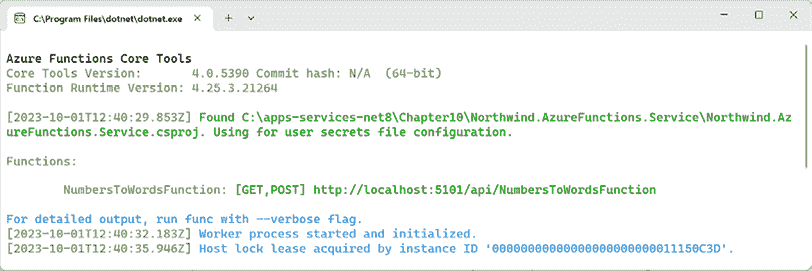
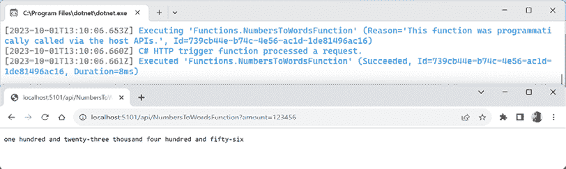
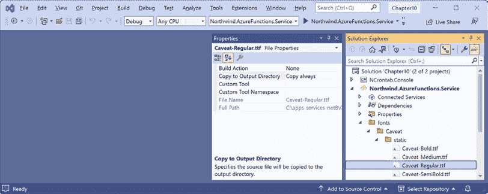
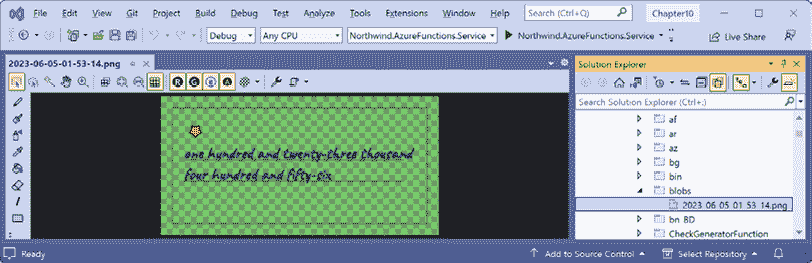
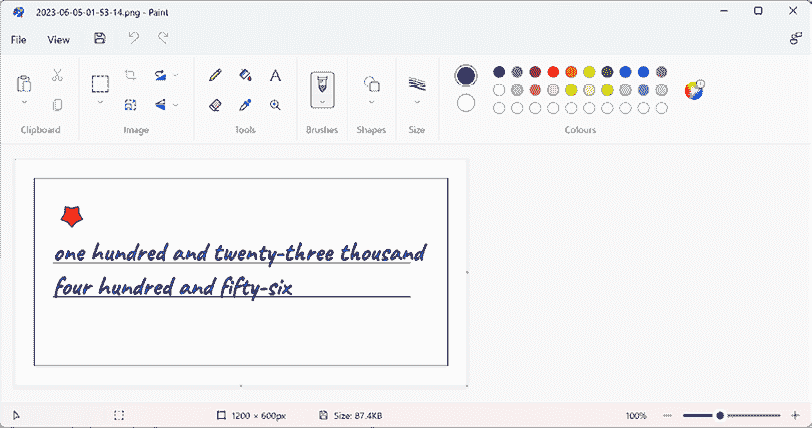
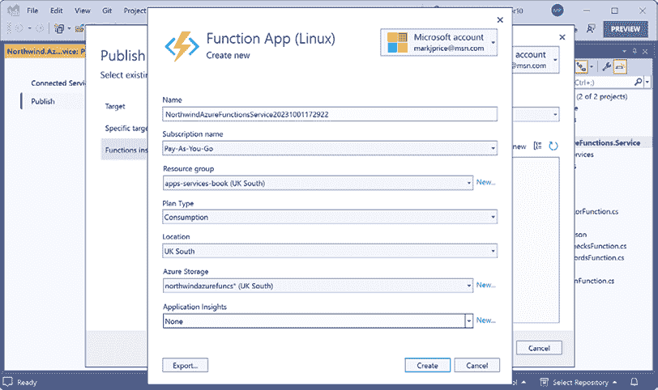
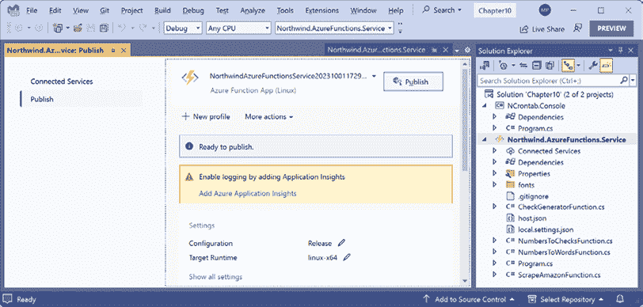
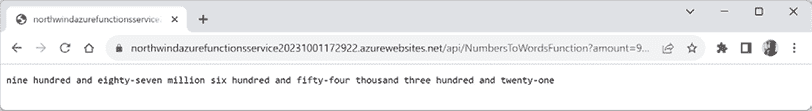

# 使用 Azure 函数构建无服务器纳米服务

在本章中，你将了解 Azure 函数，它可以配置为在执行时仅需要服务器端资源。它们在触发活动时执行，例如向队列发送消息或将文件上传到 Azure 存储时，或者在定期的时间间隔内。

本章将涵盖以下主题：

+   理解 Azure 函数

+   构建 Azure 函数项目

+   响应定时器和资源触发器

+   将 Azure 函数项目发布到云端

+   清理 Azure 函数资源

# 理解 Azure 函数

**Azure 函数**是一个事件驱动的无服务器计算平台。您可以在本地构建和调试，然后部署到微软 Azure 云。Azure 函数可以使用多种语言实现，而不仅仅是 C# 和 .NET。它支持 Visual Studio 2022 和 Visual Studio Code 的扩展，以及一个命令行工具。

但首先，你可能想知道，“没有服务器如何提供服务？”

*无服务器*字面上并不意味着没有服务器。无服务器真正意味着的是一个没有*永久运行服务器*的服务，通常这意味着大部分时间不运行或资源使用低，并在需要时动态扩展。这可以节省很多成本。

例如，组织通常有一些只需要每小时运行一次、每月运行一次或按需运行的业务功能。也许组织在月底打印支票（在英国称为 cheques）来支付员工的工资。这些支票可能需要将工资金额转换为文字以打印在支票上。可以将将数字转换为文字的功能实现为一个无服务器服务。

例如，使用内容管理系统，编辑器可能会上传新的图片，这些图片可能需要以各种方式处理，如生成缩略图和其他优化。这项工作可以添加到队列中，或者当文件上传到 Blob 存储时触发 Azure 函数。

Azure 函数可以远不止是一个单一的功能。它们支持复杂的状态化工作流和事件驱动的解决方案，使用**Durable Functions**。

我在这本书中不涉及 Durable Functions，如果您感兴趣，可以在此链接中了解更多关于使用 C# 和 .NET 实现它们的信息：[`learn.microsoft.com/en-us/azure/azure-functions/durable/durable-functions-overview?tabs=csharp`](https://learn.microsoft.com/en-us/azure/azure-functions/durable/durable-functions-overview?tabs=csharp)。

Azure 函数基于触发器和绑定的编程模型，使你的无服务器服务能够响应事件并连接到其他服务，如数据存储。

## Azure 函数触发器和绑定

**触发器**和**绑定**是 Azure 函数的关键概念。

触发器是导致函数执行的原因。每个函数必须有一个，且只有一个触发器。以下列出了最常见的触发器：

+   **HTTP**: 此触发器响应传入的 HTTP 请求，通常是 `GET` 或 `POST`。

+   **Azure SQL**: 此触发器在检测到 SQL 表上的更改时响应。

+   **Cosmos DB**: 此触发器使用 Cosmos DB 变更流来监听插入和更新。

+   **Timer**: 此触发器响应预定时间的到来。如果函数失败，则不会重试。直到下一次预定时间，函数不会被再次调用。

+   **SignalR**: 此触发器响应来自 Azure SignalR 服务的消息。

+   **队列**和**RabbitMQ**: 这些触发器响应队列中到达的消息，准备进行处理。

+   **Blob Storage**: 此触发器响应新的或更新的 **二进制大对象** (**Blob**)。

+   **Event Grid**和**Event Hub**: 这些触发器在预定义的事件发生时响应。

绑定允许函数有输入和输出。每个函数可以有零个、一个或多个绑定。以下列出了一些常见的绑定：

+   **Azure SQL**: 在 SQL Server 数据库中读取或写入表。

+   **Blob Storage**: 读取或写入存储为 BLOB 的任何文件。

+   **Cosmos DB**: 读取或写入云规模数据存储中的文档。

+   **SignalR**: 接收或执行远程方法调用。

+   **HTTP**: 发起 HTTP 请求并接收响应。

+   **队列**和**RabbitMQ**: 向队列写入消息或从队列读取消息。

+   **SendGrid**: 发送电子邮件消息。

+   **Twilio**: 发送短信消息。

+   **IoT hub**: 向互联网连接的设备写入。

你可以在以下链接中查看支持的触发器和绑定的完整列表：[`learn.microsoft.com/en-us/azure/azure-functions/functions-triggers-bindings?tabs=csharp#supported-bindings`](https://learn.microsoft.com/en-us/azure/azure-functions/functions-triggers-bindings?tabs=csharp#supported-bindings)。

触发器和绑定对于不同的语言配置方式不同。对于 C# 和 Java，你需要在方法和参数上使用属性进行装饰。对于其他语言，你需要配置一个名为 `function.json` 的文件。

## NCRONTAB 表达式

**Timer** 触发器使用 **NCRONTAB 表达式**来定义计时器的频率。默认时区是 **协调世界时** (**UTC**)。这可以被覆盖，但你真的应该使用 UTC，原因你已经在 *第七章*，*处理日期、时间和国际化* 中了解到了。

如果你是在 App Service 计划中托管，那么你可以使用 `TimeSpan` 作为替代，但我推荐学习 NCRONTAB 表达式以获得灵活性。

NCRONTAB 表达式由五个或六个部分组成（如果包含秒数）：

```cs
`* * * * * *`
`- - - - - -`
`| | | | | |`
`| | | | | +--- day of week (0 - 6) (Sunday=0)`
`| | | | +----- month (1 - 12)`
`| | | +------- day of month (1 - 31)`
`| | +--------- hour (0 - 23)`
`| +----------- min (0 - 59)`
`+------------- sec (0 - 59)` 
```

上面的值字段中的星号 `*` 表示该列的所有合法值，就像括号中的那样。你可以使用破折号指定范围，并使用 `/` 指定步长值。以下是一些如何以这种格式指定值的示例：

+   `0` 表示该值。例如，对于小时，表示午夜。

+   `0,6,12,18` 表示那些列出的值。例如，对于小时，表示午夜、上午 6 点、中午 12 点和下午 6 点。

+   `3-7` 表示该值的包含范围。例如，对于小时，表示上午 3 点、上午 4 点、上午 5 点、上午 6 点和上午 7 点。

+   `4/3` 表示起始值为 `4`，步长值为 `3`。例如，对于小时，表示上午 4 点、上午 7 点、上午 10 点、下午 1 点、下午 4 点、下午 7 点和晚上 10 点。

*表 10.1* 显示了一些更多示例：

| **表达式** | **描述** |
| --- | --- |
| `0 5 * * * *` | 每小时一次，在每小时的第 5 分钟。 |
| `0 0,10,30,40 * * * *` | 每小时四次 – 在每个小时的第 0 分钟、第 10 分钟、第 30 分钟和第 40 分钟。 |
| `* * */2 * * *` | 每 2 小时一次。 |
| `0,15 * * * * *` | 每分钟的第 0 秒和第 15 秒。 |
| `0/15 * * * * *` | 每分钟的第 0 秒、第 15 秒、第 30 秒和第 45 秒，也称为每 15 秒一次。 |
| `0-15 * * * * *` | 在每分钟的 0 秒、1 秒、2 秒、3 秒，等等，直到 15 秒之后，但不是每分钟的 16 秒到 59 秒。 |
| `0 30 9-16 * * *` | 每天八次 – 在上午 9:30、上午 10:30，等等，直到下午 4:30。 |
| `0 */5 * * * *` | 每小时 12 次 – 在每小时的第 5 分钟的每 0 秒。 |
| `0 0 */4 * * *` | 每天六次 – 在每天每 4 小时的第 0 分钟。 |
| `0 30 9 * * *` | 每天上午 9:30。 |
| `0 30 9 * * 1-5` | 每个工作日上午 9:30。 |
| `0 30 9 * * Mon-Fri` | 每个工作日上午 9:30。 |
| `0 30 9 * Jan Mon` | 1 月每周一上午 9:30。 |

表 10.1：NCRONTAB 表达式的示例

现在让我们构建一个简单的控制台应用程序来测试您对 NCRONTAB 表达式的理解：

1.  使用您首选的代码编辑器将名为 `NCrontab.Console` 的新控制台应用程序添加到 `Chapter10` 解决方案中。

1.  在 `NCrontab.Console` 项目中，将警告视为错误，全局和静态导入 `System.Console` 类，并为 `NCrontab.Signed` 添加包引用，如下面的标记所示：

    ```cs
    <ItemGroup>
      <PackageReference Include="NCrontab.Signed" Version="3.3.3" />
    </ItemGroup> 
    ```

    NCRONTAB 库仅用于解析表达式。它本身不是一个调度器。您可以在以下链接的 GitHub 仓库中了解更多信息：[`github.com/atifaziz/NCrontab`](https://github.com/atifaziz/NCrontab)。

1.  构建项目 `NCrontab.Console` 以恢复包。

1.  在 `Program.cs` 文件中，删除现有的语句。添加语句以定义 2023 年的日期范围，输出 NCRONTAB 语法的摘要，并构建一个 NCRONTAB 计划，然后使用它来输出 2023 年将发生的下一个 40 个事件，如下面的代码所示：

    ```cs
    using NCrontab; // To use CrontabSchedule and so on.
    DateTime start = new(year: 2023, month: 1, day: 1);
    DateTime end = start.AddYears(1);
    WriteLine($"Start at:   {start:ddd, dd MMM yyyy HH:mm:ss}");
    WriteLine($"End at:     {end:ddd, dd MMM yyyy HH:mm:ss}");
    WriteLine();
    string sec = "0,30";
    string min = "*";
    string hour = "*";
    string dayOfMonth = "*";
    string month = "*";
    string dayOfWeek = "*";
    string expression = string.Format(
      "{0,-3} {1,-3} {2,-3} {3,-3} {4,-3} {5,-3}",
      sec, min, hour, dayOfMonth, month, dayOfWeek);
    WriteLine($"Expression: {expression}");
    WriteLine(@"            \ / \ / \ / \ / \ / \ /");
    WriteLine($"             -   -   -   -   -   -");
    WriteLine($"             |   |   |   |   |   |");
    WriteLine($"             |   |   |   |   |   +--- day of week (0 - 6) (Sunday=0)");
    WriteLine($"             |   |   |   |   +------- month (1 - 12)");
    WriteLine($"             |   |   |   +----------- day of month (1 - 31)");
    WriteLine($"             |   |   +--------------- hour (0 - 23)");
    WriteLine($"             |   +------------------- min (0 - 59)");
    WriteLine($"             +----------------------- sec (0 - 59)");
    WriteLine();
    CrontabSchedule schedule = CrontabSchedule.Parse(expression, 
      new CrontabSchedule.ParseOptions { IncludingSeconds = true });
    IEnumerable<DateTime> occurrences = schedule.GetNextOccurrences(start, end);
    // Output the first 40 occurrences.
    foreach (DateTime occurrence in occurrences.Take(40))
    {
      WriteLine($"{occurrence:ddd, dd MMM yyyy HH:mm:ss}");
    } 
    ```

    注意以下内容：

    +   发生事件的默认潜在时间跨度是 2023 年全年。

    +   默认表达式是 `0,30 * * * * *`，意味着在每个月每个工作日每天每小时的每分钟的第 0 秒和第 30 秒。

    +   语法帮助的格式化假设每个组件将占用三个字符宽，因为用于输出格式的 `-3`。你可以编写一个更聪明的算法来动态调整箭头指向可变宽度的组件，但我很懒惰。我将把这个留给你作为练习。

    +   我们的表达式包括秒，因此在解析时必须将其设置为附加选项。

    +   定义计划后，计划调用其 `GetNextOccurrences` 方法以返回所有计算出的发生序列。

    +   循环只输出前 40 个发生次数。这应该足以理解大多数表达式的工作方式。

1.  不带调试启动控制台应用程序，并注意发生次数为每 30 秒一次，如下部分输出所示：

    ```cs
    Start at:   Sun, 01 Jan 2023 00:00:00
    End at:     Mon, 01 Jan 2024 00:00:00
    Expression: 0,30 *   *   *   *   *
                \ / \ / \ / \ / \ / \ /
                 -   -   -   -   -   -
                 |   |   |   |   |   |
                 |   |   |   |   |   +--- day of week (0 - 6) (Sunday=0)
                 |   |   |   |   +------- month (1 - 12)
                 |   |   |   +----------- day of month (1 - 31)
                 |   |   +--------------- hour (0 - 23)
                 |   +------------------- min (0 - 59)
                 +----------------------- sec (0 - 59)
    Sun, 01 Jan 2023 00:00:30
    Sun, 01 Jan 2023 00:01:00
    Sun, 01 Jan 2023 00:01:30
    ...
    Sun, 01 Jan 2023 00:19:30
    Sun, 01 Jan 2023 00:20:00 
    ```

    注意，尽管开始时间是 `Sun, 01 Jan 2023 00:00:00`，但该值不包括在发生次数中，因为它不是一个“下一个”发生。

1.  关闭控制台应用程序。

1.  在 `Program.cs` 中，修改表达式的组件以测试表中的某些示例，或者创建自己的示例。尝试表达式 `0 0 */4 * * *`，并注意它应该有如下部分输出：

    ```cs
    Start at:   Sun, 01 Jan 2023 00:00:00
    End at:     Mon, 01 Jan 2024 00:00:00
    Expression: 0   0   */4 *   *   *
                \ / \ / \ / \ / \ / \ /
                 -   -   -   -   -   -
                 |   |   |   |   |   |
                 |   |   |   |   |   +--- day of week (0 - 6) (Sunday=0)
                 |   |   |   |   +------- month (1 - 12)
                 |   |   |   +----------- day of month (1 - 31)
                 |   |   +--------------- hour (0 - 23)
                 |   +------------------- min (0 - 59)
                 +----------------------- sec (0 - 59)
    Sun, 01 Jan 2023 04:00:00
    Sun, 01 Jan 2023 08:00:00
    Sun, 01 Jan 2023 12:00:00
    Sun, 01 Jan 2023 16:00:00
    Sun, 01 Jan 2023 20:00:00
    Mon, 02 Jan 2023 00:00:00
    Mon, 02 Jan 2023 04:00:00
    Mon, 02 Jan 2023 08:00:00
    Mon, 02 Jan 2023 12:00:00
    Mon, 02 Jan 2023 16:00:00
    Mon, 02 Jan 2023 20:00:00
    Tue, 03 Jan 2023 00:00:00
    ...
    Sat, 07 Jan 2023 12:00:00
    Sat, 07 Jan 2023 16:00:00 
    ```

注意，尽管开始时间是 `Sun, 01 Jan 2023 00:00:00`，但该值不包括在发生次数中，因为它不是一个“下一个”发生。因此，星期日只有五个发生次数。从星期一开始，每天应有预期的六个发生次数。

## Azure Functions 版本和语言

运行时主机 Azure Functions 的版本 4 是唯一仍然普遍可用的版本。所有旧版本都已达到生命周期的终点。

**良好实践**：Microsoft 建议在所有语言中使用 v4。v1、v2 和 v3 处于维护模式，应避免使用。

Azure Functions v4 支持的语言和平台包括：

+   **C#** 和 **F#**：.NET 8, .NET 7, .NET 6, 和 .NET Framework 4.8。注意，.NET 6 和 .NET 7（以及未来的 .NET 9）仅支持在隔离工作模型中，因为它们是 **标准支持期**（**STS**）版本，或者，在 .NET 6 的情况下，它们是较旧的长期支持（**LTS**）版本。.NET 8 支持隔离和进程内工作模型，因为它是一个 **长期支持**（**LTS**）版本。

+   **JavaScript**：Node 14, 16, 和 18。TypeScript 通过转换（转换/编译）到 JavaScript 支持。

+   **Java** 8, 11, 和 17。

+   **PowerShell** 7.2。

+   **Python** 3.7, 3.8, 3.9, 和 3.10。

**更多信息**：您可以在以下链接中查看整个语言表：[`learn.microsoft.com/en-us/azure/azure-functions/functions-versions?tabs=v4&pivots=programming-language-csharp#languages`](https://learn.microsoft.com/en-us/azure/azure-functions/functions-versions?tabs=v4&pivots=programming-language-csharp#languages)。

在这本书中，我们将只查看使用 C# 和 .NET 8 实现 Azure Functions，这样我们就可以使用进程内和隔离工作模型并获得 LTS。

对于高级用途，您甚至可以注册一个自定义处理程序，这样您就可以使用您喜欢的任何语言来实现 Azure 函数。您可以在以下链接中了解更多关于 Azure Functions 自定义处理程序的信息：[`learn.microsoft.com/en-us/azure/azure-functions/functions-custom-handlers`](https://learn.microsoft.com/en-us/azure/azure-functions/functions-custom-handlers)。

## Azure Functions 工作模型

Azure Functions 有两种工作模型，进程内和隔离，如下列表所述：

+   **进程内**：您的函数在一个类库中实现，必须在与宿主相同的进程中运行，这意味着您的函数必须在 .NET 最新的 LTS 版本上运行。最新的 LTS 版本是 .NET 8。下一个 LTS 版本将在 2025 年 11 月的 .NET 10 中发布，但 .NET 8 将是支持进程内托管的最后一个版本。在 .NET 8 之后，将只支持所有版本的隔离工作模型。

+   **隔离型**：您的函数在一个控制台应用程序中实现，该应用程序在其自己的进程中运行。因此，您的函数可以在任何支持的 .NET 版本上执行，完全控制其 `Main` 入口点，并具有调用中间件等附加功能。从 .NET 9 开始，这将是唯一的工作模型。您可以在以下链接中了解更多关于此决定的信息：[`techcommunity.microsoft.com/t5/apps-on-azure-blog/net-on-azure-functions-august-2023-roadmap-update/ba-p/3910098`](https://techcommunity.microsoft.com/t5/apps-on-azure-blog/net-on-azure-functions-august-2023-roadmap-update/ba-p/3910098)。

**最佳实践**：新项目应使用隔离工作模型。

## Azure Functions 托管计划

在本地测试后，您必须将 Azure Functions 项目部署到 Azure 托管计划。您可以从以下列表中选择三种 Azure Functions 计划：

+   **消费型**：在此方案中，根据活动动态添加和删除托管实例。此方案与 *无服务器* 方案最为接近。在负载高峰期间自动扩展。成本仅针对运行时的计算资源。您可以配置函数执行时间的超时，以确保您的函数不会永远运行。

+   **高级**：此方案支持弹性上下文扩展，始终处于预热状态的实例以避免冷启动，无限制的执行时长，多核实例大小最多可达四个核心，成本可能更具可预测性，并为多个 Azure Functions 项目提供高密度应用分配。成本基于实例间分配的核心秒数和内存。必须始终分配至少一个实例，因此即使该月没有执行，也始终会有一个最低的每月成本。

+   **专用**：在云中的服务器农场等效环境中执行。托管由控制分配服务器资源的 Azure App Service 计划提供。Azure App Service 计划包括基本、标准、高级和隔离。如果你已经有一个用于其他项目（如 ASP.NET Core MVC 网站、gRPC、OData 和 GraphQL 服务等）的 App Service 计划，那么这个计划可能是一个特别好的选择。费用仅限于 App Service 计划。你可以在这个计划中托管尽可能多的 Azure Functions 和其他 Web 应用。

    **警告！**高级和专用计划都运行在 Azure App Service 计划上。你必须仔细选择与你的 Azure Functions 托管计划兼容的正确 App Service 计划。例如，对于高级计划，你应该选择一个弹性高级计划，如 `EP1`。如果你选择一个像 `P1V1` 这样的 App Service 计划，那么你选择的是一个不会弹性扩展的专用计划！

你可以在以下链接中了解更多关于你的选择：[`learn.microsoft.com/en-us/azure/azure-functions/functions-scale`](https://learn.microsoft.com/en-us/azure/azure-functions/functions-scale)。

## Azure 存储要求

Azure Functions 需要一个 Azure 存储账户来存储某些绑定和触发器的信息。这些 Azure 存储服务也可以由你的代码用于其实施：

+   **Azure 文件存储**：在消费或高级计划中存储和运行你的函数应用代码。

+   **Azure Blob 存储**：存储绑定和函数键的状态。

+   **Azure 队列存储**：某些触发器用于故障和重试处理。

+   **Azure 表存储**：Durable Functions 中的任务中心使用 Blob、队列和表存储。

## 使用 Azurite 本地测试

Azurite 是一个开源的本地环境，用于测试 Azure Functions 及其相关的 Blob、队列和表存储。Azurite 在 Windows、Linux 和 macOS 上都是跨平台的。Azurite 取代了旧的 Azure 存储模拟器。

要安装 Azurite：

+   对于 Visual Studio 2022，Azurite 已包含在内。

+   对于 Visual Studio Code，搜索并安装 Azurite 扩展。

+   对于 JetBrains Rider，安装 Azure Toolkit for Rider 插件，该插件包括 Azurite。

+   对于在命令提示符下的安装，你必须安装 Node.js 8 或更高版本，然后可以输入以下命令：

    ```cs
    npm install -g azurite 
    ```

一旦你在本地测试了 Azure 函数，你可以切换到云中的 Azure 存储账户。

你可以在以下链接中了解更多关于 Azurite 的信息：[`learn.microsoft.com/en-us/azure/storage/common/storage-use-azurite`](https://learn.microsoft.com/en-us/azure/storage/common/storage-use-azurite)。

## Azure Functions 授权级别

Azure Functions 有三个授权级别，用于控制是否需要 API 密钥：

+   **匿名**：不需要 API 密钥。

+   **函数**：需要函数级别的密钥。

+   **管理员**：需要主密钥。

API 密钥可通过 Azure 门户获取。

## Azure Functions 支持依赖注入

Azure Functions 中的依赖注入建立在标准的 .NET 依赖注入功能之上，但具体实现方式取决于你选择的工人模型。

要注册依赖服务，创建一个继承自 `FunctionsStartup` 类的类，并重写其 `Configure` 方法。添加 `[FunctionsStartup]` 程序集属性以指定注册的启动类名。将服务添加到传递给方法的 `IFunctionsHostBuilder` 实例中。你将在本章后面的任务中这样做。

通常，实现 Azure Functions 函数的类是 `static` 的，并且有一个 `static` 方法。`static` 类不使用构造函数进行实例化。依赖注入使用构造函数注入，这意味着你必须使用实例类来注入服务以及你的函数类实现。你将在编码任务中看到如何做到这一点。

## 安装 Azure Functions 核心工具

**Azure Functions 核心工具**提供了创建函数的核心运行时和模板，这使你能够在 Windows、macOS 和 Linux 上使用任何代码编辑器进行本地开发。

Azure Functions 核心工具包含在 Visual Studio 2022 的 **Azure 开发** 工作负载中，因此你可能已经安装了它。

你可以从以下链接安装最新版本的 **Azure Functions 核心工具**：

[`www.npmjs.com/package/azure-functions-core-tools`](https://www.npmjs.com/package/azure-functions-core-tools)

前一个链接中找到的页面提供了在 Windows 上使用 **Microsoft 软件安装程序 (MSI)** 和 `winget`、在 Mac 上使用 Homebrew、在任何操作系统上使用 `npm` 以及常见 Linux 发行版上安装的说明。

如果你使用 JetBrains Rider，那么通过 Rider 安装 Azure Functions 核心工具。

# 构建 Azure Functions 项目

现在，我们可以创建一个 Azure Functions 项目。虽然它们可以通过 Azure 门户在云端创建，但开发者最好先在本地创建和运行它们，以便获得更好的体验。一旦你在自己的电脑上测试了函数，你就可以将其部署到云端。

每个代码编辑器在开始 Azure Functions 项目时都有略微不同的体验，因此让我们逐一查看，从 Visual Studio 2022 开始。

## 使用 Visual Studio 2022

如果你更喜欢使用 Visual Studio 2022，以下是如何创建 Azure Functions 项目的步骤：

1.  在 Visual Studio 2022 中，创建一个新项目，如下列所示：

    +   项目模板：**Azure Functions**

    +   解决方案文件和文件夹：`Chapter10`

    +   项目文件和文件夹：`Northwind.AzureFunctions.Service`

    +   **函数工作者**：**.NET 8.0 Isolated (长期支持)**

    +   **函数**：**Http 触发器**

    +   **使用 Azurite 作为运行时存储账户 (AzureWebJobsStorage)**: 已选择

    +   **禁用** **Docker**：已清除

    +   **授权级别**：**匿名**

1.  点击 **创建**。

1.  配置解决方案的启动项目为当前选择。

## 使用 Visual Studio Code

如果您更喜欢使用 Visual Studio Code，以下是如何创建 Azure Functions 项目的步骤：

1.  在 Visual Studio Code 中，导航到 **扩展** 并搜索 Azure Functions (`ms-azuretools.vscode-azurefunctions`)。它依赖于两个其他扩展：Azure 账户 (`ms-vscode.azure-account`) 和 Azure 资源 (`ms-azuretools.vscode-azureresourcegroups`)，因此这些也将被安装。点击 **安装** 按钮来安装扩展。

1.  创建一个名为 `Northwind.AzureFunctions.Service` 的文件夹。（如果您之前使用 Visual Studio 2022 创建了相同的项目，那么请创建一个名为 `Chapter10-vscode` 的新文件夹，并将此新项目文件夹放在那里。）

1.  在 Visual Studio Code 中，打开 `Northwind.AzureFunctions.Service` 文件夹。

1.  导航到 **视图** | **命令面板**，输入 `azure f`，然后在 Azure Functions 命令列表中，点击 **Azure Functions：创建新项目…**。

1.  选择包含您的函数项目的 `Northwind.AzureFunctions.Service` 文件夹。

1.  在提示时，选择以下选项：

    +   选择语言：**C#**

    +   选择一个 .NET 运行时：**.NET 8 Isolated LTS**。

    +   选择项目第一个函数的模板：**HTTP trigger**。

    +   提供一个函数名称：`NumbersToWordsFunction`

    +   提供一个命名空间：`Northwind.AzureFunctions.Service`

    +   选择授权级别：**匿名**

1.  导航到 **终端** | **新建终端**。

1.  在命令提示符下，构建项目，如下所示：

    ```cs
    dotnet build 
    ```

## 使用 func CLI

如果您更喜欢使用命令行和一些其他代码编辑器，以下是如何创建和启动 Azure Functions 项目的步骤：

1.  创建一个名为 `Chapter10-cli` 的文件夹，并在其中创建一个名为 `Northwind.AzureFunctions.Service` 的子文件夹。

1.  在命令提示符或终端中，在 `Northwind.AzureFunctions.Service` 文件夹中，使用以下命令创建一个新的 Azure Functions 项目，使用 C#：

    ```cs
    func init --csharp 
    ```

1.  在命令提示符或终端中，在 `Northwind.AzureFunctions.Service` 文件夹中，使用以下命令创建一个新的 Azure Functions 函数，使用 `HTTP trigger` 可以匿名调用：

    ```cs
    func new --name NumbersToWordsFunction --template "HTTP trigger" --authlevel "anonymous" 
    ```

1.  可选地，您可以在本地启动函数，如下所示：

    ```cs
    func start 
    ```

如果您在命令提示符或终端中找不到 `func`，那么请尝试使用 Chocolatey 安装 Azure Functions Core Tools，如以下链接所述：[`community.chocolatey.org/packages/azure-functions-core-tools`](https://community.chocolatey.org/packages/azure-functions-core-tools)。

## 检查 Azure Functions 项目

在我们编写函数之前，让我们回顾一下构成 Azure Functions 项目的要素：

1.  打开项目文件，并注意 Azure Functions 版本和实现响应 HTTP 请求的 Azure 函数所需的包引用，如下所示：

    ```cs
    <Project Sdk="Microsoft.NET.Sdk">
      <PropertyGroup>
        <TargetFramework>net8.0</TargetFramework>
        <AzureFunctionsVersion>v4</AzureFunctionsVersion>
        <OutputType>Exe</OutputType>
        <ImplicitUsings>enable</ImplicitUsings>
        <Nullable>enable</Nullable>
      </PropertyGroup>
      <ItemGroup>
        <PackageReference Version="1.19.0" 
          Include="Microsoft.Azure.Functions.Worker" />
        <PackageReference Version="3.0.13" 
          Include="Microsoft.Azure.Functions.Worker.Extensions.Http" />
        <PackageReference Version="1.14.0"
          Include="Microsoft.Azure.Functions.Worker.Sdk" />
      </ItemGroup>
      <ItemGroup>
        <None Update="host.json">
          <CopyToOutputDirectory>PreserveNewest</CopyToOutputDirectory>
        </None>
        <None Update="local.settings.json">
          <CopyToOutputDirectory>PreserveNewest</CopyToOutputDirectory>
          <CopyToPublishDirectory>Never</CopyToPublishDirectory>
        </None>
      </ItemGroup>
      <ItemGroup>
        <Using Include="System.Threading.ExecutionContext" 
               Alias="ExecutionContext" />
      </ItemGroup>
    </Project> 
    ```

1.  在 `host.json` 中，请注意已启用将日志记录到 Application Insights，但排除了 `Request` 类型，如下所示：

    ```cs
    {
      "version": "2.0",
      "logging": {
        "applicationInsights": {
          "samplingSettings": {
            "isEnabled": true,
            "excludedTypes": "Request"
          },
          "enableLiveMetricsFilters": true
        }
      }
    } 
    ```

    Application Insights 是 Azure 的监控和日志服务。我们将在本章中不使用它。

1.  在`local.settings.json`中，确认在本地开发期间，你的项目将使用本地开发存储和隔离的工作模型，如下所示：

    ```cs
    {
      "IsEncrypted": false,
      "Values": {
        "AzureWebJobsStorage": "UseDevelopmentStorage=true",
        "FUNCTIONS_WORKER_RUNTIME": "dotnet-isolated"
      }
    } 
    ```

1.  如果`AzureWebJobsStorage`设置是空的或缺失的，这可能发生在你使用 Visual Studio Code 的情况下，那么添加它，将其设置为`UseDevelopmentStorage=true`，然后保存更改。

    `FUNCTIONS_WORKER_RUNTIME`是你项目使用的语言。`dotnet`表示.NET 类库；`dotnet-isolated`表示.NET 控制台应用程序。其他值包括`java`、`node`、`powershell`和`python`。

1.  在`Properties`文件夹中，在`launchSettings.json`中，注意为网络服务随机分配的端口号，如下面的配置所示：

    ```cs
    {
      "profiles": {
        "Northwind.AzureFunctions.Service": {
          "commandName": "Project",
          "commandLineArgs": "--port 7274",
          "launchBrowser": false
        }
      }
    } 
    ```

1.  将端口号更改为`5101`并将更改保存到文件中。

## 实现一个简单的函数

让我们使用`Humanizer`包实现将数字转换为文字的函数：

1.  在项目文件中，添加对 Humanizer 的包引用，如下所示：

    ```cs
    <PackageReference Include="Humanizer" Version="2.14.1" /> 
    ```

1.  构建项目以恢复包。

    如果你使用 Visual Studio 2022，在`Northwind.AzureFunctions.Service`项目中，右键单击`Function1.cs`并将其重命名为`NumbersToWordsFunction.cs`。

1.  在`NumbersToWordsFunction.cs`中，修改内容以实现将金额作为数字转换为文字的 Azure 函数，如下面的代码所示：

    ```cs
    using Humanizer; // To use ToWords extension method.
    using Microsoft.Azure.Functions.Worker; // To use [HttpTrigger].
    using Microsoft.Azure.Functions.Worker.Http; // To use HttpResponseData.
    using Microsoft.Extensions.Logging; // To use ILogger.
    namespace Northwind.AzureFunctions.Service;
    public class NumbersToWordsFunction
    {
      private readonly ILogger _logger;
      public NumbersToWordsFunction(ILoggerFactory loggerFactory)
      {
        _logger = loggerFactory.CreateLogger<NumbersToWordsFunction>();
      }
      [Function(nameof(NumbersToWordsFunction))]
      public HttpResponseData Run(
        [HttpTrigger(AuthorizationLevel.Anonymous, 
          "get", "post", Route = null)] HttpRequestData req)
      {
        _logger.LogInformation("C# HTTP trigger function processed a request.");
        string? amount = req.Query["amount"];
        HttpResponseData response;
        if (long.TryParse(amount, out long number))
        {
          response = req.CreateResponse(System.Net.HttpStatusCode.OK);
          response.WriteString(number.ToWords());
        }
        else
        {
          response = req.CreateResponse(System.Net.HttpStatusCode.BadRequest);
          response.WriteString($"Failed to parse: {amount}");
        }
        return response;
      }
    } 
    ```

## 测试一个简单的函数

现在我们可以在我们本地开发环境中测试这个函数：

1.  启动`Northwind.AzureFunctions.Service`项目：

    +   如果你使用 Visual Studio Code，你需要导航到**运行和调试**面板，确保**附加到.NET 函数**被选中，然后点击**运行**按钮。

    +   在 Windows 上，如果你看到来自**Windows Defender 防火墙**的**Windows 安全警报**，那么点击**允许访问**。

1.  注意**Azure Functions Core Tools**托管你的函数，如下面的输出和*图 10.1*所示：

    ```cs
    Azure Functions Core Tools
    Core Tools Version:       4.0.5390 Commit hash: N/A  (64-bit)
    Function Runtime Version: 4.25.3.21264
    [2023-10-01T11:42:05.319Z] Found C:\apps-services-net8\Chapter10\Northwind.AzureFunctions.Service\Northwind.AzureFunctions.Service.csproj. Using for user secrets file configuration.
    Functions:
            NumbersToWordsFunction: [GET,POST] http://localhost:5101/api/NumbersToWordsFunction
    For detailed output, run func with --verbose flag.
    [2023-06-05T11:42:14.265Z] Host lock lease acquired by instance ID '00000000000000000000000011150C3D'. 
    ```

    

    图 10.1：Azure Functions Core Tools 托管一个函数

    `Host` `lock` `lease`消息可能需要几分钟才能出现，所以如果它没有立即显示，请不要担心。

1.  选择你的函数的 URL 并将其复制到剪贴板。

1.  启动 Chrome。

1.  将 URL 粘贴到地址框中，追加查询字符串`?amount=123456`，并在浏览器的**十二万三千四百五十六**中注意成功的响应，如图*图 10.2*所示：



图 10.2：对本地运行的 Azure 函数的成功调用

1.  在命令提示符或终端中，注意函数调用成功，如下面的输出所示：

    ```cs
    [2023-101-01T11:32:51.574Z] Executing 'NumbersToWordsFunction' (Reason='This function was programmatically called via the host APIs.', Id=234d3122-ff3d-4896-94b3-db3c8b5013d8)
    [2023-10-01T11:32:51.603Z] C# HTTP trigger function processed a request.
    [2023-10-01T11:32:51.629Z] Executed 'NumbersToWordsFunction' (Succeeded, Id=234d3122-ff3d-4896-94b3-db3c8b5013d8, Duration=96ms) 
    ```

1.  尝试调用函数时在查询字符串中不包含金额，或者金额为非整数值，如`apples`，并注意函数返回一个`400`状态码，表示有自定义消息的无效请求，`Failed to parse: apples`。

1.  关闭 Chrome 并关闭 Web 服务器（或在 Visual Studio Code 中停止调试）。

# 响应定时器和资源触发

现在你已经看到了一个响应 HTTP 请求的 Azure Functions 函数，让我们构建一些响应其他类型触发器的函数。

内置了对 HTTP 和定时器触发的支持。其他绑定的支持作为扩展包实现。

## 实现定时器触发的函数

首先，我们将创建一个每小时运行一次的函数，请求[amazon.com](https://www.amazon.com/)上我书籍第八版（*C# 12 和.NET 8 – 现代跨平台开发基础*）的页面，以便我可以跟踪其在美国的最佳卖家排名。

函数需要执行 HTTP `GET`请求，因此我们应该注入 HTTP 客户端工厂。为此，我们需要添加一些额外的包引用并创建一个特殊的启动类：

1.  在`Northwind.AzureFunctions.Service`项目中，添加用于处理 Azure Functions 扩展和计时器的包引用，如下面的标记所示：

    ```cs
    <PackageReference Include="Microsoft.Azure.Functions.Extensions" 
                      Version="1.1.0" />
    <PackageReference Version="4.2.0" 
      Include="Microsoft.Azure.Functions.Worker.Extensions.Timer" /> 
    ```

1.  构建项目`Northwind.AzureFunctions.Service`以恢复包。

1.  在`Program.cs`中，导入用于处理依赖注入和 HTTP 媒体头的命名空间，如下面的代码所示：

    ```cs
    using Microsoft.Extensions.DependencyInjection; // To use AddHttpClient().
    using System.Net.Http.Headers; // To use MediaTypeWithQualityHeaderValue. 
    ```

1.  在`Program.cs`中添加语句以配置一个 HTTP 客户端工厂，用于向亚马逊发送请求，就像它是 Chrome 浏览器作为依赖服务一样，如下面的高亮代码所示：

    ```cs
    var host = new HostBuilder()
      .ConfigureFunctionsWorkerDefaults()
     **.ConfigureServices(services =>**
     **{** 
     **services.AddHttpClient(name:** **"Amazon"****,** 
     **configureClient: options =>**
     **{**
     **options.BaseAddress =** **new** **Uri(****"https://www.amazon.com"****);**
    **// Pretend to be Chrome with US English.**
     **options.DefaultRequestHeaders.Accept.Add(**
    **new** **MediaTypeWithQualityHeaderValue(****"****text/html"****));**
     **options.DefaultRequestHeaders.Accept.Add(**
    **new** **MediaTypeWithQualityHeaderValue(****"application/xhtml+xml"****));**
     **options.DefaultRequestHeaders.Accept.Add(**
    **new** **MediaTypeWithQualityHeaderValue(****"application/xml"****,** **0.9****));**
     **options.DefaultRequestHeaders.Accept.Add(**
    **new** **MediaTypeWithQualityHeaderValue(****"image/avif"****));**
     **options.DefaultRequestHeaders.Accept.Add(**
    **new** **MediaTypeWithQualityHeaderValue(****"image/webp"****));**
     **options.DefaultRequestHeaders.Accept.Add(**
    **new** **MediaTypeWithQualityHeaderValue(****"image/apng"****));**
     **options.DefaultRequestHeaders.Accept.Add(**
    **new** **MediaTypeWithQualityHeaderValue(****"*/*"****,** **0.8****));**

     **options.DefaultRequestHeaders.AcceptLanguage.Add(**
    **new** **StringWithQualityHeaderValue(****"en-US"****));**
     **options.DefaultRequestHeaders.AcceptLanguage.Add(**
    **new** **StringWithQualityHeaderValue(****"en"****,****0.8****));**
     **options.DefaultRequestHeaders.UserAgent.Add(**
    **new****(productName:** **"Chrome"****, productVersion:** **"114.0.5735.91"****));**
     **});**
     **})**
      .Build();
    host.Run(); 
    ```

    2023 年 6 月 5 日的 Chrome 版本是`114.0.5735.91`。主要版本号通常每月递增，因此到 2023 年 11 月，它可能为`119`，到 2024 年 11 月，它可能为`131`。

1.  添加一个名为`ScrapeAmazonFunction.cs`的类文件。

1.  修改其内容以实现一个函数，该函数请求亚马逊网站上我第七版书的页面，并处理使用 GZIP 压缩的响应，以提取书籍的最佳卖家排名，如下面的代码所示：

    ```cs
    using Microsoft.Azure.Functions.Worker; // To use [Function].
    using Microsoft.Extensions.Logging; // To use ILogger.
    using System.IO.Compression; // To use GZipStream, CompressionMode.
    namespace Northwind.AzureFunctions.Service;
    public class ScrapeAmazonFunction
    {
      private const string relativePath = 
        "12-NET-Cross-Platform-Development-Fundamentals/dp/1837635870/";
      private readonly IHttpClientFactory _clientFactory;
      private readonly ILogger _logger;
      public ScrapeAmazonFunction(IHttpClientFactory clientFactory,
        ILoggerFactory loggerFactory)
      {
        _clientFactory = clientFactory;
        _logger = loggerFactory.CreateLogger<ScrapeAmazonFunction>();
      }
      [Function(nameof(ScrapeAmazonFunction))]
      public async Task Run( // Every hour.
        [TimerTrigger("0 0 * * * *")] TimerInfo timer)
      {
        _logger.LogInformation($"C# Timer trigger function executed at {
          DateTime.UtcNow}.");
        _logger.LogInformation(
          $"C# Timer trigger function next three occurrences at: {
            timer.ScheduleStatus?.Next}.");
        HttpClient client = _clientFactory.CreateClient("Amazon");
        HttpResponseMessage response = await client.GetAsync(relativePath);
        _logger.LogInformation(
          $"Request: GET {client.BaseAddress}{relativePath}");
        if (response.IsSuccessStatusCode)
        {
          _logger.LogInformation("Successful HTTP request.");
          // Read the content from a GZIP stream into a string.
          Stream stream = await response.Content.ReadAsStreamAsync();
          GZipStream gzipStream = new(stream, CompressionMode.Decompress);
          StreamReader reader = new(gzipStream);
          string page = reader.ReadToEnd();
          // Extract the Best Sellers Rank.
          int posBsr = page.IndexOf("Best Sellers Rank");
          string bsrSection = page.Substring(posBsr, 45);
          // bsrSection will be something like:
          //   "Best Sellers Rank: </span> #22,258 in Books ("
          // Get the position of the # and the following space.
          int posHash = bsrSection.IndexOf("#") + 1;
          int posSpaceAfterHash = bsrSection.IndexOf(" ", posHash);
          // Get the BSR number as text.
          string bsr = bsrSection.Substring(
            posHash, posSpaceAfterHash - posHash);
          bsr = bsr.Replace(",", null); // remove commas
          // Parse the text into a number.
          if (int.TryParse(bsr, out int bestSellersRank))
          {
            _logger.LogInformation(
              $"Best Sellers Rank #{bestSellersRank:N0}.");
          }
          else
          {
            _logger.LogError(
              $"Failed to extract BSR number from: {bsrSection}.");
          }
        }
        else
        {
          _logger.LogError("Bad HTTP request.");
        }
      }
    } 
    ```

## 测试定时器触发的函数

可以通过以下格式的 HTTP `GET`请求检索函数信息：

`http://locahost:5101/admin/functions/<functionname>`

现在我们可以测试本地开发环境中的定时器函数：

1.  启动`Northwind.AzureFunctions.Service`项目：

    +   如果你使用 Visual Studio Code，你需要确保已安装 Azurite 扩展并且 Azurite 服务正在运行。导航到**运行和调试**面板，确保已选择**附加到.NET Functions**，然后点击**运行**按钮。

1.  注意现在有两个函数，如下面的部分输出所示：

    ```cs
    Functions:
            NumbersToWordsFunction: [GET,POST] http://localhost:5101api/NumbersToWordsFunction
            ScrapeAmazonFunction: timerTrigger
    For detailed output, run func with --verbose flag. 
    ```

1.  在`HttpRequests`文件夹中，添加一个名为`azurefunctions-scrapeamazon.http`的新文件。

1.  修改其内容以定义一个全局变量和两个请求到本地托管的 Azure Functions 服务，如下代码所示：

    ```cs
    ### Configure a variable for the Azure Functions service base address.
    @base_address = http://localhost:5101/
    ### Get information about the NumbersToWordsFunction function.
    {{base_address}}admin/functions/NumbersToWordsFunction
    ### Get information about the ScrapeAmazonFunction function.
    {{base_address}}admin/functions/ScrapeAmazonFunction 
    ```

1.  发送第一个请求并注意返回了一个包含`NumbersToWordsFunction`函数信息的 JSON 文档，如下所示：

    ```cs
    HTTP/1.1 200 OK
    Content-Length: 918
    Connection: close
    Content-Type: application/json; charset=utf-8
    Date: Mon, 05 Jun 2023 13:32:11 GMT
    Server: Kestrel
    {
      "name": "NumbersToWordsFunction",
      "script_root_path_href": null,
      "script_href": "http://localhost:5101/admin/vfs/bin/Northwind.AzureFunctions.Service.dll",
      "config_href": null,
      "test_data_href": null,
      "href": "http://localhost:5101/admin/functions/NumbersToWordsFunction",
      "invoke_url_template": "http://localhost:5101/api/numberstowordsfunction",
      "language": "dotnet-isolated",
      "config": {
        "name": "NumbersToWordsFunction",
        "entryPoint": "Northwind.AzureFunctions.Service.NumbersToWordsFunction.Run",
        "scriptFile": "Northwind.AzureFunctions.Service.dll",
        "language": "dotnet-isolated",
        "functionDirectory": null,
        "bindings": [
          {
            "name": "req",
            "direction": "In",
            "type": "httpTrigger",
            "authLevel": "Anonymous",
            "methods": [
              "get",
              "post"
            ],
            "properties": {}
          },
          {
            "name": "$return",
            "type": "http",
            "direction": "Out"
          }
        ]
      },
      "files": null,
      "test_data": null,
      "isDisabled": false,
      "isDirect": true,
      "isProxy": false
    } 
    ```

1.  发送第二个请求并注意返回了一个包含`ScrapeAmazonFunction`函数信息的 JSON 文档。对于这个函数，最有趣的信息是绑定类型和计划，如下部分响应所示：

    ```cs
    "bindings": [
      {
        "name": "timer",
        "direction": "In",
        "type": "timerTrigger",
        "schedule": "0 0 * * * *",
        "properties": {}
      }
    ], 
    ```

1.  添加一个第三个请求，通过发送一个包含空 JSON 文档的`POST`请求到其`admin`端点，手动触发计时器函数，而无需等待小时标记，如下代码所示：

    ```cs
    ### Make a manual request to the Timer function.
    POST {{base_address}}admin/functions/ScrapeAmazonFunction
    Content-Type: application/json
    {} 
    ```

1.  发送第三个请求并注意它被成功接受，如下所示：

    ```cs
    HTTP/1.1 202 Accepted 
    ```

1.  在请求体中移除`{}`，再次发送，并注意从客户端错误响应中我们可以推断出需要一个空 JSON 文档，如下响应所示：

    ```cs
    HTTP/1.1 400 Bad Request 
    ```

1.  将空 JSON 文档添加回去。

1.  在 Azure Functions 服务的命令提示符或终端中，注意函数是由我们的调用触发的。它输出了触发时间（下午 1:49）和其正常计时计划中的下一次发生时间（如果服务继续运行，时间为下午 2 点），如下所示：

    ```cs
    [2023-10-01T13:49:53.939Z] Executing 'Functions.ScrapeAmazonFunction' (Reason='This function was programmatically called via the host APIs.', Id=1df349a1-79c5-4b52-a7f1-d0f8f0d5cd9c)
    [2023-10-01T13:49:54.095Z] C# Timer trigger function executed at 01/10/2023 13:49:54.
    [2023-10-01T13:49:54.095Z] C# Timer trigger function next occurrence at: 01/10/2023 14:00:00.
    [2023-10-01T13:49:54.105Z] Start processing HTTP request GET https://www.amazon.com/12-NET-Cross-Platform-Development-Fundamentals/dp/1837635870/
    [2023-10-01T13:49:54.106Z] Sending HTTP request GET https://www.amazon.com/12-NET-Cross-Platform-Development-Fundamentals/dp/1837635870/
    [2023-10-01T13:49:54.520Z] Received HTTP response after 407.4353ms - OK
    [2023-10-01T13:49:54.521Z] End processing HTTP request after 420.1273ms - OK
    [2023-10-01T13:49:56.212Z] Successful HTTP request.
    [2023-10-01T13:49:56.212Z] Request: GET https://www.amazon.com/12-NET-Cross-Platform-Development-Fundamentals/dp/1837635870/
    [2023-10-01T13:49:56.251Z] Best Sellers Rank #384,269.
    [2023-10-01T13:49:56.275Z] Executed 'Functions.ScrapeAmazonFunction' (Succeeded, Id=1df349a1-79c5-4b52-a7f1-d0f8f0d5cd9c, Duration=2362ms) 
    ```

1.  可选地，等待直到小时标记，并注意下一次触发，如下所示：

    ```cs
    [2023-10-01T14:00:00.023Z] Executing 'Functions.ScrapeAmazonFunction' (Reason='Timer fired at 2023-10-01T15:00:00.0220351+01:00', Id=aa9f7495-6066-4b0a-ba81-42582d677321)
    [2023-10-01T14:00:00.027Z] C# Timer trigger function executed at 01/10/2023 14:00:00.
    [2023-10-01T14:00:00.028Z] Start processing HTTP request GET https://www.amazon.com/12-NET-Cross-Platform-Development-Fundamentals/dp/1837635870/
    [2023-10-01T14:00:00.027Z] C# Timer trigger function next occurrence at: 01/10/2023 15:00:00.
    [2023-10-01T14:00:00.028Z] Sending HTTP request GET https://www.amazon.com/12-NET-Cross-Platform-Development-Fundamentals/dp/1837635870/
    [2023-10-01T14:00:00.337Z] Received HTTP response after 305.1877ms - OK
    [2023-10-01T14:00:00.339Z] End processing HTTP request after 305.5222ms - OK
    [2023-10-01T14:00:01.899Z] Successful HTTP request.
    [2023-10-01T14:00:01.899Z] Request: GET https://www.amazon.com/12-NET-Cross-Platform-Development-Fundamentals/dp/1837635870/
    [2023-10-01T14:00:01.931Z] Best Sellers Rank #387,339.
    [2023-10-01T14:00:01.931Z] Executed 'Functions.ScrapeAmazonFunction' (Succeeded, Id=aa9f7495-6066-4b0a-ba81-42582d677321, Duration=1909ms) 
    ```

1.  如果我停止运行服务，等待超过一小时，然后启动服务，它将立即运行函数，因为已经过期，如下所示（高亮显示）：

    ```cs
    [2023-10-01T16:19:31.369Z] Trigger Details: UnscheduledInvocationReason: IsPastDue, OriginalSchedule: 2023-10-01T15:00:00.0000000+01:00 
    ```

1.  关闭 Azure Functions 服务。

## 实现与队列和 Blob 一起工作的函数

HTTP 触发的函数直接以纯文本形式响应了`GET`请求。我们现在将定义一个类似的功能，将其绑定到队列存储，并向队列中添加一条消息，表示需要生成并上传到 Blob 存储的图像。然后可以将其打印出来作为检查。

当在本地运行服务时，我们希望在本地文件系统中生成支票 BLOB 的图像，以便更容易确保其正确工作。我们将在本地设置中设置一个自定义环境变量来检测该条件。

我们需要一个看起来像手写的字体。谷歌有一个有用的网站，你可以在这里搜索、预览和下载字体。我们将使用的是 Caveat 字体，如下链接所示：

[`fonts.google.com/specimen/Caveat?category=Handwriting&preview.text=one%20hundred%20and%20twenty%20three%20thousand,%20four%20hundred%20and%20fifty%20six&preview.text_type=custom#standard-styles`](https://fonts.google.com/specimen/Caveat?category=Handwriting&preview.text=one%20hundred%20and%20twenty%20three%20thousand,%20four%20hundred%20and%20fifty%20six&preview.text_type=custom#standard-styles)

让我们开始：

1.  从上面的链接下载字体，解压 ZIP 文件，并将文件复制到名为 `fonts` 的文件夹中，如图 10.3 所示的 Visual Studio 2022：



图 10.3：Visual Studio 2022 中带有 Caveat 字体文件的字体文件夹

1.  选择 `Caveat-Regular.ttf` 字体文件。

1.  在 **属性** 中，将 **复制到输出目录** 设置为 **始终复制**，如图 10.3 所示。这将在项目文件中添加一个条目，如下所示高亮显示的标记：

    ```cs
    <ItemGroup>
     **<None Update=****"fonts\Caveat\static\Caveat-Regular.ttf"****>**
     **<CopyToOutputDirectory>Always</CopyToOutputDirectory>**
     **</None>**
      <None Update="host.json">
        <CopyToOutputDirectory>PreserveNewest</CopyToOutputDirectory>
      </None>
      <None Update="local.settings.json">
        <CopyToOutputDirectory>PreserveNewest</CopyToOutputDirectory>
        <CopyToPublishDirectory>Never</CopyToPublishDirectory>
      </None>
    </ItemGroup> 
    ```

    如果你使用的是 Visual Studio Code，请手动将前面的条目添加到项目文件中。

1.  在 `Northwind.AzureFunctions.Service` 项目中，添加用于处理 Azure 队列和 Blob 存储扩展以及使用 `ImageSharp` 绘图的包引用，如下所示标记：

    ```cs
    <PackageReference Version="5.2.0" Include=
      "Microsoft.Azure.Functions.Worker.Extensions.Storage.Queues" />
    <PackageReference Version="6.2.0" Include=
      "Microsoft.Azure.Functions.Worker.Extensions.Storage.Blobs" />
    <PackageReference Include="SixLabors.ImageSharp" Version="3.0.2" />
    <PackageReference Include="SixLabors.ImageSharp.Drawing" 
                      Version="2.0.0" /> 
    ```

1.  构建项目以还原包。

1.  在 `Northwind.AzureFunctions.Service` 项目中，添加一个名为 `NumbersToChecksFunction.cs` 的新类。

1.  在 `NumbersToChecksFunction.cs` 中添加语句以将函数与用于队列存储的输出绑定注册，以便它可以写入命名队列，并且当金额成功解析后返回到队列，如下所示代码：

    ```cs
    using Humanizer; // To use ToWords extension method.
    using Microsoft.Azure.Functions.Worker; // To use [Function] and so on.
    using Microsoft.Azure.Functions.Worker.Http; // To use HttpRequestData.
    using Microsoft.Extensions.Logging; // To use ILogger.
    namespace Northwind.AzureFunctions.Service;
    public class NumbersToChecksFunction
    {
      private readonly ILogger _logger;
      public NumbersToChecksFunction(ILoggerFactory loggerFactory)
      {
        _logger = loggerFactory.CreateLogger<NumbersToChecksFunction>();
      }
      [Function(nameof(NumbersToChecksFunction))]
      [QueueOutput("checksQueue")] // Return value is written to this queue.
      public string Run(
        [HttpTrigger(AuthorizationLevel.Anonymous,
          "get", "post", Route = null)] HttpRequestData request)
      {
        _logger.LogInformation("C# HTTP trigger function processed a request.");
        string? amount = request.Query["amount"];
        if (long.TryParse(amount, out long number))
        {
          return number.ToWords();
        }
        else
        {
          return $"Failed to parse: {amount}";
        }
      }
    } 
    ```

1.  在 `local.settings.json` 中，添加一个名为 `IS_LOCAL` 的环境变量，其值为 `true`，如图所示高亮显示的配置：

    ```cs
    {
      "IsEncrypted": false,
      "Values": {
        "AzureWebJobsStorage": "UseDevelopmentStorage=true",
        "FUNCTIONS_WORKER_RUNTIME": "dotnet-isolated"**,**
    **"IS_LOCAL"****:****true**
      }
    } 
    ```

1.  添加一个名为 `CheckGeneratorFunction.cs` 的类文件。

1.  修改其内容，如下所示代码：

    ```cs
    using Microsoft.Azure.Functions.Worker; // To use [Function] and so on.
    using Microsoft.Extensions.Logging; // To use ILogger.
    using SixLabors.Fonts; // To use Font.
    using SixLabors.ImageSharp.Drawing; // To use IPath.
    using SixLabors.ImageSharp.Drawing.Processing; // To use Brush, Pen.
    namespace Northwind.AzureFunctions.Service;
    public class CheckGeneratorFunction
    {
      private readonly ILogger _logger;
      public CheckGeneratorFunction(ILoggerFactory loggerFactory)
      {
        _logger = loggerFactory.CreateLogger<NumbersToWordsFunction>();
      }
      [Function(nameof(CheckGeneratorFunction))]
      [BlobOutput("checks-blob-container/check.png")]
      public byte[] Run(
        [QueueTrigger("checksQueue")] string message)
      {
        _logger.LogInformation("C# Queue trigger function executed.");
        _logger.LogInformation($"Body: {message}.");
        // Create a new blank image with a white background.
        using (Image<Rgba32> image = new(width: 1200, height: 600,
          backgroundColor: new Rgba32(r: 255, g: 255, b: 255, a: 100)))
        {
          // Load the font file and create a large font.
          FontCollection collection = new();
          FontFamily family = collection.Add(
            @"fonts\Caveat\static\Caveat-Regular.ttf");
          Font font = family.CreateFont(72);
          string amount = message.Body.ToString();
          DrawingOptions options = new()
          {
            GraphicsOptions = new()
            {
              ColorBlendingMode = PixelColorBlendingMode.Multiply
            }
          };
          // Define some pens and brushes.
          Pen blackPen = Pens.Solid(Color.Black, 2);
          Pen blackThickPen = Pens.Solid(Color.Black, 8);
          Pen greenPen = Pens.Solid(Color.Green, 3);
          Brush redBrush = Brushes.Solid(Color.Red);
          Brush blueBrush = Brushes.Solid(Color.Blue);
          // Define some paths and draw them.
          IPath border = new RectangularPolygon(
            x: 50, y: 50, width: 1100, height: 500);
          image.Mutate(x => x.Draw(options, blackPen, border));
          IPath star = new Star(x: 150.0f, y: 150.0f, 
            prongs: 5, innerRadii: 20.0f, outerRadii: 30.0f);
          image.Mutate(x => x.Fill(options, redBrush, star)
                             .Draw(options, greenPen, star));
          IPath line1 = new Polygon(new LinearLineSegment(
            new PointF(x: 100, y: 275), new PointF(x: 1050, y: 275)));

          image.Mutate(x => x.Draw(options, blackPen, line1));
          IPath line2 = new Polygon(new LinearLineSegment(
            new PointF(x: 100, y: 365), new PointF(x: 1050, y: 365)));
          image.Mutate(x => x.Draw(options, blackPen, line2));
          RichTextOptions textOptions = new(font)
          {
            Origin = new PointF(100, 200),
            WrappingLength = 1000,
            HorizontalAlignment = HorizontalAlignment.Left
          };
          image.Mutate(x => x.DrawText(
            textOptions, amount, blueBrush, blackPen));
          string blobName = $"{DateTime.UtcNow:yyyy-MM-dd-hh-mm-ss}.png";
          _logger.LogInformation($"Blob filename: {blobName}.");
          try
          {
            if (Environment.GetEnvironmentVariable("IS_LOCAL") == "true")
            {
              // Create blob in the local filesystem.
              string folder = $@"{System.Environment.CurrentDirectory}\blobs";
              if (!Directory.Exists(folder))
              {
                Directory.CreateDirectory(folder);
              }
              log.LogInformation($"Blobs folder: {folder}");
              string blobPath = $@"{folder}\{blobName}";
              image.SaveAsPng(blobPath);
            }
            // Create BLOB in Blob Storage via a memory stream.
            MemoryStream stream = new();
            image.SaveAsPng(stream);
            stream.Seek(0, SeekOrigin.Begin);
            return stream.ToArray();
          }
          catch (System.Exception ex)
          {
            log.LogError(ex.Message);
          }
          return Array.Empty<byte>();
        }
      }
    } 
    ```

注意以下事项：

+   `[QueueTrigger("checksQueue")] string message` 参数表示函数由添加到 `checksQueue` 的消息触发，并且队列项自动传递给名为 `message` 的参数。

+   我们使用 ImageSharp 创建一个 1200x600 的支票图像。

+   我们使用当前的 UTC 日期和时间来命名 BLOB 以避免重复。在实际实现中，你可能需要更健壮的机制，如 GUID。

+   如果将 `IS_LOCAL` 环境变量设置为 `true`，则我们将图像作为 PNG 格式保存到本地文件系统的 `blobs` 子文件夹中。

+   我们将图像保存为 PNG 格式到内存流中，然后作为字节数组返回并上传到由 `[BlobOutput("checks-blob-container/check.png")]` 属性定义的 BLOB 容器。

## 测试与队列和 BLOB 一起工作的函数

现在我们可以测试在本地开发环境中与队列和 BLOB 一起工作的函数：

1.  启动 `Northwind.AzureFunctions.Service` 项目：

    如果你使用的是 Visual Studio Code，你需要导航到 **运行和调试** 面板，确保已选择 **附加到 .NET Functions**，然后点击 **运行** 按钮。

1.  注意现在有四个函数，如下所示部分输出：

    ```cs
    Functions:
            NumbersToChecksFunction: [GET,POST] http://localhost:5101/api/NumbersToChecksFunction
            NumbersToWordsFunction: [GET,POST] http://localhost:5101/api/NumbersToWordsFunction
            CheckGeneratorFunction: queueTrigger
            ScrapeAmazonFunction: timerTrigger 
    ```

1.  在 `HttpRequests` 文件夹中，添加一个名为 `azurefunctions-numberstochecks.http` 的新文件。

1.  修改其内容，如下所示代码：

    ```cs
    ### Configure a variable for the Azure Functions base address.
    @base_address = http://localhost:5101/
    ### Trigger the NumbersToChecksFunction function.
    GET {{base_address}}api/NumbersToChecksFunction?amount=123456 
    ```

1.  发送请求并注意返回了一个包含 `NumbersToWordsFunction` 函数信息的 JSON 文档，如下所示响应：

    ```cs
    Response time: 2524 ms
    Status code: OK (200)
    Transfer-Encoding: chunked
    Date: Mon, 05 Jun 2023 13:53:11 GMT
    Server: Kestrel
    Content-Type: text/plain; charset=utf-8
    Content-Length: 64
    ------------------------------------------------
    Content:
    one hundred and twenty-three thousand four hundred and fifty-six 
    ```

1.  在命令提示符或终端中，注意函数调用成功，并将消息发送到队列中，从而触发了 `CheckGeneratorFunction`，如下所示输出：

    ```cs
    [2023-06-05T13:53:12.175Z] Executing 'NumbersToWordsFunction' (Reason='This function was programmatically called via the host APIs.', Id=b6a49d34-edbf-4c2a-97f2-195f8d06cd13)
    [2023-06-05T13:53:12.195Z] C# HTTP trigger function processed a request.
    [2023-06-05T13:53:12.262Z] Executed 'NumbersToWordsFunction' (Succeeded, Id=b6a49d34-edbf-4c2a-97f2-195f8d06cd13, Duration=104ms)
    [2023-06-05T13:53:14.302Z] Executing 'CheckGeneratorFunction' (Reason='New queue message detected on 'checksqueue'.', Id=2697ddc0-46dd-4c06-b960-fb5a443ec929)
    [2023-06-05T13:53:14.305Z] Trigger Details: MessageId: 229e4961-bfaf-46da-bb17-040ffc2bbf91, DequeueCount: 1, InsertedOn: 2023-06-05T13:53:12.000+00:00
    [2023-06-05T13:53:14.313Z] C# Queue trigger function executed.
    [2023-06-05T13:53:14.314Z] MessageId: 229e4961-bfaf-46da-bb17-040ffc2bbf91.
    [2023-06-05T13:53:14.316Z] InsertedOn: 05/06/2023 13:53:12 +00:00.
    [2023-06-05T13:53:14.317Z] ExpiresOn: 12/06/2023 13:53:12 +00:00.
    [2023-06-05T13:53:14.318Z] Body: one hundred and twenty-three thousand four hundred and fifty-six.
    [2023-06-05T13:53:14.845Z] Blob name: 2023-06-05-01-53-14.png.
    [2023-06-05T13:53:14.848Z] Blobs folder: C:\apps-services-net8\Chapter10\Northwind.AzureFunctions.Service\bin\Debug\net8.0\blobs
    [2023-06-05T13:53:15.057Z] Blob sequence number: 0.
    [2023-06-05T13:53:15.060Z] Executed 'CheckGeneratorFunction' (Succeeded, Id=2697ddc0-46dd-4c06-b960-fb5a443ec929, Duration=776ms)
    [2023-06-05T13:53:20.979Z] Host lock lease acquired by instance ID '00000000000000000000000011150C3D'. 
    ```

1.  在 `Northwind.AzureFunctions.Service\bin\Debug\net8.0\blobs` 文件夹中，注意在 `blobs` 文件夹中创建的本地图像，如图 *图 10.4* 所示：



图 10.4：在项目 blob 文件夹中生成的验证图像

1.  注意验证图像，如图 *图 10.5* 所示：



图 10.5：在 Windows Paint 中打开的验证图像

# 将 Azure Functions 项目发布到云端

现在，让我们在 Azure 订阅中创建一个函数应用和相关资源，然后将您的函数部署到云端并运行。

如果您还没有 Azure 账户，那么您可以在以下链接处免费注册：[`azure.microsoft.com/en-us/free/`](https://azure.microsoft.com/en-us/free/)。

## 使用 Visual Studio 2022 发布

Visual Studio 2022 提供了一个用于发布到 Azure 的图形用户界面：

1.  在 **解决方案资源管理器** 中，右键单击 `Northwind.AzureFunctions.Service` 项目并选择 **发布**。

1.  选择 **Azure** 然后点击 **下一步**。

1.  选择 **Azure Function App (Linux)** 并点击 **下一步**。

1.  登录并输入您的 Azure 凭据。

1.  选择您的订阅；例如，我选择了名为 **Pay-As-You-Go** 的订阅。

1.  在 **函数实例** 部分，点击 **+ 创建新** 按钮。

1.  完成对话框，如图 *图 10.6* 所示：

    +   **名称**：这必须是全局唯一的。建议根据项目名称和当前日期时间命名。

    +   **订阅名称**：选择您的订阅。

    +   **资源组**：选择或创建一个新的资源组，以便稍后更容易删除所有内容。我选择了 `apps-services-book`。

    +   **计划类型**：**消费**（仅为您使用的付费）。

    +   **位置**：您最近的数据中心。我选择了 **UK South**。

    +   **Azure 存储**：在您最近的数据中心中创建一个名为 `northwindazurefunctions`（或任何其他全局唯一的名称）的新账户，并为账户类型选择 **Standard – 本地冗余存储**。

    +   **应用程序洞察**：**无**。



图 10.6：创建新的 Azure 函数应用

1.  点击 **创建**。此过程可能需要一分钟或更长时间。

1.  在 **发布** 对话框中，点击 **完成** 然后点击 **关闭**。

1.  在 **发布** 窗口中，点击 **发布** 按钮，如图 *图 10.7* 所示：



图 10.7：使用 Visual Studio 2022 准备发布的 Azure Function App

1.  查看输出窗口，如图以下发布输出所示：

    ```cs
    Build started...
    1>------ Build started: Project: Northwind.AzureFunctions.Service, Configuration: Release Any CPU ------
    1>Northwind.AzureFunctions.Service -> C:\apps-services-net8\Chapter10\Northwind.AzureFunctions.Service\bin\Release\net8.0\Northwind.AzureFunctions.Service.dll
    2>------ Publish started: Project: Northwind.AzureFunctions.Service, Configuration: Release Any CPU ------
    2>Northwind.AzureFunctions.Service -> C:\apps-services-net8\Chapter10\Northwind.AzureFunctions.Service\bin\Release\net8.0\Northwind.AzureFunctions.Service.dll
    2>Northwind.AzureFunctions.Service -> C:\apps-services-net8\Chapter10\Northwind.AzureFunctions.Service\obj\Release\net8.0\PubTmp\Out\
    2>Publishing C:\apps-services-net8\Chapter10\Northwind.AzureFunctions.Service\obj\Release\net8.0\PubTmp\Northwind.AzureFunctions.Service - 20230605152148071.zip to https://northwindazurefunctionsservice20230605151137.scm.azurewebsites.net/api/zipdeploy...
    2>Zip Deployment succeeded.
    ========== Build: 1 succeeded, 0 failed, 0 up-to-date, 0 skipped ==========
    ========== Build started at 3:21 PM and took 03:34.100 minutes ==========
    ========== Publish: 1 succeeded, 0 failed, 0 skipped ==========
    ========== Publish started at 3:21 PM and took 03:34.100 minutes ==========
    Waiting for Function app to be ready...
    Function app is ready 
    ```

1.  在 **发布** 窗口中，点击 **打开站点** 并注意您的 Azure Functions v4 主站已准备就绪。

1.  通过将以下相对 URL 添加到地址框中，在浏览器中测试函数，如图 *图 10.8* 所示：

    `/api/NumbersToWordsFunction?amount=987654321`

    

    图 10.8：调用 Azure 云中托管的功能

    ## 使用 Visual Studio Code 进行发布

    您可以在以下链接中学习如何使用 Visual Studio Code 进行发布：

[`learn.microsoft.com/en-us/azure/azure-functions/functions-develop-vs-code?tabs=csharp#sign-in-to-azure`](https://learn.microsoft.com/en-us/azure/azure-functions/functions-develop-vs-code?tabs=csharp#sign-in-to-azure)

现在您已成功将 Azure Functions 项目发布到云端，了解如何高效地管理资源变得很重要。让我们探讨如何清理我们的 Azure Functions 资源，以避免不必要的成本并确保资源管理整洁。

# 清理 Azure Functions 资源

您可以使用以下步骤删除函数应用及其相关资源，以避免产生更多成本：

1.  在您的浏览器中，导航到 [`portal.azure.com/`](https://portal.azure.com/)

1.  在 Azure 门户中，在您的函数应用的 **概览** 选项卡中，选择 **资源组**。

1.  确认它只包含您想要删除的资源；例如，应该有一个 **存储账户**、一个 **函数应用** 和一个 **应用服务计划**。

1.  如果您确定要删除组中的所有资源，请单击 **删除资源组** 并接受任何其他确认。或者，您可以逐个删除每个资源。

# 练习和探索

通过回答一些问题、进行一些动手实践，以及更深入地研究本章的主题来测试您的知识和理解。

## 练习 10.1 – 测试您的知识

回答以下问题：

1.  Azure Functions 的进程内和隔离工作模型之间有什么区别？

1.  您使用什么属性来使函数在队列中收到消息时触发？

1.  您使用什么属性来使队列可用于发送消息？

1.  以下 NCRONTAB 表达式定义了什么计划？

`0 0 */6 * 6 6`

1.  您如何配置依赖服务以在函数中使用？

## 练习 10.2 – 探索主题

使用以下页面上的链接获取本章涵盖主题的更多详细信息：

[`github.com/markjprice/apps-services-net8/blob/main/docs/book-links.md#chapter-10---building-serverless-nanoservices-using-azure-functions`](https://github.com/markjprice/apps-services-net8/blob/main/docs/book-links.md#chapter-10---building-serverless-nanoservices-using-azure-functions)

# 摘要

在本章中，您学习了：

+   Azure Functions 的一些概念

+   如何使用 Azure Functions 构建无服务器服务

+   如何响应 HTTP、定时器和队列触发器

+   如何绑定到队列和 Blob 存储

+   如何将 Azure Functions 项目部署到云端

在下一章中，您将了解 SignalR，这是一种在客户端和服务器之间进行实时通信的技术。
