# 第十二章：使用 GraphQL 组合数据源

在本章中，你将了解 GraphQL，这是一种服务技术，它提供了一种更现代的方法来组合来自各种来源的数据，并提供了一种查询这些数据的标准方式。

本章将涵盖以下主题：

+   理解 GraphQL

+   构建支持 GraphQL 的服务

+   定义 EF Core 模型的 GraphQL 查询

+   为 GraphQL 服务构建.NET 客户端

+   实现 GraphQL 突变

+   实现 GraphQL 订阅

# 理解 GraphQL

在*第八章*，*使用最小 API 构建和保障 Web 服务*中，你学习了如何通过将请求路径端点映射到 lambda 表达式或返回响应的方法来定义 Web API 服务。任何参数和响应格式都由服务控制。客户端无法请求他们确切需要的内容或使用更有效的数据格式。

如果你完成了仅在网络上提供的部分，*通过 OData 在 Web 上公开数据*，那么你知道 OData 有一个内置的查询语言，客户端可以用来控制他们想要返回的数据。然而，OData 有一个相当过时的方法，并且与 HTTP 标准相关联，例如，在 HTTP 请求中使用查询字符串。

如果你希望使用一种更现代且灵活的技术来组合并公开你的数据作为服务，那么一个不错的选择是**GraphQL**。

与 OData 一样，GraphQL 是一个描述你的数据并查询它的标准，它给了客户端控制权，让他们确切知道他们需要什么。它于 2012 年由 Facebook 内部开发，并于 2015 年开源，现在由 GraphQL 基金会管理。

与 OData 相比，GraphQL 的一些关键优势包括：

+   GraphQL 不需要 HTTP，因为它与传输无关，因此你可以使用替代的传输协议，如 WebSockets 或 TCP。

+   GraphQL 比 OData 拥有更多针对不同平台的客户端库。

+   GraphQL 有一个单一端点，通常简单地是`/graphql`。

## GraphQL 查询文档格式

GraphQL 使用自己的文档格式进行查询，这与 JSON 有点相似，但 GraphQL 查询不需要在字段名之间使用逗号，如下面的查询所示，该查询请求了 ID 为`23`的产品的一些字段和相关数据：

```cs
{
  product (productId: 23) {
    productId
    productName
    unitPrice
    supplier {
      companyName
      country
    }
  }
} 
```

GraphQL 查询文档的官方媒体类型是`application/graphql`。

### 请求字段

最基本的 GraphQL 查询从一个类型请求一个或多个字段，例如，为每个`customer`实体请求三个字段，如下面的代码所示：

```cs
# The query keyword is optional. Comments are prefixed with #.
query {
  customer {
    customerId
    companyName
    country
  }
} 
```

响应以 JSON 格式，例如，一个`customer`对象的数组，如下面的文档所示：

```cs
{
  "data": [
    {
      "customerId": "ALFKI",
      "companyName": "Alfreds Futterkiste",
      "country": "Germany"
    },
  ...
  ]
} 
```

### 指定过滤器和参数

使用 HTTP 或 REST 风格的 API 时，调用者仅限于在 API 预定义的情况下传递参数。在 GraphQL 中，你可以在查询的任何位置设置参数，例如，通过订单日期和下订单的客户的国籍来过滤订单，如下面的代码所示：

```cs
query GetOrdersByDateAndCountry {
  order(orderDate: "23/04/1998") {
    orderId
    orderDate
    customer(country: "UK") {
      companyName
      country
    }
  }
} 
```

注意，尽管 GraphQL 使用 camelCase 作为实体、属性和参数名称，但您应该使用 PascalCase 作为查询名称。

您可能希望传递命名参数的值而不是将它们硬编码，如下面的代码所示：

```cs
query GetOrdersByDateAndCountry($country: String, $orderDate: String) {
  order(orderDate: $orderDate) {
    orderId
    orderDate
    customer(country: $country) {
      companyName
      country
    }
  }
} 
```

您可以在以下链接了解更多关于 GraphQL 查询语言的信息：[`graphql.org/learn/queries/`](https://graphql.org/learn/queries/)。

## 理解其他 GraphQL 能力

除了查询之外，其他标准的 GraphQL 特性还包括突变和订阅：

+   **突变**使您能够创建、更新和删除资源。

+   **订阅**允许客户端在资源发生变化时收到通知。它们与 WebSocket 等附加通信技术配合使用效果最佳。

## 理解 ChilliCream GraphQL 平台

GraphQL.NET 是实施 GraphQL 的.NET 中最受欢迎的平台之一。在我看来，即使是基本示例，GraphQL.NET 也需要太多的配置，而且文档令人沮丧。我有一种感觉，尽管它功能强大，但它以一对一的方式实现了 GraphQL 规范，而不是重新思考.NET 平台如何使其更容易上手。

您可以在以下链接了解 GraphQL.NET：[`graphql-dotnet.github.io/`](https://graphql-dotnet.github.io/)。

对于这本书，我寻找了替代方案，并找到了我想要的。ChilliCream 是一家创建了一个整个平台来与 GraphQL 一起工作的公司：

+   **热巧克力**使您能够为.NET 创建 GraphQL 服务。

+   **草莓奶昔**使您能够为.NET 创建 GraphQL 客户端。

+   **香蕉蛋糕棒**使您能够使用基于 Monaco 的 GraphQL IDE 运行查询并探索 GraphQL 端点。

+   **绿色甜甜圈**在加载数据时提供更好的性能。

与一些其他可以用来添加 GraphQL 支持的包不同，ChilliCream 包旨在尽可能容易实现，使用约定和简单的 POCO 类而不是复杂类型和特殊模式。它的工作方式类似于微软可能为.NET 构建的 GraphQL 平台，有合理的默认值和约定，而不是大量的样板代码和配置。

正如 ChilliCream 在其主页上所说：“我们在 ChilliCream 构建终极 GraphQL 平台。我们的大部分代码是开源的，并将永远保持开源。”

Hot Chocolate 的 GitHub 仓库链接如下：[`github.com/ChilliCream/hotchocolate`](https://github.com/ChilliCream/hotchocolate)。

# 构建支持 GraphQL 的服务

由于 GraphQL 不需要托管在 Web 服务器上，因为它不依赖于 HTTP，因此选择**ASP.NET Core Empty**项目模板作为起点是合理的。然后我们将添加一个用于 GraphQL 支持的包引用：

1.  使用您首选的代码编辑器添加一个新项目，如下列所示：

    +   项目模板：**ASP.NET Core Empty** / `web`

    +   解决方案文件和文件夹：`Chapter12`

    +   项目文件和文件夹：`Northwind.GraphQL.Service`

    +   其他 Visual Studio 2022 选项：

        +   **配置 HTTPS**：已选择

        +   **启用 Docker**：已清除

        +   **不要使用顶级语句**：已清除

1.  在项目文件中，添加一个对托管在 ASP.NET Core 中的 Hot Chocolate 的包引用，如下面的标记所示：

    ```cs
    <ItemGroup>
      <PackageReference Include="HotChocolate.AspNetCore" Version="13.5.1" />
    </ItemGroup> 
    ```

    写作时，版本 13.6.0 正在预览中。要使用最新的预览版本，您可以将其设置为 `13.6-*`。但我建议您访问以下链接，然后引用最新的 GA 版本：[`www.nuget.org/packages/HotChocolate.AspNetCore/`](https://www.nuget.org/packages/HotChocolate.AspNetCore/)。

1.  在项目文件中，将警告视为错误并禁用警告 `AD0001`，如下面的标记所示：

    ```cs
    <PropertyGroup>
      <TargetFramework>net8.0</TargetFramework>
      <Nullable>enable</Nullable>
      <ImplicitUsings>enable</ImplicitUsings>
     **<TreatWarningsAsErrors>****true****</TreatWarningsAsErrors>**
     **<NoWarn>AD0001</NoWarn>**
    </PropertyGroup> 
    ```

1.  在 `Properties` 文件夹中，在 `launchSettings.json` 中，对于 `https` 配置文件，将 `applicationUrl` 修改为使用 `https` 的端口 `5121` 和 `http` 的端口 `5122`。然后，添加一个 `launchUrl` 为 `graphql`，如下面的配置所示：

    ```cs
    **"https"****:****{**
      "commandName": "Project",
      "dotnetRunMessages": true,
      "launchBrowser": true,
    **"launchUrl"****:****"****graphql"****,**
    **"applicationUrl"****:****"https://localhost:5121;http://localhost:5122"****,**
      "environmentVariables": {
        "ASPNETCORE_ENVIRONMENT": "Development"
      } 
    ```

1.  构建 `Northwind.GraphQL.Service` 项目。

## 定义 Hello World 的 GraphQL 模式

第一项任务是定义我们希望在 Web 服务中公开的 GraphQL 模型。

让我们定义一个 GraphQL 查询，用于最基本的 `Hello World` 示例，当请求问候时将返回纯文本：

1.  在 `Northwind.GraphQL.Service` 项目/文件夹中，添加一个名为 `Query.cs` 的类文件。

1.  修改类以包含一个名为 `GetGreeting` 的方法，该方法返回纯文本 `"Hello, World!"`，如下面的代码所示：

    ```cs
    namespace Northwind.GraphQL.Service;
    public class Query
    {
      public string GetGreeting() => "Hello, World!";
    } 
    ```

1.  在 `Program.cs` 中，导入我们定义 `Query` 类的命名空间，如下面的代码所示：

    ```cs
    using Northwind.GraphQL.Service; // To use Query. 
    ```

1.  在配置服务的部分，在调用 `CreateBuilder` 之后，添加一个语句以添加 GraphQL 服务器端支持，并将查询类型添加到已注册的服务集合中，如下面的代码所示：

    ```cs
    builder.Services
      .AddGraphQLServer()
      .AddQueryType<Query>(); 
    ```

1.  修改将 `GET` 请求映射为返回更有用的纯文本消息的语句，如下面的代码所示：

    ```cs
    app.MapGet("/", () => "Navigate to: https://localhost:5121/graphql"); 
    ```

1.  在配置 HTTP 管道的部分，在调用 `Run` 之前，添加一个语句将 GraphQL 映射为一个端点，如下面的代码所示：

    ```cs
    app.MapGraphQL(); 
    ```

1.  启动 `Northwind.GraphQL.Service` 网络项目，使用 `https` 配置文件且不进行调试：

    +   如果你正在使用 Visual Studio 2022，请选择 **https** 配置文件，不进行调试启动项目，并注意浏览器会自动启动。

    +   如果你正在使用 Visual Studio Code，请输入命令 `dotnet run --launch-profile https`，手动启动 Chrome，并导航到 `https://localhost:5121/graphql`。

1.  注意 **BananaCakePop** 用户界面，然后点击 **创建文档** 按钮。

1.  在右上角，点击 **连接设置** 按钮，如图 *12.1* 所示：

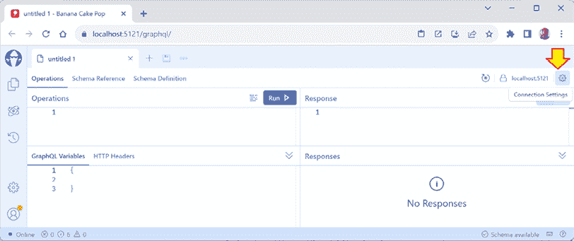

图 12.1：一个新的 BananaCakePop 文档和连接设置按钮

1.  在 **连接设置** 中，确认 **模式端点** 是正确的，然后点击 **取消**，如图 *图 12.2* 所示：

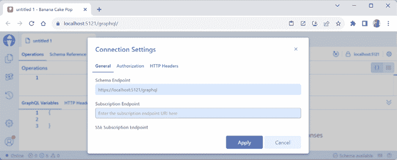

图 12.2：审查 BananaCakePop 连接设置

1.  在 **untitled 1** 文档的顶部，点击 **模式引用** 选项卡。

1.  在 **模式引用** 选项卡中，注意“`Query` 类型是一个特殊类型，它定义了每个 GraphQL 查询的入口点”，它有一个名为 `greeting` 的字段，该字段返回一个 `String!` 值。感叹号表示该值将 *不会* 为 `null`。

1.  点击 **模式定义** 选项卡，并注意只有一个类型被定义，即特殊的 `Query` 对象，它有一个 `greeting` 字段，该字段是一个非空 `String` 值，如下面的代码所示：

    ```cs
    type Query {
      greeting: String!
    } 
    ```

## 编写和执行 GraphQL 查询

现在我们知道了模式，我们可以编写并运行一个查询：

1.  在 **Banana Cake Pop** 的 **untitled 1** 文档中，点击 **操作** 选项卡。

1.  在左侧，输入一个开括号 `{`，并注意为你自动写入了闭括号 `}`。

1.  输入字母 `g`，并注意自动完成显示它识别了 `greeting` 字段，如图 *图 12.3* 所示：

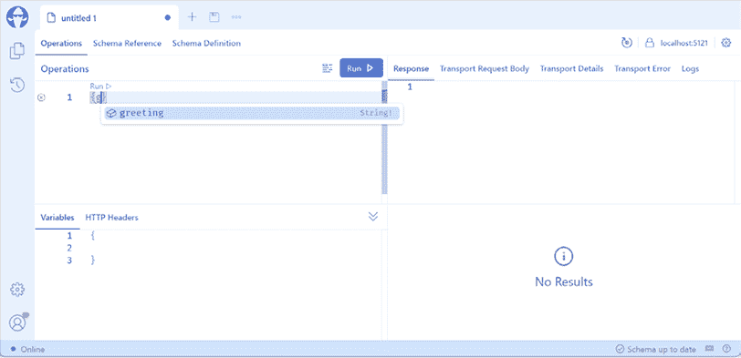

图 12.3：`greeting` 字段的自动完成

1.  按 *Enter* 键接受自动完成建议。

1.  点击 **运行** 按钮并注意响应，如图下面的输出所示：

    ```cs
    {
      "data": {
        "greeting": "Hello, World!"
      }
    } 
    ```

1.  关闭 Chrome 浏览器，并关闭 web 服务器。

## 命名 GraphQL 查询即操作

我们编写的查询没有命名。我们也可以将其创建为命名查询，如下面的代码所示：

```cs
query QueryNameGoesHere {
  greeting
} 
```

命名查询允许客户端识别用于遥测目的的查询和响应，例如，当在 Microsoft Azure 云服务中托管并使用 Application Insights 进行监控时。

## 理解字段约定

我们在 `Query` 类中创建的 C# 方法名为 `GetGreeting`，但在查询它时，我们使用了 `greeting`。表示 GraphQL 中字段的命名方法名上的 `Get` 前缀是可选的。让我们看看更多示例：

1.  在 `Query.cs` 中添加两个不带 `Get` 前缀的方法，如下面的代码所示：

    ```cs
    namespace Northwind.GraphQL.Service;
    public class Query
    {
      public string GetGreeting() => "Hello, World!";
    **public****string****Farewell****()** **=>** **"Ciao! Ciao!"****;**
    **public****int****RollTheDie****()** **=> Random.Shared.Next(****1****,** **7****);**
    } 
    ```

1.  使用 `https` 配置文件启动 `Northwind.GraphQL.Service` 项目，不进行调试。

1.  点击 **模式定义** 选项卡，并注意更新的模式，如下面的代码所示：

    ```cs
    type Query {
      greeting: String!
      farewell: String!
      rollTheDie: Int!
    } 
    ```

    C# 方法使用 PascalCase。GraphQL 字段使用 camelCase。

1.  点击 **操作** 选项卡，并将查询修改为指定名称并请求 `rollTheDie` 字段，如下面的代码所示：

    ```cs
    query GetNumber {
      rollTheDie
    } 
    ```

1.  多次点击 **运行** 按钮。注意，响应包含介于 1 和 6 之间的随机数字，以及当前浏览器会话中请求和响应的历史记录，如图 *图 12.4* 所示：

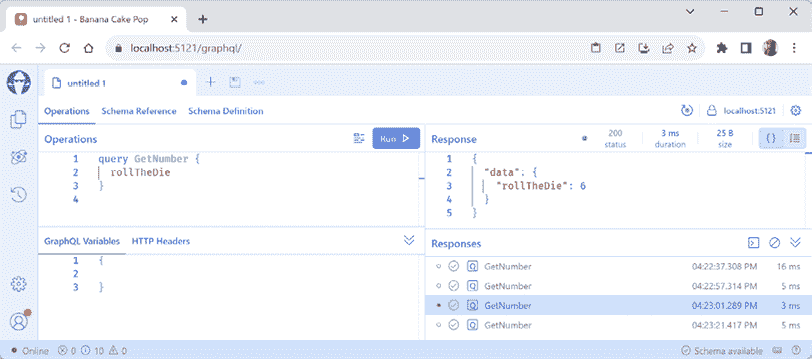

图 12.4：执行命名查询和请求/响应历史记录

1.  关闭 Chrome 浏览器，并关闭 web 服务器。

# 定义 EF Core 模型的 GraphQL 查询

现在我们已经成功运行了一个基本的 GraphQL 服务，让我们扩展它以支持查询 Northwind 数据库。

## 添加对 EF Core 的支持

我们必须添加另一个 Hot Chocolate 包，以便允许轻松地将我们的 EF Core 数据库上下文与 GraphQL 查询类集成依赖项服务：

1.  添加对 Hot Chocolate 与 EF Core 集成的包引用，以及 Northwind 数据库上下文项目的项目引用，如下面的标记所示：

    ```cs
    <ItemGroup>
      <PackageReference Include="HotChocolate.AspNetCore" Version="13.5.1" />
     **<PackageReference Include=****"HotChocolate.Data.EntityFramework"**
     **Version=****"13.5.1"** **/>**
    </ItemGroup>
    **<ItemGroup>**
     **<ProjectReference Include=****"..\..\Chapter03\Northwind.Common.DataContext**
    **.SqlServer\Northwind.Common.DataContext.SqlServer.csproj"** **/>**
    **</ItemGroup>** 
    ```

    项目的路径不能有换行符。所有 Hot Chocolate 包应具有相同的版本号。

1.  在命令提示符或终端中使用 `dotnet build` 命令构建 `Northwind.GraphQLService` 项目。

    当你引用当前解决方案之外的项目时，你必须在命令提示符或终端中至少构建一次项目，然后才能使用 Visual Studio 2022 **构建**菜单来编译它。

1.  在 `Program.cs` 中，导入命名空间以使用 Northwind 数据库的 EF Core 模型，如下面的代码所示：

    ```cs
    using Northwind.EntityModels; // To use AddNorthwindContext method. 
    ```

1.  在 `CreateBuilder` 方法之后添加一个语句以注册 `Northwind` 数据库上下文类，并在添加 GraphQL 服务器支持之后添加一个语句以注册 `NorthwindContent` 类进行依赖注入，如下面的代码所示：

    ```cs
    **builder.Services.AddNorthwindContext();**
    builder.Services
      .AddGraphQLServer()
     **.RegisterDbContext<NorthwindContext>()**
      .AddQueryType<Query>(); 
    ```

1.  在 `Query.cs` 中添加语句以定义一个对象图类型，该类型具有一些查询类型，可以返回类别列表、单个类别、类别的产品、具有最低单位价格的产品和所有产品，如下面的代码所示：

    ```cs
    **using** **Microsoft.EntityFrameworkCore;** **// To use Include method.**
    **using** **Northwind.EntityModels;** **// To use NorthwindContext.**
    namespace Northwind.GraphQL.Service;
    public class Query
    {
      public string GetGreeting() => "Hello, World!";
      public string Farewell() => "Ciao! Ciao!";
      public int RollTheDie() => Random.Shared.Next(1, 7);
    **public** **IQueryable<Category>** **GetCategories****(****NorthwindContext db****)** **=>** 
     **db.Categories.Include(c => c.Products);**
    **public** **Category? GetCategory(NorthwindContext db,** **int** **categoryId)**
     **{**
     **Category? category = db.Categories.Find(categoryId);**
    **if** **(category ==** **null****)** **return****null****;**
     **db.Entry(category).Collection(c => c.Products).Load();**
    **return** **category;**
     **}**
    **public** **IQueryable<Product>** **GetProducts****(****NorthwindContext db****)** **=>** 
     **db.Products.Include(p => p.Category);**
    **public** **IQueryable<Product>** **GetProductsInCategory****(**
     **NorthwindContext db,** **int** **categoryId****)** **=>**
     **db.Products.Where(p => p.CategoryId == categoryId);**
    **public** **IQueryable<Product>** **GetProductsByUnitPrice****(**
     **NorthwindContext db,** **decimal** **minimumUnitPrice****)** **=>**
     **db.Products.Where(p => p.UnitPrice >= minimumUnitPrice);**
    } 
    ```

## 探索使用 Northwind 的 GraphQL 查询

现在我们可以测试为 Northwind 数据库中的类别和产品编写 GraphQL 查询：

1.  如果你的数据库服务器没有运行，例如，因为你正在 Docker、虚拟机或云端托管它，那么请确保启动它。

1.  使用 `https` 配置文件（无调试）启动 `Northwind.GraphQL.Service` 项目。

1.  在 **Banana Cake Pop** 中，点击 **+** 打开一个新标签页。

1.  点击 **Schema Definition** 选项卡，并注意 `Category` 的查询和类型定义，部分内容如图 12.5 所示：

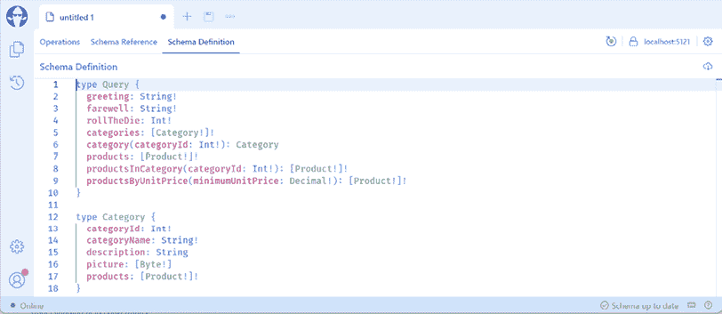

图 12.5：使用 GraphQL 查询 Northwind 类别和产品的模式

1.  注意以下代码中的完整定义：

    ```cs
    type Query {
      greeting: String!
      farewell: String!
      rollTheDie: Int!
      categories: [Category!]!
      category(categoryId: Int!): Category
      products: [Product!]!
      productsInCategory(categoryId: Int!): [Product!]!
      productsByUnitPrice(minimumUnitPrice: Decimal!): [Product!]!
    }
    type Category {
      categoryId: Int!
      categoryName: String!
      description: String
      picture: [Byte!]
      products: [Product!]!
    }
    type Product {
      productId: Int!
      productName: String!
      supplierId: Int
      categoryId: Int
      quantityPerUnit: String
      unitPrice: Decimal
      unitsInStock: Short
      unitsOnOrder: Short
      reorderLevel: Short
      discontinued: Boolean!
      category: Category
      orderDetails: [OrderDetail!]!
      supplier: Supplier
    } 
    ```

1.  点击 **Operations** 选项卡，编写一个命名查询以请求所有类别的 ID、名称和描述字段，如下面的标记所示：

    ```cs
    query AllCategories {
      categories {
        categoryId
        categoryName
        description
      }
    } 
    ```

1.  点击 **Run**，并注意响应，如图 12.6 和以下部分输出所示：

    ```cs
    {
      "data": {
        "categories": 
          {
            "categoryId": 1,
            "categoryName": "Beverages",
            "description": "Soft drinks, coffees, teas, beers, and ales"
          },
          {
            "categoryId": 2,
            "categoryName": "Condiments",
            "description": "Sweet and savory sauces, relishes, spreads, and seasonings"
          },
          ... 
    ```

![

图 12.6：获取所有类别

1.  点击 **+** 打开一个名为 **untitled 2** 的新文档标签页，并编写一个查询以请求 ID 为 `2` 的类别，包括其产品的 ID、名称和价格，如下面的标记所示：

    ```cs
    query Condiments {
      category (categoryId: 2) {
        categoryId
        categoryName
        products {
          productId
          productName
          unitPrice
        }
      }
    } 
    ```

    确保 `categoryId` 中的 `I` 是大写。

1.  点击 **Run**，并注意响应，如下面的部分输出所示：

    ```cs
    {
      "data": {
        "category": {
          "categoryId": 2,
          "categoryName": "Condiments",
          "products": [
            {
              "productId": 3,
              "productName": "Aniseed Syrup",
              "unitPrice": 10
            },
            {
              "productId": 4,
              "productName": "Chef Anton's Cajun Seasoning",
              "unitPrice": 22
            },
            ... 
    ```

1.  在 GraphQL web 服务命令提示符或终端中，注意为此查询执行的 SQL 语句，如下所示的部分输出：

    ```cs
    info: Microsoft.EntityFrameworkCore.Database.Command[20101]
          Executed DbCommand (68ms) [Parameters=[@__p_0='?' (DbType = Int32)], CommandType='Text', CommandTimeout='30']
          SELECT TOP(1) [c].[CategoryId], [c].[CategoryName], [c].[Description], [c].[Picture]
          FROM [Categories] AS [c]
          WHERE [c].[CategoryId] = @__p_0
    info: Microsoft.EntityFrameworkCore.Database.Command[20101]
          Executed DbCommand (5ms) [Parameters=[@__p_0='?' (DbType = Int32)], CommandType='Text', CommandTimeout='30']
          SELECT [p].[ProductId], [p].[CategoryId], [p].[Discontinued], [p].[ProductName], [p].[QuantityPerUnit], [p].[ReorderLevel], [p].[SupplierId], [p].[UnitPrice], [p].[UnitsInStock], [p].[UnitsOnOrder]
          FROM [Products] AS [p]
          WHERE [p].[CategoryId] = @__p_0 
    ```

    虽然 GraphQL 查询不需要每个类别的图片，只需要 ID、名称和单价，但 EF Core 动态生成的查询返回了所有属性。

1.  点击**+**标签打开一个新标签页，并编写一个查询以请求 ID、名称和库存单位的产品，其类别 ID 为`1`，如下所示：

    ```cs
    query BeverageProducts {
      productsInCategory (categoryId: 1) {
        productId
        productName
        unitsInStock
      }
    } 
    ```

1.  点击**运行**，并注意响应，如下所示的部分输出：

    ```cs
    {
      "data": {
        "productsInCategory": 
          {
            "productId": 1,
            "productName": "Chai",
            "unitsInStock": 39
          },
          {
            "productId": 2,
            "productName": "Chang",
            "unitsInStock": 17
          },
          ... 
    ```

1.  点击**+**标签打开一个新标签页，并编写一个查询以请求产品的 ID、名称、库存单位和其类别名称，如下所示：

    ```cs
    query ProductsWithCategoryNames {
      products {
        productId
        productName
        category {
          categoryName
        }
        unitsInStock
      }
    } 
    ```

1.  点击**运行**，并注意响应，如下所示的部分输出：

    ```cs
    {
      "data": {
        "products": [
          {
            "productId": 1,
            "productName": "Chai",
            "category": {
              "categoryName": "Beverages"
            },
            "unitsInStock": 39
          },
          {
            "productId": 2,
            "productName": "Chang",
            "category": {
              "categoryName": "Beverages"
            },
            "unitsInStock": 17
          },
          ... 
    ```

1.  点击**+**标签打开一个新标签页，并编写一个查询以请求类别的 ID 和名称，通过指定类别 ID 选择该类别，并包括其每个产品的 ID 和名称。类别 ID 将使用变量设置，如下所示：

    ```cs
    query CategoryAndItsProducts($id: Int!){
      category(categoryId: $id) {
        categoryId
        categoryName
        products {
          productId
          productName
        }
      }
    } 
    ```

1.  在**变量**部分，定义一个变量的值，如下所示，并在*图 12.7*中：

    ```cs
    {
      "id": 1
    } 
    ```

![图片

图 12.7：执行带有变量的 GraphQL 查询

1.  点击**运行**，并注意响应，如下所示的部分输出：

    ```cs
    {
      "data": {
        "category": {
          "categoryId": 1,
          "categoryName": "Beverages",
          "products": [
            {
              "productId": 1,
              "productName": "Chai"
            },
            {
              "productId": 2,
              "productName": "Chang"
            },
            ... 
    ```

1.  点击**+**标签打开一个新标签页，编写一个查询以请求类别的 ID 和名称，通过指定类别 ID 选择该类别，并包括其每个产品的 ID 和名称。类别 ID 将使用变量设置，如下所示：

    ```cs
    query ProductsWithMinimumPrice($unitPrice: Decimal!){
      productsByUnitPrice(minimumUnitPrice: $unitPrice) {
          productId
          productName
          unitPrice
      }
    } 
    ```

1.  在**变量**部分，定义一个变量的值，如下所示：

    ```cs
    {
      "unitPrice": 100
    } 
    ```

1.  点击**运行**，并注意响应，如下所示的部分输出：

    ```cs
    {
      "data": {
        "productsByUnitPrice": [
          {
            "productId": 29,
            "productName": "Thüringer Rostbratwurst",
            "unitPrice": 123.79
          },
          {
            "productId": 38,
            "productName": "Côte de Blaye",
            "unitPrice": 263.5
          }
        ]
      }
    } 
    ```

1.  关闭 Chrome，并关闭 Web 服务器。

## 实现分页支持

当我们使用`GetProducts`方法（`products`查询）请求产品时，返回所有 77 个产品。让我们添加分页支持：

1.  在`Query.cs`中添加语句以定义一个查询，用于返回所有产品，使用分页，并注意其实现与不带分页的产品查询相同，但它被装饰了`[UsePaging]`属性，如下所示：

    ```cs
    [UsePaging]
    public IQueryable<Product> GetProductsWithPaging(NorthwindContext db) =>
      db.Products.Include(p => p.Category); 
    ```

    **良好实践**：`[UsePaging]`、`[UseFiltering]`和`[UseSorting]`属性必须装饰到返回`IQueryable<T>`的查询方法上，允许 GraphQL 在执行数据存储之前动态配置 LINQ 查询。

1.  使用`https`配置文件（无调试）启动`Northwind.GraphQL.Service`项目。

1.  在**香蕉蛋糕棒**中，点击**+**以打开一个新标签页。

1.  点击**模式定义**标签，并注意名为`products`（不带分页）和`productsWithPaging`的查询，这些查询说明了如何使用查询请求产品的一页，如下所示的部分输出：

    ```cs
    products: [Product!]!
    productsInCategory(categoryId: Int!): [Product!]!
    productsByUnitPrice(minimumUnitPrice: Decimal!): [Product!]!
    productsWithPaging(
      """
      Returns the first _n_ elements from the list.
      """
      first: Int
      """
      Returns the elements in the list that come after the specified cursor.
      """
      after: String
      """
      Returns the last _n_ elements from the list.
      """
      last: Int
      """
      Returns the elements in the list that come before the specified cursor.
      """
      before: String
    ): ProductsWithPagingConnection 
    ```

1.  点击 **操作**选项卡，并编写一个命名查询以请求第 1 页的 10 个商品，如下所示的部分标记：

    ```cs
    query FirstTenProducts {
      productsWithPaging(first: 10) {
        pageInfo {
          hasPreviousPage
          hasNextPage
          startCursor
          endCursor
        }
        nodes {
          productId
          productName
        }
      }
    } 
    ```

1.  点击 **运行**，注意响应，包括 `pageInfo` 部分，它告诉我们还有另一页的产品，并且此页的游标范围从 `MA==` 到 `OQ==`，如下所示的部分输出：

    ```cs
    {
      "data": {
        "productsWithPaging": {
          "pageInfo": {
            "hasPreviousPage": false,
            "hasNextPage": true,
            "startCursor": "MA==",
            "endCursor": "OQ=="
          },
          "nodes": [
            {
              "productId": 1,
              "productName": "Chai"
            },
    ...
    {
              "productId": 10,
              "productName": "Ikura"
            }
          ]
        }
      }
    } 
    ```

1.  点击 **+** 打开一个新标签页，并编写一个命名查询以请求第 2 页的 10 个商品，指定我们想要一个从 `OQ==` 开始的游标，如下所示的部分标记：

    ```cs
    query SecondTenProducts {
      productsWithPaging(after: "OQ==") {
        pageInfo {
          hasPreviousPage
          hasNextPage
          startCursor
          endCursor
        }
        nodes {
          productId
          productName
        }
      }
    } 
    ```

1.  点击 **运行**，注意响应，包括 `pageInfo` 部分，它告诉我们还有另一页的产品，并且此页的游标范围从 `MTA=` 到 `MTk=`，如下所示的部分输出：

    ```cs
    {
      "data": {
        "productsWithPaging": {
          "pageInfo": {
            "hasPreviousPage": true,
            "hasNextPage": true,
            "startCursor": "MTA=",
            "endCursor": "MTk="
          },
          "nodes": [
            {
              "productId": 11,
              "productName": "Queso Cabrales"
            },
    ...
    {
              "productId": 20,
              "productName": "Sir Rodney's Marmalade"
            }
          ]
        }
      }
    } 
    ```

1.  关闭 Chrome，并关闭 web 服务器。

## 实现过滤支持

当我们在本章前面探索查询时，我们预先定义了一些带有参数的查询，例如，通过传递 `categoryId` 参数返回一个类别中所有商品的查询。

然而，如果你事先不知道要执行什么过滤操作怎么办？

让我们向我们的 GraphQL 查询添加过滤支持：

1.  在 `Program.cs` 文件中，在调用 `AddGraphQLServer` 之后添加对 `AddFiltering` 的调用，如下代码所示：

    ```cs
    builder.Services
      .AddGraphQLServer()
     **.AddFiltering()**
      .RegisterDbContext<NorthwindContext>()
      .AddQueryType<Query>(); 
    ```

1.  在 `Query.cs` 文件中，使用 `[UseFiltering]` 属性装饰 `GetProducts` 方法，如下代码所示：

    ```cs
    **[****UseFiltering****]**
    public IQueryable<Product> GetProducts(NorthwindContext db) =>
      db.Products.Include(p => p.Category); 
    ```

1.  使用不带调试的 `https` 配置启动 `Northwind.GraphQL.Service` 项目。

1.  在 **香蕉蛋糕棒** 中，点击 **+** 打开一个新标签页。

1.  点击 **方案定义**，注意 `products` 查询现在接受一个过滤输入，如下所示的部分标记：

    ```cs
    products(where: ProductFilterInput): [Product!]! 
    ```

1.  将方案定义向下滚动以找到 `ProductFilterInput`，并注意过滤选项包括布尔运算符如 `and` 和 `or`，以及字段过滤器如 `IntOperationFilterInput` 和 `StringOperationFilterInput`，如下所示的部分标记：

    ```cs
    input ProductFilterInput {
      and: [ProductFilterInput!]
      or: [ProductFilterInput!]
      productId: IntOperationFilterInput
      productName: StringOperationFilterInput
      supplierId: IntOperationFilterInput
      categoryId: IntOperationFilterInput
      quantityPerUnit: StringOperationFilterInput
      unitPrice: DecimalOperationFilterInput
      unitsInStock: ShortOperationFilterInput
      unitsOnOrder: ShortOperationFilterInput
      reorderLevel: ShortOperationFilterInput
      discontinued: BooleanOperationFilterInput
      category: CategoryFilterInput
      orderDetails: ListFilterInputTypeOfOrderDetailFilterInput
      supplier: SupplierFilterInput
    } 
    ```

1.  将方案定义向下滚动以找到 `IntOperationFilterInput` 和 `StringOperationFilterInput`，并注意你可以与它们一起使用的操作，如等于 (`eq`)、不等于 (`neq`)、在数组中 (`in`)、大于 (`gt`)、包含 (`contains`) 和以...开头 (`startsWith`)，如下所示的部分标记：

    ```cs
    input IntOperationFilterInput {
      eq: Int
      neq: Int
      in: [Int]
      nin: [Int]
      gt: Int
      ngt: Int
      gte: Int
      ngte: Int
      lt: Int
      nlt: Int
      lte: Int
      nlte: Int
    }
    input StringOperationFilterInput {
      and: [StringOperationFilterInput!]
      or: [StringOperationFilterInput!]
      eq: String
      neq: String
      contains: String
      ncontains: String
      in: [String]
      nin: [String]
      startsWith: String
      nstartsWith: String
      endsWith: String
      nendsWith: String
    } 
    ```

1.  点击 **操作**，然后编写一个命名查询以请求库存超过 `120` 单位的商品，如下所示的部分标记：

    ```cs
    query ProductsWithMoreThan40InStock {
      products(where: { unitsInStock: { gt: 120 } }) {
        productId
        productName
        unitsInStock
      }
    } 
    ```

1.  点击 **运行**，注意响应，如下所示的部分输出：

    ```cs
    {
      "data": {
        "products": [
          {
            "productId": 40,
            "productName": "Boston Crab Meat",
            "unitsInStock": 123
          },
          {
            "productId": 75,
            "productName": "Rhönbräu Klosterbier",
            "unitsInStock": 125
          }
        ]
      }
    } 
    ```

1.  点击 **+** 打开一个新标签页，点击 **操作**，然后编写一个命名查询以请求名称以 `Cha` 开头的商品，如下所示的部分标记：

    ```cs
    query ProductNamesCha {
      products(where: { productName: { startsWith: "Cha" } }) {
        productId
        productName
      }
    } 
    ```

1.  点击 **运行**，注意响应，如下所示的部分输出：

    ```cs
    {
      "data": {
        "products": [
          {
            "productId": 1,
            "productName": "Chai"
          },
          {
            "productId": 2,
            "productName": "Chang"
          },
          {
            "productId": 39,
            "productName": "Chartreuse verte"
          }
        ]
      }
    } 
    ```

1.  在 GraphQL 服务命令提示符或终端中，注意 EF Core 生成的使用参数的 SQL 过滤器，如下所示的部分输出：

    ```cs
    info: Microsoft.EntityFrameworkCore.Database.Command[20101]
          Executed DbCommand (2ms) [Parameters=[@__p_0_rewritten='?' (Size = 40)], CommandType='Text', CommandTimeout='30']
          SELECT [p].[ProductId], [p].[CategoryId], [p].[Discontinued], [p].[ProductName], [p].[QuantityPerUnit], [p].[ReorderLevel], [p].[SupplierId], [p].[UnitPrice], [p].[UnitsInStock], [p].[UnitsOnOrder], [c].[CategoryId], [c].[CategoryName], [c].[Description], [c].[Picture]
          FROM [Products] AS [p]
          LEFT JOIN [Categories] AS [c] ON [p].[CategoryId] = [c].[CategoryId]
          WHERE [p].[ProductName] LIKE @__p_0_rewritten ESCAPE N'\' 
    ```

1.  关闭 Chrome，并关闭 web 服务器。

## 实现排序支持

要启用 GraphQL 服务的排序，调用 `AddSorting` 方法，如下面的代码所示：

```cs
builder.Services
  .AddGraphQLServer()
  .AddFiltering()
 **.AddSorting()**
  .RegisterDbContext<NorthwindContext>()
  .AddQueryType<Query>(); 
```

然后，使用 `[UseSorting]` 属性装饰返回 `IQueryable<T>` 的查询方法，如下面的代码所示：

```cs
[UseFiltering]
**[****UseSorting****]**
public IQueryable<Product> GetProducts(NorthwindContext db) =>
  db.Products.Include(p => p.Category); 
```

在查询中应用一个或多个排序顺序，如下面的代码所示：

```cs
query ProductsSortedByMostExpensive {
  products(order: [ { unitPrice: DESC } ]) {
    productId
    productName
    unitPrice
  }
} 
```

`SortEnumType` 有两个值，如下面的代码所示：

```cs
enum SortEnumType {
  ASC
  DESC
} 
```

我将把添加排序功能到你的 GraphQL 服务中留给你。

# 为 GraphQL 服务构建 .NET 客户端

现在我们已经使用 **Banana Cake Pop** 工具探索了一些查询，让我们看看客户端如何调用 GraphQL 服务。虽然 **Banana Cake Pop** 工具很方便，但它运行在与服务相同的域中，因此一些问题可能直到我们创建一个单独的客户端时才变得明显。

## 选择 GraphQL 请求格式

大多数 GraphQL 服务以 `application/graphql` 或 `application/json` 媒体格式处理 `GET` 和 `POST` 请求。一个 `application/graphql` 请求将只包含一个查询文档。使用 `application/json` 的好处是，除了查询文档外，你还可以在有多种操作时指定操作，并定义和设置变量，如下面的代码所示：

```cs
{
  "query": "...",
  "operationName": "...",
  "variables": { "variable1": "value1", ... }
} 
```

我们将使用 `application/json` 媒体格式，这样我们就可以传递变量及其值。

## 理解 GraphQL 响应格式

一个 GraphQL 服务应该返回一个包含预期数据对象和可能包含一些错误数组的 JSON 文档，其结构如下：

```cs
{
  "data": { ... },
  "errors": [ ... ]
} 
```

`errors` 数组只有在文档中有错误时才应出现在文档中。

## 使用 REST Client 作为 GraphQL 客户端

在我们编写客户端代码向 GraphQL 服务发送请求之前，最好使用你的代码编辑器的 `.http` 文件支持对其进行测试。这样，如果我们的 .NET 客户端应用不起作用，我们就知道问题出在我们的客户端代码而不是服务上：

1.  如果你正在使用 Visual Studio Code 并且尚未安装 Huachao Mao 的 REST Client (`humao.rest-client`)，那么现在就安装它。

1.  在你偏好的代码编辑器中，启动 `Northwind.GraphQL.Service` 项目网络服务，使用 `https` 配置文件，不进行调试，并保持运行。

1.  在你的代码编辑器中，在 `HttpRequests` 文件夹中，创建一个名为 `graphql-queries.http` 的文件，并修改其内容以包含获取海鲜类别产品的请求，如下面的代码所示：

    ```cs
    ### Configure a variable for the GraphQL service base address.
    @base_address = https://localhost:5121/graphql
    ### Get all products in the specified category.
    POST {{base_address}}
    Content-Type: application/json
    {
      "query" : "{productsInCategory(categoryId:8){productId productName unitsInStock}}"
    } 
    ```

1.  发送查询请求，并注意响应，如图 *图 12.8* 所示：

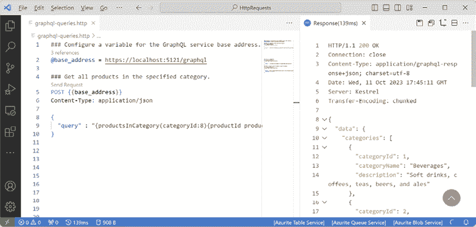

图 12.8：使用 REST Client 请求海鲜产品

1.  添加一个查询来获取所有类别的 ID、名称和描述，如下面的代码所示：

    ```cs
    ### Get all categories.
    POST {{base_address}}
    Content-Type: application/json
    {
      "query" : "{categories{categoryId categoryName description}}"
    } 
    ```

1.  发送查询请求，并注意响应包含 `data` 属性中的八个类别。

1.  在查询文档中，将 `categoryId` 改为 `id`。

1.  发送查询请求，并注意响应包含一个 `errors` 数组，如下面的响应所示：

    ```cs
    Response time: 60 ms
    Status code: BadRequest (400)
    Alt-Svc: h3=":5121"; ma=86400
    Transfer-Encoding: chunked
    Date: Tue, 06 Jun 2023 16:35:18 GMT
    Server: Kestrel
    Content-Type: application/graphql-response+json; charset=utf-8
    Content-Length: 338
    ------------------------------------------------
    Content:
    {
      "errors": [
        {
          "message": "The field `id` does not exist on the type `Category`.",
          "locations": [
            {
              "line": 1,
              "column": 13
            }
          ],
          "path": [
            "categories"
          ],
          "extensions": {
            "type": "Category",
            "field": "id",
            "responseName": "id",
            "specifiedBy": "http://spec.graphql.org/October2021/#sec-Field-Selections-on-Objects-Interfaces-and-Unions-Types"
          }
        }
      ]
    } 
    ```

1.  在查询文档中，将 `id` 重新改为 `categoryId`。

1.  添加一个查询以请求获取通过参数指定的类别 ID 及其名称，以及每个产品的 ID 和名称，如下面的代码所示：

    ```cs
    ### Get a category and its products using a variable.
    POST {{base_address}}
    Content-Type: application/json
    {
      "query": "query categoryAndItsProducts($id: Int!){category(categoryId: $id){categoryId categoryName products{productId productName}}}",
      "variables": {"id":1}
    } 
    ```

1.  发送查询请求，并注意响应包含类别`1`，`Beverages`，以及其产品在`data`属性中。

1.  将 ID 更改为`4`，发送请求，并注意响应包含类别`4`，`Dairy Products`，以及其产品在`data`属性中。

现在我们已经对服务及其对我们想要运行的查询的响应进行了一些基本的测试，我们可以构建一个客户端来执行这些查询并处理 JSON 响应。

## 使用 ASP.NET Core MVC 项目作为 GraphQL 客户端

我们将创建一个模型类，以便轻松反序列化响应：

1.  使用您首选的代码编辑器添加一个新项目，如下列列表中定义的：

    1.  项目模板：**ASP.NET Core Web App (Model-View-Controller**) / `mvc`

    1.  解决方案文件和文件夹：`Chapter12`

    1.  项目文件和文件夹：`Northwind.GraphQL.Client.Mvc`

    1.  其他 Visual Studio 2022 选项：

        +   **身份验证类型**：无

        +   **配置为 HTTPS**：已选择

        +   **启用 Docker**：已清除

        +   **不要使用顶级语句**：已清除

1.  在 Visual Studio 2022 中，设置启动项目为当前选择。

1.  在`Northwind.GraphQL.Client.Mvc`项目中，添加对 Northwind 实体模型项目的项目引用，如下面的标记所示：

    ```cs
    <ItemGroup>
      <ProjectReference Include="..\..\Chapter03\Northwind.Common.EntityModels
    .SqlServer\Northwind.Common.EntityModels.SqlServer.csproj" />
    </ItemGroup> 
    ```

    项目的路径不得包含换行符。

1.  在命令提示符或终端中构建`Northwind.GraphQL.Client.Mvc`项目。

1.  在`Properties`文件夹中的`launchSettings.json`中，修改`applicationUrl`以使用端口`5123`进行`https`和端口`5124`进行`http`，如下面的配置中突出显示：

    ```cs
    **"https"****:****{**
      "commandName": "Project",
      "dotnetRunMessages": true,
      "launchBrowser": true,
    **"applicationUrl"****:****"https://localhost:5123;http://localhost:5124"****,**
      "environmentVariables": {
        "ASPNETCORE_ENVIRONMENT": "Development"
      } 
    ```

1.  在`Northwind.GraphQL.Client.Mvc`项目的`Models`文件夹中，添加一个名为`ResponseErrors.cs`的新类文件，如下面的代码所示：

    ```cs
    namespace Northwind.GraphQL.Client.Mvc.Models;
    public class ResponseErrors
    {
      public Error[]? Errors { get; set; }
    }
    public class Error
    {
      public string Message { get; set; } = null!;
      public Location[] Locations { get; set; } = null!;
      public string[] Path { get; set; } = null!;
    }
    public class Location
    {
      public int Line { get; set; }
      public int Column { get; set; }
    } 
    ```

1.  在`Models`文件夹中，添加一个名为`ResponseProducts.cs`的新类文件，如下面的代码所示：

    ```cs
    using Northwind.EntityModels; // To use Product.
    namespace Northwind.GraphQL.Client.Mvc.Models;
    public class ResponseProducts
    {
      public class DataProducts
      {
        public Product[]? ProductsInCategory { get; set; }
      }
      public DataProducts? Data { get; set; }
    } 
    ```

1.  在`Models`文件夹中，添加一个名为`ResponseCategories.cs`的新类文件，如下面的代码所示：

    ```cs
    using Northwind.EntityModels; // To use Category.
    namespace Northwind.GraphQL.Client.Mvc.Models;
    public class ResponseCategories
    {
      public class DataCategories
      {
        public Category[]? Categories { get; set; }
      }
      public DataCategories? Data { get; set; }
    } 
    ```

1.  在`Models`文件夹中，添加一个名为`IndexViewModel.cs`的新类文件，它将具有存储我们可能在视图中显示的所有数据的属性，如下面的代码所示：

    ```cs
    using Northwind.EntityModels; // To use Product.
    using System.Net; // To use HttpStatusCode.
    namespace Northwind.GraphQL.Client.Mvc.Models;
    public class IndexViewModel
    {
      public HttpStatusCode Code { get; set; }
      public string? RawResponseBody { get; set; }
      public Product[]? Products { get; set; }
      public Category[]? Categories { get; set; }
      public Error[]? Errors { get; set; }
    } 
    ```

1.  在`Program.cs`中，导入命名空间以设置 HTTP 头，如下面的代码所示：

    ```cs
    using System.Net.Http.Headers; // To use MediaTypeWithQualityHeaderValue. 
    ```

1.  在`Program.cs`中，在`CreateBuilder`方法调用之后，添加注册 GraphQL 服务的 HTTP 客户端的语句，如下面的代码所示：

    ```cs
    builder.Services.AddHttpClient(name: "Northwind.GraphQL.Service",
      configureClient: options =>
      {
        options.BaseAddress = new Uri("https://localhost:5121/");
        options.DefaultRequestHeaders.Accept.Add(
          new MediaTypeWithQualityHeaderValue(
          "application/json", 1.0));
      }); 
    ```

1.  在`Controllers`文件夹中的`HomeController.cs`中，导入命名空间以处理文本编码以及本地项目模型，如下面的代码所示：

    ```cs
    using Northwind.Mvc.GraphQLClient.Models; // To use IndexViewModel.
    using System.Text; // To use Encoding. 
    ```

1.  定义一个字段以存储已注册的 HTTP 客户端工厂，并在构造函数中设置它，如下面的代码所示：

    ```cs
    **protected****readonly** **IHttpClientFactory _clientFactory;**
    public HomeController(ILogger<HomeController> logger**,** 
     **IHttpClientFactory clientFactory**)
    {
      _logger = logger;
     **_clientFactory = clientFactory;**
    } 
    ```

1.  在 `Index` 动作方法中，将方法修改为异步。然后，添加调用 GraphQL 服务的语句，并注意 HTTP 请求是 `POST`，媒体类型是包含 GraphQL 查询的 `application/json` 文档，该查询请求给定类别中所有产品的 ID、名称和库存数量，通过名为 `id` 的参数传递，如下面的代码所示：

    ```cs
    public async Task<IActionResult> Index(string id = "1")
    {
      IndexViewModel model = new();
      try
      {
        HttpClient client = _clientFactory.CreateClient(
          name: "Northwind.GraphQL.Service");
        // First, try a simple GET request to service root.
        HttpRequestMessage request = new(
          method: HttpMethod.Get, requestUri: "/");
        HttpResponseMessage response = await client.SendAsync(request);
        if (!response.IsSuccessStatusCode)
        {
          model.Code = response.StatusCode;
          model.Errors = new[] { new Error { Message = 
            "Service is not successfully responding to GET requests." } };
          return View(model);
        }
        // Next, make a request to the GraphQL endpoint.
        request = new(
          method: HttpMethod.Post, requestUri: "graphql");
        request.Content = new StringContent(content: $$$"""
    {
      "query": "{productsInCategory(categoryId:{{{id}}}){productId productName unitsInStock}}"
    }
          """,
          encoding: Encoding.UTF8,
          mediaType: "application/json");
        response = await client.SendAsync(request);
        model.Code = response.StatusCode;
        model.RawResponseBody = await response.Content.ReadAsStringAsync();
        if (response.IsSuccessStatusCode)
        {
          model.Products = (await response.Content
            .ReadFromJsonAsync<ResponseProducts>())?.Data?.ProductsInCategory;
        }
        else
        {
          model.Errors = (await response.Content
            .ReadFromJsonAsync<ResponseErrors>())?.Errors;
        }
      }
      catch (Exception ex)
      {
        _logger.LogWarning(
          $"Northwind.GraphQL.Service exception: {ex.Message}");
        model.Errors = new[] { new Error { Message = ex.Message } };
      }
      return View(model);
    } 
    ```

    **良好实践**：为了设置我们请求的内容，我们将使用 C# 11 或更高版本的三个美元符号和三个双引号的原始插值字符串字面量语法。这允许我们使用三个大括号嵌入 `id` 变量，不应与 `unitsInStock` 后面的两个大括号混淆，后者结束查询本身。

1.  在 `Views/Home` 文件夹中的 `Index.cshtml` 文件中，删除其现有的标记，然后添加标记以渲染海鲜产品，如下面的标记所示：

    ```cs
    @using Northwind.EntityModels
    @using Northwind.GraphQL.Client.Mvc.Models @* for VS Code only *@
    @model IndexViewModel
    @{
      ViewData["Title"] = "Products from GraphQL service";
    }
    <div class="text-center">
      <h1 class="display-4">@ViewData["Title"]</h1>
      <div class="card card-body">
        <form>
          Enter a category id
          <input name="id" value="1" />
          <input type="submit" />
        </form>
      </div>
      @if (Model.Errors is not null)
      {
        <div class="alert alert-danger" role="alert">
          <table class="table table-striped">
            <thead>
            <tr>
              <td>Message</td>
              <td>Path</td>
              <td>Locations</td>
            </tr>
            </thead>
            <tbody>
              @foreach (Error error in Model.Errors)
              {
                <tr>
                  <td>@error.Message</td>
                  <td>
                    @if (error.Path is not null)
                    {
                      @foreach (string path in error.Path)
                      {
                        <span class="badge bg-danger">@path</span>
                      }
                    }
                  </td>
                  <td>
                    @if (error.Locations is not null)
                    {
                      @foreach (Location location in error.Locations)
                      {
                        <span class="badge bg-danger">
                          @location.Line, @location.Column
                        </span>
                      }
                    }
                  </td>
                </tr>
              }
            </tbody>
          </table>
        </div>
      }
      @if (Model.Categories is not null)
      {
        <div>
          <p class="alert alert-success" role="alert">
            There are @Model.Categories.Count() products.</p>
          <p>
            @foreach (Category category in Model.Categories)
            {
              <span class="badge bg-dark">
                @category.CategoryId
                @category.CategoryName
              </span>
            }
          </p>
        </div>
      }
      @if (Model.Products is not null)
      {
        <div>
          <p class="alert alert-success" role="alert">
            There are @Model.Products.Count() products.</p>
          <p>
            @foreach (Product p in Model.Products)
            {
              <span class="badge bg-dark">
                @p.ProductId
                @p.ProductName
                -
                @(p.UnitsInStock is null ? "0" : p.UnitsInStock.Value) in stock
              </span>
            }
          </p>
        </div>
      }
      <p>
        <a class="btn btn-primary" data-bs-toggle="collapse" 
           href="#collapseExample" role="button" 
           aria-expanded="false" aria-controls="collapseExample">
          Show/Hide Details
        </a>
      </p>
      <div class="collapse" id="collapseExample">
        <div class="card card-body">
          Status code @((int)Model.Code): @Model.Code
          <hr />
          @Model.RawResponseBody
        </div>
      </div>
    </div> 
    ```

## 测试 .NET 客户端

现在，我们可以测试我们的 .NET 客户端：

1.  如果您的数据库服务器没有运行，例如，因为您正在 Docker、虚拟机或云中托管它，那么请确保启动它。

1.  使用不带调试的 `https` 配置启动 `Northwind.GraphQL.Service` 项目。

1.  使用不带调试的 `https` 配置启动 `Northwind.GraphQL.Client.Mvc` 项目。

1.  注意，使用 GraphQL 成功检索了产品，如图 *图 12.9* 所示：

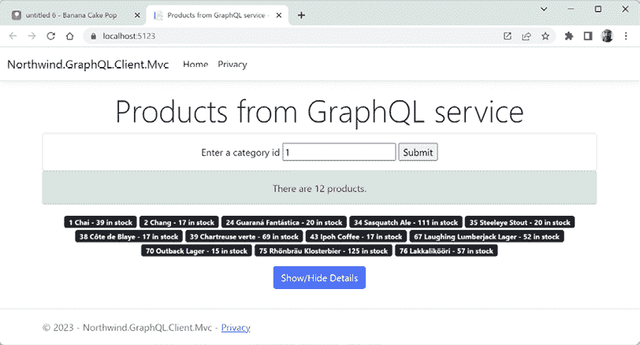

图 12.9：来自 GraphQL 服务的饮料类别产品

1.  输入另一个存在的类别 ID，例如 `4`。

1.  输入一个超出范围的类别 ID，例如 `13`，并注意返回了 0 个产品。

1.  关闭 Chrome，并关闭 `Northwind.GraphQL.Client.Mvc` 项目的 Web 服务器。

1.  在 `HomeController.cs` 中，修改查询以故意犯一个错误，例如将 `productId` 改为 `productid`。

1.  使用不带调试的 `https` 配置启动 `Northwind.GraphQL.Client.Mvc` 项目。

1.  点击 **显示/隐藏详细信息** 按钮，并注意错误信息和响应详细信息，如下面的输出所示：

    ```cs
    {"errors":[{"message":"The field \u0060productid\u0060 
    does not exist on the type \u0060Product\u0060.",
     "locations":[{"line":1,"column":35}],
     "path":["productsInCategory"],
     "extensions":{"type":"Product","field":"productid",
     "responseName":"productid",
     "specifiedBy":"http://spec.graphql.org/October2021/
    #sec-Field-Selections-on-Objects-Interfaces-and-Unions-Types"}}]} 
    ```

1.  关闭 Chrome，并关闭两个 Web 服务器。

1.  修复查询中的错误！

## 使用 Strawberry Shake 创建控制台应用程序客户端

与使用普通 HTTP 客户端不同，ChilliCream 有一个 GraphQL 客户端库，可以更轻松地构建用于 GraphQL 服务的 .NET 客户端。

**更多信息**：您可以在以下链接中了解更多关于 Strawberry Shake 的信息：[`chillicream.com/docs/strawberryshake`](https://chillicream.com/docs/strawberryshake)

现在，让我们使用 Strawberry Shake 创建另一个客户端，以便您可以看到其好处：

1.  使用您首选的代码编辑器添加一个新的 **控制台应用程序** / `console` 项目，命名为 `Northwind.GraphQL.Client.Console`。

1.  在项目文件夹的命令提示符或终端中，创建一个工具清单文件，如下面的命令所示：

    ```cs
    dotnet new tool-manifest 
    ```

1.  在命令行或终端中，安装 Strawberry Shake 工具，如下面的命令所示：

    ```cs
    dotnet tool install StrawberryShake.Tools --local 
    ```

1.  注意 Strawberry Shake 已安装，如下所示：

    ```cs
    You can invoke the tool from this directory using the following commands:
    'dotnet tool run dotnet-graphql' or 'dotnet dotnet-graphql'.
    Tool 'strawberryshake.tools' (version '13.5.1') was successfully installed.
    Entry is added to the manifest file C:\apps-services-net8\Chapter12\
    Northwind.GraphQL.Client.Console\.config\dotnet-tools.json. 
    ```

1.  在项目中，将警告视为错误，添加对 Microsoft 扩展依赖注入、处理 HTTP 和 Strawberry Shake 代码生成的 NuGet 包的引用，然后全局和静态导入`Console`类，如下所示：

    ```cs
    <Project Sdk="Microsoft.NET.Sdk">
      <PropertyGroup>
        <OutputType>Exe</OutputType>
        <TargetFramework>net8.0</TargetFramework>
        <ImplicitUsings>enable</ImplicitUsings>
        <Nullable>enable</Nullable>
     **<TreatWarningsAsErrors>****true****</TreatWarningsAsErrors>**
      </PropertyGroup>
     **<ItemGroup>**
     **<PackageReference Version=****"****8.0.0"**
     **Include=****"Microsoft.Extensions.DependencyInjection"** **/>**
     **<PackageReference Version=****"8.0.0"**
     **Include=****"Microsoft.Extensions.Http"** **/>**
     **<PackageReference Version=****"13.5.1"**
     **Include=****"StrawberryShake.Server"** **/>**
     **</ItemGroup>**
     **<ItemGroup>**
     **<Using Include=****"System.Console"** **Static=****"true"** **/>**
     **</ItemGroup>**
    </Project> 
    ```

    你需要为不同类型的.NET 项目使用不同的 Strawberry Shake 包。对于控制台应用程序和 ASP.NET Core 应用程序，引用`StrawberryShake.Server`。对于 Blazor WebAssembly 应用程序，引用`StrawberryShake.Blazor`。对于.NET MAUI 应用程序，引用`StrawberryShake.Maui`。

1.  构建项目`Northwind.GraphQL.Client.Console`以还原包。

1.  启动`Northwind.GraphQL.Service`项目，使用`https`配置文件且不进行调试，并让它运行，以便 Strawberry Shake 工具可以与其通信。

1.  在`Northwind.GraphQL.Client.Console`项目中，在命令提示符或终端中添加一个用于 GraphQL 服务的客户端，如下所示：

    ```cs
    dotnet graphql init https://localhost:5121/graphql/ -n NorthwindClient 
    ```

1.  注意以下输出结果：

    ```cs
    Download schema started.
    Download schema completed in 189 ms
    Client configuration started.
    Client configuration completed in 83 ms 
    ```

1.  在`Northwind.GraphQL.Client.Console`项目中，在`.graphqlrc.json`文件中添加一个条目来控制代码生成期间使用的 C#命名空间，如下所示：

    ```cs
    {
      "schema": "schema.graphql",
      "documents": "**/*.graphql",
      "extensions": {
        "strawberryShake": {
          "name": "NorthwindClient",
    **"namespace"****:****"Northwind.GraphQL.Client.Console"****,**
          "url": "https://localhost:5111/graphql/",
          "records": {
            "inputs": false,
            "entities": false
          },
          "transportProfiles": [
            {
              "default": "Http",
              "subscription": "WebSocket"
            }
          ]
        }
      }
    } 
    ```

1.  在`Northwind.GraphQL.Client.Console`项目中，添加一个名为`seafoodProducts.graphql`的新文件，该文件定义了一个获取海鲜产品的查询，如下所示：

    ```cs
    query SeafoodProducts {
      productsInCategory(categoryId:8) {
        productId 
        productName 
        unitsInStock
      }
    } 
    ```

    Strawberry Shake 使用的 GraphQL 查询必须命名。

1.  如果你正在使用 Visual Studio 2022，它可能会自动修改项目文件以显式地从构建过程中删除此文件，因为它不认识它。如果是这样，则删除或注释掉该元素，如下所示：

    ```cs
    **<!-- An element like this will remove the file from the build process.**
    <ItemGroup>
      <GraphQL Remove="seafoodProducts.graphql" />
    </ItemGroup>
    **-->** 
    ```

    **良好实践**：必须至少有一个`.graphql`文件，以便 Strawberry Shake 工具能够自动生成其代码。像下面这样的元素将阻止 Strawberry Shake 工具生成代码，你稍后将会遇到编译错误。你应该删除或注释掉该元素。

1.  构建项目`Northwind.GraphQL.Client.Console`，以便 Strawberry Shake 处理 GraphQL 查询文件并生成代理类。

1.  注意自动生成的`obj\Debug\net8.0\berry`文件夹，名为`NorthwindClient.Client.cs`的文件，以及它定义的十几个类型，包括`INorthwindClient`接口，如图*12.10*所示：

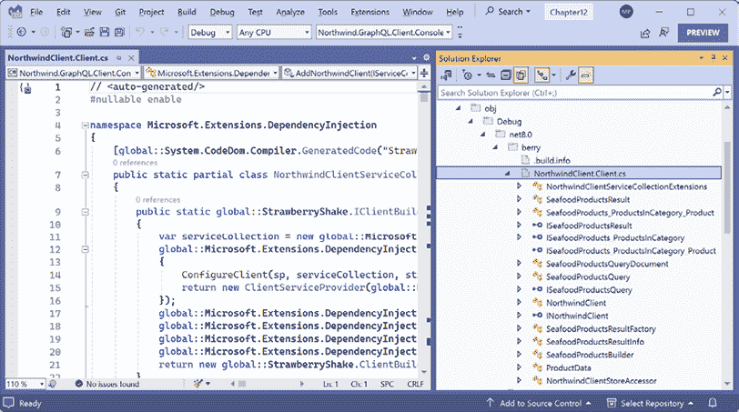

图 12.10：Northwind GraphQL 服务生成的类文件

1.  在`Program.cs`中，删除现有的语句。添加语句以创建一个新的服务集合，将自动生成的`NorthwindClient`添加到其中，并使用服务正确的 URL，然后获取并使用依赖服务来获取海鲜产品，如下所示：

    ```cs
    using Microsoft.Extensions.DependencyInjection; // To use ServiceCollection.
    using Northwind.GraphQL.Client.Console; // To use INorthwindClient.
    using StrawberryShake; // To use EnsureNoErrors extension method.
    ServiceCollection serviceCollection = new();
    serviceCollection
      .AddNorthwindClient() // Strawberry Shake extension method.
      .ConfigureHttpClient(client => 
        client.BaseAddress = new Uri("https://localhost:5121/graphql"));
    IServiceProvider services = serviceCollection.BuildServiceProvider();
    INorthwindClient client = services.GetRequiredService<INorthwindClient>();
    var result = await client.SeafoodProducts.ExecuteAsync();
    result.EnsureNoErrors();
    if (result.Data is null)
    {
      WriteLine("No data!");
      return; 
    }
    foreach (var product in result.Data.ProductsInCategory)
    {
      WriteLine("{0}: {1}",
        product.ProductId, product.ProductName);
    } 
    ```

1.  运行控制台应用程序并注意以下输出结果：

    ```cs
    10: Ikura
    13: Konbu
    18: Carnarvon Tigers
    30: Nord-Ost Matjeshering
    36: Inlagd Sill
    37: Gravad lax
    40: Boston Crab Meat
    41: Jack's New England Clam Chowder
    45: Rogede sild
    46: Spegesild
    58: Escargots de Bourgogne
    73: Röd Kaviar 
    ```

# 实现 GraphQL 突变

大多数服务都需要修改数据以及查询数据。GraphQL 将这些称为 **突变**。一个突变有三个相关组件：

+   突变本身，它定义了对图所做的更改。它应该使用动词、名词并用驼峰式命名，例如，`addProduct`。

+   **输入** 是突变的输入，并且应该与突变具有相同的名称，后缀为 `Input`，例如，`AddProductInput`。尽管只有一个输入，但它是一个对象图，因此可以像你需要的那样复杂。

+   **负载** 是突变的返回文档，并且应该与突变具有相同的名称，后缀为 `Payload`，例如，`AddProductPayload`。尽管只有一个负载，但它是一个对象图，因此可以像你需要的那样复杂。

## 将突变添加到 GraphQL 服务中

让我们定义添加的突变，稍后，我们将定义一些用于更新和删除产品的突变：

1.  在 `Northwind.GraphQL.Service` 项目/文件夹中，添加一个名为 `Mutation.cs` 的类文件。

1.  在类文件中，定义一个记录和两个类来表示执行 `addProduct` 突变所需的三个类型，如下面的代码所示：

    ```cs
    using Northwind.EntityModels; // To use Product.
    namespace Northwind.GraphQL.Service;
    // Inputs are readonly so we will use a record.
    public record AddProductInput(
      string ProductName,
      int? SupplierId,
      int? CategoryId,
      string QuantityPerUnit,
      decimal? UnitPrice,
      short? UnitsInStock,
      short? UnitsOnOrder,
      short? ReorderLevel,
      bool Discontinued);
    public class AddProductPayload
    {
      public AddProductPayload(Product product)
      {
        Product = product;
      }
      public Product Product { get; }
    }
    public class Mutation
    {
      public async Task<AddProductPayload> AddProductAsync(
        AddProductInput input, NorthwindContext db)
      {
        // This could be a good place to use a tool like AutoMapper,
        // but we will do the mapping between two objects manually.
        Product product = new()
        {
          ProductName = input.ProductName,
          SupplierId = input.SupplierId,
          CategoryId = input.CategoryId,
          QuantityPerUnit = input.QuantityPerUnit,
          UnitPrice = input.UnitPrice,
          UnitsInStock = input.UnitsInStock,
          UnitsOnOrder = input.UnitsOnOrder,
          ReorderLevel = input.ReorderLevel,
          Discontinued = input.Discontinued
        };
        db.Products.Add(product);
        int affectedRows = await db.SaveChangesAsync();
        // We could use affectedRows to return an error
        // or some other action if it is 0.
        return new AddProductPayload(product);
      }
    } 
    ```

1.  在 `Program.cs` 中，添加对 `AddMutationType<T>` 方法的调用以注册你的 `Mutation` 类，如下面的代码所示：

    ```cs
    builder.Services
      .AddGraphQLServer()
      .AddFiltering()
      .AddSorting()
      .RegisterDbContext<NorthwindContext>()
      .AddQueryType<Query>()
     **.AddMutationType<Mutation>();** 
    ```

## 探索添加产品突变

现在，我们可以使用 Banana Cake Pop 探索突变：

1.  使用 `https` 配置文件启动 `Northwind.GraphQL.Service` 项目，不进行调试。

1.  在 **Banana Cake Pop** 中，点击 **+** 打开一个新的标签页。

1.  点击 **模式定义** 选项卡，并注意突变类型，如图 12.11 部分所示：

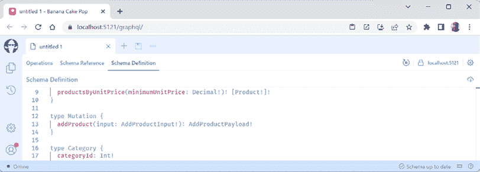

图 12.11：使用 GraphQL 突变修改产品模式

1.  注意 `addProduct` 突变及其相关类型的完整模式定义，如下面的代码所示：

    ```cs
    type Mutation {
      addProduct(input: AddProductInput!): AddProductPayload!
    }
    type Product {
      productId: Int!
      productName: String!
      supplierId: Int
      categoryId: Int
      quantityPerUnit: String
      unitPrice: Decimal
      unitsInStock: Short
      unitsOnOrder: Short
      reorderLevel: Short
      discontinued: Boolean!
      category: Category
      supplier: Supplier
      orderDetails: [OrderDetail!]!
    }
    ...
    type AddProductPayload {
      product: Product!
    }
    input AddProductInput {
      productName: String!
      supplierId: Int
      categoryId: Int
      quantityPerUnit: String!
      unitPrice: Decimal
      unitsInStock: Short
      unitsOnOrder: Short
      reorderLevel: Short
      discontinued: Boolean!
    } 
    ```

1.  点击 **操作** 选项卡，如果需要，创建一个新的空白文档，然后输入一个突变来添加一个名为 `Tasty Burgers` 的新产品。然后，从返回的 `product` 对象中，只需选择 ID 和名称，如下面的代码所示：

    ```cs
    mutation AddProduct {
      addProduct(
        input: {
          productName: "Tasty Burgers"
          supplierId: 1
          categoryId: 2
          quantityPerUnit: "6 per box"
          unitPrice: 40
          unitsInStock: 0
          unitsOnOrder: 0
          reorderLevel: 0
          discontinued: false
        }
      )
      {
        product {
          productId
          productName
        }
      }
    } 
    ```

1.  点击 **运行**，注意新产品已成功添加，并由 SQL Server 数据库分配了下一个连续编号，这可能是任何大于 77 的数字，具体取决于你是否已经添加了一些其他产品，如下面的输出和 *图 12.12* 所示：

    ```cs
    {
      "data": {
        "addProduct": {
          "product": {
            "productId": 79,
            "productName": "Tasty Burgers",
          }
        }
      }
    } 
    ```

    **警告！** 请注意分配给新添加产品的 ID。在下一节中，你将更新此产品然后删除它。你不能删除任何 ID 在 1 到 77 之间的现有产品，因为它们与其他表相关联，这样做会引发引用完整性异常！

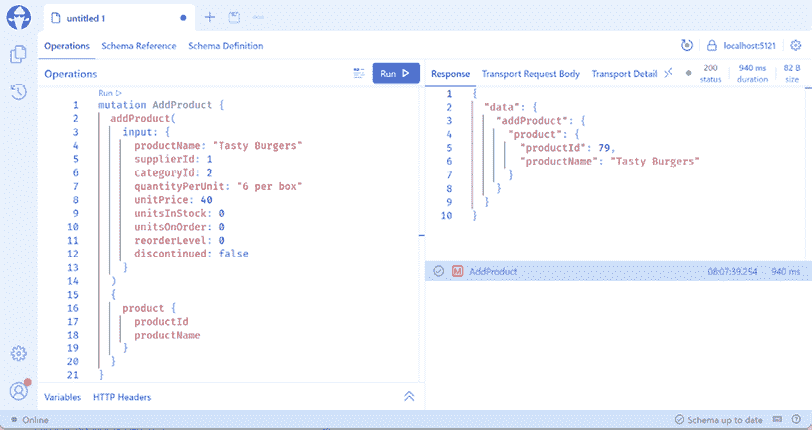

图 12.12：使用 GraphQL 突变添加新产品

1.  关闭浏览器，并关闭 web 服务器。

## 将更新和删除作为突变实现

接下来，我们将定义突变来更新产品的单价，所有“单位”字段，以及删除一个产品：

1.  在`Mutation.cs`中，定义三个`record`类型来表示执行两个`updateProduct`和一个`deleteProduct`突变所需的输入，如下所示代码：

    ```cs
    public record UpdateProductPriceInput(
      int? ProductId,
      decimal? UnitPrice);
    public record UpdateProductUnitsInput(
      int? ProductId,
      short? UnitsInStock,
      short? UnitsOnOrder,
      short? ReorderLevel);
    public record DeleteProductInput(
      int? ProductId); 
    ```

1.  在`Mutation.cs`中，定义两个类类型来表示从`update`或`delete`突变返回结果所需的类型，包括操作是否成功，如下所示代码：

    ```cs
    public class UpdateProductPayload
    {
      public UpdateProductPayload(Product? product, bool updated)
      {
        Product = product;
        Success = updated;
      }
      public Product? Product { get; }
      public bool Success { get; }
    }
    public class DeleteProductPayload
    {
      public DeleteProductPayload(bool deleted)
      {
        Success = deleted;
      }
      public bool Success { get; }
    } 
    ```

1.  在`Mutation.cs`文件中，在`Mutation`类中，定义三个方法来实现两个`updateProduct`和一个`deleteProduct`突变，如下所示代码：

    ```cs
    public async Task<UpdateProductPayload> UpdateProductPriceAsync(
      UpdateProductPriceInput input, NorthwindContext db)
    {
      Product? product = await db.Products.FindAsync(input.ProductId);
      int affectedRows = 0;
      if (product is not null)
      {
        product.UnitPrice = input.UnitPrice;
        affectedRows = await db.SaveChangesAsync();
      }
      return new UpdateProductPayload(product, 
        updated: affectedRows == 1);
    }
    public async Task<UpdateProductPayload> UpdateProductUnitsAsync(
      UpdateProductUnitsInput input, NorthwindContext db)
    {
      Product? product = await db.Products.FindAsync(input.ProductId);
      int affectedRows = 0;
      if (product is not null)
      {
        product.UnitsInStock = input.UnitsInStock;
        product.UnitsOnOrder = input.UnitsOnOrder;
        product.ReorderLevel = input.ReorderLevel;
        affectedRows = await db.SaveChangesAsync();
      }
      return new UpdateProductPayload(product,
        updated: affectedRows == 1);
    }
    public async Task<DeleteProductPayload> DeleteProductAsync(
      DeleteProductInput input, NorthwindContext db)
    {
      Product? product = await db.Products.FindAsync(input.ProductId);
      int affectedRows = 0;
      if (product is not null)
      {
        db.Products.Remove(product);
        affectedRows = await db.SaveChangesAsync();
      }
      return new DeleteProductPayload(
        deleted: affectedRows == 1);
    } 
    ```

1.  如果你的数据库服务器没有运行，例如，因为你正在 Docker、虚拟机或云中托管它，那么请确保启动它。

1.  启动`Northwind.GraphQL.Service`项目，使用`https`配置文件而不进行调试。

1.  在**香蕉蛋糕棒**中，点击**+**来打开一个新标签页。

1.  编写一个命名查询来请求你添加的产品，例如，使用`productId`大于`77`，如下所示标记：

    ```cs
    query NewProducts {
      products(where: { productId: { gt: 77 } }) {
        productId
        productName
        unitPrice
        unitsInStock
        unitsOnOrder
        reorderLevel
      }
    } 
    ```

1.  点击**运行**，并注意响应包括你之前添加的新产品，单价为`40`，如下所示输出：

    ```cs
    {
      "data": {
        "products": [
          {
            "productId": 79,
            "productName": "Tasty Burgers",
            "unitPrice": 40,
            "unitsInStock": 0,
            "unitsOnOrder": 0,
            "reorderLevel": 0
          }
        ]
      }
    } 
    ```

1.  记录你添加的产品的`productId`。在我的情况下，它是`79`。

1.  在**香蕉蛋糕棒**中，点击**+**来打开一个新标签页。

1.  输入一个突变来更新你新产品的单价为`75`，然后从返回的`product`对象中，仅选择 ID、名称、单价和库存单位，如下所示代码：

    ```cs
    mutation UpdateProductPrice {
      updateProductPrice(
        input: {
          productId: 79
          unitPrice: 75
        }
      ) 
      {
        product {
          productId
          productName
          unitPrice
          unitsInStock
        }
      }
    } 
    ```

1.  点击**运行**，并注意响应，如下所示输出：

    ```cs
    {
      "data": {
        "updateProductPrice": {
          "product": {
            "productId": 79,
            "productName": "Tasty Burgers",
            "unitPrice": 75,
            "unitsInStock": 0
          }
        }
      }
    } 
    ```

1.  点击**+**来打开一个新标签页，输入一个突变来更新现有产品的单位，然后从返回的`product`对象中仅选择 ID、名称、单价和库存单位，如下所示代码：

    ```cs
    mutation UpdateProductUnits {
      updateProductUnits(
        input: {
          productId: 79
          unitsInStock: 20
          unitsOnOrder: 0
          reorderLevel: 10
        }
      ) 
      {
        success
      }
    } 
    ```

1.  点击**运行**，并注意响应，如下所示输出：

    ```cs
    {
      "data": {
        "updateProductUnits": {
          "success": true
        }
      }
    } 
    ```

1.  在查询标签页中请求新产品，点击**运行**，并注意响应，如下所示输出：

    ```cs
    {
      "data": {
        "products": [
          {
            "productId": 79,
            "productName": "Tasty Burgers",
            "unitPrice": 75,
            "unitsInStock": 20,
            "unitsOnOrder": 0,
            "reorderLevel": 10
          }
        ]
      }
    } 
    ```

1.  点击**+**来打开一个新标签页，并输入一个突变来删除产品并显示是否成功，如下所示代码：

    ```cs
    mutation DeleteProduct {
      deleteProduct(
        input: {
          productId: 79
        }
      ) 
      {
        success
      }
    } 
    ```

    **警告！**你将无法删除在其他表中引用的产品。ID 1 到 77 将抛出引用完整性异常。

1.  点击**运行**，并注意响应，如下所示输出：

    ```cs
    {
      "data": {
        "deleteProduct": {
          "success": true
        }
      }
    } 
    ```

1.  确认产品已被删除，可以通过重新运行查询新产品的查询来验证，并注意你将得到一个空数组，如下所示输出：

    ```cs
    {
      "data": {
        "products": []
      }
    } 
    ```

1.  关闭浏览器，并关闭 Web 服务器。

# 实现 GraphQL 订阅

GraphQL 订阅默认通过 WebSockets 工作，但也可以通过**服务器发送事件**（**SSE**）、SignalR 或甚至 gRPC 工作。

想象一下，一个客户端应用程序希望在产品单价降低时收到通知。如果客户端能够订阅一个在单价降低时被触发的事件，而不是必须查询单价的变化，那就太好了。

## 向 GraphQL 服务添加订阅和主题

让我们将此功能添加到我们的 GraphQL 服务中，使用订阅：

1.  添加一个名为 `ProductDiscount.cs` 的新类文件。

1.  修改内容以定义一个模型，通知客户端关于产品单价降低的信息，如下面的代码所示：

    ```cs
    namespace Northwind.GraphQL.Service;
    public class ProductDiscount
    {
      public int? ProductId { get; set; }
      public decimal? OriginalUnitPrice { get; set; }
      public decimal? NewUnitPrice { get; set; }
    } 
    ```

1.  添加一个名为 `Subscription.cs` 的新类文件。

1.  修改内容以定义一个名为 `OnProductDiscounted` 的订阅事件（也称为主题），客户端可以订阅，如下面的代码所示：

    ```cs
    namespace Northwind.GraphQL.Service;
    public class Subscription
    {
      [Subscribe]
      [Topic]
      public ProductDiscount OnProductDiscounted(
        [EventMessage] ProductDiscount productDiscount)
          => productDiscount;
    } 
    ```

1.  在 `Mutation.cs` 的 `UpdateProductPriceAsync` 方法中，添加语句，在产品单价降低时通过主题发送消息，如下面的代码所示：

    ```cs
    public async Task<UpdateProductPayload> UpdateProductPriceAsync(
      UpdateProductPriceInput input, NorthwindContext db**,**
     **ITopicEventSender eventSender**)
    {
      Product? product = await db.Products.FindAsync(input.ProductId);
      int affectedRows = 0;
      if (product is not null)
      {
    **if** **(input.UnitPrice < product.UnitPrice)**
     **{**
    **// If the product has been discounted,**
    **// send a message to subscribers.**
     **ProductDiscount productDiscount =** **new****()**
     **{**
     **ProductId = input.ProductId,**
     **OriginalUnitPrice = product.UnitPrice,**
     **NewUnitPrice = input.UnitPrice**
     **};**
    **await** **eventSender.SendAsync(topicName:**
    **nameof****(Subscription.OnProductDiscounted),**
     **message: productDiscount);**
     **}**
        product.UnitPrice = input.UnitPrice;
        affectedRows = await db.SaveChangesAsync();
      }
      return new UpdateProductPayload(product,
        updated: affectedRows == 1);
    } 
    ```

1.  在 `Program.cs` 中，配置 GraphQL 服务以注册 `Subscription` 类，并将活动订阅存储在内存中，如下面的代码所示：

    ```cs
    builder.Services
      .AddGraphQLServer()
      .AddFiltering()
      .AddSorting()
     **.AddSubscriptionType<Subscription>()**
     **.AddInMemorySubscriptions()**
      .RegisterDbContext<NorthwindContext>()
      .AddQueryType<Query>()
      .AddMutationType<Mutation>(); 
    ```

    除了内存中，您还可以使用 Redis 和其他数据存储来跟踪活动订阅。

1.  可选地，在构建**app**后，配置 WebSocket 的使用，如下面的代码所示：

    ```cs
    app.UseWebSockets(); // For subscriptions. 
    ```

    这是个可选步骤，因为 GraphQL 服务可以回退到使用 `https` 上的 SSE。

## 探索订阅主题

让我们订阅一个主题并查看结果：

1.  使用**https**配置文件启动**Northwind.GraphQL.Service**项目，不进行调试。

1.  在**香蕉蛋糕棒**中，点击**+**以打开新标签页。

1.  点击**模式参考**标签页，点击**订阅**类型，并注意名为**onProductDiscounted**的主题，如图*12.13*所示：

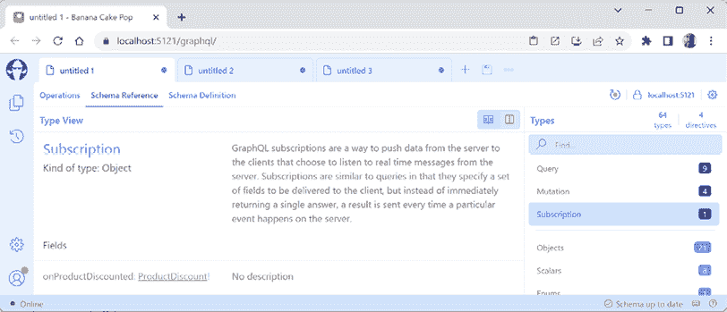

图 12.13：带有主题的订阅

1.  点击**操作**，输入对主题的订阅，并选择要在结果中显示的所有字段，如下面的代码所示：

    ```cs
    subscription {
      onProductDiscounted {
        productId
        originalUnitPrice
        newUnitPrice
      }
    } 
    ```

1.  点击**运行**，并注意订阅开始但尚未显示任何结果。

1.  点击**+**以打开新标签页，并输入一个更新现有产品 `1` 的单价为 `8.99` 的变异。然后从返回的 `product` 对象中选择 ID 和单价，并显示更新是否成功，如下面的代码所示：

    ```cs
    mutation UpdateProductPrice {
      updateProductPrice(
        input: {
          productId: 1
          unitPrice: 8.99
        }
      ) 
      {
        product {
          productId
          unitPrice
        }
        success
      }
    } 
    ```

1.  点击**运行**，并注意以下输出中的响应：

    ```cs
    {
      "data": {
        "updateProductPrice": {
          "product": {
            "productId": 1,
            "unitPrice": 8.99
          },
          "success": true
        }
      }
    } 
    ```

1.  切换回包含订阅的标签页，并注意响应以及订阅仍然处于活动状态，这可以通过标签页上的旋转器和**取消**按钮来指示，如图*12.14*所示：

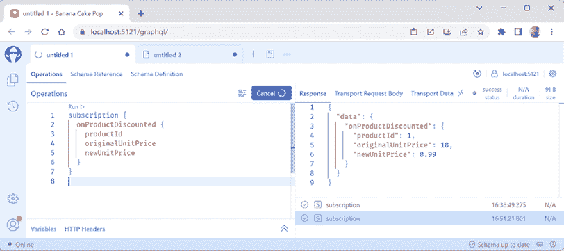

图 12.14：活动订阅显示旋转器

1.  切换回包含更新变异的标签页，将单价更改为 `7.99`，然后点击**运行**。然后切换回包含订阅的标签页，并注意它也收到了该更新通知。

1.  切换回更新变体的标签页，将单价更改为 `9.99`，然后点击 **运行**。然后，切换回订阅的标签页，并注意它没有收到任何通知，因为单价是增加的，而不是减少的。

1.  关闭浏览器，并关闭 web 服务器。

# 练习和探索

通过回答一些问题、进行一些实际操作练习，以及通过深入研究本章主题来测试你的知识和理解。

## 练习 12.1 – 测试你的知识

回答以下问题：

1.  GraphQL 服务使用什么传输协议？

1.  GraphQL 使用什么媒体类型进行其查询？

1.  你如何参数化 GraphQL 查询？

1.  使用 Strawberry Shake 而不是常规 HTTP 客户端进行 GraphQL 查询有哪些好处？

1.  你如何将新产品插入 Northwind 数据库？

## 练习 12.2 – 探索主题

使用下一页上的链接了解本章涵盖主题的更多详细信息：

[`github.com/markjprice/apps-services-net8/blob/main/docs/book-links.md#chapter-12---combining-data-sources-using-graphql`](https://github.com/markjprice/apps-services-net8/blob/main/docs/book-links.md#chapter-12---combining-data-sources-using-graphql)

## 练习 12.3 – 练习构建 .NET 客户端

在 `HomeController.cs` 中，添加一个名为 `Categories` 的操作方法，并实现它以查询 `categories` 字段，其中包含一个用于 `id` 的变量。在页面上，允许访问者提交 `id`，并注意类别信息和其产品列表。

# 摘要

在本章中，你学习了以下内容：

+   一些 GraphQL 的概念。

+   如何构建一个 `Query` 类，其中包含表示可查询实体的字段。

+   如何使用 Banana Cake Pop 工具探索 GraphQL 服务架构。

+   如何使用 REST 客户端扩展向 GraphQL 服务 POST 数据。

+   如何为 GraphQL 服务创建 .NET 客户端。

+   如何实现 GraphQL 变更。

+   如何实现 GraphQL 订阅。

在下一章中，你将了解可以用来实现高效微服务的 gRPC 服务技术。

# 在 Discord 上了解更多

要加入本书的 Discord 社区——在那里您可以分享反馈、向作者提问，并了解新书发布——请扫描下面的二维码：

[`packt.link/apps_and_services_dotnet8`](https://packt.link/apps_and_services_dotnet8)


