# 使用 gRPC 构建高效的微服务

在本章中，您将了解 gRPC，它使开发者能够构建可以在大多数平台上高效通信的服务。

然而，网络浏览器并不完全支持对 HTTP/2 所有功能的程序性访问，而 gRPC 需要这些功能。这使得 gRPC 在实现中间层到层服务和微服务时最为有用，因为它们必须在多个微服务之间进行大量通信以完成完整任务。提高这种通信的效率对于微服务的可扩展性和性能的成功至关重要。

模块化单体、两层、客户端到服务风格的服务天生更有效率，因为模块之间的通信是在进程内进行的，整个服务与客户端之间只有一层网络通信。

微服务架构有更多层级，因此许多微服务之间有更多的网络通信层。在这些层之间拥有高度高效的通信变得尤为重要，gRPC 就是为了实现网络通信的超高效而设计的，如*图 13.1*所示：

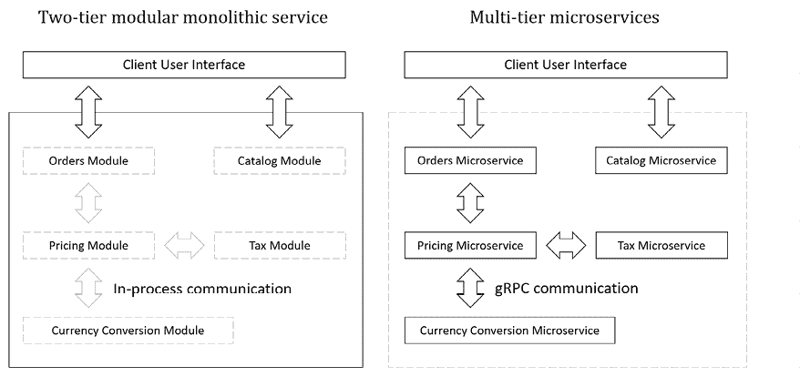

图 13.1：比较两层模块化单体服务和多层微服务

**良好实践**：在过去的十年左右，人们普遍认为微服务对所有场景都是最佳选择，因此对于一个新的系统，最好是立即使用酷炫的微服务而不是作为传统的单体来实施。最近，人们开始对这个假设进行反驳。行业似乎已经达成共识，建议首先将系统作为一个模块化单体来实施。只有在必要时，才应该将模块拆分成实际的微服务。由于微服务之间额外的网络通信导致其本质上较慢，您还需要考虑额外的微服务部署和编排的协调和复杂性是否值得。

本章将涵盖以下主题：

+   理解 gRPC

+   构建 gRPC 服务和客户端

+   为 EF Core 模型实现 gRPC

+   将 gRPC 进一步发展

+   处理日期、时间和十进制数

+   实现拦截器和处理故障

+   实现 gRPC JSON 转换

# 理解 gRPC

gRPC 是一个现代、开源、高性能的**远程过程调用**（RPC）框架，可以在任何环境中运行。RPC 是指一台计算机通过网络调用另一台计算机上的过程或服务，就像调用本地过程一样。它是一个客户端-服务器架构的例子。

您可以在以下链接中了解更多关于 RPC 的信息：[`en.wikipedia.org/wiki/Remote_procedure_call`](https://en.wikipedia.org/wiki/Remote_procedure_call)。

## gRPC 的工作原理

gRPC 服务开发者为可以远程调用的方法定义一个服务接口，包括定义方法参数和返回类型。服务实现此接口并运行 gRPC 服务器以处理客户端调用。

在客户端，强类型 gRPC 客户端提供与服务器上相同的方法。

## 使用 .proto 文件定义 gRPC 合约

gRPC 使用以合约优先的 API 开发，支持语言无关的实现。在这种情况下，**合约**是一份协议，表示一个服务将公开一系列具有指定参数和返回类型的方法，以实现预定的行为。希望调用服务的客户端可以确信服务将随着时间的推移继续遵守合约。例如，尽管可能会添加新方法，但现有方法永远不会更改或删除。

使用 `.proto` 文件编写合约，这些文件有自己的语言语法，然后使用工具将它们转换为各种语言，如 C#。服务器和客户端都使用 `.proto` 文件以正确的格式交换消息。

这里是一个使用 `proto3` 语法定义消息请求的 `.proto` 文件示例，该请求使用自定义 `enum`：

```cs
// Setting the syntax must be first non-comment line.
syntax = "proto3"; // proto2 is the default.
/* When this .proto file is used in a .NET project, it will use the
   following C# namespace for the auto-generated code files. */
option csharp_namespace = "Northwind.Grpc.Service";
enum SearchType {
  SEARCHTYPE_UNSPECIFIED = 0;
  SEARCHTYPE_STARTSWITH = 1;
  SEARCHTYPE_CONTAINS = 2;
  SEARCHTYPE_ENDSWITH = 3;
}
message SearchRequest {
  string query = 1; // Fields must have order numbers.
  SearchType search_type = 2;
  int32 page = 3;
  int32 page_size = 4;
}
message SearchResponse {
  /* Message types can be nested and/or repeated to create the 
     equivalent of collections or arrays. */
  repeated SearchResult results = 1;
}
message SearchResult {
  string url = 1;
  string title = 2;
  repeated string authors = 3;
}
service Searcher {
  rpc PerformSearch (SearchRequest) returns (SearchResponse);
} 
```

**更多信息**：Protobuf 风格指南建议使用全部小写并带有下划线的字段名称，全部大写并带有下划线的 `enum` 值等。C# 工具将自动将自动为您创建的自动生成的类型转换为 .NET 风格。您可以在以下链接中阅读更多建议：[`protobuf.dev/programming-guides/style/`](https://protobuf.dev/programming-guides/style/)。

字段必须赋予一个介于 1 和 536,870,911 之间的唯一编号。您不能使用 19,000 到 19,999 的范围，因为这些是为 Protocol Buffers 实现保留的。这些数字在序列化期间代替字段名称使用，以在二进制格式中节省空间。

**良好实践**：一旦开始使用消息，字段编号就不能更改，因为它们与 gRPC 使用的非常高效的线格式紧密绑定。更改字段编号相当于删除并创建一个新的字段。您也不应重复使用字段编号。您可以在以下链接中了解误用字段编号的后果：[`protobuf.dev/programming-guides/proto3/#consequences`](https://protobuf.dev/programming-guides/proto3/#consequences)。

字段数据类型不能为空，因此所有数字类型默认为零 (`0`)。数字和其他字段数据类型在 *表 13.1* 中显示：

| **类型** | **描述** |
| --- | --- |
| `string` | 文本值。默认为空字符串。 |
| `bool` | 布尔值。默认为 `false`。 |
| `int32`, `int64` | 可变长度编码的 32 位和 64 位整数值。尽管它们可以用于负值，但使用 `sint32` 或 `sint64` 更有效。C# 中 `int` 和 `long` 的等效值。 |
| `sint32`，`sint64`，`uint32`，`uint64` | 可变长度编码的 32 位和 64 位有符号和无符号整数值。C# 中 `int` 和 `long` 的等效物，以及 `uint` 和 `ulong`。 |
| `fixed32`，`fixed64`，`sfixed32`，`sfixed64` | 32 位始终为 4 个字节，64 位始终为 8 个字节。C# 中 `uint` 和 `ulong` 以及 `int` 和 `long` 的等效物。 |
| `float`，`double` | 浮点实数。 |
| `bytes` | 最大 2³² 字节（4,294,967,296）。使用 `ByteString.CopyFrom(byte[] data)` 创建一个新实例。使用 `ToByteArray()` 获取字节数组。默认为空的 `ByteString` 值。 |

表 13.1：Protobuf 中的数字和其他字段数据类型

**更多信息**：官方指南可在以下链接找到：[`protobuf.dev/programming-guides/proto3/`](https://protobuf.dev/programming-guides/proto3/)。

## gRPC 优点

gRPC 通过使用不适用于人类阅读的二进制序列化 **Protobuf** 来最小化网络使用，与用于 Web 服务的 JSON 或 XML 不同。

gRPC 需要 HTTP/2，这比早期版本（如二进制帧和压缩，以及 HTTP/2 调用的多路复用）提供了显著的性能优势。

二进制帧表示客户端和服务器之间如何传输 HTTP 消息。HTTP/1.x 使用换行符分隔的纯文本。HTTP/2 将通信分割成更小的消息（帧），并以二进制格式编码。多路复用意味着将来自不同来源的多个消息组合成一个消息，以更有效地使用共享资源，如网络传输。

**更多信息**：如果您想了解更多关于 HTTP/2 以及它是如何使 gRPC 更高效的信息，您可以在以下链接中阅读：[`grpc.io/blog/grpc-on-http2/`](https://grpc.io/blog/grpc-on-http2/)。

## gRPC 限制

gRPC 的主要限制是它不能在 Web 浏览器中使用，因为没有浏览器提供支持 gRPC 客户端所需级别的控制。例如，浏览器不允许调用者要求使用 HTTP/2。

对于开发人员来说，另一个限制是由于消息的二进制格式，诊断和监控问题更困难。许多工具不理解该格式，无法以人类可读的格式显示消息。

有一个名为 **gRPC-Web** 的倡议，它添加了一个额外的代理层，代理将请求转发到 gRPC 服务器。然而，由于列出的限制，它只支持 gRPC 的一个子集。

## gRPC 方法的类型

gRPC 有四种方法类型。

第一种方法是最常见的：

+   **单一** 方法具有结构化的请求和响应消息。单一方法在返回响应消息时完成。在不要求流的所有场景中应选择单一方法。

当必须交换大量数据时，使用流式方法，它们通过使用字节流来这样做。它们具有 `stream` 关键字前缀，可以是输入参数、输出参数或两者。

三个流式方法如下：

+   **服务器流式**方法从客户端接收请求消息并返回一个流。可以通过流返回多个消息。服务器流式调用在服务器端方法返回时结束，但服务器端方法可能运行直到从客户端收到取消令牌。

+   **客户端流式**方法仅从客户端接收流，不包含任何消息。服务器端方法处理流，直到准备好返回响应消息。一旦服务器端方法返回消息，客户端流式调用完成。

+   **双向流式**方法仅从客户端接收流，不包含任何消息，并且仅通过第二个流返回数据。调用在服务器端方法返回时完成。一旦调用双向流式方法，客户端和服务可以在任何时间互相发送消息。

在本书中，我们将仅查看一元方法的细节。如果您希望下一版涵盖流式方法，请告知我。

## 微软的 gRPC 包

微软投资构建了一套用于 .NET 与 gRPC 一起工作的包，自 2021 年 5 月以来，它是微软推荐的 .NET gRPC 实现。

微软的 .NET gRPC 包含：

+   `Grpc.AspNetCore` 用于在 ASP.NET Core 中托管 gRPC 服务。

+   `Grpc.Net.Client` 通过在 `HttpClient` 上构建为任何 .NET 项目添加 gRPC 客户端支持。

+   `Grpc.Net.ClientFactory` 通过在 `HttpClientFactory` 上构建为任何 .NET 代码库添加 gRPC 客户端支持。

您可以在以下链接了解更多信息：[`github.com/grpc/grpc-dotnet`](https://github.com/grpc/grpc-dotnet)。

# 构建一个 gRPC 服务和客户端

让我们看看一个示例服务客户端，用于发送和接收简单消息。

## 构建一个 Hello World gRPC 服务

我们将首先使用提供的标准项目模板之一构建 gRPC 服务：

1.  使用您首选的代码编辑器创建一个新项目，如下列所示：

    +   项目模板：**ASP.NET Core gRPC 服务** / `grpc`

    +   解决方案文件和文件夹：`Chapter13`

    +   项目文件和文件夹：`Northwind.Grpc.Service`

    +   **启用 Docker**：已清除。

    +   **不要使用顶层语句**：已清除。

    +   **启用原生 AOT 发布**：已选择。

    **良好实践**：请确保选择**启用原生 AOT 发布**。从 .NET 8 及以后版本开始，gRPC 项目可以针对原生平台**提前编译**（**AOT**），这提供了改进的性能和缩短的启动时间，这对于频繁重新部署和扩展时上下文切换的微服务来说非常重要。

1.  在 `Protos` 文件夹中的 `greet.proto` 中，请注意它定义了一个名为 `Greeter` 的服务，以及一个名为 `SayHello` 的方法，该方法交换名为 `HelloRequest` 和 `HelloReply` 的消息，如下面的代码所示：

    ```cs
    syntax = "proto3";
    option csharp_namespace = "Northwind.Grpc.Service";
    package greet;
    // The greeting service definition.
    service Greeter {
      // Sends a greeting
      rpc SayHello (HelloRequest) returns (HelloReply);
    }
    // The request message containing the user's name.
    message HelloRequest {
      string name = 1;
    }
    // The response message containing the greetings.
    message HelloReply {
      string message = 1;
    } 
    ```

    在 Visual Studio Code 中处理`.proto`文件时，你可以安装扩展**vscode-proto3**（`zxh404.vscode-proto3`）。对于 Rider，你可以从 JetBrains 安装 Protocol Buffers 插件，如下链接所示：[`plugins.jetbrains.com/plugin/14004-protocol-buffers`](https://plugins.jetbrains.com/plugin/14004-protocol-buffers)。

1.  在`Northwind.Grpc.Service.csproj`中，注意这个项目启用了原生 AOT 发布，`.proto`文件已注册用于服务器端使用，并且包含了实现托管在 ASP.NET Core 中的 gRPC 服务的包引用，如图中高亮显示的标记所示：

    ```cs
    <Project Sdk="Microsoft.NET.Sdk.Web">
      <PropertyGroup>
        <TargetFramework>net8.0</TargetFramework>
        <Nullable>enable</Nullable>
        <ImplicitUsings>enable</ImplicitUsings>
        <InvariantGlobalization>true</InvariantGlobalization>
     **<PublishAot>****true****</PublishAot>**
      </PropertyGroup>
      <ItemGroup>
     **<Protobuf Include=****"Protos\greet.proto"** **GrpcServices=****"Server"** **/>**
      </ItemGroup>
      <ItemGroup>
     **<PackageReference Include=****"Grpc.AspNetCore"** **Version=****"2.59.0"** **/>**
      </ItemGroup>
    </Project> 
    ```

    对于 JetBrains Rider，如果缺少，请手动添加`<PublishAot>true</PublishAot>`。

1.  将不变的全局化设置为`false`，如下所示：

    ```cs
    <InvariantGlobalization>false</InvariantGlobalization> 
    ```

1.  在`Services`文件夹中的`GreeterService.cs`中，注意它继承自一个名为`GreeterBase`的类，并且它通过一个接受`HelloRequest`输入参数并返回`HelloReply`的`SayHello`方法异步实现`Greeter`服务合同，如下所示：

    ```cs
    using Grpc.Core;
    using Northwind.Grpc.Service
    namespace Northwind.Grpc.Service.Services
    {
      public class GreeterService : Greeter.GreeterBase
      {
        private readonly ILogger<GreeterService> _logger;
        public GreeterService(ILogger<GreeterService> logger)
        {
          _logger = logger;
        }
        public override Task<HelloReply> SayHello(
          HelloRequest request, ServerCallContext context)
        {
          return Task.FromResult(new HelloReply
          {
            Message = "Hello " + request.Name
          });
        }
      }
    } 
    ```

1.  如果你使用的是 Visual Studio 2022，在**解决方案资源管理器**中，点击**显示所有文件**。如果你使用的是 JetBrains Rider，那么将鼠标悬停在**解决方案**面板上，并点击眼睛图标。

1.  在`obj\Debug\net8.0\Protos`文件夹中，注意从`greet.proto`文件自动生成的两个名为`Greet.cs`和`GreetGrpc.cs`的类文件，如图 13.2 所示：

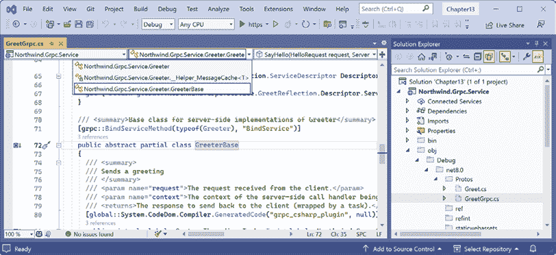

图 13.2：从.proto 文件自动生成的 gRPC 服务类文件

1.  在`GreetGrpc.cs`中，注意`Greeter.GreeterBase`类，这是`GreeterService`类继承的。你不需要了解这个基类的实现细节，但你应该知道它是处理 gRPC 高效通信所有细节的部分。

1.  如果你使用的是 Visual Studio 2022，在**解决方案资源管理器**中，展开**依赖项**，展开**包**，展开**Grpc.AspNetCore**，并注意它依赖于 Google 的**Google.Protobuf**包，以及 Microsoft 的**Grpc.AspNetCore.Server.ClientFactory**和**Grpc.Tools**包，如图 13.3 所示：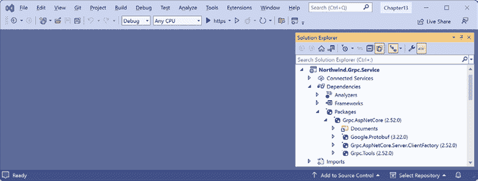

    图 13.3：Grpc.AspNetCore 包引用了 Grpc.Tools 和 Google.Protobuf 包

    `Grpc.Tools`包从注册的`.proto`文件生成 C#类文件，这些类文件使用 Google 包中定义的类型来实现对 Protobuf 序列化格式的序列化。`Grpc.AspNetCore.Server.ClientFactory`包在一个.NET 项目中包含了 gRPC 的服务端和客户端支持。

1.  在`Program.cs`中，在配置服务的部分，注意调用将 gRPC 添加到`Services`集合，如下所示：

    ```cs
    builder.Services.AddGrpc(); 
    ```

1.  在`Program.cs`中，在配置 HTTP 管道的部分，注意调用映射`Greeter`服务，如下所示：

    ```cs
    app.MapGrpcService<GreeterService>(); 
    ```

1.  在 `Properties` 文件夹中，打开 `launchSettings.json` 并修改 `applicationUrl` 设置，以使用端口 `5131` 进行 `https` 连接和端口 `5132` 进行 `http` 连接，如下所示（高亮显示）：

    ```cs
    {
      "$schema": "http://json.schemastore.org/launchsettings.json",
      "profiles": {
        "http": {
          "commandName": "Project",
          "dotnetRunMessages": true,
          "launchBrowser": false,
    **"****applicationUrl"****:****"http://localhost:5132"****,**
          "environmentVariables": {
            "ASPNETCORE_ENVIRONMENT": "Development"
          }
        },
        "https": {
          "commandName": "Project",
          "dotnetRunMessages": true,
          "launchBrowser": false,
    **"applicationUrl"****:****"https://localhost:5131;http://localhost:5132"****,**
          "environmentVariables": {
            "ASPNETCORE_ENVIRONMENT": "Development"
          }
        }
      }
    } 
    ```

1.  构建 `Northwind.Grpc.Service` 项目。

## 项目文件项目配置

在我们继续之前，让我们快速回顾一下常见的项目文件项目配置语法。

Visual Studio 2022 生成的项目配置通常使用属性来表示项目属性，如下所示：

```cs
<Protobuf Include="Protos\greet.proto" GrpcServices="Client" /> 
```

未显式设置的属性将使用其默认值。

由其他工具如 JetBrains Rider 生成的项目配置通常使用子元素来表示项目属性，如下所示：

```cs
<Protobuf>
  <Include>Protos\greet.proto</Include>
  <GrpcServices>Client</>
  <Access>Public</Access>
  <ProtoCompile>True</ProtoCompile>
  <CompileOutputs>True</CompileOutputs>
  <OutputDir>obj\Debug\net8.0\</OutputDir>
  <Generator>MSBuild:Compile</Generator>
<Protobuf> 
```

它们通常都能达到相同的目的。第一个更简洁，推荐使用。

## 构建 Hello World gRPC 客户端

我们将添加一个 ASP.NET Core MVC 网站项目，然后添加 gRPC 客户端包以使其能够调用 gRPC 服务：

1.  使用您首选的代码编辑器添加一个新项目，如下列表所示：

    +   项目模板：**ASP.NET Core Web App (Model-View-Controller)** / `mvc`

    +   解决方案文件和文件夹：`Chapter13`

    +   项目文件和文件夹：`Northwind.Grpc.Client.Mvc`

    +   **认证类型**：无。

    +   **配置为 HTTPS**：已选中。

    +   **启用 Docker**：已清除。

    +   **不要使用顶级语句**：已清除。

1.  在 `Northwind.Grpc.Client.Mvc` 项目中，将警告视为错误，添加 Microsoft 的 gRPC 客户端工厂和工具以及 Google 的 .NET Protocol Buffers 库的包引用，如下所示：

    ```cs
    <ItemGroup>
      <PackageReference Include="Google.Protobuf" Version="3.24.4" />
      <PackageReference Include="Grpc.Net.ClientFactory" Version="2.57.0" />
      <PackageReference Include="Grpc.Tools" Version="2.58.0">
        <PrivateAssets>all</PrivateAssets>
        <IncludeAssets>runtime; build; native; contentfiles; 
          analyzers; buildtransitive</IncludeAssets>
      </PackageReference>
    </ItemGroup> 
    ```

    **良好实践**：`Grpc.Net.ClientFactory` 包引用实现 .NET 项目中 gRPC 客户端支持的 `Grpc.Net.Client` 包，但它不引用其他包如 `Grpc.Tools` 或 `Google.Protobuf`。我们必须显式引用这些包。`Grpc.Tools` 包仅在开发期间使用，因此被标记为 `PrivateAssets=all` 以确保工具不会与生产网站一起发布。

1.  在 `Properties` 文件夹中，打开 `launchSettings.json`，并为 `https` 配置文件修改 `applicationUrl` 设置，以使用端口 `5133` 进行 `https` 连接和端口 `5134` 进行 `http` 连接，如下所示（部分高亮显示）：

    ```cs
    "profiles": {
      ...
    **"https"****:****{**
        "commandName": "Project",
        "dotnetRunMessages": true,
        "launchBrowser": true,
    **"applicationUrl"****:****"https://localhost:5133;http://localhost:5134"****,**
        "environmentVariables": {
          "ASPNETCORE_ENVIRONMENT": "Development"
        } 
    ```

1.  将 `Protos` 文件夹从 `Northwind.Grpc.Service` 项目/文件夹复制到 `Northwind.Grpc.Client.Mvc` 项目/文件夹。

    在 Visual Studio 2022 中，您可以拖放进行复制。在 Visual Studio Code 或 JetBrains Rider 中，按住 *Ctrl* 或 *Cmd* 键进行拖放。

1.  在 `Northwind.Grpc.Client.Mvc` 项目中，在 `Protos` 文件夹中，在 `greet.proto` 中，修改命名空间以匹配当前项目的命名空间，以便自动生成的类将在同一命名空间中，如下所示：

    ```cs
    option csharp_namespace = "Northwind.Grpc.Client.Mvc"; 
    ```

1.  在 `Northwind.Grpc.Client.Mvc` 项目文件中，添加或修改注册 `.proto` 文件的项组，以指示它在客户端侧使用，如下所示高亮显示的标记：

    ```cs
    <ItemGroup>
      <Protobuf Include="Protos\greet.proto" GrpcServices="**Client**" />
    </ItemGroup> 
    ```

    Visual Studio 2022 将为您创建项目组，但默认将 `GrpcServices` 设置为 `Server`，因此您必须手动将其更改为 `Client`。对于其他代码编辑器，您可能需要手动创建整个 `<ItemGroup>`。JetBrains Rider 有更多配置，但您可以忽略它。

1.  构建 `Northwind.Grpc.Client.Mvc` 项目以确保创建自动生成的类。

1.  在 `Northwind.Grpc.Client.Mvc` 项目中，在 `obj\Debug\net8.0\Protos` 文件夹中的 `GreetGrpc.cs` 文件中，注意 `Greeter.GreeterClient` 类，如下部分代码所示：

    ```cs
    public static partial class Greeter
    { 
      ...
      public partial class GreeterClient : grpc::ClientBase<GreeterClient>
      { 
    ```

1.  在 `Program.cs` 中，导入 `Greeter.GreeterClient` 的命名空间，如下所示：

    ```cs
    using Northwind.Grpc.Client.Mvc; // To use Greeter.GreeterClient. 
    ```

1.  在 `Program.cs` 中，在配置服务的部分，编写一个语句将 `GreeterClient` 添加为名为 gRPC 客户端，该客户端将与监听端口 `5131` 的服务通信，如下所示：

    ```cs
    builder.Services.AddGrpcClient<Greeter.GreeterClient>("Greeter",
      options =>
      {
        options.Address = new Uri("https://localhost:5131");
      }); 
    ```

1.  在 `Models` 文件夹中，添加一个名为 `HomeIndexViewModel.cs` 的新类。

1.  在 `HomeIndexViewModel.cs` 中，定义一个类来存储问候语和错误消息，如下所示：

    ```cs
    namespace Northwind.Grpc.Client.Mvc.Models;
    public class HomeIndexViewModel
    {
      public string? Greeting { get; set; }  
      public string? ErrorMessage { get; set; }
    } 
    ```

1.  在 `Controllers` 文件夹中的 `HomeController.cs` 文件中，导入用于与 gRPC 客户端工厂一起工作的命名空间，如下所示：

    ```cs
    using Grpc.Net.ClientFactory; // To use GrpcClientFactory. 
    ```

1.  在 `Controller` 类中，声明一个用于存储 `Greeter Client` 实例的字段，并在构造函数中使用客户端工厂设置它，如下所示高亮显示的代码：

    ```cs
    public class HomeController : Controller
    {
      private readonly ILogger<HomeController> _logger;
    **private****readonly** **Greeter.GreeterClient _greeterClient;**
      public HomeController(ILogger<HomeController> logger**,**
     **GrpcClientFactory factory**)
      {
        _logger = logger;
        _**greeterClient = factory.CreateClient<Greeter.GreeterClient>(****"Greeter"****);**
      } 
    ```

1.  在 `Index` 动作方法中，使方法异步，添加一个名为 `name` 的 `string` 参数，默认值为 `Henrietta`，然后添加语句使用 gRPC 客户端调用 `SayHelloAsync` 方法，传递一个 `HelloRequest` 对象，并将 `HelloReply` 响应存储在 `ViewData` 中，同时捕获任何异常，如下所示高亮显示的代码：

    ```cs
    public **async** **Task<**IActionResult**>** Index(**string** **name =** **"Henrietta"**)
    {
     **HomeIndexViewModel model =** **new****();**
    **try**
     **{**
     **HelloReply reply =** **await** **_greeterClient.SayHelloAsync(**
    **new** **HelloRequest { Name = name });**
     **model.Greeting =** **"Greeting from gRPC service: "** **+ reply.Message;**
     **}**
    **catch** **(Exception ex)**
     **{**
     **_logger.LogWarning(****$"Northwind.Grpc.Service is not responding."****);**
     **model.ErrorMessage = ex.Message;**
     **}**
     return View(model);
    } 
    ```

1.  在 `Views/Home` 中的 `Index.cshtml` 文件中，在 **欢迎** 标题之后，删除现有的 `<p>` 元素，然后添加标记以渲染一个表单供访客输入他们的名字，然后如果他们提交并且 gRPC 服务响应，则输出问候语，如下所示高亮显示的标记：

    ```cs
    **@using Northwind.Grpc.Client.Mvc.Models**
    **@model HomeIndexViewModel**
    @{
      ViewData["Title"] = "Home Page";
    }
    <div class="text-center">
      <h1 class="display-4">Welcome</h1>
     **<div** **class****=****"alert alert-secondary"****>**
     **<form>**
     **<input name=****"name"** **placeholder=****"Enter your name"** **/>**
     **<input type=****"submit"** **/>**
     **</form>**
     **</div>**
     **@if (Model.Greeting** **is****not****null****)**
     **{**
     **<p** **class****=****"alert alert-primary"****>@Model.Greeting</p>**
     **}**
     **@if (Model.ErrorMessage** **is****not****null****)**
     **{**
     **<p** **class****=****"alert alert-danger"****>@Model.ErrorMessage</p>**
     **}**
    </div> 
    ```

    如果您清理 gRPC 项目，那么您将丢失自动生成的类型并看到编译错误。要重新创建它们，只需对 `.proto` 文件进行任何更改或关闭并重新打开项目/解决方案。

## 测试 gRPC 服务和客户端

现在我们可以启动 gRPC 服务并查看 MVC 网站是否可以成功调用它：

1.  不带调试启动 `Northwind.Grpc.Service` 项目。

1.  启动 `Northwind.Grpc.Client.Mvc` 项目。

1.  如果需要，启动浏览器并导航到主页：`https://localhost:5133/`。

1.  注意主页上的问候语，如图 *13.4* 所示：

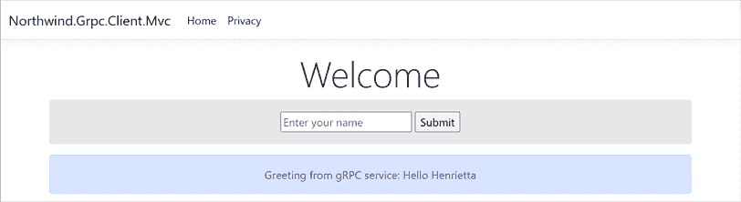

图 13.4：调用 gRPC 服务获取问候后的主页

1.  查看 ASP.NET Core MVC 项目的命令提示符或终端，注意指示 HTTP/2 `POST`在大约 41ms 内由`greet.Greeter/SayHello`端点处理的 info 消息，如下所示：

    ```cs
    info: System.Net.Http.HttpClient.Greeter.LogicalHandler[100]
          Start processing HTTP request POST https://localhost:5131/greet.Greeter/SayHello
    info: System.Net.Http.HttpClient.Greeter.ClientHandler[100]
          Sending HTTP request POST https://localhost:5131/greet.Greeter/SayHello
    info: System.Net.Http.HttpClient.Greeter.ClientHandler[101]
          Received HTTP response headers after 60.5352ms - 200
    info: System.Net.Http.HttpClient.Greeter.LogicalHandler[101]
          End processing HTTP request after 69.1623ms - 200 
    ```

1.  在页面上输入并提交你自己的名字。

1.  关闭浏览器并关闭 Web 服务器。

# 为 EF Core 模型实现 gRPC

现在我们将向 gRPC 项目中添加一个用于处理 Northwind 数据库的服务。

## 实现 gRPC 服务

我们将引用你在*第三章*中创建的 EF Core 模型，即使用 EF Core 为 SQL Server 构建实体模型，然后使用`.proto`文件定义 gRPC 服务的合约，并最终实现该服务。

我们将从简单的`Shippers`表开始，因为它包含的属性较少。每个承运商只有三个属性，一个`int`类型和一个两个`string`类型的值，表中只有三条记录。让我们开始吧：

1.  在`Northwind.Grpc.Service`项目中，添加一个项目引用到 Northwind 数据库上下文项目，如下所示（高亮显示）：

    ```cs
    <ItemGroup>
      <ProjectReference Include="..\..\Chapter03\Northwind.Common.DataContext
    .SqlServer\Northwind.Common.DataContext.SqlServer.csproj" />
    </ItemGroup> 
    ```

    `Include`路径不能有换行符。

1.  在命令提示符或终端中，构建`Northwind.Grpc.Service`项目，如下所示：`dotnet build`。

1.  在`Northwind.Grpc.Service`项目中，在`Protos`文件夹中，添加一个新文件（在 Visual Studio 2022 中，项目模板命名为**Protocol Buffer File**），命名为`shipper.proto`，如下所示：

    ```cs
    syntax = "proto3";
    option csharp_namespace = "Northwind.Grpc.Service";
    package shipper;
    service Shipper {
      rpc GetShipper (ShipperRequest) returns (ShipperReply);
    }
    message ShipperRequest {
      int32 shipper_id = 1;
    }
    message ShipperReply {
      int32 shipper_id = 1;
      string company_name = 2;
      string phone = 3;
    } 
    ```

1.  打开项目文件，添加一个条目以包含`shipper.proto`文件，如下所示（高亮显示）：

    ```cs
    <ItemGroup>
      <Protobuf Include="Protos\greet.proto" GrpcServices="Server" />
     **<Protobuf Include=****"Protos\shipper.proto"** **GrpcServices=****"Server"** **/>**
    </ItemGroup> 
    ```

1.  构建`Northwind.Grpc.Service`项目。

1.  在`Services`文件夹中，添加一个名为`ShipperService.cs`的新类文件，并修改其内容以定义一个使用 Northwind 数据库上下文返回承运商的承运商服务，如下所示：

    ```cs
    using Grpc.Core; // To use ServerCallContext.
    using Northwind.EntityModels; // To use NorthwindContext.
    using ShipperEntity = Northwind.EntityModels.Shipper;
    namespace Northwind.Grpc.Service.Services;
    public class ShipperService : Shipper.ShipperBase
    {
      private readonly ILogger<ShipperService> _logger;
      private readonly NorthwindContext _db;
      public ShipperService(ILogger<ShipperService> logger,
        NorthwindContext context)
      {
        _logger = logger;
        _db = context;
      }
      public override async Task<ShipperReply?> GetShipper(
        ShipperRequest request, ServerCallContext context)
      {
        ShipperEntity? shipper = await _db.Shippers
          .FindAsync(request.ShipperId);
        return shipper is null ? null : ToShipperReply(shipper);
      }
      // A mapping method to convert from a Shipper in the
      // entity model to a gRPC ShipperReply.
      private ShipperReply ToShipperReply(ShipperEntity shipper)
      {
        return new ShipperReply
        {
          ShipperId = shipper.ShipperId,
          CompanyName = shipper.CompanyName,
          Phone = shipper.Phone
        };
      }
    } 
    ```

    `.proto`文件生成代表发送到和从 gRPC 服务发送的消息的类。因此，我们不能使用为 EF Core 模型定义的实体类。我们需要一个像`ToShipperReply`这样的辅助方法，可以将实体类的实例映射到`.proto`生成的类，如`ShipperReply`。这可能是使用 AutoMapper 的好用途，尽管在这种情况下，映射很简单，可以手动编码。

1.  在`Program.cs`中，导入 Northwind 数据库上下文的命名空间，如下所示：

    ```cs
    using Northwind.EntityModels; // To use AddNorthwindContext method. 
    ```

1.  在配置服务的部分，添加一个调用以注册 Northwind 数据库上下文，如下所示：

    ```cs
    builder.Services.AddNorthwindContext(); 
    ```

1.  在配置 HTTP 管道的章节中，在调用注册`GreeterService`之后，添加一个语句以注册`ShipperService`，如下所示：

    ```cs
    app.MapGrpcService<ShipperService>(); 
    ```

## 实现 gRPC 客户端

现在我们可以向 Northwind MVC 网站添加客户端功能：

1.  将`shipper.proto`文件从`Northwind.Grpc.Service`项目的`Protos`文件夹复制到`Northwind.Grpc.Client.Mvc`项目的`Protos`文件夹。

1.  在`Northwind.Grpc.Client.Mvc`项目中，在`shipper.proto`文件中，修改命名空间以匹配当前项目的命名空间，以便自动生成的类将在同一命名空间中，如下所示，代码中高亮显示：

    ```cs
    option csharp_namespace = "Northwind.Grpc.**Client.Mvc**"; 
    ```

1.  在`Northwind.Grpc.Client.Mvc`项目文件中，修改或添加条目以注册`.proto`文件作为客户端端使用，如下所示，代码中高亮显示：

    ```cs
    <ItemGroup>
      <Protobuf Include="Protos\greet.proto" GrpcServices="Client" />
      <Protobuf Include="Protos\shipper.proto" GrpcServices="**Client**" />
    </ItemGroup> 
    ```

    如果你使用的是像 JetBrains Rider 这样的代码编辑器，它会添加额外的配置，我建议你简化前面的标记中的元素。如果不这样做，那么你可能会在接下来的编码任务中遇到错误。

1.  在`Northwind.Grpc.Client.Mvc`项目文件中的`Program.cs`文件中，添加一个语句来注册`ShipperClient`类以连接到监听端口`5131`的 gRPC 服务，如下所示，代码中高亮显示：

    ```cs
    builder.Services.AddGrpcClient<Shipper.ShipperClient>("Shipper",
      options =>
      {
        options.Address = new Uri("https://localhost:5131");
      }); 
    ```

1.  在`Models`文件夹中的`HomeIndexViewModel.cs`文件中，添加一个属性来存储发货的摘要，如下所示，代码中高亮显示：

    ```cs
    public string? ShipperSummary { get; set; } 
    ```

1.  在`Controllers`文件夹中的`HomeController.cs`文件中，声明一个字段来存储一个发货客户端实例，并在构造函数中使用客户端工厂来设置它，如下所示，代码中高亮显示：

    ```cs
    public class HomeController : Controller
    {
      private readonly ILogger<HomeController> _logger;
      private readonly Greeter.GreeterClient _greeterClient;
    **private****readonly** **Shipper.ShipperClient _shipperClient;**
      public HomeController(ILogger<HomeController> logger,
        GrpcClientFactory factory)
      {
        _logger = logger;
        _greeterClient = factory.CreateClient<Greeter.GreeterClient>("Greeter");
        _**shipperClient = factory.CreateClient<Shipper.ShipperClient>(****"Shipper"****);**
      } 
    ```

1.  在`HomeController.cs`文件中的`Index`动作方法中，添加一个名为`id`的参数，并添加调用`Shipper` gRPC 服务以获取匹配的`ShipperId`的语句，如下所示，代码中高亮显示：

    ```cs
    public async Task<IActionResult> Index(
      string name = "Henrietta"**,** **int** **id =** **1**)
    {
      HomeIndexViewModel model = new();
      try
      {
        HelloReply reply = await greeterClient.SayHelloAsync(
          new HelloRequest { Name = name });
        model.Greeting = "Greeting from gRPC service: " + reply.Message;
     **ShipperReply shipperReply =** **await** **_shipperClient.GetShipperAsync(**
    **new** **ShipperRequest { ShipperId = id });**
     **model.ShipperSummary =** **"Shipper from gRPC service: "** **+** 
    **$"ID:** **{shipperReply.ShipperId}****, Name:** **{shipperReply.CompanyName}****,"**
     **+** **$" Phone:** **{shipperReply.Phone}****."****;**
      }
      catch (Exception ex)
      {
        _logger.LogWarning($"Northwind.Grpc.Service is not responding.");
        model.ErrorMessage = ex.Message;
      }
      return View();
    } 
    ```

1.  在`Views/Home`文件夹中的`Index.cshtml`文件中，添加代码以渲染一个表单供访客输入发货 ID，并在问候语之后渲染发货详情，如下所示，代码中高亮显示：

    ```cs
    @using Northwind.Grpc.Client.Mvc.Models
    @model HomeIndexViewModel
    @{
      ViewData["Title"] = "Home Page";
    }
    <div class="text-center">
      <h1 class="display-4">Welcome</h1>
      <div class="alert alert-secondary">
        <form>
          <input name="name" placeholder="Enter your name" />
          <input type="submit" />
        </form>
    **<****form****>**
    **<****input****name****=****"id"****placeholder****=****"****Enter a shipper id"** **/>**
    **<****input****type****=****"submit"** **/>**
    **</****form****>**
      </div>
      @if (Model.Greeting is not null)
      {
        <p class="alert alert-primary">@Model.Greeting</p>
      }
      @if (Model.ErrorMessage is not null)
      {
        <p class="alert alert-danger">@Model.ErrorMessage</p>
      }
     **@if (Model.ShipperSummary is not null)**
     **{**
    **<****p****class****=****"alert alert-primary"****>****@Model.ShipperSummary****</****p****>**
     **}**
    </div> 
    ```

1.  如果你的数据库服务器没有运行，例如，因为你正在 Docker、虚拟机或云中托管它，那么请确保启动它。

1.  不带调试启动`Northwind.Grpc.Service`项目。

1.  启动`Northwind.Grpc.Client.Mvc`项目。

1.  如果需要，启动浏览器并导航到 MVC 网站主页：`https://localhost:5133/`。

1.  注意在 gRPC 服务中抛出了异常，因为`GetShipper`方法使用了 EF Core，它尝试动态编译 LINQ 查询，而这在原生 AOT 编译中是不支持的，如下所示，代码中部分输出高亮显示：

    ```cs
    fail: Grpc.AspNetCore.Server.ServerCallHandler[6]
          Error when executing service method 'GetShipper'.
          System.PlatformNotSupportedException: Dynamic code generation is not supported on this platform.
             at System.Reflection.Emit.AssemblyBuilder.ThrowDynamicCodeNotSupported()
    ...
             at Microsoft.EntityFrameworkCore.Storage.Database.CompileQueryTResult
    ...
             at Northwind.Grpc.Service.Services.ShipperService.GetShipper(ShipperRequest request, ServerCallContext context) in C:\apps-services-net8\Chapter13\Northwind.Grpc.Service\Services\ShipperService.cs:line 22
    ... 
    ```

1.  关闭浏览器并关闭 Web 服务器。

1.  在项目文件中，注释掉发布 AOT 选项，如下所示，代码中高亮显示：

    ```cs
    <!--<PublishAot>true</PublishAot>--> 
    ```

    你可能想知道当我们创建项目并选择使用 EF Core 实现服务的一部分时，启用 AOT 的意义何在，如果我们最终不得不禁用 AOT。两个原因：我想让你看到错误，这样你如果在自己的 gRPC 项目中尝试类似操作时能识别它，并且我们*将*能够在.NET 9 或.NET 10 中使用 EF Core。

1.  不带调试启动`Northwind.Grpc.Service`项目。

1.  启动`Northwind.Grpc.Client.Mvc`项目。

1.  注意服务页面上的发货信息，如图*13.5*所示：

![img/B19587_13_05.png]

图 13.5：调用 gRPC 服务获取承运人后的主页

1.  Northwind 数据库中有三个具有 1、2 和 3 ID 的承运人。尝试输入他们的 ID 以确保它们都可以检索，并尝试输入一个不存在的 ID，比如 4。

1.  关闭浏览器并关闭 Web 服务器。

# 将 gRPC 推向更远

现在让我们看看一些更高级的主题，比如原生 AOT 编译支持、获取元数据、添加截止日期、处理日期、时间和十进制类型、添加拦截器，以及处理异常和短暂故障。

## 使用原生 AOT 发布改进 gRPC 服务

.NET 8 引入了原生 AOT 对 gRPC 的支持。但正如您刚刚看到的，它目前还不兼容 .NET 的某些部分，比如 EF Core。

让我们将我们的 gRPC 服务更改为使用 SQL 客户端而不是 EF Core。我们将保留项目中的大部分 EF Core 代码，这样您可以在将来切换回来，例如，如果您升级到 EF Core 9 并且它支持原生 AOT：

1.  在 `Northwind.Grpc.Service` 项目中，取消注释发布 AOT 的选项，并添加 SQL 客户端的包引用，如下所示的高亮标记：

    ```cs
    <PackageReference Include="Microsoft.Data.SqlClient" Version="5.1.2" /> 
    ```

1.  在 `Services` 文件夹中，在 `ShipperService.cs` 中，导入用于与 `SqlClient` 一起工作的命名空间，如下所示：

    ```cs
    using Microsoft.Data.SqlClient; // To use SqlConnection and so on.
    using System.Data; // To use CommandType. 
    ```

1.  在 `GetShipper` 方法中，注释掉从 Northwind 数据上下文获取承运人的语句，并用代码替换为使用 `SqlClient` 获取承运人的代码，如下所示的高亮标记：

    ```cs
    public override async Task<ShipperReply?> GetShipper(
      ShipperRequest request, ServerCallContext context)
    {
    **// We cannot use EF Core in a native AOT compiled project.**
      **//** ShipperEntity? shipper = await _db.Shippers
      **//**   .FindAsync(request.ShipperId);
     **SqlConnectionStringBuilder builder =** **new****();**
     **builder.InitialCatalog =** **"Northwind"****;**
     **builder.MultipleActiveResultSets =** **true****;**
     **builder.Encrypt =** **true****;**
     **builder.TrustServerCertificate =** **true****;**
     **builder.ConnectTimeout =** **10****;** **// Default is 30 seconds.**
     **builder.DataSource =** **"."****;** **// To use local SQL Server.**
     **builder.IntegratedSecurity =** **true****;**
    **/***
     **// To use SQL Server Authentication:**
     **builder.UserID = Environment.GetEnvironmentVariable("MY_SQL_USR");**
     **builder.Password = Environment.GetEnvironmentVariable("MY_SQL_PWD");**
     **builder.PersistSecurityInfo = false;**
     ***/**
     **SqlConnection connection =** **new****(builder.ConnectionString);**
    **await** **connection.OpenAsync();**
     **SqlCommand cmd = connection.CreateCommand();**
     **cmd.CommandType = CommandType.Text;**
     **cmd.CommandText =** **"SELECT ShipperId, CompanyName, Phone"**
     **+** **" FROM Shippers WHERE ShipperId = @id"****;**
     **cmd.Parameters.AddWithValue(****"id"****, request.ShipperId);**
     **SqlDataReader r =** **await** **cmd.ExecuteReaderAsync(**
     **CommandBehavior.SingleRow);**
     **ShipperReply? shipper =** **null****;**
    **// Read the expected single row.**
    **if** **(****await** **r.ReadAsync())**
     **{**
     **shipper =** **new****()**
     **{**
     **ShipperId = r.GetInt32(****"ShipperId"****),**
     **CompanyName = r.GetString(****"CompanyName"****),**
     **Phone = r.GetString(****"Phone"****)**
     **};**
     **}**
    **await** **r.CloseAsync();**
    **return** **shipper;**
    } 
    ```

1.  请再次确认您已重新启用发布 AOT 选项。

1.  在 `Program.cs` 中，我们可以修改一个语句来使用精简构建器为 Web 应用程序，如下所示：

    ```cs
    // Use the slim builder to reduce the size of the application
    // when using the publish AOT project option.
    // var builder = WebApplication.CreateSlimBuilder(args); 
    ```

    `CreateSlimBuilder` 方法不包括对 HTTPS 或 HTTP/3 的支持，尽管如果您需要，可以自行添加这些功能。如果我们切换到精简构建器，那么我们也必须从使用 HTTPS 切换到 HTTP 来与 gRPC 服务通信。在这个任务中，我们将继续使用“完整”构建器，这样我们就可以继续使用 HTTPS。

1.  在 `Northwind.Grpc.Service` 项目文件中，添加一个元素以生成编译器生成的文件，如下所示的高亮标记：

    ```cs
    <PropertyGroup>
      <TargetFramework>net8.0</TargetFramework>
      ...
     **<EmitCompilerGeneratedFiles>****true****</EmitCompilerGeneratedFiles>**
    </PropertyGroup> 
    ```

1.  构建 `Northwind.Grpc.Service` 项目。

1.  如果您正在使用 Visual Studio 2022，在 **解决方案资源管理器** 中切换 **显示所有文件**。如果您正在使用 JetBrains Rider，则将鼠标悬停在其上，然后单击眼球图标。

1.  展开文件夹 `obj\Debug\net8.0\generated`，然后注意源生成器为 AOT 和 JSON 序列化创建的文件夹和文件，如图 13.6 所示：

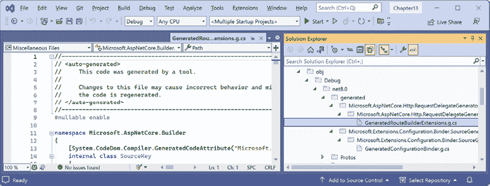

图 13.6：在 AOT gRPC 项目中由源生成器创建的文件夹和文件

1.  在命令提示符或终端中，使用原生 AOT 发布 gRPC 服务，如下所示：

    ```cs
    dotnet publish 
    ```

1.  注意关于生成原生代码和为 `Microsoft.Data.SqlClient` 等包生成修剪警告的消息，如下所示的部分输出：

    ```cs
    Generating native code
    ...
    C:\Users\markj\.nuget\packages\microsoft.data.sqlclient\5.1.1\runtimes\win\lib\net6.0\Microsoft.Data.SqlClient.dll : warning IL2104: Assembly 'Microsoft
    .Data.SqlClient' produced trim warnings. For more information see https://aka.ms/dotnet-illink/libraries [C:\apps-services-net8\Chapter13\Northwind.Grpc.Service\Northwind.Grpc.Service.csproj]
    ... 
    ```

1.  启动 **文件资源管理器** 并打开 `bin\Release\net8.0\win-x64\publish` 文件夹，并注意 EXE 文件大约有 45 MB。这是以及 `Microsoft.Data.SqlClient.SNI.dll` 文件是唯一需要部署到另一台 Windows 计算机上的文件，以便 web 服务能够工作。`appsettings.json` 文件仅在需要覆盖配置时需要。PDB 文件仅在调试时需要，无论如何，其中两个文件仅因为我们保留了 EF Core 代码在项目中作为参考，以便更容易切换回非 AOT 发布。

1.  在命令提示符或终端中打开 `bin\Release\net8.0\win-x64\publish` 文件夹。

1.  在命令提示符或终端中运行 `Northwind.Grpc.Service.exe` 并显式指定要使用的 URL 和端口号，如下面的命令所示：

    ```cs
    Northwind.Grpc.Service.exe --urls "https://localhost:5131" 
    ```

`launchSettings.json` 文件仅由代码编辑器（如 Visual Studio 2022）使用，因此那里指定的端口被忽略，并且不会与生产中的服务一起部署。

1.  启动 `Northwind.Grpc.Client.Mvc` 项目。

1.  注意网页显示了一个 ID 为 1 的发货人，并且您可以搜索其他发货人。

1.  关闭浏览器并关闭 web 服务器。

**更多信息**：您可以在以下链接中了解更多关于 gRPC 和原生 AOT 的信息：[`learn.microsoft.com/en-us/aspnet/core/grpc/native-aot`](https://learn.microsoft.com/en-us/aspnet/core/grpc/native-aot)。

## 获取请求和响应元数据

正式定义的请求和响应消息作为合同的一部分，并不是使用 gRPC 在客户端和服务之间传递数据的唯一机制。您还可以使用作为头和尾发送的元数据。这两者都是与消息一起传递的简单字典。

让我们看看您如何获取 gRPC 调用的元数据：

1.  在 `Northwind.Grpc.Client.Mvc` 项目中，在 `Controllers` 文件夹中，在 `HomeController.cs` 中，导入命名空间以使用 `AsyncUnaryCall<T>` 类，如下面的代码所示：

    ```cs
    using Grpc.Core; // To use AsyncUnaryCall<T>. 
    ```

1.  在 `Index` 方法中，注释掉调用 gRPC 发货服务器的语句。添加获取底层 `AsyncUnaryCall<T>` 对象的语句，然后使用它来获取头信息，输出到日志中，然后获取响应，如下面的代码所示：

    ```cs
    **//** ShipperReply shipperReply = await _shipperClient.GetShipperAsync(
    **//**   new ShipperRequest { ShipperId = id });
    **// The same call as above but not awaited.**
    **AsyncUnaryCall<ShipperReply> shipperCall = _shipperClient.GetShipperAsync(**
    **new** **ShipperRequest { ShipperId = id });**
    **Metadata metadata =** **await** **shipperCall.ResponseHeadersAsync;**
    **foreach** **(Metadata.Entry entry** **in** **metadata)**
    **{**
    **// Not really critical, just doing this to make it easier to see.**
     **_logger.LogCritical(****$"Key:** **{entry.Key}****, Value:** **{entry.Value}****"****);**
    **}**
    **ShipperReply shipperReply =** **await** **shipperCall.ResponseAsync;**
    ViewData["shipper"] = "Shipper from gRPC service: " + 
      $"ID: {shipperReply.ShipperId}, Name: {shipperReply.CompanyName},"
      + $" Phone: {shipperReply.Phone}."; 
    ```

1.  不带调试启动 `Northwind.Grpc.Service` 项目。

1.  启动 `Northwind.Grpc.Client.Mvc` 项目。

1.  如果需要，启动浏览器并导航到主页：`https://localhost:5133/`。

1.  注意客户端成功向 gRPC 的 `Greeter` 和 `Shipper` 服务发送 `POST` 请求，以及输出两个条目的红色关键消息，这些条目是 `GetShipper` 调用的 gRPC 元数据，键为 `date` 和 `server`，如下所示 *图 13.7*：

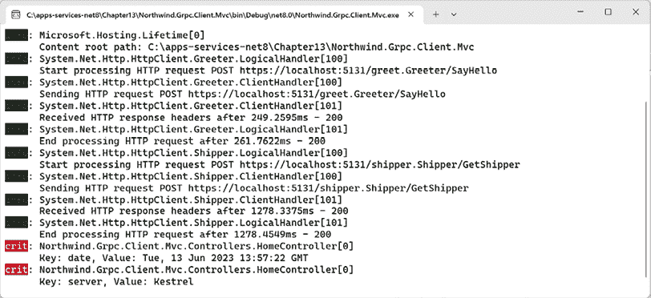

图 13.7：从 gRPC 调用记录元数据

1.  关闭浏览器并关闭 web 服务器。

`ResponseHeadersAsync` 属性的等价物是 `GetTrailers` 方法。它有一个返回值为 `Metadata` 的值，其中包含跟踪器的字典。跟踪器在调用结束时可用。

## 添加截止日期以提高可靠性

为 gRPC 调用设置截止日期是推荐的做法，因为它控制了 gRPC 调用可以运行的最长时间上限。它防止 gRPC 服务可能消耗过多的服务器资源。

截止日期信息被发送到服务中，因此服务一旦截止日期过去就有机会放弃其工作，而不是永远继续。即使服务器在截止日期内完成了其工作，客户端也可能在响应到达客户端之前放弃，因为通信开销导致截止日期已过。

让我们来看一个例子：

1.  在 `Northwind.Grpc.Service` 项目中，在 `Services` 文件夹中，在 `ShipperService.cs` 中，在 `GetShipper` 方法中，添加记录截止日期并暂停五秒的语句，如下所示高亮代码：

    ```cs
    public override async Task<ShipperReply> GetShipper(
      ShipperRequest request, ServerCallContext context)
    {
     **_logger.LogCritical(****$"This request has a deadline of** **{**
     **context.Deadline:T}****. It is now** **{DateTime.UtcNow:T}****."****);**
    **await** **Task.Delay(TimeSpan.FromSeconds(****5****));**
      ...
    } 
    ```

1.  在 `Northwind.Grpc.Service` 项目中，在 `appsettings.Development.json` 中，将 ASP.NET Core 的日志级别从默认的 `Warning` 修改为 `Information`，如下所示高亮配置：

    ```cs
    {
      "Logging": {
        "LogLevel": {
          "Default": "Information",
          "Microsoft.AspNetCore": "**Information**"
        }
      }
    } 
    ```

1.  在 `Northwind.Grpc.Client.Mvc` 项目中，在 `Controllers` 文件夹中，在 `HomeController.cs` 中，在 `Index` 方法中，调用 `GetShipperAsync` 方法时设置三秒的截止日期，如下所示高亮代码：

    ```cs
    AsyncUnaryCall<ShipperReply> shipperCall = shipperClient.GetShipperAsync(
      new ShipperRequest { ShipperId = id }**,**
    **// Deadline must be a UTC DateTime.**
      **deadline: DateTime.UtcNow.AddSeconds(****3****)**); 
    ```

1.  在 `HomeController.cs` 中，在 `Index` 方法中，在现有的 `catch` 块之前，添加一个 `catch` 块来捕获当异常的状态码与截止日期超出的代码匹配时的 `RpcException`，如下所示高亮代码：

    ```cs
    **catch** **(RpcException rpcex)** **when** **(rpcex.StatusCode ==** 
    **global****::Grpc.Core.StatusCode.DeadlineExceeded)**
    **{**
     **_logger.LogWarning(****"Northwind.Grpc.Service deadline exceeded."****);**
     **model.ErrorMessage = rpcex.Message;**
    **}**
    catch (Exception ex)
    {
      _logger.LogWarning($"Northwind.Grpc.Service is not responding.");
      model.ErrorMessage = ex.Message;
    } 
    ```

1.  在 `Northwind.Grpc.Client.Mvc` 项目中，在 `appsettings.Development.json` 中，将 ASP.NET Core 的日志级别从默认的 `Warning` 修改为 `Information`，如下所示高亮配置：

    ```cs
    {
      "Logging": {
        "LogLevel": {
          "Default": "Information",
          "Microsoft.AspNetCore": "**Information**"
        }
      }
    } 
    ```

1.  不带调试启动 `Northwind.Grpc.Service` 项目。

1.  启动 `Northwind.Grpc.Client.Mvc` 项目。

1.  如果需要，启动浏览器并导航到主页：`https://localhost:5133/`。

1.  在 gRPC 服务的命令提示符或终端中，注意请求有一个三秒的截止日期，如下所示输出：

    ```cs
    crit: Northwind.Grpc.Service.Services.ShipperService[0]
          This request has a deadline of 14:56:30\. It is now 14:56:27. 
    ```

1.  在浏览器中，注意在三个秒后，主页显示了一个截止日期超出的异常，如图 *图 13.8* 所示：

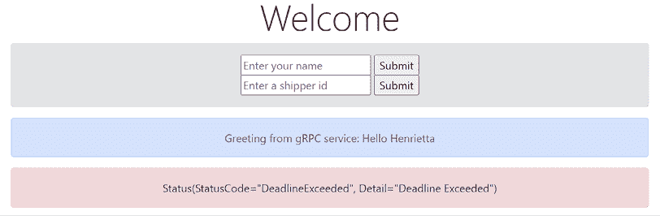

图 13.8：截止日期已过

1.  在 ASP.NET Core MVC 客户端的命令提示符或终端中，注意从请求 `GetShipper` 方法在 gRPC 服务上的点开始记录的日志，但截止日期已过，如下所示输出：

    ```cs
    info: System.Net.Http.HttpClient.Shipper.LogicalHandler[100]
          Start processing HTTP request POST https://localhost:5131/shipper.Shipper/GetShipper
    info: System.Net.Http.HttpClient.Shipper.ClientHandler[100]
          Sending HTTP request POST https://localhost:5131/shipper.Shipper/GetShipper
    warn: Grpc.Net.Client.Internal.GrpcCall[7]
          gRPC call deadline exceeded.
    info: Grpc.Net.Client.Internal.GrpcCall[3]
          Call failed with gRPC error status. Status code: 'DeadlineExceeded', Message: ''. 
    ```

1.  关闭浏览器并关闭 web 服务器。

1.  在 `ShipperService.cs` 中，注释掉导致五秒延迟的语句，如下所示代码：

    ```cs
    **//** await Task.Delay(TimeSpan.FromSeconds(5)); 
    ```

**良好实践**：默认情况下没有截止日期。在客户端调用中始终设置截止日期。在你的服务实现中，获取截止日期并使用它来自动放弃超过截止日期的工作。将取消令牌传递给任何异步调用，以便服务器上的工作快速完成并释放资源。

# 处理日期、时间和十进制数字

你可能已经注意到 gRPC 中没有内置的日期/时间类型。为了存储这些值，你必须使用已知类型扩展，例如`google.protobuf.Timestamp`（相当于`DateTimeOffset`）和`google.protobuf.Duration`（相当于`TimeSpan`）。

要将它们用作消息中的字段类型，它们必须被导入，如下面的代码所示：

```cs
syntax = "proto3";
import "google/protobuf/duration.proto";  
import "google/protobuf/timestamp.proto";
message Employee {
  int32 employeeId = 1;
  google.protobuf.Timestamp birth_date = 2;
  google.protobuf.Duration earned_vacation_time = 3;
  ...
} 
```

生成的类将不会直接使用.NET 类型。相反，存在中间类型，如下面的代码所示：

```cs
public class Employee
{
  public int EmployeeId;
  public Timestamp BirthDate;
  public Duration EarnedVacationTime;
} 
```

类型`FromDateTimeOffset`、`ToDateTimeOffset`、`FromTimeSpan`和`ToTimeSpan`上有转换方法，如下面的代码所示：

```cs
Employee employee = new()
{
  EmployeeId = 1,
  BirthDate = Timestamp.FromDateTimeOffset(new DateTimeOffset(
    year: 1998, month: 11, day: 30, hour: 0, minute: 0, second: 0,
    offset: TimeSpan.FromHours(-5)),
  EarnedVacationTime = Duration.FromTimeSpan(TimeSpan.FromDays(15))
};
DateTimeOffset when = employee.BirthDate.ToDateTimeOffset();
TimeSpan daysoff = employee.EarnedVacationTime.ToTimeSpan(); 
```

gRPC 也不原生支持`decimal`值。将来可能会添加该支持，但到目前为止，你必须创建一个自定义消息来表示它。如果你选择这样做，请记住，其他平台上的开发人员将必须理解你的自定义格式并实现自己的处理方式。

## 定义自定义的 decimal 类型和使用日期/时间类型

让我们添加用于处理产品（具有`UnitPrice`属性，该属性是`decimal`类型）和员工（具有`HireDate`属性，该属性是`DateTime`值）的 gRPC 服务：

1.  在`Northwind.Grpc.Service`项目的`Protos`文件夹中，添加一个名为`decimal.proto`的新文件，并添加定义安全存储`decimal`值的消息格式的语句，如下面的代码所示：

    ```cs
    syntax = "proto3";
    option csharp_namespace = "Northwind.Grpc.Service";
    package decimal;
    // Example: 12345.6789 -> { units = 12345, nanos = 678900000 }
    message DecimalValue {
        // To store the whole units part of the amount.
        int64 units = 1;
        // To store the nano units of the amount (10^-9).
        // Must be same sign as units.
        sfixed32 nanos = 2;
    } 
    ```

1.  添加一个名为`product.proto`的新文件，并添加定义获取单个产品、所有产品或最低价格产品的消息和服务方法的语句，如下面的代码所示：

    ```cs
    syntax = "proto3";
    option csharp_namespace = "Northwind.Grpc.Service";
    import "Protos/decimal.proto";
    package product;
    service Product {
      rpc GetProduct (ProductRequest) returns (ProductReply);
      rpc GetProducts (ProductsRequest) returns (ProductsReply);
      rpc GetProductsMinimumPrice (ProductsMinimumPriceRequest) 
          returns (ProductsReply);
    }
    message ProductRequest {
      int32 product_id = 1;
    }
    message ProductsRequest {
    }
    message ProductsMinimumPriceRequest {
      decimal.DecimalValue minimum_price = 1;
    }
    message ProductReply {
      int32 product_id = 1;
      string product_name = 2;
      int32 supplier_id = 3;
      int32 category_id = 4;
      string quantity_per_unit = 5;
      decimal.DecimalValue unit_price = 6;
      int32 units_in_stock = 7;
      int32 units_on_order = 8;
      int32 reorder_level = 9;
      bool discontinued = 10;
    }
    message ProductsReply {
      repeated ProductReply products = 1;
    } 
    ```

1.  添加一个名为`employee.proto`的新文件，并修改它以定义获取单个员工或所有员工的消息和服务方法，注意我们必须导入`timestamp.proto`的 Google 扩展，如下面的代码所示：

    ```cs
    syntax = "proto3";
    option csharp_namespace = "Northwind.Grpc.Service";
    import "google/protobuf/duration.proto";
    import "google/protobuf/timestamp.proto";
    package employee;
    service Employee {
      rpc GetEmployee (EmployeeRequest) returns (EmployeeReply);
      rpc GetEmployees (EmployeesRequest) returns (EmployeesReply);
    }
    message EmployeeRequest {
      int32 employee_id = 1;
    }
    message EmployeesRequest {
    }
    message EmployeeReply {
      int32 employee_id = 1;
      string last_name = 2;
      string first_name = 3;
      string title = 4;
      string title_of_courtesy = 5;
      google.protobuf.Timestamp birth_date = 6;
      google.protobuf.Timestamp hire_date = 7;
      string address = 8;
      string city = 9;
      string region = 10;
      string postal_code = 11;
      string country = 12;
      string home_phone = 13;
      string extension = 14;
      bytes photo = 15;
      string notes = 16;
      int32 reports_to = 17;
      string photo_path = 18;
    }
    message EmployeesReply {
      repeated EmployeeReply employees = 1;
    } 
    ```

1.  在项目文件中添加元素以告诉 gRPC 工具处理新的`.proto`文件，如下面的标记所示：

    ```cs
    <ItemGroup>
      <Protobuf Include="Protos\greet.proto" GrpcServices="Server" />
      <Protobuf Include="Protos\shipper.proto" GrpcServices="Server" />
     **<Protobuf Include=****"Protos\decimal.proto"** **GrpcServices=****"Server"** **/>**
     **<Protobuf Include=****"Protos\product.proto"** **GrpcServices=****"Server"** **/>**
     **<Protobuf Include=****"Protos\employee.proto"** **GrpcServices=****"Server"** **/>**
    </ItemGroup> 
    ```

1.  重新构建项目以确保 gRPC 工具已在`obj\Debug\net8.0\Protos`文件夹中创建了 C#类，如图*13.9*所示：

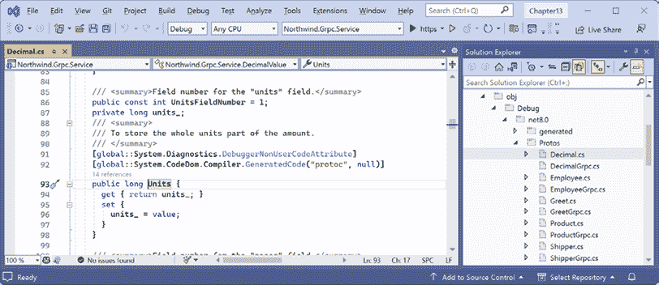

图 13.9：gRPC 工具为具有 Units 属性的自定义 decimal 类型生成的类

1.  在`Northwind.Grpc.Service`项目中，添加一个名为`Converters`的新文件夹。

1.  在 `Converters` 文件夹中，添加一个名为 `DecimalValue.Converters.cs` 的新类文件，并修改其内容以扩展由 gRPC 工具创建的局部类，添加一个构造函数和一对运算符，用于在自定义的 `DecimalValue` 类型与内置的 .NET `decimal` 类型之间进行转换，如下面的代码所示：

    ```cs
    namespace Northwind.Grpc.Service;
    // This will merge with the DecimalValue type generated by the
    // gRPC tools in the obj\Debug\net8.0\Protos\Decimal.cs file.
    public partial class DecimalValue
    {
      private const decimal NanoFactor = 1_000_000_000;
      public DecimalValue(long units, int nanos)
      {
        Units = units;
        Nanos = nanos;
      }
      public static implicit operator decimal(DecimalValue grpcDecimal)
      {
        return grpcDecimal.Units + (grpcDecimal.Nanos / NanoFactor);
      }
      public static implicit operator DecimalValue(decimal value)
      {
        long units = decimal.ToInt64(value);
        int nanos = decimal.ToInt32((value - units) * NanoFactor);
        return new DecimalValue(units, nanos);
      }
    } 
    ```

## 实现产品和员工 gRPC 服务

现在我们需要实现并注册服务：

1.  在 `Northwind.Grpc.Service` 项目中，在 `Services` 文件夹中，添加一个名为 `ProductService.cs` 的新类文件，并修改其内容以实现产品服务。我将把这个作为一项可选练习留给你，或者你也可以从以下链接复制代码：[`github.com/markjprice/apps-services-net8/blob/main/code/Chapter13/Northwind.Grpc.Service/Services/ProductService.cs`](https://github.com/markjprice/apps-services-net8/blob/main/code/Chapter13/Northwind.Grpc.Service/Services/ProductService.cs)。

1.  在 `Services` 文件夹中，添加一个名为 `EmployeeService.cs` 的新类文件，并修改其内容以实现产品服务。我将把这个作为一项可选练习留给你，或者你也可以从以下链接复制代码：[`github.com/markjprice/apps-services-net8/blob/main/code/Chapter13/Northwind.Grpc.Service/Services/EmployeeService.cs`](https://github.com/markjprice/apps-services-net8/blob/main/code/Chapter13/Northwind.Grpc.Service/Services/EmployeeService.cs)。

1.  在 `Program.cs` 文件中，注册两个新服务，如下面的代码所示：

    ```cs
    app.MapGrpcService<ProductService>();
    app.MapGrpcService<EmployeeService>(); 
    ```

## 添加产品和员工 gRPC 客户端

接下来，我们需要向 MVC 项目添加客户端以调用两个新的 gRPC 服务：

1.  在 `Northwind.Grpc.Client.Mvc` 项目中，将服务项目中的三个 `.proto` 文件复制到 MVC 项目的 `Protos` 文件夹中。

1.  在三个 `.proto` 文件中，修改命名空间，如下面的代码所示：

    ```cs
    option csharp_namespace = "Northwind.Grpc.Client.Mvc"; 
    ```

1.  在项目文件中，注册这三个文件以创建客户端表示，如下面的标记所示：

    ```cs
    <ItemGroup>
      <Protobuf Include="Protos\greet.proto" GrpcServices="Client" />
      <Protobuf Include="Protos\shipper.proto" GrpcServices="Client" />
     **<Protobuf Include=****"Protos\decimal.proto"** **GrpcServices=****"Client"** **/>**
     **<Protobuf Include=****"Protos\employee.proto"** **GrpcServices=****"Client"** **/>**
     **<Protobuf Include=****"Protos\product.proto"** **GrpcServices=****"Client"** **/>**
    </ItemGroup> 
    ```

    如果你使用的是像 JetBrains Rider 这样的代码编辑器，它会添加额外的配置，我建议你简化前面的标记中的元素。如果不这样做，那么在接下来的编码任务中可能会遇到错误。

1.  将 `Converters` 文件夹从 gRPC 项目复制到 MVC 项目。

1.  在 `Converters` 文件夹中的 `DecimalValue.Converters.cs` 文件中，修改命名空间以使用客户端，如下面的代码所示：

    ```cs
    namespace Northwind.Grpc.**Client.Mvc**; 
    ```

1.  在 `Northwind.Grpc.Client.Mvc` 项目中，在 `Program.cs` 文件中，添加语句以注册两个新服务的客户端，如下面的代码所示：

    ```cs
    builder.Services.AddGrpcClient<Product.ProductClient>("Product",
      options =>
      {
        options.Address = new Uri("https://localhost:5131");
      });
    builder.Services.AddGrpcClient<Employee.EmployeeClient>("Employee",
      options =>
      {
        options.Address = new Uri("https://localhost:5131");
      }); 
    ```

1.  在 `Controllers` 文件夹中，在 `HomeController.cs` 文件中，为两个新客户端添加两个字段并在构造函数中设置它们。（提示：遵循 greeter 和 shipper 的相同模式。）

1.  在 `HomeController.cs` 文件中，为产品和员工添加两个操作方法，如下面的代码所示：

    ```cs
    public async Task<IActionResult> Products(decimal minimumPrice = 0M)
    {
      ProductsReply reply = await _productClient.GetProductsMinimumPriceAsync(
        new ProductsMinimumPriceRequest() { MinimumPrice = minimumPrice });
      return View(reply.Products);
    }
    public async Task<IActionResult> Employees()
    {
      EmployeesReply reply = await _employeeClient.GetEmployeesAsync(
        new EmployeesRequest());
      return View(reply.Employees);
    } 
    ```

1.  在`Views\Shared`文件夹中，在`_Layout.cshtml`中，在导航到主页面的菜单项之后，添加导航到产品和员工的菜单项，如下所示标记高亮显示：

    ```cs
    <li class="nav-item">
      <a class="nav-link text-dark" asp-area="" asp-controller="Home" asp-action="Index">Home</a>
    </li>
    **<****li****class****=****"nav-item"****>**
    **<****a****class****=****"nav-link text-dark"****asp-area****=****""****asp-controller****=****"Home"****asp-action****=****"Products"****>****Products****</****a****>**
    **</****li****>**
    **<****li****class****=****"nav-item"****>**
    **<****a****class****=****"****nav-link text-dark"****asp-area****=****""****asp-controller****=****"Home"****asp-action****=****"Employees"****>****Employees****</****a****>**
    **</****li****>** 
    ```

1.  在`Views\Home`文件夹中，添加一个名为`Products.cshtml`的新 Razor 视图文件，并将其修改为显示产品表，如下所示标记：

    ```cs
    @using Google.Protobuf.Collections
    @using Northwind.Grpc.Client.Mvc
    @model RepeatedField<ProductReply>
    @{
      ViewData["Title"] = "Products";
      decimal price = 0;
    }
    <h1>@ViewData["Title"]</h1>
    <table class="table table-primary table-bordered">
      <thead>
        <tr>
          <th>Product ID</th>
          <th>Product Name</th>
          <th>Unit Price</th>
          <th>Units In Stock</th>
          <th>Units On Order</th>
          <th>Reorder Level</th>
          <th>Discontinued</th>
        </tr>
      </thead>
      <tbody>
        @foreach (ProductReply p in Model)
        {
          <tr>
            <td>@p.ProductId</td>
            <td>@p.ProductName</td>
            @{ price = p.UnitPrice; }
            <td>@price.ToString("C")</td>
            <td>@p.UnitsInStock</td>
            <td>@p.UnitsOnOrder</td>
            <td>@p.ReorderLevel</td>
            <td>@p.Discontinued</td>
          </tr>
        }
      </tbody>
    </table> 
    ```

1.  在`Views\Home`文件夹中，添加一个名为`Employees.cshtml`的新 Razor 视图文件，并将其修改为显示员工表，如下所示标记：

    ```cs
    @using Google.Protobuf.Collections
    @using Northwind.Grpc.Client.Mvc
    @model RepeatedField<EmployeeReply>
    @{
      ViewData["Title"] = "Employees";
    }
    <h1>@ViewData["Title"]</h1>
    <table class="table table-primary table-bordered">
      <thead>
        <tr>
          <th>Employee ID</th>
          <th>Full Name</th>
          <th>Job Title</th>
          <th>Address</th>
          <th>Birth Date</th>
          <th>Photo</th>
        </tr>
      </thead>
      <tbody>
        @foreach (EmployeeReply e in Model)
        {
          <tr>
            <td>@e.EmployeeId</td>
            <td>@e.TitleOfCourtesy @e.FirstName @e.LastName</td>
            <td>@e.Title</td>
            <td>@e.Address<br />@e.City<br />@e.Region<br />
                @e.PostalCode<br />@e.Country</td>
            <td>@e.BirthDate.ToDateTimeOffset().ToString("D")</td>
            <td>
            </td>
          </tr>
        }
      </tbody>
    </table> 
    ```

## 测试十进制、日期和字节处理

最后，我们可以测试我们实现的专用类型处理：

1.  不带调试启动`Northwind.Grpc.Service`项目。

1.  启动`Northwind.Grpc.Client.Mvc`项目。

1.  在主页面上，在顶部导航栏中，点击**产品**，并注意所有产品都包含在表中，如图*13.10*所示：

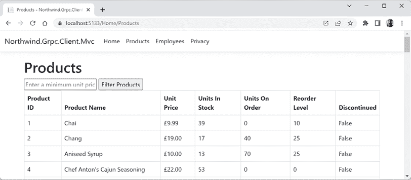

图 13.10：使用自定义十进制实现的包含单价的产品

1.  输入一个最低价格，例如`100`，点击**过滤产品**，注意只有单价为该金额或更高的产品包含在表中。

1.  在顶部导航栏中，点击**员工**，并注意员工及其出生日期和照片包含在表中，如图*13.11*所示：

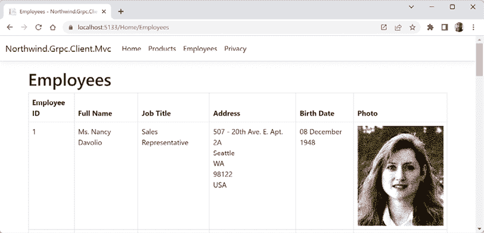

图 13.11：包含出生日期和照片的员工使用时间戳和字节

1.  关闭浏览器并关闭 Web 服务器。

你现在已经看到了如何使用 gRPC 构建与数据一起工作的几个服务。现在让我们看看 gRPC 的一些更高级的功能。

# 实现拦截器和处理故障

gRPC 拦截器是在请求和响应期间执行额外处理的一种方式，并且它们可以在客户端或服务中注入。它们通常用于日志记录、监控和验证。

## 添加客户端拦截器

让我们添加一个客户端 gRPC 拦截器用于日志记录：

1.  在`Northwind.Grpc.Client.Mvc`项目中，添加一个名为`Interceptors`的新文件夹。

1.  在`Interceptors`文件夹中，添加一个名为`ClientLoggingInterceptor.cs`的新类文件，然后添加定义拦截器的语句，如下所示代码：

    ```cs
    using Grpc.Core.Interceptors; // To use Interceptor and so on.
    using Grpc.Core; // To use AsyncUnaryCall<T>.
    namespace Northwind.Grpc.Client.Mvc.Interceptors;
    public class ClientLoggingInterceptor : Interceptor
    {
      private readonly ILogger _logger;
      public ClientLoggingInterceptor(ILoggerFactory loggerFactory)
      {
        _logger = loggerFactory.CreateLogger<ClientLoggingInterceptor>();
      }
      public override AsyncUnaryCall<TResponse> 
        AsyncUnaryCall<TRequest, TResponse>(TRequest request,
        ClientInterceptorContext<TRequest, TResponse> context,
        AsyncUnaryCallContinuation<TRequest, TResponse> continuation)
      {
        _logger.LogWarning("Starting call. Type: {0}. Method: {1}.",
          context.Method.Type, context.Method.Name);
        return continuation(request, context);
      }
    } 
    ```

    拦截器形成一个管道，因此在你的拦截器中，你必须调用管道中的下一个拦截器，由`continuation`委托表示，并传递`request`和`context`。

1.  在`Northwind.Grpc.Client.Mvc`项目中，在`Program.cs`中，在添加 gRPC 服务的任何调用之前，添加一个调用以将拦截器注册为单例服务，如下所示代码：

    ```cs
    // Register the interceptor before attaching it to a gRPC client.
    builder.Services.AddSingleton<ClientLoggingInterceptor>(); 
    ```

1.  在`Program.cs`中，在注册产品客户端的语句末尾添加拦截器，如下所示高亮显示的代码：

    ```cs
    builder.Services.AddGrpcClient<Product.ProductClient>("Product",
      options =>
      {
        options.Address = new Uri("https://localhost:5131");
      })
      **.AddInterceptor<ClientLoggingInterceptor>()**; 
    ```

    你可以将日志拦截器附加到任意多的客户端。

1.  不带调试启动`Northwind.Grpc.Service`项目。

1.  启动`Northwind.Grpc.Client.Mvc`项目。

1.  在主页面上，在顶部导航栏中，点击**产品**。

1.  在 MVC 网站项目命令提示符或终端中，请注意警告，它将与信息消息不同，因为默认情况下它是黄色背景黑色文字，如下所示：

    ```cs
    warn: Northwind.Grpc.Client.Mvc.Interceptors.ClientLoggingInterceptor[0]
          Starting call. Type: Unary. Method: GetProductsMinimumPrice. 
    ```

1.  关闭浏览器并关闭 Web 服务器。

**更多信息**：你可能认为，“拦截器听起来很像 ASP.NET Core 中间件！”你可以在以下链接中阅读一个有用的比较：[`learn.microsoft.com/en-us/aspnet/core/grpc/interceptors#grpc-interceptors-versus-middleware`](https://learn.microsoft.com/en-us/aspnet/core/grpc/interceptors#grpc-interceptors-versus-middleware)。

## 异常和瞬态故障处理

gRPC 内置了对自动重试失败调用的支持，这对于处理瞬态故障（如临时网络断开、服务不可用或繁忙的服务）是一种很好的方法。

在客户端，可能会抛出一个包含错误详细信息的 `RpcException`。

首先，让我们向 gRPC 服务添加一个瞬态故障，看看客户端是如何处理的：

1.  在 `Northwind.Grpc.Service` 项目中，在 `Services` 文件夹中，在 `GreeterService.cs` 文件中，修改 `SayHello` 方法，使其等待一秒钟，然后随机地，三分之一的时间应该工作，而三分之二的时间应该抛出服务不可用异常，如下所示：

    ```cs
    public override **async** Task<HelloReply> SayHello(
      HelloRequest request, ServerCallContext context)
    {
    **await** **Task.Delay(****1000****);**
    **if** **(Random.Shared.Next(****1****,** **4****) ==** **1****)**
     **{**
        return new HelloReply
        {
          Message = "Hello " + request.Name
        };
     **}**
    **else**
     **{**
    **throw****new** **RpcException(****new** **Status(StatusCode.Unavailable,**
    **"Service is temporarily unavailable. Try again later."****));**
     **}**
    } 
    ```

1.  不带调试启动 `Northwind.Grpc.Service` 项目。

1.  启动 `Northwind.Grpc.Client.Mvc` 项目。

1.  在主页上，注意异常，如图 *13.12* 所示：

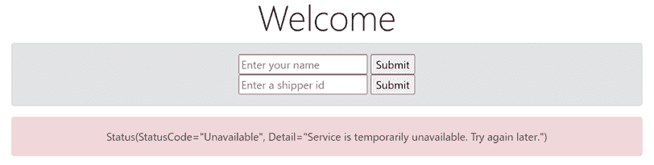

图 13.12：服务不可用异常

1.  如果你没有收到异常，请刷新页面，直到收到为止。

1.  关闭浏览器并关闭 Web 服务器。

现在，让我们看看如何向 MVC 网站客户端添加瞬态故障处理：

1.  在 `Northwind.Grpc.Client.Mvc` 项目中，在 `Program.cs` 文件中，在将问候客户端添加到服务集合之前，添加语句来定义一个具有重试策略的 `MethodConfig`，该策略对于表示服务不可用的状态码重试最多五次，然后在配置问候客户端地址后应用 `method config`，如下所示（代码高亮显示）：

    ```cs
    **MethodConfig configForAllMethods =** **new****()** 
    **{**
     **Names = { MethodName.Default },**
     **RetryPolicy =** **new** **RetryPolicy**
     **{**
     **MaxAttempts =** **5****,**
     **InitialBackoff = TimeSpan.FromSeconds(****1****),**
     **MaxBackoff = TimeSpan.FromSeconds(****5****),**
     **BackoffMultiplier =** **1.5****,**
     **RetryableStatusCodes = { StatusCode.Unavailable }**
     **}**
    **};**
    builder.Services.AddGrpcClient<Greeter.GreeterClient>("Greeter",
      options =>
      {
        options.Address = new Uri("https://localhost:5131");
      })
     **.ConfigureChannel(channel =>**
     **{**
     **channel.ServiceConfig =** **new** **ServiceConfig**
     **{**
     **MethodConfigs = { configForAllMethods }**
     **};**
     **})**; 
    ```

1.  不带调试启动 `Northwind.Grpc.Service` 项目。

1.  启动 `Northwind.Grpc.Client.Mvc` 项目。

1.  在主页上，请注意主页可能需要几秒钟才能出现，但最终会成功出现，显示来自 gRPC 服务的 `Hello Henrietta` 消息，如果你查看 gRPC 服务输出，它将包括在最终成功之前多次尝试调用 `SayHello`，如下所示：

    ```cs
    info: Microsoft.AspNetCore.Hosting.Diagnostics[1]
          Request starting HTTP/2 POST https://localhost:5131/greet.Greeter/SayHello - application/grpc -
    info: Microsoft.AspNetCore.Routing.EndpointMiddleware[0]
          Executing endpoint 'gRPC - /greet.Greeter/SayHello'
    info: Grpc.AspNetCore.Server.ServerCallHandler[7]
          Error status code 'Unavailable' with detail 'Service is temporarily unavailable. Try again later.' raised.
    info: Microsoft.AspNetCore.Routing.EndpointMiddleware[1]
          Executed endpoint 'gRPC - /greet.Greeter/SayHello'
    info: Microsoft.AspNetCore.Hosting.Diagnostics[2]
          Request finished HTTP/2 POST https://localhost:5131/greet.Greeter/SayHello - 200 0 application/grpc 1039.4626ms
    info: Microsoft.AspNetCore.Hosting.Diagnostics[1]
          Request starting HTTP/2 POST https://localhost:5131/greet.Greeter/SayHello - application/grpc -
    info: Microsoft.AspNetCore.Routing.EndpointMiddleware[0]
          Executing endpoint 'gRPC - /greet.Greeter/SayHello'
    info: Grpc.AspNetCore.Server.ServerCallHandler[7]
          Error status code 'Unavailable' with detail 'Service is temporarily unavailable. Try again later.' raised.
    info: Microsoft.AspNetCore.Routing.EndpointMiddleware[1]
          Executed endpoint 'gRPC - /greet.Greeter/SayHello'
    info: Microsoft.AspNetCore.Hosting.Diagnostics[2]
          Request finished HTTP/2 POST https://localhost:5131/greet.Greeter/SayHello - 200 0 application/grpc 1008.1375ms
    info: Microsoft.AspNetCore.Hosting.Diagnostics[1]
          Request starting HTTP/2 POST https://localhost:5131/greet.Greeter/SayHello - application/grpc -
    info: Microsoft.AspNetCore.Routing.EndpointMiddleware[0]
          Executing endpoint 'gRPC - /greet.Greeter/SayHello'
    info: Microsoft.AspNetCore.Routing.EndpointMiddleware[1]
          Executed endpoint 'gRPC - /greet.Greeter/SayHello'
    info: Microsoft.AspNetCore.Hosting.Diagnostics[2]
          Request finished HTTP/2 POST https://localhost:5131/greet.Greeter/SayHello - 200 - application/grpc 1016.4590ms 
    ```

# 实现 gRPC JSON 转码

JSON 是向浏览器或移动设备返回数据的服务的最流行格式。如果能创建一个 gRPC 服务并通过非 HTTP/2 使用 JSON 神奇地调用它，那就太好了。

幸运的是，有一个解决方案。

微软有一种他们称之为**gRPC JSON 转换**的技术。它是一个 ASP.NET Core 扩展，基于 Google 的`HttpRule`类为他们的 gRPC 转换创建带有 JSON 的 HTTP 端点。

**更多信息**：你可以在以下链接中了解 Google 的`HttpRule`类：[`cloud.google.com/dotnet/docs/reference/Google.Api.CommonProtos/latest/Google.Api.HttpRule`](https://cloud.google.com/dotnet/docs/reference/Google.Api.CommonProtos/latest/Google.Api.HttpRule)。

## 启用 gRPC JSON 转换

让我们看看如何在我们的 gRPC 服务中启用 gRPC JSON 转换：

1.  在`Northwind.Grpc.Service`项目中，添加一个 gRPC JSON 转换的包引用，如下所示高亮显示的标记：

    ```cs
    <ItemGroup>
      <PackageReference Include="Grpc.AspNetCore" Version="2.59.0" />
      <PackageReference Include="Microsoft.Data.SqlClient" Version="5.1.2" />
     **<PackageReference Include=****"Microsoft.AspNetCore.Grpc.JsonTranscoding"**
     **Version=****"8.0.0"** **/>**
    </ItemGroup> 
    ```

1.  构建项目以恢复包。

1.  在`appsettings.json`中，修改`Protocols`选项以启用 HTTP/1.1 以及 HTTP/2，如下所示高亮显示的标记：

    ```cs
    {
      "Logging": {
        "LogLevel": {
          "Default": "Information",
          "Microsoft.AspNetCore": "Warning"
        }
      },
      "AllowedHosts": "*",
      "Kestrel": {
        "EndpointDefaults": {
          "Protocols": "**Http1AndHttp2**"
        }
      }
    } 
    ```

    **良好实践**：默认情况下，gRPC 项目将配置为仅允许 HTTP/2 请求。为了支持你的代码编辑器中的`.http`文件或 Unity 等客户端，启用 HTTP/1.1 和 HTTP/2。在同一端口上允许 HTTP/1.1 和 HTTP/2 需要 TLS 进行协议协商，这也是在 gRPC 服务中保持 HTTPS 启用、因此不使用`CreateSlimBuilder`的另一个好理由。

1.  在`Program.cs`中，在添加 gRPC 调用之后添加一个调用以添加 JSON 转换，如下所示高亮显示的代码：

    ```cs
    builder.Services.AddGrpc()**.AddJsonTranscoding()**; 
    ```

1.  在`Northwind.Grpc.Service`项目/文件夹中，添加一个名为`google`的文件夹。

1.  在`google`文件夹中，添加一个名为`api`的文件夹。

1.  在`api`文件夹中，添加两个名为`http.proto`和`annotations.proto`的`.proto`文件。

1.  从以下链接中找到的文件复制并粘贴两个文件的原始内容：[`github.com/dotnet/aspnetcore/tree/main/src/Grpc/JsonTranscoding/test/testassets/Sandbox/google/api`](https://github.com/dotnet/aspnetcore/tree/main/src/Grpc/JsonTranscoding/test/testassets/Sandbox/google/api)。

1.  在`Protos`文件夹中，在`employee.proto`中导入注释`.proto`文件，并使用它添加一个选项来公开一个端点，以便向`GetEmployee`方法发出 HTTP 请求，如下面的代码所示：

    ```cs
    syntax = "proto3";
    option csharp_namespace = "Northwind.Grpc.Service";
    import "google/protobuf/duration.proto";
    import "google/protobuf/timestamp.proto";
    **import** **"google/api/annotations.proto"****;**
    package employee;
    service Employee {
      rpc GetEmployee (EmployeeRequest) returns (EmployeeReply) **{**
     **option (google.api.http) = {**
    **get****:** **"/v1/employee/{employee_id}"**
     **};**
     **}**;
      rpc GetEmployees (EmployeesRequest) returns (EmployeesReply);
    } 
    ```

## 测试 gRPC JSON 转换

现在我们可以启动 gRPC 服务并直接从任何浏览器调用它：

1.  启动`Northwind.Grpc.Service`项目。

1.  打开任何浏览器，显示开发者工具，并点击**网络**选项卡以开始记录网络流量。

1.  导航到 URL 以发出调用`GetEmployee`方法的`GET`请求，`https://localhost:5131/v1/employee/1`，并注意 gRPC 服务返回的 JSON 响应，如图*13.13*所示：

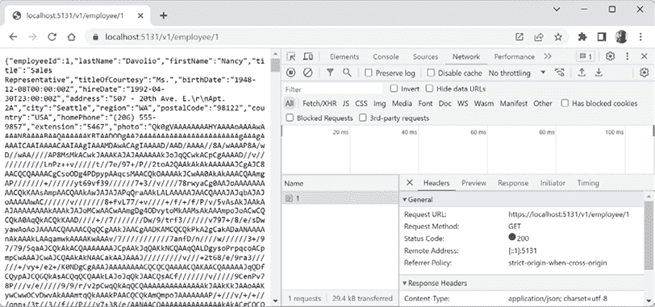

图 13.13：向 gRPC 服务发出 HTTP 1.1 GET 请求并接收 JSON 响应

1.  在你的代码编辑器中，在`HttpRequests`文件夹中，创建一个名为`grpc-json-transcoding.http`的新文件，并添加使用 HTTP/1.1 请求员工的语句，如下面的代码所示：

    ```cs
    ### Configure a variable for the gRPC service base address.
    @base_address = https://localhost:5131/
    ### Get Nancy Davolio.
    GET {{base_address}}v1/employee/1
    ### Get Andrew Fuller Davolio.
    GET {{base_address}}v1/employee/2 
    ```

1.  发送两个请求，确认响应正确，然后查看 gRPC 服务命令提示符或终端，确认请求是使用 HTTP/1.1 发送的，如下所示：

    ```cs
    info: Microsoft.AspNetCore.Hosting.Diagnostics[1]
          Request starting HTTP/1.1 GET https://localhost:5131/v1/employee/2 - - -
    info: Microsoft.AspNetCore.Routing.EndpointMiddleware[0]
          Executing endpoint 'gRPC - /v1/employee/{employee_id}'
    info: Microsoft.AspNetCore.Routing.EndpointMiddleware[1]
          Executed endpoint 'gRPC - /v1/employee/{employee_id}'
    info: Microsoft.AspNetCore.Hosting.Diagnostics[2]
          Request finished HTTP/1.1 GET https://localhost:5131/v1/employee/2 - 200 - application/json;+charset=utf-8 7.9328ms 
    ```

1.  关闭 `.http` 文件，关闭浏览器，并关闭 web 服务器。

## 与 gRPC-Web 比较

**gRPC-Web** 是 gRPC JSON transcoding 的替代方案，允许从浏览器调用 gRPC 服务。gRPC-Web 通过在浏览器中执行 gRPC-Web 客户端来实现这一点。这具有优势，即浏览器和 gRPC 服务之间的通信使用 Protobuf，因此获得真实 gRPC 通信的所有性能和可扩展性优势。

正如你所见，gRPC JSON transcoding 允许浏览器像使用 HTTP API 一样调用 gRPC 服务，而浏览器无需了解 gRPC。gRPC 服务负责将这些 HTTP API 调用转换为对实际 gRPC 服务实现的调用。

为了简化并总结：

+   gRPC JSON transcoding 在服务器端发生。

+   gRPC-Web 在客户端发生。

**良好实践**：将 gRPC JSON transcoding 支持添加到所有托管在 ASP.NET Core 中的 gRPC 服务。这提供了两全其美的效果。无法使用原生 gRPC 的客户端可以调用 Web API。可以使用原生 gRPC 的客户端可以直接调用它。

# 练习和探索

通过回答一些问题、进行一些动手实践，并深入研究本章的主题来测试你的知识和理解。

## 练习 13.1 – 测试你的知识

回答以下问题：

1.  gRPC 有哪些三个优点使其成为实现服务的良好选择？

1.  gRPC 中的合约是如何定义的？

1.  以下哪种 .NET 类型需要导入扩展：`int`、`double` 或 `DateTime`？

1.  为什么在调用 gRPC 方法时应该设置一个截止日期？

1.  启用 gRPC JSON transcoding 到托管在 ASP.NET Core 中的 gRPC 服务的优势是什么？

## 练习 13.2 – 比较 gRPC 服务与 HTTP API

查阅以下链接中的文章：

[`learn.microsoft.com/en-us/aspnet/core/grpc/comparison`](https://learn.microsoft.com/en-us/aspnet/core/grpc/comparison)

## 练习 13.3 – 探索主题

使用以下页面上的链接了解本章涵盖主题的更多详细信息：

[`github.com/markjprice/apps-services-net8/blob/main/docs/book-links.md#chapter-13---building-efficient-microservices-using-grpc`](https://github.com/markjprice/apps-services-net8/blob/main/docs/book-links.md#chapter-13---building-efficient-microservices-using-grpc)

# 摘要

在本章中，你：

+   了解了一些 gRPC 服务的概念、它们的工作原理以及它们的优点。

+   实现了一个简单的 gRPC 服务。

+   实现了一个使用 EF Core 模型（尚不能使用 AOT 发布）的 gRPC 服务。

+   实现了一个使用 `SqlClient` 库的 gRPC 服务，这些库可以使用 AOT 发布，因此体积更小、速度更快。

+   学习了如何设置截止日期以及读取作为报头和报尾发送的元数据。

+   实现了一个自定义的 `decimal` 类型，并使用了扩展的日期/时间类型。

+   实现了一个客户端拦截器。

+   扩展了一个 gRPC 服务，以支持作为带有 JSON 的 HTTP 服务被调用，以支持无法原生使用 gRPC 的客户端。

在下一章中，你将回顾如何使用 ASP.NET Core MVC 构建网站用户界面。
