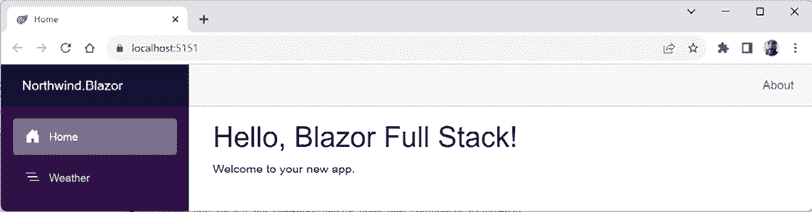
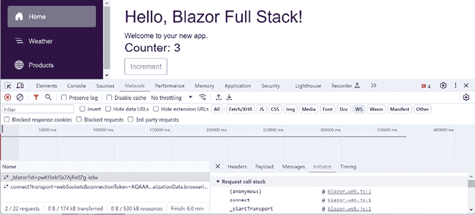
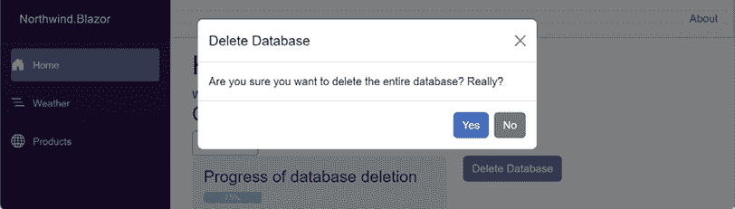
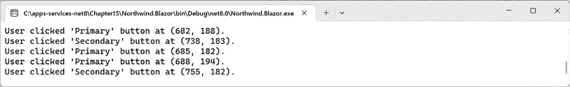
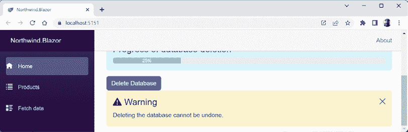
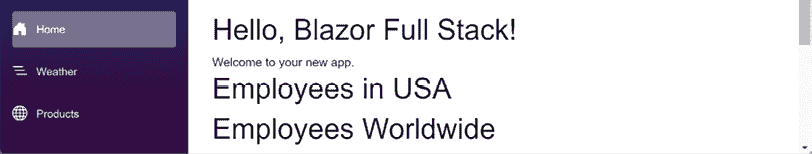
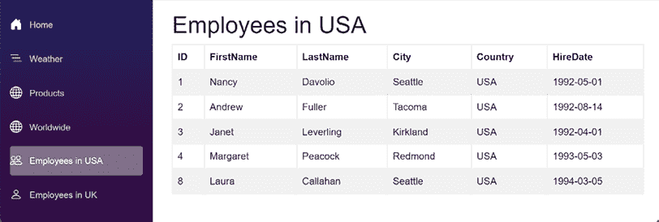

# 使用 Blazor 构建 Web 组件

本章介绍了使用 Blazor 构建 Web 组件。这些可以是丰富且交互式的用户界面，它们以 HTML 和 CSS 的形式渲染，以提供跨平台的浏览器支持。

使用.NET 进行客户端 Web 开发有许多优势。你可以用 99%的代码使用 C#而不是 JavaScript，并且可以通过 JavaScript 模块与 JavaScript 进行交互，其余 1%。你可以在服务器和客户端之间共享业务逻辑。Blazor 实现了.NET Standard 以及最新的.NET 8 库，因此你可以使用广泛的旧版.NET 库，包括来自 Microsoft 和第三方的库。

在本书的前一版中，本章介绍了**Blazor WebAssembly**，这是一种托管模型，其中整个 Blazor 应用程序和.NET 运行时都下载到浏览器并执行。Blazor WebAssembly 的一个问题是访客的初始启动体验较慢，因为需要下载和执行大量内容。

许多.NET 开发者在不得不在构建 Web 应用程序的不同技术之间进行选择时感到沮丧，因为它们都不完美，都有优点和缺点。

在本书的这一版中，本章涵盖了随着.NET 8 引入的新统一 Blazor Full Stack 模型。这使得你可以在单个项目中混合所有最佳功能，包括以下内容：

+   使用 WebAssembly 在客户端执行的 Blazor 组件。这取代了 Blazor WebAssembly 项目所能实现的功能。

+   在服务器端执行并与浏览器中的**文档对象模型**（**DOM**）实时通信的 Blazor 组件，使用 SignalR 进行更新。这取代了 Blazor Server 项目所能实现的功能。

+   提供**静态服务器渲染**（**SSR**）并返回 HTTP 响应的 Blazor 组件，其中静态内容不与服务器进行实时交互。这取代了在传统 ASP.NET Core 网站中使用 Razor Pages 或 Razor Views 所能实现的功能。

+   提供服务器端流式的 Blazor 组件，以便尽快向访客展示部分内容，其余内容则在后台流式传输到浏览器。这是一个全新的功能。

+   未来版本将使 Blazor 能够在任何.NET 进程中执行，如控制台应用程序，因此它可以作为一个**静态网站生成器**（**SSG**）使用。

本章将涵盖以下主题：

+   理解 Blazor

+   构建 Blazor 组件

+   构建 Blazor 数据组件

+   使用本地存储实现缓存

# 理解 Blazor

Blazor 是建立在.NET 之上的 Microsoft 的 Web 组件开发框架。

## Blazor 托管模型

Blazor 提供了多种托管模型可供选择：

+   **Blazor Server**: 所有组件都在 Web 服务器上执行，用户界面更新通过 SignalR 发送到浏览器。Blazor Server 的特性提供了一些关键优势，包括完整的 .NET API 支持、直接访问所有服务器端资源（如数据库）、快速初始加载时间，以及您的代码受到保护，因为它永远不会离开服务器。这种托管模型是在 2019 年 11 月的 .NET Core 3.0 中引入的。

+   **Blazor WebAssembly**: 所有组件都在 Web 浏览器中执行，就像其他 **单页应用程序**（SPA）框架一样，例如 React 和 Angular。您的 .NET 程序集和 .NET 运行时会被下载到浏览器并缓存以供将来使用。Blazor WebAssembly 的特性提供了一些关键优势，包括在网络断开连接时能够离线运行应用程序、在静态网站上托管应用程序或从 **内容分发网络**（CDN）提供应用程序，以及将处理任务卸载到客户端，从而提高可扩展性。这种托管模型是在 2020 年 5 月作为 .NET Core 3.1 的扩展引入的，并在 2020 年 11 月的 .NET 5 中内置。

+   **Blazor Hybrid/.NET MAUI Blazor App**: 所有组件都在本地 Web 视图中执行，该视图由原生客户端应用程序托管。如果应用程序需要跨平台，可以使用 .NET MAUI 构建，或者如果您仅针对 Windows，则可以使用 Windows Presentation Foundation 或 Windows Forms。与前面两种托管模型相比，Blazor Hybrid 的主要优势是访问原生客户端功能，这可以提供更好的用户体验。这种托管模型是在 2022 年 11 月的 .NET 7 中引入的。

+   **Blazor Full Stack**: 组件可以在服务器上执行并生成静态标记，但每个单独的组件可以被切换到以下任何一种：流式渲染、交互式服务器端使用 SignalR 进行 COM 的实时更新，或者交互式客户端使用 WebAssembly。这种新的托管模型在 .NET 8 预览期间被称为 Blazor United。它在 2023 年 11 月的 .NET 8 中以 Blazor Full Stack 的形式引入。在未来版本中，我预计它将简单地被称为 Blazor。

**良好实践**：对于新项目，**Blazor Web App** 应该是您选择的项目模板。如果您需要一个可以托管在 Azure Static Web Apps 或 CDN 上的纯 SPA 项目，那么 **Blazor WebAssembly Standalone App** 将是您的最佳选择，因为 Blazor Web App 需要一个 Web 服务器。对于静态网站，Blazor WebAssembly 仍然是正确的解决方案，而不是新的 Blazor Full Stack。

与多个**托管模型**不同，Blazor Full Stack 具有多个等效的**渲染模式**。托管并执行其代码在服务器端的 Blazor Server 项目模板现在被**交互式服务器渲染模式**所取代。可以在静态网站上托管并执行其代码在客户端的 Blazor WebAssembly 项目模板现在可以被**交互式 WebAssembly 渲染模式**所取代。

Blazor 支持所有四个主要网络浏览器的最新版本——Chrome、Firefox、Edge 和 Safari，在移动和桌面平台上。Blazor Hybrid 支持三个主要平台上的最新 WebView 组件——Android 上的 Chrome、iOS 和 macOS 上的 Safari 以及 Windows 上的 Edge WebView2。

**更多信息**：官方 Blazor 文档提供了一个有用的表格，可以帮助您在托管模型之间进行选择。您可以在以下链接中找到它：[`learn.microsoft.com/en-us/aspnet/core/blazor/hosting-models#which-blazor-hosting-model-should-i-choose`](https://learn.microsoft.com/en-us/aspnet/core/blazor/hosting-models#which-blazor-hosting-model-should-i-choose)。

## Blazor 组件

Blazor 的一切都是关于**组件**。组件是 Web 应用的一部分，如按钮、网格、用于收集访客输入的表单，甚至是一个完整的页面。组件可以被重用和嵌套以构建更复杂的组件。

Blazor 组件通常由一个具有`.razor`文件扩展名的 Razor 文件组成。与 ASP.NET Core MVC 或 Razor Pages 中的 Razor 视图一样，Blazor 组件使用的 Razor 文件可以轻松混合 HTML 和 C#代码。除了构成用户界面部分的 HTML 元素和用于样式的 CSS 之外，Razor 文件还有一个代码块来实现事件处理、属性和其他语句，以提供组件的功能。

例如，一个名为`ProgressBar.razor`的 Blazor 组件可以使用 Bootstrap 实现进度条。它可能定义了进度条的最小值、最大值和当前值参数，并具有布尔参数以启用动画样式和将当前值以文本形式显示，如下面的标记所示：

```cs
<div class="progress">
  <div class="progress-bar progress-bar-striped bg-info
              @(IsAnimated ? " progress-bar-animated" : "")"
       role="progressbar" aria-label="@LabelText" style="width: @Value%"
       aria-valuenow="@Value" aria-valuemin="@Minimum" aria-valuemax="@Maximum">
    @(ShowValue ? Value + "%" : "")
  </div>
</div>
@code {
  [Parameter]
  public int Value { get; set; } = 0;
  [Parameter]
  public int Minimum { get; set; } = 0;
  [Parameter]
  public int Maximum { get; set; } = 100;
  [Parameter]
  public bool IsAnimated { get; set; } = false;
  [Parameter]
  public bool ShowValue { get; set; } = false;
  [Parameter]
  public string? LabelText { get; set; } = "Progress bar";
} 
```

要在页面上嵌入组件实例，您可以使用组件名称，就像它是 HTML 元素一样，并使用 HTML 属性设置其参数，如下面的标记所示：

```cs
<ProgressBar Value="25" IsAnimated="true" ShowValue="true" 
             LabelText="Progress of database deletion" /> 
```

## Blazor 路由到页面组件

`App.razor`文件中的`Router`组件使路由到组件成为可能，如下面的标记所示：

```cs
<Router AppAssembly="@typeof(Program).Assembly">
  <Found Context="routeData">
    <RouteView RouteData="@routeData" 
               DefaultLayout="@typeof(Layout.MainLayout)" />
    <FocusOnNavigate RouteData="@routeData" Selector="h1" />
  </Found>
</Router> 
```

`Router`组件在其`AppAssembly`参数中特别扫描带有`[Route]`属性的组件，注册它们的 URL 路径。

如果找到路由匹配项，则请求的上下文将存储在名为`routeData`的变量中，并将其传递给匹配的 Razor 文件。默认布局设置为使用名为`MainLayout.razor`的文件中定义的类。

`FocusOnNavigate` 组件有一个 `Selector` 属性，必须设置为有效的 CSS 选择器。这可以是一个标签选择器，如默认的 `h1`，或者一个更具体的 CSS 选择器，它使用 CSS 类或 ID。该设置适用于您应用中的所有组件，因此您需要设置一个适用于所有组件的选择器。在 Razor 文件中，焦点设置在第一个 `<h1>` 元素上。如果 Razor 文件包含表单，那么您可能希望将第一个表单输入元素（如文本框）设置为具有焦点。

例如，在一个典型的 ASP.NET Core MVC 项目中，MVC 控制器可以装饰 `[Route]` 属性，如下面的代码所示：

```cs
[Route("customers")]
public class CustomersController
{ 
```

对相对路径 `/customers` 的 HTTP `GET` 请求将与该路由匹配。

要创建一个等效的路由页面组件，将 `@page` 指令添加到组件的 `.razor` 文件顶部，如下所示，高亮显示的标记：

```cs
@page "customers" 
```

页面组件可以包含多个 `@page` 指令以注册多个路由。

如果您编写使用反射来查找从 Razor 标记文件为您生成的 `component` 类的代码，那么您会发现它由于 `@page` 指令而被 `[Route]` 属性装饰。

在运行时，页面组件将与您指定的任何特定布局合并，就像 MVC 视图或 Razor 页面一样。默认情况下，Blazor 项目模板定义一个名为 `MainLayout.razor` 的文件作为页面组件的布局。

**良好实践**：按照惯例，将可路由的页面 Blazor 组件放在 `Components\Pages` 文件夹中，将非页面组件放在 `Components` 文件夹中。

## 如何传递路由参数

Blazor 路由可以包含不区分大小写的命名参数，并且您可以通过将参数绑定到代码块中的属性，使用 `[Parameter]` 属性最轻松地访问传递的值，如下面的标记所示：

```cs
@page "/employees/{country}"
<div>Country parameter as the value: @Country</div>
@code {
  [Parameter]
  public string Country { get; set; }
} 
```

处理缺失默认值的参数的推荐方法是，在路由参数后缀加上 `?`，在 `OnParametersSet` 方法中使用空合并运算符，如下所示，高亮显示的标记：

```cs
@page "/employees/{country**?**}"
<div>Country parameter as the value: @Country</div>
@code {
  [Parameter]
  public string**?** Country { get; set; }
**protected****override****void****OnParametersSet****()**
 **{**
**// if the automatically set property is null**
**// set its value to USA**
 **Country = Country ?? "USA";**
 **}**
} 
```

## 从查询字符串设置参数

您还可以使用查询字符串中的参数设置组件属性，如下面的代码所示：

```cs
[Parameter]
[SupplyParameterFromQuery(Name = "country")]
public string? Country { get; set; } 
```

## 参数的路由约束

路由约束验证传递的参数的数据类型是否正确。如果具有参数值的潜在请求违反了约束，则不会对该路由进行匹配，而是评估其他路由。如果没有路由匹配，则返回 `404` 状态码。

如果您不设置约束，则任何值都可作为路由匹配接受，但在将值转换为 C# 方法的预期数据类型时可能会引发数据类型转换异常。一些路由约束示例在 *表 15.1* 中显示：

| **约束示例** | **描述** |
| --- | --- |
| `{isanimated:bool}` | `IsAnimated`属性必须设置为有效的布尔值，例如，`TRUE`或`true`。 |
| `{hiredate:datetime}` | `HireDate`属性必须是一个有效的日期/时间值。 |
| `{price:decimal}` | `UnitPrice`属性必须是一个有效的`decimal`值。 |
| `{shipweight:double}` | `ShipWeight`属性必须是一个有效的`double`值。 |
| `{shipwidth:float}` | `ShipWidth`属性必须是一个有效的`float`值。 |
| `{orderid:guid}` | `OrderId`属性必须是一个有效的`Guid`值。 |
| `{categoryid:int}` | `CategoryId`属性必须是一个有效的`int`值。 |
| `{nanoseconds:long}` | `Nanoseconds`属性必须是一个有效的`long`值。 |

表 15.1：路由约束示例

**良好实践**：路由约束假设文化不变，因此你的 URL 不得本地化。例如，始终使用不变文化格式传递日期和时间参数值。

## 基组件类

基类定义了`OnParametersSet`方法，这是组件默认继承的，名为`ComponentBase`，如下面的代码所示：

```cs
using Microsoft.AspNetCore.Components;
public abstract class ComponentBase : IComponent, IHandleAfterRender, IHandleEvent
{
  // members not shown
} 
```

`ComponentBase` 包含一些你可以调用和重写的有用方法，如*表 15.2*所示：

| **方法(s)** | **描述** |
| --- | --- |
| `InvokeAsync` | 调用此方法在关联渲染器的同步上下文中执行函数。这避免了在访问共享资源时编写线程同步代码的需求。不允许多个线程同时访问渲染过程。使用`InvokeAsync`意味着在任何给定时刻只有一个线程将访问组件，这消除了编写线程锁定和同步代码以共享状态的需求。 |
| `OnAfterRender`,`OnAfterRenderAsync` | 重写这些方法以在组件每次渲染时执行代码。 |
| `OnInitialized`,`OnInitializedAsync` | 重写这些方法以在组件从渲染树中的父组件接收其初始参数后执行代码。 |
| `OnParametersSet`,`OnParametersSetAsync` | 重写这些方法以在组件收到参数并将值分配给属性后执行代码。 |
| `ShouldRender` | 重写此方法以指示组件是否应该渲染。 |
| `StateHasChanged` | 调用此方法使组件重新渲染。 |

表 15.2：ComponentBase 的有用方法

## Blazor 布局

Blazor 组件可以像 MVC 视图和 Razor 页面一样拥有共享布局。你需要创建一个`.razor`组件文件，并显式地从`LayoutComponentBase`继承，如下面的标记所示：

```cs
@inherits LayoutComponentBase
<div>
  ...
  @Body
  ...
</div> 
```

基类有一个名为`Body`的属性，你可以在布局的适当位置渲染它。

你可以在`App.razor`文件及其`Router`组件中为组件设置默认布局。要为组件显式设置布局，请使用`@layout`指令，如下面的标记所示：

```cs
@page "/employees"
@layout AlternativeLayout
<div>
  ...
</div> 
```

## 如何导航 Blazor 路由到页面组件

微软提供了一个名为 `NavigationManager` 的依赖服务，它理解 Blazor 路由和 `NavLink` 组件。`NavigateTo` 方法用于跳转到指定的 URL。

在 HTML 中，您使用 `<a>` 元素来定义导航链接，如下面的标记所示：

```cs
<a href="/employees">Employees</a> 
```

在 Blazor 中，使用 `<NavLink>` 组件，如下面的标记所示：

```cs
<NavLink href="/employees">Employees</NavLink> 
```

`NavLink` 组件比锚点元素更好，因为它会自动将其类设置为 `active`，如果其 `href` 与当前位置 URL 匹配。如果您的 CSS 使用不同的类名，则可以在 `NavLink.ActiveClass` 属性中设置类名。

默认情况下，在匹配算法中，`href` 是路径 **前缀**，因此如果 `NavLink` 的 `href` 为 `/employees`，如前面的代码示例所示，则它将匹配以下所有路径并将它们全部设置为具有 `active` 类样式：

```cs
/employees
/employees/USA
/employees/UK/London 
```

为了确保匹配算法只对路径中的**所有**文本进行匹配（换句话说，只有当整个完整文本匹配时才进行匹配，而不是路径的任何部分匹配时），请将 `Match` 参数设置为 `NavLinkMatch.All`，如下面的代码所示：

```cs
<NavLink href="/employees" Match="NavLinkMatch.All">Employees</NavLink> 
```

如果您设置了其他属性，例如 `target`，它们将被传递到生成的底层 `<a>` 元素。

## CSS 和 JavaScript 隔离

Blazor 组件通常需要提供自己的 CSS 以应用样式或 JavaScript 以执行纯 C# 无法执行的活动，例如访问浏览器 API。为了确保这不会与站点级别的 CSS 和 JavaScript 冲突，Blazor 支持 CSS 和 JavaScript 隔离。

如果您有一个名为 `Home.razor` 的组件，只需创建一个名为 `Home.razor.css` 的 CSS 文件。在此文件中定义的样式将覆盖项目中此组件的所有其他样式，但不会覆盖网站的其他部分。

对于 JavaScript 隔离，您不使用与 CSS 相同的命名约定。相反，Blazor 通过使用 JavaScript 模块启用 JavaScript 隔离，这些模块通过 Blazor 的 JavaScript 互操作功能导入，您将在本章后面看到。

您可以在以下链接中了解更多关于 JavaScript 隔离的信息：[`learn.microsoft.com/en-us/aspnet/core/blazor/javascript-interoperability/call-javascript-from-dotnet#javascript-isolation-in-javascript-modules`](https://learn.microsoft.com/en-us/aspnet/core/blazor/javascript-interoperability/call-javascript-from-dotnet#javascript-isolation-in-javascript-modules)。

# 构建 Blazor 组件

使用 ASP.NET Core 8，Blazor 引入了一个新的项目模板，以启动一个支持最灵活托管模型和所有渲染模式的程序。它提供了一个基本模板以运行，以及一个 `Weather` 组件，该组件显示一个包含五行随机温度的表格，使用流式渲染。

## 检查新的 Blazor 项目模板

首先，我们将创建一个 Blazor Web App 项目并回顾其重要部分：

1.  使用你喜欢的代码编辑器创建一个新的项目和解决方案，使用 Blazor Web App 项目模板，如下列表所示：

    +   项目模板：**Blazor Web App** / `blazor --interactivity None`

    +   项目文件和文件夹：`Northwind.Blazor`

    +   解决方案文件和文件夹：`Chapter15`

    +   **身份验证类型**：无

    +   **配置 HTTPS**：已选中

    +   **交互式渲染模式**：无

    +   **交互位置**：每页/组件

    +   **包含示例页面**：已选中

    +   **不使用顶级语句**：已清除

    如果你正在使用 Visual Studio Code 或 JetBrains Rider，请在 `Chapter15` 文件夹中的命令提示符或终端中输入以下命令：`dotnet new blazor --interactivity None -o Northwind.Blazor`。

    **良好实践**：我们没有选择使用交互式 WebAssembly 或服务器组件的选项，以便我们可以逐步构建你对 Blazor 的工作原理的知识。在实际项目中，你可能会从一开始就选择这些选项。我们还选择了示例页面，你可能会在实际项目中清除这些页面。

1.  构建 `Northwind.Blazor` 项目。

1.  在 `Northwind.Blazor.csproj` 中，请注意它与使用 Web SDK 并针对 .NET 8 的 ASP.NET Core 项目相同。

1.  在 `Northwind.Blazor` 项目中，在 `Program.cs` 中，请注意这些语句启用了 ASP.NET Core 服务集合和 HTTP 管道，并添加了具有 Blazor 特定语句的 Razor 组件，然后使用它们，如下所示（代码高亮）：

    ```cs
    using Northwind.Blazor.Components;
    var builder = WebApplication.CreateBuilder(args);
    // Add services to the container.
    **builder.Services.AddRazorComponents();**
    var app = builder.Build();
    // Configure the HTTP request pipeline.
    if (!app.Environment.IsDevelopment())
    {
      app.UseExceptionHandler("/Error", createScopeForErrors: true);
      // The default HSTS value is 30 days. You may want to change this for production scenarios, see https://aka.ms/aspnetcore-hsts.
      app.UseHsts();
    }
    app.UseHttpsRedirection();
    app.UseStaticFiles();
    app.UseAntiforgery();
    **app.MapRazorComponents<App>();**
    app.Run(); 
    ```

1.  在 `Northwind.Blazor` 项目中，展开 `Properties` 文件夹，打开 `launchSettings.json` 文件，并将 `https` 配置的 `applicationUrl` 设置的端口号更改为 `5151` 用于 `https` 和 `5152` 用于 `http`，如下所示（设置）：

    ```cs
    "applicationUrl": "https://localhost:5151;http://localhost:5152", 
    ```

1.  将更改保存到 `launchSettings.json` 文件。

1.  在 `Northwind.Blazor` 项目中，在 `Components` 文件夹中打开 `App.razor`，如下所示：

    ```cs
    <!DOCTYPE html>
    <html lang="en">
    <head>
      <meta charset="utf-8" />
      <meta name="viewport" content="width=device-width, initial-scale=1.0" />
      <base href="/" />
      <link rel="stylesheet" href="bootstrap/bootstrap.min.css" />
      <link rel="stylesheet" href="app.css" />
      <link rel="stylesheet" href="Northwind.Blazor.styles.css" />
      <link rel="icon" type="image/png" href="favicon.png" />
      <HeadOutlet />
    </head>
    <body>
      <Routes />
      <script src="img/blazor.web.js"></script>
    </body>
    </html> 
    ```

    注意以下内容：

    +   一个 `<HeadOutlet />` Blazor 组件，用于将额外内容注入 `<head>` 部分。这是所有 Blazor 项目中可用的内置组件之一。

    +   一个 `<Routes />` Blazor 组件，用于定义此项目中的自定义路由。此组件可以完全由开发者自定义，因为它当前项目的一部分，在名为 `Routes.razor` 的文件中。

    +   一个用于 `blazor.web.js` 的脚本块，该脚本块管理 Blazor 的动态功能与服务器之间的通信，例如在后台下载 WebAssembly 组件，并在稍后从服务器端组件执行切换到客户端组件执行。

1.  在 `Components` 文件夹中，在 `Routes.razor` 文件中，注意 `<Router>` 为当前程序集中找到的所有 Blazor 组件启用路由，如果找到匹配的路由，则执行 `RouteView`，这将设置组件的默认布局为 `MainLayout` 并将任何路由数据参数传递给组件。对于该组件，第一个 `<h1>` 元素将获得焦点，如下所示代码：

    ```cs
     <Router AppAssembly="@typeof(Program).Assembly">
        <Found Context="routeData">
          <RouteView RouteData="@routeData" 
                     DefaultLayout="@typeof(Layout.MainLayout)" />
          <FocusOnNavigate RouteData="@routeData" Selector="h1" />
        </Found>
      </Router> 
    ```

1.  在 `Components` 文件夹中，在 `_Imports.razor` 文件中，注意该文件导入了一些有用的命名空间，以便在所有自定义 Blazor 组件中使用。

1.  在 `Components\Layout` 文件夹中，注意 `MainLayout.razor` 定义了用于侧边栏的 `<div>`，其中包含一个由本项目的 `NavMenu.razor` 组件文件实现的导航菜单，以及 `<main>` 和 `<article>` 等 HTML5 元素用于内容，如下所示标记：

    ```cs
    @inherits LayoutComponentBase
    <div class="page">
      <div class="sidebar">
        <NavMenu />
      </div>
      <main>
        <div class="top-row px-4">
          <a href="https://learn.microsoft.com/aspnet/core/" 
             target="_blank">About</a>
        </div>
        <article class="content px-4">
            @Body
        </article>
      </main>
    </div> 
    ```

1.  在 `Components\Layout` 文件夹中，打开 `NavMenu.razor`，如下所示标记：

    ```cs
    <div class="top-row ps-3 navbar navbar-dark">
      <div class="container-fluid">
        <a class="navbar-brand" href="">Northwind.Blazor</a>
      </div>
    </div>
    <input type="checkbox" title="Navigation menu" class="navbar-toggler" />
    <div class="nav-scrollable" 
         onclick="document.querySelector('.navbar-toggler').click()">
      <nav class="flex-column">
        <div class="nav-item px-3">
          <NavLink class="nav-link" href="" Match="NavLinkMatch.All">
            <span class="bi bi-house-door-fill-nav-menu" aria-hidden="true"></span> Home
          </NavLink>
        </div>
        <div class="nav-item px-3">
          <NavLink class="nav-link" href="weather">
            <span class="bi bi-list-nested-nav-menu" aria-hidden="true">
            </span> Weather
          </NavLink>
        </div>
      </nav>
    </div> 
    ```

    注意以下事项：

    +   `NavMenu` 组件没有 `@page` 指令，因为它不使用共享布局或作为页面渲染。

    +   它使用 Bootstrap 提供一个选择菜单，该菜单能够响应式地适应视口的宽度。当没有足够的水平空间时，它将折叠成汉堡菜单，然后访客可以切换导航的开启和关闭。

    +   目前有两个菜单项：**首页**和**天气**。在本章中我们将添加更多。

1.  在 `Components\Pages` 文件夹中，在 `Home.razor` 文件中，注意 `@page` 指令配置了根路径的路由以跳转到此页面组件，然后将标题从 `world` 更改为 `Blazor Full Stack`，如下所示高亮标记：

    ```cs
    @page "/"
    <PageTitle>Home</PageTitle>
    <h1>Hello, **Blazor Full Stack**!</h1>
    Welcome to your new app. 
    ```

1.  启动 `Northwind.Blazor` 项目，使用其 `https` 配置文件且不进行调试：

    +   如果你正在使用 Visual Studio 2022，那么在 **解决方案资源管理器** 中，选择 `Northwind.Blazor` 项目以使其处于活动状态。在 Visual Studio 2022 工具栏中，选择 `https` 配置文件作为 **启动项目**，并选择 **Google Chrome** 作为 **Web 浏览器**。

    +   如果你正在使用 Visual Studio Code，那么在命令行或终端中，输入以下命令：

        ```cs
        dotnet run --launch-profile https 
        ```

1.  在 Chrome 中，注意左侧导航和主页组件，如图 *图 15.1* 所示：



图 15.1：作为 Blazor 页面组件实现的简单网页

1.  最后，关闭浏览器并关闭 web 服务器。

## 使用 Bootstrap 图标

较旧的 Blazor 项目模板包含了所有 Bootstrap 图标。在新的项目模板中，仅使用 **可缩放矢量图形** (**SVG**) 定义了三个图标。让我们看看团队是如何定义这些图标的，然后添加一些供我们使用：

1.  在 `Components\Layout` 文件夹中，在名为 `NavMenu.razor.css` 的 CSS 样式表文件中，找到文本 `bi-house`，并注意使用 SVG 定义的三个图标，如下所示代码部分显示：

    ```cs
    .bi-house-door-fill-nav-menu {
        background-image: url("data:image/svg+xml,...");
    }
    .bi-plus-square-fill-nav-menu {
        background-image: url("data:image/svg+xml,...");
    }
    .bi-list-nested-nav-menu {
        background-image: url("data:image/svg+xml,...");
    } 
    ```

1.  在您喜欢的浏览器中，导航到：[`icon-sets.iconify.design/bi/`](https://icon-sets.iconify.design/bi/)，并注意 **Bootstrap 图标** 拥有 MIT 许可证，并包含超过 2,000 个图标。

1.  在 **搜索 Bootstrap 图标** 框中输入 `globe`，并注意找到了六个地球图标。

1.  点击第一个地球图标，滚动到页面底部，并点击 **SVG 作为数据：URI** 按钮。注意，您可以复制并粘贴此图标的定义以在 CSS 样式表中使用，但您不需要这样做，因为我已经为您创建了一个包含五个图标定义的 CSS 文件，您可以在您的 Blazor 项目中使用这些图标。

1.  在您喜欢的浏览器中，导航到：[`github.com/markjprice/apps-services-net8/blob/main/code/Chapter15/Northwind.Blazor/wwwroot/icons.css`](https://github.com/markjprice/apps-services-net8/blob/main/code/Chapter15/Northwind.Blazor/wwwroot/icons.css)，下载文件，并将其保存在您自己的项目的 `wwwroot` 文件夹中。

1.  在 `Components` 文件夹中，在 `App.razor` 组件中，在 `<head>` 中，添加一个 `<link>` 元素以引用 `icons.css` 样式表，如下面的标记所示：

    ```cs
    <link rel="stylesheet" href="icons.css" /> 
    ```

1.  保存并关闭文件。

## 引用 EF Core 类库并注册数据上下文

我们将引用您在 *第三章* 中创建的 EF Core 模型，*使用 EF Core 为 SQL Server 构建实体模型*：

1.  在 `Northwind.Blazor.csproj` 项目文件中，将警告视为错误，并将 Northwind 数据库上下文项目添加为项目引用，如下面的标记所示：

    ```cs
    <ItemGroup>
      <ProjectReference Include="..\..\Chapter03\Northwind.Common.DataContext
    .SqlServer\Northwind.Common.DataContext.SqlServer.csproj" />
    </ItemGroup> 
    ```

    `Include` 路径不得有换行符。

1.  在命令提示符或终端中，使用 `dotnet build` 命令构建 `Northwind.Blazor` 项目。

1.  在 `Components` 文件夹中，在 `_Imports.razor` 中，导入命名空间以使用 EF Core 的异步方法以及与 Northwind 实体模型一起使用，如下面的代码所示：

    ```cs
    @using Microsoft.EntityFrameworkCore @* To use ToListAsync method. *@
    @using Northwind.EntityModels @* To use NorthwindContext and so on. *@ 
    ```

    在此处导入命名空间意味着我们不需要在 `.razor` 文件顶部导入它们。`_Imports.razor` 文件仅适用于 `.razor` 文件。如果您使用代码背后的 `.cs` 文件来实现组件代码，那么它们必须单独导入命名空间，或者使用全局使用来隐式导入命名空间。注意静态导入渲染模式类型的语句：`@using static Microsoft.AspNetCore.Components.Web.RenderMode`。

1.  在 `Program.cs` 中，导入命名空间以使用 `AddNorthwindContext` 扩展方法，如下面的代码所示：

    ```cs
    using Northwind.EntityModels; // To use AddNorthwindContext method. 
    ```

1.  在添加服务到容器部分的区域，添加一个语句将 `NorthwindContext` 注册为服务，如下面的代码所示：

    ```cs
    builder.Services.AddNorthwindContext(); 
    ```

## 构建用于数据的静态服务器端渲染组件

接下来，我们将添加一个组件，它可以完成与传统 ASP.NET Core 网站中的 Razor 页面或 Razor 视图相同的工作。它不会有任何需要组件在服务器或客户端上执行的交互性。

这将允许访问者查看来自 Northwind 数据库的产品表：

1.  在`Components\Pages`文件夹中，添加一个名为`Products.razor`的新文件。在 Visual Studio 2022 中，项目项模板命名为**Razor Component**。在 JetBrains Rider 中，项目项模板命名为**Blazor Component**。

    **良好实践**：组件文件名必须以大写字母开头，否则将出现编译错误！

1.  在`Products.razor`中，设置路由到`/products`，注入 Northwind 数据上下文，定义一个表格以渲染产品，并编写代码块以在页面初始化时获取产品，如下所示，代码标记：

    ```cs
    @page "/products"
    @inject NorthwindContext db
    <h1>Products</h1>
    <table class="table">
      <thead>
        <tr>
          <th>Product ID</th>
          <th>Product Name</th>
          <th>Unit Price</th>
        </tr>
      </thead>
      <tbody>
        @if ((products is null) || (products.Count == 0))
        {
          <tr><td colspan="4">No products found.</td></tr>
        }
        else
        {
          @foreach (Product p in products)
          {
            <tr>
              <td>@p.ProductId</td>
              <td>@p.ProductName</td>
              <td>@(p.UnitPrice.HasValue ? 
                p.UnitPrice.Value.ToString("C") : "n/a")</td>
            </tr>
          }
        }
      </tbody>
    </table>
    @code {
      private List<Product>? products;
      protected override async Task OnInitializedAsync()
      {
        products = await db.Products.ToListAsync();
      }
    } 
    ```

1.  在`Components\Layout`文件夹中的`NavMenu.razor`，在导航到主页的菜单项之后，添加一个导航到产品页面的菜单项，如下所示，代码标记：

    ```cs
    <div class="nav-item px-3">
      <NavLink class="nav-link" href="products">
        <span class="bi bi-globe" aria-hidden="true"></span> Products
      </NavLink>
    </div> 
    ```

1.  如果您的数据库服务器没有运行（例如，因为您正在 Docker、虚拟机或云中托管它），那么请确保启动它。

1.  使用不带调试的`https`配置启动`Northwind.Blazor`项目。

1.  在左侧导航中点击**Products**，并注意产品表。

1.  关闭浏览器并关闭 Web 服务器。

## 构建具有服务器交互性的组件

接下来，我们将添加一个需要一些交互性的组件，因此我们将启用 Blazer 与 SignalR 一起动态更新浏览器 DOM，实时运行时：

1.  在`Components`文件夹中，添加一个名为`Counter.razor`的新文件。

1.  在`Counter.razor`中，定义一个标签以渲染计数器数字的当前值，一个按钮以增加它，以及一个代码块以存储当前计数器值和点击事件处理程序，以增加数字，如下所示，代码标记：

    ```cs
    <h3>Counter: @CounterValue</h3>
    <button id="buttonIncrement" @onclick="IncrementCounter"
      class="btn btn-outline-primary">Increment</button>
    @code {
      public int CounterValue { get; set; } = 0;
      public void IncrementCounter()
      {
        CounterValue++;
      }
    } 
    ```

    注意，此组件不会作为页面使用，因此我们不会用`@page`指令装饰它或定义组件的路由。它将仅用于嵌入到其他组件中。

1.  在`Components\Pages`文件夹中的`Home.razor`，在页面底部，渲染计数器组件，如下所示，代码标记：

    ```cs
    <Counter /> 
    ```

1.  使用不带调试的`https`配置启动`Northwind.Blazor`项目。

1.  在主页上点击按钮，注意没有任何操作。当您使用带有`--interactivity None`开关的 Blazor Web App 模板创建项目或将**交互渲染模式**设置为**None**时，在 Blazor Web App 项目中不会启用组件交互性。

1.  关闭浏览器并关闭 Web 服务器。

1.  在`Program.cs`中，在添加 Razor 组件的语句末尾，添加一个调用方法以添加交互式服务器组件的调用，如下所示，代码中高亮显示：

    ```cs
    builder.Services.AddRazorComponents()
     **.AddInteractiveServerComponents();** 
    ```

1.  在`Program.cs`中，在映射 Razor 组件的语句末尾，添加一个调用方法以添加交互式服务器渲染模式，如下所示，代码中高亮显示：

    ```cs
    app.MapRazorComponents<App>()
     **.AddInteractiveServerRenderMode();** 
    ```

1.  在`Components`文件夹中的`Counter.razor`，在文件顶部，添加一个指令以设置渲染模式为交互式服务器，如下所示，代码标记：

    ```cs
    @rendermode InteractiveServer 
    ```

1.  使用不带调试的`https`配置启动`Northwind.Blazor`项目。

1.  在 **开发者工具** 中，点击 **控制台** 选项卡，并注意 `blazor.web.js` 文件建立了一个 WebSocket 连接，如下面的输出所示：

    ```cs
    [2023-10-20T11:25:52.498Z] Information: Normalizing '_blazor' to 'https://localhost:5151/_blazor'.
    [2023-10-20T11:25:52.675Z] Information: WebSocket connected to wss://localhost:5151/_blazor?id=j6Fc0Mbay_jWkZTWfIqs_w. 
    ```

1.  在 **开发者工具** 中，点击 **网络** 选项卡，点击 **WS** 以通过 WebSockets 过滤，然后刷新主页。

1.  在主页上，点击 **Increment** 按钮，注意计数器的增加，注意 **_blazor?id=...** 请求，选择该请求的 **_blazor?id=...**，然后点击 **Initiator** 选项卡，并注意发起者是添加到所有页面中的 `blazor.web.js` 文件，如图 *15.2* 所示：



图 15.2：Blazor.web.js 向服务器上的 SignalR 发送请求以更新 DOM 以实现实时交互

1.  关闭浏览器并关闭 web 服务器。

## 构建 Blazor 进度条组件

在本节中，我们将构建一个组件以提供进度条。它将使用 Bootstrap 类设置浅蓝色调，并提供选项来动画化进度条并显示进度值的当前百分比：

1.  在 `Northwind.Blazor` 项目的 `Components` 文件夹中，添加一个名为 `ProgressBar.razor` 的新文件。

1.  在 `ProgressBar.razor` 中，添加语句以渲染使用 Bootstrap 类定义的进度条 `<div>` 元素，这些元素具有可绑定参数，设置各种属性，如下所示的高亮标记：

    ```cs
    @rendermode InteractiveServer
    <div class="progress">
      <div class="progress-bar progress-bar-striped bg-info
                  @(IsAnimated ? " progress-bar-animated" : "")"
           role="progressbar" aria-label="@LabelText" 
           style="width: @Value%" aria-valuenow="@Value" 
           aria-valuemin="@Minimum" aria-valuemax="@Maximum">
        @(ShowValue ? Value + "%" : "")
      </div>
    </div>
    @code {
      [Parameter]
      public int Value { get; set; } = 0;
      [Parameter]
      public int Minimum { get; set; } = 0;
      [Parameter]
      public int Maximum { get; set; } = 100;
      [Parameter]
      public bool IsAnimated { get; set; } = false;
      [Parameter]
      public bool ShowValue { get; set; } = false;
      [Parameter]
      public string? LabelText { get; set; } = "Progress bar";
    } 
    ```

1.  在 `Components\Pages` 文件夹中，在 `Home.razor` 文件的底部，添加语句以定义一个 Bootstrap 行，包含两个等宽的列，并添加一个设置为 25% 的 `<ProgressBar>` 组件，如下所示的高亮标记：

    ```cs
    <div class="row">
      <div class="col">
        <div class="alert alert-info">
          <h4>Progress of database deletion</h4>
          <ProgressBar Value="25" IsAnimated="true" ShowValue="true" 
                       LabelText="Progress of database deletion" />
        </div>
      </div>
      <div class="col">
        More components coming soon.
      </div>
    </div> 
    ```

1.  使用 `Northind.Blazor` 项目的 `https` 配置文件启动项目，不进行调试。

1.  注意显示（模拟！）数据库删除进度的进度条。

1.  关闭浏览器并关闭 web 服务器。

## 构建 Blazor 对话框组件

在本节中，我们将构建一个组件，为与网站访客的交互提供一个弹出对话框。它将使用 Bootstrap 类来定义一个按钮，当点击时，会显示一个带有可配置标签的两个按钮的对话框。

默认情况下，Blazor Web App 项目模板使用 Bootstrap 5.1 的本地副本，但仅包含 CSS 部分。我们需要添加一个脚本标签来添加 Bootstrap 的 JavaScript 部分。我们也可以升级到 Bootstrap 的最新版本并使用 CDN 版本。

您可以在以下链接中找到最新的 CDN 链接：[`getbootstrap.com/docs/5.3/getting-started/introduction/#cdn-links`](https://getbootstrap.com/docs/5.3/getting-started/introduction/#cdn-links)。

该组件还将定义两个事件回调，父组件可以处理这些回调以自定义在两个按钮被点击时执行的代码。

1.  在 `App.razor` 中，注释掉指向本地 CSS 文件的 `<link>`，并添加对最新 CDN 版本的引用，如下所示的高亮标记：

    ```cs
    **@***<link rel="stylesheet" href="bootstrap/bootstrap.min.css" />***@**
    **<link rel="stylesheet" href="****https****://cdn.jsdelivr.net/npm/bootstrap@****5.3****.****2****/dist/css/bootstrap.min.css" integrity="sha384-T3c6CoIi6uLrA9TneNEoa7RxnatzjcDSCmG1MXxSR1GAsXEV/Dwwykc2MPK8M2HN" crossorigin="anonymous">** 
    ```

1.  在 `App.razor` 中，在 Blazor 的 `<script>` 标签之后，添加一个指向最新 CDN 版本的 `<script>`，并抑制错误 `RZ/BL9992`，如下所示：

    ```cs
    <script src="img/bootstrap.bundle.min.js" integrity="sha384-C6RzsynM9kWDrMNeT87bh95OGNyZPhcTNXj1NW7RuBCsyN/o0jlpcV8Qyq46cDfL" crossorigin="anonymous" suppress-error="BL9992"></script> 
    ```

    我们抑制了错误 BL9992（也称为 RZ9992），该错误警告说：“脚本标签不应放置在组件内部，因为它们无法动态更新。” 更多信息，请参阅 [`aka.ms/AAe3qu3`](https://aka.ms/AAe3qu3)。

1.  在 `Northwind.Blazor` 项目中，在 `Components` 文件夹中，添加一个名为 `DialogBox.razor` 的新文件。

1.  在 `DialogBox.razor` 文件中，添加语句以渲染使用 Bootstrap 类定义按钮和模态对话框的 `<div>` 元素，并设置可绑定参数，以及各种属性，如下所示：

    ```cs
    @rendermode InteractiveServer
    <!-- Button to show the dialog box. -->
    <button type="button" class="btn btn-primary" 
            data-bs-toggle="modal" data-bs-target="#dialogBox">
      @DialogTitle
    </button>
    <!-- Dialog box to popup. -->
    <div class="modal fade" id="dialogBox"
         data-bs-backdrop="static" data-bs-keyboard="false" tabindex="-1" 
         aria-labelledby="dialogBoxLabel" aria-hidden="true">
      <div class="modal-dialog">
        <div class="modal-content">
          <div class="modal-header">
            <h5 class="modal-title" id="dialogBoxLabel">@DialogTitle</h5>
            <button type="button" class="btn-close" 
                    data-bs-dismiss="modal" aria-label="Close"></button>
          </div>
          <div class="modal-body">
            @ChildContent
          </div>
          <div class="modal-footer">
            <button type="button" class="btn btn-primary" 
                    @onclick="OnClickPrimary">
                @PrimaryButtonText
            </button>
            <button type="button" class="btn btn-secondary" 
                    data-bs-dismiss="modal" @onclick="OnClickSecondary">
                @SecondaryButtonText
            </button>
          </div>
        </div>
      </div>
    </div>
    @code {
      [Parameter]
      public string? DialogTitle { get; set; }
      // ChildContent is a special name that is set automatically by any 
      // markup content within the component begin and end elements.
      [Parameter]
      public RenderFragment? ChildContent { get; set; }
      [Parameter]
      public string? PrimaryButtonText { get; set; } = "OK";
      [Parameter]
      public EventCallback<MouseEventArgs> OnClickPrimary { get; set; }
      [Parameter]
      public string? SecondaryButtonText { get; set; } = "Cancel";
      [Parameter]
      public EventCallback<MouseEventArgs> OnClickSecondary { get; set; }
    } 
    ```

    注意到两个按钮的默认文本值为 `OK` 和 `Cancel`，它们都有事件回调参数，这些参数将包含作为事件参数传递的鼠标指针信息。此外，注意具有 `class="btn-close"` 的按钮，它在右上角以 **X** 按钮的形式视觉上出现，用于关闭对话框。

1.  在 `Components\Pages` 文件夹中，在 `Home.razor` 文件中，靠近文件顶部，添加语句以设置渲染模式为交互式服务器，如下所示：

    ```cs
    @rendermode InteractiveServer 
    ```

1.  在 `Components\Pages` 文件夹中，在 `Home.razor` 文件中，靠近文件底部，将文本 `更多组件即将推出` 替换为添加 `<DialogBox>` 组件的语句，设置两个按钮标签为 `是` 和 `否`，然后在文件底部，添加一个 Razor 代码块以定义两个点击事件的处理器，输出被点击的按钮和鼠标指针的当前位置，如下所示：

    ```cs
     <div class="col">
     **<DialogBox DialogTitle="Delete Database"** 
     **PrimaryButtonText="Yes" OnClickPrimary="Yes_Click"**
     **SecondaryButtonText="No" OnClickSecondary="No_Click">**
     **Are you sure you want to delete the entire database? Really?**
     **</DialogBox>**
      </div>
    </div>
    **@code {**
    **private****void****Yes_Click****(****MouseEventArgs e****)**
     **{**
     **Console.WriteLine("User clicked 'Primary'** **button** **at** **(****{****0****}, {****1****}****).",**
     **arg0: e.ClientX, arg1: e.ClientY)****;**
     **}**
    **private****void****No_Click****(****MouseEventArgs e****)**
     **{**
     **Console.WriteLine("User clicked 'Secondary'** **button** **at** **(****{****0****}, {****1****}****).",**
     **arg0: e.ClientX, arg1: e.ClientY)****;**
     **}**
    **}** 
    ```

    在 `<DialogBox>` 和 `</DialogBox>` 元素之间的任何内容都将自动设置为 `ChildContent` 属性。

1.  使用其 `https` 配置文件启动 `Northwind.Blazor` 项目，不进行调试。

1.  点击 **删除数据库** 按钮，并注意弹出的模态对话框，如图 *15.3* 所示：



图 15.3：使用 Bootstrap 构建的 Blazor 组件的弹出模态对话框

1.  将命令提示符或终端窗口和浏览器窗口排列，以便您可以看到两者。

1.  在 **删除数据库** 对话框中，点击 **是** 按钮和 **否** 按钮几次（点击 **否** 按钮或 **x** 按钮将关闭对话框，因此再次点击 **删除数据库** 按钮以重新显示对话框），并注意写入控制台的消息，如图 *15.4* 所示：

    图 15.4：写入服务器控制台的对话框组件

    客户端的 JavaScript 显示 Bootstrap 对话框。按钮点击将触发通过 WebSocket 的 SignalR 连接以执行服务器端组件事件处理代码。

1.  关闭浏览器，并关闭 web 服务器。

你可以在以下链接中了解更多关于支持的事件参数：[`learn.microsoft.com/en-us/aspnet/core/blazor/components/event-handling#event-arguments`](https://learn.microsoft.com/en-us/aspnet/core/blazor/components/event-handling#event-arguments)。

## 构建 Blazor 警报组件

在本节中，我们将构建一个组件，用于向网站访客显示消息警报。它将使用 Bootstrap 类定义一个多彩的区域来显示消息，可以取消显示。消息、标题、图标和颜色主题可以配置：

1.  在 `Northwind.Blazor` 项目中，在 `Components` 文件夹中，添加一个名为 `Bootstrap.Constants.cs` 的新文件。

1.  在 `Bootstrap.Constants.cs` 文件中，添加语句以定义一些具有 `string` 常量值的静态类，用于常见的 Bootstrap 颜色主题和图标，如下所示，高亮显示的以下代码：

    ```cs
    namespace Northwind.Blazor.Components;
    public static class BootstrapColors
    {
      public const string Primary = "primary";
      public const string Secondary = "secondary";
      public const string Danger = "danger";
      public const string Warning = "warning";
      public const string Success = "success";
      public const string Info = "info";
    }
    public static class BootstrapIcons
    {
      public const string Globe = "bi bi-globe";
      public const string GlobeEmea = "bi bi-globe-europe-africa";
      public const string Pencil = "bi bi-pencil";
      public const string Trash = "bi bi-trash";
      public const string PlusSquare = "bi bi-plus-square";
      public const string InfoCircle = "bi bi-info-circle";
      public const string ExclamationTriangleFill =
        "bi bi-exclamation-triangle-fill";
    } 
    ```

1.  在 `Components` 文件夹中，添加一个名为 `Alert.razor` 的新文件。

1.  在 `Alert.razor` 文件中，添加语句以渲染使用 Bootstrap 类定义的 `<div>` 元素，这些元素具有可绑定参数，设置各种属性，如下所示，高亮显示的以下标记：

    ```cs
    @rendermode InteractiveServer
    <div class="alert alert-@ColorTheme d-flex align-items-center
         @(IsDismissable ? " alert-dismissible fade show" : "")" role="alert">
      <div>
        <h4 class="alert-heading"><span class="@Icon" aria-hidden="true">
          </span> @Title</h4>
        @Message
        @if (IsDismissable)
        {
          <button type="button" class="btn-close" 
                  data-bs-dismiss="alert" aria-label="Close"></button>
        }
      </div>
    </div>
    @code {
      [Parameter]
      public bool IsDismissable { get; set; } = true;
      [Parameter]
      public string ColorTheme { get; set; } = BootstrapColors.Primary;
      [Parameter]
      public string Icon { get; set; } = BootstrapIcons.InfoCircle;
      [Parameter]
      public string? Title { get; set; }
      [Parameter]
      public string? Message { get; set; }
    } 
    ```

1.  在 `Components\Pages` 文件夹中，在 `Home.razor` 文件中，在 `<DialogBox>` 元素下方添加一个 `Alert` 元素，如下所示，高亮显示的以下标记：

    ```cs
    <Alert IsDismissable="true" 
           Icon="@(BootstrapIcons.ExclamationTriangleFill)" 
           ColorTheme="@(BootstrapColors.Warning)" 
           Title="Warning" 
           Message="Deleting the database cannot be undone." /> 
    ```

1.  启动 `Northwind.Blazor` 项目，使用其 `https` 配置文件，不进行调试。

1.  在主页上，注意警告警报，如图 *15.5* 所示：



图 *15.5*：具有取消按钮的警报组件

1.  点击关闭按钮以取消警告。

1.  关闭浏览器，并关闭网络服务器。

# 构建 Blazor 数据组件

在本节中，我们将构建一个组件，该组件将列出、创建和编辑 Northwind 数据库中的员工。

我们将分几个步骤来构建它：

1.  创建一个 Blazor 组件，用于渲染作为参数设置的员工名称。

1.  使其既作为一个可路由页面，也作为一个组件。

1.  构建并调用 ASP.NET Core 最小 API 网络服务。

1.  在组件中调用网络服务。

## 制作组件

我们将向现有的 Blazor 项目添加新组件：

1.  在 `Northwind.Blazor` 项目中，在 `Components\Pages` 文件夹中，添加一个名为 `Employees.razor` 的新文件。

1.  添加语句以输出 `Employees` 组件的标题并定义一个代码块，定义一个属性来存储国家名称，如下所示，高亮显示的以下标记：

    ```cs
    @rendermode InteractiveServer
    <h1>Employees **@(****string****.IsNullOrWhiteSpace(Country)**
     **? "Worldwide" : "****in** **" + Country)**</h1>
    @code {
     **[****Parameter****]**
    **public****string****? Country {** **get****;** **set****; }**
    } 
    ```

1.  在 `Components\Pages` 文件夹中，在 `Home.razor` 文件中，在欢迎信息之后，实例化 `Employees` 组件两次：一次将 `USA` 设置为 `Country` 参数，一次不设置国家，如下所示，高亮显示的以下标记：

    ```cs
    <h1>Hello, Blazor Full Stack!</h1>
    Welcome to your new app.
    **<****Employees****Country****=****"USA"** **/>**
    **<****Employees** **/>** 
    ```

1.  启动 `Northwind.Blazor` 项目，使用其 `https` 配置文件，不进行调试。

1.  启动 Chrome，导航到 `https://localhost:5151/`，并注意 `Employees` 组件，如图 *15.6* 所示：



图 *15.6*：设置国家参数为 USA 和未设置参数的 Employees 组件

1.  关闭浏览器，并关闭 Web 服务器。

## 将组件转换为可路由页面组件

将此组件转换为具有国家路由参数的可路由页面组件很简单：

1.  在`Components\Pages`文件夹中的`Home.razor`组件中，删除两个`<Employee>`元素，因为我们现在将它们用作页面。

1.  在`Components\Pages`文件夹中的`Employees.razor`组件中，在文件顶部添加一个语句将`/employees`注册为其路由，带有可选的国家路由参数，如下所示：

    ```cs
    @rendermode InteractiveServer
    **@page "/employees/{country?}"** 
    ```

1.  在`Components\Layout`文件夹中的`NavMenu.razor`中，在**Products**之后添加列表项元素以导航显示全球员工以及在美国或英国，如下所示：

    ```cs
    <div class="nav-item px-3">
      <NavLink class="nav-link" href="employees" Match="NavLinkMatch.All">
        <span class="bi bi-globe" aria-hidden="true"></span> Worldwide
      </NavLink>
    </div>
    <div class="nav-item px-3">
      <NavLink class="nav-link" href="employees/USA">
        <span class="bi bi-people" aria-hidden="true"></span> Employees in USA
      </NavLink>
    </div>
    <div class="nav-item px-3">
      <NavLink class="nav-link" href="employees/UK">
        <span class="bi bi-person" aria-hidden="true"></span> Employees in UK
      </NavLink>
    </div> 
    ```

1.  启动`Northwind.Blazor`项目，使用其`https`配置文件且不进行调试。

1.  启动 Chrome 并导航到`https://localhost:5151/`。

1.  在左侧导航菜单中，点击**Employees in USA**。注意国家名称正确传递给了页面组件，并且该组件使用与其他页面组件相同的共享布局，如`Home.razor`。还要注意 URL：`https://localhost:5151/employees/USA`。

1.  关闭 Chrome，并关闭 Web 服务器。

## 通过构建 Web 服务将实体放入组件中

现在您已经看到了实体组件的最小实现，我们可以添加从服务器获取实体功能。在这种情况下，我们将使用 Northwind 数据库上下文从数据库中获取员工并将其作为 ASP.NET Core Minimal APIs Web 服务公开：

1.  使用您喜欢的代码编辑器将项目添加到`Chapter15`解决方案中，如下列表所示：

    +   项目模板: **ASP.NET Core Web API** / web`api`

    +   解决方案文件和文件夹: `Chapter15`

    +   项目文件和文件夹: `Northwind.MinimalApi.Service`

    +   **认证类型**: 无

    +   **配置为 HTTPS**: 已选择

    +   **启用 Docker**: 已清除

    +   **启用 OpenAPI 支持**: 已选择

    +   **不要使用顶级语句**: 已清除

    +   **使用控制器**: 已清除

1.  将项目引用添加到您在*第三章*中创建的 Northwind 数据库上下文项目，用于 SQL Server，如下所示：

    ```cs
    <ItemGroup>
      <ProjectReference Include="..\..\Chapter03\Northwind.Common.DataContext
    .SqlServer\Northwind.Common.DataContext.SqlServer.csproj" />
    </ItemGroup> 
    ```

    路径不能有换行符。如果您没有完成*第三章*中创建类库的任务，请从 GitHub 存储库下载解决方案项目。

1.  在项目文件中，将不变全球化设置为`false`，并将警告视为错误，如下所示：

    ```cs
    <Project Sdk="Microsoft.NET.Sdk.Web">
      <PropertyGroup>
        <TargetFramework>net8.0</TargetFramework>
        <Nullable>enable</Nullable>
        <ImplicitUsings>enable</ImplicitUsings>
        <InvariantGlobalization>**false**</InvariantGlobalization>
     **<TreatWarningsAsErrors>****true****</TreatWarningsAsErrors>**
      </PropertyGroup> 
    ```

1.  在命令提示符或终端中，构建`Northwind.MinimalApi.Service`项目以确保当前解决方案之外的实体模型类库项目被正确编译，如下所示：

    ```cs
    dotnet build 
    ```

1.  在`Properties`文件夹中的`launchSettings.json`中，将名为`https`的配置文件的`applicationUrl`修改为使用端口`5153`，将`http`修改为使用端口`5154`，如下配置中高亮显示：

    ```cs
    "profiles": {
      ...
     **"https"****:****{**
        "commandName": "Project",
        "dotnetRunMessages": true,
        "launchBrowser": true,
        "launchUrl": "swagger",
     **"applicationUrl"****:** **"https****:****//localhost:5153;http://localhost:5154",**
        "environmentVariables": {
          "ASPNETCORE_ENVIRONMENT": "Development"
        } 
    ```

1.  在 `Program.cs` 文件中，导入用于处理 Minimal APIs 属性的命名空间，注册 Northwind 数据库上下文扩展方法，并序列化 JSON，如下面的代码所示：

    ```cs
    using Microsoft.AspNetCore.Mvc; // To use [FromServices].
    using Northwind.EntityModels; // To use AddNorthwindContext.
    using System.Text.Json.Serialization; // To use ReferenceHandler.
    // Define an alias for the JsonOptions class.
    using HttpJsonOptions = Microsoft.AspNetCore.Http.Json.JsonOptions; 
    ```

1.  在 `Program.cs` 文件中，在配置服务的部分末尾，在调用 `Build` 之前，添加一条语句来配置 Northwind 数据库上下文和已注册的依赖服务 JSON 选项，设置其引用处理器以保留引用，这样就不会因为循环引用而导致运行时异常，如下面的代码所示：

    ```cs
    builder.Services.AddNorthwindContext();
    builder.Services.Configure<HttpJsonOptions>(options =>
    {
      // If we do not preserve references then when the JSON serializer
      // encounters a circular reference it will throw an exception.
      Options.SerializerOptions.ReferenceHandler = ReferenceHandler.Preserve;
    }); 
    ```

    请注意配置 `Microsoft.AspNetCore.Http.Json.JsonOptions` 而不是 `Microsoft.AspNetCore.Mvc.JsonOptions`！我已经创建了一个别名来明确这一点，因为我们还需要导入其他类型的 `Microsoft.AspNetCore.Mvc` 命名空间。

1.  在 `Program.cs` 文件中，在调用 `app.Run()` 方法之前，添加语句来定义一些用于 `GET` 和 `POST` 员工的端点，如下面的代码所示：

    ```cs
    app.MapGet("api/employees", (
      [FromServices] NorthwindContext db) => 
        Results.Json(db.Employees))
      .WithName("GetEmployees")
      .Produces<Employee[]>(StatusCodes.Status200OK);
    app.MapGet("api/employees/{id:int}", (
      [FromServices] NorthwindContext db,
      [FromRoute] int id) =>
      {
        Employee? Employee = db.Employees.Find(id);
        if (employee == null)
        {
          return Results.NotFound();
        }
        else
        {
          return Results.Json(employee);
        }
      })
      .WithName("GetEmployeesById")
      .Produces<Employee>(StatusCodes.Status200OK)
      .Produces(StatusCodes.Status404NotFound);
    app.MapGet("api/employees/{country}", (
      [FromServices] NorthwindContext db,
      [FromRoute] string country) =>
        Results.Json(db.Employees.Where(employee => 
        employee.Country == country)))
      .WithName("GetEmployeesByCountry")
      .Produces<Employee[]>(StatusCodes.Status200OK);
    app.MapPost("api/employees", async ([FromBody] Employee employee,
      [FromServices] NorthwindContext db) =>
      {
        db.Employees.Add(employee);
        await db.SaveChangesAsync();
        return Results.Created($"api/employees/{employee.EmployeeId}", employee);
      })
      .Produces<Employee>(StatusCodes.Status201Created); 
    ```

1.  可选地，删除设置 `weather` 端点的语句。

    由于 `{id:int}` 约束，对类似 `api/employees/3` 的路径的 `GET` 请求将映射到 `GetEmployeesById` 端点，而对类似 `api/employess/USA` 的路径的 `GET` 请求将映射到 `GetEmployeesByCountry` 端点。当向 `api/employees` 端点 `POST` 时，响应将包括一个指向新创建的员工及其数据库分配的 ID 的 URL。

## 通过调用 web 服务将实体获取到组件中

现在，我们可以向实体组件添加功能以调用 web 服务：

1.  在 `Northwind.Blazor` 项目的项目文件中，添加一个对 QuickGrid 的包引用，如下面的标记所示：

    ```cs
    <ItemGroup>
      <PackageReference Include=
        "Microsoft.AspNetCore.Components.QuickGrid" Version="8.0.0" />
    </ItemGroup> 
    ```

1.  构建项目以还原包。

1.  在 `Program.cs` 文件中，导入用于处理 HTTP 标头的命名空间，如下面的代码所示：

    ```cs
    using System.Net.Http.Headers; // To use MediaTypeWithQualityHeaderValue. 
    ```

1.  在 `Northwind.Blazor` 项目中，在 `Program.cs` 文件中，在调用 `builder.Build()` 之前，添加语句来配置一个 HTTP 客户端工厂以调用 web 服务，如下面的代码所示：

    ```cs
    builder.Services.AddHttpClient(name: "Northwind.Blazor.Service",
      configureClient: options =>
      {
        options.BaseAddress = new("https://localhost:5153/");
        options.DefaultRequestHeaders.Accept.Add(
          new MediaTypeWithQualityHeaderValue(
            "application/json", 1.0));
      }); 
    ```

1.  在 `Components` 文件夹中，在 `_Imports.razor` 文件中，导入与 QuickGrid 和序列化 JSON 相关的命名空间，确保我们构建的 Blazor 组件不需要单独导入这些命名空间，如下面的标记所示：

    ```cs
    @using Microsoft.AspNetCore.Components.QuickGrid
    @using System.Text.Json @* To use JsonSerializerOptions. *@
    @using System.Text.Json.Serialization @* To use ReferenceHandler. *@ 
    ```

1.  在 `Components\Pages` 文件夹中，在 `Employees.razor` 文件中，添加语句以注入 HTTP 客户端工厂，然后使用它来输出所有员工或特定国家的员工网格，如下面高亮显示的代码所示：

    ```cs
    @rendermode InteractiveServer
    @page "/employees/{country?}"
    `@inject IHttpClientFactory httpClientFactory`
    <h1>
      Employees @(string.IsNullOrWhiteSpace(Country) ? "Worldwide" : "in " + Country)
    </h1>
    **<QuickGrid Items="@employees" Class="table table-striped table-bordered">**
     **<PropertyColumn Property="@(emp => emp.EmployeeId)"** 
     **Title="ID" />**
     **<PropertyColumn Property="@(emp => emp.FirstName)" />**
     **<PropertyColumn Property="@(emp => emp.LastName)" />**
     **<PropertyColumn Property="@(emp => emp.City)" />**
     **<PropertyColumn Property="@(emp => emp.Country)" />**
     **<PropertyColumn Property="@(emp => emp.HireDate)"** 
     **Format="yyyy-MM-dd" />**
    **</QuickGrid>**
    @code {
      [Parameter]
      public string? Country { get; set; }
     **// QuickGrid works best if it binds to an IQueryable<T> sequence.**
     **private** **IQueryable<Employee>? employees;**
      **protected override async** **Task** **OnParametersSetAsync**()
      {
     **Employee[]? employeesArray =** **null**;
    **// Employee entity has circular reference to itself so**
     **// we must control how references are handled.**
     **JsonSerializerOptions jsonOptions =** **new****()**
     **{**
     **ReferenceHandler = ReferenceHandler.Preserve,**
     **PropertyNameCaseInsensitive =** **true**
     **};**
     **HttpClient client = httpClientFactory.CreateClient(**
     **"Northwind.Blazor.Service");**
    **string** **path = "api/employees";**
    **try**
     **{**
     **employeesArray =** (**await** **client.GetFromJsonAsync<Employee[]?>(**
     **path, jsonOptions));**
     **}**
    **catch** **(Exception ex)**
     **{**
     **Console.WriteLine($"{ex.GetType()}: {ex.Message}");**
     **}**
    **if** **(employeesArray** **is** **not****null**)
     **{**
     **employees = employeesArray.AsQueryable();**
    **if** **(!****string****.IsNullOrWhiteSpace(Country))**
     **{**
     **employees = employees.Where(emp => emp.Country == Country);**
     **}**
     **}**
     **}**
    **}** 
    ```

    虽然 web 服务有一个端点允许你只返回指定国家的员工，但稍后我们将为员工添加缓存，因此在这个实现中，我们将请求所有员工并使用客户端过滤来处理绑定的数据网格。

1.  如果你的数据库服务器没有运行（例如，因为你正在 Docker、虚拟机或云中托管它），那么请确保启动它。

1.  使用不带调试的 `https` 配置启动 `Northwind.MinimalApi.Service` 项目。

1.  使用不带调试的 `https` 配置启动 `Northwind.Blazor` 项目。

1.  启动 Chrome，并导航到 `https://localhost:5151/`。

1.  在左侧导航菜单中，点击 **美国员工**，并注意员工网格是从网络服务加载并在网页中渲染的，如图 *图 15.7* 所示：



图 15.7：美国员工网格

1.  在左侧导航菜单中，点击 **英国员工**，并注意员工网格被过滤以仅显示英国员工。

1.  关闭 Chrome，并关闭网络服务器。

# 练习和探索

通过回答一些问题、进行一些动手实践，以及更深入地研究本章主题来测试你的知识和理解。

## 练习 15.1 – 测试你的知识

回答以下问题：

1.  与 Blazor Server 等传统托管模型相比，.NET 8 中的新 Blazor 全栈托管模型有什么好处？

1.  Blazor WebAssembly 是否支持最新 .NET API 的所有功能？

1.  Blazor 组件的文件扩展名是什么？

1.  你如何设置所有 Blazor 页面组件的默认布局？

1.  你如何为 Blazor 页面组件注册路由？

1.  你会在什么情况下将 `<NavLink>` 组件的 `Match` 属性设置为 `NavLinkMatch.All`？

1.  你在 `_Imports.razor` 文件中导入了一个自定义命名空间，但当你尝试在 Blazor 组件的后台代码文件中使用该命名空间中的类时，找不到该类。为什么？如何修复这个问题？

1.  你必须对组件类中的属性执行什么操作才能使其自动设置为查询字符串参数？

1.  什么是 QuickGrid？

1.  Blazor 组件如何访问浏览器功能，如本地存储？

## 练习 15.2 – 练习构建 Blazor 组件

创建一个名为 `Carousel` 的 Blazor 组件，它包装 Bootstrap 类以作为组件使用轮播图，然后使用它来显示 Northwind 数据库中的八个类别，包括图片。

你可以在以下链接中了解有关 Bootstrap 轮播图的更多信息：[`getbootstrap.com/docs/5.3/components/carousel/`](https://getbootstrap.com/docs/5.3/components/carousel/)。

## 练习 15.3 – 练习构建 IndexedDB 互操作服务

浏览器本地和会话存储适用于存储少量数据，但如果你需要在浏览器中拥有更强大和功能丰富的存储，则可以使用 IndexedDB API。

创建一个名为 `IndexedDbService` 的 Blazor 服务，使用 JavaScript 模块进行互操作，使用 IndexedDB API，然后使用它来缓存员工。

你可以在以下链接中了解更多关于 `window.indexedDB` 对象的方法：[`developer.mozilla.org/en-US/docs/Web/API/IndexedDB_API`](https://developer.mozilla.org/en-US/docs/Web/API/IndexedDB_API)。

## 练习 15.4 – 探索主题

使用以下页面上的链接了解更多关于本章涵盖主题的详细信息：

[`github.com/markjprice/apps-services-net8/blob/main/docs/book-links.md#chapter-15---building-web-components-using-blazor`](https://github.com/markjprice/apps-services-net8/blob/main/docs/book-links.md#chapter-15---building-web-components-using-blazor)

## 练习 15.5 – 探索 Blazor WebAssembly 主题

要了解更多关于特定于 Blazor WebAssembly 项目的主题，我已编写了一个仅在网络上可用的部分，可在以下链接找到：[`github.com/markjprice/apps-services-net8/blob/main/docs/ch15-blazor-webassembly.md`](https://github.com/markjprice/apps-services-net8/blob/main/docs/ch15-blazor-webassembly.md).

## 练习 15.6 – 使用 Blazor 探索渐进式 Web 应用

要了解更多关于特定于 Blazor PWA 支持的主题，我已编写了一个仅在网络上可用的部分，可在以下链接找到：[`github.com/markjprice/apps-services-net8/blob/main/docs/ch15-blazor-pwa.md`](https://github.com/markjprice/apps-services-net8/blob/main/docs/ch15-blazor-pwa.md).

## 练习 15.7 – 利用开源 Blazor 组件库

要了解如何使用一些常见的 Blazor 开源组件，我已编写了一个仅在网络上可用的部分，可在以下链接找到：[`github.com/markjprice/apps-services-net8/blob/main/docs/ch15-blazor-libraries.md`](https://github.com/markjprice/apps-services-net8/blob/main/docs/ch15-blazor-libraries.md).

# 摘要

在本章中，你学习了：

+   关于 Blazor 的一些重要概念，如托管模型、组件、路由以及如何传递参数。

+   如何使用可设置参数、子内容和自定义事件构建 Blazor 组件。

+   如何构建从网络服务获取数据的 Blazor 组件。

在下一章中，你将学习如何使用 .NET MAUI 为移动和桌面设备构建跨平台应用。

# 在 Discord 上了解更多

要加入本书的 Discord 社区 – 在那里你可以分享反馈、向作者提问，并了解新版本 – 请扫描下面的二维码：

[`packt.link/apps_and_services_dotnet8`](https://packt.link/apps_and_services_dotnet8)


