# 第三章：*第三章*：改进开发者工作流程

在开发增强现实（**AR**）时，就像任何软件开发一样，了解你的工具、学习如何在遇到“卡住”时进行故障排除，并努力使你的整体开发者工作流程更加高效是非常重要的。在本章中，我们将探讨一些故障排除和测试开发中 AR 应用程序的最佳实践、技术和高级工具。

Unity 通常对移动设备开发非常友好。例如，你通常使用编辑器播放模式在编辑器中预览你的场景，允许快速*开发-测试-更新-重复*循环。并且，使用*编辑器远程工具*，你可以在目标移动设备上运行和测试，而无需每次都进行构建。

但是，增强现实提出了独特的挑战，因为它需要在远程设备上获取传感器输入，包括实时摄像头流和运动传感器。它还需要在移动软件（Android、iOS）中集成的 AR 处理，以检测环境中的特征（如平面或人脸）并跟踪你的物理设备在现实世界中的位置。你的应用程序需要这些数据，但它们是远程的，并且在编辑器播放模式下通常不可用。在本章中，我们将探讨各种技术和工具来处理这些问题，并改善 AR 开发工作流程。

在本章中，你将了解以下内容：

+   使用日志消息进行故障排除

+   使用调试器进行调试

+   使用编辑器远程工具进行测试

+   使用 Unity 项目 MARS 模拟环境

如果你急于开始开发一个 AR 项目，可以直接跳过本章，进入*第四章*，*创建 AR 用户框架*，在那里我们将开始我们的第一个实际项目。如果这样做，请继续，但请计划一旦你意识到本章能帮助你，就尽快回来。

# 技术要求

本章除了需要一个安装了 Unity 的工作开发系统、设置了 XR 插件和 AR Foundation 包的项目，以及能够在目标设备上成功构建和运行的能力之外，没有特殊的技术要求，这些要求在*第一章*，*为 AR 开发做准备*中已有说明。本章中创建的脚本和资源可以在本书的 GitHub 仓库中找到：[`github.com/PacktPublishing/Augmented-Reality-with-Unity-AR-Foundation`](https://github.com/PacktPublishing/Augmented-Reality-with-Unity-AR-Foundation)。

# 使用日志消息进行故障排除

如果在开发或运行你的 Unity 项目时发生错误（并且当它发生时），你必须做的第一件事就是查看**控制台**窗口中的信息。**控制台**窗口是你会找到各种信息的地方，包括资产导入警告、编译器错误、播放模式中的运行时错误、当你**构建并运行**时的构建问题以及其他问题。编译器错误（如编码语法错误）可能会阻止场景运行（并且**播放**按钮将变为禁用状态）。

控制台信息有三个级别：**信息**、**警告**（以橙色显示）和**错误**（以红色显示）。你可以使用控制台窗口工具栏中的切换按钮来过滤信息，如下面的屏幕截图所示：

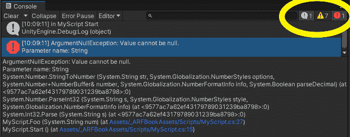

图 3.1 – 显示 null 异常错误的控制台窗口

运行时错误，例如`null`。

小贴士：“警告”信息可能是多余的

我通常忽略 Unity 编辑器**控制台**窗口中的警告信息，除非我故意在寻找某些东西，因为它们通常很冗长，与我自己的问题解决不相关，因此变成了噪音而不是信息。你可以通过在控制台工具栏中取消点击**警告**按钮来隐藏警告信息。

在`Assets/`文件夹中。在前面的屏幕截图*图 3.1*中，当调用 C#的`System.Int32.Parse`函数时，`MyScript.cs`文件的第 27 行发生了 null 异常错误。

小贴士：仔细阅读你的控制台信息

我经常看到新手和经验丰富的开发者都犯的一个常见错误就是没有仔细阅读错误信息。当你处于事情的处理流程中时，很容易假设你知道信息在说什么，而没有真正阅读它，从而错过了调试所需的关键线索。

你也可以使用`Debug.Log`调用从你的脚本向控制台写入信息。

## 使用 Debug.Log

当编写 C#脚本时，你可以使用`Debug.Log()`函数调用将你的信息记录到控制台。这是检查和了解代码在运行时内部发生什么的最常见方法。`Debug.Log`信息在控制台中显示为*信息*消息（你也可以调用`Debug.LogError()`使它们显示为*错误*消息）。

例如，假设我正在尝试定位我项目中一个错误的根本原因。假设有几个与这个问题相关的`MonoBehaviour`脚本是我正在开发的。我可能会在特定函数的入口处放置日志语句，以及其他日志语句来打印出我怀疑的特定变量。以下是一个名为`MyScript.cs`的脚本的示例代码：

```cs
// MyScript.cs
using UnityEngine;
class MyScript : MonoBehaviour
{
     public int number;
     void Start()
     {
          number = 10;
     }
     void Update()
     {
          if (number >= 0)
          {
               Debug.Log("in MyScript Update, count = " +                           number);
               DoSomething();
               number -= 1; // reduce number by one
          }
     }
     private void DoSomething()
     {
          Debug.Log("inside DoSomething");
          number = -1; // accidently set number to minus-1
          // other code…
     }
}
```

在 C#中，你可以使用加号（`+`）运算符组合（连接）文本字符串。在我们的例子中，整数`number`被连接到消息字符串（在`Update`中），C#自动将数字转换为字符串值。

通过创建一个空 GameObject（**GameObject** | **创建空**）并将脚本文件从**项目**窗口拖放到 GameObject 上，将此脚本添加到场景中。然后点击**播放**。

当这段代码运行时，我在**控制台**窗口中看到的内容如下所示：

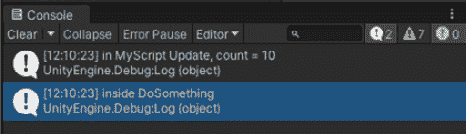

图 3.2 – 关于我的 Debug.Log 语句的控制台消息

这将揭示`DoSomething`只被调用了一次，而不是预期的 10 次。你能找出原因吗？

研究代码中的`Update`并不能解释为什么`DoSomething`只被调用了一次。从那里我可以重新检查逻辑，以确定为什么和何时`number`提前变成小于零。你可以看到错误实际上在`DoSomething`函数本身，它“意外地”将`number = -1`，导致`Update`中的条件在第一次之后永远不会再次调用`DoSomething`。你可能一直专注于`Update`代码，但后来发现错误实际上发生在程序更深的地方。

小贴士：在寻找错误？可能不是你正在寻找的地方

这里有一个有趣的故事。一个男人离开酒吧，看到一个男人在路灯附近绕着圈子，在人行道上寻找。 “嘿，伙计，怎么了？” 醉汉回答，“我丢了钥匙。” 于是他们一起继续寻找。最后，那个男人问，“你确定你在这里丢了吗？” 另一个回答，“嗯，我是在那里丢的。但这里的光线更好。” 当你试图寻找错误时，请记住这一点——它通常**正好不是**你正在寻找的地方，否则你可能已经找到了它！

到目前为止，我们一直在使用**控制台**窗口，通过 Unity 编辑器的播放模式来记录消息。实际上，控制台在故障排除方面非常有用，你可能还希望在运行远程设备上的项目时查看你的调试消息。接下来，让我们考虑一下如何在通过 USB 连接的移动设备上运行时使用控制台。

## 使用控制台与移动设备

你可以在移动设备上运行你的应用时使用控制台日志，前提是应用已启用**开发模式**，并且设备通过 USB 线（或等效设备）连接到 Unity 编辑器。要设置此环境，请按照以下步骤操作：

1.  使用**文件** | **构建设置**打开**构建设置**窗口。

1.  选中**开发模式**复选框。

1.  点击**构建并运行**按钮。

1.  在应用成功构建、安装到设备、启动并开始运行后，如果你将控制台附加到应用上，任何`Debug.Log`调用都会出现在控制台。

    在 Unity **控制台**窗口工具栏中，选择**编辑器**按钮并选择在移动设备上运行的进程。例如，以下截图显示我将**编辑器控制台**附加到我的 Android 设备上：

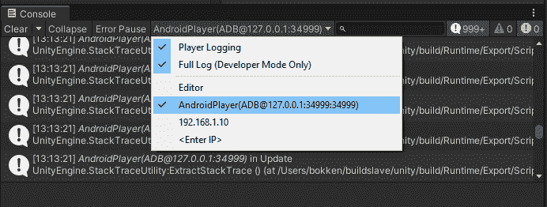

图 3.3 – 连接到 Android 设备的控制台窗口

这就这么简单。

Unity 和您的设备操作系统还提供了其他类型的日志。在 **控制台** 窗口中，使用右上角的三点上下文菜单来访问完整的玩家日志和编辑器日志文件。在 Android 上，您还可以使用 *logcat* 从您的 Android 设备获取更详细的消息。

### 使用 Android 设备的 logcat

在 Android 移动设备上，您可以使用名为 **logcat** 的工具监控 Android 本身以及设备上运行的任何应用程序的任何日志消息（包括您自己的 Unity 应用程序）。您可以通过以下步骤直接在 Unity 编辑器中通过包管理器安装和使用 *logcat*：

1.  使用 **窗口** | **包管理器** 打开 **包管理器** 窗口。

1.  在左上角的过滤器选择列表中，选择 **Unity 注册表**。

1.  使用右上角的搜索输入字段查找 `logcat`。

1.  选择包并点击 **安装** 按钮。

1.  安装包之后，使用 **窗口** | **分析** | **Android Logcat** 打开 **Logcat** 窗口。

在安装了 *logcat* 并打开其窗口后，您可以在连接的移动设备上运行您的应用程序。现在它不需要在 **开发模式** 下构建，也不需要连接到编辑器控制台。您会发现设备内部有很多活动；消息可能来自所有正在运行的任务，而不仅仅是您自己的应用程序！**Android Logcat** 窗口提供了过滤消息的方法，以仅显示在设备上运行的应用程序发出的消息：

+   使用过滤器下拉列表并选择您的应用程序。

+   输入搜索表达式以过滤消息流。

下图显示了 **Android Logcat** 窗口的屏幕截图：

![Figure 3.4 – Android Logcat window

![img/Figure_3.04-LogcatWindow.jpg]

图 3.4 – Android Logcat 窗口

我意识到这个屏幕截图中的文本可能太小，在这里看不清楚！这个截图的目的是让您了解窗口提供的内容。

信息：使用 Android adb 命令行工具

如果您正在为 Android 设备开发，我建议您还安装 Android **adb**（Android 调试桥）命令行工具。（这是 Unity 用于监视控制台日志和运行 Logcat 窗口的内部工具。）如果您已安装完整的 *Android Studio* ([`developer.android.com/studio`](https://developer.android.com/studio))，它可能已经存在于您的系统上。否则，您可以通过导航到 [`developer.android.com/studio#downloads`](https://developer.android.com/studio#downloads) 并滚动到页面底部的 *仅命令行工具* 部分来找到您平台的下载链接。

在安装了 adb（并在您的命令路径中）的情况下，您可以运行各种设备操作。有关更多详细信息，请参阅[`developer.android.com/studio/command-line/adb`](https://developer.android.com/studio/command-line/adb)。例如，`adb devices`命令将列出当前连接到您的计算机的 Android 设备。`adb logcat`将显示内部设备日志。要仅过滤 Unity 相关的消息，请使用`adb logcat -v time -s Unity command`。

使用 Unity 编辑器的`logcat`很棒，但如果您想在未连接到计算机的移动设备上调试应用程序，您能做什么呢？这对于需要在你环境中移动的增强现实应用程序来说肯定是这样。一个解决方案是您可以创建一个*虚拟*控制台窗口，下面将进行解释。

信息：使用 iOS 设备的 Xcode 控制台

如果您正在为 iOS 开发，Unity 中没有`logcat`的等效功能。但是，您可以使用 Xcode 日志控制台查看设备日志。使用**视图** | **调试区域** | **激活控制台**打开控制台。

## 在您的应用程序中模拟控制台窗口

捕获控制台日志的策略之一是在您的应用程序中提供一个“虚拟控制台”窗口，即使您的设备已从开发计算机断开连接。这个窗口用于开发，而不是生产。其想法是将`Debug.Log`调用替换为一个包装函数，在运行开发版本时，该函数可以选择性地将输出到应用程序文本区域上的文本对象。

我们将在*第四章*中更详细地讨论 Unity **Canvas**对象和 UI 组件，*创建 AR 用户框架*，因此在这里仅提供步骤，而不进行过多解释。

要实现包装函数，请按照以下步骤操作：

1.  在`scripts/`文件夹中（如果您还没有，请先创建一个）。

1.  在`scripts`文件夹中*右键单击*，选择`ScreenLog`。

1.  打开脚本进行编辑，并将默认代码替换为以下内容：

    ```cs
    // ScreenLog.cs
    using UnityEngine;
    using UnityEngine.UI;
    public class ScreenLog : MonoBehaviour
    {
        public Text logText;
        public static ScreenLog Instance { get; private set; }
        void Awake()
        {
            if (!Instance)
                Instance = this;
        }
        private void Start()
        {
            logText.text = "";
        }
        private void _log(string msg)
        {
            if (logText)
                logText.text += msg + "\n";
        }
        public static void Log(string msg)
        {
            if (Instance)
                Instance._log(msg);
            Debug.Log(msg);
        } }
    ```

我们将`ScreenLog`实现为一个`public static ScreenLog Instance`变量，确保场景中只有一个`ScreenLog`实例，并提供将`Log`函数作为类方法调用的能力。（我们将在下一章中更详细地讨论*类*与*实例*方法以及*单例模式*。）这样，您就可以从自己的代码中的任何地方调用`ScreenLog.Log()`。

接下来，我们将在应用程序中添加一个文本窗口，并通过 UI 中的*调试*按钮切换其可见性。（如前所述，我们将在后面的章节中更详细地介绍 Unity UI。）首先，让我们假设您的 AR 应用程序将在纵向屏幕空间 Canvas 中用于移动设备，以包含文本区域：

1.  从主菜单中，通过选择`Debug Canvas`创建一个新的 Canvas。如果场景中尚未存在，这将也会添加一个**事件系统**游戏对象。

1.  要编辑**屏幕空间**画布，让我们通过在**场景**窗口工具栏中单击**2D**按钮将**场景**窗口切换到 2D 视图。

1.  将**游戏**窗口和**场景**窗口并排排列也很有用。因为我们正在为 AR 开发，所以将**游戏**窗口的显示设置为固定肖像宽高比，例如使用**游戏**窗口顶部工具栏中的尺寸选择列表的**2160x1080 肖像**。此布局可以在以下屏幕截图中看到：

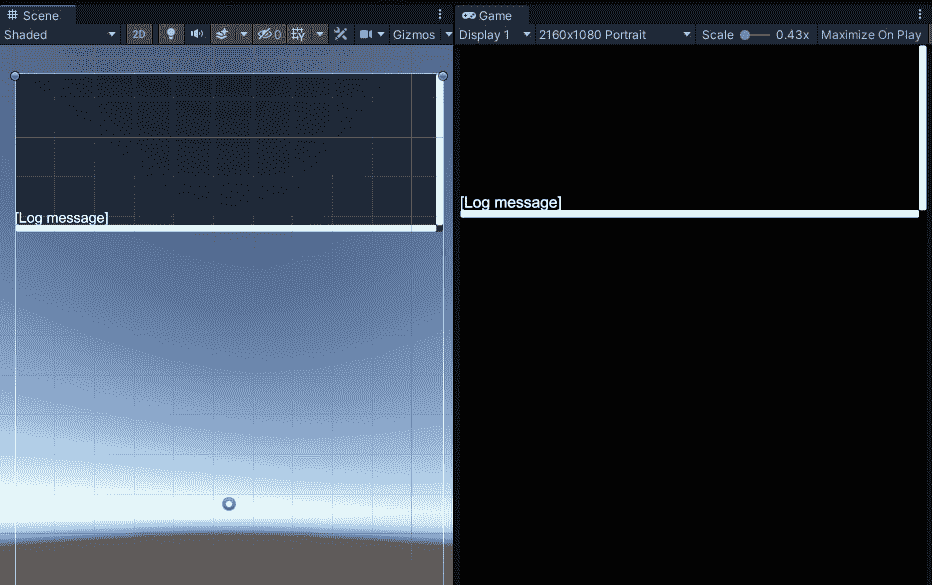

图 3.5 – 场景和游戏窗口并排显示，并设置了肖像设备视图

（此屏幕截图是在完成所有这些步骤之后捕获的；你的画布还没有滚动文本区域。）

接下来，我们将添加一个滚动文本区域，我们将在此处写入日志消息：

1.  在**层次结构**窗口中，选择**调试画布**。然后右键单击，并选择**UI** | **滚动视图**。

1.  调整大小并放置 `400`。结果为 `(0, 0)`，`0`，`(0, 1)`，`(1, 1)`，和 `(0.5, 1)`。以下屏幕截图中显示了**矩形变换**组件和**锚点预设**菜单按钮的位置：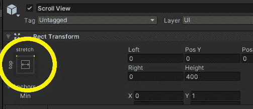

    图 3.6 – 带有锚点预设按钮高亮的矩形变换组件

1.  通过取消选中**滚动矩形** | **水平**复选框，仅允许垂直滚动。

1.  然后在**层次结构**中双击**调试画布**以将其聚焦（你可能需要双击两次）。

1.  在**层次结构**中展开**滚动视图**（三角形图标）及其**视口**。选择子**内容**对象，通过选择**矩形变换** | **锚点预设** | **拉伸-拉伸**来设置其锚点和大小，并使用*Shift* + *Alt* + 点击**拉伸-拉伸**以填充视口。

**滚动视图**的**检查器**窗口如下截图所示：

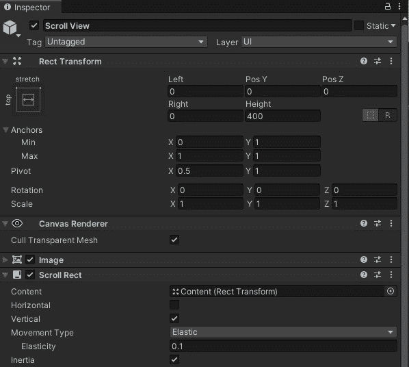

图 3.7 – 滚动视图属性设置

现在，我们可以开始处理文本元素本身：

1.  在 `Debug Text` 上。 （注意，你可能更喜欢使用*TextMesh Pro*文本元素，它提供了对字体和填充的更多控制，而不会产生任何性能成本——将在下一章中介绍。）

1.  选择**调试文本**游戏对象，使用**锚点预设** | **拉伸-拉伸**使其填充**内容**区域，并使用*Shift* + *Alt* + 点击**拉伸-拉伸**。

1.  为了参考，在 `[日志消息]` 中输入占位符字符串。

1.  调整 `36`。

1.  将**对齐方式**设置为**底部**。

1.  将**垂直溢出**更改为**溢出**（而不是**截断**）。

1.  我个人喜欢在控制台使用白色文本和黑色背景。如果你同意，在 `0` 和 `200`，以及 `255`。

**调试文本**对象的最终**层次结构**和**检查器**设置如图所示：

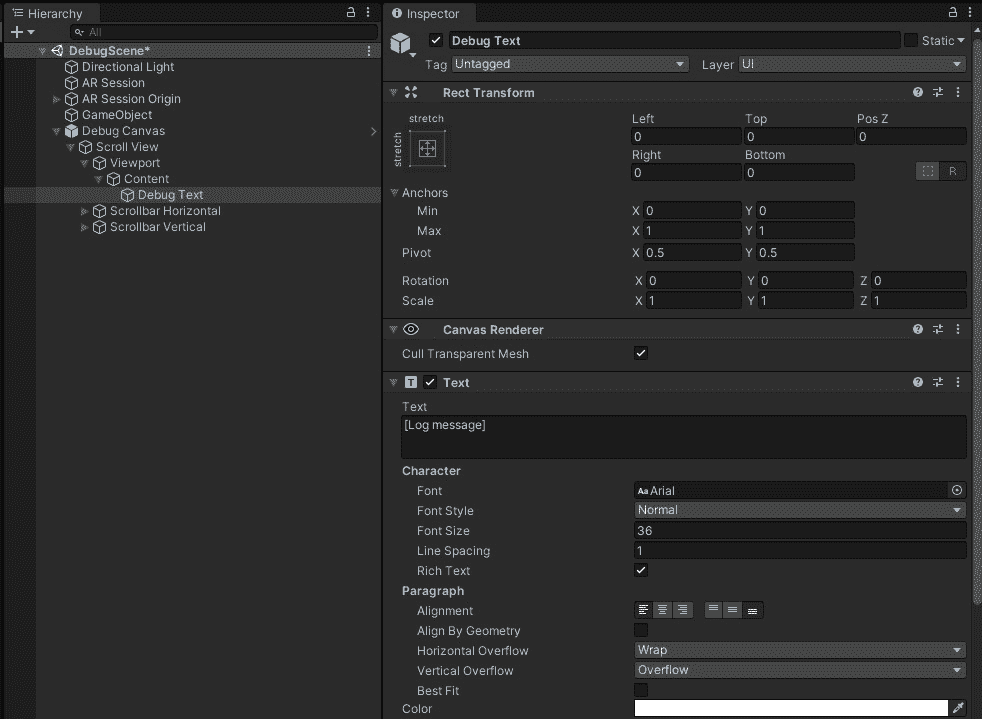

图 3.8 – 调试画布层次结构和调试文本设置

接下来，我们将把我们的脚本添加到场景中：

1.  在**层次结构**窗口中选择**调试画布**，在**项目**窗口中找到**ScreenLog**脚本，并将脚本文件拖放到**调试画布**游戏对象上。

1.  仍然选择**调试画布**，在**层次结构**窗口中找到**调试文本**游戏对象，将其拖入**检查器**，并将其放到**屏幕日志**组件上的**日志文本**槽位，如图所示：

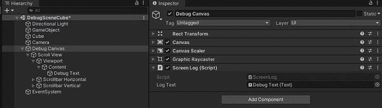

图 3.9 – 将日志文本引用设置为调试文本游戏对象

现在，我们可以在 UI 中添加一个调试按钮来切换文本面板，如下所示：

1.  *右键点击* `调试按钮`。

1.  在屏幕上调整按钮的大小和位置。例如，设置其`175, 175`），并使用`30, 30`将其锚定到屏幕的左下角。

1.  在`调试`。您也可以从这里调整其字体属性，例如设置`36`。

1.  将调试按钮改为切换按钮，需要将**按钮**组件替换为**切换**组件。

    在**层次结构**中，选择**调试按钮**对象。在**检查器**中，使用**按钮**组件上的三个点上下文菜单图标（或右键单击组件）并选择**移除组件**。

1.  然后点击`切换`，并添加一个**切换**组件。

1.  现在，我们将配置切换以处理`On Value Changed`事件。在**切换** | **On Value Changed**属性中，点击右下角的小**+**图标。

1.  将**滚动视图**对象从**层次结构**窗口拖放到点击事件的**无（对象**）槽位。然后在**函数**选择器中，选择**游戏对象** | **动态布尔值** | **SetActive**。

    **切换**组件现在有以下设置：

    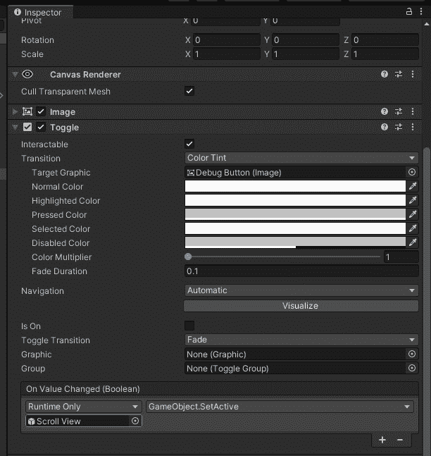

    图 3.10 – 配置了切换组件的调试按钮

1.  最后，将这个设置保存为一个预制件，您可以在其他场景中重复使用。将`Prefabs/`文件夹从`Prefabs`文件夹拖动出来，首先创建一个。文件夹名称不是必需的，这是惯例。）

    并且记住，如果你在**层次结构**中对这个画布（或其子项）进行了新的更改，请使用**覆盖** | **应用全部**将那些更改保存到预制资产中。

使用这个设置，我们现在可以在代码中任何需要添加信息消息的地方使用`ScreenLog.Log()`函数代替`Debug.Log()`，如图所示：

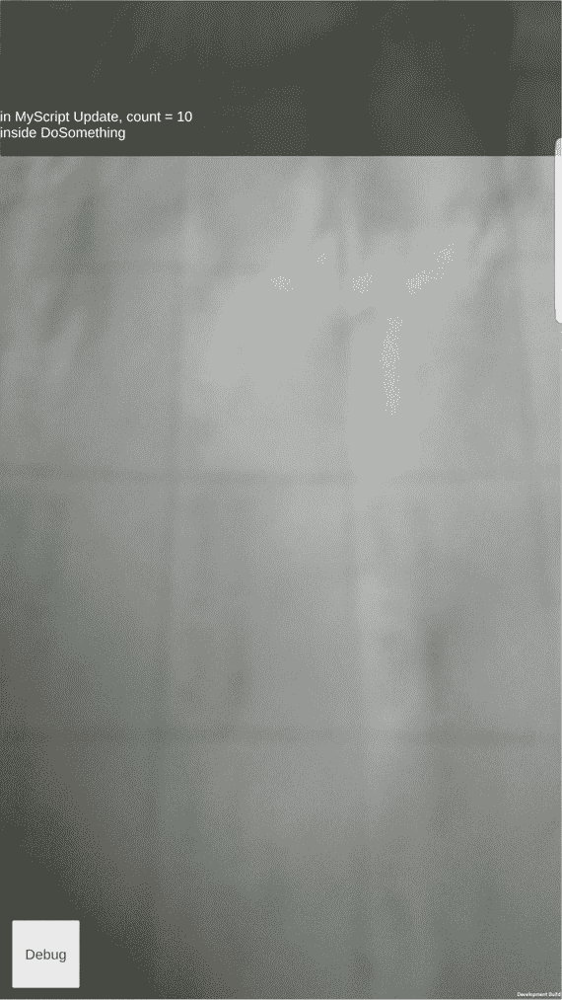

图 3.11 – 使用虚拟控制台的手机截图

这种方法的优点是您可以修改它，以便为最终用户选择性地提供状态消息日志，而不仅仅是自己的开发。

信息：第三方虚拟控制台

除了像本章中我们这样做之外，您还可以在 Asset Store 中找到第三方虚拟控制台包，它们具有各种功能和成本。例如，*Lunar Mobile Console – Free* 资产易于安装和使用 – 请参阅[`assetstore.unity.com/packages/tools/gui/lunar-mobile-console-free-82881`](https://assetstore.unity.com/packages/tools/gui/lunar-mobile-console-free-82881)。这些通常仅用于开发目的，不适合向最终用户公开日志消息。

为了更深入地了解他们的代码在做什么，许多程序员喜欢使用由**集成开发环境**（**IDEs**）如 Visual Studio 提供的调试器工具。

# 使用调试器进行调试

专业软件开发者熟悉代码**调试器**，用于通过在特定代码行停止执行来测试和调试程序，并检查内存和其他运行时状态。在本节中，我将向您介绍如何使用 Visual Studio 调试器与 Unity 项目。调试器可以在 Unity 编辑器的播放模式下使用，也可以在附加设备上运行的构建中使用。

使用调试器，您可以在特定代码行设置**断点**，执行将在该行停止，允许您查询变量的值，并等待您逐步执行或继续程序的执行。

要在编辑器播放模式下使用调试器，您不需要进行任何特殊更改，前提是您已经使用 Visual Studio 作为您的代码编辑器（或另一个受支持的**交互式开发环境**（**IDE**）如 **VS Code** 或 **JetBrains Rider**）。您可以使用**编辑** | **首选项** | **外部工具**来配置 Unity 以使用您首选的编辑器/调试器。例如，在以下屏幕截图中，您可以看到我的 Unity 安装已将**外部脚本编辑器**设置为**Visual Studio Community**版本：

![Figure 3.12 – 您可以在 Unity 首选项窗口中设置您的默认代码编辑器

![Figure 3.12-ExternalEditor.jpg]

图 3.12 – 您可以在 Unity 首选项窗口中设置您的默认代码编辑器

在为您的项目打开 Visual Studio（选择`MyScript.cs`脚本已打开，我在第 25 行创建了一个断点，在 VS Code 中屏幕上以红色点表示）：

![Figure 3.13 – 在 Visual Studio 中设置断点

![Figure 3.13-VSBreakpoint.jpg]

图 3.13 – 在 Visual Studio 中设置断点

要将调试器附加到您的 Unity 编辑器会话，请使用顶部工具栏中的**附加到 Unity**按钮。回到 Unity，如果您尚未启用 C# 调试，您将收到如下提示：

![Figure 3.14 – Unity 提示启用调试

![Figure 3.14-EnableDebuggingDialog.jpg]

图 3.14 – Unity 提示启用调试

点击一个 **启用** 按钮。

注意，可以使用编辑器窗口右下角的相应图标切换调试模式。

一旦启用调试并您在编辑器中点击 **播放**，如果您的代码中达到断点行，执行将停止，并且 Visual Studio 将在您的桌面上获得焦点。当前代码行将在您的屏幕上以黄色突出显示：

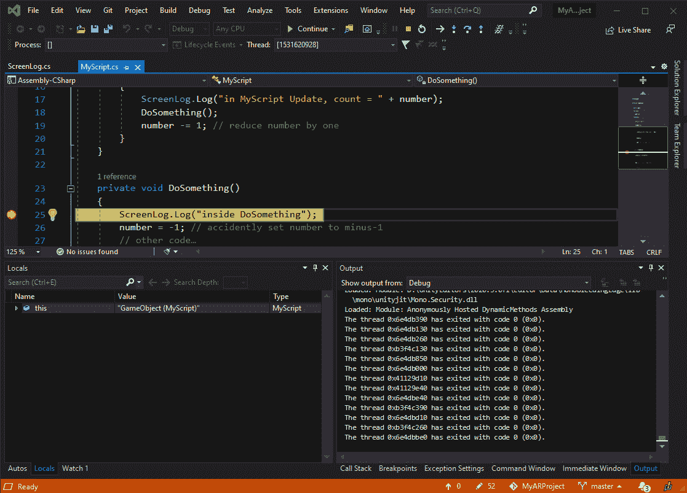

图 3.15 – 在 Visual Studio 调试器中调试一行代码

此外，还有一些调试窗口，您可以在其中检查脚本中变量的当前值、当前的调用堆栈等。

在调试过程中，*调试工具栏* 也将在窗口顶部活动，如下面的截图所示：

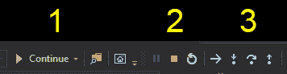

图 3.16 – 调试工具栏

**继续** 按钮（1）将从此处继续运行，直到达到另一个断点。**停止** 按钮（2）将禁用调试模式，而步骤按钮（3）执行以下操作：**进入** 将代码跟随到函数调用的主体中，**跳过** 将运行到当前文件中的下一行代码，而**向上** 将您带到调用堆栈的一个级别。

您还可以在连接的移动设备上运行的代码上运行调试器。

## 在远程设备上进行调试

要在您的移动设备上运行的项目中运行调试器，您必须首先在项目的 **构建设置** 中启用 **脚本调试** 和 **开发构建**。使用以下步骤：

1.  使用 **文件** | **构建设置** 打开 **构建设置** 窗口。

1.  选中 **开发构建** 复选框。

1.  选中 **脚本调试** 复选框。

1.  可选地，选中 **等待托管调试器** 复选框。

1.  当您准备好时，点击 **构建并运行**。

当应用程序在设备上运行时，按照以下方式将调试器附加到远程进程：

1.  在 Visual Studio 中，从主菜单选择 **调试** | **附加 Unity 调试器**。

1.  将出现一个对话框，其中包含潜在进程的列表，如下面的截图所示。选择您想要附加的进程并点击 **确定**：


图 3.17 – 将 Visual Studio 调试器附加到手机上的 Unity 进程

现在您可以在设备上运行的应用程序中设置和检查断点。注意，一旦您在手机上关闭应用程序，调试器也会在 Visual Studio 中停止并断开连接。

**等待托管调试器** 构建选项在您需要在 Unity 开始运行之前启动调试器时很有用。由于 Visual Studio 需要一个进程来附加，应用程序将启动，然后等待您附加调试器，如下面的截图所示：

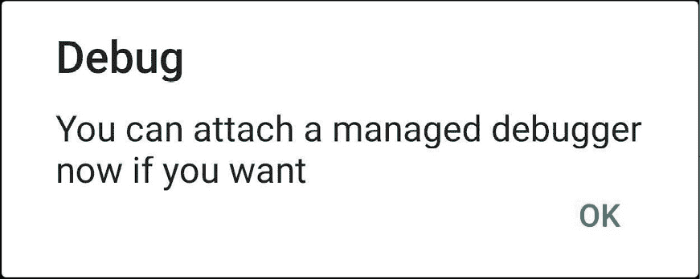

图 3.18 – 手机上等待附加调试器的提示

事实上，在我们的这个小例子中，我们需要这个功能，因为`MyScript`中的`Update`函数可能会在我有机会附加调试器之前被调用。

信息：额外的 Unity 调试工具

Unity 提供了更多您可以使用来调试项目和深入了解底层发生情况的窗口和工具。要调试输入系统操作，请参阅**窗口** | **分析** | **输入调试器**。对于深入分析和性能分析，还有**性能分析器**、**帧调试器**和**物理调试器**，它们也位于**窗口** | **分析**菜单下。对于 UI，有**即时模式 GUI**（**IMGUI**）调试器，位于**窗口** | **分析** | **IMGUI 调试器**，当自定义 Unity 编辑器用户界面时，请参阅**窗口** | **UI 工具包** | **调试器**（UI 工具包预计将在未来扩展以用于您自己的应用程序）。甚至还有一个**窗口** | **渲染管线** | **渲染管线调试**窗口。

如果您能够点击**播放**在您的移动设备上运行项目而不必每次都进行**构建和运行**，那岂不是更好？让我们接下来看看*编辑器远程工具*。

# 使用编辑器远程工具进行测试

开发者已经使用 Unity 多年为 iOS 和 Android 设备开发游戏和应用程序。您希望在 Unity 编辑器中点击**播放**，然后在您连接的移动设备上远程运行当前场景。拥有迭代性的*开发-测试-更新-重复*循环对于更高效和有效的开发至关重要。

为了方便这种开发工作流程，Unity 提供了一个名为**Unity Remote 5**的应用程序，您可以在手机上安装它，然后将其连接到 Unity 编辑器。它适用于 Android ([`play.google.com/store/apps/details?id=com.unity3d.mobileremote`](https://play.google.com/store/apps/details?id=com.unity3d.mobileremote)) 和 iOS ([`apps.apple.com/us/app/unity-remote-4/id871767552`](https://apps.apple.com/us/app/unity-remote-4/id871767552))。它允许您使用移动设备在 Unity 编辑器中实时查看和测试您的项目，而不必每次都进行构建。该设备充当编辑器播放模式中运行的场景的“遥控器”，包括屏幕触摸、加速度计、陀螺仪和摄像头输入。

不幸的是，Remote 5 不适合 AR 开发。一个与 AR Foundation 兼容的远程工具已经被长期承诺并预期，但现在我写这篇文章时，它还不存在。也许当您阅读这篇文章时，它将作为一个免费的 Unity 核心功能可用，所以请尝试在 Unity 论坛上搜索 ([`forum.unity.com/?gq=AR%20Foundation%20Editor%20Play%20Mode`](https://forum.unity.com/?gq=AR%20Foundation%20Editor%20Play%20Mode)))。

在大型开发者社区中，通常至少会有一个有才华的个人站出来，为 AR 基础库制作远程工具，并在 Unity 资产商店提供。Kyrylo Kuzyk 的 *AR Foundation Editor Remote* 工具可以在 [`assetstore.unity.com/packages/tools/utilities/ar-foundation-editor-remote-168773`](https://assetstore.unity.com/packages/tools/utilities/ar-foundation-editor-remote-168773) 找到。该工具不是免费的，并且目前不支持新的输入系统，只支持传统的输入管理器。

如果您选择购买该套餐，可以使用包管理器按照以下步骤进行安装：

1.  使用 **窗口** | **包管理器** 打开 **包管理器**。

1.  使用窗口左上角的选项列表过滤 **我的资产** 列表。

1.  查找 **AR Foundation Editor Remote** 套件，如果需要，点击 **下载**，然后点击 **导入**。然后在 **导入** 对话框中，点击 **导入** 按钮。

1.  套件安装在 `Plugins/ARFoundationRemoteInstaller/` 文件夹中。安装程序应该会自动运行。注意，还有一个 `Documentation` 文件。

要使用 AR 基础库编辑器远程工具，请按照文档中概述的以下步骤操作：

1.  前往 **编辑** | **项目设置** | **XR 插件管理** | **桌面** 选项卡。

1.  选择 **AR Foundation Remote** 复选框。

1.  确保您的项目针对您的移动设备平台在 **文件** | **构建设置** 中进行设置。

1.  在 `Plugins/ARFoundationRemoteInstaller` 中，选择 **Installer** 资产，并查看如下截图所示的 **Inspector** 窗口：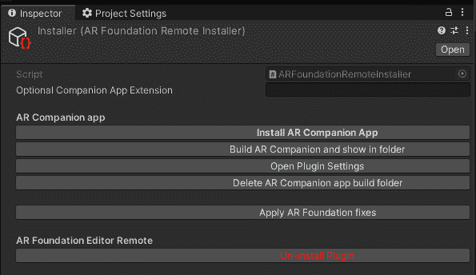

    图 3.19 – AR 基础库远程安装程序

1.  点击 **安装 AR 配套应用程序** 按钮。

    让它在您的设备上构建并安装配套应用程序。

1.  在 `Plugins/ARFoundationRemoteInstaller/Resources/` 文件夹中，选择 **Settings** 对象。

1.  按照手机屏幕上的说明操作，并在 **设置** | **AR 配套应用程序 IP** 字段中输入提供的 IP 地址。

您现在已设置好。当您想使用 AR Foundation Remote 时，确保 AR 配套应用程序在您的手机上正在运行。然后，点击 **播放** 以使用移动设备作为远程来运行您的场景。

使用编辑器远程工具可以让您使用移动设备上的 Unity 编辑器 Play 模式。摄像头和其他感应数据输入到您的 **游戏** 窗口中，这样您就可以在真实世界环境中进行测试，而无需使用 **构建并运行**。

如果我们不是在移动设备上运行您的应用程序，而是将您的真实世界环境引入 Unity 编辑器，情况会怎样呢？Unity 正在通过 Unity MARS 探索这种创新的方法。

# 使用 Unity MARS 进行模拟

**Unity MARS**（代表**混合增强现实工作室**）([`unity.com/products/unity-mars`](https://unity.com/products/unity-mars))是 Unity Technologies 提供的解决方案，它解决了本章迄今为止讨论的许多开发增强现实应用程序的问题，以及更多。

什么是 MARS？使用 MARS，您可以在 Unity 编辑器内创建和测试复杂的 AR 应用程序，并为一系列目标物理世界环境提供运行时逻辑。

考虑以下一个场景：您正在为博物馆参观者开发一个 AR 应用程序，他们可以将他们的移动设备指向展品或艺术品，应用程序识别它并提供额外的信息和娱乐，从而提供更丰富的学习体验。但您在办公桌前，在办公室，在城镇的另一边，或在不同的城市。您如何开发和测试您的应用程序？与其制定旅行计划，您可以使用 MARS 将目标物理空间带入 Unity 编辑器，并在您自己的办公桌前**开发-测试-更新-重复**。

使用 MARS，您可以捕获和组装现实世界的资产，如位置、对象和道具，然后将它们拖放到 Unity 中进行测试。它支持跟踪平面、图像、面部以及许多其他具有语义意义的**特征**数据。MARS 文档可以在`docs.unity3d.com/Packages/com.unity.mars@1.0/manual/index.html`找到。

在这个博物馆场景中，第一步可能是捕获博物馆的物理环境传感器读数，以便在您的工作站上使用。本节中更详细描述的 MARS 伴侣应用程序可以用于此目的。同样，MARS 包含一系列您可以直接使用的环境模板。以下图像，例如，显示了一个厨房的**模拟视图**以及同一空间中的**设备视图**：

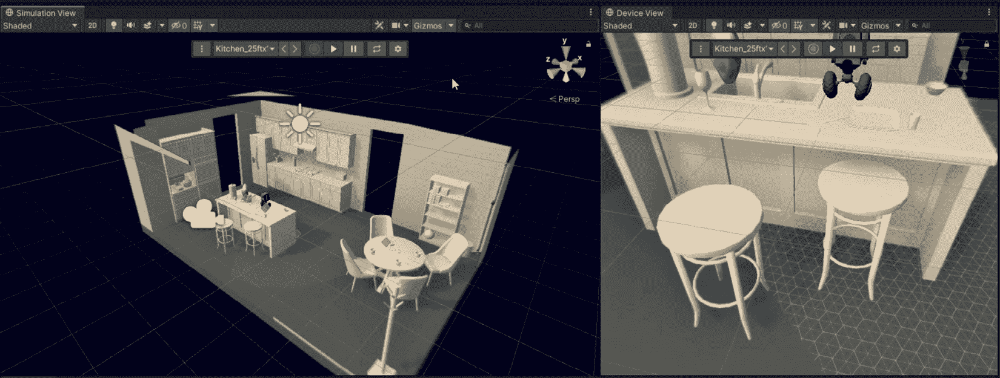

图 3.20 – MARS 模拟和设备视图

使用 MARS，您有可以在编辑模式或播放模式下运行的环境模拟。您可以在编辑模式下预览场景的执行，其中真实世界的代理对象被复制到**模拟**场景视图中，该视图与正常的项目**场景**视图分开。您还可以启动和停止一个**连续**的**模拟**视图，这更类似于 Unity 中的正常播放模式。输入模拟的数据可以是合成数据、记录数据或实时数据。然后您可以对各种室内和室外空间进行测试。关于 MARS 模拟如何工作的更完整解释，我推荐这篇文章：[`blogs.unity3d.com/2020/08/14/a-look-at-how-simulation-works-in-unity-mars`](https://blogs.unity3d.com/2020/08/14/a-look-at-how-simulation-works-in-unity-mars)。

MARS 提供了额外的工具和智能组件，以解决 AR 开发者面临的常见挑战。物理环境并不总是那么可预测。MARS 过程式创作框架模拟现实世界中的对象、条件和动作，包括“模糊创作”，在应用程序决定何时以及在哪里让用户交互时，您可以指定物理特征的最低和最高测量值。

MARS 建立在 AR Foundation 之上，因此与所有支持的 AR 设备和平台兼容。目前，在试用期间之后，使用 Unity MARS 需要支付单独的年度许可费用。

使用 MARS，您可能仍然面临如何捕获目标环境几何形状和表面特征以用于模拟的问题。这就是 MARS Companion 应用程序的用武之地。

## 使用 MARS Companion 应用程序进行捕获

MARS Companion 应用程序可用于捕获现实世界数据并将其带入 Unity 编辑器，以便与 Unity MARS 一起使用。

使用该应用程序，您可以扫描房间、拍照和录制视频，将此数据捕获并保存到云端。然后，可以使用 MARS 创作室将这些数据提供给 Unity 编辑器。

该应用程序还具有有限的创作功能，允许您在设备上创建内容和布局资产。例如，这可能有助于解决边缘情况，例如当照明或环境特征模糊或难以扫描时。

目前，MARS Companion 应用程序仍处于 Beta 测试阶段([`forum.unity.com/threads/unity-mars-companion-app-open-beta-announcement.1037638/`](https://forum.unity.com/threads/unity-mars-companion-app-open-beta-announcement.1037638/))，并可能最终从 MARS 中分离出来，用作编辑器远程工具（参见本章前面的部分）。

Unity MARS 是用于增强现实开发的一个强大新框架。它代表了 Unity 对 AR 行业、用户、开发者和设备制造商的长期承诺。像大多数 Unity 包和模块一样，它也可以通过自定义行为、数据扩展、查询和其他附加模块进行扩展。

我在本章中并未尝试提供 MARS 的教程（它可能是一本完全独立的书籍），并且*我们不会在本书的工程项目中使用 MARS*。尽管如此，如果您愿意，完全可以使用 MARS 来改进本书中的项目工作流程。

# 摘要

增强现实本质上混合了物理世界和虚拟世界，这对 AR 开发者提出了独特的挑战。我们在桌面或笔记本电脑上开发，但应用程序的目标设备是未连接的移动设备。在 Unity Play 模式下运行应用程序时，AR 场景仍然需要从远程设备获取传感器输入。

在本章中，我们介绍了一系列工具和技术，这些工具和技术可以帮助您使用 Unity 开发和调试增强现实应用程序。我们从基本的经典“打印语句”开始，使用`Debug.Log()`，您可以将日志消息输出到`ScreenLog.Log()`包装函数，这样您可以选择在您的设备上查看日志消息，而无需完全连接到 Unity。

为了更深入地理解并调试您的应用程序，您可以使用 Visual Studio 提供的调试器。在调试过程中，您可以设置断点、检查变量值并逐行执行代码。您可以在 Unity 的 Play 模式下以及构建并运行在您的移动设备上的应用程序上运行调试器。

您还可以使用编辑器远程工具——一个在移动设备上运行并连接到 Unity 编辑器的应用程序，这样您就可以使用 Play 模式并从连接的设备接收输入数据。

然后我们对 Unity MARS 进行了简要的浏览。这个 AR 开发工作室框架颠覆了常规的远程开发模式。而不是在远程设备上运行您的应用程序以捕获环境传感器数据，MARS 允许您直接在 Unity 编辑器中使用环境传感器模拟。这为您提供了极大地改善您的开发工作流程和测试您的应用程序以适应广泛物理环境的机会，而无需离开您的办公桌。

您现在可以开始构建 AR 应用程序了。在下一章中，我们将开发一个用于控制 AR 项目中用户交互的框架。这个框架将被保存并用作构建和管理本书中每个项目中用户界面的模板。
