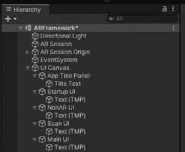
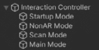
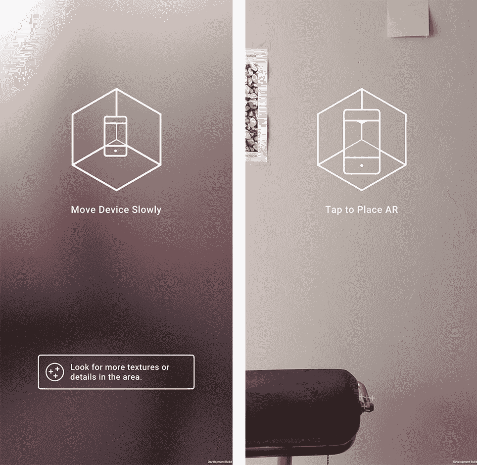

# *第四章*：创建 AR 用户框架**

在本章中，我们将开发一个用于构建**增强现实**（**AR**）应用的框架，该框架管理用户交互模式和相应的**用户界面**（**UI**）。该框架包括在运行时启动 AR 会话和与 AR 功能交互时的重要**用户体验**（**UX**）步骤。这个框架将成为本书后面项目中新场景的基础。

这是一个用于构建基于模式的 Unity 框架。它概括了我发现自己从项目到项目重复的一些场景结构。例如，当 AR 应用首次启动时，它必须验证设备是否支持 AR。一旦 AR 会话初始化，应用可能会提示用户开始扫描环境以建立跟踪。在应用中的某个时候，用户可能会被提示触摸屏幕以放置虚拟对象，通常在*添加对象模式*中。这些步骤对于许多 AR 应用都是通用的，包括本书中的项目，因此我们将在一个可能用作模板的场景中事先设置一些基础设施。

本章涉及一些高级 C#编程。如果你已经是中级或高级程序员，你应该能够相当容易地跟随。如果你是新手，你可以直接复制/粘贴这里提供的代码并从中学习。或者，你也可以选择完全跳过本章，并使用本书 GitHub 仓库中找到的本章的场景模板。

在本章中，我们将涵盖以下主题：

+   安装我们框架的先决资产

+   从一个新的场景开始

+   创建 UI 画布和面板

+   创建 UI 控制器，使用 Singleton 类

+   创建交互模式控制器

+   创建交互模式，包括启动、扫描、主模式和 AR 模式

+   使用 Unity 入门 UX 资产

+   为新场景创建场景模板

到本章结束时，你将拥有一个名为`ARTemplate`的场景模板，其中包含 AR 入门功能，以及一个用户交互框架，可以作为其他 AR 项目的起点。

# 技术要求

要实现本章的项目，你需要在你的开发计算机上安装 Unity，并连接到一个支持 AR 应用的移动设备。我们将使用在*第一章*，*为 AR 开发设置*中设置的 Unity AR 开发项目。回顾一下，项目配置包括以下内容：

+   使用**Unity Hub**模板创建了一个新的项目（via **Unity Hub**）。

+   它在**构建设置**中为**Android**或**iOS**设置了**目标平台**，并配置了相应的**玩家设置**。

+   它安装了一个**XR 插件**，**AR Foundation**包，并为 AR 配置了**URP 前向渲染器**。

+   它安装了**输入系统**包，并设置**活动输入处理**（到**输入系统包**或**两者**）。

本章完成后的场景可以在本书的 GitHub 仓库中找到，网址为[`github.com/PacktPublishing/Augmented-Reality-with-Unity-AR-Foundation`](https://github.com/PacktPublishing/Augmented-Reality-with-Unity-AR-Foundation)。

# 理解 AR 交互流程

在增强现实应用程序中，用户必须做的第一件事是用设备相机扫描环境，慢慢移动设备直到检测到用于跟踪的几何形状。这可能是水平平面（地板、桌面）、垂直平面（墙壁）、人脸或其他对象。以下图表显示了许多示例场景中给出的简单用户流程：

![图 4.1 – 简单的 AR 入门用户工作流程

![img/Figure_4.01-OnboardingFlow.jpg]

图 4.1 – 简单的 AR 入门用户工作流程

如前图所示，应用程序首先检查 AR 支持，请求用户允许访问设备相机和其他初始化。然后，应用程序会要求用户扫描环境以寻找可追踪的对象，并可能需要报告扫描问题，例如房间太暗或纹理不足无法检测特征。一旦实现跟踪，就会提示用户点击屏幕在场景中放置虚拟对象。

这对于演示场景来说很棒，但对于实际的 AR 应用程序来说可能过于简单。例如，在我们将在*第六章*“*画廊：构建 AR 应用程序*”中构建的 Art Gallery 应用程序中，应用程序启动后，会扫描垂直平面（墙壁）。

然后，应用程序进入**主**模式，用户必须点击**添加**按钮来添加一张新图片。这反过来会显示一个模态的**选择图片**菜单。当场景中添加了图片后，用户可以选择一张并进入**编辑**模式来移动、调整大小或以其他方式修改虚拟对象。以下图表显示了这部分一般的交互流程：

![图 4.2 – 用户交互流程，包括主、添加和编辑模式

![img/Figure_4.02-userflow-add-edit.jpg]

图 4.2 – 用户交互流程，包括主、添加和编辑模式

自然地，每个应用程序都有自己的交互流程。本章中我们构建的框架支持这种场景，并且可以适应其他需要管理当前模式状态和相应 UI 的项目。

此框架实现了一个**状态机**设计模式，其中场景有一个当前*状态*（交互模式和可见 UI）。必须满足特定条件才能从一种状态转换到另一种状态。

该框架有两个主要区域——UI 面板和交互模式。通常，模式和使用的 UI 之间将存在一对一的关联。例如，在*主模式*中，将会有主菜单 UI。在*添加对象模式*中，将会有一个 UI 提示用户在场景中放置对象。这实现了名为**视图控制器**的设计模式，具有 UI 视图和模式控制器。

现在我们开始在我们的场景中实现这个基本工作流程，通过向项目中添加一些额外的必备包。

# 安装必备资源

我们的用户交互框架使用了一些需要安装到您项目中的附加包，即 TextMeshPro、DOTween 和 Serialized Dictionary Lite。在本节中，我还会包括一些实用资产。现在让我们安装它们。

## TextMeshPro

TextMeshPro 提供了高质量的文本资源，可以替换内置的文本元素。这不是强制性的，但我强烈推荐它。要导入**TextMeshPro**，如果您尚未在项目中安装，请执行以下步骤：

1.  前往**窗口 | TextMeshPro | 导入 TMP 必要资源**。

1.  在**导入 Unity 包**窗口中，点击**导入**。

文本 MeshPro 包现已安装。您还可以安装**TMP 示例和额外资源**包，其中包含额外的字体和其他可能对您的项目有用且有趣的资源。

## DOTween

在我看来，DOTween 是一个不可或缺的免费包，用于在几乎任何`MonoBehaviour`属性上执行小型、轻量级的动画效果。没有它，您可能需要编写数十行代码才能完成 DOTween 在一行中完成的事情。DOTween 的文档可以在网上找到：[`dotween.demigiant.com/documentation.php`](http://dotween.demigiant.com/documentation.php)。

要添加 DOTween，请执行以下步骤：

1.  前往其 Unity Asset Store 页面：[`assetstore.unity.com/packages/tools/animation/dotween-hotween-v2-27676`](https://assetstore.unity.com/packages/tools/animation/dotween-hotween-v2-27676)。

1.  点击**添加到我的资产**和/或**在 Unity 中打开**。

1.  这将带您进入 Unity 项目中的**包管理器**窗口。

1.  确保从**包管理器**窗口左上角的**包**过滤器下拉菜单中选择**我的资产**。

1.  使用**包管理器**窗口右上角的搜索文本输入字段搜索`DOTween`。

1.  选择**DOTween**包，然后点击**安装**。

1.  导入后，系统会提示您**打开 DOTween 工具面板**以设置包。

1.  然后，点击**设置 DOTween** 按钮。

DOTween 现已安装并设置到您的项目中。

## Serialized Dictionary Lite

C#的**字典**是一个键值列表结构，其中列表中的值可以通过键值引用。例如，我们将使用字典通过名称查找 UI 面板或交互模式对象。不幸的是，Unity 在编辑器的**检查器**窗口中不提供对字典的原生支持。**Serialized Dictionary Lite**是 Unity 编辑器的免费扩展，允许使用**检查器**编辑字典。要将 Serialized Dictionary Lite 添加到您的项目中，请执行以下步骤：

1.  前往其 Unity Asset Store 页面，[`assetstore.unity.com/packages/tools/utilities/serialized-dictionary-lite-110992`](https://assetstore.unity.com/packages/tools/utilities/serialized-dictionary-lite-110992)

1.  按**添加到我的资产**和/或**在 Unity 中打开**。

1.  这将带您进入 Unity 项目中的**包管理器**窗口。

1.  确保在**包管理器**窗口左上角的**包**过滤器下拉菜单中选择**我的资产**。

1.  使用**包管理器**窗口右上角的搜索文本输入字段搜索`Serialized`。

1.  选择**Serialized Dictionary Lite**包，然后点击**安装**（或，如果提示，点击**下载**然后**导入**）。

Serialized Dictionary Lite 现在已安装到您的项目中。

## 其他先决条件资产

除了上述包之外，我们假设您已经将以下内容添加到您的 Unity 项目中：

+   来自*第二章*，*您的第一个 AR 场景*中创建的 Unity `ARF-samples.unity`包的资产。

+   在*第二章*，*您的第一个 AR 场景*中，我们还创建了一个包含名为**ARTouchActions**的**Action Map**的**AR 输入动作**资产，包括（至少）一个**放置对象**动作。

在具备先决条件资产的情况下，我们可以开始构建场景。

# 从一个新的场景开始

我们以一个新的空场景开始这个项目，并按照以下步骤设置 AR Foundation 对象：使用以下步骤使用`ARFramework`：

1.  使用**文件 | 新场景**创建一个新的场景。

1.  选择**基本（内置）**模板。按**创建**。

1.  使用`Assets/Scenes/`文件夹保存场景，将其命名为`ARFramework`，然后点击**保存**。

接下来，我们将按照以下方式设置场景，使用基本的 AR Foundation 游戏对象：

1.  通过右键单击并选择**删除**（或按键盘上的*Del*键）从**层次结构**窗口中删除**主相机**。

1.  通过从主菜单中选择**GameObject**，然后选择**XR | AR Session**来添加一个 AR 会话。

1.  通过从主菜单中选择**GameObject**，然后选择**XR | AR Session Origin**来添加一个**AR 会话原点**对象。

1.  选择`raycast`，然后添加一个**AR Raycast Manager**组件。

1.  展开**AR 会话原点**并选择其子 **AR 相机**。在 **检查器** 窗口中，使用左上角的 **标签** 选择器将其标签设置为 **MainCamera**。（这不是必需的，但将场景中一个相机标记为 MainCamera 是一个好习惯）。

1.  在 `audio listener` 中，并为相机添加一个 **音频监听器** 组件。

为了演示目的，我们将添加一个 **AR 平面管理器** 组件来检测和跟踪水平平面。这可能会根据特定项目的需求而变化：

1.  使用 `ar plane manager`，然后添加一个 **AR 平面管理器** 组件。

1.  选择一个 AR 平面可视化预制件并将其添加到 `ARF-samples/Prefabs` 文件夹中。

我们还可以设置一些基本的 AR 光照估计，如下所示：

1.  在 **层次结构** 窗口中选择 **主相机**。在其 **AR 相机管理器** 组件中，将 **光照估计** 设置为 **全部**。

1.  在 `light estimation` 中，然后添加一个 **基本光照估计** 组件。

1.  将 **AR 相机** 对象从 **层次结构** 窗口拖动到 **基本光照估计 | 相机管理器** 槽中。

1.  使用 **文件 | 保存** 来保存你的工作。

现在，我们有一个名为 `ARFramework` 的场景，其中设置了一些内容，包括 AR 会话、AR 会话原点、AR 相机和基本光照估计。我们现在可以开始构建我们框架的 UI 面板。

# 创建 UI 画布和面板

主屏幕空间 UI 画布将包含各种用户界面面板，这些面板可能会在应用程序的各个时间点显示。目前，我们将包括以下 UI 面板。

+   带有任何初始化信息的启动 UI 面板

+   扫描 UI 面板，提示用户扫描可追踪的特征

+   主 UI 面板，用于显示主菜单按钮

+   非 AR UI 面板，当设备不支持增强现实时可能会显示

## 创建屏幕空间画布

首先，我们需要创建一个画布来包含这些面板。按照以下步骤操作：

1.  从主菜单中选择 `UI Canvas`。我们可以将默认的 **渲染模式** 留为 **屏幕空间 – 遮罩**。如果场景中尚未存在，这也会向场景添加一个 **事件系统** 游戏对象。

1.  默认情况下，新的画布位于屏幕空间中，这正是我们想要的。有些人更喜欢将 **Canvas Scaler UI Scale Mode** 从 **固定像素大小** 更改为 **与屏幕大小缩放**。

1.  要编辑屏幕空间画布，让我们通过在 **场景** 窗口工具栏中单击 **2D** 按钮将 **场景** 窗口切换到 2D 视图。然后，在 **层次结构** 窗口中双击 **UI Canvas** 对象以将 **场景** 视图聚焦于此对象。

1.  将 **游戏** 窗口和 **场景** 窗口并排排列也是有帮助的。因为我们正在为 AR 开发，所以将 **游戏** 窗口的显示设置为固定的纵向宽高比，例如使用 **游戏** 窗口顶部工具栏中的尺寸选择列表的 **2160x1080 纵向**。

在此画布上，我们将添加单独的面板。首先，让我们在屏幕顶部添加一个应用标题。

## 添加应用标题

让我们在屏幕顶部添加一个文本面板作为应用标题的占位符。使用以下步骤添加标题：

1.  右键单击`App Title Panel`。

1.  选择**App Title Panel**对象后，在其**检查器**窗口中，打开**锚点预设**菜单（位于**Rect Transform**组件的右上角），并点击**拉伸-顶部**按钮。以下截图显示了打开的**锚点预设**菜单，位于**Rect Transform**组件的左侧：![图 4.3 – 设置为顶部拉伸的 App 标题面板的锚点预设菜单]

    ![img/Figure_4.03-apptitle-anchorpreset.jpg]

    图 4.3 – 设置为顶部拉伸的 App 标题面板的锚点预设菜单

1.  然后，按*Shift + Alt +* **拉伸-顶部**以设置其枢轴和位置。

1.  设置`100`。

1.  接下来，右键单击`Title Text`。

1.  在其`My AR Project`中。

1.  在**Rect Transform**组件的右上角使用**锚点预设**菜单选择**拉伸-拉伸**。然后，按*Shift + Alt +* **拉伸-拉伸**。

1.  将**对齐**设置为**居中**和**中间**。

1.  您也可以根据需要调整**字体大小**和**顶点颜色**字段。

没什么可看的，但以下截图显示了**游戏**窗口以及应用标题：

![图 4.4 – 截图显示带有 App 标题面板锚点设置为顶部拉伸的游戏窗口]

![img/Figure_4.04-apptitlepanel.jpg]

图 4.4 – 截图显示带有 App 标题面板锚点设置为顶部拉伸的游戏窗口

现在您已经使用过**锚点预设**菜单，我将简化后续说明。接下来，我们将添加启动模式的面板。

## 创建 UI 面板

我们现在将为框架支持的每个初始交互模式创建 UI 面板。由于它们都非常相似，我们将创建第一个，然后复制并修改它以用于其他面板。

第一个 UI 面板，**启动 UI**，将在应用初始化时显示文本面板。使用以下步骤创建它：

1.  在`Startup UI`中。

1.  我们不需要背景图像，因此，在**检查器**窗口中，使用*3 点上下文菜单* **| 移除组件**移除**Image**组件。

1.  点击`canvas group`，并将一个**Canvas Group**组件添加到面板中。我们将使用此组件在本章的后面部分来淡入淡出面板。

1.  右键单击**启动 UI**对象，并选择**UI | 文本 – TextMeshPro**。

1.  设置`初始化中...`。

1.  使用其**锚点预设**菜单，选择**拉伸-拉伸**。然后，按*Shift + Alt +* **拉伸-拉伸**。

1.  将**对齐**设置为**居中**和**中间**。

接下来，我们可以添加一个面板，如果我们在其上运行的设备不支持 AR，则可以显示此面板。按照以下步骤创建此面板：

1.  右键单击`NonAR UI`。

1.  展开对象并选择其子文本对象。将文本内容更改为`此设备不支持增强现实`。

扫描 UI 面板将在应用程序尝试检测 AR 功能时提示用户扫描房间。按照以下步骤创建面板：

1.  右键点击 `Scan UI`。

1.  展开对象并选择其子文本对象。将文本内容更改为 `Scanning… Please move device slowly`。

最后，我们将为主模式 UI 添加一个占位符面板。这个面板可以后来包含，例如，应用程序的主菜单：

1.  右键点击 `Main UI`。

1.  展开对象并选择其子文本对象。出于开发目的，将文本内容更改为 `Main Mode Running`。

当前 UI Canvas 层级结构如图所示：



图 4.5 – UI Canvas 层级

到目前为止，我们已经在屏幕空间 UI Canvas 下创建了一个简单的 UI 面板层次结构。这些面板大部分作为占位符使用，包含一个文本元素，以便你在运行时可以看到哪个面板是活动的。随着你从这个场景构建自己的应用程序，你将在面板中填充应用程序特定的 UI 元素。

接下来，我们将创建 UI 控制器脚本。

# 创建 UI 控制器

拥有一个具有小型 API 的脚本，使其能够轻松地在 UI 面板之间切换，将会很方便。对于我们的框架中的控制器脚本，我决定将它们定义为单例。

类定义中的 `Instance`。了解更多信息请访问 [`wiki.unity3d.com/index.php/Singleton`](https://wiki.unity3d.com/index.php/Singleton)。

然后，我们将编写一个 `UIController` 脚本来控制 UI 面板的可见性。最后，我们将实现一些代码，以便在隐藏和显示面板时提供更愉悦的用户体验。

## 创建单例类脚本

我们将首先编写一个 `Singleton` 类来使用（或者，如果你已经有了喜欢的，你也可以自由地使用那个 `Singleton` 类定义）。你可以在 Unity Asset Store 中找到一些作为包提供的单例实现，但我们只需要一个简短的脚本，你现在可以创建如下：

1.  在你的 `Scripts/` 文件夹中，通过右键点击并选择 `Singleton`。

1.  按照以下方式编写脚本：

    ```cs
    using UnityEngine;
    ///     Singleton behaviour class, used for components         that should only have one instance
    /// </summary>
    /// <typeparam name="T"></typeparam>
    public class Singleton<T> : MonoBehaviour where T : Singleton<T>
    {
        public static T Instance { get; private set; }
        /// <summary>
        ///     Returns whether the instance has been             initialized or not.
        /// </summary>
        public static bool IsInitialized {
            get { return Instance != null; }
        }
        /// <summary>
        ///     Base awake method that sets the singleton's             unique instance.
        /// </summary>
        protected virtual void Awake()
        {
            if (Instance != null)
                Debug.LogError($"Trying to instantiate a                 second instance of singleton class                     {GetType().Name}");
            else
                Instance = (T)this;
        }
        protected virtual void OnDestroy()
        {
            if (Instance == this)
                Instance = null;
        }
    }
    ```

1.  保存文件。

    信息：单例作为反模式

    注意，单例模式可能会被滥用，一些程序员坚决反对使用它，因为如果应用程序增长并变得更加复杂，它可能会在未来造成问题。但当你确定应用程序将始终只需要一个类的实例时，它将是一个强大的工具，就像在这个交互框架中一样。单例的主要优点之一是，你可以将对象实例作为对象类本身的静态变量来引用。另一种技术是在运行时找到组件的实例，例如，通过从脚本的 `Start()` 函数调用 `FindObjectOfType<T>()`。

此脚本可用于声明单例的 `MonoBehaviour` 类，正如我们接下来在 `UIController` 和其他脚本中将要看到的。

## 编写 UIController 脚本

拥有我们的 Singleton 类后，我们现在可以编写 UI 控制器。这个组件提供了一个在用户可见的 UI 面板之间切换的方法。按照以下步骤编写 `UIController` 类：

1.  在你的 `Scripts/` 文件夹中创建一个新的脚本，通过 *右键单击并选择* `UIController`。

1.  *双击* 文件以打开它进行编辑，并替换默认内容，从以下声明开始：

    ```cs
    using UnityEngine;
    using RotaryHeart.Lib.SerializableDictionary;
    [System.Serializable]
    public class UIPanelDictionary : SerializableDictionaryBase<string, CanvasGroup> { }
    public class UIController : Singleton<UIController>
    {
        [SerializeField] UIPanelDictionary uiPanels;
        CanvasGroup currentPanel;
    ```

    在顶部，我们使用 `CanvasGroup` 组件声明了一个可序列化的字典，`UIPanelDictionary`。

    我们不是将 `UIController` 声明为 `MonoBehaviour` 类，而是将其声明为 `Singleton`（它本身继承自 `MonoBehaviour`）。不用担心声明的语法，`public class UIController : Singleton<UIController>`。这正是我们的 `Singleton` 类所期望的。

    脚本声明了一个 `uiPanels` 变量，作为一个 `UIPanelDictionary`。我们还声明了一个 `currentPanel` 变量来跟踪当前哪个面板是活跃的。

1.  接下来，将以下函数添加到脚本中，通过遍历 `uiPanels` 列表并调用 `SetActive(false)` 来确保在应用程序启动时所有 UI 面板都被禁用：

    ```cs
        void Awake()
        {
            base.Awake();
            ResetAllUI();
        }
        void ResetAllUI()
        {
            foreach (CanvasGroup panel in uiPanels.Values)
            {
                panel.gameObject.SetActive(false);
            }
        }
    }
    ```

    注意，`Awake` 调用 `base.Awake()`，因为父 `Singleton` 类也有一个 `Awake` 方法，必须调用它才能使这个方法工作。然后它调用 `ResetAllUI`。

1.  然后，将以下函数添加到脚本中：

    ```cs
        public static void ShowUI(string name)
        {
            Instance?._ShowUI(name);
        }
        void _ShowUI(string name)
        {
            CanvasGroup panel;
            if (uiPanels.TryGetValue(name, out panel))
            {
                ChangeUI(uiPanels[name]);
            }
            else
            {
                Debug.LogError("Undefined ui panel " + name);
            }    }
        void ChangeUI(CanvasGroup panel)
        {
            if (panel == currentPanel)
                return;
            if (currentPanel)
                currentPanel.gameObject.SetActive(false);
            currentPanel = panel;
            if (panel)
                panel.gameObject.SetActive(true);
        }
    ```

    `_ShowUI` 是一个实例函数，给定一个面板名称，调用 `ChangeUI`。`ChangeUI` 隐藏当前面板然后激活所需的那个（注意，我使用下划线前缀来区分私有实例函数和公共函数）。C# 字典的 `TryGetValue` 方法查找给定键的值。

静态的 `ShowUI` 类函数只是调用实例的 `_ShowUI` 函数。这样，另一个脚本可以通过调用 `UIController.ShowUI(panelname);` 来显示一个面板，而不需要直接引用实例。它使用空条件运算符 ([`docs.microsoft.com/en-us/dotnet/csharp/language-reference/operators/member-access-operators#null-conditional-operators--and-`](https://docs.microsoft.com/en-us/dotnet/csharp/language-reference/operators/member-access-operators#null-conditional-operators--and-)) 作为快捷方式，确保在引用它之前实例已经定义。

现在，将脚本作为组件添加到 UI Canvas 上，并按照以下步骤设置其属性：

1.  在 **Hierarchy** 窗口中，选择 **UI Canvas**。

1.  将 `UIController` 脚本拖放到 **UI Canvas** 上，将其作为组件添加。

1.  在 **Inspector** 窗口的 **UI Controller** 组件上，展开 **UI Panels** 字典列表。

1.  点击 UI 面板列表右下角的 **+** 按钮。

1.  在元素 `Startup` 中。

1.  展开元素，然后从 **Hierarchy** 窗口，将 **Startup UI** 游戏对象拖放到 **Value** 槽中。

1.  对于以下每个选项重复步骤 4 – 6 三次：`NonAR` : `Scan` : `Main` : **主 UI**。

UI 控制器组件现在应如下所示：

![图 4.6 – 填充了 UI 面板引用的 UI 控制器组件]

![img/Figure_4.06-uipanels-insp.jpg]

图 4.6 – 填充了 UI 面板引用的 UI 控制器组件

到目前为止，我们已经为 AR 应用程序创建了一个简单的 UI，将其组织在一个画布上作为一组单独的面板。我们的计划是每次只向用户展示一个面板，具体取决于应用程序正在做什么。我们还编写了一个 `UIController` 脚本来处理面板之间的切换。

## 淡出 UI 面板

我们可以做出的改进是在转换时淡入和淡出 UI，而不是突然隐藏/显示面板。目前，我们通过调用 `SetActive` 来更改面板的可见性。相反，我们可以使用面板的 `CanvasGroup` 组件并动画化其 Alpha 值，而 `DOTween` 库对此非常方便。（如果您不想安装 DOTween，可以跳过此修改）。为此，请按照以下步骤操作：

1.  打开 `UIController` 脚本进行编辑，并在文件顶部添加以下声明：

    ```cs
    using DG.Tweening;
    ```

1.  在类底部添加以下两个淡入器辅助函数：

    ```cs
        void FadeIn(CanvasGroup panel)
        {
            panel.gameObject.SetActive(true);
            panel.DOFade(1f, 0.5f);
        }
        void FadeOut(CanvasGroup panel)
        {
            panel.DOFade(0f, 0.5f).OnComplete(() => panel            gameObject.SetActive(false));
        }
    ```

1.  然后，修改 `ChangeUI` 函数以调用淡入器而不是 `SetActive`，如下所示（注释中的行已被替换）：

    ```cs
        void ChangeUI(CanvasGroup panel)
        {
            if (panel == currentPanel)
                return;
            if (currentPanel)
                FadeOut(currentPanel);
                //currentPanel.gameObject.SetActive(false);
            currentPanel = panel;
            if (panel)
                FadeIn(panel);
                //panel.gameObject.SetActive(true);
        }
    ```

最终，当你运行场景时，UI 面板在显示和隐藏时将淡入和淡出。

接下来，我们将编写一个交互控制器，它处理应用程序的交互模式，并使用 UI 控制器显示它需要的特定 UI。

# 创建交互控制器模式

对于我们的用户框架，我们将巧妙地使用带有模式脚本的 GameObject 来表示交互模式。模式将通过启用（和禁用）相应的对象来启用（和禁用）。我们将按照上一节中创建的 UI 面板的方式组织这些对象，但将其分开以保持“控制器”与“视图”分离，正如控制器/视图软件模式所规定。目前，我们将包括以下模式：

+   **启动模式**：在 AR 会话初始化期间处于活动状态，然后它启动扫描模式。

+   **非 AR 模式**：如果您希望应用程序即使在设备不支持 AR 的情况下也能运行，则应使用占位符。

+   **扫描模式**：此模式提示用户扫描可追踪特征，直到 AR 会话准备就绪，然后它启动主模式。

+   **主模式**：显示主菜单并处理非模态交互。

首先，我们将在交互控制器游戏对象下创建表示每个模式的对象层次结构。通过使用代表每个模式的单独 GameObject，我们将能够分别启用或禁用某个模式。

## 创建交互模式层次结构

要创建交互模式层次结构，请执行以下步骤：

1.  从主菜单中选择 `Interaction Controller`。

1.  *右键单击* `Startup Mode`。

1.  重复 *步骤 2* 三次以创建名为 `NonAR Mode`、`Scan Mode` 和 `Main Mode` 的对象。

模式层次结构游戏对象现在看起来如下所示：



图 4.7 – 交互控制器模式层次结构

现在我们可以编写和设置 `InteractionController` 脚本。

## 编写交互控制器

我们交互控制器的角色是管理应用程序的最高级用户交互。我们将从以下脚本开始编写：

1.  通过在 `InteractionController` 上 *右键单击* 在 `Scripts/` 文件夹中创建一个新的脚本。

1.  *双击* 文件以打开它进行编辑，并用以下声明替换默认内容：

    ```cs
    using System.Collections;
    using UnityEngine;
    using RotaryHeart.Lib.SerializableDictionary;
    [System.Serializable]
    public class InteractionModeDictionary : SerializableDictionaryBase<string, GameObject> { }
    public class InteractionController : Singleton<InteractionController>
    {
        [SerializeField] InteractionModeDictionary         interactionModes;
        GameObject currentMode;
    }
    ```

    在顶部，我们声明一个可序列化的字典，`InteractionModeDictionary`，使用 `InteractionController` 作为 `MonoBehaviour` 类，我们将其声明为 `Singleton`（它本身继承自 `MonoBehaviour`）。

    然后我们声明 `interactionModes` 变量为这种类型的字典。我们还声明一个 `currentMode` 变量，用于跟踪当前启用的模式。

1.  接下来，向脚本中添加以下函数，通过遍历 `interactionModes` 列表并调用 `SetActive(false)` 来确保在应用启动时所有模式都被禁用：

    ```cs
        protected override void Awake()
        {
            base.Awake();
            ResetAllModes();
        }
        void ResetAllModes()
        {
            foreach (GameObject mode in interactionModes             Values)
            {
                mode.SetActive(false);
            }
        }
    ```

    注意，`Awake` 调用 `base.Awake()`，因为父 `Singleton` 类也有一个 `Awake`，必须调用它才能使此操作生效。然后调用 `ResetAllModes`。

1.  然后，向脚本中添加以下函数：

    ```cs
       public static void EnableMode(string name)
        {
            Instance?._EnableMode(name);
        }
        void _EnableMode(string name)
        {
            GameObject modeObject;
            if (interactionModes.TryGetValue(name, out             modeObject))
            {
                StartCoroutine(ChangeMode(modeObject));
            }
            else
            {
                Debug.LogError("undefined mode named " +                name);
            }    }
        IEnumerator ChangeMode(GameObject mode)
        {
            if (mode == currentMode)
                yield break;
            if (currentMode)
            {
                currentMode.SetActive(false);
                yield return null;
            }
            currentMode = mode;
            mode.SetActive(true);
        }
    ```

    `_EnableMode` 是一个实例函数，它接受一个模式名称，然后调用 `ChangeMode`。`ChangeMode` 禁用当前模式，然后激活请求的模式。

    注意，`ChangeMode` 被调用时，只需简单地调用 `EnableMode` 类函数就调用实例的 `_EnableMode` 函数。这样，另一个脚本可以通过调用 `InteractionController.EnableMode(modename);` 来显示面板，而不需要直接引用实例。它使用空条件运算符 ([`docs.microsoft.com/en-us/dotnet/csharp/language-reference/operators/member-access-operators#null-conditional-operators--and-`](https://docs.microsoft.com/en-us/dotnet/csharp/language-reference/operators/member-access-operators#null-conditional-operators--and-)) 作为快捷方式，以确保在引用实例之前实例已定义。

1.  最后，假设我们希望应用以 `Startup` 模式启动，请添加以下内容：

    ```cs
        void Start()
        {
            _EnableMode("Startup");
        }
    ```

    这假设我们将包括一个 `"Startup"` 模式在 `interactionModes` 字典中。

`UIController` 将包含对应用程序每个模式游戏对象的引用。当应用需要切换模式时，它将使用模式的名称调用 `InteractionController.EnableMode(modeName)`。当前模式将被禁用，所需模式将被启用。

将脚本作为组件添加到交互控制器游戏对象上，并按照以下步骤设置其属性：

1.  在**层次结构**窗口中，选择**交互控制器**游戏对象。

1.  将`InteractionController`脚本拖放到**交互控制器**上，添加它作为组件。

1.  在**检查器**窗口中，在**交互控制器**组件上，展开**交互模式**字典列表。

1.  点击**交互模式**列表右下角的**+**按钮。

1.  在元素`Startup`上。

1.  展开元素，然后从**层次结构**窗口中，将**启动模式**游戏对象拖放到**值**槽中。

1.  对于以下每个项目重复步骤 4 – 6 三次：`NonAR` : `Scan` : `Main` : **主模式**。

    **交互控制器**组件现在应该看起来如下：

    ![图 4.8 – 填充了交互模式对象引用的交互控制器组件]

    ](img/Figure_4.08-interactionmode-list-insp.jpg)

    图 4.8 – 填充了交互模式对象引用的交互控制器组件

1.  **交互控制器**组件将响应用户输入，因此我们需要添加一个**玩家输入**组件（假设你的项目正在使用新的输入系统）。

    在**层次结构**窗口中选择**交互控制器**，然后在**检查器**窗口中点击**添加组件**。

1.  搜索`player inp ut`并添加一个**玩家输入**组件。

1.  定位到`Inputs/`文件夹并将其拖放到**玩家输入 | 动作**槽中。（如本章前面在*技术要求*中所述，我假设你已经根据*第二章*，*你的第一个 AR 场景*创建了此资产）。

1.  将**玩家输入 | 行为**设置为**广播消息**。

    *这很重要!*我们需要确保玩家动作被转发到子模式对象。

在本节中，我们为交互模式创建了一个层次结构，组织在一个具有启用/禁用模式对象的脚本的交互控制器游戏对象下。我们的计划是允许一次只有一个模式处于活动状态。当然，我们仍然需要编写控制每个模式的脚本，并处理从特定模式过渡到不同模式的情况。

# 创建交互模式行为

当应用启用一个模式时，它将启用相应的游戏对象，该对象有一个脚本控制该模式的行为。当应用更改模式时，当前模式对象将被禁用，新的对象将被启用。每个模式负责以下内容：

+   显示其对应的用户界面

+   当满足特定条件时切换到不同的模式

我们将为每个模式编写模式脚本。

## 启动模式脚本

启动模式在应用程序启动时开始（它由`InteractionController`的`Start()`函数启用）。它显示启动 UI 面板。然后它等待`ARSession`状态变为就绪，并过渡到扫描模式。或者，如果`ARSession`报告当前设备不支持 AR，则过渡到非 AR 模式。

按照以下步骤创建启动模式：

1.  在您的`Scripts/`文件夹中通过**右键单击**并选择`StartupMode`创建一个新的脚本。

1.  将`StartupMode`脚本拖动到**启动模式**游戏对象在**层次结构**窗口上。

1.  **双击**`StartupMode`脚本文件以打开它进行编辑，并按照以下内容编写：

    ```cs
    using UnityEngine;
    using UnityEngine.XR.ARFoundation;
    public class StartupMode : MonoBehaviour
    {
        [SerializeField] string nextMode = "Scan";
        void OnEnable()
        {
            UIController.ShowUI("Startup");
        }
        void Update()
        {
            if (ARSession.state ==            ARSessionState.Unsupported)
            {
                InteractionController.EnableMode("NonAR");
            }
            else if (ARSession.state >= ARSessionState.Ready)
            {
                InteractionController.EnableMode(nextMode);        }
        }
    }
    ```

该脚本使用 AR Foundation 的`ARSession`类状态变量`ARSession.state`来确定会话何时初始化或 AR 是否不受支持。状态是一个`enum ARSessionState`，具有以下值之一：

+   `None`：会话尚未初始化。

+   `Unsupported`：设备不支持 AR。

+   `CheckingAvailability`：会话正在检查可用性。

+   `NeedsInstall`：设备需要安装或更新 AR 支持软件。

+   `Installing`：设备正在安装 AR 支持软件。

+   `Ready`：设备支持 AR，您可以启用`ARSession`组件。

+   `SessionInitializing`：AR 会话正在扫描环境并试图检测可追踪对象。

+   `SessionTracking`：AR 会话已找到可追踪对象，并可以确定设备在现实世界 3D 环境中的位置。

当`state`为`Unsupported`时，我们过渡到非 AR 模式。

当`state`为`Ready`（或更高）时，我们过渡到扫描模式。

## 扫描模式脚本

当设备正在扫描环境，试图在现实世界中检测可追踪特征时，扫描模式被启用。它显示一个提示，要求用户将相机指向房间并缓慢移动设备。

扫描模式结束的条件可能因 AR 应用程序而异。例如，它可能等待至少检测到一个水平或垂直平面，或识别到一个参考图像，或正在追踪自拍人脸。目前，我们将检查`ARPlaneManager`以确定是否检测到任何可追踪对象。

执行以下步骤以创建扫描模式：

1.  在您的`Scripts/`文件夹中通过**右键单击**并选择`ScanMode`创建一个新的脚本。

1.  将`ScanMode`脚本拖动到**层次结构**窗口中的**扫描模式**游戏对象上。

1.  **双击**`ScanMode`脚本文件以打开它进行编辑，并按照以下内容编写：

    ```cs
    using UnityEngine;
    using UnityEngine.XR.ARFoundation;
    public class ScanMode : MonoBehaviour
    {
        [SerializeField] ARPlaneManager planeManager;
        void OnEnable()
        {
            UIController.ShowUI("Scan");
        }
        void Update()
        {
            if (planeManager.trackables.count > 0)
            {
                InteractionController.EnableMode("Main");
            }
        }
    }
    ```

1.  将**AR 会话原点**对象从**层次结构**窗口拖动到**扫描模式 | 平面管理器**槽位。

当扫描模式启用时，在切换到主模式之前，`planeManager.trackables.count > 0`。

## 主模式脚本

主模式，正如其名称所暗示的，是应用程序的主要操作模式。它可能显示主菜单，例如，并处理主要用户交互。对于我们的默认框架，目前除了显示主 UI 面板外，没有太多事情要做。

执行以下步骤以创建主模式：

1.  在你的项目`Scripts/`文件夹中通过*右键单击*并选择`MainMode`来创建一个新的脚本。

1.  将`MainMode`脚本拖放到**主模式**游戏对象上，位于**层次结构**窗口中。

1.  *双击* `MainMode` 脚本文件以打开它进行编辑，并按照以下内容编写：

    ```cs
    using UnityEngine;
    public class MainMode : MonoBehaviour
    {
        void OnEnable()
        {
            UIController.ShowUI("Main");
        }
    }
    ```

最后，我们定义非 AR 模式。

## `NonARMode` 脚本

当你运行的设备不支持 AR 时，将启用非 AR 模式。你可以简单地通知用户应用无法运行，并优雅地退出。或者，如果你的项目需要，你也可以在没有 AR 功能的情况下继续运行应用。

执行以下步骤以创建非 AR 模式占位符：

1.  在你的项目`Scripts/`文件夹中通过*右键单击并选择* `NonARMode` 来创建一个新的脚本。

1.  将`NonARMode`脚本拖放到**非 AR 模式**游戏对象上，位于**层次结构**窗口中。

1.  *双击* `NonARMode` 脚本文件以打开它进行编辑，并按照以下内容编写：

    ```cs
    using UnityEngine;
    public class NonARMode: MonoBehaviour
    {
        void OnEnable()
        {
            UIController.ShowUI("NonAR");
        }
    }
    ```

大概就是这样。我们已经创建了一个层次结构，其中每个交互模式都是`InteractionController.EnableMode()`的子项，它禁用当前模式并激活一个新的模式。当一个模式被启用时，其模式脚本开始运行，显示其 UI，并可能与用户交互，直到满足特定条件，然后过渡到不同的模式。让我们尝试在你的设备上运行场景。

# 测试一下

现在是构建场景并确保一切按预期进行的好时机。执行以下步骤：

1.  首先，务必使用**文件 | 保存**保存你的工作。

1.  选择**文件 | 构建设置**以打开**构建设置**窗口。

1.  点击 `ARFramework` 场景到**构建场景中**，并确保它是列表中唯一带有勾选标记的场景。

1.  确保你的目标设备已连接到 USB 端口，并且已准备好。

1.  点击**构建并运行**以构建项目。

一旦项目无错误构建并在你的设备上以**启动**模式启动。你将首先看到来自**启动**UI 面板的**初始化…**文字。

一旦 AR 会话开始，应用将切换到扫描模式，你将看到文字**扫描...请缓慢移动设备**。

一旦水平平面开始跟踪，扫描模式将过渡到主模式。你将在屏幕上看到**主模式运行...**的文字。

如果一切顺利，该框架将按预期工作。为了实现这一点，我们已实现了用于用户界面的 Canvas UI 和子面板。我们使用脚本实现了每个模式所需的 UI 和交互，并实现了交互控制器和子模式控制器。所有这些都已经连接在一起。这是一个基本的 AR 项目框架，我们将用它来完成本书中的项目。

我们可以通过多种方式改进和构建这个框架。一方面，我们可以通过用 Unity 的 AR Onboarding UX 中的动画图形替换一些文本提示来使 UI 更有趣。

# 使用 Unity 入门 UX 资产

Unity 提供了一套 AR 入门 UX 资产，用于在 AR 应用中提示用户。**入门**指的是当您的应用启动并提示用户与 AR 功能交互时的用户体验。首先，我将解释这个包提供的一些内容。然后我们将准备用于我们自己的项目的资产。

## 介绍入门资产

入门 UX 资产是位于[`github.com/Unity-Technologies/arfoundation-demos`](https://github.com/Unity-Technologies/arfoundation-demos)的 AR Foundation Demos 项目的组成部分。（这与我们在*第二章*中探索的*AR Foundation Samples*项目不同）。其文档可以在该项目的 GitHub 页面上找到。

入门 UX 资产包括图标和视频图形，用于在扫描时提示用户。它会自动告诉用户跟踪可能失败的原因，例如房间太暗，或者摄像头视图没有看到足够的细节。它提供了管理此过程的组件，这些组件组合成一个名为**ScreenspaceUI**的示例预制件，可以根据您自己的项目进行定制。

例如，当应用正在扫描时，您可以使用动画图形提示在扫描房间时*缓慢移动设备*。如果有问题，它将显示原因，如以下图像的左侧面板所示（我在那里用手指遮住了摄像头镜头）。它说**在该区域寻找更多纹理或细节**。如果您想提示用户点击屏幕放置对象，有一个**点击放置**的动画图形，等等：



图 4.9 – 使用入门 UX 资产

此外，该包支持文本提示的本地化，如果您的项目需要支持多个国家的多语言，则可以使用。它还包括一些用于可视化 AR 平面和点云的默认资产，您可以使用。

该包包括以下组件。

+   **ARUX 动画管理器**：它显示指导图形动画，提示用户找到平面或点击放置，例如。

+   **ARUX Reasons Manager**：这个工具检查 AR 会话的状态，并显示可能导致跟踪失败的原因，作为对用户的提示。

+   **Localization Manager**：这个工具支持本地化文本和图形，以便将指导性和原因 UI 调整为不同的语言。

+   来自 AR Foundation Demos 项目的 `UIManager` 脚本是一个有用的控制脚本，但它只是如何与 `ARUXAnimationManager` 接口的一个示例。阅读脚本是有信息的，但不可重用。在我们的框架中，我们已经为用户流程实现了自己的解决方案，以替换 `UIManager` 脚本。

**UI Manager** 允许您通过 **Inspector** 窗口设置一个或两个目标。目标可以是 **Found a Plane** 或 **Placed an Object**。然后您设置指导性 UI，提示用户执行当前活动，直到目标完成。

## 准备 Unity AR 入门资产

虽然 UX 入门资产也可以在 Unity Asset Store 中作为包提供，但我建议您克隆 GitHub 项目版本，因为它有更多的示例和资产，包括 **Universal Render Pipeline** （**URP**）着色器图。两个版本都是完整的 Unity 项目，所以无论哪种方式，您都需要在一个新的 Unity 项目中打开它，然后将资产导出为包，以便您可以将其导入到自己的项目中。

我们将克隆项目，然后将 AR Foundation Demos 资产导出为 `.unitypackage` 文件，我们可以将其导入到自己的项目中。我还会在 GitHub 仓库中提供包含此书文件的 Unity 包的副本。

要克隆项目并导出我们想要的文件夹，请执行以下步骤：

1.  从 GitHub 克隆项目的副本到您的本地计算机。项目可以在 [`github.com/Unity-Technologies/arfoundation-demos`](https://github.com/Unity-Technologies/arfoundation-demos) 找到。请使用您喜欢的任何克隆方法，例如 GitHub Desktop ([`desktop.github.com/`](https://desktop.github.com/)) 或命令行 ([`git-scm.com/download/`](https://git-scm.com/download/))。

1.  在您的桌面上打开 **Unity Hub** 应用程序。

1.  通过选择 **Projects | Add**，导航到克隆项目的根文件夹，然后按 **Select Folder**，将项目添加到 **Unity Hub**。

1.  在 **Unity Hub** 的项目列表中，如果您看到一个表示克隆项目使用的 Unity 版本当前未安装在系统上的黄色警告图标，请使用 **Unity Version** 选择来选择您已安装的较新版本的编辑器（最好是相同的主版本号）。

1.  通过从 **Unity Hub** 项目列表中选择它来打开项目。

1.  我们将把选定的文件夹移动到一个名为 `ARFoundationDemos` 的根文件夹中，这样我们就可以将其导出为包。

    在 Unity 中，在 `ARFoundationDemos`。

1.  使用鼠标，将以下四个文件夹移动到这个 `ARFoundationDemos/` 文件夹中：**AddressableAssetsData**、**Common**、**Shaders** 和 **UX**。

1.  在 `ARFoundationDemos/` 文件夹中，选择**导出包**。

1.  **导出包**窗口将打开。点击**导出**。

1.  选择此项目根目录之外的一个目录，并为文件命名（例如`ARF-OnboardingUX`）。然后，点击**保存**。

在关闭`ARFoundationDemos`项目之前，您可能想查看**包管理器**窗口并注意给定项目中使用的**AR Foundation**包版本，以确保您的项目使用相同或更高版本的 AR Foundation。

您现在可以关闭`ARFoundationDemos`项目。您现在有一个可以在本项目和其他项目中使用的资源包。

## 安装依赖包

AR 导入 UX 对其他 Unity 包有依赖，您必须在您的项目中安装这些包：*Addressables*和*Localization*。现在打开您的 AR 项目并安装它们。

可寻址资源系统通过统一的方案简化了运行时加载资源。资源可以从任何具有唯一地址的位置加载，无论它们位于您的应用程序中还是在内容分发网络上。资源可以通过直接引用、传统资源包或`Resource`文件夹访问。**Addressables**包是导入 UX 资源所必需的。要了解更多信息，请参阅`docs.unity3d.com/Packages/com.unity.addressables@1.16/manual/index.html`。

要导入**Addressables**包，请执行以下步骤：

1.  通过使用**窗口 | 包管理器**打开**包管理器**窗口。

1.  确保从**包管理器**窗口左上角的**包**过滤器下拉菜单中选择**Unity 注册表**。

1.  使用**包管理器**窗口右上角的搜索文本输入字段搜索`Addressables`。

1.  选择**Addressables**包并点击**安装**。

**Addressables**包现在已安装。

**Localization**包将文本字符串和其他资源翻译成本地语言。请参阅`docs.unity3d.com/Packages/com.unity.localization@1.0/manual/index.html`。要导入**Localization**包，请执行以下步骤（这些步骤在您阅读时可能已更改）：

1.  如果您尚未这样做，请通过导航到**编辑 | 项目设置 | 包管理器**设置并勾选**启用预览包**复选框来启用**预览包**。

1.  然后，在**包管理器**窗口中，使用左上角的**+**按钮并选择**从 Git URL 添加包**。

1.  然后，输入`com.unity.localization`以开始安装包。

    信息：使用预览包和 Git URL

    当我写这篇文章时，**本地化**包处于**预览**状态，也就是说，尚未由 Unity 完全发布。此外，它尚未包含在 Unity 包注册表中。要启用预览包，您必须在**项目设置**中点击**启用预览包**。另外，如果一个包不包含在内置的 Unity 注册表中，您可以从 Git URL、磁盘或 tarball 文件中添加一个包。

**本地化**包现在已安装。我们现在可以安装 AR 引导 UX 资产本身。

## 导入 OnboardingUX 包

我们将 AR Foundation Demos 项目导出的资产保存到一个名为`OnboardingUX.unitypackage`的文件中。导入包的过程很简单。按照以下步骤将其添加到您的项目中。回到您的 Unity 项目中，执行以下操作：

1.  从您的资源管理器或 Finder 直接将`OnboardingUX.unitypackage`文件选择到 Unity 的**项目**窗口中。

1.  在**导入 Unity 包**窗口中，点击**导入**。

1.  资产包括使用内置渲染管道的材料。由于我们的项目正在使用 URP，您需要通过选择`ARFoundationDemos/Common/Materials/`文件夹，并在**检查器**窗口中，使用下拉菜单将**着色器**更改为**ShaderGraphs/BlurredShadowPlane**来转换这些材料。

引导 UX 资产现在已导入到您的项目中。我们现在可以将其添加到我们的框架场景中。

目前，我们的应用程序渲染一个带有文本的 UI 面板，提示用户扫描环境。该面板是一个在需要时启用的游戏对象。基本上，我们想要用动画图形替换面板文本。

## 编写 AnimatedPrompt 脚本

让我们从编写一个新的脚本`AnimatedPrompt`开始，该脚本在启用时显示特定的动画，在禁用时隐藏动画：

1.  在您的`Scripts/`文件夹中创建一个新的脚本，通过*右键单击并选择* `AnimatedPrompt`。

1.  **双击**文件以打开它进行编辑，并替换默认内容，从以下声明开始：

    ```cs
    using UnityEngine;
    public class AnimatedPrompt : MonoBehaviour
    {
        public enum InstructionUI
        {
            CrossPlatformFindAPlane,
            FindAFace,
            FindABody,
            FindAnImage,
            FindAnObject,
            ARKitCoachingOverlay,
            TapToPlace,
            None
        };
        [SerializeField] InstructionUI instruction;
        [SerializeField] ARUXAnimationManager         animationManager;
        bool isStarted;
    ```

    在此脚本中，我们声明一个公共属性`instruction`，其值是一个`enum InstructionUI`类型，指示要播放哪个动画（从引导资产中的`UIManager`脚本借用，以保持一致性）。

1.  当脚本启动或启用时，它将启动动画图形。相反，当对象禁用时，图形将关闭：

    ```cs
        void Start()
        {
            ShowInstructions();
            isStarted = true;
        }
        void OnEnable()
        {
            if (isStarted)
                ShowInstructions();
        }
        void OnDisable()
        {
            animationManager.FadeOffCurrentUI();
        }
    ```

    我已经添加了一个修复，以确保当在开始时同时调用`Start`和`OnEnable`时，动画不会重新启动。

1.  当脚本启用时，它会调用辅助函数`ShowInstructions`，该函数会调用`ARUXAnimationManager`中的相应函数：

    ```cs
        void ShowInstructions()
        {
            switch (instruction)
            {
                case InstructionUI.CrossPlatformFindAPlane:
                    animationManager.                   ShowCrossPlatformFindAPlane();
                    break;
                case InstructionUI.FindAFace:
                    animationManager.ShowFindFace();
                    break;
                case InstructionUI.FindABody:
                    animationManager.ShowFindBody();
                    break;
                case InstructionUI.FindAnImage:
                    animationManager.ShowFindImage();
                    break;
                case InstructionUI.FindAnObject:
                    animationManager.ShowFindObject();
                    break;
                case InstructionUI.TapToPlace:
                    animationManager.ShowTapToPlace();
                    break;
                default:
                    Debug.LogError("instruction switch                 missing, please edit AnimatedPrompt.cs "                + instruction);
                    break;
            }
        }
    }}
    ```

现在我们可以将其添加到场景中。

## 集成引导图形

要集成引导图形，我们可以从 AR Foundation Demos 包中添加演示预制件（不幸的是命名为`ScreenspaceUI`）。按照以下步骤操作：

1.  在 `ARFoundationDemos/UX/Prefabs/` 文件夹中，将 **ScreenspaceUI** 预制拖放到场景的 **Hierarchy** 窗口根目录。

1.  给它一个更具指示性的名称；重命名对象 `OnboardingUX`。

1.  我们的框架替换了演示中的 **UI Manager** 组件，因此你应该将其移除。

    在 **Hierarchy** 中选择 **OnboardingUX** 对象，点击 **Inspector** 窗口右上角的 *3-dot context menu* 并选择 **Remove Component**。

我们现在可以使用 `AnimatedPrompt` 来替换我们的 UI 提示面板中的文本。要使用它，请执行以下步骤：

1.  在 `Animated Prompt`。

1.  将 **Project** 窗口中的 `AnimatedPrompt` 脚本拖放到对象上。

1.  将 **Animated Prompt | Instruction** 设置为 **Cross-Platform Find A Plane**。

1.  从 **Hierarchy** 窗口，将 **OnboardingUX** 对象拖放到 **Inspector** 窗口的 **Animation Manager** 插槽中。

1.  你可以禁用 **Scan Prompt Panel** 的 **Text (TMP)** 子元素，这样它就不会被渲染。

如果你再次 **Build And Run** 项目，当它进入扫描模式时，你将看到漂亮的动画图形而不是文本提示。

在拥有一个工作的 AR 用户框架后，让我们将这个场景制作成一个模板，以便在创建新场景时使用。

# 为新场景创建场景模板

我们可以将我们一直在工作的这个 **ARFramework** 场景保存为模板，用于在此 Unity 项目中创建新场景。要创建场景模板，请执行以下步骤。

1.  在 **ARFramework** 场景打开时，选择 **File | Save As Scene Template**。

1.  在 `Scenes/` 文件夹中，验证模板名称（`ARFramework.scenetemplate`），然后按 **Save**。

1.  随后，当你想要开始一个新的 AR 场景时，请使用此模板。默认情况下，Unity 会将场景中的任何依赖项复制到一个单独的文件夹中。在我们的例子中，这通常**不是**我们想要做的。

    为了防止在模板中使用时克隆场景依赖项，点击你的 `Assets/` 窗口中的这个新场景模板文件。

1.  在其 `ARFramework`。只需记住，如果模板中添加了任何新资产，请检查模板中的 **Dependencies** 列表，因为这些将默认被克隆。

要在此项目中创建新场景时使用模板，像往常一样使用 **File | New Scene**。现在对话框将包含 **ARFramework** 模板作为选项。选择你的资产文件夹中的位置并按 **Create**。如果模板指定了任何要复制的资产，这些副本将被添加到与新场景同名的一个子文件夹中。

我们现在可以在此基础上构建本章所做的工作，使用 **ARFramework** 模板为新项目场景。

# 摘要

在本章中，我们开发了一个用于构建 AR 应用的框架，并将其保存为一个模板，我们可以用它来构建本书中的项目。该框架提供了一个状态机结构，用于实现模式并识别何时过渡到不同的模式。该框架还提供了一个控制器-视图设计模式，其中当某个模式处于活动状态时，其对应的 UI 界面可见，从而将模式控制对象与 UI 视图对象分离。

对于框架模板，我们实现了四种模式：启动模式、扫描模式、主模式和 NonAR 模式，以及四个 UI 面板：启动 UI、扫描 UI、主 UI 和非 AR UI。扫描模式使用来自 AR Foundation Demos 项目的 onboarding UX 资源，提示用户扫描可追踪特征，并报告检测和 AR 会话中的问题。

在下一章中，我将通过一个简单的演示项目展示这个框架的使用方法，并在随后的章节中更广泛地构建这个框架。
