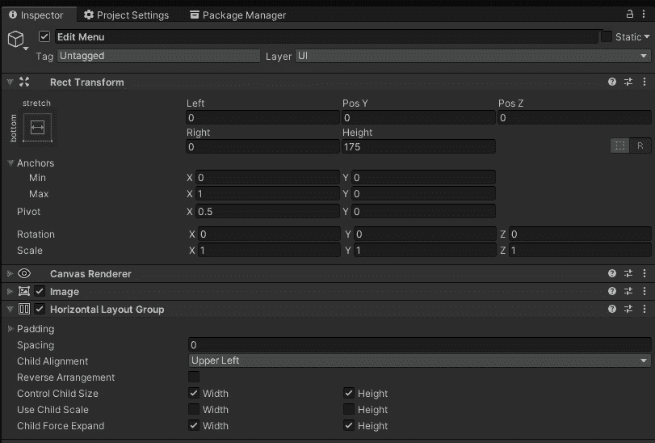
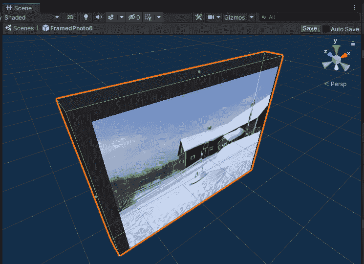
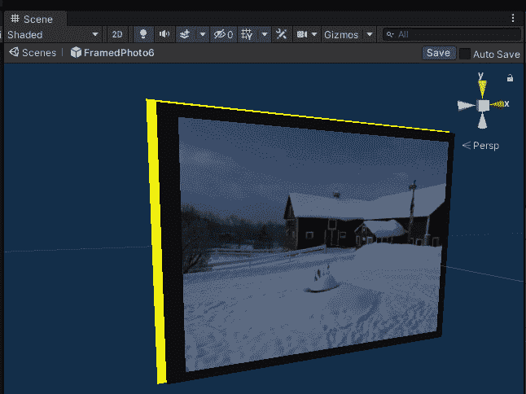
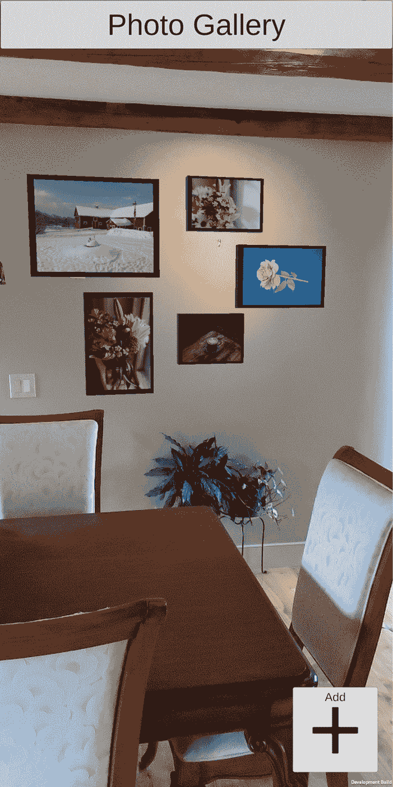

# *第七章*：画廊：编辑虚拟对象

在本章中，我们将继续构建我们在*第六章*中开始的项目，*画廊：构建 AR 应用程序*，在那里我们创建了一个 AR 画廊，允许用户将虚拟相框照片放置在他们的现实世界墙壁上。在本章中，我们将构建更多与交互和编辑已添加到场景中的虚拟对象相关的功能。具体来说，我们将允许用户选择一个对象进行编辑，包括移动、调整大小、删除和替换相框中的图像。在这个过程中，我们将添加新的输入动作，利用 Unity 碰撞检测，并看到更多使用 Unity API 的 C# 编码技术。

本章中，我们将涵盖以下主题：

+   检测碰撞以避免相交对象

+   构建编辑模式和编辑菜单 UI

+   使用物理射线投射选择对象

+   添加触摸输入动作以拖动移动和捏合缩放

+   C# 编码和 Unity API，包括碰撞钩子和矢量几何

到本章结束时，你将拥有一个具有许多用户交互功能的运行中的 AR 应用程序。

# 技术要求

要完成本章的项目，你需要在你的开发计算机上安装 Unity，并将其连接到一个支持增强现实应用程序的移动设备（有关说明，请参阅*第一章*，*为 AR 开发设置*）。我们还将假设你已经创建了我们在*第六章*，*画廊：构建 AR 应用程序*中开始创建的 *ARGallery* 场景。你将在 *技术要求* 部分找到有关该场景的详细信息。你可以在本书的 GitHub 存储库中找到该场景，以及我们将在本章中构建的场景，网址为 [`github.com/PacktPublishing/Augmented-Reality-with-Unity-AR-Foundation`](https://github.com/PacktPublishing/Augmented-Reality-with-Unity-AR-Foundation)。

注意，在本书的存储库中，本章的一些脚本（和类）已被后缀加上 `07`，例如 `AddPictureMode07`，以区分它们与为上一章编写的相应脚本。在你自己的项目中，当你编辑本章中描述的现有脚本时，可以保留未后缀的名称。

# 创建编辑模式

要开始本章，你应该在 Unity 中打开*ARGallery*场景，我们在*第六章*的末尾停止，*画廊：构建 AR 应用*。为了回顾，启动应用后，它首先初始化 AR 会话并扫描以检测真实世界环境中的特征。一旦检测到垂直平面（墙壁），主菜单将显示出来。在这里，用户可以轻触**添加**按钮，这将打开一个图像选择菜单，用户可以从中选择要使用的照片。然后，用户将被提示轻触可追踪的垂直平面以放置框架照片。一旦照片挂在他们的墙上，用户将返回主模式。

在本章中，我们将允许用户修改已添加到场景中的现有虚拟框架照片。第一步是用户从主模式中选择要编辑的现有对象，然后激活所选对象的编辑图片模式。当对象被选中并进行编辑时，应该突出显示，以便明显知道哪个对象已被选中。

使用为本书开发的 AR 用户框架，我们将首先向场景中添加一个 EditPicture 模式 UI。首先，我们将创建编辑菜单用户界面，包括用于各种编辑功能的多个按钮，以及一个用于管理的 Edit 模式控制器脚本。

## 创建编辑菜单 UI

要创建放置图片的 UI，我们将创建一个新的**EditPicture UI**面板。复制现有的**Main UI**并适应它会更简单。执行以下步骤：

1.  在`EditPicture UI`中，通过**右键单击**| **删除**删除任何子对象，包括**添加按钮**。

1.  通过在`编辑菜单`上**右键单击**来创建菜单的子面板。

1.  使用`175`。

1.  我将我的背景设置为`55`。

1.  选择`布局`，然后选择**水平布局组**。

1.  在**水平布局组**组件上，勾选**控制子大小 | 宽度**和**高度**复选框。（将其他选项保留为默认值，**使用子缩放**未勾选，**子强制扩展**勾选）。在**检查器**窗口中，**编辑菜单**面板看起来如下所示：

    图 7.1 – 编辑菜单面板设置

1.  现在，我们将向菜单中添加四个按钮。首先，在`替换图像按钮`上**右键单击**。

1.  选择其子文本对象，设置`替换图像`并将`48`。

1.  在**替换图像**按钮上**右键单击**并选择**复制**（或*Ctrl + D*）。重复此操作两次，以便总共有四个按钮。

1.  重命名按钮并更改按钮上的文本，使其显示为`替换框架`、`移除图片`和`完成`。

1.  我们可能不会很快使用**替换框架**功能，因此通过在**按钮**组件中取消勾选其**交互性**复选框来禁用该按钮。结果菜单将如下所示：


](img/Figure_7.01-EditMenu-inspector.jpg)

图 7.2 – 编辑菜单按钮

按照以下步骤将面板添加到 UI 控制器中：

1.  要将面板添加到 UI 控制器中，在 **层次结构** 窗口中选择 **UI Canvas** 对象。

1.  在 **检查器** 窗口中，在 **UI 控制器** 组件的右下角，点击 **+** 按钮向 UI 面板字典中添加一个条目。

1.  在 **Id** 字段中输入 `EditPicture`。

1.  将 **EditPicture UI** 游戏对象从 **层次结构** 窗口拖动到 **值** 插槽。

下一步是创建一个 **EditPicture** 模式对象和控制器脚本。

## 创建 EditPicture 模式

如你所知，我们的框架通过激活交互控制器下的游戏对象来管理交互模式。每个模式都有一个控制脚本，用于显示该模式的 UI 并处理任何用户交互，直到满足某些条件；然后，它将过渡到不同的模式。就我们的 EditPicture 模式而言，其控制脚本将有一个 `currentPicture` 变量，用于指定正在编辑的图片，一个 `DoneEditing` 函数，用于将用户返回到主模式，以及其他功能。

创建一个新的 C# 脚本，命名为 `EditPictureMode` 并开始编写，如下所示：

```cs
using UnityEngine;
public class EditPictureMode : MonoBehaviour
{
    public FramedPhoto currentPicture;
    void OnEnable()
    {
        UIController.ShowUI("EditPicture");
    }
}
```

现在，我们可以将其添加到我们的 **交互控制器** 对象中，如下所示：

1.  在 `EditPicture Mode`。

1.  将 `EditPictureMode` 脚本从 **项目** 窗口拖动到 **EditPicture Mode** 对象上，将其添加为组件。

1.  现在，我们将模式添加到交互控制器中。在 **层次结构** 窗口中，选择 **交互控制器** 对象。

1.  在 **检查器** 窗口中，在 **交互控制器** 组件的右下角，点击 **+** 按钮向 **交互模式** 字典中添加一个条目。

1.  在 **Id** 字段中输入 `EditPicture`。

1.  将 **EditPicture Mode** 游戏对象从 **层次结构** 窗口拖动到 **值** 插槽。

这样，我们就创建了一个 `UIController`。在此之后，我们创建了一个由 `InteractionController` 控制的 `EditPictureMode` 脚本。

使用这个设置，接下来我们必须增强主模式，使其能够检测用户是否点击了现有的 **FramedPhoto**，并可以为选定的对象启动 EditPicture 模式。

# 选择要编辑的图片

当处于主模式时，用户应该能够点击现有的图片进行编辑。利用 Unity 输入系统，我们将添加一个新的 `SelectObject` 输入动作。然后，我们将让 `MainMode` 脚本监听该动作的消息，使用 `Raycast` 找到被点击的图片，并启用该图片的编辑模式。让我们开始吧！

## 定义 SelectObject 输入动作

我们将首先通过以下步骤将 `SelectObject` 动作添加到 **AR 输入动作** 资产中：

1.  在 `Assets/Inputs/` 文件夹中打开它进行编辑（或者使用其 **编辑资产** 按钮）。

1.  在中间的 `SelectObject`。

1.  在最右侧的 **属性** 部分，选择 **动作类型 | 值** 和 **控制类型 | 向量 2**。

1.  在中间的**动作**部分，选择**<无绑定>**子项。然后，在**属性**部分，选择**路径 | 触摸屏 | 主要触摸 | 位置**以将此动作绑定到主屏幕触摸。

1.  按**保存资产**（除非已启用**自动保存**）。

更新的**AR 输入动作**资产如图所示：

![图 7.3 – 添加了 SelectObject 动作的 AR 输入动作资产

![img/Figure_7.03-imputaction-selectobject.jpg]

图 7.3 – 添加了 SelectObject 动作的 AR 输入动作资产

虽然我们使用与之前创建的`PlaceObject`动作相同的触摸屏绑定来定义此动作（**触摸屏主要位置**），但它具有不同的用途（点击选择与点击放置）。例如，也许在未来，如果你决定使用**双击**来选择项目而不是单击，你可以简单地更改其输入动作。

现在，我们可以添加这个动作的代码。

## 替换 MainMode 脚本

首先，因为我们正在偏离`ARFramework`模板中提供的默认`MainMode`脚本，我们应该为这个项目创建一个新的、独立的脚本。执行以下步骤以复制和编辑新的`GalleryMainMode`脚本：

1.  在“项目”窗口的“脚本/”文件夹中，选择**MainMode**脚本。然后，从主菜单栏中选择**编辑 | 复制**。

1.  将新文件重命名为`GalleryMainMode`。

1.  你会在`MainMode`类中看到一个命名空间错误。

    打开`GalleryMainMode`，如图所示：

    ```cs
    using UnityEngine;
    using UnityEngine.InputSystem;
    public class GalleryMainMode : MonoBehaviour
    {
        void OnEnable()
        {
            UIController.ShowUI("Main");
        }
    }
    ```

1.  保存脚本。然后，在 Unity 中，在**层次**窗口中，选择**Main Mode**游戏对象（在**交互控制器**下）。

1.  将**GalleryMainMode**脚本拖放到**Main Mode**对象上，添加为新组件。

1.  从**Main Mode**对象中移除之前的**Main Mode**组件。

现在，我们准备好增强主模式的行为。

## 选择主模式下的对象

当用户点击屏幕时，`GalleryMainMode`脚本将获取触摸位置并使用 Raycast 来确定是否选择了`PlacedPhoto`对象之一。如果是，它将启用该图片的**编辑图片**模式。

我们之前在点击放置脚本中看到过 Raycasts，包括`AddPictureMode`。在那个例子中，我们的脚本使用了`Physics.Raycast`函数([`docs.unity3d.com/ScriptReference/Physics.Raycast.html`](https://docs.unity3d.com/ScriptReference/Physics.Raycast.html))。作为 Unity 物理系统的一部分，它要求射线投射对象具有**Collider**（**FramedPhoto**具有，我很快会向你展示）。

此外，我们还将使用 AR 摄像头的`ScreenPointToRay`函数来定义与将要进行 Raycast 的触摸位置相对应的 3D 射线。

要添加此功能，打开`GalleryMainMode`脚本进行编辑，并按照以下步骤操作：

1.  我们将监听输入系统事件，因此首先需要为该命名空间添加一个`using`语句。确保以下行位于文件顶部：

    ```cs
    using UnityEngine.InputSystem;
    ```

1.  我们需要一个引用来告诉`EditPictureMode`要编辑哪个对象。将其添加到类的顶部，如下所示：

    ```cs
    public class GalleryMainMode : MonoBehaviour
    {
        [SerializeField] EditPictureMode editMode;
    ```

1.  我们将使用`Camera.main`快捷方式。（这要求 AR 相机被标记为`MainCamera`，这应该从场景模板中完成。）在类的顶部添加一个私有变量，并使用`Start`进行初始化：

    ```cs
        Camera camera;
        void Start()
        {
            camera = Camera.main;
        }
    ```

1.  现在我们来处理任务的主体部分 - 添加以下`OnSelectObject`和`FindObjectToEdit`函数：

    ```cs
        public void OnSelectObject(InputValue value)
        {
            Vector2 touchPosition = value.Get<Vector2>();
            FindObjectToEdit(touchPosition);
        }
        void FindObjectToEdit(Vector2 touchPosition)
        {
            Ray ray = camera.ScreenPointToRay(touchPosition);
            RaycastHit hit;
            int layerMask =             1 << LayerMask.NameToLayer("PlacedObjects");
            if (Physics.Raycast(ray, out hit, Mathf.Infinity,            layerMask))
            {
                FramedPhoto picture = hit.collider.                GetComponentInParent<FramedPhoto>();
                editMode.currentPicture = picture;
                InteractionController.                EnableMode("EditPicture");
            }
        }
    ```

让我们一起分析这段代码。当使用`SelectObject`输入系统动作时，`OnSelectObject`函数会自动调用（`On`前缀是 Unity 中事件接口的标准约定）。它从输入值中获取`Vector2 touchPosition`并将其传递给我们的私有`FindObjectToEdit`函数。（您不需要将其分成两个函数，但我这样做是为了清晰。）

`FindObjectToEdit`通过调用`camera.ScreenPointToRay`获取与触摸位置对应的 3D 射线。将其传递给`Physics.Raycast`以在场景中找到一个与射线相交的对象。我们不会对每个可能的对象进行投射，而是将其限制在名为`PlacedObjects`的图层上，使用其`layermask`。（为此，我们需要确保**FramedPhoto**被分配到这个图层，我们很快就会这样做。）

信息 - 图层名称、图层编号和图层遮罩

通过将`LayerMask.NameToLayer`左移多次来管理项目中的图层并查看每个图层编号分配了什么名称。要管理项目中的图层并查看每个图层编号分配了什么名称，请点击编辑器右上角的**图层**按钮。

如果射线投射命中，我们必须获取预制体中`FramedPhoto`组件的引用并将其传递给`EditPictureMode`组件。然后，应用将过渡到编辑图片模式。

保存脚本。现在，让我们修复我提到的游戏对象上的家务事：将相机标签设置为`MainCamera`，设置`PlacedObjects`图层，并确保**FramedPhoto**具有碰撞器组件。在 Unity 中，执行以下操作：

1.  在**层次结构**窗口中，选择**主模式**游戏对象，将**编辑图片模式**对象从**层次结构**窗口拖动到**检查器**窗口，并将其放置在**画廊主模式 | 编辑模式**槽中。

1.  在场景**层次结构**中，展开**AR 会话原点**并选择其子**AR Camera**。在**检查器**窗口的左上角，验证**标签**（位于**检查器**窗口顶部）是否设置为**MainCamera**。如果不是，现在设置它。

1.  接下来，通过在**项目**窗口中双击资产来打开**FramedPhoto**预制体进行编辑。

1.  在其根`PlacedObjects`。

    如果名为`PlacedObjects`的图层不存在，选择`PlacedObjects`并将其分配给一个空槽。在`PlacedObjects`中。

    你将随后被提示问题**你想要将所有子对象层设置为 PlacedObjects 吗？**。点击**是，更改子对象**。

1.  当我们在这里时，让我们也验证预制件是否有一个碰撞器，这是`Physics.Raycast`所必需的。如果你还记得，当我们构建预制件时，我们从一个**空**的游戏对象作为根开始，并为**AspectScaler**添加了另一个**空**子对象。然后，我们为**框架**对象添加了一个 3D 立方体。点击这个**框架**对象。

1.  在**检查器**窗口中，你会看到**框架**对象已经有一个**盒子碰撞器**。完美。注意，如果你按下它的**编辑碰撞器**按钮，你可以在**场景**窗口中看到（并编辑）碰撞器的形状，如图所示，其边缘被勾勒出来，并且有一些小把手可以移动面。但在这里我们不需要改变它：

    图 7.4 – 编辑框架对象的盒子碰撞器

1.  保存预制件并退出预制件编辑器回到场景层次结构。

如果你现在要**构建并运行**场景，然后向墙上添加一张图片，当你点击那张图片时，它应该隐藏主菜单并显示编辑菜单。现在，我们需要一种方法从编辑模式回到主模式。让我们连接**完成**按钮。

## 连接完成编辑按钮

在本节中，我们将设置`InteractionController`中的`EnableMode`。按照以下步骤操作：

1.  在**层次结构**窗口中，选择**完成**按钮，它应该位于**UI Canvas | EditPicture UI | Edit Menu**下。

1.  在**检查器**窗口中，点击**按钮 | OnClick**区域右下角的**+**按钮添加一个新的事件动作。

1.  从**层次结构**窗口中将**Interaction Controller**对象拖动到**OnClick**动作的**对象**槽中。

1.  在函数选择列表中，选择**InteractionController | EnableMode**。

1.  在模式字符串参数槽中输入`Main`。

现在，如果你**构建并运行**的场景中有一个图片实例化，并点击图片，你会切换到编辑模式并看到编辑菜单。点击**完成**按钮回到主模式。

这是个进步。但如果你的墙上有多张图片，当前正在编辑的是哪一张并不明显。我们需要突出显示当前选中的图片。

# 突出显示选中的图片

在 Unity 中有许多方法可以突出显示对象，以指示用户已选择该对象。通常，你会发现自定义着色器可以做到这一点（在资源商店中有很多）。决策取决于你想要的“外观”。你想要改变所选对象的着色，绘制线框轮廓，还是创建其他效果？为了保持简单，我将只介绍一个“高亮”游戏对象，在**FramedPhoto**预制件中作为一个从框架边缘延伸的细黄色框。让我们现在就来做这个：

1.  通过在**项目**窗口中**双击**它来编辑**FramedPhoto**预制件。

1.  在`Highlight`中。

1.  设置其`1.05, 1.05, 0.005`)，使其变薄并延伸到框架的边缘。

1.  设置其`0, 0, -0.025`）。

1.  创建一个黄色材质。在`Materials/`文件夹中（如果需要则创建一个）并选择`Highlight Material`。

1.  设置**高亮材质 | 着色器 | 通用渲染管线 | 无光照**。

1.  将其**基础图**颜色（使用颜色样本）设置为黄色。

1.  将**高亮材质**拖放到**高亮**游戏对象上。现在**场景**视图应该如下所示：

![图 7.5 – 带有高亮的框架照片]



图 7.5 – 带有高亮的框架照片

我们现在可以从`FramedPhoto`脚本中控制这个。你可能出于不同的原因想要突出显示图片，但在这个项目中，我决定当对象被选择并突出显示时，这意味着它正在被编辑。因此，我们可以在使对象可编辑时切换高亮。在你的编辑器中打开脚本并做出以下更改：

1.  声明一个`highlightObject`变量：

    ```cs
        [SerializeField] GameObject highlightObject;
        bool isEditing;
    ```

1.  添加一个切换高亮的函数：

    ```cs
        public void Highlight(bool show)
        {
            if (highlightObject) // handle no object or app                                 end object destroyed
                highlightObject.SetActive(show);
        }
    ```

1.  确保图片在开始时不会被突出显示：

    ```cs
        void Awake()
        {
            Highlight(false);
        }
    ```

1.  添加一个`BeingEdited`函数。当对象正在编辑时，将调用此函数。它将突出显示对象，并在稍后启用其他编辑行为。同样，当我们停止编辑并传递`false`值时，对象将被取消突出显示：

    ```cs
       public void BeingEdited(bool editing)
        {
            Highlight(editing);
            isEditing = editing;
        }
    ```

1.  保存脚本。在 Unity 中，选择根**FramedPhoto**对象。

1.  将**高亮**对象从**层次结构**窗口拖动到**Framed Photo | 高亮对象**槽中。

这很棒！现在，我们可以更新`EditPictureMode`来告诉图片它是否正在被编辑。打开`EditPictureMode`脚本并做出以下修改：

1.  将`BeingEdited`调用添加到`OnEnable`中：

    ```cs
       void OnEnable()
        {
            UIController.ShowUI("EditPicture");
            if (currentPicture)
                currentPicture.BeingEdited(true);
        }
    ```

1.  此外，当它不是正在编辑时（即退出编辑模式时），将`BeingEdited`调用添加到`OnDisable`中：

    ```cs
        void OnDisable()
        {
            if (currentPicture)
                currentPicture.BeingEdited(false);
        }
    ```

    注意，尽管我们绝不会故意在没有定义`currentPicture`的情况下进入编辑模式，但我已经添加了空值检查，以防在应用程序启动或关闭序列中激活或关闭该模式。

如果你现在播放场景并添加一张图片，当你通过主模式触摸图片时，编辑模式将变为启用，图片将被突出显示。当你退出到主模式时，图片将被取消突出显示。

让我们继续。假设你在墙上有多张图片。目前，当你正在编辑一张图片，并想要编辑另一张时，你必须按下`EditMode`脚本。

# 从编辑模式中选择对象

当在一个图片的编辑模式下时，为了让用户在不退出编辑模式的情况下选择另一张图片，我们可以使用相同的`EditPictureMode`脚本进行编辑，并做出以下更改：

1.  我们将监听输入系统事件，因此首先，我们需要为该命名空间添加一个`using`语句。确保以下行位于文件顶部：

    ```cs
    using UnityEngine.InputSystem;
    ```

1.  在类的顶部添加一个私有的`camera`变量，并在`Start`方法中初始化它：

    ```cs
        Camera camera;
        void Start()
        {
            camera = Camera.main;
        }
    ```

1.  `OnSelectObject`动作监听器将调用`FindObjectToEdit`。就像在`GalleryMainMode`中一样，它对`PlacedObjects`层进行 Raycast。但现在，我们必须检查它是否击中了除当前图片之外的对象。如果是这样，我们必须停止编辑`currentPicture`并使新选择成为当前选择：

    ```cs
        public void OnSelectObject(InputValue value)
        {
            Vector2 touchPosition = value.Get<Vector2>();
            FindObjectToEdit(touchPosition);
        }
        void FindObjectToEdit(Vector2 touchPosition)
        {
            Ray ray = camera.ScreenPointToRay(touchPosition);
            RaycastHit hit;
            int layerMask =             1 << LayerMask.NameToLayer("PlacedObjects");
            if (Physics.Raycast(ray, out hit, 50f,            layerMask))
            {
                if (hit.collider.gameObject !=                currentPicture.gameObject)
                {
                    currentPicture.BeingEdited(false);
                    FramedPhoto picture = hit.collider.                    GetComponentInParent<FramedPhoto>();
                    currentPicture = picture;
                    picture.BeingEdited(true);
                }
            }
        }
    ```

总结来说，当你有多个正在编辑的`currentPicture`对象时。

这里还有一个问题：如果你一直在玩这个项目，你可能已经注意到你可以将图片放在彼此的上面，或者实际上，*在里面*，因为它们似乎没有任何物理存在！哎呀。让我们修复这个问题。

# 避免相交的对象

在 Unity 中，为了指定一个对象应参与 Unity 物理系统，你必须向 GameObject 添加一个**Rigidbody**组件。添加 Rigidbody 会给对象质量、速度、碰撞检测和其他物理属性。我们可以使用它来防止对象相交。在许多游戏和 XR 应用中，Rigidbody 对于将运动力应用到对象上以使它们在碰撞时弹跳非常重要，例如。

在我们的项目中，如果一张图片与另一张图片发生碰撞，它应该简单地让开，这样它们就永远不会相交。但它也应该与墙面保持齐平。尽管 Rigidbody 允许你沿**X**、**Y**和**Z**方向中的任何一个方向约束运动，但这些是正交的世界空间平面，而不是任意角度的墙面平面。最终，我决定在检测到碰撞时手动定位图片，而不是使用物理力。我的解决方案是约束所有图片的位置（和旋转），这样物理力就不会移动它们。然后，我可以用碰撞作为触发器，手动将图片移开。

信息 - 碰撞与触发检测对比

当两个 GameObject 具有`OnCollisionEnter`、`OnCollisionStay`和`OnCollisionExit`以挂钩到这些事件时。

然而，你可以通过将 Collider 标记为`OnTriggerEnter`、`OnTriggerStay`和`OnTriggerExit`来完全禁用 Unity 应用物理力，以挂钩到这些事件。

要将碰撞检测添加到**FramedPhoto**预制体，请按照以下步骤操作：

1.  在**项目**窗口中，找到并**双击****FramedPhoto**预制体以打开它进行编辑。

1.  确保你在**层次结构**窗口中选择了根**框架照片**对象。

1.  在`刚体`中，并为对象添加一个**刚体**。

1.  展开**约束**属性并检查所有六个框；即**冻结位置：X, Y, Z**和**冻结旋转：X, Y, Z**。

1.  取消勾选其**使用重力**复选框。（这并不是必要的，因为我们已经设置了约束，但我还是喜欢明确这一点。）

1.  我们需要一个**碰撞体**。正如我们所见，**框架**子对象上有一个。因此，选择**框架**游戏对象。

1.  在**检查器**窗口中，在其**盒子碰撞体**组件中，勾选**是触发器**复选框。

1.  为了避免任何问题，禁用（或删除）预制件中的其他碰撞体。具体来说，从**图像**中删除**网格碰撞体**，从**高亮**中删除**盒子碰撞体**。

现在，我们可以处理碰撞触发器，并在另一张图片在同一空间时将其移开。我们只想确保它沿着墙壁移动。我们可以利用墙壁平面的法向量（垂直于平面表面的向量）也是我们图片预制件的向前方向向量的事实，因为我们最初就是将其放置那里的。此外，我们只想考虑与放置对象平面上的对象（例如，不是 AR 跟踪平面对象）的碰撞。

我的算法确定这张图片与其他相交图片之间的距离，在 3D 中。然后，它通过将距离向量投影到墙壁平面上并缩放它来找到移动这张图片的方向。图片将继续移动，直到不再与框架相交。

让我们编写这段代码。打开`FramedPhoto`脚本进行编辑并按照以下步骤操作：

1.  首先在类的顶部添加对`collider`和`layer`编号的引用，如下所示：

    ```cs
        [SerializeField] Collider boundingCollider;
        int layer;
    ```

1.  从其名称初始化`层`编号。提前初始化这很好，因为`OnTriggerStay`可能会每帧被调用：

    ```cs
        void Awake()
        {
            layer = LayerMask.NameToLayer("PlacedObjects");
            Highlight(false);
        }
    ```

1.  我们将在这里使用`OnTriggerStay`，它在对象与另一个对象碰撞时每次更新时被调用，如下所示：

    ```cs
        void OnTriggerStay(Collider other)
        {
            const float spacing = 0.1f;
            if (isEditing && other.gameObject.layer == layer)
            {
                Bounds bounds = boundingCollider.bounds;
                if (other.bounds.Intersects(bounds))
                {
                    Vector3 centerDistance =                     bounds.center - other.bounds.center;
                    Vector3 distOnPlane =                     Vector3.ProjectOnPlane(centerDistance,                        transform.forward);
                    Vector3 direction =                     distOnPlane.normalized;
                    float distanceToMoveThisFrame =                     bounds.size.x * spacing;
                    transform.Translate(direction *                    distanceToMoveThisFrame);
                }
            }
        }
    ```

1.  保存脚本。在 Unity 中，从**层次结构**窗口中将**框架**对象（具有盒子碰撞体）拖动到**框架照片 | 边界碰撞体**槽中。**框架照片**组件现在看起来如下：

    图 7.6 – 框架照片组件属性，包括边界碰撞体

1.  保存预制件并返回到场景**层次结构**。

当你现在播放场景时，将一张图片放在墙上，然后在同一空间放置另一张图片，新图片将远离第一张图片，直到它们不再碰撞。

现在我们可以在墙上放置许多图片，你可能想学习如何从场景中删除一张图片。我们将在下一节中探讨这个问题。

# 删除图片

删除正在编辑的图片很简单。我们只需要销毁`currentPicture` GameObject 并返回 Main-mode。执行以下步骤：

1.  打开`EditPictureMode`脚本并添加以下函数：

    ```cs
        public void DeletePicture()
        {
            GameObject.Destroy(currentPicture.gameObject);
            InteractionController.EnableMode("Main");
        }
    ```

1.  保存脚本。

1.  在 Unity 中，在**Hierarchy**窗口中，选择**Remove Button**（位于**UI Canvas | EditPicture UI | Edit Menu**下）。

1.  在**Inspector**中，点击**Button | OnClick**区域右下角的**+**按钮。

1.  将**EditPicture Mode**对象从**Hierarchy**窗口拖到**OnClick Object**槽中。

1.  从函数选择中，选择**EditPictureMode | DeletePicture**。

当您播放场景时，创建一个图片，进入 EditPicture-mode，然后点击**Remove Picture**按钮，图片将从场景中删除，您将回到 Main-mode。

现在我们有两个编辑菜单按钮正在运行——**Remove Picture**和**Done**。现在，让我们添加一个功能，允许您从**Image Select**菜单面板更改现有**FramedPhoto**中的图片。

# 替换图片的图像

当您从主菜单添加图片时，将显示选择图片菜单。从这里，您可以挑选一张图片。此时，您将被提示使用所选图片在场景中添加一个**FramedPhoto**。我们通过添加一个单独的**SelectImage 模式**来实现这一点。现在我们希望这个模式能够服务于两个目的。当您在场景中添加新的、带框的图片时，它从 Main-mode 调用，当您想要替换场景中已经存在的带框图片的图片时，它从 EditPicture-mode 调用。这要求我们重构代码。

目前，当我们构建选择图片按钮（在`ImageButtons`脚本中）时，我们直接配置并启用 AddPicture-mode。相反，现在它需要依赖于 SelectImage-mode 的使用方式，因此我们将从`ImageButtons`移动到`SelectImageMode`的代码，如下所示：

1.  编辑`SelectImageMode`脚本，并在类顶部添加对`AddPictureMode`的引用：

    ```cs
        [SerializeField] AddPictureMode addPicture;
    ```

1.  然后，添加一个公共的`ImageSelected`函数：

    ```cs
        public void ImageSelected(ImageInfo image)
        {
            addPicture.imageInfo = image;
            InteractionController.EnableMode("AddPicture");
        }
    ```

1.  编辑`ImageButtons`脚本，并在类顶部添加对`SelectImageMode`的引用：

    ```cs
        [SerializeField] SelectImageMode selectImage;
    ```

1.  然后，将`OnClick`代码替换为对`ImageSelected`的调用，这是我们刚刚编写的：

    ```cs
        void OnClick(ImageInfo image)
        {
            selectImage.ImageSelected(image);
        }
    ```

    这次重构没有添加任何新功能，但它重构了`SelectImageMode`的代码结构，以决定如何使用模态菜单。现在，让我们再次编辑`SelectImageMode`并添加替换`currentPicture`图像的支持。

1.  在`SelectImageMode`脚本顶部添加以下声明：

    ```cs
        [SerializeField] EditPictureMode editPicture;
        public bool isReplacing = false;
    ```

1.  然后，更新`ImageSelected`函数，如下所示：

    ```cs
        public void ImageSelected(ImageInfo image)
        {
    currentPicture object. Otherwise, it behaves as it did previously for AddPicture-mode.Now, we need to make sure the `isReplacing` flag is set to `false` when *adding* and set to `true` when *replacing*. Again, this requires some refactoring. Currently, the main menu's `SelectImageToAdd` function in the `GalleryMainMode` script.
    ```

1.  在`GalleryMainMode`类顶部添加对`SelectImageMode`的引用：

    ```cs
        [SerializeField] SelectImageMode selectImage; 
    ```

1.  然后，添加一个`SelectImageToAdd`函数，如下所示：

    ```cs
        public void SelectImageToAdd ()
        {
            selectImage.isReplacing = false;
            InteractionController.EnableMode("AddPicture");
        }
    ```

    我们只需要记得在我们完成之前更新**Add**按钮的**OnClick**动作。

1.  同样，现在，我们可以在`EditPictureMode`脚本中添加一个`SelectImageToReplace`函数。在类的顶部声明`selectImage`：

    ```cs
        [SerializeField] SelectImageMode selectImage;
    ```

    然后，添加以下功能：

    ```cs
        public void SelectImageToReplace()
        {
            selectImage.isReplacing = true;
            InteractionController.EnableMode("SelectImage");
        }
    ```

保存所有脚本。现在，我们需要在 Unity 中连接它们，包括设置**添加**和**替换图片**按钮的**OnClick**动作，然后设置新的**SelectImage Mode**参数。回到 Unity 中，从**添加**按钮开始，按照以下步骤操作：

1.  在**层次结构**窗口中，选择位于**UI 画布 | Main UI**下的**添加**按钮。

1.  从**层次结构**窗口，将**Main Mode**游戏对象（位于**交互控制器**下）拖动到**按钮 | OnClick**动作的**对象**槽位。

1.  在**功能**选择器中，选择**Gallery Main Mode | 选择添加的图片**。

1.  现在，我们将连接**替换图片**按钮，该按钮位于**UI 画布 | EditPicture UI | 编辑菜单**下。

1.  在**检查器**窗口中，在其**按钮**组件上，点击**OnClick**动作右下角的**+**按钮。

1.  从**层次结构**窗口，将**EditPicture Mode**游戏对象拖动到**OnClick** **对象**槽位。

1.  在**功能**选择器中，选择**Edit Picture Mode | 选择替换的图片**。

    按钮现在已设置好。我们现在只需分配其他引用。

1.  在**层次结构**窗口中，选择**Main Mode**游戏对象（位于**交互控制器**下）。

1.  将**SelectImage Mode**对象从**层次结构**窗口拖动到**选择图片**槽位。

1.  在**层次结构**窗口中选择**SelectImage Mode**游戏对象（位于**交互控制器**下）。

1.  将**AddPicture Mode**对象从**层次结构**窗口拖动到**添加图片**槽位。

1.  将**EditPicture Mode**对象从**层次结构**窗口拖动到**编辑图片**槽位。

1.  在**层次结构**窗口中，选择**EditPicture Mode**游戏对象（位于**交互控制器**下）。

1.  将**SelectImage Mode**对象从**层次结构**窗口拖动到**选择图片**槽位。

1.  在**层次结构**窗口中，选择位于**UI 画布 | SelectImage UI**下的**Image Buttons**游戏对象。

1.  将**SelectImage Mode**对象从**层次结构**窗口拖动到**选择图片**槽位。

这样就完成了！

总结一下，我们已经重构了`ImageButtons`脚本，以便在按钮按下时调用`SelectImageMode.ImageSelected`。`SelectImageMode`将知道用户是添加新图片还是用现有图片替换图片。在前一种情况下，模式是从 Main-mode 调用的。在后一种情况下，模式是从 EditPicture-mode 调用的，并且设置了`isReplacing`标志。

继续构建并运行场景。添加一张图片，然后编辑它。然后，点击**替换图片**按钮。应该会出现**选择图片**菜单。此时，你可以选择另一张图片，它将替换当前选中的**FramedPhoto**中的图片。你还可以为这个项目添加更多功能，包括让用户为他们的图片选择不同的相框。

## 替换相框

我们必须实现的最后一个**编辑**按钮是**替换相框**。我将把这个功能留给你来构建，因为在这个时候，你可能已经具备了自己解决这个挑战的技能。一个基本的解决方案可能是保留当前的**FramedPhoto**预制体，并让用户只需为相框选择不同的颜色。或者，你可以在**FramedPhoto**预制体中定义单独的相框对象，可能使用在资产商店或其他地方找到的模型，并选择一个允许一个或另一个相框对象的功能。以下是一些关于在哪里找到模型的建议：

+   *经典相框*: [`assetstore.unity.com/packages/3d/props/furniture/classic-picture-frame-59038`](https://assetstore.unity.com/packages/3d/props/furniture/classic-picture-frame-59038)

+   *Turbosquid:* [`www.turbosquid.com/3d-model/free/picture-frame`](https://www.turbosquid.com/3d-model/free/picture-frame)

到目前为止，我们一直是通过编辑菜单按钮间接与放置的对象交互。接下来，我们将考虑直接与虚拟对象交互。

# 通过交互编辑图片

我们现在将实现移动和调整我们在 AR 场景中放置的虚拟对象大小的能力。为此，我决定让正在编辑的对象负责自己的交互。也就是说，当**FramedPhoto**正在编辑时，它将监听输入动作事件并移动或调整自己。

我还决定将这些功能作为独立的组件实现，分别是`MovePicture`和`ResizePicture`，在**FramedPhoto**预制体上。这将在**FramedPhoto**正在编辑时启用。首先，让我们确保实例化的**FramedPhoto**对象接收输入动作消息，以便它们能够响应用户输入。

## 确保 FramedPhoto 对象接收输入动作消息

我们目前正在使用 Unity 输入系统，它允许你定义和配置用户输入动作，以及通过玩家输入组件监听这些动作事件。目前，场景中有一个玩家输入组件，附加到交互控制器游戏对象上。该组件配置为向下广播消息。因此，如果我们想让`FramedPhoto`脚本接收输入动作消息（我们现在就是这样做的），我们必须确保**FramedPhoto**对象实例是交互控制器的子对象。让我们简单地将**FramedPhoto**对象作为其实例化的**AddPicture Mode**游戏对象的子对象，如下所示：

1.  编辑`AddPictureMode`脚本。

1.  在`PlaceObject`函数中，通过添加以下代码行将生成的对象的父对象设置为**AddPicture Mode**游戏对象：

    ```cs
                GameObject spawned = Instantiate(placedPrefab,                position, rotation);
                spawned.transform.SetParent(                transform.parent);
    ```

实例化的**FramedPhoto**预制件现在将由**AddPicture Mode**游戏对象作为父对象。

信息 - 场景组织和输入动作消息

建议您考虑如何组织场景对象层次结构以及放置实例化对象的位置。例如，通常，我更喜欢将所有我们的**FramedPhotos**保存在一个单独的根对象容器中。如果我们现在这么做，我们就必须将**Player Input Behavior**设置为调用事件，而不是向下广播消息到本地层次结构。然后，响应这些输入动作的脚本将订阅（添加监听器）到这些消息（见`docs.unity3d.com/Packages/com.unity.inputsystem@1.1/manual/Components.html#notification-behaviors`）。另一方面，对于本书中的教程项目等，我决定使用内置的输入动作消息会更简洁且更容易解释。

让我们从创建空脚本并将它们添加到场景中开始。然后，我们将构建它们。

## 添加交互组件

为了加快实现速度，我们必须首先通过执行以下步骤来创建脚本文件：

1.  在你的`MovePicture`。

1.  创建另一个新的 C#脚本，命名为`ResizePicture`。

1.  打开**FramedPhoto**预制件进行编辑。

1.  将**MovePicture**脚本和**ResizePicture**脚本从**Project**资产文件夹拖到根**FramedPhoto**对象上。

1.  在你的代码编辑器中编辑`FramedPhoto`脚本。在类的顶部添加以下声明：

    ```cs
    MovePicture movePicture;
    ResizePicture resizePicture;
    ```

1.  在`Awake`中初始化它，并开始时禁用组件：

    ```cs
        void Awake()
        {
            movePicture = GetComponent<MovePicture>();
            resizePicture = GetComponent<ResizePicture>();
            movePicture.enabled = false;
            resizePicture.enabled = false;
            layer = LayerMask.NameToLayer("PlacedObjects"); 
            Highlight(false);   
    }
    ```

1.  然后，在编辑时启用这些组件：

    ```cs
       public void BeingEdited(bool editing)
        {
            Highlight(editing);
            movePicture.enabled = editing;
            resizePicture.enabled = editing;
            isEditing = editing;
        }
    ```

我们现在已经准备好向`FramedPhoto`对象添加移动和调整大小直接操作功能。这些将作为单独的组件，仅在编辑图片模式下启用。

好的。让我们先通过在屏幕上用手指拖动图片来交互式地沿墙移动图片。

## 用我们的手指移动图片

我们将首先通过向**AR Input Actions**资产添加`MoveObject`动作来实现拖动移动功能。就像我们已有的**SelectObject**动作（和**PlaceObject**）一样，这将绑定到触摸屏的主要触摸位置。我们将把这个动作与其他动作分开，例如，如果你决定使用不同的交互技术，比如触摸并保持以开始拖动操作，我们可以这么做。但就目前而言，我们只需复制另一个，如下所示：

1.  在`Assets/Inputs/`文件夹中打开它进行编辑（或使用其**Edit Asset**按钮）。

1.  在中间部分，右键单击**SelectObject**动作并选择**Duplicate**。

1.  将新脚本重命名为`MoveObject`。

1.  按 **Save Asset**（除非已启用 **Auto-Save**）。

现在，我们可以添加监听此操作的代码。编辑 `MovePicture` 脚本并写下以下内容：

```cs
using System.Collections.Generic;
using UnityEngine;
using UnityEngine.EventSystems;
using UnityEngine.InputSystem;
using UnityEngine.XR.ARFoundation;
using UnityEngine.XR.ARSubsystems;
public class MovePicture : MonoBehaviour
{
    ARRaycastManager raycaster;
    List<ARRaycastHit> hits = new List<ARRaycastHit>();
    void Start()
    {
        raycaster = FindObjectOfType<ARRaycastManager>();
    }
    void Start(){ }
    public void OnMoveObject(InputValue value)
    {
        if (!enabled) return;
        if (EventSystem.current.IsPointerOverGameObject(0))            return;
        Vector2 touchPosition = value.Get<Vector2>();
        MoveObject(touchPosition);
    }
    void MoveObject(Vector2 touchPosition)
    {
        if (raycaster.Raycast(touchPosition, hits,            TrackableType.PlaneWithinPolygon))
        {
            ARRaycastHit hit = hits[0];
            Vector3 position = hit.pose.position;
            Vector3 normal = -hit.pose.up;
            Quaternion rotation =                 Quaternion.LookRotation(normal, Vector3.up);
            transform.position = position;
            transform.rotation = rotation;
        }
    }
}
```

这段代码与 `AddPictureMode` 脚本中的代码非常相似。它使用 **AR Raycast Manager** 来找到一个跟踪平面并将对象放置在平面与对象垂直对齐的位置。不同之处在于我们不是实例化一个新对象，我们只是更新现有对象的变换。我们这样做是持续的，只要输入动作事件正在生成（也就是说，只要用户在触摸屏幕）。

如果接收到输入动作消息但此组件未启用，则跳过 `OnMoveObject` 函数。它还检查用户是否没有轻触 UI 元素（一个事件系统对象），例如我们编辑菜单按钮之一。

尝试一下。如果你播放场景，创建一个图片，并开始编辑它，你应该能够用手指拖动图片，它会沿着墙面移动。实际上，由于我们每次更新都会进行射线投射，它可能会在你拖动时找到一个新的、更精确的跟踪平面，甚至将图片移动到另一面墙上。

正如我们之前提到的，如果你在任意一个已跟踪平面上轻触屏幕，当前图片将“跳转”到该位置。如果这不是你期望的行为，我们可以在开始更新变换位置之前检查初始触摸是否在当前图片上。修改后的代码如下：

1.  声明并初始化对 `camera` 和 `layerMask` 的引用：

    ```cs
        Camera camera;
        int layerMask;
        void Start() {
            raycaster = FindObjectOfType<ARRaycastManager>();
            camera = Camera.main;
            layerMask =             1 << LayerMask.NameToLayer("PlacedObjects");
        }
    ```

1.  在 `MoveObject` 中添加射线投射以确保在移动之前触摸在图片上：

```cs
    void MoveObject(Vector2 touchPosition)
    {
       Ray ray = camera.ScreenPointToRay(touchPosition);
        if (Physics.Raycast(ray, Mathf.Infinity, layerMask))
        {
            if (raycaster.Raycast(touchPosition, hits,                TrackableType.PlaneWithinPolygon))
            {
                ARRaycastHit hit = hits[0];
                Vector3 position = hit.pose.position;
                Vector3 normal = -hit.pose.up;
                Quaternion rotation =                     Quaternion.LookRotation(normal,                         Vector3.up);
                transform.position = position;
                transform.rotation = rotation;
            }
        }
    }
```

目前，我们只在 AddPicture 模式下显示跟踪平面。我认为在 Edit 模式下显示它们也会很有用。我们可以使用之前章节中编写的相同的 `ShowTrackablesOnEnable` 脚本，该脚本已经应用于 **AddPicture 模式** 游戏对象。按照以下步骤添加：

1.  在 **Hierarchy** 窗口中，选择 **EditPicture 模式** 游戏对象（位于 **Interaction Controller** 下）。

1.  在你的项目 `Scripts/` 文件夹中找到 `ShowTrackablesOnEnable` 脚本。

1.  从 **Hierarchy** 窗口中，将 **AR Session Origin** 游戏对象拖到 **Show Trackables On Enable | Session Origin** 插槽中。

1.  将脚本拖到 **EditPicture 模式** 对象上，添加为组件。

现在，当 **EditPicture 模式** 启用时，可跟踪的平面将会显示。当它被禁用并且你回到主模式时，它们将再次隐藏。

接下来，我们将实现捏合调整大小功能。

## 捏合以调整图片大小

要实现捏合调整大小，我们也将使用一个输入动作，但这需要一个两指触摸。因此，动作不仅仅返回一个单一值（例如，Vector2）。所以这次，我们将使用 **PassThrough** 动作类型。按照以下步骤添加它：

1.  编辑 **AR Input Actions** 资产，就像我们之前做的那样。

1.  在中间的 `ResizeObject`。

1.  在最右侧的**属性**部分，选择**动作类型 | 传递**，以及**控制类型 | 向量 2**。

1.  在中间的**动作**部分，选择**<无绑定>**子项。然后，在**属性**部分，选择**属性 | 路径 | 触摸屏 | 触摸 #1 | 位置**以将此动作绑定到第二个手指屏幕触摸。

1.  按下**保存资产**（除非已启用**自动保存**）。

现在，我们可以添加代码来监听这个动作。编辑`ResizePicture`脚本，并按照以下方式编写。在脚本的第一个部分，我们声明了几个属性，我们可以使用这些属性在 Unity 检查器中调整脚本的行为。`pinchspeed`允许你调整捏合的灵敏度，而`minimumScale`和`maximumScale`允许你分别限制用户最终将图片缩放到多小或多大的程度。按照以下步骤操作：

1.  以以下代码开始脚本：

    ```cs
    using UnityEngine;
    using UnityEngine.EventSystems;
    using UnityEngine.InputSystem;
    public class ResizePicture : MonoBehaviour
    {
        [SerializeField] float pinchSpeed = 1f;
        [SerializeField] float minimumScale = 0.1f;
        [SerializeField] float maximumScale = 1.0f;
        float previousDistance = 0f;
        void Start() { }
    ```

    注意，我声明了一个空的`Start()`函数。这是必需的，因为没有`Start`或`Update`函数的`MonoBehaviour`组件无法被禁用（如果你从代码中移除`Start`并在**检查器**窗口中查看，你会看到**启用**复选框不见了）。

1.  `OnResizeObject`函数是输入动作消息的监听器。因为我们指定了动作类型为`Touchscreen`以获取第一和第二根手指的触摸。然后，我们可以将这些触摸位置传递给我们的`TouchToResize`函数：

    ```cs
        public void OnResizeObject()
        {
            if (!enabled) return;
            if (EventSystem.current.            IsPointerOverGameObject(0)) return;
            Touchscreen ts = Touchscreen.current;
            if (ts.touches[0].isInProgress &&             ts.touches[1].isInProgress)
            {
                Vector2 pos =                 ts.touches[0].position.ReadValue();
                Vector2 pos1 =                 ts.touches[1].position.ReadValue();
                TouchToResize(pos, pos1);
            }
            else
            {
                previousDistance = 0;
            }
        }
    ```

1.  `TouchToResize`算法很简单。它获取两个手指触摸之间的距离（屏幕像素），并将其与之前的距离进行比较。将新距离除以旧距离给出百分比变化，我们可以直接使用它来修改变换的缩放。对我来说，这似乎工作得相当好：

    ```cs
        void TouchToResize(Vector2 pos, Vector2 pos1)
        {
            float distance = Vector2.Distance(pos, pos1);
            if (previousDistance != 0)
            {
                float scale = transform.localScale.x;
                float scaleFactor = (distance /                previousDistance) * pinchSpeed;
                scale *= scaleFactor;
                if (scale < minimumScale)
                    scale = minimumScale;
                if (scale > maximumScale)
                    scale = maximumScale;
                Vector3 localScale = transform.localScale;
                localScale.x = scale;
                localScale.y = scale;
                transform.localScale = localScale;
            }
            previousDistance = distance;
        }
    }
    ```

尝试一下。如果你播放场景，创建一个图片，并开始编辑它，你应该能够使用两只手指来调整图片大小，通过捏合手指来缩小图片，通过分开手指来增大图片的大小。以下是我手机上的屏幕截图，展示了我在餐厅墙上排列的一些图片，它们的大小各不相同：

![图 7.7 – 我餐厅墙上排列的虚拟相框照片]



图 7.7 – 我餐厅墙上排列的虚拟相框照片

在本节中，我们探讨了如何直接与虚拟对象交互。使用输入动作，我们添加了使用触摸屏拖动和移动墙上图片的功能，以及捏合来调整图片大小的功能。

我们可以通过添加一个取消编辑功能来改进这一点，该功能可以将图片恢复到编辑前的状态。一种方法是在对象进入编辑模式时创建一个临时副本，然后在用户取消或保存更改时恢复或丢弃它。

另一个值得考虑的功能是在会话之间持久化图片对象排列，以便在退出应用时保存你的图片，并在重新启动应用时恢复它们。这是一个高级主题，我不会在本书中介绍，因为它超出了 Unity AR Foundation 本身。每个提供商都有自己的专有解决方案。如果你感兴趣，可以查看*ARCore Cloud Anchors*，它由 Unity *ARCore Extensions*支持([`developers.google.com/ar/develop/unity-arf/cloud-anchors/overview`](https://developers.google.com/ar/develop/unity-arf/cloud-anchors/overview))和*ARKit ARWorldMap*([`developer.apple.com/documentation/arkit/arworldmap`](https://developer.apple.com/documentation/arkit/arworldmap))，如 Unity *ARKit XR 插件*(`docs.unity3d.com/Packages/com.unity.xr.arkit@4.0/api/UnityEngine.XR.ARKit.ARWorldMap.html`)所公开。

这就结束了我们对构建 AR 照片画廊项目的探索和构建。

# 摘要

在本章中，你扩展了我们从*第六章**，画廊：构建 AR 应用*开始的 AR 画廊项目。该项目使我们能够将装裱的照片放置在墙上。在本章中，你增加了在场景中编辑虚拟对象的能力。

你实现了在主模式中选择现有虚拟对象的能力，所选对象被突出显示，应用进入编辑图片模式。在这里，有一个编辑菜单，包含**替换图片**、**替换框架**、**删除图片**和**完成**（返回主模式）按钮。**替换图片**功能显示了与我们在创建（添加）新图片时使用的相同的**选择图片**模态菜单。我们必须重构代码以使其可重用。

当你在墙上放置和移动图片时，你实现了一个功能，以避免重叠或碰撞的对象，自动将图片移开。之后，你通过使用触摸事件拖动图片到新位置，实现了与虚拟对象的直接交互。你还实现了捏合来调整墙上图片的大小。最后，你学习了如何从 C#中使用更多的 Unity API，包括碰撞触发钩子和矢量几何。

在下一章中，我们将开始一个新的项目，同时使用不同的 AR 跟踪机制——跟踪图像——在构建一个可视化 3D 数据的项目时；即，我们太阳系中的行星。
