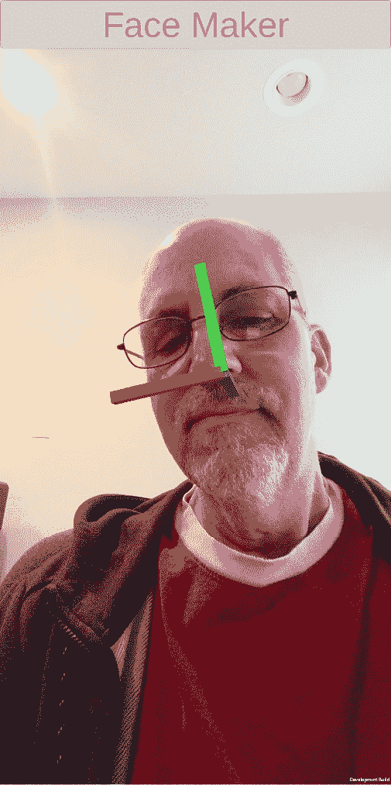
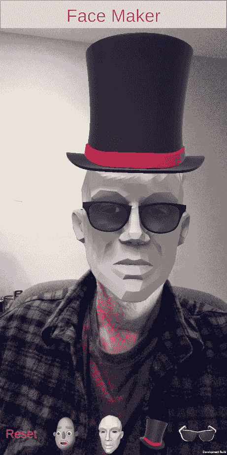
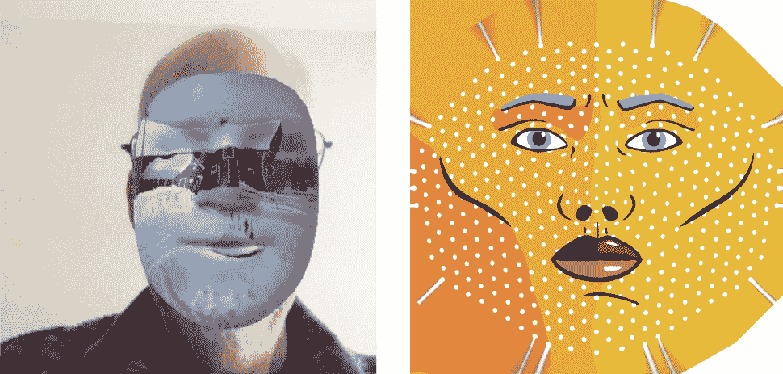
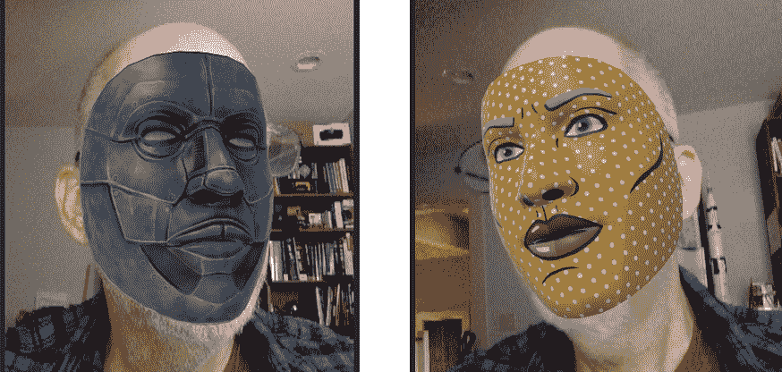
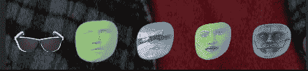
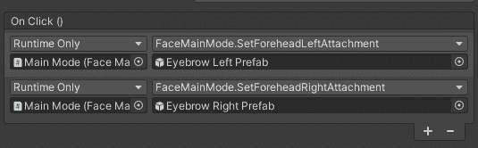
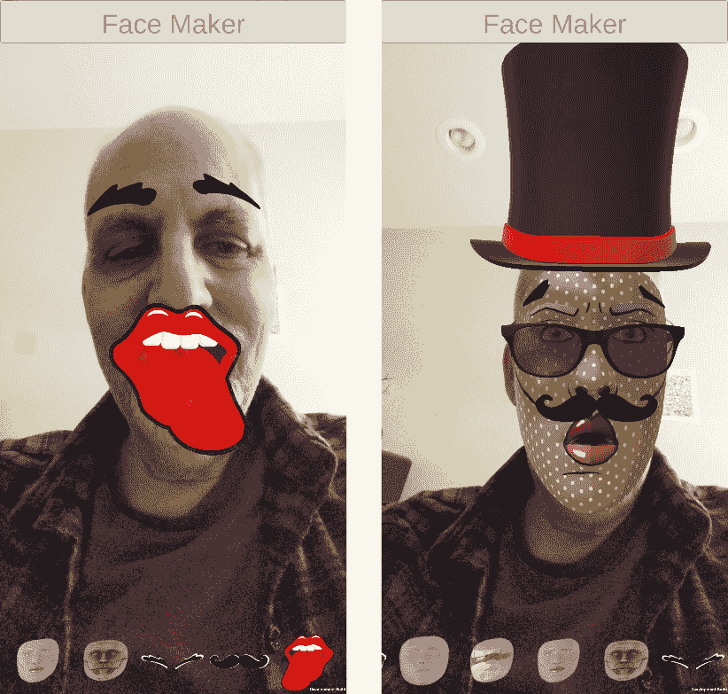
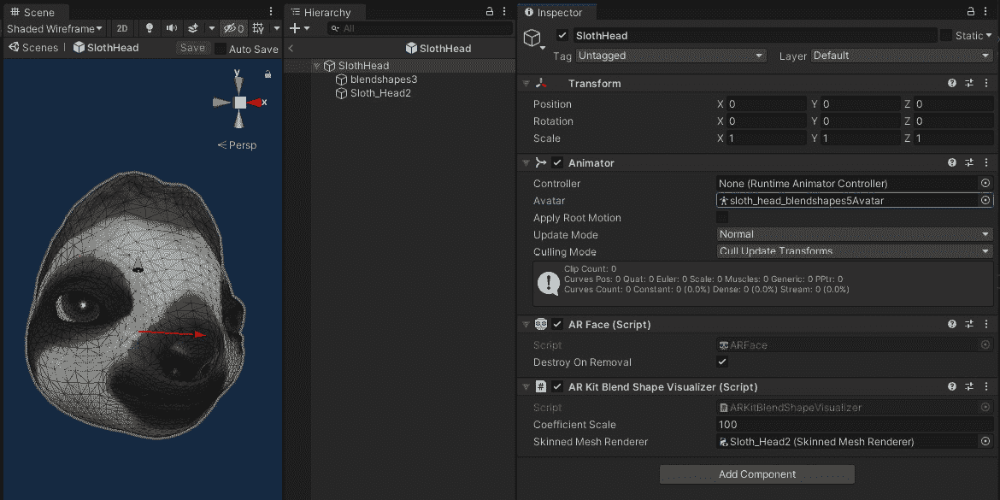

# 第九章：*第九章*：自拍：制作搞笑的面孔

在本章中，您将学习如何使用 Unity AR Foundation 进行面部追踪，以便制作有趣且娱乐性的面部滤镜。我提前为在这章中展示我英俊的面孔道歉——当与自拍一起工作时，这是必要的恶行！

我们将从面部追踪的工作原理的简要说明开始，然后我们将创建一个启用面部追踪的新 AR 场景。我们将使用几个 3D 头部模型，这些模型可以追踪您的头部姿态，并且您可以添加额外的配件，如帽子和太阳镜。我们将构建一个主菜单，以便用户可以在运行时选择和更改模型。然后我们将处理动态面部网格，并创建几个材料，以便轻松地在它们之间切换。在最后一部分，我们将探讨更高级的功能，如眼动追踪、面部区域（ARCore）和混合形状（ARKit）。

我们将涵盖以下主题：

+   理解面部追踪

+   配置新的 AR 场景进行面部追踪

+   使用 3D 模型和配件追踪面部姿态

+   控制应用程序的主模式并构建主菜单

+   使用各种材料制作动态面部网格

+   使用眼动追踪（ARKit）

+   将贴纸附加到面部区域（ARCore）

+   追踪表情丰富的面部混合形状（ARKit）

到本章结束时，您将熟悉 AR Foundation、ARCore 和 ARKit 中许多面部追踪功能。您还将拥有一个可以展示给朋友的*面部制作器*项目！

# 技术要求

要实现本章中的项目，您需要在您的开发计算机上安装 Unity，并将其连接到支持增强现实应用程序的移动设备（有关说明，请参阅*第一章*，*为 AR 开发设置*）。我们还假设您已安装`ARFramework`模板及其先决条件（请参阅*第五章*，*使用 AR 用户框架*）。完成的项目可以在本书的 GitHub 存储库中找到，网址如下：[`github.com/PacktPublishing/Augmented-Reality-with-Unity-AR-Foundation`](https://github.com/PacktPublishing/Augmented-Reality-with-Unity-AR-Foundation)。

# 理解面部追踪

让我们从面部追踪及其工作原理的背景知识开始。面部追踪是一种增强现实技术（通常）使用您的移动设备的正面摄像头。Snapchat、Instagram 和 Animoji 等应用程序普及了面部滤镜技术，现在它已成为移动设备上的主流。它为高度娱乐和创造性的体验提供了可能。该技术检测面部特征和表情，Unity AR Foundation 使您能够编写将 3D 对象附加到追踪到的特定面部特征的应用程序。

人脸追踪从您设备摄像头的视频帧开始。它分析像素，寻找代表人脸的图案——例如，鼻梁的像素比周围的像素亮，眼睛比额头暗。关键点和区域被识别并用于构建一个类似于面具的 3D 网格，代表人脸。网格的节点“锁定”在图像的关键点上，使得网格不仅能跟随人脸的姿态，还能跟随与人类面部表情相对应的详细变化，如微笑或眨眼。

要了解更多关于人脸追踪如何工作，我鼓励您观看由 Vox 制作的开创性视频（超过 300 万次观看）*Snapchat 的滤镜是如何工作的*，可在以下 URL 查看视频：[`www.youtube.com/watch?v=Pc2aJxnmzh0`](https://www.youtube.com/watch?v=Pc2aJxnmzh0)。

了解人脸追踪与人脸识别之间的区别，以及如何使用 AR Foundation 追踪人脸是有帮助的。

## 人脸追踪与人脸识别的区别

应该区分**人脸追踪**和**人脸识别**。通常，人脸追踪限于检测人脸和跟踪其姿态（位置和旋转）、面部特征，如额头和鼻子，以及代表表情的变化，如张嘴或眨眼。另一方面，人脸识别增加了识别使您的面孔独特且与其他面孔不同的特征。面部识别被用作指纹。面部识别技术的一个例子是用于解锁设备。更高级（且令人不安）的人脸识别越来越多地被威权政府和执法机构用于在人群中识别陌生人，使用的是大量的人脸数据库。

使用 Unity AR Foundation，您可以访问设备的人脸追踪功能。我们将接下来探讨这一点。

## 使用 AR Foundation 追踪人脸

如您现在所知，使用 AR Foundation 和 XR 插件的 Unity 项目将包含一个场景，该场景包括一个 **ARSession** 和一个 **ARSessionOrigin** 对象。将 AR Face Manager 组件添加到 AR Session Origin 中以启用人脸追踪。像大多数 AR Foundation 功能一样，此组件封装了 Unity AR 子系统，即 XR 面部子系统（见 `docs.unity3d.com/Packages/com.unity.xr.arsubsystems@4.2/api/UnityEngine.XR.ARSubsystems.XRFaceSubsystem.html`）。这反过来又与底层的 XR 插件接口，例如 ARCore 或 ARKit。

**AR 人脸管理器**组件引用您提供的脸预制件。此预制件将被实例化并跟踪检测到的人脸。如果需要应用程序支持同一摄像头视图中多个人（取决于底层设备的功能），组件还提供了一个**最大人脸数量**参数。组件在以下屏幕截图中显示：

![图 9.1 – AR 会话源对象上的 AR 人脸管理器组件]

![img/Figure_9.01_B15145.jpg]

图 9.1 – AR 会话源对象上的 AR 人脸管理器组件

人脸预制件应该有一个表示由 AR 设备检测到的人脸的**AR 人脸**组件。它具有包括人脸网格顶点、面法线和左右眼变换等属性。与其他 AR 可追踪对象一样，你的脚本可以订阅变化，以便知道何时添加、更新和删除人脸。具体可用的属性将取决于底层设备的功能。请参阅以下 URL 提供的文档：`docs.unity3d.com/Packages/com.unity.xr.arfoundation@4.2/api/UnityEngine.XR.ARFoundation.ARFace.html`。另外，请参阅以下 URL：`docs.unity3d.com/Packages/com.unity.xr.arsubsystems@4.2/api/UnityEngine.XR.ARSubsystems.XRFace.html`。

AR Foundation 提供了一个用于 AR 人脸跟踪（非识别）的接口，通过将 AR 人脸管理器组件添加到您的 AR 会话源对象。现在我们可以开始构建自拍人脸过滤器项目了。

# 入门

首先，我们将使用`ARFramework`场景模板创建一个名为`FaceMaker`的新场景。如果您针对 iOS ARKit，可能需要额外的设置，包括安装单独的 ARKit 人脸跟踪包。然后，我们在添加人脸跟踪到场景之前，将项目标题添加到 UI 中。

## 使用 ARFramework 模板创建新场景

使用以下步骤在你的 Unity AR 准备好的项目中创建一个新的场景：

1.  选择**文件** | **新建场景**。

1.  在**新建场景**对话框中，选择**ARFramework**模板。

1.  点击**创建**。

1.  在您的项目`Assets`文件夹中的`Scenes/`文件夹中，将其命名为`FaceMaker`，然后点击**保存**。

新的 AR 场景已经从模板中包含了以下设置：

+   **AR 会话**游戏对象，其中包含 AR 会话组件。

+   **AR 会话源**装置，其中包含 AR 会话源组件和其他组件，以及一个子主摄像头。我们将用 AR 人脸管理器组件替换其 AR 平面管理器组件。

+   **UI Canvas**是一个屏幕空间画布，包含我们为**ARFramework**构建的子面板**Startup UI**、**Scan UI**、**Main UI**和**NonAR UI**，它包含我们编写的 UI 控制器组件脚本。我们将使用项目特定的 UI 更新它。

+   **Interaction Controller**是我们为**ARFramework**构建的游戏对象，包含我们编写的交互控制器组件脚本，帮助应用在启动、扫描、主和非 AR 模式之间切换交互模式。它还包含配置了之前创建的**AR Input Actions**资产的**Player Input**组件。我们将为我们的面部追踪应用定制主模式。

+   **OnboardingUX**是来自 AR Foundation Demos 项目的预制件，提供 AR 会话状态消息和动画引导图形提示。

让我们从设置应用标题开始，如下所示：

1.  在**层次结构**中，展开**UI Canvas**对象，然后展开其子对象**App Title Panel**。

1.  选择**Title Text**对象。

1.  在其`Face Maker`中。

如果您针对 iOS 上的 ARKit，可能需要额外的项目设置。

## 设置 iOS ARKit 以进行面部追踪

要使用 ARKit 在 iOS 设备上开发和使用面部追踪的项目，您还需要通过包管理器安装 ARKit Face Tracking 包。执行以下步骤：

1.  使用**Window** | **Package Manager**打开包管理器。

1.  在左上角的**包**过滤器选择中，选择**Unity Registry**。

1.  使用右上角的搜索字段搜索`ar`，并从包列表中选择**ARKit Face Tracking**包。

1.  在窗口的右下角点击**Install**。

然后，按照以下步骤配置 ARKit XR Plugin 以进行面部追踪：

1.  使用**Edit** | **Project Settings**打开**Project Settings**窗口。

1.  在左侧的选项卡菜单中，选择**XR Plug-in Management** | **ARKit**。

1.  选择**Face Tracking**复选框。

接下来，我们将收集一些在本章中将要使用的资产。其中一些也包含在本书的 GitHub 仓库中。其他是一些第三方资产，您必须单独下载并导入。

## 导入项目中使用的资产

首先，您应该已经在项目中拥有*AR Foundation Samples*资产（我们在*第一章*，*为 AR 开发设置*）中导入的资产。如果您跟随着步骤操作，这些资产位于`Assets/ARF-samples/`文件夹中。它包含一些有用的示例资产，我们将在本章中使用并参考，这些资产可以为您提供关于 AR Foundation 面部追踪功能的额外见解，以及如何使用这些功能。

我们还将使用来自 Unity 的 *AR Face Assets* 包中的资产（可在资产商店中找到）。这些资产也用于 Unity Learn 教程，*使用 AR Foundation 进行 AR 面部追踪* ([`learn.unity.com/project/ar-face-tracking-with-ar-foundations`](https://learn.unity.com/project/ar-face-tracking-with-ar-foundations))。要导入包，请按照以下步骤操作：

1.  使用你的网络浏览器，访问以下网址：[`assetstore.unity.com/packages/essentials/asset-packs/ar-face-assets-184187`](https://assetstore.unity.com/packages/essentials/asset-packs/ar-face-assets-184187)。

1.  点击 **添加到我的资产**（如有必要），然后点击 **在 Unity 中打开**。

1.  在 Unity 中，这应该会打开 **包管理器** 窗口（或选择 **窗口** | **包管理器**）。

1.  从左上角的 **包** 过滤器中选择 **我的资产**。

1.  找到 **AR Face Assets** 包，点击 **下载** 和/或 **导入**（右下角）。在 **导入 Unity 包** 窗口中，点击 **导入** 按钮。

1.  通过选择 **编辑** | **渲染管线** | **通用渲染管线** | **升级项目材质到 URP 材质**，将导入的材质转换为通用渲染管线。

*面部配件 3D 模型*：我在这个项目中找到了一些免费的 3D 模型。你也可以使用它们或替换成你自己的。如果你想使用它们，它们包含在以下 GitHub 仓库中：

+   太阳镜：[`free3d.com/3d-model/sunglasses-v1--803862.html`](https://free3d.com/3d-model/sunglasses-v1--803862.html)。OBJ 格式（由 *printable_models* 提交，[`free3d.com/user/printable_models`](https://free3d.com/user/printable_models)）

+   高顶帽：[`free3d.com/3d-model/cartola-278168.html.`](https://free3d.com/3d-model/cartola-278168.html.) FBX 格式（由 *zotgames* 提交，[`free3d.com/user/zotgames`](https://free3d.com/user/zotgames)）

如果你自行下载，请解压并将文件拖入项目文件夹的 `Assets/` 中。我们将在本章后面讨论导入设置和步骤。

*面部贴纸 2D 精灵图像*：对于基于 ARCore 的面部区域贴纸，我在 Creative Commons 找到了一些免费的剪贴画。你也可以使用它们或替换成你自己的。如果你想使用它们，它们包含在以下 GitHub 仓库中：

+   眉毛：[`clipground.com/images/angry-eyebrows-clipart-11.png`](https://clipground.com/images/angry-eyebrows-clipart-11.png)

+   胡须：[`clipground.com/images/monocle-clipart-12.jpg`](https://clipground.com/images/monocle-clipart-12.jpg)

+   嘴唇舔舐：[`clipground.com/images/licking-lips-clipart-12.jpg`](https://clipground.com/images/licking-lips-clipart-12.jpg)

我使用 Photoshop 将这些图像的背景调整为透明，画布形状为方形，并缩放到 512x512 像素。这些图像被导入为 **纹理类型：精灵（2D 和 UI）**。

对于上述所有资产，我还创建了我们将用于 UI 的按钮图标。这些图标也位于 GitHub 仓库的`icons/`文件夹中，并作为**纹理类型：精灵（2D 和 UI）**导入。

现在我们已经创建了基本场景，并将必需的资产导入到项目中。我们创建新场景时使用了为本书创建的`ARFramework`场景模板，并更新了此项目的 UI 标题文本。如果您在 iOS 上工作，我们还向项目中安装了额外的必需包。然后，我们导入了我们将要使用的其他图形资产，包括 Unity 提供的 demo AR Face Assets 包。现在，让我们为人脸跟踪配置场景。

# 为人脸跟踪配置新的 AR 场景

配置基于 AR Foundation 的场景进行人脸跟踪需要几个简单的步骤。由于我们将进行自拍，我们将设置 AR 相机使用前置摄像头的输入。然后，我们将向 AR Session Origin 添加一个 AR Face Manager 组件。如果您想使用 Unity Onboarding UX 动画图形来提示用户，您可以为此修改`ScanMode`脚本。

让我们开始吧！

## 设置 AR 相机用于自拍

使用以下步骤设置 AR 相机用于自拍：

1.  在**层次结构**中展开**AR Session Origin**游戏对象，并选择其子对象**Main Camera**。

1.  在**检查器**中，将**AR Camera Manager** | **面向方向**设置为**用户**。

1.  我们还需要将 AR Session 跟踪模式设置为仅旋转。在**层次结构**中选择**AR Session**游戏对象。

1.  在**检查器**中，将**AR Session** | **跟踪模式**设置为**仅旋转**。

接下来，我们将把 AR Face Manager 组件添加到 AR Session Origin 中。

## 添加 AR Face Manager 组件

使用`ARFramework`模板提供的场景，我们将用**AR Face Manager**组件替换给定的 AR 可跟踪组件。对于**Face Prefab**，我们将从 AR Samples 项目中的**TriAxes**预制件开始。如果您检查这个预制件，您会发现它有一个**AR Face**组件，因此它可以作为可跟踪对象使用。

要配置**AR Session**以跟踪人脸，请按照以下步骤操作：

1.  在**层次结构**窗口中，选择**AR Session Origin**游戏对象。

1.  在**检查器**窗口中，在**AR Plane Manager**组件上使用*三点上下文菜单*（或*右键点击*），然后选择**移除组件**。

1.  使用 `AR`，并添加一个**AR Face Manager**组件。

1.  在您的`Assets/ARF-samples/Prefabs/`文件夹中），将其拖动到**检查器**中，并将其放置在**AR Face Manager** | **Face Prefab**槽中。

1.  使用**文件** | **保存**保存场景。

场景现在基本上已经为人脸跟踪设置好了。`ARFamework`包括一个提示用户使用相机寻找可跟踪对象的扫描模式。我们现在可以为此配置人脸跟踪。

## 提示用户寻找人脸，或是不寻找

可选地，你可以让应用提示用户扫描人脸。当使用自拍相机（**面向方向**设置为**用户**）时，这不太必要，因为当你拿着手机看屏幕时，相机正对着你！但如果你的应用使用面向世界的相机，可能需要使用指导提示告诉用户找到人脸。

要跳过扫描模式和其指导提示，告诉启动模式直接进入主模式，使用以下步骤：

1.  在**层次结构**中，在**Interaction Controller**游戏对象下，选择**Startup Mode**对象。

1.  在`Main`中，将**Next Mode**属性设置为**Next Mode**。

否则，如果你想使用扫描模式，你需要编写一个如下的`FaceScanMode`脚本：

1.  在你的`Scripts/`文件夹中，*右键点击*并选择`FaceScanMode`。

1.  打开脚本进行编辑，并替换其内容如下：

    ```cs
    using UnityEngine;
    using UnityEngine.XR.ARFoundation;
    public class FaceScanMode : MonoBehaviour
    {
        [SerializeField] ARFaceManager faceManager;
        private void OnEnable()
        {
            UIController.ShowUI("Scan");
        }
        void Update()
        {
            if (faceManager.trackables.count > 0)
            {
                InteractionController.EnableMode("Main");
            }
        }
    }
    ```

    脚本显示`Update`，等待检测到人脸后再将应用切换到主模式。

1.  在 Unity 中，在**层次结构**窗口中，选择**Scan Mode**对象（在**Interaction Controller**下）。

1.  使用三点上下文菜单删除旧的**Scan Mode**组件，然后选择**移除组件**。

1.  将新的`FaceScanMode`脚本拖到**Scan Mode**游戏对象上，添加为组件。

1.  将**AR Session Origin**游戏对象从**层次结构**拖到**Face Scan Mode** | **Face Manager**槽中。

1.  在**层次结构**中，导航并选择**UI Canvas** | **Scan UI** | **Animated Prompt**。

1.  在**检查器**中，将**Instruction**属性设置为**Find A Face**。

使用这个后置设置，应用以启动模式开始。在 AR 会话运行后，它进入扫描模式，提示用户找到人脸。一旦检测到人脸，应用进入主模式（目前，这什么也不做）。你也可以选择通过告诉启动模式直接进入主模式来完全跳过扫描模式提示。

让我们确保到目前为止一切正常。你现在可以尝试运行场景。

## 构建并运行

让我们在你的设备上进行**构建和运行**，以确保项目设置正确。使用以下步骤：

1.  使用**文件** | **保存**保存你的工作。

1.  选择**文件** | **构建设置**以打开**构建设置**窗口。

1.  点击`FaceMaker`场景到**构建中的场景**，并确保它是列表中唯一带有勾选标记的场景。

1.  确保你的目标设备已连接到 USB 端口并准备就绪。

1.  点击**构建和运行**来构建项目。

在下面的屏幕截图上，你可以看到人脸姿态是通过**TriAxes**预制件可视化的。我已经稍微倾斜了头部，以便更明显地看到三个轴。



图 9.2 – 使用 TriAxes 预制件可视化跟踪人脸姿态

注意每个轴的方向。轴的颜色为红色、绿色和蓝色，分别对应 X、Y 和 Z。正 Z 方向是设备相机面对的方向，因此，指向我的背部。

现在我们已经运行了面部追踪，让我们用更有趣的东西替换这个**TriAxes**预制件——一个完整的 3D 头模型。

# 使用 3D 头部追踪面部姿态

在本章顶部导入的 Unity AR Face Assets 包中包含了一些 3D 头模型，我们可以在我们的项目中使用。我们将为每个模型创建预制件，并在 AR Face Manager 的**Face Prefab**属性中分别尝试它们。在下一节中，我们将创建一个菜单，以便用户可以在运行时选择查看哪个头。

## 制作 Mr. Plastic Head 预制件

第一个头部预制件将使用 Unity AR Face Assets 包中提供的 Plasticscene Head 资产，位于`Assets/AR face Assets/3D Head/Plasticene Head/`文件夹中。此文件夹包含一个名为`Plasto_Head`的 FBX 模型和一个名为`PlasiceneHead`的材质（错误是他们的）。在用作面部预制件之前，该模型需要一些变换调整。要为该模型创建预制件，请按照以下步骤操作：

1.  在`Prefabs/`文件夹中（如果需要，请先创建一个）并选择`MrPlasticHead`。

1.  点击**打开预制件**开始编辑。

1.  在选择根对象后，在**检查器**中点击**添加组件**。然后，搜索并选择**AR Face**来添加一个**AR Face**组件。

1.  从`Plastic_Head`模型到**层次结构**，并将其作为**MrPlasticHead**的子对象拖放。

1.  选择`180`，使其面向相机。

1.  设置`0.6, 0.6, 0.6`。然后设置`-0.2`。我通过试错和使用测量立方体（见插图*提示*）选择了这些变换设置。

1.  如果默认材质（转换为 URP）看起来太暗，请选择子对象**Plaso_Head/Plasto_Head**，然后在**检查器**中，在**Plasticene Head**材质下，将**基础贴图**颜色设置为白色（从中间灰色）。

1.  保存预制件并退出回到场景`0, 0, 0`)，`0, 0, 0`)，和`0.125, 0.125, 0.125`）。这可以帮助你决定你使用的其他导入模型的变换参数。

让我们看看这看起来怎么样。将预制件添加到**AR Face Manager**，并按照以下步骤构建项目：

1.  在**层次结构**窗口中，选择**AR Session Origin**游戏对象。

1.  从**项目**窗口，将**MrPlasticHead**预制件拖放到**检查器**中，将其拖放到**AR Face Manager** | **Face Prefab**槽中。

1.  使用**文件** | **保存**来保存场景。

1.  使用`PlasticeneHead`材质构建项目，该材质为**基础**（反照率）、**法线**和**遮挡**图使用了三种纹理。**基础**纹理提供了反照率着色，就像网格的表面被这些像素涂上一样。法线图（也称为凹凸图或高度图）允许着色器以比网格几何本身给出的更详细的方式改变数学表面法线向量，模拟出在光照下特别明显的表面纹理。最后，**遮挡**图通过加深表面纹理中的凹槽，提供额外的真实感，创造出类似于现实材料中的更高对比度。对于更详细的解释，从**法线**图开始，请参阅以下网址：[`docs.unity3d.com/Manual/StandardShaderMaterialParameterNormalMap.html`](https://docs.unity3d.com/Manual/StandardShaderMaterialParameterNormalMap.html)。

下面显示了我使用 Mr. Plastic Head 头部的屏幕截图，以及我们将要使用的 Mr. Facet Head 模型：

![Figure 9.3 – 屏幕截图：我使用 MrPlasticHead（右）和 MrFacetHead（左）]

](img/Figure_9.03_B15145.jpg)

Figure 9.3 – 屏幕截图：我使用 MrPlasticHead（右）和 MrFacetHead（左）

让我们制作**MrFacetHead**预制体。

## 制作 Mr. Facet Head 预制体

AR Face Assets 包中提供了一个第二个模型，Faceted Head，位于`Assets/AR face Assets/3D Head/Faceted Head/`文件夹中。此文件夹包含一个名为`FacetedHead`的 FBX 模型和一个也命名为`FacetedHead`的材质。与之前一样，该模型需要一些变换调整才能用作面部预制体。要为该模型创建预制体，请按照以下步骤操作：

1.  在`Prefabs/`文件夹中，选择`MrFacetHead`。

1.  点击**打开预制体**开始编辑。

1.  在选择根对象后，在**检查器**中，点击**添加组件**。然后，搜索并选择**AR Face**以添加**AR Face**组件。

1.  从`FacetedHead`模型到**层次**，并将其作为**MrFacetHead**的子对象放下。

1.  将`-90`调整到面向摄像机的位置。设置`1.1, 1.1, 1.1`）。

1.  如果默认材质（转换为 URP）看起来太暗，选择**FacetedHead**对象，并在其**检查器**下的**FacetedHead**材质中，将**基础图**颜色设置为白色。

1.  保存预制体，并使用窗口左上角的**<**按钮返回到场景**层次**窗口。

1.  在**层次**窗口中，选择**AR 会话原点**游戏对象。

1.  从**项目**窗口，将**MrFacetHead**预制体拖到**检查器**中，将其放置在**AR Face Manager** | **Face Prefab**槽中。

1.  使用**文件** | **保存**保存场景。

1.  使用**文件** | **构建并运行**构建项目。

当它运行时，你现在有一个 Mr. Faceted Head 头，如图所示（是的，那些是我的真实眼睛透过面具看出去的）。

在本节中，我们创建了两个 prefab，**MrPlasticHead** 和 **MrFacetHead**，使用我们之前导入的 Unity *AR Face Assets* 包中的资产。每个这些 prefab 都在其根 GameObject 上有一个 AR Foundation **AR Face** 组件，并为两个头部导入不同的模型。我们尝试在我们的应用中使用其中一个，通过将其添加到 **AR Face Manager** 组件并运行场景来测试。

如果用户可以在运行时选择头部，而不是手动设置 AR Face Manager 并重新构建项目，那岂不是很好？接下来，让我们创建一个主菜单和一个可从菜单按钮控制的可变脸 prefab。

# 构建 Main 模式和菜单

在本节中，我们将设置主模式应用以处理用户交互，包括从主菜单中选择面部滤镜。为此，我们首先需要创建一个可变脸 prefab，可以指定要显示哪些面部特征。我们将编写一个 `FaceMainMode` 脚本，显示主 UI 面板并将用户的更改请求传递给面部对象。然后，我们将制作一个带有水平滚动按钮的主菜单，用户可以点击这些按钮来更改面部滤镜。

## 创建可变脸 prefab

要创建一个在运行时可以动态更改滤镜的 face prefab，我们将从一个带有 AR Face 组件的空游戏对象开始，并添加一个用于设置包含的 prefab 对象的脚本。按照以下步骤操作：

1.  在 `Prefabs/` 文件夹中并选择 `Changeable Face Prefab`。

1.  点击 **打开 Prefab** 以开始编辑。

1.  选择根对象后，在 **Inspector** 中点击 **添加组件**。搜索并选择 **AR Face** 以添加 **AR Face** 组件。

1.  在你的 `Scripts/` 文件夹中，*右键点击* 并选择 `ChangeableFace`。

1.  打开脚本进行编辑，并按照以下内容替换其内容：

    ```cs
    using System.Collections.Generic;
    using UnityEngine;
    using UnityEngine.XR.ARFoundation;
    public class ChangeableFace : MonoBehaviour
    {
        GameObject currentPosePrefab;
        GameObject poseObj;
        public void SetPosePrefab(GameObject prefab)
        {
            if (prefab == currentPosePrefab)
                return;
            if (poseObj != null) 
                Destroy(poseObj);
           currentPosePrefab = prefab;
           if (prefab != null)
                poseObj = Instantiate(prefab, transform,                false);
        }
    }
    ```

    该脚本公开了一个 `SetPosePrefab` 公共函数，该函数将 `prefab` 参数实例化为当前对象的子对象。如果请求的 prefab 已经实例化，则忽略请求。如果有之前实例化的对象，它首先被销毁。该函数可以用 `prefab` 参数的 null 值调用，这将仅清除现有的实例化对象。

1.  保存脚本，然后在 Unity 中，将 `ChangeableFace` 脚本拖放到 **Changeable Face Prefab** 根对象上。

1.  保存 prefab 并使用窗口左上角的 **<** 按钮退出回到场景层次结构。

1.  在 **Hierarchy** 中选择 **AR Session Origin** 对象。从 **Project** 窗口，将 **Changeable Face Prefab** 拖入 **Inspector**，并将其放置在 **AR Face Manager** | **Face Prefab** 槽中。

现在我们有了 `ChangeableFace` 脚本。我们计划在主模式中响应用户按钮点击时调用其 `SetPosePrefab` 函数。我们现在应该设置主模式。

## 编写主模式控制器脚本

在我们的 ARFramework 模板中，交互模式通过交互控制器下的游戏对象表示，并在启用特定模式时激活。模板中的默认`MainMode`脚本只是一个占位符。我们现在应该用这个项目的自定义脚本替换它。为此，请按照以下步骤操作：

1.  在`FaceMainMode`。

1.  在**层次结构**中，选择**主模式**游戏对象（位于**交互控制器**下）。

1.  在**检查器**中，使用三点菜单移除默认的**主模式**组件，然后点击**移除组件**。

1.  将新的`FaceMainMode`脚本拖放到**主模式**对象上，添加为组件。

1.  打开`FaceMainMode`脚本进行编辑，并按照以下步骤启动：

    ```cs
    using UnityEngine;
    using UnityEngine.XR.ARFoundation;
    public class FaceMainMode : MonoBehaviour
    {
        [SerializeField] ARFaceManager faceManager;
        void OnEnable()
        {
            UIController.ShowUI("Main");
        }
        public void ChangePosePrefab(GameObject prefab)
        {
            foreach (ARFace face in faceManager.trackables)
            {
                ChangeableFace changeable =                 face.GetComponent<ChangeableFace>();
                if (changeable != null)
                {
                    changeable.SetPosePrefab(prefab);
                }
            }
        }
    }
    ```

当主模式启用时，它显示主 UI 面板。这将包含主菜单按钮。当点击菜单按钮并调用`ChangePosePrefab`时，它将依次调用场景中任何可跟踪人脸的`SetPosePrefab`。

让我们创建菜单 UI。

## 创建可滚动的主菜单按钮

在我们的用户框架中，一个模式的 UI 面板将通过相应的交互模式启用。现在，我们将添加一个水平滚动的菜单到主 UI 面板，其中包含可以更改跟踪人脸的按钮。请按照以下步骤操作：

1.  在`MainMenu Panel`。

1.  在**检查器**中，使用**锚点预设**选项（位于**矩形变换**的右上角）设置**底部拉伸**，然后使用*Shift + Alt + 左键点击底部拉伸*。

1.  设置`150`。

1.  使用三点菜单移除其**图像**组件，然后**移除组件**（我们不会在这个菜单上使用背景）。

1.  在**层次结构**中，*右键点击***MainMenu Panel**，然后选择**UI** | **滚动视图**。

1.  使用**锚点预设**点击**拉伸-拉伸**选项，然后使用*Shift + Alt + 左键点击拉伸-拉伸*。

1.  移除**图像**组件。

1.  在**滚动矩形**组件中，取消勾选**垂直**。

1.  删除**水平滚动条**和**垂直滚动条**字段的内容，并在层次结构中禁用（或删除）**滚动条水平**和**滚动条垂直**游戏对象。

1.  在**层次结构**中，展开子**视口**游戏对象，并选择子**内容**游戏对象。

1.  点击**添加组件**，然后搜索并选择**水平布局组**。

1.  取消勾选所有复选框，包括**子强制扩展** | **宽度**和**高度**。

1.  设置`5`。

1.  点击**添加组件**，然后搜索并选择**内容大小适配器**。

1.  将**水平适配**设置为**首选大小**。

现在，我们在**主 UI**下有一个**MainMenu Panel**。它包含一个水平滚动的内容区域，如下面的 UI 层次结构截图所示，其中选择了**内容**对象：

![图 9.4 – 显示内容检查器的主 UI 层次结构]

![img/Figure_9.04_B15145.jpg]

图 9.4 – 显示内容检查器的主 UI 层次结构

现在我们可以向**内容**容器添加按钮。目前，我们将创建两个按钮，用于两个头部。稍后，我们将通过更多选项来扩展它。每个按钮将显示一个图像图标（如果您没有自己内容的图标，可以使用文本标签）：

1.  在`PlasticHead Button`。

1.  设置其`150, 150`）。

1.  删除其子**文本**对象（除非您没有为该按钮的图标图像）。

1.  从`plastichead icon`图像资产（可能位于您的`/icons`文件夹中）到**图像** | **源图像**槽位。

1.  在**检查器**中，点击**按钮**组件**On Click**区域右下角的**+**按钮。

1.  从**层次结构**中，将**主模式**对象（在**交互控制器**下），拖到**检查器**中，并将其放到**On Click Object**槽位。

1.  在**功能**选择列表中，选择**FaceMainMode** | **ChangePosePrefab**。

1.  从`Prefabs/`文件夹)到下面的空参数槽位，如图下所示：


图 9.5 – PlasticHead 按钮的 On Click 动作会将 MrPlasticHead 预制体传递给 FaceMainMode.ChangePosePrefab 函数

小贴士：创建按钮图标

为了创建本章中使用的许多按钮图标，我有时会先制作实际游戏对象的屏幕截图。然后，在 Photoshop 中，通过选择其边缘（使用魔棒工具）来隔离形状，并制作一个带有透明背景的剪影。然后，我在一个方形画布上裁剪图像，并将其调整大小为 256x256，然后将其导出为 PNG 文件。然后，在 Unity 中导入图像，并在**导入设置**中，将**纹理类型**设置为**精灵（2D 或 UI**），然后点击**应用**。现在，该资产可以作为 UI 精灵在图像组件中使用，如按钮对象上的那些。

现在我们在**主菜单**中有一个按钮。这是用于选择 MrPlasticHead 模型的。让我们再创建一个按钮，用于 MrFacetHead 预制体。为此，我们可以复制并修改第一个按钮，如下所示：

1.  在**层次结构**中，选择**PlasticHead 按钮**游戏对象。

1.  从主菜单，选择`FacetHead Button`。

1.  从`facethead icon`资产到**图像** | **源图像**槽位。

1.  从`Prefabs/`文件夹)到参数槽位（替换已存在的**MrPlasticHead**预制体）。

**主菜单**现在有两个按钮。当应用运行时，点击其中一个将在我脸上显示**MrPlasticHead**。点击另一个将显示**MrFacetHead**。提供重置按钮以清除所有面部过滤器也会很好。

## 添加重置面部按钮

我们还可以添加一个重置按钮，将当前姿势对象设置为 null。让我们在`FaceMainMode`脚本中作为一个单独的函数来做这件事。使用以下步骤：

1.  打开`FaceMainMode`脚本进行编辑，并添加一个`ResetFace`函数：

    ```cs
        public void ResetFace()
        {
            foreach (ARFace face in faceManager.trackables)
            {
                ChangeableFace changeable =                 face.GetComponent<ChangeableFace>();
                if (changeable != null)
                {
                    changeable.SetPosePrefab(null);
                }
            }
        }
    ```

1.  在 Unity 中，在`Reset Button`下。

1.  设置其`150, 150`）。移除其**图像**组件。

1.  在其子`Reset`上，勾选**自动大小**复选框，如果你想的话，更改文本**顶点颜色**。

1.  点击**点击**列表中的**+**按钮，将**主模式**对象拖放到**对象**槽中，并从**函数**列表中选择**FaceMainMode** | **ResetFace**。

我的菜单，在屏幕底部，现在看起来是这样的，有三个按钮：


图 9.6 – 带有三个按钮的主菜单

你现在可以构建并运行项目了。保存你的工作（**文件** | **保存**）并构建它（**文件** | **构建和运行**）。你现在有一个小小的 Face Maker 应用，它允许你选择 3D 头像或**重置场景**！

在本节中，我们创建了一个**可更换的面部预制件**，你可以在运行时设置其子预制件，以便用户可以为他们的自拍选择不同的头像模型。然后我们创建了一个**主菜单**面板，其中包含水平可滚动的按钮，并添加了允许用户选择**MrPlasticHead**、**MrFacetHead**或重置当前模型的按钮。

接下来，让我们给你的脸添加一些 3D 配饰——太阳镜和帽子。

# 添加 3D 配饰

假设你现在想给你的脸和头添加配饰。设置与我们所使用的姿势预制件非常相似。为此，我们将介绍一些从网络下载的第三方模型（并在本章顶部导入到你的项目中）。我们还将向**可更换的面部预制件**添加一个`AddAccessory`函数，允许用户一次查看多个配饰。

## 戴着帽子

我在网上找到了一个 3D 帽子（[`free3d.com/3d-model/cartola-278168.html`](https://free3d.com/3d-model/cartola-278168.html)），我们之前在本章中下载并安装了它。请随意使用此模型，或找到自己的模型添加到项目中。我将其安装在我的`Assets/Models/TopHat/`文件夹中。该模型是一个名为`CapCartola`的 FBX 文件。我们还需要配置其材质。

如果你选择**项目**窗口中的`CapCartola`模型并将其展开，你会注意到它有子**相机**和**灯光**对象。这对于从某些 3D 建模程序（例如 Blender）导出的模型来说并不罕见。显然，我们不需要这些对象在我们的场景中，所以我们将从导入的模型中移除它们。然后我们将提取并设置材质，然后将它们作为一个预制件组合在一起。按照以下步骤操作：

1.  在`CapCartola`模型（位于`Assets/Models/TopHat/`文件夹中）。

1.  在**检查器**中，你会看到**导入设置**。确保窗口顶部的**模型**选项卡被选中。

1.  取消选择**导入相机**和**导入灯光**复选框。然后点击**应用**。

1.  在**检查器**窗口的顶部选择**材质**选项卡。

1.  点击`Material.001`（用于帽子本身）和`Material.002`（用于其丝带带）。这些已经与模型关联。

1.  在`Prefabs/`文件夹中，选择`TopHat`。然后打开预制体进行编辑。

1.  从**项目**窗口，将**CapCartola**模型拖入**层次结构**中，在根**TopHat**对象下创建一个子实例。

1.  使用`(0, 0.18, -0.02)`，`(-20, 0, 0)`，和`0.077, 0.077, 0.077)`）。

1.  在**层次结构**中展开**CapCartola**，并选择其子**Cylinder**对象。

1.  在`#331D1D`下）。

1.  同样，在`#FF1919`下）。

1.  如果你将**AR Face**组件添加到根对象中，你可以立即通过将其用作**AR Face Manager** | **面部预制体**来测试它。

1.  **保存**预制体并退出场景层次结构。

现在，你有一个可以用来装饰你脸部的**TopHat**预制体。让我们也添加一副太阳镜。

## 摩登太阳镜

我在网上找到了一个 3D 太阳镜模型（[`free3d.com/3d-model/sunglasses-v1--803862.html`](https://free3d.com/3d-model/sunglasses-v1--803862.html)），我们之前在本章中已下载并安装。我将其安装在我的`Assets/Models/Sunglasses/`文件夹中。原始模型是一个名为`12983_Sunglasses_v2_l3`的 OBJ 文件。我们还需要配置其材质。

按以下步骤提取并设置材质，然后将模型组装成预制体：

1.  在`12983_Sunglasses_v2_l3`模型中选择它。

1.  在`sunglasses_body`和`sunglasses_lens`中。

1.  选择**sunglasses_body**材质并根据需要调整它。我将其设置为黑色。镜片材质可能已经是好的（深色且有透明度）。

1.  在`Prefabs/`文件夹中，选择`Sunglasses`。

1.  打开**太阳镜**预制体进行编辑。

1.  从**项目**窗口，将**12983_Sunglasses_v2_l3**模型拖入**层次结构**中，在根**Sunglasses**对象下创建一个子实例。

1.  使用`(-0.08, -0.025, -0.058)`，`(-90, 90, 09)`，和`0.0235, 0.0235, 0.0235)`）。

1.  如果你也在根对象中添加了**AR Face**组件，你可以立即通过将其用作**AR Face Manager** | **面部预制体**来测试它。

1.  保存预制体并退出场景层次结构。

现在我们有两个可以作为面部配饰使用的模型。你可以通过手动将其中一个添加到**AR 会话起源** | **AR 面部管理器** | **面部预制体**槽位，构建并运行项目来测试它们。完成后，别忘了将**可更换面部预制体**放回槽位。

接下来，我们将在脚本中添加对这些配饰的支持。

## 更新配饰脚本

我们需要更新`ChangeableFace`脚本以管理配饰对象。它将维护当前配饰对象的列表，确保我们只创建任何预制体的一个实例。

当从场景中移除一个配饰对象时，我们不会销毁它，而是将其禁用，如果用户再次添加相同的对象，我们再重新启用它。

我们还需要更新`FaceMainMode`脚本，添加一个菜单按钮可以调用的函数。这反过来会将请求的预制体传递给`ChangeableFace`。

按以下步骤更新你的脚本：

1.  首先，打开`ChangeableFace`脚本进行编辑，并在类的顶部添加以下声明：

    ```cs
        Dictionary<GameObject, GameObject> accessories =         new Dictionary<GameObject, GameObject>();
    ```

    我们使用字典来维护已实例化配件对象的列表，键为预制件。

1.  然后，添加以下`AddAccessory`函数：

    ```cs
        public void AddAccessory(GameObject prefab)
        {
            GameObject obj;
            if (accessories.TryGetValue(prefab, out obj) &&            obj.activeInHierarchy)
            {
                obj.SetActive(false);
                return;
            }
            else if (obj != null)
            {
                obj.SetActive(true);
            }
            else
            {
                obj = Instantiate(prefab, transform, false);
                accessories.Add(prefab, obj);
            }
        }
    ```

    `AddAccessory`将预制件实例化为脸部的子对象，并将其添加到`accessories`列表中。然而，如果预制件已经被实例化，我们将通过将其设置为非活动状态来从场景中移除它。同样，如果你再次尝试添加它，它将被重新激活。

1.  接下来，我们将添加一个`ResetAccessories`函数，用于移除所有配件，如下所示：

    ```cs
        public void ResetAccessories()
        {
            foreach (GameObject prefab in accessories.Keys)
            {
                accessories[prefab].SetActive(false);
            }
        }
    ```

    小贴士：通过使用对象缓存来避免垃圾回收

    在这个`AddAccessory`函数中，我本可以调用`Destroy`来移除现有的实例，然后在对象第二次添加时再次调用`Instantiate`。相反，我通过在不需要时简单地禁用现有对象并在需要时重用相同的实例来管理内存。在运行时重复实例化和销毁对象会导致内存碎片化，并需要 Unity 执行内存`Destroy`。

1.  接下来，我们可以打开`FaceMainMenu`脚本进行编辑，并添加一个将被菜单按钮调用的`AddAccessory`函数，如下所示：

    ```cs
        public void AddAccessory(GameObject prefab)
        {
            foreach (ARFace face in faceManager.trackables)
            {
                ChangeableFace changeable =                 face.GetComponent<ChangeableFace>();
                if (changeable != null)
                {
                    changeable.AddAccessory(prefab);
                }
            }
        }
    ```

1.  接下来，将以下突出显示的代码添加到`ResetFace`：

    ```cs
        public void ResetFace()
        {
            foreach (ARFace face in faceManager.trackables)
            {
                ChangeableFace changeable =                 face.GetComponent<ChangeableFace>();
                if (changeable != null)
                {
                    changeable.SetPosePrefab(null);
                    changeable.ResetAccessories();
                }
            }
        }
    ```

我们现在准备好为高顶礼帽和太阳镜配件添加菜单按钮。

## 在主菜单中添加配件

要向主菜单添加新按钮，我们可以复制一个现有的按钮，并按照以下步骤修改它：

1.  在`HatAccessory Button`上。

1.  从`tophat icon`资产拖放到**图像** | **源图像**槽位。

1.  在`FaceMainMode.AddAccessory`上。

1.  从`Prefabs/`文件夹拖放到参数槽位。

1.  同样，重复*步骤 1-4*为`SunglassesAcessory Button`，使用`sunglasses icon`图像和**太阳镜**预制件资产。

保存场景并构建项目。当你点击帽子按钮时，你将戴上高顶礼帽。再次点击以取下它。在下面的屏幕截图中，我戴着面罩、高顶礼帽和太阳镜。我从未看起来这么酷！




图 9.7 – 我戴着高顶礼帽、太阳镜和面罩的自拍

在本节中，我们通过添加其他要同时跟踪的模型来扩展了基本的面部姿态跟踪功能。我们使用从网络上下载的模型创建了高顶礼帽和太阳镜的预制件。然后，我们更新了`ChangeableFace`脚本以处理多个配件对象。通过避免相同预制件的重复实例并缓存生成的实例在字典列表中，我们实现了良好的内存管理实践。在将公共`AddAccessory`函数更新到`FaceMainMode`脚本后，我们在主菜单中添加了新的按钮，以便用户可以用帽子和/或太阳镜装饰他们的头部。

到目前为止，我们所有的面部都是固定表情的静态模型。AR Foundation 也支持面部的动态可视化。让我们尝试一下。

# 使用各种材料制作动态面部网格

要显示与你的真实表情匹配的增强现实面部，Unity AR Foundation 允许你在运行时动态生成面部网格。在这个网格上，你可以应用不同的材料，产生你戴着任意面部面具的效果。为了将此功能添加到我们的项目中，我们首先查看 AR Foundation 提供的默认面部游戏对象。然后我们将创建几个不同的材料来使用。为了将此功能集成到我们的项目中，我们将扩展 `ChangeableFace` 脚本来切换材料，向 `FaceMainMode` 脚本添加一个类似的功能来更新面部跟踪器，然后添加菜单按钮来切换材料。

## 探索 AR 默认面部

你可以从 Unity 菜单的 **GameObject** | **XR** | **AR Default Face** 创建一个用于 AR Foundation 的动态面部游戏对象。该对象包含一个 **AR Face Mesh Visualizer** 组件，该组件在运行时生成与你的面部表情匹配的面部网格，包括移动你的嘴巴和扬起你的眉毛。在我们将此功能添加到我们的 **Changeable Face Prefab** 之前，让我们快速尝试一下。使用以下步骤：

1.  从编辑器菜单栏中选择 **GameObject** | **XR** | **AR Default Face**。这将在场景层次结构中创建一个名为 **AR Default Face** 的对象。

    注意，你不会在场景窗口中看到这个对象，因为网格是在运行时动态生成的，所以还没有东西可以渲染。

1.  替换默认材料（包含的默认材料不适合 URP）：在 `Materials/` 文件夹中（如有必要，先创建一个），并将其命名为 `DefaultFace Material`。将 **基础贴图**颜色设置为你的喜欢的颜色。将材质拖动到 **AR Default Face** 对象上。

1.  使其成为一个预制件。将 `Prefabs/` 文件夹拖动。

1.  然后从 **Hierarchy** 中删除它。

1.  现在，将预制件拖动到你的 **AR 会话原点** | **AR 面部管理器** | **面部预制件**槽位。

这是一张我戴着默认面具、面带灿烂笑容的屏幕截图，在左边。右边是我的脸部网格在运行时生成的场景视图：

![图 9.8 – 我戴着 AR 默认面具（左）和我脸部网格的线框图（右）]

![img/Figure_9.08_B15145.jpg]

图 9.8 – 我戴着 AR 默认面具（左）和我脸部网格的线框图（右）

用其他材料替换这个默认材料很容易，以制作你自己的面具。

## 创建面部材料

为了好玩（以及教学目的），让我们尝试使用任意照片作为面部纹理。我将使用名为 `WinterBarn.jpg` 的图片（这也在 *第六章*，*图库：构建 AR 应用*）中使用，按照以下步骤创建一个新的材质：

1.  在你的 `Materials/` 文件夹中 *右键点击* 并选择 `PhotoFace Material`。

1.  将照片从`WinterBar.jpg`拖动到**基础地图**纹理芯片上。确保**基础地图**颜色为白色。

1.  复制`PhotoFace Prefab`。

1.  打开新的预制件进行编辑，并将**PhotoFace Material**拖动到上面。**保存**预制件并返回场景层次结构。

1.  要尝试它，将**PhotoFace Prefab**拖动到**AR Face Manager** | **Face Prefab**并运行场景。

这应该会给你一种感觉，即二维纹理图像是如何映射到面部网格上的。这被称为`PopFace_Albedo`面部网格：



图 9.9 – 普通二维图像作为面部纹理（左），以及 UV 映射的面部纹理（右）

这样，你可以使用任何你想要的二维照片或图像。尝试一些其他的，比如你的国旗，你最喜欢的运动队的标志等等。

前面图中显示的`PopFace_Albedo`纹理包含在 Unity 导入到我们项目中的 AR Face Assets 包中。现在通过重复*步骤 1-5*，命名为`PopFace Material`，并使用`PopFace_Albedo`作为**基础地图**纹理来制作材料。

同样，AR Face Assets 包还包括机器人面部的纹理。再次，为新的`RobotFace Material`重复*步骤 1-5*，使用`Robot_Albedo`作为`Robot_Normal`，使用`Robot_Occlusion`分别作为**法线图**和**遮挡图**。

当添加**法线图**纹理时，你可能会收到提示**此纹理未标记为法线图**。点击**立即修复**按钮以应用所需的**导入设置**。

以下图显示了戴着**RobotFace**和**PopFace**面具的我。在这些屏幕截图不太明显的是，面部网格会实时跟随我的面部表情：



图 9.10 – 使用机器人 PBR 材质（左）和 Pop 反照率纹理（右）的自拍

信息：使用 Procreate 绘制自己的纹理

如果你感兴趣自己绘制 UV 映射的面部纹理（并且拥有 iPad），Procreate 应用([`procreate.art/`](https://procreate.art/))具有此功能（查看[Dilmer Valecillos](https://youtu.be/FOxhcRzDLx8)关于此功能的视频）。

制作好材料后，我们可以将面部网格可视化器添加到可变面部预制件中，这样它将在运行时生成面部网格。

## 将面部网格可视化器添加到可变面部预制件

要将动态面部网格集成到我们的应用程序中，我们应该将其添加到我们的多功能**可变面部预制件**中。我们需要与之前生成的**AR 默认面部**游戏对象相同的组件，并且它们需要位于预制件的根对象上。使用以下步骤手动添加它们：

1.  打开**可变面部预制件**进行编辑。

1.  在选择预制体根对象后，在**检查器**中点击**添加组件**。

1.  搜索并选择**AR Face Mesh Visualizer**组件。

1.  搜索并选择一个**网格过滤器**组件。

1.  搜索并选择一个**网格渲染器**组件。

1.  将**默认面材质**从**项目**窗口拖动到**可变面预制体**根对象上。

1.  保存预制体。

1.  在场景层次结构中返回，将**可变面预制体**资产拖动到**AR 会话起源** | **AR 面管理器** | **面预制体**槽位。

如果你现在构建并运行，你会看到默认的面网格。所有菜单按钮仍然工作，让你添加 3D 头部模型和配件。

我们希望有按钮让用户在面材质之间进行选择。为此，我们需要更新我们的脚本。

## 控制面材质

我们可以通过切换**AR Face Mesh Visualizer**和**Mesh Render**组件来隐藏或显示面网格。使用以下步骤：

1.  打开`ChangeableFace`脚本进行编辑，并在脚本顶部添加以下内容：

    ```cs
    using UnityEngine.XR.ARFoundation;
    ```

1.  添加以下代码以声明和初始化对`ARFaceMeshVisualizer`和`MeshRenderer`组件的引用：

    ```cs
        ARFaceMeshVisualizer meshVisualizer;
        MeshRenderer renderer;
        private void Start()
        {
            meshVisualizer =            GetComponent<ARFaceMeshVisualizer>();
            meshVisualizer.enabled = false;
            renderer = GetComponent<MeshRenderer>();
            renderer.enabled = false;
        }
    ```

    我们将启动应用程序，使面网格不可见，因此两个组件都是禁用的。

1.  然后，添加一个`SetMeshMaterial`函数，如下所示：

    ```cs
        public void SetMeshMaterial(Material mat)
        {
            if (mat == null)
            {
                meshVisualizer.enabled = false;
                renderer.enabled = false;
                return;
            }
            renderer.material = mat;
            meshVisualizer.enabled = true;
            renderer.enabled = true;
        }
    ```

    当给定材质`mat`时，该函数将其设置在渲染器中，并确保可视化器和渲染器组件被启用。如果你为`mat`传递一个`null`值，那么组件将被禁用。

1.  接下来，打开`FaceMainMode`脚本并添加一个`ChangeMaterial`函数，如下所示：

    ```cs
        public void ChangeMaterial(Material mat)
        {
            foreach (ARFace face in faceManager.trackables)
            {
                ChangeableFace changeable =                 face.GetComponent<ChangeableFace>();
                if (changeable != null)
                {
                    changeable.SetMeshMaterial(mat);
                }
            }
        }
    ```

    就像脚本中的其他函数一样，它遍历任何可追踪项并调用可变组件。

1.  接下来，使用以下突出显示的行更新`ResetFace`函数：

    ```cs
                    changeable.SetPosePrefab(null);
                    changeable.ResetAccessories();
                    changeable.SetMeshMaterial(null);
    ```

代码现在已经编写完成。我们在`ChangeableFace`脚本中添加了一个`SetMaterial`函数，它启用了网格可视化器并将材质设置为渲染。在`FaceMainMode`脚本中，我们添加了一个`ChangeMaterial`函数，它对每个可追踪的 AR 面调用`SetMaterial`。

我们现在准备好添加各种网格材质的菜单按钮。

## 添加到主菜单的面材质

要添加新的按钮到主菜单，我们可以复制一个现有的按钮并修改它，就像我们之前做的那样。使用以下步骤：

1.  在`DefaultFace Button`。

1.  从`default face icon`资产拖动到**图像** | **源图像**槽位。

1.  在按钮的**点击**动作中，将**函数**更改为**FaceMainMode.ChangeMaterial**。

1.  从`Materials/`文件夹拖动到参数槽位。

1.  同样，重复*步骤 1-4*三次，对于`PhotoFace Button`（使用`photo face icon`图像，以及`PopFace Button`，和`RobotFace Button`。

保存场景并构建项目。当你点击其中一个面材质按钮时，它会渲染面网格。以下截图中显示了带有新按钮的水平滚动菜单：



图 9.11 – 主菜单上的面部网格纹理按钮

在本节中，我们添加了一个 `FaceMainMode`。然后它将这个模式转发到可追踪的面部。

虽然面部可视化器可以跟随一些你的表情，包括扬起眉毛和张开嘴巴，但它对你的眼睛没有任何作用。让我们接下来考虑眼动追踪。

# 使用眼动追踪（ARKit）

对于眼动追踪，正如你所预期的，你将获得每个眼睛的姿势变换，你可以使用这些变换来更新你自己的“眼球”游戏对象。对于这个功能，我会向你展示如何实现，但将集成到项目中的细节留给你。目前，这个功能需要一个带有 **TrueDepth** 相机的 iOS 设备。

要了解更多关于 AR Foundation 的眼动追踪信息，请查看 AR Foundation 示例资产中提供的 `EyeLasers` 场景（我们已将其安装到 `Assets/ARF-samples/` 文件夹中）。

场景中的 **AR Face Manager** 中的 **Face Prefab** 是 **AR Eye Laser Visualizer** 预制体。这有一个 **AR Face** 组件（正如你所期望的），还有一个 **Eye Pose Visualizer**。这个可视化脚本反过来又给了一个眼球预制体。在这个特定的场景中，它被赋予了 **Eye Laser Prefab**。这只是一个包含一个细长圆柱体的简单预制体，它将被渲染成激光束。总的来说，这些依赖关系可以表示如下：

EyeLasers 场景 -> AR Eye Laser Visualizer 面部预制体 -> Eye Pose Visualizer 脚本 -> Eye Laser Prefab

`EyePoseVisualizer` 脚本是一个示例脚本（本身不是 AR Foundation 包的一部分）。简而言之，你给它一个眼球预制体，该预制体被实例化两次，并由 `ARFace`、`leftEye` 和 `rightEye` 姿势变换作为父级。例如，你会在脚本的 `CreateEyeGameObjectsIfNecessary` 函数（第 45 行）中找到以下代码行：

```cs
m_LeftEyeGameObject = Instantiate(m_EyePrefab, m_Face.leftEye);
```

作为追踪眼变换的子对象，生成的对象似乎会自动跟踪你的检测到的眼动。

脚本还订阅了 `ARFace` 和 `update` 事件，根据可追踪对象的追踪状态切换眼睛的可见性，如下面的代码所示：

```cs
        void OnUpdated(ARFaceUpdatedEventArgs eventArgs)
        {
            CreateEyeGameObjectsIfNecessary();
            SetVisible((m_Face.trackingState ==                 TrackingState.Tracking) &&                     (ARSession.state > ARSessionState.Ready));
        }
```

小贴士：使用带有面部追踪的更新事件

这个脚本展示了使用 AR Foundation 进行面部追踪的另一个最佳实践。通过订阅可追踪对象的 `updated` 事件，它根据可追踪对象的 `trackingState` 以及整体的 `ARSession.state` 来切换实例化预制体的可见性。你可能考虑重构我们 `FaceMainMode` 类中的函数，以便以这种方式处理 `updated` 事件。

眼动追踪并非在所有平台上都可用。当脚本启用时，它首先检查 Unity 眼动追踪子系统。如果该功能不受支持，组件会自行禁用，如下面的 `OnEnable` 函数（第 65-78 行）所示：

```cs
        void OnEnable()
        {
            var faceManager =                FindObjectOfType<ARFaceManager>();
            if (faceManager != null && faceManager.subsystem !=            null && faceManager.descriptor.supportsEyeTracking)
            {
                m_FaceSubsystem =                     (XRFaceSubsystem)faceManager.subsystem;
                SetVisible((m_Face.trackingState ==                    TrackingState.Tracking) &&                     (ARSession.state > ARSessionState.Ready));
                m_Face.updated += OnUpdated;
            }
            else
            {
                enabled = false;
            }
        }
```

如果您想尝试使用眼球而不是激光束，以下 URL 包含一个您可以使用免费眼球 3D 模型：[`free3d.com/3d-model/eyeball--33237.html.`](https://free3d.com/3d-model/eyeball--33237.html.)将其制作成预制件，并用它替换 AR 眼激光可视化预制件上的**Eye Pose Visualizer** | **Eye Prefab**槽位。

这太棒了！然而，你可以做更多的事情。例如，使用 ARCore，你可以将图形附加到面部特定区域。现在让我们来看看这一点。

# 将贴纸附加到面部区域（ARCore）

如果您的项目正在使用 ARCore XR 插件和 Android，您将能够访问 ARCore 特定的功能，包括三个重要面部区域的变换：鼻尖、左额和右额。例如，如果您抬起左眉毛，该变换将独立于面部其余部分移动，为您的应用程序中的面部表情提供更多细节。

除了我们在这里做的事情之外，您还可能想查看项目中的`ARF-samples/`文件夹，以及它使用的`ARCoreFaceRegionManager`脚本。我们在这个部分开发的代码相当简单且易于理解。

为了展示 ARCore 面部区域，我们将实现几个 2D 贴纸并将它们附加到 3D 面部区域。我们将让您使用我们在本章顶部识别的剪贴画（以及我在 Photoshop 中编辑的）添加眉毛、胡须和舔嘴唇。它们已被导入为**Sprite（2D 和 UI）**。这些可以在本书的 GitHub 仓库中找到。

我们可以从创建贴纸预制件开始。

## 创建贴纸预制件

要制作这些剪贴画图像的预制件，请按照以下步骤操作：

1.  在`Mustache Prefab`上*右键单击*。然后打开它进行编辑。

1.  从`mustache`图像到根**Mustache Prefab**。这会创建一个名为**mustache**的子对象，并带有**Sprite Renderer**组件。

1.  设置`(0, -0.02, 0)`和`(0,019, 0,019, 0,019)`。

1.  保存预制件。

1.  重复*步骤 1-4*，使用`licking-lips`贴图图像创建`Lips Prefab`。使用`(0, -0.05, 0)`和`(0,019, 0,019, 0,019)`。

1.  再次，重复*步骤 1-4*，使用`eyebrow-left`贴图图像创建`Eyebrow Left Prefab`。使用`(0, -0.01, 0)`和`(0,019, 0,019, 0,019)`。

1.  同样，再次，使用`eyebrow-right`贴图图像创建一个`Eyebrow Right Prefab`。使用`(0, -0.01, 0)`和`(0,019, 0,019, 0,019)`。

现在我们有了胡须、嘴唇和眉毛的预制件。让我们编写脚本，使用 ARCore 面部区域支持将它们附加起来。

## 管理附件的位置

我们将在`ChangeableFace`脚本上创建一个单独的脚本，名为`FaceRegionAttachments`，因为代码是 ARCore 特定的，并且相对较长。

依赖于 ARCore 的代码行被包含在`#if UNITY_ANDROID &&!UNITY_EDITOR`编译器符号中，因此它们将在非 Android 环境中（包括桌面播放模式）不会运行。请按照以下步骤操作：

1.  创建一个新的 C#脚本命名为`FaceRegionAttachments`并打开它进行编辑。

1.  通过替换以下代码来开始编写脚本：

    ```cs
    using System.Collections.Generic;
    using UnityEngine;
    using Unity.Collections;
    using UnityEngine.XR.ARFoundation;
    #if UNITY_ANDROID
    using UnityEngine.XR.ARCore;
    #endif
    public class FaceRegionAttachments : MonoBehaviour
    {
        ARFaceManager faceManager;
        ARFace face;
        Dictionary<ARCoreFaceRegion, GameObject> prefabs =      new Dictionary<ARCoreFaceRegion, GameObject>();
        Dictionary<ARCoreFaceRegion, GameObject> objs =       new Dictionary<ARCoreFaceRegion, GameObject>();
    #if UNITY_ANDROID && !UNITY_EDITOR
        NativeArray<ARCoreFaceRegionData> faceRegions;
    #endif
        private void Start()
        {
            faceManager = FindObjectOfType<ARFaceManager>();
            face = GetComponent<ARFace>();
        }
    ```

    脚本首先声明我们正在使用 ARFoundation API 以及 ARCore。然后，在类顶部声明`ARFaceManager`和对象的`ARFace`变量，并在`Start`中初始化这些变量。我们还声明了两个字典`prefabs`和`objs`，它们将按 ARCore 的`region`标识符（枚举）索引。然后，我们声明了一个名为`faceRegions`的`NativeArray`，其中包含`ARCoreFaceRegionData`，我们将在`Update`中使用它。

1.  添加一个`SetRegionAttachment`函数（它将由`FaceMainMode`调用），如下所示：

    ```cs
        public void SetRegionAttachment(ARCoreFaceRegion         region, GameObject prefab)
        {
            GameObject obj;
            if (objs.TryGetValue(region, out obj))
            {
                GameObject currentPrefab = prefabs[region];
                Destroy(obj);
                prefabs.Remove(region);
                objs.Remove(region);
                if (prefab == currentPrefab)
                    return;
            }
            obj = Instantiate(prefab);
            prefabs.Add(region, prefab);
            objs.Add(region, obj);
        }
    ```

    函数获取一个`region` ID 和一个`prefab`，实例化`prefab`，并将`prefab`和生成的对象记录在字典中。如果已经有一个生成的对象，它首先被销毁并从列表中移除。我们检查新的`prefab`是否与当前的一个相同，因此它不会再次重生，从而允许菜单按钮通过点击两次来切换附件的开和关。

1.  在每次`Update`中，我们需要向 ARCore 请求当前的面部区域列表，并相应地更新生成的对象变换，如下所示：

    ```cs
        private void Update()
        {
    #if UNITY_ANDROID && !UNITY_EDITOR
            var subsystem =             (ARCoreFaceSubsystem)faceManager.subsystem;
            if (subsystem == null)
                return;
            subsystem.GetRegionPoses(face.trackableId,            Allocator.Persistent, ref faceRegions);
            for (int i = 0; i < faceRegions.Length; ++i)
            {
                GameObject obj;
                if (objs.TryGetValue(faceRegions[i].region,                out obj))
                {
                    obj.transform.localPosition =                    faceRegions[i].pose.position;
                }
            }
    #endif
        } 
    ```

1.  我们还可以提供一个公共的`Reset`函数，它销毁所有实例化的对象并清除字典：

    ```cs
        public void Reset()
        {
            foreach (ARCoreFaceRegion region in objs.Keys)
            {
                Destroy(objs[region]);
            }
            objs.Clear();
            prefabs.Clear();
        }
    ```

1.  最后，当这个游戏对象被销毁时，良好的做法是按照以下方式处置`faceRegions`本地数组：

    ```cs
        void OnDestroy()
        {
    #if UNITY_ANDROID && !UNITY_EDITOR
            if (faceRegions.IsCreated)
                faceRegions.Dispose();
    #endif
        }
    }
    ```

1.  保存脚本后，在 Unity 中打开**可更改的面部预制体**资产进行编辑。

1.  将`FaceRegionAttachments`脚本拖放到相同预制体的根`Destroy`和`Instantiate`上。

现在我们将更新`FaceMainMode`脚本以使用它，并提供公共函数，菜单按钮可以调用，如下所示：

1.  打开`FaceMainMode`脚本进行编辑，并在文件顶部添加以下行（用于`enum` `ARCoreFaceRegion`定义）：

    ```cs
    #if UNITY_ANDROID 
    using UnityEngine.XR.ARCore;
    #endif
    ```

1.  添加一个私有的`SetRegionAttachment`函数，它遍历可追踪对象并在它们上调用`SetRegionAttachment`：

    ```cs
        private void SetRegionAttachment(ARCoreFaceRegion         region, GameObject prefab)
        {
            foreach (ARFace face in faceManager.trackables)
            {
                FaceRegionAttachments regionAttachments =              face.GetComponent<FaceRegionAttachments>();
                if (regionAttachments != null)
                {
                    regionAttachments.                    SetRegionAttachment(region, prefab);
                }
            }
        }
    ```

1.  接下来，通过我们可以从菜单按钮 Unity 动作中调用的单独公共函数公开此功能，如下所示：

    ```cs
        public void SetNoseAttachment(GameObject prefab)
        {
            SetRegionAttachment(ARCoreFaceRegion.NoseTip,            prefab);
        }
        public void SetForeheadLeftAttachment(GameObject         prefab)
        {
            SetRegionAttachment(            ARCoreFaceRegion.ForeheadLeft, prefab);
        }
        public void SetForeheadRightAttachment(GameObject         prefab)
        {
            SetRegionAttachment(            ARCoreFaceRegion.ForeheadRight, prefab);
        }
    ```

1.  保存脚本。

在这里，我们创建了一个新的`FaceRegionAttachments`脚本，它维护字典列表`prefabs`和生成的`objs`，用于特定面部区域附加的游戏对象。在每一帧`Update`中，`objs`变换基于面部区域的姿态变换进行更新，因此它与区域一起跟踪。这种实现允许在面部上添加多个附件，但每个区域只有一个。然后，我们更新了`FaceMainMode`脚本，其中包含可以由菜单按钮调用的公共函数来添加附件。

我们现在可以创建菜单按钮。

## 向主菜单添加区域附件

如我们之前所做的那样，要向主菜单添加新按钮，我们可以复制一个现有的按钮并修改它。使用以下步骤：

1.  在`Mustache Button`中。

1.  从`mustache icon`资产拖动到**图像** | **源图像**槽位。

1.  在按钮的**点击**动作中，将**函数**更改为**FaceMainMode.SetNoseAttachment**。

1.  从**项目**窗口，将**Mustache Prefab**资产拖动到参数槽位。

1.  使用`licking-lips icon`图像和**Lips Prefab**资产，重复*步骤 1-4*为`Lips Button`。使用与胡须相同的函数，**FaceMainMode.SetNoseAttachment**。

1.  再次重复*步骤 1-4*为`Eyebrows Button`，使用`eyebrows icon`图像。这次，我们将有两个**点击**动作，一个用于每个眼睛。第一个调用**FaceMainMode.SetForeheadLeftAttachment**与**EyebrowLeft Prefab**。第二个调用**FaceMainMode.SetForeheadRightAttachment**与**EyebrowRight Prefab**，如下所示：



图 9.12 – 眉毛按钮有两个点击动作，用于左侧和右侧的区域和预制件

保存场景并构建项目。当你点击其中一个区域附加按钮时，它会将其贴纸预制件添加到场景中。胡须和嘴唇都设置了鼻子附加，所以你一次只能查看一个。以下屏幕截图显示了我全部装备的样子，包括将其与其他我们之前创建的面部增强功能结合（右侧）：



图 9.13 – 带有多个贴纸的自拍截图，以及（在右侧）与其他增强功能结合

因为这个功能是针对 ARCore 的，如果你尝试为 iOS 构建项目，你可能想隐藏贴纸按钮。我们可以稍后添加这些。

## ARCore 专用 UI 按钮

这个面部区域贴纸功能仅在 ARCore 和 Android 上运行。如果你计划在 iOS（以及 Android）上构建相同的项目，我们已经通过条件编译符号解决了代码编译问题。然而，菜单按钮仍然可见。你可以在构建之前在编辑器中手动禁用它们，或者你可以让脚本处理它。

使用以下`ARCoreOnly`脚本来隐藏 UI 中的按钮（除非你的目标是 Android）。如果你针对 Android 但使用编辑器中的播放模式（使用 AR Foundation 远程工具），此脚本将禁用按钮，使其可见但不能交互：

```cs
using UnityEngine;
using UnityEngine.UI;
public class ARCoreOnly : MonoBehaviour
{
    private void Awake()
    {
#if !UNITY_ANDROID
        gameObject.SetActive(false);
#endif
#if UNITY_EDITOR
        Button button = GetComponent<Button>();
        button.interactable = false;
#endif
    }
}
```

将此脚本的副本拖动到胡须按钮、嘴唇按钮和眉毛按钮游戏对象上，以便它们只能与 ARCore 一起使用。

总结来说，在本节中，我们创建了包含 `FaceRegionAttachments` 的几个贴纸预制件，它使用本地的 `ARCoreFaceRegionData`（通过 `ARCoreFaceSubsystem`）来找到每个面部区域（鼻尖、左额头和右额头）的姿态变换，并跟踪每个生成的游戏对象与给定的面部区域。我们为每个贴纸添加了菜单按钮，通过传递贴纸预制件来调用 `FaceMainMenu` 中的公共函数。这反过来又把预制件传递给了可追踪的面部。你可以自由地添加更多的贴纸预制件和按钮，使用与本章中找到的类似步骤。

这很酷，但只有三个面部区域似乎有点局限。使用 ARKit，你可以获取更多关于面部几何的精细细节。这是通过使用混合形状实现的。

# 跟踪表达式的面部混合形状（ARKit）

ARKit 引入了仅在 iOS 设备上可用的额外高级面部跟踪功能，包括混合形状。**混合形状**指的是用于在视频游戏和 VR 应用程序中动画 NPC（非玩家角色）面部网格几何形状的变形。目前，它们是 ARKit 特有的功能。ARKit 混合形状提供了面部表情的详细细节，作为单独的特征，例如左眼或右眼眨眼、向下看、眼睛睁大、脸颊膨胀、脸颊皱眉、下巴左倾、嘴部酒窝等。每个特征都有一个在 0.0 到 1.0 范围内的系数。这些形状数据可以转发到 Unity **骨骼蒙皮渲染器**（[`docs.unity3d.com/Manual/class-SkinnedMeshRenderer.html`](https://docs.unity3d.com/Manual/class-SkinnedMeshRenderer.html)），用于角色动画。有关更详细的解释和讨论，请参阅以下网址：[`www.quora.com/What-is-blendshape-exactly`](https://www.quora.com/What-is-blendshape-exactly)。

构建一个动画骨架（带有骨骼和蒙皮网格）超出了本书的范围。相反，为了解释，我将通过 AR Foundation 示例项目中的 `ARKitFaceBlendShapes` 场景的示例资产进行说明，该场景位于 `Assets/ARF-samples/scenes/FaceTracking/` 文件夹中。首先，你可以尝试自己构建 `ARKitFaceBlendShapes` 场景（如果你已经为 iOS 开发做好了准备）。现在，让我们更仔细地看看。

在 Unity 编辑器中打开场景，你会找到用于**面部预制件**的 `SlothHead` 预制件。

打开 `ARKitBlenShapeVisualizer`。这是一个与 AR Foundation 示例一起提供的示例脚本（它本身不是 AR Foundation 包的一部分）。此组件有一个用于**骨骼蒙皮渲染器**的参数。它位于**Sloth_Head2**子对象上，如下面的截图所示：



图 9.14 – SlothHead 预制件具有示例 ARKitBlendShapeVisualizer 脚本，该脚本引用了子 Sloth_Head2 上的 skinned mesh render

在你的代码编辑器中打开`ARKitBlendShapeVisualizer`脚本。你会找到一个名为`CreateFeatureBlendMapping`的函数，它被`Awake`调用。这个函数将 ARKit 混合形状名称（类型`ARKitBlendShapeLocation`）与`skinnedMeshRenderer`上的相应索引进行映射。有关位置和描述的列表，请参阅以下 URL：`docs.unity3d.com/Packages/com.unity.xr.arkit-face-tracking@4.2/api/UnityEngine.XR.ARKit.ARKitBlendShapeLocation.html`。

以下截图显示了**Sloth_Head2**对象的**Skinned Mesh Renderer**，其中一些**BlendShapes**在 Unity **Inspector**中可见：

![Figure 9.15 – Skinned Mesh renderer component with some of the blend shapes listed

![img/Figure_9.15_B15145.jpg]

图 9.15 – 包含一些列出混合形状的 Skinned Mesh renderer 组件

ARKit 混合形状的位置映射到**Skinned Mesh Renderer**的位置。

然后是`ARKitBlendShapeVisualizer`脚本，它使用`OnUpdated`函数订阅`ARFace`的`updated`事件，反过来，它调用其`UpdateFaceFeatures`函数。`UpdateFaceFeatures`从 ARKit 获取当前的混合形状系数（`m_ARKitFaceSubsystem.GetBlendShapeCoefficients`），并为每个系数，将该系数值（按全局标度缩放）设置到`skinnedMeshRender`。从那里，Unity 执行其魔法，变形和动画网格几何形状以在屏幕上渲染。这并不简单，但如果正确理解，是有意义的。

这基本上就是混合形状的工作原理。开发自己的模型和代码可能需要熟悉 Unity 的相关部分，但所有你需要的信息都是可访问的。如果你知道如何使用它，你就会成功。

# 摘要

在本章中，你构建了一个面部制作应用程序，该应用程序使用移动设备上的面向前方的（面向用户的）摄像头处理面部跟踪。你了解到我们可以从`FaceMainMode`脚本更新`ChangeableFace`脚本。

您使用这种架构来探索了几种渲染跟踪面部的方法。首先，您使用面部姿态来渲染一个实例化的 3D 头部模型（**MrPlasticHead**和**MrFacetHead**）。接下来，您使用这项技术为面部添加配件，包括**高顶帽**和**太阳镜**。然后，您添加了一个**AR 面部网格可视化器**，在运行时动态生成面部网格，并制作了多种可以应用于网格的材料，以制作各种面部面具。如果您使用的是 ARCore，您还实现了使用附加到 ARCore 面部区域的小精灵图像的面部区域贴纸。最后，您了解了 ARKit 特定的面部跟踪功能，包括眼动跟踪和混合形状。在这个过程中，您实现了一个水平滚动的主菜单按钮，允许用户选择各种面部滤镜的组合。这一切都很有趣！

现在，您已经掌握了如何在 Unity 中使用 AR Foundation 构建 AR 应用程序的知识。如果您跟随本书的每一章，您将学习如何使用 Unity 配置您的系统以在目标平台和移动设备上构建 AR 开发。您创建了一个简单的 AR 场景，学习了 AR 所需的主要游戏对象，包括 AR 会话和 AR 会话原点。您还探索了 Unity 提供的示例 AR 项目。接下来，您学习了如何改进开发人员的工作流程和解决您的应用程序的问题，考虑到 AR 开发的独特情况。

您创建了一个用于开发 AR 应用程序的用户框架，包括入门图形、交互模式和 UI 面板。这个框架被保存为场景模板以供重复使用。您学习了如何使用这个框架，首先构建了一个简单的放置对象场景，其中包含一个简单的主菜单。

在本书的第三部分，您构建了几个 AR 应用程序，包括一个相册，您可以在墙上放置带框的照片，具有菜单和用户交互功能。您改进了应用程序，添加了编辑工具来移动、调整大小、删除和更改场景中虚拟图片中显示的图像。在下一个项目中，您使用了图像跟踪来展示 3D 图形和关于行星的信息，使用现实生活中的印刷闪卡。最后，在本章中，您构建了一个面部跟踪应用程序，其中包含一个滚动菜单，包含各种面部头部、面具和可附加的配件，以制作有趣的快照。

这只是开始。AR Foundation 和 Unity 为增强现实应用程序提供了更多的支持，包括使用 GPS 进行对象跟踪和地理标记，以及 Unity 平台的全丰富性，用于开发交互式 3D 游戏和应用。走出户外，增强世界吧！
