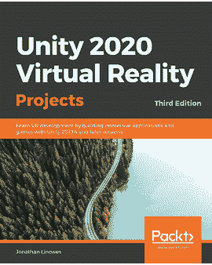

[Packt.com](http://Packt.com)

订阅我们的在线数字图书馆，全面访问超过 7,000 本书籍和视频，以及行业领先的工具，帮助你规划个人发展并推进你的职业生涯。更多信息，请访问我们的网站。

# 为什么订阅？

+   使用来自超过 4,000 位行业专业人士的实用电子书和视频，节省学习时间，多花时间编码

+   通过为你量身定制的 Skill Plans 提高你的学习效果

+   每月免费获得一本电子书或视频

+   完全可搜索，便于快速访问关键信息

+   复制粘贴、打印和收藏内容

你知道 Packt 为每本书都提供电子书版本，包括 PDF 和 ePub 文件吗？你可以在[packt.com](http://packt.com)升级到电子书版本，并且作为印刷书客户，你有权获得电子书副本的折扣。如需更多详情，请联系我们 customercare@packtpub.com。

在[www.packt.com](http://www.packt.com)，你还可以阅读一系列免费的技术文章，注册各种免费通讯，并享受 Packt 书籍和电子书的独家折扣和优惠。

# 你可能也会喜欢的其他书籍

如果你喜欢这本书，你可能对 Packt 的其他书籍也感兴趣：

[(https://www.packtpub.com/product/game-development-patterns-with-unity-2021-second-edition/9781800200814)]

**《Unity 2021 游戏开发模式 - 第二版**》

David Baron

ISBN: 978-1-80020-081-4

+   使用行业标准开发模式构建专业的 Unity 代码

+   确定实现特定游戏机制或功能的正确模式

+   开发可配置的核心游戏机制和成分，无需编写任何代码即可进行修改

+   审查实用的面向对象编程（OOP）技术，并学习它们如何在 Unity 项目中使用

+   构建独特的游戏开发系统，例如关卡编辑器

+   探索将传统设计模式用于 Unity API 的方法

[(https://www.packtpub.com/product/unity-2020-virtual-reality-projects-third-edition/9781839217333)]

**《Unity 2020 虚拟现实项目 - 第三版**》

Jonathan Linowes

ISBN: 978-1-83921-733-3

+   了解虚拟现实和 VR 消费产品的当前状态

+   通过使用 Unity 编辑器和导入的资产构建一个简单的场景来开始使用 Unity

+   配置你的 Unity VR 项目以在 Oculus、SteamVR 和 Windows 沉浸式 MR 等 VR 平台上运行

+   设计并构建一个带有音轨和时序的 VR 叙事动画

+   使用游戏物理和粒子系统实现一个音频火球游戏

+   使用各种软件模式设计 Unity 事件和交互式组件

+   发现照明、渲染和后期处理的最佳实践

# Packt 正在寻找像你这样的作者

如果你有兴趣成为 Packt 的作者，请访问[authors.packtpub.com](http://authors.packtpub.com)并今天申请。我们曾与成千上万的开发者和技术专业人士合作，就像你一样，帮助他们将见解分享给全球技术社区。你可以提交一般申请，申请我们正在招募作者的特定热门话题，或者提交你自己的想法。

分享你的想法

嗨！

我是 Jon，Augmented Reality with Unity AR Foundation 和 Unity 2020 Virtual Reality Projects 书籍的作者。我真心希望你喜欢阅读我的书籍，并觉得它对开始构建 AR 和/或 VR 应用程序很有用。我想你现在准备好走出去了，增强你的世界了！

如果你能在 Amazon 上留下关于《使用 Unity AR Foundation 进行增强现实》的评论，分享你的想法，这将真正帮助我（以及其他潜在读者！）。

你的评论将帮助我了解这本书中哪些地方做得很好，以及未来版本中哪些地方可以改进，所以这真的非常感谢。

祝好运，

Jon

## 目录

1.  使用 Unity AR Foundation 进行增强现实

1.  贡献者

1.  关于作者

1.  关于审稿人

1.  前言

    1.  本书面向的对象

    1.  本书涵盖的内容

    1.  充分利用本书

    1.  下载示例代码文件

    1.  下载彩色图片

    1.  使用的约定

    1.  取得联系

1.  第一部分 – 开始使用增强现实

1.  第一章：为 AR 开发做准备

    1.  技术要求

    1.  定义增强现实

    1.  开始使用 Unity

        1.  安装 Unity Hub

        1.  安装 Unity 编辑器

        1.  创建和管理 Unity 项目

        1.  介绍 Unity 编辑器界面

        1.  Unity 编辑器使用基础

        1.  组织你的项目资源

    1.  为 AR 开发准备你的项目

        1.  为 AR 设备安装 XR 插件

        1.  安装 AR Foundation 包

        1.  选择输入处理器

        1.  添加对通用渲染管道的支持

    1.  为移动开发设置

        1.  为 Android/ARCore 开发设置

        1.  为 iOS/ARKit 开发设置

        1.  为可穿戴 AR 眼镜开发

    1.  构建和运行测试场景

    1.  总结

1.  第二章：你的第一个 AR 场景

    1.  技术要求

    1.  探索 Unity 的 AR Foundation 示例项目

        1.  构建和运行样本项目

        1.  导出样本资产以供重用

    1.  在自己的项目中构建 SimpleAR 场景

        1.  创建新项目

        1.  将样本资产导入到自己的项目中

    1.  开始一个新的基本 AR 场景

        1.  使用 AR 会话

        1.  使用 AR Session Origin

        1.  使用 AR 摄像头

        1.  添加平面和点云管理器

        1.  添加 AR Raycast 管理器

        1.  添加光估计

        1.  构建和运行场景

    1.  在平面上放置对象

        1.  设置 PlaceObject 输入动作

        1.  介绍 Unity C# 编程和 MonoBehaviour 类

        1.  编写 PlaceObjectOnPlane 脚本

        1.  构建和运行场景

        1.  重构你的脚本

    1.  创建放置预制件

        1.  理解 GameObjects 和 Transforms

        1.  寻找 3D 模型

        1.  完成场景

    1.  总结

1.  第三章：改进开发者工作流程

    1.  技术要求

    1.  使用日志消息进行故障排除

        1.  使用 Debug.Log

        1.  使用移动设备上的控制台

        1.  在您的应用程序中模拟控制台窗口

    1.  使用调试器进行调试

        1.  在远程设备上进行调试

    1.  使用编辑器远程工具进行测试

    1.  使用 Unity MARS 进行模拟

        1.  使用 MARS 伴侣应用进行捕获

    1.  总结

1.  第二部分 – 可重用 AR 用户框架

1.  第四章：创建 AR 用户框架

    1.  技术要求

    1.  理解 AR 交互流程

    1.  安装必备资产

        1.  TextMeshPro

        1.  DOTween

        1.  Serialized Dictionary Lite

        1.  其他必备资产

    1.  从新场景开始

    1.  创建 UI 画布和面板

        1.  创建屏幕空间画布

        1.  添加应用程序标题

        1.  创建 UI 面板

    1.  创建 UI 控制器

        1.  创建 Singleton 类脚本

        1.  编写 UIController 脚本

        1.  淡出 UI 面板

    1.  创建交互控制器模式

        1.  创建交互模式层次结构

        1.  编写交互控制器

    1.  创建交互模式行为

        1.  StartupMode 脚本

        1.  ScanMode 脚本

        1.  MainMode 脚本

        1.  NonARMode 脚本

    1.  进行测试

    1.  使用 Unity 入门 UX 资产

        1.  介绍入门资产

        1.  准备 Unity AR 入门资产

        1.  安装依赖包

        1.  导入 OnboardingUX 包

        1.  编写 AnimatedPrompt 脚本

        1.  集成入门图形

    1.  为新场景创建场景模板

    1.  总结

1.  第五章：使用 AR 用户框架

    1.  技术要求

    1.  规划项目

    1.  从 ARFramework 场景模板开始

    1.  添加主菜单

    1.  添加带有教学 UI 的 PlaceObject 模式

        1.  创建 PlaceObject UI 面板

        1.  创建 PlaceObject 模式

    1.  连接菜单按钮

    1.  执行构建和运行

    1.  在不需要时隐藏跟踪对象

    1.  高级入门问题

        1.  创建 AR 可选项目

        1.  确定设备是否支持特定的 AR 功能

        1.  添加本地化

    1.  总结

1.  第三部分 – 构建更多 AR 项目

1.  第六章：画廊：构建 AR 应用

    1.  技术要求

    1.  指定艺术画廊项目的 UX

        1.  项目目标

        1.  用例

        1.  UX 设计

        1.  用户故事

    1.  开始使用

    1.  收集图像数据

        1.  导入照片以使用

        1.  将图像数据添加到场景中

        1.  获取图像的像素尺寸

        1.  在运行时加载图片列表

    1.  创建带框照片预制体

        1.  创建预制体层次结构

        1.  编写 FramedPhoto 脚本

        1.  调整图片的形状

    1.  在墙上挂一张虚拟照片

        1.  检测垂直平面

        1.  创建添加图片的 UI 面板

        1.  编写初始添加图片模式脚本

        1.  创建添加图片模式对象

        1.  创建主菜单添加按钮

        1.  构建和运行

        1.  完成添加图片模式脚本

        1.  在添加图片模式中显示跟踪平面

    1.  选择要使用的图像

        1.  创建选择图片模式

        1.  创建选择图片的 UI 面板

        1.  创建图像按钮预制体

        1.  编写 ImageButtons 脚本

        1.  重定向添加按钮

    1.  调整图像的宽高比

    1.  摘要

1.  第七章：相册：编辑虚拟对象

    1.  技术要求

    1.  创建编辑模式

        1.  创建编辑菜单 UI

        1.  创建编辑图片模式

    1.  选择要编辑的图片

        1.  定义选择对象输入动作

        1.  替换 MainMode 脚本

        1.  从主模式中选择对象

        1.  连接完成编辑按钮

    1.  突出显示选定的图片

    1.  从编辑模式中选择对象

    1.  避免相交的对象

    1.  删除图片

    1.  替换图片的图像

        1.  替换框架

    1.  交互编辑图片

        1.  确保 FramedPhoto 对象接收输入动作消息

        1.  添加交互组件

        1.  使用手指移动图片

        1.  捏合以调整图片大小

    1.  总结

1.  第八章：行星：跟踪图像

    1.  技术要求

    1.  理解 AR 图像跟踪

    1.  指定 Planets 项目

        1.  用户体验流程

        1.  准备行星卡片

        1.  收集行星纹理和数据

    1.  入门

    1.  跟踪参考图像

        1.  添加 AR 跟踪图像管理器

        1.  创建参考图像库

    1.  配置用户交互模式和 UI

        1.  扫描参考图像

        1.  构建和运行

    1.  创建和实例化虚拟地球预制件

        1.  创建通用行星预制件

        1.  理解等角图像

        1.  创建地球预制件

        1.  添加行星元数据

        1.  动画行星旋转

    1.  构建应用的主模式

        1.  编写 PlanetsMainMode 脚本

    1.  使用多个行星扩展项目

        1.  将行星卡片图像添加到参考图像库

        1.  创建行星预制件

        1.  对检测到的图像做出响应

    1.  创建响应式 UI

        1.  创建主模式 UI

        1.  指向摄像头以显示信息

        1.  显示信息详情

    1.  总结

1.  第九章：自拍：制作有趣的面孔

    1.  技术要求

    1.  理解人脸追踪

        1.  人脸追踪与人脸识别

        1.  使用 AR Foundation 追踪人脸

    1.  入门

        1.  使用 ARFramework 模板创建新场景

        1.  设置 iOS ARKit 进行人脸追踪

        1.  导入项目中使用的资产

    1.  为人脸追踪配置新的 AR 场景

        1.  设置自拍 AR 相机

        1.  添加 AR 人脸管理器组件

        1.  提示用户寻找或忽略人脸

        1.  构建和运行

    1.  使用 3D 头部追踪人脸姿态

        1.  制作 Mr. Plastic Head 预制件

        1.  制作 Mr. Facet Head 预制件

    1.  构建主模式和菜单

        1.  创建可更换的人脸预制件

        1.  编写主模式控制器脚本

        1.  创建可滚动的主菜单按钮

        1.  添加重置人脸按钮

    1.  附加 3D 配件

        1.  戴帽子

        1.  佩戴酷炫太阳镜

        1.  更新配件的脚本

        1.  将配件添加到主菜单

    1.  使用多种材料制作动态人脸网格

        1.  探索 AR 默认人脸

        1.  创建人脸材料

        1.  将人脸网格可视化器添加到可更换的人脸预制件

        1.  控制人脸材料

        1.  将人脸材料添加到主菜单

    1.  使用眼动追踪（ARKit）

    1.  在人脸区域贴上贴纸（ARCore）

        1.  创建贴纸预制件

        1.  管理附件位置

        1.  将区域附件添加到主菜单

        1.  仅 ARCore 的 UI 按钮

    1.  跟踪表情混合形状（ARKit）

    1.  摘要

    1.  为什么要订阅？

1.  你可能还会喜欢的其他书籍

    1.  Packt 正在寻找像你这样的作者

## 地标

1.  封面

1.  目录
