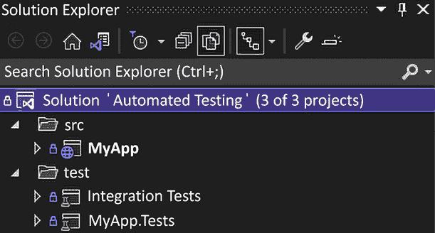

# 2 自动化测试

## 在开始之前：加入我们的 Discord 书籍社区

直接向作者本人提供反馈，并在我们的 Discord 服务器上与其他早期读者聊天（在“architecting-aspnet-core-apps-3e”频道下找到“EARLY ACCESS SUBSCRIPTION”）。

[`packt.link/EarlyAccess`](https://packt.link/EarlyAccess)


本章重点介绍自动化测试及其在构建更好软件方面的帮助。它还涵盖了几种不同类型的测试和**测试驱动开发**（**TDD**）的基础。我们还概述了 ASP.NET Core 的可测试性以及测试 ASP.NET Core 应用程序比测试旧版 ASP.NET MVC 应用程序容易多少。本章概述了自动化测试、其原则、xUnit、采样测试值的方法等。虽然其他书籍对此主题有更深入的探讨，但本章涵盖了自动化测试的基础方面。我们在整本书中使用了这些内容，本章确保你有一个足够坚实的基础来理解示例。在本章中，我们涵盖了以下主题：

+   自动化测试概述

+   测试 .NET 应用程序

+   重要的测试原则

## 自动化测试简介

测试是开发过程中的一个重要部分，自动化测试在长期来看变得至关重要。你总是可以运行你的 ASP.NET Core 网站，打开浏览器，点击各个地方来测试你的功能。这是一个合法的方法，但这样测试单个规则或更复杂的算法会更困难。另一个缺点是缺乏自动化；当你刚开始使用包含几个页面、端点或功能的小型应用程序时，手动执行这些测试可能很快。然而，随着你的应用程序增长，这变得更加繁琐，耗时更长，并且增加了犯错的几率。当然，你总是需要真实用户来测试你的应用程序，但你希望这些测试专注于 UX、内容或你正在构建的一些实验性功能，而不是自动化测试本可以早期捕获的错误报告。测试领域有多种测试类型和技术。以下是一个列表，列出了三个广泛的类别，代表了我们可以从代码正确性角度如何划分自动化测试：

+   单元测试

+   集成测试

+   端到端（E2E）测试

通常，你希望有一系列的测试，包括快速的单元测试来测试你的算法，较慢的测试来确保组件之间的集成正确，以及慢速的端到端测试来确保整个系统的正确性。测试金字塔是一种很好的方式来解释自动化测试的一些概念。你希望根据测试的复杂性和执行速度的不同，拥有不同粒度的测试和不同数量的测试。以下测试金字塔展示了上述三种类型的测试。然而，我们也可以在其中添加其他类型的测试。此外，这只是一个抽象的指导方针，给你一个大致的概念。最重要的方面是**投资回报率**（ROI）和执行速度。如果你能写一个覆盖范围广且足够快的集成测试，这可能比多个单元测试更有价值。


图 2.1：测试金字塔

> 我无法强调这一点；测试的执行速度对于快速获得反馈并立即知道你的代码更改破坏了什么至关重要。分层不同类型的测试允许你经常只执行最快的子集，偶尔执行不那么快的测试，以及很少执行非常慢的测试。如果你的测试套件足够快，你甚至不必担心它。然而，如果你有很多需要数小时运行的手动或端到端 UI 测试，那又是另一回事（这可能花费大量资金）。

最后，除了使用测试运行器运行测试，如 Visual Studio、VS Code 或 CLI 之外，确保代码质量并利用自动化测试的一个好方法是，在 CI 管道中运行它们，验证代码更改以发现问题。从技术角度来看，当.NET Core 处于预发布阶段时，我发现.NET 团队正在使用 xUnit 来测试他们的代码，并且它是唯一可用的测试框架。自从那时起，xUnit 就成了我最喜欢的测试框架，我们在整本书中都使用了它。此外，ASP.NET Core 团队通过为可测试性设计 ASP.NET Core，使我们的生活变得更简单；测试比以前更容易了。为什么在一本架构书中要讨论测试？因为可测试性是良好设计的标志。它还允许我们用测试而不是用文字来证明一些概念。在许多代码示例中，测试用例是消费者，这使得程序更轻量，无需构建整个用户界面，而是专注于我们正在探索的模式，而不是让我们的注意力分散在一些样板 UI 代码上。

> 为了确保我们不偏离主题，我们在书中适度地使用自动化测试，但我强烈建议你继续学习它，因为它将有助于提高你的代码和设计质量。

现在我们已经涵盖了所有这些，让我们来探索这三种类型的测试，从单元测试开始。

### 单元测试

单元测试关注于单个单元，比如测试一个方法的结果。单元测试应该是快速的，并且不依赖于任何基础设施，例如数据库。这些是你最想要的测试类型，因为它们运行速度快，每个测试都精确地测试一个代码路径。它们还应该帮助你更好地设计应用程序，因为你在测试中使用了你的代码，所以你成为了它的第一个消费者，这有助于你发现一些设计缺陷，并使你的代码更加完善。如果你不喜欢在测试中使用你的代码，那是一个很好的迹象，表明其他人也不会这样做。单元测试应该专注于测试算法（输入和输出）和领域逻辑，而不是代码本身；你编写代码的方式不应该影响测试的意图。例如，你正在测试一个`Purchase`方法是否执行了购买一个或多个项目的逻辑，而不是测试你在这个方法内部创建了变量`X`、`Y`或`Z`。

> 如果你发现这很有挑战性，请不要气馁；编写一个好的测试套件并不像听起来那么简单。

### 集成测试

集成测试关注于组件之间的交互，例如当组件查询数据库时会发生什么，或者当两个组件相互交互时会发生什么。集成测试通常需要一些基础设施来与之交互，这使得它们的运行速度较慢。按照经典的测试模型，你想要集成测试，但比单元测试要少。集成测试可以非常接近端到端测试，但不需要使用类似生产环境的测试环境。

> 我们稍后会打破测试金字塔规则，所以始终对规则和原则持批判态度；有时，打破或弯曲它们可能更好。例如，一个良好的集成测试可能比*N*个单元测试更有价值；在编写测试时不要忽视这个事实。另见灰盒测试。

### 端到端测试

端到端测试关注于应用程序的全局行为，例如当用户点击一个特定的按钮、导航到特定的页面、提交一个表单或向某个 Web API 端点发送一个`PUT`请求时会发生什么。端到端测试通常在基础设施上运行，以测试你的应用程序和部署。

### 其他类型的测试

有其他类型的自动化测试。例如，我们可以进行负载测试、性能测试、回归测试、契约测试、渗透测试、功能测试、冒烟测试等等。你可以自动化验证任何你想要验证的内容，但有些测试自动化起来更具挑战性，或者比其他测试更脆弱，例如 UI 测试。

> 如果你可以在合理的时间内自动化一个测试，考虑一下投资回报率：去做吧！从长远来看，这应该会带来回报。

还有一点；不要盲目依赖诸如代码覆盖率之类的指标。这些指标在你的 GitHub 项目的`readme.md`文件中可以成为可爱的徽章，但可能会让你偏离轨道，导致你编写无用的测试。请别误会，代码覆盖率是一个很好的指标，当正确使用时，但它记得一条好的测试胜过覆盖你代码库 100%的糟糕测试套件。如果你在使用代码覆盖率，确保你和你的团队没有在玩弄系统。编写好的测试并不容易，需要通过实践来掌握。

> 一条建议：通过添加缺失的测试用例和删除过时或无用的测试来保持你的测试套件健康。考虑用例覆盖率，而不是你的测试覆盖了多少行代码。

在继续测试样式之前，让我们先检查一个假设的系统，并探索一种更有效的方式来测试它。

### 选择合适的测试风格

接下来是一个假设系统的依赖图。我们使用这张图来选择程序每个部分最具有意义的测试类型。在现实生活中，这张图很可能会在你的脑海中，但我在这个例子中把它画出来了。在我解释其内容之前，让我们先检查这张图：


图 2.2：假设系统的依赖图

在图中，**Actor**可以是用户或其他系统。**Presentation**是系统的一部分，**Actor**与之交互并将请求转发给系统本身（这可能是一个用户界面）。**D1**是一个组件，它必须根据用户输入决定下一步要做什么。**C1**到**C6**是系统的其他组件（例如，可以是类）。**DB**是一个数据库。D1 必须在三条代码路径中选择：与组件 C1、C4 或 C6 交互。这种逻辑通常是一个很好的单元测试主题，确保算法根据输入参数产生正确的结果。为什么选择单元测试？我们可以快速测试多个场景、边缘情况、越界数据情况等。我们通常在这个类型的测试中模拟依赖项，并断言被测试的主题在期望的组件上做出了预期的调用。然后，如果我们看看其他代码路径，我们可以为组件 C1 编写一个或多个集成测试，一次性测试整个链（C1、C5 和 C3），而不是为每个组件编写多个重量级的模拟单元测试。如果需要在组件 C1、C5 或 C3 中测试任何逻辑，我们总是可以添加一些单元测试；这就是它们的作用。最后，C4 和 C6 都使用 C2。根据代码（我们这里没有），我们可以为 C4 和 C6 编写集成测试，同时测试 C2。另一种方法是单元测试 C4 和 C6，然后编写 C2 和数据库之间的集成测试。如果 C2 没有逻辑，后者可能是最好和最快的，而前者很可能会在持续交付模型中给出更有信心测试套件的结果。当有这个选项时，我建议评估编写更少的具有意义的集成测试的可能性，这些测试断言用例套件中用例的正确性，而不是编写大量的重量级模拟单元测试。记住，始终要考虑执行速度。这看起来可能“违反”了测试金字塔，但它吗？如果你花更少的时间（从而降低成本）测试更多的用例（增加更多的价值），对我来说这似乎是一个胜利。此外，我们不应忘记，模拟依赖项往往会让你浪费时间与框架或其他库作斗争，而不是测试有意义的东西，这可能会随着时间的推移增加维护成本。现在我们已经探讨了自动化测试的基础，是时候探索测试方法和 TDD 了，这是一种应用这些测试概念的方法。

## 测试方法

测试有多种方法，例如 **行为驱动开发**（**BDD**）、**验收测试驱动开发**（**ATDD**）和**测试驱动开发**（**TDD**）。DevOps 文化带来了一种心态，它拥抱与 **持续集成**（**CI**）和 **持续部署**（**CD**）理念一致的自动化测试。我们可以通过一个强大且健康的测试套件来实现 CD，这为我们提供了对代码的高度信心，足够高以至于在所有测试通过时可以部署程序，而不必担心引入错误。

### TDD

TDD 是一种软件开发方法，它指出你应该在编写实际代码之前编写一个或多个测试。简而言之，你通过遵循 **红-绿-重构** 技术来反转你的开发流程，其过程如下：

1.  你编写一个失败的测试（红色）。

1.  你只需编写足够的代码来使你的测试通过（绿色）。

1.  你重构这段代码，通过确保所有测试通过来改进设计。

> 我们将在下一节探讨 **重构** 的含义。

### ATDD

ATDD 与 TDD 类似，但侧重于验收（或功能）测试，而不是软件单元，并涉及多个参与者，如客户、开发人员和测试人员。

### BDD

BDD 是源自 TDD 和 ATDD 的另一种补充技术。BDD 侧重于使用口语化语言来制定围绕应用程序行为的测试用例，并涉及多个参与者，如客户、开发人员和测试人员。此外，BDD 实践者经常利用 *给定-当-然后* 语法来规范化他们的测试用例。正因为如此，BDD 的输出以人类可读的格式呈现，允许利益相关者查阅此类工件。给定-当-然后模板定义了描述用户故事或验收测试行为的方式，如下所示：

+   *给定* 一个或多个先决条件（上下文）

+   *当* 发生某些事情（行为）

+   *然后* 预期一个或多个可观察的变化（可衡量的副作用）

ATDD 和 BDD 是深入挖掘的绝佳领域，可以帮助设计更好的应用程序；定义精确的用户中心规格可以帮助构建所需的内容，更好地进行优先级排序，并改善各方之间的沟通。为了简单起见，我们在书中坚持单元测试、集成测试和一点 TDD。不过，让我们回到主要轨道上，并定义重构。

### 重构

重构是关于（持续）改进代码而不改变其行为。一个自动化的测试套件应该帮助你实现这一目标，并帮助你发现何时破坏了某些东西。无论你是否做 TDD，我都建议尽可能多地重构；这有助于清理你的代码库，同时也有助于你消除一些技术债务。好的，但什么是 **技术债务**？

### 技术债务

**技术债务**代表在开发功能或系统时你省略的角落。无论你多么努力，这都是不可避免的，因为生活就是生活，会有延误、截止日期、预算和人员，包括开发者（是的，那也包括我和你）。最关键的是理解你无法完全避免技术债务，所以最好是接受这个事实，学会与之共存而不是与之抗争。从那时起，你只能尝试限制你或其他人产生的技术债务量，并确保在每个冲刺（或适合你项目/团队/流程的时间单位）中始终重构其中的一部分。限制技术债务积累的一种方法就是经常重构代码。因此，将重构时间纳入你的时间估算中。另一种方法是提高所有相关方的协作。如果你想使你的项目成功，每个人都必须朝着同一个目标努力。有时，由于外部因素如人员或时间限制，你可能会缩短最佳实践的运用。关键是尽快回来偿还那笔技术债务，而自动化测试正是帮助你重构代码和优雅地消除债务的工具。根据你工作场所的大小，你与那个决策之间的人数会有多或少。

> 其中一些事情可能超出了你的控制范围，所以你可能不得不忍受比你希望更多的技术债务。然而，即使事情超出了你的控制范围，也没有什么能阻止你成为先驱并致力于改善企业的文化。不要害怕成为变革的代理人并带头。

然而，不要让技术债务积累得太高，否则你可能无法偿还，到某个时候，项目就开始破裂和失败。不要误解；一个在生产中的项目可能就是失败的。交付产品并不能保证成功，我在这里谈论的是代码的质量，而不是产生的收入（我将那留给其他人来评估）。接下来，我们来看看不同的测试编写方式，这需要更多或更少的对代码内部工作的了解。

## 测试技术

在这里，我们来看看不同的测试方法。我们应该了解代码吗？我们应该测试用户输入并将其与系统结果进行比较吗？如何确定合适的值样本？让我们从白盒测试开始。

### 白盒测试

白盒测试是一种软件测试技术，它使用对软件内部结构的了解来设计测试。我们可以使用白盒测试来发现软件逻辑、数据结构和算法中的缺陷。

> 这种测试也被称为清晰盒测试、开放盒测试、透明盒测试、玻璃盒测试和基于代码的测试。

白盒测试的另一个好处是它可以帮助优化代码。通过审查代码来编写测试，开发者可以识别并改进低效的代码结构，从而提高整体软件性能。开发者还可以在测试代码时发现架构问题，从而改进应用程序设计。

> 白盒测试涵盖了大多数单元和集成测试。

接下来，我们来看黑盒测试，它是白盒测试的对立面。

### 黑盒测试

黑盒测试是一种软件测试方法，测试人员检查应用程序的功能，而不了解其内部结构或实现细节。这种测试形式仅关注受测系统的输入和输出，将软件视为一个“黑盒”，我们无法窥视。黑盒测试的主要目标是根据需求或用户故事评估系统行为是否符合预期结果。编写测试的开发者不需要了解代码库或用于构建软件的技术栈。我们可以使用黑盒测试来评估多种类型的需求的正确性，例如：

1.  **功能测试**：这种测试与软件的功能需求相关，强调系统做什么，即行为验证。

1.  **非功能性测试**：这种测试与非功能性需求相关，如性能、可用性、可靠性和安全性，即性能评估。

1.  **回归测试**：这种测试确保新代码不会破坏现有功能，即变更影响。

接下来，让我们探索白盒测试和黑盒测试之间的混合技术。

### 灰盒测试

灰盒测试是白盒测试和黑盒测试的结合。测试人员只需要了解应用内部工作的一部分，并使用软件的内部结构和外部行为相结合来构建他们的测试。我们在第十六章中实现了灰盒测试用例，即*请求-端点-响应（REPR）*。同时，让我们比较一下这三种技术。

### 白盒测试与黑盒测试及灰盒测试的比较

为了进行简洁的比较，这里有一个表格，比较了三种主要技术：

| **特性** | **白盒测试** | **黑盒测试** | **灰盒测试** |
| --- | --- | --- | --- |
| 定义 | 基于软件内部设计的测试 | 基于软件行为和功能的测试 | 结合软件内部设计和行为的测试 |
| 是否需要了解代码 | 是 | 否 | 是 |
| 发现的缺陷类型 | 逻辑、数据结构、架构和性能问题 | 功能性、可用性、性能和安全问题 | 大多数类型的问题 |
| 每个测试的覆盖率 | 小；针对单元 | 大；针对用例 | 大；范围可变 |
| 测试人员 | 通常由开发者执行。 | 测试人员可以编写测试，而无需了解应用程序内部结构的特定技术知识。 | 开发者可以编写测试，同时测试人员也可以在了解一些代码知识的情况下进行。 |
| 何时使用每种风格？ | 编写单元测试以验证复杂算法或基于许多输入产生多个结果的代码。这些测试通常运行速度很快，因此你可以有很多这样的测试。 | 如果你有特定的场景想要测试，比如 UI 测试，或者如果你的组织中将测试人员和开发者视为两个不同的角色，那么就编写测试。这些测试通常运行得最慢，需要你部署应用程序以进行测试。你希望尽可能少地编写测试，以改善反馈时间。 | 编写测试以避免编写黑盒或白盒测试。分层测试以尽可能少地使用测试覆盖尽可能多的内容。根据应用程序的架构，这种类型的测试可以为许多场景产生最佳结果。 |

让我们总结一下，并探讨每种技术的优缺点。

### 结论

白盒测试包括单元测试和集成测试。这些测试运行速度快，开发者使用它们来改进代码和测试复杂算法。然而，编写大量此类测试需要花费时间。由于与代码的紧密耦合，编写与代码本身紧密耦合的脆弱测试更容易，这增加了此类测试套件的维护成本。这也使得应用在测试可访问性的名义下过度工程化。黑盒测试涵盖了不同类型的测试，这些测试倾向于端到端测试。由于测试针对系统的外部表面，当系统发生变化时，它们不太可能中断。此外，它们在测试行为方面非常出色，并且由于每个测试都测试一个端到端用例，因此我们需要更少的测试，这导致编写时间和维护成本降低。测试整个系统有缺点，包括执行每个测试的缓慢，因此将黑盒测试与其他类型的测试相结合非常重要，以找到测试数量、测试用例覆盖率和测试执行速度之间的正确平衡。灰盒测试是两种其他测试的绝佳混合；你可以将软件的任何部分视为黑盒，利用你的内部知识来模拟或存根测试用例的部分（例如，断言系统是否在数据库中持久化记录），并更有效地测试端到端场景。它带来了两者的最佳之处，在显著减少测试数量的同时，大大增加了每个测试用例的测试面。然而，在较小的单元上进行灰盒测试或过度模拟系统可能会产生与白盒测试相同的缺点。集成测试或几乎端到端测试是灰盒测试的良好候选者。我们在*第十六章*，*请求-端点-响应（REPR）*中实现了灰盒测试用例。同时，让我们探索一些技术，通过应用不同的技术，如测试一小部分值以通过编写最优数量的测试来断言程序的正确性，来帮助优化我们的测试用例创建。

## 测试用例创建

存在多种方法可以将测试用例分解和创建，以帮助以最小的测试数量找到软件缺陷。以下是一些技术，可以帮助最小化测试数量同时最大化测试覆盖率：

+   等价类划分

+   边界值分析

+   决策表测试

+   状态转换测试

+   用例测试

我从理论上介绍这些技术。它们适用于所有类型的测试，并应有助于你编写更好的测试套件。让我们快速看一下每个技术。

### 等价类划分

这种技术将软件的输入数据划分为不同的等价数据类，然后对这些类进行测试，而不是对单个输入进行测试。等价数据类意味着该分区集中的所有值都应该导致相同的结果或产生相同的结果。这样做可以显著减少测试的数量。例如，考虑一个接受介于 1 到 100（包含）之间的整数值的应用程序。使用等价分区，我们可以将输入数据划分为两个等价类：

+   有效

+   无效

为了更精确，我们可以进一步将其划分为三个等价类：

+   第 1 类：小于 1（无效）

+   第 2 类：介于 1 和 100 之间（有效）

+   第 3 类：大于 100（无效）

然后，我们可以编写三个测试，从每个类别中选取一个代表（例如，0、50 和 101）来创建我们的测试用例。这样做确保了广泛的覆盖范围，同时测试用例数量最少，使我们的测试过程更加高效。

### 边界值分析

这种技术侧重于输入域边界的值，而不是中心。这种技术基于这样一个原则，即错误最有可能发生在输入域的边界。**输入域**代表系统所有可能的输入集合。**边界**是输入域的边缘，代表最小和最大值。例如，如果我们期望一个函数接受介于 1 到 100（包含）之间的整数，边界值将是 1 和 100。使用边界值分析，我们会为这些值、边界外的值（如 0 和 101）以及边界内的值（如 2 和 99）创建测试用例。边界值分析是一种非常高效的测试技术，它以相对较少的测试用例提供了良好的覆盖范围。然而，它不适合查找边界内的错误或复杂逻辑错误。边界值分析应该在等价分区和决策表测试等其他测试方法之上使用，以确保软件尽可能无缺陷。

### 决策表测试

这种技术使用决策表来设计测试用例。决策表是一个显示所有可能的输入值组合及其对应输出的表格。对于可以用表格格式表示的复杂业务规则来说，它非常方便，使测试人员能够识别缺失和多余的测试用例。例如，我们的系统只允许具有有效用户名和密码的用户访问。此外，当系统处于维护状态时，系统拒绝用户访问。决策表将包含三个条件（用户名、密码和维护）和一个动作（允许访问）。表格将列出这些条件的所有可能组合以及每个组合的预期动作。以下是一个示例：

| **有效用户名** | **有效密码** | **系统处于维护状态** | **允许访问** |
| --- | --- | --- | --- |
| 是 | 是 | 否 | 是 |
| 是 | 是 | 是 | 否 |
| 正确 | 错误 | 错误 | 否 |
| 正确 | 错误 | 正确 | 否 |
| 错误 | 正确 | 错误 | 否 |
| 错误 | 正确 | 正确 | 否 |
| 错误 | 错误 | 错误 | 否 |
| 错误 | 错误 | 正确 | 否 |

决策表测试的主要优势在于它确保我们测试了所有可能的输入组合。然而，当系统具有许多输入条件时，它可能会变得复杂且难以管理，因为规则的数量（因此是测试用例的数量）会随着条件的数量呈指数增长。

### 状态转换测试

我们通常使用状态转换测试来测试具有状态机的软件，因为它测试了不同的系统状态及其转换。这对于系统行为可以根据其当前状态改变的情况非常有用。例如，具有“已登录”或“已登出”等状态的程序。为了执行状态转换测试，我们需要确定系统的状态以及状态之间的可能转换。对于每个转换，我们需要创建一个测试用例。测试用例应该使用指定的输入值测试软件，并验证软件是否转换到正确的状态。例如，处于“已登录”状态的用户在登出后必须转换到“已登出”状态。状态转换测试的主要优势在于它测试了事件序列，而不仅仅是单个事件，这可能会揭示在单独测试每个事件时未发现的缺陷。然而，对于具有许多状态和转换的系统，状态转换测试可能会变得复杂且耗时。

### 用例测试

这种技术通过验证系统在用户以特定方式使用时是否按预期行为来验证系统。用例可以具有正式的描述，可以是用户故事，或者采取任何适合您需求的其他形式。用例涉及一个或多个参与者执行步骤或采取应产生特定结果的操作。用例可以包括输入和预期输出。例如，当“已登录”状态的用户（参与者）点击“登出”按钮（操作），然后导航到个人资料页面（操作）时，系统拒绝访问页面并将用户重定向到登录页面，显示错误消息（预期行为）。用例测试是一种系统化和结构化的测试方法，有助于识别软件功能中的缺陷。它非常以用户为中心，确保软件满足用户的需求。然而，为复杂的用例创建测试用例可能会很困难。在用户界面的情况下，执行用例端到端测试的时间可能会很长，尤其是随着测试数量的增加。

> 将您的测试用例视为要测试的功能，无论是使用正式的用例还是只是在餐巾纸上写的一行字，都是一个很好的思考方式。关键是测试行为，而不是代码。

现在我们已经探讨了这些技术，是时候介绍 xUnit 库、编写测试的方法以及书中如何编写测试了。让我们先创建一个测试项目。

## 如何创建 xUnit 测试项目

要创建一个新的 xUnit 测试项目，你可以运行 `dotnet new xunit` 命令，CLI 会为你创建一个包含 `UnitTest1` 类的项目。这个命令与从 Visual Studio 创建一个新的 xUnit 项目做的是同样的事情。对于单元测试项目，将项目命名为你想要测试的项目名称，并在其后添加 `.Tests`。例如，`MyProject` 将会有一个与之关联的 `MyProject.Tests` 项目。我们将在下面的 *组织你的测试* 部分中探讨更多细节。模板已经定义了所有必需的 NuGet 包，因此你可以在将测试项目添加到你的测试项目后立即开始测试。

> 你也可以使用 CLI 的 `dotnet add reference` 命令添加项目引用。假设我们位于 `./test/MyProject.Tests` 目录，并且我们想要引用的项目文件位于 `./src/MyProject` 目录；我们可以执行以下命令来添加引用：

```cs
dotnet add reference ../../src/MyProject.csproj.
```

接下来，我们将探讨一些 xUnit 特性，这将使我们能够编写测试用例。

## 关键的 xUnit 特性

在 xUnit 中，`[Fact]` 属性是用来创建独特测试用例的方式，而 `[Theory]` 属性是用来创建数据驱动测试用例的方式。让我们从事实开始，这是编写测试用例最简单的方式。

### 事实

任何没有参数的方法都可以通过添加 `[Fact]` 属性来成为一个测试方法，就像这样：

```cs
public class FactTest
{
    [Fact]
    public void Should_be_equal()
    {
        var expectedValue = 2;
        var actualValue = 2;
        Assert.Equal(expectedValue, actualValue);
    }
}
```

当测试代码需要时，你还可以用事实属性装饰异步方法：

```cs
public class AsyncFactTest
{
    [Fact]
    public async Task Should_be_equal()
    {
        var expectedValue = 2;
        var actualValue = 2;
        await Task.Yield();
        Assert.Equal(expectedValue, actualValue);
    }
}
```

在前面的代码中，高亮显示的行在概念上表示一个异步操作，它所做的只是允许使用 `async`/`await` 关键字。当我们从 Visual Studio 的测试资源管理器运行测试时，测试运行结果看起来像这样：


图 2.3：Visual Studio 中的测试结果

你可能已经从截图注意到测试类嵌套在 `xUnitFeaturesTest` 类中，它是 `MyApp` 命名空间的一部分，并且位于 `MyApp.Tests` 项目下。我们将在本章后面探讨这些细节。运行 `dotnet test` CLI 命令应该会产生类似于以下的结果：

```cs
Passed!  - Failed:     0, Passed:    23, Skipped:     0, Total:    23, Duration: 22 ms - MyApp.Tests.dll (net8.0)
```

从前面的输出中我们可以看出，所有测试都通过了，没有失败的，也没有跳过的。使用 xUnit 创建测试用例就这么简单。

> 学习 CLI 对于创建和调试 CI/CD 管道非常有帮助，你可以在任何脚本（如 bash 和 PowerShell）中使用它们，就像使用 `dotnet test` 命令一样。

你有没有注意到测试代码中的 `Assert` 关键字？如果你不熟悉它，我们将在下一节探讨断言。

### 断言

断言是一种检查特定条件是否为 `true` 或 `false` 的声明。如果条件为 `true`，则测试通过。如果条件为 `false`，则测试失败，表明被测试的主题存在问题。让我们探讨一些断言正确性的方法。在本节中，我们使用基本的 xUnit 功能，但如果你有选择的断言库，你也可以引入。

> 在 xUnit 中，断言在失败时抛出异常，但你可能甚至都没有意识到这一点。你不必处理这些异常；这是将失败结果传播到测试运行器的机制。

我们不会探索所有可能性，但让我们从以下共享部分开始：

```cs
public class AssertionTest
{
    [Fact]
    public void Exploring_xUnit_assertions()
    {
        object obj1 = new MyClass { Name = "Object 1" };
        object obj2 = new MyClass { Name = "Object 1" };
        object obj3 = obj1;
        object? obj4 = default(MyClass);
        //
        // Omitted assertions
        // 
        static void OperationThatThrows(string name)
        {
            throw new SomeCustomException { Name = name };
        }
    }
    private record class MyClass
    {
        public string? Name { get; set; }
    }
    private class SomeCustomException : Exception
    {
        public string? Name { get; set; }
    }
}
```

前面的两个记录类、`OperationThatThrows` 方法和变量是测试中使用的实用工具，帮助我们与 xUnit 断言互动。出于探索目的，变量是 `object` 类型，但你可以在测试用例中使用任何类型。我省略了即将看到的断言代码，以使代码更简洁。以下两个断言非常明确：

```cs
Assert.Equal(expected: 2, actual: 2);
Assert.NotEqual(expected: 2, actual: 1);
```

第一个比较实际值是否等于预期值，而第二个比较两个值是否不同。`Assert.Equal` 可能是使用最广泛的断言方法。

> 作为一条经验法则，断言相等（`Equal`）比断言值不同（`NotEqual`）更好。除了少数罕见的情况外，断言相等会产生更一致的结果，并关闭遗漏缺陷的大门。

接下来的两个断言与相等断言非常相似，但断言对象是否是同一个实例或不是（同一个实例意味着相同的引用）：

```cs
Assert.Same(obj1, obj3);
Assert.NotSame(obj2, obj3);
```

下一个断言验证两个对象是否相等。由于我们使用的是记录类，这使我们变得非常容易；`obj1` 和 `obj2` 不是同一个实例（两个实例），但它们是相等的（有关记录类的更多信息，请参阅 *附录 A*）：

```cs
Assert.Equal(obj1, obj2);
```

下面的两个断言非常相似，断言值是否为 `null` 或不是：

```cs
Assert.Null(obj4);
Assert.NotNull(obj3);
```

下一个断言检查 `obj1` 是否为 `MyClass` 类型，然后返回将参数（`obj1`）转换为断言类型（`MyClass`）的参数。如果类型不正确，`IsType` 方法将抛出异常：

```cs
var instanceOfMyClass = Assert.IsType<MyClass>(obj1);
```

然后我们重用 `Assert.Equal` 方法来验证 `Name` 属性的值是否符合我们的预期：

```cs
Assert.Equal(expected: "Object 1", actual: instanceOfMyClass.Name);
```

以下代码块断言 `testCode` 参数抛出 `SomeCustomException` 类型的异常：

```cs
var exception = Assert.Throws<SomeCustomException>(
    testCode: () => OperationThatThrows("Toto")
);
```

`testCode` 参数执行我们最初看到的 `OperationThatThrows` 内联函数。`Throws` 方法允许我们通过返回指定类型的异常来测试一些异常属性。这里发生的行为与 `IsType` 方法相同；如果异常类型不正确或未抛出异常，`Throws` 方法将使测试失败。

> 确保不仅抛出了正确的异常类型，而且异常还携带了正确的值，这是一个好主意。

以下行断言 `Name` 属性的值是我们期望的，确保我们的程序会传播正确的异常：

```cs
Assert.Equal(expected: "Toto", actual: exception.Name);
```

我们介绍了一些断言方法，但 xUnit 中还有许多其他方法，如 `Collection`、`Contains`、`False` 和 `True` 方法。我们在整本书中使用了许多断言，所以如果这些仍然不清楚，你将了解更多关于它们的信息。接下来，让我们看看使用理论的驱动数据测试案例。

### 理论

对于更复杂的测试案例，我们可以使用理论。一个理论包含两个部分：

+   一个标记方法为理论的 `[Theory]` 属性。

+   至少一个允许将数据传递给测试方法的属性：`[InlineData]`、`[MemberData]` 或 `[ClassData]`。

当编写一个理论时，你的主要约束是确保值的数量与测试方法中定义的参数相匹配。例如，一个只有一个参数的理论必须提供一个值。我们接下来将看看一些例子。

> 你不仅限于只使用一种数据属性；你可以使用你需要的任何数量来满足你的需求，并用适当的数据来提供理论。

`[InlineData]` 属性最适合常量值或较小的值集。内联数据是三种方法中最直接的方式，因为测试值和测试方法的接近性。以下是一个使用内联数据的理论示例：

```cs
public class InlineDataTest
{
    [Theory]
    [InlineData(1, 1)]
    [InlineData(2, 2)]
    [InlineData(5, 5)]
    public void Should_be_equal(int value1, int value2)
    {
        Assert.Equal(value1, value2);
    }
}
```

那个测试方法在测试资源管理器中产生了三个测试案例，每个案例可以单独通过或失败。当然，由于 1 等于 1，2 等于 2，5 等于 5，所有三个测试案例都通过了，如下所示：


图 2.4：内联数据理论测试结果

我们还可以使用 `[MemberData]` 和 `[ClassData]` 属性来简化测试方法的声明，当我们有一大批数据要测试时。我们也可以在无法在属性中实例化数据时这样做。我们还可以在多个测试方法中重用数据或将数据封装在测试类之外。以下是一些 `[MemberData]` 属性使用示例的混合：

```cs
public class MemberDataTest
{
    public static IEnumerable<object[]> Data => new[]
    {
        new object[] { 1, 2, false },
        new object[] { 2, 2, true },
        new object[] { 3, 3, true },
    };
    public static TheoryData<int, int, bool> TypedData =>new TheoryData<int, int, bool>
    {
        { 3, 2, false },
        { 2, 3, false },
        { 5, 5, true },
    };
    [Theory]
    [MemberData(nameof(Data))]
    [MemberData(nameof(TypedData))]
    [MemberData(nameof(ExternalData.GetData), 10, MemberType = typeof(ExternalData))]
    [MemberData(nameof(ExternalData.TypedData), MemberType = typeof(ExternalData))]
    public void Should_be_equal(int value1, int value2, bool shouldBeEqual)
    {
        if (shouldBeEqual)
        {
            Assert.Equal(value1, value2);
        }
        else
        {
            Assert.NotEqual(value1, value2);
       }
    }
    public class ExternalData
    {
        public static IEnumerable<object[]> GetData(int start) => new[]
        {
            new object[] { start, start, true },
            new object[] { start, start + 1, false },
            new object[] { start + 1, start + 1, true },
        };
        public static TheoryData<int, int, bool> TypedData => new TheoryData<int, int, bool>
        {
            { 20, 30, false },
            { 40, 50, false },
            { 50, 50, true },
        };
    }
}
```

前面的测试案例产生了 12 个结果。如果我们分解它，代码首先通过使用 `[MemberData(nameof(Data))]` 属性装饰测试方法来从 `Data` 属性加载三组数据。这就是如何从测试方法声明的类成员中加载数据。然后，第二个属性与 `Data` 属性非常相似，但将 `IEnumerable<object[]>` 替换为 `TheoryData<…>` 类，使其更易于阅读和类型安全。像第一个属性一样，我们通过使用 `[MemberData(nameof(TypedData))]` 属性装饰它来将这三组数据提供给测试方法。再次强调，它也是测试类的一部分。

> 我强烈建议默认使用 `TheoryData<…>`。

第三个数据将三组更多数据传递给测试方法。然而，这些数据源自 `ExternalData` 类的 `GetData` 方法，在执行过程中传递 `10` 作为参数（即 `start` 参数）。为了做到这一点，我们必须指定方法所在的位置的 `MemberType` 实例，以便 xUnit 知道在哪里查找。在这种情况下，我们将参数 `10` 作为 `MemberData` 构造函数的第二个参数传递。然而，在其他情况下，你可以传递零个或多个参数。最后，我们对 `ExternalData.TypedData` 属性也做了同样的处理，该属性由 `[MemberData(nameof(ExternalData.TypedData), MemberType = typeof(ExternalData))]` 属性表示。再次强调，唯一的区别是属性使用 `TheoryData` 而不是 `IEnumerable<object[]>` 来定义，这使得其意图更加明确。在运行测试时，由 `[MemberData]` 属性提供的数据被组合，在测试资源管理器中产生以下结果：


图 2.5：成员数据理论测试结果

这些只是我们使用 `[MemberData]` 属性所能做到的一小部分示例。

> 我明白这有很多浓缩的信息，但目标是涵盖足够的内容以帮助你入门。我不期望你通过阅读这一章就能成为 xUnit 的专家。

最后但同样重要的是，`[ClassData]` 属性从实现 `IEnumerable<object[]>` 接口或继承自 `TheoryData<…>` 的类中获取数据。这个概念与前面两个相同。以下是一个示例：

```cs
public class ClassDataTest
{
    [Theory]
    [ClassData(typeof(TheoryDataClass))]
    [ClassData(typeof(TheoryTypedDataClass))]
    public void Should_be_equal(int value1, int value2, bool shouldBeEqual)
    {
        if (shouldBeEqual)
        {
            Assert.Equal(value1, value2);
        }
        else
        {
            Assert.NotEqual(value1, value2);
        }
    }
    public class TheoryDataClass : IEnumerable<object[]>
    {
        public IEnumerator<object[]> GetEnumerator()
        {
            yield return new object[] { 1, 2, false };
            yield return new object[] { 2, 2, true };
            yield return new object[] { 3, 3, true };
        }
        IEnumerator IEnumerable.GetEnumerator() => GetEnumerator();
    }
    public class TheoryTypedDataClass : TheoryData<int, int, bool>
    {
        public TheoryTypedDataClass()
        {
            Add(102, 104, false);
        }
    }
}
```

这些与 `[MemberData]` 非常相似，但我们指向的是类型而不是成员。在 `TheoryDataClass` 中，实现 `IEnumerable<object[]>` 接口使得轻松 `yield return` 结果变得容易。另一方面，在 `TheoryTypedDataClass` 类中，通过继承 `TheoryData`，我们可以利用类似列表的 `Add` 方法。再次强调，我发现从 `TheoryData` 继承更明确，但无论如何，它们都可以与 xUnit 一起工作。你有许多选择，所以请选择最适合你用例的最佳选项。以下是测试资源管理器中的结果，与其它属性非常相似：


图 2.6：测试资源管理器

理论部分就到这里——接下来，在组织我们的测试之前，还有一些最后的话要说。

### 结束语

现在事实、理论和断言都已解决，xUnit 提供了其他机制，允许开发者在测试类中注入依赖项。这些被称为固定装置（Fixtures）。固定装置通过实现 `IClassFixture<T>` 接口，允许所有测试方法的测试类重用依赖项。固定装置对于昂贵的依赖项，如创建内存数据库，非常有帮助。有了固定装置，你可以创建依赖项一次，并多次使用它。《MyApp.IntegrationTests》项目中的 `ValuesControllerTest` 类展示了这一点。重要的是要注意，xUnit 为每次测试运行创建测试类的实例，所以如果你不使用固定装置，你的依赖项每次都会被重新创建。你还可以通过使用 `ICollectionFixture<T>`、`[Collection]` 和 `[CollectionDefinition]` 在多个测试类之间共享固定装置提供的依赖项。我们不会在这里深入细节，但至少你知道这是可能的，并且当你需要类似的东西时，你知道要查找哪些类型。最后，如果你使用过其他测试框架，你可能遇到过**设置**和**清理**方法。在 xUnit 中，没有特定的属性或机制来处理设置和清理代码。相反，xUnit 使用现有的面向对象（OOP）概念：

+   要设置你的测试，请使用类构造函数。

+   为了拆解（清理）你的测试，实现 `IDisposable` 或 `IAsyncDisposable` 并在那里释放你的资源。

就这样，xUnit 非常简单且强大，这就是为什么我在几年前将其作为我的主要测试框架，并选择它作为这本书的测试框架。接下来，我们将学习如何编写可读的测试方法。

## 安排（Arrange）、行动（Act）、断言（Assert）

安排（Arrange）、行动（Act）、断言（Assert）（AAA 或 3A）是编写可读测试的知名方法。这种技术允许你清楚地定义你的设置（安排）、被测试的操作（行动）以及你的断言（断言）。使用这种技术的有效方法之一是首先在测试用例中以注释的形式编写 3A，然后在这之间编写测试代码。以下是一个示例：

```cs
[Fact]
public void Should_be_equals()
{
    // Arrange
    var a = 1;
    var b = 2;
    var expectedResult = 3;
    // Act
    var result = a + b;
    // Assert
    Assert.Equal(expectedResult, result);
}
```

当然，那个测试用例不能失败，但三个块可以通过 3A 注释轻松识别。一般来说，**你希望你的单元测试的 Act 块只有一行**，这样测试焦点就清晰了。如果你需要多于一行，那么测试或设计中可能存在问题。

> 当测试非常小（只有几行）时，删除注释可能有助于可读性。此外，当你不需要在测试用例中进行任何设置时，删除 Arrange 注释可以进一步提高其可读性。

接下来，我们将学习如何将测试组织到项目中、目录和文件中。

## 组织你的测试

在解决方案内部组织测试项目有许多方法，我倾向于为解决方案中的每个项目创建一个单元测试项目，以及一个或多个集成测试项目。单元测试直接关联到单个代码单元，无论是方法还是类。将单元测试项目与其相应的代码项目（程序集）关联起来非常直接，从而形成一对一的关系。每个程序集一个单元测试项目使它们易于携带、易于导航，当解决方案规模扩大时更是如此。

> 如果你有一个与我们书中所做不同的组织方式，请务必使用那种方法。

另一方面，集成测试可以跨越多个项目，因此制定一个适用于所有场景的单一规则具有挑战性。通常情况下，每个解决方案一个集成测试项目就足够了。有时，根据上下文，我们可能需要不止一个。

> 我建议从创建一个集成测试项目开始，并在开发过程中根据需要添加更多，而不是在开始之前过度思考。相信你的判断；你总是可以根据项目的发展改变结构。

在解决方案级别按文件夹创建应用及其相关库到`src`目录中，有助于将实际解决方案代码与在`test`目录下创建的测试项目隔离开来，如下所示：



图 2.7：自动测试解决方案资源管理器，显示项目组织方式

这是在.NET 世界中组织解决方案的一个众所周知且有效的方法。

> 有时，这样做可能不可行或不希望这么做。一个这样的用例是在单个解决方案下编写多个微服务。在这种情况下，你可能希望测试与微服务更接近，而不是在`src`和`test`文件夹之间分割。因此，你可以按微服务组织解决方案，例如每个微服务一个目录，包含所有项目，包括测试。

现在我们来深入探讨单元测试的组织。

### 单元测试

你如何组织测试项目可能会在搜索测试或使其易于找到之间产生很大差异。让我们看看不同的方面，从`命名空间`到测试代码本身。

#### 命名空间

我发现当创建单元测试时，在测试项目中创建与被测试主题相同的命名空间很方便。这有助于使测试和代码对齐，而无需添加任何额外的`using`语句。为了在创建文件时更容易，你可以通过在测试项目文件的`PropertyGroup`（`*.csproj`）中添加`<RootNamespace>[Project under test namespace]</RootNamespace>`来更改 Visual Studio 创建新类时使用的默认命名空间，如下所示：

```cs
<PropertyGroup>
  ...
  <RootNamespace>MyApp</RootNamespace>
</PropertyGroup>
```

#### 测试类名称

按照惯例，我将测试类命名为`[被测试类]Test.cs`，并将它们创建在原始项目的同一目录下。遵循这个简单的规则，查找测试变得容易，因为测试代码与被测试代码在文件树中的位置相同，但属于两个不同的项目。


图 2.8：自动测试解决方案资源管理器，显示测试的组织方式

#### 测试类内的测试代码

对于测试代码本身，我遵循一个类似于以下的多级结构：

+   一个测试类的名称与被测试类相同。

+   对于被测试类中的每个方法，创建一个嵌套测试类。

+   对于被测试方法的每个测试用例，创建一个测试方法。

这种技术通过测试用例组织测试，同时保持清晰的层次结构，导致以下层次结构：

+   被测试类

+   被测试的方法

+   使用该方法的测试用例

在代码中，这转化为以下：

```cs
namespace MyApp.IntegrationTests.Controllers;
public class ValuesControllerTest
{
    public class Get : ValuesControllerTest
    {
        [Fact]
        public void Should_return_the_expected_strings()
        {
            // Arrange
            var sut = new ValuesController();
            // Act
            var result = sut.Get();
            // Assert
            Assert.Collection(result.Value,
                x => Assert.Equal("value1", x), 
                x => Assert.Equal("value2", x) 
            );
        }
    }
}
```

这个惯例允许你逐步设置测试。例如，通过从内部类（这里的`Get`嵌套类）继承外部类（`ValuesControllerTest`类），你可以创建顶级私有模拟或所有嵌套类和测试方法共享的类。然后，对于要测试的每个方法，你可以在嵌套类中修改设置或创建其他私有测试元素。最后，你可以在测试方法内部为每个测试用例进行更多配置（这里的`Should_return_the_expected_strings`方法）。

> 不要在测试类内部过度追求可复用性，因为这可能会使测试对外部观察者（如审阅者或需要在那里工作的其他开发者）更难阅读。单元测试应保持专注、小巧且易于阅读：一个代码单元测试另一个代码单元。过多的可复用性可能会导致脆弱的测试套件。

既然我们已经探讨了组织单元测试的方法，让我们来看看集成测试。

### 集成测试

集成测试的组织比较困难，因为它们依赖于多个单元，可以跨越项目边界，并与各种依赖项交互。对于大多数简单解决方案，我们可以创建一个集成测试项目；对于更复杂的场景，可能需要创建多个。在创建一个集成测试项目时，你可以将其命名为 `IntegrationTests`，或者以测试的入口点为起点，例如 REST API 项目，并命名为 `[API 项目的名称].IntegrationTests`。在这个阶段，如何命名集成测试项目取决于你的解决方案结构和意图。当你需要多个集成测试项目时，你可以遵循与单元测试类似的约定，将你的集成测试项目一对一地关联：`[被测试的项目].IntegrationTests`。在这些项目中，具体取决于你想要如何解决问题以及解决方案本身的架构。首先，确定要测试的功能。以模仿你的需求的方式来命名测试类，将这些组织到子文件夹中（可能是一个类别或一组需求），并将测试用例作为方法编写。你还可以利用嵌套类，就像我们在单元测试中做的那样。

> 我们在整本书中都编写了测试，所以如果你现在还不清楚，你将会有很多例子来理解所有这些内容。

接下来，我们通过利用 ASP.NET Core 的功能来实现一个集成测试。

## 编写 ASP.NET Core 集成测试

当微软从头开始构建 ASP.NET Core 时，他们修复和改进了许多事情，我无法在这里一一列举，包括可测试性。如今，有两种方式来构建 .NET 程序：

+   经典的 ASP.NET Core `Program` 和 `Startup` 类。这个模型可能在现有的项目中找到（在 .NET 6 之前创建的项目）。

+   .NET 6 中引入的最小托管模型。如果你了解 Node.js，这可能会让你感到熟悉，因为这个模型鼓励你在 Program.cs 文件中通过使用顶层语句来编写启动代码。你很可能会在新的项目中找到这个模型（在 .NET 6 发布之后创建的项目）。

无论你如何编写程序，那里都是定义应用程序的组成和启动的地方。此外，我们可以利用相同的测试工具，实现更多或更少的无缝集成。在 Web 应用程序的情况下，我们的集成测试范围通常是通过 HTTP 调用控制器的端点并断言响应。幸运的是，在 .NET Core 2.1 中，.NET 团队添加了 `WebApplicationFactory<TEntry>` 类，这使得 Web 应用程序的集成测试变得更加容易。使用这个类，我们可以在内存中启动一个 ASP.NET Core 应用程序，并用提供的 `HttpClient` 在几行代码中查询它。测试类还提供了配置服务器的扩展点，例如用模拟、存根或其他特定于测试的元素替换实现。让我们从一个经典的 Web 应用程序测试开始启动。

### 经典 Web 应用程序

在一个经典的 ASP.NET Core 应用程序中，`WebApplicationFactory<TEntry>`类的`TEntry`泛型参数通常是您正在测试的项目中的`Startup`或`Program`类。

> 测试用例位于`MyApp.IntegrationTests`项目下的`Automated Testing`解决方案中。

让我们先看看测试代码的结构，然后再将其分解：

```cs
namespace MyApp.IntegrationTests.Controllers;
public class ValuesControllerTest : IClassFixture<WebApplicationFactory<Startup>>
{
    private readonly HttpClient _httpClient;
    public ValuesControllerTest(
        WebApplicationFactory<Startup> webApplicationFactory)
    {
        _httpClient = webApplicationFactory.CreateClient();
    }
    public class Get : ValuesControllerTest
    {
        public Get(WebApplicationFactory<Startup> webApplicationFactory)
            : base(webApplicationFactory) { }
        [Fact]
        public async Task Should_respond_a_status_200_OK()
        {
            // Omitted Test Case 1
        }
        [Fact]
        public async Task Should_respond_the_expected_strings()
        {
            // Omitted Test Case 2
        }
    }
}
```

上述代码中与我们相关的一部分是如何获取`WebApplicationFactory<Startup>`类的实例。我们通过实现`IClassFixture<T>`接口（一个 xUnit 特性）将`WebApplicationFactory<Startup>`对象注入构造函数。我们也可以使用工厂来配置测试服务器，但在这里我们不需要，所以我们只能保留对预配置为连接到内存测试服务器的`HttpClient`的引用。然后，我们可能已经注意到我们有一个嵌套的`Get`类，它继承自`ValuesControllerTest`类。`Get`类包含测试用例。通过继承`ValuesControllerTest`类，我们可以利用即将看到的测试用例中的`_httpClient`字段。在第一个测试用例中，我们使用`HttpClient`查询通过内存服务器可访问的`http://localhost/api/values` URI，并断言 HTTP 响应的状态码为成功（`200 OK`）：

```cs
[Fact]
public async Task Should_respond_a_status_200_OK()
{
    // Act
    var result = await _httpClient
        .GetAsync("/api/values");
    // Assert
    Assert.Equal(HttpStatusCode.OK, result.StatusCode);
}
```

第二个测试用例也向内存中的服务器发送 HTTP 请求，但将正文内容反序列化为 string[]以确保值与预期相同，而不是验证状态码：

```cs
[Fact]
public async Task Should_respond_the_expected_strings()
{
    // Act
    var result = await _httpClient
        .GetFromJsonAsync<string[]>("/api/values");
    // Assert
    Assert.Collection(result,
        x => Assert.Equal("value1", x),
        x => Assert.Equal("value2", x)
    );
}
```

> 如您可能已从测试用例中注意到，`WebApplicationFactory`已为我们预先配置了`BaseAddress`属性，因此我们不需要在请求前加上`http://localhost`。

当运行这些测试时，一个内存中的 Web 服务器会启动。然后，向该服务器发送 HTTP 请求，以测试整个应用程序。在这个例子中，测试很简单，但在更复杂的程序中，您可以创建更复杂的测试用例。接下来，我们将探讨如何为最小 API 做同样的事情。

### 最小化托管

不幸的是，我们必须使用一种解决方案来使`Program`类在使用最小化托管时可以被发现。让我们探索一些利用最小 API 的解决方案，让您可以选择您喜欢的方案。

#### 第一种解决方案

**第一种解决方案**是使用程序集中的任何其他类作为`WebApplicationFactory<TEntryPoint>`的`TEntryPoint`，而不是`Program`或`Startup`类。这使得`WebApplicationFactory`的行为稍微不那么明确，但这只是所有。由于我倾向于喜欢可读的代码，我不推荐这样做。

#### 第二种解决方案

**第二种解决方案**是在`Program.cs`文件的底部（或项目的任何其他位置）添加一行，将自动生成的`Program`类可见性从`internal`更改为`public`。以下是添加了该行的完整`Program.cs`文件（已突出显示）：

```cs
var builder = WebApplication.CreateBuilder(args);
var app = builder.Build();
app.MapGet("/", () => "Hello World!");
app.Run();
public partial class Program { }
```

然后，测试用例与之前探索的经典 Web 应用程序的测试用例非常相似。唯一的区别是程序本身，两个程序都不做相同的事情。

```cs
namespace MyMinimalApiApp;
public class ProgramTest : IClassFixture<WebApplicationFactory<Program>>
{
    private readonly HttpClient _httpClient;
    public ProgramTest(
        WebApplicationFactory<Program> webApplicationFactory)
    {
        _httpClient = webApplicationFactory.CreateClient();
    }
    public class Get : ProgramTest
    {
        public Get(WebApplicationFactory<Program> webApplicationFactory) 
            : base(webApplicationFactory) { }
        [Fact]
        public async Task Should_respond_a_status_200_OK()
        {
            // Act
            var result = await _httpClient.GetAsync("/");
            // Assert
            Assert.Equal(HttpStatusCode.OK, result.StatusCode);
        }
        [Fact]
        public async Task Should_respond_hello_world()
        {
            // Act
            var result = await _httpClient.GetAsync("/");
            // Assert
            var contentText = await result.Content.ReadAsStringAsync();
            Assert.Equal("Hello World!", contentText);
        }
    }
}
```

唯一的改变是预期的结果，因为端点返回的是`text/plain`字符串`Hello World!`，而不是作为 JSON 序列化的字符串集合。如果两个端点产生相同的结果，测试用例将是相同的。

#### 第三个解决方案

**第三个解决方案**是手动实例化`WebApplicationFactory`而不是利用固定值。我们可以使用`Program`类，这需要通过在`Program.cs`文件中添加以下行来更改其可见性：

```cs
public partial class Program { }
```

然而，我们不是通过使用`IClassFixture`接口注入实例，而是手动实例化工厂。为了确保我们能够释放`WebApplicationFactory`实例，我们还实现了`IAsyncDisposable`接口。以下是一个完整的示例，它与之前的解决方案非常相似：

```cs
namespace MyMinimalApiApp;
public class ProgramTestWithoutFixture : IAsyncDisposable
{
    private readonly WebApplicationFactory<Program> _webApplicationFactory;
    private readonly HttpClient _httpClient;
    public ProgramTestWithoutFixture()
    {
        _webApplicationFactory = new WebApplicationFactory<Program>();
        _httpClient = _webApplicationFactory.CreateClient();
    }
    public ValueTask DisposeAsync()
    {
        return ((IAsyncDisposable)_webApplicationFactory)
            .DisposeAsync();
    }
    // Omitted nested Get class
}
```

我省略了前面的代码块中的测试用例，因为它们与之前的解决方案相同。完整的源代码可在 GitHub 上找到：[`adpg.link/vzkr`](https://adpg.link/vzkr)。

> 使用类固定值更高效，因为工厂和服务器在每个测试运行中只创建一次，而不是为每个测试方法重新创建。

#### 创建测试应用程序

最后，我们可以创建一个专门类来手动实例化`WebApplicationFactory`。它利用了其他解决方案，但使测试用例更易于阅读。通过将测试应用程序的设置封装在类中，你将在大多数情况下提高代码的可重用性和维护成本。首先，我们需要通过在`Project.cs`文件中添加以下行来更改`Program`类的可见性：

```cs
public partial class Program { }
```

现在我们可以在不需要允许测试项目内部可见性的情况下访问`Program`类，我们可以创建我们的测试应用程序如下：

```cs
namespace MyMinimalApiApp;
public class MyTestApplication : WebApplicationFactory<Program> {}
```

最后，我们可以重用相同的代码来测试我们的程序，但实例化`MyTestApplication`而不是`WebApplicationFactory<Program>`，如下面的代码所示：

```cs
namespace MyMinimalApiApp;
public class MyTestApplicationTest
{
    public class Get : ProgramTestWithoutFixture
    {
        [Fact]
        public async Task Should_respond_a_status_200_OK()
        {
            // Arrange
            await using var app = new MyTestApplication();
            var httpClient = app.CreateClient();
            // Act
            var result = await httpClient.GetAsync("/");
            // Assert
            Assert.Equal(HttpStatusCode.OK, result.StatusCode);
        }
    }
}
```

你也可以利用固定值，但为了简单起见，我决定向你展示如何手动实例化我们的新测试应用程序。就这样。我们已经以简单而优雅的方式涵盖了多种解决集成测试最小 API 的方法。接下来，在下一章转向架构原则之前，我们将探讨一些测试原则。

## 重要的测试原则

在编写测试时，要记住的是测试用例，而不是代码本身；我们测试的是功能的正确性，而不是代码的正确性。当然，如果功能的预期结果是正确的，这也意味着代码库是正确的。然而，并非总是相反；正确的代码可能产生错误的结果。此外，请记住，编写代码需要花钱，而功能则能带来价值。为了帮助这一点，测试需求应围绕**输入和输出**展开。当特定的值输入到你的测试对象中时，你期望得到特定的输出值。无论你是测试一个简单的`Add`方法，其中输入是两个或更多数字，输出是这些数字的总和，还是更复杂的功能，其中输入来自表单，输出是记录在数据库中持久化的，大多数情况下，我们是在测试输入产生了输出或结果。另一个概念是将这些单元分为查询或命令。无论你如何组织你的代码，从简单的单文件应用程序到基于微服务架构的 Netflix 克隆，所有简单或复合操作都是查询或命令。以这种方式思考系统应该有助于你测试输入和输出。我们在几个章节中讨论了查询和命令，所以继续阅读以了解更多。现在我们已经阐述了这一点，如果一个单元必须执行多个操作，比如从数据库中读取，然后发送多个命令，怎么办？你可以创建和测试多个较小的单元（单个操作），以及另一个协调这些构建块的单元，这样你可以单独测试每个部分。我们在整本书中探讨了如何实现这一点。总的来说，在编写自动化测试时：

+   如果有疑问，我们将根据其输入参数断言正在测试的单元的输出。

+   在命令的情况下，我们将根据其输入参数断言正在测试的单元的结果。

我们在整本书中探讨了多种技术，帮助你达到这种分离程度，从下一章的建筑原则开始。

## 摘要

本章涵盖了自动化测试，如单元测试和集成测试。我们还简要介绍了端到端测试，但在仅几页的篇幅内涵盖它是不可行的。尽管如此，如何编写集成测试也可以用于端到端测试，尤其是在 REST API 领域。我们从宏观角度探讨了不同的测试方法，处理了技术债务，并探讨了多种测试技术，如黑盒测试、白盒测试和灰盒测试。我们还简要介绍了几种选择测试值的形式方法，如等价类划分和边界值分析。然后我们探讨了 xUnit，这是本书中使用的测试框架以及组织测试的方法。我们探讨了如何选择正确的测试类型以及关于为每种测试类型选择正确数量的指南。然后我们看到了如何通过在内存中运行来轻松测试我们的 ASP.NET Core Web 应用程序。最后，我们探讨了应该指导你编写可测试、灵活和可靠的程序的高级概念。现在我们已经讨论了测试，我们准备探索一些架构原则，以帮助我们提高程序的测试性。这些是现代软件工程的关键部分，与自动化测试相辅相成。

## 问题

让我们看看几个练习题：

1.  在 TDD 中，你是在编写要测试的代码之前编写测试的吗？

1.  单元测试的作用是什么？

1.  单元测试可以有多大？

1.  当被测试的主题需要访问数据库时，通常使用哪种类型的测试？

1.  进行 TDD 是必需的吗？

1.  进行黑盒测试需要了解应用程序的内部工作原理吗？

## 进一步阅读

这里有一些链接，可以帮助我们巩固本章所学的内容：

+   xUnit: [`xunit.net/`](https://xunit.net/)

+   如果你使用 Visual Studio，我有一些实用的代码片段可以帮助提高生产力。它们可以在 GitHub 上找到：[`adpg.link/5TbY`](https://adpg.link/5TbY)
