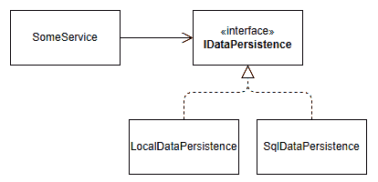

# 3 个架构原则

## 在开始之前：加入我们的 Discord 书籍社区

直接向作者本人提供反馈，并在我们的 Discord 服务器上与其他早期读者聊天（在“architecting-aspnet-core-apps-3e”频道下找到，位于“EARLY ACCESS SUBSCRIPTION”下）。

[`packt.link/EarlyAccess`](https://packt.link/EarlyAccess)


本章深入探讨了基本架构原则：当代软件开发实践支柱。这些原则帮助我们创建灵活、健壮、可测试和可维护的代码。我们可以使用这些原则来激发批判性思维，培养我们评估权衡、预测潜在问题以及通过影响我们的决策过程和帮助我们的设计选择来创建经得起时间考验的解决方案。在我们踏上这段旅程时，我们会在整本书中不断参考这些原则，特别是 SOLID 原则，这些原则提高了我们构建灵活和健壮软件系统的能力。在本章中，我们将涵盖以下主题：

+   关注点分离（SoC）原则

+   **DRY** 原则

+   **KISS** 原则

+   **SOLID** 原则

我们还修订了以下概念：

+   协方差

+   逆变

+   接口

## 关注点分离（SoC）

如其名所示，这个想法是将我们的软件分成逻辑块，每个块代表一个关注点。一个“关注点”指的是程序的一个特定方面。它是在系统中服务于特定目的的特定兴趣或焦点。关注点可以是数据管理这样广泛的，也可以是用户身份验证这样具体的，甚至更具体，如将对象复制到另一个对象中。关注点分离原则建议每个关注点都应该被隔离并单独管理，以提高系统的可维护性、模块化和可理解性。

> 关注点分离（SoC）原则适用于所有编程范式。简而言之，这个原则意味着将程序分解为正确的部分。例如，模块、子系统和微服务是宏观部分，而类和方法是更小的部分。

通过正确地分离关注点，我们可以防止一个区域的变化影响其他区域，允许更高效的代码重用，并使独立理解和管理工作系统的不同部分更容易。以下是一些示例：

+   安全性和日志记录是跨切面关注点。

+   渲染用户界面是一个关注点。

+   处理 HTTP 请求是一个关注点。

+   将对象复制到另一个对象中是一个关注点。

+   协调分布式工作流是一个关注点。

在转向 DRY 原则之前，考虑在将软件划分为部分以创建连贯单元时的关注点是至关重要的。良好的关注点分离有助于创建模块化设计，更有效地面对设计难题，从而实现可维护的应用程序。

## 不要重复自己（DRY）

DRY 原则倡导关注点分离原则，并旨在消除代码中的冗余。它提倡每个知识或逻辑片段在系统中应有一个单一、明确的表示。因此，当你系统中存在重复的逻辑时，将其封装，并在多个地方重用这个新的封装。如果你发现自己多处编写相同的或类似的代码，将那段代码重构为一个可重用的组件。利用函数、类、模块或其他抽象来重构代码。遵循 DRY 原则可以使代码更易于维护、更少出错、更容易修改，因为逻辑更改或错误修复只需要在一个地方进行，从而降低了引入错误或不一致的可能性。然而，必须根据关注点重新组合重复的逻辑，而不仅仅是根据代码本身的相似性。让我们看看这两个类：

```cs
public class AdminApp
{
    public async Task DisplayListAsync(
        IBookService bookService,
        IBookPresenter presenter)
    {
        var books = await bookService.FindAllAsync();
        foreach (var book in books)
        {
            await presenter.DisplayAsync(book);
        }
    }
}
public class PublicApp
{
    public async Task DisplayListAsync(
        IBookService bookService,
        IBookPresenter presenter)
    {
        var books = await bookService.FindAllAsync();
        foreach (var book in books)
        {
            await presenter.DisplayAsync(book);
        }
    }
}
```

代码非常相似，但封装单个类或方法可能是一个错误。为什么？保持两个独立的类更合理，因为管理程序与公共程序相比可能有不同的修改原因。然而，将列表逻辑封装到`IBookPresenter`接口中是有意义的。如果需要，它将允许我们对两种类型的用户做出不同的反应，例如过滤管理面板列表，但在公共部分做不同的事情。实现这一点的其中一种方法是将`foreach`循环替换为`presenter`的`DisplayListAsync(books)`调用，如下面突出显示的代码所示：

```cs
public class AdminApp
{
    public async Task DisplayListAsync(
        IBookService bookService,
        IBookPresenter presenter)
    {
        var books = await bookService.FindAllAsync();
        // We could filter the list here
        await presenter.DisplayListAsync(books);
    }
}
public class PublicApp
{
    public async Task DisplayListAsync(
        IBookService bookService,
        IBookPresenter presenter)
    {
        var books = await bookService.FindAllAsync();
        await presenter.DisplayListAsync(books);
    }
}
```

这些简单实现之外还有更多内容可以讨论，比如支持多个接口实现以增加灵活性，但让我们把一些主题留到书的后半部分。

> 当你不知道如何命名一个类或方法时，你可能已经发现了关注点分离的问题。这是一个很好的迹象，表明你应该回到起点。然而，命名是困难的，所以有时候，就是这样。

在遵循关注点分离原则的同时保持我们的代码 DRY 是至关重要的。否则，可能看似不错的举动可能会变成一场噩梦。

## 简单，愚蠢（KISS）

这是一个简单直接的原则，但也是最重要的原则之一。就像在现实世界中一样，移动部件越多，出问题的机会就越多。这个原则是一种设计哲学，主张设计简单化。它强调系统在保持简单而不是变得复杂时工作得最好。追求简单可能涉及编写更短的方法或函数、最小化参数数量、避免过度设计，并选择最简单的解决方案来解决问题。添加接口、抽象层和复杂的对象层次结构会增加复杂性，但这些附加的好处是否比底层复杂性更好？如果是的话，它们是值得的；如果不是，它们就不值得。

> 作为指导原则，当你可以用更少的复杂性编写相同的程序时，就去做吧。这也是为什么预测未来需求有时可能会产生不利影响，因为它可能会无意中将不必要的复杂性注入到你的代码库中，而这些特性可能永远不会实现。

我们在书中学习设计模式，并使用它们来设计系统。我们学习如何将高度工程化应用于我们的代码，如果在不正确的环境中进行，可能会导致过度工程化。在书的结尾，我们在探讨垂直切片架构和请求-端点-响应（REPR）模式时，回到了 KISS 原则。接下来，我们深入探讨 SOLID 原则，这是灵活软件设计的关键。

## SOLID 原则

SOLID 是一个代表五个原则的缩写，这些原则扩展了基本面向对象编程（OOP）概念——**抽象**、**封装**、**继承**和**多态**。它们提供了更多关于做什么和如何做的细节，指导开发者走向更稳健和灵活的设计。重要的是要记住，这些只是指导原则，不是你必须遵循的规则，无论什么情况。考虑一下对你具体项目有意义的事情。如果你正在构建一个小工具，可能不需要像构建关键业务应用那样严格遵循这些原则。在业务关键应用的情况下，可能更接近地遵循它们是个好主意。然而，无论你的应用大小如何，通常遵循它们都是明智之举。这就是为什么我们在深入研究设计模式之前讨论它们。SOLID 缩写代表以下内容：

+   **单一职责原则**

+   **开放/封闭原则**

+   **里氏替换原则**

+   **接口隔离原则**

+   **依赖倒置原则**

通过遵循这些原则，你的系统应该变得更容易测试和维护。

### 单一职责原则（SRP）

实质上，SRP 意味着一个类应该只持有一个，且仅有一个职责，这让我想到了以下引言：

> *“一个类不应该有超过一个改变的理由。”——罗伯特·C·马丁，单一职责原则的创始人*

好的，但为什么？在回答这个问题之前，花一点时间回忆一下你曾经参与过的项目，其中有人在一开始就改变了要求。我想起了几个可以从这个原则中受益的项目。现在，想象一下如果系统的每个部分都只有一个任务：一个改变的理由，那会简单多少。

> 软件可维护性问题可能是由技术和非技术人员共同造成的。没有什么是纯粹的黑或白——大多数事情都是灰色的一抹。软件设计也是如此：总是尽力而为，从错误中学习，保持谦逊（即持续改进）。

通过理解应用程序天生就会变化，当这种情况发生时，你会感觉更好，而 SRP 有助于减轻变化的影响。例如，它有助于使我们的类更易于阅读和重用，并创建更灵活、更易于维护的系统。此外，当一个类只做一件事时，更容易看到变化将如何影响系统，这对于复杂的类来说更具挑战性，因为一个变化可能会破坏其他部分。此外，职责越少，代码越少。代码越少，就越容易理解，帮助你更快地掌握软件的这一部分。让我们在实际行动中尝试一下。

#### 项目 – 单一职责

首先，我们来看看两个代码示例中使用的`Product`类。该类代表一个简单的虚构产品：

```cs
public record class Product(int Id, string Name);
```

> 代码示例没有实现，因为它与理解 SRP 无关。我们专注于类 API。请假设我们使用您最喜欢的数据库实现了数据访问逻辑。

以下类违反了 SRP：

```cs
namespace BeforeSRP;
public class ProductRepository
{
    public ValueTask<Product> GetOnePublicProductAsync(int productId)
        => throw new NotImplementedException();
    public ValueTask<Product> GetOnePrivateProductAsync(int productId)
        => throw new NotImplementedException();
    public ValueTask<IEnumerable<Product>> GetAllPublicProductsAsync()
        => throw new NotImplementedException();
    public ValueTask<IEnumerable<Product>> GetAllPrivateProductsAsync()
        => throw new NotImplementedException();
    public ValueTask CreateAsync(Product product)
        => throw new NotImplementedException();
    public ValueTask UpdateAsync(Product product)
        => throw new NotImplementedException();
    public ValueTask DeleteAsync(Product product)
        => throw new NotImplementedException();
}
```

前面的类中哪些不符合 SRP？通过阅读方法的名称，我们可以提取两个职责：

+   处理公共产品（高亮代码）。

+   处理私有产品。

`ProductRepository`类混合了公共和私有产品逻辑。仅从该 API 来看，就有许多可能导致错误并泄露受限数据给公共用户的情况。这也因为该类向面向公众的消费者公开了私有逻辑；其他人可能会犯错。现在我们已经确定了职责，我们可以重新思考这个类。我们知道它有两个职责，所以将类拆分为两个听起来是一个很好的第一步。让我们从提取公共 API 开始：

```cs
namespace AfterSRP;
public class PublicProductReader
{
    public ValueTask<IEnumerable<Product>> GetAllAsync()
        => throw new NotImplementedException();
    public ValueTask<Product> GetOneAsync(int productId)
        => throw new NotImplementedException();
}
```

现在的`PublicProductReader`类只包含两个方法：`GetAllAsync`和`GetOneAsync`。当阅读类的名称及其方法时，很明显该类只处理公共产品数据。通过降低类的复杂性，我们使其更容易理解。接下来，让我们对私有产品做同样的处理：

```cs
namespace AfterSRP;
public class PrivateProductRepository
{
    public ValueTask<IEnumerable<Product>> GetAllAsync()
        => throw new NotImplementedException();
    public ValueTask<Product> GetOneAsync(int productId)
        => throw new NotImplementedException();
    public ValueTask CreateAsync(Product product)
        => throw new NotImplementedException();
    public ValueTask DeleteAsync(Product product)
        => throw new NotImplementedException();
    public ValueTask UpdateAsync(Product product)
        => throw new NotImplementedException();
}
```

`PrivateProductRepository` 类遵循相同的模式。它包括读取方法，方法名与 `PublicProductReader` 类相同，以及只有具有私有访问权限的用户才能使用的修改方法。通过将初始类拆分为两个，我们提高了代码的可读性、灵活性和安全性。然而，在使用单一责任原则（SRP）时，需要注意的一点是不要过度拆分类。系统中的类越多，组装系统可能变得越复杂，调试和跟踪执行路径可能越困难。另一方面，许多职责分离良好的系统应该导致更好的、更易于测试的系统。很难定义一个硬性规则来定义“一个原因”或“单一责任”。然而，作为一个经验法则，目标是将围绕其责任的单个类中的功能集打包在一起。你应该去除任何多余的逻辑并添加缺失的部分。SRP 违规的一个良好指标是当你不知道如何命名一个元素时，这表明该元素不应该位于那里，你应该将其提取出来，或者将其拆分为多个更小的部分。

> 为变量、方法、类和其他元素使用精确的名称非常重要，不应被忽视。

另一个良好指标是当一个方法变得太大时，可能包含许多 `if` 语句或循环。在这种情况下，你可以将那个方法拆分为多个更小的方法、类或其他适合你要求的构造。这应该使代码更容易阅读，并使初始方法体更清晰。这通常也有助于你去除无用的注释并提高可测试性。接下来，我们将探讨如何在不修改代码的情况下更改行为，但在那之前，让我们看看接口。

### 开闭原则（OCP）

让我们从 1988 年首次将“开闭原则”这个术语写入的人，伯特兰·梅耶（Bertrand Meyer）的一句话开始这个部分：

> *“软件实体（类、模块、函数等）应该对扩展开放，但对修改封闭。”*

好吧，但这意味着什么？这意味着你应该能够在不更改代码的情况下从外部更改类的行为。从历史的角度来看，1988 年 OCP（开闭原则）首次出现时指的是继承，自那时起面向对象编程已经发展了很多。继承仍然有用，但你应该小心，因为它很容易被误用。继承在类之间创建直接的耦合。大多数时候，你应该选择组合而不是继承。

> “组合优于继承”是一个原则，它建议通过组合简单、灵活的部件（组合）来构建对象，而不是通过从更大的、更复杂的对象继承属性（继承）。
> 
> > 想象一下用乐高®积木来建造。如果你将小积木组合起来（组合），而不是试图改变一个已经具有固定形状的大积木（继承），那么建造和调整你的创作会更容易。

同时，我们探索了业务流程的三个版本，以说明 OCP。

#### 项目 – 开放封闭

首先，我们来看看代码示例中使用的 `Entity` 和 `EntityRepository` 类：

```cs
public record class Entity();
public class EntityRepository
{
    public virtual Task CreateAsync(Entity entity)
        => throw new NotImplementedException();
}
```

`Entity` 类代表一个没有属性的简单虚构实体；可以将其视为任何你想要的东西。`EntityRepository` 类有一个单一的 `CreateAsync` 方法，用于将一个 `Entity` 实例插入到数据库中（如果已实现）。

> 代码示例中包含很少的实现细节，因为它与理解 OCP 无关。请假设我们使用你喜欢的数据库实现了 `CreateAsync` 逻辑。

对于其余的示例，我们重构了 `EntityService` 类，从一个继承 `EntityRepository` 类的版本开始，打破了 OCP：

```cs
namespace OCP.NoComposability;
public class EntityService : EntityRepository
{
    public async Task ComplexBusinessProcessAsync(Entity entity)
    {
        // Do some complex things here
        await CreateAsync(entity);
        // Do more complex things here
    }
}
```

如命名空间所暗示的，前面的 `EntityService` 类没有提供可组合性。此外，我们将其与 `EntityRepository` 类紧密耦合。由于我们刚刚覆盖了“组合优于继承”的原则，我们可以快速隔离问题：**继承**。作为解决这个混乱的下一步，让我们提取一个私有 `_repository` 字段来保存一个 `EntityRepository` 实例，如下所示：

```cs
namespace OCP.Composability;
public class EntityService
{
    private readonly EntityRepository _repository
        = new EntityRepository();
    public async Task ComplexBusinessProcessAsync(Entity entity)
    {
        // Do some complex things here
        await _repository.CreateAsync(entity);
        // Do more complex things here
    }
}
```

现在，`EntityService` 由一个 `EntityRepository` 实例组成，并且不再有继承。然而，我们仍然紧密耦合了这两个类，并且不改变其代码就无法以这种方式改变 `EntityService` 的行为。为了解决我们最后的问题，我们可以在设置我们的私有字段的地方注入一个 `EntityRepository` 实例，如下所示：

```cs
namespace OCP.DependencyInjection;
public class EntityService
{
    private readonly EntityRepository _repository;
    public EntityService(EntityRepository repository)
    {
        _repository = repository;
    }
    public async Task ComplexBusinessProcessAsync(Entity entity)
    {
        // Do some complex things here
        await _repository.CreateAsync(entity);
        // Do more complex things here
    }
}
```

通过前面的更改，我们打破了 `EntityService` 和 `EntityRepository` 类之间的紧密耦合。我们还可以通过决定将哪个 `EntityRepository` 类的实例注入到 `EntityService` 构造函数中来从外部控制 `EntityService` 类的行为。我们甚至可以通过利用抽象而不是具体类来更进一步，并在覆盖 DIP 的同时探索这一点。正如我们刚刚探索的，OCP 是一个超级强大、简单且允许从外部控制对象的原则。例如，我们可以创建两个具有不同 `EntityRepository` 实例的 `EntityService` 类实例，这些实例连接到不同的数据库。以下是一个粗略的示例：

```cs
using OCP;
using OCP.DependencyInjection;
// Create the entity in database 1
var repository1 = new EntityRepository(/* connection string 1 */);
var service1 = new EntityService(repository1);
// Create the entity in database 2
var repository2 = new EntityRepository(/* connection string 2 */);
var service2 = new EntityService(repository2);
// Save an entity in two different databases
var entity = new Entity();
await service1.ComplexBusinessProcessAsync(entity);
await service2.ComplexBusinessProcessAsync(entity);
```

在前面的代码中，假设我们实现了 `EntityRepository` 类并配置了 `repository1` 和 `repository2`，那么在 `service1` 和 `service2` 上执行 `ComplexBusinessProcessAsync` 方法的结果将在两个不同的数据库中创建实体。两个实例之间的行为变化是在不改变 `EntityService` 类代码的情况下发生的；组合：1，继承：0。

> 我们在*第五章*，*策略、抽象工厂和单例*中探讨了**策略模式**——实现 OCP 的最佳方式。在*第六章*，*依赖注入*中，我们重新审视了该模式，并学习了如何使用依赖注入将程序精心设计的组件组装在一起。

接下来，我们将探索我们将其视为五个中最复杂的一个，但我们将使用得最少的原则。

### 李斯克夫替换原则（LSP）

李斯克夫替换原则（LSP）指出，在一个程序中，如果我们用一个子类（子类型）的实例替换一个超类（超类型）的实例，程序不应该崩溃或出现意外的行为。想象我们有一个名为`Bird`的基类，它有一个名为`Fly`的函数，我们添加了`Eagle`和`Penguin`子类。由于企鹅不能飞，用`Penguin`子类的实例替换`Bird`类的实例可能会出现问题，因为程序期望所有鸟类都能飞。所以，根据 LSP，我们的子类应该表现出使程序仍然可以正确工作的行为，即使它不知道正在使用哪个子类，从而保持系统稳定性。在继续讨论 LSP 之前，让我们看看协变和逆变。

#### 协变和逆变

我们不会深入探讨这一点，所以不会偏离 LSP 太远，但既然正式定义提到了它们，我们至少要理解这些。协变和逆变代表特定的多态场景。它们允许引用类型隐式地转换为其他类型。它们适用于泛型类型参数、委托和数组类型。你可能永远不会需要记住这一点，因为其中大部分是隐式的，但这里有一个概述：

+   **协变（**`out`**）**使我们能够使用更派生的类型（子类型）而不是超类型。协变通常适用于方法返回类型。例如，如果一个基类方法返回一个类的实例，那么派生类中等效的方法可以返回子类的实例。

+   **逆变（**`in`**）**是相反的情况。它允许使用较少派生的类型（超类型）代替子类型。逆变通常适用于方法参数类型。如果一个基类的方法接受特定类的参数，那么派生类中等效的方法可以接受超类的参数。

让我们通过一些代码来更好地理解这一点，从我们使用的模型开始：

```cs
public record class Weapon { }
public record class Sword : Weapon { }
public record class TwoHandedSword : Sword { }
```

简单的类层次结构，我们有一个`TwoHandedSword`类，它继承自`Sword`类，而`Sword`类继承自`Weapon`类。

##### 协变

为了演示协变，我们利用以下泛型接口：

```cs
public interface ICovariant<out T>
{
    T Get();
}
```

在 C#中，`out`修饰符，高亮显示的代码，明确指定了泛型参数`T`是协变的。协变适用于返回类型，因此`Get`方法返回泛型类型`T`。在测试之前，我们需要一个实现。这里有一个简单的实现：

```cs
public class SwordGetter : ICovariant<Sword>
{
    private static readonly Sword _instance = new();
    public Sword Get() => _instance;
}
```

突出的代码，代表 `T` 参数，其类型为 `Sword`，是 `Weapon` 的子类。由于协变意味着你可以 **返回（输出）子类的实例作为其超类型**，使用 `Sword` 子类允许你用 `Weapon` 超类型来探索这一点。以下是一个演示协变的 xUnit 事实：

```cs
[Fact]
public void Generic_Covariance_tests()
{
    ICovariant<Sword> swordGetter = new SwordGetter();
    ICovariant<Weapon> weaponGetter = swordGetter;
    Assert.Same(swordGetter, weaponGetter);
    Sword sword = swordGetter.Get();
    Weapon weapon = weaponGetter.Get();
    var isSwordASword = Assert.IsType<Sword>(sword);
    var isWeaponASword = Assert.IsType<Sword>(weapon);
    Assert.NotNull(isSwordASword);
    Assert.NotNull(isWeaponASword);
}
```

突出的行代表协变，显示我们可以隐式地将 `ICovariant<Sword>` 子类型转换为 `ICovariant<Weapon>` 超类型。随后的代码展示了这种多态变化会发生什么。例如，`weaponGetter` 对象的 `Get` 方法返回 `Weapon` 类型，而不是 `Sword`，即使底层实例是 `SwordGetter` 对象。然而，实际上这个 `Weapon` 是一个 `Sword`，正如断言所证明的。接下来，让我们探索逆变。

##### **逆变**

为了演示协变，我们利用以下泛型接口：

```cs
public interface IContravariant<in T>
{
    void Set(T value);
}
```

在 C# 中，`in` 修饰符，突出的代码，明确指定泛型参数 `T` 是逆变的。逆变适用于输入类型，因此 `Set` 方法接受泛型类型 `T` 作为参数。在测试之前，我们需要一个实现。以下是一个简单的实现：

```cs
public class WeaponSetter : IContravariant<Weapon>
{
    private Weapon? _weapon;
    public void Set(Weapon value)
        => _weapon = value;
}
```

突出的代码，代表 `T` 参数，其类型为 `Weapon`，是我们模型中最顶层的类；其他类都从中派生。由于逆变意味着你可以 **输入子类的实例作为其超类型**，使用 `Weapon` 超类型允许你用 `Sword` 和 `TwoHandedSword` 子类型来探索这一点。以下是一个演示逆变的 xUnit 事实：

```cs
[Fact]
public void Generic_Contravariance_tests()
{
    IContravariant<Weapon> weaponSetter = new WeaponSetter();
    IContravariant<Sword> swordSetter = weaponSetter;
    Assert.Same(swordSetter, weaponSetter);
    // Contravariance: Weapon > Sword > TwoHandedSword
    weaponSetter.Set(new Weapon());
    weaponSetter.Set(new Sword());
    weaponSetter.Set(new TwoHandedSword());
    // Contravariance: Sword > TwoHandedSword
    swordSetter.Set(new Sword());
    swordSetter.Set(new TwoHandedSword());
}
```

突出的行代表逆变。我们可以隐式地将 `IContravariant<Weapon>` 超类型转换为 `IContravariant<Sword>` 子类型。随后的代码展示了这种多态变化会发生什么。例如，`weaponSetter` 对象的 `Set` 方法可以接受 `Weapon`、**Sword** 或 `TwoHandedSword` 实例，因为它们都是 `Weapon` 类型的子类型（或者本身就是 `Weapon` 类型）。同样，`swordSetter` 实例也接受 `Sword` 或 `TwoHandedSword` 实例，从继承层次结构中的 `Sword` 类型开始，因为编译器认为 `swordSetter` 实例是 `IContravariant<Sword>` 类型，即使其底层实现是 `WeaponSetter` 类型。编写以下代码会导致编译错误：

```cs
swordSetter.Set(new Weapon());
```

错误是：

```cs
Cannot convert from Variance.Weapon to Variance.Sword.
```

这意味着对于编译器来说，`swordSetter` 的类型是 `IContravariant<Sword>`，而不是 `IContravariant<Weapon>`。

> **注意**
> 
> > 我在 *进一步阅读* 部分留下了一个链接，解释了协变和逆变，如果你想了解更多信息，因为我们在这里只介绍了基础知识。

现在我们已经了解了协变和逆变，我们可以探索 LSP 的正式版本。

#### LSP 的解释

LSP 是由 Barbara Liskov 在 20 世纪 80 年代末提出的，并在 90 年代由 Liskov 和 Jeannette Wing 重新审视，以创建我们今天所知道和使用的原则。它也与 Bertrand Meyer 的*设计合同*相似。接下来，让我们看看正式的子类型要求定义：

> *设是关于类型 T 的对象 x 的一个可证明的性质。那么，对于类型 S 的对象 y 应该是正确的，其中 S 是 T 的子类型。*

简而言之，如果`S`是`T`的子类型，我们可以用`S`类型的对象替换`T`类型的对象，而不改变程序预期的任何行为（正确性）。LSP 增加了以下签名要求：

+   子类型中方法参数必须是逆变。

+   子类型中方法返回类型必须是协变的。

+   你不能在子类型中抛出一种新的异常类型。

> 在 C#中，不费劲就违反前两条规则是困难的。
> 
> > 在子类型中抛出一种新的异常类型也被视为改变行为。然而，你可以在子类型中抛出子类型异常，因为现有的消费者可以处理它们。

LSP 还增加了以下行为条件：

| **条件** | **示例** |
| --- | --- |
| 在超类型中实现的任何前置条件都应该在子类型中产生相同的结果，但子类型可以对此不那么严格，决不能更严格。 | 如果超类型验证一个参数不能为`null`，则子类型可以移除该验证，但不能添加更严格的验证规则。 |
| 在超类型中实现的任何后置条件都应该在子类型中产生相同的结果，但子类型可以对此更加严格，决不能更宽松。 | 如果超类型永远不会返回`null`，则子类型也不应该返回`null`，否则会破坏未测试`null`的对象消费者。如果超类型不保证返回的值不能为`null`，则子类型可以决定永远不返回`null`，这样两个实例就可以互换。 |
| 子类型必须保持超类型的不可变性。 | 子类型必须通过为超类型编写的所有测试，因此它们之间没有差异（它们不变化/它们反应相同）。 |
| 历史约束规定，在超类型中发生的事情必须在子类型中发生，而且你不能改变这一点。 | 子类型可以添加新的属性（状态）和方法（行为）。子类型不得以任何新的方式修改超类型状态。 |

表 3.1：LSP 行为条件

好吧，在这个时候，你可能会觉得这相当复杂。但请放心，这是那些原则中不那么重要的一个，因为我们正在尽可能远离继承，所以 LSP 不应该经常适用。

> 我们可以将 LSP 总结为：
> 
> > *在你的子类型中添加新的行为和状态；不要改变现有的行为。*

简而言之，应用 LSP（Liskov 替换原则）允许我们替换一个类的实例为其子类实例，而不会破坏任何东西。用乐高®的类比来说：LSP 就像用一个带有贴纸的 4x2 积木替换一个普通的 4x2 积木：结构完整性以及积木的角色都没有改变；新的积木只是有一个新的贴纸状态。

> **提示**
> 
> > 强制执行这些行为约束的一个绝佳方法是自动化测试。你可以编写一个测试套件，并对其针对特定超类所有子类的运行进行测试，以强制保持行为的一致性。

让我们通过一些代码来直观地展示这一点。

#### 项目 – Liskov 替换原则

为了演示 LSP，我们将探索一些场景。每个场景都是一个遵循相同结构的测试类：

```cs
namespace LiskovSubstitution;
public class TestClassName
{
    public static TheoryData<SuperClass> InstancesThatThrowsSuperExceptions = new TheoryData<SuperClass>()
    {
        new SuperClass(),
        new SubClassOk(),
        new SubClassBreak(),
    };
    [Theory]
    [MemberData(nameof(InstancesThatThrowsSuperExceptions))]
    public void Test_method_name(SuperClass sut)
    {
        // Scenario
    }
    // Other classes, like SuperClass, SubClassOk, 
    // and SubClassBreak
}
```

在前面的代码结构中，高亮显示的代码为每个测试而改变。设置很简单；我使用测试方法来模拟程序可能执行的代码，仅通过在三个不同的类上运行相同的代码三次，每个理论就会失败一次：

+   初始测试通过

+   子类型尊重 LSP 的测试通过

+   子类型违反 LSP 的测试失败。

> 参数`sut`是测试对象，这是一个众所周知的缩写。

当然，我们无法探索所有场景，所以我选择了三个；让我们检查第一个。

##### 场景 1：ExceptionTest

这个场景探讨了当子类型抛出新的异常类型时可能发生的情况。以下代码是测试对象的消费者：

```cs
try
{
    sut.Do();
}
catch (SuperException ex)
{
    // Some code
}
```

上述代码非常标准。我们使用 try-catch 块封装了某些代码（`Do`方法）的执行，以处理特定的异常。初始的测试对象（`SuperClass`）模拟在`Do`方法执行过程中抛出类型为`SuperException`的异常。当我们执行代码时，try-catch 块捕获了`SuperException`，一切按计划进行。以下是代码：

```cs
public class SuperClass
{
    public virtual void Do()
        => throw new SuperException();
}
public class SuperException : Exception { }
```

接下来，`SubClassOk`类模拟执行过程的变化，并抛出一个继承自`SuperException`类的`SubException`。当我们执行代码时，try-catch 块捕获了`SubException`，因为它属于`SuperException`的子类型，一切按计划进行。以下是代码：

```cs
public class SubClassOk : SuperClass
{
    public override void Do()
        => throw new SubException();
}
public class SubException : SuperException { }
```

最后，`SubClassBreak`类模拟抛出`AnotherException`，这是一种新的异常类型。当我们执行代码时，程序意外地停止，因为我们没有为这种情况设计 try-catch 块。以下是代码：

```cs
public class SubClassBreak : SuperClass
{
    public override void Do()
        => throw new AnotherException();
}
public class AnotherException : Exception { }
```

所以，尽管听起来可能很平凡，抛出那个异常会破坏程序，违反 LSP。

##### 场景 2：PreconditionTest

这个场景探讨了在超类中实现的任何前置条件都应该在子类型中产生相同的结果，但子类型对此可以不那么严格，永远不能更严格。以下代码是测试对象的消费者：

```cs
var value = 5;
var result = sut.IsValid(value);
Console.WriteLine($"Do something with {result}");
```

上述代码非常标准。我们有一个 `value` 变量，它可能来自任何地方。然后我们将其传递给 `IsValid` 方法。最后，我们对 `result` 做些处理；在这种情况下，我们向控制台写入一行。最初要测试的主题（`SuperClass`）模拟存在一个前提条件，强制值必须是正数。以下是代码：

```cs
public class SuperClass
{
    public virtual bool IsValid(int value)
    {
        if (value < 0)
        {
            throw new ArgumentException(
                "Value must be positive.", 
                nameof(value)
            );
        }
        return true;
    }
}
```

接下来，`SubClassOk` 类模拟执行发生变化，并容忍高达 -10 的负值。在执行代码时，一切正常，因为前提条件不那么严格。以下是代码：

```cs
public class SubClassOk : SuperClass
{
    public override bool IsValid(int value)
    {
        if (value < -10)
        {
            throw new ArgumentException(
                "Value must be greater or equal to -10.", 
                nameof(value)
            );
        }
        return true;
    }
}
```

最后，`SubClassBreak` 类模拟执行发生变化，并限制使用小于 10 的值。在执行代码时，它崩溃了，因为我们没有预料到这个错误；前提条件比 `SuperClass` 更严格。以下是代码：

```cs
public class SubClassBreak : SuperClass
{
    public override bool IsValid(int value)
    {
        if (value < 10) // Break LSP
        {
            throw new ArgumentException(
                "Value must be greater than 10.", 
                nameof(value)
            );
        }
        return true;
    }
}
```

这又是简单变化如何破坏其消费者和 LSP 的一个例子。当然，这是一个过于简化的例子，只关注前提条件，但同样的情况也适用于更复杂的场景。编码就像玩积木。

##### 场景 3：后置条件测试

这个场景探讨了在超类型中实现的后置条件应该在子类型中产生相同的结果，但子类型可以对此更加严格，决不能更宽松。以下代码是受测试主题的消费者：

```cs
var value = 5;
var result = sut.Do(value);
Console.WriteLine($"Do something with {result.Value}");
```

上述代码非常标准，并且与第二个场景非常相似。我们有一个 `value` 变量，它可能来自任何地方。然后我们将其传递给 `Do` 方法。最后，我们对 `result` 做些处理；在这种情况下，我们向控制台写入一行。`Do` 方法返回一个 `Model` 类的实例，该类只有一个 `Value` 属性。以下是代码：

```cs
public record class Model(int Value);
```

最初要测试的主题（`SuperClass`）模拟在执行过程中某个时刻返回一个 `Model` 实例，并将 `Value` 属性的值设置为 `value` 参数的值。以下是代码：

```cs
public class SuperClass
{
    public virtual Model Do(int value)
    {
        return new(value);
    }
}
```

接下来，`SubClassOk` 类模拟执行发生了变化，并返回一个 `SubModel` 实例。`SubModel` 类继承自 `Model` 类并添加了一个 `DoCount` 属性。在执行代码时，一切正常，因为输出是不变的（`SubModel` 是 `Model` 的一种，表现相同）。以下是代码：

```cs
public class SubClassOk : SuperClass
{
    private int _doCount = 0;
    public override Model Do(int value)
    {
        var baseModel = base.Do(value);
        return new SubModel(baseModel.Value, ++_doCount);
    }
}
public record class SubModel(int Value, int DoCount) : Model(Value);
```

最后，`SubClassBreak` 类模拟执行发生变化，并在 `value` 参数的值为 5 时返回 `null`。在执行代码时，当在 `Console.WriteLine` 调用中发生的插值过程中访问 `Value` 属性时，会抛出 `NullReferenceException` 异常。以下是代码：

```cs
public class SubClassBreak : SuperClass
{
    public override Model Do(int value)
    {
        if (value == 5)
        {
            return null;
        }
        return base.Do(value);
    }
}
```

这个最后的场景再次展示了简单的更改如何破坏我们的程序。当然，这只是一个过于简化的例子，只关注后置条件和历史约束，但同样的情况也适用于更复杂的情况。关于历史约束呢？我们通过创建`_doCount`字段向`SubClassOk`类添加了一个新的状态元素。此外，通过添加`SubModel`类，我们将`DoCount`属性添加到了返回类型中。这个字段和属性在超类型中不存在，并且它们没有改变其行为：LSP 遵循！

#### 结论

LSP 的关键思想是，超类型的消费者应该对它是在与超类型的一个实例还是子类型的一个实例交互保持无知。我们也可以把这个原则称为向后兼容性原则，因为之前所有的工作方式在替换后必须至少保持相同，这就是为什么这个原则是至关重要的。再次强调，这只是一个原则，而不是法律。你还可以将 LSP 的违反视为*代码异味*。从那里，分析你是否有一个设计问题及其影响。根据具体情况运用你的分析技能，并得出是否可以接受在该特定情况下违反 LSP 的结论。有时你可能想要改变程序的行为并违反 LSP，但要注意你可能会破坏你没有考虑到的某些执行路径，并引入缺陷。随着我们不断进步，我们越来越远离继承，也就越来越不需要担心这个原则。然而，如果你使用继承并希望确保你的子类型不会破坏程序：应用 LSP，你将因为提高生产无缺陷、向后兼容更改的机会而得到回报。让我们接下来看看 ISP。

### 接口分离原则（ISP）

让我们从罗伯特·C·马丁的另一个著名引言开始：

> *“许多特定客户端的接口比一个通用接口更好。”*

这是什么意思？这意味着以下内容：

+   你应该创建接口。

+   你应该更重视小型接口。

+   你不应该创建多功能接口。

> 你可以将多功能接口视为“统治一切接口”或是在*第一章*，*简介*中引入的上帝类。

接口可以指类接口（类的公共成员）或 C#接口。我们在书中主要关注 C#接口，因为我们广泛地使用它们。此外，C#接口非常强大。说到接口，在我们深入代码之前，让我们快速了解一下它们。

#### 什么是接口？

接口是 C#工具箱中创建灵活和可维护软件的最有价值的工具之一。一开始理解并掌握接口的力量可能很困难，尤其是从解释的角度来看，所以如果你还没有理解，请不要担心；你将在整本书中看到很多实际应用。

> 您可以看到一个接口允许一个类模仿不同的东西（API），将多态性提升到新的层次。

接下来是一些概述接口的更多细节：

+   接口的作用是定义一个统一的契约（公共方法、属性和事件）。在其理论形式中，接口不包含任何代码；它只是一个契约。在实践中，自从 C# 8 以来，我们可以在接口中创建默认实现，这有助于限制库中的破坏性更改（例如，在不破坏实现该接口的任何类的情况下向接口添加方法）。

+   接口应该是小的（ISP），其成员应朝向一个共同的目标（内聚）并承担单一责任（SRP）。

+   在 C# 中，一个类可以实现多个接口，暴露多个这些公共契约，或者更准确地说，可以是它们中的任何和所有。通过利用多态性，我们可以将一个类消费为它实现的任何接口，或者如果它继承自另一个类，则是其超类型。

> 一个类不继承自接口；它实现了接口。然而，一个接口可以继承自另一个接口。

现在，让我们在刷新了我们的记忆之后，探索一下 ISP 示例。

#### 项目 – 接口隔离

在这个项目中，我们以 SRP 示例中的相同类开始，但从中提取了 `ProductRepository` 类的接口。让我们先看看 `Product` 类作为提醒，它代表一个简单的虚构产品：

```cs
public record class Product(int Id, string Name);
```

> 代码示例没有实现，因为它与理解 ISP 无关。我们专注于接口。请假设我们使用您喜欢的数据库实现了数据访问逻辑。

现在，让我们看看从 `ProductRepository` 类中提取的接口：

```cs
namespace InterfaceSegregation.Before;
public interface IProductRepository
{
    public ValueTask<IEnumerable<Product>> GetAllPublicProductAsync();
    public ValueTask<IEnumerable<Product>> GetAllPrivateProductAsync();
    public ValueTask<Product> GetOnePublicProductAsync(int productId);
    public ValueTask<Product> GetOnePrivateProductAsync(int productId);
    public ValueTask CreateAsync(Product product);
    public ValueTask UpdateAsync(Product product);
    public ValueTask DeleteAsync(Product product);
}
```

在这一点上，`IProductRepository` 接口与 `ProductRepository` 类之前以相同的方式违反了 SRP 和 ISP。我们之前已经确定了 SRP 问题，但还没有达到提取接口的阶段。

> `ProductRepository` 类实现了 `IProductRepository` 接口，并且与 SRP 示例相同（所有方法 `throw new NotImplementedException()`）。

在 SRP 示例中，我们确定了以下责任：

+   处理公共产品。

+   处理私有产品。

根据我们之前的分析，我们有两个功能需求（公共和私有访问）。进一步挖掘后，我们还可以识别出五种不同的数据库操作。以下是结果表格：

|  | **公共** | **私有** |
| --- | --- | --- |
| 读取单个产品 | 是 | 是 |
| 读取所有产品 | 是 | 是 |
| 创建产品 | 否 | 是 |
| 更新产品 | 否 | 是 |
| 删除产品 | 否 | 是 |

表 3.3：一个表格，显示了软件需要做什么（功能需求）以及数据库中需要发生什么（数据库操作需求）。

我们可以从表 3.3 中提取以下数据库操作系列：

+   读取产品（读取一个，读取所有）。

+   写入或修改产品（创建、更新、删除）。

基于更深入的分析，我们可以提取代表数据库操作的`IProductReader`和`IProductWriter`接口。然后我们可以创建`PublicProductReader`和`PrivateProductRepository`类来实现我们的功能需求。让我们从`IProductReader`接口开始：

```cs
namespace InterfaceSegregation.After;
public interface IProductReader
{
    public ValueTask<IEnumerable<Product>> GetAllAsync();
    public ValueTask<Product> GetOneAsync(int productId);
}
```

通过这个接口，我们涵盖了*读取一个产品*和*读取所有产品*的使用场景。接下来，`IProductWriter`接口涵盖了其他三个数据库操作：

```cs
namespace InterfaceSegregation.After;
public interface IProductWriter
{
    public ValueTask CreateAsync(Product product);
    public ValueTask UpdateAsync(Product product);
    public ValueTask DeleteAsync(Product product);
}
```

我们可以使用前面的接口来涵盖所有数据库使用场景。接下来，让我们创建`PublicProductReader`类：

```cs
namespace InterfaceSegregation.After;
public class PublicProductReader : IProductReader
{
    public ValueTask<IEnumerable<Product>> GetAllAsync()
        => throw new NotImplementedException();
    public ValueTask<Product> GetOneAsync(int productId)
        => throw new NotImplementedException();
}
```

在前面的代码中，`PublicProductReader`只实现了`IProductReader`接口，涵盖了已识别的场景。我们在探索 ISP 的优势之前，先来处理`PrivateProductRepository`类：

```cs
namespace InterfaceSegregation.After;
public class PrivateProductRepository : IProductReader, IProductWriter
{
    public ValueTask<IEnumerable<Product>> GetAllAsync()
        => throw new NotImplementedException();
    public ValueTask<Product> GetOneAsync(int productId)
        => throw new NotImplementedException();
    public ValueTask CreateAsync(Product product)
        => throw new NotImplementedException();
    public ValueTask DeleteAsync(Product product)
        => throw new NotImplementedException();
    public ValueTask UpdateAsync(Product product)
        => throw new NotImplementedException();
}
```

在前面的代码中，`PrivateProductRepository`类实现了`IProductReader`和`IProductWriter`接口，涵盖了所有数据库需求。现在我们已经涵盖了构建块，让我们探索这能做什么。以下是`Program.cs`文件：

```cs
using InterfaceSegregation.After;
var publicProductReader = new PublicProductReader();
var privateProductRepository = new PrivateProductRepository();
ReadProducts(publicProductReader);
ReadProducts(privateProductRepository);
// Error: Cannot convert from PublicProductReader to IProductWriter
// ModifyProducts(publicProductReader); // Invalid
WriteProducts(privateProductRepository);
ReadAndWriteProducts(privateProductRepository, privateProductRepository);
ReadAndWriteProducts(publicProductReader, privateProductRepository);
void ReadProducts(IProductReader productReader)
{
    Console.WriteLine(
        "Reading from {0}.",
        productReader.GetType().Name
    );
}
void WriteProducts(IProductWriter productWriter)
{
    Console.WriteLine(
        "Writing to {0}.",
        productWriter.GetType().Name
    );
}
void ReadAndWriteProducts(IProductReader productReader, IProductWriter productWriter)
{
    Console.WriteLine(
        "Reading from {0} and writing to {1}.",
        productReader.GetType().Name,
        productWriter.GetType().Name
    );
}
```

从前面的代码中，`ReadProducts`、`ModifyProducts`和`ReadAndUpdateProducts`方法在控制台输出消息，以展示应用 ISP 的优势。《publicProductReader`（`PublicProductReader`的实例）和`privateProductRepository`（`PrivateProductRepository`的实例）变量被传递到方法中，以展示我们可以在当前设计中做什么，以及不能做什么。在我们深入探讨之前，当我们执行程序时，我们获得以下输出：

```cs
Reading from PublicProductReader.
Reading from PrivateProductRepository.
Writing to PrivateProductRepository.
Reading from PrivateProductRepository and writing to PrivateProductRepository.
Reading from PublicProductReader and writing to PrivateProductRepository.
```

##### 第一个操作

以下代码表示第一个操作：

```cs
ReadProducts(publicProductReader);
ReadProducts(privateProductRepository);
```

由于`PublicProductReader`和`PrivateProductRepository`类实现了`IProductReader`接口，因此`ReadProducts`方法接受它们，导致以下输出：

```cs
Reading from PublicProductReader.
Reading from PrivateProductRepository.
```

这意味着我们可以集中一些代码，从这两个实现中读取，而无需更改它们。

##### 第二个操作

以下代码表示第二个操作：

```cs
WriteProducts(privateProductRepository);
```

由于只有`PrivateProductRepository`类实现了`IProductWriter`接口，因此`WriteProducts`方法只接受`privateProductRepository`变量，并输出以下内容：

```cs
Writing to PrivateProductRepository.
```

这是良好分离的接口和责任的一个优点；如果我们尝试执行以下行，编译器会显示错误，指出我们“不能从 PublicProductReader 转换为 IProductWriter”：

```cs
ModifyProducts(publicProductReader);
```

这个错误是有意义的，因为 PublicProductReader 没有实现`IProductWriter`接口。

##### 第三个操作

以下代码表示第三个操作：

```cs
ReadAndWriteProducts(
    privateProductRepository, 
    privateProductRepository
);
ReadAndWriteProducts(
    publicProductReader, 
    privateProductRepository
);
```

让我们分别分析对`ReadAndWriteProducts`方法的两次调用，但在那之前，让我们看看控制台输出：

```cs
Reading from PrivateProductRepository and writing to PrivateProductRepository.
Reading from PublicProductReader and writing to PrivateProductRepository.
```

第一次执行读取和写入到`PrivateProductRepository`实例，这是可能的，因为它实现了`IProductReader`和`IProductWriter`接口。然而，第二次调用是从公共读取器读取，但使用私有写入器写入。最后一个示例展示了接口隔离原则（ISP）的力量，特别是当与单一职责原则（SRP）结合使用时，以及正确隔离我们的接口并针对程序用例设计代码时，如何轻松地交换一个部分为另一个部分。

> 你不应该将所有存储库都分为读取器和写入器；这个示例只是为了展示一些可能性。始终为你的程序规格设计你的程序。

#### 结论

总结接口隔离原则（ISP）背后的思想，如果你有多个较小的接口，更容易重用它们，并且只暴露你需要的功能，而不是暴露程序不需要的部分的 API。此外，通过按需实现它们，比从大接口中删除不需要的方法更容易使用多个专业接口来组合更大的部分。

> 主要的收获是**只依赖于你消费的接口**。

如果你还没有看到所有的好处，请不要担心。随着我们继续到最后一个 SOLID 原则，即依赖注入，书的其余部分，以及你练习应用 SOLID 原则，所有的部分都应该逐渐整合在一起。

> 就像单一职责原则（SRP）一样，要小心不要无意识地过度使用接口隔离原则（ISP）。考虑内聚性和你试图实现的目标，而不是接口可以变得多细粒度。你的接口越细粒度，你的系统将越灵活，但记住灵活性是有代价的，这个代价可能会很快变得非常高。例如，你的高度灵活的系统可能非常难以导航和理解，从而增加了在项目上工作的认知负荷。

接下来，我们将探讨 SOLID 原则中的最后一个原则。

### 依赖倒置原则（DIP）

依赖倒置原则（DIP）提供了灵活性、可测试性和模块化，通过减少类或模块之间的紧密耦合。让我们继续引用罗伯特·C·马丁（包括维基百科中的隐含上下文）：

> “人们应该‘依赖于抽象，而不是具体实现。’”

在上一节中，我们探讨了接口（抽象），这是我们 SOLID 工具箱中的一个关键元素，使用接口是接近依赖倒置原则（DIP）的最佳方式。

> 你想知道为什么不使用抽象类吗？虽然它们在提供继承的默认行为方面很有帮助，但它们并不完全抽象。如果一个是，最好使用接口。
> 
> > 接口更加灵活和强大，作为系统各部分之间的契约。它们还允许一个类实现多个接口，从而提高灵活性。然而，不要无意识地丢弃抽象类。实际上，不要无意识地丢弃任何东西。

暴露接口可以在编写单元测试时节省无数小时寻找复杂解决方案的时间。当构建其他人使用的框架或库时，这一点更是如此。在这种情况下，请更加注意为您的消费者提供接口，以便在必要时进行模拟。再次讨论接口的话题是很好的，但我们如何反转依赖关系流呢？剧透一下：接口！让我们首先比较直接依赖和反转依赖。

#### 直接依赖

当一段特定的代码（如类或模块）直接依赖于另一个时，就会发生直接依赖。例如，如果类 A 使用类 B 的方法，那么类 A 就直接依赖于类 B，这在传统编程中是一个典型的场景。假设我们有一个`SomeService`类，在生产中使用`SqlDataPersistence`类，而在开发和测试期间使用`LocalDataPersistence`类。如果不反转依赖关系，我们最终会得到以下 UML 依赖图：


图 3.2：直接依赖图架构

在先前的系统中，我们无法通过`CosmosDbDataPersistence`类（不在图中）更改`SqlDataPersistence`或`LocalDataPersistence`类，而不会影响`SomeService`类。我们称这种直接的依赖为**紧密耦合**。

#### 反转依赖

当高级模块（提供复杂逻辑）独立于低级模块（提供基本、基础操作）时，就会发生反转依赖。我们可以通过在模块之间引入抽象（如接口）来实现这一点。这意味着，而不是类 A 直接依赖于类 B，类 A 将依赖于类 B 实现的抽象。以下是改进直接依赖示例的更新架构：



图 3.3：间接依赖图架构

在先前的图中，我们通过确保`SomeService`类只依赖于`IDataPersistance`接口（抽象）来实现依赖关系的反转，该接口由`SqlDataPersistence`和`LocalDataPersistence`类实现。然后我们可以使用`CosmosDbDataPersistence`类（不在图中），而不会影响`SomeService`类。我们称这种反转的依赖为**松耦合**。现在我们已经讨论了如何反转类的依赖关系流，我们来看看如何反转子系统。

#### 直接子系统依赖

先前的直接依赖示例按包划分，存在相同的问题，如下所示：


图 3.3：按包划分的直接依赖图

`Core`包依赖于`SQL`和`Local`包，导致紧密耦合。

> 包通常代表程序集或命名空间。然而，围绕程序集划分责任允许只加载程序需要的实现。例如，一个程序可以加载 `Local` 程序集，另一个可以加载 `SQL` 程序集，第三个可以加载两者。

话已说尽；让我们反转这些子系统的依赖流。

#### 逆子系统依赖

我们讨论了模块和包，但逆依赖示例图说明了类。采用类似的方法，我们可以通过将代码安排在单独的程序集中来减少子系统之间的依赖，创建更灵活的程序。这样，我们可以在软件中实现松散耦合和改进的模块化。为了继续逆依赖示例，我们可以做以下操作：

1.  创建一个只包含接口的抽象程序集。

1.  创建其他包含第一个包中合约实现的程序集。

1.  创建通过抽象程序集消费代码的程序集。

> 在 .NET 中有多个这样的例子，例如 `Microsoft.Extensions.DependencyInjection.Abstractions` 和 `Microsoft.Extensions.DependencyInjection` 程序集。我们将在第十二章 *分层和清洁架构* 中进一步探讨这个概念。

然后，如果我们把逆依赖示例分为多个包，它看起来会像以下这样：


图 3.4：分为多个包的逆依赖示例

在图中，`Core` 包直接依赖于 `Abstractions` 包，同时有两个实现可用：`Local` 和 `Sql`。由于我们只依赖于抽象，我们可以互换一个实现，而不会影响 `Core`，程序将正常运行，除非实现本身有问题（但这与 DIP 没有关系）。我们还可以创建一个新的 `CosmosDb` 包和一个实现 `IDataPersistence` 接口的 `CosmosDbDataPersistence` 类，然后在 `Core` 中使用它而不会破坏任何东西。为什么？因为我们只直接依赖于抽象，导致系统耦合度低。接下来，我们将深入研究一些代码。

#### 项目 – 依赖反转

在本节中，我们将代码中前面的逆依赖示例迭代翻译成中文。我们创建了以下程序集以与前面的图一致：

+   `App` 是一个控制台应用程序，它引用所有项目以展示不同的用例。

+   `Core` 是一个依赖于 `Abstractions` 包的类库。

+   `Abstractions` 是一个包含 `IDataPersistence` 接口的类库。

+   `Sql` 和 `Local` 是引用 `Abstractions` 项目并实现 `IDataPersistence` 接口的类库。

> 代码示例中包含很少的实现细节，因为它与理解 DIP 无关。请假设我们使用您喜欢的内存和 SQL 数据库实现了 `Persist` 方法的逻辑。

在视觉上，包之间的关系看起来如下：


图 3.5：包及其关系的视觉表示

在代码上，我们的抽象包含一个 `Persist` 方法，我们用它来展示 DIP：

```cs
namespace Abstractions;
public interface IDataPersistence
{
    void Persist();
}
```

接下来，`LocalDataPersistence` 类依赖于 `Abstractions` 包并向控制台输出一行信息，使我们能够追踪系统中的发生情况：

```cs
using Abstractions;
namespace Local;
public class LocalDataPersistence : IDataPersistence
{
    public void Persist()
    {
        Console.WriteLine("Data persisted by LocalDataPersistence.");
    }
}
```

接下来，`SqlDataPersistence` 类与 `LocalDataPersistence` 类非常相似；它依赖于 `Abstractions` 包并在控制台输出一行信息，使我们能够追踪系统中的发生情况：

```cs
using Abstractions;
namespace Sql;
public class SqlDataPersistence : IDataPersistence
{
    public void Persist()
    {
        Console.WriteLine("Data persisted by SqlDataPersistence.");
    }
}
```

在我们到达程序流程之前，我们仍然需要查看 `SomeService` 类，它依赖于 `Abstractions` 包：

```cs
using Abstractions;
namespace App;
public class SomeService
{
    public void Operation(IDataPersistence someDataPersistence)
    {
        Console.WriteLine("Beginning SomeService.Operation.");
        someDataPersistence.Persist();
        Console.WriteLine("SomeService.Operation has ended.");
    }
}
```

突出的代码显示 `SomeService` 类调用了提供的 `IDataPersistence` 接口实现中的 `Persist` 方法。`SomeService` 类并不知道数据去往何处。在完整实现的情况下，`someDataPersistence` 实例负责数据将持久化到何处。除此之外，`Operation` 方法将行写入控制台，以便我们追踪发生的情况。现在从 `App` 包，`Program.cs` 文件包含以下代码：

```cs
using Core;
using Local;
using Sql;
var sqlDataPersistence = new SqlDataPersistence();
var localDataPersistence = new LocalDataPersistence();
var service = new SomeService();
service.Operation(localDataPersistence);
service.Operation(sqlDataPersistence);
```

在前面的代码中，我们创建了 `SqlDataPersistence` 和 `LocalDataPersistence` 实例。这样做迫使我们依赖于这两个包，但我们可以选择其他方式。然后我们创建 `SomeService` 类的一个实例。然后我们依次将两个 `IDataPersistence` 实现传递给 `Operation` 方法。当我们执行程序时，我们得到以下输出：

```cs
Beginning SomeService.Operation.
Data persisted by LocalDataPersistence.
SomeService.Operation has ended.
Beginning SomeService.Operation.
Data persisted by SqlDataPersistence.
SomeService.Operation has ended.
```

前面的终端输出的一半代表对 `Operation` 方法的第一次调用，其中我们传递了 `LocalDataPersistence` 实例。另一半代表第二次调用，其中我们传递了 `SqlDataPersistence` 实例。突出的行显示，依赖于接口允许我们改变这种行为（OCP）。此外，我们可以创建一个 `CosmosDb` 包，从 `App` 包中引用它，然后将 `CosmosDbDataPersistence` 类的实例传递给 `Operation` 方法，而 `Core` 包将不知道这一点。为什么？因为我们反转了依赖流，创建了一个松散耦合的系统。我们甚至进行了一些 **依赖注入**。

> **依赖注入**，或**控制反转**（**IoC**），是 ASP.NET Core 中的一个设计原则，它是一个一等公民。它允许我们将抽象映射到实现，当我们需要一个新的类型时，整个对象树会根据我们的配置自动创建。我们在**第七章**，**依赖注入**中开始这段旅程。

#### 结论

核心思想是依赖于抽象。接口是纯合约，这使得它们比抽象类更灵活。抽象类仍然很有帮助，我们在书中探讨了利用它们的方法。依赖于实现（类）会在类之间创建紧密耦合，这会导致一个更难维护的系统。你的依赖之间的内聚性对于耦合在长期内是帮助还是伤害至关重要。不要无意识地到处丢弃具体类型。

## 摘要

在本章中，我们涵盖了众多架构原则。我们首先探索了 DRY、KISS 和关注点分离原则，然后学习了 SOLID 原则及其在现代软件工程中的重要性。通过遵循这些原则，你应该能够构建更好、更易于维护的软件。正如我们也提到的，原则只是原则，而不是法律。你必须始终小心不要滥用它们，以确保它们是有益的而不是有害的。上下文始终至关重要；内部工具和关键业务应用需要不同级别的调整。本章的关键要点是：

+   不要过度设计你的解决方案（KISS）。

+   封装并重用业务逻辑（DRY）。

+   围绕关注点和责任组织元素（SoC/SRP）。

+   以可组合性（OCP）为目标。

+   支持向后兼容性（LSP）。

+   编写粒度化的接口/合约（ISP）。

+   依赖于抽象并反转依赖关系（DIP）。

在我们的工具箱中拥有所有这些原则后，我们准备好跳入设计模式，并将我们的设计水平提升一步，下一章将涵盖在 ASP.NET Core REST API 上下文中的 MVC 模式。之后，在接下来的几章中，我们将探讨如何实现一些最常用的四人帮（GoF）模式，然后讨论如何通过依赖注入在另一个层面上应用它们。

## 问题

让我们看看几个实践问题：

1.  SOLID 这个缩写代表了多少个原则？

1.  当遵循 SOLID 原则时，是否意味着要创建更大的组件，每个组件可以通过创建神级类来管理程序中的更多元素？

1.  通过遵循 DRY 原则，你希望从任何地方移除所有代码重复，并将其封装到可重用的组件中。这种肯定是否正确？

1.  ISP 是否告诉我们，创建多个较小的接口比创建一个大的接口更好？

1.  哪个原则告诉我们，创建多个处理单个职责的小类比一个类处理多个职责更好？

## 进一步阅读

+   可变性和逆变（C#）：[`adpg.link/BxBG`](https://adpg.link/BxBG)
