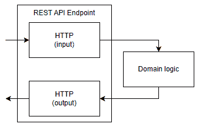
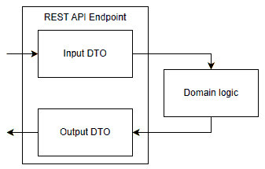
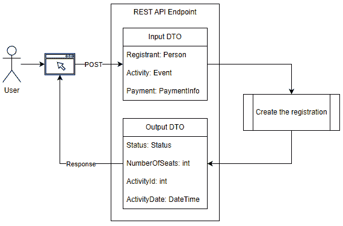
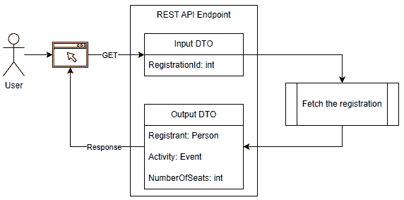

# 4 个 REST API

## 在开始之前：加入我们的 Discord 书籍社区

直接向作者本人提供反馈，并在我们的 Discord 服务器上与其他早期读者聊天（在“EARLY ACCESS SUBSCRIPTION”下找到“architecting-aspnet-core-apps-3e”频道）。

[`packt.link/EarlyAccess`](https://packt.link/EarlyAccess)


本章深入探讨了网络应用程序通信的核心——REST API。在当今互联的数字世界中，不同应用程序之间的有效通信至关重要，RESTful API 在促进这种交互中发挥着关键作用。我们首先探索网络的基石：HTTP 协议。我们简要介绍了核心 HTTP 方法，如 GET、POST、PUT 和 DELETE，以了解它们如何在 RESTful 环境中执行 CRUD（创建、读取、更新、删除）操作。然后，我们将注意力转向 HTTP 状态码——系统通知客户端其请求状态的方式，以及 HTTP 头部。由于 API 会发展，而管理这些变化而不影响现有客户端是一个重大挑战，因此我们探讨了不同的 API 版本策略及其各自的权衡。然后，我们学习了数据传输对象（DTO）模式。将数据打包到 DTO 中可以提供许多好处，从减少调用次数到更好的封装和在网络发送数据时的性能提升。最后，我们还探讨了定义清晰且健壮的 API 合同的重要性，这确保了 API 的稳定性。我们讨论了设计和记录这些合同的技术，确保它们作为 API 消费者的实用指南。到本章结束时，您将了解 REST API 的工作原理，并准备好开始使用 ASP.NET Core 构建一些，随着我们进入下一章的架构之旅，我们将继续前进。在本章中，我们涵盖了以下主题：

+   REST & HTTP

+   数据传输对象 (DTO)

+   API 合同

让我们从 REST 开始。

## REST & HTTP

**REST**，或**表示性状态转移**，是一种创建基于互联网的服务的方法，称为网络服务、网络 API、REST API 或 RESTful API。这些服务通常使用 HTTP 作为其传输协议。REST 重新使用已知的 HTTP 规范，而不是重新创建交换数据的新方法。例如，返回 HTTP 状态码 `200 OK` 表示成功，而 `400 Bad Request` 表示失败。以下是一些定义特征：

+   **无状态性：** 在 RESTful 系统中，每个客户端到服务器的请求都应该包含服务器理解并执行它所需的所有细节。服务器不保留关于客户端最近 HTTP 请求的任何信息。这提高了可靠性和可伸缩性。

+   **缓存功能：** 客户端应该能够缓存响应以提高性能。

+   **简单性和解耦**：REST 使用 HTTP 确保简化和解耦的架构。这使得 REST API 的开发、维护和扩展变得更容易，并促进了它们的用法。

+   **资源可识别性**：每个 REST API 端点是独特的资源，使我们能够分别保护系统的每一部分。

+   **接口作为契约**：REST API 层作为交换契约或抽象。它有效地隐藏了后端系统的底层实现，促进了简化的交互。

虽然我们可以深入探讨 REST API 的复杂性，但前面的特性作为基础知识，提供了足够的知识以开始使用 RESTful 服务。在掌握了这些基本知识后，让我们将重点转向理解 REST API 如何利用 HTTP 的力量。

### HTTP 方法

HTTP 方法，也称为动词，定义了客户端在 RESTful API 中可以对资源执行的操作类型。每种方法代表一个特定的操作，定义了端点对资源的意图。以下是常用方法的列表、它们的作用以及预期的成功状态码：

| **方法** | **典型角色** | **成功状态码** |
| --- | --- | --- |
| `GET` | 获取资源（读取数据） | 200 OK |
| `POST` | 创建新资源 | 201 CREATED |
| `PUT` | 替换资源 | 200 OK 或 204 No Content |
| `DELETE` | 删除资源 | 200 OK 或 204 No Content |
| `PATCH` | 部分更新资源 | 200 OK |

接下来，我们将探讨常用的状态码。

### HTTP 状态码

HTTP 状态码是 HTTP 响的一部分，并向客户端提供有关其请求成功或失败的信息；涉及类似主题的状态码被分组在相同的广泛“百位”类别下：

+   `1XX` (信息性) 状态码表示请求已接收且处理正在进行中，例如 **100 Continue** 和 **101 Switching Protocols**。

+   `2XX` (成功) 状态码表示请求已成功接收。

+   `3XX` (重定向) 状态码表示客户端必须采取进一步操作以完成重定向请求。

+   `4XX` (客户端错误) 状态码表示客户端方面的错误，例如验证错误。例如，客户端发送了一个空白的必填字段。

+   `5XX` (服务器错误) 状态码表示服务器未能满足显然有效的请求，并且客户端无法对此做出任何反应（重试请求不是选项）。

下表解释了一些最常见的状态码：

| **状态码** | **角色** |
| --- | --- |
| **200 OK** | 表示请求已成功。它通常包括与资源相关的数据，位于响应体中。 |
| **201 CREATED** | 表示请求已成功，系统已创建资源。它还应包括一个指向新创建资源的 `Location` HTTP 标头，并且可以在响应体中包含新实体。 |
| **202 ACCEPTED** | 表示请求已被接受进行处理，但尚未处理。我们使用此代码进行异步操作。在一个事件驱动系统中（见第十七章，*微服务架构简介*），这可能意味着已发布事件，当前资源已完成其工作（发布了事件），但为了了解更多信息，客户端需要联系另一个资源，等待通知，只是等待，或者无法知道。 |
| **204 NO CONTENT** | 表示请求已成功，但响应体中没有内容。 |
| **302 FOUND** | 表示请求的资源临时位于`Location`头中指定的不同 URL 下。我们通常使用此状态码进行重定向。 |
| **400 BAD REQUEST** | 表示服务器无法理解或处理请求。这通常与验证错误有关，如输入错误或缺少字段。 |
| **401 UNAUTHORIZED** | 表示请求需要用户身份验证才能访问资源。 |
| **403 FORBIDDEN** | 表示服务器理解了请求，但拒绝授权它。这通常意味着客户端缺乏对资源的访问权限（授权）。 |
| **404 NOT FOUND** | 表示资源不存在或未找到。REST API 通常从有效端点返回此状态码。 |
| **409 CONFLICT** | 表示由于与资源的当前状态冲突，服务器无法完成请求。一个典型场景是实体在其读取操作（`GET`）和当前更新操作（`PUT`）之间已更改。 |
| **500 INTERNAL SERVER ERROR** | 表示服务器端发生未处理的错误，阻止其满足请求。 |

现在我们已经介绍了 HTTP 方法和状态码，我们来看看如何在不同客户端和服务器之间传递更多的元数据。

### HTTP 头

REST API 利用 HTTP 头传输客户端信息并描述其选项和功能。头是请求和响应的一部分。一个著名的头是`Location`头，我们用它用于不同的目的。例如：

+   在创建实体（`201 Created`）后，`Location`头应指向客户端可以访问该新实体的`GET`端点。

+   在启动异步操作（`202 Accepted`）后，`Location`头可能指向状态端点，您可以在其中轮询操作的状态（是否已完成、失败或仍在进行中）。

+   当服务器想要指示客户端加载另一个页面（重定向）时，`Location`头包含目标 URL。以下状态码是重定向中最常见的：`301 Moved Permanently`、`302 Found`、`303 See Other`、`307 Temporary Redirect`和`308 Permanent Redirect`。

`Retry-After` 头部在与 `202` `Accepted`、`301 Moved Permanently`、`429 Too Many Requests` 或 `503 Service Unavailable` 混合使用时也很有用。`ETag` 头部标识实体的版本，可以与 `If-Match` 一起使用以避免*空中碰撞*。`ETag` 和 `If-Match` 头部形成一种*乐观并发*方法，防止*请求二*在同时发生或不是按预期顺序发生时覆盖*请求一*所做的更改；即管理冲突的一种方式。我们可以添加以下内容作为描述 REST 端点的 HTTP 头部的示例：`Allow`、`Authorization` 和 `Cache-Control`。列表非常长，在这里列举所有 HTTP 头部对任何人都没有帮助。

> 这应该足够作为理论来让你开始学习 HTTP 和 REST。如果你还想了解更多，我在章节末尾的“进一步阅读”部分留下了关于 HTTP 的 MDN 网络文档的链接。

接下来，我们来看看版本控制，因为没有什么是一成不变的；业务需求会变化，API 必须随之发展。

### 版本控制

版本控制是 REST API 的一个关键方面。无论 API 的版本是长期存在还是临时（例如，在旧端点退役周期中），管道的两端都必须知道期望什么；要遵守的 API 合同。除非你是唯一的消费者，否则你需要一种方法让 API 客户端在合同更改时查询特定的 API 版本。本节探讨了关于我们的版本控制策略的一些思考方式。

#### 默认版本策略

当对 API 进行版本化时，首先要考虑的是默认策略。如果没有指定版本会发生什么？端点会返回错误、第一个版本还是最新版本？如果 API 返回错误，你应该从一开始就实施这种版本化策略，这样客户端就知道需要版本。在这种情况下，实际上没有真正的缺点。另一方面，在事后实施这种策略将破坏所有未指定版本号的客户端，这可能不是让消费者满意的最佳方式。另一方面，总是返回第一个版本是一种很好的方法，可以保持向后兼容性。你可以添加更多端点版本，而不会破坏你的消费者。相反的方式是总是返回最新版本。对于消费者来说，这意味着指定要消费的版本或保持最新或中断，这可能不是提供给消费者的最佳用户体验。尽管如此，许多人选择了这种默认策略。另一种选择是选择任何版本作为 API 的默认基线（例如版本 3.2）或甚至为每个端点选择不同的版本。比如说，你默认为 3.2，然后部署 4.0。由于客户端必须选择加入以访问新 API，它们不会自动中断，并且将有时间根据他们自己的路线图从 3.2 更新到 4.0。这是在向前推进破坏性更改之前将已知和稳定的 API 版本作为默认策略的好方法。

> 无论你选择什么，都要权衡利弊，仔细思考。

接下来，我们将探讨定义这些版本的方法。

#### 版本化策略

当然，有多个方法来思考这个问题。你可以利用 URL 模式来定义和包含 API 版本，例如`https://localhost/v2/some-entities`。这种策略更容易从浏览器中查询，使得一眼就能知道版本，但端点不再指向唯一的资源（REST 的一个关键原则），因为每个资源都有一个端点对应每个版本。尽管如此，这种版本化 API 的方式被广泛使用，并且是最受欢迎的方法之一，如果不是*最*受欢迎的方法，即使它违反了其核心原则（有争议）。另一种方式是使用 HTTP 头。你可以使用自定义头，如`api-version`或`Accept-version`，例如，或者标准的`Accept`头。这种方式允许资源有唯一的端点（URI），同时使每个实体有多个版本（描述相同实体的每个 API 合约的多个版本）。例如，客户端可以在调用端点时指定 HTTP 头，如下所示（自定义头）：

```cs
GET https://localhost/some-entities
Accept-version: v2
```

或者像下面这样，通过利用`Accept`头进行*内容协商*：

```cs
GET https://localhost/some-entities
Accept: application/vnd.api.v2+json
```

> 不同的人在使用`Accept`头时使用不同的值，例如：

+   `application/vnd.myapplication.v2+json`

+   `application/vnd.myapplication.entity.v2+json`

+   `application/vnd.myapplication.api+json; version=2`

+   `application/json; version=2`

无论你使用哪种方式，你很可能会在某些时候需要对 API 进行版本控制。有些人强烈支持一种方式或另一种方式，但最终，你应该根据具体情况决定哪种方式最适合你的需求和能力：简单性、正式性或两者的结合。

### 总结

通过一个方法（动词），客户端（和端点）可以表达创建、更新、读取或删除实体的意图。通过状态码，端点可以告诉客户端操作的状态。通过添加 HTTP 头，客户端和服务器可以向请求或响应添加更多元数据。最后，通过添加版本控制，REST API 可以在不破坏现有客户端的同时，给他们提供消费特定版本的选择。根据我们刚才所讨论的，你应该有足够的知识来跟随本书中的示例，并在构建 REST API 的过程中构建一些 API。

## 数据传输对象（DTO）

数据传输对象（DTO）设计模式是一种在类似 REST API 这样的面向服务的架构中管理和传输数据的稳健方法。DTO 模式是关于组织数据以最优地将其传递给 API 客户端。DTO 是 API 合同的一个组成部分，我们将在下一部分进行探讨。

### 目标

DTO 的目标是通过松散耦合暴露的 API 表面与应用程序的内部工作方式来*控制端点的输入和输出*。DTO 赋予我们以我们希望消费者与之交互的方式构建我们的网络服务。因此，无论底层系统如何，我们都可以使用 DTO 来设计更容易消费、维护和演化的端点。

### 设计

每个 DTO 代表一个具有所有必要属性的实体。该实体可以是输入或输出，并允许构建客户端和 API 之间的交互。DTO 通过增加一个抽象层，将我们的领域与通过 API 暴露的数据松散耦合。这允许我们在不影响 API 消费者暴露的数据的情况下更改底层领域模型，反之亦然。另一种使用 DTO 的方法是将相关的信息片段打包在一起，允许客户端通过单个调用获取所有必要的数据，从而消除多次请求的需要。基于 REST 和 HTTP，请求的流程如下：一个 HTTP 请求进来，执行一些代码（领域逻辑），然后一个 HTTP 响应返回给客户端。以下图表表示了这个流程：



图 4.1：一个 HTTP 请求进入并离开 REST API 端点。

现在，如果我们用 DTO 替换那个流程中的 HTTP，我们可以看到 DTO 可以作为数据合同的一部分，作为输入或输出：



图 4.2：一个输入 DTO 撞击某些领域逻辑，然后端点返回一个输出 DTO

如何将 HTTP 请求变成一个对象？大多数时候：

+   我们对输入使用反序列化或数据绑定。

+   我们对输出使用序列化。

让我们看看几个例子。

### 概念示例

概念上讲，假设我们正在构建一个允许人们注册活动的网络应用程序。我们接下来探索两个用例。

#### 活动注册

我们正在探索的第一个场景是用户注册活动。活动是系统中的某种事件。我们使用外部支付网关，因此我们的应用程序永远不会处理财务数据。尽管如此，我们必须将交易数据发送到我们的后端以关联和完成支付。以下图表示例描述了工作流程：



图 4.3：活动注册流程中涉及的 DTO。

请求体可能看起来如下 JSON 片段：

```cs
{
    "registrant": {
        "firstname": "John",
        "lastname": "Doe"
    },
    "activity": {
        "id": 123,
        "seats": 2
    },
    "payment": {
        "nonce": "abc123"
    }
}
```

接下来，以下 JSON 片段可能代表响应体：

```cs
{
    "status": "Success",
    "numberOfSeats": 2,
    "activityId": 123,
    "activityDate": "2023-06-03T20:00:00"
}
```

当然，这是一个非常轻量级的注册系统版本。目标是展示：

1.  三个实体作为 HTTP POST 请求进入（注册者、活动和支付信息）。

1.  系统执行了一些业务逻辑，将人员注册到活动中，并完成财务交易。

1.  API 向客户端返回了混合信息。

> 这种模式便于只输入和输出所需的内容。如果您正在设计消费 API 的用户界面，输出一个经过深思熟虑的 DTO 可以确保 UI 只需读取来自服务器的响应即可渲染下一屏幕，从而节省 UI 获取更多数据，加快处理速度，并提高用户体验。

我们接下来探索获取活动注册信息。

#### 获取活动注册详情

在同一系统中，用户想要使用前面的过程查看他注册的活动详情。在这种情况下，流程如下：

1.  客户通过 `GET` 请求发送注册标识符。

1.  系统获取注册者信息、活动信息和用户为该活动预留的座位数。

1.  服务器将数据返回给客户端。

以下图示直观地表示了用例：



图 4.4：获取已注册活动相关信息的 DTO。

在这种情况下，输入将是 URL 的一部分，例如 `/registrations/123`。输出将是响应体的一部分，可能看起来如下：

```cs
{
    "registrant": {
        "firstname": "John",
        "lastname": "Doe"
    },
    "activity": {
        "id": 123,
        "name": "Super Cool Show",
        "date": "2023-06-03T20:00:00"
    },
    "numberOfSeats": 2
}
```

通过使用精心设计的输出 DTO 创建该端点，我们将三个 HTTP 请求压缩成了一个：注册者、活动和注册（座位数）。这种强大的技术适用于任何技术，而不仅仅是 ASP.NET Core，并允许我们设计 API，而不需要直接将客户端连接到我们的数据（松散耦合）。

### 结论

数据传输对象（DTO）允许我们设计一个具有专用输入和输出的 API 端点，而不是暴露领域或数据模型。这些 DTO 保护我们的内部业务逻辑，这提高了我们设计 API 的能力，并有助于使它们更加安全。

> 通过定义 DTO，我们可以避免恶意行为者尝试绑定他不应访问的数据。例如，当使用仅包含`username`和`password`属性的输入“登录 DTO”时，恶意用户无法尝试绑定我们领域和数据库中可用的`IsAdmin`字段。还有其他方法可以减轻这种攻击，但它们超出了本章的范围。然而，DTO 是减轻这种攻击向量的绝佳候选者。

展示层与领域之间的这种分离是一个关键元素，它导致我们拥有多个独立的组件，而不是一个更大、更脆弱的组件，或者将内部数据结构泄露给使用 API 的客户端。我们在接下来的几章中探讨构建 API，并在*第四部分，设计应用规模*中更深入地探讨一些主题。使用 DTO 模式可以帮助我们以下列方式遵循 SOLID 原则：

+   **S**: DTO（数据传输对象）在领域逻辑或数据与 API 契约之间建立了清晰的边界，将一个模型划分为几个不同的职责，以帮助保持事物的隔离。

+   **O**: N/A

+   **L**: N/A

+   **I**: DTO 是一个更小、专门定制的模型，它服务于一个明确的目的。有了 DTO，我们现在有两个模型（领域和 API 契约）和几个类（输入 DTO、输出 DTO 和领域或数据实体），而不是一个通用的模型（只有领域或数据实体）。

+   **D**: N/A

接下来，我们将探讨如何将我们迄今为止探索的各个部分粘合到 API 契约中。

## API 契约

API 合约作为一项基本蓝图，概述了您的 API 与其消费者之间的互动规则。这包括可用的端点、它们支持的 HTTP 方法、预期的请求格式以及可能的响应结构，包括 HTTP 状态码。这些合约提供了清晰性、健壮性、一致性和互操作性，促进了无论使用何种语言构建的系统之间的无缝交互。此外，良好的 API 合约文档是一个可靠的参考指南，帮助开发者有效地理解和利用您的 API。因此，设计全面且清晰的 API 合约对于构建高质量、可维护和用户友好的 API 至关重要。API 合约描述了一个 REST API，因此消费者应该知道如何调用端点以及可以期待得到什么回报。端点所做的事情或它提供的功能仅通过阅读其合约就可以明确。REST API 中的每个端点至少应提供以下签名：

+   一个统一资源标识符（URI），指示如何访问它。

+   一个描述它执行操作类型的 HTTP 方法。

+   一个输入定义，说明操作发生所需的条件。例如，输入可以是 HTTP 体、URL 参数、查询参数、HTTP 头，甚至它们的组合。

+   一个输出定义，说明客户端应该期待什么。客户端应该期待多个输出定义，因为端点在请求成功或失败时不会返回相同的信息。

> 端点的输入和输出通常是 DTO（数据传输对象），这使得 DTO 变得更加重要。

定义 API 合约有多种方式。例如，为了定义一个 API 合约，我们可以做以下事情：

+   打开任何文本编辑器，例如 MS Word 或记事本，开始编写描述我们的 Web API 的文档；这可能是最繁琐且最不灵活的方法。我不推荐这种方法，有多个原因。

+   在 Markdown 文件中编写规范并将其保存到您的项目 Git 仓库中以便易于发现。这与 MS Word 非常相似，但更易于所有团队成员消费。这种方法比 Word 更好，但还不是最佳选择，因为当 API 发生变化时，您需要手动更新这些文件。

+   使用现有的标准，例如 OpenAPI 规范（以前称为 Swagger）。这种技术意味着有一个学习曲线，但结果应该更容易消费。此外，许多工具允许我们使用 OpenAPI 规范创建自动化。这种方法开始消除手动干预的需求。

+   使用以代码优先的方法和 ASP.NET Core 工具从您的代码中提取 OpenAPI 规范。

+   使用任何其他符合我们要求的工具。

> **提示**
> 
> > Postman 是一个构建 Web API 文档、测试套件以及实验 API 的绝佳工具。它支持 OpenAPI 规范，允许您创建模拟服务器，支持环境，等等。

无论使用什么工具，在如何设计 REST API 的 API 合约方面，有两个主要趋势：

+   首先设计合约，然后构建 API（合约优先）。

+   构建 API，然后从代码中提取合约（代码优先）。

为了设计合约优先，必须采用一个工具来编写规范，然后根据规范编写 API。

> 我在下面的*进一步阅读*部分留下了一个关于 Open API 的链接。

另一方面，为了使用代码优先方法并自动从 API 中提取 OpenAPI 规范，我们必须确保我们的端点可以被.NET 的`ApiExplorer`发现。无论您如何操作，在 ASP.NET Core 中，我们使用类和结构来表示我们的 REST API 的数据合约；无论是在编写 API 合约之前还是之后，这都不重要。由于我更喜欢将 C#转换为 YAML 或 JSON，我们接下来探讨如何利用 Swagger 以代码优先的方式生成数据合约。

### 代码优先 API 合约

在这个示例中，我们有一个包含两个端点的微小 API：

+   读取指定的实体。

+   创建一个新的实体。

代码做得不多，只返回假数据，但足以探索其数据合约。

> 记住，代码就像玩乐高®积木，但我们通过连接许多一起使用的微小模式来创建我们的软件和创造价值。理解和学习这项技能将使你超越仅仅能够使用一些现成的魔法食谱，这限制了你对人们分享给你的内容的依赖。

在这个示例中，我们使用 OpenAPI 规范来描述我们的 API。为了节省我们编写 JSON 并采用代码优先的方式，我们利用 SwaggerGen 包。

> 要使用 SwaggerGen，我们必须安装`Swashbuckle.AspNetCore.SwaggerGen` NuGet 包。

这是`Program.cs`文件，没有端点，展示了如何利用 SwaggerGen：

```cs
var builder = WebApplication.CreateBuilder(args);
builder.Services.AddEndpointsApiExplorer();
builder.Services.AddSwaggerGen();
var app = builder.Build();
app.UseSwagger();
// Omitted endpoints
app.Run();
```

突出的行是我们必须做的唯一事情，以便在项目中使用 SwaggerGen，它将为我们生成 OpenAPI 规范中的 API 合约。JSON 文件非常长（113 行），所以我只在书中粘贴了一些片段以供清晰。然而，您可以导航到`/swagger/v1/swagger.json` URL 以访问完整的 JSON 代码或打开项目中的`swagger.json`文件。

> 我在项目中创建了`swagger.json`文件以方便使用。工具不会生成物理文件。

让我们看看那些端点。

#### 第一个端点

允许客户端读取实体的第一个端点的代码如下：

```cs
app.MapGet(
    "/{id:int}",
    (int id) => new ReadOneDto(
        id,
        "John Doe"
    )
);
public record class ReadOneDto(int Id, string Name);
```

这里是我们可以从前面的代码中提取的 API 合约：

| **合约段** | **值** |
| --- | --- |
| HTTP 方法 | GET |
| URI | `/id`（例如，`/123`） |
| 输入 | `id`参数 |
| 输出 | `ReadOneDto`类的实例。 |

发送以下 HTTP 请求（您可以使用`ReadOneEntity.http`文件）将产生以下输出：

```cs
GET /123 HTTP/1.1
Accept: application/json
Host: localhost:7000
Connection: keep-alive
```

简化后的响应是：

```cs
HTTP/1.1 200 OK
Content-Type: application/json; charset=utf-8
Date: Sat, 03 Jun 2023 17:41:42 GMT
Server: Kestrel
Alt-Svc: h3=":7000"; ma=86400
Transfer-Encoding: chunked

{"id":123,"name":"John Doe"}
```

如我们所见，当我们查询 API 以获取 `id=123` 的实体时，端点返回该实体，状态码为 `200 OK`，响应体是 `ReadOneDto` 类的序列化实例。

> `.http` 文件是 VS 2022 的新功能，允许我们从 VS 本身编写和执行 HTTP 请求。如果您想了解更多信息，我在 *进一步阅读* 部分留下了一个链接。

SwaggerGen 为第一个端点生成了以下 OpenAPI 规范：

```cs
"/{id}": {
  "get": {
    "parameters": [
      {
        "name": "id",
        "in": "path",
        "required": true,
        "schema": {
          "type": "integer",
          "format": "int32"
        }
      }
    ],
    "responses": {
      "200": {
        "description": "Success",
        "content": {
          "application/json": {
            "schema": {
              "$ref": "#/components/schemas/ReadOneDto"
            }
          }
        }
      }
    }
  }
},
```

那段代码描述了端点并引用了我们的输出模型（高亮行）。模式在 JSON 文件的底部。以下是表示 `ReadOneDto` 的模式：

```cs
"ReadOneDto": {
  "type": "object",
  "properties": {
    "id": {
      "type": "integer",
      "format": "int32"
    },
    "name": {
      "type": "string",
      "nullable": true
    }
  },
  "additionalProperties": false
}
```

如高亮行所示，该模式有一个 `name` 属性，类型为 `string`，一个 `id` 属性，类型为 `integer`，与我们的 `ReadOneDto` 类相同。幸运的是，我们不需要编写那个 JSON，因为工具根据我们的代码生成它。接下来，我们看看第二个端点。

#### 第二个端点

第二个端点的代码允许客户端创建实体如下所示：

```cs
app.MapPost(
    "/",
    (CreateDto input) => new CreatedDto(
        Random.Shared.Next(int.MaxValue),
        input.Name
    )
);
public record class CreateDto(string Name);
public record class CreatedDto(int Id, string Name);
```

以下是我们可以从前面的代码中提取的 API 合同：

| **合同段** | **值** |
| --- | --- |
| HTTP 方法 | POST |
| URI | `/` |
| 输入 | `CreateDto` 类的一个实例。 |
| 输出 | `CreatedDto` 类的一个实例。 |

发送以下 HTTP 请求（您可以使用 `CreateEntity.http` 文件）将产生以下输出：

```cs
POST / HTTP/1.1
Content-Type: application/json
Host: localhost:7000
Accept: application/json
Connection: keep-alive
Content-Length: 28

{
    "name": "Jane Doe"
}
```

简化后的响应如下：

```cs
HTTP/1.1 200 OK
Content-Type: application/json; charset=utf-8
Date: Sat, 03 Jun 2023 17:59:25 GMT
Server: Kestrel
Alt-Svc: h3=":7000"; ma=86400
Transfer-Encoding: chunked

{"id":1624444431,"name":"Jane Doe"}
```

如前所述的请求所示，客户端发送了 `CreateDto` 类的序列化实例，将名称设置为 Jane Doe，并收到了相同的实体，但具有数字 `id` 属性（`CreatedDto` 类的一个实例）。我们的端点 OpenAPI 规范如下所示：

```cs
"/": {
  "post": {
    "requestBody": {
      "content": {
        "application/json": {
          "schema": {
            "$ref": "#/components/schemas/CreateDto"
          }
        }
      },
      "required": true
    },
    "responses": {
      "200": {
        "description": "Success",
        "content": {
          "application/json": {
            "schema": {
              "$ref": "#/components/schemas/CreatedDto"
            }
          }
        }
      }
    }
  }
}
```

输入和输出模式如下：

```cs
"CreateDto": {
  "type": "object",
  "properties": {
    "name": {
      "type": "string",
      "nullable": true
    }
  },
  "additionalProperties": false
},
"CreatedDto": {
  "type": "object",
  "properties": {
    "id": {
      "type": "integer",
      "format": "int32"
    },
    "name": {
      "type": "string",
      "nullable": true
    }
  },
  "additionalProperties": false
},
```

与第一个端点类似，SwaggerGen 将我们的 C# 类转换为 OpenAPI 规范。让我们总结一下。

### 总结

一些 ASP.NET Core 模板预配置了 SwaggerGen。它还包含 Swagger UI，允许您从您的应用程序中直观地探索 API 合同，甚至查询它。NSwag 是另一个提供类似功能的工具。大量的在线文档展示了如何利用这些工具。除了探索工具之外，我们还定义了 API 合同是基本的，并促进了健壮性和可靠性。每个端点都有以下部分作为整体 API 合同的一部分：

+   它可访问的 URI。

+   最佳定义操作的 HTTP 方法。

+   输入。

+   一个或多个输出。

> 通过组合不同的 HTTP 方法和输入，单个 URI 可以指向多个端点。例如，`GET /api/entities` 可能返回实体列表，而 `POST /api/entities` 可能创建一个新的实体。使用实体的复数形式作为约定被许多人所采用。

我们接下来探讨数据传输对象，以增加对该模式的清晰度。

## 摘要

REST API 促进了当今互联数字世界中应用程序之间的通信。我们探讨了 HTTP 协议、HTTP 方法、HTTP 状态码和 HTTP 头部信息。然后我们探讨了 API 版本控制、数据传输对象（DTOs）以及 API 合约的重要性。以下是一些关键要点：

+   **REST 与 HTTP**：REST API 是网络应用通信的核心。它们使用 HTTP 作为传输协议，利用其方法、状态码和头部信息来促进不同应用之间的交互。

+   **HTTP 方法**：HTTP 方法或动词（GET、POST、PUT、DELETE、PATCH）定义了客户端在 RESTful API 中对资源可以执行的操作类型。理解这些方法是执行 CRUD 操作的关键。

+   **HTTP 状态码和头部信息**：HTTP 状态码通知客户端其请求的成功或失败。HTTP 头部传输额外的信息，并描述客户端的选项和能力。这两者都是 HTTP 通信的基本组成部分。

+   **版本控制**：在不干扰现有客户端的情况下管理 API 的变化是一个重大挑战。不同的 API 版本控制策略可以帮助解决这个问题，但每种策略都有其自身的权衡。

+   **数据传输对象 (DTO)**: DTOs 将数据打包成一种格式，可以提供许多好处，包括减少 HTTP 调用次数、提高封装性，以及在通过网络发送数据时提升性能。

+   **API 合约**：清晰且健壮的 API 合约确保 API 的稳定性。它们作为 API 与其消费者之间交互的蓝图，概述了可用的端点、支持的 HTTP 方法、预期的请求格式和可能的响应结构。

+   **实际应用**：理解这些概念不仅从理论上重要，而且在使用 ASP.NET Core 或任何其他类似技术构建和操作 REST API 时也非常实用。

到现在为止，你应该对 REST API 有了扎实的理解，并准备好探索如何使用 ASP.NET Core 实现一个 API。ASP.NET Core 使得使用 MVC 或最小 API 编写 REST API 变得轻而易举。MVC 是一个广泛使用的模式，几乎无法避免。然而，新的最小 API 模型使过程更加精简。此外，通过应用模式如请求-端点-响应（REPR）或垂直切片架构，我们可以按功能而不是按层组织我们的 API，从而提高组织效率。我们将在*第四部分*：*应用模式*中介绍这些主题。接下来，我们将探讨使用 ASP.NET Core 进行设计，从最小 API 开始。

## 问题

让我们看看几个练习题：

1.  在创建实体后，REST API 中最常见的状态码是什么？

1.  如果你引入一个默认策略，在没有指定版本时返回最低版本，这会破坏现有的客户端吗？

1.  如果你想从服务器读取数据，你会使用哪种 HTTP 方法？

1.  DTOs 能否为系统增加灵活性和健壮性？

1.  DTOs 是 API 合约的一部分吗？

## 进一步阅读

这里有一些链接，可以帮助我们巩固本章所学的内容：

+   HTTP 请求方法（MDN）：[`adpg.link/MFWb`](https://adpg.link/MFWb)

+   HTTP 响应状态码（MDN）：[`adpg.link/34Jq`](https://adpg.link/34Jq)

+   HTTP 头部（MDN）：[`adpg.link/Hx55`](https://adpg.link/Hx55)

+   在 Visual Studio 2022 中使用.http 文件：[`adpg.link/cbhv`](https://adpg.link/cbhv)

+   OpenAPI 规范：[`adpg.link/M4Uz`](https://adpg.link/M4Uz)

## 答案

1.  一个 API 在创建新实体后通常会返回状态码`201 Created`。

1.  不，它不会破坏客户端，因为它们要么在使用最低的 API 版本，要么已经指定了特定的版本。

1.  我们通常使用 HTTP GET 方法从 REST API 读取数据。

1.  是的，数据传输对象（DTOs）可以为系统增加灵活性和健壮性。它们允许你精确控制向客户端暴露的数据，并且可以减少需要通过网络发送的不必要数据量。

1.  是的，DTOs 是 API 合约的一部分。它们定义了客户端和服务器之间交换的数据格式，确保双方都能理解发送和接收的数据。
