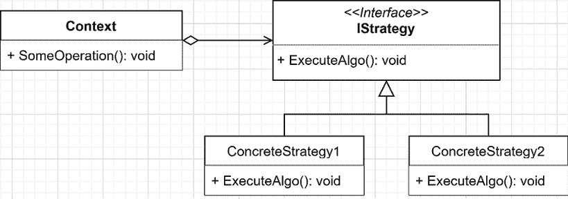
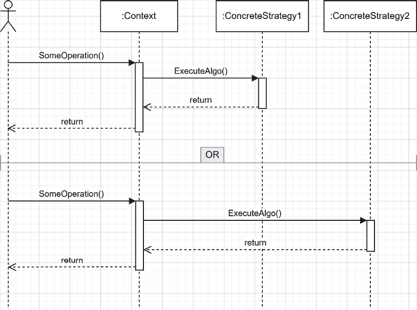
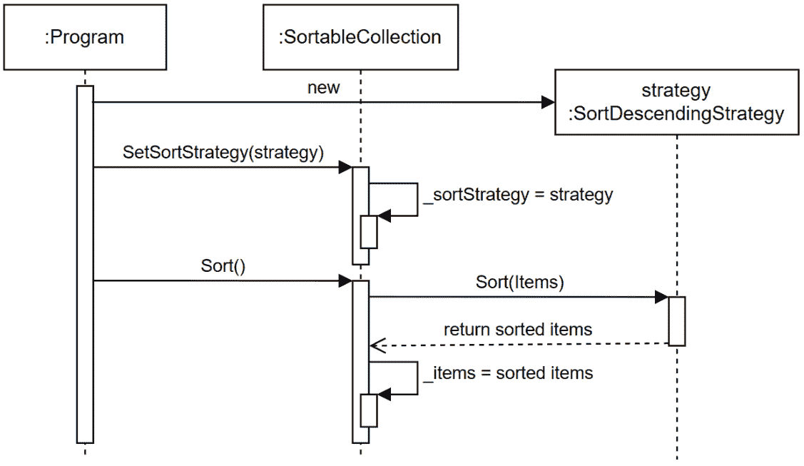
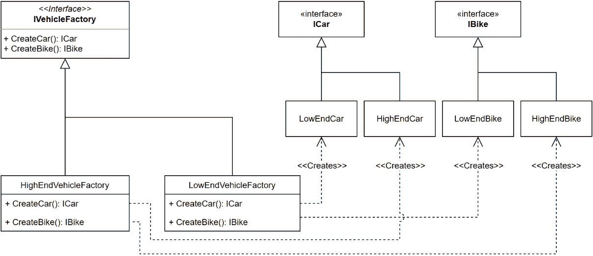
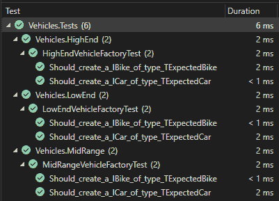
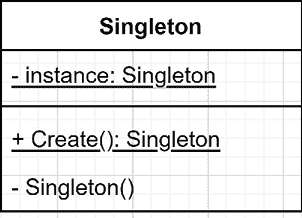

# 7 策略模式、抽象工厂模式和单例设计模式

## 在开始之前：加入我们的 Discord 书籍社区

直接向作者本人提供反馈，并在我们的 Discord 服务器上与其他早期读者聊天（在“architecting-aspnet-core-apps-3e”频道下找到，属于早期访问订阅）。

[`packt.link/EarlyAccess`](https://packt.link/EarlyAccess)


本章探讨了使用**四人帮**（**GoF**）的一些经典、简单且强大的设计模式来创建对象。这些模式允许开发者封装和重用行为，集中对象创建，增加设计的灵活性，或控制对象的生命周期。此外，你很可能会在将来直接或间接构建的所有软件中使用其中的一些。

> **GoF**
> 
> > Erich Gamma、Richard Helm、Ralph Johnson 和 John Vlissides 是《设计模式：可复用面向对象软件元素》（1994 年）的作者，该书被称为**四人帮**（**GoF**）。在这本书中，他们介绍了 23 种设计模式，其中一些我们在本书中重新审视。

为什么它们如此重要？因为它们是健壮对象组合的构建块，有助于创建灵活性和可靠性。此外，在**第八章**，**依赖注入**中，我们将这些模式变得更加强大！但首先，在本章中，我们将介绍以下主题：

+   策略设计模式

+   抽象工厂设计模式

+   单例设计模式

## 策略设计模式

策略模式是一种行为设计模式，它允许我们在运行时改变对象的行为。我们还可以使用这种模式来组合复杂的对象树，并依靠它来遵循**开闭原则**（**OCP**）而无需太多努力。此外，它在**组合优于继承**的思维方式中发挥着重要作用。在本章中，我们重点关注策略模式的行为部分。下一章将介绍如何动态地使用策略模式来组合系统。

### 目标

策略模式的目的是从需要它的宿主类（上下文或消费者）中提取算法（策略）。这允许消费者在运行时决定使用哪种策略（算法）。例如，我们可以设计一个系统，从两种不同类型的数据库中获取数据。然后我们可以应用相同的逻辑处理这些数据，并使用相同的用户界面来显示它们。为了实现这一点，我们可以使用策略模式创建两个策略，一个命名为`FetchDataFromSql`，另一个命名为`FetchDataFromCosmosDb`。然后我们可以在运行时将所需的策略插入到`context`类中。这样，当消费者调用`context`时，`context`不需要知道数据来自哪里，如何获取，或正在使用什么策略；它只需获取它需要工作的部分，将获取数据的责任委托给一个抽象的策略（接口）。

### 设计

在进行任何进一步解释之前，让我们看一下以下类图：



图 7.1：策略模式类图

根据前面的图，策略模式的构建块如下：

+   `Context` 是一个依赖于 `IStrategy` 接口并利用 `IStrategy` 接口的实现来执行 `ExecuteAlgo` 方法的类。

+   `IStrategy` 是定义策略 API 的接口。

+   `ConcreteStrategy1` 和 `ConcreteStrategy2` 代表了 `IStrategy` 接口的一个或多个不同的具体实现。

在以下图中，我们探索了运行时发生的情况。演员代表任何消耗 `Context` 对象的代码。



图 7.2：策略模式序列图

当消费者调用 `Context.SomeOperation()` 方法时，它不知道执行的是哪个实现，这是此模式的一个基本部分。`Context` 类也不应该知道它使用的策略。它应该通过接口运行策略，而对实现一无所知。这就是策略模式的优势：它将实现从 `Context` 类及其消费者中抽象出来。正因为如此，我们可以在对象创建期间或运行时更改策略，而对象不知道，可以即时改变其行为。

> **注意**
> 
> > 我们甚至可以将最后一句推广到任何接口。依赖于接口打破了消费者和实现之间的联系，通过依赖这个抽象来实现。

### 项目 – 策略

**上下文**：我们希望以不同的方式对集合进行排序，最终甚至使用不同的排序算法（示例范围之外，但可能）。最初，我们希望支持按升序或降序对任何集合的元素进行排序。为了实现这一点，我们需要实现以下构建块：

+   `Context` 是 `SortableCollection` 类。

+   `IStrategy` 是 `ISortStrategy` 接口。

+   具体的策略如下：

1.  `SortAscendingStrategy`

1.  `SortDescendingStrategy`

消费者是一个小的 REST API，允许用户更改策略、排序集合并显示项目。让我们从 `ISortStrategy` 接口开始：

```cs
public interface ISortStrategy
{
    IOrderedEnumerable<string> Sort(IEnumerable<string> input);
}
```

该接口只包含一个方法，该方法期望输入一个字符串集合并返回一个有序的字符串集合。现在让我们检查这两个实现：

```cs
public class SortAscendingStrategy : ISortStrategy
{
    public IOrderedEnumerable<string> Sort(IEnumerable<string> input)
        => input.OrderBy(x => x);
}
public class SortDescendingStrategy : ISortStrategy
{
    public IOrderedEnumerable<string> Sort(IEnumerable<string> input)
        => input.OrderByDescending(x => x);
}
```

这两个实现都非常简单，使用 **语言集成查询**（**LINQ**）对输入进行排序并直接返回结果。

> **提示**
> 
> > 在使用表达式主体方法时，请确保您不会通过创建非常复杂的单行代码使方法对同事（或未来的您）更难阅读。编写多行代码通常会使代码更容易阅读。

下一个要检查的构建块是 `SortableCollection` 类。它由多个字符串项目（`Items` 属性）组成，可以使用 `ISortStrategy` 对它们进行排序。在此基础上，它通过其 `Items` 属性实现了 `IEnumerable<string>` 接口，使其可迭代。以下是该类的代码：

```cs
using System.Collections;
using System.Collections.Immutable;
namespace MySortingMachine;
public sealed class SortableCollection : IEnumerable<string>
{
    private ISortStrategy _sortStrategy;
    private ImmutableArray<string> _items;
    public IEnumerable<string> Items => _items;
    public SortableCollection(IEnumerable<string> items)
    {
        _items = items.ToImmutableArray();
        _sortStrategy = new SortAscendingStrategy();
    }
    public void SetSortStrategy(ISortStrategy strategy)
        => _sortStrategy = strategy;
    public void Sort()
    {
        _items = _sortStrategy
            .Sort(Items)
            .ToImmutableArray()
        ;
    }
    public IEnumerator<string> GetEnumerator()
        => Items.GetEnumerator();
    IEnumerator IEnumerable.GetEnumerator()
        => ((IEnumerable)Items).GetEnumerator();
}
```

`SortableCollection` 类是目前最复杂的一个，所以让我们更深入地了解一下：

+   `_sortStrategy` 字段引用了算法：一个 `ISortStrategy` 实现。

+   `_items` 字段引用了字符串本身。

+   `Items` 属性将字符串暴露给类的消费者。

+   构造函数使用 `items` 参数初始化 `Items` 属性，并设置默认的排序策略。

+   `SetSortStrategy` 方法允许消费者在运行时更改策略。

+   `Sort` 方法使用 `_sortStrategy` 字段对项目进行排序。

+   两个 `GetEnumerator` 方法代表了 `IEnumerable<string>` 接口的实现，并通过 `Items` 属性使类可枚举。

通过这段代码，我们可以看到策略模式的作用。`_sortStrategy` 字段代表了当前的算法，遵守 `ISortStrategy` 合同，可以通过 `SetSortStrategy` 方法在运行时更新。`Sort` 方法将工作委托给 `ISortStrategy` 实现（具体策略）。因此，更改 `_sortStrategy` 字段的值会导致 `Sort` 方法的行为改变，使这个模式非常强大且简单。高亮显示的代码代表了这种模式。

> `_items` 字段是一个 `ImmutableArray<string>`，这使得从外部更改列表变得不可能。例如，消费者不能将 `List<string>` 传递给构造函数，然后稍后更改它。不可变性有许多优点。

让我们通过查看 `Consumer.API` 项目来实验一下，这是一个使用之前代码的 REST API 应用程序。接下来是 `Program.cs` 文件的分解：

```cs
using MySortingMachine;
SortableCollection data = new(new[] { 
    "Lorem", "ipsum", "dolor", "sit", "amet." });
```

`data` 成员是上下文，我们的可排序项目集合。接下来，我们看看创建应用程序和将 `enum` 值序列化为字符串的一些样板代码：

```cs
var builder = WebApplication.CreateBuilder(args);
builder.Services.ConfigureHttpJsonOptions(options => {
    options.SerializerOptions.Converters
        .Add(new JsonStringEnumConverter());
});
var app = builder.Build();
```

最后，最后一部分代表上下文的消费者：

```cs
app.MapGet("/", () => data);
app.MapPut("/", (ReplaceSortStrategy sortStrategy) =>
{
    ISortStrategy strategy = sortStrategy.SortOrder == SortOrder.Ascending
        ? new SortAscendingStrategy()
        : new SortDescendingStrategy();
    data.SetSortStrategy(strategy);
    data.Sort();
    return data;
});
app.Run();
public enum SortOrder
{
    Ascending,
    Descending
}
public record class ReplaceSortStrategy(SortOrder SortOrder);
```

在前面的代码中，我们声明了以下端点：

+   当客户端发送 `GET` 请求时，第一个端点返回 `data` 对象。

+   第二个端点允许在客户端发送 **PUT** 请求时根据 `SortOrder` 枚举更改排序策略。一旦策略被修改，它就会对集合进行排序并返回排序后的数据。

高亮显示的代码代表了策略模式的实现。

> `ReplaceSortStrategy` 类是一个输入 DTO。与 `SortOrder` 枚举结合使用，它们代表了第二个端点的数据合约。

当我们运行 API 并请求第一个端点时，它响应以下 JSON 主体：

```cs
[
  "Lorem",
  "ipsum",
  "dolor",
  "sit",
  "amet."
]
```

正如我们所见，项目按照我们设置的顺序排列，因为代码从未调用 `Sort` 方法。接下来，让我们向 API 发送以下 HTTP 请求以更改排序策略为“降序”：

```cs
PUT https://localhost:7280/
Content-Type: application/json
{
    "sortOrder": "Descending"
}
```

执行后，端点响应以下 JSON 数据：

```cs
[
  "sit",
  "Lorem",
  "ipsum",
  "dolor",
  "amet."
]
```

从内容中我们可以看出，排序算法是有效的。之后，如果我们查询 GET 端点，列表将保持相同的顺序。接下来，让我们通过序列图来查看这个用例：



图 7.3：使用“降序排序策略”对项目进行排序的序列图

上述图示显示了 `Program` 使用其 `SetSortStrategy` 方法创建一个策略并将其分配给 `SortableCollection`。然后，当 `Program` 调用 `Sort()` 方法时，`SortableCollection` 实例将排序计算委派给 `ISortStrategy` 接口的底层实现。该实现是 `SortDescendingStrategy` 类（即 **策略**），这是 `Program` 在开始时设置的。

> 发送另一个 `PUT` 请求，但指定 `Ascending` 排序顺序，结果相似，但项目将按字母顺序排序。
> 
> > HTTP 请求在 `Consumer.API.http` 文件中可用。

从策略模式的角度来看，`SortableCollection` 类（即 **上下文**）负责引用和使用当前策略。

### 结论

策略设计模式在委派责任给其他对象方面非常有效，允许你在保持使用简单的同时，将算法的责任转交给其他对象。它还允许拥有一个丰富的接口（上下文），其行为可以在运行时改变。正如我们所见，策略模式在帮助我们遵循 **SOLID** 原则方面表现出色：

+   **S**：它有助于从外部类中提取责任，并可以互换使用。

+   **O**：它允许在运行时通过更改当前策略来扩展类，而不需要更新其代码，这几乎就是 OCP 的实际定义。

+   **L**：它不依赖于继承。此外，它在 *组合优于继承原则* 中扮演着重要角色，帮助我们避免完全使用继承和 LSP。

+   **I**：通过创建基于精简和专注接口的小型策略，策略模式是 ISP 的优秀推动者。

+   **D**：依赖关系的创建从使用策略（上下文）的类移动到类的消费者。这使得上下文依赖于抽象而不是实现，反转了控制流。

> **C# 特性**
> 
> > 如果你注意到了你不太熟悉的 C# 特性，*附录 A* 简要解释了许多它们。

接下来，让我们探索抽象工厂模式。

## 抽象工厂设计模式

抽象工厂设计模式是 GoF 中的一个创建型设计模式。我们使用创建型模式来创建其他对象，而工厂是做这件事的一种非常流行的方式。策略模式是依赖注入的骨干，它使得复杂对象树的组合成为可能，而工厂用于创建一些依赖注入库无法自动组装的复杂对象。关于这一点，将在下一章中详细介绍。

### 目标

抽象工厂模式用于抽象一组对象的创建。它通常意味着在该系列中创建多个对象类型。一个系列是一组相关或依赖的对象（类）。让我们考虑创建汽车车辆。有多种车辆类型，每种类型都有多种型号和品牌。我们可以使用抽象工厂模式来模拟这种场景。

> **注意**
> 
> > `工厂方法` 模式也侧重于创建单一类型的对象，而不是一个系列。我们在这里只介绍抽象工厂，但在本书的后面部分我们将使用其他类型的工厂。

### 设计

使用抽象工厂模式，消费者请求一个抽象对象并得到一个。工厂是一个抽象，产生的对象也是抽象的，将对象的创建与其消费者解耦。这允许在不影响消费者的情况下添加或删除一起产生的对象系列（所有参与者都通过抽象进行通信）。在我们的例子中，这个系列（工厂可以生产的对象集合）由一辆汽车和一辆自行车组成，每个工厂（系列）必须生产这两个对象。如果我们考虑车辆，我们可能有能力创建每种车辆类型的低端和高端型号。以下是使用抽象工厂模式实现这一点的示意图：



图 7.4：抽象工厂类图

在图中，我们有以下元素：

+   `IVehicleFactory` 接口代表抽象工厂。它定义了两个方法：一个用于创建 `ICar` 类型的汽车，另一个用于创建 `IBike` 类型的自行车。

+   `HighEndVehicleFactory` 类是一个实现了 `IVehicleFactory` 接口的具体工厂。它处理高端车辆型号的创建，并且其方法返回 `HighEndCar` 或 `HighEndBike` 实例。

+   `LowEndVehicleFactory` 是一个实现了 `IVehicleFactory` 接口的第二个具体工厂。它处理低端车辆型号的创建，并且其方法返回 `LowEndCar` 或 `LowEndBike` 实例。

+   `LowEndCar` 和 `HighEndCar` 是 `ICar` 的两种实现。

+   `LowEndBike` 和 `HighEndBike` 是 `IBike` 的两种实现。

根据该图，消费者通过 `IVehicleFactory` 接口使用具体工厂，并且不应该意识到底层使用的实现。应用此模式抽象了车辆创建过程。

### 项目 - 抽象工厂

**上下文**：我们需要支持创建多种车型。我们还需要能够在车型可用时添加新模型，而不会影响系统。起初，我们只支持高端和低端车型，但我们知道这迟早会改变。程序必须只支持创建汽车和自行车。为了我们的演示，车辆只是空的类和接口，因为学习如何建模车辆不是理解该模式所必需的；那将是噪音。以下代码代表这些实体：

```cs
public interface ICar { }
public interface IBike { }
public class LowEndCar : ICar { }
public class LowEndBike : IBike { }
public class HighEndCar : ICar { }
public class HighEndBike : IBike { }
```

接下来，我们看看我们想要研究的部分——工厂：

```cs
public interface IVehicleFactory
{
    ICar CreateCar();
    IBike CreateBike();
}
public class LowEndVehicleFactory : IVehicleFactory
{
    public IBike CreateBike() => new LowEndBike();
    public ICar CreateCar() => new LowEndCar();
}
public class HighEndVehicleFactory : IVehicleFactory
{
    public IBike CreateBike() => new HighEndBike();
    public ICar CreateCar() => new HighEndCar();
}
```

这些工厂是简单的实现，很好地描述了该模式：

+   `LowEndVehicleFactory` 创建低端车型。

+   `HighEndVehicleFactory` 创建高端车型。

该代码的消费者是一个 xUnit 测试项目。单元测试通常是你的第一个消费者，特别是如果你在做 **测试驱动开发**（**TDD**）。为了使测试更容易，我创建了以下基类测试：

```cs
using Xunit;
namespace Vehicles;
public abstract class BaseAbstractFactoryTest<TConcreteFactory, TExpectedCar, TExpectedBike>
    where TConcreteFactory : IVehicleFactory, new()
{
    // Test methods here
}
```

该类的关键是以下泛型参数：

+   `TConcreteFactory` 泛型参数代表我们想要测试的具体工厂的类型。它的泛型约束指定它必须实现 `IVehicleFactory` 接口并且有一个无参构造函数。

+   `TExpectedCar` 泛型参数代表我们从 `CreateCar` 方法期望的 `ICar` 类型。

+   `TExpectedBike` 泛型参数代表我们从 `CreateBike` 方法期望的 `IBike` 类型。

该类包含的第一个测试方法是以下内容：

```cs
[Fact]
public void Should_create_a_ICar_of_type_TExpectedCar()
{
    // Arrange
    IVehicleFactory vehicleFactory = new TConcreteFactory();
    var expectedCarType = typeof(TExpectedCar);
    // Act
    ICar result = vehicleFactory.CreateCar();
    // Assert
    Assert.IsType(expectedCarType, result);
}
```

前面的测试方法使用 `TConcreteFactory` 泛型参数创建一个车辆工厂，然后使用该工厂创建一辆车。最后，它断言 `ICar` 实例是期望的类型。第二个测试方法包含以下内容：

```cs
[Fact]
public void Should_create_a_IBike_of_type_TExpectedBike()
{
    // Arrange
    IVehicleFactory vehicleFactory = new TConcreteFactory();
    var expectedBikeType = typeof(TExpectedBike);
    // Act
    IBike result = vehicleFactory.CreateBike();
    // Assert
    Assert.IsType(expectedBikeType, result);
}
```

前面的测试方法非常相似，使用 `TConcreteFactory` 泛型参数创建一个车辆工厂，但然后用该工厂创建一辆自行车而不是汽车。最后，它断言 `IBike` 实例是期望的类型。

> 我使用 `ICar` 和 `IBike` 接口来对变量进行类型化，而不是 `var`，以明确 `result` 变量的类型。在另一个上下文中，我会使用 `var`。同样适用于 `IVehicleFactory` 接口。

现在，为了测试低端工厂，我们声明以下测试类：

```cs
namespace Vehicles.LowEnd;
public class LowEndVehicleFactoryTest : BaseAbstractFactoryTest<LowEndVehicleFactory, LowEndCar, LowEndBike>
{ 
}
```

该类仅依赖于 `BaseAbstractFactoryTest` 类并指定了要测试的类型（高亮显示）。接下来，为了测试高端工厂，我们声明以下测试类：

```cs
namespace Vehicles.HighEnd;
public class HighEndVehicleFactoryTest : BaseAbstractFactoryTest<HighEndVehicleFactory, HighEndCar, HighEndBike>
{
}
```

与低端工厂类似，该类依赖于 `BaseAbstractFactoryTest` 类并指定了要测试的类型（高亮显示）。

> 在更复杂的场景中，如果我们不能使用 `new()` 泛型约束，我们可以利用 IoC 容器来创建 `TConcreteFactory` 的实例，并可选地模拟其依赖项。

使用那段测试代码，我们创建了以下两组两个测试：

+   一个应该创建 `LowEndCar` 实例的 `LowEndVehicleFactory` 类。

+   一个应该创建 `LowEndBike` 实例的 `LowEndVehicleFactory` 类。

+   一个应该创建 `HighEndCar` 实例的 `HighEndVehicleFactory` 类。

+   一个应该创建 `HighEndBike` 实例的 `HighEndVehicleFactory` 类。

现在我们有四个测试：两个针对自行车，两个针对汽车。如果我们回顾测试的执行情况，两个测试方法都不了解类型。它们使用抽象工厂（`IVehicleFactory`）并测试 `result` 是否符合预期类型，而不了解它们正在测试什么，只知道抽象。这显示了消费者（测试）和工厂之间的耦合是多么松散。

> 在现实世界的程序中，我们会使用 `ICar` 或 `IBike` 实例根据规格执行相关操作。这可能是一个赛车游戏或富人的车库管理系统；谁知道呢！

这个项目的关键部分是**对象创建过程的抽象化**。测试代码（消费者）并不了解实现。接下来，我们扩展我们的实现。

### 项目 – 中端车辆工厂

为了证明我们基于抽象工厂模式的设计的灵活性，让我们添加一个新的具体工厂，命名为 `MidRangeVehicleFactory`。该工厂应返回一个 `MidRangeCar` 或 `MidRangeBike` 实例。再次强调，汽车和自行车只是空的类（当然，在你的程序中，它们将执行某些操作）：

```cs
public class MiddleGradeCar : ICar { }
public class MiddleGradeBike : IBike { }
```

新的 `MidRangeVehicleFactory` 看起来几乎与另外两个相同：

```cs
public class MidRangeVehicleFactory : IVehicleFactory
{
    public IBike CreateBike() => new MiddleGradeBike();
    public ICar CreateCar() => new MiddleGradeCar();
}
```

现在，为了测试中端工厂，我们声明以下测试类：

```cs
namespace Vehicles.MidRange;
public class MidRangeVehicleFactoryTest : BaseAbstractFactoryTest<MidRangeVehicleFactory, MidRangeCar, MidRangeBike>
{
}
```

就像低端和高端工厂一样，中端测试类依赖于 `BaseAbstractFactoryTest` 类，并指定要测试的类型（突出显示）。如果我们运行测试，我们现在有以下六个通过测试：



图 7.5：Visual Studio 测试资源管理器展示了六个通过测试。

因此，在未更新消费者（`AbstractFactoryTest` 类）的情况下，我们添加了一个新的车辆系列，即中端汽车和自行车；感谢抽象工厂模式为我们带来了这样的奇妙功能！

### 抽象工厂的影响

在结论之前，如果我们不是使用抽象工厂（在过程中破坏了 ISP）而是将所有内容打包到一个大接口中，会发生什么？我们可以创建以下类似接口：

```cs
public interface ILargeVehicleFactory
{
    HighEndBike CreateHighEndBike();
    HighEndCar CreateHighEndCar();
    LowEndBike CreateLowEndBike();
    LowEndCar CreateLowEndCar();
}
```

正如我们所见，前面的接口包含四个具体方法，看起来很温和。然而，该代码的消费者将与这些具体方法紧密耦合。例如，要改变消费者行为，我们需要更新其代码，比如将调用从`CreateHighEndBike`更改为`CreateLowEndBike`，这打破了 OCP。另一方面，使用工厂方法，我们可以为消费者设置不同的工厂以产生不同的结果，这把灵活性从对象本身移出，变成了对象图组合的问题（更多内容将在下一章中讨论）。此外，当我们想添加中端车辆时，我们必须更新`ILargeVehicleFactory`接口，这变成了一个破坏性变更（`ILargeVehicleFactory`的实现必须更新）。以下是一个两个新方法的示例：

```cs
public interface ILargeVehicleFactory
{
    HighEndBike CreateHighEndBike();
    HighEndCar CreateHighEndCar();
    LowEndBike CreateLowEndBike();
    LowEndCar CreateLowEndCar();
    MidRangeBike CreateMidRangeBike();
    MidRangeCar CreateMidRangeCar();
}
```

从那里，一旦实现更新，如果我们想消费新的中端车辆，我们需要打开每个消费者类并应用那里的更改，这再次打破了 OCP。

> 最关键的部分是理解和看到耦合及其影响。有时，将一个或多个类紧密耦合在一起是可以接受的，因为我们并不总是需要 SOLID 原则和一些设计模式所能带来的额外灵活性。

在探索本章的最后一个设计模式之前，让我们先总结一下。

### 结论

抽象工厂模式非常适合抽象对象家族的创建，隔离每个家族及其具体实现，使消费者对工厂在运行时创建的家族一无所知。我们将在下一章中更多地讨论工厂；同时，让我们看看抽象工厂模式如何帮助我们遵循**SOLID**原则：

+   **S**: 每个具体工厂只负责创建一组对象。您可以将抽象工厂与其他创建型模式结合使用，例如原型模式和建造者模式，以满足更复杂的创建需求。

+   **O**: 我们可以创建新的对象家族，如中端车辆，而不会破坏现有的客户端代码。

+   **L**: 我们的目标是组合，因此不需要任何继承，这隐含地摒弃了 LSP 的需求。如果你在设计中使用抽象类，你必须确保在创建新的抽象工厂时不要破坏 LSP。

+   **I**: 从具有许多实现的抽象中提取一个小抽象，其中每个具体工厂专注于一个家族，这使得该接口非常专注于一项任务，而不是拥有一个暴露所有类型产品的庞大接口（如`ILargeVehicleFactory`接口）。

+   **D**: 通过仅依赖于接口，消费者对其使用的具体类型一无所知。

接下来，我们将探索本章的最后一个设计模式。

## 单例设计模式

单例设计模式允许创建和重用类的单个实例。我们可以使用静态类来实现几乎相同的目标，但不是所有事情都可以使用静态类完成。例如，静态类不能实现接口。我们不能将静态类的实例作为参数传递，因为没有实例。我们只能直接使用静态类，这每次都会导致紧密耦合。在 C#中，单例模式是一个反模式，我们应该很少使用它，如果必须使用，则使用依赖注入代替。话虽如此，它是一个值得学习的经典设计模式，至少可以避免实现它。我们将在下一章探索一个更好的替代方案。以下是为什么我们要介绍这个模式的一些原因：

+   它将在下一章中转化为单例范围。

+   除非你知道它的存在，否则你无法定位它，尝试删除它或避免使用它。

+   这是一个简单的模式可以探索。

+   它导致其他模式，例如**环境上下文**模式。

### 目标

单例模式限制一个类的实例数量为单个。然后，想法是随后重用相同的实例。单例封装了对象逻辑本身及其创建逻辑。例如，单例模式可以降低实例化具有大内存占用对象的成本，因为程序只实例化一次。你能想到一个在这里被破坏的 SOLID 原则吗？单例模式提倡一个对象必须有两个职责，这违反了**单一职责原则**（**SRP**）。单例既是对象本身也是它自己的工厂。

### 设计

这种设计模式很简单，仅限于一个类。让我们从类图开始：



图 7.6：单例模式类图

`Singleton` 类由以下部分组成：

+   一个私有静态字段，用于保存其唯一的实例。

+   一个公共静态 `Create()` 方法，用于创建或返回唯一的实例。

+   一个私有构造函数，因此外部代码不能通过 `Create` 方法之外的方式实例化它。

> 你可以给 `Create()` 方法命名，甚至可以去掉它，就像我们在下一个例子中看到的那样。我们可以将其命名为 `GetInstance()`，或者它可以是名为 `Instance` 的静态属性，或者可以有任何其他相关的名称。

我们可以将前面的图转换为以下代码：

```cs
public class MySingleton
{
    private static MySingleton? _instance;
    private MySingleton() { }
    public static MySingleton Create()
    {
        _instance ??= new MySingleton();
        return _instance;
    }
}
```

> 空合并赋值运算符 `??=` 仅在 `_instance` 成员为 `null` 时才分配 `MySingleton` 的新实例。这一行等同于编写以下 if 语句：

```cs
if (_instance == null)
{
    _instance = new MySingleton();
}
```

在更深入讨论代码之前，让我们探索我们新类的行为。我们可以在以下单元测试中看到，`MySingleton.Create()` 总是返回预期的相同实例：

```cs
public class MySingletonTest
{
    [Fact]
    public void Create_should_always_return_the_same_instance()
    {
        var first = MySingleton.Create();
        var second = MySingleton.Create();
        Assert.Same(first, second);
    }
}
```

哇！我们得到了一个工作的单例模式，它极其简单——可能是我能想到的最简单的设计模式。以下是底层发生的事情：

1.  当消费者第一次调用`MySingleton.Create()`时，它创建了`MySingleton`的第一个实例。由于构造函数是`private`的，它只能从内部创建。

1.  然后`Create`方法将第一个实例持久化到`_instance`字段，以供将来使用。

1.  当消费者第二次调用`MySingleton.Create()`时，它返回`_instance`字段，重新使用类的先前（也是唯一）的实例。

现在我们已经理解了逻辑，该设计存在一个潜在的问题：它不是线程安全的。如果我们想让我们的单例是线程安全的，我们可以像这样`锁定`实例创建：

```cs
public class MySingletonWithLock
{
    private static readonly object _myLock = new();
    private static MySingletonWithLock? _instance;
    private MySingletonWithLock() { }
    public static MySingletonWithLock Create()
    {
        lock (_myLock)
        {
            _instance ??= new MySingletonWithLock();
        }
        return _instance;
    }
}
```

在前面的代码中，我们确保两个线程不会同时尝试访问`Create`方法，以确保它们不会得到不同的实例。接下来，我们通过缩短代码来改进我们的线程安全示例。

### 另一种（更好的）方法

以前，我们使用实现单例模式的“长方法”，并不得不实现一个线程安全的机制。现在，那个经典的方法已经过去了。我们可以缩短代码，甚至可以像这样移除`Create()`方法：

```cs
public class MySimpleSingleton
{
    public static MySimpleSingleton Instance { get; } = new MySimpleSingleton();
    private MySimpleSingleton() { }
}
```

前面的代码依赖于静态初始化器来确保只创建一个`MySimpleSingleton`类的实例，并将其分配给`Instance`属性。

> 这种简单的技术应该可以解决问题，除非单例的构造函数执行了一些重量级的处理。

使用属性而不是方法，我们可以这样使用单例类：

```cs
MySimpleSingleton.Instance.SomeOperation();
```

我们可以通过执行以下测试方法来证明这个说法的正确性：

```cs
[Fact]
public void Create_should_always_return_the_same_instance()
{
    var first = MySimpleSingleton.Instance;
    var second = MySimpleSingleton.Instance;
    Assert.Same(first, second);
}
```

通常最好是在可能的情况下将责任委托给语言或框架，就像我们在这里使用属性初始化器所做的那样。使用静态构造函数也是一个有效且线程安全的替代方案，再次将任务委托给语言特性。

> **小心箭头操作符。**
> 
> > 可能会诱使您使用箭头操作符`=>`来初始化`Instance`属性，如下所示：`public static MySimpleSingleton Instance => new MySimpleSingleton();`，但这样做会每次都返回一个新的实例。这将违背我们想要实现的目的。另一方面，属性初始化器只运行一次。
> > 
> > 箭头操作符使`Instance`属性成为一个表达式成员，相当于创建以下获取器：`get { return new MySimpleSingleton(); }`。您可以查阅*附录 A*了解更多关于表达式体语句的信息。

在我们结束本章之前，单例（反）模式也导致代码异味。

### 代码异味 - 环境上下文

那次对**单例**模式的实现让我们转向了**环境上下文**模式。我们甚至可以称环境上下文为反模式，但让我们只是指出它是一个有后果的代码异味。我不建议使用环境上下文，有多个原因。首先，我尽力避免任何全局的东西；环境上下文是一种全局状态。全局变量，如 C#中的静态成员，看起来非常方便，因为它们易于访问和使用。它们总是存在，并且无论何时需要都可以访问：方便。然而，它们在灵活性和可测试性方面带来了许多缺点。在使用环境上下文时，以下情况会发生：

+   **紧密耦合**：全局状态导致系统灵活性降低；消费者与环境上下文紧密耦合。

+   **测试难度**：全局对象更难替换，我们无法轻易地用其他对象（如模拟对象）替换它们。

+   **不可预见的影响**：如果系统的一部分破坏了你的全局状态，这可能会对系统的其他部分产生意外的后果，并且你可能难以找出这些错误的根本原因。

+   **潜在误用**：开发者可能会被诱惑将非全局关注点添加到环境上下文中，从而导致组件膨胀。

> **有趣的事实**
> 
> > 多年前，在 JavaScript 框架时代之前，我修复了一个系统中的错误，其中一个函数由于一个微小的错误而覆盖了`undefined`的值。这是一个很好的例子，说明了全局变量如何影响你的整个系统，并使其更加脆弱。同样，这也适用于 C#中的环境上下文和单例模式；全局变量可能是危险的并且令人烦恼。
> > 
> > 请放心，如今，浏览器不会让开发者更新`undefined`的值，但那时是可能的。

现在我们已经讨论了全局对象，环境上下文是一个全局实例，通常通过静态属性提供。环境上下文模式可以带来好处，但它是一个令人不快的代码异味。

> 在.NET Framework 中，有一些例子，如`System.Threading.Thread.CurrentPrincipal`和`System.Threading.Thread.CurrentThread`，它们的范围是线程级别的，而不是像大多数静态成员那样纯粹是全局的。环境上下文不一定是单例，但大多数情况下它们是单例。创建非全局（线程级别）的环境上下文更困难，需要更多的工作。

环境上下文模式是好是坏？我会两者都接受！它之所以有用，主要是因为它的便利性和易用性。大多数情况下，它可以通过不同的设计来减少其缺点。实现环境上下文的方法有很多，但为了简洁明了，我们只关注环境上下文的单例版本。以下代码是一个很好的例子：

```cs
public class MyAmbientContext
{
    public static MyAmbientContext Current { get; } = new MyAmbientContext();
    private MyAmbientContext() { }
    public void WriteSomething(string something)
    {
        Console.WriteLine($"This is your something: {something}");
    }
}
```

那段代码是`MySimpleSingleton`类的精确副本，只有一些细微的变化：

+   `Instance`被命名为`Current`。

+   `WriteSomething`方法虽然新，但与 Ambient Context 模式本身无关；它只是让类做些事情。

如果我们看看接下来的测试方法，我们可以看到我们通过调用`MyAmbientContext.Current`使用了环境上下文，就像我们在上一个单例实现中所做的那样：

```cs
[Fact]
public void Should_echo_the_inputted_text_to_the_console()
{
    // Arrange (make the console write to a StringBuilder
    // instead of the actual console)
    var expectedText = "This is your something: Hello World!" + Environment.NewLine;
    var sb = new StringBuilder();
    using (var writer = new StringWriter(sb))
    {
        Console.SetOut(writer);
        // Act
        MyAmbientContext.Current.WriteSomething("Hello World!");
    }
    // Assert
    var actualText = sb.ToString();
    Assert.Equal(expectedText, actualText);
}
```

属性可能包括一个公共设置器或支持更复杂的逻辑。构建正确的类和暴露正确的行为取决于你和你自己的规范。为了结束这个插曲，避免使用环境上下文，并使用可实例化的类。我们将在下一章中看到如何使用依赖注入来替换单例，这为我们提供了一个比单例模式更灵活的替代方案。我们还可以为每个 HTTP 请求创建一个单例实例，这既节省了我们编写代码的麻烦，又消除了其缺点。

### 结论

单例模式允许在整个程序生命周期中创建一个类的单个实例。它利用一个`private static`字段和一个`private`构造函数来实现其目标，通过一个`public static`方法或属性来暴露实例化。我们可以使用字段初始化器、`Create`方法本身、静态构造函数或任何其他有效的 C#选项来封装初始化逻辑。现在让我们看看单例模式如何帮助我们（或不）遵循 SOLID 原则：

+   **S**: 单例违反了这个原则，因为它有两个明显的责任：

    +   它承担了它被创建的责任（此处未展示），就像任何其他类一样。

    +   它承担了创建和管理自己的责任（生命周期管理）。

+   **O**: 单例模式也违反了这个原则。它强制执行一个单一的静态实例，由自己锁定在位置上，这限制了可扩展性。在不改变其代码的情况下，无法扩展这个类。

+   **L**: 没有直接涉及继承，这是唯一的优点。

+   **I**: 没有涉及 C#接口，这违反了这个原则。然而，我们可以看看类接口，这样构建一个小型的目标单例实例就会满足这个原则。

+   **D**: 单例类对自己有坚如磐石的控制。它还建议直接使用其静态属性（或方法），而不使用抽象，用大锤打破 DIP 原则。

正如你所见，单例模式违反了所有 SOLID 原则，除了 LSP，应该谨慎使用。一个类只有一个实例，并且总是使用这个相同的实例是一个常见的概念。然而，我们在下一章中会探讨更合适的方法来做这件事，这让我得出以下建议：不要使用单例模式，如果你看到它被使用，尝试重构它。

> 我建议避免创建全局状态的静态成员，这是一个通用的良好实践。它们可以使您的系统更不灵活且更脆弱。在某些情况下，`static`成员是值得使用的，但尽量将它们的数量保持在最低。在编码之前，问问自己是否可以用其他东西替换那个`static`成员或类。

有些人可能会争论，单例设计模式是做事的合法方式。然而，在 ASP.NET Core 中，我恐怕不得不表示不同意：我们有一个强大的机制来做不同的事情，称为依赖注入。当使用其他技术时，也许可以，但不是在现代化的.NET 中。

## 摘要

在本章中，我们探讨了我们的第一个 GoF 设计模式。这些模式揭示了软件工程的一些基本概念，不一定是指模式本身，而是它们背后的概念：

+   策略模式是我们用来组合我们未来大多数类的行为模式。它允许通过组合小对象和针对接口进行编码，在运行时交换行为，遵循 SOLID 原则。

+   抽象工厂模式带来了抽象对象创建的想法，从而实现了关注点的更好分离。更具体地说，它旨在抽象对象系列的创建并遵循 SOLID 原则。

+   即使我们将它定义为反模式，单例模式也将应用程序级别的对象带到桌面上。它允许创建一个在整个程序生命周期中存在的对象的单个实例。该模式违反了大多数 SOLID 原则。

我们还看到了环境上下文代码异味，它用于创建一个无处不在的实体，可以从任何地方访问。它通常实现为单例，并将全局状态对象带到程序中。下一章将探讨依赖注入如何帮助我们构建复杂且可维护的系统。我们还回顾了策略、工厂和单例模式，看看如何在依赖注入导向的上下文中使用它们，以及它们实际上有多强大。

## 问题

让我们看看几个练习问题：

1.  为什么策略模式是一个行为模式？

1.  我们如何定义创建型模式的目标？

1.  如果我编写了代码 `public MyType MyProp => new MyType();`，并且我两次调用该属性（`var v1 = MyProp; var v2 = MyProp;`），`v1` 和 `v2` 是同一个实例还是两个不同的实例？

1.  抽象工厂模式是否允许我们在不修改现有消费代码的情况下添加新元素系列？

1.  为什么单例模式是一个反模式？

## 答案

1.  它有助于在运行时管理行为，例如在程序运行过程中更改算法。

1.  创建型模式负责创建对象。

1.  `v1` 和 `v2` 是两个不同的实例。箭头操作符右侧的代码每次调用属性的 getter 时都会执行。

1.  是的，这是该模式的主要目标，正如我们在`MidRangeVehicleFactory`代码示例中所展示的。

1.  单例模式违反了 SOLID 原则，并鼓励使用全局（静态）状态对象。我们大多数情况下都可以避免使用这种模式。
