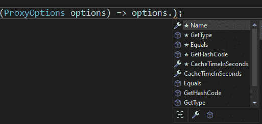

# 9 选项、设置和配置

## 在开始之前：加入我们的 Discord 书籍社区

直接向作者本人提供反馈，并在我们的 Discord 服务器上与其他早期读者聊天（在“EARLY ACCESS SUBSCRIPTION”下找到“architecting-aspnet-core-apps-3e”频道）。

[`packt.link/EarlyAccess`](https://packt.link/EarlyAccess)


本章介绍了 .NET 选项模式，这是任何应用程序的构建块。.NET Core 引入了新的预定义机制来增强 ASP.NET Core 应用程序可用的应用程序设置的用法。这些机制允许我们将配置分成多个更小的对象，在启动流程的各个阶段对其进行配置，验证它们，甚至以最小的努力监视运行时更改。

> 新的选项系统将 `ConfigurationManager` 类重新定位为内部组件。我们不能再像旧 .NET Framework 时代的静态方法那样使用它。新的模式和机制有助于避免无用的耦合，增加我们的设计灵活性，并且是 DI 原生的。该系统也更容易扩展。

选项模式的目标是在运行时使用设置，允许在不更改代码的情况下对应用程序进行更改。设置可能只是一个 `string`、一个 `bool`、一个数据库连接字符串，或者是一个包含整个子系统配置的复杂对象。本章深入探讨了我们可以用于管理、注入和加载配置和选项到我们的 ASP.NET Core 应用程序的各种工具和方法。我们的旅程涵盖了从常见场景到更复杂用例的广泛范围。在本章结束时，您将了解如何利用 .NET 选项和设置基础设施。在本章中，我们涵盖了以下主题：

+   加载配置

+   学习构建块

+   探索常见使用场景

+   学习选项配置

+   验证我们的选项对象

+   使用 FluentValidation 验证选项

+   直接注入选项对象——一种解决方案

+   集中配置以简化管理

+   使用配置绑定源生成器

+   使用选项验证源生成器

+   使用选项验证源生成器

让我们开始吧！

## 加载配置

ASP.NET Core 允许我们无缝地从多个来源加载设置。我们可以从 `WebApplicationBuilder` 中自定义这些来源，或者通过调用 `WebApplication.CreateBuilder(args)` 方法使用默认设置。默认来源按顺序如下：

1.  `appsettings.json`

1.  `appsettings.{Environment}.json`

1.  用户密钥；这些仅在环境为 `Development` 时加载

1.  环境变量

1.  命令行参数

顺序至关重要，因为最后加载的值会覆盖之前的值。例如，你可以在 `appsettings.json` 中设置一个值，然后通过在该文件中重新定义该值、用户密钥、环境变量或在你运行应用程序时将其作为命令行参数传递来在 `appsettings.Staging.json` 中覆盖它。

> 你可以按自己的意愿命名环境，但默认情况下，ASP.NET Core 为 `Development`、`Staging` 和 `Production` 提供了内置的辅助方法。

在默认提供者之上，我们可以注册其他配置源，例如 `AddIniFile`、`AddInMemoryCollection` 和 `AddXmlFile`。我们还可以加载 NuGet 包来安装自定义提供者，例如 Azure KeyVault 和 Azure App Configuration，以将机密和配置管理集中到 Azure 云中。这些配置提供者的最有趣之处在于，无论来源如何，都不会影响设置的消费，只会影响组合根。这意味着我们可以开始以某种方式加载设置，然后稍后改变主意或为开发和生产使用不同的策略，而这些都不会影响代码库，只会影响组合根。我们将在下一部分探索一些构建块。

## 学习构建块

使用设置有四个主要接口：`IOptionsMonitor<TOptions>`、`IOptionsFactory<TOptions>`、`IOptionsSnapshot<TOptions>` 和 `IOptions<TOptions>`。我们必须将这个依赖注入到类中才能使用可用的设置。`TOptions` 是代表我们想要访问的设置的类型。如果你没有配置它，框架会返回你的选项类的空实例。我们将在下一小节中学习如何正确配置选项；同时，记住在选项类内部使用属性初始化器也可以确保某些默认值被使用。你还可以使用常量将那些默认值集中存储在代码库的某个位置（使它们更容易维护）。然而，适当的配置和验证始终是首选的，但两者结合可以增加一层安全网。不要使用初始化器或常量来设置基于环境（开发、预发布或生产）变化的默认值，或者用于连接字符串和密码等机密信息。

> 你应该始终将机密信息从 Git 历史记录中移除，无论是从 C# 代码中还是从设置文件中。在本地使用 ASP.NET Core 机密信息，并在预发布和生产环境中使用 Azure KeyVault 等机密存储库。

如果我们创建以下类，由于 `int` 的默认值为 `0`，每页显示的默认项目数将是 0，从而导致空列表。

```cs
public class MyListOption
{
    public int ItemsPerPage { get; set; }
}
```

然而，我们可以使用属性初始化器来配置它，如下所示：

```cs
public class MyListOption
{
    public int ItemsPerPage { get; set; } = 20;
}
```

每页显示的默认项目数现在是 20。

> 在本章的源代码中，我在 `CommonScenarios.Tests` 项目中包含了一些测试，以断言不同选项接口的生命周期。为了简洁，我没有在这里包含此代码，但它通过单元测试描述了不同选项的行为。更多信息请见 [`adpg.link/AXa5`](https://adpg.link/AXa5)。

每个接口提供的服务具有不同的 DI 生命周期和其他功能。以下表格揭示了其中的一些功能：

| **接口** | **生命周期** | **支持命名选项** | **支持变更通知** |
| --- | --- | --- | --- |
| `IOptionsMonitor<TOptions>` | 单例 | 是 | 是 |
| `IOptionsFactory<TOptions>` | 原型 | 是 | 否 |
| `IOptionsSnapshot<TOptions>` | 作用域 | 是 | 否 |
| `IOptions<TOptions>` | 单例 | 否 | 否 |

表 9.1：不同的选项接口、它们的 DI 生命周期和其他功能支持。

接下来，我们将更深入地探讨这些接口。

### IOptionsMonitor<TOptions>

此接口是其中最灵活的一个：

+   它支持接收有关重新加载配置的通知（例如设置文件更改时）。

+   它支持缓存。

+   它支持命名配置（通过名称识别多个不同的 `TOptions`）。

+   注入的 `IOptionsMonitor<TOptions>` 实例始终相同（**单例生命周期**）。

+   它通过其 `Value` 属性支持未命名的默认设置。

> 如果我们只配置了命名选项或根本未配置实例，消费者将接收到一个空的 `TOptions` 实例 (`new TOptions()`).

### IOptionsFactory<TOptions>

此接口是一个工厂，正如我们在*第七章*，*策略、抽象工厂和单例*，以及*第八章*，*依赖注入*中看到的，我们使用工厂来创建实例；此接口并无不同。

> 除非必要，我建议坚持使用 `IOptionsMonitor<TOptions>` 或 `IOptionsSnapshot<TOptions>`。

工厂的工作原理很简单：每次你请求一个新工厂时（原型生命周期），容器都会创建一个新的工厂；每次你调用其 `Create(name)` 方法时，工厂都会创建一个新的选项实例（原型生命周期）。要获取默认实例（非命名选项），你可以使用 `Options.DefaultName` 字段或传递一个空字符串；这通常由框架为你处理。

> 如果我们只配置了命名选项或根本未配置实例，在调用 `factory.Create(Options.DefaultName)` 后，消费者将接收到一个空的 `TOptions` 实例 (`new TOptions()`)。

### IOptionsSnapshot<TOptions>

当你需要获取 HTTP 请求持续期间的设置快照时，此接口非常有用。

+   容器为每个请求创建一个实例（**作用域生命周期**）。

+   它支持命名配置。

+   它通过其 `CurrentValue` 属性支持未命名的默认设置。

> 如果我们只配置了命名选项或根本未配置实例，在调用 `factory.Create(Options.DefaultName)` 后，消费者将接收到一个空的 `TOptions` 实例 (`new TOptions()`).

### IOptions<TOptions>

此接口是第一个添加到 ASP.NET Core 的。

+   它不支持像快照和监控这样的高级场景。

+   每次您请求一个`IOptions<TOptions>`实例时，您都会得到相同的实例（**单例生命周期**）。

> `IOptions<TOptions>`不支持命名选项，因此您只能访问默认实例。

现在我们已经了解了构建块，我们将深入研究一些代码来探索利用这些接口。

## 项目 – CommonScenarios

这个第一个示例涵盖了多个基本用例，例如注入选项、使用命名选项以及将选项值存储在设置中。让我们从共享构建块开始。

### 手动配置

在组合根中，我们可以手动配置选项，这对于配置 ASP.NET Core MVC、JSON 序列化器、框架的其他部分或我们自己的定制选项非常有用。以下是我们在代码中使用的第一个选项类，它只包含一个`Name`属性：

```cs
namespace CommonScenarios;
public class MyOptions
{
    public string? Name { get; set; }
}
```

在组合根中，我们可以使用扩展`IServiceCollection`接口的`Configure`扩展方法来实现这一点。以下是如何设置`MyOptions`类的默认选项：

```cs
builder.Services.Configure<MyOptions>(myOptions =>
{
    myOptions.Name = "Default Option";
});
```

使用那段代码，如果我们将该选项实例注入到一个类中，`Name`属性的值将是`Default Options`。接下来，我们将探讨从非硬编码配置源加载设置。

### 使用设置文件

从文件中加载配置通常比在 C#中硬编码值更方便。此外，该机制允许使用不同的来源覆盖配置，从而带来更多的优势。要从`appsettings.json`文件中加载`MyOptions`，我们首先必须获取配置部分，然后配置选项，如下所示：

```cs
var defaultOptionsSection = builder.Configuration
    .GetSection("defaultOptions");
builder.Services
    .Configure<MyOptions>(defaultOptionsSection);
```

上一段代码从 appsettings.json 文件中加载以下数据：

```cs
{
  "defaultOptions": {
    "name": "Default Options"
  }
}
```

**defaultOptions**部分映射到 JSON 文件中具有相同键的对象（高亮代码）。`defaultOptions`部分的`name`属性对应于`MyOptions`类的`Name`属性。那段代码与前面的硬编码版本做的是同样的事情。然而，以这种方式手动加载部分允许我们为不同的命名选项加载不同的部分。或者，我们也可以使用`Bind`方法将配置部分“绑定”到现有对象，如下所示：

```cs
var options = new MyOptions();
builder.Configuration.GetSection("options1").Bind(options);
```

那段代码加载了设置并将它们分配给对象的属性，将设置键与属性名称匹配。然而，这并没有将对象添加到 IoC 容器中。为了克服这个问题，如果我们不想手动注册依赖项并且不需要该对象，我们可以使用`OptionsBuilder<TOptions>`中的`Bind`或`BindConfiguration`方法。我们使用`AddOptions`方法创建该对象，就像`Bind`一样：

```cs
builder.Services.AddOptions<MyOptions>("Options3")
    .Bind(builder.Configuration.GetSection("options3"));
```

之前的代码使用`GetSection`方法（已突出显示）加载`options3`配置部分，然后通过`Bind`方法将此值绑定到名称`Options3`。这将在容器中注册`MyOptions`的命名实例。我们稍后会深入探讨命名选项。再次，我们可以通过使用`BindConfiguration`方法来跳过`GetSection`方法的使用，如下所示：

```cs
builder.Services.AddOptions<MyOptions>("Options4")
    .BindConfiguration("options4");
```

前面的代码从`options4`部分加载设置，然后注册这个新设置到 IoC 容器中。这只是我们可以利用 ASP.NET Core 选项模式和配置系统的不同方式的一个子集。现在我们知道了如何配置选项，是时候使用它们了。

### 注入选项

让我们从学习如何利用`IOptions<TOptions>`接口开始，这是从.NET Core 中出现的第一个也是最简单的接口。为了尝试这个，让我们创建一个端点并将`IOptions<MyOptions>`接口作为参数注入：

```cs
app.MapGet(
    "/my-options/",
    (IOptions<MyOptions> options) => options.Value
);
```

在前面的代码中，`Value`属性返回配置的值，如下所示，序列化为 JSON：

```cs
{
  "name": "Default Options"
}
```

哇！我们还可以使用构造函数注入或我们知道的任何其他方法来使用选项对象的值。接下来，我们将探讨配置相同选项类的多个实例。

### 命名选项

现在，让我们通过配置`MyOptions`类的两个更多实例来探索命名选项。概念是将选项的配置与一个名称关联起来。一旦完成，我们就可以请求所需的配置。

> 不幸的是，我们探索命名选项和大多数在线示例都违反了控制反转原则。
> 
> > 为什么？通过注入一个直接与生存期相关的接口，消费者类控制了依赖关系的那一部分。
> > 
> > 请放心，我们将在本章末尾重新探讨这个问题。

首先，在`appsettings.json`文件中，让我们添加突出显示的部分：

```cs
{
  "defaultOptions": {
    "name": "Default Options"
  },
  "options1": {
    "name": "Options 1"
  },
  "options2": {
    "name": "Options 2"
  }
}
```

现在我们有了这些配置，让我们在`Program.cs`文件中通过添加以下行来配置它们：

```cs
builder.Services.Configure<MyOptions>(
    "Options1",
    builder.Configuration.GetSection("options1")
);
builder.Services.Configure<MyOptions>(
    "Options2",
    builder.Configuration.GetSection("options2")
);
```

在前面的代码中，突出显示的字符串代表我们正在配置的选项名称。我们将每个配置部分与一个命名实例关联。现在，为了消费这些命名选项，我们有多种选择。我们可以注入`IOptionsFactory<MyOptions>`、`IOptionsMonitor<MyOptions>`或`IOptionsSnapshot<MyOptions>`接口。最终的选择取决于选项消费者所需的生存期。然而，在我们的情况下，我们使用所有这些以确保我们探索了它们。

#### IOptionsFactory<MyOptions>

让我们从创建一个注入工厂的端点开始：

```cs
app.MapGet(
    "/factory/{name}",
    (string name, IOptionsFactory<MyOptions> factory)
        => factory.Create(name)
);
```

工厂接口迫使我们传入一个对我们方便的名称。当我们执行程序时，端点根据指定的名称提供选项。例如，当我们发送以下请求时：

```cs
GET https://localhost:8001/factory/Options1
```

端点返回以下 JSON：

```cs
{
  "name": "Options 1"
}
```

如果我们传递 Options2，我们将得到以下 JSON：

```cs
{
  "name": "Options 2"
}
```

如此简单，我们现在可以在三种不同的选项之间进行选择。当然，再次利用我们知道的任何其他技术，比如构造函数注入。让我们探索下一个接口。

#### IOptionsMonitor<MyOptions>

当我们需要命名选项时，我们使用 `IOptionsMonitor` 接口的方式与 `IOptionsFactory` 接口类似。所以，让我们先创建一个类似的端点：

```cs
app.MapGet(
    "/monitor/{name}",
    (string name, IOptionsMonitor<MyOptions> monitor)
        => monitor.Get(name)
);
```

上述代码几乎与工厂代码相同，但 `IOptionsMonitor` 接口暴露了一个 `Get` 方法而不是 `Create` 方法。这在语义上表达了代码是获取一个选项实例（单例）而不是创建一个新的（瞬时的）。同样，如果我们发送以下请求：

```cs
GET https://localhost:8001/monitor/Options2
```

服务器返回以下 JSON：

```cs
{
  "name": "Options 2"
}
```

一个区别是我们可以访问默认选项；以下是方法：

```cs
app.MapGet(
    "/monitor",
    (IOptionsMonitor<MyOptions> monitor)
        => monitor.CurrentValue
);
```

在前面的代码中，`CurrentValue` 属性返回默认选项。因此，当调用此端点时，我们应该收到以下 JSON：

```cs
{
  "name": "Default Options"
}
```

如此简单，我们既可以访问默认值，也可以访问命名值。在接下来覆盖 `IOptionsSnapshot` 接口之后，我们再探索 `IOptionsMonitor` 接口支持的另一个场景。

#### IOptionsSnapshot<MyOptions>

`IOptionsSnapshot` 接口继承自 `IOptions` 接口，贡献了其 `Value` 属性，并且还提供了一个 `Get` 方法（作用域生命周期），该方法的工作方式类似于 `IOptionsMonitor` 接口。让我们从第一个端点开始：

```cs
app.MapGet(
    "/snapshot",
    (IOptionsSnapshot<MyOptions> snapshot)
        => snapshot.Value
);
```

之前提到的端点返回以下默认选项：

```cs
{
  "name": "Default Options"
}
```

然后以下参数化端点返回指定的命名选项：

```cs
app.MapGet(
    "/snapshot/{name}",
    (string name, IOptionsSnapshot<MyOptions> snapshot)
        => snapshot.Get(name)
);
```

假设我们传递的名称是 `Options1`，那么端点将返回以下选项：

```cs
{
  "name": "Options 1"
}
```

我们就完成了。使用选项非常简单，因为 .NET 为我们做了大部分工作。配置选项类也是如此。但是等等，我们的探索还没有结束！接下来，我们将深入了解在运行时重新加载选项的过程。

### 运行时重新加载选项

ASP.NET Core 选项的一个迷人之处在于，当有人更新配置文件，如 `appsettings.json` 时，系统会重新加载选项的值。要尝试它，你可以：

1.  运行程序。

1.  使用 `CommonScenarios.http` 文件中可用的请求查询端点。

1.  在 `appsettings.json` 文件中更改该选项的值并保存文件。

1.  再次查询相同的端点，你应该会看到更新的值。

这是一个即用型功能。然而，系统会重建选项实例，这不会更新先前实例上的引用。好消息是我们可以挂钩到系统中并响应变化。对于大多数场景，我们不需要手动检查变化，因为`CurrentValue`属性的值会自动更新。然而，如果你直接引用该值，这个机制可能很有用。在这种情况下，我们有一个发送电子邮件的通知服务。SMTP 客户端的配置是设置。在这种情况下，我们只有`SenderEmailAddress`，因为发送实际的电子邮件是不必要的。我们正在控制台中记录通知，这样我们可以看到配置更改实时出现。让我们从`EmailOptions`类开始：

```cs
namespace CommonScenarios.Reload;
public class EmailOptions
{
    public string? SenderEmailAddress { get; set; }
}
```

接下来，我们来看`NotificationService`类本身。让我们从它的第一个迭代开始：

```cs
namespace CommonScenarios.Reload;
public class NotificationService
{
    private EmailOptions _emailOptions;
    private readonly ILogger _logger;
    public NotificationService(IOptionsMonitor<EmailOptions> emailOptionsMonitor, ILogger<NotificationService> logger)
    {
        _logger = logger ?? throw new ArgumentNullException(nameof(logger));
        ArgumentNullException.ThrowIfNull(emailOptionsMonitor);
        _emailOptions = emailOptionsMonitor.CurrentValue;
    }
    public Task NotifyAsync(string to)
    {
        _logger.LogInformation(
            "Notification sent by '{SenderEmailAddress}' to '{to}'.", 
            _emailOptions.SenderEmailAddress, 
            to
        );
        return Task.CompletedTask;
    }
}
```

在前面的代码中，类在创建时持有对`EmailOptions`类的引用（高亮行）。`NotifyAsync`方法在控制台写入一条信息消息然后返回。

> 我们将在下一章探讨日志记录。

因为`NotificationService`类具有单例生命周期并且引用了选项类本身，如果我们更改配置，值将不会更新，因为系统会使用更新的配置重新创建一个新的实例。以下是服务注册方法：

```cs
public static WebApplicationBuilder AddNotificationService(
    this WebApplicationBuilder builder)
{
    builder.Services.Configure<EmailOptions>(builder.Configuration
        .GetSection(nameof(EmailOptions)));
    builder.Services.AddSingleton<NotificationService>();
    return builder;
}
```

如何解决这个问题？在这种情况下，我们可以通过引用`IOptionsMonitor`接口而不是它的`CurrentValue`属性来修复这个问题。然而，如果你面临一个不可能的场景，我们可以利用`IOptionsMonitor`接口的`OnChange`方法。在构造函数中，我们可以添加以下代码：

```cs
emailOptionsMonitor.OnChange((options) =>_emailOptions = options);
```

使用这段代码，当`appsettings.json`文件更改时，代码会更新`_emailOptions`字段。就像这样，我们重新激活了重新加载功能。

> 还有一点，`OnChange`方法返回一个`IDisposable`，我们可以通过它来停止监听变化。我在源代码中实现了两个额外的函数：`StartListeningForChanges`和`StopListeningForChanges`，以及三个端点，一个用于发送通知，一个用于停止监听变化，另一个用于再次开始监听变化。

现在我们知道了如何使用选项，让我们探索配置它们的额外方法。

## 项目 – 选项配置

现在我们已经涵盖了基本的使用场景，让我们来探讨一些更高级的可能性，例如创建用于配置、初始化和验证我们选项的类型。我们首先配置选项，这分为两个阶段：

1.  配置阶段。

1.  配置后阶段。

简而言之，配置后阶段在处理过程中稍后发生。这是一个很好的地方，可以强制某些值以某种方式配置，或者覆盖配置，例如在集成测试中。要配置一个选项类，我们有多种选择，从以下接口开始：

| **接口** | **描述** |
| --- | --- |
| `IConfigureOptions<TOptions>` | 配置默认的`TOptions`类型。 |
| `IConfigureNamedOptions<TOptions>` | 配置默认和命名的`TOptions`类型。 |
| `IPostConfigureOptions<TOptions>` | 在配置后阶段配置默认和命名的`TOptions`类型。 |

表 9.2：配置选项类接口。

> 如果配置类实现了`IConfigureOptions`和`IConfigureNamedOptions`接口，则`IConfigureNamedOptions`接口将具有优先权，并且`IConfigureOptions`接口的`Configure`方法将不会执行。
> 
> > 您可以使用`IConfigureNamedOptions`接口的`Configure`方法配置默认实例；选项的名称将为空（等于成员`Options.DefaultName`）。

我们还可以利用以下扩展`IServiceCollection`接口的方法：

| **方法** | **描述** |
| --- | --- |
| `Configure<TOptions>` | 内联或从配置部分配置默认和命名的`TOptions`类型。 |
| `ConfigureAll<TOptions>` | 内联配置`TOptions`类型的所有选项。 |
| `PostConfigure<TOptions>` | 在配置后阶段内联配置默认和命名的`TOptions`类型。 |
| `PostConfigureAll<TOptions>` | 在配置后阶段内联配置`TOptions`类型的所有选项。 |

表 9.3：配置方法。

正如我们将要看到的，注册顺序非常重要。配置器按照注册顺序执行。每个阶段都是独立的；因此，我们安排配置和配置后阶段的顺序不会相互影响。首先，我们必须为我们的小程序打下基础。

### 创建程序

在创建一个空的 Web 应用程序后，第一个构建块是创建我们想要配置的选项类：

```cs
namespace OptionsConfiguration;
public class ConfigureMeOptions
{
    public string? Title { get; set; }
    public IEnumerable<string> Lines { get; set; } = Enumerable.Empty<string>();
}
```

我们使用`Lines`属性作为跟踪桶。我们向其中添加行以直观地确认配置器的执行顺序。接下来，我们在`appsettings.json`文件中定义应用程序设置：

```cs
{
  "configureMe": {
    "title": "Configure Me!",
    "lines": [
      "appsettings.json"
    ]
  }
}
```

我们使用配置作为起点。它定义了`Title`属性的值，并为`Lines`属性添加了一行，使我们能够追踪其执行顺序。接下来，我们需要一个端点来访问设置，将结果序列化为 JSON 字符串，然后写入响应流：

```cs
app.MapGet(
    "/configure-me",
    (IOptionsMonitor<ConfigureMeOptions> options) => new {
        DefaultInstance = options.CurrentValue,
        NamedInstance = options.Get(NamedInstance)
    }
);
```

通过调用此端点，我们可以咨询即将创建的默认和命名实例的值。

> ASP.NET Core 在首次请求选项时配置选项。在这种情况下，当首次调用`/configure-me`端点时，`ConfigureMeOptions`类的两个实例都被配置。

如果我们现在运行程序，我们将得到两个空实例，所以在做那之前，我们需要告诉 ASP.NET 关于我们添加到`appsettings.json`文件的`configureMe`配置部分。

### 配置选项

我们想要两个不同的选项来测试许多可能性：

+   一个默认选项（未命名）

+   一个命名实例。

为了实现这一点，我们必须在`Program.cs`文件中添加以下行：

```cs
const string NamedInstance = "MyNamedInstance";
builder.Services
    .Configure<ConfigureMeOptions>(builder.Configuration
        .GetSection("configureMe"))
    .Configure<ConfigureMeOptions>(NamedInstance, builder.Configuration
        .GetSection("configureMe"))
;
```

之前的代码注册了一个默认实例（高亮代码）和一个命名实例。这两个实例都使用`configureMe`配置部分，因此以相同的初始值开始，正如我们在运行项目时可以看到的那样：

```cs
{
  "defaultInstance": {
    "title": "Configure Me!",
    "lines": [
      "appsettings.json"
    ]
  },
  "namedInstance": {
    "title": "Configure Me!",
    "lines": [
      "appsettings.json"
    ]
  }
}
```

`defaultInstance`和`namedInstance`属性是自解释的，并与其相应的选项实例相关。现在我们已经完成了我们的构建块，我们准备探索`IConfigureOptions<TOptions>`接口。

### 实现配置器对象

我们可以将配置逻辑封装到类中，以应用单一责任原则（SRP）。为此，我们必须实现一个接口并创建与 IoC 容器的绑定。首先，我们必须创建一个名为`ConfigureAllConfigureMeOptions`的类，该类配置所有`ConfigureMeOptions`实例；默认和命名：

```cs
namespace OptionsConfiguration;
public class ConfigureAllConfigureMeOptions : IConfigureNamedOptions<ConfigureMeOptions>
{
    public void Configure(string? name, ConfigureMeOptions options)
    {
        options.Lines = options.Lines.Append(
            $"ConfigureAll:Configure name: {name}");
        if (name != Options.DefaultName)
        {
            options.Lines = options.Lines.Append(
                $"ConfigureAll:Configure Not Default: {name}");
        }
    }
    public void Configure(ConfigureMeOptions options)
        => Configure(Options.DefaultName, options);
}
```

在前面的代码中，我们实现了接口（高亮代码），其中包含两个方法。第二个`Configure`方法永远不会被调用，但以防万一，如果发生，我们可以简单地将调用重定向到另一个方法。第一个`Configure`方法（高亮）的正文向所有选项添加一行，当选项不是默认选项时，再添加一行。

> 而不是测试选项是否不是默认选项（`name != Options.DefaultName`），你可以检查选项名称或使用`switch`根据名称配置特定选项。

我们可以向 IoC 容器告知此代码，因此 ASP.NET Core 将按以下方式执行它：

```cs
builder.Services.AddSingleton<IConfigureOptions<ConfigureMeOptions>, ConfigureAllConfigureMeOptions>();
```

现在有了这个绑定，ASP.NET Core 将在我们第一次请求端点时运行我们的代码。以下是结果：

```cs
{
  "defaultInstance": {
    "title": "Configure Me!",
    "lines": [
      "appsettings.json",
      "ConfigureAll:Configure name: "
    ]
  },
  "namedInstance": {
    "title": "Configure Me!",
    "lines": [
      "appsettings.json",
      "ConfigureAll:Configure name: MyNamedInstance",
      "ConfigureAll:Configure Not Default: MyNamedInstance"
    ]
  }
}
```

从那个 JSON 输出中我们可以看到，配置器已运行并向每个实例添加了预期的行。

> 重要的是要注意，即使你实现了`IConfigureNamedOptions<TOptions>`接口，你也必须将`IConfigureOptions<TOptions>`绑定到你的配置类。

哇！我们得到了一个整洁的结果，几乎不需要任何努力。这可以带来许多可能性！实现`IConfigureOptions<TOptions>`可能是配置选项类默认值的最好方法。接下来，我们将后配置添加到混合中！

### 添加后配置

我们必须采取类似的路径来添加后配置值，但实现`IPostConfigureOptions<TOptions>`接口。为了实现这一点，我们将更新`ConfigureAllConfigureMeOptions`类以实现该接口：

```cs
namespace OptionsConfiguration;
public class ConfigureAllConfigureMeOptions :
    IPostConfigureOptions<ConfigureMeOptions>,
    IConfigureNamedOptions<ConfigureMeOptions>
{
    // Omitted previous code
    public void PostConfigure(string? name, ConfigureMeOptions options)
    {
        options.Lines = options.Lines.Append(
            $"ConfigureAll:PostConfigure name: {name}");
    }
}
```

在前面的代码中，我们实现了接口（高亮行）。`PostConfigure`方法简单地向`Lines`属性添加一行。为了将其注册到 IoC 容器中，我们必须添加以下行：

```cs
builder.Services.AddSingleton<IPostConfigureOptions<ConfigureMeOptions>, ConfigureAllConfigureMeOptions>();
```

最大的不同之处在于，这发生在配置后阶段，独立于初始配置阶段。现在执行应用程序会导致以下结果：

```cs
{
  "defaultInstance": {
    "title": "Configure Me!",
    "lines": [
      "appsettings.json",
      "ConfigureAll:Configure name: ",
      "ConfigureAll:PostConfigure name: "
    ]
  },
  "namedInstance": {
    "title": "Configure Me!",
    "lines": [
      "appsettings.json",
      "ConfigureAll:Configure name: MyNamedInstance",
      "ConfigureAll:Configure Not Default: MyNamedInstance",
      "ConfigureAll:PostConfigure name: MyNamedInstance"
    ]
  }
}
```

在前面的 JSON 中，高亮行代表我们添加到末尾的配置后代码。你可能会想，当然，它是最后一行；它是我们最后注册的代码，这是一个合理的假设。然而，这里是完整的注册代码，它清楚地显示了`IPostConfigureOptions<TOptions>`接口首先注册（高亮），证明配置后代码是最后运行的：

```cs
builder.Services
    .AddSingleton<IPostConfigureOptions<ConfigureMeOptions>, ConfigureAllConfigureMeOptions>()
    .Configure<ConfigureMeOptions>(builder.Configuration
        .GetSection("configureMe"))
    .Configure<ConfigureMeOptions>(NamedInstance, builder.Configuration
        .GetSection("configureMe"))
    .AddSingleton<IConfigureOptions<ConfigureMeOptions>, ConfigureAllConfigureMeOptions>()
;
```

接下来，我们创建第二个配置类。

### 使用多个配置器对象

ASP.NET Core 选项模式的一个非常有趣的概念是，我们可以注册尽可能多的配置类。这创造了多种可能性，包括来自一个或多个程序集的代码配置相同的选项类。现在我们知道了它是如何工作的，让我们添加`ConfigureMoreConfigureMeOptions`类，它也会向`Lines`属性添加一行：

```cs
namespace OptionsConfiguration;
public class ConfigureMoreConfigureMeOptions : IConfigureOptions<ConfigureMeOptions>
{
    public void Configure(ConfigureMeOptions options)
    {
        options.Lines = options.Lines.Append("ConfigureMore:Configure");
    }
}
```

这次，我们希望这个类只增强默认实例，因此它实现了**IConfigureOptions<TOptions>**接口（高亮行）。接下来，我们必须注册绑定：

```cs
builder.Services.AddSingleton<IConfigureOptions<ConfigureMeOptions>, ConfigureMoreConfigureMeOptions>();
```

如我们所见，这是一个相同的绑定，但指向的是`ConfigureMoreConfigureMeOptions`类而不是`ConfigureAllConfigureMeOptions`类。执行应用程序并查询端点会输出以下 JSON：

```cs
{
  "defaultInstance": {
    "title": "Configure Me!",
    "lines": [
      "appsettings.json",
      "ConfigureAll:Configure name: ",
      "ConfigureMore:Configure",
      "ConfigureAll:PostConfigure name: "
    ]
  },
  "namedInstance": {
    "title": "Configure Me!",
    "lines": [
      "appsettings.json",
      "ConfigureAll:Configure name: MyNamedInstance",
      "ConfigureAll:Configure Not Default: MyNamedInstance",
      "ConfigureAll:PostConfigure name: MyNamedInstance"
    ]
  }
}
```

前面的 JSON 显示了我们的新类添加到仅默认实例的行（高亮），在配置后选项之前。可能性很大，对吧？代码可以贡献配置对象并将它们注册在两个阶段之一以配置选项对象。接下来，我们将探索更多可能性。

### 探索其他配置可能性

我们可以将这些配置类与扩展方法混合使用。例如：

+   我们可以多次调用`Configure`和`PostConfigure`方法。

+   我们可以调用`ConfigureAll`和`PostConfigureAll`方法来配置给定`TOptions`的所有选项。

在这里，我们使用`PostConfigure`方法来演示。让我们添加以下两行代码（高亮）：

```cs
const string NamedInstance = "MyNamedInstance";
var builder = WebApplication.CreateBuilder(args);
builder.Services.PostConfigure<ConfigureMeOptions>(
    NamedInstance,
    x => x.Lines = x.Lines.Append("Inline PostConfigure Before")
);
builder.Services
    .AddSingleton<IPostConfigureOptions<ConfigureMeOptions>, ConfigureAllConfigureMeOptions>()
    .Configure<ConfigureMeOptions>(builder.Configuration
        .GetSection("configureMe"))
    .Configure<ConfigureMeOptions>(NamedInstance, builder.Configuration
        .GetSection("configureMe"))
    .AddSingleton<IConfigureOptions<ConfigureMeOptions>, ConfigureAllConfigureMeOptions>()
    //.AddSingleton<IConfigureNamedOptions<ConfigureMeOptions>, ConfigureAllConfigureMeOptions>()
    .AddSingleton<IConfigureOptions<ConfigureMeOptions>, ConfigureMoreConfigureMeOptions>()
;
builder.Services.PostConfigure<ConfigureMeOptions>(
    NamedInstance,
    x => x.Lines = x.Lines.Append("Inline PostConfigure After")
);
// ...
```

上述代码注册了两个针对我们命名实例的配置委托。它们都在配置后阶段运行。所以运行应用程序并访问端点显示了所有行添加的顺序：

```cs
{
  "defaultInstance": {
    "title": "Configure Me!",
    "lines": [
      "appsettings.json",
      "ConfigureAll:Configure name: ",
      "ConfigureMore:Configure",
      "ConfigureAll:PostConfigure name: "
    ]
  },
  "namedInstance": {
    "title": "Configure Me!",
    "lines": [
      "appsettings.json",
      "ConfigureAll:Configure name: MyNamedInstance",
      "ConfigureAll:Configure Not Default: MyNamedInstance",
      "Inline PostConfigure Before",
      "ConfigureAll:PostConfigure name: MyNamedInstance",
      "Inline PostConfigure After"
    ]
  }
}
```

在前面的 JSON 中，我们可以看到两个高亮行是我们刚刚添加的，按顺序加载，并且没有应用到默认选项上。

> 还有一种可能性，它来自验证 API。这很可能是无意中产生的副作用，但不管怎样它还是有效果的。
> 
> > 以下代码在配置后阶段添加了`"Inline Validate"`行：

```cs
builder.Services.AddOptions<ConfigureMeOptions>().Validate(options =>
{
    // Validate was not intended for this, but it works nonetheless...
    options.Lines = options.Lines.Append("Inline Validate");
    return true;
});
```

> 在关注点分离方面，我们应该避免这样做。然而，了解这一点可能有助于你有一天解决配置顺序问题。

现在我们知道了选项接口类型、它们的生命周期以及配置它们值的各种方法，现在是时候验证它们并在我们的程序中强制执行一定程度的完整性。

## 项目 – 选项验证

另一个开箱即用的功能是选项验证，它允许我们在创建 `TOptions` 对象时运行验证代码。验证代码保证在创建选项时第一次运行，并且不考虑后续的选项修改。根据你的选项对象的生存期，验证可能会运行或不会运行。例如：

| **接口** | **生命周期** | **验证** |
| --- | --- | --- |
| `IOptionsMonitor<TOptions>` | 单例 | 一次性验证选项。 |
| `IOptionsFactory<TOptions>` | 委托 | 每次代码调用 `Create` 方法时验证选项。 |
| `IOptionsSnapshot<TOptions>` | 范围 | 每个 HTTP 请求（每个范围）一次性验证选项。 |
| `IOptions<TOptions>` | 单例 | 一次性验证选项。 |

表 9.4：验证对选项生命期的影响。

> 如果你想看到这个动作，我在 `ValidateLifetime.cs` 文件中写了三个测试用例。

我们可以创建验证类型来验证选项类。它们必须实现 `IValidateOptions<TOptions>` 接口或使用如 `[Required]` 之类的数据注释。实现接口的工作方式与选项配置非常相似。首先，让我们看看如何在程序启动时强制进行验证。

### 急切验证

急切验证已添加到 .NET 6 中，并允许在启动时以快速失败的心态捕获配置错误的选项。`Microsoft.Extensions.Hosting` 程序集向 `OptionsBuilder<TOptions>` 类型添加了 `ValidateOnStart` 扩展方法。有几种使用方法，包括以下方法，它将配置部分绑定到选项类：

```cs
services.AddOptions<Options>()
    .Configure(o => /* Omitted configuration code */)
    .ValidateOnStart()
;
```

突出的那一行是我们需要在启动时应用验证规则的全部内容。我建议将其作为你的新默认设置，这样你就可以知道在启动时而不是在运行时晚些时候配置了选项，从而限制意外问题的发生。现在我们知道了这一点，让我们看看如何配置选项验证。

### 数据注释

让我们从使用 `System.ComponentModel.DataAnnotations` 类型用验证属性装饰我们的选项开始，以激活此功能。这也与急切验证一起使用，通过链式调用这两个方法。

> 如果你对 `DataAnnotations` 不熟悉，它们是用于验证 EF Core 和 MVC 模型类的属性。别担心，它们非常明确，所以你应该能理解代码。

为了演示这一点，让我们看看两个小型测试的框架：

```cs
using Microsoft.Extensions.DependencyInjection;
using Microsoft.Extensions.Options;
using System.ComponentModel.DataAnnotations;
using Xunit;
namespace OptionsValidation;
public class ValidateOptionsWithDataAnnotations
{
    [Fact]
    public void Should_pass_validation() { /*omitted*/ }
    [Fact]
    public void Should_fail_validation() { /*omitted*/ }
    private class Options
    {
        [Required]
        public string? MyImportantProperty { get; set; }
    }
}
```

前面的代码显示，`Options` 类的 `MyImportantProperty` 属性是必需的，不能为 `null`（突出显示的行）。接下来，我们看看测试用例。第一个测试是期望验证通过：

```cs
[Fact]
public void Should_pass_validation()
{
    // Arrange
    var services = new ServiceCollection();
    services.AddOptions<Options>()
        .Configure(o => o.MyImportantProperty = "A value")
        .ValidateDataAnnotations()
        .ValidateOnStart() // eager validation 
    ;
    var serviceProvider = services.BuildServiceProvider();
    var options = serviceProvider
        .GetRequiredService<IOptionsMonitor<Options>>();
    // Act & Assert
    Assert.Equal(
        "Some important value",
        options.CurrentValue.MyImportantProperty
    );
}
```

测试模拟了一个程序的执行，其中 IoC 容器创建选项类，并且它的消费者（测试）利用它。高亮行将属性设置为 `"A value"`，使验证通过。代码还启用了贪婪验证（`ValidateOnStart`），在数据注释验证（`ValidateDataAnnotations`）之上。第二个测试期望验证失败：

```cs
[Fact]
public void Should_fail_validation()
{
    // Arrange
    var services = new ServiceCollection();
    services.AddOptions<Options>()
        .ValidateDataAnnotations()
        .ValidateOnStart() // eager validation 
    ;
    var serviceProvider = services.BuildServiceProvider();
        // Act & Assert
        var error = Assert.Throws<OptionsValidationException>(
            () => options.CurrentValue);
        Assert.Collection(error.Failures,
            f => Assert.Equal("DataAnnotation validation failed for 'Options' members: 'MyImportantProperty' with the error: 'The MyImportantProperty field is required.'.", f)
        );
    );
}
```

在前面的代码中，`MyImportantProperty` 永远没有被设置（高亮代码），导致验证失败并抛出 `OptionsValidationException`。测试模拟捕获该异常。

> 贪婪验证在测试中不起作用，因为它不是一个 ASP.NET Core 程序，而是 xUnit 测试用例（Facts）。

就这样——.NET 为我们完成了这项工作，并使用数据注释验证我们的 `Options` 类实例，就像你在使用 EF Core 或 MVC 模型时可以做到的那样。接下来，我们将探讨如何创建验证类来手动验证我们的选项对象。

### 验证类型

要实现选项验证类型或选项验证器，我们可以创建一个类，该类实现一个或多个 `IValidateOptions<TOptions>` 接口。一个类型可以验证多个选项，多个类型可以验证相同的选项，因此可能的组合应该覆盖所有用例。使用自定义类并不比使用数据注释更难。然而，它允许我们将验证关注点从选项类和代码中移除，并编写更复杂的验证逻辑。你应该选择对你项目最有意义的方法。

> 除了个人偏好之外，假设你使用了一个带有选项的第三方库。你将这个库加载到你的应用程序中，并期望配置以某种方式。你可以创建一个类来验证该库提供的选项类是否已适当地配置为适用于你的应用程序，甚至可以在启动时进行验证。
> 
> > 你不能使用数据注释来验证，因为你无法控制代码。此外，它不是适用于所有消费者的通用验证，而是针对那个特定应用程序的特定验证。

让我们从测试类的骨架开始：

```cs
using Microsoft.Extensions.DependencyInjection;
using Microsoft.Extensions.Options;
using Xunit;
namespace OptionsValidation;
public class ValidateOptionsWithTypes
{
    [Fact]
    public void Should_pass_validation() {}
    [Fact]
    public void Should_fail_validation() {}
    private class Options
    {
        public string? MyImportantProperty { get; set; }
    }
    private class OptionsValidator : IValidateOptions<Options>
    {
        public ValidateOptionsResult Validate(
            string name, Options options)
        {
            if (string.IsNullOrEmpty(options.MyImportantProperty))
            {
                return ValidateOptionsResult.Fail(
                    "'MyImportantProperty' is required.");
            }
            return ValidateOptionsResult.Success;
        }
    }
}
```

在前面的代码中，我们有`Options`类，它类似于前面的示例，但没有数据注释。区别在于，我们不是使用`[Required]`属性，而是创建了一个包含验证逻辑的`OptionsValidator`类（突出显示）。`OptionsValidator`实现了`IValidateOptions<Options>`接口，它只包含一个`Validate`方法。这个方法允许验证命名和默认选项。`name`参数表示选项的名称。在我们的例子中，我们实现了所有选项的必需逻辑。`ValidateOptionsResult`类公开了一些成员来帮助我们，例如`Success`和`Skip`字段，以及两个`Fail()`方法。`ValidateOptionsResult.Success`表示成功。`ValidateOptionsResult.Skip`表示验证器没有验证选项，这很可能是由于它只验证某些命名选项，但没有验证给定的选项。《ValidateOptionsResult.Fail(message)》和《ValidateOptionsResult.Fail(messages)》方法接受一个消息或消息集合作为参数。为了使这可行，我们必须使验证器对 IoC 容器可用，就像我们对选项配置所做的那样。接下来，我们探索两个测试用例，这两个测试用例与数据注释示例非常相似。以下是第一个通过验证的测试用例：

```cs
[Fact]
public void Should_pass_validation()
{
    // Arrange
    var services = new ServiceCollection();
    services.AddSingleton<IValidateOptions<Options>, OptionsValidator>();
    services.AddOptions<Options>()
        .Configure(o => o.MyImportantProperty = "A value")
        .ValidateOnStart()
    ;
    var serviceProvider = services.BuildServiceProvider();
    // Act & Assert
    var options = serviceProvider
        .GetRequiredService<IOptionsMonitor<Options>>();
    Assert.Equal(
        "A value",
        options.CurrentValue.MyImportantProperty
    );
}
```

测试用例模拟了一个正确配置`MyImportantProperty`的应用程序，它通过了验证。突出显示的行显示了如何注册验证器类。其余的由框架在使用选项类时完成。接下来，我们探索一个失败的验证测试用例：

```cs
[Fact]
public void Should_fail_validation()
{
    // Arrange
    var services = new ServiceCollection();
    services.AddSingleton<IValidateOptions<Options>, OptionsValidator>();
    services.AddOptions<Options>().ValidateOnStart();
    var serviceProvider = services.BuildServiceProvider();
    // Act & Assert
    var options = serviceProvider
        .GetRequiredService<IOptionsMonitor<Options>>();
    var error = Assert.Throws<OptionsValidationException>(
        () => options.CurrentValue);
    Assert.Collection(error.Failures,
        f => Assert.Equal("'MyImportantProperty' is required.", f)
    );
}
```

该测试模拟了一个程序，其中`Options`类未正确配置。当访问选项对象时，框架构建类并验证它，由于验证规则（突出显示的行），抛出`OptionsValidationException`。使用类型来验证选项在你不希望使用数据注释、不能使用数据注释或需要实现某些逻辑，而这些逻辑在方法中比用属性更容易实现时很有用。接下来，我们简要看看如何利用 FluentValidation 中的选项。

## 项目 – OptionsValidationFluentValidation

在这个项目中，我们使用 FluentValidation 来验证选项类。FluentValidation 是一个流行的开源库，它提供了一个与数据注释不同的验证框架。我们将在第十五章“使用垂直切片架构入门”中更深入地探讨 FluentValidation，但这不应阻碍你跟随这个示例。在这里，我想向你展示如何利用我们迄今为止学到的几个模式，只用几行代码就实现这一点。在这个微型项目中，我们利用：

+   依赖注入

+   策略设计模式

+   选项模式

+   选项验证：验证类型

+   选项验证：急切验证

让我们从选项类本身开始：

```cs
public class MyOptions
{
    public string? Name { get; set; }
}
```

选项类非常简单，只包含一个可空的 `Name` 属性。接下来，让我们看看 FluentValidation 验证器，它验证 `Name` 属性不为空：

```cs
public class MyOptionsValidator : AbstractValidator<MyOptions>
{
    public MyOptionsValidator()
    {
        RuleFor(x => x.Name).NotEmpty();
    }
}
```

如果你之前从未使用过 FluentValidation，`AbstractValidator<T>` 类实现了 `IValidator<T>` 接口，并添加了如 `RuleFor` 这样的实用方法。`MyOptionsValidator` 类包含了验证规则。为了使 ASP.NET Core 使用 FluentValidation 验证 `MyOptions` 实例，我们像上一个示例中那样实现了一个 `IValidateOptions<TOptions>` 接口，将其中的验证器注入其中，然后利用它来确保 `MyOptions` 对象的有效性。这个 `IValidateOptions` 接口的实现，在 FluentValidation 功能和 ASP.NET Core 选项验证之间建立了一个桥梁。以下是一个通用的类实现，它可以用于任何类型的选项：

```cs
public class FluentValidateOptions<TOptions> : IValidateOptions<TOptions>
    where TOptions : class
{
    private readonly IValidator<TOptions> _validator;
    public FluentValidateOptions(IValidator<TOptions> validator)
    {
        _validator = validator;
    }
    public ValidateOptionsResult Validate(string name, TOptions options)
    {
        var validationResult = _validator.Validate(options);
        if (validationResult.IsValid)
        {
            return ValidateOptionsResult.Success;
        }
        var errorMessages = validationResult.Errors.Select(x => x.ErrorMessage);
        return ValidateOptionsResult.Fail(errorMessages);
    }
}
```

在前面的代码中，`FluentValidateOptions<TOptions>` 类通过在 `Validate` 方法中使用 FluentValidation，将 `IValidateOptions<TOptions>` 接口适配到 `IValidator<TOptions>` 接口。简而言之，我们使用一个系统的输出作为另一个系统的输入。

> 这种类型的适配被称为适配器设计模式。我们将在下一章探讨适配器模式。

现在我们已经拥有了所有构建块，让我们看看组合根：

```cs
using FluentValidation;
using Microsoft.Extensions.Options;
var builder = WebApplication.CreateBuilder(args);
builder.Services
    .AddSingleton<IValidator<MyOptions>, MyOptionsValidator>()
    .AddSingleton<IValidateOptions<MyOptions>, FluentValidateOptions<MyOptions>>()
;
builder.Services
    .AddOptions<MyOptions>()
    .ValidateOnStart()
;
var app = builder.Build();
app.MapGet("/", () => "Hello World!");
app.Run();
```

突出的代码是这个系统的关键：

+   它注册了包含验证规则的 FluentValidation `MyOptionsValidator`。

+   它注册了通用的 `FluentValidateOptions` 实例，因此 .NET 使用它来验证 `MyOptions` 类。

+   在底层，`FluentValidateOptions` 类使用 `MyOptionsValidator` 来内部验证选项。

当运行程序时，控制台输出了预期的以下错误：

```cs
Hosting failed to start
Unhandled exception. Microsoft.Extensions.Options.OptionsValidationException: 'Name' must not be empty.
[...]
```

对于一个简单的必填字段来说，这可能会显得有些麻烦；然而，`FluentValidateOptions<TOptions>` 是可重用的。我们还可以扫描一个或多个程序集，以自动将验证器注册到 IoC 容器中。现在我们已经探索了许多配置和验证选项对象的方法，是时候看看如何直接注入选项类了，无论是出于选择还是为了解决库功能问题。

## 解决方案 – 直接注入选项

关于 .NET 选项模式唯一的缺点是我们必须将我们的代码绑定到框架的接口上。我们必须注入一个接口，如 `IOptionsMonitor<Options>` 而不是 `Options` 类本身。通过让消费者选择接口，我们让他们控制选项的生命周期，这打破了控制反转、依赖反转和开闭原则。我们应该将这个责任从消费者移到组合根。

> 正如我们在本章开头所探讨的，`IOptions`、`IOptionsFactory`、`IOptionsMonitor` 和 `IOptionsSnapshot` 接口定义了选项对象的生存周期。

在大多数情况下，我更喜欢直接注入`Options`，从组合根控制其生命周期，而不是让类本身控制其依赖关系。我知道我有点儿**反控制狂**。此外，直接使用`Options`类编写测试，而不是模拟像`IOptionsSnapshot`这样的接口，要简单得多。碰巧我们可以用以下两个部分的小技巧轻松绕过这个问题：

1.  正常设置选项类，如本章所探讨的那样。

1.  创建一个依赖绑定，指示容器直接使用选项模式注入选项类。

`OptionsValidation`项目中的`ByPassingInterfaces`类的 xUnit 测试演示了这一点。以下是该测试类的框架：

```cs
using Microsoft.Extensions.DependencyInjection;
using Microsoft.Extensions.Options;
using Xunit;
namespace OptionsValidation;
public class ByPassingInterfaces
{
    [Fact]
    public void Should_support_any_scope() { /*...*/ }
    private class Options
    {
        public string? Name { get; set; }
    }
}
```

前面的`Options`类只有一个`Name`属性。我们将在下一个测试用例中用它来探索这个解决方案：

```cs
[Fact]
public void Should_support_any_scope()
{
    // Arrange
    var services = new ServiceCollection();
    services.AddOptions<Options>()
        .Configure(o => o.Name = "John Doe");
    services.AddScoped(serviceProvider => {
        var snapshot = serviceProvider
            .GetRequiredService<IOptionsSnapshot<Options>>();
        return snapshot.Value;
    });
    var serviceProvider = services.BuildServiceProvider();
    // Act & Assert
    using var scope1 = serviceProvider.CreateScope();
    var options1 = scope1.ServiceProvider.GetService<Options>();
    var options2 = scope1.ServiceProvider.GetService<Options>();
    Assert.Same(options1, options2);
    using var scope2 = serviceProvider.CreateScope();
    var options3 = scope2.ServiceProvider.GetService<Options>();
    Assert.NotSame(options2, options3);
}
```

在前面的代码块中，我们使用工厂方法注册了`Options`类。这样，我们可以直接注入`Options`类（具有作用域生命周期）。此外，现在委托控制了`Options`类的创建和生命周期（高亮代码）。就这样，这个解决方案允许我们直接将`Options`注入到我们的系统中，而不需要将我们的类与任何.NET 特定的选项接口绑定。

> 通过`IOptionsSnapshot<TOptions>`接口消费选项会导致具有**作用域**的生命周期。

测试的**行为与断言**部分通过创建两个作用域并确保每个作用域返回不同的实例（在作用域内返回相同的实例）来验证设置的正确性。例如，`options1`和`options2`都来自`scope1`，所以它们应该是相同的。另一方面，`options3`来自`scope2`，所以它应该与`options1`和`options2`不同。这个解决方案也适用于可以从选项模式中受益但无需更新其代码的现有系统——假设系统已经准备好依赖注入。我们还可以使用这个技巧来编译一个不依赖于`Microsoft.Extensions.Options`的程序集。通过使用这个技巧，我们可以从组合根设置选项的生命周期，这是一种更经典的依赖注入流程。要更改生命周期，可以使用不同的接口，如`IOptionsMonitor`或`IOptionsFactory`。接下来，我们将探讨一种组织所有这些代码的方法。

## 项目 – 集中配置

创建类和类非常面向对象，遵循单一职责原则等。然而，将职责划分为编程关注点并不总是导致最容易理解的代码，因为它会创建很多类和文件，通常分布在多个层和更多。一个替代方案是将初始化和验证与选项类本身重新组合，将多个职责转移到单一的一个：一个端到端选项类。在这个例子中，我们探讨了`ProxyOptions`类，它携带服务的名称和代理服务应该缓存项的秒数。我们希望为`CacheTimeInSeconds`属性设置默认值，并验证`Name`属性不为空。另一方面，我们不希望该类的消费者能够访问任何其他方法，如`Configure`或`Validate`。为了实现这一点，我们可以明确实现接口，隐藏它们从`ProxyOptions`中，但向接口的消费者展示。例如，将`ProxyOptions`类绑定到`IValidateOptions<ProxyOptions>`接口，通过`IValidateOptions<ProxyOptions>`接口给消费者访问`Validate`方法。在代码中解释这一点应该更简单；以下是该类的代码：

```cs
using Microsoft.Extensions.Options;
namespace CentralizingConfiguration;
public class ProxyOptions : IConfigureOptions<ProxyOptions>, IValidateOptions<ProxyOptions>
{
    public static readonly int DefaultCacheTimeInSeconds = 60;
    public string? Name { get; set; }
    public int CacheTimeInSeconds { get; set; }
    void IConfigureOptions<ProxyOptions>.Configure(
        ProxyOptions options)
    {
        options.CacheTimeInSeconds = DefaultCacheTimeInSeconds;
    }
    ValidateOptionsResult IValidateOptions<ProxyOptions>.Validate(
        string? name, ProxyOptions options)
    {
        if (string.IsNullOrWhiteSpace(options.Name))
        {
            return ValidateOptionsResult.Fail(
                "The 'Name' property is required.");
        }
        return ValidateOptionsResult.Success;
    }
}
```

之前的代码明确实现了`IConfigureOptions<ProxyOptions>`和`IValidateOptions<ProxyOptions>`接口（已突出显示），通过省略可见性修饰符并在方法名称前加上接口名称来实现，如下所示：

```cs
ValidateOptionsResult IValidateOptions<ProxyOptions>.Validate(...)
```

现在，为了利用它，我们必须像这样将其注册到 IoC 容器中：

```cs
builder.Services
    .AddSingleton<IConfigureOptions<ProxyOptions>, ProxyOptions>()
    .AddSingleton<IValidateOptions<ProxyOptions>, ProxyOptions>()
    .AddSingleton(sp => sp
        .GetRequiredService<IOptions<ProxyOptions>>()
        .Value
    )
    .Configure<ProxyOptions>(options 
        => options.Name = "High-speed proxy")
    .AddOptions<ProxyOptions>()
    .ValidateOnStart()
;
```

在前面的代码中，我们结合了许多我们探讨的概念，如：

+   注册选项类

+   使用绕过方法直接访问`ProxyOptions`类

+   通过内联和配置器类配置选项

+   利用验证类

+   通过在启动时急切加载我们的选项来强制执行验证。

> 如果您取消注释突出显示的行，应用程序将在启动时抛出异常。

应用程序中定义的唯一端点是以下内容：

```cs
app.MapGet("/", (ProxyOptions options) => options);
```

当我们运行应用程序时，我们得到以下输出：

```cs
{
  "name": "High-speed proxy",
  "cacheTimeInSeconds": 60
}
```

如预期的那样，`cacheTimeInSeconds`属性的值等于`DefaultCacheTimeInSeconds`字段的值，而`name`属性的值是我们配置在`Program.cs`文件中的值。当在您最喜欢的 IDE 中使用 IntelliSense 功能时（这里我使用的是 Visual Studio 2022），我们只能看到属性，没有方法：



图 9.1：VS IntelliSense 未显示显式实现的接口成员。

就这样；我们完成了这种组织技术。

> 为了保持组合的简洁性，我们可以将绑定封装在一个扩展方法中，甚至更好的是，让这个扩展方法注册整个代理功能。例如，`services.AddProxyService()`。
> 
> > 我会留给你自己练习这个，因为我们已经探索了这个。

接下来，我们探索代码生成器！

## 使用配置绑定源生成器

.NET 8 引入了一个 **配置绑定源生成器**，它为默认的基于反射的实现提供了一种替代方案。简单来说，选项类属性的名称和设置密钥现在是硬编码的，加速了配置检索。

> 注意，设置密钥是区分大小写的，并且与 C# 类属性名称一对一映射，与非生成代码不同。

使用原生 AOT 部署（提前编译到原生代码）或裁剪自包含部署以仅发送当前使用的位的应用程序默认利用此选项。

> 原生 AOT 部署模型将代码编译到单个运行时环境，如 Windows x64。由于代码已经编译为目标环境的原生版本，因此不需要即时 (JIT) 编译器。AOT 部署是自包含的，并且不需要 .NET 运行时才能工作。

我们可以在您的 `csproj` 文件中使用 `EnableConfigurationBindingGenerator` 属性手动激活或停用生成器：

```cs
<PropertyGroup>
  <EnableConfigurationBindingGenerator>true</EnableConfigurationBindingGenerator>
</PropertyGroup>
```

现在生成器已启用，让我们看看它是如何工作的。生成器会查找一些选项，包括 Configure 和 Bind 方法。然后生成绑定代码。

### 项目 – 配置生成器：第一部分

在项目的第一部分中，我们创建一个选项类，并将其注册到 IoC 容器中，以便通过 API 端点使用它。我们使用以下选项类：

```cs
namespace ConfigurationGenerators;
public class MyOptions
{
    public string? Name { get; set; }
}
```

在 `Program.cs` 文件中，我们可以像这样使用源生成器：

```cs
builder.Services
    .AddOptions<MyOptions>()
    .BindConfiguration("MyOptions")
;
```

正如您可能已经注意到的，前面的代码与我们之前使用的相同，并且执行您期望的操作，但新的源生成器在底层生成代码——没有功能或使用上的变化。让我们探索另一个源生成器。

## 使用选项验证源生成器

.NET 8 引入了 **选项验证源生成器**，它根据数据注释生成验证代码。这个想法与配置绑定源生成器类似，但用于验证代码。为了利用验证生成器，我们必须在 `Microsoft.Extensions.Options.DataAnnotations` 包上添加引用。之后，我们必须：

1.  创建一个空的验证器类。

1.  确保类是 `partial`。

1.  实现 `IValidateOptions<TOptions>` 接口（但不实现方法）。

1.  使用 `[OptionsValidator]` 属性装饰验证器类。

1.  将验证器类注册到容器中。

这个过程听起来很复杂，但在代码中要简单得多；现在让我们看看。

### 项目 – 配置生成器：第二部分

在项目的第二部分中，我们继续构建前面的组件，并为我们的 `MyOptions` 类添加验证。当然，我们还想测试新的源生成器。以下是更新的 `MyOptions` 类：

```cs
using System.ComponentModel.DataAnnotations;
namespace ConfigurationGenerators;
public class MyOptions
{
    [Required]
    public string? Name { get; set; }
}
```

突出的行代表更改。我们想要确保`Name`属性不为空。现在我们已经更新了我们的选项类，让我们创建以下验证器类：

```cs
using Microsoft.Extensions.Options;
namespace ConfigurationGenerators;
[OptionsValidator]
public partial class MyOptionsValidator : IValidateOptions<MyOptions>
{
}
```

上一段代码是一个空壳，为代码生成器准备了这个类。`[OptionsValidator]`属性代表生成器钩子（即这是生成器正在寻找的标志）。有了这段代码，我们就完成了步骤 1 到 4；比英语简单，对吧？现在，对于最后一步，我们像平常一样注册我们的验证器：

```cs
builder.Services.AddSingleton<IValidateOptions<MyOptions>, MyOptionsValidator>();
```

为了测试这一点，让我们在`appsettings.json`文件中添加一个绑定到以下配置部分的`valid`命名选项实例：

```cs
{
  "MyOptions": {
    "Name": "Options name"
  }
}
```

这是我们在`Program.cs`文件中绑定它的方式：

```cs
builder.Services
    .AddOptions<MyOptions>("valid")
    .BindConfiguration("MyOptions")
    .ValidateOnStart()
;
```

上一段代码注册了`valid`命名选项，将其绑定到配置部分`MyOptions`，并在应用程序启动时进行验证。

> 其他注册命名选项的方法也有效。我仅出于方便目的使用这种方法。

如果我们在运行时检查选项的内容，它应该是我们预期的；与我们在本章中探索的内容没有不同：

```cs
{
  "name": "Options name"
}
```

到目前为止，程序应该已经开始。接下来，为了测试这一点，让我们添加另一个命名选项类，但这次是一个无效的类。我们不会在`appsettings.json`文件中做任何更改，并添加以下注册代码：

```cs
builder.Services
    .AddOptions<MyOptions>("invalid")
    .BindConfiguration("MissingSection")
    .ValidateOnStart() 
;
```

上一段代码将一个缺失的部分绑定到`invalid`命名选项，使`Name`属性等于`null`。这个对象将无法通过我们的验证，因为`Name`属性是必需的。如果我们现在运行应用程序，我们会得到以下消息：

```cs
Hosting failed to start
Microsoft.Extensions.Options.OptionsValidationException: Name: The invalid.Name field is required.
```

从那个错误中，我们知道验证按预期工作。我们并不总是因为我们的应用程序无法启动而感到高兴，但这次就是这样。代码生成到此结束，它的行为相同，但底层的代码是不同的，这使 AOT 和 trimming 等技术能够更好地支持不依赖反射机制的机制。此外，代码生成应该会加快程序执行速度，因为行为是硬编码的，而不是依赖于动态的基于反射的方法。接下来，让我们深入了解.NET 8 中引入的另一个类。

## 使用 ValidateOptionsResultBuilder 类

`ValidateOptionsResultBuilder`是.NET 8 中的一个新类型。它允许动态累积验证错误并创建一个表示其当前状态的`ValidateOptionsResult`对象。其基本用法非常简单，正如我们即将看到的。

### 项目 - ValidateOptionsResultBuilder

在这个项目中，我们正在验证`MyOptions`对象。该类型有多个验证规则，我们想要确保在第一个规则验证失败后不会停止，这样消费者就可以一次性知道所有错误。为了实现这一点，我们决定使用`ValidateOptionsResultBuilder`类。让我们从选项类开始：

```cs
namespace ValidateOptionsResultBuilder;
public class MyOptions
{
    public string? Prop1 { get; set; }
    public string? Prop2 { get; set; }
}
```

接下来，让我们实现一个验证器类，强制两个属性都不为空：

```cs
using Microsoft.Extensions.Options;
namespace ValidateOptionsResultBuilder;
public class SimpleMyOptionsValidator : IValidateOptions<MyOptions>
{
    public ValidateOptionsResult Validate(string? name, MyOptions options)
    {
        var builder = new Microsoft.Extensions.Options.ValidateOptionsResultBuilder();
        if (string.IsNullOrEmpty(options.Prop1))
        {
            builder.AddError(
                "The value cannot be empty.",
                nameof(options.Prop1)
            );
        }
        if (string.IsNullOrEmpty(options.Prop2))
        {
            builder.AddError(
                "The value cannot be empty.",
                nameof(options.Prop2)
            );
        }
        return builder.Build();
    }
}
```

在前面的代码中，我们创建了一个 `ValidateOptionsResultBuilder` 对象，向其中添加错误，然后通过利用其 `Build` 方法返回 `SimpleMyOptionsValidator` 类的实例。`ValidateOptionsResultBuilder` 类的使用被突出显示。接下来，为了测试这一点，我们必须注册选项。让我们也创建一个端点。以下是 `Program.cs` 文件：

```cs
using ValidateOptionsResultBuilder;
using Microsoft.Extensions.Options;
var builder = WebApplication.CreateBuilder(args);
builder.Services
    .AddSingleton<IValidateOptions<MyOptions>, SimpleMyOptionsValidator>()
    .AddOptions<MyOptions>("simple")
    .BindConfiguration("SimpleMyOptions")
    .ValidateOnStart()
;
var app = builder.Build();
app.MapGet("/", (IOptionsFactory<MyOptions> factory) => new
{
    simple = factory.Create("simple")
});
app.Run();
```

在整个关于选项模式的章节之后，前面的代码可以说是再正常不过了。我们注册了选项类、验证器并创建了一个端点。当我们调用端点时，我们得到以下结果：

```cs
Hosting failed to start
Microsoft.Extensions.Options.OptionsValidationException: Property Prop1: The value cannot be empty.; Property Prop2: The value cannot be empty.
```

如预期的那样，应用程序未能启动，因为 `MyOptions` 类的验证失败。一个不同之处在于，我们有两个合并的错误消息而不是一个。作为一个参考，一个没有使用 `ValidateOptionsResultBuilder` 类执行相同操作的验证器看起来像这样：

```cs
using Microsoft.Extensions.Options;
namespace ValidateOptionsResultBuilder;
public class ClassicMyOptionsValidator : IValidateOptions<MyOptions>
{
    public ValidateOptionsResult Validate(string? name, MyOptions options)
    {
        if (string.IsNullOrEmpty(options.Prop1))
        {
            return ValidateOptionsResult.Fail(
                $"Property {nameof(options.Prop1)}: The value cannot be empty."
            );
        }
        if (string.IsNullOrEmpty(options.Prop2))
        {
            return ValidateOptionsResult.Fail(
                $"Property {nameof(options.Prop2)}: The value cannot be empty."
            );
        }
        return ValidateOptionsResult.Success;
    }
}
```

突出的代码代表了标准流程，在 `SimpleMyOptionsValidator` 类中使用 `ValidateOptionsResultBuilder` 类型时会被替换。这标志着我们项目的结束。虽然没有什么特别复杂的，但它是一个很好的补充，有助于累积多个错误消息。除此之外，`ValidateOptionsResultBuilder` 类型还可以累积 `ValidationResult` 和 `ValidateOptionsResult` 对象，这可能导致更复杂的系统，例如从多个验证器收集结果。我会让你自己尝试这个。在我们跳入 ASP.NET Core 日志记录之前，让我们回顾一下本章内容。

## 摘要

本章探讨了选项模式（Options pattern），这是一种强大的工具，使我们能够配置我们的 ASP.NET Core 应用程序。它使我们能够在不更改代码的情况下更改应用程序。这种能力甚至允许应用程序在配置文件更新时在运行时重新加载选项，而无需停机。我们学习了从多个来源加载设置，并且最后加载的来源将覆盖之前的值。我们发现以下接口可以访问设置，并了解到接口的选择会影响选项对象的生存期：

+   `IOptionsMonitor<TOptions>`

+   `IOptionsFactory<TOptions>`

+   `IOptionsSnapshot<TOptions>`

+   `IOptions<TOptions>`

我们深入探讨了在组合根中手动配置选项以及从设置文件中加载它们的方法。我们还学习了如何将选项注入到类中，并使用命名选项配置相同选项类型的多个实例。我们探讨了将配置逻辑封装到类中以应用单一职责原则（SRP）。我们通过实现以下接口实现了这一点：

+   `IConfigureOptions<TOptions>`

+   `IConfigureNamedOptions<TOptions>`

+   `IPostConfigureOptions<TOptions>`

我们还了解到，我们可以使用 `Configure` 和 `PostConfigure` 方法将配置类与内联配置混合使用，并且配置器的注册顺序至关重要，因为它们是按照注册顺序执行的。我们还深入研究了选项验证。我们了解到，选项对象验证的频率取决于所使用的选项接口的生命周期。我们还发现了急切验证的概念，它允许我们在启动时捕获配置错误的选项类。我们学会了使用数据注释来用验证属性（如 `[Required]`）装饰我们的选项。我们可以创建验证类来验证我们的选项对象，以处理更复杂的情况。这些验证类必须实现 `IValidateOptions<TOptions>` 接口。我们还学会了如何将其他验证框架（如 *FluentValidation*）桥接起来，以补充开箱即用的功能或适应你对不同验证框架的喜好。我们探索了一个解决方案，允许我们直接将选项类注入到它们的消费者中。这样做允许我们从组合根处控制它们的生命周期，而不是让消费它们的类型控制它们的生命周期。这种方法与依赖注入和反转控制原则更一致。这也使得测试这些类更容易。最后，我们研究了 .NET 8 代码生成器，它改变了处理选项的方式，但不会影响我们使用选项模式的方式。我们还探索了在 .NET 8 中引入的 `ValidateOptionsResultBuilder` 类型。选项模式帮助我们遵守 SOLID 原则，如下所示：

+   **S**: 选项模式将管理设置划分为多个部分，每个部分都承担单一职责。将未管理的设置加载到强类型类中是一个职责，使用类验证选项是另一个职责，从多个独立来源配置选项又是另一个职责。

    > 另一方面，我发现数据注释验证在选项类中将两个职责混合在一起，违背了这一原则。如果你喜欢数据注释，我不希望你因为使用它们而受阻。
    > 
    > > 数据注释似乎可以提高开发速度，但会使测试验证规则更困难。例如，测试返回 `ValidateOptionsResult` 对象的 `Validate` 方法比属性更容易。

+   **O**: 不同的 `IOptions*<Toptions>` 接口通过迫使消费者决定选项应该具有什么生命周期和功能来违反这一原则。要更改依赖项的生命周期，我们必须在使用这些接口时更新消费类。另一方面，我们探索了一个简单且灵活的解决方案，允许我们在许多场景中绕过这个问题，直接注入选项，再次反转依赖项流，导致开放/关闭消费者。

+   **L**: 无内容

+   **I**：`IValidateOptions<TOptions>` 和 `IConfigureOptions<TOptions>` 接口是分离系统为更小接口的很好例子，每个接口只有一个单一的目的。

+   **D**：选项框架围绕接口构建，允许我们依赖抽象。

> 再次强调，`IOptions*<Toptions>` 接口是这一规则的例外。即使它们是接口，它们也使我们依赖于实现细节，如选项的生命周期。在这种情况下，我认为直接注入选项对象（一个数据契约）比注入这些接口更有益。

接下来，我们将探索 .NET 日志记录，这是构建应用程序的另一个非常重要的方面；良好的可追溯性在观察或调试应用程序时可以起到决定性作用。

## 问题

让我们看看几个练习问题：

1.  命名一个可以用来注入设置类的接口。

1.  请命名 ASP.NET Core 在配置选项时使用的两个阶段。

1.  我们注册配置对象和内联委托的顺序有多重要？

1.  我们能否注册多个配置类？

1.  贪婪验证是什么，为什么你应该使用它？

1.  我们必须实现哪个接口来创建一个验证类？

## 进一步阅读

这里有一些链接，可以帮助我们巩固本章所学的内容：

+   ASP.NET Core 中的选项模式（官方文档）：[`adpg.link/RTGc`](https://adpg.link/RTGc)

+   快速入门：使用 Azure App Configuration 创建 ASP.NET Core 应用：[`adpg.link/qhLV`](https://adpg.link/qhLV)

+   生产环境中的密钥存储与 Azure Key Vault：[`adpg.link/Y5D7`](https://adpg.link/Y5D7)

## 答案

1.  我们可以使用以下接口之一：`IOptionsMonitor<TOptions>`、`IOptionsFactory<TOptions>`、`IOptionsSnapshot<TOptions>` 或 `IOptions<TOptions>`。

1.  配置和后配置阶段。

1.  配置器按照它们的注册顺序执行，因此它们的顺序至关重要。

1.  是的，我们可以注册尽可能多的配置类。

1.  贪婪验证允许在启动时捕获配置错误的选项，这可以节省运行时问题。

1.  我们必须实现 `IValidateOptions<TOptions>` 接口。
