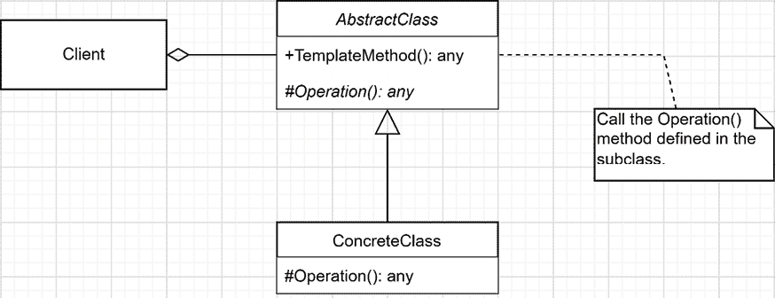
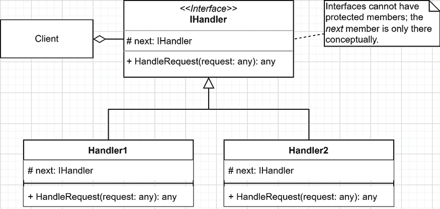
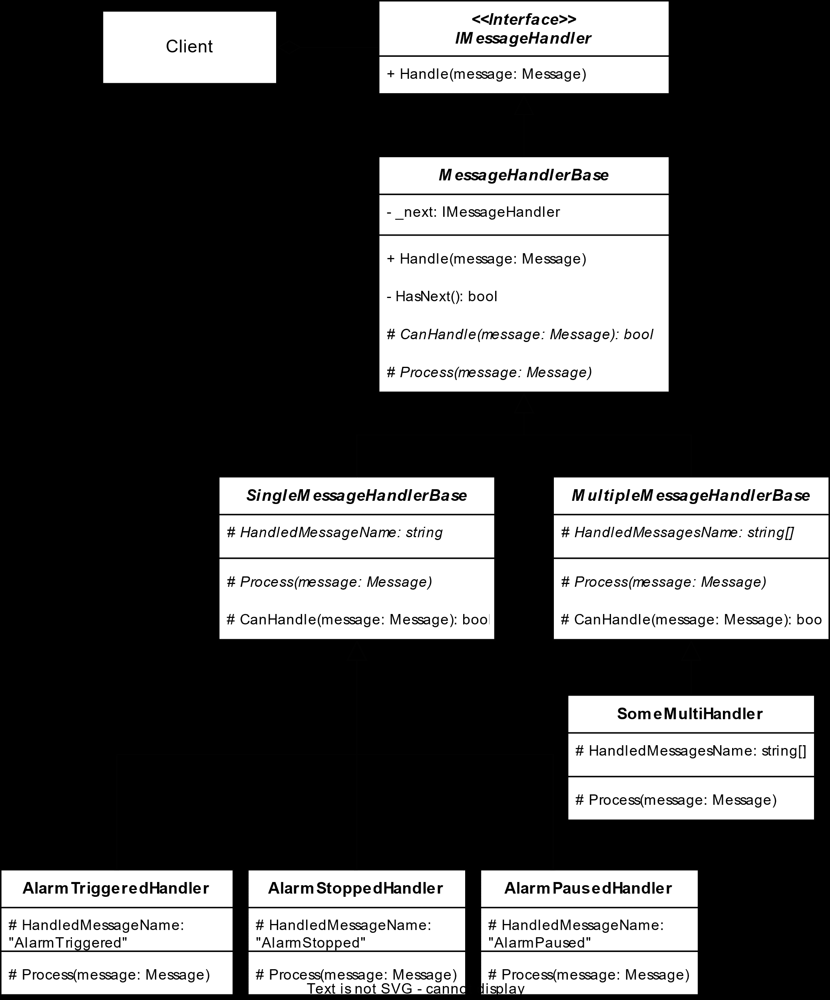

# 12 行为模式

## 在开始之前：加入我们的 Discord 书社区

直接向作者提供反馈，并在我们的 Discord 服务器上与其他早期读者聊天（在“architecting-aspnet-core-apps-3e”频道下找到“EARLY ACCESS SUBSCRIPTION”）。

[`packt.link/EarlyAccess`](https://packt.link/EarlyAccess)


本章探讨了来自知名**四人帮**（**GoF**）的两种新的设计模式。它们是行为模式，意味着它们有助于简化系统行为管理。通常，我们需要封装一些核心算法，同时允许其他代码片段扩展该实现。这就是**模板方法**模式发挥作用的地方。有时，我们有一个复杂的过程，包含多个算法，这些算法都适用于一个或多个情况，我们需要以可测试和可扩展的方式组织它们。这就是**责任链**模式能提供帮助的地方。例如，ASP.NET Core 中间件管道就是一个责任链，其中所有中间件都会检查并处理请求。在本章中，我们将涵盖以下主题：

+   实现模板方法模式

+   实现责任链模式

+   混合模板方法和责任链模式

## 实现模板方法模式

**模板方法**是 GoF 行为模式，它使用继承在基类及其子类之间共享代码。这是一个非常强大且简单的设计模式。

### 目标

模板方法模式的目标是在基类中封装算法的轮廓，同时将算法的某些部分留给子类进行修改，这以低成本增加了灵活性。

### 设计

首先，我们需要定义一个包含`TemplateMethod`方法的基类，然后定义一个或多个子操作，这些操作需要由其子类（`abstract`）实现，或者可以被覆盖（`virtual`）。使用 UML，它看起来像这样：



图 12.1：表示模板方法模式的类图

这是如何工作的？

+   `AbstractClass`实现了共享代码：在`TemplateMethod`方法中的算法。

+   `ConcreteClass`在其继承的`Operation`方法中实现算法的特定部分。

+   `Client`调用`TemplateMethod()`，它调用子类实现的一个或多个特定算法元素（在本例中是`Operation`方法）。

> 我们还可以从`AbstractClass`中提取一个接口，以提供更大的灵活性，但这超出了模板方法模式的范围。

让我们现在来看看一些代码，以了解模板方法模式是如何工作的。

### 项目 – 构建搜索机

让我们从简单的经典示例开始，以展示模板方法模式是如何工作的。**上下文**：根据集合的不同，我们希望使用不同的搜索算法。对于有序集合，我们希望使用二分搜索，但对于未排序的集合，我们希望使用线性搜索。让我们从消费者开始，它是 `Program.cs` 文件中的一个 REST 端点，返回 `plain/text` 结果：

```cs
var builder = WebApplication.CreateBuilder(args);
builder.Services
    .AddSingleton<SearchMachine>(x
        => new LinearSearchMachine(1, 10, 5, 2, 123, 333, 4))
    .AddSingleton<SearchMachine>(x
        => new BinarySearchMachine(1, 2, 3, 4, 5, 6, 7, 8, 9, 10))
;
var app = builder.Build();
app.MapGet("/", (IEnumerable<SearchMachine> searchMachines) =>
{
    var sb = new StringBuilder();
    var elementsToFind = new int[] { 1, 10, 11 };
    foreach (var searchMachine in searchMachines)
    {
        var typeName = searchMachine.GetType().Name;
        var heading = $"Current search machine is {typeName}";
        sb.AppendLine("".PadRight(heading.Length, '='));
        sb.AppendLine(heading);
        foreach (var value in elementsToFind)
        {
            var index = searchMachine.IndexOf(value);
            var wasFound = index.HasValue;
            if (wasFound)
            {
                sb.AppendLine($"The element '{value}' was found at index {index!.Value}.");
            }
            else
            {
                sb.AppendLine($"The element '{value}' was not found.");
            }
        }
    }
    return sb.ToString();
});
app.Run(); 
```

如前几行所强调的，我们将 `LinearSearchMachine` 和 `BinarySearchMachine` 配置为两个 `SearchMachine` 实现。我们使用不同的数字序列初始化每个实例。之后，我们将所有注册的 `SearchMachine` 服务注入到端点（代码块中突出显示）。该处理程序迭代所有 `SearchMachine` 实例，在输出 `text/plain` 结果之前尝试找到 `elementsToFind` 数组中的所有元素。接下来，让我们探索 `SearchMachine` 类：

```cs
namespace TemplateMethod;
public abstract class SearchMachine
{
    protected int[] Values { get; }
    protected SearchMachine(params int[] values)
    {
        Values = values ?? throw new ArgumentNullException(nameof(values));
    }
    public int? IndexOf(int value)
    {
        if (Values.Length == 0) { return null; }
        var result = Find(value);
        return result;
    }
    protected abstract int? Find(int value);
}
```

`SearchMachine` 类代表 `AbstractClass`。它公开了 `IndexOf` 模板方法，该方法使用由 `abstract` `Find` 方法表示的所需钩子（见突出显示的代码）。钩子是必需的，因为每个子类都必须实现该方法，从而使该方法成为一个必需的扩展点（或钩子）。接下来，我们探索我们的第一个 `ConcreteClass` 实现，即 `LinearSearchMachine` 类：

```cs
namespace TemplateMethod;
public class LinearSearchMachine : SearchMachine
{
    public LinearSearchMachine(params int[] values)
        : base(values) { }
    protected override int? Find(int value)
    {
        for (var i = 0; i < Values.Length; i++)
        {
            if (Values[i] == value) { return i; }
        }
        return null;
    }
}
```

`LinearSearchMachine` 类是一个表示 `SearchMachine` 使用的线性搜索实现的 `ConcreteClass`。它通过其 `Find` 方法贡献了 `IndexOf` 算法的一部分。最后，我们继续到 `BinarySearchMachine` 类：

```cs
namespace TemplateMethod;
public class BinarySearchMachine : SearchMachine
{
    public BinarySearchMachine(params int[] values)
        : base(values.OrderBy(v => v).ToArray()) { }
    protected override int? Find(int value)
    {
        var index = Array.BinarySearch(Values, value);
        return index < 0 ? null : index;
    }
}
```

`BinarySearchMachine` 类是一个表示 `SearchMachine` 的二分搜索实现的 `ConcreteClass`。如您所注意到的，我们通过委托给内置的 `Array.BinarySearch` 方法来跳过了二分搜索算法的实现。感谢 .NET 团队！

> 二分查找算法需要一个有序集合来工作；因此，在将值传递给基类（`OrderBy`）时，构造函数中执行的排序可能是确保数组排序（先决条件/保护）的最不高效方式，但它是一种快速编写且易于阅读的方式来编写它。此外，在我们的情况下，性能并不是问题。
> 
> > 如果您必须优化这样的算法以与大数据集一起工作，您可以使用并行性（多线程）来提供帮助。无论如何，运行适当的基准测试以确保您优化了正确的事情，并评估您的实际收益。如果您正在查看基准测试 .NET 代码，请查看 BenchmarkDotNet（[`adpg.link/C5E9`](https://adpg.link/C5E9)）。

现在我们已经定义了演员并探讨了代码，让我们看看我们的消费者（`Client`）中发生了什么：

1.  `Client` 使用注册的 `SearchMachine` 实例搜索值 1、10 和 11。

1.  之后，`Client` 向用户显示数字是否被找到。

当`Find`方法找不到值时返回`null`，通过扩展，`IndexOf`方法也是如此。运行程序后，我们得到以下输出：

```cs
=============================================
Current search machine is LinearSearchMachine
The element '1' was found at index 0.
The element '10' was found at index 1.
The element '11' was not found.
=============================================
Current search machine is BinarySearchMachine
The element '1' was found at index 0.
The element '10' was found at index 9.
The element '11' was not found.
```

前面的输出显示了正在运行的两种算法。两个`SearchMachine`实现都没有包含值`11`。它们都包含了值`1`和`10`，但位置不同。以下是值的提醒：

```cs
new LinearSearchMachine(1, 10, 5, 2, 123, 333, 4)
new BinarySearchMachine(1, 2, 3, 4, 5, 6, 7, 8, 9, 10)
```

消费者正在迭代与 IoC 容器注册的`SearchMachine`。基类实现了`IndexOf`，但将搜索（`Find`）算法委托给子类。前面的输出显示每个`SearchMachine`只需通过实现算法的`Find`部分就能执行预期的任务。就这样！我们已经涵盖了模板方法模式，就像那样简单。当然，我们的算法是微不足道的，但概念仍然存在。为了确保实现的正确性，我还为每个类创建了两项测试。以下是`LinearSearchMachine`类的测试：

```cs
namespace TemplateMethod;
public class LinearSearchMachineTest
{
    public class IndexOf
    {
        [Theory]
        [InlineData(1, 0)]
        [InlineData(2, 4)]
        [InlineData(3, 2)]
        [InlineData(7, null)]
        public void Should_return_the_expected_result(
            int value, int? expectedIndex)
        {
            // Arrange
            var sorter = new LinearSearchMachine(1, 5, 3, 4, 2);
            // Act
            var index = sorter.IndexOf(value);
            // Assert
            Assert.Equal(expectedIndex, index);
        }
    }
}
```

前面的测试确保通过`LinearSearchMachine`类的`IndexOf`方法找到或未找到正确的值。接下来是对`BinarySearchMachine`类的一个类似测试：

```cs
namespace TemplateMethod;
public class BinarySearchMachineTest
{
    public class IndexOf
    {
        [Theory]
        [InlineData(1, 0)]
        [InlineData(8, 5)]
        [InlineData(3, 2)]
        [InlineData(7, null)]
        public void Should_return_the_expected_result(int value, int? expectedIndex)
        {
            // Arrange
            var sorter = new BinarySearchMachine(1, 2, 3, 4, 5, 8);
            // Act
            var index = sorter.IndexOf(value);
            // Assert
            Assert.Equal(expectedIndex, index);
        }
    }
}
```

前面的测试确保通过`BinarySearchMachine`类的`IndexOf`方法找到或未找到正确的值。

> 我们可以在基类中添加`virtual`方法来创建可选的钩子。这些方法将成为可选的扩展点，子类可以选择实现或不实现。这将允许支持更复杂和更通用的场景。我们在这里不会涵盖这一点，因为它不是模式本身的一部分，即使非常相似。在.NET **基类库**（**BCL**）中有许多例子，比如`ComponentBase`类的大多数方法（在`Microsoft.AspNetCore.Components`命名空间中）。例如，当在 Blazor 组件中覆盖`OnInitialized`方法时，我们利用了一个可选的扩展钩子。基方法不执行任何操作，仅用于扩展目的，允许我们在组件的生命周期中运行代码。您可以在 GitHub 上的官方.NET 仓库中查看`ComponentBase`类的代码：[`adpg.link/1WYq`](https://adpg.link/1WYq)。

这结束了我们对另一个简单而强大的设计模式的研究。

### 结论

模板方法是一种强大且易于实现的设计模式，允许子类在实现（抽象）或覆盖（虚拟）子部分的同时重用算法的骨架。它允许特定实现的类扩展核心算法。它可以减少逻辑的重复，提高可维护性，同时不减少过程中的任何灵活性。在.NET BCL 中有许多例子，我们根据一个真实世界的场景在章节末尾利用了这个模式。现在，让我们看看模板方法模式如何帮助我们遵循**SOLID**原则：

+   **S**：模板方法将算法特定的代码部分推送到子类，同时保持核心算法在基类中。这样做通过分配责任来帮助遵循**单一职责原则**（**SRP**）。

+   **O**：通过打开扩展钩子，它打开扩展的模板（允许子类扩展它）并关闭修改（不需要修改基类，因为子类可以扩展它）。

+   **L**：只要子类是实现并且没有改变基类本身，遵循**里氏替换原则**（**LSP**）应该不会有问题。然而，这个原则很棘手，所以有可能打破它；例如，通过抛出新的异常类型或以改变更复杂基类状态的方式改变其行为。

+   **I**：只要基类实现了可能的最小内聚表面，使用模板方法模式不应该对程序产生负面影响。此外，在类中拥有较小的接口表面减少了违反**里氏替换原则**（**LSP**）的机会。

+   **D**：模板方法模式基于一个抽象，因此只要消费者依赖于这个抽象，它应该有助于符合**依赖倒置原则**（**DIP**）。

接下来，我们在混合模板方法和责任链模式之前，转向责任链设计模式，以改进我们的代码。

## 实现责任链模式

**责任链**是 GoF 行为模式，通过链式连接类来高效处理复杂场景，同时投入有限的努力。再次强调，目标是将复杂问题分解成多个更小的单元。

### 目标

责任链模式旨在链式连接多个处理者，每个处理者解决有限数量的问题。如果一个处理者不能解决特定的问题，它将解决方案传递给链中的下一个处理者。

> 我们通常创建一个默认处理者，作为终端处理者在链的末尾执行逻辑。这样的处理者可以抛出一个异常（例如，`OperationNotHandledException`），将问题级联到调用堆栈中的消费者，该消费者知道如何处理和响应它。另一种策略是创建一个终端处理者，执行相反的操作并确保不发生任何事情。

### 设计

最基本的责任链模式首先通过定义一个处理请求的接口（`IHandler`）开始。然后我们添加处理一个或多个场景的类（`Handler1` 和 `Handler2`）：



图 12.2：表示责任链模式的类图

责任链模式与其他许多模式的不同之处在于，没有中央调度器知道处理器；所有处理器都是独立的。消费者接收一个处理器并指示它处理请求。每个处理器决定它是否能够处理请求。如果可以，它就处理它。在两种情况下，它还会评估是否应该将请求转发到链中的下一个处理器。处理器可以以任何顺序执行这两个任务，比如执行一些逻辑，将请求沿链向下传递，然后在请求返回时执行更多逻辑（就像一个管道）。这种模式允许我们将复杂的逻辑分解成多个处理单个职责的部分，从而在过程中提高可测试性、可重用性和可扩展性。由于不存在协调器，每个链元素都是独立的，这导致了一个统一且松散耦合的设计。

> 在创建责任链时，你可以对处理器进行排序，使得最常请求的处理器靠近链的开始，而最少请求的处理器靠近链的末端。这有助于限制在到达正确的处理器之前，每个请求需要访问的“链链接”数量。

理论已经足够了；让我们看看一些代码。

### 项目 – 消息解释器

**上下文**：我们需要创建一个消息应用接收端，其中每个消息都是唯一的，这使得无法创建一个处理所有消息的单一代码。在分析问题后，我们决定构建一个责任链，其中每个处理器可以管理一个单独的消息。这个模式似乎非常完美！

> 这个项目基于我多年前构建的东西。由于带宽有限，物联网设备正在发送字节（消息）。然后，我们必须在 Web 应用中将这些字节与真实值关联起来。每个消息都有一个固定的头部大小，但有一个可变的消息体大小。头部由基本处理器（模板方法）处理，链中的每个处理器管理不同的消息类型。对于当前示例，我们将其简化为解析字节，但概念是相同的。

对于我们的演示应用，消息就像这样简单：

```cs
namespace ChainOfResponsibility;
public record class Message(string Name, string? Payload);
```

`Name` 属性用作区分消息的判别器，每个处理器负责对 `Payload` 属性进行一些操作。

> 我们不会对有效载荷做任何处理，因为它与模式无关，但从概念上讲，这是应该发生的逻辑。

处理器非常简单，以下是其接口：

```cs
namespace ChainOfResponsibility; 
public interface IMessageHandler
{
    void Handle(Message message);
}
```

处理器唯一能做的就是处理消息。我们的初始应用可以处理以下消息：

+   `AlarmTriggeredHandler` 类处理 `AlarmTriggered` 消息。

+   `AlarmPausedHandler` 类处理 `AlarmPaused` 消息。

+   `AlarmStoppedHandler` 类处理 `AlarmStopped` 消息。

> 现实世界的逻辑是，一台机器可以向 REST API 发送一个警报，表明它已经达到某个阈值。然后 REST API 可以将该信息推送到 UI，发送电子邮件、短信等。
> 
> > 被警告的人可以在调查问题时暂停警报，这样其他人就知道警报正在被处理。
> > 
> > 最后，一个人可以前往物理设备并停止警报，因为问题已经得到解决。
> > 
> > 我们可以对许多更多的子场景进行外推，但这只是大概。

这三个处理程序非常相似，并且共享相当多的逻辑，但我们稍后会解决这个问题。同时，我们有以下处理程序：

```cs
namespace ChainOfResponsibility;
public class AlarmTriggeredHandler : IMessageHandler
{
    private readonly IMessageHandler? _next;
    public AlarmTriggeredHandler(IMessageHandler? next = null)
    {
        _next = next;
    }
    public void Handle(Message message)
    {
        if (message.Name == "AlarmTriggered")
        {
            // Do something clever with the Payload
        }
        else
        {
            _next?.Handle(message);
        }
    }
}
public class AlarmPausedHandler : IMessageHandler
{
    private readonly IMessageHandler? _next;
    public AlarmPausedHandler(IMessageHandler? next = null)
    {
        _next = next;
    }
    public void Handle(Message message)
    {
        if (message.Name == "AlarmPaused")
        {
            // Do something clever with the Payload
        }
        else
        {
            _next?.Handle(message);
        }
    }
}
public class AlarmStoppedHandler : IMessageHandler
{
    private readonly IMessageHandler? _next;
    public AlarmStoppedHandler(IMessageHandler? next = null)
    {
        _next = next;
    }
    public void Handle(Message message)
    {
        if (message.Name == "AlarmStopped")
        {
            // Do something clever with the Payload
        }
        else
        {
            _next?.Handle(message);
        }
    }
}
```

每个处理程序做两件事：

+   它从其构造函数（在代码中高亮显示）接收一个可选的“下一个处理程序”。这创建了一个类似于单链表的链。

+   它只处理它所知的请求，将其他请求委托给链中的下一个处理程序。

让我们使用`Program.cs`作为责任链（客户端）的消费者，并使用 POST 请求与我们的 REST API 接口并构建消息。以下是我们的 REST API 的第一部分：

```cs
var builder = WebApplication.CreateBuilder(args);
builder.Services.AddSingleton<IMessageHandler>(
    new AlarmTriggeredHandler(
        new AlarmPausedHandler(
            new AlarmStoppedHandler())));
```

在前面的代码中，我们手动创建责任链并将其注册为绑定到`IMessageHandler`接口的单例。在注册代码中，每个处理程序都是手动注入到前一个构造函数（使用`new`关键字创建）中的。下面的代码代表了`Program.cs`文件的第二部分：

```cs
var app = builder.Build();
app.MapPost(
    "/handle",
    (Message message, IMessageHandler messageHandler) =>
    {
        messageHandler.Handle(message);
        return $"Message '{message.Name}' handled successfully.";
    });
app.Run();
```

消费端点可通过`/handle` URL 访问，并期望其体中包含一个`Message`对象。然后它使用注入的`IMessageHandler`接口的实现，并将消息传递给它。如果我们运行`ChainOfResponsibility.http`文件中的任何 HTTP 请求，我们会得到一个类似以下的成功结果：

```cs
Message 'AlarmTriggered' handled successfully.
```

问题在于，即使我们发送一个无效的消息，消费者也无法知道，所以即使没有处理程序拾取消息，它仍然是有效的。为了处理这种情况，让我们添加一个第四个处理程序（终端处理程序），它通知消费者有关无效请求的信息：

```cs
public class DefaultHandler : IMessageHandler
{
    public void Handle(Message message)
    {
        throw new NotSupportedException(
            $"Messages named '{message.Name}' are not supported.");
    }
}
```

这个新的终端处理程序会抛出一个异常，通知消费者有关错误。

> 我们可以创建自定义异常，以便更容易地区分系统和应用程序错误。在这种情况下，抛出一个系统异常就足够了。在现实世界的应用程序中，我建议创建一个自定义异常，它代表链的末端，并包含消费者根据您的用例对其做出反应的相关信息。

接下来，让我们在我们的链中注册它（高亮显示）：

```cs
builder.Services.AddSingleton<IMessageHandler>(
    new AlarmTriggeredHandler(
        new AlarmPausedHandler(
            new AlarmStoppedHandler(
                new DefaultHandler()
            ))));
```

如果我们发送一个名为`SomeUnhandledMessageName`的 POST 请求，端点现在会返回以下异常：

```cs
System.NotSupportedException: Messages named 'SomeUnhandledMessageName' are not supported.
   at ChainOfResponsibility.DefaultHandler.Handle(Message message) in C12\src\ChainOfResponsibility\DefaultHandler.cs:line 7
   at ChainOfResponsibility.AlarmStoppedHandler.Handle(Message message) in C12\src\ChainOfResponsibility\AlarmStoppedHandler.cs:line 19
   at ChainOfResponsibility.AlarmPausedHandler.Handle(Message message) in C12\src\ChainOfResponsibility\AlarmPausedHandler.cs:line 19
   at ChainOfResponsibility.AlarmTriggeredHandler.Handle(Message message) in C12\src\ChainOfResponsibility\AlarmTriggeredHandler.cs:line 19
   at Program.<>c.<<Main>$>b__0_0(Message message, IMessageHandler messageHandler) in C12\src\ChainOfResponsibility\Program.cs:line 22
   at lambda_method1(Closure, Object, HttpContext, Object)
   at Microsoft.AspNetCore.Http.RequestDelegateFactory.<>c__DisplayClass100_2.<<HandleRequestBodyAndCompileRequestDelegateForJson>b__2>d.MoveNext()
--- End of stack trace from previous location ---
   at Microsoft.AspNetCore.Routing.EndpointMiddleware.<Invoke>g__AwaitRequestTask|6_0(Endpoint endpoint, Task requestTask, ILogger logger)
   at Microsoft.AspNetCore.Diagnostics.DeveloperExceptionPageMiddlewareImpl.Invoke(HttpContext context)
HEADERS
=======
Host: localhost:10001
Content-Type: application/json
traceparent: 00-5d737fdbb1018d5b7d060b74baf26111-2805f137fe1541af-00
Content-Length: 77
```

到目前为止，一切顺利，但体验并不好，所以让我们在端点中添加一个 try-catch 块来处理这种情况：

```cs
app.MapPost(
    "/handle",
    (Message message, IMessageHandler messageHandler) =>
    {
        try
        {
            messageHandler.Handle(message);
            return $"Message '{message.Name}' handled successfully.";
        }
        catch (NotSupportedException ex)
        {
            return ex.Message;
        }
    });
```

现在，当我们发送一个无效的消息时，API 会温和地返回以下消息给我们：

```cs
Messages named 'SomeUnhandledMessageName' are not supported.
```

> 当然，当你期望机器消费你的 API 时，你应该生成一个更容易解析的数据结构，比如使用 JSON。

哇，我们已经构建了一个简单的责任链来处理消息。

### 结论

责任链模式是另一个优秀的 GoF 模式。它将一个大问题分解成更小、更紧密的单元，每个单元只做一项工作：处理其特定的请求。现在，让我们看看责任链模式如何帮助我们遵循**SOLID**原则：

+   **S**：责任链模式旨在遵循这个确切的原则：每个类创建一个逻辑单元！

+   **O**：责任链模式允许在不接触代码的情况下通过改变链的组成在组合根中添加、删除和重新排序处理器。

+   **L**：N/A

+   **I**：如果我们创建一个小的接口，责任链模式有助于 ISP。处理器接口不仅限于一个方法；它可以公开多个。

+   **D**：通过使用处理器接口，链中的任何元素，以及消费者，都不依赖于特定的处理器；它们只依赖于代表链的接口，这有助于反转依赖流。

接下来，让我们使用模板方法和责任链模式来封装我们处理器的重复逻辑。

## 混合模板方法和责任链模式

本节探讨了两种强大的设计模式的组合：模板方法和责任链模式。正如我们即将探讨的，这两个模式配合得很好。我们使用模板方法模式作为基本结构，提供处理器的蓝图。同时，责任链模式管理处理顺序，确保每个请求都被路由到正确的处理器。当这两个模式协同工作时，它们形成了一个健壮的框架，便于管理，保持秩序，并提高我们系统的适应性。

### 项目 - 改进的消息解释器

既然我们已经了解了**责任链**和**模板方法**模式，现在是时候通过使用模板方法模式将共享逻辑提取到抽象基类中，并为子类提供扩展点来“DRY”我们的处理器了。好的，那么哪些逻辑是重复的？

+   除了终端处理器外，`next`处理器注入代码都是相同的。此外，这是我们应该在基类中封装的模式的一个重要部分。

+   逻辑测试当前处理器是否可以处理消息，除了终端处理器外，都是相同的。

让我们创建一个新的基类，该基类实现了模板方法模式以及我们责任链的大部分逻辑：

```cs
namespace ImprovedChainOfResponsibility; 
public abstract class MessageHandlerBase : IMessageHandler
{
    private readonly IMessageHandler? _next;
    public MessageHandlerBase(IMessageHandler? next = null)
    {
        _next = next;
    }
    public void Handle(Message message)
    {
        if (CanHandle(message))
        {
            Process(message);
        }
        else if (HasNext())
        {
            _next.Handle(message);
        }
    }
    [MemberNotNullWhen(true, nameof(_next))]
    private bool HasNext()
    {
        return _next != null;
    }
    protected virtual bool CanHandle(Message message)
    {
        return message.Name == HandledMessageName;
    }
    protected abstract string HandledMessageName { get; }
    protected abstract void Process(Message message);
}
```

基于这些少数的更改，模板方法是什么，以及扩展点（钩子）是什么？`MessageHandlerBase`类添加了`Handle`模板方法。然后，`MessageHandlerBase`类公开以下扩展点：

+   `CanHandle`方法测试`HandledMessageName`是否等于`message.Name`属性的值。如果子类需要不同的比较逻辑，则可以重写此方法。这是一个可选的钩子。

+   所有子类都必须实现`HandledMessageName`属性，这是`CanHandle`方法的关键驱动因素。这是一个强制性的钩子。

+   所有子类都必须实现`Process`方法，允许它们在消息上运行它们的逻辑。这是一个强制性的钩子。

要了解这些钩子是如何发挥作用的，让我们看看三个简化的警报处理器：

```cs
public class AlarmTriggeredHandler : MessageHandlerBase
{
    protected override string HandledMessageName => "AlarmTriggered";
    public AlarmTriggeredHandler(IMessageHandler? next = null)
        : base(next) { }
    protected override void Process(Message message)
    {
        // Do something clever with the Payload
    }
}
public class AlarmPausedHandler : MessageHandlerBase
{
    protected override string HandledMessageName => "AlarmPaused";
    public AlarmPausedHandler(IMessageHandler? next = null)
        : base(next) { }
    protected override void Process(Message message)
    {
        // Do something clever with the Payload
    }
}
public class AlarmStoppedHandler : MessageHandlerBase
{
    protected override string HandledMessageName => "AlarmStopped";
    public AlarmStoppedHandler(IMessageHandler? next = null)
        : base(next) { }
    protected override void Process(Message message)
    {
        // Do something clever with the Payload
    }
}
```

从更新的警报处理器中我们可以看到，它们现在被限制在单一的责任：处理它们可以处理的消息。相比之下，`MessageHandlerBase` 现在处理责任链的管道。我们保留了`DefaultHandler` 类的原始状态，因为它位于链的末端，不支持有下一个处理器，也不处理消息。将这两种模式混合在一起创建了一个复杂的信息系统，将责任划分到处理器中。每个消息都有一个处理器，并将链逻辑推入基类。这种系统的美妙之处在于我们不必同时考虑所有消息；我们可以一次专注于一个消息。当处理一种新的消息类型时，我们可以专注于那个特定的消息，实现其处理器，并忘记其他 *N* 种类型。消费者也可以非常简单，将请求发送到管道中，而不了解责任链，就像魔法一样，正确的处理器将占上风！然而，你是否注意到了这个设计的问题？让我们在下一节中看看。

### 项目 – 一个最终更细粒度的设计

在最后一个例子中，我们使用了`HandledMessageName`和`CanHandle`来决定一个处理器是否可以处理一个请求。这个代码有一个问题：如果子类决定重写`CanHandle`，然后决定它不再需要`HandledMessageName`，我们最终会在系统中留下一个持久未使用的属性。

> 有更糟糕的情况，但我们在谈论组件设计，为什么不将这个系统推向更好的设计呢？

解决这个问题的一种方法是通过创建一个更细粒度的类层次结构，如下所示：



图 12.4：表示实现责任链和模板方法模式的更细粒度项目设计的类图

之前的图表看起来比实际复杂。但让我们先看看我们的重构代码，从新的`MessageHandlerBase`类开始：

```cs
namespace FinalChainOfResponsibility;
public interface IMessageHandler
{
    void Handle(Message message);
}
public abstract class MessageHandlerBase : IMessageHandler
{
    private readonly IMessageHandler? _next;
    public MessageHandlerBase(IMessageHandler? next = null)
    {
        _next = next;
    }
    public void Handle(Message message)
    {
        if (CanHandle(message))
        {
            Process(message);
        }
        else if (HasNext())
        {
            _next.Handle(message);
        }
    }
    [MemberNotNullWhen(true, nameof(_next))]
    private bool HasNext()
    {
        return _next != null;
    }
    protected abstract bool CanHandle(Message message);
    protected abstract void Process(Message message);
}
```

`MessageHandlerBase` 类通过处理下一个处理器的逻辑并暴露两个钩子（模板方法模式）来管理责任链，允许子类扩展：

+   `bool CanHandle(Message message)`

+   `void Process(Message message)`

这个类与上一个类类似，但现在 `CanHandle` 方法是抽象的，我们移除了 `HandledMessageName` 属性，这导致了更好的责任分离和更好的钩子。接下来，让我们看看 `SingleMessageHandlerBase` 类，它替换了从 `MessageHandlerBase` 类中移除的逻辑：

```cs
public abstract class SingleMessageHandlerBase : MessageHandlerBase
{
    public SingleMessageHandlerBase(IMessageHandler? next = null)
        : base(next) { }
    protected override bool CanHandle(Message message)
    {
        return message.Name == HandledMessageName;
    }
    protected abstract string HandledMessageName { get; }
}
```

`SingleMessageHandlerBase` 类继承自 `MessageHandlerBase` 类，并重写了 `CanHandle` 方法。它实现了相关的逻辑，并添加了 `HandledMessageName` 属性，子类必须定义此属性以使 `CanHandle` 方法生效（一个必需的扩展点）。`AlarmPausedHandler`、`AlarmStoppedHandler` 和 `AlarmTriggeredHandler` 类现在继承自 `SingleMessageHandlerBase` 而不是 `MessageHandlerBase`，但其他方面没有变化。以下是代码作为提醒：

```cs
namespace FinalChainOfResponsibility;
public class AlarmPausedHandler : SingleMessageHandlerBase
{
    protected override string HandledMessageName => "AlarmPaused";
    public AlarmPausedHandler(IMessageHandler? next = null)
        : base(next) { }
    protected override void Process(Message message)
    {
        // Do something clever with the Payload
    }
}
public class AlarmStoppedHandler : SingleMessageHandlerBase
{
    protected override string HandledMessageName => "AlarmStopped";
    public AlarmStoppedHandler(IMessageHandler? next = null)
        : base(next) { }
    protected override void Process(Message message)
    {
        // Do something clever with the Payload
    }
}
public class AlarmTriggeredHandler : SingleMessageHandlerBase
{
    protected override string HandledMessageName => "AlarmTriggered";
    public AlarmTriggeredHandler(IMessageHandler? next = null)
        : base(next) { }
    protected override void Process(Message message)
    {
        // Do something clever with the Payload
    }
}
```

这些 `SingleMessageHandlerBase` 的子类实现了 `HandledMessageName` 属性，它返回它们可以处理的消息名称，并且它们通过重写 `Process` 方法来实现处理逻辑，就像之前一样。接下来，我们来看看 `MultipleMessageHandlerBase` 类，它使它的子类型能够处理多种消息类型：

```cs
public abstract class MultipleMessageHandlerBase : MessageHandlerBase
{
    public MultipleMessageHandlerBase(IMessageHandler? next = null)
        : base(next) { }
    protected override bool CanHandle(Message message)
    {
        return HandledMessagesName.Contains(message.Name);
    }
    protected abstract string[] HandledMessagesName { get; }
}
```

`MultipleMessageHandlerBase` 类与 `SingleMessageHandlerBase` 类执行相同的操作，但它使用字符串数组而不是单个字符串，支持多个处理器名称。`DefaultHandler` 类没有变化。为了演示目的，让我们添加 `SomeMultiHandler` 类，该类模拟了一个可以处理 `"Foo"`、`"Bar"` 和 `"Baz"` 消息的消息处理器：

```cs
namespace FinalChainOfResponsibility;
public class SomeMultiHandler : MultipleMessageHandlerBase
{
    public SomeMultiHandler(IMessageHandler? next = null)
        : base(next) { }
    protected override string[] HandledMessagesName
        => new[] { "Foo", "Bar", "Baz" };
    protected override void Process(Message message)
    {
        // Do something clever with the Payload
    }
}
```

这个类层次结构可能听起来很复杂，但我们所做的是允许扩展性，而不需要在过程中保留任何不必要的代码，使每个类都只有一个单一的责任：

+   `MessageHandlerBase` 类处理 `_next`。

+   `SingleMessageHandlerBase` 类处理支持单个消息的处理器的 `CanHandle` 方法。

+   `MultipleMessageHandlerBase` 类处理支持多个消息的处理器的 `CanHandle` 方法。

+   其他类实现了它们自己的 `Process` 方法版本来处理一个或多个消息。

哇！这是另一个示例，展示了模板方法和责任链模式共同工作的强大之处。最后一个示例还强调了 SRP 的重要性，它允许更大的灵活性，同时保持代码的可靠性和可维护性。该设计的另一个优点是顶部的接口。任何不适合类层次结构的东西都可以直接从接口实现，而不是试图从不适用的结构中适应逻辑。《DefaultHandler》类就是这样一个很好的例子。

> 将代码欺骗成按照你的意愿执行，而不是正确设计系统的那部分，会导致半成品解决方案，这些解决方案难以维护。

### 结论

将模板方法模式和责任链模式混合使用会导致具有单一职责的更小的类。我们在保持逻辑不在处理程序中时移除了遗留属性。我们甚至将逻辑扩展到更多的用例中。

## 摘要

在本章中，我们介绍了两个 GoF 行为模式。这些模式可以帮助我们创建灵活且易于维护的系统。正如其名所示，行为模式旨在将应用行为封装成统一的片段。首先，我们了解了模板方法模式，它允许我们在基类中封装算法的轮廓，同时将算法的一些部分留空，以便子类进行修改。然后，子类填补这些空白，并在预定义的位置扩展该算法。这些位置可以是必需的（`抽象`）或可选的（`虚拟`）。然后，你学习了责任链模式，它打开了将多个小型处理程序链接成处理链的可能性，将待处理的消息输入到链的起始处（接口），并等待一个或多个处理程序执行与该消息相关的逻辑。

> 你不必在第一个处理程序处停止链的执行。责任链可以变成一个管道，而不是将一条消息关联到一个处理程序，正如我们所探讨的那样。

最后，利用模板方法模式封装责任链的链接逻辑，使我们得到了一个更简单、更健壮、更灵活、更可测试的实现，没有任何牺牲。这两个设计模式配合得非常好。在下一章中，我们将深入研究操作结果设计模式，以发现管理返回值的高效方法。

## 问题

让我们看看几个练习问题：

1.  模板方法模式的主要目标是什么？

1.  责任链模式的主要目标是什么？

1.  实现模板方法设计模式时，我们只能添加一个`抽象`方法，这是真的吗？

1.  我们能否将策略模式与模板方法模式结合使用？

1.  在责任链中有一个处理程序数量的限制为 32 个，这是真的吗？

1.  在责任链中，多个处理程序可以处理同一条消息吗？

1.  模板方法模式如何帮助实现责任链模式？

## 答案

1.  模板方法模式在基类中封装算法的轮廓，同时将算法的一些部分留空，以便其子类进行修改。

1.  责任链模式将更大的问题划分为小块（处理程序）。每个部分都是自我管理的，而链的存在对其消费者来说是抽象的。

1.  错误；你可以创建你需要的任意数量的`抽象`（必需）或`虚拟`（可选）扩展点（钩子）。

1.  是的，没有理由不这样做。

1.  不，没有比其他代码更大的限制。

1.  是的，你可以为每条消息指定一个处理程序，或者为每条消息指定多个处理程序。这取决于你和你自己的需求。

1.  它通过将共享逻辑封装到一个或多个基类中，帮助在类之间划分责任。
