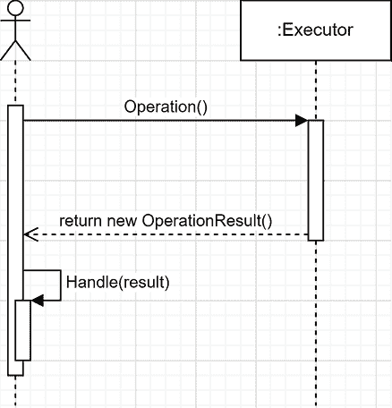

# 13 理解操作结果设计模式

## 在开始之前：加入我们的 Discord 书籍社区

直接向作者本人提供反馈，并在我们的 Discord 服务器上与其他早期读者聊天（在“EARLY ACCESS SUBSCRIPTION”下的“architecting-aspnet-core-apps-3e”频道中查找）。

[`packt.link/EarlyAccess`](https://packt.link/EarlyAccess)


本章探讨了**操作结果**模式，从简单开始，逐步过渡到更复杂的案例。操作结果旨在将操作的成功或失败传达给调用者。它还允许该操作返回一个值以及一个或多个消息给调用者。想象一下任何你想要显示用户友好错误信息、实现一些小的速度提升，或者甚至轻松且明确地处理失败的系统。**操作结果**设计模式可以帮助你实现这些目标。使用它的一种方法是处理远程操作的结果，例如在查询远程网络服务之后。此模式建立在面向对象编程的基础概念之上。在本章中，我们逐步迭代和设计不同的可能性。当然，你应该始终根据你的需求来设计最终的设计，因此学习多个选项将帮助你做出正确的选择。

> 操作结果模式也被称为**结果对象模式**。我更喜欢操作结果，因为这个名字表明它代表了一个操作的结果，而结果对象有更广泛的意义。尽管如此，两者基本上是相同的。

在本章中，我们将介绍以下主题：

+   操作结果设计模式的基本知识

+   返回值的操作结果设计模式

+   返回错误信息的操作结果设计模式

+   返回具有严重级别信息的操作结果设计模式

+   使用子类和静态工厂方法以更好地隔离成功和失败

## 操作结果模式

操作结果设计模式可以从非常简单到更复杂。在本节中，我们将探讨使用此模式的不同方法。我们从其最简单形式开始，在此基础上构建，直到我们可以返回消息和值，并将严重级别作为操作的结果添加。

### 目标

**操作结果**模式的作用是赋予一个操作（一个方法）返回一个复杂结果（一个对象）的可能性，这允许消费者：

+   [必选] 访问操作的成功指示器（即操作是否成功）。

+   [可选] 如果有，访问操作结果（方法返回值）。

+   [可选] 如果操作失败（错误信息），访问失败的原因。

+   [可选] 访问记录操作结果的其它信息。这可能只是一个消息列表，也可能非常复杂，如多个属性。

这可以更进一步，例如返回失败的严重性或为特定用例添加任何其他相关信息。成功指示器可以是二进制的（`true` 或 `false`），或者可能有超过两种状态，如成功、部分成功和失败。

> 首先关注您的需求，然后运用您的想象力和知识来找到最佳解决方案。软件工程不仅仅是应用别人告诉您的技术。它是一门艺术！区别在于您是在制作软件而不是绘画或木工。而且大多数人甚至看不到任何这种艺术（代码）或即使看到了也不理解。

### 设计

当操作失败时，依赖抛出异常是很常见的。然而，操作结果模式是当您不想使用异常时，在组件之间传达成功或失败的一种替代方式。其中一个原因可能是消息不是错误，或者处理错误结果是主流程的一部分，而不是`catch`流程的一部分。一个方法必须返回一个包含在“目标”部分中展示的一个或多个元素的对象，以便有效地使用。作为一个经验法则，返回操作结果的方法不应该抛出异常。这样，消费者只需处理操作结果本身，无需处理其他任何内容。

> 您可以为特殊情况抛出异常，但在此阶段，这是一个基于明确规范或面对真实问题的判断。例如，一个关键事件发生，如磁盘已满，将是一个有效的异常使用案例，因为它与主流程无关，代码必须向程序的其他部分发出系统故障的警报。

而不是逐一向您展示所有可能的 UML 图，让我们先看看描述此模式最简单形式的基线序列图，然后探索多个更小的示例：



图 13.1：操作结果设计模式的序列图

上述图示表明，一个操作返回一个结果（一个对象），然后调用者处理该结果。以下示例涵盖了我们可以包含在该结果对象中的内容。

### 项目 - 实现不同的操作结果模式

在这个项目中，一个消费者（REST API）将 HTTP 请求路由到正确的处理器。我们逐个访问这些处理器，以从简单到更复杂的操作结果创建一个渐进式学习流程。这个项目向您展示了多种实现操作结果模式的方法，以帮助您理解它，使其成为您自己的，并在您的项目中按需实现。让我们从 REST API 开始。

#### 消费者

所有示例的消费者是 `Program.cs` 文件。以下来自 `Program.cs` 的代码将 HTTP 请求路由到处理器：

```cs
app.MapGet("/simplest-form", ...);
app.MapGet("/single-error", ...);
app.MapGet("/single-error-with-value", ...);
app.MapGet("/multiple-errors-with-value", ...);
app.MapGet("/multiple-errors-with-value-and-severity", ...);
app.MapGet("/static-factory-methods", ...);
```

接下来，我们逐个覆盖每个用例。

#### 操作结果模式的简单形式

以下图表示了操作结果模式的简单形式：


图 13.2：操作结果设计模式的类图

我们可以将这个类图转换为以下代码块：

```cs
app.MapGet(
    "/simplest-form",
    (OperationResult.SimplestForm.Executor executor) =>
    {
        var result = executor.Operation();
        if (result.Succeeded)
        {
            // Handle the success
            return "Operation succeeded";
        }
        else
        {
            // Handle the failure
            return "Operation failed";
        }
    }
);
```

上一段代码处理了 `/simplest-form` HTTP 请求。高亮显示的代码消费以下操作：

```cs
namespace OperationResult.SimplestForm;
public class Executor
{
    public OperationResult Operation()
    {
        // Randomize the success indicator
        // This should be real logic
        var randomNumber = Random.Shared.Next(100);
        var success = randomNumber % 2 == 0;
        // Return the operation result
        return new OperationResult(success);
    }
}
public record class OperationResult(bool Succeeded);
```

`Executor` 类包含由 `Operation` 方法表示的操作。该方法返回 `OperationResult` 类的一个实例。实现基于随机数。有时它成功，有时它失败。你通常会在这个方法中编写实际的应应用程序逻辑。此外，在实际应用中，该方法应该有一个适当的名称来表示操作，如 `PayRegistrationFees` 或 `CreateConcert`。《OperationResult》记录类表示操作的结果。在这种情况下，一个简单的只读布尔值存储在 `Succeeded` 属性中。

> 我选择记录类，因为没有理由让结果发生变化。要了解更多关于记录类的信息，请参阅 *附录 A*。

在这种形式下，`Operation` 方法返回 `bool` 和 `OperationResult` 实例之间的区别很小，但确实存在。通过返回 `OperationResult` 对象，你可以随着时间的推移扩展返回值，向其中添加属性和方法，而无需更新所有消费者是无法做到这一点的。接下来，我们向结果中添加一个错误消息。

#### 单个错误消息

既然我们知道操作是否成功，我们就想了解出了什么问题。为了做到这一点，我们在 `OperationResult` 记录类中添加了一个 `ErrorMessage` 属性。有了这个属性，我们就不再需要设置操作是否成功；我们可以使用 `ErrorMessage` 属性来计算这一点。这个改进背后的逻辑如下：

+   当没有错误消息时，操作成功。

+   当有错误消息时，操作失败。

实现此逻辑的 `OperationResult` 记录类看起来如下：

```cs
namespace OperationResult.SingleError
public record class OperationResult
{
    public bool Succeeded => string.IsNullOrWhiteSpace(ErrorMessage);
    public string? ErrorMessage { get; init; }
}
```

在前面的代码中，我们有以下内容：

+   `Succeeded` 属性检查错误消息。

+   `ErrorMessage` 属性包含在实例化对象时可以设置的错误消息。

执行该操作的执行者看起来相似，但使用新的构造函数，设置错误消息而不是直接设置成功指示器：

```cs
namespace OperationResult.SingleError
public class Executor
{
    public OperationResult Operation()
    {
        // Randomize the success indicator
        // This should be real logic
        var randomNumber = Random.Shared.Next(100);
        var success = randomNumber % 2 == 0;
        // Return the operation result
        return success
            ? new()
            : new() { ErrorMessage = $"Something went wrong with the number '{randomNumber}'." };
    }
}
```

消费代码与上一个示例相同，但在响应输出中写入错误消息而不是通用的失败字符串：

```cs
app.MapGet(
    "/single-error",
    (OperationResult.SingleError.Executor executor) =>
    {
        var result = executor.Operation();
        if (result.Succeeded)
        {
            // Handle the success
            return "Operation succeeded";
        }
        else
        {
            // Handle the failure
            return result.ErrorMessage;
        }
    }
);
```

当查看这个示例时，我们可以开始理解操作结果模式的有用性。它使我们远离了看似过于复杂的布尔值简单成功指示器。接下来，我们添加了在操作成功时设置值的可能性。

#### 添加返回值

现在我们有了失败的原因，我们可能希望操作返回一个值。为了实现这一点，让我们在之前的示例基础上构建，并向`OperationResult`类添加一个`Value`属性：

```cs
namespace OperationResult.SingleErrorWithValue;
public record class OperationResult
{
    public bool Succeeded => string.IsNullOrWhiteSpace(ErrorMessage);
    public string? ErrorMessage { get; init; }
    public int? Value { get; init; }
}
```

通过添加一个仅初始化的第二个属性，我们可以在操作成功和失败时设置`Value`属性。

> 在实际场景中，错误情况下`Value`属性可能是`null`，因此有一个可空的`int`属性。

操作也非常相似，但我们在这两种情况下都设置了`Value`属性，并使用了对象初始化器（高亮行）：

```cs
namespace OperationResult.SingleErrorWithValue;
public class Executor
{
    public OperationResult Operation()
    {
        // Randomize the success indicator
        // This should be real logic
        var randomNumber = Random.Shared.Next(100);
        var success = randomNumber % 2 == 0;
        // Return the operation result
        return success
            ? new() { Value = randomNumber }
            : new()
            {
                ErrorMessage = $"Something went wrong with the number '{randomNumber}'.",
                Value = randomNumber,
            };
    }
}
```

这样一来，消费者就可以使用`Value`属性。在我们的例子中，程序在操作成功时显示它：

```cs
app.MapGet(
    "/single-error-with-value",
    (OperationResult.SingleErrorWithValue.Executor executor) =>
    {
        var result = executor.Operation();
        if (result.Succeeded)
        {
            // Handle the success
            return $"Operation succeeded with a value of '{result.Value}'.";
        }
        else
        {
            // Handle the failure
            return result.ErrorMessage;
        }
    }
);
```

前面的代码在操作失败或成功时显示`ErrorMessage`属性。有了这个，操作结果模式的强大功能继续显现。但我们还没有完成，所以让我们跳到下一个发展阶段。

#### 多个错误消息

现在我们已经到了可以传递`Value`和`ErrorMessage`到操作消费者的时候了；那么传递多个错误，比如验证错误怎么办？为了实现这一点，我们可以将我们的`ErrorMessage`属性从`string`转换为`IEnumerable<string>`或其他更适合你需求的集合类型。在这里，我选择了`IReadOnlyCollection<string>`接口和`ImmutableList<string>`类，这样我们知道外部行为者不能修改结果：

```cs
namespace OperationResult.MultipleErrorsWithValue;
public record class OperationResult
{
    public OperationResult()
    {
        Errors = ImmutableList<string>.Empty;
    }
    public OperationResult(params string[] errors)
    {
        Errors = errors.ToImmutableList();
    }
    public bool Succeeded => !HasErrors();
    public int? Value { get; init; }
    public IReadOnlyCollection<string> Errors { get; init; }
    public bool HasErrors()
    {
        return Errors?.Count > 0;
    }
}
```

在继续之前，让我们看看前面代码中的新部分：

+   错误现在存储在`ImmutableList<string>`对象中，并以`IReadOnlyCollection<string>`的形式返回。

+   `Succeeded`属性考虑了一个集合而不是单个消息，并遵循相同的逻辑。

+   `HasErrors`方法提高了可读性。

+   默认构造函数表示成功状态。

+   接收错误消息参数的构造函数表示失败状态，并填充`Errors`属性。

现在操作结果已经更新，操作本身可以保持不变。消费者几乎保持不变（见下面代码中的高亮部分），但我们需要告诉 ASP.NET 如何序列化结果：

```cs
app.MapGet(
    "/multiple-errors-with-value",
    object (OperationResult.MultipleErrorsWithValue.Executor executor)
    => {
        var result = executor.Operation();
        if (result.Succeeded)
        {
            // Handle the success
            return $"Operation succeeded with a value of '{result.Value}'.";
        }
        else
        {
            // Handle the failure
            return result.Errors;
        }
    }
);
```

我们必须指定该方法返回一个对象（高亮代码），这样 ASP.NET 才能理解我们的委托返回值可以是任何类型。如果没有这个指定，返回类型无法推断，代码将无法编译。这是有道理的，因为函数在一个路径上返回`string`类型，在另一个路径上返回`IReadOnlyCollection<string>`类型。在执行过程中，ASP.NET 在输出到客户端之前将`IReadOnlyCollection<string> Errors`属性序列化为 JSON，以帮助可视化集合。

> 当操作成功时返回 `plain/text` 字符串，当操作失败时返回 `application/json` 数组，这不是一个好的做法。我建议在实际应用中避免这样做。要么返回 JSON，要么返回纯文本。除非根据规范有必要，否则不要在单个端点中混合内容类型。混合内容类型只会创建可避免的复杂性和混淆。此外，对于 API 的消费者来说，始终期望相同的内容类型要容易得多。
> 
> > 在设计系统合同时，一致性和统一性通常比不连贯、模糊和变化要好。

我们的操作结果模式实现正在变得越来越好，但仍然缺少一些功能。其中之一是传播非错误消息的可能性，例如信息消息和警告，这是我们接下来要实现的。

#### 添加消息严重性

现在我们操作的结果结构正在形成，让我们更新我们的最后一次迭代以支持消息严重性。首先，我们需要一个严重性指示器。`enum` 是这类工作的良好候选，但也可能是其他东西。在我们的情况下，我们利用了一个名为 `OperationResultSeverity` 的 `enum`。然后我们需要一个消息类来封装消息和严重级别；让我们称这个类为 `OperationResultMessage`。新的代码看起来是这样的：

```cs
namespace OperationResult.WithSeverity;
public record class OperationResultMessage
{
    public OperationResultMessage(string message, OperationResultSeverity severity)
    {
        Message = message ?? throw new ArgumentNullException(nameof(message));
        Severity = severity;
    }
    public string Message { get; }
    public OperationResultSeverity Severity { get; }
}
public enum OperationResultSeverity
{
    Information = 0,
    Warning = 1,
    Error = 2
}
```

如您所见，我们有一个简单的数据结构来替换我们的 `string` 消息。为了确保枚举被序列化为字符串，并使输出更容易阅读和消费，我们必须注册以下转换器：

```cs
builder.Services
    .Configure<JsonOptions>(o
        => o.SerializerOptions.Converters.Add(
            new JsonStringEnumConverter()))
;
```

然后，我们需要更新 `OperationResult` 类以使用新的 `OperationResultMessage` 类。然后我们需要确保操作结果仅在不存在 `OperationResultSeverity.Error` 时表示成功，从而允许它传输 `OperationResultSeverity.Information` 和 `OperationResultSeverity.Warnings` 消息：

```cs
namespace OperationResult.WithSeverity;
public record class OperationResult
{
    public OperationResult()
    {
        Messages = ImmutableList<OperationResultMessage>.Empty;
    }
    public OperationResult(params OperationResultMessage[] messages)
    {
        Messages = messages.ToImmutableList();
    }
    public bool Succeeded => !HasErrors();
    public int? Value { get; init; }
    public ImmutableList<OperationResultMessage> Messages { get; init; }
    public bool HasErrors()
    {
        return FindErrors().Any();
    }
    private IEnumerable<OperationResultMessage> FindErrors()
        => Messages.Where(x => x.Severity == OperationResultSeverity.Error);
}
```

突出的行表示更新后的逻辑，该逻辑设置操作的成功状态。操作只有在 `Messages` 列表中没有错误时才成功。`FindErrors` 方法返回具有 `Error` 严重性的消息，而 `HasErrors` 方法基于该方法的输出做出决定。

> `HasErrors` 方法的逻辑可以是任何东西。在这种情况下，这是可行的。

在此基础上，`Executor` 类也得到了改进。让我们看看这些变化：

```cs
namespace OperationResult.WithSeverity;
public class Executor
{
    public OperationResult Operation()
    {
        // Randomize the success indicator
        // This should be real logic
        var randomNumber = Random.Shared.Next(100);
        var success = randomNumber % 2 == 0;
        // Some information message
        var information = new OperationResultMessage(
            "This should be very informative!",
            OperationResultSeverity.Information
        );
        // Return the operation result
        if (success)
        {
            var warning = new OperationResultMessage(
                "Something went wrong, but we will try again later automatically until it works!",
                OperationResultSeverity.Warning
            );
            return new OperationResult(information, warning) { Value = randomNumber };
        }
        else
        {
            var error = new OperationResultMessage(
                $"Something went wrong with the number '{randomNumber}'.",
                OperationResultSeverity.Error
            );
            return new OperationResult(information, error) { Value = randomNumber };
        }
    }
}
```

在前面的代码中，我们移除了三元运算符。`Operation` 方法也使用了所有严重级别。

> 你应该始终致力于编写易于阅读的代码。使用语言特性是可以的，但将语句嵌套在单行上是有局限性的，并且很快就会变得混乱。

在最后一个代码块中，成功和失败都返回两条消息：

+   当操作成功时，该方法返回一个信息和警告消息。

+   当操作失败时，该方法返回一个信息和错误消息。

从消费者的角度来看，我们有一个占位符的 if-else 块，并直接返回操作结果。当然，我们可以在需要了解这些消息的实际应用程序中以不同的方式处理这个问题，但在这个案例中，我们只想看到这些结果，所以这就足够了：

```cs
app.MapGet("/multiple-errors-with-value-and-severity", (OperationResult.WithSeverity.Executor executor) =>
{
    var result = executor.Operation();
    if (result.Succeeded)
    {
        // Handle the success
    }
    else
    {
        // Handle the failure
    }
    return result;
});
```

如您所见，它仍然易于使用，但现在增加了更多的灵活性。我们可以对不同的消息类型做一些事情，例如向用户显示它们、重试操作等等。目前，当运行应用程序并调用此端点时，成功的调用返回一个类似以下的 JSON 字符串：

```cs
{
    "succeeded": true,
    "value": 56,
    "messages": [
        {
            "message": "This should be very informative!",
            "severity": "Information"
        },
        {
            "message": "Something went wrong, but we will try again later automatically until it works!",
            "severity": "Warning"
        }
    ]
}
```

失败返回一个类似这样的 JSON 字符串：

```cs
{
    "succeeded": false,
    "value": 19,
    "messages": [
        {
            "message": "This should be very informative!",
            "severity": "Information"
        },
        {
            "message": "Something went wrong with the number '19'.",
            "severity": "Error"
        }
    ]
}
```

提高这个设计的另一个想法是添加一个 `Status` 属性，它根据每个消息的严重级别返回一个复杂的成功结果。为了做到这一点，我们可以创建另一个枚举：

```cs
public enum OperationStatus { Success, Failure, PartialSuccess }
```

然后，我们可以通过在 `OperationResult` 类上创建一个名为 `Status` 的新属性来访问该值。有了这个属性，消费者可以处理部分成功而无需深入查看消息。我将把这个留给你自己尝试；例如，`Status` 属性可以替换 `Succeeded` 属性，或者 `Succeeded` 属性可以像我们处理错误那样利用 `Status` 属性。最重要的是定义什么是成功、部分成功和失败。例如，考虑一个数据库事务；一次失败可能导致事务回滚，而在另一种情况下，一次失败可能是可接受的。现在我们已经将我们的简单示例扩展到这个程度，如果我们想使 `Value` 成为可选的，会发生什么？为了做到这一点，我们可以创建多个包含或多或少信息的操作结果类（属性）；让我们尝试一下。

#### 子类和工厂

在这次迭代中，我们保留了所有属性，但使用静态工厂方法实例化 `OperationResult` 对象。此外，我们在子类中隐藏了某些属性，因此每个结果类型只包含它所需的数据。在这种情况下，`OperationResult` 类本身只公开了 `Succeeded` 属性。**静态工厂方法**不过是一个创建对象的静态方法。它方便且易于使用，但灵活性较低。

> 我不能强调这一点：在设计 `static` 的时候要小心，否则可能会在以后困扰你；`static` 成员是不可扩展的，并且可能使它们的消费者更难测试。

`OperationResultMessage` 类和 `OperationResultSeverity` 枚举保持不变。在下面的代码块中，我们计算操作的成功或失败状态时不考虑严重性。相反，我们创建了一个抽象的 `OperationResult` 类，并有两个子类：

+   `SuccessfulOperationResult` 类表示成功的操作。

+   `FailedOperationResult` 类表示失败的操作。

接下来的步骤是通过创建两个静态工厂方法来强制使用专门设计的类：

+   静态`Success`方法返回一个`SuccessfulOperationResult`对象。

+   静态`Failure`返回一个`FailedOperationResult`对象。

这种技术将决定操作是否成功的责任从`OperationResult`类转移到了显式创建预期结果的`Operation`方法。以下代码块展示了新的`OperationResult`实现（静态工厂被突出显示）：

```cs
namespace OperationResult.StaticFactoryMethod;
public abstract record class OperationResult
{
    private OperationResult() { }
    public abstract bool Succeeded { get; }
    public static OperationResult Success(int? value = null)
    {
        return new SuccessfulOperationResult { Value = value };
    }
    public static OperationResult Failure(params OperationResultMessage[] errors)
    {
        return new FailedOperationResult(errors);
    }
    private record class SuccessfulOperationResult : OperationResult
    {
        public override bool Succeeded { get; } = true;
        public virtual int? Value { get; init; }
    }
    private record class FailedOperationResult : OperationResult
    {
        public FailedOperationResult(params OperationResultMessage[] errors)
        {
            Messages = errors.ToImmutableList();
        }
        public override bool Succeeded { get; } = false;
        public ImmutableList<OperationResultMessage> Messages { get; }
    }
}
```

分析代码后，有几个密切相关的问题：

+   `OperationResult`类有一个私有构造函数。

+   `SuccessfulOperationResult`和`FailedOperationResult`类都嵌套在`OperationResult`类内部，继承自它，并且是`private`。

嵌套类是继承自`OperationResult`类的唯一方式，因为，就像类中的其他成员一样，嵌套类可以访问它们的私有成员，包括构造函数。否则，从`OperationResult`继承是不可能的。此外，作为私有类，它们只能从`OperationResult`类内部访问，出于同样的原因，从外部变得不可访问。

> 从本书开始，我多次重复提到**灵活性**；但并不是你总是想要灵活性。即使本书的大部分内容是关于提高灵活性，有时你希望控制你暴露的内容以及允许消费者执行的操作，无论是为了保护内部机制（封装）还是为了维护性原因。
> 
> > 例如，允许消费者更改对象的内部状态可能导致意外的行为。另一个例子是在管理库时；公开的 API 越大，引入破坏性变更的机会就越多。尽管如此，过度隐藏元素可能会给消费者带来不良体验；如果你需要某处的东西，其他人最终也可能需要（可能）。
> > 
> > 在这种情况下，我们可以使用受保护的构造函数，或者实现一种更花哨的方式来实例化成功和失败实例。然而，我决定利用这个机会向你展示如何在不使用`sealed`修饰符的情况下锁定类，使得从外部通过继承扩展变得不可能。我们可以在我们的类中构建机制以允许受控的可扩展性（如模板方法模式），但在这个例子中，让我们将其锁定在紧密的位置！

从这里，唯一缺少的部分是操作本身和操作的消费者。让我们先看看操作：

```cs
namespace OperationResult.StaticFactoryMethod;
public class Executor
{
    public OperationResult Operation()
    {
        // Randomize the success indicator
        // This should be real logic
        var randomNumber = Random.Shared.Next(100);
        var success = randomNumber % 2 == 0;
        // Return the operation result
        if (success)
        {
            return OperationResult.Success(randomNumber);
        }
        else
        {
            var error = new OperationResultMessage(
                $"Something went wrong with the number '{randomNumber}'.",
                OperationResultSeverity.Error
            );
            return OperationResult.Failure(error);
        }
    }
}
```

上一段代码块中突出显示的两行展示了这种新改进的优雅之处。我发现这段代码非常易于阅读，这正是我们的目标。现在我们有两种方法可以清楚地定义使用时的意图：“成功”或“失败”。消费者使用我们在其他示例中看到的相同代码，所以在这里我将省略它。然而，对于成功或失败的操作，输出是不同的。以下是一个成功的输出：

```cs
{
    "succeeded": true,
    "value": 80
}
```

以下是一个失败的输出：

```cs
{
    "succeeded": false,
    "messages": [
        {
            "message": "Something went wrong with the number '37'.",
            "severity": "Error"
        }
    ]
}
```

如前两个 JSON 输出所示，每个对象的属性都不同。这两个对象唯一的共有属性是`Succeeded`属性。请注意，这种类型的类层次结构直接消费起来更困难，因为接口（`OperationResult`类）具有最小的 API 表面，这在理论上是好的，而每个子类都添加了不同的属性，这些属性对消费者来说是隐藏的。例如，在端点处理代码中直接使用成功操作的`Value`属性可能会很困难。因此，当我们隐藏属性时，如我们在这里所做的那样，确保这些附加属性是可选的。例如，当通过 HTTP（如本项目所做）将结果发送到另一个系统或发布操作结果作为事件（见*第十九章*，*微服务架构简介*，其中我们介绍了事件驱动架构）时，我们可以使用这种技术。不过，学习使用多态操作类将有助于你真正需要它的时候。接下来，让我们看看操作结果模式的优缺点。

### 优点和缺点

这里是操作结果设计模式的一些优缺点。

#### 优点

它比抛出`Exception`更明确，因为操作结果类型被明确指定为方法的返回类型。这使得它比知道操作及其依赖可以抛出什么类型的异常更明显。另一个优点是执行速度；返回对象比抛出异常更快。虽然快不了多少，但确实更快。使用操作结果比异常更灵活，并给我们提供了设计灵活性；例如，我们可以管理不同类型的消息，如警告和信息。

#### 缺点

使用操作结果比抛出异常更复杂，因为我们必须**手动将其传播到调用栈**（即，结果对象由被调用者返回并由调用者处理）。这一点在操作结果必须向上传递多个层级时尤其如此，这表明这种模式可能不是最合适的。很容易暴露出所有场景都不使用的成员，从而创建比所需更大的 API 表面，其中某些部分只在某些情况下使用。但是，与花费无数小时设计完美的系统相比，有时暴露一个`int? Value { get; }`属性可能是最佳选择。不过，始终尽量将这种表面减少到最低限度，并运用你的想象力和设计技能来克服这些挑战！

## 摘要

在本章中，我们探讨了多种形式的 Operation Result 模式，从增强的布尔值到包含消息、值和成功指示器的复杂数据结构。我们还探讨了静态工厂和私有构造函数来控制外部访问。此外，在所有这些探索之后，让我们得出结论，围绕 Operation Result 模式几乎有无限的可能性。每个具体用例都应该决定如何实现它。从这里，我坚信你已经有足够的信息来探索这个模式的许多可能性，我强烈鼓励你这样做。Operation Result 模式非常适合构建强类型返回值，这些返回值可以自我管理多个状态（错误和成功）或支持复杂状态（如部分成功）。它也非常适合传输不一定是错误的消息，如信息消息。即使在最简单的形式中，我们也可以利用 Operation Result 模式作为扩展的基础，因为我们可以在一段时间内向结果类添加成员，这对于原始类型（或任何我们无法控制的类型）是不可能的。

> 由`HttpClient`类的方法返回的`HttpResponseMessage`类是 Operation Result 模式具体实现的优秀示例。它通过`ReasonPhrase`属性暴露一个单一的消息。它通过`StatusCode`属性暴露一个复杂的成功状态，并通过其`IsSuccessStatusCode`属性暴露一个简单的成功指示器。它还通过其他属性包含有关请求和响应的更多信息。

在这一点上，我们通常会探讨**Operation Result**模式如何帮助我们遵循 SOLID 原则。然而，它过于依赖于实现，所以这里有一些关键点：

+   `OperationResult`类封装了结果，从其他系统组件（SRP）中提取了这一责任。

+   在多个示例中，我们违反了 ISP 原则，在`Value`属性上。这种违规行为的影响很小，我们将其修复作为一个克服这一挑战的例子。

+   我们可以将操作结果与 DTO 进行比较，但它是通过操作（方法）而不是 REST API 端点返回的。从那里，我们可以添加一个抽象或坚持返回一个具体类，但有时使用具体类型可以使系统更容易理解和维护。根据实现方式，这可能会违反不同的原则。

> 当优势超过这种违规行为的微小影响时，可以接受让它们滑过去。原则是理想，并不适用于每个场景——原则不是法律。
> 
> > 大多数设计决策是在两个不完美的解决方案之间的权衡，因此你必须选择你愿意忍受的缺点以获得优点。

本章总结了第三部分：组件模式，并引出第四部分：应用模式，在那里我们将探讨高级设计模式。

## 问题

让我们看看几个练习题：

1.  在进行异步调用，如 HTTP 请求时，返回操作结果是一个好主意吗？

1.  我们使用静态方法实现的模式叫什么名字？

1.  返回操作结果比抛出异常更快吗？

1.  在什么场景下操作结果模式可能会派上用场？

## 进一步阅读

这里有一些链接，可以帮助我们巩固本章所学的内容：

+   我博客上一篇关于异常的文章（标题：*异常入门指南* | *基础知识*）：[`adpg.link/PpEm`](https://adpg.link/PpEm)

+   我博客上一篇关于操作结果的文章（标题：*操作结果* | *设计模式*）：[`adpg.link/4o2q`](https://adpg.link/4o2q)

## 答案

1.  是的，异步操作，如 HTTP，是操作结果模式的理想候选者。例如，在 BCL 中，`HttpClient`类的`Send`方法返回的`HttpResponseMessage`实例就是一个操作结果。

1.  我们实现了两个**静态工厂方法**。

1.  是的，返回一个对象比抛出异常稍微快一点。

1.  当我们希望将操作的状态及其返回值作为主要消费流程的一部分返回时，操作结果模式非常有用。它非常适合返回描述过程结果的多个属性，并且是可扩展的。
