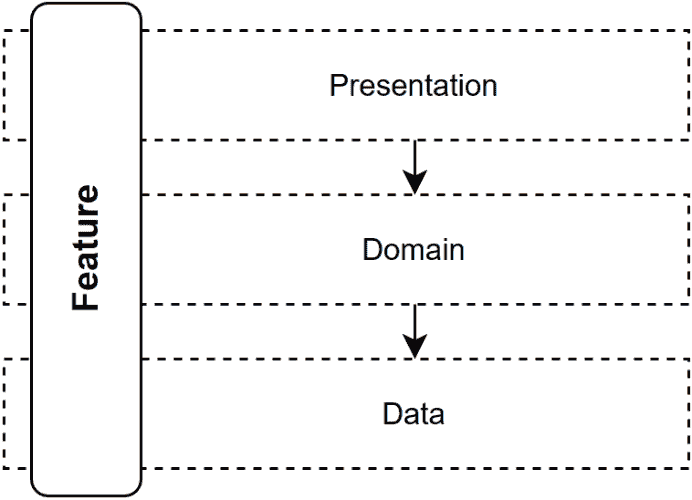
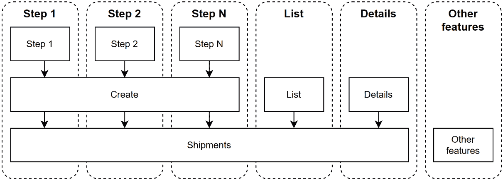
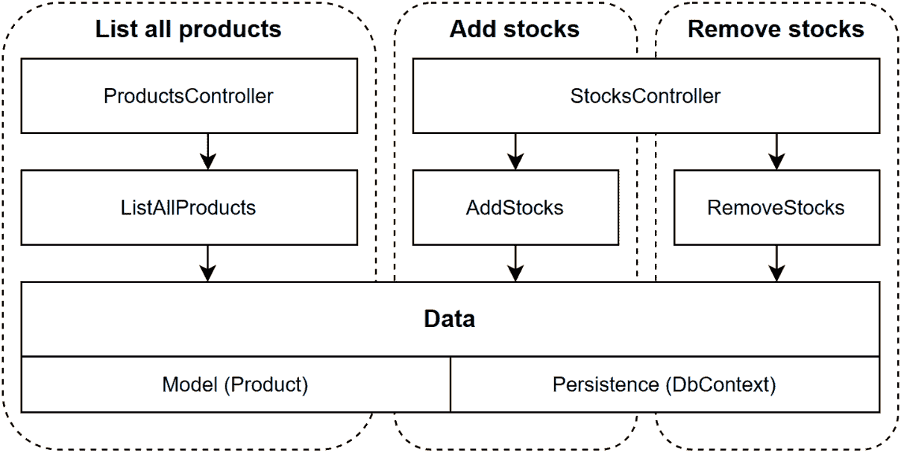
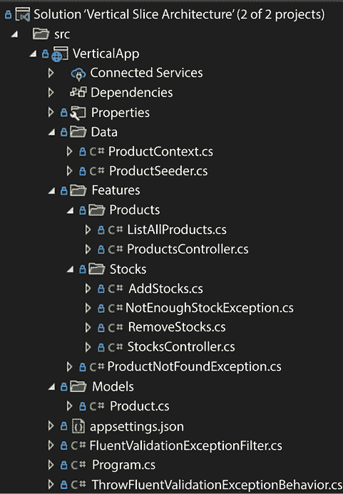
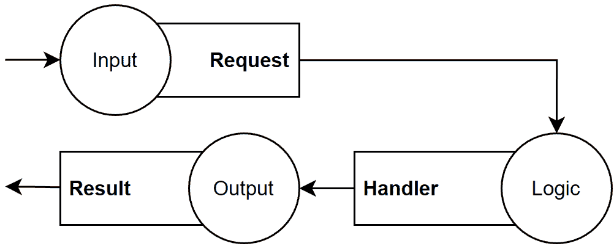
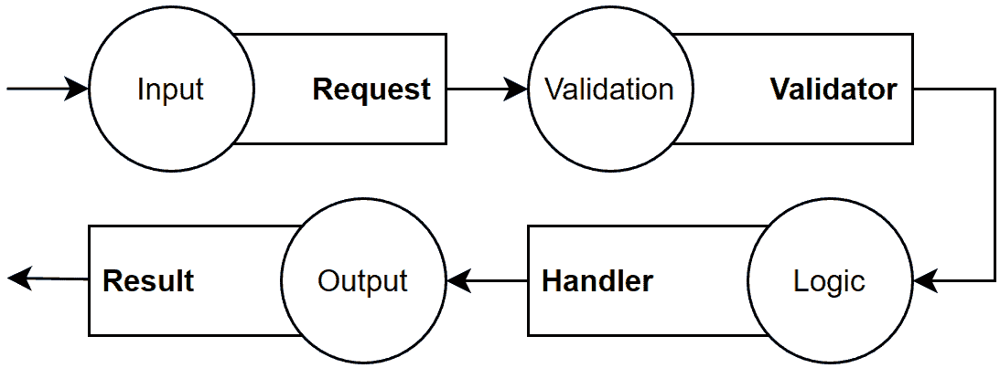
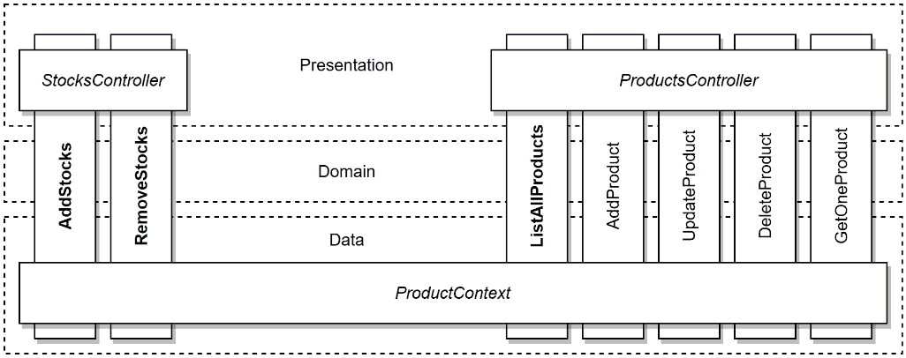
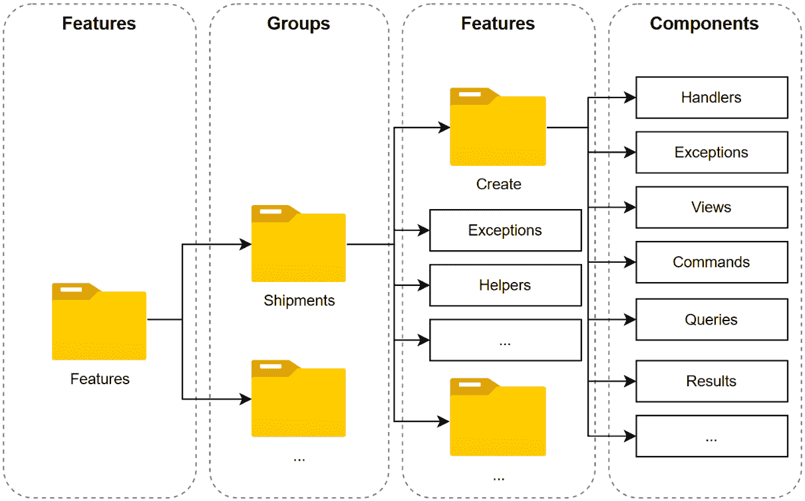

# 17 开始使用垂直切片架构

## 在开始之前：加入我们的 Discord 书籍社区

直接向作者提供反馈，并在我们的 Discord 服务器上与其他早期读者聊天（在“architecting-aspnet-core-apps-3e”频道下找到，属于早期访问订阅）。

[`packt.link/EarlyAccess`](https://packt.link/EarlyAccess)


本章介绍了垂直切片架构，这是一种有效组织我们的 ASP.NET Core 应用程序的方法。垂直切片架构将元素从多个层移动到面向功能的设计，帮助我们保持代码库的整洁、简单、统一、松散耦合和管理性。垂直切片架构将我们的架构视角转向简化的架构。历史上，我们将功能的逻辑分割到各种层，如 UI、业务逻辑和数据访问。然而，我们通过垂直切片架构创建了功能独立的切片。想象你的应用程序就像一个蛋糕；我们不是水平切割（层），而是垂直切割（功能），每个切片都能独立运行。这种风格改变了我们设计和组织项目、测试策略和编码方法的方式。我们不必担心臃肿的控制器或过于复杂的“上帝对象”；相反，由于功能之间的松散耦合，更改变得更加容易管理。本章将指导你将垂直切片架构应用到你的 ASP.NET Core 应用程序中，详细说明如何使用 CQS、MVC、MediatR、AutoMapper 和 FluentValidation 来处理命令、查询、验证和实体映射，这些我们在前面的章节中已经探讨过。

> 我们不必使用那些工具来应用架构风格，可以用其他库替换它们，甚至可以自己编写整个堆栈。

到本章结束时，你将了解垂直切片架构及其优势，并应该有信心将这种风格应用到你的下一个项目中。在本章中，我们将涵盖以下主题：

+   反模式 - 大泥球

+   垂直切片架构

+   继续你的旅程：一些技巧和窍门

让我们一步步地穿越垂直切片，一次一个切片地拼凑架构。

## 反模式 - 大泥球

让我们从一种反模式开始。**大泥球**反模式描述的是一个设计失败或从未得到适当设计的系统。有时一个系统开始得很好，但由于压力、易变的需求、不可能的截止日期、不良实践或其他原因，会演变成一个大泥球。我们通常将大泥球称为**意大利面代码**，意思相同。这种反模式意味着一个非常难以维护的代码库，编写糟糕且难以阅读的代码，大量不希望出现的紧密耦合，低内聚性，或者更糟：所有这些都在同一个代码库中。应用本书中涵盖的技术应该能帮助你避免这种反模式。目标是小型、设计良好的组件，这些组件是可测试的。通过自动化测试强制执行。 whenever you can, iteratively (continuous improvement). 应用 SOLID 原则。在开始之前定义你的应用程序模式。考虑实现每个组件和功能的最佳方式；进行研究，并在不确定最佳方法时进行一个或多个概念验证或实验。确保你理解你正在构建的程序的业务需求（这可能是最好的建议）。这些提示应该能帮助你避免创建一个大泥球。构建面向功能的程序是避免创建大泥球的最佳方法之一。让我们开始吧！

## 垂直切片架构

与将应用程序水平分割（层）不同，垂直切片将所有水平关注点组合在一起，以封装一个功能。以下是一个说明这一点的图示：



图 17.1：表示垂直切片跨越所有层的图

Jimmy Bogard，这种架构的先驱，写了以下内容：

> *[目标是]最小化切片之间的耦合，最大化切片内的耦合。*

这是什么意思？让我们将这句话分成两个不同的点：

+   “最小化切片之间的耦合” (提高可维护性，松耦合)

+   “最大化切片内的耦合” (内聚性)

我们可以将前者视为一个垂直切片不应该依赖于另一个，因此当你修改一个垂直切片时，你不必担心对其他切片的影响，因为耦合是最小的。我们可以将后者视为：而不是在多个层中分散代码，沿途可能存在多余的抽象，让我们重新组合并简化那段代码。这有助于保持垂直切片内部的紧密耦合，以创建一个具有单一目的的代码单元：从头到尾处理功能。然后我们可以将其包装起来，围绕我们试图解决的商业问题构建软件，而不是开发者的关注点（例如数据访问）。现在，从更通用的角度来看，什么是切片？我认为切片是复合层次结构。例如，一个运输经理程序有一个多步骤的创建工作流程、一个列表和一个详情页面。创建流程的每一步都会是一个负责处理其相应逻辑的切片。当组合在一起时，它们构成了“创建切片”，负责创建一个运输（一个更大的切片）。列表和详情页面是另外两个切片。然后，所有这些切片又构成了另一个更大的切片，导致类似这样的情况：



图 17.2：一个显示复杂功能（底部）的顶部部分（顶部）基于它们之间的内聚（垂直）依赖于更大的部分（中间）的从上到下的耦合结构的图

在**步骤 1**内部存在强耦合，而其他步骤之间的耦合有限；它们作为**创建**切片的一部分共享一些创建代码。**创建**、**列表**和**详情**也以有限的方式共享一些代码；它们都是**运输**切片的一部分，并访问或操作相同的实体：一个或多个运输。最后，**运输**切片与**其他功能**没有共享代码（或非常少）。

> 按照我刚才描述的模式，我们有限耦合和最大内聚。缺点是您必须持续设计和重构应用程序，这需要比分层方法更强的设计技能。此外，您必须知道如何从头到尾构建功能，限制任务在人们之间的划分，并将它们集中在每个团队成员身上；每个成员都成为全栈开发者。我们将在章节末尾的*继续您的旅程*部分重新审视这个例子。

我们将在下面探讨优点和缺点。

### 优点和缺点是什么？

让我们探讨垂直切片架构的一些优缺点。

#### 优点

优点方面，我们有以下内容：

+   我们减少了功能之间的耦合，这使得在这样一个项目上工作更容易管理。我们只需要考虑一个垂直切片，而不是*N*层，通过将代码集中在共享关注点上，提高了**可维护性**。

+   我们可以选择每个垂直切片如何与它们所需的资源交互，而无需考虑其他切片。这增加了**灵活性**，因为一个切片可以使用 T-SQL，而另一个可以使用 EF Core，例如。

+   我们可以从小处着手，用几行代码开始（在马丁·福勒的《企业应用架构模式》中描述为**事务脚本**），无需奢华的设计或过度工程。当需要时，我们可以通过重构来改进设计，当模式出现时，这将导致**更快的上市时间**。

+   每个垂直切片应包含恰好正确数量的代码，以实现正确性——不多也不少。这导致代码库更加**健壮**（代码少意味着额外的代码更少，维护的代码也更少）。

+   由于每个功能几乎都是独立的，因此新来者更容易在现有系统中找到自己的位置，这导致**更快的上手时间**。

+   在前面的章节中学习的所有模式和技巧仍然适用。

> 根据我的经验，功能往往开始时规模较小，随着时间的推移而增长。用户通常在使用软件时发现他们需要什么，随着时间的推移改变需求，这导致软件的变化。事后，我希望我参与过的许多项目都是使用垂直切片架构而不是分层来构建的。

#### 缺点

当然，没有什么是完美的，所以这里有一些缺点：

+   如果你习惯了分层，那么理解垂直切片架构可能需要时间，这将导致一个适应期来学习一种新的思考软件的方式。

+   这是一种“较新的”架构类型，人们不喜欢改变。

> 另一件事是我通过艰难的方式学到的，那就是接受变化。我认为我没有看到过一个项目是以它应有的方式结束的。当使用软件时，每个人都识别出业务流程中缺失的部分。这导致以下建议：尽可能快地发布软件，并尽快让客户使用软件。由于垂直切片架构可以为客户创造价值，而不是更多或更少的抽象和层，因此这些建议可能更容易实现。让客户尝试分阶段软件是非常困难的；没有客户有时间做这样的事情；他们正忙于经营自己的业务。然而，发布生产就绪的切片可能会导致更快的采用和反馈。
> 
> > 在我的职业生涯初期，每当规格发生变化时，我都会感到沮丧，并认为更好的规划本可以解决这个问题。有时更好的规划确实有所帮助，但有时，客户并不知道如何表达他们的业务流程或需求，只能通过试用应用程序来弄清楚。我的建议是，当规格发生变化时，不要感到沮丧，即使这意味着重写最初花费你数天或更多时间编写的软件部分；这种情况会经常发生。学会接受这一点，并找到使这个过程更容易、更快捷的方法。如果你与客户有联系，找到帮助他们弄清楚需求并减少变更数量的方法。

#### 优点还是缺点？

以下是一些我们可以将其转化为优点的缺点：

+   假设你习惯于在孤岛（如数据库管理员处理数据）中工作。在这种情况下，分配涉及整个功能的任务可能会更具挑战性，但这也可能成为优势，因为你的团队中的每个人都更紧密地合作，从而带来更多的学习和协作，甚至可能形成一个新的跨职能团队——这是非常好的。在团队中有数据专家是很好的；没有人是所有领域的专家。

+   重构：强大的重构技能会大有裨益。随着时间的推移，大多数系统都需要进行一些重构，对于垂直切片架构来说更是如此。这可能是由于需求的变化或技术债务造成的。无论原因如何，如果你不这样做，你可能会最终得到一个**一团糟的大泥球**。首先，编写隔离的代码，然后重构到模式中是垂直切片架构的关键部分。这是在切片内部保持高度内聚并尽可能降低切片之间耦合的最佳方式之一。这个技巧适用于所有类型的架构，并且有了强大的测试套件来自动验证你的更改，这会更容易实现。

> 开始重构业务逻辑的一种方法是将逻辑推入**领域模型**，创建一个**丰富的领域模型**。你还可以使用其他设计模式和技巧来微调代码，使其更易于维护，例如创建服务或层。一个层不需要跨越所有垂直切片；它只需要跨越其中的一部分。
> 
> > 与其他应用级模式（如分层）相比，垂直切片架构的规则更少，这意味着有更多的选择（垂直切片架构）。*你可以在垂直切片内部使用所有设计模式、原则和最佳实践，而无需将这些选择应用到整个应用程序中。*

你如何将项目组织成垂直切片架构？遗憾的是，对此没有明确的答案，这取决于在项目上工作的工程师。我们将在下一个项目中探讨一种方法，但你可以根据自己的需要组织项目。然后我们将更深入地探讨重构和组织。

### 项目 – 垂直切片架构

**上下文**：我们对分层感到厌倦，并被要求使用垂直切片架构重建我们的小型演示商店。以下是更新后的图示，展示了我们概念上如何组织项目：



图 17.3：表示演示商店项目组织的图示

每个垂直框是一个用例（或切片），而每个水平框是一个横切关注点或共享组件。这是一个小型项目，所以我们共享数据访问代码（`DbContext`）和`Product`模型在三个用例之间。这种共享与垂直切片架构无关，但在像这样的小型项目中进一步分割它是困难和没有意义的。在这个项目中，我决定使用 Web API 控制器而不是最小 API，以及使用贫血模型而不是富模型。我们可以使用最小 API、富模型或任何组合。我选择这样做，以便您能一瞥使用控制器的情况，因为您很可能最终会使用它。我们将在下一章回到最小 API。以下是参与者：

+   `ProductsController`是管理产品的 REST API。

+   `StocksController`是管理库存的 REST API。

+   `AddStocks`、`RemoveStocks`和`ListAllProducts`是我们从第十四章“分层和清洁架构”以来在我们的项目中复制的相同用例。

+   持久性“层”由一个 EF Core `DbContext`组成，该`DbContext`将`Product`模型持久化到内存数据库中。

我们可以在我们的垂直切片之上添加其他横切关注点，例如授权、错误管理和日志记录，仅举几例。接下来，让我们看看我们是如何组织这个项目的。

#### 项目组织

这是我们的项目组织方式：

+   `Data`目录包含与 EF Core 相关的类。

+   `Features`目录包含功能。每个子文件夹包含其底层功能（垂直切片），包括控制器、异常和其他支持类，这些类是实现功能所需的。

+   每个用例都是独立的，并暴露以下类：

1.  `Command`或`Query`代表 MediatR 请求。

1.  `Result`是请求的返回值。

1.  `MapperProfile`指导 AutoMapper 如何映射与用例相关的对象（如果有）。

1.  `Validator`包含验证规则，用于验证`Command`或`Query`对象（如果有）。

1.  `Handler`包含用例逻辑：如何处理请求。

+   `Models`目录包含领域模型。



图 17.4：文件组织的解决方案资源管理器视图

在这个项目中，我们支持使用**FluentValidation**进行请求验证，这是一个第三方 NuGet 包。我们也可以使用`System.ComponentModel.DataAnnotations`或任何我们想要的其它验证库。

> 使用 FluentValidation，我发现将验证保留在我们的垂直切片中但不在我们想要验证的类之外很容易。开箱即用的.NET 验证框架`DataAnnotations`则相反，它强迫我们将验证作为实体的元数据包含在内。两者都有优缺点，但 FluentValidation 更容易测试和扩展。

以下代码是`Program.cs`文件。高亮显示的行表示注册 FluentValidation 并扫描程序集以查找验证器：

```cs
var currentAssembly = typeof(Program).Assembly;
var builder = WebApplication.CreateBuilder(args);
builder.Services
    // Plumbing/Dependencies
    .AddAutoMapper(currentAssembly)
    .AddMediatR(o => o.RegisterServicesFromAssembly(currentAssembly))
    .AddSingleton(typeof(IPipelineBehavior<,>), typeof(ThrowFluentValidationExceptionBehavior<,>))
    // Data
    .AddDbContext<ProductContext>(options => options
        .UseInMemoryDatabase("ProductContextMemoryDB")
        .ConfigureWarnings(builder => builder.Ignore(InMemoryEventId.TransactionIgnoredWarning))
    )
    // Web/MVC
    .AddFluentValidationAutoValidation()
    .AddValidatorsFromAssembly(currentAssembly)
    .AddControllers()
;
var app = builder.Build();
app.MapControllers();
using (var seedScope = app.Services.CreateScope())
{
    var db = seedScope.ServiceProvider.GetRequiredService<ProductContext>();
    await ProductSeeder.SeedAsync(db);
}
app.Run();
```

上一段代码添加了我们在之前章节中探索的绑定，FluentValidation 以及运行应用程序所需的其他组件。高亮显示的行注册了 FluentValidation 并扫描`currentAssembly`以查找验证器类。验证器本身是每个垂直切片的一部分。现在我们已经了解了项目的组织结构，让我们看看功能。

#### 探索删除库存功能

在本小节中，我们使用与之前示例相同的逻辑来探索`RemoveStocks`功能，但组织方式不同（即架构风格之间的差异）。由于我们使用贫血产品模型，我们将添加和删除库存的逻辑从`Product`类移动到了`Handler`类。接下来，让我们看看代码。我将沿途描述每个嵌套类。示例从包含功能嵌套类的`RemoveStocks`类开始。这有助于组织功能，并使我们避免了一些关于命名冲突的烦恼。

> 我们可以使用命名空间，但像 Visual Studio 这样的工具建议添加一个`using`语句并删除内联命名空间。如今，它通常会在粘贴代码时自动添加`using`语句，这在许多情况下很棒，但在这个特定情况下不方便。因此，使用嵌套类解决了这个问题。

这里是`RemoveStocks`类的骨架：

```cs
using AutoMapper;
using FluentValidation;
using MediatR;
using VerticalApp.Data;
using VerticalApp.Models;
namespace VerticalApp.Features.Stocks;
public class RemoveStocks
{
    public class Command : IRequest<Result> {/*...*/}
    public class Result {/*...*/}
    public class MapperProfile : Profile {/*...*/}
    public class Validator : AbstractValidator<Command> {/*...*/}
    public class Handler : IRequestHandler<Command, Result> {/*...*/}
}
```

上一段代码展示了`RemoveStocks`类包含其特定用例所需的所有元素：

+   `Command`是输入 DTO。

+   `Result`是输出 DTO。

+   `MapperProfile`是 AutoMapper 配置文件，它将特定于功能的类映射到非特定于功能的类，反之亦然。

+   `Validator`在实例到达`Handler`类（`Command`类）之前验证输入。

+   `Handler`封装了用例逻辑。

接下来，我们探索这些嵌套类，从`Command`类开始，它是用例的**输入**（请求）：

```cs
public class Command : IRequest<Result>
{
    public int ProductId { get; set; }
    public int Amount { get; set; }
}
```

上一条请求包含了从库存中删除库存并完成操作所需的所有内容。`IRequest<TResult>`接口告诉 MediatR，`Command`类是一个请求，应该被路由到其处理程序。`Result`类是处理程序的返回值，代表用例的**输出**：

```cs
public record class Result(int QuantityInStock);
```

映射配置文件是可选的，允许封装与用例相关的 AutoMapper *映射*。以下`MapperProfile`类注册了从`Product`实例到`Result`实例的映射：

```cs
public class MapperProfile : Profile
{
    public MapperProfile()
    {
        CreateMap<Product, Result>();
    }
}
```

`validator` 类也是可选的，允许在输入（`Command`）到达处理器之前对其进行验证；在这种情况下，它确保 `Amount` 值大于零：

```cs
public class Validator : AbstractValidator<Command>
{
    public Validator()
    {
        RuleFor(x => x.Amount).GreaterThan(0);
    }
}
```

最后，最重要的部分是 `Handler` 类，它实现了用例逻辑：

```cs
public class Handler : IRequestHandler<Command, Result>
{
    private readonly ProductContext _db;
    private readonly IMapper _mapper;
    public Handler(ProductContext db, IMapper mapper)
    {
        _db = db ?? throw new ArgumentNullException(nameof(db));
        _mapper = mapper ?? throw new ArgumentNullException(nameof(mapper));
    }
    public async Task<Result> Handle(Command request, CancellationToken cancellationToken)
    {
        var product = await _db.Products.FindAsync(new object[] { request.ProductId }, cancellationToken);
        if (product == null)
        {
            throw new ProductNotFoundException(request.ProductId);
        }
        if (request.Amount > product.QuantityInStock)
        {
            throw new NotEnoughStockException(product.QuantityInStock, request.Amount);
        }
        product.QuantityInStock -= request.Amount;
        await _db.SaveChangesAsync(cancellationToken);
        return _mapper.Map<Result>(product);
    }
}
```

`Handler` 类实现了 `IRequestHandler<Command, Result>` 接口，它将 `Command`、`Handler` 和 `Result` 类连接起来。`Handle` 方法实现了从 *第十四章*、*分层* 和 *清洁架构* 以来相同逻辑的先前实现。现在我们有一个完全功能性的用例，让我们看看将 HTTP 请求转换为 MediatR 管道以执行我们的用例的 `StocksController` 类的骨架：

```cs
using MediatR;
using Microsoft.AspNetCore.Mvc;
namespace VerticalApp.Features.Stocks;
[ApiController]
[Route("products/{productId}/")]
public class StocksController : ControllerBase
{
    private readonly IMediator _mediator;
    public StocksController(IMediator mediator)
    {
        _mediator = mediator ?? throw new ArgumentNullException(nameof(mediator));
    }
    [HttpPost("add-stocks")]
    public async Task<ActionResult<AddStocks.Result>> AddAsync(
        int productId,
        [FromBody] AddStocks.Command command
    ) {/*...*/}
    [HttpPost("remove-stocks")]
    public async Task<ActionResult<RemoveStocks.Result>> RemoveAsync(
        int productId,
        [FromBody] RemoveStocks.Command command
    ) {/*...*/}
}
```

在控制器中，我们在构造函数中注入了一个 `IMediator`。我们使用构造函数注入是因为这个控制器的所有操作都使用了 `IMediator` 接口。我们有两个操作，添加和删除股票。以下代码表示删除股票操作方法：

```cs
[HttpPost("remove-stocks")]
public async Task<ActionResult<RemoveStocks.Result>> RemoveAsync(
    int productId,
    [FromBody] RemoveStocks.Command command
)
{
    try
    {
        command.ProductId = productId;
        var result = await _mediator.Send(command);
        return Ok(result);
    }
    catch (NotEnoughStockException ex)
    {
        return Conflict(new
        {
            ex.Message,
            ex.AmountToRemove,
            ex.QuantityInStock
        });
    }
    catch (ProductNotFoundException ex)
    {
        return NotFound(new
        {
            ex.Message,
            productId,
        });
    }
}
```

在前面的代码中，我们从体中读取了 `RemoveStocks.Command` 实例的内容，操作将 `ProductId` 属性设置为路由值，并将 `command` 对象发送到 MediatR 管道。从那里，MediatR 将请求路由到其处理器，在返回该操作的结果并带有 HTTP `200 OK` 状态码之前。与前述代码和之前的实现相比的一个区别是我们将 DTOs 移到了垂直切片本身。每个垂直切片定义了其功能的输入、逻辑和输出，如下所示：



图 17.5：表示垂直切片三个主要部分的图

当我们添加输入验证时，我们有以下内容：



图 17.6：表示垂直切片三个主要部分，并添加了验证的图

控制器是 HTTP 和我们的领域之间的一个微薄层，引导 HTTP 请求到 MediatR 管道，并将响应返回到 HTTP。这个微薄的部分代表了 API 的表示，并允许访问领域逻辑；功能。当控制器增长时，这通常是一个迹象，表明功能逻辑的一部分在错误的位置，很可能是导致代码更难测试，因为 HTTP 和其他逻辑变得交织在一起。

> 我们仍然在控制器代码中保留了 `productId` 的额外行和 `try/catch` 块，但我们可以使用自定义模型绑定器和异常过滤器来消除这些。我在本章末尾留下了额外的资源，我们将在下一章深入探讨这一点。

在此基础上，现在向项目中添加新功能变得简单直接。从视觉上看，我们最终得到以下垂直切片（粗体），可能的垂直扩展（正常），以及共享类（斜体）：



图 17.7：表示项目和与产品管理相关的可能扩展的图表

图表显示了两个主要区域，产品，和库存的分组。在产品方面，我包含了一个扩展，描述了一个类似 CRUD 的功能组。在我们的小型应用程序中，很难将数据访问部分分成多个`DbContext`，因此所有切片都使用`ProductContext`，创建了一个共享的数据访问层。

> 在其他情况下，当可能时，创建多个`DbContext`。这与垂直切片架构无关，但将域划分为更小的边界上下文是一个好的实践。

当功能具有凝聚性并适合于域的同一部分时，考虑将它们分组。接下来，让我们测试我们的应用程序。

#### 测试

对于这个项目，我为每个用例结果编写了一个集成测试，这降低了所需的单元测试数量，同时提高了对系统的信心。为什么？因为我们正在测试功能本身，而不是独立地测试许多抽象的部分。这是灰盒测试。我们也可以添加我们需要的任何数量的单元测试。这种方法帮助我们编写更少但更好的面向功能的测试，减少了需要大量模拟的单元测试的需求。单元测试可以比集成测试更快地验证复杂用例和算法。让我们首先看看`StocksTest`类的骨架：

```cs
namespace VerticalApp.Features.Stocks;
public class StocksTest
{
    private static async Task SeederDelegate(ProductContext db)
    {
        db.Products.RemoveRange(db.Products.ToArray());
        await db.Products.AddAsync(new Product(
            id: 4,
            name: "Ghost Pepper",
            quantityInStock: 10
        ));
        await db.Products.AddAsync(new Product(
            id: 5,
            name: "Carolina Reaper",
            quantityInStock: 10
        ));
        await db.SaveChangesAsync();
    }
    public class AddStocksTest : StocksTest
    {
         // omitted test methods
    }
    public class RemoveStocksTest : StocksTest
    {
         // omitted test methods
    }
    public class StocksControllerTest : StocksTest
    {
         // omitted test methods
    }
}
```

`SeedAsync`方法从内存测试数据库中删除所有产品并插入两个新的，以便测试方法可以使用可预测的数据集运行。`AddStocksTest`和`RemoveStocksTest`类包含它们各自用例的测试方法。`StocksControllerTest`测试 MVC 部分。让我们探索`AddStocksTest`类的快乐路径：

```cs
[Fact]
public async Task Should_increment_QuantityInStock_by_the_specified_amount()
{
    // Arrange
    await using var application = new VerticalAppApplication();
    await application.SeedAsync(SeederDelegate);
    using var requestScope = application.Services.CreateScope();
    var mediator = requestScope.ServiceProvider
        .GetRequiredService<IMediator>();
    // Act
    var result = await mediator.Send(new AddStocks.Command
    {
        ProductId = 4,
        Amount = 10
    });
    // Assert
    using var assertScope = application.Services.CreateScope();
    var db = assertScope.ServiceProvider
        .GetRequiredService<ProductContext>();
    var peppers = await db.Products.FindAsync(4);
    Assert.NotNull(peppers);
    Assert.Equal(20, peppers!.QuantityInStock);
}
```

在前一个测试用例的*安排*部分，我们创建了一个应用程序实例，创建了一个作用域来模拟 HTTP 请求，访问 EF Core `DbContext`，然后获取一个`IMediator`实例来执行操作。在*行为*块中，我们通过 MediatR 管道发送一个有效的`AddStocks.Command`。在*断言*块中，我们创建一个新的作用域，并从容器中获取`ProductContext`。使用这个`DbContext`，我们找到产品，确保它不为空，并验证库存数量是否符合预期。使用新的`ProductContext`确保我们不会处理任何来自先前操作的缓存项，并且事务已按预期保存。通过这个测试用例，我们知道如果向中介者发出有效命令，该处理程序将被执行，并且成功地将库存属性增加指定数量。

> `VerticalAppApplication`类继承自`WebApplicationFactory<TEntryPoint>`，创建了一个新的`DbContextOptionsBuilder<ProductContext>`实例，该实例具有可配置的数据库名称，实现了一个`SeedAsync`方法，允许对数据库进行初始化，并允许修改应用程序服务。出于简洁的考虑，我省略了代码，但您可以在 GitHub 仓库中查看完整的源代码（[`adpg.link/mWep`](https://adpg.link/mWep))。

现在，我们可以测试 MVC 部分以确保控制器配置正确。在`StocksControllerTest`类中，`AddAsync`类包含以下测试方法：

```cs
public class AddAsync : StocksControllerTest
{
    [Fact]
    public async Task Should_send_a_valid_AddStocks_Command_to_the_mediator()
    {
        // Arrange
        var mediatorMock = new Mock<IMediator>();
        AddStocks.Command? addStocksCommand = default;
        mediatorMock
            .Setup(x => x.Send(It.IsAny<AddStocks.Command>(), It.IsAny<CancellationToken>()))
            .Callback((IRequest<AddStocks.Result> request, CancellationToken cancellationToken) => addStocksCommand = request as AddStocks.Command)
        ;
        await using var application = new VerticalAppApplication(
            afterConfigureServices: services => services
                .AddSingleton(mediatorMock.Object)
        );
        var client = application.CreateClient();
        var httpContent = JsonContent.Create(
            new { amount = 1 },
            options: new JsonSerializerOptions(JsonSerializerDefaults.Web)
        );
        // Act
        var response = await client.PostAsync("/products/5/add-stocks", httpContent);
        // Assert
        Assert.NotNull(response);
        Assert.NotNull(addStocksCommand);
        response.EnsureSuccessStatusCode();
        mediatorMock.Verify(
            x => x.Send(It.IsAny<AddStocks.Command>(), It.IsAny<CancellationToken>()),
            Times.Once()
        );
        Assert.Equal(5, addStocksCommand!.ProductId);
        Assert.Equal(1, addStocksCommand!.Amount);
    }
}
```

前一个测试用例中高亮的`Arrange`块模拟了`IMediator`，并将传递给`addStocksCommand`变量的内容保存。我们在`Assert`块的高亮代码中使用这个值。在创建`VerticalAppApplication`实例时，我们将模拟注册到容器中，以使用它而不是 MediatR 的一个，从而绕过了默认行为。然后我们创建了一个连接到我们进程内应用程序的`HttpClient`，并在`Act`部分构建了一个有效的 HTTP 请求来添加我们 POST 的股票。`Assert`块代码确保请求成功，验证模拟方法被调用了一次，并确保`AddStocks.Command`配置正确。从第一个测试中，我们知道 MediatR 部分是正常工作的。有了这个第二个测试，我们知道 HTTP 部分也是正常工作的。现在我们几乎可以确定，有效的添加股票请求将通过这两个测试击中数据库。

> 我说“几乎确定”，是因为我们的测试是在内存数据库上运行的，这与真实的数据库引擎（例如，它没有关系完整性等）不同。在涉及多个表或确保功能正确性的更复杂的数据库操作中，您可以对接近生产数据库的数据库运行测试。例如，我们可以运行测试以针对 SQL Server 容器，以便在我们的 CI/CD 管道中轻松地启动和销毁数据库。

在测试项目中，我添加了更多测试，涵盖了删除股票和列出所有产品功能，并确保 AutoMapper 配置正确。请随意浏览代码。我这里省略了它们，因为它们变得冗余。目标是探索使用非常少的测试（在这种情况下是两个用于快乐路径的测试）来测试功能几乎端到端，我认为我们已经做到了这一点。

### 结论

垂直切片项目展示了我们如何在保持对象松散耦合的同时移除抽象。我们还把项目组织成了功能（垂直），而不是层（水平）。我们利用了 CQS、中介者和 MVC 模式。从概念上讲，层仍然存在；例如，控制器是表示层的一部分，但它们不是那样组织的，这使得它们成为功能的一部分。唯一跨越所有功能的依赖是`ProductContext`类，这是有意义的，因为我们的模型只包含一个类（`Product`）。例如，我们可以添加一个利用最小 API 而不是控制器的新功能，这是可以接受的，因为每个切片都是独立的。我们可以通过用集成测试测试每个垂直切片来显著减少所需的模拟数量。这也可以显著减少单元测试的数量，测试功能而不是模拟的代码单元。我们应该专注于产生功能和商业价值，而不是查询基础设施或代码背后的细节。我们也不应该忽视技术方面；性能和可维护性也是重要特征，但减少抽象的数量也可以使应用程序更容易维护，当然更容易理解。总的来说，我们探索了一种与现代设计方法相一致的应用程序设计方式，这有助于与敏捷开发保持一致并为客户创造价值。在进入总结之前，让我们看看垂直切片架构如何帮助我们遵循**SOLID**原则：

+   **S**: 每个垂直切片（功能）成为一个整体变化的统一单元，导致每个功能的责任分离。基于受 CQS 启发的方案，每个功能将应用程序的复杂性分解为命令和查询，导致多个小块。每个小块处理过程的一部分。例如，我们可以定义一个输入、一个验证器、一个映射配置文件、一个处理器、一个结果、一个 HTTP 桥接器（控制器或端点），以及我们需要的任何更多部分来构建切片。

+   **O**: 我们可以通过扩展 ASP.NET Core、MVC 或 MediatR 管道来全局增强系统。我们可以根据需要设计功能，包括尊重 OCP。

+   **L**: N/A

+   **I**: 通过按领域中心用例的单元组织功能，我们创建了众多针对特定客户端的组件，而不是像层这样的通用元素。

+   **D**: 切片部分依赖于接口，并通过依赖注入相互连接。此外，通过从系统中移除不太有用的抽象，我们简化了它，使其更易于维护和简洁。许多功能部分紧密相邻使得系统更容易维护并提高了其可发现性。

接下来，我们将探讨一些技巧和流程，以开始处理更大的应用程序。这些是我发现对我有效的方法，也许对您也有效。取您认为有效的东西，其余的则留给别人；我们都是不同的，工作方式也不同。

## 继续您的旅程：一些技巧和窍门

之前的项目很小。它有一个共享模型，作为数据层，因为它由一个类组成。在构建现实世界的应用程序时，您有不止一个类，所以我会给您一个良好的起点来处理更大的应用程序。想法是尽可能创建小的切片，尽可能限制与其他切片的交互，并将该代码重构为更好的代码。我们不能消除耦合，所以我们需要组织它，关键是将其耦合集中在一个功能内部。以下是一个受 TDD 启发的流程，但不太严格：

1.  编写覆盖您功能（输入和输出）的合约。

1.  使用这些合约编写一个或多个覆盖您功能的集成测试；以`Query`或`Command`类（`IRequest`）作为输入，以`Result`类作为输出。

1.  实现`Handler`、`Validator`、`MapperProfile`以及任何需要编码的其他部分。在此阶段，代码可能是一个巨大的`Handler`；这并不重要。

1.  一旦您的集成测试通过，根据需要拆分您的巨大`Handle`方法来重构代码。

1.  确保您的测试仍然通过。

在 *步骤 2* 中，您还可以使用单元测试来测试验证规则。通过单元测试测试多个组合和场景要容易和快得多，而且您不需要为此访问数据库。同样，这也适用于您的系统中与外部资源无关的任何其他部分。在 *步骤 4* 中，您可能会在功能之间发现重复的逻辑。如果是这样，那么是时候将这部分逻辑封装到其他地方，一个共享的位置。这可能是在模型中创建一个方法、一个服务类，或者任何其他您知道可以解决您逻辑重复问题的模式和技巧。从隔离的功能中提取共享逻辑将帮助您设计应用程序。您希望将共享逻辑推到处理器外部，而不是相反（当然，一旦您有了共享逻辑，您可以根据需要使用它）。在这里，我想强调 *共享逻辑*，这意味着业务规则。当业务规则发生变化时，所有使用该业务规则的消费者也必须改变他们的行为。避免共享 *相似代码*，但共享业务规则。记住 DRY 原则。在设计软件时，非常重要的一点是关注功能需求，而不是技术需求。您的客户和用户不关心技术细节；他们想要结果、新功能、错误修复和改进。同时，要警惕技术债务，不要跳过重构步骤，否则您的项目可能会遇到麻烦。这些建议适用于所有类型的架构。另一个建议是尽可能保持所有构成垂直切片的代码的紧密性。您不需要将所有用例类都放在一个文件中，但我发现这样做有帮助。部分类是一种将类拆分为多个文件的方法。如果命名正确，Visual Studio 将将其嵌套在主文件下。例如，Visual Studio 将将 `MyFeature.Hander.cs` 文件嵌套在 `MyFeature.cs` 文件下，依此类推。您还可以创建一个文件夹层次结构，其中较深级别共享上一级别的文件。例如，我在一个 MVC 应用程序中实现的一个与运输相关的流程创建过程有多个步骤。因此，我最终得到了一个如下所示的层次结构：



图 17.12：目录和元素的组织层次结构

初始时，我单独编写了所有处理程序。然后我看到了模式的出现，所以我将共享逻辑封装到共享类中。然后我重用了某些高级异常，所以我将它们从`Features/Shipments/Create`文件夹移动到`Features/Shipments`文件夹。我还提取了一个服务类来管理多个用例之间的共享逻辑。最终，我只有我需要的代码，没有重复的逻辑，协作者（类、接口）尽可能接近。功能之间的耦合最小，而系统的某些部分协同工作（内聚）。此外，与其他系统部分的耦合非常小。如果我们将这个结果与另一种类型的架构，如分层架构进行比较，我可能需要更多的抽象，例如存储库、服务和之类的东西；垂直切片架构的结果更干净、更简单。关键点在于独立编写处理程序，尽可能好地组织它们，留心共享逻辑和出现的模式，提取并封装该逻辑，并尝试限制用例和切片之间的交互。

## 摘要

本章概述了垂直切片架构，该架构通过将层旋转 90°来实现。垂直切片架构是关于通过依赖开发者的技能和判断，从方程中去除多余的抽象和规则，以编写最小代码来生成最大价值。在垂直切片架构项目中，重构至关重要；成功或失败很可能取决于它。我们也可以在垂直切片架构中使用任何模式。它相对于分层架构有很多优点，只有少数缺点。在孤岛（水平团队）中工作的团队可能需要重新考虑转向垂直切片架构，并首先创建或旨在创建多功能团队（垂直团队）。我们用命令和查询（受 CQS 启发）替换了低价值的抽象。然后，使用中介者模式（由 MediatR 帮助）将它们路由到相应的`Handler`。这允许封装业务逻辑并将其与其调用者解耦。这些命令和查询确保每个领域逻辑的每一部分都集中在一个单一的位置。当然，如果你从对问题的强大分析开始，你很可能会领先，就像任何项目一样。没有什么能阻止你在你的切片中构建和使用健壮的领域模型。你拥有的需求越多，初始项目组织就越容易。重复一遍，你了解的所有工程实践仍然适用。下一章通过探索使用最小 API 的请求-端点-响应（REPR）模式，进一步简化了垂直切片架构的概念。

## 问题

让我们看看几个实践问题：

1.  我们可以在垂直切片中使用哪些设计模式？

1.  在使用垂直切片架构时，是否必须选择一个单一的 ORM 并坚持使用它，例如数据层？

1.  如果你长期不重构代码和不偿还技术债务，可能会发生什么？

1.  内聚性是什么意思？

1.  紧耦合是什么意思？

## 进一步阅读

这里有一些链接，可以帮助我们巩固本章所学的内容：

+   对于 UI 实现，你可以看看 Jimmy Bogard 是如何升级 ContosoUniversity 的：

1.  使用.NET Core 的 ASP.NET Core 上的 ContosoUniversity: [`adpg.link/UXnr`](https://adpg.link/UXnr)

1.  使用.NET Core 和 Razor Pages 的 ASP.NET Core 上的 ContosoUniversity: [`adpg.link/6Lbo`](https://adpg.link/6Lbo)

+   FluentValidation: [`adpg.link/xXgp`](https://adpg.link/xXgp)

+   AutoMapper: [`adpg.link/5AUZ`](https://adpg.link/5AUZ)

+   MediatR: [`adpg.link/ZQap`](https://adpg.link/ZQap)

## 答案

1.  你知道的任何可以帮助你实现特性的模式和技巧。这就是垂直切片架构的美丽之处；你受到的限制只有你自己。

1.  不，你可以在每个垂直切片内选择最适合的工具；你甚至不需要层。

1.  应用程序很可能会变成一个大泥球，维护起来非常困难，这对你的压力水平、产品质量、变更上市时间等都不利。

1.  内聚性意味着应该作为一个统一的整体一起工作的元素。

1.  紧耦合描述了不能独立改变、直接相互依赖的元素。
