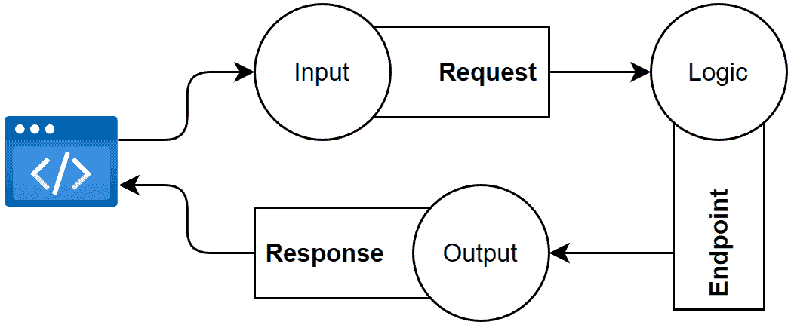
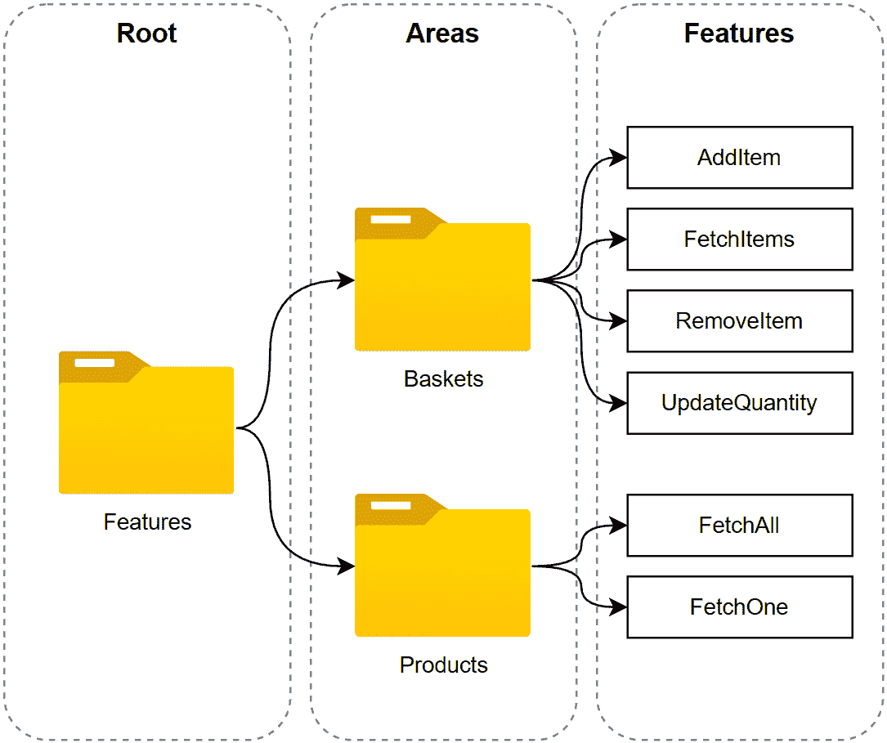
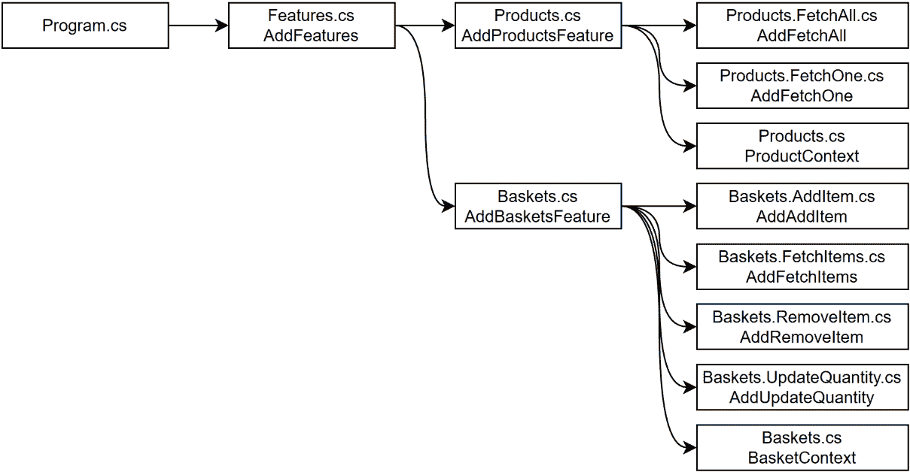
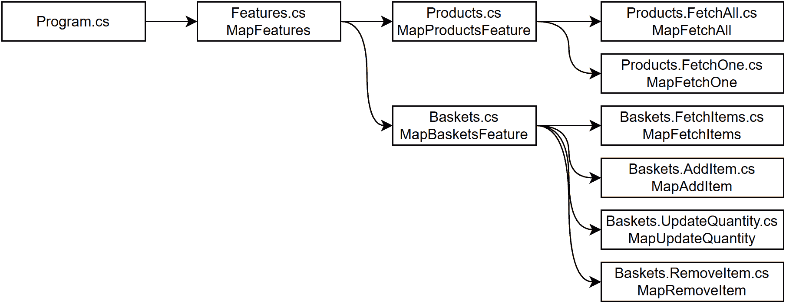
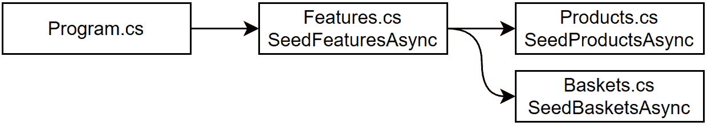
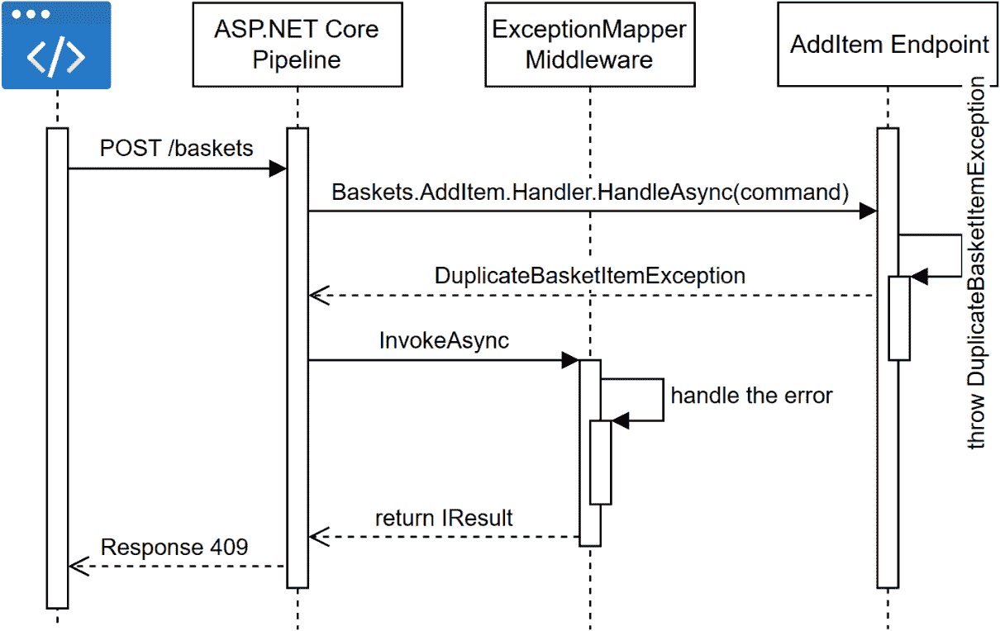

# 18 请求-端点-响应 (REPR) 和最小 API

## 在开始之前：加入我们的 Discord 书籍社区

直接向作者本人提供反馈，并在我们的 Discord 服务器上与其他早期读者聊天（在“architecting-aspnet-core-apps-3e”频道下找到，位于“EARLY ACCESS SUBSCRIPTION”下）。

[`packt.link/EarlyAccess`](https://packt.link/EarlyAccess)


本章介绍了 **请求-端点-响应 (REPR)** 模式，该模式建立在垂直切片架构和 CQS 之上。我们继续简化我们的代码库，使其更加易于阅读、维护，并且更少抽象，同时仍然可测试。

> 我们将 REPR 发音为“reaper”，这比“rer”或“reper”听起来要好得多。我必须感谢 Steve "ardalis" Smith 为这个出色的模式名称。我在 *进一步阅读* 部分留下了一个链接到他的文章。

我们已经使用了这个模式，可能你并不知道它的名字。现在是时候正式介绍它了，然后组装一个技术栈，使其适用于现实世界的应用。我们构建了这个解决方案，然后在章节中通过探索手动技术、现有工具和开源库来改进它。结果并不完美，但我们还没有完成对这个新的受电子商务启发的解决方案的改进。

> 这个方法的关键是学习如何思考架构并提高你的设计技能，这样你就有工具来克服现实世界将向你抛出的独特挑战！

在本章中，我们将探讨以下主题：

+   请求-端点-响应 (REPR) 模式

+   项目 – REPR—现实世界的一块

在深入研究更实际的示例之前，让我们先探索这个模式。

## 请求-端点-响应 (REPR) 模式

请求-端点-响应 (REPR) 模式提供了一种简单的方法，类似于我们在垂直切片架构中探索的方法，它与传统模型-视图-控制器 (MVC) 模式不同。正如我们在 MVC 章节中探讨的那样，REST API 没有视图，因此我们必须扭曲这个概念才能使其工作。由于每个 URL 都是一种描述如何到达端点（执行操作）的方式，而不是控制器，因此 REPR 在 HTTP 上下文中构建 REST API 比 MVC 更为合适。

### 目标

REPR 的目标是使我们的 REST API 与 HTTP 对齐，并将固有的请求-响应概念作为我们应用程序设计中的第一公民。在此基础上，使用最小 API 的 REPR 模式与垂直切片架构很好地对齐，并有助于构建面向功能的软件而不是层状应用。

### 设计

REPR 有三个组件：

+   一个包含端点执行工作所需信息的请求，并扮演输入 DTO 的角色。

+   一个包含要执行的业务逻辑的端点处理器，这是这个模式的核心部分。

+   一个端点返回给客户端的响应，并扮演输出 DTO 的角色。

你可以将每个请求视为我们在 CQS 和垂直切片架构章节中探索的*查询*或*命令*。以下是一个表示此概念的图表：



图 18.1：表示逻辑流程和 REPR 模式的图。

上述图表应该听起来很熟悉，因为它与我们探索的垂直切片架构相似。然而，我们使用的是请求-处理程序-结果（即 REPR），而不是请求-处理程序-结果。简而言之，一个请求可以是查询或命令，然后它击中执行逻辑的端点，最后返回一个响应。

> 即使响应体为空，服务器也会返回 HTTP 响应。

让我们通过使用 Minimal API 来探索一个示例。

### 项目 – SimpleEndpoint

SimpleEndpoint 项目展示了几个简单的功能和模式，用于组织我们的 REPR 功能，而不依赖于外部库。

#### 功能：ShuffleText

第一个功能接收一个字符串作为输入，打乱其内容，然后返回它：

```cs
namespace SimpleEndpoint;
public class ShuffleText
{
    public record class Request(string Text);
    public record class Response(string Text);
    public class Endpoint
    {
        public Response Handle(Request request)
        {
            var chars = request.Text.ToArray();
            Random.Shared.Shuffle(chars);
            return new Response(new string(chars));
        }
    }
}
```

上述代码利用`Random` API 打乱`request.Text`属性，然后返回封装在`Response`对象中的结果。在执行我们的功能之前，我们必须创建一个最小的 API 映射，并将我们的处理程序注册到容器中。以下是实现此功能的`Program.cs`类：

```cs
using SimpleEndpoint;
var builder = WebApplication.CreateBuilder(args);
builder.Services.AddSingleton<ShuffleText.Endpoint>();
var app = builder.Build();
app.MapGet(
    "/shuffle-text/{text}",
    ([AsParameters] ShuffleText.Request query, ShuffleText.Endpoint endpoint)
        => endpoint.Handle(query)
);
app.Run();
```

上述代码将`ShuffleText.Endpoint`注册为单例，这样我们就可以将其注入到委托中。委托利用`[AsParameters]`属性将路由参数绑定到`ShuffleText.Request`属性。最后，逻辑很简单；端点委托将请求发送到注入的端点处理程序，并返回结果，ASP.NET Core 将其序列化为 JSON。当我们发送以下 HTTP 请求时：

```cs
GET https://localhost:7289/shuffle-text/I%20love%20ASP.NET%20Core
```

我们得到一些类似以下内容的乱码结果：

```cs
{
  "text": "eo .e vNrCAT PSElIo"
}
```

这个模式是我们能从盒子里得到的简单模式之一。接下来，我们将端点本身封装起来。

#### 功能：RandomNumber

此功能在最小值和最大值之间生成多个随机数。第一个模式将代码在`Program.cs`文件和功能本身之间划分。在这个模式中，我们将端点委托封装到功能中（在这种情况下是同一文件）：

```cs
namespace SimpleEndpoint;
public class RandomNumber
{
    public record class Request(int Amount, int Min, int Max);
    public record class Response(IEnumerable<int> Numbers);
    public class Handler
    {
        public Response Handle(Request request)
        {
            var result = new int[request.Amount];
            for (var i = 0; i < request.Amount; i++)
            {
                result[i] = Random.Shared.Next(request.Min, request.Max);
            }
            return new Response(result);
        }
    }
    public static Response Endpoint([AsParameters] Request query, Handler handler)
        => handler.Handle(query);
}
```

上述代码与第一个功能非常相似。然而，我们命名为`Endpoint`的委托现在是功能类的一部分（突出显示的代码）。包含逻辑的类现在称为`Handler`而不是`Endpoint`。这种变化使得整个功能更紧密地聚集在一起。尽管如此，我们仍然需要将依赖项注册到容器中，并在`Program.cs`文件中将端点映射到我们的委托，如下所示：

```cs
builder.Services.AddSingleton<RandomNumber.Handler>();
// ...
app.MapGet(
    "/random-number/{Amount}/{Min}/{Max}", 
    RandomNumber.Endpoint
);
```

上述代码将请求路由到`RandomNumber.Endpoint`方法。当我们发送以下 HTTP 请求时：

```cs
https://localhost:7289/random-number/5/0/100
```

我们得到的结果类似于以下内容：

```cs
{
  "numbers": [
    60,
    27,
    78,
    63,
    87
  ]
}
```

我们将更多特性代码放在一起；然而，我们的代码仍然分为两个文件。让我们探索一种修复这个问题的方法。

#### 特性：UpperCase

此特性将输入文本转换为大写并返回结果。我们的目标是尽可能地将代码集中到 `UpperCase` 特性类中，以便我们可以从单一位置控制它。为了实现这一点，我们创建了以下扩展方法（突出显示）：

```cs
namespace SimpleEndpoint;
public static class UpperCase
{
    public record class Request(string Text);
    public record class Response(string Text);
    public class Handler
    {
        public Response Handle(Request request)
        {
            return new Response(request.Text.ToUpper());
        }
    }
    public static IServiceCollection AddUpperCase(this IServiceCollection services)
    {
        return services.AddSingleton<Handler>();
    }
    public static IEndpointRouteBuilder MapUpperCase(this IEndpointRouteBuilder endpoints)
    {
        endpoints.MapGet(
            "/upper-case/{Text}",
            ([AsParameters] Request query, Handler handler)
                => handler.Handle(query)
        );
        return endpoints;
    }
}
```

在上一段代码中，我们更改了以下内容：

+   `UpperCase` 类是静态的，这样我们可以创建扩展方法。将 `UpperCase` 类转换为静态类并不会妨碍我们的可维护性，因为我们将其用作组织者，并不实例化它。

+   我们添加了 `AddUpperCase` 方法，它将依赖项注册到容器中。

+   我们添加了 `MapUpperCase` 方法，它本身创建了端点。

在 Program.cs 文件中，我们现在可以像这样注册我们的特性：

```cs
builder.Services.AddUpperCase();
// ...
app.MapUpperCase();
```

上一段代码调用了我们的扩展方法，这些方法将所有相关代码移动到 `UpperCase` 类中，但与 ASP.NET Core 的连接除外。

> 我认为这种方法对于无依赖项项目来说既优雅又非常干净。当然，我们可以以百万种不同的方式设计它，使用现有的库来帮助我们，扫描程序集并自动注册我们的特性，等等。
> 
> > 您可以使用此模式构建实际的应用程序。我建议创建一个 `AddFeatures` 和一个 `MapFeatures` 扩展方法来注册所有特性，而不是让 `Program.cs` 文件杂乱无章，但除了少数最终的组织性触摸之外，这是一个足够健壮的模式。我们将在下一个项目中进一步探讨这一点。

当我们发送以下 HTTP 请求时：

```cs
GET https://localhost:7289/upper-case/I%20love%20ASP.NET%20Core
```

我们收到了以下响应：

```cs
{
  "text": "I LOVE ASP.NET CORE"
}
```

现在我们已经探讨了 REPR 以及如何以几种不同的方式封装我们的 REPR 特性，我们几乎准备好探索一个更大的项目了。

### 结论

使用最小 API、REPR 模式以及无外部依赖项创建基于特性的设计是可能的且简单的。我们以不同的方式组织了我们的项目。每个特性包括一个请求、一个响应和一个附加到端点的处理器。

> 我们可以将处理器和端点结合起来，使其成为一个三组件模式。我喜欢有一个独立处理器的优点，因为我们可以在非 HTTP 上下文中重用处理器；比如说，我们可以在应用程序前面创建一个 CLI 工具并重用相同的逻辑。这完全取决于我们正在构建的内容。

让我们看看 REPR 模式如何帮助我们遵循 **SOLID** 原则：

+   **S**：每个部分都有一个单一的责任，并且所有部分都集中在一个特性下，便于导航，使此模式成为完美的 SRP 协作者。

+   **O**：使用与我们对 `UpperCase` 特性所采取的类似方法，我们可以更改特性的行为，而不会影响代码库的其余部分。

+   **L**：N/A

+   **I**：REPR 模式将特性分为三个更小的接口：请求、端点和响应。

+   **D**：N/A

现在我们已经熟悉了 REPR 模式，是时候探索一个更大的项目了，包括异常处理和灰盒测试。

## 项目 – REPR—现实世界的一块

**上下文**：此项目与之前关于产品和库存的项目略有不同。我们从产品中移除了库存，添加了单价，并创建了一个基础性的购物篮作为电子商务应用程序的基础。库存管理变得如此复杂，以至于我们必须将其提取并单独处理（此处未包含）。通过使用 REPR 模式、Minimal APIs 和我们学到的垂直切片架构，我们分析出应用程序包含两个主要区域：

+   产品目录

+   购物车

对于这个第一个迭代，我们将产品的管理从应用程序中分离出来，只支持以下功能：

+   列出所有产品

+   获取产品的详细信息

对于购物车，我们将其保持到最小。篮子只持久化购物车中商品的 `Id` 和其数量。篮子不支持任何更高级的使用案例。以下是它支持的运算：

+   将商品添加到购物车

+   获取购物车中的商品

+   从购物车中移除商品

+   更新购物车中商品的数量

目前，购物车还没有意识到产品目录的存在。

> 我们在 *第十九章*，*微服务架构简介* 和 *第二十章*，*模块化单体* 中改进了应用程序。

让我们组装我们将构建其上的堆栈。

### 组装我们的堆栈

我想尽可能保持项目的基础性，使用 Minimal APIs，但，我们不必手动实现每一个关注点。以下是我们将用于构建此项目的工具：

+   以 *ASP.NET Core Minimal API* 作为我们的骨干。

+   *FluentValidation* 作为我们的验证框架。

+   *FluentValidation.AspNetCore.Http* 将 FluentValidation 连接到 Minimal API。

+   *Mapperly* 是我们的映射框架。

+   *ExceptionMapper* 帮助我们全局处理异常，将我们的模式转变为错误管理。

+   *EF Core*（内存中）作为我们的 ORM。

从终端窗口，我们可以使用 CLI 安装包：

```cs
dotnet add package FluentValidation.AspNetCore
dotnet add package ForEvolve.ExceptionMapper
dotnet add package ForEvolve.FluentValidation.AspNetCore.Http
dotnet add package Microsoft.EntityFrameworkCore.InMemory
dotnet add package Riok.Mapperly
```

我们已经了解了这些大部分组件，并将随着时间的推移深入探讨新的组件。同时，让我们探索项目的结构。

### 分析代码结构

目录结构与我们之前在垂直切片架构中探索的结构非常相似。项目的根目录包含 `Program.cs` 文件和一个 `Features` 目录，该目录包含功能或切片。以下图表表示功能：



图 18.2：表示功能分层关系的项目目录结构。

每个区域内的特性共享紧密的联系和一些代码片段（耦合），而这两个区域是完全断开的（松耦合）。`Program.cs`文件非常轻量，仅用于启动应用程序：

```cs
using Web.Features;
var builder = WebApplication.CreateBuilder(args);
builder.AddFeatures();
var app = builder.Build();
app.MapFeatures();
await app.SeedFeaturesAsync();
app.Run();
```

高亮行是在`Features`类（位于`Features`文件夹下）中定义的扩展方法，它将注册依赖项、映射端点和初始化数据库的责任级联到每个区域。以下是类的框架：

```cs
using FluentValidation;
using FluentValidation.AspNetCore;
using System.Reflection;
namespace Web.Features;
public static class Features
{
    public static IServiceCollection AddFeatures(
        this WebApplicationBuilder builder){}
    public static IEndpointRouteBuilder MapFeatures(
        this IEndpointRouteBuilder endpoints){}
    public static async Task SeedFeaturesAsync(
        this WebApplication app){}
}
```

现在我们来探索`AddFeatures`方法：

```cs
public static IServiceCollection AddFeatures(this WebApplicationBuilder builder)
{
    // Register fluent validation
    builder.AddFluentValidationEndpointFilter();
    return builder.Services
        .AddFluentValidationAutoValidation()
        .AddValidatorsFromAssembly(Assembly.GetExecutingAssembly())
        // Add features
        .AddProductsFeature()
        .AddBasketsFeature()
    ;
}
```

`AddFeatures`方法注册了 FluentValidation 和 Minimal API 过滤器来验证我们的端点（高亮行）。每个切片定义了自己的配置方法，如`AddProductsFeature`和`AddBasketsFeature`方法。我们稍后会回到这些方法。同时，让我们探索`MapFeatures`方法：

```cs
public static IEndpointRouteBuilder MapFeatures(this IEndpointRouteBuilder endpoints)
{
    var group = endpoints
        .MapGroup("/")
        .AddFluentValidationFilter();
    ;
    group
        .MapProductsFeature()
        .MapBasketsFeature()
    ;
    return endpoints;
}
```

`MapFeatures`方法创建一个根路由组，向其中添加*FluentValidation*过滤器，以便验证该组中的所有端点，然后调用`MapProductsFeature`和`MapBasketsFeature`方法，将它们的特性映射到该组中。最后，`SeedFeaturesAsync`方法使用特性扩展方法对数据库进行初始化：

```cs
public static async Task SeedFeaturesAsync(this WebApplication app)
{
    using var scope = app.Services.CreateScope();
    await scope.SeedProductsAsync();
    await scope.SeedBasketAsync();
}
```

在这些构建块就绪后，程序开始运行，添加特性并注册端点。之后，每个特性类别——产品和购物车——级联调用，让每个特性注册其部分。接下来是一些表示从`Program.cs`文件调用层次关系的图。让我们从`AddFeatures`方法开始：



图 18.3：AddFeatures 方法的调用层次。

上一张图展示了责任划分，其中每个部分都会聚合其子部分或注册其依赖项。从`MapFeatures`方法中也有类似的流程：



图 18.4：MapFeatures 方法的调用层次。

最后，`SeedFeaturesAsync`方法使用类似的方法对内存数据库进行初始化：



图 18.5：SeedFeaturesAsync 方法的调用层次。

这些图展示了入口点（`Program.cs`）向每个特性发送请求，以便每个部分都能自行处理。

> 在实际项目中使用实际数据库时，你不想以这种方式初始化数据库。在这种情况下，它之所以可行，是因为每次启动项目时，数据库都是空的，因为它只存在于程序运行期间——它存在于内存中。在现实生活中，有无数种策略可以初始化你的数据源，从执行 SQL 脚本到部署只运行一次的 Docker 容器。

现在我们已经探索了程序的高级视图，是时候深入一个特性并了解它是如何工作的了。

### 探索购物车

本节探讨了购物车切片的`AddItem`和`FetchItems`功能。该切片完全与`Products`切片解耦，并且不知道产品本身。它只知道如何累积产品标识符和数量，并将这些与客户关联起来。我们稍后解决这个问题。

> 没有客户功能也没有身份验证，以保持项目简单。

`Features/Baskets/Baskets.cs`文件的代码为购物车功能提供动力。以下是框架：

```cs
using Microsoft.EntityFrameworkCore;
using Microsoft.EntityFrameworkCore.Diagnostics;
namespace Web.Features;
public static partial class Baskets
{
    // Baskets.cs
    public record class BasketItem(int CustomerId, int ProductId, int Quantity);
    public class BasketContext : DbContext {}
    public static IServiceCollection AddBasketsFeature(this IServiceCollection services) {}
    public static IEndpointRouteBuilder MapBasketsFeature(this IEndpointRouteBuilder endpoints) {}
    public static Task SeedBasketsAsync(this IServiceScope scope) {}
    // Baskets.AddItem.cs
    public partial class AddItem {}
    public static IServiceCollection AddAddItem(this IServiceCollection services) {}
    public static IEndpointRouteBuilder MapAddItem(this IEndpointRouteBuilder endpoints) {}
    // Baskets.FetchItems.cs
    public partial class FetchItems {}
    public static IServiceCollection AddFetchItems(this IServiceCollection services) {}
    public static IEndpointRouteBuilder MapFetchItems(this IEndpointRouteBuilder endpoints) {}
    // Baskets.RemoveItem.cs
    public partial class RemoveItem {}
    public static IServiceCollection AddRemoveItem(this IServiceCollection services) {}
    public static IEndpointRouteBuilder MapRemoveItem(this IEndpointRouteBuilder endpoints) {}
    // Baskets.UpdateQuantity.cs
    public partial class UpdateQuantity {}
    public static IServiceCollection AddUpdateQuantity(this IServiceCollection services) {}
    public static IEndpointRouteBuilder MapUpdateQuantity(this IEndpointRouteBuilder endpoints) {}
}
```

前一个代码块中高亮的代码包含`BasketItem`数据模型和`BasketContext` EF Core `DbContext`，所有购物车功能都共享这些。它还包括三个注册和使功能工作的方法（`AddBasketsFeature`、`MapBasketsFeature`和`SeedBasketsAsync`）。其他方法和类被分到几个文件中。我们在本章中探索了其中的一些。

> 我们使用了`partial`修饰符将嵌套类拆分到多个文件中。我们将类设置为`static`以在其中创建扩展方法。

`BasketItem`类允许我们将简单的购物车持久化到数据库：

```cs
public record class BasketItem(
    int CustomerId, 
    int ProductId, 
    int Quantity
);
```

`BasketContext`类配置了`BasketItem`类的主键并公开了`Items`属性（高亮显示）：

```cs
public class BasketContext : DbContext
{
    public BasketContext(DbContextOptions<BasketContext> options)
        : base(options) { }
    public DbSet<BasketItem> Items => Set<BasketItem>();
    protected override void OnModelCreating(ModelBuilder modelBuilder)
    {
        base.OnModelCreating(modelBuilder);
        modelBuilder
            .Entity<BasketItem>()
            .HasKey(x => new { x.CustomerId, x.ProductId })
        ;
    }
}
```

`AddBasketsFeature`方法将每个功能和`BasketContext`注册到 IoC 容器中：

```cs
public static IServiceCollection AddBasketsFeature(this IServiceCollection services)
{
    return services
        .AddAddItem()
        .AddFetchItems()
        .AddRemoveItem()
        .AddUpdateQuantity()
        .AddDbContext<BasketContext>(options => options
            .UseInMemoryDatabase("BasketContextMemoryDB")
            .ConfigureWarnings(builder => builder.Ignore(InMemoryEventId.TransactionIgnoredWarning))
        )
    ;
}
```

除了`AddDbContext`方法外，`AddBasketsFeature`将依赖项注册委托给每个功能。我们很快就会探索高亮显示的部分。EF Core 代码注册了服务于`BasketContext`的内存提供程序。接下来，`MapBasketsFeature`方法映射端点：

```cs
public static IEndpointRouteBuilder MapBasketsFeature(this IEndpointRouteBuilder endpoints)
{
    var group = endpoints
        .MapGroup(nameof(Baskets).ToLower())
        .WithTags(nameof(Baskets))
    ;
    group
        .MapFetchItems()
        .MapAddItem()
        .MapUpdateQuantity()
        .MapRemoveItem()
    ;
    return endpoints;
}
```

前面的代码创建了一个名为`baskets`的组，使其端点可通过`/baskets` URL 前缀访问。我们还标记了“Baskets”以利用未来的 OpenAPI 生成器。然后该方法使用与`AddBasketsFeature`方法类似的模式，并将端点映射委托给功能。

> 你注意到该方法直接返回`endpoints`对象了吗？这允许我们链式调用特征映射。在另一种场景中，我们可以返回`group`对象（`RouteGroupBuilder`实例）以允许调用者进一步配置该组。我们所构建的始终关于需求和目标。

最后，`SeedBasketsAsync`方法什么都不做；与`Products`切片不同，我们在程序启动时不会创建任何购物车。

```cs
public static Task SeedBasketsAsync(this IServiceScope scope)
{
    return Task.CompletedTask;
}
```

> 我们本可以省略前面的方法。我留下它是为了我们在特征之间遵循线性模式。这样的线性模式使得理解和学习变得更加容易。它还允许我们识别可以工作的重复部分，以自动化注册过程。

现在我们已经涵盖了共享部分，让我们向我们的购物车添加数据。

#### 添加项目功能

`AddItem` 功能的作用是创建一个 `BasketItem` 对象并将其持久化到数据库中。为了实现这一点，我们利用了 REPR 模式。受到前几章的启发，我们将请求命名为 `Command`（CQS 模式），使用 Mapperly 添加一个映射对象，并利用 FluentValidation 确保请求有效。以下是 `AddItem` 类的骨架：

```cs
using FluentValidation;
using Microsoft.EntityFrameworkCore;
using Riok.Mapperly.Abstractions;
namespace Web.Features;
public partial class Baskets
{
    public partial class AddItem
    {
        public record class Command(
            int CustomerId,
            int ProductId,
            int Quantity
        );
        public record class Response(
            int ProductId,
            int Quantity
        );
        [Mapper]
        public partial class Mapper {}
        public class Validator : AbstractValidator<Command> {}
        public class Handler {}
    }
    public static IServiceCollection AddAddItem(this IServiceCollection services) {}
    public static IEndpointRouteBuilder MapAddItem(this IEndpointRouteBuilder endpoints) {}
}
```

上述代码包含该功能所需的所有必要组件：

+   请求（`Command` 类）。

+   响应（`Response` 类）。

+   端点（指向 `Handler` 类的 `MapAddItem` 方法）。

+   一个由 Mapperly 为我们生成映射代码的映射对象。

+   一个验证器类，确保我们接收到的输入是有效的。

+   `AddAddItem` 方法将其服务注册到 IoC 容器中。

让我们从注册功能服务的 `AddAddItem` 方法开始：

```cs
public static IServiceCollection AddAddItem(this IServiceCollection services)
{
    return services
        .AddScoped<AddItem.Handler>()
        .AddSingleton<AddItem.Mapper>()
    ;
}
```

然后 `MapAddItem` 方法将具有有效 `Command` 对象的适当 POST 请求路由到 `Handler` 类：

```cs
public static IEndpointRouteBuilder MapAddItem(
    this IEndpointRouteBuilder endpoints)
{
    endpoints.MapPost(
        "/",
        async (AddItem.Command command, AddItem.Handler handler, CancellationToken cancellationToken) =>
        {
            var result = await handler.HandleAsync(
                command, 
                cancellationToken
            );
            return TypedResults.Created(
                $"/products/{result.ProductId}", 
                result
            );
        }
    );
    return endpoints;
}
```

`Command` 实例是 `BasketItem` 类的一个副本，而响应仅返回 `ProductId` 和 `Quantity` 属性。下面高亮显示的行表示端点将 `Command` 对象传递给用例 `Handler` 类。

> 我们可以在代理中编写 `Handler` 代码，这将使得对代理进行单元测试变得非常困难。

`Handler` 类是该功能的粘合剂：

```cs
public class Handler
{
    private readonly BasketContext _db;
    private readonly Mapper _mapper;
    public Handler(BasketContext db, Mapper mapper)
    {
        _db = db ?? throw new ArgumentNullException(nameof(db));
        _mapper = mapper ?? throw new ArgumentNullException(nameof(mapper));
    }
    public async Task<Response> HandleAsync(Command command, CancellationToken cancellationToken)
    {
        var itemExists = await _db.Items.AnyAsync(
            x => x.CustomerId == command.CustomerId && x.ProductId == command.ProductId,
            cancellationToken: cancellationToken
        );
        if (itemExists)
        {
            throw new DuplicateBasketItemException(command.ProductId);
        }
        var item = _mapper.Map(command);
        _db.Add(item);
        await _db.SaveChangesAsync(cancellationToken);
        var result = _mapper.Map(item);
        return result;
    }
}
```

上述代码包含该功能的业务逻辑，通过确保商品不在购物车中。如果它在，则抛出 `DuplicateBasketItemException`。否则，它将商品保存到数据库中，然后返回一个 `Response` 对象。

> 每个客户（`CustomerId`）在其购物车中只能拥有每个产品（`ProductId`）一次（复合主键），这就是为什么我们要测试这个条件。

处理器利用了 `Mapper` 类：

```cs
[Mapper]
public partial class Mapper
{
    public partial BasketItem Map(Command item);
    public partial Response Map(BasketItem item);
}
```

隐式地，使用以下 `Validator` 类对 `Command` 对象进行了验证：

```cs
public class Validator : AbstractValidator<Command>
{
    public Validator()
    {
        RuleFor(x => x.CustomerId).GreaterThan(0);
        RuleFor(x => x.ProductId).GreaterThan(0);
        RuleFor(x => x.Quantity).GreaterThan(0);
    }
}
```

> 作为提醒，在 `Features.cs` 文件中，我们在根路由组上调用 `AddFluentValidationFilter` 方法，让 `FluentValidationEndpointFilter` 类使用 `Validator` 类为我们验证输入。

在此基础上，我们可以发送以下 HTTP 请求：

```cs
POST https://localhost:7252/baskets
Content-Type: application/json
{
    "customerId": 1, 
    "productId": 3, 
    "quantity": 10
}
```

端点响应如下：

```cs
{
  "productId": 3,
  "quantity": 10
}
```

并且具有以下 HTTP 头：

```cs
Location: /products/3
```

回顾一下，以下是发生的情况：

1.  ASP.NET Core 将请求路由到我们在 `MapAddItem` 方法中注册的代理。

1.  验证中间件运行 `AddItem.Validator` 对象对发送到端点的 `AddItem.Command` 进行验证。请求是有效的。

1.  `AddItem.Handler` 类的 `HandleAsync` 方法被执行。

1.  假设该商品尚未在客户的购物车中，则将其添加到数据库中。

1.  `HandleAsync` 方法将 `Response` 对象返回给代理。

1.  代理返回一个 `201 Create` 状态码，并将 `Location` 头设置为添加的产品 URL。

如前所述的列表所示，过程相当简单；一个请求进来，执行业务逻辑（端点），然后输出响应：REPR。

> 还有几个其他部分，但它们节省了我们进行对象映射和验证的麻烦。这些部分是可选的；你可以设想自己的堆栈，其中包含更多或更少的部分。

在功能代码之上，我们还有一些测试来评估业务逻辑随时间保持正确。我们将在*灰盒测试*部分中涵盖这些。同时，让我们看看`FetchItems`功能。

#### FetchItems 功能

既然我们已经知道了模式，这个功能应该更快地覆盖。它允许客户端使用以下请求检索指定客户的购物车：

```cs
public record class Query(int CustomerId);
```

客户端期望在响应中收到商品集合：

```cs
public record class Response(IEnumerable<Item> Items) : IEnumerable<Item>
{
    public IEnumerator<Item> GetEnumerator()
        => Items.GetEnumerator();
    IEnumerator IEnumerable.GetEnumerator()
        => ((IEnumerable)Items).GetEnumerator();
}
public record class Item(int ProductId, int Quantity);
```

由于客户端了解客户信息，它不需要端点返回`CustomerId`属性，这就是为什么`Item`类只包含两个`BasketItem`属性。以下是`Mapper`和`Validator`类，在这个阶段应该很容易理解：

```cs
[Mapper]
public partial class Mapper
{
    public partial Response Map(IQueryable<BasketItem> items);
}
public class Validator : AbstractValidator<Query>
{
    public Validator()
    {
        RuleFor(x => x.CustomerId).GreaterThan(0);
    }
}
```

然后，最后一块管道是`AddFetchItems`方法，它将功能的服务注册到容器中：

```cs
public static IServiceCollection AddFetchItems(this IServiceCollection services)
{
    return services
        .AddScoped<FetchItems.Handler>()
        .AddSingleton<FetchItems.Mapper>()
    ;
}
```

现在转到端点本身，将`FetchItems.Query`对象转发给一个`FetchItems.Handler`实例：

```cs
public static IEndpointRouteBuilder MapFetchItems(this IEndpointRouteBuilder endpoints)
{
    endpoints.MapGet(
        "/{CustomerId}",
        ([AsParameters] FetchItems.Query query, FetchItems.Handler handler, CancellationToken cancellationToken)
            => handler.HandleAsync(query, cancellationToken)
    );
    return endpoints;
}
```

前面的代码比`AddItem`功能简单，因为它直接将处理器的响应序列化为 200 OK 状态码，而不进行转换。最后，是`Handler`类本身：

```cs
public class Handler
{
    private readonly BasketContext _db;
    private readonly Mapper _mapper;
    public Handler(BasketContext db, Mapper mapper)
    {
        _db = db ?? throw new ArgumentNullException(nameof(db));
        _mapper = mapper ?? throw new ArgumentNullException(nameof(mapper));
    }
    public async Task<Response> HandleAsync(Query query, CancellationToken cancellationToken)
    {
        var items = _db.Items.Where(x => x.CustomerId == query.CustomerId);
        await items.LoadAsync(cancellationToken);
        var result = _mapper.Map(items);
        return result;
    }
}
```

前面的代码从数据库中加载与指定客户关联的所有商品并返回它们。如果没有商品，客户端会收到一个空数组。就这样；我们现在可以发送以下 HTTP 请求并调用端点：

```cs
GET https://localhost:7252/baskets/1
```

假设我们向购物车添加了一个商品，我们应该收到以下类似的响应：

```cs
[
  {
    "productId": 3,
    "quantity": 10
  }
]
```

现在我们有一个工作的购物车了！

> 您可以探索 GitHub 上可用的代码库中的其他功能（[`adpg.link/ikAn`](https://adpg.link/ikAn)）。所有功能都有测试并且是可用的。

接下来，我们来看异常处理。

### 管理异常处理

当产品已经在购物车中时，`AddItem`功能会抛出`DuplicateBasketItemException`异常。然而，当这种情况发生时，服务器返回一个类似于以下（部分输出）的错误：

```cs
Web.Features.DuplicateBasketItemException: The product '3' is already in your shopping cart.
   at Web.Features.Baskets.AddItem.Handler.HandleAsync(Command command, CancellationToken cancellationToken) in C18\REPR\Web\Features\Baskets\Baskets.AddItem.cs:line 57
   at Web.Features.Baskets.<>c.<<MapAddItem>b__2_0>d.MoveNext() in C18\REPR\Web\Features\Baskets\Baskets.AddItem.cs:line 82
--- End of stack trace from previous location ---
```

这个错误很丑陋，对于调用 API 的客户端来说不实用。为了解决这个问题，我们可以在某个地方添加 try-catch 并逐个处理每个异常，或者我们可以使用中间件来捕获异常并规范化它们的输出。逐个管理异常既麻烦又容易出错。另一方面，集中异常管理和将它们视为横切关注点将繁琐的机制转化为一个可以利用的新工具。此外，它确保 API 总是以相同的格式返回错误，无需额外努力。让我们编写一个基本的中间件。

#### 创建异常处理中间件

ASP.NET Core 中的中间件作为管道的一部分执行，可以在端点执行前后运行。当发生异常时，请求将在并行管道中重新执行，允许不同的中间件管理错误流。要创建中间件，我们必须实现一个`InvokeAsync`方法。最简单的方法是实现`IMiddleware`接口。您可以将中间件类型添加到默认或异常处理备用管道中。以下代码表示一个基本的异常处理中间件：

```cs
using Microsoft.AspNetCore.Diagnostics;
namespace Web;
public class MyExceptionMiddleware : IMiddleware
{
    public async Task InvokeAsync(HttpContext context, RequestDelegate next)
    {
        var exceptionHandlerPathFeature = context.Features
            .Get<IExceptionHandlerFeature>() ?? throw new NotSupportedException();
        var exception = exceptionHandlerPathFeature.Error;
        await context.Response.WriteAsJsonAsync(new
        {
            Error = exception.Message
        });
        await next(context);
    }
}
```

中间件获取`IExceptionHandlerFeature`以访问错误，并输出一个包含错误消息的对象（ASP.NET Core 管理此功能）。如果该功能不可用，中间件将抛出`NotSupportedException`，这会重新抛出原始异常。

> 任何备用管道的中间件抛出的异常类型都会重新抛出原始异常。

如果有，高亮显示的代码将执行管道中的下一个中间件。这些管道就像一个责任链，但具有不同的目标。要注册中间件，我们必须首先将其添加到容器中：

```cs
builder.Services.AddSingleton<MyExceptionMiddleware>();
```

然后，我们必须将其注册为异常处理备用管道的一部分：

```cs
app.UseExceptionHandler(errorApp =>
{
    errorApp.UseMiddleware<MyExceptionMiddleware>();
});
```

> 我们还可以注册更多的中间件或直接创建它们，如下所示：

```cs
app.UseExceptionHandler(errorApp =>
{
    errorApp.Use(async (context, next) =>
    {
        var exceptionHandlerPathFeature = context.Features
            .Get<IExceptionHandlerFeature>() ?? throw new NotSupportedException();
        var logger = context.RequestServices
            .GetRequiredService<ILoggerFactory>()
            .CreateLogger("ExceptionHandler");
        var exception = exceptionHandlerPathFeature.Error;
        logger.LogWarning(
            "An exception occurred: {message}",
            exception.Message
        );
        await next(context);
    });
    errorApp.UseMiddleware<MyExceptionMiddleware>();
});
```

> 可能性是无限的。

现在，如果我们尝试将重复的项目添加到购物车中，我们会收到一个带有以下正文的*500 内部服务器错误*：

```cs
{
  "error": "The product \u00273\u0027 is already in your shopping cart."
}
```

这个响应比以前更优雅，更容易处理。我们还可以在中间件中更改状态码。然而，自定义这个中间件需要很多页面，所以我们利用现有的库。

#### 使用 ExceptionMapper 进行异常处理

`ForEvolve.ExceptionMapper`包是一个 ASP.NET Core 中间件，允许我们将异常映射到不同的状态码。开箱即用，它提供了许多异常类型以供开始，处理它们，并允许轻松地将自定义异常与状态码映射。默认情况下，该库通过尽可能利用 ASP.NET Core 组件将异常序列化为`ProblemDetails`对象（基于 RFC 7807），因此我们可以通过自定义 ASP.NET Core 来定制库的某些部分。要开始，在`Program.cs`文件中，我们必须添加以下行：

```cs
// Add the dependencies to the container
builder.AddExceptionMapper();
// Register the middleware
app.UseExceptionMapper();
```

现在，如果我们尝试将重复的产品添加到购物车中，我们会收到一个带有以下正文的带有*409 冲突*状态码的响应：

```cs
{
  "type": "https://tools.ietf.org/html/rfc9110#section-15.5.10",
  "title": "The product \u00273\u0027 is already in your shopping cart.",
  "status": 409,
  "traceId": "00-74bdbaa08064fd97ba1de31802ec6f8f-31ffd9ea8215b706-00",
  "debug": {
    "type": {
      "name": "DuplicateBasketItemException",
      "fullName": "Web.Features.DuplicateBasketItemException"
    },
    "stackTrace": "..."
  }
}
```

这个输出开始看起来像样了！

> （高亮显示的）`debug`对象仅在开发中或作为可选选项出现。

中间件如何知道它是 409 冲突而不是 500 内部服务器错误？简单！`DuplicateBasketItemException`继承自来自`ForEvolve.ExceptionMapper`命名空间（高亮显示）的`ConflictException`：

```cs
using ForEvolve.ExceptionMapper;
namespace Web.Features;
public class DuplicateBasketItemException : ConflictException
{
    public DuplicateBasketItemException(int productId)
        : base($"The product '{productId}' is already in your shopping cart.")
    {
    }
}
```

使用这种设置，我们可以利用异常返回不同状态码的错误。

> 我已经使用这种方法很多年了，它简化了程序结构和开发者的生活。这个想法是利用异常的强大和简单性。

例如，我们可能希望将 EF Core 错误，`DbUpdateException` 和 `DbUpdateConcurrencyException`，也映射到 *409 冲突*，这样，如果我们忘记捕获数据库错误，中间件会为我们做这件事。为了实现这一点，我们可以这样自定义中间件：

```cs
builder.AddExceptionMapper(builder =>
{
    builder
        .Map<DbUpdateException>()
        .ToStatusCode(StatusCodes.Status409Conflict)
    ;
    builder
        .Map<DbUpdateConcurrencyException>()
        .ToStatusCode(StatusCodes.Status409Conflict)
    ;
});
```

在此基础上，如果客户端遇到未处理的 EF Core 异常，服务器将响应如下（为了简洁起见，我省略了堆栈跟踪）：

```cs
{
  "type": "https://tools.ietf.org/html/rfc9110#section-15.5.10",
  "title": "Exception of type \u0027Microsoft.EntityFrameworkCore.DbUpdateException\u0027 was thrown.",
  "status": 409,
  "traceId": "00-74bdbaa08064fd97ba1de31802ec6f8f-a5ac17f17da8d2db-00",
  "debug": {
    "type": {
      "name": "DbUpdateException",
      "fullName": "Microsoft.EntityFrameworkCore.DbUpdateException"
    },
    "stackTrace": "..."
  },
  "entries": []
}
```

> 在实际项目中，出于安全考虑，我建议进一步自定义错误处理以隐藏我们使用 EF Core 的事实。我们必须尽可能少地向恶意行为者提供关于我们系统的信息，以使它们尽可能安全和安全。在这里，我们不会涵盖创建自定义异常处理程序，因为这超出了本章的范围。

如我们所见，注册自定义异常并将它们与状态码关联是很简单的。我们可以用任何自定义异常，或者从现有的异常继承以使其能够进行定制。截至版本 3.0.29，*ExceptionMapper* 提供以下自定义异常关联：

| 异常类型 | 状态码 |
| --- | --- |
| `BadRequestException` | `StatusCodes.Status400BadRequest` |
| `ConflictException` | `StatusCodes.Status409Conflict` |
| `ForbiddenException` | `StatusCodes.Status403Forbidden` |
| `GoneException` | `StatusCodes.Status410Gone` |
| `NotFoundException` | `StatusCodes.Status404NotFound` |
| `ResourceNotFoundException` | `StatusCodes.Status404NotFound` |
| `UnauthorizedException` | `StatusCodes.Status401Unauthorized` |
| `GatewayTimeoutException` | `StatusCodes.Status504GatewayTimeout` |
| `InternalServerErrorException` | `StatusCodes.Status500InternalServerError` |
| `ServiceUnavailableException` | `StatusCodes.Status503ServiceUnavailable` |

表 18.1：ExceptionMapper 自定义异常关联。

你可以从这些标准异常继承，中间件会像我们对 `DuplicateBasketItemException` 类所做的那样，将它们与正确的状态码关联。*ExceptionMapper* 还会自动映射以下 .NET 异常：

+   将 `BadHttpRequestException` 映射到 `StatusCodes.Status400BadRequest`

+   `NotImplementedException` 映射到 `StatusCodes.Status501NotImplemented`

在项目中，有三个自定义异常，你可以在 GitHub 上找到它们：

+   继承自 `NotFoundException` 的 `BasketItemNotFoundException`

+   继承自 `ConflictException` 的 `DuplicateBasketItemException`

+   继承自 `NotFoundException` 的 `ProductNotFoundException`

接下来，我们更深入地探讨这种关于错误传播的思考方式。

#### 利用异常来传播错误

在 *ExceptionMapper* 中间件到位的情况下，我们可以将异常视为传播错误到客户端的简单工具。我们可以抛出一个现有的异常，如 `NotFoundException`，或者创建一个具有更精确预配置错误消息的自定义可重用异常。当我们希望服务器返回特定错误时，我们只需做以下操作：

1.  创建一个新的异常类型。

1.  从 *ExceptionMapper* 中继承现有类型或在我们的中间件中注册我们的自定义异常。

1.  在 REPR 流程中的任何地方抛出我们的自定义异常。

1.  让中间件做它的工作。

这里是一个使用 `AddItem` 端点作为示例的简化流程表示：



图 18.6：使用 ExceptionMapper 的异常流程的简化视图。

这样一来，我们就有了一种简单的方法，可以从 REPR 流程中的任何地方向客户端返回错误。此外，我们的错误格式始终一致。

> 异常处理模式和 *ExceptionMapper* 库也与 MVC 一起工作，允许自定义错误格式化过程。

接下来，让我们探索几个测试用例。

### 灰盒测试

使用垂直切片架构或 REPR 使得编写灰盒测试非常方便。测试项目主要包含使用灰盒哲学的集成测试。由于我们知道正在测试的应用程序的内部工作原理，我们可以操纵来自 EF Core `DbContext` 对象的数据，这使得我们可以非常快速地编写几乎端到端测试。从这些测试中获得的可信度水平非常高，因为它们测试了整个堆栈，包括 HTTP，而不仅仅是零散的部分，导致每个测试用例的代码覆盖率非常高。当然，集成测试较慢，但并不慢。这取决于你如何创建单元和集成测试的正确平衡。在这种情况下，我专注于灰盒集成测试，这导致了 13 个测试，覆盖了 97.2% 的行和 63.1% 的分支。守卫子句代表了大多数我们不测试的分支。如果我们想提高这些数字，我们可以编写一些单元测试。

> 我们在 *第二章*，*自动化测试* 中探讨了白盒、灰盒和黑盒测试。

让我们先从探索 AddItem 测试开始。

#### AddItemTest

`AddItem` 功能是我们探索的第一个用例。我们需要三个测试来覆盖所有场景，但 `Handler` 类的守卫子句除外。

##### 第一个测试方法

以下灰色盒集成测试确保 HTTP POST 请求将项目添加到数据库中：

```cs
[Fact]
public async Task Should_add_the_new_item_to_the_basket()
{
    // Arrange
    await using var application = new C18WebApplication();
    var client = application.CreateClient();
    // Act
    var response = await client.PostAsJsonAsync(
        "/baskets",
        new AddItem.Command(4, 1, 22)
    );
    // Assert the response
    Assert.NotNull(response);
    Assert.True(response.IsSuccessStatusCode);
    var result = await response.Content
        .ReadFromJsonAsync<AddItem.Response>();
    Assert.NotNull(result);
    Assert.Equal(1, result.ProductId);
    Assert.Equal(22, result.Quantity);
    // Assert the database state
    using var seedScope = application.Services.CreateScope();
    var db = seedScope.ServiceProvider
        .GetRequiredService<BasketContext>();
    var dbItem = db.Items.FirstOrDefault(x => x.CustomerId == 4 && x.ProductId == 1);
    Assert.NotNull(dbItem);
    Assert.Equal(22, dbItem.Quantity);
}
```

前一个测试用例的 *Arrange* 块创建了一个测试应用程序和一个 `HttpClient`。然后，它在 *Act* 块中将 `AddItem.Command` 发送到其端点。之后，它将 *Assert* 块分为两部分：HTTP 响应和数据库本身。第一部分确保端点返回预期的数据。第二部分确保数据库处于正确的状态。

> 确保数据库处于正确状态是一个好习惯，尤其是在使用 EF Core 或大多数工作单元实现时，因为有人可能会添加一个项目却忘记保存更改，从而导致数据库状态不正确。然而，端点返回的数据将是正确的。

我们可以测试更多或更少的元素。我们可以重构 *断言*（Assert）块，使其更加优雅。我们能够也应该持续改进所有类型的代码，包括测试。然而，在这种情况下，我想要保留测试方法中的大部分逻辑，以便更容易理解。

> 同时，保持测试方法尽可能独立也是一个好的实践。这并不意味着提高可读性和将代码封装到辅助类或方法中是错误的；相反。

测试方法中唯一不透明的一部分是 `C18WebApplication` 类，它继承自 `WebApplicationFactory<Program>` 类并实现了一些辅助方法以简化测试应用的配置。你可以将其视为 `WebApplicationFactory<Program>` 类的一个实例。请随意浏览 GitHub 上的代码并探索其内部工作原理。

> 创建一个 `Application` 类是一个好的重用模式。然而，为每个测试方法创建一个应用程序并不是最高效的，因为每次测试都需要启动整个程序。
> 
> > 你可以使用测试固定值（test fixtures）在多个测试之间重用和共享程序实例。然而，请记住，应用程序的状态以及可能的数据库也会在测试之间共享。

将注意力转向第二个测试。

##### 第二个测试方法

此测试确保 `Location` 标头包含一个有效的 URL。这个测试很重要，因为 `Baskets` 和 `Products` 功能是松散耦合的，可以独立更改。以下是代码：

```cs
[Fact]
public async Task Should_return_a_valid_product_url()
{
    // Arrange
    await using var application = new C18WebApplication();
    await application.SeedAsync<Products.ProductContext>(async db =>
    {
        db.Products.RemoveRange(db.Products);
        db.Products.Add(new("A test product", 15.22m, 1));
        await db.SaveChangesAsync();
    });
    var client = application.CreateClient();
    // Act
    var response = await client.PostAsJsonAsync(
        "/baskets",
        new AddItem.Command(4, 1, 22)
    );
    // Assert
    Assert.NotNull(response);
    Assert.Equal(HttpStatusCode.Created, response.StatusCode);
    Assert.NotNull(response.Headers.Location);
    var productResponse = await client
        .GetAsync(response.Headers.Location);
    Assert.NotNull(productResponse);
    Assert.True(productResponse.IsSuccessStatusCode);
}
```

前面的测试方法与第一个类似。*安排*（Arrange）块创建了一个应用程序，初始化数据库，并创建了一个 `HttpClient`。`SeedAsync` 方法是 `C18WebApplication` 类的辅助方法之一。*行动*（Act）块发送一个请求来创建一个篮子项。*断言*（Assert）块分为两部分。第一部分确保 HTTP 响应包含一个 `Location` 标头，并且状态码是 201。第二部分（突出显示）使用 `Location` 标头发送一个 HTTP 请求来验证 URL 的有效性。这个测试确保如果我们更改 `Products.FetchOne` 端点的 URL，比如说我们更喜欢 `/catalog` 而不是 `/products`，这个测试会提醒我们。我们接下来探索第三个测试案例。

##### 第三个测试方法

最后一个测试方法确保当消费者尝试添加一个现有项目时，端点会返回 409 冲突状态。

```cs
[Fact]
public async Task Should_return_a_ProblemDetails_with_a_Conflict_status_code()
{
    // Arrange
    await using var application = new C18WebApplication();
    await application.SeedAsync<BasketContext>(async db =>
    {
        db.Items.RemoveRange(db.Items);
        db.Items.Add(new(
            CustomerId: 1,
            ProductId: 1,
            Quantity: 10
        ));
        await db.SaveChangesAsync();
    });
    var client = application.CreateClient();
    // Act
    var response = await client.PostAsJsonAsync(
        "/baskets",
        new AddItem.Command(
            CustomerId: 1,
            ProductId: 1,
            Quantity: 20
        )
    );
    // Assert the response
    Assert.NotNull(response);
    Assert.False(response.IsSuccessStatusCode);
    Assert.Equal(HttpStatusCode.Conflict, response.StatusCode);
    var problem = await response.Content
        .ReadFromJsonAsync<ProblemDetails>();
    Assert.NotNull(problem);
    Assert.Equal("The product \u00271\u0027 is already in your shopping cart.", problem.Title);
    // Assert the database state
    using var seedScope = application.Services.CreateScope();
    var db = seedScope.ServiceProvider
        .GetRequiredService<BasketContext>();
    var dbItem = db.Items.FirstOrDefault(x => x.CustomerId == 1 && x.ProductId == 1);
    Assert.NotNull(dbItem);
    Assert.Equal(10, dbItem.Quantity);
}
```

先前的测试方法与另外两个非常相似。在*安排*（Arrange）块中，创建了一个测试应用程序，初始化数据库，并创建了一个`HttpClient`。在*行动*（Act）块中，使用数据库中的唯一项目发送请求，我们预计这将导致冲突。在*断言*（Assert）块的第一部分确保端点返回预期的`ProblemDetails`对象。第二部分验证端点没有更改数据库中的数量。通过这三个测试，我们覆盖了`AddItem`功能的相应代码。其他测试用例类似，发送 HTTP 请求并验证数据库内容。每个功能之间有一个到三个测试。我们将在下一节探索与`UpdateQuantity`功能相关的测试。

#### UpdateQuantityTest

我们没有涵盖`UpdateQuantity`功能，但其中一个分支是，如果当前数量和新数量相同，端点将不会更新数据。以下是代码片段：

```cs
if (item.Quantity != command.Quantity)
{
    _db.Items.Update(itemToUpdate);
    await _db.SaveChangesAsync(cancellationToken);
}
```

为了测试这个用例，我们订阅了 EF Core `DbContext`上的`SavedChanges`事件，然后确保代码永远不会调用它。这个测试没有使用任何模拟或存根，测试了真实代码。这个测试在众多测试中脱颖而出，所以我考虑在继续之前先探索它。以下是代码：

```cs
[Fact]
public async Task Should_not_touch_the_database_when_the_quantity_is_the_same()
{
    // Arrange
    await using var application = new C18WebApplication();
    await application.SeedAsync<BasketContext>(async db =>
    {
        db.Items.RemoveRange(db.Items.ToArray());
        db.Items.Add(new BasketItem(2, 1, 5));
        await db.SaveChangesAsync();
    });
    using var seedScope = application.Services.CreateScope();
    var db = seedScope.ServiceProvider
        .GetRequiredService<BasketContext>();
    var mapper = seedScope.ServiceProvider
        .GetRequiredService<UpdateQuantity.Mapper>();
    db.SavedChanges += Db_SavedChanges;
    var saved = false;
    var sut = new UpdateQuantity.Handler(db, mapper);
    // Act
    var response = await sut.HandleAsync(
        new UpdateQuantity.Command(2, 1, 5),
        CancellationToken.None
    );
    // Assert
    Assert.NotNull(response);
    Assert.False(saved);
    void Db_SavedChanges(object? sender, SavedChangesEventArgs e)
    {
        saved = true;
    }
}
```

现在先前的测试方法应该已经很熟悉了。然而，我们在这里使用了一个不同的模式。在*安排*（Arrange）块中，我们创建了一个测试应用程序并初始化数据库，但我们没有创建`HttpClient`。我们使用`ServiceProvider`来创建依赖项，然后手动实例化`UpdateQuantity.Handler`类。这允许我们自定义`BasketContext`实例，以评估端点是否调用了它的`SaveChange`方法（高亮代码）。在*行动*（Act）块中，我们直接使用一个命令调用`HandleAsync`方法，该命令不会触发更新，因为项目数量与我们初始化的数量相同。与其它测试不同，我们并没有发送 HTTP 请求。在*断言*（Assert）块中，它比我们探索的其他测试要简单，因为我们测试的是方法，而不是 HTTP 响应或数据库。在这种情况下，我们只关心`saved`变量是`true`还是`false`。

> 这个测试比其他测试快得多，因为它不涉及 HTTP。当调用`WebApplicationFactory<T>`对象的`CreateClient`方法（在本例中是`C18WebApplication`类）时，它会启动 web 服务器然后创建`HttpClient`，这有显著的性能开销。
> 
> > 当你需要优化你的测试套件时，记得这个技巧。

我们已经完成了；测试可以知道`DbContext`的`SavedChanges`方法是否被调用。在进入下一章之前，让我们总结一下我们学到了什么。

## 摘要

我们深入探讨了请求-端点-响应（REPR）设计模式，并了解到 REPR 遵循网络最基础的模式。客户端向端点发送请求，端点处理它并返回响应。该模式侧重于围绕端点设计后端代码，使其开发更快，更容易在项目中找到方向，并且比 MVC 和层更专注于功能。我们还围绕请求采取了 CQS 方法，使它们成为查询或命令，描述程序中可能发生的一切：读取或写入状态。我们探讨了围绕这种模式组织代码的方法，从实现简单的到更复杂的功能。我们构建了一个技术堆栈，以创建一个利用 REPR 模式和面向功能设计的电子商务 Web 应用程序。我们学习了如何利用中间件来全局处理异常，以及 *ExceptionMapper* 库如何提供这种能力。我们还使用了灰盒测试，仅用几个测试就覆盖了项目的大部分逻辑。接下来，我们将探索微服务架构。

## 问题

让我们看看几个练习题：

1.  在实现 REPR 模式时，我们必须使用 *FluentValidation* 和 *ExceptionMapper* 库吗？

1.  REPR 模式的三个组成部分是什么？

1.  REPR 模式是否规定我们必须使用嵌套类？

1.  为什么灰盒集成测试能提供很大的信心？

1.  使用中间件处理异常的一个优点是什么？

## 进一步阅读

这里有一些链接，可以帮助我们巩固本章所学的内容：

+   FluentValidation: [`adpg.link/xXgp`](https://adpg.link/xXgp)

+   FluentValidation.AspNetCore.Http: [`adpg.link/qsao`](https://adpg.link/qsao)

+   ExceptionMapper: [`adpg.link/ESDb`](https://adpg.link/ESDb)

+   Mapperly: [`adpg.link/Dwcj`](https://adpg.link/Dwcj)

+   MVC 控制器是恐龙 - 拥抱 API 端点：[`adpg.link/NGjm`](https://adpg.link/NGjm)

## 答案

1.  不。REPR 并没有规定如何实现它。你可以创建自己的堆栈或使用裸骨 ASP.NET Core 最小 API，并在项目中手动实现一切。

1.  REPR 由请求、端点和响应组成。

1.  不。REPR 没有规定任何实现细节。

1.  灰盒集成测试因其几乎端到端测试功能而提供了很大的信心，确保从 IoC 容器中的服务到数据库的所有部分都在。

1.  使用中间件处理异常允许集中管理异常，将这一责任封装在单个位置。它还提供了统一输出，对所有错误发送客户端以相同格式的响应。它消除了逐个处理每个异常的负担，消除了 `try`-`catch` 炉边代码。
