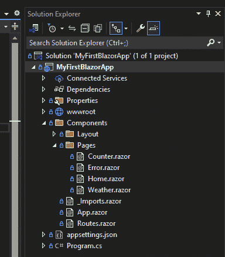

# 2

# 使用 Razor Pages、MVC 和 Blazor 构建动态 UI

ASP.NET Core 9 提供了一个完整的 UI 框架，适用于不同类型的方法和应用程序，允许在客户端和服务器端使用页面渲染策略。在本章中，我们将了解 ASP.NET Core UI 框架中可用的选项，以及了解如何为每个场景定义最佳选项。

最初，我们将了解一些重要概念，然后继续以实际的方法进行，以便我们能够练习所学的概念。

在这种方法中，我们最初将了解 ASP.NET Core UI 框架是什么，学习在服务器上使用 Razor Pages 和 ASP.NET MVC 以及客户端使用 JavaScript 框架渲染应用程序的不同方法。最后，我们将了解将不同技术合并到混合解决方案中的力量，该解决方案结合了客户端和服务器两方面的最佳之处。

在本章中，我们将涵盖以下主要主题：

+   了解 ASP.NET Core UI

+   使用 Razor Pages 和 ASP.NET MVC 实现 UI 服务器渲染模型

+   探索使用 Blazor 和 JavaScript 框架进行 UI 客户端渲染

+   与混合解决方案一起工作

# 技术要求

您可以在以下存储库中找到本章中使用的所有代码示例和其他材料：[`github.com/PacktPublishing/ASP.NET-Core-9.0-Essentials`](https://github.com/PacktPublishing/ASP.NET-Core-9.0-Essentials)

# 了解 ASP.NET Core UI

动态的基于网络的程序具有一种基本涉及两个不同“世界”的流程，即前端和后端。一般来说，前端处理的是可视化的机制，允许用户与解决方案提出的各种功能进行交互。因此，前端由按钮、文本、列表、菜单、图像和其他方面组成，共同构成了用户界面（UI）。后端是允许前端根据用户交互实现动态性的机制的表示。我们将在*第三章*中进一步讨论与后端相关的方面。

前一段落中表达的所有术语在不同的上下文中都有不同的作用。*前端*通常在客户端运行，这转化为用户的浏览器。*客户端*是一个通用术语，可以表达其他类型的用户交互。但在这个情况下，我们将讨论客户端为您的选择浏览器。*后端*在服务器上运行，无论是在数据中心还是在像 Azure 这样的云服务提供商上。

通过 UI 中的用户交互，用户必须与后端通信，随后能够适应服务器的响应，以提供某种类型的响应和交互，再次，与用户进行交互。

浏览器基本上使用三种技术：HTML、CSS 和 JavaScript。HTML 是静态的；也就是说，它被浏览器解释，然后以 UI 的形式渲染。CSS 负责使视觉元素更具吸引力，定义颜色、阴影和格式等设计方面。JavaScript 用于使静态元素动态化，这包括例如调用服务器，并根据结果修改用户的 UI 以适应处理结果的响应。JavaScript 负责提高基于 Web 的应用程序的动态性和交互性。然而，通过 JavaScript 代码创建和操作元素可能很复杂，此外，还需要管理服务器上的调用。有几种优秀的 JavaScript 框架可用，例如 Angular 或 React，这些框架允许您开发丰富的动态 UI 解决方案。

掌握 UI 技术知识是至关重要的；然而，我们还可以从一种集成的开发模型中受益，它允许我们丰富地同时处理 UI 和后端。

ASP.NET Core 9 拥有一个完整的 UI 框架，以满足 Web 应用程序对任何 UI 的需求，并且与 .NET 平台完全集成，使用最佳实践进行职责分离、管理和维护等重要方面。尽管如此，ASP.NET Core 并不局限于使用平台提出的 UI 渲染器；它还与 JavaScript 框架很好地集成，甚至允许您通过采用混合方法使用最佳选项。

然而，在我们更深入地了解 ASP.NET Core 9 中可用的选项之前，让我们先了解与 Web 系统架构相关的重要方面。

## 渲染 UI

在谈论技术之前，关于 UI 层开发基于 Web 的解决方案就有不同的方法。

基本上有两种模型，客户端和服务器端，各有其优缺点。还有一种第三种可能性，即使用混合方法。

在客户端模型中，处理在浏览器本地进行。这样，所有 HTML、CSS、JavaScript 和其他资产都由浏览器处理，响应用户的刺激。与用户的交互通过包含 UI 相关逻辑的脚本在本地处理，无需请求服务器。

然而，这种方法依赖于服务器资源，例如访问数据等，因此有必要频繁调用服务器以获取基于用户需求的信息，然后处理并在 UI 中呈现。

在服务器端方法中，所有处理都委托给服务器，服务器返回一个定制的 HTML 页面，准备在浏览器中渲染。服务器处理所有必要的信息，允许访问数据，管理业务逻辑，能够使用密钥抽象敏感信息，并将最小处理委托给客户端。然而，如果服务器不可用，将无法使用该系统。

在混合方法中，结合了“两者之最”。 

有许多 JavaScript 框架准备用来使基于 Web 的系统动态化，通过在客户端处理资源提供优秀的用户体验，同样，它们也有与服务器交互的能力，将仅相关的信息处理委托给 UI 而不是整个页面的处理。

幸运的是，ASP.NET Core 9 为使用不同方法开发基于 Web 的解决方案做好了准备。我们将在下一节开始了解第一个 UI 开发模型，即使用 Razor Pages。

# 使用 Razor Pages 和 ASP.NET MVC 实现一个 UI 服务器端渲染模型

ASP.NET Core 9 提供了两种强大的服务器端渲染模型：Razor Pages 和 MVC。它们是类似模型，但 MVC 更为复杂，并实现了模型-视图-控制器（Model-View-Controller）架构设计模式——我们将在 *ASP.NET Core MVC* 部分详细讨论这一点。现在，让我们开始学习 Razor Pages。

## ASP.NET Core Razor Pages

Razor Pages 是一个基于页面的服务器端渲染框架，它实现了页面模型。基于页面的模型基本上将特定页面的实现上下文化，考虑到 UI 和业务逻辑，但正确地分离了责任。

Razor 是一种标记语言，其作用类似于模板引擎，并将它的使用与 HTML 和 C# 代码相结合。

Razor 的起源

Razor 的发展始于 2010 年 6 月，但直到 2011 年 1 月才随着 MVC 3 一起发布，作为 Microsoft Visual Studio 2010 的一部分。Razor 是一个简单的语法可视化引擎。

这种基于页面的开发模型带来了许多优势，例如创建和更新 UI 的简便性；它是可测试的，保持了 UI 和业务逻辑的分离，尽管它与 ASP.NET Core MVC 有相似之处，但它更简单。考虑到所有这些优势，让我们使用 Razor Pages 创建我们的第一个项目。

### 使用 Razor Pages 创建我们的第一个项目

要创建 Razor Pages 项目，您可以使用 Visual Studio 或 **dotnet** CLI 工具。

使用 Visual Studio 创建非常简单；只需打开 IDE，选择 **创建一个新项目**，然后选择 **ASP.NET Core Web App** 模板，如图 *图 2.1* 所示：


图 2.1 – 选择项目模板

Visual Studio 和 CLI 工具都使用模板的概念。使用 .NET 平台，可以开发不同类型的项目，无论是网页、Windows 还是移动应用。每个模板都会创建一个基本的项目结构。

在本书的其余部分，我们将使用 CLI 工具来创建项目，以及我们稍后将要讨论的其他需求。从现在起，我们将使用 .NET CLI 工具来创建 Razor Pages 项目，因为这个工具为我们提供了本书其余部分将要讨论的几个好处。

当您安装 .NET 9 SDK 时，将提供一系列工具。本书中我们将使用的主要工具是 **dotnet** 。

**dotnet** CLI 工具也有模板的概念。为了测试这个功能，打开您的操作系统命令提示符，并运行以下命令：

```cs
dotnet --version
```

运行上述命令后，将显示当前工具的版本。这次，仍然在提示符下，运行以下命令：

```cs
dotnet new
```

运行上述命令后，您将看到以下内容：


图 2.2 – dotnet CLI 工具模板

如 *图 2.2* 所示，列出了一些模板和用法示例。每个模型都有一组参数，用于自定义项目创建。如果您想了解更多关于每个模板的参数，只需键入以下命令；例如，对于 **webapp** 模板，您将键入此命令：

```cs
dotnet new webapp –h
```

**-h**（帮助）参数将提供所需模板的参数列表和文档。

根据您的机器上的安装情况，可能会有其他模板。运行以下命令：

```cs
dotnet new list
```

您将看到一个包含许多类型项目模板的列表；我们将关注 *图 2.3* 中突出显示的项目：


图 2.3 – 所有可用的项目模板

现在我们已经了解了模板，让我们最终通过命令行创建一个新的 Razor Pages 项目。为此，打开命令提示符，创建一个名为 **NewRazorPages** 的新文件夹，并在该文件夹上运行以下命令：

```cs
dotnet new razor -n MySecondWebRazor
```

之前的命令由 **new** 命令组成，用于创建新项目，然后是 **razor**，代表所需模板的简称，最后是 **-n** 参数，它定义了项目的名称。

执行命令后，将创建一个包含项目的新的文件夹。

命令详情

CLI 工具中可用的每个命令都可以有一组参数。要了解更多关于这些参数的信息，只需在命令后添加 **-h** 选项；例如，**dotnet new -h** 。

您还可以在以下链接中查阅工具的文档：[`learn.microsoft.com/en-us/dotnet/core/tools/dotnet`](https://learn.microsoft.com/en-us/dotnet/core/tools/dotnet)

对于本书的其余部分，我们将考虑通过命令行创建项目。现在，让我们更详细地了解我们创建的 Razor Pages 项目。

### 理解 Razor Pages 项目

与 ASP.NET Core MVC 相比，Razor Pages 项目的目录结构和配置非常简单。然而，在此项目中使用的许多概念都是 MVC 项目的基石，因此我们将充分利用所有内容。

*图 2* *.4* 展示了上一节创建的项目结构，并已扩展以表达我们将更详细讨论的每个重要项： 


图 2.4 – Razor Pages 项目结构

Razor Pages 具有简单的结构，基本上可以划分为四个重要项：

+   **wwwroot 文件夹**：此文件夹包含应用程序的静态文件，例如 JavaScript、CSS、库和图像。默认情况下，配置了三个子目录，例如 **css**、**js** 和 **lib**，用于包含来自外部库的 JavaScript 文件，例如 jQuery 等。您还可以创建其他目录以包含图像、字体等文件。

+   **Pages 文件夹**：此文件夹包含应用程序的页面，细分为具有 **cshtml** 扩展名的成对文件，其中包含使用 Razor 语法编写的 HTML 代码和 C# 代码，以及 **cshtml.cs**，其中包含负责处理页面事件的 C# 代码。

+   **appsettings.json**：这是一个 JSON 格式的文件，用于集中维护应用程序设置，以及数据库连接字符串、API 密钥和其他参数。我们将在 *第九章* 中更多地讨论设置。

+   **Program.cs**：这是 Razor Pages 项目中最重要的文件，用 C# 编写，包含整个应用程序流程的所有执行设置。

随着我们在学习过程中添加更多功能和概念，有关项目的其他一些细节和配置将在本书的其他章节中看到。目前，理解项目的一些前提条件非常重要。

让我们查看 **Program.cs** 文件以了解一些细节：

```cs
var builder = WebApplication.CreateBuilder(args);
builder.Services.AddRazorPages();
var app = builder.Build();
if (!app.Environment.IsDevelopment())
{
    app.UseExceptionHandler("/Error");
    app.UseHsts();
}
app.UseHttpsRedirection();
app.UseStaticFiles();
app.UseRouting();
app.UseAuthorization();
app.MapRazorPages();
app.Run();
```

以下要点解释了前面的代码：

+   文件的第一行创建了一个 ASP.NET Core Web 应用程序的实例，使用一些标准配置，例如在 *第 9* 行和 *第 13* 行之间添加中间件，这些中间件作用于应用程序流程和由框架本身提供的生成路由等约定配置。

+   接下来，我们有执行 **builder.services.AddRazorPages** 行，该行负责配置具有 Razor Pages 项目特性的 Web 应用程序。此项目依赖于平台在运行应用程序时使用的某些类。

+   在 *第 4 行* 和 *第 8 行* 之间，有一个与应用程序运行环境相关的检查。此代码块确保如果应用程序未处理任何错误，用户将被重定向到通用错误页面，防止应用程序的详细信息被暴露。**app.UseHsts()** 代码旨在强制通过 **HTTP Strict Transport Security** ( **HSTS** ) 协议进行通信，以增加安全性和 HTTPS 的使用。

+   在 *第 9 行* ，我们确保使用 HTTPS 协议。

+   *第 10 行* 对于 Razor Pages 应用程序考虑静态文件、本地化和 HTTPS 的使用是必要的。

在这一点上，考虑 **Program.cs** 文件中描述的代码将影响应用程序的运行行为是很重要的。我们还必须考虑文件中每个方法的顺序。

更多的细节和配置变体将在本书的后面部分讨论。我们已经熟悉了 Razor Pages 项目结构，因此让我们更多地了解 HTML 页面中使用的语法以及如何与 C# 代码交互。

### 与页面一起工作

Razor 充当一个强大的模板引擎，允许你使用 HTML、CSS、JavaScript 和 C# 代码在同一文件中创建页面。这种方法在生成动态页面时提供了极大的灵活性。

让我们看看 **Index.html** 页面的一个示例：

```cs
@page
@model IndexModel
@{
    ViewData["Title"] = "Home page";
}
<div class="text-center">
    <h1 class="display-4">Welcome</h1>
    <p>Learn about <a
      href="https://learn.microsoft.com/aspnet/core">
      building Web apps with ASP.NET Core</a>.</p>
</div>
```

代码的第一行涉及页面相关设置，然后是纯 HTML 代码。

让我们了解文件中描述的主要组件：

+   **@page** 指令必须是 Razor 页面视图中的第一个指令。它表示该页面将作为动作处理程序。

+   **@model** 指令表示将传递给页面的模型类型。Razor Pages 由两个文件组成，**.cshtml** 和 **.cshtml.cs** 。

**ViewData["Title"]** 代码是一个字典，它代表将数据传递给页面的另一种方式。通常，**ViewData** 用于传递少量数据。在前面代码的情况下，**ViewData** 正在被用来将页面标题的信息传递到 HTML 模板中。

第一部分涉及 HTML；与前面的示例一样，**.cshtml.cs** 指的是页面处理程序的 C# 代码，其中包含将在页面上使用的数据或信息。因此，**Index.cshtml** 文件与 **index.cshtml.cs** 文件相关联。

在下面的代码中，我们有 **IndexModel** 类，它表示将在页面上使用的模型：

```cs
public class IndexModel : PageModel
 {
     private readonly ILogger<IndexModel> _logger;
     public IndexModel(ILogger<IndexModel> logger)
     {
         _logger = logger;
     }
     public void OnGet()
     {
     }
 }
```

正如我们在示例中提到的，**Index.cshtml** 页面没有完整的 HTML 页面结构。这是因为 Razor Pages 允许布局的概念。也就是说，页面通常可以共享相似的结构。这样，我们可以重用代码来生成常见的布局和创建共享的视图块。

在项目结构中，布局保存在**Pages/Shared**文件夹中。根据惯例，共享视图以下划线开头。**_Layout.cshtml**文件具有常见的 HTML 结构，并且还有一个特殊指令**@RenderBody()**：

```cs
<html lang="en">
<head>
    <!-- The rest of the code has been omitted for
      readability. -->
    <title>@ViewData["Title"] - MyFirstRazorWebApp</title>
    <!-- The rest of the code has been omitted for
      readability. -->
<div class="container">
    <main role="main" class="pb-3">
        @RenderBody()
    </main>
</div>
```

**RenderBody()**方法指定了在服务器处理之后视图将被渲染的位置。在**index.cshtml**页面的情况下，所有 HTML 都将渲染在主标签之间，在**_Layout.cshtml**文件中。此外，请注意**ViewData["Title"]**的使用，它将显示在页面上设置的值，如**index.cshtml**文件中所示。

此外，还有两个其他特殊文件，根据惯例，应位于**Pages**文件夹中：

+   **_ViewStart.cshtml**：这是一个允许我们在显示每个视图之前执行代码的文件。在这种情况下，此文件包含定义将用于视图的布局文件的代码。

+   **_ViewImports.cshtml**：此文件用于定义命名空间并将功能导入页面，以通用方式。这样，就不需要在每个页面上声明命名空间和其他功能。

现在我们已经了解了整个项目结构以及如何在项目中管理 Razor 页面，让我们对**Index**页面和**IndexModel**模型进行一些自定义设置，并学习如何使用 Razor 语法与 C#代码交互。

### 与 Razor 语法和 C#模型交互

如前所述，Razor 页面有两个文件，一个负责渲染 UI，另一个负责包含页面的业务逻辑。此外，还有使用 C#代码与 HTML 结合的可能性，这意味着页面可以在服务器处理时根据用户交互生成。

我们将对**index.cshtml**文件进行一些更改，添加一些如图*图 2.5*所示的控件：


图 2.5 – 使用 Razor 语法自定义 index.cshtml 文件

在 Visual Studio 或 Visual Studio Code 中打开**index.cshtml**文件进行更改，并按照以下步骤操作：

1.  在**@{}**实例之间添加以下代码：

    ```cs
    string subtitle = "It's funny";
    ```

1.  现在，将**div**标签之间的所有内容全部更改，这些标签包含页面内容，更改后的代码如下：

    ```cs
    <h1 class="display-4">Welcome</h1>
      <p>Learn about <a
        href="https://learn.microsoft.com/aspnet/core">
        building Web apps with ASP.NET Core</a>.</p>
    <h2>@Model.Message</h2><br />
    <h3>@subtitle</h3>
      <a asp-page-handler="DefineColor"
        asp-route-id="1">Red</a>
      <a asp-page-handler="DefineColor"
        asp-route-id="2">Green</a>
      <div style="width: 200px;height:200px;
        background-color:@Model.Color"></div>
      <form method="post">
        <label>Total:</label><input type="text"
          name="quantity"/>
        <input type="submit" value="Load Products"
          name="btn" />
      </form>
      <table class="table">
        <thead>
            <tr>
                <th>Id</th>
                <th>Nome</th>
                <th>Preço</th>
            </tr>
        </thead>
        <tbody>
            @foreach (var product in Model.Products)
            {
                <tr>
                    <td>@product.Id</td>
                    <td>@product.Name</td>
                    <td>@product.Price.ToString("C")</td>
                </tr>
            }
        </tbody>
      </table>
    ```

    上述代码为**Price**属性创建格式，以便以货币格式显示。此格式将考虑您的浏览器区域设置。在本书中运行的示例中，格式将显示**en-US**文化格式。

1.  为了确保属性以特定格式显示，可以创建一个新的属性：

    ```cs
    public string FormattedPrice
        {
            get { return price.ToString("C",
              CultureInfo.GetCultureInfo("en-US")); }
        }
    ```

1.  这样，我们可以更新现有代码以显示价格，如下所示：

    ```cs
    <td>@product.FormattedPrice</td>
    ```

1.  然而，我们可以全局定义应用程序文化，避免创建新属性的需求。为了进行此更改，请将以下代码添加到位于**var app = builder.Build()**行下面的**Program.cs**文件中：

    ```cs
    app.UseRequestLocalization(new
      RequestLocalizationOptions
    {
      DefaultRequestCulture = new RequestCulture("en-US"),
      SupportedCultures = new List<CultureInfo>
      {
        new CultureInfo("en-US")
      }
    });
    ```

重要提示

有关在 ASP.NET Core 9 中管理文化的更多信息，请参阅以下链接：[`learn.microsoft.com/en-us/aspnet/core/fundamentals/localization?view=aspnetcore-9-0`](https://learn.microsoft.com/en-us/aspnet/core/fundamentals/localization?view=aspnetcore-9-0)

除了对服务器代码的一些调用外，还添加了一些使用内联 C# 代码的元素。目前，理解如何将 Razor 语法与 HTML 一起使用非常重要。让我们了解添加到 UI 中的所有元素以及它们如何与 C# 交互。

在第 5 行添加的第一个片段是 C# 代码，声明了一个 **string** 类型的变量 **subtitle = "It's funny"**。

注意，所有代码都包含在 **@{** 和 **}** 符号之间，如 **index.cshtml** 文件中的第 3 行到第 6 行的示例所示。此语法允许添加一个能够包含 C# 和 HTML 指令的代码块。

结合 C# 和 HTML 代码和代码块

在 C# 代码块中，也可以添加 HTML 标签。使用这种策略可以带来很大的优势，例如，根据 **if** 语句确定将渲染哪种类型的 HTML 标签，如下例所示：

**@{**

**if (total > 0)**

**{**

**<h1>可用的数量是：@total</h1>**

**}**

**else**

**{**

**<h2>没有可用的数量</h2>**

**}**

**}**

除了代码块之外，使用 **@** 符号还可以在单行中添加 C# 代码，如前述代码示例所示，这将显示 **Model** 对象的 **Message** 属性的值以及显示之前定义的 **subtitle** 变量的值：

```cs
  <h2>@Model.Message</h2><br />
  <h3>@subtitle</h3>
```

Razor Pages 提供了指令，这些是添加到 HTML 标签中的功能。以下代码向页面添加了两个锚点：

```cs
<a asp-page-handler="DefineColor" asp-route-id="1">Red</a>
<a asp-page-handler="DefineColor"
  asp-route-id="2">Green</a>
    <div style="width: 200px;height:200px;
      background-color:@Model.Color"></div>
```

注意，有两个属性，**asp-page-handler** 和 **asp-route-id**。这些是指令 Razor 页面，分别确定当点击链接时的事件处理器的名称以及将作为参数发送给处理器的值。

此外，请注意，**div** 样式具有 **@Model.Color** 代码，作为 **background-color** 属性的值插入。**div** 标签的颜色将根据链接动态设置。

对于页面上创建的其他控件，我们有一个纯 HTML 表单和一个列出随机生成产品的表格。该表单没有 **action** 属性，用于确定处理数据提交的页面或脚本。此属性被省略，因为 Razor Pages 遵循一种约定，在这种情况下是推断表单页本身作为操作。

以下代码生成了乘法表的行和列：

```cs
@foreach (var product in Model.Products)
 {
     <tr>
         <td>@product.Id</td>
         <td>@product.Name</td>
         <td>@product.Price.ToString("C")</td>
     </tr>
 }
```

上述代码是 HTML 和 C# 代码的混合体。在执行 **foreach** 语句后，定义了乘法表的列和行。产品在 **Model** 对象的 **Products** 属性中生成。

记得要分离职责

如我们所见，使用 Razor Pages 可以在 HTML 页面中添加任何 C# 代码。然而，使用这种方法来操作 UI 元素，但正确地分离责任很重要，避免将业务规则和 UI 操作规则的多重实现混在一起。

到目前为止，我们需要的所有元素都已添加，我们现在知道如何将 C# 代码添加到我们的 UI 中。让我们完成 **Index** 页面的设置，在 **index.cshtml.cs** 文件中添加其操作所需的代码。

### 与页面模型一起工作

为了使之前创建的 UI 正确工作，我们必须向页面模型添加一些属性和方法。打开 **index.cshtml.cs** 文件，以便我们可以添加必要的功能。

**Index** 页面模型实际上是一个继承自 **PageModel** 类的 C# 类，它是 Razor Pages 中模型使用的多个属性和方法的抽象。

让我们对 **IndexModel** 类进行修改，并理解添加的每一行代码：

1.  在 **Index.cshtml.cs** 文件中添加一个 **Message** 属性。它将用于定义将在 UI 中显示的消息：

    ```cs
    public string Message { get; set; }
    ```

1.  在项目根目录下，创建一个名为 **Models** 的文件夹，然后添加一个名为 **Product.cs** 的类。这个类必须包含以下代码：

    ```cs
    public class Product
    {
        public int Id { get; set; }
        public string Name { get; set; }
        public decimal Price { get; set; }
    }
    ```

1.  返回到 **Index.cshtml.cs** 文件，并添加一个 **Products** 属性，该属性将包含一个列表，该列表将列在之前在 UI 中创建的表中：

    ```cs
    public List<Product> Products { get; set; }
    ```

1.  还要添加一个 **Color** 属性：

    ```cs
    public string Color { get; set; }
    ```

1.  基本属性已经创建。现在，让我们创建一个随机生成产品列表的方法。按照以下代码添加 **GenerateProduct** 方法：

    ```cs
    private List<Product> GenerateProduct(int quantity)
    {
        var random = new Random();
        var products = Enumerable.Range(1,
          quantity).Select(i => new Product
        {
            Id = i,
            Name = $"Product {i}",
            Price = (decimal)(random.NextDouble() * 100.0)
        });
        return products;
    }
    ```

1.  我们将更改类构造函数，并为 **Products** 和 **Message** 属性添加默认值。这样，一旦页面显示，我们就会有一个随机生成的产品列表和一个 **我正在使用 Razor** **语法** 消息：

    ```cs
    public IndexModel(ILogger<IndexModel> logger)
    {
        _logger = logger;
        Products = GenerateProduct(10);
        Message = "I'm using the Razor Syntax.";
    }
    ```

1.  生成产品的那个方法在构造函数中被用来生成一个初始列表。然而，我们希望通过 UI 交互并基于在表单中输入的值生成一个列表。为此，我们将创建一个 **OnPost** 方法。此方法基于在 UI 表单中输入的数量生成一个新的列表：

    ```cs
    public void OnPost(int quantity)
    {
        Products = GenerateProduct(quantity);
    }
    ```

1.  最后，让我们定义一个负责设置 **Color** 属性值的方法：

    ```cs
    public void OnGetDefineColor(int id)
    {
        Color = id == 1 ? "#FF0000" : "green";
    }
    ```

我们的模式已经准备好与 UI 交互。但在运行应用程序之前，让我们了解 Razor Pages 规范的一个简单概念。

**OnPost**方法使用这个名字，遵循约定，并且与**GET**、**POST**、**DELETE**和**PUT** HTTP 动词相关。这样，通过定义**OnGet**、**OnPost**、**OnDelete**和**OnPut**等方法，它们将能够根据 HTTP 动词处理页面事件。**Index**页面的 UI 有一个使用**POST**方法的表单。因此，当点击**加载产品**按钮时，Razor Pages 将自动调用**IndexModel**模型上的**OnPost**方法。

**OnGetDefineColor**方法使用这个名字是为了遵循约定，但方法名称中并不强制使用**OnGet**前缀。在 HTML 中，我们不会将链接处理程序定义为**OnGetDefineColor**；这是因为，按照约定，Razor Pages 会从方法名称中推断前缀，也因为执行了一个**GET**请求。但如果你想提供完整的名称，则不会有问题。**OnGetDefineColor**方法还有一个重要的特性：它的**id**参数。**id**参数接收在 HTML 链接中添加的指令中定义的值，如下面的代码示例所示：

```cs
<a asp-page-handler="DefineColor" asp-route-id="1">Red</a>
```

这个操作被称为绑定，这意味着当传递**id**参数时，Razor Pages 会根据每个参数的名称设置方法参数的值。

指令提示

在之前定义的 HTML 链接中传递参数是通过**asp-route**指令与在方法中期望的参数名称一起完成的——在这种情况下，**id**。这样，完整的指令由**asp-route-id**定义。如果有另一个名为**name**的参数，例如，指令将是**asp-route-name**。

现在你已经知道了**Index**页面的整个实现，运行应用程序并交互之前创建的控件。

到目前为止，我们已经学习了如何使用 Razor Pages 通过服务器端方法创建动态页面。与在**Index**页面上创建的控件每次交互时，都会调用服务器，服务器将操作信息，解释在 UI 中实现的 Razor 页面代码，然后返回带有结果的 HTML 输出。

这种方法与我们在下一节将要学习的 ASP.NET Core MVC 非常相似。

## ASP.NET Core MVC

ASP.NET Core MVC 也是一个非常强大的服务器端框架，它实现了 MVC 设计模式。让我们了解 MVC 设计模式是如何工作的，然后通过创建一个新项目来学习如何从这个方法中受益。

### MVC 模式

MVC 是一种基于责任或上下文分离的架构设计模式：


图 2.6 – MVC 模式

如您在*图 2.6*中看到的那样，**控制器**充当协调者，通过**视图**响应用户交互，并将动作委托给**模型**，该模型代表应用程序状态和业务规则。随后，控制器返回结果，定义哪个视图将负责向最终用户显示 UI。

视图和控制器依赖于模型，但模型是中立的，允许分离责任并使用良好的代码实践，例如使用单元测试，因为与视觉表示独立。

ASP.NET Core MVC 基于 MVC 模式，适应项目模型和约定。让我们了解这种类型的项目中如何实现此模式。

### ASP.NET Core MVC 项目结构

创建 ASP.NET Core MVC 项目非常简单，我们除了使用 CLI 工具外，还使用 Visual Studio Code 作为编辑器。

按照以下说明进行操作：

1.  打开您的操作系统命令提示符，访问您选择的目录，其中将创建项目。

1.  输入以下命令以创建项目：

    ```cs
    dotnet new mvc --name MyFirstMVCApp
    ```

    前面的命令使用了**dotnet** CLI 工具，其中我们通过**new**命令指定创建新项目的动作。然后，我们定义要创建的项目类型。在这种情况下，我们通知模板将是**mvc**，并且添加了一个**--name**参数，通过该参数我们通知项目的名称。

1.  将创建一个与应用程序名称相同的文件夹。访问此文件夹，然后通过运行以下命令打开 Visual Studio Code：

    ```cs
    cd MyFirstMVCApp
    code.
    ```

    前面的命令将打开以下内容：


图 2.7 – ASP.NET MVC 项目结构

当查看创建的 MVC 项目的结构时，我们会注意到它与 Razor Pages 的相似性。

有三个主要项目文件夹：

+   **视图**：它具有与 Razor Pages 中的**页面**文件夹相同的特性；即它是应用程序的 UI。它包含**.cshtml**文件，并且这些文件组织成子文件夹，代表一个页面，并包含所有可以作为对动作的响应使用的 UI。然而，没有**.** **cshtml.cs**文件。

+   **控制器**：控制器在 Razor Pages 中定义的类中具有相似的角色。如前所述，它是一个协调者，具有用于操作在视图中执行的事件的方法。在 MVC 中，每个控制器方法被称为**动作**，可以返回视图、重定向，甚至数据。

+   **模型**：此文件夹用于管理将用于在视图和 HTML 之间交换信息的业务类和模型。

此结构遵循一种约定，这在某种程度上简化了这种方法的开发。然而，平台允许我们在必要时进行自定义。

MVC 项目在 **program.cs** 文件中定义的设置与 Razor Pages 有一个小差异。在执行 **app.Run()** 行之前，有一个对 **app.MapControllerRoute** 方法的调用。此方法负责配置整个应用程序。

路由定义了将通过应用程序请求访问的内容以及如何访问。

如以下代码所示，配置了一个默认路由，称为 **default**，它具有 **controller** / **action** / **parameter** 模式。此外，控制器和动作分别具有默认值 **Home** 和 **Index**，而参数是可选的：

```cs
app.MapControllerRoute(
    name: "default",
    pattern: "{controller=Home}/{action=Index}/{id?}");
```

这是一个标准的 MVC 约定，可以很容易地更改。在这个模型中，如果应用程序的访问没有定义控制器和要执行的操作，则默认控制器 **Home** 和 **Index** 动作将被定义为对请求的响应。

有趣的是，我们指的是控制器而不是页面。这是因为 MVC 模式允许控制器根据所需操作来协调请求，然后返回结果或视图。

随着我们通过本书的章节进展，我们将有其他使用路由的示例。

### 理解模式和约定

MVC 项目遵循一个有利于之前提出的文件结构的约定。

如我们所学，控制器在模型和视图之间充当协调者。这样，我们不是使用页面的概念，而是有动作的概念。

给定用户的意图或交互，它将触发一个动作。这个动作被控制器捕获，然后执行处理并返回一个值或视图，如图 *2.8* 所示：


图 2.8 – MVC 请求流程

**Controller** 类是一个 C# 类，它具有属性和方法。**Controller** 类的公共方法被称为动作。

想象一个人物注册表。那么，我们就会有以下类：

```cs
public class PersonController : Controller
{
    public IActionResult Index()
    {
        return View();
    }
    public JsonResult GetPeople()
    {
        var model = new List<PersonModel>() {
            new PersonModel("Person 1",
              new DateTime(1980, 12, 11)),
            new PersonModel("Person 2",
              new DateTime(1983, 12, 15))
        };
        return Json(model);
    }
    public IActionResult Register(PersonModel personModel)
    {
        return RedirectToAction("Result",
          new { message =  $"The {personModel.Name}
          was registered successfully." });
    }
    public IActionResult Result(string message)
    {
        ViewData["Message"] = message;
        return View();
    }
}
```

**PersonController** 类遵循命名约定，在类名末尾采用 **Controller** 后缀。此外，这个类从 **Controller** 类继承，这是一个基类，它已经包含了一些负责通过控制器处理和返回数据和信息的方法。

接下来，我们有一个名为 **Index** 的方法，它仅仅返回一个视图，执行 **return View()** 命令。

返回哪个视图？

**View()** 方法考虑了 Asp.NET Core MVC 的约定。因此，当执行时，实例化的视图会考虑以下路径：**/Views/<ControllerName>/Action.cshtml**。这意味着在 **PersonController** 类的情况下，调用 **Index** 方法将返回一个视图：**Views/Person/Index.cshtml**。

**View()** 方法有其他重载，使得可以将一个对象传递给视图作为模型，甚至可以定义一个应显示的控制器视图。

**GetPeople()** 方法仅返回一个人员列表的 JSON 格式，如图 *图 2.9* 所示：


图 2.9 – 包含人员列表的 JSON

**Register()** 方法处理表单请求，并将一个对象返回到 **Result** 视图。然而，在这种情况下，它正在调用 **PersonController** 控制器中的动作，执行名为 **RedirectToAction** 的方法，该方法期望一个字符串作为参数。*图 2.10* 展示了注册人员后动作结果的显示：


图 2.10 – 注册人员视图

基础控制器类

抽象的 **Controller** 类包含一些实用方法，这些方法允许你在控制器和视图之间进行通信流程的工作。

**Json()**、**View()** 和 **RedirectToAction()** 方法是控制器类中常用的一些资源。

MVC 模型和 Razor Pages 有相似之处，但一个很大的区别是使用动作而不是页面。这样，控制器就有能力根据某些用户交互决定应返回哪种类型的视图或信息，从而协调处理流程。

控制器响应用户事件，视图是这个类型项目的一个重要方面。基于 **PersonController** 示例，我们将了解视图是如何创建的，并学习在下一节中控制器动作的交互工作原理。

### 在 ASP.NET MVC 中与视图一起工作

ASP.NET MVC 中的视图概念与 Razor Pages 中使用的概念相同，使用 Razor 语法。正如我们可以在以下代码中看到的那样，有一个表单标签，使用 Razor 指令定义了哪个控制器和动作将处理注册：

```cs
@model MyFirstMVCApp.Models.PersonModel
@{
    ViewData["Title"] = "Home Page";
}
<div class="text-center">
    <h1 class="display-4">Person View</h1>
</div>
<div>
    <form method="post" asp-controller="Person"
      asp-action="Register">
        @Html.LabelFor(p => p.Name)
        @Html.TextBoxFor(p => p.Name)
        <br/>
        @Html.LabelFor(p => p.DateOfBirth)
        @Html.TextBoxFor(p => p.DateOfBirth)
        <input type="submit" value="Register" />
    </form>
</div>
```

之前创建的文件位于 **Views/Person/Index.cshtml** 目录结构中。按照惯例，对于 **PersonController** 控制器，必须有一个 **Person** 文件夹，它是 Views 的一个子文件夹，将包含将通过 **PersonController** 控制器显示的所有视图。

视图索引是一个好的实践

在每个控制器中拥有一个 **Index.cshtml** 文件和一个 **Index()** 动作是一个好的实践。按照在 **Program.cs** 文件中定义的路由模式，默认情况下，如果没有指定动作，将执行一个 **Index()** 动作。在这种情况下，拥有一个视图和动作索引可以避免你的应用程序中出现可用性问题。

为了创建表单中使用的标签和输入，使用了 **标签助手**。标签助手是 Razor Pages 方法，基本上用于渲染 HTML。在前面展示的代码中，区别在于与模型存在连接。

在**Index.csthml**页面的第一行中，定义了一个 Model，使用**@model MyFirstMVCApp.Models.PersonModel**代码。这使得 Model 具有强类型。通过使用标签助手和 Lambda 表达式，我们正在实施与 MVC 绑定模型相关的好做法。

因此，表单标签助手生成的 HTML 将具有与模型属性相关的正确名称，遵循以下概述的流程：

1.  数据是输入中提供的信息，包括姓名和出生日期。

1.  用户点击**注册**按钮。

1.  ASP.NET 框架向**Result**操作发送了一个请求。

1.  ASP.NET 框架识别出**Result**操作有一个**PersonModel**对象作为参数，然后创建了一个实例。

1.  ASP.NET 框架将表单提交的数据绑定到实例化的对象的相应属性中。

1.  ASP.NET 框架执行了**Result**操作。

由于绑定是通过属性名完成的，如果任何名称输入错误，某些属性将没有值。

使用标签助手方法还有助于其他方面，例如添加到**Model**类的属性，允许进行验证等。我们将在第三章和第五章中讨论更多关于属性和绑定。

MVC 模式为我们提供了几个好处，特别是在需要控制不同的业务流程并根据需要返回动态视图的更复杂的项目中。

在 ASP.NET Core 9 中，处理 UI 的方法还有其他几种。让我们在下一节中了解更多关于其他选项，例如使用 Blazor 和与 JavaScript 框架的集成。

# 探索使用 Blazor 和 JavaScript 框架进行 UI 客户端渲染

ASP.NET Core 9 有几个框架，它们通过客户端和服务器端方法提供高质量的 UI 创建和良好的用户体验。

我们将讨论使用**WebAssembly**标准的新技术，称为 Blazor，它是一个强大且灵活的 UI 框架。然而，如果你习惯了 JavaScript 框架，你也可以从.NET 平台中受益。

## 使用 Blazor 创建丰富的 UI

就像 Razor Pages 和 MVC 一样，Blazor 在.NET 平台上提供了一个**单页应用程序**（**SPA**）框架，它既可以在客户端运行，也可以在服务器端运行，利用了 C#的所有功能。

### Blazor WebAssembly

Blazor 的客户端-服务器版本运行在 WebAssembly 平台上，这是一个紧凑的字节码，具有优化的格式，下载速度快，在客户端运行时提供出色的性能，创造了丰富的 UI 体验。

正如我们在*图 2* *.11*中看到的那样，Blazor 是 ASP.NET Core 为 WebAssembly 提供的抽象。这样，Blazor 代码将生成应用程序程序集，这些程序集需要.NET 运行时来执行，同时也允许 WebAssembly 与 HTML 文档之间的交互。

WebAssembly

WebAssembly 是一个网络标准，你可以在官方网站上了解更多信息：[`webassembly.org/`](https://webassembly.org/)


图 2.11 – WebAssembly 和 Blazor

WebAssembly 平台使用互操作性模型，这使得它可以与所有浏览器 API 交互，在沙盒中运行，提供对恶意行为的保护，并允许执行.NET 代码。

所有的页面代码都编译成.NET 程序集。因此，当通过浏览器访问页面时，会下载程序集和.NET 运行时。然后，在 WebAssembly 的支持下，应用程序运行并使用 JavaScript 互操作来处理**DOM**（**文档对象模型**）操作和浏览器 API 调用。

Blazor 是一个灵活的框架，还允许你创建具有服务器端处理优势的项目，提供卓越的客户端体验。

### Blazor 服务器

Blazor 还允许采用服务器端 UI 渲染方法。然而，与 Razor Pages 和 MVC 不同，Blazor 不是为每个客户端请求渲染整个 HTML 并返回完整的文档作为响应，而是创建一个图，该图表示页面组件，考虑属性和状态。

然后，在每次交互中，Blazor 对图进行评估，并生成二进制表示，将其发送回客户端。

Blazor 的服务器端方法使用**SignalR**技术，这允许你通过直接连接到服务器来更新 UI，带来更好的可用性和丰富的用户体验。我们将在*第四章*中介绍 SignalR。

Blazor 服务器在基于 Web 的解决方案的开发中带来了巨大的好处，以 C#作为通用语言，带来了安全性、可靠性和性能。

让我们了解使用 Blazor 的开发方法。

### Blazor 组件和结构

就像一些 JavaScript 框架，例如 Angular 一样，Blazor 使用组件结构。

组件是根据应用程序的需求，以特定目标开发的一个或多个 UI 元素。该组件可以在整个应用程序中重用，实现职责分离、可重用性和灵活性。

所有 Blazor 组件都具有**.razor**扩展名，并使用 Razor 语法以及 C#的所有优点。

要创建 Blazor 项目，只需使用**dotnet** CLI，以下命令：

```cs
dotnet new blazor --name MyFirstBlazorApp
```

交互式渲染模式

ASP.NET Core 9 在 Blazor 应用程序中引入了渲染交互模式。交互式渲染模式功能增强了 Blazor 应用程序处理渲染的方式，引入了一种模式，其中服务器渲染的静态 HTML 逐渐增强为完全交互式的客户端应用程序。

该功能的目的是：

渐进增强：当 Blazor 应用最初加载时，服务器预先渲染 HTML，为用户提供一个完全可交互的页面，用户可以立即与之交互。这允许应用在客户端加载 Blazor 框架后，无缝地从静态 HTML 过渡到完全交互式的 Blazor 应用。

无缝过渡：确保即使在客户端 Blazor 运行时初始化期间，应用看起来也是交互式的，并且用户可以在完整的 Blazor 运行时准备好之前开始与应用交互，使用户体验更加流畅。

提升性能：通过减少用户在传统的 Blazor Server 或 Blazor WebAssembly 应用中可能体验到的明显延迟，优化了交互时间。

提升用户体验：在转换过程中最小化中断或加载指示器，使用户对速度有更好的感知。

如果你使用以下命令创建 Blazor 应用：

**dotnet new blazor --name MyFirstBlazorApp**

默认的交互模式是服务器。如果你想利用这个新功能，请使用以下命令：

**dotnet new blazor --name MyFirstBlazorApp --interactivity Auto**

要了解更多关于这个新功能的信息，请访问以下网址：[`learn.microsoft.com/en-us/aspnet/core/blazor/components/render-modes?view=aspnetcore-9.0`](https://learn.microsoft.com/en-us/aspnet/core/blazor/components/render-modes?view=aspnetcore-9.0)

创建项目后，只需打开**Pages**文件夹，你将找到一些组件，如图*图 2.12*所示：



图 2.12 – Blazor 项目结构

有一些组件被定义为页面，因此具有**@pages**指令，其中定义了访问页面的路由。也有其他组件被添加到页面中。

**Counter.razor**文件是一个页面组件，包含以下内容：

```cs
@page "/counter"
@attribute [RenderModeServer]
<PageTitle>Counter</PageTitle>
<h1>Counter</h1>
<p role="status">Current count: @currentCount</p>
<button class="btn btn-primary"
  @onclick="IncrementCount">Click me</button>
@code {
    private int currentCount = 0;
    private void IncrementCount()
    {
        currentCount++;
    }
}
```

注意，这里使用了 Razor 和 HTML 语法，正如我们在 Razor Pages 和 MVC 方法中学到的。在**@code {}**标签之间也有 C#代码。

在前面的文件中定义的 C#代码具有在用户点击**点击我**按钮时增加计数器的功能。

HTML 按钮标签具有**@onclick**属性，该属性使用在 C#代码块中定义的名称。

对于简单的组件，在同一个文件中使用 HTML 和 C#代码的方法可能是有效的。然而，将业务规则与 UI 分离是良好的实践。因此，Blazor 允许创建一个包含组件 C#代码的文件。

在前面的代码示例中，将会有两个文件：**Counter.razor**和**Counter.razor.cs**。所有 C#代码都可以移动到新文件中，生成以下类：

```cs
namespace MyFirstBlazorApp.Pages;
public partial class CounterPartialClass
{
    private int currentCount = 0;
    private void IncrementCount()
    {
        currentCount++;
    }
}
```

Blazor 非常灵活，为开发丰富的基于 Web 的应用程序提供了广泛的可能，这些应用程序与 HTML、CSS 和 JavaScript 集成，并使用最现代的技术。然而，关于 Blazor 的讨论将需要一本专门的书籍；然而，本书将专注于基于 Razor Pages 和 MVC 的方法。

ASP.NET Core 9 在开发 UI 方面非常灵活，提供了不同的框架。但如果你熟悉 Angular、React 或 Vue.js，你可以从 .NET 平台的力量中受益。

## ASP.NET Core 9 和 JavaScript 框架

正如我们在本章其他主题中学到的那样，ASP.NET Core 9 提供了多种构建 UI、与 C# 代码交互的方法。有几个相关的优点，包括使用通用开发模型、使用 Razor 语法以及 .NET 平台的所有好处。

然而，如果你习惯于使用 Angular、Vue.js 或 React 等框架来构建 SPAs，.NET 平台为此目的提供了一些模板：


图 2.13 – ASP.NET Core 9 JavaScript 框架模板

**React 和 ASP.NET Core** 模板创建了两个项目，一个用于前端，另一个用于应用程序的后端。

单页应用（SPAs）采用一种将 UI 独立于后端开发的方法，后端通常是一个外部服务或应用程序。

当使用 ASP.NET Core 提供的模型时，UI 和后端之间也有明显的分离。项目已经配置好了与在 .NET 中开发的 Web API 集成的功能。这种做法的一个巨大好处是，可以方便地将 UI 和后端项目作为一个简单的单元发布，从而简化发布过程：


图 2.14 – ASP.NET Core React 独立项目结构

使用 Angular、Vue.js 或 React 等框架的项目模板完全是可选的。即使 UI 项目是独立创建的，我们也可以通过开发 Web API 来为 UI 提供服务来受益。我们将在 *第三章* 中讨论创建 Web API。

如我们所见，该平台提供了多种开发高质量基于 Web 系统的方法。每个 ASP.NET Core UI 框架都有一些可以组合起来生成更强大解决方案的好处，我们将在下一节中探讨这些解决方案。

# 与混合解决方案一起工作

在像 ASP.NET Core 这样强大的平台上工作的一大好处是能够集成不同技术。因此，我们可以将 Razor Pages、MVC 和 Blazor 的所有功能结合到同一个项目中。

在与 Blazor 集成的情况下，使用 **.razor** 组件的好处是可重用性。

将 Blazor 集成到 Razor Pages 或 MVC 项目中必须按照以下步骤进行配置：

1.  在项目根目录下，添加一个名为 **_Imports.razor** 的文件。此文件将负责导入项目所需的命名空间：

    ```cs
    @using System.Net.Http
    @using Microsoft.AspNetCore.Authorization
    @using Microsoft.AspNetCore.Components.Authorization
    @using Microsoft.AspNetCore.Components.Forms
    @using Microsoft.AspNetCore.Components.Routing
    @using Microsoft.AspNetCore.Components.Web
    @using Microsoft.AspNetCore.Components.Web
      .Virtualization
    @using Microsoft.JSInterop
    @using {CHANGE_FOR_THE_NAMESPACE_OF_YOUR_PROJECT}
    ```

    注意，在文件末尾有一个 **{CHANGE_FOR_THE_NAMESPACE_OF_YOUR_PROJECT}** 标签。将此值更改为您的项目命名空间。

1.  现在，需要更改位于 **Pages/Shared** 目录中的 **_Layout.cshtml** 文件（如果是 Razor Pages 项目）或位于 **Views/Shared** 目录中的 MVC 项目。在 head 元素中添加以下代码：

    ```cs
    <base href="~/" />
    <component type="typeof(Microsoft.AspNetCore
      .Components.Web.HeadOutlet)"
        render-mode="ServerPrerendered" />
    ```

    定义 **<base href="~/"/>** 的目的是定义应用程序的基本路径，而 **component** 标签用于在 HTML 头元素中渲染 Razor 组件的内容。

1.  在 **@await RenderSection(...)** 渲染部分之前添加以下脚本：

    ```cs
    <script src="img/blazor.server.js"></script>
    ```

    不要担心脚本路径，更不用说创建它了。这将由框架自动完成。

1.  现在，打开 **Program.cs** 文件进行一些修改。首先，我们必须注册 Blazor 服务，以便在应用程序运行时它们可用。添加以下代码：

    ```cs
    builder.Services.AddServerSideBlazor();
    ```

1.  您还需要添加 Blazor 路由映射控制。在 **MapRazorPages** 调用（如果是 Razor Pages 项目）或 **MapControllerRoute** 调用（如果是 MVC 项目）下方添加以下行：

    ```cs
    app.MapBlazorHub();
    ```

现在项目已经与 Blazor 集成，让我们按照以下步骤创建一个组件：

1.  在 **Pages/Shared**（Razor Pages）或 **Views/Shared**（MVC）文件夹中创建一个名为 **technology.razor** 的文件，并添加以下代码：

    ```cs
    <h1>Load Technologies</h1>
    <button class="btn btn-primary"
      @onclick="LoadTechnologies">Load</button>
    @if (technologies != null)
    {
        <ul>
            @foreach(var tech in technologies)
            {
                <li>@tech</li>
            }
        </ul>
    }
    @code {
        private int currentCount = 0;
        private string[]? technologies;
        private void LoadTechnologies()
        {
            technologies = new[] { "Razor Pages",
              "MVC", "Blazor"};
        }
    }
    ```

    上述代码创建了一个具有点击事件的 **Load** 按钮，该事件将加载技术列表。此技术列表是在 **@code{}** 会话中创建的，使用字符串数组。当运行应用程序时，屏幕将类似于 *图 2.15*：


图 2.15 – 使用 Blazor 组件的页面/视图

1.  要使用此组件，将以下代码添加到任何 MVC Razor 页面或视图中：

    ```cs
    <component type="typeof(Counter)"
      render-mode="ServerPrerendered" />
    ```

当运行应用程序时，只需使用该组件即可获得预期的结果，如图 *图 2.16* 所示。此组件是可重用的，可以添加到任何页面或视图中，为 UI 开发带来更大的灵活性和功能：


图 2.16 – 使用 Blazor 组件与 Razor Pages 和 MVC

结合 ASP.NET Core UI 框架可以在基于 Web 的应用程序开发过程中带来好处，利用每种方法的最佳之处。

# 摘要

在本章中，你已经深入探索了 ASP.NET Core UI 的丰富世界，获得了关于构建动态和吸引人的 UI 可用工具的宝贵见解。你不仅理解了实现服务器端 UI 所需的关键概念和工具，而且还发现了通过 Blazor 使用 WebAssembly 带来的显著好处，使你能够与 ASP.NET Core 结合创建强大的单页应用（SPAs）。随着本章的结束，你已经学会了如何无缝结合 ASP.NET Core UI 解决方案。现在，在打下坚实基础之后，我邀请你开始下一章的激动人心的旅程*第三章*，我们将探讨 Web API 的世界及其在提供卓越服务中的关键作用。准备好将你的技能提升到下一个层次！
