# 3

# 为服务交付构建 Web API

作为 ASP.NET Core 9 的一部分，Web API 可以用来构建 HTTP 服务，这些服务可以提供给网页消费和移动应用程序。.NET Core 平台提供的结构使得可以开发出高质量和性能的 API。在本章中，我们将更多地了解 Web API 以及使用它们提供解决方案的标准、约定和最佳实践。

在本章中，我们将涵盖以下主要主题：

+   将业务作为服务交付

+   探索最小 API

+   使用基于控制器的方法实现 API

+   与文档一起工作

# 技术要求

本章使用 Postman 工具，该工具将用作消费 API 的客户端。此工具还将用于本书的其他章节，其安装和使用是免费的。

您可以通过以下链接在您的操作系统上下载 Postman：[`www.postman.com/downloads/`](https://www.postman.com/downloads/) .

本章中使用的代码示例可以在本书的 GitHub 仓库中找到：[`github.com/PacktPublishing/ASP.NET-Core-9.0-Essentials/`](https://github.com/PacktPublishing/ASP.NET-Core-9.0-Essentials/) .

# 将业务作为服务交付

正如我们在上一章中学到的，ASP.NET Core 9 为开发丰富的基于 Web 的应用程序提供了不同的框架。无论选择哪种模型，无论是客户端还是服务器端，我们都必须实现负责应用程序操作的协商流程。

想象一个数字银行的系统，用户可以在他们的支票账户中执行不同类型的操作，例如转账、分析摘要、检查账户余额，甚至购买新的服务套餐。这些操作中的每一个都有业务需求和规则。例如，如果用户的账户余额是 100 欧元，则不应允许转账 200 欧元。

我们已经学过，可以使用 Razor Pages、MVC 或混合模型完美地实现这种协商流程。我们可以轻松地将基于 Web 的应用程序在服务器上执行。

然而，想象一下，用户请求了一个移动应用程序。它应该提供与网页版本相同的特性。

在这个案例中，可以用于此目的的技术可以是原生或混合开发。但是，应用程序的业务逻辑应该如何开发？如果应用程序规则发生了变化，是否需要更新两种不同的代码以使应用程序正确运行？

在这种情况下，最佳实践是对涉及业务规则的代码进行集中管理。这将允许不同类型的应用程序接口，无论是浏览器、移动应用程序，甚至是其他应用程序，都能与业务环境进行交互。

这个集中式应用程序以 Web API 格式提供，实际上是一个通过互联网分发的应用程序。基于在 Web 应用程序交互中常用 HTTP 协议的**表示状态转移**（**REST**）协议，允许客户端（浏览器、移动应用和其他应用程序）以受控和集中的方式独立消费资源。

在互联网上提供业务上下文的模型称为**业务即服务**（**BaaS**），允许组织提供特定功能或资源，例如可以被其他公司或应用程序消费的服务。

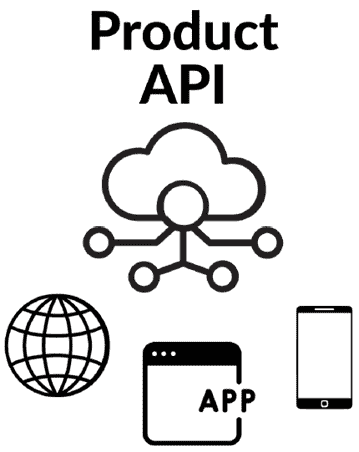

图 3.1 – BaaS

幸运的是，ASP.NET Core 9 为我们提供了一个强大的模型来创建 Web API；然而，在学习如何创建 BaaS 资源之前，我们必须了解一些基础知识。在本节的其余部分，我们将探讨一些重要的基础概念。

## HTTP 动词和约定

与 API 的通信是通过**HTTP**协议完成的，该协议有一些称为**HTTP 动词**的操作。

这些动词确定了给定资源中的意图类型。最常见的 HTTP 动词如下：

+   **GET**：此方法用于请求功能中的数据，例如只读操作；当我们输入浏览器中的 URL 时，作为响应，我们收到一个 HTML 页面。GET 也可以用来确定获取注册用户列表的意图，例如。

+   **POST**：当你发送 POST 请求时，你通常是在服务器上创建一个新的功能。此方法包括请求体中的数据。

+   **PUT**：PUT 请求用于更新功能。在这种情况下，对资源属性所做的任何更改都必须在请求体中发送，并且服务器将用发送的数据替换资源。

+   **DELETE**：DELETE 请求用于请求删除指定的功能。

+   **PATCH**：PATCH 请求用于对功能应用部分修改。与替换整个功能的 PUT 动词不同，PATCH 只更新功能的指定部分。

+   **HEAD**：这通常用于验证功能的存在性和元数据，而无需下载其内容。

+   **OPTIONS**：OPTION 请求用于描述目标功能的通信选项。它可以用来咨询服务器支持的方法和有关功能的其他信息。

动词对于确定 API 将执行哪种类型的操作非常重要。从上述列表中我们可以看到，有一些动词彼此相似，例如 POST 和 PUT。两者都可以用来创建和更新资源。然而，使用正确的动词意味着集成过程始终可以轻松理解。对于某些动词的使用没有严格的规则，但使用正确的动词是一种良好的实践。

## REST

REST 是一种架构风格，是一组约束和原则，鼓励无状态、可扩展和易于维护的 Web 服务设计。

REST 服务的特点之一是无状态通信，即客户端向服务器发出的每个请求都必须包含理解和处理请求所需的所有信息。服务器不得在请求之间存储任何关于客户端状态的信息。这确保了请求可以独立处理，使系统可扩展且易于维护。

资源的概念也存在，无论是物理对象、概念实体还是数据片段。每个资源都由一个唯一的 URL 标识。

REST 服务使用标准的 HTTP 方法来对资源执行**创建**、**读取**、**更新**、**删除**（**CRUD**）操作。每个 HTTP 方法对应于资源上的特定操作。例如，GET 用于检索数据，POST 用于创建新资源，PUT 用于更新资源，DELETE 用于删除资源。这种方法为与资源交互提供了一个统一和一致的接口。这意味着在不同的资源之间始终一致地使用相同的 HTTP 动词和方法。

HTTP 状态码非常重要，并使 API 的集成和使用变得容易。同样，HTTP 状态码使 API 响应标准化，并允许应用程序适当地处理不同的场景。

## HTTP 状态码

HTTP 状态码表示 HTTP 请求的结果，并帮助客户端理解其操作的结果。这些状态码对于客户端和服务器之间有效通信至关重要。

HTTP 状态码被分为五类：

+   信息响应（100-199）

+   成功响应（200-299）

+   重定向响应（300-399）

+   客户端错误响应（400-499）

+   服务器错误响应（500-599）

HTTP 状态码参考

您可以在此处了解更多关于状态码的信息：[`httpwg.org/specs/rfc9110.html#overview.of.status.codes`](https://httpwg.org/specs/rfc9110.html#overview.of.status.codes)。

每个状态码都有一个返回类型，可以被客户端应用程序或甚至浏览器使用。在发起 HTTP 请求时，响应有一个头部，其中包含 HTTP 状态码，甚至可能有一个主体提供关于请求响应的更多详细信息。

通常，主要使用的 HTTP 状态码如下：

+   **200 OK**：表示请求成功

+   **201 已创建**：表示资源已成功创建

+   **400 错误请求**：表示客户端请求中存在错误

+   **401 未授权**：表示客户端没有适当的认证

+   **404 未找到**：表示请求的资源不存在

+   **500 内部服务器错误**：表示服务器端存在问题

以下代码表示对 API 请求的成功响应示例：

```cs
HTTP/1.1 200 OK
Content-Type: application/json
{
    "status": "success",
    "message": "Data retrieved successfully",
    "data": {
        "id": 123,
        "name": "Example Resource",
        "description": "This is an example resource
          for the API.",
        "created_at": "2023-10-26T10:00:00Z"
    }
}
```

在这个例子中，状态码（在代码的第一行）是**200**，表示请求成功。此外，响应体中还包含更多信息。

正确使用 HTTP 状态码可以使 API 轻松集成到不同类型的系统中。随着我们使用它们创建 API，这一点将变得更加清晰。

BaaS 交付为团队提供了将每个上下文的职责分离到可以轻松集成到不同场景中的应用程序的好处。我们已经足够了解 API 的基础知识；现在是时候开始使用 ASP.NET Core 9 最小 API 创建 API 了。

## 探索最小 API

在 ASP.NET Core 9 中创建 Web 服务的一种方法是通过使用最小 API 方法，这提供了一种简单的方式来提供 API 并按需添加功能和配置。

最小 API 的简单结构允许开发者和团队以敏捷的方式提供基于 REST 的功能。

使用这种方法有许多适用场景，你选择哪种将取决于项目的规模和涉及的团队。事实上，最小 API 通常提供与基于控制器的模型相同的功能，我们将在下一节讨论。

要创建最小 API 项目，我们将基于产品管理模型。为此，我们将根据以下表格提供 API：

| **路由** | **描述** | **请求体** | **响应体** |
| --- | --- | --- | --- |
| GET /Product | 获取所有产品 | 无 | 产品数组 |
| GET /Product/{id} | 通过 ID 获取产品 | 无 | 产品对象 |
| POST /Product | 添加新产品 | 产品对象 | 产品对象 |
| PUT /Product/{id} | 更新现有产品 | 产品项 | 无 |
| DELETE /Product/{id} | 通过 ID 删除现有产品 | 无 | 无 |

表 3.1 - 产品管理操作

表 3.1 基本上映射了将在产品 API 中使用的路由，映射相应的 HTTP 动词。

我们还可以在表中看到，一些路由是相似的，只是使用的 HTTP 动词不同。这是 REST 模型中使用的约定，其中 HTTP 动词表示对给定资源的意图。

在这种情况下，资源是产品，由**/Product**路由定义。在某些情况下，**/Product/{id}**路由表示将在资源路由中添加一个参数。该参数将是资源 URL 的一部分，并将映射为 API 中要执行的方法的参数。

现在让我们创建一个最小的 API 项目并实现产品注册：

1.  打开您操作系统的命令提示符，在您选择的目录中，并运行以下代码行：

    ```cs
    dotnet new web --name ProductAPI
    ```

1.  Web 项目模板是创建空 ASP.NET Core 项目的快捷方式，它将被用作最小 API。

    将创建一个名为**ProductAPI**的文件夹，其中包含项目所需的所有文件。主文件是**Program.cs**。

1.  导航到**ProductAPI**目录，然后键入以下命令并按*Enter*：

    ```cs
    Code.
    ```

    Visual Studio Code 编辑器将出现。

1.  然后，打开**Program.cs**文件，它将具有以下结构：

    ```cs
    var builder = WebApplication.CreateBuilder(args);
    var app = builder.Build();
    app.MapGet("/", () => "Hello World!");
    app.Run();
    ```

    如我们所见，没有类的定义。这是主要的应用程序文件，是用于执行 API 的入口点。

    在文件的前两行中，我们有应用程序的定义，通过**Web 应用程序**构建器类。这个定义在*第二章*中已经介绍过，我们讨论了 ASP.NET Core 9 中项目的结构。然而，需要注意的是，应用程序将使用一些基本的配置被创建，这些配置由框架抽象化，例如过滤器和其他方面。

    此文件的另一个重要方面是**app**变量的**MapGet**方法。这是一个扩展先前创建的应用程序的方法，允许创建一个将通过 URL 使用 HTTP GET 动词访问的路由。

    此方法有一个参数定义了路由模式；在这种情况下，使用**/**，这意味着应用程序的根。第二个参数是一个操作，它使用 C#的一个特性。当请求此路由时，将执行此操作。

操作和方法

操作可以被视为内联定义的方法，由两个主要部分组成，就像方法一样：

**- 设置参数**：如有必要设置参数

**- 操作体**：将要执行的代码

操作可以被方法替代，而不是内联定义。

1.  要进行测试，只需在提示符中键入以下命令运行应用程序：

    ```cs
    dotnet run
    ```

1.  将显示包含 API URL 的日志。现在，打开**Postman**，选择**文件** | **新建标签页**，输入应用程序地址，然后点击**发送**：

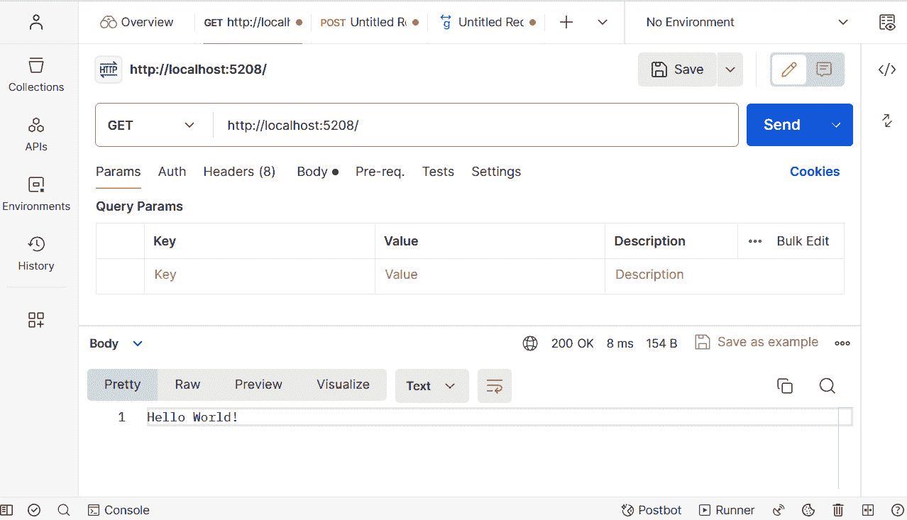

图 3.2 – 使用最小 API 获取 API 资源

如我们所见，仅仅几行代码，就实现了执行一个 API，甚至返回一个简单的**Hello World**字符串。

最小 API 提供了以简单方式快速使 API 可用，并允许根据项目的需求添加其他功能和配置的能力。这为团队带来了极大的敏捷性。

让我们向**ProductAPI**项目添加一些功能。为此，在项目的根目录中创建一个名为**Product.cs**的类。该类将根据以下代码定义：

```cs
public class Product
{
     public int Id {get; set;}
     public string Name { get; set; }
     public decimal Price { get; set; }
}
```

我们只是定义了一个将代表产品的对象。现在你需要更改**Program.cs**文件；我们将包括前面表格中列出的方法，映射 API 路由并添加到 API 方法的功能。

**Program.cs**文件将包含一些方法，如下面的示例所示：

```cs
var builder = WebApplication.CreateBuilder(args);
var app = builder.Build();
List<Product> products = new List<Product>();
app.MapGet("/Product", () => Results.Ok(products));
app.MapGet("/Product/{id}", (int id) => {
    var product = products.FirstOrDefault(p => p.Id == id);
    return Results.Ok(product);
});
app.MapPost("/Product", (Product product) => {
    if (product != null)
    {
        product.Id = products.Count() + 1;
        products.Add(product);
    }
    return Results.Ok(product);
});
app.MapPut("/Product/{id}", (int id,
  Product updatedProduct) => {
    if (updatedProduct != null)
    {
        var oldProduct = products.FirstOrDefault
          (p => p.Id == id);
        if (oldProduct == null) return Results.NotFound();
        oldProduct.Name = updatedProduct.Name;
        oldProduct.Price = updatedProduct.Price;
    }
    return Results.NoContent();
});
app.MapDelete("/Product/{id}", (int id) => {
    var product = products.FirstOrDefault(p => p.Id == id);
    if (product == null) return Results.NotFound();
     products.Remove(product);
    return Results.NoContent();
});
app.Run();
```

如我们所见，API 的创建方式与之前定义的路由表类似，遵循通过 **MapGet**、**MapPost**、**MapPut** 和 **MapDelete** 方法定义的 HTTP 动词。

有关问题的代码非常简单，创建了一个产品注册的模拟。为此，使用以下代码定义了一个变量：**List<Product> products = new List<Product>()**，该变量将在运行时包含 API 中可用的产品。

前面的代码中还描述了另一个重要的功能，即使用名为 **Results** 的实用工具类。此类在所有方法中使用，封装了返回请求的重要功能，例如在响应头中定义与请求相关的状态码。

让我们更详细地查看 POST 动词的 API。

**MapPost** 方法将 **/Products** 字符串定义为路由和操作；它期望一个产品作为参数，将其添加到列表中，并返回 **OK**（状态码 200）。

但我们如何向 API 提交一个产品？ASP.NET Core 9 有一个名为 **bind** 的概念，它处理请求并根据请求的需求创建和映射一个对象。在这种情况下，必须发送一个 JSON 格式的对象，当执行 POST 方法时，它将被映射到产品对象。

这是 ASP.NET Core 9 的一个优秀功能，它抽象了所有复杂性，并在执行路由时解决动作期望的参数。

让我们使用以下命令通过 API 添加一个产品：

1.  使用以下命令运行应用程序：

    ```cs
    dotnet run
    ```

1.  然后打开 Postman 并转到 **文件** | **新建标签页**。

1.  将方法设置为 **POST** 并添加带有 **/** **Product** 后缀的 API 地址。

1.  然后选择 *图 3.3* 中的 **Body** 选项卡。

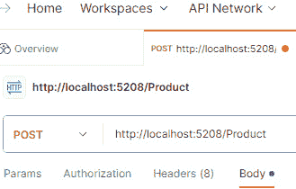

图 3.3 – 配置 POST 请求

1.  选择 **raw** 选项，然后将类型设置为 **JSON**，如 *图 3.4* 所示。

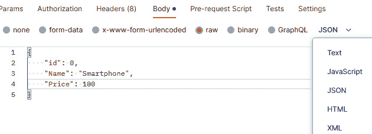

图 3.4 – 定义请求体

1.  添加以下 JSON：

    ```cs
    {
        "id": 0,
        "Name": "Smartphone",
        "Price": 100
    }
    ```

    前面的代码仅表示一个具有产品属性的 JSON 对象。这些属性在添加到项目的 **Product.cs** 类中定义。您可以通过书中提供的源代码链接查看完整代码，该链接位于 *技术要求* 部分。

1.  点击 **发送** 按钮。

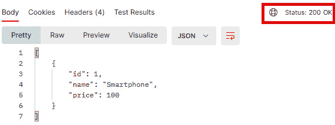

图 3.5 – POST 请求结果

因此，返回了注册的产品对象。注意在 *图 3.5* 中突出显示的 HTTP 状态码，其值为 **200**，描述为 **OK**。

当执行对 API 的 POST 调用时，ASP.NET Core 识别了一个映射到 HTTP 动词的路由。然后，它将作为请求体发送的 JSON 对象绑定到定义为 POST 请求参数的产品对象上。之后，执行动作请求，最终在内存列表中注册一个产品并返回，再次序列化为 JSON。

正如我们所学的，使用最小 API 创建 API 非常简单。仅用几行代码，就创建了一个完整的产品注册。当然，作为一个.NET 平台项目，可以定义不同的类来更好地组织项目，因为随着复杂性的增加，以及 API 数量的增加，仅在一个文件中管理所有路由将变得非常困难。

然而，尽管最小 API 支持大多数 ASP.NET Core 9 用于创建 Web API 的功能，但使用更结构化和准备好的方法来处理大型项目可能是一个很好的选择，这就是基于控制器的项目的情况，我们将在下一节中讨论。

# 使用基于控制器的方法实现 API

基于控制器的项目是另一种使用 ASP.NET Core 9 提供 API 的方法。此项目类型也实现了我们在*第二章*中学到的**模型-视图-控制器**（**MVC**）模式。

基于控制器的方法具有更完整和健壮的结构来提供任何类型的 API，因此它支持不同的业务上下文。与最小 API 一样，可以通过添加不同类型的配置和自定义来扩展 API 功能。

## 创建基于控制器的 API

要创建基于控制器的 API，你只需要在终端中输入以下代码，在所选目录中：

```cs
dotnet new webapi -n ProductMVC -controllers true
```

此命令使用**webapi**模板，默认情况下创建一个最小 API 项目。在这种情况下，我们添加了一个**-controllers**参数来指明应该使用基于控制器的方法创建 Web API。

如*图 3.6*所示，基于控制器的 API 项目结构与我们在*第二章*中学到的 MVC 非常相似。

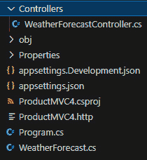

图 3.6 – 基于控制器的项目结构

与最小 API 相比，这种项目与责任分离和项目组织不同。由于每个控制器都与一个特定的资源相关联，因此不需要在**Program.cs**文件中实现所有 API 代码，这除了带来更大的可能性外，尤其是在大型项目中。

然而，配置和扩展的方法与我们关于最小 API 所学的类似；所有这些都是在**Program.cs**文件中完成的。

默认项目已经定义了一些设置，这些设置可以很容易地进行修改。以下代码来自自动创建的**Program.cs**文件：

```cs
var builder = WebApplication.CreateBuilder(args);
builder.Services.AddControllers();
builder.Services.AddEndpointsApiExplorer();
builder.Services.AddSwaggerGen();
var app = builder.Build();
if (app.Environment.IsDevelopment())
{
    app.UseSwagger();
    app.UseSwaggerUI();
}
app.UseHttpsRedirection();
app.UseAuthorization();
app.MapControllers();
app.Run();
```

在这一点上，我们将关注文件中添加的两个主要配置，它们与**AddEndpointsApiExplorer**和**MapControllers**方法有关。其他方法将在稍后讨论：

+   **AddEndpointsApiExplorer**：这是一个扩展方法，旨在注册用于公开应用程序端点信息的服务。这些信息被 API 文档生成服务（如**Swagger**）使用，我们将在下一节讨论。

+   **MapControllers**：这是一个应用程序配置，负责将添加的属性映射到控制器类中，因此自动定义 API 和路由。

这些方法使应用程序更容易适应将服务公开为 API 的需求，并使实现良好实践变得更具动态性，使任何添加和修改都更加灵活。

使用之前在最小 API 方法中创建的产品服务示例，让我们理解这个针对控制器模型调整的实现。

## 理解产品控制器

使用基于控制器的产品 API 实现遵循类定义模型。因此，每个 API 都必须有一个控制器，该控制器将负责处理每个资源的请求。

基于前面的示例，产品 API 将具有以下定义：

```cs
[ApiController]
[Route("[controller]")]
public class ProductController : ControllerBase
{
    [HttpGet]
    public IActionResult Get()
    {
      // ..
    }
    [HttpGet("{id}")]
    public IActionResult Get(int id)
    {
      // ..
    }
    [HttpPost]
    public IActionResult Post(Product product)
    {
         //..
    }
    [HttpPut]
    public IActionResult Put(int id,
      Product updatedProduct)
    {
//..
    }
    [HttpDelete]
    public IActionResult Delete(int id)
    {
     //..
    }
}
```

为了使阅读和理解这个类定义中最重要的点更加容易，一些代码块已被省略。

该类代表一个控制器，用于处理对产品 API 的请求。

让我们分析一下代码的一些细节：

+   **ApiController**：这是一个添加到类中的属性，导致它被映射为 API 控制器。这样，当将**MapController**配置添加到**Program.cs**文件时，所有标记为属性的类都将负责处理相应 API 的请求。

+   **Route**：这个属性可以在控制器（由一个类表示）或动作（由一个方法表示）中使用。它的功能是定义路由的 URL 模式。**[controller]**参数是一个在运行时自动替换的令牌，替换为不带**controller**后缀的类名。为了使路由考虑方法名，在用路由属性注解动作的情况下，必须使用**[action]**令牌。

+   **ProductController**：这是遵循 MVC 约定的类名。没有义务使用这个后缀，但这是一个好习惯，因为控制器不需要放在**Controllers**文件夹中，这样其他开发团队成员阅读起来更方便。

+   **ControllerBase**：所有控制器类都应该继承自**ControllerBase**类，这对于 API 来说是合适的。这个类提供了许多处理 HTTP 请求时有用的属性和方法。

+   **HttpGet**：此属性确定一个操作应该响应的 HTTP 动词。对于每个动词，都有一个不同的属性。在先前的示例中，有两个 GET 方法，但一个是重载，有一个参数。为了控制器知道应该请求哪个 GET 方法，必须为具有相同名称的方法定义不同的路由。在这种情况下，第二个 GET 方法有一个**{id}**参数，它将被包含在路由中，区分操作。ASP.NET Core 9 框架将负责绑定方法中的**id**参数。

如我们所见，与最小 API 的创新方法相比，一个很大的不同之处在于能够将责任分割到不同的控制器中。此外，基于控制器的方法还带来了在大项目中非常重要的其他功能，例如通过框架和其他在**ControllerBase**中可用的资源提供的各种类型的实用工具，例如绑定资源和模型验证。

## ControllerBase 实用工具

如前所述，**ControllerBase** 类具有一些属性和方法，这些属性和方法对于处理 HTTP 请求非常有用，使得 API 能够使用 REST API 的最佳实践和约定来处理请求。

通过 HTTP 进行应用程序间通信的标准非常广泛，为了正确地涵盖这个主题，可能需要一本完全致力于此主题的书。但是，让我们关注在**ProductController**类中使用的某些模式。

正如我们在本章开头所学的，API 中的请求是针对特定资源的，对于每个请求，都有一个与动词相关联的意图。每个请求都有一组信息发送到 API，例如正文和头信息。同样，在处理之后，此请求返回头信息，并且除了头信息外，还可能包含正文。响应中还定义了一个 HTTP 状态码。

此整个模式被**ControllerBase**中可用的方法抽象化，它负责处理每个请求的返回定义。

让我们分析通过**id**检索产品的 GET 方法：

```cs
 public IActionResult Get(int id)
    {
        var product = ProductService.Get(id);
        if (product is null) return NotFound();
        return Ok(product);
    }
```

此方法的目的是根据作为方法参数传递的 ID 返回一个产品。例如，此 API 可以在前端使用，用户点击产品链接以查看其详细信息。由于 API 消费者无法访问实现细节，API 需要保持一致性，以返回适当的响应。

在前述方法的情况下，如果找不到产品，将返回一个**NotFound**响应，使用 HTTP 状态码 404。这与通过浏览器尝试访问不存在的 URL 的方法相同，通常显示一个 404 消息，表明未找到资源。

另一方面，如果找到产品，将返回一个**Ok**响应，使用 HTTP 状态码 200。请注意，**Ok**方法有一个参数，正好是找到的产品。在这种情况下，此对象将以 JSON 格式序列化并返回给客户端。**Ok**方法负责序列化对象并创建响应，考虑到正文、序列化的产品对象和头信息，包括声明**Content-Type**为**application/json**。这样，客户端可以正确处理返回的消息。

除了实现 REST 标准和约定外，**ControllerBase**类还有其他几个方法，这些方法抽象了与 HTTP 协议交互的复杂性。

重要的是要注意，API 服务于不同类型的客户端，无论是准备好的前端、操作系统还是移动应用程序，它们甚至允许系统之间的集成。每个消费者对 API 实现没有任何细节，只能访问所需方法及其参数的签名以及可能的返回值。

因此，正确使用标准和约定是必要的，这可以使 API 在消费者之间保持一致性和互操作性。

更多详情

如果你想了解更多关于**ControllerBase**类的信息，请参阅以下链接中的文档：[`learn.microsoft.com/en-us/dotnet/api/microsoft.aspnetcore.mvc.controllerbase?view=aspnetcore-9.0`](https://learn.microsoft.com/en-us/dotnet/api/microsoft.aspnetcore.mvc.controllerbase?view=aspnetcore-9.0)。

ASP.NET Core 9 通过使用 API 来简化这种服务交付模型中的大部分复杂性，同时还提供了其他类型的功能，例如一致的验证模型和对象绑定。

## 与绑定一起工作

绑定是 ASP.NET Core 中可用的重要功能。它们的主要功能是将 API 请求模型转换为控制器中执行的操作。

在我们观察到的**ProductController**调用示例中，方法接收的参数是这些原始类型，例如**int**，甚至是复杂类型，例如**product**类型的对象。

每个方法或操作都有一个签名或接口，它描述了方法或操作处理所需的属性（如果有）。当你对操作发出请求并按照操作签名输入属性时，这些属性将通过 ASP.NET Core 管道执行流程进行映射，它会绑定每个输入属性的信息，考虑到其类型、属性名称和值。

例如，**product**对象具有以下属性：

```cs
public int Id {get; set;}
public string Name { get; set; }
public decimal Price { get; set; }
```

这个以 JSON 格式表示的对象可以这样定义：

```cs
{
  "id": 1,
  "name": "Smartphone",
  "price": 1000.0
}
```

如我们所见，这些对象是相同的，但表示方式不同。ASP.NET Core 负责将 JSON 格式的**product**对象转换为 C#格式的**product**对象，并按照名称映射属性。

这是框架的标准行为，但存在自定义和绑定请求不同方面的可能性。

如我们所知，一个请求包含主体、URL、查询字符串参数，以及通过表单发送的参数。在 C#中，请求有一个名为**HttpRequest**的对象抽象。你可以通过之前提到的**ControllerBase**类的**Request**属性轻松访问请求的所有属性。

如果有必要，例如，从查询字符串中获取一个值，可以使用以下代码：

```cs
string fullname1 = Request.QueryString["fullname"];
string fullname2 = Request["fullname"];
```

然而，这个相同的值也可以通过使用**FromQuery**属性提供的绑定模型从查询字符串中获取：

```cs
[HttpGet]
public IActionResult GetTasks([FromQuery]bool
  isCompleted = false)
    {
// ..
    }
```

如前述代码所示，**isCompleted**被注解为**FromQuery**属性。这样，ASP.NET 将负责将查询字符串绑定到操作参数。在这种情况下，预期查询字符串的名称与方法参数相同。但如果不是这种情况，只需使用属性重载并定义参数名称，如下所示：

```cs
public IActionResult GetTasks([FromQuery("completed")]bool
  isCompleted = false) { /**/ }
```

还可以使用其他类型的属性来执行绑定：

| **Attribute** | **HTTP verb** | **When** **to use** | **Data format** | **Example** **of use** |
| --- | --- | --- | --- | --- |
| **FromBody** | POST, PUT, PATH | 用于从请求主体绑定参数数据。它只能在每个操作方法中使用一次，因为它假设整个请求主体用于绑定到操作参数。 | JSON, XML | **[** **HttpPost]****public IActionResult Create([FromBody] Product product) { ... }** |
| **FromForm** | POST | 用于从表单字段绑定参数数据。 | 表单数据（键值对） | **[** **HttpPost]****public IActionResult Update([FromForm] ProductUpdateDto dto) { ... }** |
| **FromService** | Any | 用于直接将服务注入到操作方法中。这在无需构造函数注入的情况下获取服务时很有用。 | 依赖于注入的服务 | **public IActionResult Get([FromServices] IProductService productService) { ... }** |
| **FromHeader** | Any | 当需要从 HTTP 头中检索数据时使用。对于令牌或 API 版本控制很有用。 | 简单字符串或单个头中的逗号分隔值 | **public IActionResult Get([FromHeader(Name = "X-Custom-Header")] string value) { ... }** |
| **FromQuery** | GET | 用于从 URL 的查询字符串绑定参数。在 RESTful API 中，对于过滤或分页参数来说很理想。 | 如字符串、整数或自定义可转换为字符串的类型等简单类型 | **public IActionResult Search([FromQuery] string keyword) { ... }** |
| **FromRoute** | Any | 当参数值嵌入在 URL 路径中时使用。通常与包含资源 ID 的 REST URL 一起使用。 | 与 URL 段兼容的简单类型 | **[HttpGet("{id}")] public IActionResult GetById([FromRoute] int id) { ... }** |

这些参数中的每一个都可以用作自定义控制器中每个操作的绑定模型的一种方式。

自定义绑定

在某些情况下，ASP.NET Core 中可用的默认绑定模型可能相对于应用程序的需求有限，这通常会有其他更复杂的数据类型。因此，可以实现自定义绑定。这种实现超出了本书的范围，但您可以在以下链接中了解更多信息：[`learn.microsoft.com/en-us/aspnet/core/mvc/advanced/custom-model-binding?view=aspnetcore-9.0`](https://learn.microsoft.com/en-us/aspnet/core/mvc/advanced/custom-model-binding?view=aspnetcore-9.0)。

ASP.NET Core 中可用的绑定模型通过处理每个操作所需值的填充，抽象了许多实现复杂性。然而，没有保证参数是否正确地根据应用程序的业务规则进行了填充。为此，您需要执行验证，而 ASP.NET Core 提供了一个强大的验证模型。

## 执行验证

当谈到创建健壮的 API 时，模型验证是基本支柱之一。ASP.NET Core 9 通过 **ModelState** 使这一过程比以往任何时候都更容易、更强大，将其视为一个边境守卫，在数据进入应用程序核心之前进行检查和验证。

**ModelState** 是 ASP.NET Core 中的一个框架，用于验证数据是否符合在模型中定义的规则。如果某条数据不符合验证标准，**ModelState** 会将其标记为无效。

让我们来看看产品注册 API：

```cs
[HttpPost]
    public IActionResult Post(Product product)
    {
        if (product == null) return BadRequest();
        if (!ModelState.IsValid)
          return BadRequest(ModelState);
         // ..
    }
```

如我们所见，有一个条件用于评估 **ModelState.IsValid** 属性。如果为假，则返回一个 HTTP 状态码 400（表示请求错误），其中包含一个表示 **ModelState** 对象的正文：

```cs
{
    "Name": [
        "The field Name is required"
    ]
}
```

**ModelState** 实际上是一个字典，当以 JSON 格式序列化时，它表示为一个对象。每个对象属性代表一个已验证的属性。每个对象属性的值由包含验证结果的字符串数组表示。

为了让 **ModelState** 考虑模型是否有效，有必要用验证属性注释对象的属性；否则，验证将被忽略。

通过向 **Name** 属性添加验证，修改了产品类，如下代码所示：

```cs
public class Product
{
    public int Id {get; set;}
    [Required(ErrorMessage ="The field Name is required")]
    [MinLength(3, ErrorMessage = "The Name field must have
at least 3 characters.")]
    public string Name { get; set; }
    public decimal Price { get; set; }
}
```

如我们所见，**Name** 属性被认为是必需的，并且还必须至少包含三个字符。这样，就可以在同一个属性中组合验证属性，并且这是由 ASP.NET Core 9 提供的操作执行流程中的 **ModelState** 管理的。

验证是 API 的一部分，无论是通过添加到模型中的属性，还是通过在操作体中使用 **ModelState.AddModelError** 方法手动进行，如下例所示：

```cs
if (product.Price < 0) ModelState.AddModelError("Price",
  "The Price field cannot have a value less than zero.");
        if (!ModelState.IsValid)
          return BadRequest(ModelState);
```

其他属性

ASP.NET Core 还提供了其他一些可以用于模型验证的属性：[`learn.microsoft.com/en-us/aspnet/core/mvc/models/validation?view=aspnetcore-9.0#built-in-attributes`](https://learn.microsoft.com/en-us/aspnet/core/mvc/models/validation?view=aspnetcore-9.0#built-in-attributes)。

如我们所见，ASP.NET Core 9 为管理 API 使用的模型状态提供了一个出色的功能，无论是使用参数还是对象，都使我们能够在应用程序的端点上以丰富的方式进行验证，同时为我们提供了一个简单的方式来维护信息的完整性。

这些功能在使用文档、响应格式化和错误管理等方法的帮助下变得更加强大。因此，在下一节中，我们将看到如何使 API 对消费者更加一致。

# 与文档一起工作

API 是通过服务传递应用程序业务模型的有力资源，为了使 API 项目得到适当提供，添加标准化与客户交互模型的功能非常重要。

为了实现这一点，每个 API 都必须进行文档化，使客户了解哪些资源可用以及如何进行此文档化。

因此，让我们学习如何通过 Swagger 的 NuGet 包自动从 API 功能文档中获益，该包实现了 OpenAPI 规范。

## 使用 Swagger 记录 API

客户端和其他应用程序通过 HTTP 协议使用 API，其中存在请求和响应。为了使这种通信发生，有必要了解 API 提供的内容，在这种情况下，哪些方法是可用的，以及使用哪些契约来建立连接。

要做到这一点，我们必须建立一个关于 API 提供的资源（如方法、HTTP 动词、参数和主体）的知识来源。为了实现这一目标，有必要拥有文档。

然而，这种文档需要是动态的，因为在开发过程中，API 可以不断变化，增加功能或新特性。对每一部分文档进行更改并将其发送给所有 API 消费者将是劳动密集型的。

ASP.NET Core 9 仍然支持 Swagger 来提供 API 文档。然而，与之前的版本不同，Swagger 现在不再是项目模板的一部分。新项目现在可以支持基于控制器和最小 API 应用程序的 OpenAPI 文档生成。OpenAI 规范提供了一种编程语言无关的 API 文档方法。因此，ASP.NET Core 9 通过 **Microsoft.AspNetCore.OpenAI** 包内置了对生成应用程序中端点信息的支持，避免了对外部库的依赖。

因此，为了拥有文档以及使用 UI 测试 API 的体验，我们将 API 项目与 Swagger 集成，Swagger 是一套易于使用的 API 开发者工具，除了实现 OpenAPI 规范标准之外。

OpenAPI 规范

OpenAPI 规范是 Linux 基金会的一部分，旨在指定 RESTful 接口，以简化 API 的开发和消费。您可以在 [`spec.openapis.org/oas/latest.html`](https://spec.openapis.org/oas/latest.html) 了解更多关于 OpenAPI 的信息。

要了解更多关于 ASP.NET Core 9 OpenAPI 的信息，请访问以下网址：[`learn.microsoft.com/en-us/aspnet/core/fundamentals/openapi/overview?view=aspnetcore-9.0`](https://learn.microsoft.com/en-us/aspnet/core/fundamentals/openapi/overview?view=aspnetcore-9.0)

当将 Swagger 集成到您的 API 解决方案中时，Swagger 在 OpenAPI 格式下充当规范生成器，该格式基于 JSON 文件，其中描述了您应用程序中所有可用的 API：

```cs
{
  "openapi": "3.0.1",
  "info": {
    "title": "API V1",
    "version": "v1"
  },
  "paths": {
    "/api/Todo": {
      "get": {
        "tags": [
          "Todo"
        ],
        "operationId": "ApiTodoGet",
        "responses": {
          "200": {
            "description": "Success",
            "content": {
              "text/plain": {
                "schema": {
                  "type": "array",
                  "items": {
                    "$ref": "#/components/schemas/ToDoItem"
                  }
                }
              },
              "application/json": {
                "schema": {
                  "type": "array",
                  "items": {
                    "$ref": "#/components/schemas/ToDoItem"
                  }
                }
              },
              "text/json": {
                "schema": {
                  "type": "array",
                  "items": {
                    "$ref": "#/components/schemas/ToDoItem"
                  }
                }
              }
            }
          }
        }
      },
      "post": {
        …
      }
    },
    "/api/Todo/{id}": {
      "get": {
        …
      },
      "put": {
        …
      },
      "delete": {
        …
      }
    }
  },
  "components": {
    "schemas": {
      "ToDoItem": {
        "type": "object",
        "properties": {
          "id": {
            "type": "integer",
            "format": "int32"
          },
          "name": {
            "type": "string",
            "nullable": true
          },
          "isCompleted": {
            "type": "boolean"
          }
        },
        "additionalProperties": false
      }
    }
  }
}
```

前面的 JSON 描述了 API 可用的资源、响应模式以及可用的动词，以及 API 中使用的对象预测。

要将 Swagger 集成到项目中，我们必须在项目目录中运行以下命令行命令，添加 Nuget 包：

```cs
dotnet add package Swashbuckle.AspNetCore
```

接下来，我们必须更改 Program.cs 文件。我们将为此配置 Product MVC 项目，您可以在下面的代码中分析添加 Swagger 后的更改：

```cs
var builder = WebApplication.CreateBuilder(args);
builder.Services.AddControllers();
builder.Services.AddEndpointsApiExplorer();
builder.Services.AddSwaggerGen();
var app = builder.Build();
if (app.Environment.IsDevelopment())
{
    app.UseSwagger();
    app.UseSwaggerUI();
}
app.UseHttpsRedirection();
app.UseAuthorization();
app.MapControllers();
app.Run();
```

实现包括以下内容：

+   第 4 行通过 **builder.Services.AddSwaggerGen()** 方法添加了 Swagger 生成服务。

+   在第 6 行和第 10 行之间，我们通过 **app.UseSwagger()** 方法将 Swagger 添加到 ASP.NET 执行管道中，并通过 **app.UseSwaggerUI()** 方法提供 UI。这些方法仅在应用程序以开发模式运行时执行，**if (app.Environment.IsDevelopment)**。

当运行应用程序时，只需通过带有 swagger 后缀的 API 链接访问，如图 *图 3.7* 所示：

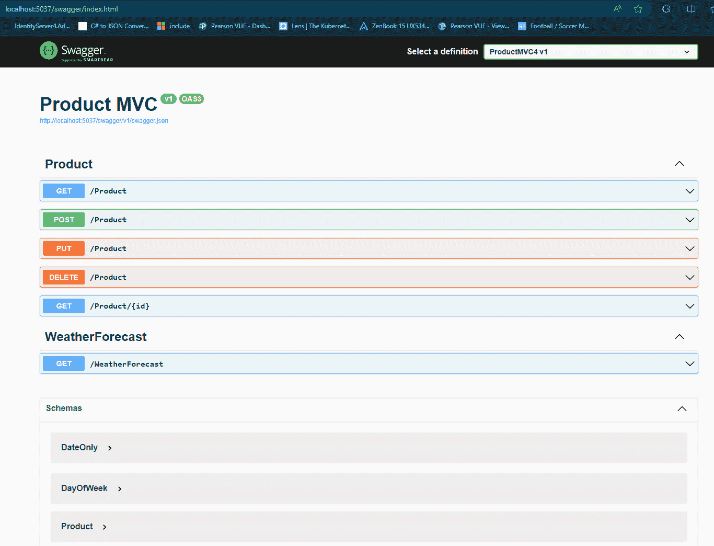

图 3.7 – 产品 MVC API 的 Swagger UI

查看 *图 3.7* ，我们可以看到产品 API 中可用的方法在 UI 中列出，以及 API 上工作的对象规范。不需要对源代码进行任何更改。

Swagger 识别源代码中可用的控制器和操作，生成规范，并随后生成 UI。然而，可以在文档中添加更多详细信息，以丰富 API 使用模型。让我们更详细地看看如何使用 Swagger 包中提供的功能来改进文档。

### 改进文档

如我们之前所学的，Swagger 默认添加到 ASP.NET Core 9 API 项目中，并自动生成一个包含 API 使用详情的最小版本的 UI，通过读取控制器和操作来推断数据。

正如我们在*图 3.8*中可以看到的那样，要添加产品，必须提供作为请求体的 JSON；此外，我们还有一个包含 HTTP 状态码 200 的响应描述，该状态码表示成功。

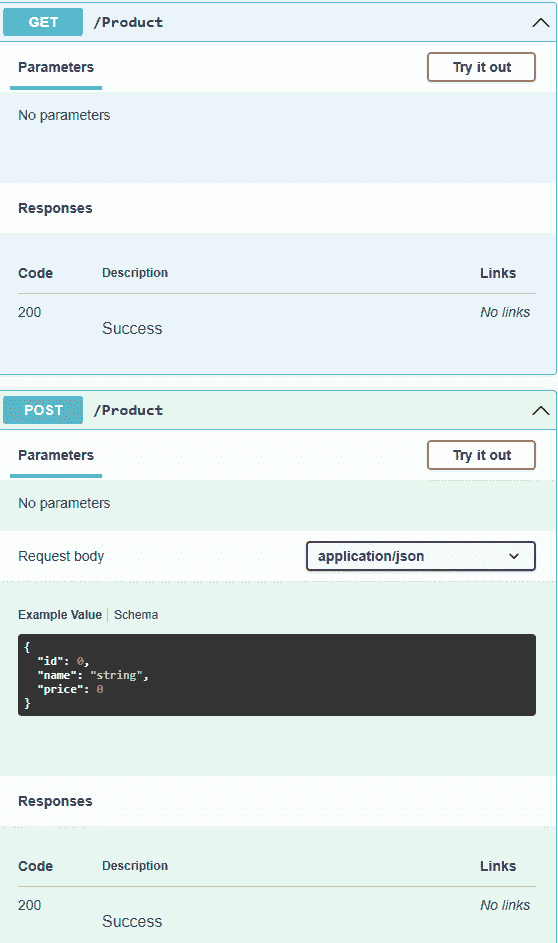

图 3.8 – API 的文档详情

然而，如果我们查看 POST 方法代码（通过书中提到的*技术要求*部分中可用的**ProductController**类提供），该代码用于注册产品，没有明确定义 HTTP 状态码 200：

```cs
[HttpPost]
    public IActionResult Post(Product product)
    {
        if (product == null) return BadRequest();
        if (product.Price < 0)
          ModelState.AddModelError("Price",
          "The Price field cannot have a value less
          than zero.");
        if (!ModelState.IsValid)
          return BadRequest(ModelState);
        product.Id = ProductService.Products.Count() + 1;
        ProductService.Add(product);
        return CreatedAtAction(nameof(Get),
           new {id = product.Id}, product);
    }
```

此方法返回两种可能的 HTTP 状态码，分别是 400，由调用**BadRequest**方法表示，以及 201，由**CreatedAtAction**方法表示。

正如我们在*图 3.8*中可以看到的那样，有一个标记为**试一试**的按钮。点击此按钮后，UI 将准备就绪，以便可以添加请求体，在这种情况下，将是一些表示产品和其相应属性的 JSON。修改 JSON 以添加新产品，定义属性如*图 3.9*中提出的示例。

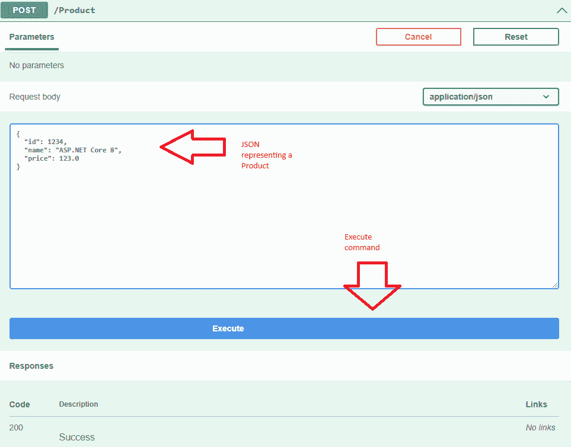

图 3.9 – 从 Swagger UI 运行 API 请求

在定义请求体之后，点击**执行**按钮。只需确保你的应用程序正在运行。

执行结束后，Swagger UI 显示 API 响应，正如我们可以在*图 3.10*中清楚地看到的那样，我们有一个 HTTP 状态码 201，以及新注册产品的 JSON 和一些头部信息。

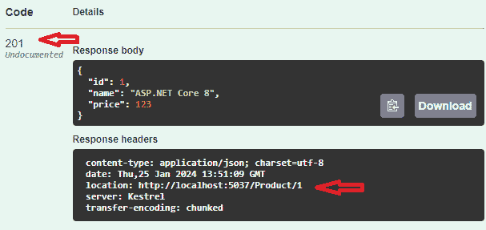

图 3.10 – Swagger API 响应屏幕

**CreatedAtAction**方法创建一个带有 HTTP 状态码 201 的响应，并在头部添加一个链接，用于通过 GET 方法访问创建的资源，如前图所示，地址为**http://localhost:5037/Product/1**。这个地址可能因你环境中的执行地址而异。

这种类型的返回是良好的实践，遵循 REST 协议中定义的标准。然而，尽管在我们展示示例的上下文中这不是一个主要问题，API 消费者必须清楚如何消费以及期望得到什么，以便正确处理每个响应。在产品注册方法的情况下，没有信息意味着此方法也会返回错误状态，这可能会对 API 消费者造成一些不合规。

为了调整这种行为，我们必须使用 ASP.NET Core 9 提供的属性，如 **ProducesResponseType** 和 **Consumes**，向 API 方法添加更多信息。

**ProducesResponseType** 属性用于确定将作为响应返回的 HTTP 状态码的类型以及返回的内容类型。此属性还可以用于泛型版本，指定返回类型。

**Consumes** 属性确定 API 期望的内容类型。内容被定义为媒体类型，完整的列表可以通过 **System.Net.Mime** 命名空间中可用的 **MediaTypeNames** 类获得。

让我们分析通过添加属性的新实现的 POST 方法：

```cs
[HttpPost]
[Consumes(MediaTypeNames.Application.Json)]
[ProducesResponseType<Product>(StatusCodes
  .Status201Created)]
[ProducesResponseType(StatusCodes.Status400BadRequest)]
    public IActionResult Post(Product product)
    {
        // code omitted for readability
    }
```

如前述代码所示，**ProducesResponseType** 属性可以根据需要添加多次，以表示不同的返回类型。在此示例中，报告了 HTTP 状态码 201，用于创建的项目，以及一个带有 HTTP 状态码 400 的返回类型。

当再次运行应用程序时，我们可以观察到对代码所做的更改以及根据 *图 3.11* 自动生成的 Swagger UI：

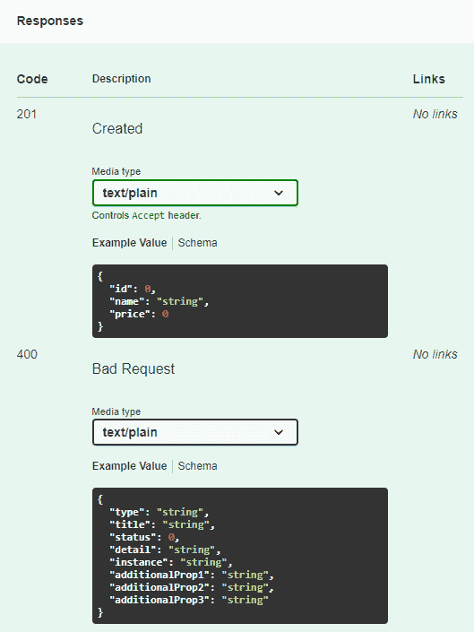

图 3.11 – API 响应文档

现在我们已经有了关于产品控制器 POST 方法所涉及方面的正确文档，这使得 API 能够通过考虑替代响应流程来适当消费。

XML 注释

除了添加到 API 方法的属性之外，还可以使用 XML 注释为每个方法提供作为 Swagger UI 文档的一部分。为此，需要配置项目，以便在编译过程中生成文档 XML，并在 Swagger UI 中获取。您可以在以下地址找到此配置的完整说明：[`learn.microsoft.com/en-us/aspnet/core/tutorials/getting-started-with-swashbuckle?view=aspnetcore-9.0&tabs=visual-studio#xml-comments`](https://learn.microsoft.com/en-us/aspnet/core/tutorials/getting-started-with-swashbuckle?view=aspnetcore-9.0&tabs=visual-studio#xml-comments)。

除了能够使用 ASP.NET Core 9 创建高质量的 API 之外，我们还拥有丰富的 API 文档界面支持，以及执行请求和获取有关请求参数和响应的更多细节的选项。

理解这种文档方法将极大地帮助您生成可以集成到不同系统和环境中的高质量服务。随着我们进入接下来的几章，我们将进一步研究 API、文档以及其他技术，如数据库连接的使用。

# 摘要

在本章中，我们深入探讨了通过 HTTP 提供的 API 的世界，发现了它们为各种客户端提供服务的能力。在 ASP.NET Core 的强大支持下，我们学习了如何充分利用这一潜力，了解了诸如使用最小 API 快速高效地创建 HTTP API 等方法。我们还探讨了使用基于控制器的项目创建健壮 API 的过程。我们还考察了涉及 API 的其他方面，例如文档。在下一章中，我们将继续探索 ASP.NET Core 9 的特性，了解如何使用 SignalR 开发实时应用程序。
