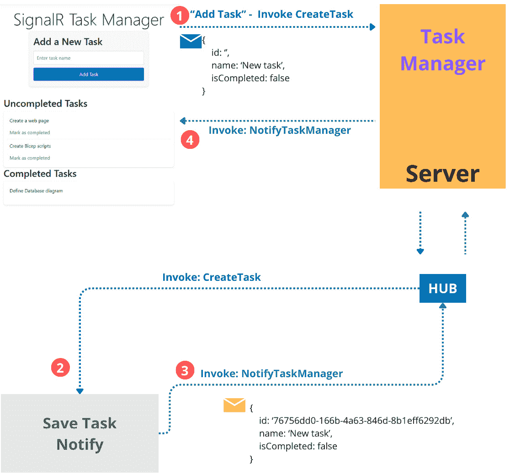

# 使用 SignalR 进行实时交互

作为 ASP.NET Core 9 的一部分，Web API 是一个用于构建 HTTP 服务的框架，可以为网页消费和移动应用提供。.Net Core 平台提供的结构为 API 的开发提供了高质量和性能。在本章中，我们将更多地了解 WebAPI，包括通过服务提供解决方案的标准、约定和最佳实践。

我们将致力于创建一个实时任务管理应用，我们将使用.NET 平台和 SignalR 提供的各种技术来了解概念，并实现使用流概念的示例应用程序。我们还将探讨在服务器上托管 SignalR 应用的前提条件。

在本章中，我们将涵盖以下主要主题：

+   什么是 SignalR？

+   理解服务器和客户端的概念

+   与流式处理一起工作

+   托管 ASP.NET Core SignalR 应用

# 技术要求

本章中使用的代码示例可以在本书的 GitHub 仓库中找到：

[`github.com/PacktPublishing/ASP.NET-Core-9.0-Essentials/tree/main/Chapter04`](https://github.com/PacktPublishing/ASP.NET-Core-9.0-Essentials/tree/main/Chapter04)

# 什么是 SignalR？

正如我们在前面的章节中学到的，基于 Web 的应用有两个部分：客户端和服务器。

**浏览器**通常代表客户端，用户与应用程序进行交互。应用程序在服务器上执行操作以处理信息并返回响应。

这个过程基于两个阶段，即**请求**和**响应**。这两个阶段按顺序发生。每当客户端和服务器之间发生交互时，就会创建一个新的通信过程。

大多数 Web 应用都有这些功能，对于大多数商业环境来说已经足够。然而，在某些场景中，需要**实时通信模型**，其中应用程序处理的信息是不断更新的。这为用户提供即时响应，丰富了可用性和某些功能需求。

一个很好的实时应用的例子，比如，一个地图应用，用户可以在给定的路线上获得交通信息，并被告知任何影响导航的方面。此外，其他类型的应用，如游戏、社交网络，甚至是协作网络文本编辑器，都依赖于对用户的持续更新。

要开发包含实时功能的应用程序，服务器和客户端需要能够在活动通道上持续通信。

.NET 平台有 SignalR。这是一个库，它以简化的方式增加了构建实时解决方案的能力，立即允许客户端和服务器之间进行持续的通信。


图 4.1 – SignalR 组件

正如你所见，*图 4.1* 展示了 SignalR 的多数组件，这些组件抽象了客户端和服务器之间的通信模型。客户端和服务器之间的通信通过一个活跃的连接进行，使用传输技术传输 JSON 或二进制消息。WebSockets 是 SignalR 使用的标准通信技术。其他两种选项作为后备使用。换句话说，如果 WebSockets 不受支持，将立即使用服务器发送事件或长轮询。传输的优先级顺序与以下列表中建立的顺序相同：

1.  **WebSockets**：它提供了建立 *全双工连接* 的能力，即允许客户端和服务器之间进行持续的通信。

1.  **服务器发送事件**：它从服务器到客户端建立一个 *单向连接*。客户端没有能力通过相同的连接向服务器发送消息，需要单独的 HTTP 请求。

1.  **长轮询**：这是一种更基本的技巧，客户端向服务器发送消息。服务器不会立即发送消息，而是处理信息，并在完成后才返回响应。

SignalR 抽象了传输的选择，使得在必要时只使用 WebSocket 成为可能。

客户端和服务器之间的连接依赖于一个重要的组件，称为 Hub。Hub 是一个特殊对象。它是 SignalR API 的一部分，充当代理，允许服务器和客户端之间的通信，其中服务器可以通过使用 **RPC**（**远程** **过程调用**）在客户端远程执行函数或方法。

RPC

RPC 是一种自 1970 年以来就存在的通信协议，它是目前存在的一些创新（如 Google 开发的高性能通信模型 gRPC）的基础。你可以在 [`en.wikipedia.org/wiki/Remote_procedure_call`](https://en.wikipedia.org/wiki/Remote_procedure_call) 找到更多关于 RPC 的信息。

SignalR 抽象了连接和通信管理的所有复杂性，同时带来了其他功能，例如向所有已连接客户端、特定客户端或一组客户端发送通知。此外，API 可以与 .NET 应用程序（包括控制台、Java 和 JavaScript）一起使用。

例如，可以有一个与在 .NET 或甚至 Java 平台上开发的控制台应用程序通信的服务器。

起初可能看起来很复杂，但当我们了解主要概念和良好实践时，我们将了解到 SignalR 库是多么强大。让我们探索一些涉及 SignalR 的概念、模式和良好实践，以及如何使用这个库开发实时应用。

# 理解服务器和客户端的概念

如我们之前所学，SignalR 是一个强大的库，它抽象了创建实时应用的大部分复杂性。

然而，了解与使用 SignalR 库相关的概念和标准对于充分利用其功能非常重要。

如我们所知，Web 应用程序基本上有两个主要组件，客户端和服务器。同样，使用 SignalR 的实时应用程序也需要客户端和服务器组件。我们将通过任务管理应用程序了解这些组件如何相互交互。

## 使用任务管理应用程序进行工作

任务管理应用程序将使用 **Razor Pages** 技术创建，并具有以下功能：

+   实时实现概念

+   创建任务

+   完成任务

+   查看创建的任务

+   查看已完成任务

所有功能都将使用 Visual Studio Code 解决。JavaScript 将用于在客户端处理功能，而 C# 将用于服务器端。

我们可以在 *图 4.2* 中看到应用程序中使用的主要组件的概述：


图 4.2 – TaskManager 应用程序组件

如我们在 *图 4.2* 中所见，我们将使用一些重要的组件，这些组件将在应用程序中使用。

客户端将使用 Razor Pages 实现，旨在允许用户与应用程序功能进行交互：

+   **index-page.js** 文件将负责管理服务器与应用程序主页面之间的交互。

+   **signalr.js** 文件是 SignalR JavaScript SDK 的一部分。

+   服务器是作为协调服务器运行的 Razor Page 应用程序。

+   Hub 实现将负责管理服务器和客户端之间的实时通信。

在创建项目时，我们将解释每个组件的工作原理和实现细节。现在，让我们从创建项目开始。

我们将关注创建任务管理器项目的关键活动。然而，您可以在书中提到的 GitHub 仓库中查看解决方案的完整实现，该仓库在 *技术要求* 部分中提及。以下是我们将遵循的步骤：

1.  要创建项目，请在您选择的目录中打开终端并运行以下命令：

    ```cs
    dotnet new webapp -o TaskManager
    ```

1.  将创建一个名为 **TaskManager** 的新文件夹，包含整个项目结构。使用以下命令访问此页面：

    ```cs
    cd TaskManager
    ```

1.  现在项目已创建，我们需要添加 SignalR JavaScript SDK。不需要将 SDK 添加到服务器，因为它在创建项目时自动添加，作为 .NET 平台的一部分。

由于我们使用 Razor Pages，客户端和服务器将位于同一项目中。然而，我们可以在 Asp.NET Core 9 中创建一个 **单页应用程序** ( **SPA** ) 解决方案和 WebAPI，并执行相同的步骤。

我们将继续使用 Razor 页面，并转到 SignalR JavaScript SDK 的安装。我们将使用一个名为**LibMan**的工具，它是来自 Microsoft 的**命令行界面**（**CLI**），负责管理客户端库。其操作类似于**Node Package Management**（**NPM**）。

使用它之前，建议卸载操作系统上存在的任何先前版本。因此，我们将遵循以下步骤：

1.  按顺序运行以下命令来安装工具：

    ```cs
    dotnet to LibraryManager.Cli ol uninstall -g Microsoft.Web.
    dotnet tool install -g Microsoft.Web.LibraryManager.Cli
    ```

1.  接下来，我们将运行命令来安装 SignalR SDK。运行以下命令并检查应用程序的主目录：

    ```cs
    libman install @microsoft/signalr@latest -p unpkg -d wwwroot/js/signalr --files dist/browser/signalr.js
    ```

    之前的命令避免了安装**@microsoft/signalr@latest**库，然后只向应用程序目录添加了必要的脚本。

在此刻，项目正在创建并准备接收实时功能的实现。我们必须首先创建中心节点（Hub）并配置应用程序。

## 创建中心节点（Hub）

中心节点（Hub）是实现 SignalR 最重要的组件之一。它充当一个代理，管理所有客户端与服务器之间的连接，并允许客户端和服务器相互通信以实时执行方法。

对于我们的**TaskManager**应用程序，我们的第一个任务将是创建一个中心节点（Hub）并为其准备与客户端通信。为此，仍然在终端和应用程序目录中，输入以下命令：

```cs
code .
```

此命令将在应用程序目录中打开一个 VS Code 实例。

在项目根目录下创建一个名为**Hubs**的文件夹，然后创建一个名为**TaskManagerHub.cs**的文件。

项目类将有两个方法，其代码如下：

```cs
public class TaskManagerHub : Hub
  {
    public async Task CreateTask(TaskModel taskModel)
    {
       // ..
    }
    public async Task CompleteTask(TaskModel taskModel)
    {
       // ..
    }
  }
```

需要注意的第一个细节是继承自**Hub**类。**Hub**类是一个超类，它抽象了所有连接管理和与客户端的交互，这些功能通过**Microsoft.AspNetCore.SignalR**包提供。所有自定义**Hub**类都必须从这个类继承。

接下来，我们有**CreateTask**和**CompleteTask**方法。这些方法将通过客户端调用，并同时将在客户端上调用方法。

**CreateTask**方法接收一个名为**TaskModel**的类作为参数。此类已被拆分到**Model/TaskModel.cs**目录中：

```cs
public class TaskModel
  {
    public Guid Id { get;  } = Guid.NewGuid();
    public string Name { get; set; }
    public bool IsCompleted { get; set; }
    public TaskModel()
    {
       IsCompleted = false;
    }
    public TaskModel(string name) : this()
    {
      Name = name;
    }
    public TaskModel(string name, bool isCompleted)
    {
      Name = name;
      IsCompleted = isCompleted;
    }
  }
```

如我们所见，**TaskModel**类只有几个基本属性，如**Id**、**Name**和**IsCompleted**，它们代表一个任务。

客户端和服务器之间的通信是通过传输策略完成的，如前所述，通常使用 WebSockets。传输的信息以 JSON 或二进制格式序列化。然而，二进制数据，通常用于音频、图像和视频，不受支持。只传输文本数据。

现在，让我们看看**CreateTask**方法的完整实现：

```cs
public async Task CreateTask(TaskModel taskModel)
  {
    _taskRepository.Save(taskModel);
    await Clients.All.SendAsync(ClientConstants
      .NOTIFY_TASK_MANAGER, taskModel);
  }
```

上述代码执行了两个基本步骤：

+   **持久化任务**：**_taskRepository**属性是一个抽象与持久化层通信的接口。对于这个持久化项目，它是在内存中完成的，并且这个实现的完整代码可以在书的 GitHub 仓库中找到（见*技术* *要求*部分）。

+   **通知客户**：**Hub**基类有一个**Client**属性，具有一些功能。在代码示例中，正在向所有连接到**Hub**的潜在客户端发送通知。**SendAsync**方法有 10 种不同变体的重载。然而，对于前面的代码，使用了两个主要参数。第一个参数涉及将处理 Hub 响应的客户端方法名称，而第二个参数是本身将被发送到客户端的任务对象。

常量是最佳实践

正如我们在**SendAsync**方法中提到的，第一个参数引用了一个常量。这是一个好习惯，因为需要知道将通过服务器进行的通信处理的方法名称。由于它是一个字符串，很容易出错。在必要时使用常量来集中包含方法名称的字符串。这将有助于维护和改进。

随着 Hub 的部署完成，现在需要配置应用程序以通过 SignalR 处理通信。

## 准备服务器应用程序

应用程序需要配置以能够处理客户端和服务器之间的连接性。没有这一步，Hub 将没有用处。

要做到这一点，我们需要更改**Program.cs**文件中的代码并添加一些重要的代码行。

我们必须在应用程序容器中配置 SignalR 服务并映射客户端将用于建立连接的 Hub 端点。

在更改完成后，文件应类似于以下代码：

```cs
using TaskManager.Hubs;
using TaskManager.Service;
using TaskManager.Service.Contract;
var builder = WebApplication.CreateBuilder(args);
// Add Razor Page services to the container.
builder.Services.AddRazorPages();
//Add SignalR Services
builder.Services.AddSignalR();
// ..
var app = builder.Build();
// Some codes have been omitted to facilitate learning
app.MapRazorPages();
// Add Hub Endpoint
app.MapHub<TaskManagerHub>("/taskmanagerhub");
app.Run();
```

非常重要的是要遵循设置顺序。在**builder.Services.AddSignalR()**方法被添加到**var app = builder.Build()**行之前。同样，Hub 路由映射是在**app.MapRazorPages()**语句之后添加的。

需要注意的是，Hub 路由的映射，配置为**/taskmanagerhub**。Hub 路由定义遵循相同的 REST API 模式，并且将使用此相同的路由，以便客户端应用程序能够与服务器建立连接。客户端将使用之前安装的 SignalR JavaScript SDK 连接到 Hub。

Hub 已配置并准备好接收连接。现在，是时候配置客户端了。

## 准备客户端应用程序

在配置好 Hub 后，我们必须向客户端应用程序添加必要的功能。为此，我们将使用**Pages/index.cshtml**页面并创建 JavaScript 代码，该代码将协调客户端和服务器之间的所有交互。

将**Index.cshtml**页面的全部内容更改为以下代码：

```cs
@page
@model IndexModel
@{
    ViewData["Title"] = "Home page";
}
<div class="text-center">
    <h1 class="display-4">SignalR Task Manager</h1>
</div>
<div class="task-form-container">
    <h2>Add a New Task</h2>
    <form method="post" class="task-form">
      <input type="text" id="taskName"
        placeholder="Enter task name"
        class="task-input"/>
      <input type="button" value="Add Task"
        id="addTaskButton" class="task-submit"/>
    </form>
</div>
<div class="tasks-container">
    <h2>Uncompleted Tasks</h2>
    <div class="tasks-list" id="uncompletedTaskList">
      </div>
    <h2>Completed Tasks</h2>
    <div class="tasks-list" id="completedTaskList">
    </div>
</div>
@section Scripts {
    <script src="img/signalr.js"
      asp-append-version="true"></script>
    <script src="img/index-page.js"
      asp-append-version="true"></script>
}
```

可用的 HTML 代码相当简单，只需添加一个包含一个用于命名任务的字段和一个负责将新任务发送到服务器的按钮的表单。

此外，还有两个列表（已完成任务和未完成任务）将根据用户交互显示。我们没有在 HTML 元素中使用任何 Razor Pages 指令，因此不需要对 **Index.cshtml.cs** 文件进行任何更改。

重要的是要注意，为了便于理解客户端、服务器以及 SignalR 的概念，我们正在使用一个 Razor Pages 应用程序。然而，可以采用另一种称为 SPA 的方法，这使得可以使用 Angular、React 或 VueJS 等框架在 JavaScript 和 HTML 中创建应用程序，这些应用程序在客户端运行并与服务器交互。

SPA

**TaskManager** 应用程序使用 Razor Pages 来简化 SignalR 概念的解释，将客户端和服务器集中在同一个项目中。然而，SignalR 可以安装在一个单独的应用程序中，该应用程序使用纯 JavaScript、TypeScript 或任何框架，例如 Angular、Vue.js 等。此外，SPA 概念是开发实时功能的一个很好的实践。否则，如果浏览器正在加载多个页面，每次新的请求都会与服务器建立一个新的连接。SPA 使得在使用 SignalR 时，可以在保持相同连接的同时动态渲染应用程序页面。

注意，HTML 代码使用了一个 **@section Scripts {}** 指令，其中添加了之前安装的 SignalR 库和我们将创建的 JavaScript 文件。这个部分是在 **Pages/Shared/_Layout.cshtml** 文件中定义的，正如我们在 *第二章* 中所学的。

在 **wwwroot/js/index** 目录中创建一个 **index-page.js** 文件。该文件的全部内容可在本书的代码库中的应用程序源代码中找到。

让我们关注建立与 Hub 连接的最重要几点。为此，我们基本上需要三个主要步骤：

1.  创建一个连接对象。

1.  映射事件。

1.  启动连接。

这三个步骤在以下代码中定义：

```cs
var connection = new signalR.HubConnectionBuilder()
  .withUrl(HUB_URL).build();
connection.on(NOTIFY_TASK_MANAGER_EVENT, updateTaskList);
connection.start().then(function () {
     addTaskButton.disabled = false;
}).catch(function (err) {
     return console.error(err.toString());
});
```

在第一行，我们使用 SignalR 对象创建了一个连接对象。请注意，**withUrl(HUB_URL)** 方法使用一个必须包含 Hub URL 值的常量。由于我们使用 Razor Pages，客户端和服务器将通过相同的地址可用，在这种情况下，我们可以输入一个相对 URL，例如 **/taskmanagerhub**。这个 URL 正是之前在服务器上映射的端点。

接下来，我们有事件实现，它将处理来自服务器的返回。在这种情况下，我们使用连接对象的**on**方法。此方法接收两个参数，第一个是一个表示事件的字符串。在这种情况下，**NotifyTaskManager**值被设置为常量。**updateTaskList**方法将处理返回。我们可以使用内联函数。然而，为了便于维护，我们创建了一个具有以下签名的单独函数：

```cs
function updateTaskList(taskModel) {
    //Code
}
```

这个函数可以具有任何名称和不同类型的参数。然而，Hub 中可用的方法会将一个**TaskModel**对象作为参数发送给客户端。此对象将被序列化为 JSON 或二进制格式，SignalR 会将它添加到对应于处理此返回的事件中。

**updateTaskList**函数只是获取返回的对象，并使用 JavaScript 动态地将完成的或未完成的任务列表馈入 HTML。

最佳实践

在客户端和服务器上使用对象作为方法参数是一种良好的实践。这防止了在输出和输入参数修改时需要更改应用程序中的方法签名。使用对象简化了客户端和服务器之间的信息流量。

重要的一点是，事件名称在客户端和服务器上必须相同，因此使用常量来便于维护和编写。

第三步是通过连接对象的**Start**方法启动连接。**Start**方法传递一个在连接建立后触发的承诺。此外，还可以实现**catch**方法，用于映射以及在尝试与 Hub 连接时可能出现的任何错误。

现在是时候给**添加任务**按钮添加**点击**事件了，该事件将负责根据以下代码请求添加新任务：

```cs
var addTaskButton = document
  .getElementById("addTaskButton");
addTaskButton.addEventListener("click", function (event) {
    let taskName = document.getElementById(TASK_NAME_ID);
    connection.invoke(HUB_ADD_TASK_METHOD,
      { name: taskName.value }).catch(function (err) {
        return console.error(err.toString());
    });
    taskName.value = "";
    taskName.focus();
    event.preventDefault();
});
```

上一段代码通过**connection.Invoke()**函数请求服务器，该函数具有在 Hub 中可用的方法名称，以及一个通过用户输入定义名称的**TaskModel**对象作为参数。

我们目前拥有**TaskManager**应用程序实现实时功能所需的所有必要要求。尽管这可能看起来很复杂，但方法很简单，需要客户端了解服务器上的方法，以及服务器了解客户端上可以执行的事件。

让我们更详细地分析应用程序执行流程。

## 理解客户端和服务器通信流程

在正确配置了 Hub 和客户端之后，现在是时候了解通信流程将如何工作了。创建任务的流程根据*图 4* *.3* 表示：



图 4.3 – 使用 SignalR 在客户端和服务器之间进行通信

*图 4* *.3* 中所示的步骤简单地说明了整个应用程序的通信流程。让我们了解每个步骤：

1.  在输入任务名称后，用户点击**添加任务**按钮。按钮的点击事件通过 Hub 请求服务器上的**CreateTask**方法，通过连接传递一个**TaskModel**对象，其中**Name**属性被定义为参数。对服务器端方法的调用是通过之前与 Hub 建立的连接完成的。

1.  在收到对**CreateTask**方法的请求后，Hub 然后处理任务，通过**Save**方法将其添加到内存中的列表中，该方法向**Id**和**IsCompleted**属性添加值。

1.  然后，Hub 在客户端上调用**NotifyTaskManager**方法，并将创建的**TaskModel**对象作为参数传递。

1.  客户端执行处理服务器通知的方法。此方法在 SignalR 连接对象中实现，并更新应用程序屏幕，显示已创建的任务列表和已完成任务的列表。

在本节中，我们学习了 SignalR 的主要概念，用于在客户端和服务器之间实现实时通信。这些概念可用于不同类型的应用程序，例如聊天应用、在线商店中的订单状态更新等。然而，在某些情况下，我们必须在客户端和服务器之间使用恒定的数据发送模型，这取决于另一个可以通过使用流式传输实现的同步模型。这个概念在仪表板和新闻源等应用程序中广泛使用。在下一节中，我们将了解流式传输是如何工作的。

# 与流式传输一起工作

在 SignalR 的上下文中，流式传输是一种强大的方式，可以从服务器向客户端发送数据，反之亦然，以连续流的形式。与传统请求/响应模型不同，其中数据以单个批次发送，流式传输允许数据持续流动，这对于涉及实时更新的场景特别有用，例如实时流、仪表板或甚至聊天应用。

SignalR 的流式传输具有几个重要特性，使其成为实时应用的卓越选择。通过持续流动，数据一旦可用就立即发送，这对于创建实时用户体验至关重要。这意味着用户会立即收到更新，保持他们持续了解情况。

接下来，SignalR 中的流式传输操作本质上是异步的，确保即使在处理多个流式传输操作或大量数据时，应用程序也能保持响应。最后，SignalR 支持双向流式传输，不仅允许服务器到客户端的数据流，还允许客户端到服务器的数据流。

这种灵活性为交互式应用程序开辟了广泛的可能性，其中服务器和客户端都可以发起并参与数据交换，进一步增强了使用 SignalR 构建的应用程序的动态、实时能力。

流式策略是一个强大的解决方案。然而，重要的是要记住一些限制和挑战：

+   **网络依赖性和稳定性**：SignalR 上流式处理的主要限制之一是其对网络质量的依赖。由于流式处理涉及数据的持续流动，一个稳定且可靠的网络连接至关重要。不稳定性可能导致连接丢失，损害用户体验。

+   **资源密集度**：流式处理可能比传统的请求/响应交互更资源密集。由于服务器必须保持一个开放的连接并持续处理和发送数据，这可能会增加 CPU 和内存的使用。在高流量场景或连接大量客户端的情况下，这可能会成为资源管理和扩展策略的一个重大挑战。

+   **实现和维护的复杂性**：由于需要管理持续连接和处理异步数据流，实现流式逻辑通常比处理标准请求/响应模型更复杂。此外，调试流式应用程序尤其具有挑战性，尤其是在确保数据完整性和处理网络问题时。

+   **可扩展性挑战**：随着并发用户数量的增加和服务器负载的快速增加，实时流式应用程序的可扩展性可能是一个挑战。

+   **有限的浏览器支持和兼容性问题**：尽管现代浏览器通常支持 SignalR 背后的技术，但仍可能存在兼容性问题，尤其是在较旧的浏览器中。

+   **安全考虑**：与开放的持续连接相比，流式应用程序可能需要考虑不同的安全问题，与传统的 Web 应用程序相比。

理解这些限制有助于更好地定义和应用设计策略，以充分利用 SignalR 中可用的最佳功能。

## 实现基本流式处理

我们已经理解了 SignalR 最重要的概念，例如 Hub 以及客户端和服务器之间通信的工作方式。然而，实现一个简单的应用程序示例来理解流式方法是很重要的。

没有什么比创建一个应用程序来捕捉我们正在学习的概念更好的了。因此，按照以下步骤实现一个使用流式处理的应用程序：

1.  访问您的操作系统终端，导航到您选择的目录，并按照以下说明创建一个文件夹：

    ```cs
    mkdir SignalRStream
    cd SignalRStream
    ```

1.  现在，按照以下步骤创建应用程序：

    1.  运行以下命令以创建项目：

        ```cs
        dotnet new webapp -o SignalRStreamingApp
        ```

    1.  然后，访问创建的应用程序目录并打开 Visual Studio 代码：

        ```cs
        cd SignalRStreamingApp
        code .
        ```

    1.  与我们在 **TaskManager** 项目中做的一样，第一个任务将是创建一个 Hub。创建一个名为 **Hubs** 的新文件夹，然后创建一个名为 **StreamHub.cs** 的类：

        ```cs
        using Microsoft.AspNetCore.SignalR;
        using System.Threading.Channels;
        namespace SignalRStream.Hubs;
        public class StreamHub : Hub
        {
            public ChannelReader<int> Countdown(int count)
            {
                var channel = Channel
                  .CreateUnbounded<int>();
                _ = WriteItemsAsync(channel.Writer, count);
                return channel.Reader;
            }
            private async Task
              WriteItemsAsync(ChannelWriter<int>
              writer, int count)
            {
                for (int i = count; i >= 0; i--)
                {
                    await writer.WriteAsync(i);
                    await Task.Delay(1000); // Simulates some delay
                }
                writer.TryComplete();
            }
        }
        ```

    1.  此代码有一个返回从指定数字开始倒计时整数的 **Countdown** 方法。

    1.  现在，让我们通过在 **Program.cs** 文件中添加与 **TaskManager** 项目中相同的方式的 SignalR 功能来更改该文件。类应如下所示：

        ```cs
        using TaskManager.Hubs;
        using TaskManager.Service;
        using TaskManager.Service.Contract;
        var builder = WebApplication.CreateBuilder(args);
        builder.Services.AddRazorPages();
        //Add SignalR
        builder.Services.AddSignalR();
        var app = builder.Build();
        if (!app.Environment.IsDevelopment())
        {
            app.UseExceptionHandler("/Error");
            app.UseHsts();
        }
        app.UseHttpsRedirection();
        app.UseStaticFiles();
        app.UseRouting();
        app.UseAuthorization();
        app.MapRazorPages();
        // Add Hub Endpoint
        app.MapHub<StreamHub>("/streamHub");
        app.Run();
        ```

    1.  使用 **libman** 应用程序添加 signalR 客户端库：

        ```cs
        libman install @microsoft/signalr@latest -p unpkg -d wwwroot/js/signalr --files dist/browser/signalr.js
        ```

    1.  现在，我们需要创建一个脚本来建立与 Hub 的连接。为此，在 **wwwroo/js** 目录下创建一个名为 **index-stream.js** 的文件。此文件必须包含以下代码：

        ```cs
        const connection = new signalR.HubConnectionBuilder()
            .withUrl("/streamHub")
            .build();
        connection.start().then(function () {
          connection.stream("Countdown", 10).subscribe({
            next: (count) => {
              logStream(count);
            },
            complete: () => {
              logStream("Stream completed");
            },
            error: (err) => {
              logStream(err);
            }
          });
        }).catch(err => logStream(err.toString()));
        function logStream(status) {
          let li = document.createElement("li");
          let ul = document.getElementById("ulLog");
          li.textContent = status;
          ul.appendChild(li);
        }
        ```

    上述代码旨在使用在上一节课中学到的相同方法将客户端应用程序连接到服务器。在这个例子中，首先，有到 Hub 的连接。这是通过使用新的 **SignalR.HubConnectionBuilder()** 代码行创建连接来实现的。

    然后，在启动连接时，使用 **connection.stream(..)** 方法启动流式传输方法。该 **stream** 方法依赖于两个参数，第一个是将在服务器上请求的方法的名称，称为 **Countdown**，之前在 **StreamHub.cs** 文件中创建。第二个参数是一个整数值，其中服务器上实现的 **Countdown** 方法将从该值开始倒计时。需要注意的是，流方法所需的参数数量，除了作为字符串定义的函数名称外，还将根据服务器上实现的参数数量而变化。

    流方法有一个嵌套方法称为 **subscribe**，它有一个从服务器获取响应的实现。该 **subscribe** 方法有一个包含三个主要回调方法的对象：**next**、**complete** 和 **error**。在流式传输的某个点上执行每个这些事件。**next** 方法用于从服务器发送的响应。**complete** 方法用于流式传输流程完成时。如果发生错误，则使用 **error** 方法。所有三个 **subscribe** 方法都使用在 **index-stream.js** 文件中实现的 **logStream** JavaScript 函数，该函数将响应事件添加到包含 HTML 中的列表元素。

    1.  接下来，我们需要将 **Pages/Index.cshtml** 文件更改为以下代码：

        ```cs
        @page
        @model IndexModel
        @{
          ViewData["Title"] = "Home page";
        }
        <div class="text-center">
          <h1 class="display-4">Stream</h1>
          <ul id="ulLog"></ul>
        </div>
        @section Scripts {
          <script src=
            "~/js/signalr/dist/browser/signalr.js"
            asp-append-version="true">
          </script>
          <script src="img/index-stream.js"
            asp-append-version="true"></script>
        }
        ```

    1.  现在，只需使用以下命令运行应用程序：

        ```cs
        dotnet run
        ```


图 4.4 – SignalR 流式应用程序

如*图 4* *.4* 所示，我们从数字**10**开始倒计时，最后有一个**流完成**的消息，这决定了流传输的结束。在这个例子中，使用了**订阅**方法的**next**和**complete**事件。这样，我们可以通过流式传输在客户端和服务器之间进行持续交互，从而为我们的应用程序带来更大的力量。

该应用程序非常简单，基本上生成一个通过连接到 Hub 获得的数字列表，并带有小延迟来模拟延迟。

流式传输方法对于传输小块信息并允许部分主动处理，从而确保更好的用户体验，是非常有趣的。

我们已经了解了 SignalR 中可用的主要功能，但现在让我们学习在服务器上托管应用程序所需的内容。

# 托管 ASP.NET Core SignalR 应用程序

与任何基于网络的程序一样，在开发阶段之后，我们必须通过服务器使它们可用。在 ASP.NET Core SignalR 中开发的应用程序具有相同的特性和 .NET 平台的所有功能，因此可以在内部服务器和不同的云提供商上进行托管。

我们将在*第十章*中讨论更多关于托管应用程序的内容。现在，我们将仅学习生成 SignalR 应用程序可托管包所需的内容。

## 主持 SignalR 应用程序的基本知识

托管 ASP.NET Core SignalR 应用程序与托管常规 ASP.NET Core 网络应用程序并没有太大不同。然而，由于 SignalR 的实时特性，有一些特定的考虑因素需要记住。

定义托管模型是什么很重要。一般来说，目前选择的是公共云，例如 Azure、AWS 或 GCP（谷歌）。然而，让我们了解为 ASP.NET Core 9 应用程序可用的每种托管类型：

+   **传统托管（IIS、Nginx 和 Apache）**：这些是标准的网络服务器，也可以托管 SignalR 应用程序。它们主要充当反向代理，将客户端请求转发到 SignalR 应用程序。

+   **云托管**：云平台提供强大且可扩展的托管环境。例如，**Azure App Service** 为 ASP.NET Core 应用程序（包括使用 SignalR 的应用程序）提供了一个易于使用的托管模型。

+   **容器（Docker 和 Kubernetes）**：对于那些寻求对其托管环境有更多控制权的人来说，容器化提供了一种将 SignalR 应用程序及其所有依赖项打包的方法，确保在不同环境中的一致性。

在定义托管服务器后，托管应用程序的过程大致遵循以下四个步骤：

1.  **发布应用程序**：使用 Visual Studio 或 .NET CLI 发布您的应用程序，生成可部署单元。以下命令是一个示例，它以 **发布** 模式编译应用程序，并在 **发布** 文件夹中生成发布文件：

    ```cs
    dotnet pubilish -c Release -o ./Published
    ```

1.  **配置服务器**：无论是 IIS、带有 Nginx/Apache 的 Linux 服务器，还是云服务，您都需要配置服务器或服务以托管您的应用程序。这包括为 IIS 或 Nginx/Apache 服务器安装必要的 .NET 运行时，以及配置 Web 服务器或云服务。

1.  **配置反向代理（如有必要）**：对于 IIS、Nginx 和 Apache，确保它们配置正确，以便正确转发请求到您的 ASP.NET Core 应用程序。这对于 SignalR 至关重要，因为它依赖于持久连接。

1.  **部署应用程序**：将发布的应用程序上传或部署到您的托管环境中。如果您使用云服务或容器化，可以通过 FTP、Web Deploy 或 CI/CD 管道完成此操作。

由于 SignalR 应用程序需要维护与客户端的持久连接，因此托管 SignalR 应用程序会带来独特的挑战，并可能显著增加服务器资源负担。

重要的是要了解您服务器或托管计划的连接限制，因为每个计划都支持的最大并发连接数是有限的。在采用负载均衡的环境下，建议使用粘性会话来保持连接的完整性，确保客户端始终与同一服务器实例进行通信。

此外，随着并发连接数的增加，您可能需要扩展应用程序，包括部署多个应用程序实例并在它们之间分配流量。这将使您能够提高有效管理更大并发连接量的能力。这种方法有助于在重负载下保持 SignalR 应用程序的最佳性能和可靠性。

然而，我们理解 SignalR 应用程序提供了使用 ASP.NET Core 9 开发实时应用程序的选项，并且它们的托管与传统基于 Web 的应用程序没有太大差异。

在 *第十章* 中，我们将更详细地探讨如何使用最佳实践动态托管任何类型的基于 Web 的应用程序。

# 摘要

在本章中，我们学习了创建动态实时应用程序的重要技能。我们了解了 ASP.NET Core 9 SignalR 的强大功能、其架构模型和基础知识，以及支持技术，以及创建实时任务管理应用程序。此外，我们解释了 SignalR 中的流概念，并涵盖了在服务器上托管 SignalR 应用程序所需的主要活动。

在下一章中，我们将通过学习 ASP.NET Core 9 应用程序中的数据管理和持久性方面，使用诸如 Entity Framework Core 等技术来探索与数据和工作持久性的工作。我们将更深入地了解数据库交互和状态管理。这些是任何基于 Web 的应用程序的基本组件。

# 第二部分：数据和安全性

在开发现代 Web 解决方案时，我们必须处理数据持久性模型和，当然，安全性。在本部分中，我们将介绍将 ASP.NET Core 9 开发的应用程序连接到 SQL Server 等数据库的原则、模式和最佳实践。我们将了解实体关系和 NoSQL 持久性模型。我们将学习 ASP.NET Core 9 如何提供与数据访问层交互的强大工具，以及我们将了解 EntityFramework Core 和 Dapper 等技术的使用。除了与数据交互外，我们还将了解与应用程序安全相关的方面，理解授权和认证的使用，以及如何使用 ASP.NET Core Identity 实现限制对信息访问的应用程序。

本部分包含以下章节：

+   *第五章* ，*与数据和持久性工作*

+   *第六章* ，*增强安全和质量*
