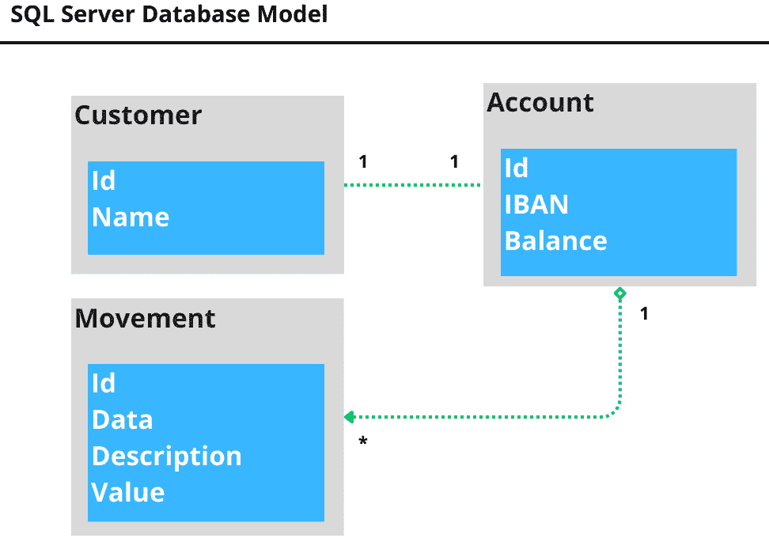
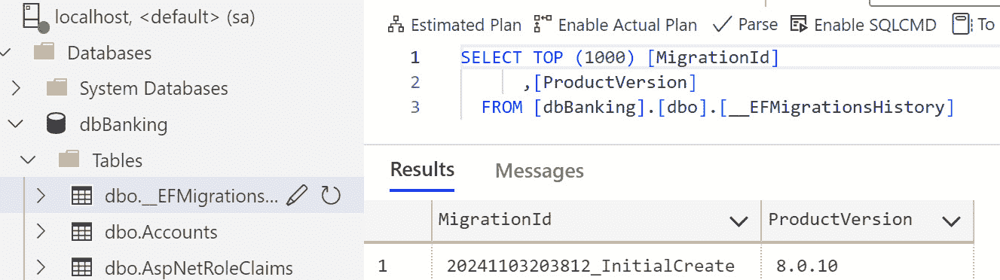

# 使用数据和持久性

每个应用程序，在某个时刻，都会消耗数据，无论是通过服务还是甚至在一个数据源中，例如 SQL Server 数据库或 MySQL。与数据库的交互是一个重要的功能，ASP.NET Core 9 提供了诸如 Entity Framework Core 等机制，并且可以轻松地与其他数据库接口提供商集成，例如 Dapper，这是一个用于以简单方式抽象数据访问的库。

在本章中，我们将涵盖以下主要主题：

+   连接到 SQL 数据库

+   理解 SQL、NoSQL、ORM 和 Micro ORM

+   使用 Entity Framework core 和 Dapper 进行操作

我们将探讨使用诸如 Entity Framework 和 Dapper 等技术之间的 Web 应用程序和数据库通信，以及理解诸如 ORM 的使用和不同的数据持久性模型等重要概念。

# 技术要求

为了充分利用本章内容，有一些先决条件需要满足。因此，您需要安装 Docker 和 Azure Data Studio。

本章的所有源代码和示例都可以在 GitHub 仓库中找到：[`github.com/PacktPublishing/ASP.NET-Core-9.0-Essentials/tree/main/Chapter05`](https://github.com/PacktPublishing/ASP.NET-Core-9.0-Essentials/tree/main/Chapter05)。

## Docker 安装

我们将使用 Docker 作为运行 SQL 数据库服务器的基准。使用 Docker 可以避免在不同操作系统上安装数据库时遇到的问题，因为它是一个可移植的选项。

要安装 Docker，请遵循您操作系统的说明。

### Windows

在终端上以管理员身份运行以下命令：

```cs
winget install -e --id Docker.DockerDesktop
```

### Mac

访问以下链接，并根据您的处理器遵循安装教程：[`docs.docker.com/desktop/install/mac-install/#install-and-run-docker-desktop-on-mac`](https://docs.docker.com/desktop/install/mac-install/#install-and-run-docker-desktop-on-mac)。

### Linux

Docker 支持 **Ubuntu**、**Debian** 和 **Fedora**。请根据您的平台使用以下说明：[`docs.docker.com/desktop/install/linux-install/`](https://docs.docker.com/desktop/install/linux-install/)。

## Azure Data Studio

Azure Data Studio 是一个专门的数据库编辑器，将用于执行数据库操作，例如创建表、插入和记录查询。

其安装简单，并且支持不同的操作系统：[`learn.microsoft.com/en-us/azure-data-studio/download-azure-data-studio?tabs=win-install%2Cwin-user-install%2Credhat-install%2Cwindows-uninstall%2Credhat-uninstall#download-azure-data-studio`](https://learn.microsoft.com/en-us/azure-data-studio/download-azure-data-studio?tabs=win-install%2Cwin-user-install%2Credhat-install%2Cwindows-uninstall%2Credhat-uninstall#download-azure-data-studio)。

# 连接到 SQL 数据库

在每一章中，我们都学习了涉及 ASP.NET Core 9 的不同方面以及该平台如何为开发各种类型的应用程序提供大量资源。每个应用程序都有一个目的，即处理生成用户信息的数据。然而，在某个时候，您的应用程序将最终与数据持久性模型交互。

**数据持久性**以多种方式发生，但通常是将分配在内存中的信息序列化到磁盘上，这可以是文件的形式，通常使用数据持久化平台，如 **数据库管理系统**（**DBMS**）或非关系型数据来实现，我们将在不久的将来更深入地讨论这两种持久化模型。

大多数应用程序使用基于数据库的持久化模型，如 SQL Server、Oracle 和 MySQL。每个数据库管理系统都有管理、类型和资源组织的模型；然而，它们共享将数据以表格格式持久化的相同目的，并使用 **结构化查询语言**（**SQL**）来操作和管理所有持久化数据。

ASP.NET Core 9 可以与不同类型的数据库管理系统（DBMS）通信，但我们将重点关注 SQL Server 数据库。

要使应用程序连接到数据库，以下内容是必要的：

+   数据库驱动程序（一个 NuGet 包）

+   连接字符串

+   访问所需资源

使用此模型，我们可以连接到任何已将 NuGet 包移植到 .NET 平台的数据库，例如用于 SQL 数据库的 **System.Data.SqlClient** 包，这使得应用程序能够轻松实现持久化模型。

既然我们已经了解了与应用程序和数据持久性交互相关的原则，让我们学习 ASP.NET Core 9 平台如何与 SQL Server 数据库进行通信。

## 准备 SQL Server

在当前版本的 .NET 平台中，它们主要使用 **依赖注入**（**DI**）设计模式，该模式允许使用称为 **控制反转**（**IoC**）的技术，导致类及其依赖项由 .NET 依赖项容器管理。

.NET 中的 DI

DI 模式设计的主要目标是抽象类实例及其相应依赖项的管理。这是大多数高性能解决方案中的常见做法。如果您想了解更多关于 DI 的信息，请访问 [`learn.microsoft.com/en-us/aspnet/core/fundamentals/dependency-injection?view=aspnetcore-9.0`](https://learn.microsoft.com/en-us/aspnet/core/fundamentals/dependency-injection?view=aspnetcore-9.0) 。

通过 DI，我们可以注册一个类来控制对数据库的连接。我们将在学习使用 Entity Framework 的 *与 EF Core 和 Dapper 一起工作* 部分时采用这种方法。

目前，了解应用程序和数据库之间通信的基本原理很重要。我们将使用 SQL Server 作为 DBMS，为此，您必须查阅 *技术要求* 部分，并安装 Docker 引擎。Docker 的工作原理超出了本书的范围。然而，它的使用将允许您继续本章中描述的示例，而不会出现任何兼容性问题。

让我们开始配置数据库：

1.  第一步是运行一个 Docker 容器来运行 SQL Server。我们将使用以下命令启动 SQL Server 的一个实例：

    ```cs
    docker run -d -e "ACCEPT_EULA=Y" -e "MSSQL_SA_PASSWORD=Password123" -p 1433:1433 mcr.microsoft.com/mssql/server:2019-latest
    ```

    让我们回顾一下前面的命令：

    +   **docker run** : 这使用 Docker 引擎来运行容器。

    +   **-d** : 此参数用于在后台执行命令。

    +   **-e** : 这些是环境变量的定义，用于启动容器时使用。在这种情况下，**ACCEPT_EULA** 变量被配置为同意微软的条款，而 **MSSQL_SA_PASSWORD** 参数用于定义 SA 用户的密码，这是默认的 SQL 用户管理员。

    +   **-p** : 这定义了主机机器的端口，该端口将用于与容器的 1433 端口通信。在这种情况下，我们定义主机和容器端口相同，为 1433。

    +   **mcr.microsoft.com/mssql/server:2019-latest** : 这是将要运行的 Docker 镜像的类型和版本。

    Docker 会将 SQL Server 镜像下载到您的机器上，并以虚拟化的方式运行。前面的命令将返回一个哈希码，指示镜像正在运行。

1.  现在，运行以下命令：

    ```cs
    docker ps
    ```

1.  运行的镜像将按 *图 5.1* 所示列出，如果您已经使用 Docker，则列出的镜像数量可能不同。


图 5.1 – 运行中的 Docker 镜像

了解更多关于 Docker 的信息

要了解更多关于 Docker 的信息，请查看以下官方文档：[`docs.docker.com/`](https://docs.docker.com/)。

1.  现在我们已经运行了镜像，打开 **Azure Data Studio**，如 *技术要求* 部分所述安装，然后点击 **创建连接** 按钮，如图 5.2 所示：


图 5.2 – 创建数据库连接

1.  按照以下方式填写字段：

    +   **服务器** : **localhost,1433**

    +   **认证类型** : **SQL 登录**

    +   **用户名** : **sa**

    +   **密码** : **Password123**

1.  保持其他参数不变，然后点击 **连接** 。在某些情况下，将显示一个弹出窗口，告知您有关证书的使用。只需点击 **启用信任服务器证书** 按钮。此证书由 Azure Data Studio 自动创建，所以请放心。

1.  连接后，您将能够访问服务器，该服务器仅包含标准数据库。点击 **新查询** 选项，您将看到一个新选项卡，如图 *图 5* *.3* 所示，我们将使用它来创建数据库和表。


图 5.3 – 新查询选项卡

1.  现在，在本书的 GitHub 仓库中，在 *第五章* 文件夹中，从 **InitialDb.sql** 文件中复制代码，并将其粘贴到之前在 Azure Data Studio 中创建的 **新查询** 选项卡中。

1.  然后点击**运行**按钮。**DbStore** 数据库和 **Product** 表将被创建，并将一些产品作为数据示例插入。

现在我们已经准备好了 SQL 数据库，是时候创建一个简单的控制台应用程序，建立连接，并从产品表中列出数据。

## 使用 SQL 客户端

如前所述，.NET 平台有更多现代的方式来建立数据库连接，我们将在 *ORM 和 Micro ORM* 部分更多地讨论这个主题。然而，了解应用程序和数据库之间通信的基本原理是非常重要的。

为了做到这一点，我们将创建一个控制台应用程序，并添加必要的 NuGet 包以连接到之前准备好的 SQL Server。

然后，在您选择的文件夹中打开终端，并依次执行以下命令：

```cs
dotnet new console -n MyFirstDbConnection
cd MyFirstDbConnection
dotnet add package System.Data.SqlClient
code.
```

项目准备就绪后，我们需要执行以下步骤：

1.  创建到数据库的连接。我们将使用 **SqlConnection** 类。

1.  打开连接。

1.  创建一个将要执行的 SQL 命令。我们将使用 **SqlCommand** 类。

1.  根据 SQL 命令读取数据。我们将使用 **SQLDataReader** 类。

1.  在屏幕上显示数据。

1.  关闭连接。

只需六个步骤，我们就能与数据源进行交互。**Program.cs** 文件中的代码必须与以下内容完全一致：

```cs
using System.Data.SqlClient;
SqlConnection sql = new SqlConnection("Server=localhost,
  1433;Database=DbStore; user id=sa;
  password=Password123");
try
{
    sql.Open();
    Console.WriteLine("Connection Opened");
    SqlCommand cmd = new SqlCommand(
      "select * from Product", sql);
    SqlDataReader reader = cmd.ExecuteReader();
    while (reader.Read())
    {
        Console.WriteLine($"{reader[0]} - {reader[1]}
          - {reader[2]:C2}");
    }
}
catch (Exception ex)
{
    Console.WriteLine(ex.Message);
}
finally
{
    sql.Close();
    Console.WriteLine("Connection Closed");
}
```

让我们讨论这个实现最重要的细节。

第一步是创建数据库连接类 **SqlConnection**，它在构造函数中接收一个连接字符串作为参数。连接字符串可以理解为数据库服务器的地址。在这种情况下，这个地址由三个基本属性组成：**服务器**、**用户 ID** 和 **密码**。默认连接端口是 **1433**，可以省略，但如果连接端口不同，则必须明确定义它。这些参数与之前通过 Azure Data Studio 通过 UI 连接到数据库时使用的参数相同。

连接字符串提供了几种其他类型的参数，用于确定如何建立连接。我们目前使用的是最简单的一种。

连接字符串

如前所述，连接字符串由不同的参数组成，包括用户名和密码等敏感数据。因此，将连接字符串管理从源代码中分离出来是一种良好的做法，以防止漏洞并防止敏感数据在应用程序的版本控制中可用。我们将在*第九章*中学习安全的凭证管理方法。有关连接字符串的更多详细信息，请参阅这个优秀的参考资料：[`www.connectionstrings.com/sql-server/`](https://www.connectionstrings.com/sql-server/)。

创建**SqlConnection**对象后，是时候使用**sql.Open()**代码打开连接了。接下来，创建**SqlCommand**类，其构造函数接收一个 SQL 字符串以及数据库连接对象。

使用的 SQL 代码对**Product**表执行简单查询，获取所有可用行和列。

**SqlCommand**有不同的方法，例如**ExecuteNonQuery**，通常用于执行更改数据库的命令，如**Insert**、**Delete**和**Update**，或者**ExecuteReader**，如本例中所用，用于从 Product 表获取数据。**ExecuteReader**方法返回一个**SqlDataReader**类型的对象，它将行和列抽象为一个对象，其中可以进行交互和访问表信息。

所有这些抽象工作都是由**System.Data.SqlClient**库完成的，它有权访问 SQL Server 数据库连接驱动程序，并提供几个用于操作数据的类。

通过执行**ExecuteReader**方法获取数据后，我们最终通过显示从数据库获取的数据来迭代返回的对象。

所有代码都通过**try..catch..finally**块进行保护，以确保错误处理，最重要的是，在结束时关闭连接。

我们可以分析在*图 5.4*中列出数据库记录的结果：


图 5.4 – 显示 Product 表中的记录

尽管这是一个简单的应用程序，但我们学到了与应用程序和数据库交互相关的重要概念和基础知识。我们以 SQL Server 为基础，但学到的教训也适用于其他数据源，如 MySQL 或 Oracle，当然，连接、命令和读取对象会有所不同。

此外，我们为本章剩余部分的环境准备奠定了基础，我们将探讨其他概念，从关系型数据库和非关系型数据库之间的区别开始，此外还将了解 ORM 和 Micro ORM 是什么。

# 理解 SQL、NoSQL、ORM 和 Micro ORM

随着不同应用程序结构和需求的出现，也发展出了不同的数据管理方式。选择合适的数据库和交互方法对应用程序的性能、可扩展性和可维护性有重大影响。

同样，随着系统复杂性的增加，通过数据库管理系统（DBMS）获取数据的新技术也出现了，例如**对象关系映射**（**ORM**）和微型 ORM。每种技术都在某些情境下有其优势，正确了解它们很重要，因为不存在万能的解决方案。

## SQL 与 NoSQL

应用程序的复杂性和不同的数据管理需求给公司带来了几个挑战，例如，为了管理大量数据而拥有合适的性能，这导致了可维护性和可扩展性的挑战。

与这些变量一起，保持服务器完美运行是昂贵的。**关系型数据库管理系统**（**RDBMS**）是跟踪组织信息的主要手段，它们在关系模型中优先考虑信息的完整性和关系的方法已经定义了开发团队多年来处理数据操作的方式。

**关系型数据库**中的表代表了一种信息类型。这种信息分布在列中，代表了一份数据的特征。完整的数据由表中的一行确定。表可以与其他表建立关系，将不同的数据关联起来以组成信息。这就是为什么它们被称为关系模型。*图 5.5*中的一些示例展示了某些表及其关系，代表了一个来自银行账户应用程序的数据抽象：


图 5.5 – 基本银行账户数据模型

在图中，你可以看到客户有一个有交易的账户。这是这个情境的基本表示。但在大型情境中，这种关系结构模型给公司带来了不同的挑战，并遵循基于数据应如何持久化的应用程序开发模型。

关系型数据库提供了灵活性；然而，基于*图 5.5*中所示的数据模型构建应用程序会带来一些挑战。

现代系统需要具备灵活性和弹性，在某些情况下还必须是技术中立的。

随着云的出现，弹性资源的可能性也随之产生。然而，即使在云环境中，维护数据集群、同步和管理它也不是一件容易或便宜的任务。如今，通过**平台即服务**（**PaaS**），这些活动被云提供商抽象化；然而，这需要付出代价。

随着技术的进步，其他类型的持久化模型和为应用和公司提供的机会也出现了。几年前在技术社区中普遍被误解的一个大词是**NoSQL**，它意味着**非关系数据库**或**不仅仅是 SQL**。

这种持久化模型对传统的关系模型有不同的方法。NoSQL 数据库具有更灵活的数据结构，对数据如何持久化没有太多限制。

多年来，NoSQL 被视为 DBMS 的新持久化模型，导致公司试图迁移到这种模型，而没有完全理解其基础，并在 NoSQL 结构中使用关系数据库方法。

这种与不同数据持久化源交互的方式带来了几个好处，包括使开发人员、工程师和公司改变他们对应用开发的看法，但更关注业务而不是数据应该如何持久化。

在*图 5.6*中，我们可以看到关系数据库和 NoSQL 数据库之间的大部分差异。


图 5.6 – 关系数据库和 NoSQL 之间最大的差异

NoSQL 方法提供了不同类型的数据持久化，为应用带来了几个好处。最常见的是以下几种：

+   键值存储（Redis, Memcached）

+   文档数据库（MongoDB, Couchbase）

+   列族数据库（Cassandra, HBase）

+   图谱数据库（Neo4j, OrientDB）

同样，NoSQL 数据库的数据操作模型与关系数据库不同，查询方法根据 NoSQL 数据库类型而异，可能不如 SQL 标准化。

此外，重要的是要理解 NoSQL 数据库通常优先考虑可扩展性、针对特定查询模式的高性能以及处理不断变化的数据结构的灵活性。

但我们何时应该使用一种方法而不是另一种方法？

让我们分析以下表格，以了解持久化方法之间的差异：

| **特性** | **RDBMS** | **NoSQL** |
| --- | --- | --- |
| 结构 | 严格、预定义的架构 | 灵活、可适应，架构可以是无架构的或动态定义的 |
| 可扩展性 | 通常垂直扩展（增加硬件功率） | 通常设计为水平扩展（添加更多服务器） |
| 一致性 | 强大的 ACID 保证 | 最终一致性对于更快的写入是常见的 |
| 查询 | 强大的、表达式的 SQL 查询 | 根据数据库类型而异，对于复杂关系可能不如 SQL 强大 |
| 用例 | 具有严格架构、复杂关系、强一致性需求的数据 | 高量数据、快速变化的数据模型、高性能、特定查询模式、分布式系统 |

表 5.1 – 数据持久化模型比较

如 *表 5.1* 所示，RDBMS 在可预测和结构化的数据模型中表现出色，其中数据准确性和关系至关重要。NoSQL 在需要灵活性、大规模可扩展性和针对特定需求的高性能的场景中脱颖而出。两者都是针对不同类型应用程序的优秀方案，具有不同的适用性，例如一个将数据持久化在 SQL Server 中的应用程序，同时使用 Redis 来管理某些信息的缓存，避免频繁访问数据库。这两种方法都用于同一应用程序。

幸运的是，ASP.NET Core 9 允许我们与不同类型的数据模型一起工作，因为它具有可扩展性和动态性。让我们更深入地探讨两个在关系型数据库中操作数据的重要概念，即 ORM 和 Micro ORM。

## ORM 和 Micro ORM

ORM 是一种作为面向对象编程（**OOP**）世界和数据库关系世界之间桥梁的技术。OOP 将数据建模为具有属性和行为的对象，而数据库则使用表、行和列进行操作。

正如我们在本章开头所学的，我们使用诸如 **SqlConnection**、**SqlCommand** 和 **SqlDatReader** 这样的对象来读取 SQL Server 中的数据。这是一个简单的方法，但随着商业的复杂性增加，获取和映射数据以在应用程序中应用所需业务规则可能成为一个大问题。

在 *使用 SQL 客户端* 部分实现的 **Products** 表示例中，我们使用 SQL 查询来获取所有现有记录。在实际的大型应用程序中，用户与任何交互都必需获取表中的所有记录是不切实际的，这可能会在应用程序中引起严重的性能问题。

必须插入、删除和更新数据，甚至可以通过过滤器进行自定义搜索，这意味着为每种情况编写一个 SQL 命令。此外，为了有效地处理数据，有必要抽象化持久性和业务领域。在 C# 中，我们可以在高层次上与面向对象的概念一起工作，在这种情况下，ORM 作为一种强大的技术出现，使我们能够专注于业务，同时提供其他灵活性。

在 .NET 平台上实现 ORM 被称为 **Entity Framework**（**EF**）。EF 提供了所有高级机制，用于从对象到数据库或从数据库到 C# 对象的操作和转换数据。

使用 EF，我们不需要担心为数据库中的各种操作编写 SQL 查询。EF 还具有其他功能，例如 **迁移**，允许您根据开发的代码模型更新数据库，为数据库版本控制提供了一个很好的解决方案。

为了更好地理解 ORM 的工作原理，请参阅 *图 5.7*：



图 5.7 – 银行系统的简单数据模型

我们知道在 C# 应用程序中可以获取数据，因为我们之前学过。为了翻译 *图 5* *.7* 中显示的数据对象，需要创建三个 C# 类：**Customer.cs**、**Account.cs** 和 **Movement.cs**。然而，对于每个类，都需要编写不同的 SQL 查询来执行对数据库的任何操作。此外，对于每个业务需求，都需要将数据映射到 C# 类，反之亦然以持久化数据。

这意味着要获取客户数据，例如他们的账户和交易，至少需要进行三次数据库查询，与 **SqlDataReader** 对象交互，并创建相应的 C# 对象。尽管这不是一项非常复杂的工作，但随着软件变得更加复杂，各种变化使得这种模型变得有问题。

假设将 **Movement** 表中的 **Description** 列的名称更改为 **Event**。甚至还需要更改在 C# 中创建的所有 SQL 查询，以及映射。当涉及到更复杂的数据模型时，维护困难和可能出现的问题会呈指数级增长。

当使用 ORM 时，整个任务被抽象化并简化。幸运的是，EF 为此场景提供了一个很好的解决方案，需要以下步骤：

+   **连接字符串**：数据库地址和访问凭证

+   **DbContext 对象**：数据库连接和对象映射的协调者

+   **DbSet**：将被映射到数据库对象的域对象

EF Core 管理与数据库的所有通信、映射和迁移，使开发者能够专注于业务。

*图 5* *.7* 中的示例的 **DbContext** 类看起来是这样的：

```cs
public class BankingDbContext : DbContext
  {
    public BankingDbContext (DbContextOptions
      < BankingDbContext > options)
      : base(options)
    {
    }
    public DbSet<Customer> Customers { get; set; }
    public DbSet<Account> Accounts { get; set; }
    public DbSet<Movement> Movements { get; set; }
  }
```

我们将在下一节中更详细地实现这个类。在此阶段，重要的是要理解所有将由 **DbContext** 管理的表都是 **BankingDbContext** 类的 **DbSet** 类型属性。

数据库对象的映射通常是通过约定完成的，其中 EntityFramework Core 将属性名称和类型与数据库中的表列名称和类型进行比较，但可以通过使用专门的属性或类轻松自定义。

EF Core 的约定

要了解更多关于约定的信息，请访问 [`learn.microsoft.com/en-us/ef/core/modeling/#built-in-conventions`](https://learn.microsoft.com/en-us/ef/core/modeling/#built-in-conventions) 。

通过映射数据库约定，我们可以通过 **BankingDbContext** 类获取数据库中的所有客户，如下所示：

```cs
public async Task<ICollection<Account>>
  GetAllAccountsAsync()
{
     return await _context.Accounts.ToListAsync();
}
```

如前代码所示，**GetAllAccountsAsync** 方法在数据库中搜索所有账户。EF Core 的 **ToListAsync** 方法将异步查询数据库，返回一个 **Account** 对象的列表。

以下代码展示了使用 ORM 的简单而强大的方法，无需管理连接或编写 SQL 命令，因为它们由 EF 生成，此外，无需将数据库对象映射到类中。所有这些功能都已抽象化。

以这种方式，ORM 提供了以下好处：

+   *减少样板代码*：ORM 自动生成大量重复的 SQL 代码（**SELECT**，**INSERT**，**UPDATE**），使开发者能够专注于应用程序逻辑，而不是数据访问代码。

+   *提高生产力*：对于习惯于面向对象原则的开发者来说，使用对象通常更直观，可以加快开发速度。

+   *提高可维护性*：ORM 在您的应用程序代码和特定数据库之间提供了一定程度的抽象，这使得切换数据库提供商或重构数据模型更容易，对代码库的影响更小。

然而，ORM 技术有其优缺点需要考虑：

+   *性能开销*：在某些情况下，ORM 生成的 SQL 查询可能不是最有效的。经验丰富的开发者通常可以手动编写更高效的 SQL。

+   *潜在的抽象问题*：ORM 可以隐藏一些底层数据库概念，这可能是有益的，但可能会使那些不熟悉数据库基础的人优化或故障排除更具挑战性。

EF Core 目前处于第 8 版，多年来它得到了改进，添加了不同的功能。然而，我们仍然建议明智地使用我们所能提供的最佳技术。

尽管 ORM 技术变得越来越现代，但仍然存在对性能的担忧，尤其是在您有一个复杂的数据模型，对象之间存在多个级别的关系时。ORM 通常无法生成非常高效的查询，在某些情况下，有必要使用其他资源，例如本章开头学到的微 ORM 方法。

在促进应用程序和数据库对象之间工作的情况下，微 ORM 的概念应运而生。

**微 ORM**在概念上与 ORM 模型非常相似。然而，微 ORM 将数据库映射对象抽象为 C#类，但更注重性能。在某些情况下，它们甚至提供一些查询的自动生成。

微 ORM 与 ORM 之间的差异如下：

+   *占用空间*：微 ORM 具有更小的代码库和更少的依赖项，导致显著减少开销。

+   *复杂性*：微 ORM 提供了一组基本的映射和执行查询的功能，而忽略了传统 ORM 中发现的许多复杂性。

+   *控制*：由于抽象程度较低，开发者对正在执行的 SQL 查询有更多的直接控制。

+   *功能*：微 ORM 通常缺乏在大型 ORM 中常见的以下功能：

    +   广泛的对象关系管理

    +   变更跟踪

    +   自动模式迁移

    +   标识映射（实体跟踪以防止重复负载）

.NET 社区中常用的 Micro ORM 技术有一些，其中最著名的是 Dapper。

Dapper 是开源的

Dapper 库是开源的，并且正在不断更新。有关 EF Core 等不同 ORM 引擎的比较，可以在 GitHub 上找到：[`github.com/DapperLib/Dapper`](https://github.com/DapperLib/Dapper)。

使用 Micro ORM 并不妨碍使用 ORM。根据需要和上下文，它们可以在应用程序中共存。重要的是要记住，这种方法可以使我们的应用程序质量更高。

在下一节中，我们将以实用的方式介绍 EF Core 和 Dapper 的使用，基于之前提到的*银行* *账户*概念。

现在我们已经了解了 ORM 和 Micro ORM 是什么，是时候实现使用这些方法解决方案了。

# 使用 EF Core 和 Dapper

ORM 和 Micro ORM 是现代应用程序中广泛使用的技术，因为它们具有各种优点。正如我们所学的，ASP.NET Core 9 有几种处理来自不同技术数据模型的方法。我们将学习如何使用 EF Core 作为 ORM，同时也会使用 Dapper 作为 Micro ORM。

## EF Core

基于银行账户数据模型的示例，我们有*客户*、*账户*和*交易*表，我们将创建一个项目以连接到本章开头配置的 SQL 数据库，该数据库运行在 Docker 容器中。

因此，完整的解决方案代码将在*技术要求*部分提到的 GitHub 仓库中可用。

对于这个项目，我们将使用 Minimal API 项目，为此，以管理员模式打开终端并执行以下命令：

```cs
dotnet new webapi -n WorkingWithOrm
cd WorkingWithOrm
```

现在，我们需要添加 EF Core 库，这些库对于应用程序连接到 SQL 服务器数据库是必需的。此外，我们还需要安装一个 EF CLI 工具。这个工具将用于对数据库应用一些更新。

在终端中运行以下命令：

```cs
dotnet tool install –global dotnet-ef
dotnet add package Microsoft.EntityFrameworkCore
dotnet add package Microsoft.EntityFrameworkCore.SqlServer
dotnet add package Microsoft.EntityFrameworkCore.Design
```

第一个命令安装 EF CLI 工具，接下来的命令是用于将应用程序连接到数据库的 EF 库。

EF Core 数据库提供者

EF Core 能够与不同的数据库一起工作；它不仅限于 SQL Server。有关可用提供者的更多详细信息，可以在[`learn.microsoft.com/en-us/ef/core/providers/?tabs=dotnet-core-cli`](https://learn.microsoft.com/en-us/ef/core/providers/?tabs=dotnet-core-cli)找到。

项目现在已准备好配置，我们将执行以下步骤：

1.  配置连接字符串。

1.  创建模型类。

1.  创建一个继承自**DbContext**的类。

1.  配置在 ASP.NET Core 9 DI 容器中创建的**DbContext**。

1.  添加迁移。

1.  更新数据库。

在执行这些步骤的过程中，您将注意到与传统方法使用**SqlConnection**、**SqlCommand**和**SqlDataReader**进行数据库通信的一些差异。

使用以下命令在终端中打开 Visual Studio Code 中的项目：

```cs
code .
```

完整的项目结构如*图 5.8*所示：


图 5.8 – 银行项目项目结构

为了配置连接字符串，我们将使用`appsettings.json`。重要的是要提到，包含用户凭据的信息不应直接在代码仓库中可用。最佳实践是使用密钥或甚至使用配置服务器，如**Azure App Configurator**来管理这些信息。我们将在*第六章*中更多地讨论良好的安全实践。

为了教学目的，我们将连接字符串添加到`appsettings.json`文件中：

```cs
{
   "Logging": {
     "LogLevel": {
       "Default": "Information",
       "Microsoft.AspNetCore": "Warning"
     }
   },
   "AllowedHosts": "*",
   "ConnectionStrings": {
    "BankingDbContext": "Server=localhost;
      Database=dbBanking;User Id=sa;
      Password=Password123;
      TrustServerCertificate=True"
   }
}
```

我们使用与通过 Docker 运行的数据库服务器相同的连接字符串，并添加了一个默认的**Database=dbBanking**，它将用于此应用程序。JSON 中的**ConnectionStrings**对象是 ASP.NET Core 9 的约定，该对象的每个属性代表不同的连接字符串。

EF Core 负责管理连接、将数据库实体映射到 C#对象以及生成 SQL 命令的所有工作。为此，我们必须使用一个基对象来映射域类。这个基对象被称为**DbContext**。

**DBContext**实现了**工作单元**设计模式，管理内存中操作的所有对象的状态，并在必要时持久化更改。

工作单元模式

工作单元设计模式在不同的上下文中被使用，它倾向于责任分离，例如将应用程序的所有业务规则与与数据库通信和操作数据的责任分离。

在[`learn.microsoft.com/en-us/archive/msdn-magazine/2009/june/the-unit-of-work-pattern-and-persistence-ignorance`](https://learn.microsoft.com/en-us/archive/msdn-magazine/2009/june/the-unit-of-work-pattern-and-persistence-ignorance)了解更多关于工作单元模式的信息。

根据图 5.8 所示的项目结构，我们将创建一个名为**BankingDbContext.cs**的类，它将包含以下代码：

```cs
namespace WorkingWithOrm.Context;
using Microsoft.EntityFrameworkCore;
using WorkingWithOrm.Model;
public class BankingDbContext : DbContext
{
    public BankingDbContext(DbContextOptions
      <BankingDbContext> options) : base(options)
    {
    }
    public DbSet<Account> Accounts { get; set; }
    public DbSet<Customer> Customers { get; set; }
    public DbSet<Movement> Movements { get; set; }
}
```

对于我们正在创建的应用程序，该类相当简单。让我们探索这段代码最重要的几点：

+   **DbContext**：`BankingDbContext`类继承自`DbContext`超类，该超类提供了应用程序与数据库之间通信、状态管理、映射以及生成 SQL 命令所需的必要抽象。

+   **BankingDbContext** 构造函数：类构造函数接收一个参数，即泛型 **DbContextOptions<BankingDbContext>** 类，这允许我们预定义在依赖注入容器中创建 **DbContext** 对象时将使用的配置。构造函数还可以接收一个连接字符串；然而，使用 C# 选项模式是一种良好的实践。

+   **DbSet**：**DbSet** 类型的每个属性代表数据库中的一个表，这些属性为 EF Core 提供信息，以便将数据从表转换为对象，反之亦然。

C# 选项模式

**options pattern** 在 .NET 平台上被广泛使用，目的是提供对相关设置组的强类型访问。

在 [`learn.microsoft.com/en-us/aspnet/core/fundamentals/configuration/options?view=aspnetcore-9.0#the-options-pattern`](https://learn.microsoft.com/en-us/aspnet/core/fundamentals/configuration/options?view=aspnetcore-9.0#the-options-pattern) 了解更多关于选项模式的信息。

**BankingDbContext** 类现在已经完整，提供了与 SQL 数据库交互所需的一切。在这种情况下使用的映射模型基于 EF Core 约定，该约定从类及其属性名称推断表和列的名称。

让我们看看 **Account.cs** 类：

```cs
public class Account
{
    public int Id { get; set; }
    public string Name { get; set; }
    public decimal Balance { get; set; }
    public int CustomerId { get; set; }
    public virtual Customer? Customer { get; set; }
    public virtual ICollection<Movement>? Movements
      { get; set; }
}
```

根据本课程和 EF Core 的约定，预期数据库中将有一个名为 **Account** 的表，以及名为 **Id**、**Name**、**Balance** 和 **CustomerId** 的列。

此外，还有一个名为 **Customer** 的属性和一个 **Movement** 对象的集合。由于存在 **CustomerId** 属性，EF 推断出与 **Customer** 表存在关系，该表在 **Account** 表中有一个外键（**<TableName>+Id**）。同样，由于存在 **Movement** 集合，EF 推断出 **Account** 类可能在 **Movement** 表中有一个或多个 **Movements**。

但是，如果需要遵循不同的命名标准，则可以使用流畅 API 将表、列、主键等的名称直接映射到 **DbContext** 类中。这可以通过在域类中使用数据注释来完成，甚至可以通过实现每个实体的特定映射类来使用 **IEntityTypeConfiguration<TEntity>** 接口。

以下代码示例表示将 **Customer** 类手动映射到 **tbl_customer** 表的自定义映射。为了在数据库实体中自定义类的映射，需要重写从 **DbContext** 类继承的 **OnModelCreating** 方法：

```cs
override protected void OnModelCreating(
  ModelBuilder modelBuilder)
  {
    modelBuilder.Entity<Customer>(obj => {
      obj.ToTable("tbl_customer");
      obj.HasKey(c => c.Id).HasName
        ("pk_customer_id");
      obj.Property(c => c.Name).HasColumnName
        ("customer_name").HasMaxLength(100).IsRequired();
      obj.HasMany(c => c.Accounts)
        .WithOne(a => a.Customer)
        .HasForeignKey(a => a.CustomerId);
    });
  }
```

如代码所示，可以定义所有必要的属性以正确映射实体。

随着 **BankingDbContext** 类的完成，我们必须在依赖注入容器中配置它并配置连接字符串。

我们将在 **Program.cs** 文件中添加以下行：

```cs
// Code omitted for readability
builder.Services.AddDbContext<BankingDbContext>(options =>
  options.UseSqlServer(builder.Configuration
    .GetConnectionString("BankingDbContext")));
var app = builder.Build();
// Code omitted for readability
```

我们使用**AddDbContext<BankingDbContext>**扩展方法来配置用于连接的连接字符串。请注意，我们正在使用**options**属性，这是**DbContext**构造函数中预期的，并且通过使用**UseSqlServer**扩展方法，我们正在恢复在**appsettings.json**文件中配置的连接字符串。

应用程序实际上已经准备好与数据库通信；然而，仍然需要添加迁移并更新数据库。

在项目目录中打开终端并运行以下命令：

```cs
dotnet ef migrations add InitialDatabase
```

此命令使用我们之前安装的 EF CLI 工具，并添加名为**InitialDatabase**的迁移。

迁移的目的是使应用程序和数据库在使用的对象上保持同步。在实际应用程序中，数据库的更改，如创建新表或添加或删除列，可能会不断发生。这些更改会影响相关的数据库以及消耗该数据库中对象的相应应用程序。当添加迁移，如前面的命令中所示，我们正在对应用程序使用的领域模型进行快照，EF Core 生成将应用于数据库以保持其最新的脚本。

迁移在项目中创建了一组类。这些类不应手动更改。正如我们在*图 5.9*中看到的那样，三个文件被添加到应用程序的**Migrations**文件夹中：


图 5.9 – 初始数据库迁移文件

当观察从**InitialDatabase.cs**后缀文件中提取的代码片段时，我们发现它们是数据库中的资源创建脚本：

```cs
…
protected override void Up(MigrationBuilder
  migrationBuilder)
  {
    migrationBuilder.CreateTable(
      name: "Customers",
      columns: table => new
      {
          Id = table.Column<int>(type: "int",
            nullable: false)
            .Annotation("SqlServer:Identity", "1, 1"),
          Name = table.Column<string>(
            type: "nvarchar(max)", nullable: false)
        },
        constraints: table =>
        {
          table.PrimaryKey("PK_Customers", x => x.Id);
        });
…
```

随着您的应用程序领域模型的每次更改，都必须添加一个新的迁移。这样，您将维护更改的历史记录，这将有助于数据库和应用程序的维护和演进。

现在，您需要更新数据库。到目前为止，我们还没有在 SQL Server 上运行任何 SQL 脚本，更不用说创建数据库了。我们不会打开 Azure Data Studio 来执行此任务，而是将使用 EF Core CLI 工具根据应用程序中映射的版本更新数据库。

要执行此操作，请在项目目录中的终端运行以下命令：

```cs
dotnet ef database update
```

CLI 工具将连接到 SQL Server 并执行脚本以创建应用程序中映射的数据库和表。*图 5.10*显示了创建的对象：



图 5.10 – 使用 EF CLI 工具在数据库中创建的对象

与数据库的所有通信都已正确配置。现在是时候添加与数据库交互的 API 了。因此，在**Program.cs**文件中创建以下路由：

```cs
app.MapGet("/customers", async (CancellationToken
  cancellationToken, BankingDbContext dbContext) =>
  {
    var customers = await dbContext.Customers
      .ToListAsync(cancellationToken);
    return Results.Ok(customers);
        });
    app.MapGet("/customers/{id}", async (int id,
      BankingDbContext dbContext,
      CancellationToken cancellationToken) =>
      {
        var customer = await dbContext.Customers
          .FindAsync(id, cancellationToken);
        return Results.Ok(customer);
      });
      app.MapPost("/customers", async (
        [FromBody]Customer customer,
        BankingDbContext dbContext,
        CancellationToken cancellationToken) =>
        {
          await dbContext.Customers.AddAsync(
customer, cancellationToken);
          await dbContext
            .SaveChangesAsync(cancellationToken);
          return Results.Created();
        });
```

上述路由对客户表执行操作。注意第一个 Get 方法。此方法接收一个**BankingDbContext**对象的实例作为参数，该实例通过.NET Core 依赖注入 DI 上下文自动解析。

然后，使用**dbContext.Customers.ToListAsync(cancellationToken)**代码，检索数据库中所有现有的客户。我们只使用**Customers** **DbContext**和**DbSet**，EF Core 负责创建 SQL 查询以选择记录。无需打开连接、创建命令，甚至无需手动映射。所有操作都是透明完成的。

**Post**方法执行以下操作：

+   **dbContext.Customers.AddAsync**：将**Customer**对象作为请求体中的参数传递。然后以与我们向列表中添加项相同的方式将其添加到**DbSet**中。

+   **dbContext.SaveChangesAsync**：当执行此方法时，**dbContext**更新数据库。这意味着如果**DbSets**上有其他操作，例如删除、更新或添加，这些信息只有在执行**SaveChanges**或**SaveChangesAsync**方法后才会更新到数据库中。

异步处理和取消令牌

异步处理是现代 Web 应用程序开发的基本方面。在 ASP.NET Core 9 中，异步方法通过在操作期间（如数据库查询、文件访问或消耗 HTTP 资源）不阻塞线程，允许服务器同时处理更多请求。这种方法允许应用程序在负载下扩展并快速响应。**async**和**await**关键字使得编写易于维护和阅读的异步代码成为可能，.NET 平台抽象了管理异步机制复杂性。

结合异步方法，使用取消令牌是一种良好的做法，这允许应用程序正确处理请求的取消，使应用程序更具响应性和弹性。与异步方法关联的取消令牌在整个应用程序的异步操作中传播取消信号，允许它们提前终止并释放资源。ASP.NET Core 9 和 C#简化了异步编程和取消令牌的使用，提供了一个健壮的框架，确保应用程序即使在不同的负载下也能保持响应。

如需了解有关异步编程和令牌取消的更多信息，请访问[`docs.microsoft.com/en-us/dotnet/csharp/programming-guide/concepts/async/`](https://docs.microsoft.com/en-us/dotnet/csharp/programming-guide/concepts/async/)和[`learn.microsoft.com/en-us/dotnet/standard/threading/cancellation-in-managed-threads`](https://learn.microsoft.com/en-us/dotnet/standard/threading/cancellation-in-managed-threads)。

通过这种方式，我们可以运行应用程序以简单的方式与数据库交互，使得能够使用 **语言集成查询**（**LINQ**）执行任何操作，例如高级筛选或按特定列排序的记录。

使用 ORM 提供了高级应用的多项好处，同样，当我们把数据管理复杂性的管理委托给 ORM 时，也会带来一些挑战。这使得它们运行缓慢，尽管有多个创新和改进，但在许多情况下，它们在性能方面并不是最佳选择。

在这种情况下，Micro ORM 是很好的选择；它们具有与传统方法相似的性能和 ORM 的映射能力。因此，让我们探索如何使用 Dapper 来为数据库通信模型添加更多功能。

## Dapper

**Dapper** 是一个 Micro ORM，它使我们能够以高效的方式与数据库交互，同时将数据库实体映射到 C# 对象中。

它是一个简单易用且功能强大的库。其映射模型有趣且灵活，允许您快速有效地创建不同类型的查询结果投影。

Dapper 和 EF Core 不是相互排斥的技术，在一个项目中同时使用这两种方法可以提供很大的好处。

让我们在终端中执行以下命令，将 Dapper 库添加到之前创建的项目中，在应用程序目录下：

```cs
dotnet add package Dapper
```

在项目中，与 Dapper 一起工作的所有先决条件都已实现，其中最重要的是我们在 **appsettings.json** 文件中配置的连接字符串。

让我们修改 **Program.cs** 文件，添加两个新的路由，使用 Dapper 执行查询，我们可以从中获取数据库中的所有客户以及通过 **Id** 查询客户：

```cs
builder.Services.AddScoped(_ => new SqlConnection(builder
  .Configuration.GetConnectionString("BankingDbContext")));
var app = builder.Build();
// Codes omitted for readability
app.MapGet("GetAllCustomersUsingDapper", async(SqlConnection connection) =>
{
  var customers = await connection.QueryAsync<Customer>
    ("SELECT Id, Name FROM Customers ORDER BY Name");
  return Results.Ok(customers);
});
app.MapGet("GetCustomerByIdUsingDapper",
  async(int id, SqlConnection connection) =>
{
    var customer = await connection
      .QueryFirstOrDefaultAsync<Customer>("SELECT Id,
      Name FROM Customers WHERE Id = @Id", new {
        Id = id });
    if (customer is null) return Results.NotFound();
    return Results.Ok(customer);
});
```

让我们探索前面的代码：

+   在 C# 和 ASP.NET Core 9 中，**_ => new** 语法被称为丢弃 lambda，当不需要使用 lambda 表达式的输入参数时使用。

+   **SqlConnection**：我们正在使用与 **DbContext** 相同的连接字符串将 **SqlConnection** 对象添加到 DI 容器中。我们使用的是 **AddScoped** 方法，这意味着每次在请求期间使用 **SqlConnection** 对象时，它将被重用。

+   **QueryAsync**：我们使用简单的 SQL 查询从数据库中获取所有客户。所需的列已添加到 SQL 命令中，以及一个 **ORDER BY NAME** 语句。**QueryAsync** 是 **SqlConnection** 扩展方法，当它获取结果时，它将自动根据属性和列的名称将数据映射到 C# 对象。

从数据库中获取所有数据

通常，不建议在单个查询中从数据库中检索所有记录，因为数据库表可能有成千上万或数百万条记录，这可能导致性能问题。请记住，这里提出的示例旨在帮助理解概念，不应在生产应用程序中使用。建议的解决方案是使用分页。分页涉及将数据分成小块，便于管理。要了解更多信息，以下页面包含实现示例：[`learn.microsoft.com/en-us/ef/core/querying/pagination`](https://learn.microsoft.com/en-us/ef/core/querying/pagination)。

+   **QueryFirstOrDefaultAsync**：与之前的方法相同，在数据库中执行查询，如果找到记录，则将其返回并映射到 Customer 对象。如果没有找到记录，则返回值**Null**。在 SQL 查询中的重要点是使用**@Id**参数。Dapper 方法可以在字符串中替换命名参数。因此，在定义带有参数的 SQL 命令后，我们必须定义一个包含与 SQL 命令中定义的参数相同的命名属性的同一参数的对象。在上面的代码示例中，定义的参数名为**@Id**，这要求传递给参数的对象必须有一个名为 Id 的属性，就像片段**new {Id = id}**。使用对象允许我们在必要时定义多个参数。

在这种情况下，使用 SQL 命令允许我们为不同的目的创建更高效的查询。同样，Dapper 也可以用来在数据库中添加、更改和删除记录。

在这种情况下，我们不需要管理由 DI 容器控制的 SQL 连接，并从 ORM 的自动映射方法中受益。

Dapper SqlBuilder

Dapper 还有一个扩展，使得编写 Micro ORM 所需的 SQL 命令格式更加容易，称为 Dapper SQL Builder。这是一个非常有用的扩展，即使在需要根据某些条件操作 SQL 字符串时也是如此。

您可以通过访问[`github.com/DapperLib/Dapper/tree/main/Dapper.SqlBuilder`](https://github.com/DapperLib/Dapper/tree/main/Dapper.SqlBuilder)了解更多关于 Dapper SQL Builder 扩展的信息。

正如我们所见，ORM 和 Micro ORM 都是与数据库通信的强大盟友，可以一起使用，在不同的环境中提供不同的好处。

这种灵活性使得 ASP.NET Core 9 能够让我们创建不同类型的应用程序，从最简单的到最复杂的，并使用最佳实践与数据库交互。

# 摘要

在本章中，我们学习了 ASP.NET Core 9 中的数据持久性，探讨了应用程序如何与数据库交互以存储和管理关键信息。你比较了关系型（SQL）和非关系型（NoSQL）数据库的优势，以便为你的项目选择合适的匹配。此外，你还看到了 ORM（如 EF Core）如何通过将对象映射到数据库记录来简化开发，以及 Micro ORM（如 Dapper）在精细控制性能关键数据库操作方面的好处。

我们将通过学习*第六章*中的安全最佳实践，再迈出一步，以开发高质量的应用程序。我们将探讨防御应用程序免受漏洞侵害的基本最佳实践和策略。你将学习如何确保用户数据保护、身份验证安全和整体应用程序完整性——这是构建强大、可靠的 Web 应用程序的重要基础。
