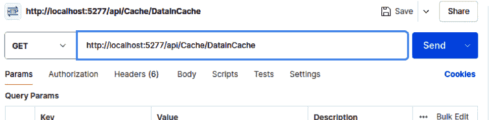
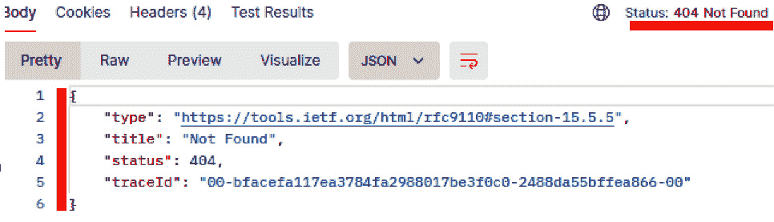
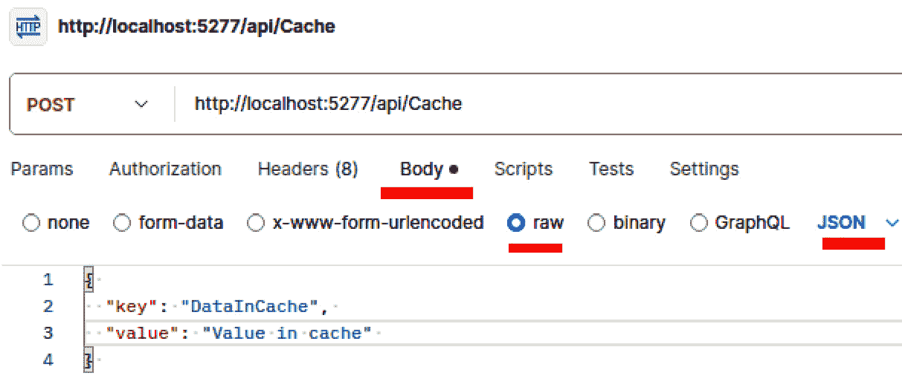
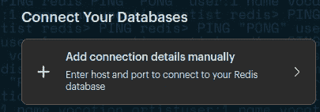
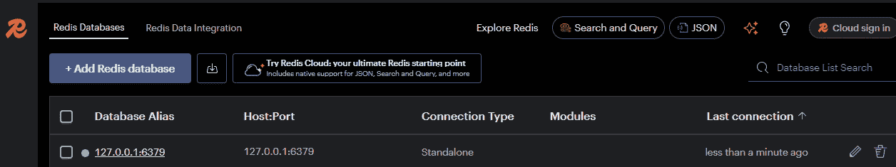
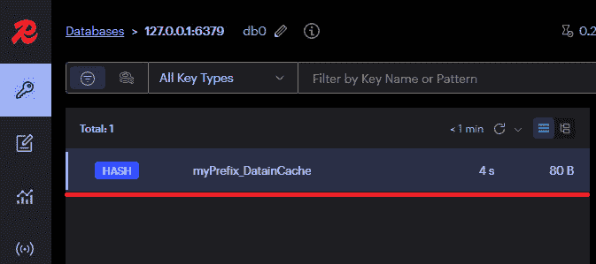

# 7

# 为应用程序添加功能

ASP.NET Core 9 提供了不同的特性和工具，使我们能够开发强大的基于网络的解决方案。然而，我们通常需要更多专业化的特性，以便提供更好的端到端体验。在本章中，我们将学习与网络应用程序相关的良好实践，例如添加缓存、使用异步机制、弹性机制和日志记录。我们将探讨使用 ASP.NET Core 9 开发应用程序的必要最佳实践，包括正确使用异步机制、HTTP 请求以及通过日志进行应用程序仪表化。

在本章中，我们将关注以下主题：

+   使用 ASP.NET Core 9 最佳实践进行工作

+   通过缓存策略提高性能并使应用程序具有弹性

+   理解和实现日志记录和监控

# 技术要求

为了支持本章的学习，以下工具必须在您的开发环境中存在：

+   **Docker**：必须在您的操作系统上安装 Docker 引擎，并运行 SQL Server 容器。您可以在*第五章*中找到有关 Docker 和 SQL Server 容器的更多详细信息。

+   **Postman**：此工具将用于执行对开发应用程序 API 的请求。

+   **Redis Insight**：此工具用于连接到 Redis 服务器数据库（[`redis.io/insight/`](https://redis.io/insight/)）。

本章中使用的代码示例可以在本书的 GitHub 仓库中找到：[`github.com/PacktPublishing/ASP.NET-Core-9.0-Essentials/tree/main/Chapter07`](https://github.com/PacktPublishing/ASP.NET-Core-9.0-Essentials/tree/main/Chapter07)。

# 使用 ASP.NET Core 9 最佳实践进行工作

到目前为止，我们已经了解了 ASP.NET Core 9 在创建高质量网络系统中的几个特性和好处。当然，就像任何其他软件开发技术一样，我们处理代码的方式没有限制。这样，我们有自由创造解决方案和新标准，以满足特定的需求。

然而，依赖良好实践不仅可以扩大我们开发高质量应用程序的能力，还可以避免浪费几个小时来实现目标。

在这种情况下，我们将讨论一些必要的良好实践，以提升我们应用程序的质量，从正确使用**HTTP 请求**开始。

## HTTP 请求最佳实践

HTTP 请求是处理网络应用程序时的一个基本组件。正确处理 HTTP 请求可以显著影响应用程序的性能和可靠性。

我们已经在*第三章*中学习了 HTTP 动词和状态码的类型。然而，应用程序提供的每个 HTTP 方法都必须得到适当的处理，以避免应用程序中的不一致性和避免漏洞。

此外，HTTP 请求的方式直接影响到您解决方案的用户或消费者的体验。

让我们了解一些与 HTTP 请求相关的良好实践。

### 验证和清理输入

总是验证和清理输入，以防止诸如 SQL 注入和 **跨站** **脚本**（**XSS**）等安全漏洞。

XSS

XSS 是一种安全漏洞，攻击者会将脚本注入到网页中。要了解更多信息，请访问 [`learn.microsoft.com/en-us/aspnet/core/security/cross-site-scripting?view=aspnetcore-9.0`](https://learn.microsoft.com/en-us/aspnet/core/security/cross-site-scripting?view=aspnetcore-9.0)。

考虑一个场景，即用户提交一个包含用户名的表单。为了防止有害数据被处理，您应该验证输入以确保它符合预期标准，并清理它以移除任何恶意内容：

```cs
public IActionResult Submit(string username)
{
    if (string.IsNullOrEmpty(username))
    {
        return BadRequest("Username is required.");
    }
    username = HttpUtility.HtmlEncode(username);
    // Proceed with processing the username
    return Ok();
}
```

以下代码演示了对用户名参数的简单验证，**if(string.IsNullOrEmpty)**，避免错误使用。使用 **HttpUtility.HtmlEncode(username)** 方法将如 **<**、**>**、**&** 等字符转换为 HTML 编码格式。

### 使用异步方法

在 HTTP 请求的执行流程中，我们必须避免进行同步处理操作。否则，这可能会降低用户体验，并导致应用程序出现一些问题，例如以下情况：

+   **线程阻塞**：同步方法在等待 I/O 操作（如数据库查询、文件访问或网络请求）完成时会阻塞线程。在 ASP.NET Core 应用程序中，线程池是一种有限资源。

+   **线程池耗尽**：当应用程序大量依赖同步方法时，线程池可能会耗尽，尤其是在高负载下，此时所有可用的线程都被阻塞，没有新的线程来处理传入的请求。

建议并良好实践是使用异步方法来提高性能和可伸缩性。例如，当使用 **HttpClient** 对象在 API 中进行请求时，使用 **HttpClient.SendAsync** 方法而不是 **HttpClient.Send**。

异步编程允许您的应用程序同时处理多个任务，而无需等待每个任务完成后再开始下一个任务。这类似于一个繁忙厨房中的厨师可能一次准备多个菜肴，而不是完成一个菜肴后再开始另一个。

我们将在“异步请求和 I/O 优化”部分更详细地介绍异步编程的使用。现在，让我们了解与 HTTP 请求相关的另一个良好实践，即缓存和压缩。

### 缓存和压缩

通过 HTTP 协议发送的请求有一些属性，包括头和体。在应用程序与后端通信期间，这些信息被传输，并且头由客户端（在这种情况下，是浏览器）和后端使用。

HTTP 头有多种类型，包括与缓存和压缩相关联的头。

通过利用缓存和响应压缩，我们可以减少带宽使用并提高加载时间。浏览器也会识别这些头，避免对服务器进行不必要的请求。

缓存和压缩的工作原理类似于图书馆如何使频繁借阅的书籍易于获取，或者真空包装的包装如何占用更少的空间。这些做法减轻了服务器的负担，并加快了对用户请求的响应。

让我们分析以下从**Program.cs**类中提取的代码片段：

```cs
// Add services to the container. builder.Services.AddResponseCaching();
app.UseResponseCaching();
app.Use(async (context, next) => {
  context.Response.GetTypedHeaders().CacheControl =
    new Microsoft.Net.Http.Headers.CacheControlHeaderValue
    {
      Public = true, MaxAge = TimeSpan.FromMinutes(10)
    };
    await next();
});
```

让我们了解前面的代码。当您将**app.UseResponseCaching**添加到应用程序的**中间件**管道中时，它执行以下功能：

+   **检查** **Cache-Control 头**：

    +   中间件根据 Cache-Control 头的存在检查传入的请求是否可以被缓存

    +   如果找到有效的 Cache-Control 头并且允许缓存，中间件将继续处理请求

+   **将响应存储在** **缓存中**：

    +   如果请求的响应可以被缓存，中间件将响应存储在缓存中

    +   符合缓存标准的后续请求将直接从缓存中提供，无需再次生成响应

+   **提供** **缓存响应**：

    +   对于与之前缓存的响应匹配的请求，中间件提供缓存的响应

    +   这样可以减少处理时间和服务器负载，因为响应是直接从缓存中检索的

**app.Use(async (context, next)**方法向中间件管道添加了 Cache-Control 头所需的参数，例如缓存持续时间。这是必要的，以便客户端可以知道如何缓存响应。

缓存由应用程序的内存管理，因此，长时间在内存中保留缓存可能引起问题，但这是一种良好的做法。我们将在下一节中详细介绍缓存的使用，*通过缓存策略提高性能并使* *应用程序具有弹性* 。

为了进一步提高响应性能，我们可以通过几行代码自动执行压缩。

为了这个目的，我们必须将**Microsoft.AspNetCore.ResponseCompression** NuGet 包添加到项目中。您可以在应用程序的项目目录中键入以下命令：

```cs
dotnet add package Microsoft.AspNetCore.ResponseCompression
```

在任何情况下，了解如何在您的应用程序中使用此功能都很重要。

在添加 NuGet 包后，我们必须将压缩服务添加到 **Program.cs** 文件中。这样做时，我们得到以下修改后的文件，考虑到缓存和压缩：

```cs
var builder = WebApplication.CreateBuilder(args);
// Add services to the container.
builder.Services.AddResponseCompression(options =>
{
    options.EnableForHttps = true;
    // Enable compression for HTTPS requests
    options.Providers.Add<GzipCompressionProvider>();
    // Add Gzip compression
    options.Providers.Add<BrotliCompressionProvider>();
    // Add Brotli compression
});
builder.Services.Configure<
  GzipCompressionProviderOptions>(options =>
{
    options.Level = System.IO.Compression
      .CompressionLevel.Fastest;
    // Set compression level for Gzip
});
builder.Services.AddResponseCaching();
var app = builder.Build();
// Configure the HTTP request pipeline.
if (!app.Environment.IsDevelopment())
{
    app.UseExceptionHandler("/Home/Error");
    app.UseHsts();
}
app.UseHttpsRedirection();
app.UseStaticFiles();
app.UseRouting();
app.UseResponseCompression(); // Use response compression middleware
app.UseResponseCaching(); // Use response caching middleware
app.Use(async (context, next) =>
{
  context.Response.GetTypedHeaders().CacheControl =
    new Microsoft.Net.Http.Headers.CacheControlHeaderValue
  {
    Public = true,
    MaxAge = TimeSpan.FromMinutes(10)
  };
  await next();
});
app.UseAuthorization();
app.MapRazorPages();
app.MapControllers();
app.Run();
```

以下代码可以这样解释：

+   **添加响应** **压缩中间件** :

    +   使用 **builder.Services.AddResponseCompression** 方法将响应压缩服务添加到 **依赖注入**（**DI**）容器中。

    +   **options.EnableForHttps** 设置为 **true** 以启用 HTTPS 响应的压缩。

    +   **options.Providers.Add<GzipCompressionProvider>()** 和 **options.Providers.Add<BrotliCompressionProvider>()** 用于添加对 **Gzip** 和 **Brotli** 压缩提供者的支持。

+   **Configure** **compression options** :

    +   **builder.Services.Configure<GzipCompressionProvider** **Options>(options => options.Level = System.IO.Compression.CompressionLevel.Fastest)** 用于配置 Gzip 的压缩级别。你可以根据需要调整压缩级别（**Optimal**，**Fastest** 或 **NoCompression**）。

+   **使用中间件** :

    +   **app.UseResponseCompression()** 将响应压缩中间件添加到请求管道中。

中间件的处理顺序很重要

当结合响应缓存和压缩时，中间件的顺序很重要。确保在缓存中间件之前包含压缩中间件。这样，响应在缓存之前被压缩，确保缓存响应已经压缩并准备好高效地提供服务。

通过这些实践，你可以减小响应的大小，从而提高性能和加快用户的加载速度。

现在是更详细地理解异步请求的时候了。

## 异步请求和 I/O 优化

异步编程是现代 Web 开发的基本方面，它使非阻塞操作成为可能，从而提高了应用程序的响应性和可伸缩性。

异步编程的复杂性被 C#中可用的资源所抽象，使应用程序和功能更加强大。但要更好地理解这个异步过程的重要性，让我们分析以下示例。

想象你在咖啡店排队等候。如果咖啡师必须等待每杯咖啡完全煮好才开始下一杯，队伍会移动得非常慢。相反，咖啡师在准备下一杯饮料的同时开始准备前一杯。同样，异步编程允许你的应用程序在等待前一个任务完成时开始其他任务。

Web 应用程序可以在给定时间内响应用户的大量请求。ASP.NET Core 9 已经足够优化，能够高效地管理请求和内存。然而，如果你选择使用同步方法，这也是可能的，可能会引起一些问题。让我们看看我们如何开发异步方法。

### 使用 async 和 await 关键字

在 C# 中，`async` 和 `await` 关键字让您能够编写更易于阅读和维护的异步代码。

例如，在 ASP.NET Core 应用程序的情况下，使用 `async` 和 `await` 允许您的服务器在 I/O 操作期间不阻塞线程，从而同时处理更多请求，如下面的代码所示：

```cs
public async Task<IActionResult> GetDataAsync()
{
    var data = await _dataService.GetDataAsync();
    return Ok(data);
}
```

让我们看看代码中突出显示的细节：

+   **async** : 这是用于指示方法为异步的关键字。在声明异步方法时，必须在方法体中使用至少一个 `await` 关键字来执行异步操作。

+   **Task<IActionResult>** : 这指定了该方法返回一个最终将以 `IActionResult` 完成的任务。`Task` 类型代表 C# 中的异步操作。`IActionResult` 是 ASP.NET Core MVC 中的常见返回类型，它表示操作方法的返回结果。返回类型可以是任何类型的类或结构，例如，返回一个整数，如 `Task<int>`。

+   **await** : `await` 关键字用于异步等待 `GetDataAsync` 方法的完成。这意味着该方法将返回一个任务，并且执行将在任务完成之前暂停，而不会阻塞线程。

+   **_dataService.GetDataAsync()** : 这行代码在 `_dataService` 对象上调用异步 `GetDataAsync` 方法。`_dataService` 可能是一个处理数据检索的服务类实例。

C# 有几个异步方法，您可以通过在方法名称中添加 `async` 后缀作为约定来识别它们。

异步编程

C# 中的异步编程有几个其他细节和应用方式，它们不能作为本书的一部分考虑。然而，为了继续您的学习，我建议您阅读 Microsoft Learn 上的这篇优秀内容：[`learn.microsoft.com/en-us/dotnet/csharp/asynchronous-programming/`](https://learn.microsoft.com/en-us/dotnet/csharp/asynchronous-programming/)。

通过使用 ASP.NET Core 9 中可用的功能，我们可以通过一些关键字实现异步请求。

这些资源可以结合使用，例如与 Entity Framework Core 一起使用。

我们可以使用 `ToListAsync()` 和 `SaveChangesAsync()` 等方法使用 Entity Framework Core 实现异步数据访问。

异步数据访问允许您的应用程序在等待从数据库获取数据时执行其他操作，如下面的代码所示，其中通过 Entity Framework 对 `Customers` 表执行异步查询以获取所有记录：

```cs
public async Task<List<Customer>> GetCustomersAsync()
{
    return await _dbContext.Customers.ToListAsync();
}
```

考虑在应用程序设计中使用异步编程。

虽然 ASP.NET Core 9 平台为我们提供了创建健壮应用程序的多种机制，但我们必须记住，在所有开发的应用程序中，除了异步编程模型外，还必须考虑 HTTP 请求、压缩和信息缓存的最佳实践。这保证了用户和集成系统的最佳体验，同时确保应用程序能够足够优化以正确支持大量需求。

在下一节中，我们将更详细地了解缓存策略的使用以及如何使应用程序具有弹性。

# 通过缓存策略提高性能并使应用程序具有弹性

在 *Working with ASP.NET Core 9 best practices* 部分的 *HTTP request best practices* 子部分中，我们了解了一些能够为我们的应用程序带来多项改进的机制。讨论了一些方法，包括对缓存使用的简要介绍。

为了扩展我们的知识并添加技术到我们健壮的应用程序开发模型中，我们将探讨缓存策略的使用以及如何使我们的应用程序具有弹性，这是现代解决方案的基本要求。

让我们从首先了解不同的缓存策略类型开始。

## 缓存策略

缓存是一种强大的技术，通过在临时存储位置存储频繁访问的数据来提高应用程序性能。这减少了从原始数据源重复检索数据的需求。

在 *Caching and compression* 子部分中，演示了一段代码，使应用程序能够管理缓存，为 ASP.NET Core 9 中间件添加功能，该中间件在请求处理期间使用。在这种情况下，使用了 **内存** 缓存策略，将数据存储在内存中以实现快速访问。这对于频繁访问的小到中等数据集是合适的。

然而，对于更健壮的应用程序，另一种称为 **分布式缓存** 的策略是必要的。

分布式缓存使用某种专门用于分布式缓存的资源，例如 Redis。

**Redis** 是一种用于大数据集或分布式环境运行时的强大技术。

什么是 Redis？

**远程字典服务器** ( **Redis** ) 是一个开源的内存数据结构存储。它以其高性能、灵活性和对多种数据结构的支持而闻名。

Redis 将数据存储在内存中，这使得它与基于磁盘的数据库相比速度极快，并且还支持定期在磁盘上持久化数据。

Redis 的持久化模型是键/值，支持字符串、散列、列表、集合、有序集合、位图、HyperLogLogs 和地理空间索引等数据结构。这种灵活性允许有各种用例。

Redis 是多个应用程序广泛使用的资源；如果您想了解更多信息，请访问此链接：[`redis.io/`](https://redis.io/)。

许多现代应用程序，主要托管在云环境中，使用 Redis 作为分布式缓存的解决方案，同时完全集成到 ASP.NET Core 9 中。

为了更好地理解 Redis 与 ASP.NET Core 9 集成时的工作方式，让我们实现一个应用程序。

需要考虑 *技术要求* 部分中提到的要求。让我们学习如何将 Redis 集成到我们的应用程序中。

## 在我们的应用程序中集成 Redis

我们将首先创建一个应用程序。因此，在您选择的目录中打开终端，并执行以下步骤：

1.  通过运行以下命令创建一个新的 ASP.NET Core 9 项目：

    ```cs
    dotnet new webapi -n DistributedCacheExample
    cd DistributedCacheExample
    ```

1.  添加 Redis 缓存包：

    ```cs
    dotnet add package Microsoft.Extensions.Caching.StackExchangeRedis
    ```

1.  现在，运行以下命令以在应用程序目录中打开 Visual Studio Code：

    ```cs
    Code .
    ```

1.  打开 **appsettings.json** 文件，将其内容更改为以下代码：

    ```cs
    {
      "ConnectionStrings": {
        "Redis": "localhost:6379"
      }
    }
    ```

    前面的 JSON 定义了我们稍后将要创建的 Redis 服务器的连接字符串。

1.  打开 **Program.cs** 文件，并将其所有内容更改为以下代码：

    ```cs
    using Microsoft.Extensions.Caching.Distributed;
    var builder = WebApplication.CreateBuilder(args);
    // Add services to the container.
    builder.Services.AddControllers();
    builder.Services.AddEndpointsApiExplorer();
    builder.Services.AddSwaggerGen();
    // Configure Redis distributed cache
    builder.Services.AddStackExchangeRedisCache(options =>
    {
      options.Configuration = builder
        .Configuration.GetConnectionString("Redis");
      options.InstanceName = "myPrefix_";
    });
    var app = builder.Build();
    // Configure the HTTP request pipeline.
    if (app.Environment.IsDevelopment())
    {
        app.UseSwagger();
        app.UseSwaggerUI();
    }
    app.UseAuthorization();
    app.MapControllers();
    app.Run();
    ```

    您应该已经熟悉了之前描述的大多数代码。**builder.Services.AddStackExchangeRedisCache** 方法添加了默认所需的对象，作为添加的库 **Microsoft.Extensions.Caching.StackExchangeRedis** 的一部分，用于配置 DI 容器时管理缓存。

我们有两个主要的配置：

+   **options.Configuration**：这是提供连接 Redis 服务器地址的地方

+   **options.InstanceName**：这是一个可选参数，用于定义缓存键的前缀

应用程序的基础配置已经完成，现在是时候实现一个将与 Redis 交互的控制器了。

## 在控制器类中处理缓存

要做到这一点，仍然在 Visual Studio Code 中，按照以下步骤创建控制器：

1.  如果不存在，请在项目的根目录下创建一个名为 **Controllers** 的文件夹。

1.  在 **Controller** 文件夹中添加一个名为 **CacheController** 的类

1.  将之前创建的类的所有内容修改为以下代码：

    ```cs
    using Microsoft.AspNetCore.Mvc;
    using Microsoft.Extensions.Caching.Distributed;
    using System.Text.Json;
    using System.Text;
    namespace DistributedCacheExample.Controllers;
        [ApiController]
        [Route("api/[controller]")]
        public class CacheController : ControllerBase
        {
            private readonly IDistributedCache _cache;
            public CacheController(IDistributedCache
              cache)
            {
                _cache = cache;
            }
            [HttpGet("{key}")]
            public async Task<IActionResult>
              Get(string key)
            {
                var cachedData = await _cache
                  .GetStringAsync(key);
                if (string.IsNullOrEmpty(cachedData))
                {
                    return NotFound();
                }
                var data = JsonSerializer
                  .Deserialize<MyData>(cachedData);
                return Ok(data);
            }
            [HttpPost]
            public async Task<IActionResult>
              Post([FromBody] MyData data)
            {
                var cacheKey = data.Key;
                var serializedData = JsonSerializer
                  .Serialize(data);
                var options = new
                  DistributedCacheEntryOptions()
                  .SetSlidingExpiration(TimeSpan
                  .FromMinutes(5))
                  .SetAbsoluteExpiration(TimeSpan
                  .FromHours(1));
                await _cache.SetStringAsync(cacheKey,
                  serializedData, options);
                return CreatedAtAction(nameof(Get),
                 new { key = cacheKey }, data);
            }
        }
        public class MyData
        {
            public string Key { get; set; }
            public string Value { get; set; }
        }
    ```

    前面的代码创建了一个名为 **Cache** 的 API，包含 **GET** 和 **POST** 方法。让我们更详细地分析代码中的重要点：

    +   **Microsoft.Extensions.Caching.Distributed**：这是一个命名空间，引用了包含处理 **CacheController** 类中缓存所需依赖项的 NuGet 包。

    +   **private readonly IDistributedCache _cache**：这是类的一个私有属性，它抽象了一个缓存处理对象。

    +   **public CacheController(IDistributedCache cache)**：作为一个依赖项，类的构造函数具有 **IDistributedCache** 接口，该接口将由 DI 注入，并将实例分配给类的 **_cache** 属性。

    +   **var cachedData = await _cache.GetStringAsync(key)**：在执行 **Get** 方法期间，抽象连接到 Redis 服务器的 **_cache** 对象将使用键搜索字符串并在请求中返回它；否则，它将返回 **NotFound()** 状态。

    +   **Post** 方法：**Post** 方法接收一个 **MyData** 类型的对象作为参数，该类在文件末尾创建。在获取 **MyData** 对象时，将使用 **Key** 属性作为缓存键，**var cacheKey = data.Key**。然后，将 **MyData** 对象序列化为 JSON，**JsonSerializer.Serialize(data)**。随后，创建一个 **DistributedCacheEntryOptions** 类型的对象，在其中指定缓存中信息的过期参数。最后，通过运行 **await_cache.SetStringAsync(cacheKey,** **serializedData, options)** 将缓存持久化到 Redis 中。

SetSlidingExpiration 和 SetAbsoluteExpiration

在 **DistributedCacheEntryOptions** 中使用 **.SetSlidingExpiration(TimeSpan.FromMinutes(5))** 和 **.SetAbsoluteExpiration(TimeSpan.FromHours(1))** 方法来配置缓存条目过期选项。这些方法有助于管理缓存数据应在缓存中保留多长时间。

**SlidingExpiration** 指定了缓存条目在从缓存中移除之前可以不活跃（未访问）的时间量。每次访问缓存条目时，过期时间都会重置。

**AbsoluteExpiration** 指定了缓存条目在缓存中应保留的最大时间，无论其访问频率如何。缓存条目将在指定时间过后从缓存中移除，无论其被访问了多少次。

应用程序开发完成后，我们必须创建一个 Redis 服务器，为此，我们将使用 Docker 来运行它：

1.  在应用程序目录中，打开终端并运行以下命令：

    ```cs
    docker run --name redis -d -p 6379:6379 redis
    ```

    如果这是您第一次在您的机器上运行 Redis，请等待它下载，然后服务器将启动。

1.  仍然在应用程序终端中，使用以下命令来运行它：

    ```cs
    dotnet run
    ```

1.  应用程序运行后，打开 Postman 并通过访问 **File** | **New** **Tab** 菜单创建一个新的请求。

1.  然后，将请求类型定义为 **GET**，并在 URL 字段中输入执行应用程序后终端提供的带有后缀 **/api/Cache/DataInCache** 的 URL。*图 7.1* *.1* 展示了请求配置的一个示例：



图 7.1 – 在 Postman 上配置 API 请求

API URL 端口

在 *图 7.1* *.1* 中显示的 URL 中添加的数字 **5277** 代表 API 执行端口。此值可能因环境而异。请确保在执行 **docker** **run** 命令后输入您终端中可用的执行端口。

1.  **DataInCache** 值表示我们想要从缓存中获取值的键。然而，当在 Postman 中点击 **发送** 按钮时，我们会得到以下返回（*图 7.2*）：



图 7.2 – 缓存中请求数据

如 *图 7.2* 所示，响应体中的 HTTP 状态和 JSON 返回表示 **404** 未找到状态。

API 返回是正确的，因为 **GET** 方法试图从缓存中获取值，如果没有找到，则返回 HTTP 状态 **404**。

1.  仍然在 Postman 中，打开一个新标签页（**文件** | **新建标签页**），将请求类型设置为 **POST**，并使用以下后缀定义 API URL：**/api/Cache**。

1.  然后，点击 **正文**，选择 **raw** 选项，并添加以下 JSON：

    ```cs
    {
      "key": "DataInCache",
      "value": "Value in cache"
    }
    ```

    整个请求的配置在 *图 7.3* 中演示：



图 7.3 – 发起请求的配置

**POST** 请求，如 *图 7.3* 所示，将调用 API 的 **POST** 方法，该方法将请求体中定义的值添加到 Redis 缓存中。

1.  点击 **发送** 按钮发起请求，你应该会收到 HTTP **201** 状态码作为回应，表示信息已在缓存中创建。

1.  如果你想确认缓存的值，在 Postman 中打开包含 **GET** 请求的先前标签页，你应该会收到 HTTP **200** 状态码作为回应，以及表示缓存数据的 JSON 对象。

另一种检查 Redis 缓存中可用值的方法是使用 UI 工具，如 *技术要求* 部分中提到的 Redis Insight，我们现在将进行配置。

## 配置 Redis Insight

按照以下步骤配置 Redis Insight 以连接到在 Docker 上运行的 Redis 服务器：

1.  在应用程序的主屏幕上，点击 **手动添加连接详情** 选项，如图 *图 7.4* 所示：



图 7.4 – 配置 Redis 连接

1.  在下一个屏幕上，我们必须将连接参数添加到 Redis 服务器。由于此服务器通过 Docker 运行，默认参数将被使用，已在屏幕上可用：

    +   **主机**：这定义了 Redis 服务器的地址。

    +   **端口**：这定义了服务器执行端口。

    +   **其他参数**：目前不重要。然而，在生产环境中，主机地址、端口、用户和密码可能不同且是必要的。

1.  对于我们的示例，只需保留默认值并点击 **+ 添加 Redis 数据库** 按钮。

    一旦连接创建成功，连接到 Redis Insights 的服务器列表将显示，如图 *图 7.5* 所示：



图 7.5 – Redis Insight 工具中的连接 Redis 缓存

1.  点击显示在连接列表中的创建的连接。然后，点击如图 *7.6* 所示的放大镜图标，查看缓存中的数据：



图 7.6 – 缓存中的数据列表

如果点击放大镜图标时无法查看任何信息，这意味着之前添加的键已过期。在这种情况下，只需再次进行 **POST** 请求添加另一个键，并在 Redis Insight 中查看它。

这是一个简单的示例，目的是让我们学习如何与缓存通信并向内存中添加信息。在这种情况下，我们使用 Redis，一个强大的分布式数据管理资源，作为将保存在内存中的信息的服务器。

在实际场景中，这种方法可以与数据库结合使用。这样，在向数据库发送请求之前，会检查缓存中是否存在信息。如果存在，则不需要调用数据库，从而优化过程。

正如我们所学的，缓存是一种强大的解决方案，可以使我们的应用程序性能更优、更可用。

现在我们已经学会了如何快速从缓存服务器检索信息，我们将了解如何在下一主题中使我们的应用程序更具弹性。

## 弹性机制

要构建健壮的应用程序，实施处理暂时性故障并确保持续可用性的弹性机制至关重要。

将弹性机制视为安全网，如果出现问题，它们会捕捉我们。它们帮助您的应用程序从意外的崩溃中恢复，并保持流畅的用户体验。

最常见的弹性策略如下：

+   **重试模式**：在放弃之前，自动重试指定次数的失败操作。这对于处理暂时性故障很有用。

+   **断路器模式**：防止应用程序执行可能失败的操作。当检测到故障时，它停止对服务的请求流，使系统有机会恢复。

为了在我们的应用程序中实现这些模式，我们将使用一个名为 **Polly** 的库。

Polly

Polly 是一个库，它是 .NET 基金会的一部分，用于向应用程序添加各种弹性功能。它由开源社区不断更新，并在生产环境中的各种应用程序中使用。要了解更多关于 Polly 的信息，请访问 [`github.com/App-vNext/Polly`](https://github.com/App-vNext/Polly) 。

要在我们的应用程序中使用 Polly，我们只需通过在应用程序的项目目录中执行以下命令将其添加到项目中：

```cs
dotnet add package Polly.Core
```

让我们分析以下代码示例中重试策略的实现：

```cs
var retryPolicy = Policy.Handle<Exception>().RetryAsync(3);
public async Task<IActionResult> GetDataWithRetryAsync()
{
    return await retryPolicy.ExecuteAsync(async () =>
    {
        var data = await _dataService.GetDataAsync();
        return Ok(data);
    });
}
```

如前述代码所示，实现过程相当简单，并集成了 ASP.NET Core 9 开发模型。在这个例子中，目标是以弹性的方式从服务中获取数据。让我们分析实现的主要点：

+   **var retryPolicy = Policy.Handle<Exception>().RetryAsync(3)**旨在创建一个重试策略。在这种情况下，策略与异常相关。在执行过程中，如果检测到异常，请求将再次进行。试验被配置为最多运行三次。

+   **return await retryPolicy.ExecuteAsync**命令是一个使用先前配置的重试策略执行动作的方法。所有执行**GetDataAsync**方法请求的代码都定义在自动管理重试机制的策略范围内。

在使用外部 API 时，使用重试策略是非常常见的。可能会有间歇性或暂时不可用的情况，在这种情况下，**重试**可以帮助在暂时不可用的情况下保证更大的弹性。

让我们看看实现断路器策略的一个示例：

```cs
var circuitBreakerPolicy = Policy.Handle<Exception>()
  .CircuitBreakerAsync(
    3, // Number of consecutive faults before breaking the circuit
    TimeSpan.FromMinutes(1) // Duration of the circuit break
);
public async Task<IActionResult>
  GetDataWithCircuitBreakerAsync()
{
    return await circuitBreakerPolicy
.ExecuteAsync(async () =>
    {
        var data = await _dataService.GetDataAsync();
        return Ok(data);
    });
}
```

让我们看看前面代码的细节：

+   **CircuitBreakerAsync**：此方法创建一个异步断路器策略。

+   断路器在连续三次异常（故障）后将会打开（断开电路）。

+   **TimeSpan.FromMinutes(1)**：一旦电路打开，它将保持打开状态一分钟。在此期间，任何尝试执行动作的行为将立即抛出**BrokenCircuitException**，而不执行动作。

    断路器有以下状态：

    +   **关闭**：所有调用都被允许的正常状态。

    +   **打开**：在指定数量的连续失败后调用被阻止的状态。

    +   **半开**：在打开期间之后，断路器允许有限数量的测试调用以验证底层问题是否已解决。如果这些调用成功，电路将返回到关闭状态。如果它们失败，电路将返回到打开状态。

    +   **circuitBreakerPolicy.ExecuteAsync**：此方法在断路器策略的控制下执行给定的异步委托（代码块内部）。

    +   如果**_dataService.GetDataAsync()**调用成功，该方法将返回包裹在**OkObjectResult**（HTTP **200** 响应）中的数据。

    +   如果**_dataService.GetDataAsync()**调用抛出异常，断路器策略将处理它：

        +   如果连续发生的异常少于三次，断路器保持关闭状态，异常将被传播。

        +   在连续三次异常之后，断路器打开一分钟。在此期间内的任何进一步调用将立即抛出**BrokenCircuitException**。

断路器策略通过在连续三次失败后中断电路并保持开启一分钟来帮助防止系统过载导致的重复失败。在此期间，任何尝试调用数据服务的操作都将立即抛出异常，而不会尝试执行服务调用。这允许系统恢复，并防止依赖系统的级联失败。

断路器和重试策略是强大的弹性策略，尽管它们看起来相似，但有不同的目标，如*表 7.1* 所示：

| **方面** | **断路器** | **重试** |
| --- | --- | --- |
| 目的 | 防止过载失败的服务 | 通过重试处理瞬态故障 |
| 行为 | 在一定数量的失败后停止请求并开启电路一段时间 | 在重试之间有延迟的情况下重试指定次数的操作 |
| 状态 | 关闭、开启、半开启 | 无状态，仅重试 |
| 失败处理 | 断路器开启后快速失败 | 在失败前多次重试 |
| 使用场景 | 需要避免重复失败以保护系统 | 预期临时故障可以通过重试解决 |
| 复杂度 | 较高，具有状态转换和监控 | 较低，具有简单的重试逻辑 |
| 用户反馈 | 断路器开启时的即时失败反馈 | 所有重试失败后的延迟反馈 |

表 7.1 – 断路器和重试目标

在实践中，这些模式通常一起使用，以提供强大的故障处理机制。例如，您可以使用重试策略来处理瞬态故障，如果尝试持续失败，则可以使用断路器来防止重试并允许系统恢复。

Polly 提供了其他几种弹性机制，可以组合使用，使应用程序更加强大。

这些策略的使用极大地促进了创建为大规模执行模型准备的强大解决方案，尤其是在云环境中。

在任何情况下，即使添加了多个机制来避免失败，它们仍然可能发生。在这种情况下，我们必须能够获取足够的信息来做出纠正，并确保应用程序不受非一致性影响。为此，在应用程序中添加日志非常重要，ASP.NET Core 9 提供了强大的机制来实现这一点，我们将在下一节中了解。

# 理解和实现记录和监控

在优化性能和弹性之后，我们现在转向记录和监控，这是维护和调试 ASP.NET Core 9 应用程序的基本实践。

## 记录和监控简介

记录和监控对于理解应用程序的行为、诊断问题和确保其平稳运行至关重要。日志提供了对应用程序过程的可见性，并有助于早期检测异常。

将日志记录想象成记日记，将监控想象成在家安装监控摄像头。日记帮助您记住过去的事件，而摄像头让您能够实时看到正在发生的事情，保持安全和秩序。

### 使用 ILogger 进行日志记录

.NET 提供了抽象，允许 ASP.NET Core 9 应用程序处理不同的日志策略。由 **Microsoft.Extensions.Logging** 命名空间提供的 **ILogger** 和 **ILoggerFactory** 接口对于在您的应用程序中实现日志记录至关重要，它允许您捕获和记录有关应用程序操作的信息。

日志记录提供了对应用程序行为的洞察，对于调试和监控至关重要。

ASP.NET Core 中的 **ILogger** 接口允许您以以下各点所述的详细程度记录信息：

+   **Trace** : 详细信息，通常仅在诊断问题时才有兴趣。

+   **Debug** : 对调试应用程序有用的信息。

+   **Information** : 强调应用程序进度的信息性消息。

+   **Warning** : 可能有害但不是错误的情况。

+   **Error** : 阻止应用程序执行功能的错误。

+   **Critical** : 导致应用程序完全失败的严重错误。

**ILogger** 接口提供了一些有用的方法：

+   **Log methods** :

    +   **Log<TState>(LogLevel logLevel, EventId eventId, TState state, Exception exception, Func<TState, Exception, string> formatter)** : 记录消息的核心方法。它允许您指定日志级别、事件 ID、状态、异常和一个格式化函数。

+   **Convenience methods** :

    +   **LogTrace(string message, params object[] args)** : 记录一个跟踪消息。

    +   **LogDebug(string message, params object[] args)** : 记录一个调试消息。

    +   **LogInformation(string message, params object[] args)** : 记录一个信息消息。

    +   **LogWarning(string message, params object[] args)** : 记录一个警告消息。

    +   **LogError(string message, params object[] args)** : 记录一个错误消息。

    +   **LogCritical(string message, params object[] args)** : 记录一个严重错误消息。

+   **Scope Method** :

    +   **BeginScope<TState>(TState state)** : 此方法开始一个逻辑操作范围。它返回一个 **IDisposable** 接口，在处置时结束范围。范围对于将一组操作与一个共同上下文相关联非常有用。

以下是一个使用 **ILogger** 接口的示例：

```cs
public class MyService
{
    private readonly ILogger<MyService> _logger;
    public MyService(ILogger<MyService> logger)
    {
        _logger = logger;
    }
    public void DoWork()
    {
        _logger.LogInformation("Starting work.");
        try
        {
            // Perform some work here
        }
        catch (Exception ex)
        {
            _logger.LogError(ex, "An error occurred while doing work.");
        }
        _logger.LogInformation("Finished work.");
    }
}
```

上一段代码使用了 **ILogger** 接口提供的几个方法：

+   **ILogger<MyService> _logger** : 这声明了一个私有 **readonly** 字段，**_logger**，其类型为 **ILogger<MyService>**。**ILogger<T>** 接口是 .NET 日志记录基础设施的一部分，其中 **T** 是正在记录的类型。通过指定 **MyService**，记录器与这个类相关联，这有助于识别日志消息的来源。

+   **MyService(ILogger<MyService> logger)**：**ILogger<MyService>** 实例通常通过依赖注入提供。这允许集中配置和管理日志基础设施。

+   **_logger.LogInformation("Starting work.")**：记录信息类型，字符串为 **Starting work**。

+   **_logger.LogError(ex, "An error occurred while doing work.")**：记录信息类型，字符串为 **An error occurred while** **doing work**。

**ILogger** 接口提供了一种强大的抽象方式，以技术无关的方式记录应用程序的执行数据，从而便于维护和扩展。

.NET 中可用的另一个强大抽象机制是 **ILoggerFactory**。

**ILoggerFactory** 接口负责创建 **ILogger** 实例。它通常用于为特定类别创建日志记录器或配置日志提供者和设置。

主要方法如下：

+   **CreateLogger(string categoryname)**：为指定的类别创建一个 **ILogger** 实例。类别通常是日志记录器关联的类或组件的名称。

+   **AddProvider (ILoggerProvider provider)**：将 **ILoggerProvider** 添加到工厂中。此方法用于配置日志消息的发送位置和方式，例如发送到控制台、文件或远程日志服务。

+   **To discard()**：丢弃日志工厂及其创建的所有日志记录器。通常用于释放日志提供者持有的任何资源。

我们可以使用 **ILoggerFactory** 接口，如下面的代码示例所示：

```cs
public class MyService
{
    private readonly ILogger _logger;
    public MyService(ILoggerFactory loggerFactory)
    {
        _logger = loggerFactory.CreateLogger<MyService>();
    }
    public void DoWork()
    {
        _logger.LogInformation("Starting work.");
        try
        {
            // Perform some work here
        }
        catch (Exception ex)
        {
            _logger.LogError(ex, "An error occurred while doing work.");
        }
        _logger.LogInformation("Finished work.");
    }
}
```

使用 **ILoggerFactory** 接口和 **ILogger** 接口之间的主要区别是创建一个新类别的日志，该日志将用于分组应用程序的日志消息。构造函数通过依赖注入接收一个 **ILoggerFactory** 实例，然后为 **MyService** 类创建一个 **ILogger** 实例。在这种情况下，此类的所有日志消息都将按 **MyService** 类别分组。

**ILoggerFactory** 允许集中配置日志设置。这意味着您可以在一个地方设置日志提供者、过滤器和其他设置，通常在应用程序启动期间，并将这些配置应用于工厂创建的所有日志记录器。您还可以动态地为应用程序中的不同类别或组件创建日志记录器。这对于将日志消息与特定应用程序部分关联起来非常有用，使得过滤和分析日志更加容易。

日志与提供者一起工作，提供者是日志将可用的不同来源。应用程序可能包含针对每个目的的不同类型的提供者。

每个提供者在应用程序启动期间集中配置。这样，**ILogger** 和 **ILoggerFactory** 抽象将使用配置的提供者提交日志。

在 ASP.NET Core 9 中可以使用几种类型的提供程序，例如用于写入控制台、添加调试信息的提供程序，甚至用于将日志写入外部服务（如 Azure Application Insights 和 Elasticsearch）等提供程序。

让我们看看以下代码中关于日志设置的示例，这段代码来自**Program.cs**类：

```cs
using Microsoft.Extensions.DependencyInjection;
using Microsoft.Extensions.Hosting;
using Microsoft.Extensions.Logging;
var builder = WebApplication.CreateBuilder(args);
// Add services to the container.
builder.Services.AddControllers();
// Configure logging
builder.Logging.ClearProviders();
// Optional: clear default providers
builder.Logging.AddConsole(); // Add console logging
builder.Logging.AddDebug(); // Add debug logging
builder.Logging.AddEventSourceLogger();
// Add event source logging
var app = builder.Build();
// Configure the HTTP request pipeline.
if (app.Environment.IsDevelopment())
{
    app.UseDeveloperExceptionPage();
}
else
{
    app.UseExceptionHandler("/Home/Error");
    app.UseHsts();
}
app.UseHttpsRedirection();
app.UseStaticFiles();
app.UseRouting();
app.UseAuthorization();
app.MapControllers();
app.Run();
```

如前述代码示例所示，添加了不同的日志提供程序。这意味着当使用类似于**_logger.LogInformation**、**_logger.LogError**的方法时，这些日志将被分发到配置的提供程序。

日志是一种强大的工具，在任何应用程序中都是必不可少的，它有助于检测故障甚至优化系统。

在*第八章*中，我们将探讨与中间件结合使用日志的方法。

# 摘要

在本章中，我们学习了在 ASP.NET Core 9 中实施最佳实践，正确处理 HTTP 请求，增强响应的可理解性，以及理解使用缓存以提高应用程序性能和弹性的方法。我们还了解了与异步请求相关的概念，以及我们如何通过使用**async**和**await**关键字在 ASP.NET Core 应用程序中采用这种方法。最后，我们学习了使用应用程序监控的重要性，利用内部机制抽象编写和日志，例如使用**ILogger**和**ILoggerFactory**类，使我们能够获得足够的输入来修复应用程序中的不一致性并优化它们。

在下一章中，我们将学习如何通过使用中间件来扩展 ASP.NET Core 9 应用程序的请求管道。
