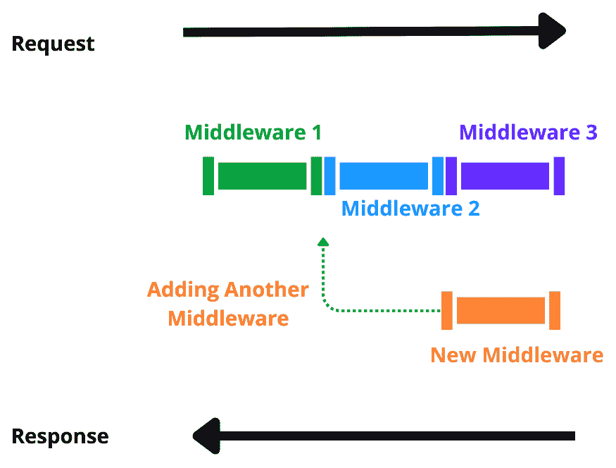
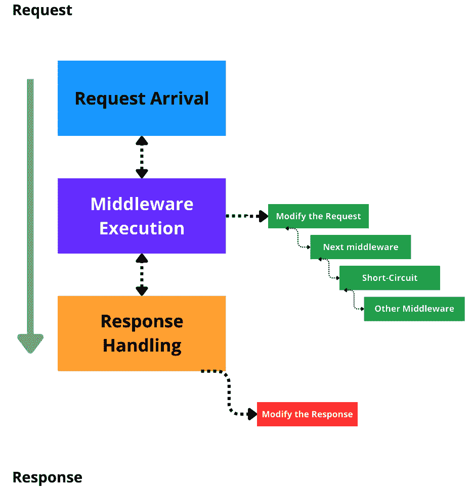

# 8

# 在 ASP.NET Core 9 中使用中间件增强应用程序

ASP.NET Core 9 提供了一个强大且灵活的框架，旨在处理高需求网络应用程序。该框架的关键组件是中间件，它允许开发者直接与请求和响应管道交互。理解和利用中间件可以显著增强应用程序的功能。本章将深入探讨中间件，包括其结构、实现和实际应用，如全局错误处理、请求限制等。

在本章中，我们将重点关注以下主题：

+   了解中间件管道

+   实现自定义中间件

+   使用基于工厂的中间件

+   使用中间件为应用程序添加功能

+   为中间件注册创建扩展方法

在本章中，我们将探讨使用 ASP.NET Core 9 开发应用程序的基本最佳实践，包括正确使用异步机制、HTTP 请求以及通过日志进行应用程序仪表化。

# 技术要求

为了支持本章的学习，以下工具必须存在于您的开发环境中：

+   **Docker**：必须在您的操作系统上安装 Docker 引擎，并运行一个 SQL Server 容器。您可以在 *第五章* 中找到有关 Docker 和 SQL Server 容器的更多详细信息。

+   **Postman**：此工具将用于执行对开发应用程序 API 的请求。

+   **Redis Insight**：此工具用于连接到 Redis 服务器数据库（[`redis.io/insight/`](https://redis.io/insight/)）。

本章中使用的代码示例可以在本书的 GitHub 仓库中找到：[`github.com/PacktPublishing/ASP.NET-Core-9.0-Essentials/tree/main/Chapter08`](https://github.com/PacktPublishing/ASP.NET-Core-9.0-Essentials/tree/main/Chapter08)

# 了解中间件管道

在前面的章节中，我们使用了 ASP.NET Core 9 的几个功能，包括中间件。

中间件是在 ASP.NET Core 9 网络应用程序执行流程中用于处理请求和响应的管道模型，本书中开发的应用程序已经使用了一些来自 .NET 平台的标准中间件，例如 **身份验证**、**授权**、**跨源资源共享**（**CORS**）等。

ASP.NET Core 请求管道由一系列请求委托组成，一个接一个地调用。*图 8* *.1* 展示了这一概念：



图 8.1 – ASP.NET Core 9 中间件管道

使用 **Run**、**Map** 和 **Use** 扩展方法配置请求委托，这些方法通常在 **Program.cs** 文件中配置。

每个扩展方法都有一个用于注册请求委托的模板：

+   **运行**：使用 **app.Run** 方法定义内联中间件，该中间件处理请求并完成响应，如下面的示例代码所示，它实现了内联中间件：

    ```cs
    app.Run(async context =>
    {
      await context.Response.WriteAsync("Hello Inline middleware!");
    });
    ```

+   **映射**：使用 **app.Map** 方法在中间件管道中创建一个分支。在以下代码中，对 **/SomeRoute** 的请求由这个中间件分支处理。分支中的中间件将一条消息写入响应：

    ```cs
    app.Map("/SomeRoute", someRouteApp =>
    {
      someRouteApp.Use(async (context, next) =>
      {
        Console.WriteLine("In SomeRoute middleware");
        await context.Response.WriteAsync("Hello from the SomeRoute middleware!");
      });
    });
    ```

+   **使用**：使用 **app.Use** 方法将中间件添加到管道中。以下代码使用中间件在调用管道中的下一个中间件之前记录请求方法和路径。在下一个中间件完成后，它记录响应状态码：

    ```cs
    app.Use(async (context, next) =>
    {
      // Log the request
      Console.WriteLine($"Request:
        {context.Request.Method}
        {context.Request.Path}");
      await next.Invoke();
      // Log the response
      Console.WriteLine($"Response:
        {context.Response.StatusCode}");
    });
    ```

中间件的使用为应用程序带来持续的好处；我们将更详细地了解不同方法的使用，例如创建中间件类。

现在，让我们了解中间件执行流程是如何工作的。

## 理解中间件流程

当应用程序收到请求时，它会按照注册的顺序通过每个中间件组件，并可以执行以下操作：

+   **处理请求并将其传递给下一个中间件**：这就像接力赛跑，每个运动员将接力棒传给下一位。每个中间件完成其部分工作后，就调用下一个中间件以继续处理请求。

+   **处理请求并中断链，防止其他中间件运行**：想象一下机场的安全检查站。如果安全人员发现问题，他们可能会让你停下来进行额外检查，阻止你继续前进。同样，中间件可能会决定完全处理请求并停止进一步的处理。

+   **在链中向上移动时处理响应**：这就像将包裹通过多个检查阶段。一旦包裹到达最终阶段，它将在返回的每个阶段再次进行检查，确保在交付之前一切正常。

分层方法允许强大且灵活地处理 HTTP 请求和响应。中间件可用于各种任务，例如日志记录、身份验证、错误处理等。

此外，注册中间件的顺序至关重要，因为它定义了请求和响应管道的流程。我们可以在 *图 8.2* 中看到中间件执行流程的表示：



图 8.2 – 中间件执行流程

让我们详细看看流程是如何工作的：

+   **请求到达**：当请求到达服务器时，它进入管道并到达第一个中间件组件

+   **中间件执行**：每个中间件可以执行以下操作：

    +   **修改请求**：中间件可以更改请求的某些方面，例如添加头或更改请求路径

    +   **移动到下一个中间件**：处理完毕后，中间件可以使用`await next`调用管道中的下一个中间件，我们将在*实现自定义* *中间件*部分进行讨论

+   **短路管道**：中间件可能决定不调用下一个中间件，从而有效地提前结束请求处理

+   **响应处理**：当请求达到管道的末端时，响应将按相反的顺序通过中间件组件返回

+   **修改响应**：中间件可以更改响应，例如添加头信息，更改状态码或记录信息

中间件顺序

ASP.NET Core 9 默认提供了一些中间件来处理请求和响应。然而，这些中间件的插入顺序完全改变了应用程序的执行流程，在某些情况下甚至可能导致故障。例如，在中间件授权之前添加中间件身份验证是很重要的；否则，未经认证如何验证授权？

在任何情况下，除了标准中间件外，还有自定义中间件的执行顺序。

要了解更多关于中间件顺序的信息，请参阅以下链接：[`learn.microsoft.com/en-us/aspnet/core/fundamentals/middleware/?view=aspnetcore-9.0#middleware-order`](https://learn.microsoft.com/en-us/aspnet/core/fundamentals/middleware/?view=aspnetcore-9.0#middleware-order)。

通过对中间件执行流程的工作，我们能够为我们的应用程序添加几个强大的可能性，我们将在下一节中学习更多的好处。

## 中间件的好处和最佳实践

中间件在 ASP.NET Core 9 应用程序中扮演着关键角色，提供了一系列有助于提高应用程序的健壮性、可维护性和可扩展性的好处。了解这些好处可以使您有效地利用这一资源，因此让我们更详细地看看这一点：

+   **模块化**：模块化意味着中间件是一个独立的函数单元，可以轻松添加、删除或替换，而不会影响应用程序的其他部分。这种模块化允许开发者创建可重用的中间件组件，这些组件可以在不同的项目或同一项目的不同部分之间共享。

+   **组合**：中间件可以以多种顺序组合，以实现不同的行为。这种组合特性允许您根据应用程序的具体需求定制请求和响应管道。

    假设您有三个中间件组件：一个用于日志记录，一个用于身份验证，一个用于处理错误。您可以按照所需的顺序组合这些中间件组件：

    ```cs
    var builder = WebApplication.CreateBuilder(args);
    var app = builder.Build();
    app.UseMiddleware<ErrorHandlingMiddleware>();
    app.UseMiddleware<AuthenticationMiddleware>();
    app.UseMiddleware<RequestLoggingMiddleware>();
    app.Run(async context =>
    {
        await context.Response.WriteAsync("Hello,
          World!");
    });
    app.Run();
    ```

    如您在前面的代码中所见，`app.UseMiddleware`方法向应用程序添加了处理错误、身份验证和日志记录的中间件。`app.Run`方法仅创建一个标准的请求响应，返回一个**Hello World**消息。

    考虑以下因素很重要：

    +   如果你想重新排列这些中间件组件的顺序，请求的处理方式和错误处理将会不同。

    +   **关注点分离（SoC）**：中间件允许不同关注点之间的清晰分离，使得在管道中定义清晰的执行上下文成为可能，并促进代码库的更清晰、可扩展和可维护。

    +   **可扩展性**：你可以开发自定义中间件来扩展应用程序的功能——例如，通过向请求添加验证功能或在应用程序中全局修改响应。

    假设你需要自定义中间件来验证请求头中的 API 密钥。你可以按照以下方式创建此中间件：

    ```cs
    public class ApiKeyCheckMiddleware
    {
        private readonly RequestDelegate _next;
        private const string API_KEY = "X-API-KEY";
        private const string VALID_API_KEY = "XYZ123";
        public ApiKeyCheckMiddleware(RequestDelegate next)
        {
            _next = next;
        }
        public async Task InvokeAsync(HttpContext context)
        {
            if (!context.Request.Headers
              .TryGetValue(API_KEY,
              out var extractedApiKey) ||
              extractedApiKey != VALID_API_KEY)
            {
                context.Response.StatusCode = 401;
                await context.Response
                  .WriteAsync("Unauthorized");
                return;
            }
            await _next(context);
        }
    }
    ```

    上述代码旨在创建一个自定义中间件，该中间件检查必须包含在请求头中的 API 密钥的存在，其中头键是 **X-API-KEY**，期望的值正好是 **XYZ123**。

    在执行验证时，如果头和值不是请求的一部分，则用户会收到一个带有 HTTP 状态码 **401** 的**未授权**返回消息。

事实上，中间件是一个强大的功能，它允许你更好地控制使用 ASP.NET Core 9 开发的应用程序中的请求和响应流程。

不要担心与前面代码示例相关的细节。我们将在 *实现自定义* *中间件* 部分学习中间件类的结构。

尽管使用中间件的应用程序具有很大的好处，但了解良好的实践很重要；否则，可能成为好处的东西可能会变成一个主要问题。

让我们看看一些最佳实践：

+   **顺序很重要**：中间件组件添加的顺序至关重要，因为它会影响请求和响应的处理方式。

+   **保持简单**：中间件应该只做一件事，并且做好。在中间件中应避免复杂的逻辑。

+   **错误处理**：确保你的中间件组件以与其他应用程序中的类相同的方式处理异常和错误。

+   **性能**：注意中间件对性能的影响，尤其是在高负载场景中。由于它在请求和响应过程中操作，因此在这些阶段避免大量处理，以避免给用户和应用程序造成问题。

+   **重用现有中间件**：尽可能使用内置中间件以减少对自定义实现的依赖。正如我们已经学到的，ASP.NET Core 9 中有一些可用的中间件。

现在我们已经了解了中间件的原则、好处和最佳实践，让我们实现我们的第一个自定义中间件，并了解这种方法的具体细节。

# 实现自定义中间件

自定义中间件允许你封装功能并在应用程序的不同部分重用它。

在 ASP.NET Core 9 中创建自定义中间件涉及几个步骤，例如以下内容：

+   中间件类定义

+   **Invoke**或**InvokeAsync**方法的实现

+   请求管道中的中间件注册

让我们分析以下代码，它代表一个自定义中间件：

```cs
public class BeforeAfterRequestMiddleware
{
  private readonly RequestDelegate _next;
  public BeforeAfterRequestMiddleware(RequestDelegate next)
  {
  _next = next;
  }
  public async Task InvokeAsync(HttpContext context)
  {
    // Logging request information
    Console.WriteLine($"Request:
      {context.Request.Method}
      {context.Request.Path}");
    // Call the next middleware in the pipeline
    await _next(context);
    // Logging response information
    Console.WriteLine($"Response:
      {context.Response.StatusCode}");
  }
}
```

这段自定义中间件代码的目的是在请求的开始和响应中向控制台写入一个字符串。

然而，理解前面代码的结构是很重要的：

+   **RequestDelegate**：这是一个代表管道中下一个中间件的委托。这个委托存储在一个名为**_next**的字段中，用于类的作用域。

+   **构造函数**：类构造函数接收一个**RequestDelegate**类的实例作为参数，代表执行流程中的下一个中间件。

+   **Invoke**或**InvokeAsync**方法：包含处理 HTTP 请求的逻辑。这两种方法之间的区别在于一个是异步执行的，另一个不是。**InvokeAsync**方法接收一个**HttpContext**对象作为参数。**HttpContext**对象允许你访问请求和响应信息。使用**InvokeAsync**方法来提高性能和可伸缩性是一种良好的实践。

+   **await _next(context)**：执行**_next**委托，该委托接收**HttpContext**对象作为参数。在这个例子中，我们只是在传播下一个中间件的执行之前，在请求信息中写入一个字符串，然后在执行中间件之后，再写入一个包含响应信息的字符串。

中间件中的依赖注入（DI）

自定义中间件类必须使用**显式依赖原则**（**EDP**），正如我们在前面的章节中已经学到的，其中类的依赖关系在构造函数中定义。

由于中间件是在应用程序初始化期间构建的，因此无法像在**Controller**类中的每个请求那样注入添加到作用域生命周期的服务。

因此，如果你想在中间件类中使用 DI 控制中可用的任何服务，请将这些服务添加到**InvokeAsync**方法的签名中，该方法可以接受由 DI 解析的附加参数。

之前的代码示例，虽然简单，但展示了中间件的基本结构，需要包含一个**RequestDelegate**字段，一个依赖于**RequestDelegate**实例的构造函数，以及**Invoke**或**InvokeAsync**方法的实现。

为了在应用程序中使用定制中间件，必须通过**Program.cs**文件将其注册到 ASP.NET Core 9 执行管道中：

```cs
var builder = WebApplication.CreateBuilder(args);
var app = builder.Build();
app.UseMiddleware<BeforeAfterRequestMiddleware>();
app.Run(async context =>
{
    await context.Response.WriteAsync("Hello, World!");
});
app.Run();
```

之前的代码已被缩短，以便更容易阅读和学习。为了注册中间件，使用**UseMiddleware**扩展方法，这是一个泛型方法，其中我们定义之前执行的定制中间件作为类型。

在应用程序启动流程中，所有自定义或非自定义中间件都被创建，形成应用程序生命周期的一部分，而不是像作用域服务那样按请求创建。这种行为防止将其他依赖项添加到自定义中间件类的构造函数中，但允许通过 **Invoke** 和 **InvokeAsync** 方法添加带有参数的依赖项。

在中间件中获取 HTTP 上下文对象

作为在 **InvokeAsync** 方法中使用 DI 的替代方案，可以使用 **context.RequestService** 属性（[`learn.microsoft.com/en-us/dotnet/api/microsoft.aspnetcore.http.httpcontext.requestservices?view=aspnetcore-9.0`](https://learn.microsoft.com/en-us/dotnet/api/microsoft.aspnetcore.http.httpcontext.requestservices?view=aspnetcore-9.0)），如下面的代码所示：

**public async Task** **InvokeAsync(HttpContext context)**

**{**

**var logger =** **context.RequestServices**

**.** **GetRequiredService<Ilogger**

**<** **BeforeAfterRequestMiddleware >>();**

**logger.LogInformation($"Request:{context.Request.Method}**

**{** **context.Request.Path}");**

**await _next(context);**

**logger.LogInformation($"Response:**

**{** **context.Response.StatusCode}");**

**}**

然而，这多少降低了代码中依赖项的可见性。

然而，ASP.NET Core 9 提供了一种方法，通过基于工厂的中间件在每次请求的基础上启用自定义中间件的用法，我们将在下一节中讨论。

# 与基于工厂的中间件一起工作

创建自定义中间的另一种方式是使用基于工厂的方法，它通过 DI 提供了更好的性能和灵活性。

这种方法在中间件需要作用域服务时特别有用。

基于工厂的中间件使用 **IMiddleware** 接口，这使得中间件可以通过 **DI** **容器**（**DIC**）被激活。

**IMiddleware** 接口只有一个必须由类实现的 **InvokeAsync** 方法。使用基于工厂的方法的自定义中间件的结构与上一节中学到的传统方法非常相似。

让我们看看一个代码示例：

```cs
public class RequestLimitingMiddleware : IMiddleware
{
  private readonly ILogger
    <RequestLimitingMiddleware> _logger;
  public RequestLimitingMiddleware
    (ILogger<RequestLimitingMiddleware> logger)
  {
    _logger = logger;
  }
  public async Task InvokeAsync(HttpContext context,
    RequestDelegate next)
  {
    // Logic to limit the number of requests
    _logger.LogInformation("Processing request");
    await next(context);
  }
}
```

与基于工厂的方法相比，最大的不同在于在类构造函数中定义依赖项，而不是在 **InvokeAsync** 方法中声明它。在先前的代码示例中，构造函数依赖于一个 **ILogger** 接口。

**InvokeAsync** 方法必须只有两个参数，**HttpContext** 和 **RequestDelegate** 。

现在，让我们通过分析 **Program.cs** 类代码，看看如何使用基于工厂的方法进行自定义中间件注册：

```cs
var builder = WebApplication.CreateBuilder(args);
builder.Services.AddScoped<RequestLimitingMiddleware>();
var app = builder.Build();
app.UseMiddleware<RequestLimitingMiddleware>();
app.Run(async context =>
{
    await context.Response.WriteAsync("Hello, World!");
});
app.Run();
```

中间件注册是通过我们已学过的**app.UseMiddleware**方法完成的。然而，请注意，**RequestLimitingMiddleware**类是通过**builder.Services.AddScoped<RequestLimitingMiddleware>()**代码添加到作用域生命周期的，生命周期由每个请求管理。

服务生命周期

ASP.NET Core 9 提供了不同类型的服务生命周期；你可以在[`learn.microsoft.com/en-us/dotnet/core/extensions/dependency-injection#service-lifetimes`](https://learn.microsoft.com/en-us/dotnet/core/extensions/dependency-injection#service-lifetimes)了解更多信息。

如我们所见，基于工厂的方法允许我们使用 DIC 资源并通过请求来管理中间件的生命周期。

是否使用基于工厂的方法或传统方法，当然取决于应用需求。然而，两者都是强大的解决方案，为我们的应用增添了宝贵的功能。

在下一节中，我们将创建并使用许多应用中常用的中间件。

# 使用中间件为应用添加功能

现在我们已经了解了中间件的功能和可能性，我们将着手实现一些功能，这将使我们的 Web 应用质量得到提升。

创建中间件类没有严格的目录结构或命名空间标准。然而，将类组织到定义良好的命名空间中是一种良好的实践。

对于这个例子，我们将默认在应用项目的根目录下创建一个名为**Middlewares**的文件夹。

在本节中，我们将关注以下中间件：

+   全局错误处理

+   添加请求日志 - 记录请求信息

+   速率限制 - 在你的应用中定义请求限制

包含前面提到的类的项目可在书籍仓库中找到，其链接可在*技术要求*部分找到。

让我们创建一个新的应用。打开终端，在你的选择文件夹中，使用以下命令创建一个项目：

```cs
dotnet new mvc -n CommonMiddlewares
```

然后，在目录的根目录下创建一个名为**Middlewares**的文件夹。

现在，我们将开始创建第一个中间件：全局错误处理。

## 全局错误处理

在应用的执行流程中，可能会出现错误或异常，如果处理不当，可能会给用户带来不便。

在这种情况下，我们必须在代码中处理错误，以防止异常导致应用出现故障。

为了实现这一点，一种良好的实践是使用全局错误处理中间件，它使得能够以集中化的方式管理应用异常流，甚至可以通过在不同的监控工具中添加日志来扩展其功能，这对于错误修正至关重要。

在你之前创建的**Middlewares**文件夹中创建一个名为**ErrorHandlingMiddleware.cs**的文件，并添加以下代码：

```cs
public class ErrorHandlingMiddleware
{
  private readonly RequestDelegate _next;
  public ErrorHandlingMiddleware(RequestDelegate next)
  {
    _next = next;
  }
  public async Task InvokeAsync(HttpContext context)
  {
    try
    {
      await _next(context);
    }
    catch (Exception ex)
    {
      await HandleExceptionAsync(context, ex);
    }
  }
  private Task HandleExceptionAsync(HttpContext context,
    Exception exception)
  {
    context.Response.ContentType = "application/json";
    context.Response.StatusCode = (int)HttpStatusCode
      .InternalServerError;
    return context.Response.WriteAsync(new ErrorDetails()
    {
      StatusCode = context.Response.StatusCode,
      Message = "Internal Server Error from the custom middleware."
    }.ToString());
  }
}
public class ErrorDetails
{
  public int StatusCode { get; set; }
  public string Message { get; set; }
  public override string ToString()
  {
    return JsonSerializer.Serialize(this);
  }
}
```

我们可以在前面的代码中看到中间件的常见结构。这个全局错误处理中间件的功能强大之处在于它在 **InvokeAsync** 方法的主体中使用了 **try** / **catch** 块。

**await _next(context)** 命令在 **try** 块中执行，因此如果应用程序中发生异常，它将被全局处理。异常处理是通过在 **catch** 块中调用的 **HandleExceptionAsync** 方法完成的。

**HandleExceptionAsync** 方法通过将请求响应的 **StatusCode** 属性更改为内部服务器错误，即 **HTTP 状态码 500**，并在请求体中返回一个对象来修改请求响应。此对象由 **ErrorDetails** 类表示，该类具有 **StatusCode** 和 **Message** 属性。

因此，除了保证处理应用程序中的任何异常外，还有一个自定义但通用的返回值，可以适当用于 UI 处理，从而为开发者和应用程序用户提供更好的体验。

ASP.NET Core 9 中的问题详情

ASP.NET Core 9 提供了对问题详情的内建支持，这是一个基于 RFC 7807（https://datatracker.ietf.org/doc/html/rfc7807）的标准化错误响应格式。通过将跟踪 ID 包含在响应中，开发者可以增强调试和错误跟踪。

带有跟踪 ID 的问题详情响应看起来像这样：

**{**

**"** **type": "https://example.com/probs/server-error",**

**"title": "An unexpected** **error occurred.",**

**"** **status": 500,**

**"detail": "The system encountered** **an issue.",**

**"** **instance": "/example-path",**

**"** **traceId": "00-abcdef1234567890abcdef1234567890-1234567890abcdef-01"**

**}**

**ProblemDetails** 类可以与以下实现示例中的中间件一起使用，更改 **ErrorHandlingMiddleware** 类的 **HandleExceptionAsync** 方法：

**private static Task HandleExceptionAsync(HttpContext context,** **Exception exception)**

**{**

**var traceId = Activity.Current?.Id ??** **context.TraceIdentifier;**

**var problemDetails =** **new ProblemDetails**

**{**

**Type = "** **server-error",**

**Title = "An unexpected** **error occurred.",**

**Status =** **StatusCodes.Status500InternalServerError,**

**Detail = “来自自定义中间件的内部服务器错误。”,**

**Instance =** **context.Request.Path**

**};**

**// 在问题详情中包含跟踪 ID。**

**problemDetails.Extensions["traceId"] =** **traceId;**

**context.Response.ContentType = "** **application/problem+json";**

**context.Response.StatusCode =** **StatusCodes.Status500InternalServerError;**

**return context.Response.WriteAsJsonAsync(problemDetails);**

**}**

前面的代码是通过中间件实现的全球错误处理器的自定义。除了使用 **ProblemDetails** 类外，还添加了代码以获取跟踪 ID 值：

**var traceId = Activity.Current?.Id ?? context.TraceIdentifier;**

然后，跟踪 ID 被添加到 `ProblemDetails` 对象的扩展中：

**problemDetails.Extensions["traceId"] = traceId;**

跟踪 ID 是极好的信息，应该成为应用程序日志的一部分，便于关联错误响应以解决问题。

ASP.NET Core 9 还提供了错误处理的替代方案，您可以在以下网址了解更多信息：[`learn.microsoft.com/en-us/aspnet/core/web-api/handle-errors?view=aspnetcore-9.0`](https://learn.microsoft.com/en-us/aspnet/core/web-api/handle-errors?view=aspnetcore-9.0)。

使用全局错误处理为应用程序带来了极大的好处，此外，一些日志记录策略可以在云监控工具、终端或甚至文件中使用，从而便于问题解决。

日志功能可用于其他目的，而不仅仅是处理错误。让我们分析另一种用于记录请求的中间件方法。

## 添加请求日志

每个 Web 应用程序都有持续的通信和请求处理流程，这些流程生成不同类型的信息，以及必须处理的异常。我们在上一节创建全局错误处理中间件时已经考虑了这种情况。

除了处理错误和异常之外，我们还必须记录这些信息，以便能够进行有效的故障排除。然而，在许多情况下，记录应用程序请求和响应流程中处理的信息是必要的。这种方法提供了以下好处：

+   **集中式日志记录**：集中日志记录逻辑，确保所有请求在管道中的单个位置一致地记录。

+   **请求跟踪**：能够跟踪所有请求对于监控应用程序性能、调试问题和理解用户行为非常有用。

+   **安全和审计**：通过记录请求，您可以维护对应用程序访问的审计跟踪，这对于符合安全规范至关重要。

+   **错误诊断**：当出现问题时，日志可以帮助您通过提供导致错误的请求活动的详细历史记录来诊断和排除问题。

+   **性能监控**：记录处理请求所需的时间可以帮助识别性能瓶颈并优化应用程序性能。

+   **灵活性**：中间件可以被配置为仅记录特定类型的请求或响应，从而在日志记录的实现方式上提供灵活性。

让我们看看一个负责将请求数据记录到应用程序中的中间件的示例。为此，在 **Middlewares** 文件夹中创建一个名为 **PerformanceLoggingMiddleware.cs** 的类，并添加以下代码：

```cs
public class PerformanceLoggingMiddleware
{
  private readonly RequestDelegate _next;
  public PerformanceLoggingMiddleware(RequestDelegate next)
  {
    _next = next;
  }
  public async Task InvokeAsync(HttpContext context,
    ILogger<PerformanceLoggingMiddleware> logger)
  {
    var timestamp = Stopwatch.GetTimestamp();
    await _next(context);
    var elapsedMilliseconds = Stopwatch
      .GetElapsedTime(timestamp).TotalMilliseconds;
    logger.LogInformation("Request {Method} {Path}
      took {ElapsedMilliseconds} ms",
      context.Request.Method, context.Request.Path,
      elapsedMilliseconds);
  }
}
```

上述代码旨在记录请求的执行时间。这是一种有趣的测量应用程序限制并允许您改进实现性能的方法。

在分析代码时，我们有以下内容：

+   **依赖注入（DI）**：`InvokeAsync` 方法接受一个 `ILogger<PerformanceLoggingMiddleware>` 参数，该参数由依赖注入提供

+   **日志请求指标**：`InvokeAsync` 方法使用 `ILogger` 实例来记录 HTTP 方法、请求路径以及处理请求所需的时间

+   **收集请求执行时间**：在执行请求之前，使用 `Stopwatch` 对象的 `GetTimestamp()` 静态方法获取初始时间戳

    在通过 `_await _next(context)` 请求委派执行请求之后，使用 `Stopwatch` 对象的 `Stop` 方法来结束计时器。

    然后创建一个包含有关请求的信息的日志，例如方法、路径和从 `Stopwatch` 类的 `GetElapsedTime(timestamp).TotalMilliseconds` 方法中获取的以毫秒为单位的执行时间。

`Stopwatch` 类

.NET 中的 `Stopwatch` 类是由 **System.Diagnostics** 命名空间提供的具有高分辨率的计时器。它用于以极高的精度测量经过的时间，非常适合性能测量和基准测试任务。有关 `Stopwatch` 可用功能的更多信息，请参阅文档：[`learn.microsoft.com/en-us/dotnet/api/system.diagnostics.stopwatch?view=net-9.0`](https://learn.microsoft.com/en-us/dotnet/api/system.diagnostics.stopwatch?view=net-9.0)。

当我们实现如 **PerformanceLoggingMiddleware** 这样的自定义日志时，创建自定义中间件增强了我们应用程序的功能，既帮助了使用优质应用程序的用户体验，也支持了在维护过程、诊断以及应用程序演进方面的团队。

然而，ASP.NET Core 9 提供了一些中间件，能够处理应用程序执行流程的几个其他重要方面，例如速率限制，我们将在下一节中了解这些内容。

## 速率限制

ASP.NET Core 9 中的速率限制中间件是一个强大的功能，对于保护应用程序免受滥用、提高整体性能和可靠性至关重要。此中间件控制客户端在指定时间段内可以向服务器发送的请求数量。

在 ASP.NET Core 9 中使用速率限制中间件是通过在 `Program.cs` 文件中添加配置来完成的。以下是一个逐步指南：

1.  添加所需的 NuGet 包。

1.  在 HTTP 请求管道中注册中间件。

1.  将速率限制中间件添加到管道中。速率限制中间件包含在 **Microsoft.AspNetCore.RateLimiting** 中。

让我们通过以下代码查看在 Razor Pages 类型应用程序中的实现示例：

```cs
using Microsoft.AspNetCore.Builder;
using Microsoft.AspNetCore.Hosting;
using Microsoft.AspNetCore.Http;
using Microsoft.Extensions.DependencyInjection;
using Microsoft.Extensions.Hosting;
using Microsoft.AspNetCore.RateLimiting;
using System.Threading.RateLimiting;
var builder = WebApplication.CreateBuilder(args);
builder.Services.AddRazorPages();
// Configure rate limiting policies
builder.Services.AddRateLimiter(options =>
{
  options.AddPolicy("fixed", context =>
    RateLimitPartition.GetFixedWindowLimiter(new
    RateLimitPartitionKey(context.Request
    .Headers["X-Forwarded-For"].ToString(),
    PartitionKeyKind.ClientIP), partition =>
      new FixedWindowRateLimiterOptions
      {
        PermitLimit = 5,
        Window = TimeSpan.FromMinutes(1),
        QueueProcessingOrder = QueueProcessingOrder
          .OldestFirst,
          QueueLimit = 2
      }));
  options.AddPolicy("sliding", context =>
    RateLimitPartition.GetSlidingWindowLimiter(new
    RateLimitPartitionKey(context.Request
    .Headers["X-Forwarded-For"].ToString(),
    PartitionKeyKind.ClientIP), partition =>
      new SlidingWindowRateLimiterOptions
      {
        PermitLimit = 5,
        Window = TimeSpan.FromMinutes(1),
          SegmentsPerWindow = 3,
        QueueProcessingOrder = QueueProcessingOrder
          .OldestFirst,
          QueueLimit = 2
      }));
  options.AddPolicy("tokenBucket", context =>
    RateLimitPartition.GetTokenBucketLimiter(new
    RateLimitPartitionKey(context.Request
    .Headers["X-Forwarded-For"].ToString(),
    PartitionKeyKind.ClientIP), partition =>
      new TokenBucketRateLimiterOptions
      {
        TokenLimit = 10,
        TokensPerPeriod = 5,
        ReplenishmentPeriod = TimeSpan.FromSeconds(10),
        QueueProcessingOrder = QueueProcessingOrder
          .OldestFirst,
          QueueLimit = 2
      }));
});
var app = builder.Build();
if (app.Environment.IsDevelopment())
{
    app.UseDeveloperExceptionPage();
}
// Use rate limiting middleware
app.UseRateLimiter();
app.MapRazorPages();
app.Run();
```

现在，让我们分析前面代码的重要方面：

+   **builder.Services.AddRateLimiter**：用于定义在此应用程序中将使用的速率限制策略。每个策略使用一个唯一的客户端标识符，添加**X-Forwarded-For** HTTP 头，以对每个客户端 IP 地址实施限制。在之前的代码中，我们配置了三个策略——即以下内容：

    +   **固定窗口**：每分钟限制请求量为 5 个。一旦达到限制，将不允许进一步请求，直到窗口重置。

    +   **滑动窗口**：类似于固定窗口策略，但将窗口划分为多个段，允许每分钟有更分散的请求余量。

    +   **令牌桶**：允许您最多有 10 个令牌（请求）可用，每 10 秒补充 5 个新令牌。如果令牌耗尽，则入站请求将被排队。

+   **app.UseRateLimiter()**：此行将速率限制中间件添加到请求管道中，使配置的速率限制策略生效。与使用**UseMiddleware<>**方法添加中间件的传统方式不同，速率限制有一个专用的扩展方法。我们将在下一节中学习如何创建扩展方法以添加中间件。

速率限制是开发 ASP.NET Core 9 应用程序时应考虑的重要功能，它带来了一些好处，例如以下内容：

+   **过载保护**：防止服务器因过多请求而过载，确保稳定的性能。

+   **公平使用**：确保没有客户端可以垄断服务器资源，促进所有用户的公平访问。

+   **安全性**：通过限制客户端请求的速率，减轻了某些类型的攻击，例如**分布式拒绝服务**（**DDoS**）攻击。

+   **改进的用户体验**：通过防止服务器过载，速率限制有助于保持一致的响应时间和服务可用性。

了解更多关于速率限制中间件

速率限制还具有其他一些功能，可以增强您使用此中间件的战略。请参阅文档以获取更多详细信息：[`learn.microsoft.com/en-us/aspnet/core/performance/rate-limit?view=aspnetcore-9.0`](https://learn.microsoft.com/en-us/aspnet/core/performance/rate-limit?view=aspnetcore-9.0)。

除了速率限制中间件之外，ASP.NET Core 9 还提供了其他不同类型的中间件，这些中间件在多种类型的应用程序中广泛使用，例如身份验证和授权中间件，如*第六章*所述。根据您的应用程序需求，您可以组合中间件的功能，以创建在现代化环境中运行的高效、高质量的解决方案。

ASP.NET Core 9 内置中间件

请参考以下 URL 的文档，分析 ASP.NET Core 9 平台上可用的不同中间件：[`learn.microsoft.com/en-us/aspnet/core/fundamentals/middleware/?view=aspnetcore-9.0#built-in–middleware`](https://learn.microsoft.com/en-us/aspnet/core/fundamentals/middleware/?view=aspnetcore-9.0#built-in-middleware)。

现在我们已经创建了自定义中间件并学习了如何使用 ASP.NET Core 9 中可用的速率限制中间件，是时候学习使用扩展方法注册中间件的良好实践了。

# 为中间件注册创建扩展方法

除了内置到 ASP.NET Core 9 中的中间件，它们有自己的扩展方法用于在 HTTP 管道中进行注册外，每个自定义中间件都必须使用扩展方法进行注册，例如 **UseMiddleware<>**，这在本章的几个代码示例中已经使用过。

然而，向 **Program.cs** 文件添加不同的中间件可能会在应用程序中创建读取和维护这些资源的复杂性。

良好的实践是创建扩展方法，以便集中注册中间件，并从抽象配置这些机制复杂性的好处中受益，同时适当地集中责任。

让我们创建一个扩展方法来集中配置之前创建的中间件。为此，在 **Middlewares** 文件夹中，创建一个名为 **CommonMiddlewareExtension.cs** 的新类。

将以下代码添加到这个类中：

```cs
using Microsoft.AspNetCore.Builder;
using Microsoft.Extensions.DependencyInjection;
using Microsoft.AspNetCore.RateLimiting;
using System.Threading.RateLimiting;
public static class CommonMiddlewareExtensions
{
  public static IServiceCollection AddCustomRateLimiting
    (this IServiceCollection services)
  {
    services.AddRateLimiter(options =>
    {
      options.AddPolicy("fixed", context =>
        RateLimitPartition.GetFixedWindowLimiter(new
        RateLimitPartitionKey(context.Request
        .Headers["X-Forwarded-For"].ToString(),
        PartitionKeyKind.ClientIP), partition =>
          new FixedWindowRateLimiterOptions
          {
            PermitLimit = 5,
            Window = TimeSpan.FromMinutes(1),
            QueueProcessingOrder = QueueProcessingOrder
              .OldestFirst,
              QueueLimit = 2
          }));
      options.AddPolicy("sliding", context =>
        RateLimitPartition.GetSlidingWindowLimiter(new
        RateLimitPartitionKey(context.Request
        .Headers["X-Forwarded-For"].ToString(),
        PartitionKeyKind.ClientIP), partition =>
          new SlidingWindowRateLimiterOptions
          {
            PermitLimit = 5,
            Window = TimeSpan.FromMinutes(1),
            SegmentsPerWindow = 3,
            QueueProcessingOrder = QueueProcessingOrder
              .OldestFirst,
              QueueLimit = 2
            }));
      options.AddPolicy("tokenBucket", context =>
        RateLimitPartition.GetTokenBucketLimiter(new
        RateLimitPartitionKey(context.Request
        .Headers["X-Forwarded-For"].ToString(),
        PartitionKeyKind.ClientIP), partition =>
          new TokenBucketRateLimiterOptions
          {
            TokenLimit = 10,
            TokensPerPeriod = 5,
            ReplenishmentPeriod = TimeSpan.FromSeconds(10),
            QueueProcessingOrder = QueueProcessingOrder
              .OldestFirst,
              QueueLimit = 2
          }));
    });
    return services;
  }
  public static void UseCommonApplicationMiddleware
    (this IApplicationBuilder app)
  {
    builder.UseMiddleware<ErrorHandlingMiddleware>();
    builder.UseMiddleware<PerformanceLoggingMiddleware>();
    app.UseRateLimiter();
  }
}
```

上述代码包含所有速率限制中间件的设置，以及全局错误处理和请求性能测量中间件的使用。

此扩展方法类公开了两个 **AddCustomRateLimiting** 方法，负责添加速率限制策略，以及 **UseCommonApplicationMiddleware** 方法，负责将之前创建的自定义中间件和速率限制中间件添加到 HTTP 管道中。

在创建类之后，我们将修改 **Program.cs** 文件，其代码如下：

```cs
using Microsoft.AspNetCore.Builder;
using Microsoft.AspNetCore.Hosting;
using Microsoft.Extensions.DependencyInjection;
using Microsoft.Extensions.Hosting;
var builder = WebApplication.CreateBuilder(args);
builder.Services.AddRazorPages();
builder.Services.AddCustomRateLimiting();
var app = builder.Build();
if (app.Environment.IsDevelopment())
{
    app.UseDeveloperExceptionPage();
}
// Use custom rate limiting middleware
app.UseCommonApplicationMiddleware();
app.MapRazorPages();
app.Run();
```

如高亮代码所示，**Program.cs** 类使用了之前创建的扩展方法，这使得代码更易于阅读和维护。

扩展方法方法是一种良好的实践，可以将一组配置分组到你的应用程序流程中，以正确地分离责任。

使用这些功能在你的 ASP.NET Core 9 网络应用程序部署流程中，并结合不同的中间件来创建更强大的应用程序。

在本书的下一章中，我们将介绍其他不同的技术，以进一步增加你的 ASP.NET Core 9 应用程序的可能性，例如安全配置管理。

# 摘要

在本章中，我们学习了如何利用中间件的力量来定制 ASP.NET Core 9 应用程序的执行流程，并理解了中间件管道的工作原理。此外，我们还学习了如何实现自定义中间件，与基于工厂的中间件协同工作，并通过与全局错误处理方法、信息日志记录和请求限制设置协同工作来为应用程序添加功能。在下一章中，我们将探讨如何安全地管理应用程序配置。
