# 9

# 管理应用程序设置

在动态的 Web 应用程序世界中，适应不同环境和要求的能力至关重要。ASP.NET Core 9 提供了一个健壮的配置系统，允许开发者有效地管理设置和行为。本章将探讨应用程序设置的重要性，如何使用配置系统来管理它们，以及如何使应用程序在运行时具有适应性。

在本章中，我们将重点关注以下主题：

+   理解**IConfiguration**概念和抽象

+   与配置提供者一起工作

+   了解 Options 模式

+   与动态配置和行为一起工作

ASP.NET Core 9 提供了一个健壮的配置系统，允许开发者有效地管理配置和行为。本章将探讨应用程序配置的重要性，如何使用配置系统来管理它们，以及如何使应用程序在运行时具有适应性。

# 技术要求

为了支持本章的学习，以下工具必须存在于您的开发环境中：

+   **Docker**：必须在您的操作系统上安装 Docker 引擎，并运行一个 SQL Server 容器。您可以在*第五章*中找到有关 Docker 和 SQL Server 容器的更多详细信息。

+   **Postman**：此工具将用于执行对开发应用程序 API 的请求。

+   **Redis Insight**：此工具用于连接到 Redis 服务器数据库（[`redis.io/insight/`](https://redis.io/insight/)）。

您还需要访问 Azure 订阅。

本章中使用的代码示例可以在本书的 GitHub 仓库中找到：[`github.com/PacktPublishing/ASP.NET-Core-9.0-Essentials/tree/main/Chapter09`](https://github.com/PacktPublishing/ASP.NET-Core-9.0-Essentials/tree/main/Chapter09)

# 理解 IConfiguration 概念和抽象

在动态的 Web 应用程序世界中，适应不同环境和要求的能力至关重要，除了在运行在不同云提供商上的应用程序中越来越重要的安全要求之外。

大多数 Web 应用程序都会在文件或类中管理某种类型的配置，以便集中管理整个应用程序流程中使用的参数。随着配置或甚至应用程序行为的每次更改，都必须生成新的软件版本。此外，当与远程团队合作时，维护配置和敏感数据的正确管理至关重要，并且不要将这些参数版本化在应用程序版本控制中。

ASP.NET Core 9 提供了强大的方式来管理应用程序配置，除了启用使用其他功能外，例如，无需生成新版本的软件即可更改应用程序行为。

我们将通过**IConfiguration**接口配置管理的基础知识来开始学习这些资源。

## IConfiguration 接口

ASP.NET Core 9 拥有**IConfiguration**接口，旨在提供一种以统一方式管理应用程序设置和配置的机制，允许访问诸如 JSON 文件、环境变量和参数等不同的配置来源。

在关于**IConfiguration**接口的主要概念中，我们有以下几点：

+   **配置来源**：支持多个配置来源，可以组合和分层。常见的来源包括 JSON 文件（如**appsettings.json**）、环境变量、命令行参数和用户密钥。

+   **分层配置**：配置设置以分层结构组织。这意味着设置可以嵌套到部分中，使得复杂的设置更容易管理。

+   **Options 模式**：Options 模式使用**IConfiguration**将配置设置绑定到强类型对象。

在*第五章*中，我们使用了**appsettings.json**文件来管理与 SQL Server 数据库的连接字符串，并通过**IConfiguration**接口在**Program.cs**类中检索了该配置的值。这种做法带来了以下好处：

+   **灵活性**：**IConfiguration**允许您从多个来源提取配置值，在如何管理不同环境（开发、测试、生产）中的配置方面提供了灵活性

+   **集中管理**：集中配置管理，使得在不分散到整个应用程序的情况下维护和更新设置变得更加容易

+   **环境特定设置**：支持环境特定配置，允许您根据应用程序运行的环境自定义设置

+   **强类型配置**：通过 Options 模式，它支持与强类型类链接的配置设置，提高类型安全并减少错误

以下代码示例演示了在**appsettings.json**文件中定义的配置；然后通过**Program.cs**文件中的**IConfiguration**接口检索此值：

+   以下为**appsettings.json**文件的内容：

    ```cs
    {
      "ConnectionStrings": {
        "DefaultConnection": "Server=myServerAddress;
          Database=myDataBase;User Id=myUsername;
          Password=myPassword;"
      }
    }
    ```

+   以下为**Program.cs**文件的内容：

    ```cs
    var builder = WebApplication.CreateBuilder(args);
    builder.Services.AddRazorPages();
    string connectionString = builder.Configuration
      .GetConnectionString("DefaultConnection");
    builder.Services.AddDbContext<MyDbContext>(options =>
      // options.UseSqlServer(connectionString));
      var app = builder.Build();
    if (app.Environment.IsDevelopment())
    {
        app.UseDeveloperExceptionPage();
    }
    app.UseStaticFiles();
    app.UseRouting();
    app.MapRazorPages();
    app.Run();
    ```

如前代码片段中突出显示的行所示，连接字符串是通过**IConfiguration**接口使用**GetConnectionString**方法从**appsettings.json**文件中获取的，并告知配置名称或键。

由于 **IConfiguration** 生命周期考虑了应用程序生命周期，因此通过诸如 **appsettings.json** 或其他数据源之类的文件获取设置的复杂性都被抽象化，只需使用接口中可用的方法在整个 ASP.NET Core 9 应用程序中获取所需的参数即可。

**IConfiguration** 接口也存在于 **依赖注入容器**（**DIC**）中，允许您在任何将动态解决其依赖关系的应用程序类的构造函数中引用它。

IConfiguration 方法

**IConfiguration** 接口提供了几个扩展方法，这些方法以不同的方式在 ASP.NET Core 9 应用程序中获取配置数据。有关更多详细信息，请参阅以下链接：[`learn.microsoft.com/en-us/dotnet/api/microsoft.extensions.configuration.iconfiguration?view=net-9.0`](https://learn.microsoft.com/en-us/dotnet/api/microsoft.extensions.configuration.iconfiguration?view=net-9.0)。

在 JSON 文件中获取配置的过程是 ASP.NET Core 9 应用程序中使用的标准模型。然而，还有其他管理配置的方法，为此可能性，存在提供程序的概念，我们将在下一节中探讨。

# 与配置提供程序一起工作

配置提供程序允许从各种来源获取配置，例如 JSON 文件、环境变量等。

通过配置提供程序，我们获得了更大的灵活性，并且能够以适当的方式准备我们的应用程序在不同的环境中（如开发、测试或生产）运行，无需在 JSON 文件中实现字符串替换逻辑，这除了带来更高的可靠性和安全性之外。

接下来，我们将了解如何将其他配置提供程序添加到我们的 ASP.NET Core 9 应用程序中。

## 添加配置提供程序

配置提供程序用于从各种来源读取配置数据。这种灵活性允许您以一致和集中的方式管理应用程序的配置设置。

这使得使用数据库甚至云服务等配置源成为可能。

在 ASP.NET Core 9 中，已经集成了某些配置提供程序，例如以下内容：

+   **JSON 配置提供程序**：从类似于 **appsettings.json** 的 JSON 文件中读取配置数据。

+   **环境变量配置提供程序**：从环境变量中读取配置数据。

+   **命令行配置提供程序**：从命令行参数中读取配置数据。

+   **内存配置提供程序**：允许您添加内存中的配置数据，这对于单元测试非常有用。

在本书中实现示例应用程序的过程中，我们一直在 **Program.cs** 文件中使用以下方法：**WebApplication.CreateBuilder(args);**。

此方法创建了一个 **Builder** 对象的实例，它代表一个 Web 应用程序，并允许我们添加诸如服务、中间件和配置等功能。它创建了一个具有一些默认参数的 Web 应用程序构建器，因此无需定义提供程序配置即可从 **appsettings.json** 文件中获取配置数据。

默认构建器设置

**CreateBuilder** 方法定义了将要创建的构建器的一些标准化参数。您可以通过访问以下网址了解这些参数的更多信息：[`learn.microsoft.com/en-us/aspnet/core/fundamentals/host/generic-host?view=aspnetcore-9.0#default-builder-settings`](https://learn.microsoft.com/en-us/aspnet/core/fundamentals/host/generic-host?view=aspnetcore-9.0#default-builder-settings)。

然而，请注意以下来自 **Program.cs** 文件的代码示例，其中显式添加了配置提供程序：

```cs
var builder = WebApplication.CreateBuilder(args);
 // Add configuration from environment variables
builder.Configuration.AddEnvironmentVariables();
// Add configuration from command-line arguments
builder.Configuration.AddCommandLine(args);
var app = builder.Build();
app.Run();
```

上述代码使用了两个扩展方法，**AddEnvironmentVariables** 和 **AddCommandLine**，允许应用程序从不同的提供程序中获取配置。这些扩展方法是 ASP.NET Core 9 应用程序的原生部分。对于其他类型的提供程序，可能需要添加 NuGet 包以访问用于注册提供程序的扩展方法。

内置的 ASP.NET Core 9 配置提供程序

ASP.NET Core 9 提供了多种类型的提供程序，如文档中所示：[`learn.microsoft.com/en-us/aspnet/core/fundamentals/configuration/?view=aspnetcore-9.0#configuration-providers`](https://learn.microsoft.com/en-us/aspnet/core/fundamentals/configuration/?view=aspnetcore-9.0#configuration-providers)。

在 *使用动态配置和行为* 部分，我们将使用提供程序连接到一个允许以动态和安全方式管理配置和行为的云资源。现在，让我们了解一些重要基础，例如创建自定义提供程序。

## 创建自定义配置提供程序

在 ASP.NET Core 9 中创建自定义配置提供程序允许您从框架未原生支持的源加载配置数据。这对于与自定义配置存储、第三方服务或甚至专有格式集成非常有用。

我们已经理解了 ASP.NET Core 9 中原生配置管理；现在，我们将创建我们的第一个自定义提供程序。

要创建一个自定义提供程序，您需要创建两个类：

+   **ConfigurationSource**：**IConfigurationSource** 接口代表配置数据的来源。它负责创建一个 **IConfigurationProvider** 实例，该实例将实际加载数据。将源接口和提供者接口分离，可以明确区分配置数据的来源和加载方式。通过这种方法，我们可以从封装数据源配置和通过 **Factory** 模式实现最佳实践中受益。

+   **ConfigurationProvider**：**ConfigurationProvider** 类是一个实现 **IConfigurationProvider** 的抽象基类。它负责实际加载数据和提供配置数据。这个类允许你定义如何读取、缓存和访问数据。

我们将通过负责创建自定义提供者实例的类开始创建自定义提供者：

```cs
using Microsoft.Extensions.Configuration;
public class CustomConfigurationSource :
  IConfigurationSource
{
  public IConfigurationProvider Build
    (IConfigurationBuilder builder)
    {
    return new CustomConfigurationProvider();
  }
}
```

**IConfigurationSource** 接口只有一个方法，**Build()**，它负责返回一个自定义提供者实例。

尽管这个类很简单，但它允许更好地分离职责，其唯一目标是提供一个提供者实例，该实例将具有与另一个数据源交互所需的所有必要机制。

现在，让我们看看 **CustomConfigurationProvider** 类：

```cs
using Microsoft.Extensions.Configuration;
using System.Collections.Generic;
public class CustomConfigurationProvider :
  ConfigurationProvider
{
  public override void Load()
  {
    var data = new Dictionary<string, string>
    {
      { "MyCustomSetting:Key1", "Value1" },
      { " MyCustomSetting:Key2", "Value2" }
    };
    Data = data;
  }
}
```

在前面的代码中实现的自定义提供者继承自抽象的 **ConfigurationProvider** 类，该类已经有一些实用实现。

对于这个提供者，我们正在创建两个将由 **Dictionary<string, string>** 类型的对象管理的配置，允许我们根据键和值在内存中创建配置。

管理提供信息的逻辑必须通过覆盖从 **ConfigurationProvider** 类继承的 **Load** 方法来实现。

在 **Load** 方法的末尾，有必要设置从 **ConfigurationProvider** 类继承的 **Data** 属性的值。**Data** 属性的数据类型是 **Dictionary<string, string?>**；即表示键值对。设置以字符串格式持久化或序列化。然而，即使有这个功能，也可以创建强类型配置。我们将在 *学习选项* *模式* 部分介绍这种方法。

当然，这是一个简单且具有教育意义的例子。然而，我们可以轻松地将自定义提供者连接到 SQL Server 数据库、存储账户或任何其他持久化资源。在本书的代码仓库中，其链接位于 *技术要求* 部分，你可以分析另一个自定义提供者的版本，其中数据在数据库中持久化。然而，实现原则与之前代码片段中演示的相同。

要使用新的提供者，只需将以下代码添加到 **Program.cs** 文件中：

```cs
builder.Configuration.Add(new CustomConfigurationSource());
```

您还可以使用在*第八章*中学到的扩展方法创建技术。

要通过新的提供者获取设置，只需使用**Configuration**属性方法，例如**GetValue<T>**方法，并将所需的配置重命名，如下面的代码所示：

```cs
string key1 = _configuration.GetValue<string>
  (" MyCustomSetting:Key1");
string key2 = _configuration.GetValue<string>
  (" MyCustomSetting:Key2");
```

如我们所见，创建自定义提供者不会改变 ASP.NET Core 9 中已有的开发模型，带来了更大的灵活性和可能性。

提供者是配置管理的优秀抽象。然而，ASP.NET Core 9 提供了其他类型，例如选项模式，我们将在下一节中讨论，这使得我们应用程序中的配置管理模型更加强大。

# 学习选项模式

ASP.NET Core 9 通过使用选项模式提供了一种处理应用程序配置的好方法。此模式提供了一种强大的机制，以强类型方式管理和访问配置设置，提高代码的可维护性和可测试性，并将配置设置组织到类中。在本节中，我们将了解选项模式是什么以及如何实现它。

## 选项模式是什么？

每个应用程序都必须与某种类型的配置进行交互，在前面的章节中，我们使用了**IConfiguration**接口从**appsettings.json**文件中获取连续信息。然而，这并不是在 ASP.NET Core 9 中与配置交互的唯一方式，它提供了一个选项模式的实现。

选项模式是一种设计模式，它使用类来表示相关配置的组，允许您将来自各种配置源（如 JSON 文件、环境变量等）的配置部分链接到这些类，从而允许访问配置设置、类型安全的配置、利用 IntelliSense 和编译时检查。

在 ASP.NET Core 9 中，选项模式具有以下类层次结构：

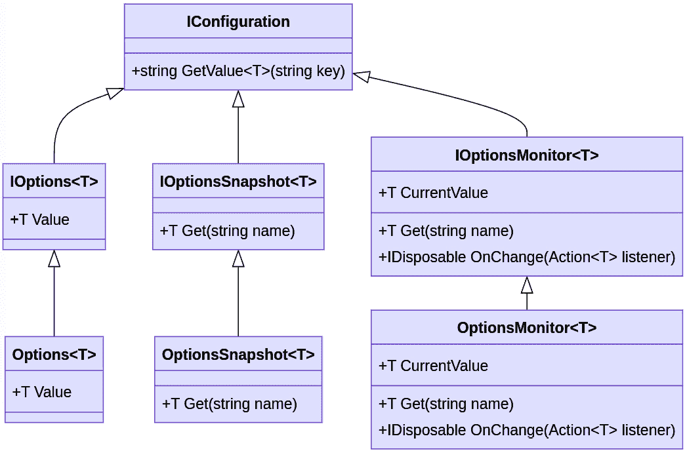

图 9.1 – ASP.NET Core 9 中主选项模式抽象

如*图 9.1*所示，除了它们各自的实现之外，还有几个接口用于抽象选项模式。让我们简要了解*图 9.1*中展示的每个接口的目的：

+   **IOptions<T>**：用于检索配置选项的基本接口。**IOptions<T>**类型注册为单例。然后，当启动应用程序时，配置被加载到内存中，并通过**依赖注入**（**DI**）在整个应用程序中提供。但是，如果对应用程序进行了任何更改，以便它们可以反映出来，则必须重新启动应用程序。

+   **IOptionsSnapshot<T>**：**IOptions<T>**的一个变体，它提供了一种机制，可以在每次请求时更新配置。此接口允许实时更新应用程序设置。此类的生命周期是作用域的；也就是说，配置是在每次请求时加载的。

+   **IOptionsMonitor<T>**：一个接口，允许您监控选项更改，并提供在选项更新时接收通知的方式。此接口的生命周期是单例的，在应用程序初始化时可用。

+   没有带有“**I**”前缀的类代表每个接口的具体实现。

选项模式提供了一个优秀的选项，可以在不调用字符串的情况下操作配置，通过创建强类型配置。

让我们了解选项模式是如何实现的。

## 实现选项模式

如我们在本书的章节中所学，集中管理配置信息是一个好的实践，在这本书中大部分的代码中，我们使用基本的配置，例如数据库连接字符串。

虽然**IConfiguration**接口为我们提供了获取配置的机制，但在某些情况下，这可能会影响每个类的管理和职责，每个类必须确切知道它想要从配置文件中获取的字符串。

有一些做法，例如使用常量；然而，使用强类型类来聚合一组信息可以是一种强大的资源。

让我们想象以下上下文：

想象一个电子商务应用程序，其中我们拥有不同的服务和资源，如支付和运输。这些资源有一套独特的设置。在这个例子中，我们可能会有以下配置：

+   **PaymentGatewayURL**：处理支付的网关的 URL

+   **APIKey**：用于使用支付网关的 API 密钥

+   **Timeout**：超时配置

+   **DefaultCarrier**：交付订单的默认承运人

+   **FreeShippingThreshold**：免费运输阈值设置

在开发电子商务应用程序时，对于每个配置，可能需要使用**IConfiguration**类从**appsettings.json**文件中获取数据，例如。让我们看看以下代码：

```cs
// Accessing settings directly using IConfiguration
string paymentGatewayURL =
  _configuration["PaymentGatewayURL"];
string apiKey = _configuration["APIKey"];
int timeout = _configuration.GetValue<int>("Timeout");
string defaultCarrier = _configuration["DefaultCarrier"];
decimal freeShippingThreshold =
  _configuration.GetValue<decimal>
  ("FreeShippingThreshold");
```

上述设置在**appsettings.json**文件中的表示如下：

```cs
{
   "PaymentGatewayURL": "https://payment.aspnetcore9.com",
   "APIKey": "your-api-key",
   "Timeout": 30
   "DefaultCarrier": "UPS",
   "FreeShippingThreshold": 30.00
}
```

所展示的设置恢复代码实现是正确的。然而，在更复杂的场景中，可能难以管理不同类型的配置；可能会有代码重复，这使得维护变得困难，如果在配置键中存在类型错误，例如，这个问题只有在运行时才会被发现。

幸运的是，通过 ASP.NET Core 9 中选项模式的抽象，我们可以以简单的方式对配置进行分组。

根据前面的例子，我们基本上有两种类型的信息：

+   **PaymentSettings**

+   **PaymentGatewayURL**

+   **APIKey**

+   **Timeout**

+   **ShipmentSettings**

+   **DefaultCarrier**

+   **FreeShippingThreshold**

这样，我们可以将配置分组到两个不同的类中，如图 *图 9.2* 所示：

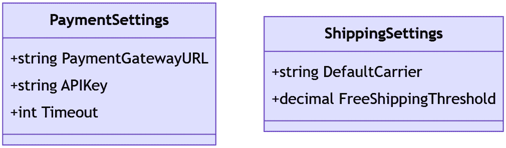

图 9.2 – 分组配置

前面的类仅具有将分别以分组方式引用相应配置的属性。有了这个，我们将有如下代码来定义 **PaymentSettings** 和 **ShipingmentSettings** 类：

```cs
public class PaymentSettings
{
    public string PaymentGatewayURL { get; set; }
    public string APIKey { get; set; }
    public int Timeout { get; set; }
}
public class Shippingettings
{
    public string DefaultCarrier { get; set; }
    public decimal FreeShippingThreshold { get; set; }
}
```

前面的代码中代表的类仅旨在抽象化一组配置，没有实现任何类型的操作行为，但在必要时可能会有方法。

然而，将在 Options 模式中使用的类必须遵循以下规则：

+   非抽象

+   具有公共读写属性

+   绑定时忽略字段

对于这个例子，我们只保留属性。此外，我们还将修改 **appsettings.json** 文件，它将包含以下代码：

```cs
{
     "PaymentSettings": {
      "PaymentGatewayURL":
        "https://payment.aspnetcore9.com",
      "APIKey": "your-api-key",
      "Timeout": 30
    },
    "ShippingSettings": {
      "DefaultCarrier": "UPS",
      "FreeShippingThreshold": 30.00
    }
}
```

我们可以在前面的代码中看到，设置是通过 **PaymentSettings** 和 **ShippingSettings** 分组的，这些名称正好是类的名称，相应的属性也具有相同的名称。

Options 模式使用此约定将设置与将在应用程序中抽象此信息的类绑定。

现在，让我们看看经过修改以使用 Options 模式的 **Program.cs** 文件：

```cs
using Microsoft.Extensions.Configuration;
using Microsoft.Extensions.DependencyInjection;
using Microsoft.Extensions.Hosting;
var builder = WebApplication.CreateBuilder(args);
builder.Services.Configure<PaymentSettings>
  (builder.Configuration.GetSection("PaymentSettings"));
builder.Services.Configure<ShippingSettings>
  (builder.Configuration.GetSection("ShippingSettings"));
builder.Services.AddRazorPages();
builder.Services.AddSingleton<EcommerceService>();
var app = builder.Build();
if (app.Environment.IsDevelopment())
{
    app.UseDeveloperExceptionPage();
}
app.UseStaticFiles();
app.UseRouting();
app.MapRazorPages();
app.Run();
```

如您在前面的代码块中高亮显示的代码行所示，这里使用了来自 **IConfiguration** 接口的 **GetSection** 方法，通过 **Configuration** 扩展方法进行访问。**GetSection** 方法是一个泛型实现，其中输入的类型决定了返回的类型。章节名称作为参数输入，在这个例子中，是期望的配置组。

扩展方法

在前面的代码示例中，为了便于理解，我们直接在 **Program.cs** 文件中使用 Options 模式注册配置类。然而，创建一个用于注册使用 Options 模式的类的扩展方法是一种良好的实践。

当执行这些方法时，设置将被加载到 **PaymentSettings** 或 **ShipmentSettings** 对象中，并且这些对象将作为单例实例化，并在每个应用程序中通过 DIC 可用。

下面的代码示例显示了配置依赖于给定的服务类：

```cs
public class OrderService
{
    private readonly PaymentSettings _paymentSettings;
    private readonly IPaymentGateway _paymentGateway;
    public OrderService(IOptions<PaymentSettings>
      paymentSettings, IPaymentGateway paymentGateway)
    {
        _paymentettings = paymentSettings.Value;
        _paymentGateway = paymentGateway;
    }
    public async Task<IOrder> Pay(decimal ammount)
    {
       var order = _paymentGateway(ammount,
        _paymentSettings.ApiKey,
        _paymentSettings.PaymentGatewayURL);
    // ..
    }
}
```

正如我们在 **OrderService** 实现中注意到的，我们只是注入了 **IOptions** 接口用于 **PaymentSettings** 类型。通过这种方式，依赖关系由 ASP.NET Core 9 DIC 解决。

采用 Options 模式提供了几个好处，例如允许组织配置设置，将它们分组到专用类中，并使用强类型配置。

除了提高维护和实施质量外，在编译时也可以检测到错误。您还可以从使用单元测试中受益，这是一个非常好的实践。

ASP.NET Core 9 中的选项模式是一种强大且灵活的方式来管理配置设置，支持特定环境的配置，并使管理不同部署环境的配置变得更加容易。

现在我们已经学会了如何使用选项模式来正确处理应用程序配置，现在是时候了解如何在云环境中安全地管理这些配置，以及学习如何在我们的应用程序中动态地操作行为。

# 与动态配置和行为一起工作

在不断发展的 Web 应用程序领域，保持灵活性和响应性至关重要。作为开发者，我们必须确保我们的应用程序能够快速且安全地适应变化。动态配置和行为管理是允许我们实现这种灵活性的关键策略。通过动态管理配置，我们可以更新它们而无需重新部署我们的应用程序。此外，通过使用**功能开关**等技术实现应用程序行为管理，我们可以实时控制资源可用性，从而轻松测试、部署或回滚功能。

功能开关

功能开关或功能标志是一种软件开发技术，用于在运行时启用或禁用软件应用程序中的特定功能，通过允许代码更改合并到主代码库而不立即向所有用户暴露新功能，从而促进**持续集成和交付**（**CI/CD**）。这项技术有助于降低风险、进行 A/B 测试、执行金丝雀发布以及在不重新部署代码的情况下回滚功能。

访问以下文章了解更多关于这项技术的信息：[`martinfowler.com/articles/feature-toggles.html`](https://martinfowler.com/articles/feature-toggles.html)

让我们深入了解动态配置管理的细节，并实现一个实际示例。

## 与动态设置一起工作

动态设置指的是在运行时修改应用程序配置的能力，无需重新部署。这种能力对于保持应用程序正常运行、确保对需求变化的快速响应以及通过允许对敏感配置的快速调整来增强安全性至关重要。

现代应用程序必须具备动态配置管理机制，以确保解决方案的质量，以及以下好处：

+   **零停机时间**：在不重新部署应用程序的情况下更新配置，确保持续可用。这是一个重要的功能，使我们能够为用户提供可靠性和更好的体验。

+   **安全性**：快速更新安全设置和凭据以应对威胁。

+   **灵活性**：实时调整设置以适应不断变化的企业需求。

+   **简化部署**：通过将配置更改与代码更改解耦，减少与应用程序部署相关的复杂性和风险。在具有许多环境（如开发、测试和生产）的场景中，应用程序将根据每个环境的资源具有不同的配置。能够抽象管理应用程序配置的能力可以提高质量、分离责任并保持持续交付流程。

在 ASP.NET Core 9 中，有几种选项可以动态管理配置，包括配置文件、环境变量和基于云的服务，如 **Azure App Configuration**。Azure App Configuration 以其强大的功能和与其他 Azure 服务的无缝集成而脱颖而出。

Azure App Configuration 是一种提供集中式管理配置设置和功能标志的服务。它允许应用程序在不重新部署的情况下动态调整其行为。

Azure App Configuration

Azure App Configuration 是 Microsoft Azure 中的一项强大功能，允许我们安全地管理配置和功能开关，支持云原生应用程序的部署。

关于 Azure App Configuration 的更多详细信息，我建议阅读关于该资源的丰富文档：[`learn.microsoft.com/en-us/azure/azure-app-configuration/`](https://learn.microsoft.com/en-us/azure/azure-app-configuration/)。

在本书中，我们不会涵盖设置和使用 Azure App Configuration 的所有细节。目前，我们将使用主要资源来举例说明在我们的应用程序中使用动态配置。

让我们创建一个与 Azure App Configuration 交互并使用本章已学到的某些模式（如 Options 模式）的应用程序。

### 设置 Azure App Configuration

Azure App Configuration 是一种基于云的服务，为应用程序配置提供集中式存储库，实现动态配置管理。

在创建应用程序之前，让我们创建一个 Azure App Configuration 资源。您需要访问 Azure 订阅，如 *技术要求* 部分所述。

在访问 Azure 订阅后，按照以下步骤创建 Azure App Configuration 资源：

1.  导航到 Azure 门户（[`portal.azure.com`](https://portal.azure.com)），在顶部栏的搜索字段中输入 **App Configuration** 并点击图标，如图 *图 9* *.3* 所示：

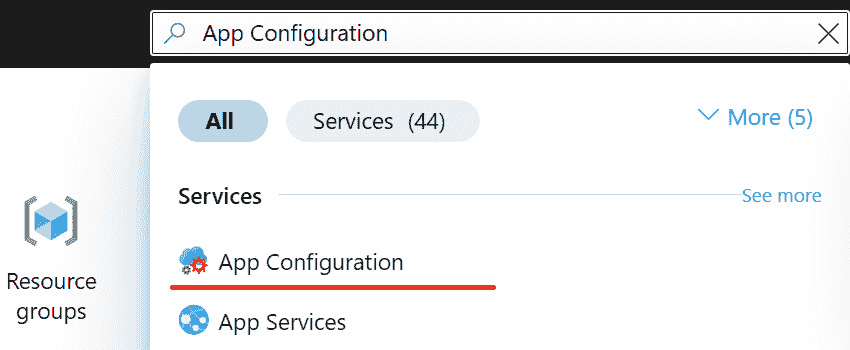

图 9.3 – 访问 App Configuration 服务

1.  在下一屏上，点击 **+ 创建** 选项以添加新资源，如图 *图 9* *.4* 所示：

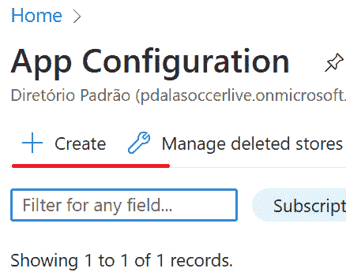

图 9.4 – 创建新的应用配置资源

1.  在下一屏幕上，我们必须配置新资源的参数。我们将保持默认设置。以下参数建议仅供参考：

    +   **资源组**：**rg-aspnetcore8**。务必点击**资源组**字段下方的**创建新**按钮以创建新的资源组。

    +   **位置**：**东** **US 2**

    +   **资源名称**：**<您的** **姓氏>-配置**

    +   **定价层**：**标准**

    +   不勾选**创建副本**选项。

1.  点击**审阅 + 创建**按钮然后点击**创建**按钮，等待资源创建完成。

1.  当你完成创建新资源后，点击**转到资源**按钮，如图*图 9* *.5*所示，或者按照*步骤 1*所述访问**应用配置**列表，然后点击创建的资源：

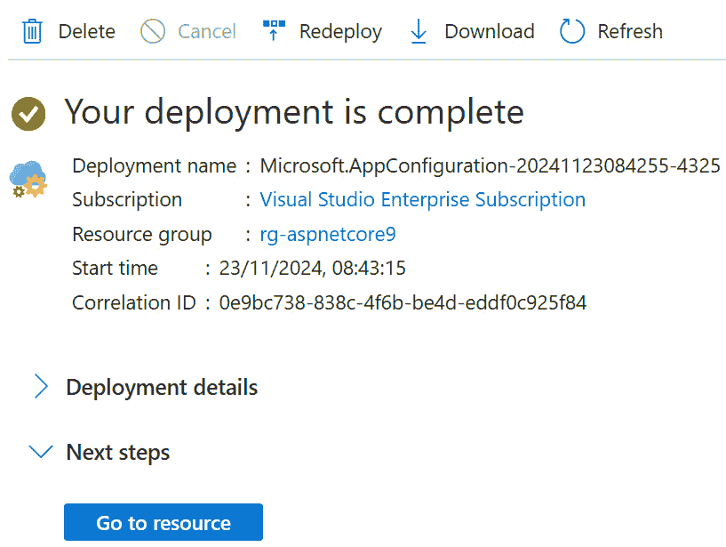

图 9.5 – 新应用配置创建状态

现在我们已经创建了配置管理资源，是时候创建和配置我们的应用程序以与 Azure 应用配置交互了。

#### 在 Azure 应用配置中创建和连接应用程序

在此示例中，将创建一个 ASP.NET Core 9 MVC 应用程序，并将其连接到之前创建的 Azure 应用配置服务。

按照以下步骤操作：

1.  打开终端，并在您选择的文件夹中创建一个名为**DynamicConfiguration**的目录：

    ```cs
    mkdir DynamicConfiguration
    ```

1.  现在，使用以下命令访问目录：

    ```cs
    cd DynamicConfiguration
    ```

1.  运行以下命令以创建应用程序：

    ```cs
    dotnet new mvc -n DynamicConfiguration -o .
    ```

    之前的命令创建了一个名为**DynamicConfiguration**的 MVC 应用程序，使用**-n**参数定义，并在当前目录中，由**–o .**参数确定。

应用程序创建后，我们将简单地准备它以集成到 Azure 应用配置中。为此，在应用程序目录中运行以下命令以打开 Visual Studio Code：

```cs
code .
```

现在，在项目的根目录下创建一个**Options**文件夹，然后创建一个名为**GlobalOptions.cs**的文件。此文件必须包含以下代码：

```cs
namespace DynamicConfiguration.Options;
public class GlobalOptions
{
    public string Title { get; set; }
}
```

**GlobalOptions**类只有一个名为**Title**的属性，它将通过 Azure 应用配置获取。

当应用程序启动时，它会加载我们之前学到的设置，使用诸如**appsettings.json**和环境变量等文件，以及其他可以配置的提供者。然而，对于我们的类，获取配置的细节被 ASP.NET Core 9 抽象化，在这种情况下，无论提供者如何，当使用 Options 模式时，我们将拥有正确的职责分离、可维护性、灵活性和可扩展性。

让我们更改**HomeController**类在**Controllers**文件夹中的代码，并添加之前使用 Options 模式创建的设置。**HomeController**类的代码将如下所示：

```cs
public class HomeController : Controller
{
    private readonly ILogger<HomeController> _logger;
    private readonly GlobalOptions _globalOptions;
    public HomeController(ILogger<HomeController> logger,
      IOptionsSnapshot<GlobalOptions> globalOptions)
    {
        _logger = logger;
        _globalOptions = globalOptions.Value;
    }
    public IActionResult Index()
    {
        ViewData["Title"] = _globalOptions.Title;
        return View();
    }
    public IActionResult Privacy()
    {
        return View();
    }
    [ResponseCache(Duration = 0,
      Location = ResponseCacheLocation.None,
      NoStore = true)]
    public IActionResult Error()
    {
        return View(new ErrorViewModel {
          RequestId = Activity.Current?.Id ??
          HttpContext.TraceIdentifier });
    }
}
```

对类进行了简单的更改。让我们了解每个更改：

+   **GlobalOptions 字段**：为类创建了一个新字段，该字段类型为之前创建的**GlobalOptions**。

+   **构造函数中的更改**：配置将通过 ASP.NET Core 9 依赖注入容器（DIC）注入，这就是为什么我们添加了一个类型为**IOptionsSnapshot<GlobalSettings>**的参数。使用**IOptionsSnapshot<>**接口的目的是允许你动态地获取配置，正如我们在*什么是 Options 模式？*部分中学到的。如果使用其他接口，例如**IOptions<>**，参数将被加载，但不是动态的。

+   **更改 Index 动作**：我们更改**Index**动作，在该动作中，我们使用**_globalOptions**对象的**Title**属性的配置值设置**ViewData**字典中**Title**属性的值。**ViewData["Title"]**字典在**Views/Home/Index.cshtml**文件中使用，用于显示页面标题。

现在，让我们将**Views/Home/Index.cshtml**页面的代码进行更改，以便在页面主体中显示标题：

```cs
<div class="text-center">
<h1 class="display-4">Welcome @ViewData["Title"]</h1>
<p>Learn about <a
  href="https://learn.microsoft.com/aspnet/core">
  building Web apps with ASP.NET Core</a>.</p>
</div>
```

如高亮代码所示，我们只渲染**ViewData["Title"]**字典中包含的值。

应用程序已准备好通过配置渲染数据。现在，是时候将应用程序连接到 Azure App Configuration 了。

首先，在应用程序目录中打开终端，并运行以下命令以添加包含必要 SDK 的 NuGet 包：

```cs
dotnet add package Microsoft.Azure.AppConfiguration.AspNetCore
```

现在，你需要从 Azure App Configuration 获取包含资源的连接字符串。让我们执行以下步骤：

1.  访问 Azure 门户（[`portal.azure.com`](https://portal.azure.com)）。

1.  在门户顶部的搜索字段中，输入**App Configuration**并单击该选项。

1.  然后，在配置资源列表中，单击之前创建的名为**<Your** **Last Name>-configuration**的资源。

1.  在侧边菜单中，查找**访问设置**选项，并复制如*图 9* *.6* 所示的连接字符串：

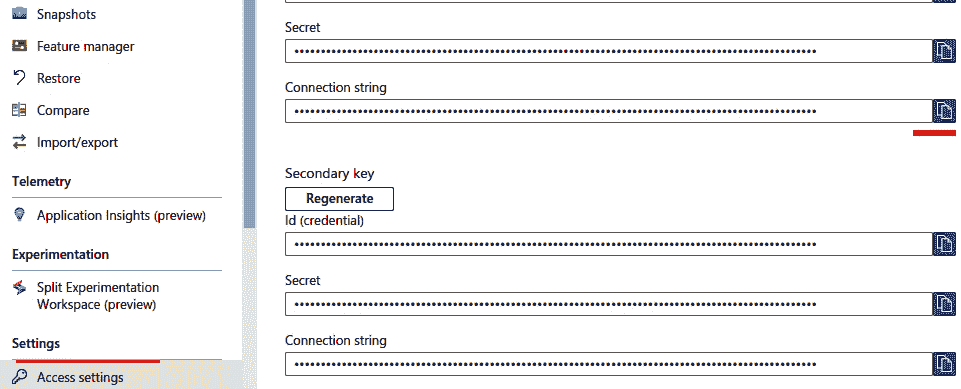

图 9.6 – 从 App Configuration 获取连接字符串

1.  现在，在终端中运行以下命令，在应用程序目录下。该命令使用密钥管理器存储一个名为**ConnectionStrings:AppConfig**的密钥，该密钥存储 App Configuration 存储的连接字符串。将**<your_connection_string>**占位符替换为您的 App Configuration 存储的连接字符串。这是一种良好的做法，可以防止敏感数据，如包含凭据或密码的连接字符串，在版本控制中持久化，从而给应用程序带来漏洞：

    ```cs
    dotnet user-secrets init
    dotnet user-secrets set ConnectionStrings:AppConfig "<your_connection_string>"
    ```

在定义包含 App Configuration 连接字符串的密钥后，我们将修改**Program.cs**文件以添加必要的服务和中间件。让我们看看修改后的**Program.cs**代码：

```cs
using Microsoft.Extensions.Configuration
  .AzureAppConfiguration;
var builder = WebApplication.CreateBuilder(args);
Builder.Services.AddAzureAppConfiguration();
var connectionString = builder.Configuration
  .GetConnectionString("AppConfig");
builder.Configuration.AddAzureAppConfiguration(options =>
  {
    options.Connect(connectionString)
    .Select("DynamicConfiguration:*", LabelFilter.Null)
    .ConfigureRefresh(refreshOptions =>
    refreshOptions.Register("DynamicConfiguration:
      Sentinel", refreshAll: true));
  });
builder.Services.Configure<GlobalOptions>
  (builder.Configuration
  .GetSection("DynamicConfiguration:GlobalOptions"));
builder.Services.AddControllersWithViews();
var app = builder.Build();
if (!app.Environment.IsDevelopment())
{
  app.UseExceptionHandler("/Home/Error");
  app.UseHsts();
}
// Middleware to refresh configuration
app.UseAzureAppConfiguration();
app.UseHttpsRedirection();
app.UseStaticFiles();
app.UseRouting();
app.UseAuthorization();
app.MapControllerRoute(
name: "default",
pattern: "{controller=Home}/{action=Index}/{id?}");
app.Run();
```

App Configuration SDK 具有出色的抽象性，并且易于集成到应用程序中。让我们了解对前面代码所做的更改：

+   **builder.Services.AddAzureAppConfiguration()**：此方法注册了 Azure App Configuration 在您的 ASP.NET Core 9 应用程序中工作所需的服务。

+   **builder.Configuration.GetConnectionString("AppConfig")**：这一行代码获取 Azure 应用程序配置连接字符串，之前从 Azure 门户获取并通过密钥添加到应用程序中。请注意，获取连接字符串与从**appsettings.json**文件获取相同。通过密钥管理配置的主要区别在于，它们仅在本地计算机上保留。

+   **builder.Configuration.AddAzureAppConfiguration**：这个扩展方法将 Azure App Configuration 添加为应用程序的配置提供者。

+   **options.Connect(connectionString)**：使用之前获得的连接字符串连接到 Azure 应用配置实例。

+   **.Select("Dynamic Configuration:*", LabelFilter.Null)**：指定选择所有以**DynamicConfiguration:**前缀开头的键。**LabelFilter.Null**参数表示只检索未标记的配置。

+   **.ConfigureRefresh**：**ConfigureRefresh**方法注册了您想要监控其更改的应用程序配置存储中的键。

+   **refreshOptions.Register("Dynamic Configuration", updateAll: true)**：注册一个哨兵键（**DynamicConfiguration:Sentinel**），它将触发更新。当此键的值发生变化时，所有设置都将更新（**refreshAll: true**）。

+   **builder.Services.Configure<GlobalOptions>(builder.Configuration.GetSection("DynamicConfiguration: GlobalOptions"))**：这一行代码将之前在 Azure App Configuration 中创建的配置与之前创建的**GlobalOptions**类绑定。通过这种方式，可以使用 Options 模式通过依赖注入容器（DIC）获取配置。

+   **UseAzureAppConfiguration**：允许应用程序使用应用程序配置中间件自动更新配置。

总结一下，之前添加到 **Program.cs** 文件中的配置允许应用程序通过连接字符串连接到 Azure App Configuration。

应用配置 SDK 与池化概念一起工作。在这种情况下，在获取配置时，在应用程序的内存中创建一个缓存，以避免不断请求 Azure 服务并优化应用程序的功能。

默认情况下，应用程序查询 Azure App Configuration 以获取更新的时间是 30 秒。可以使用 **refreshOptions.SetCacheExpiration** 方法指定刷新调用时间。还配置了一个 **Sentinel** 参数，负责确定设置是否发生变化。

这很重要，因为它防止 SDK 逐个分析每个配置，并且如果 **Sentinel** 已更改，所有配置都将更新。

现在我们已经了解了 Azure App Configuration 设置的工作原理，让我们在 Azure 门户中创建配置键：

1.  在 Azure 门户（[`portal.azure.com`](https://portal.azure.com)）中，选择之前创建的应用配置资源，选择**配置资源管理器**选项，如图*图 9* *.7* 所示：

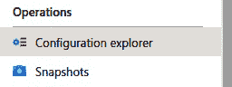

图 9.7 – 访问 Azure App Configuration 的配置资源管理器选项

1.  然后，点击**创建** | **键值**选项，如图*图 9* *.8* 所示：

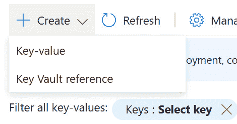

图 9.8 – 在 Azure App Configuration 中添加新的配置

将显示一个表单，我们将输入以下参数：

+   **键**：**DynamicConfiguration:Sentinel**

+   **值**：**1**

1.  将其余参数保留为默认值。

1.  点击**应用**。

1.  重复 *步骤 2* 并添加另一个具有以下配置的键：

    +   **键**：**DynamicConfiguration:GlobalOptions:Title**

    +   **值**：**ASP.NET** **Core 9**

    注意 **DynamicConfiguration:GlobalOptions:Title** 键。此键代表一个遵循 **<Group Settings>:<Section>** 模式的层次结构。在这种情况下，它是之前创建的设置类、配置或配置类的期望属性的名称。

Azure App Configuration 中的标签

Azure 应用配置中的**标签**参数用于根据不同的上下文或环境区分配置设置。

标签允许您根据不同的环境（例如，开发、测试、生产）分离配置。

这种方法带来了以下好处：

**• 灵活性**：轻松地在不同的配置集之间切换

**• 隔离**：保持不同环境或场景的设置隔离和组织

**• 测试**：安全地测试新配置，而不会影响其他环境

没有设置**标签**参数的设置将被视为默认设置。

要了解更多关于标签的信息，请访问以下网址：[`learn.microsoft.com/en-us/azure/azure-app-configuration/howto-labels-aspnet-core`](https://learn.microsoft.com/en-us/azure/azure-app-configuration/howto-labels-aspnet-core)。

现在，应用程序已集成到 Azure App Configuration，打开终端并访问应用程序目录。然后，运行以下命令：

```cs
dotnet run
```

现在，通过以下网址访问您终端上的应用程序 URL：**http://localhost:<port>**。在如图 *图 9* *.9* 所示的示例中，URL 是 **http://localhost:5295**。我们还可以在 *图 9* *.9* 中看到一个带有在 App Configuration 资源中定义的值的欢迎消息：

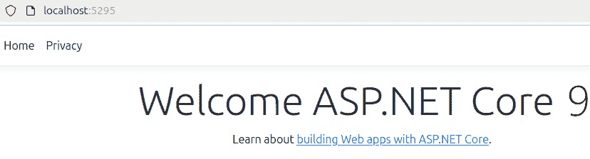

图 9.9 – 应用程序从 Azure App Configuration 获取设置

如我们所见，配置是直接从 Azure 资源加载的。

在应用程序仍在运行的情况下，访问 Azure 门户（[`portal.azure.com`](http://portal.azure.com)）和 Azure App Configuration 资源。

然后，访问 **配置资源管理器**选项。我们将更改设置。

要完成这个操作，在设置显示网格中，点击如图 *图 9* *.10* 所示的三个点（**...**），然后点击 **编辑**：

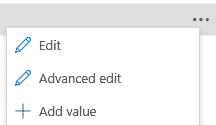

图 9.10 – 编辑配置

提供以下设置：

+   **DynamicConfiguration:GlobalOptions:Title** : **ASP.NET Core 9 With** **Dynamic config**

+   **DynamicConfiguration:Sentinel** : **2**

等待几秒钟，再次访问应用程序，并刷新页面。页面正文消息已更改，如图 *图 9* *.11* 所示：

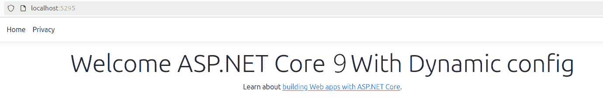

图 9.11 – 应用程序动态获取配置

尽管这是一个简单的实现示例，但使用配置服务器是云原生应用程序中的良好实践，如十二要素应用方法（[`12factor.net`](https://12factor.net)）中建议的，并且 ASP.NET Core 9 提供了几个扩展机制，例如我们在与 Azure 的 App Configuration 功能集成时使用的机制。

在生产环境的大型应用程序场景中，这种方法可以通过对某些更改提供即时响应来带来几个好处。

十二要素应用方法

十二要素应用方法是一种在创建 **SaaS**（**软件即服务**）应用时作为参考的方法，它有 12 个因素，与技术无关，提供了开发云原生解决方案的最佳实践。其中一个因素与配置管理相关，与我们本章所学的内容相关，您可以通过以下网址了解更多关于这个因素的信息：[`12factor.net/config`](https://12factor.net/config)。

在服务器上管理配置，如 Azure 应用配置，带来了许多好处，其中最重要的是安全性。与 ASP.NET Core 9 应用程序的轻松集成使我们能够允许我们的应用程序动态更改设置，甚至根据环境进行隔离。这种方法在 CI/CD 流程中非常重要。我们将在第十章中更多地讨论 CI/CD。

除了提高用户体验等好处外，另一种可以为我们带来更大容量并改进应用程序的方法是实时行为管理，我们将在下一节中了解。

## 将 ASP.NET Core 9 应用程序连接到 Azure 应用配置

一定在某个时刻，你已经使用过一种动态更改应用程序行为的机制。想象一下，例如，你安装了一个允许用户发送视频、照片和音频的消息应用程序的场景。

当你收到消息时，这些媒体会自动下载，这需要在你的智能手机上消耗数据。通常，我们首先采取的行动将是禁用自动媒体下载选项。此设置位于设置菜单中；然而，此设置会实时完全改变应用程序的行为方式。

上述示例是实时更改应用程序行为的一个简单概念。同样，在某个时刻，Web 应用程序可能对其行为进行动态管理，并且其使用带来了以下好处：

+   **受控发布**：逐步向用户子集发布功能，以监控性能和用户反馈

+   **A/B 测试**：通过为不同用户组轮换功能来开展实验，以确定最佳方法

+   **即时回滚**：如果功能出现问题，可以快速禁用它，而无需重新部署应用程序

允许在实时更改应用程序行为的技巧被称为功能开关或功能标志。

功能开关，也称为功能标志，是一种软件开发技术，允许你在不部署新代码的情况下，在应用程序运行时启用或禁用功能，从而为更好的风险管理提供灵活性，并改进部署过程，使团队能够向特定用户或环境释放资源，并提高整体开发和运营效率。

在编码方面，功能开关可以表示如图 9.12 所示：

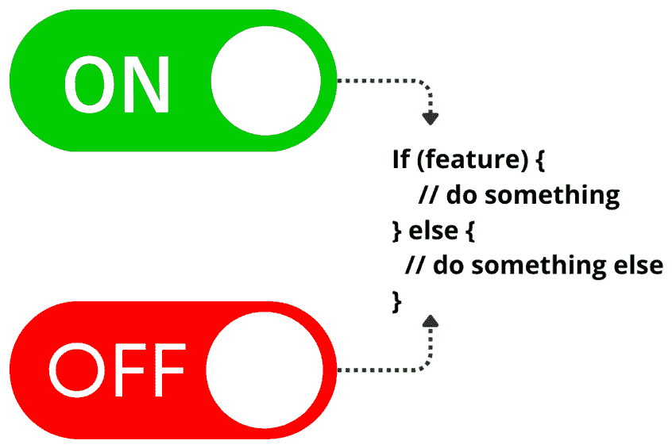

图 9.12 – 功能开关概念表示

如我们在 *图 9* *.12* 中所见，功能切换基本上是应用程序源代码中的一个决策点。这个决策点检查一个称为切换的特定值是否被激活。要检查切换是否被激活，我们可以通过配置文件、环境变量，甚至远程服务器（这是最推荐的方式）来获取这个值。

单一职责原则

在 ASP.NET Core 9 中实现功能切换应遵循最佳实践，以使您的代码更干净、更容易维护和更易于扩展。在使用功能切换时，将多个行为合并到一个类中，例如处理不同的功能或在一个服务中切换新旧逻辑，是不良的做法。一种好的做法是遵循**单一职责原则**（**SRP**），这意味着每个类应该只处理一个职责或功能。通过保持每个类专注于一项任务，您可以减少复杂性并使应用程序更容易维护和扩展。

此外，在 ASP.NET Core 9 中使用依赖注入（DI）的工厂方法允许您根据功能切换轻松地交换不同的实现，而不会破坏 SRP。如果您需要添加新功能，您可以简单地为该功能创建一个新类，隔离现有逻辑。要了解更多关于 SRP 的信息，请访问以下网址：[`learn.microsoft.com/en-us/dotnet/architecture/modern-web-apps-azure/architectural-principles#single-responsibility`](https://learn.microsoft.com/en-us/dotnet/architecture/modern-web-apps-azure/architectural-principles#single-responsibility)。

关于功能切换技术及其相应的好处，不仅限于开发团队，还包括管理和复杂性方面，超出了本书的范围。

我们已经掌握了使用这项技术的基本知识，现在，是时候在 ASP.NET Core 9 应用程序中使用它了。

### 使用 Azure App Configuration 管理功能切换

在上一个主题中，我们使用了 Azure App Configuration 功能进行配置管理；然而，这项服务还包括功能标志，您可以使用它来启用或禁用功能。通过 Azure 门户中的 UI，我们可以创建和管理我们应用程序的功能标志。

让我们对之前创建的 **DynamicConfiguration** 项目代码进行一些修改，并添加功能切换：

1.  打开终端并转到应用程序目录。然后，运行以下命令：

    ```cs
    dotnet add package Microsoft.Azure.AppConfiguration.AspNetCore
    dotnet add package Microsoft.FeatureManagement.AspNetCore
    ```

1.  这些包是必要的，以将管理应用程序切换的 SDK 集成到应用程序中。

1.  在 Visual Studio Code 中打开应用程序，然后我们将编辑 **Program.cs** 文件，该文件将包含以下更新后的代码：

    ```cs
    using DynamicConfiguration.Options;
    using Microsoft.Extensions.Configuration
      .AzureAppConfiguration;
    using Microsoft.FeatureManagement;
    var builder = WebApplication.CreateBuilder(args);
    builder.Services.AddAzureAppConfiguration();
    builder.Services.AddFeatureManagement();
    var connectionString = builder.Configuration
      .GetConnectionString("AppConfig");
    builder.Configuration
      .AddAzureAppConfiguration(options =>
    {
      options.Connect(connectionString)
      .Select("DynamicConfiguration:*", LabelFilter.Null)
      .ConfigureRefresh(refreshOptions => refreshOptions
      .Register("DynamicConfiguration:Sentinel",
        refreshAll: true))
      .UseFeatureFlags(featureFlagsOptions =>
      {
        featureFlagsOptions.CacheExpirationInterval =
        TimeSpan.FromSeconds(5);
      });
    });
    builder.Services.Configure<GlobalOptions>
      (builder.Configuration.GetSection(
        "DynamicConfiguration:GlobalOptions"));
    builder.Services.AddControllersWithViews();
    var app = builder.Build();
    if (!app.Environment.IsDevelopment())
    {
      app.UseExceptionHandler("/Home/Error");
      app.UseHsts();
    }
    // Middleware to refresh configuration
    app.UseAzureAppConfiguration();
    app.UseHttpsRedirection();
    app.UseStaticFiles();
    app.UseRouting();
    app.UseAuthorization();
    app.MapControllerRoute(
    name: "default",
    pattern: "{controller=Home}/{action=Index}/{id?}");
    app.Run();
    ```

    基本上，我们对 **Program.cs** 文件进行了三项更改：

    +   **using Microsoft.FeatureManagement**：添加添加 SDK 的切换管理功能的必要命名空间。

    +   **builder.Services.AddFeatureManagement()**：向应用程序的依赖注入容器中添加服务。

    +   **.UseFeatureFlags**：我们更改了与 Azure App Configuration 的连接设置，告知我们将使用切换管理功能。此外，使用**featureFlagsOptions.CacheExpirationInterval**标准定义了 5 秒的缓存。

作为 Azure App Configuration SDK 的一部分，我们可以直接在控制器或服务的代码中使用切换，使用**IFeatureManager**接口、**FeatureGate**属性或直接在视图中使用**标签助手**。对于此示例，我们将使用标签助手。

使用 IFeatureManagement 和 FeatureGate 属性

在某些情况下，我们可以通过**IFeatureManagement**接口分析切换是否已激活，该接口注入到类中，并提供测试值的方法，如下所示：

**public class MyController :** **Controller**

**{**

**private readonly** **IFeatureManager _featureManager;**

**public** **MyController(IFeatureManager featureManager)**

**{**

**_featureManager =** **featureManager;**

**}**

**private async** **Task MyMethod()**

**{**

**if (await** **_featureManager**

**.** **IsEnableAsync("FeatureToggleName"))**

**{**

**Console.WriteLine("New Approach");**

**}**

**else**

**{**

**Console.WriteLine("Legacy Approach");**

**}**

**}**

**}**

以同样的方式，可以通过**FeatureGate**属性注释操作或控制器：

**using Microsoft.FeatureManagement.Mvc;**

**[** **FeatureGate("FeatureToggleName)]**

**public class MyController :** **Controller**

**{**

**// ....**

**}**

这样，就可以从使用具有不同实现但相同概念的切换管理中受益。

让我们将应用程序更改为使用标签助手，该助手将使用功能切换。按照以下步骤操作：

1.  在 Visual Studio Code 中，编辑**视图/_ViewImports.cshtml**文件，并在现有代码下方添加以下代码：

    ```cs
    @addTagHelper *, Microsoft.FeatureManagement
      .AspNetCore
    ```

    此代码添加了来自 Azure App Configuration SDK 的标签助手。

1.  然后，打开**视图/首页/Index.cstml**文件，并使用以下代码：

    ```cs
    <div class="text-center">
    <h1 class="display-4">Welcome @ViewData["Title"]</h1>
    <p>Learn about <a
      href="https://learn.microsoft.com/aspnet/core">
      building Web apps with ASP.NET Core</a>.</p>
    </div>
    <feature name="NewFeature">
    <div style="background-color: silver;
      border: dotted 1px #000000">
    <h3>New Feature using Toggles and
      the Azure App Configuration</h3>
    </div>
    </feature>
    ```

    注意功能标签的使用，它将基本上获取有关切换是否启用的信息。如果是，新的**div**标签将显示在屏幕上。

    现在应用程序中已经配置了一切，让我们在 Azure App Configuration 中添加功能切换。

1.  打开 Azure 门户（[`portal.azure.com`](https://portal.azure.com)）并访问上一节中创建的应用配置资源。

1.  然后，点击**功能管理器**菜单，**创建** | **功能标志**，如图*图 9* *.13* 所示：

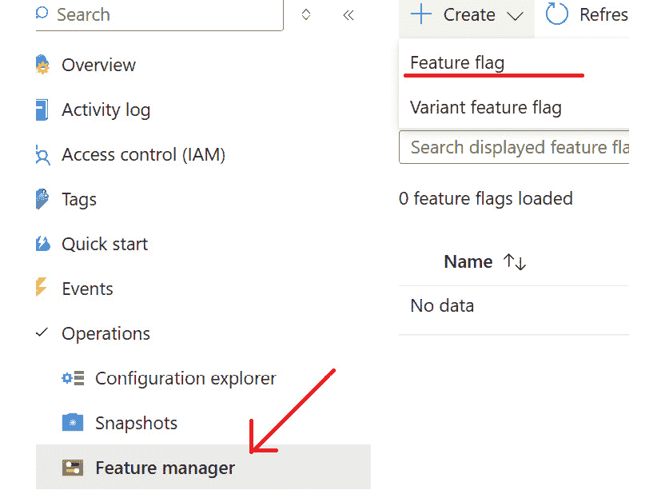

图 9.13 – 添加新的功能标志

1.  在下一屏幕上，将**新功能标志**字段设置为**NewFeature**值，其余保持默认值。

1.  点击**应用**按钮。

    将创建一个新的功能标志并将其禁用，如图*图 9.14*所示：

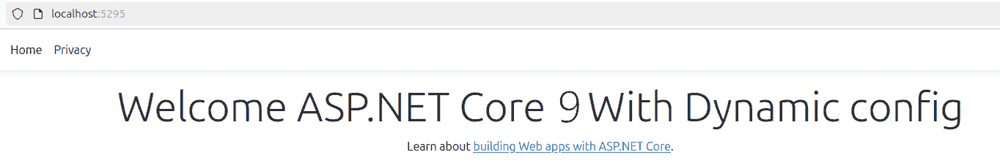

图 9.14 – 使用禁用功能标志的应用程序

我们故意这样做配置。现在，再次使用**dotnet run**命令运行应用程序，通过应用程序目录中的终端执行，你会看到应用程序没有变化。新**Div**标签没有显示的原因是我们将切换创建为**Enabled=false**。

1.  保持应用程序运行，再次访问 Azure 门户，通过在网格中点击**启用**列来启用切换，如图*图 9.15*所示：

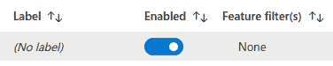

图 9.15 – 启用功能标志

1.  再次访问应用程序，我们可以在*图 9.16*中看到页面上已添加了一个新的 HTML 元素：

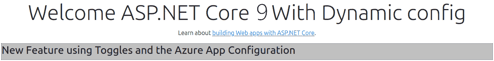

图 9.16 – 应用程序在运行时行为改变

通过理解和实现动态配置和功能切换，我们可以创建健壮、灵活和响应式的 ASP.NET Core 9 应用程序。

在本章中，我们已使用 Azure App Configuration 作为功能标志管理器。然而，ASP.NET Core 9 与本章学习的技术相同，与其他类型的切换管理服务器有集成。

配置管理技术和功能标志的组合对于不同的应用程序上下文非常强大，主要是在通过自动化机制持续交付价值的情况下与云资源交互。

我们将在下一章讨论如何使用自动化流程在云环境中托管我们的应用程序。

# 摘要

在本章中，我们深入探讨了通过理解 IConfiguration 接口的概念和抽象来管理应用程序配置的良好实践。我们还与 ASP.NET Core 9 配置提供程序相关的概念一起工作，以及实现选项模式。最后，我们使用 Microsoft Azure 的 Azure App Configurator 实时更改应用程序配置和行为，以实现功能标志或功能切换的概念。与云资源一起工作是软件工程师的重要前提，在下一章中，我们将探讨如何在云环境中部署应用程序。

# 第四部分：托管、部署和准备云环境

现代应用是动态的，作为软件工程师，我们的工作并不仅仅在同步最新开发的代码后结束。在市场不断变化的场景中，应用需要足够动态，以满足不断的市场需求。因此，开发团队必须适应围绕现代开发模型的新主题。ASP.NET Core 9 准备提供适合云环境的高质量解决方案。在本部分，我们将通过理解和实施在云环境中支持自动化管道（如**持续集成**（**CI**）和**持续交付**（**CD**））的应用发布流程，了解涉及解决方案持续交付的各个方面。我们将了解云原生思维是什么，以及如何将我们的解决方案引导至不断变化的市场。

本部分包含以下章节：

+   *第十章* ，*部署和托管应用*

+   *第十一章* ，*使用* *ASP.NET Core 9* *进行云原生开发*
